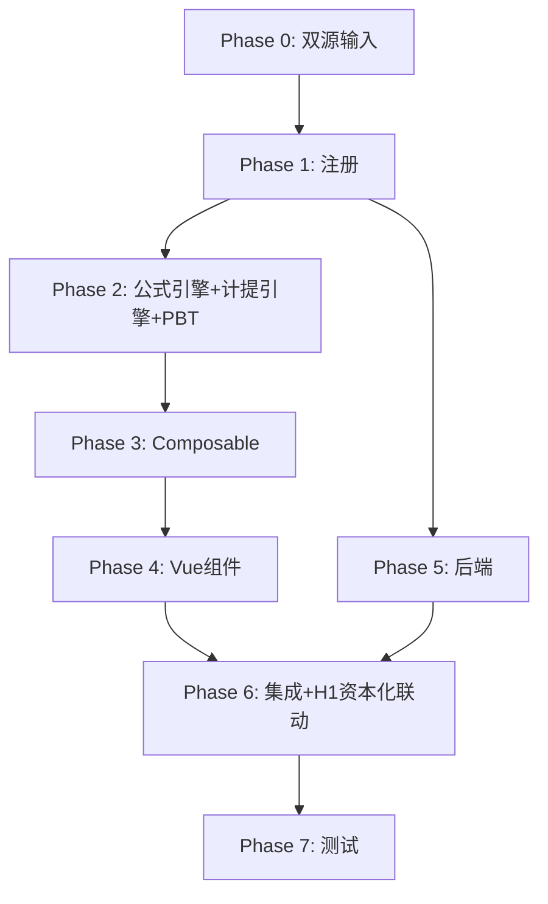

# Implementation Plan: M7 专项储备底稿专属HTML精美组件

## Overview

M7专项储备底稿专属组件`m7-special-reserve`（9 sheet/1 xlsx/~90+公式）。

主入口 GtM7SpecialReserve.vue（sheetName v-if，lazy）+ 8个子组件 + 10个composable + 后端3个py文件。

科目：4201专项储备（贷方/权益类）
公式特征：**权益类贷方**期末=期初+贷方-借方；安全生产费按产量/收入分档计提；资本化支出联动H1

## Tasks

### Phase 0: 双源输入验证

- [ ] 0.1 openpyxl脚本读取M7专项储备.xlsx全部9 sheet
  - 提取结构 + 确认审定表M7-1（66公式）+明细M7-2（24×27，22公式）+计提测试M7-4（37×19，9公式）
  - 产出：m7_structure_summary.json
  - _Requirements: 双源输入流程_

- [ ] 0.2 M股东权益循环底稿模板库md交叉验证
  - 核对：权益类方向/安全生产费计提/资本化vs费用化/H1联动
  - 产出：m7_conflict_resolution.md
  - _Requirements: 双源输入流程_

### Phase 1: 注册+契约测试

- [ ] 1.1 注册componentType和映射
  - wp_code_overrides: M7/M7-1~M7-5/M7A → 'm7-special-reserve'
  - VALID_COMPONENT_TYPES + htmlRendererRegistry注册
  - 创建 GtM7SpecialReserve.vue 骨架（sheetName v-if + selfLoad）
  - _Requirements: 1.1-1.11_

- [ ] 1.2 编写注册契约测试
  - htmlRendererRegistry / VALID_COMPONENT_TYPES / wp_code_overrides / RENDERER_DISPATCH
  - _Requirements: 1.6, 1.7, 1.8_

### Phase 2: 公式引擎+计提引擎+PBT

- [ ] 2.1 创建 `useM7FormulaEngine.ts`（权益类！）
  - calcAuditedAmount / calcEquityEndBalance(b,cr,dr)=b+cr-dr / calcSubtotal
  - _Requirements: 2.3-2.4, 7.4_

- [ ] 2.2 创建 `useM7AccrualEngine.ts`
  - calcAccrualByOutput / calcAccrualByRevenue / calcAccrualDiff
  - _Requirements: 4.2-4.4, 7.1-7.3_

- [ ]* 2.3 编写 Property P1 PBT：审定数公式链
  - 断言：calcAuditedAmount(u, a, r) === u + a + r
  - **Feature: m7-special-reserve, Property P1: 审定数公式链**

- [ ]* 2.4 编写 Property P2 PBT：权益类期末（贷方！）
  - 生成器：fc.float({min:0, max:1e9}) × 3
  - 断言：calcEquityEndBalance(b, cr, dr) === b + cr - dr
  - **Feature: m7-special-reserve, Property P2: 权益类贷方期末余额**

- [ ]* 2.5 编写 Property P3 PBT：按产量分档计提
  - 断言：calcAccrualByOutput(tiers) === Σ(output×rate)
  - **Feature: m7-special-reserve, Property P3: 安全生产费按产量计提**

- [ ]* 2.6 编写 Property P4 PBT：按收入计提
  - 断言：calcAccrualByRevenue(rev, rate) === rev × rate
  - **Feature: m7-special-reserve, Property P4: 安全生产费按收入计提**

- [ ]* 2.7 编写 Property P5 PBT：计提差异
  - 断言：calcAccrualDiff(est, booked) === est - booked
  - **Feature: m7-special-reserve, Property P5: 计提差异**

- [ ]* 2.8 编写 Property P6 PBT：小计求和
  - 断言：calcSubtotal(arr) === Σarr
  - **Feature: m7-special-reserve, Property P6: 分类小计**

### Phase 3: Composable层

- [ ] 3.1 创建 useM7FormData.ts
  - selfLoad + checklist_responses + writebackTB(4201)
  - _Requirements: 1.9, 1.10, 2.6_

- [ ] 3.2 创建 useM7CrossSheet.ts
  - adjudicationVsDetail / 资本化支出→H1联动
  - _Requirements: 2.5, 5.1_

- [ ] 3.3 创建 useM7DualMode.ts + useM7ImportExport.ts
  - _Requirements: 7.5, 7.6_

- [ ] 3.4 创建 sheet-specific composables
  - useM7Adjudication / useM7Detail / useM7AccrualTest / useM7Adjustment
  - _Requirements: 2~6 全部_

### Phase 4: Vue子组件

- [ ] 4.1 创建 M7TabIndex.vue 底稿目录
  - _Requirements: 1.2_

- [ ] 4.2 创建 M7TabAdjudication.vue 审定表M7-1
  - 权益类单区块+计提/使用+TB回写
  - _Requirements: 2.1-2.7_

- [ ] 4.3 创建 M7TabDetail.vue 明细表M7-2
  - 27列区段Tab(计提/费用化/资本化)+22公式+动态行+导入导出
  - _Requirements: 3.1-3.5_

- [ ] 4.4 创建 M7TabAccrualTest.vue 计提测试M7-4
  - 安全生产费按产量/收入计提测试+9公式
  - _Requirements: 4.1-4.6_

- [ ] 4.5 创建 M7TabExpenditureCheck.vue 支出检查M7-5
  - 资本化/费用化区分+结论区+AI辅助
  - _Requirements: 5.1-5.3_

- [ ] 4.6 创建 M7TabAdjustment.vue + M7TabDisclosureListed/Soe.vue
  - 调整借贷平衡 + 附注上市/国企切换
  - _Requirements: 6.1-6.3_

### Phase 5: 后端

- [ ] 5.1 创建 m7_special_reserve_renderer.py
  - RENDERER_DISPATCH注册 + 权益类公式验证
  - _Requirements: 1.6_

- [ ] 5.2 创建 m7_special_reserve.py 路由
  - 导出模板/导出数据/导入数据 + 计提测试API
  - _Requirements: 7.6_

- [ ] 5.3 创建 m7_special_reserve_service.py
  - 安全生产费计提测试+汇总
  - _Requirements: 4.2-4.3_

### Phase 6: 集成

- [ ] 6.1 EventBus集成
  - publish 'substantive:adjudicated' / 'adjustment:created' + 附注刷新
  - _Requirements: 2.6_

- [ ] 6.2 跨底稿联动
  - M7资本化支出 → H1固定资产（cross_wp_ref + GtIndexChip）
  - M7审定 → TB回写(4201)
  - _Requirements: 5.1_

- [ ] 6.3 版本链+复核对话集成
  - useVersionTrail(autoSnapshot) + provide openReviewDialog
  - _Requirements: 7.7_

### Phase 7: 测试

- [ ] 7.1 单元测试：useM7FormulaEngine + useM7AccrualEngine
  - 权益类方向 + 按产量/收入计提 + 计提差异
  - _Requirements: P1-P6_

- [ ] 7.2 集成测试：计提测试 + 资本化→H1
  - _Requirements: 4.1-4.6, 5.1_

- [ ] 7.3 Playwright E2E
  - 完整流程：打开M7→审定→明细→计提测试→支出检查→保存
  - _Requirements: 全部_

## Task Dependency Graph

