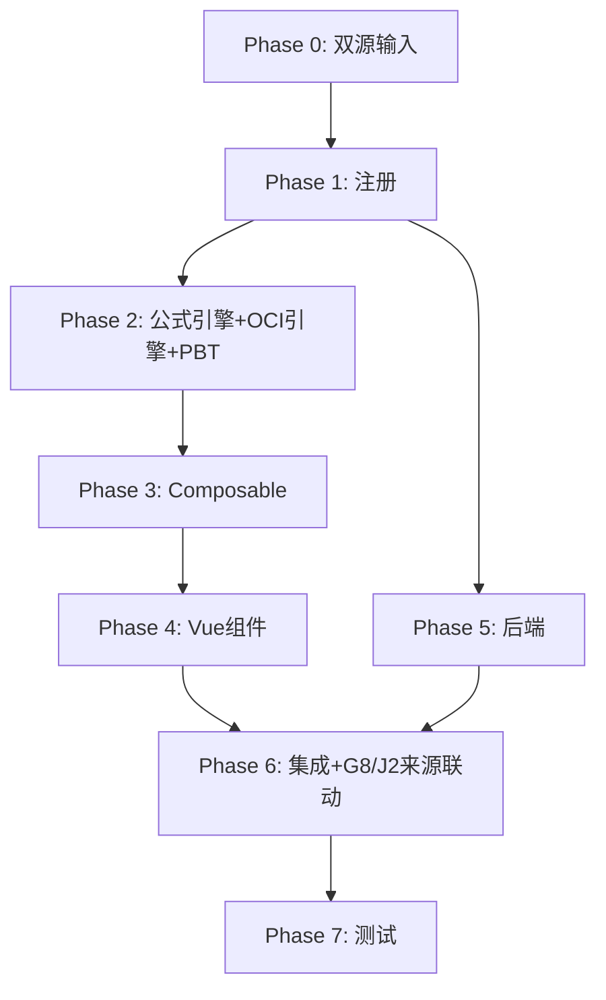

# Implementation Plan: M9 其他综合收益底稿专属HTML精美组件

## Overview

M9其他综合收益底稿专属组件`m9-other-comprehensive-income`（9 sheet/1 xlsx/~80+公式）。

主入口 GtM9OtherComprehensiveIncome.vue（sheetName v-if，lazy）+ 7个子组件 + 10个composable + 后端3个py文件。

科目：4103其他综合收益（贷方/权益类）
公式特征：**权益类贷方**期末=期初+贷方-借方；OCI税后净额；多来源核对（接收G8公允变动+J2重计量+外币折算）

## Tasks

### Phase 0: 双源输入验证

- [ ] 0.1 openpyxl脚本读取M9其他综合收益.xlsx全部9 sheet
  - 提取结构 + 确认审定表M9-1（41公式）+明细M9-2（46×30，34公式）+核对表M9-4（42×9，13公式）
  - 产出：m9_structure_summary.json
  - _Requirements: 双源输入流程_

- [ ] 0.2 M股东权益循环底稿模板库md交叉验证
  - 核对：权益类方向/OCI两大类/税后净额/G8-J2来源联动
  - 产出：m9_conflict_resolution.md
  - _Requirements: 双源输入流程_

### Phase 1: 注册+契约测试

- [ ] 1.1 注册componentType和映射
  - wp_code_overrides: M9/M9-1~M9-4/M9A → 'm9-other-comprehensive-income'
  - VALID_COMPONENT_TYPES + htmlRendererRegistry注册
  - 创建 GtM9OtherComprehensiveIncome.vue 骨架（sheetName v-if + selfLoad）
  - _Requirements: 1.1-1.11_

- [ ] 1.2 编写注册契约测试
  - htmlRendererRegistry / VALID_COMPONENT_TYPES / wp_code_overrides / RENDERER_DISPATCH
  - _Requirements: 1.6, 1.7, 1.8_

### Phase 2: 公式引擎+OCI引擎+PBT

- [ ] 2.1 创建 `useM9FormulaEngine.ts`（权益类！）
  - calcAuditedAmount / calcEquityEndBalance(b,cr,dr)=b+cr-dr / calcSubtotal
  - _Requirements: 2.3-2.4, 6.4_

- [ ] 2.2 创建 `useM9OciEngine.ts`
  - calcAfterTaxNet / calcReconcileDiff / aggregateOci
  - _Requirements: 3.3, 4.5, 6.1-6.3_

- [ ]* 2.3 编写 Property P1 PBT：审定数公式链
  - 断言：calcAuditedAmount(u, a, r) === u + a + r
  - **Feature: m9-other-comprehensive-income, Property P1: 审定数公式链**

- [ ]* 2.4 编写 Property P2 PBT：权益类期末（贷方！）
  - 生成器：fc.float({min:0, max:1e9}) × 3
  - 断言：calcEquityEndBalance(b, cr, dr) === b + cr - dr
  - **Feature: m9-other-comprehensive-income, Property P2: 权益类贷方期末余额**

- [ ]* 2.5 编写 Property P3 PBT：税后净额
  - 断言：calcAfterTaxNet(pre, tax) === pre - tax
  - **Feature: m9-other-comprehensive-income, Property P3: OCI税后净额**

- [ ]* 2.6 编写 Property P4 PBT：核对差异
  - 断言：calcReconcileDiff(src, booked) === src - booked
  - **Feature: m9-other-comprehensive-income, Property P4: 多来源核对差异**

- [ ]* 2.7 编写 Property P5 PBT：OCI汇总
  - 断言：aggregateOci.total === nonReclass + reclass
  - **Feature: m9-other-comprehensive-income, Property P5: OCI两大类汇总**

- [ ]* 2.8 编写 Property P6 PBT：小计求和
  - 断言：calcSubtotal(arr) === Σarr
  - **Feature: m9-other-comprehensive-income, Property P6: 分类小计**

### Phase 3: Composable层

- [ ] 3.1 创建 useM9FormData.ts
  - selfLoad + checklist_responses + writebackTB(4103)
  - _Requirements: 1.9, 1.10, 2.6_

- [ ] 3.2 创建 useM9CrossSheet.ts
  - adjudicationVsDetail / ociVsG8 / ociVsJ2
  - _Requirements: 2.5, 4.1-4.8_

- [ ] 3.3 创建 useM9DualMode.ts + useM9ImportExport.ts
  - _Requirements: 6.5, 6.6_

- [ ] 3.4 创建 sheet-specific composables
  - useM9Adjudication / useM9Detail / useM9OciReconcile / useM9Adjustment
  - _Requirements: 2~5 全部_

### Phase 4: Vue子组件

- [ ] 4.1 创建 M9TabIndex.vue 底稿目录
  - _Requirements: 1.2_

- [ ] 4.2 创建 M9TabAdjudication.vue 审定表M9-1
  - 双大类(不可/可重分类)+TB回写
  - _Requirements: 2.1-2.7_

- [ ] 4.3 创建 M9TabDetail.vue 明细表M9-2
  - 30列区段Tab(不可/可重分类/税额)+税后净额+34公式+动态行+导入导出
  - _Requirements: 3.1-3.7_

- [ ] 4.4 创建 M9TabOciReconcile.vue 核对表M9-4（核心！）
  - 多来源核对(接收G8/J2/外币)+13公式+AI辅助
  - _Requirements: 4.1-4.8_

- [ ] 4.5 创建 M9TabAdjustment.vue + M9TabDisclosureListed/Soe.vue
  - 调整借贷平衡 + 附注上市/国企(67×21,20公式)切换
  - _Requirements: 5.1-5.4_

### Phase 5: 后端

- [ ] 5.1 创建 m9_other_comprehensive_income_renderer.py
  - RENDERER_DISPATCH注册 + 权益类公式验证
  - _Requirements: 1.6_

- [ ] 5.2 创建 m9_other_comprehensive_income.py 路由
  - 导出模板/导出数据/导入数据 + OCI核对API
  - _Requirements: 6.6_

- [ ] 5.3 创建 m9_other_comprehensive_income_service.py
  - OCI税后净额+多来源核对
  - _Requirements: 3.3, 4.5_

### Phase 6: 集成

- [ ] 6.1 EventBus集成
  - publish 'substantive:adjudicated' / 'adjustment:created'
  - subscribe 'g8:fair-value-changed' / 'j2:remeasured' + 附注刷新
  - _Requirements: 2.6, 4.2-4.3_

- [ ] 6.2 跨底稿联动
  - G8公允变动 → M9 OCI核对（cross_wp_ref + GtIndexChip）
  - J2重计量 → M9 OCI核对
  - M9审定 → TB回写(4103)
  - _Requirements: 4.1-4.8_

- [ ] 6.3 版本链+复核对话集成
  - useVersionTrail(autoSnapshot) + provide openReviewDialog
  - _Requirements: 6.7_

### Phase 7: 测试

- [ ] 7.1 单元测试：useM9FormulaEngine + useM9OciEngine
  - 权益类方向 + 税后净额 + 多来源核对 + 两大类汇总
  - _Requirements: P1-P6_

- [ ] 7.2 集成测试：G8/J2→M9 OCI核对
  - _Requirements: 4.1-4.8_

- [ ] 7.3 Playwright E2E
  - 完整流程：打开M9→审定(两大类)→明细(税后净额)→OCI核对→保存
  - _Requirements: 全部_

## Task Dependency Graph

