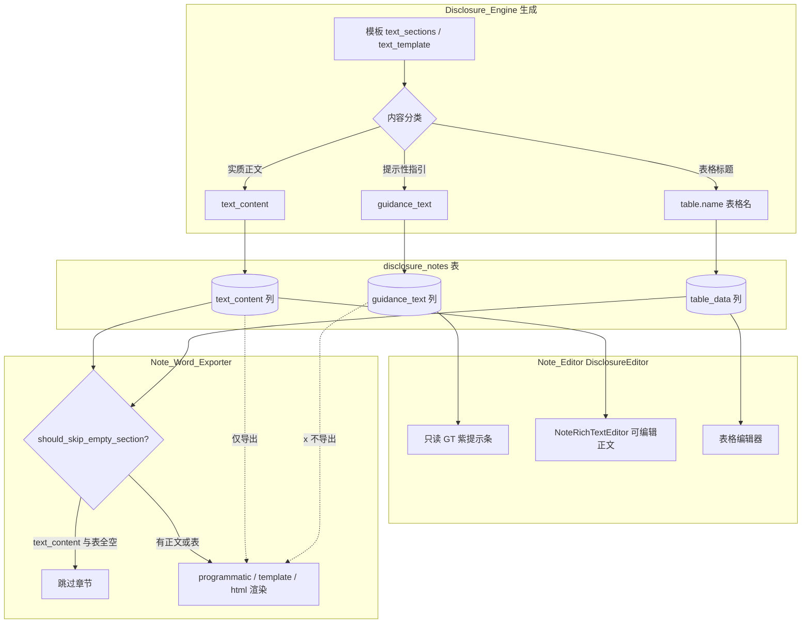
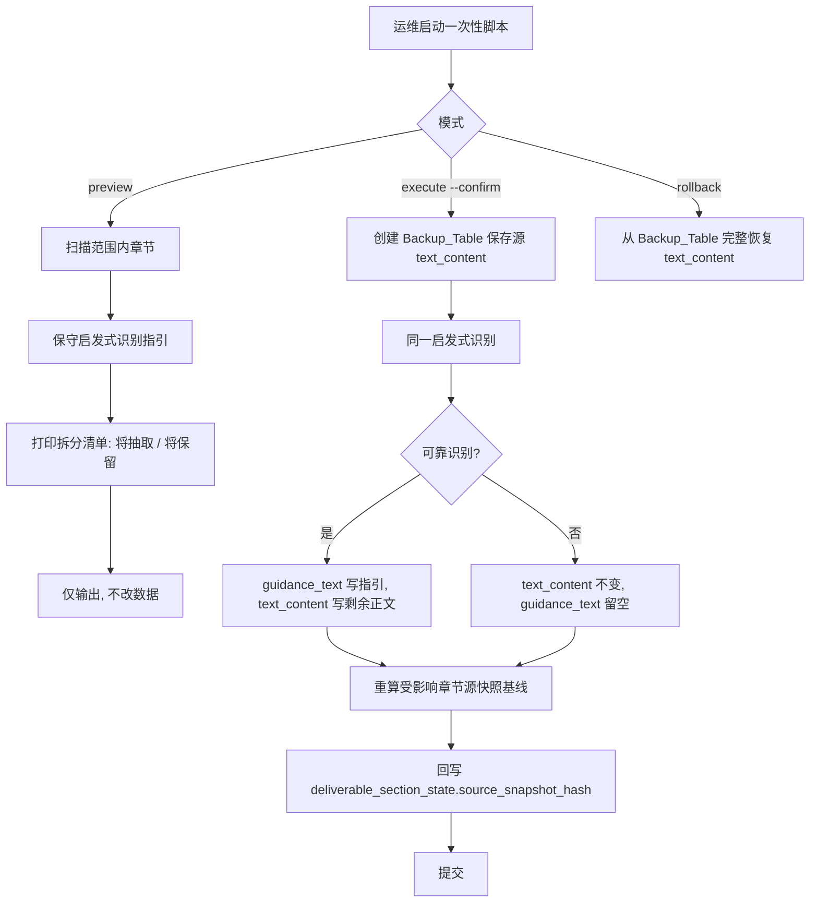

# Design Document

## Overview

本特性为附注模块（`disclosure_notes` 表 / `DisclosureNote` ORM）新增独立字段 `guidance_text`，把"提示性/指引文字"从 `text_content` 物理分流出来，使：

- `text_content` 从此只承载实质性披露正文，导出判空与渲染天然干净；
- `guidance_text` 在前端编辑器以只读 GT 紫提示条展示、引导填写，但不进入任何导出路径；
- 生成附注时（`disclosure_engine.py`）把模板提示语写入 `guidance_text`、实质正文写 `text_content`、表格标题写进表格名；
- 存量数据通过一次性"预览-人工核对-执行-可回滚"脚本把已有 `text_content` 中的提示语抽到 `guidance_text`，并在迁移后重算回写源快照基线哈希，避免误触发大规模 stale。

设计严格遵循三处既有约束（已实证）：

1. **快照哈希签名不改**：`compute_snapshot_hash_from_parts(section_code, text_content, table_data, audited_amounts)` 当前已仅基于 `text_content`+`table_data`+审定金额，**不含** guidance。本特性不改其实现/签名，只在存量迁移后调用 `DeliverableSectionStateService.compute_source_snapshot_hash` 重算受影响章节基线并回写 `deliverable_section_state`（需求 R6.1/R6.4）。
2. **导出三路径只导出 `text_content`**：programmatic（`export()`）/ template（`_fill_section_block` 占位符）/ html（`<p>{text_content}</p>`）三处天然只读 `text_content`，因此 guidance 不导出无需新增导出逻辑——只需确保**判空函数 `should_skip_empty_section` 不因 guidance 非空而误判"有内容"**（当前它已只看 `text_content`+`table_data`，本特性需保证迁移后行为正确，并补测试钉死）。
3. **生成引擎优先级3已留空**：`disclosure_engine.py` 约 980 行"模板默认文字"灌正文逻辑已临时注释。本特性把它正式改为"提示语→`guidance_text`"分流，替换该临时注释。

### 三个待权衡问题的裁决

| # | 问题 | 裁决 | 理由 |
|---|------|------|------|
| 1 | 存量指引识别方式 | **启发式规则识别高置信度指引 + 预览人工核对 + 低置信度不拆分** | 真实数据 906 章节中 28% 纯提示、9% 纯标题，识别须保守。硬约束"宁可不拆分留人工，不可误删"。LLM 不可控/不可复现且需联网，人工全量标注 906 条不现实。折中：用保守启发式（整段被括号/书名号/方括号包裹 + 含祈使词"应/说明/披露/参考附注/提示/注"等）只命中高置信度，命中后仍打印预览供人工核对，未命中即整段保留为 `text_content`（不拆分）。 |
| 2 | 字段存储形态 | **独立列 `guidance_text TEXT`** | 利于三层一致校验（DB 列 + ORM `Mapped[]` + service 方法可逐层断言）、利于 SQL 查询/统计（`WHERE guidance_text IS NOT NULL`）、与现有 `text_content` 同形态最低认知负担。JSON 子字段省一次迁移列但破坏三层校验、查询不便、与 `text_content` 不对称。需求 R1 已倾向独立列。 |
| 3 | stale 抑制实现 | **复用 `DeliverableSectionStateService.compute_source_snapshot_hash` 逐章重算 + 批量回写 `deliverable_section_state.source_snapshot_hash`，单事务按 word_export_task 分批** | R6.4 已定基线回写策略。该 service 已封装"读 note → 取审定金额 → `compute_snapshot_hash_from_parts`"全流程，迁移脚本直接调用即得迁移后的新基线，回写到已存在的 `deliverable_section_state` 行（其唯一键 `word_export_task_id + section_code`）。无需临时抑制传播——只要基线在同一迁移事务内重算回写，迁移后首次 `detect_*` 比对就一致。 |

## Architecture

### 数据流：三类内容的分流与导出



要点：`guidance_text` 是一条"只进编辑器、不进导出"的旁路。导出路径**完全不读** `guidance_text`，判空只看 `text_content`+`table_data`。

### 存量迁移流程（预览-核对-执行-回滚）



### 迁移机制分层

| 变更类型 | 载体 | 原因 |
|----------|------|------|
| DDL 加列 `guidance_text` | `V073__disclosure_notes_guidance_text.sql` + `R073` 配对 | MigrationRunner 启动时自动跑，幂等 `IF NOT EXISTS` |
| 存量数据拆分 | 带预览的一次性脚本 `backend/scripts/migrate/_split_guidance_text.py`（`_` 前缀，用完即删） | V*.sql 仅真实 PG 启动时跑且不可交互，数据拆分需人工核对+按范围执行，不能放进 V*.sql |
| 备份表 `_note_guidance_split_backup` | 由一次性脚本创建（`_` 前缀，加入 schema_drift KNOWN_ALLOWLIST 不删不映射） | 仿 `_note_text_ch8_backup` / `_sign_migration_backup` 做法，保留回滚能力 |

## Components and Interfaces

### 1. 数据模型层（DisclosureNote ORM + V073/R073）

新增 `guidance_text: Mapped[str | None] = mapped_column(Text, nullable=True)`，紧邻现有 `text_content` 定义，形态完全对称。

V073 DDL：
```sql
ALTER TABLE disclosure_notes ADD COLUMN IF NOT EXISTS guidance_text TEXT;
```
R073 回滚：
```sql
ALTER TABLE disclosure_notes DROP COLUMN IF EXISTS guidance_text;
```

### 2. Disclosure_Engine 生成分流

改造点：`disclosure_engine.py` 约 956-987 行"三级优先填充"+优先级3注释块。

**共用底层判定（生成与迁移共用，避免两条路径漂移）**：先抽一个按**单段落**操作的纯函数 `is_guidance_paragraph(para: str) -> bool`——判定单个段落是否为指引（整段被 `（）`/`【】`/`《》` 包裹且含祈使词"应/说明/披露/参考附注/提示/注/评价/确认"等）。生成路径与迁移路径**各自先分段、再逐段调用同一个 `is_guidance_paragraph`**，因二者输入分段粒度不同（生成是模板 `text_sections` 数组已分段；迁移是 DB 整段 `text_content` 字符串靠 `\n\n` 切分），不可直接复用上层函数，只共用这个底层段落判定。

新增模块级纯函数 `classify_template_content(text_sections, text_template) -> tuple[str | None, str | None]`，返回 `(substantive_text, guidance_text)`：
- 遍历 `text_sections` / `text_template` 各段；
- 段落经 `is_guidance_paragraph` 判定为指引 → 归入 `guidance_text`（多段 `\n\n` 拼接）；
- 表格标题类短段（≤20 字、命中 `_infer_table_names_from_text` 的编号标题）→ 不进正文、不进 guidance（已由表格命名消费）；
- 其余实质段落 → 归入 `substantive_text`。

生成时：`text_content` 仅取优先级1（上年）/优先级2（LLM）/`substantive_text`（替换原优先级3）；`guidance_text` 取分类出的指引。`DisclosureNote` 的新增/更新两个分支都写 `guidance_text`。

`_infer_table_names_from_text` 保持不变（继续用 `text_sections` 给表命名）。

### 3. Note_Word_Exporter 导出判空（三路径不变 + 判空钉死）

- **judge-empty（`note_word_dynamic_styles.should_skip_empty_section`）**：当前已只看 `text_content`+`table_data`，**不读 guidance**。本特性确认此行为正确并补测试。`_note_to_skip_dict` 不传 `guidance_text`（保持现状）。
- **三路径渲染**：programmatic（`export()` ~1144 行 `note.text_content`）、template（`_fill_section_block` 占位符替换 `text_content`）、html（~953 行 `<p>{note.text_content}</p>`）均**只读 `text_content`**，天然不导出 guidance，无需改动渲染逻辑。本特性补测试钉死"三路径输出不含 guidance"。
- **`_has_content`**：同样只看 `text_content`+`table_data`，保持不变。

### 4. Note_Editor 前端提示条组件

`DisclosureEditor.vue` 在每个章节正文区上方条件渲染只读提示条：

```vue
<div v-if="section.guidanceText && section.guidanceText.trim()" class="gt-guidance-bar">
  <el-icon><InfoFilled /></el-icon>
  <span class="gt-guidance-text">{{ section.guidanceText }}</span>
</div>
```

- 样式用 GT 紫令牌：浅紫底 `#f4f0fa`、左边框 `#4b2d77`、文字深紫；
- 只读：`guidance_text` 不接入 `NoteRichTextEditor`（contenteditable），仅纯文本展示，避免误编辑；
- 空则不渲染（行为与现状一致）；
- 提示条在导出 DOM/数据流中不参与（导出走后端，不读前端提示条）；
- 界面文本全中文。

前端 fetch 取附注详情时手动解 `{code,message,data}` 信封，把 `data.guidance_text` 映射到 `section.guidanceText`。

### 5. 存量迁移脚本 `_split_guidance_text.py`

CLI 子命令：`preview` / `execute` / `rollback`，`--project`（项目 id 或 `all`）、`--confirm`（execute 必须显式带）。

核心组件：
- `identify_guidance(text_content) -> tuple[str, str] | None`：保守启发式，把整段 `text_content` 按 `\n\n` 切分为段落，逐段调用与生成路径**共用的底层判定** `is_guidance_paragraph`（见组件 2），命中的段归 guidance、其余归 remaining；返回 `(guidance, remaining_substantive)`；若无任何段命中（无法可靠识别）返回 `None`（→ 不拆分）。**生成与迁移共用 `is_guidance_paragraph` 但各自分段**，保证同一段文本在两条路径判定一致。
- `preview(scope)`：对范围内每章节调 `identify_guidance`，打印"将抽取为 guidance_text"/"将保留为 text_content"清单，不写库。
- `execute(scope)`：先建 `_note_guidance_split_backup`（存 `note_id, project_id, year, note_section, source_text_content`），再按 `identify_guidance` 结果写 `guidance_text` + 回写 `text_content`；无法识别的章节保持不变。最后**仅对 text_content 实际发生变化的章节**调基线重算回写（见组件 6）。
- `rollback(scope)`：从备份表 `UPDATE disclosure_notes SET text_content = source_text_content, guidance_text = NULL`。

往返一致性保证（R5.8）：`identify_guidance` 必须满足 `guidance + remaining == source`（不丢字符）。实现上以"整段切分"而非"删字符"实现：识别出的指引段从原文中按段移除，剩余即 `remaining`，二者重组等于原文（保留段间分隔）。

### 6. 交付件溯源基线回写

存量迁移 `execute` 末尾，**仅对本次实际改写了 `text_content` 的章节**（成功拆分的那批；未拆分章节 text_content 未变、哈希不变、跳过）：

```python
state_svc = DeliverableSectionStateService(db)
# 仅遍历 changed_sections（text_content 实际变化的 (project_id, year, section_code)）
new_hash = await state_svc.compute_source_snapshot_hash(project_id, year, section_code)
# 复用现成方法 clear_section_stale(word_export_task_id, section_code, new_hash)
#   —— 它同时更新 source_snapshot_hash + 置 is_stale=False，避免裸 UPDATE SQL 的列漂移风险
#   （项目有 test_raw_sql_column_contract 守裸 SQL）
for task_id in task_ids_bound_to_section:  # 一对多：同一 section 可能绑定多个 word_export_task
    await state_svc.clear_section_stale(task_id, section_code, new_hash)
```

- **回写范围**：仅 `changed_sections`（execute 实际改写 text_content 的章节）。未拆分章节不重算不回写（哈希本就没变）。
- **一对多处理**：`deliverable_section_state` 唯一键是 `(word_export_task_id, section_code)`，同一 section_code 可能绑定多个交付件任务（多个 word_export_task），须对该 section 在 `deliverable_section_state` 中的**所有** task 行都回写——先 `SELECT DISTINCT word_export_task_id FROM deliverable_section_state WHERE project_id=? AND year=? AND section_code=?` 取全部 task_id 再逐一 `clear_section_stale`。
- **复用现成方法**：用 `DeliverableSectionStateService.clear_section_stale(word_export_task_id, section_code, new_hash)`（已实证存在）而非裸 `UPDATE`，规避列漂移并复用其 hash+stale 一致更新逻辑。
- 因 `compute_snapshot_hash_from_parts` 只看 `text_content`，移除指引后 `text_content` 变了 → 重算后的 hash 即新基线，回写后迁移前后 `detect_upstream_drift` 比对一致，不产生 stale；
- 无对应 `deliverable_section_state` 行的 section（无交付件绑定）：`SELECT` 返回空，自然跳过，不报错；
- 事务边界：按 `word_export_task_id` 分批，每批一事务（避免长事务锁表），与数据拆分写入同一脚本顺序执行。

### 7. 离线导出/导入往返适配

已实证 `note_offline_export_service` 有两处成熟隐藏机制：①每章节 sheet 第 2 行 `section_id:{sid}` 隐藏行 ②专门的 `_meta_` 隐藏 sheet（base64+gzip 压缩 `meta_payload[sid]` = bindings/formula/row_meta）。`guidance_text` 应存入 **`_meta_` sheet 的 `meta_payload[sid]`**（最适合放非可编辑元数据，且已是隐藏+压缩区），不写入可编辑数据区（防被当正文）。

- **导出**（`note_offline_export_service`）：在 `_build_meta_sheet` 的 `meta_payload[sid]` 增加 `"guidance_text": section.get("guidance_text") or ""`；`export_sections` 构造 `section_dict` 时带上 `guidance_text`。
- **导入**（`note_offline_import_service`）：从 `_meta_` 读回 `meta_payload[sid].guidance_text` 原样回写 `disclosure_notes.guidance_text`，**不**把 guidance 内容并入 `text_content`/`table_data`（R7.2a 不污染正文）。
- **⚠ 实证前置**：离线导出/导入按 `section_id` 标识匹配，但项目铁律记录"`disclosure_notes.section_id` 列 DB 几乎全空、前端用 `note_section`"。实施任务 8.x **前必先实证** export/import 当前实际用 `section_id` 还是 `note_section` 做 sid 键（读 `export_sections` 调用方传入与 `_build_meta_sheet` 的 `section.get("section_id")` 真实取值），按实际键存取 guidance_text，避免 sid 为空导致 meta 错位。

## Data Models

### disclosure_notes 表（新增列）

| 列 | 类型 | 约束 | 说明 |
|----|------|------|------|
| `guidance_text` | `TEXT` | nullable | 提示性/指引文字，不参与导出。NULL/空=无指引（与现状等价） |

### DisclosureNote ORM（新增字段）

```python
text_content: Mapped[str | None] = mapped_column(Text, nullable=True)
guidance_text: Mapped[str | None] = mapped_column(Text, nullable=True)  # 本特性新增
```

### _note_guidance_split_backup 备份表（一次性脚本创建）

| 列 | 类型 | 说明 |
|----|------|------|
| `note_id` | UUID | disclosure_notes.id |
| `project_id` | UUID | 项目 |
| `year` | INT | 年度 |
| `note_section` | TEXT | 章节号 |
| `source_text_content` | TEXT | 迁移前完整 text_content（回滚源） |
| `backed_up_at` | TIMESTAMPTZ | 备份时间 |

`_` 前缀无 ORM 映射，加入 `schema_drift_detector.KNOWN_ALLOWLIST`。

### 内容三分类判定（生成 + 迁移共用底层段落判定 `is_guidance_paragraph`）

生成路径（`classify_template_content`）与迁移路径（`identify_guidance`）**各自先分段、再逐段调用同一个 `is_guidance_paragraph`**，保证同一段文本两条路径判定一致（见 Property 15）。

| 类别 | 判定（`is_guidance_paragraph` 单段） | 去向 |
|------|------|------|
| 指引（高置信度） | 整段被 `（）`/`【】`/`《》` 包裹 **且** 含祈使/指引词（应/说明/披露/参考附注/提示/注/评价/确认/列示） | `guidance_text` |
| 表格标题 | 编号短标题（`（1）`/`####`），命中 `_infer_table_names_from_text` | `table.name`（不进正文/不进 guidance） |
| 实质正文 | 其余 | `text_content` |
| 不可靠（迁移场景） | 无任何段命中高置信度指引判定 | 整段保留 `text_content`，不拆分 |

## Correctness Properties

*属性（property）是一种在系统所有合法执行中都应成立的特征或行为——本质上是关于系统应当做什么的形式化陈述。属性是人类可读规格与机器可验证正确性保证之间的桥梁。*

下列属性均由前述 Acceptance Criteria Testing Prework 推导。已对冗余属性做合并（见 prework 末尾 Property Reflection）。所有 PBT 测试 `max_examples=5`。

### Property 1: 生成分流完整性

*For any* 模板章节（含任意提示语段与任意实质正文段的组合），经 Disclosure_Engine 生成后，所有被判定为指引的内容应出现在 `guidance_text`，且 `text_content` 不包含任何已分流至 `guidance_text` 的指引内容。

**Validates: Requirements 2.1, 2.2, 2.4, 2.5**

### Property 2: 表格标题不进正文

*For any* 模板中被识别为表格标题的内容，生成后该标题应写入对应表格的表名（`table.name`），且 `text_content` 不包含该表格标题。

**Validates: Requirements 2.3**

### Property 3: 判空与 guidance 无关

*For any* 附注章节，`should_skip_empty_section` 的判定结果只取决于 `text_content` 与 `table_data`；对同一章节，无论 `guidance_text` 为空还是任意非空值，判空结果保持不变（特别地：`text_content` 为空且所有表为空时判定跳过，即使 `guidance_text` 非空）。

**Validates: Requirements 4.1, 4.2, 4.5**

### Property 4: 导出输出不含 guidance

*For any* 附注章节与任意导出路径（programmatic / template / html），导出产物中不包含 `guidance_text` 的文字内容。

**Validates: Requirements 4.3, 4.4, 7.2**

### Property 5: 提示条渲染当且仅当 guidance 非空

*For any* 附注章节，Note_Editor 渲染指引提示条当且仅当该章节 `guidance_text` 非空（去除首尾空白后）；提示条为只读，用户只能编辑 `text_content` 正文区。

**Validates: Requirements 3.1, 3.2, 3.4**

### Property 6: 拆分合并往返一致

*For any* 源 `text_content` 字符串，存量迁移识别拆分得到的 `(guidance_text, remaining_text_content)` 重新合并后应等价于源 `text_content`（不丢失任何字符）。

**Validates: Requirements 5.4, 5.8**

### Property 7: 不可靠识别则不拆分（不可误删硬约束）

*For any* 不满足高置信度指引判定的章节，存量迁移后其 `text_content` 应与源完全一致且 `guidance_text` 留空（NULL/空）——即绝不强行拆分。

**Validates: Requirements 5.5**

### Property 8: 未确认执行只读

*For any* 迁移范围与章节集合，在未显式确认（无 `--confirm`）的预览模式下运行，`disclosure_notes` 表数据保持不变。

**Validates: Requirements 5.3**

### Property 9: 拆分回滚往返恢复

*For any* 已执行拆分的章节集合，从 Backup_Table 执行回滚后，所有章节的 `text_content` 应完整恢复为迁移前的源值。

**Validates: Requirements 5.2, 5.6**

### Property 10: 范围隔离

*For any* 操作员指定的项目范围，迁移仅修改该范围内章节，范围外章节的 `text_content` 与 `guidance_text` 保持不变。

**Validates: Requirements 5.7**

### Property 11: 基线回写抑制误判 stale

*For any* 仅移除了指引文字、实质正文未变的章节，存量迁移完成（含源快照基线重算回写）后，`detect_upstream_drift` 应返回 False（不产生因迁移导致的哈希差异，不被标记 stale）。

**Validates: Requirements 6.4, 6.5, 6.6**

### Property 12: guidance 为空全链路等价现状

*For any* `guidance_text` 为空或 NULL 的章节，其在生成、编辑、导出全链路的行为应与未引入 `guidance_text` 字段时完全一致。

**Validates: Requirements 1.5, 7.1, 7.3**

### Property 13: 离线导出导入往返保留 guidance

*For any* 附注章节，经 `note_offline_export_service` 导出再导回后，`guidance_text` 应保持不变（不丢失），且其内容不被并入 `text_content`（不污染正文）。

**Validates: Requirements 7.2a**

### Property 14: 迁移幂等（DDL）

*For any* 数据库初始状态（`guidance_text` 列已存在或不存在），重复执行 V073 迁移后结果一致（列存在且类型为 TEXT），不报错。

**Validates: Requirements 1.2**

### Property 15: 生成与迁移指引判定一致

*For any* 单个段落文本，生成路径（`classify_template_content` 内分段后）与迁移路径（`identify_guidance` 内分段后）对该段落是否为指引的判定结果一致——因二者共用同一底层 `is_guidance_paragraph`，不存在"同一段在生成时判为指引、在迁移时判为正文"的漂移。

**Validates: Requirements 2.1, 5.5（共用判定一致性）**

## Error Handling

| 场景 | 处理 |
|------|------|
| V073 列已存在 | `IF NOT EXISTS` 幂等跳过，不报错（Property 14） |
| 一次性脚本 `execute` 未带 `--confirm` | 拒绝写入，仅打印预览（Property 8） |
| `identify_guidance` 无法可靠识别 | 返回 None，章节不拆分、`text_content` 不变（Property 7），日志记 `skipped: low-confidence` |
| 备份表已存在（重复 execute） | 脚本检测到备份表非空时拒绝二次 execute（防止覆盖原始备份丢失回滚能力），提示先 rollback |
| 基线回写时 `deliverable_section_state` 无对应行 | 跳过该 section（无交付件绑定，无需回写），不报错 |
| 离线导入 sheet 缺 `guidance_text` 隐藏区（旧导出包） | 视为 guidance 未变，保留 DB 现值，不报错（向后兼容 Property 12） |
| 前端取详情 `data.guidance_text` 缺失 | 映射为空字符串，不渲染提示条（Property 5/12） |
| 迁移基线重算事务失败 | 该 `word_export_task` 批回滚，数据拆分已提交批不受影响；脚本可重入续算 |

## Testing Strategy

### 双轨测试

- **单元测试**：覆盖具体示例、边界、错误条件，及"测试存在性"类需求（R1.1/1.3/1.4/1.6/6.1/6.3/8.x）。
  - 三层一致：断言 V073 列定义、ORM `guidance_text` Mapped、engine/service 读写方法存在（R1.1/1.3/1.4/1.6）。
  - 判空边界示例：仅 guidance 非空+正文表空→跳过；含正文→不跳过（R4.2/4.5）。
  - 预览输出格式：preview 打印含"将抽取"/"将保留"清单（R5.1）。
  - 快照函数签名静态断言：`compute_snapshot_hash_from_parts` 签名与实现未改（R6.1）。
  - 排序回归：新增列不改 `sort_order` 排序结果（R7.4）。
- **属性测试**：覆盖上述 14 条 Property，验证通用性质。

### 属性测试配置

- 库：后端 **Hypothesis**（Python，项目已用）；前端组件属性测试用 **fast-check + Vitest**（提示条渲染 Property 5）。
- **`max_examples=5`**（用户明确要求，禁默认 100）。
- 每条属性由**单个**属性测试实现，注释标注：`# Feature: note-guidance-text-separation, Property {N}: {property_text}`。
- 不从零实现 PBT 框架。

### pg_only 标注（关键）

测试 fixture 默认 `sqlite+aiosqlite:///:memory:` + `create_all`，**不加载 V*.sql 迁移**。因此：
- **Property 14（DDL 幂等）必须标 `pg_only`**（conftest 非 PG 自动 skip）——只有真实 PG 启动才跑 V073。
- **Property 6/7/8/9/10（存量迁移脚本）**涉及真实 DDL/备份表/范围执行的，标 `pg_only`；其中纯字符串拆分代数（`identify_guidance` 的 split/merge 往返，Property 6 的纯函数部分）可在 SQLite/无库下跑。
- **Property 11（基线回写）**依赖 `deliverable_section_state` + `trial_balance` 真实表，标 `pg_only`。
- **Property 13（离线往返）**走 openpyxl + DB，DB 部分标 `pg_only`；xlsx 读写编解码部分可无库跑。
- **Property 1/2/3/4/5/12**（生成分流纯逻辑、判空纯函数、导出渲染、前端提示条、向后兼容空值）多为纯函数/ORM 对象层，可 SQLite 跑。

### Playwright 实测（R8.7）

辽宁卫生 `37814426-a29e-4fc2-9313-a59d229bf7b0` 与和平药房 `5942c12e-65fb-4187-ace3-79d45a90cb53`：
- 编辑器对有 `guidance_text` 的章节展示 GT 紫提示条、只读；
- 导出 Word 不含指引文字、仅含正文与表格；
- 仅提示语章节被跳过不产生空章节。

## 现状确认（基于已实证代码事实）

| # | 事实 | 文件/位置 | 设计依据 |
|---|------|-----------|----------|
| 1 | `DisclosureNote` 用 `Mapped[]` 风格，`text_content: Mapped[str\|None]=mapped_column(Text, nullable=True)`，`table_data` 用 JSONB | `backend/app/models/report_models.py` `class DisclosureNote` | `guidance_text` 仿 `text_content` 同形态新增 |
| 2 | `compute_snapshot_hash_from_parts(section_code, text_content, table_data, audited_amounts)` 已仅基于 text_content+table_data+审定金额，**不含 guidance**；基线由 `DeliverableSectionStateService.compute_source_snapshot_hash` 计算、存 `deliverable_section_state` | `backend/app/services/deliverable_section_state_service.py` | 签名不改；迁移后调该 service 重算回写基线（R6.4） |
| 3 | `should_skip_empty_section(note: dict)` 已只看 `text_content`+`table_data`（条件④），`_note_to_skip_dict` 不含 guidance | `note_word_dynamic_styles.py` L85；`note_word_exporter.py` L1043 | 判空天然不受 guidance 影响，补测试钉死（Property 3） |
| 4 | 导出三路径：programmatic `export()`~L1144 `note.text_content` add_run / template `_fill_section_block` 占位符替换 / html ~L953 `<p>{note.text_content}</p>`，均只读 text_content；`_has_content` ~L1014 同样只看 text_content+table_data | `note_word_exporter.py` | 三路径天然不导出 guidance，补测试（Property 4） |
| 5 | 生成引擎"优先级3 模板默认文字"已临时注释（~L980），`text_sections` 仍用于 `_infer_table_names_from_text`（~L1010）给表命名；`DisclosureNote` 新增/更新两分支写 `text_content` | `disclosure_engine.py` L956-987, L1060-1085 | 把优先级3 改为"提示语→guidance_text"分流，替换临时注释（R2.4），表命名逻辑不动 |
| 6 | 离线导出有成熟隐藏机制：每章节 sheet 第2行 `section_id:{sid}` 隐藏行 + `_meta_` 隐藏 sheet（base64+gzip 压缩 `meta_payload[sid]`=bindings/formula/row_meta）；按 sid 标识匹配。**注：sid 实际取 `section.get("section_id")`，而 DB section_id 列可能空（铁律），实施前须实证真实键** | `note_offline_export_service.py`（`_build_meta_sheet`/`export_sections`）；`note_offline_import_service.py` | guidance_text 存入 `_meta_` 的 `meta_payload[sid]` 往返（R7.2a，Property 13）；任务前先实证 sid 键 |
| 7 | MigrationRunner 运行时迁移，`V*.sql`+`R*.sql` 配对，当前最高 **V072**，本特性用 **V073/R073** 加列；数据拆分走带预览一次性脚本（非 V*.sql） | `backend/migrations/` | DDL 走 V073/R073；存量拆分走 `_split_guidance_text.py` |
| 8 | 前端 `DisclosureEditor.vue` + `NoteRichTextEditor.vue`（contenteditable，有 isInternalChange/focus guard 经验）；GT 紫 `#4b2d77`/浅紫底 `#f4f0fa`；原生 fetch 须手动解 `{code,message,data}` 信封 | `audit-platform/frontend/src/views/DisclosureEditor.vue` | 提示条只读纯文本（不接 contenteditable），GT 紫令牌，手动解信封映射 guidanceText |
