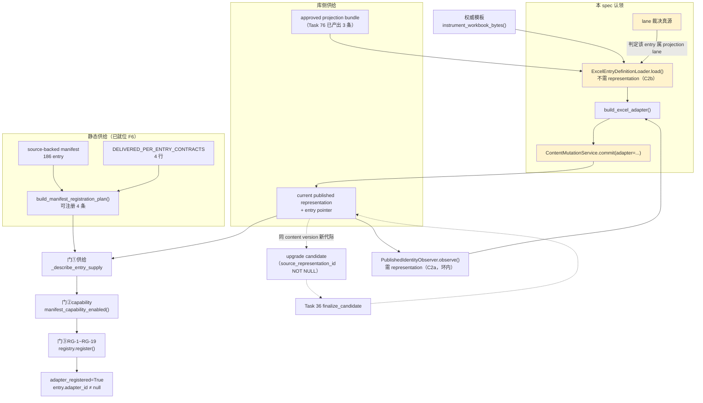

# Design Document

## Overview

平台从未在**生产调用路径**上为任何 manifest entry 产出过 published representation。这一件缺失的事把上游 spec `workpaper-html-onlyoffice-bidirectional-writeback-closure` 的 7 个任务（61 / 63 / 71 / 72 / 74 / 75 / 76）同时钉住，而这 7 个任务的正文各自把它排除在自己范围外 —— 它没有 owner。本设计认领它。

本 spec 交付两件事，其余一概不做：

1. **首版 published representation 的生产调用点**：让至少一个 manifest entry 在生产路径（服务层 + 幂等宿主脚本）上真正落成 published representation，而不是靠 `test_task4x_*_pg.py` 之类的临时 schema 测试夹具。
2. **projection lane vs opaque lane 的选路裁决**：给出单一真源、可测的判据，并把「已 provision projection bundle」与「representation 真按 projection contract 发布」拆成两条**互相独立**的判据 —— 只有前者成立时，供给不算成立。

第 3 项是这两件事的连带产物：Task 75 的 `adapter_registered` False→True、Task 76 的 candidate 表出现真实行、Task 61 的 BP-61-1 换判据。全部复用既有门禁读数，不另造。

## 实证复核结论

立项材料给出的推断**不全成立**。下列每条都是本设计前独立真跑 / 真库读出的，与设计结论直接相关。

### 已复核为真

| # | 事实 | 证据来源 |
|---|------|---------|
| F1 | `ContentMutationService.commit()` 对 projection-based **真的**强制 `adapter` 非空 —— 不是 docstring 而是 `_assert_authority_shape` 的 `if adapter is None: raise ContractRequiredError` | `content_mutation.py:1307-1330` 实读 |
| F2 | `PublishedIdentityObserver.observe()` 只从 published representation 现读；`representation=None` 抛 `RepresentationShapeError`，不返回 `None`、不「按 current pointer 现查」 | `published_identity_observer.py:559-660` 实读 |
| F3 | `register_from_manifest()` 的供给门 `_describe_entry_supply` 要求「entry current pointer 存在 + representation row 存在 + 绑定 definition bundle」三条 | `adapters/registry.py:1242-1293` 实读 |
| F4 | 库状态：representation 1 / version 1 / entry_state 1 / candidate **0** / application 0 / scope_index 2 / definition_artifact 14 / definition_bundle 5 / working_paper 2812 | PG MCP restricted 只读 |
| F5 | 那唯一 1 行走 opaque lane：`entry_id=opaque-017624e2-cd7e-4641-bd99-db7c1f1f5f7e` · `adapter_id=opaque.authoritative.v1` · `authority_model_type=opaque_single_onlyoffice` · xlsx / upload / content_commit / rev 1 / gen 1 · wp_code **D2** | PG MCP 三表 JOIN |
| F6 | registry 静态供给已就位：manifest **186** · `DELIVERED_PER_ENTRY_CONTRACTS` **4** · 可注册 **4**（`xlsx/b60/gt-b60-bundle`、`xlsx/gt-d2-accounts-receivable`、`xlsx/gt-g7-long-term-equity-main`、`xlsx/gt-h1-fixed-assets`） | `build_manifest_registration_plan()` 真跑 |
| F7 | Task 44 门实测：四个 pilot 全部 `adapter_registered=False` `capability_enabled=False` `observer=available` `attach=()`；判定 `{failed:28, unverifiable:140, passed:5}`；168/173 probe 未通过 | `check_task44_oo94_excel_pilot_gate.py` 真跑，退出码 1 |
| F8 | Task 61 门实测：75 probe，`{failed:60, passed:11, unverifiable:4}`；`entries_verified=[]`；F2-22/F2-23 的 `published_repr / manifest_entry / adapter / approved_bundle` 全 `False` | `check_task61_oo94_word_pilot_gate.py` 真跑，退出码 1 |

### 已复核为假 —— 必须据实修正

**C1 · candidate finalize 不可能是破环点（结构上不可能，非「尚未接线」）**

`working_paper_representation_upgrade_candidate.source_representation_id` 是 **NOT NULL + FK → `working_paper_content_representation`**，`content_version_id` 亦 NOT NULL。一个 candidate 在结构上**必须**先有一个既存 representation 才能存在。因此 Task 17 的 upgrader + Task 36 的 `finalize_candidate` 只能为**同一 content version** 产出**新代际**，永远产不出首版。

`finalize_definition_upgrade` 还追加断言 `outcome.revision_unchanged`，进一步把它锁成「同 content version 的代际提升」。

生产代码自己已经写明了这条分工，且标注过它曾被误记：

> published representation 则由 `ContentMutationService.commit(...)`（首版 content version）与 Task 36 / 77 的 finalize gate（同 content version 的新代际）产出（**Task 77 更正首版的误记**）
> —— `_describe_entry_supply` 的拒绝文案

⇒ candidate 表 0 行**不是**「upgrader 从未被调用」的证据，而是「从来没有可供升级的 representation」的必然结果。本 spec 把首版落成之后，candidate 表才**可能**有行。

**C2 · 环是真的，但破环点在 `FrozenEntryDefinitions` 的第二个生产者**

`FrozenEntryDefinitions` 有**两个**互不依赖的来源：

- **(a) `PublishedIdentityObserver.observe()`** —— 入参 `representation`，在环内。
- **(b) `ExcelEntryDefinitionLoader.load()`** —— 入参 `(entry_id, frozen_bundle_id, frozen_bundle_sha256, adapter_build, identity_inventory, observed_structure, observed_business_sheets, observed_dynamic_columns)`。**一个都不是 representation。** 它的运行时实测入参可以由「approved bundle + instrumented 权威模板字节」现算 ⇒ **不在环内**。

Task 36 的 `excel_entry_gate.finalize_candidate` 用的正是 (b)（`self._loader.load(...)`）。所以破环不需要 candidate、不需要放宽任何判据：

```
approved projection bundle（已在库，Task 76 的 fix_task76_provision_projection_definitions.py 产出）
  + instrument_workbook_bytes(权威模板)                      ← 现算 observed_* 与 identity_inventory
  → ExcelEntryDefinitionLoader.load(...)  →  FrozenEntryDefinitions
  → build_excel_adapter(direction="html_to_oo")  →  ExcelSyncAdapter
  → ContentMutationService.commit(plan=..., mutation=..., adapter=<该 adapter>)
  → 首版 content version + 首版 published representation + entry pointer
```

**C3 · 存在第三道门（立项材料未提）：manifest capability**

即使供给到位，`register_from_manifest()` 仍注册 0 条。四个 pilot 的 `attach_pilot_adapters()` 头两行是 `if not manifest_capability_enabled(): return ()`，而四个 entry 的 manifest capability 实测**全部** `single_onlyoffice`。`register()` 的 RG-18 两侧对称检查（`declares_bidirectional` 与 capability 必须一致，任一侧不符即 `FakeBidirectionalError` / `RegistrationError`）让这道门不可绕。

Task 75 自己的测试已经把这件事断言下来了：

- `test_supply_alone_is_not_enough_and_the_reason_says_so` —— 供给到位后注册数仍 0，且原因文本必须指向 provider 的空返回而**不是**「缺供给」。
- `test_registration_really_happens_when_both_links_are_in_place` —— 两条链都在时注册数 **> 0**（在内存 manifest 上正面证明过）。

⇒ **`adapter_registered` False→True 需要两件事同时成立：首版 published representation + capability 裁决。** 只做前者，Task 75 的那条判据不会变绿；只做后者，`_describe_entry_supply` 仍拒。

**C4 · B60 不是最短路径 —— 它被 OOXML 发布安全门硬拒**

`pilot_simple_checklist`（`xlsx/b60/gt-b60-bundle`）的权威模板含 `xl/externalLinks/externalLink1.xml` + `_rels`。实测：

```
pilot_simple_checklist: REJECT OoxmlSecurityError gate=external_relationships code=ooxml_security_rejected
        detail: OOXML 安全门 external_relationships 拒绝：外部关系被策略拒绝: ['xl/externalLinks/_rels/externalLink1.xml.rels']
pilot_d2_large_json:      PASS
pilot_h1_grouped_dynamic: PASS
pilot_g7_two_level_dynamic: PASS
```

（`validate_ooxml_artifact(path, document_type="xlsx", limits=load_limits())`，`GATE_ORDER` 第 8 格。）Task 75 的采集器早已因同一原因弃用 B60 改用 G7 并写明了理由。**Task 61 正文说 B60 是最短路径，那句话对 Excel lane 不成立** —— 走它必须先裁决「是否放宽 `allow_external_relationships`」，那是安全策略变更，不属本 spec。

**C5 · 5 条 definition bundle 的 typed slot 不是「三类均为 definition」**

只有 3 条 `projection_contract` bundle 的三 slot 是 `definition`。2 条非 projection bundle（`authority.custom_authoritative_ooxml` / `authority.opaque_single_onlyoffice`）三 slot 全是**版本化 typed null marker**（`template:none:v1` / `instrumentation:none:v1` / `contract:none:v1`，ref 为 `marker:*`）。

这不是缺陷而是**唯一合法形态**：`validate_bundle_slots` 只对 `projection_contract` 要求三 child 均为 approved definition；opaque 侧写 definition 反而会被 `assert_authority_model_contract_pairing` 以 `AuthorityModelMismatchError` 拒。这条区分是 lane 裁决判据的基石（见 §Lane 裁决）。

**C6 · 4 个可注册 entry 中只有 3 个在库里有 approved bundle**

库里 3 条 projection bundle 是 `b60.hour_budget` / `d2.receivable_detail` / `h1.disposal_check`。**`g7.soe_subsidiary_disclosure` 没有。** 与 C4 交叉后，首版目标的可行域是：

| entry | approved bundle | OOXML 门 | 可作首版目标 |
|---|---|---|---|
| `xlsx/b60/gt-b60-bundle` | ✓ | ✗ `external_relationships` | 否（C4） |
| `xlsx/gt-d2-accounts-receivable` | ✓ | ✓ | 是 |
| `xlsx/gt-h1-fixed-assets` | ✓ | ✓ | 是 |
| `xlsx/gt-g7-long-term-equity-main` | ✗ | ✓ | 需先 provision bundle |

**C7 · `ENTRY_ID_NAMESPACE_SPLIT_NOTE` 已过期，且它不覆盖本 spec 要裁决的那条分叉**

该登记表的 `measured_migration_cost_at_task65` 写着三表均 0 行，实测现为 `content_version=1 / content_representation=1 / content_application=0`。且它裁决的是 **opaque lane 内部**的 `wp_code` vs `wp_id` vs `wp_code_with_sheet` 三种 entry_id 口径（owner = Task 67），**不涉及 projection vs opaque**。⇒ projection/opaque 选路确实无 owner，本 spec 认领它。

**C8 · 供给门与 attach 都是「按 entry_id 全局取首行」，无 project/wp scope**

`_describe_entry_supply` 与各 pilot 的 `attach_pilot_adapters` 都是 `where(WorkpaperSyncEntryState.entry_id == <entry_id>)` + `.first()`，**没有** project/wp 过滤（`working_paper_sync_entry_state` 的键是 `(wp_id, entry_id)`，故同一 entry_id 可有多行）。manifest entry_id 是 wp 无关的（`xlsx/gt-d2-accounts-receivable`），因此：

- 任何一个 wp 落成该 entry 的 representation ⇒ 该 entry 的供给门对**全平台**放行；
- adapter 是**进程级**注册项，其 `identity_binding` 来自**恰好被选中的那一个 wp** 的 representation。

这是本设计必须显式面对的取值确定性问题（见 §首版目标选取），不是可以顺手改的东西 —— 改成带 scope 会改变 registry 的生命周期语义（进程级 → per-request），属另一个 spec。

## Architecture

### 三道门与真实依赖方向



图里两条虚线（candidate → finalize → representation）刻意画成回到 `REPR` 而不是从零指向它：candidate 的 `source_representation_id` NOT NULL 让那条路只能是 `REPR → REPR'`（C1）。

### 环在哪、破在哪

```
环（真实存在，仅在 attach 路径）：
   register_from_manifest → attach_pilot_adapters → resolve_published_frozen_definitions
     → PublishedIdentityObserver.observe(representation=…)          ← 需 representation
   ContentMutationService.commit(projection) → _assert_authority_shape → 必须给 adapter
     → build_excel_adapter → FrozenEntryDefinitions                  ← 若只有 (a) 则需 representation
   ⇒ representation 需要 adapter，adapter 需要 representation

破环（不放宽任何判据）：
   FrozenEntryDefinitions 的第二个生产者 ExcelEntryDefinitionLoader.load()
     入参全部来自「approved bundle + instrumented 权威模板」，零 representation 依赖
```

破环**不是**降级：`ExcelEntryDefinitionLoader.load()` 自己就跑九步 fail-closed 校验（raw slot 六类分类 → frozen digest 等值 → FS-6 contract child kind/state → `load_bundle_snapshot` 深度校验 → `assert_bundle_usable` / `assert_authority_model_contract_pairing` / `assert_contract_identity_frozen` → `_GT_SYNC` 排除 + 动态列解耦 → structure 漂移 → identity inventory → adapter build）。观测器与 loader 的差别只是**运行时实测入参从哪来**，不是判据强度。

### 分层与新增物

```
backend/app/services/workpaper_sync/
  projection_lane_registry.py        ← 新增：lane 裁决单一真源（声明式 + AST 双向锁）
  projection_first_publication.py    ← 新增：首版 published representation 的服务层
backend/scripts/fix/
  fix_projection_first_publication.py ← 新增：唯一幂等宿主（--check / --apply）
backend/scripts/check/
  check_projection_lane_adjudication.py ← 新增：lane 裁决 + 首版落成的回归门
backend/scripts/diagnose/
  mutate_projection_first_publication_guards.py ← 新增：变异检验（四态判读）
```

**不新增数据库表、不新增迁移。** 全部表已存在（磁盘最高 V153，本 spec 不加 V154）。lane 裁决走声明式 registry + 与源码 AST 双向锁，与既有 `OPAQUE_AUTHORITY_LANES` 同款 —— 那是本仓库已验证的「单一真源 + 守卫与真源双向锁死」范式，比新建一张配置表更难被绕过。

## Lane 裁决

### 问题的准确形态

D2 的实测情形是：`d2.receivable_detail.authority-model` 的 approved projection bundle 在位（C6），而该 wp 实际落成的 representation 走的是 opaque lane（F5）。但两者**并不冲突** —— 它们落在不同的 entry_id 命名空间：

| lane | entry_id 形态 | authority model | bundle typed slot | 首版产出者 |
|---|---|---|---|---|
| opaque | `opaque-{wp_id}` / `opaque-{wp_code}` / `opaque-{wp_code}-{sheet}` | `opaque_single_onlyoffice` / `custom_authoritative_ooxml` | 三格全 typed null marker | `AuthoritativeContentWriter.commit_bytes(lane_id=…)` |
| projection | source-backed manifest 的 entry_id（如 `xlsx/gt-d2-accounts-receivable`） | `projection_contract` | 三格全 approved definition | 本 spec 的 `commit(adapter=…)` |

⇒ **同一个 wp 可以同时有两个 lane 的 representation，各自独立 pointer/代际。** 这不是缺陷，是既有架构的事实（`ENTRY_ID_NAMESPACE_SPLIT_NOTE.consequence` 对 opaque 内部分叉已有同构描述）。

真正缺的裁决是：**给定一个 (project, wp, entry) 三元组，哪条 lane 对它是权威的，以及「已 provision bundle」是否等于「供给已成立」。** 不裁决这条，即使发布出 representation 也说不清它算不算供给 —— 这正是立项材料点出的问题。

### 裁决规则（单一真源）

```python
class LaneVerdict(str, Enum):
    projection = "projection"    # 权威 = 受管 projection，OOXML 由 adapter materialize
    opaque = "opaque"            # 权威 = OOXML 本体，无受管 projection
    undecided = "undecided"      # 判据不足 —— fail closed，不得默认任一侧
```

判定顺序固定（不可交换），每一步的输入都是**既有真源**，本 registry 不复制任何一份：

| 步 | 判据 | 真源 | 不符时 |
|---|---|---|---|
| L1 | entry_id 是否命中 `OPAQUE_AUTHORITY_LANES` 的 `entry_id_source` 形态 | `opaque_entry_gate.OPAQUE_AUTHORITY_LANES` | 命中 ⇒ `opaque`，终止 |
| L2 | entry_id 是否在 source-backed manifest 内 | `workpaper_sync_entry_manifest.json` | 不在 ⇒ `undecided`（`error_code=lane_entry_not_in_manifest`） |
| L3 | 该 entry 是否有 `DELIVERED_PER_ENTRY_CONTRACTS` 登记行 | `adapters/registry.DELIVERED_PER_ENTRY_CONTRACTS` | 无 ⇒ `undecided`（`lane_no_delivered_contract`） |
| L4 | manifest entry 的 `independent_entry` 与 capability ≠ `unreachable` | manifest | 不符 ⇒ `undecided` |
| L5 | 磁盘 per-entry contract 可解析且 `review_status == reviewed` | `contracts.load_contract` | 不符 ⇒ `undecided`（`lane_contract_not_reviewed`） |
| — | 全过 | — | ⇒ `projection` |

**L1 排第一是刻意的。** 反过来排会让 opaque entry_id（`opaque-{uuid}`，永不在 manifest 里）先撞 L2 的 `undecided`，于是「它是 opaque」这个正确结论永远不可达，L1 的变异恒 GREEN。

### 两条独立判据（立项材料的硬要求）

「provision 了 projection bundle」与「representation 真按 projection contract 发布」必须各有独立、可分别 falsify 的判据。合成一条的后果：任一侧被短路都不改变结论 ⇒ 变异判 GREEN。

```python
@dataclass(frozen=True)
class LaneSupplyFacts:
    """一个 (project, wp, entry) 的 lane 供给事实。四个布尔各有独立取数来源。"""
    entry_id: str
    verdict: LaneVerdict

    # 判据 A —— 静态/定义侧：库里有该 entry 的 approved projection bundle
    #   取数：working_paper_sync_definition_bundle JOIN definition_artifact
    #         WHERE authority_model_type='projection_contract' AND 两侧 state='approved'
    #         AND 三 slot 均 is_definition AND logical_id == <该 entry 的 authority model key>
    #   ⚠️ 它为 True **不代表**供给成立。
    projection_bundle_provisioned: bool

    # 判据 B —— 运行态侧：该 (wp, entry) 有 current published representation
    #   取数：working_paper_sync_entry_state (wp_id, entry_id) → content_representation
    published_representation_current: bool

    # 判据 C —— 归属侧：那个 current representation 绑定的 bundle 的 authority model
    #            确实是 projection_contract（而不是 opaque bundle 混进了 projection entry_id）
    #   取数：representation.definition_bundle_id → bundle → authority_model_type
    representation_follows_projection_contract: bool

    # 判据 D —— 契约侧：representation 冻结的 adapter_id 对应磁盘契约的 canonical digest
    #            等于 bundle contract slot digest（跨来源，非自我比对）
    representation_contract_digest_matches: bool

    @property
    def supply_satisfied(self) -> bool:
        """供给成立 = A ∧ B ∧ C ∧ D。四条**全部**必需，缺一即不成立。"""
        return (
            self.projection_bundle_provisioned
            and self.published_representation_current
            and self.representation_follows_projection_contract
            and self.representation_contract_digest_matches
        )
```

四条的取数来源两两不同（定义表 / pointer 表 / representation→bundle 反查 / 磁盘契约↔slot digest），因此不存在「用 A 推出 B 再断言 B 与 A 一致」的恒真式。判据 C 是 D2 那类情形的直接落点：D2 的 A 为 True、opaque 侧 B 为 True，但 opaque representation 的 entry_id 不是 projection entry_id，故 projection entry 上 B 为 False ⇒ 供给不成立，诊断文本必须点明「A 已满足、B 未满足」而不是含糊的「供给不足」。

## Data Models

不新增表、不新增列、不新增迁移。本设计只**读写既有表**，写入全部经服务层：

| 表 | 本 spec 的读写 | 关键约束（已存在，不放宽） |
|---|---|---|
| `working_paper_sync_definition_artifact` | 只读 | `uq_wpsda_kind_sha256`、`ck_wpsda_state`、`ck_wpsda_authority_model_type` |
| `working_paper_sync_definition_bundle` | 只读 | `ck_wpsdb_{template,instrumentation,contract}_type_ref_agree`、`canonical_payload_sha256` UNIQUE |
| `working_paper_content_version` | 写（经 `ContentMutationService`） | `ck_wpcv_source`、`ck_wpcv_has_content` |
| `working_paper_content_representation` | 写（经 `ContentMutationService`） | `uq_wpcr_generation (wp_id, entry_id, content_version_id, generation)`、6 个 digest CHECK、`ck_wpcr_reason` |
| `working_paper_sync_entry_state` | 写（经 repository） | 键 `(wp_id, entry_id)`；`current_representation_id` NOT NULL |
| `working_paper_representation_upgrade_candidate` | 只读（判据） | `source_representation_id` NOT NULL ⇒ **C1 的结构依据** |
| `working_paper` | 只读 + `content_revision` CAS（经 repository） | CAS 由 `bump_content_revision` 单一持有 |

**PG MCP 全程 restricted 只读**；一切写入走服务层或幂等脚本。

## Components and Interfaces

### `projection_lane_registry.py`

```python
# ── 裁决 ──────────────────────────────────────────────────────────────
def adjudicate_lane(entry_id: str, *, manifest: Mapping | None = None) -> LaneVerdict:
    """按 L1→L5 顺序裁决。fail closed：判据不足返回 undecided，绝不默认任一侧。"""

def assert_projection_lane(entry_id: str) -> None:
    """非 projection 即抛（带 error_code + 首个不符的判据编号 + 该判据的真源路径）。"""

# ── 供给事实 ──────────────────────────────────────────────────────────
async def observe_lane_supply(
    *, session: AsyncSession, project_id: uuid.UUID, wp_id: uuid.UUID, entry_id: str
) -> LaneSupplyFacts:
    """四条判据各自独立取数。任一取数抛错即上抛 ERROR，不降级为 False。

    🔴 「取不到 ⇒ False」与「取到了且为 False」必须可分辨：前者是接线/权限错误
    （fail-open 掩盖接线错误是本仓库最贵的一类缺陷），后者是业务事实。
    """

def describe_supply_gap(facts: LaneSupplyFacts) -> str | None:
    """供给不足时给出**指名道姓**的原因（哪条判据、它的真源、下一步谁负责）。
    供给成立返回 None。文案必须能区分 A/B/C/D 四条中具体哪条不成立。"""

# ── 与源码/既有真源的双向锁 ────────────────────────────────────────────
def assert_registry_covers_opaque_lanes() -> None:
    """L1 的形态表必须与 opaque_entry_gate.OPAQUE_AUTHORITY_LANES 逐项一致。
    本模块不抄第二份 lane 清单：抄一份的后果是那边加了 lane 这边不知道。"""

def assert_no_second_lane_decision_site() -> Mapping[str, tuple[str, ...]]:
    """AST 扫 backend/app/** 与 backend/scripts/**：任何按
    `authority_model == projection_contract` / `entry_id.startswith("opaque-")`
    之类形态自行判 lane 的地方都必须调本模块。返回调用点清册供 evidence 使用。"""
```

### `projection_first_publication.py`

```python
@dataclass(frozen=True)
class FirstPublicationPlan:
    """一次首版发布的冻结身份。构造后不可变，且不携带任何写入面
    （与 ContentCommitPlan 同款 assert_no_mutation_surface）。"""
    project_id: uuid.UUID
    wp_id: uuid.UUID
    entry_id: str
    authority_model_logical_id: str   # 从 DELIVERED_PER_ENTRY_CONTRACTS 现取，不写死
    frozen_bundle_id: uuid.UUID
    frozen_bundle_sha256: str
    provider_module: str


class ProjectionFirstPublicationService:
    """projection lane 首版 published representation 的**唯一**生产出口。

    它自己不 commit、不选目标底稿、不发布 definition —— 事务边界与目标选取属宿主脚本
    （与 word_entry_gate / OpaqueAuthorityProvisioner.resolve 的既有约定一致）。
    """

    async def resolve_plan(
        self, *, project_id: uuid.UUID, wp_id: uuid.UUID, entry_id: str
    ) -> FirstPublicationPlan:
        """五条准入，顺序固定，任一不过即抛（各有独立 error_code）：
        1. assert_projection_lane(entry_id)                      —— lane 必须已裁决为 projection
        2. observe_lane_supply(...).projection_bundle_provisioned —— 判据 A 必须为 True
        3. published_representation_current 必须为 **False**     —— 首版专用；已有即 AlreadyPublishedError
        4. bundle 三 typed slot 逐项校验 child kind/state/digest  —— 委派 load_bundle_snapshot，不重写
        5. 磁盘 per-entry contract review_status == reviewed
        """

    def stage_instrumented_substrate(
        self, *, plan: FirstPublicationPlan, scratch: Path
    ) -> StagedFirstPublication:
        """纯文件侧：权威模板 → instrument_workbook_bytes → OOXML 安全门 → 现算
        (identity_inventory, observed_structure, observed_business_sheets,
         observed_dynamic_columns)。一行库都不碰。

        🔴 OOXML 安全门在这里而不是 commit 时跑：B60 的 external_relationships（C4）
        必须在**发布前**以 gate=external_relationships 显式拒绝，而不是让 commit
        在事务中途炸出一个看不出哪来的错误。
        """

    async def publish_first_generation(
        self, *, plan: FirstPublicationPlan, staged: StagedFirstPublication,
        mutation: ContentMutationService, source: ContentSource,
    ) -> ContentCommitReceipt:
        """走 loader(C2b) → build_excel_adapter → ContentMutationService.commit。

        本方法**不**降级任何判据：commit 的 `_assert_authority_shape` 仍要求
        projection + contract + adapter 三者齐备；bundle 仍必须 approved；
        typed slot 仍不得是 marker。它唯一做的事是把「运行时实测入参从
        instrumented 权威模板现算」这条既有能力接到生产路径上。
        """
```

### `fix_projection_first_publication.py`（唯一宿主）

```
--check   只读。裁决 lane、观测四条供给判据、在临时目录里 instrument 权威模板并跑完
          OOXML 安全门 + loader 全部九步 + build_excel_adapter，一行库都不写。
          逐 entry 结算到封闭词表：
            ready_to_publish | blocked_missing_approved_bundle
            | blocked_ooxml_gate | blocked_contract_not_reviewed
            | blocked_lane_undecided | already_published
--apply   真发布。逐 (wp, entry) 一个事务；失败只回滚它自己并以非零退出码记 ERROR
          —— 不降级成「本项目无此数据」。
--json    结算快照落盘，供门禁与 evidence 现读。
```

目标选取真源：`DELIVERED_PER_ENTRY_CONTRACTS` × 真实 `working_paper`，排序 `wi.wp_code, wp.created_at, wp.id`（确定性：重跑必选同一条底稿，与 `fix_task77_finalize_word_entry_representation.py` 的 `TARGET_ORDER_SQL` 同款）。**不写第二份 entry 清单。**

### 首版目标选取

按 C4/C6 交叉后的可行域，`--apply` 的默认目标顺序：

1. **`xlsx/gt-h1-fixed-assets`** —— 首选。bundle 在位、OOXML 门通过、该 wp 无既存 opaque representation ⇒ 最干净的首版。
2. **`xlsx/gt-d2-accounts-receivable`** —— 第二个。它是**唯一**能实证「同一 wp 两 lane 并存」的 entry（F5 的 opaque representation 就在 D2 上）⇒ 判据 C 的活证人。
3. `xlsx/gt-g7-long-term-equity-main` —— 需先 provision bundle（C6）。本 spec 只把它登记为 `blocked_missing_approved_bundle` 并指向 `fix_task76_provision_projection_definitions.py`，**不**在本 spec 里替 Task 76 补发布。
4. `xlsx/b60/gt-b60-bundle` —— 登记为 `blocked_ooxml_gate` 并写明解除条件是安全策略裁决，**不**放宽 `allow_external_relationships`。

C8 的确定性问题由 `TARGET_ORDER_SQL` 处理：宿主脚本对每个 entry 只选**一个** wp 发布首版，排序确定 ⇒ 进程级 adapter 的 `identity_binding` 来源可复现、可在 evidence 里指名。

## 明确不并入（及理由）

| 不做 | 理由 |
|---|---|
| **Task 74 的 642 行 writer 迁移**（`bypasses_unified_commit` 261 / `writer_without_characterization_test` 208 / `owns_direct_commit` 105 / `non_canonical_resolver_only` 63 / `writes_legacy_version_field` 5） | 那是「让**每个**既有 writer 都经统一入口」的劳动量，与「让**第一个** representation 落成」正交。本瓶颈解除前迁移无处验证（没有 projection representation 可供 characterization 对照）；解除后才成立。 |
| **Task 71 的 `multi_resolver` 归零** | 同上，依赖 Task 74 的裁决结果。 |
| **任何 Word adapter** | `PENDING_ENGINE_ADAPTERS` 仍禁 `adapters/word.py`（`blocking_task=59,60,61`）。本 spec 只做 Excel lane。Task 61 的 BP-61-1 解除是本 spec 的**连带**产物（供给门），BP-61-2（F2 lane manifest 里 0 条 docx entry）与 BP-61-3（Word adapter 落地）都不属本 spec。 |
| **放宽 `allow_external_relationships`** | 安全策略变更。B60 因此保持 `blocked_ooxml_gate`（C4）。 |
| **`_describe_entry_supply` / `attach_pilot_adapters` 加 project/wp scope** | 会把 registry 从进程级改成 per-request，语义变更（C8）。本 spec 用确定性目标选取绕开，不改生命周期。 |
| **合并 opaque lane 内部的 entry_id 命名空间分叉** | owner 已登记为 Task 67（C7）。本 spec 只更正该登记表已过期的 `measured_migration_cost_at_task65` 读数。 |
| **新增迁移** | 表全在，磁盘最高 V153，本 spec 不加 V154。 |

## Error Handling

一律 fail closed，**禁止** fail-open 降级。每类各有独立 `error_code`，因为「两条拒绝必须能被独立 falsify」—— 共用类型时短路任一条会被另一条接住顶上来，变异恒 GREEN。

| 场景 | error_code | 行为 |
|---|---|---|
| lane 未裁决 | `lane_undecided` | 抛，指出首个不足的判据（L2~L5）与其真源路径 |
| entry_id 命中 opaque 形态却要求 projection | `lane_is_opaque` | 抛，指出命中的 `lane_id` |
| 缺 approved projection bundle | `projection_bundle_not_provisioned` | 抛，指向 `fix_task76_provision_projection_definitions.py` |
| bundle typed slot 是 marker | `per_entry_contract_unapproved` | 委派既有 `_assert_contract_child_approved`，不重写 |
| bundle 缺 FK / digest 不符 | `frozen_bundle_digest_mismatch` | 委派既有 loader，不重写 |
| 磁盘契约 `review_status != reviewed` | `contract_not_reviewed` | 抛（`parse_contract` 的单点拒绝） |
| 权威模板含外部关系/宏/嵌入对象 | `ooxml_security_rejected` | 抛，带 `gate` 名（stage 阶段，发布前） |
| 该 entry 已有 current representation | `first_publication_already_done` | 抛（首版专用入口，不得覆盖既有） |
| 观测四条判据时取数异常 | `lane_supply_observation_failed` | 记 **ERROR** 并抛，**不**降级为 `False` / WARNING / 「本项目无此数据」 |
| `--apply` 单 entry 失败 | — | 只回滚该 entry 的事务，继续下一个，最终非零退出码 |

**禁止清单（各有一条打红判据）**

1. 不得放宽 `register()` 的 RG-1~RG-19 任一条抬高注册数。
2. 不得用占位 `adapter_id`（含全零 digest、空串、自造 uuid）。
3. 不得把 `PublishedIdentityObserver` 改成 `return None` 或返回空 identity。
4. 不得在 `projection_contract` 的 contract slot 用版本化 typed null marker 冒充 contract。
5. 不得 slot omission 或写 SQL NULL。
6. 不得把 generator 候选当已人工审核的 per-entry contract 发布。
7. 不得为满足数字而把 manifest capability 直接改成 `bidirectional` —— 必须经 reviewed overlay 裁决 + 重生成 manifest，且 `approved_source_digest` 复核门不得被绕过。
8. 不得在 `PENDING_ENGINE_ADAPTERS` 仍禁 `adapters/word.py` 时落地任何 Word adapter。

## 回归判据（一律复用既有门禁）

**禁止另造读数。** 三条连带解除各自的判据与今天的基线：

| # | 判据 | 判据脚本（既有） | 今天基线（实测） | 本 spec 目标 |
|---|---|---|---|---|
| R1 | 四个 pilot 的 `adapter_registered` 与 186 条 entry 的 `adapter_id` | `check_task44_oo94_excel_pilot_gate.py` | 四个全 `adapter_registered=False capability_enabled=False attach=()`；`{failed:28, unverifiable:140, passed:5}` | ≥1 个 entry `adapter_registered=True` 且其 `adapter_id ≠ null`；四态分布中 `failed` 下降且**不新增** `failed` |
| R2 | candidate 表有真实行且 representation 由 projection 链产出 | 新增 `check_projection_lane_adjudication.py` + PG 现读 | candidate **0** 行；representation 1 行且为 opaque | ≥1 条 representation 的 bundle `authority_model_type='projection_contract'`；candidate 表**在首版落成后**才可能有行（C1 决定它不是本 spec 的前置） |
| R3 | Task 61 的 BP-61-1 | `check_task61_oo94_word_pilot_gate.py` | `BP-61-1.what` 写「`working_paper_sync_entry_state` 全表 0 行」——**已过期**：实测 1 行，但那 1 行是 `opaque-…`，非 manifest entry | 判据改为「是否存在某个 **manifest entry** 的 current published representation」；`binding_constraint_id` 从 `BP-61-1` 移到下一格（`arm_c_reason_differs_from_arm_b` 已是既有度量手段） |

R3 的改法有既成机制：该门的 `binding_constraint_facts(arms)` 用 arm_a/arm_b/arm_c 三臂**实测**绑定约束的先后，而不是读死字面量；并且它已经写明「若 arm_b 的拒绝原因与对照 entry 不再逐字相等 ⇒ BP-61-2 与 BP-61-1 的先后关系已变（**可能是好事：published representation 供给出现了**），本 probe 拒绝沿用旧裁决」。⇒ 本 spec 只需更正 `BP-61-1.what` 的字面量使其与实测一致，三臂度量会自动跟上。

## Testing Strategy

### 后端单元 / 契约

从仓库根跑 `python -m pytest`。**不跑全量 `backend/tests`**（1522 个文件），按引用关系反查辐射面：扫测试文件里对 `projection_lane_registry` / `projection_first_publication` / `ExcelEntryDefinitionLoader` / `ContentMutationService.commit` / `_describe_entry_supply` / `attach_pilot_adapters` 的实际引用，取并集。

### 真实 PG（临时 schema + drop 回滚）

首版发布必须在真实 PostgreSQL 上真跑，判据落在**数据**上而不是退出码。三坑逐条落进夹具：

1. timestamptz 回写在 **Python 侧**转 `datetime`（SQL 层 `CAST(:x AS timestamptz)` 无效，asyncpg 发送前就按目标类型编码）；
2. 复原不共用一个 `engine.begin()`（一处失败全部回滚）；
3. 判成败一律查数据，不看 exit code（被 `^C` 中断的运行可能已提交部分变更）。

连库守卫用**一次** `asyncio.run` 取全部快照（每测试各自 async 会污染共享连接池，第二个起 `NoneType has no attribute send`）。

### 变异检验（四态判读）

每写完一条守卫必做变异，**没打红 = 守卫有缺陷，不是代码没问题**。四态：

- **RED** —— 打红且**正是**预期那条测试；
- **GREEN** —— 守卫缺陷；
- **ANCHOR-MISS** —— 脚本缺陷（锚点未命中或命中 > 1；含 `\n` 跨行锚点在 CRLF 必 MISS）；
- **WRONG-TEST** —— 打红了但不是预期项（污染残留或锚点错行）。

**只看退出码会把后三态误判成 RED。** 变异脚本必须支持 `--check-anchors`（只读、秒级，用于复核「已归档 spec 是否还可复现」）。

必备变异锚点（每条一句 why，指明它守的是哪种假绿）：

| 锚点 | 变异 | 守的是 |
|---|---|---|
| `adjudicate_lane` 的 L1 分支 | 把 L1 移到 L2 之后 | 「opaque entry 恒 undecided」的顺序门（否则 L1 恒 GREEN） |
| `supply_satisfied` | 改成 `return self.projection_bundle_provisioned` | 四条判据合成一条（判据 B/C/D 全部退化成装饰） |
| `observe_lane_supply` 的 except | 把 `raise` 改成 `return False` | fail-open 掩盖接线错误 |
| `resolve_plan` 第 3 条 | 把 `must be False` 改成 `must be True` | 首版入口被拿去覆盖既有 representation |
| `stage_instrumented_substrate` 的 OOXML 门 | 删掉 `validate_ooxml_artifact` 调用 | B60 的 `external_relationships` 静默通过 |
| `publish_first_generation` | 把 `adapter=<adapter>` 改成 `adapter=None` | 绕开 `_assert_authority_shape`（应以 `ContractRequiredError` 打红） |
| `assert_no_second_lane_decision_site` | 在某处新写一份 `entry_id.startswith("opaque-")` 判断 | 第二真源出现 |
| `--apply` 的 per-entry 事务边界 | 改成共用一个 `engine.begin()` | 一处失败全部回滚 |
| 宿主接线点 | 把 `--apply` 里 `await service.publish_first_generation(...)` 改成取引用不调用 | additive 死代码（假绿第①源） |

### 反向自检

每条守卫都要能「故意写错必失败」：

- lane registry 的 L1 形态表与 `OPAQUE_AUTHORITY_LANES` 双向锁 —— 在任一侧加一条 lane，另一侧必打红；
- `--check` 的结算词表是封闭集 —— 出现词表外取值即打红（自由文本会让守卫只能比字符串）；
- 取值层守卫必须**真跑一次**并把异常记 ERROR 态（不是查字符串存在）。

### 禁止事项

- 判据不得是「字符串存在」—— 一律行为 / 结构 / 真实执行；
- 截函数体禁固定字符窗口：花括号/圆括号配对 + **先跳参数列表**（Python 多行签名会骗到「第一个 `{`」）；`strip_comments` 不得剥 `sa.text("""…SQL…""")`；
- 判磁盘一律 `python -c "open(p,encoding='utf-8').read()"`（`read_file` 对刚改的文件返回陈旧版本）；
- 会话结束前清掉 `tmp_*` 诊断产物；`.gitignore` 已收 `tmp_*` / `_wip_*`。

## Correctness Properties

*A property is a characteristic or behavior that should hold true across all valid executions of a system—essentially, a formal statement about what the system should do. Properties serve as the bridge between human-readable specifications and machine-verifiable correctness guarantees.*

属性库使用 `hypothesis`（后端既有 PBT 框架），每条属性测试至少 100 次迭代，并以 `**Feature: published-representation-production-path-and-lane-adjudication, Property N: <标题>**` 标签回指本节。

### Property 1: lane 裁决三值封闭且确定

*For any* entry_id（manifest 内的、opaque 命名空间内的、两者皆不在的任意字符串），`adjudicate_lane` 的返回值落在 `{projection, opaque, undecided}` 内；同一 entry_id 与同一 manifest 快照重复裁决返回相同值；且 L1 至 L5 全部成立的 entry_id 恒返回 `projection`。

**Validates: Requirements 1.1, 1.2, 1.6**

### Property 2: opaque 命名空间的 entry_id 恒判 opaque 且不受后续判据影响

*For any* 由 `OPAQUE_AUTHORITY_LANES` 任一 lane 的 `entry_id_source` 形态生成的 entry_id，`adjudicate_lane` 返回 `opaque`；且**无论** L2 至 L5 的输入如何变化（该 entry_id 不在 manifest 内、无契约登记、契约未 reviewed）结论不变；`assert_projection_lane` 对其抛出 `error_code=lane_is_opaque`。

**Validates: Requirements 1.3, 1.4, 1.7**

### Property 3: 判据不足恒判 undecided 并点名首个不足判据与其真源

*For any* 使 L2 至 L5 中至少一条不成立的 entry_id，`adjudicate_lane` 返回 `undecided`，诊断文本包含首个不成立判据的编号与该判据的真源文件路径，且 `assert_projection_lane` 抛出 `error_code=lane_undecided`。

**Validates: Requirements 1.5, 1.7**

### Property 4: L1 形态表与 opaque lane 登记双向锁

*For any* 对 `OPAQUE_AUTHORITY_LANES` 或 Lane_Registry 的 L1 形态表任一侧的单条增删改，`assert_registry_covers_opaque_lanes` 失败并指出不一致的 `lane_id`。

**Validates: Requirements 1.8**

### Property 5: lane 判定没有第二真源

*For any* `backend/app/**` 与 `backend/scripts/**` 下按 authority model 取值或 `opaque-` 前缀自行判定 lane 的语法位置，`assert_no_second_lane_decision_site` 将其报为违规，除非该位置调用 Lane_Registry。

**Validates: Requirements 1.9**

### Property 6: 供给成立当且仅当四条判据全为真

*For any* `LaneSupplyFacts` 四个布尔的 16 种取值组合，供给成立当且仅当四者全真；且对 15 种至少一条为假的组合，`describe_supply_gap` 返回非空文本并点名首个为假的那一条。

**Validates: Requirements 2.1, 2.3, 2.4**

### Property 7: 「已 provision bundle」不蕴含「供给成立」

*For any* 满足判据 A 为真而判据 B 为假的 (project, wp, entry)，供给不成立，且 `describe_supply_gap` 的文本**同时**点明判据 A 已满足与判据 B 未满足。

**Validates: Requirements 2.5**

### Property 8: 判据 A 与判据 C 的取数语义互不重叠

*For any* definition bundle 行，判据 A 为真当且仅当 authority model 类型为 `projection_contract`、definition 与 bundle 两侧 state 均为 approved、且三个 typed slot 均为 definition 形态；*for any* 绑定 opaque bundle 的 current representation，判据 C 为假。

**Validates: Requirements 2.2, 2.7, 2.8**

### Property 9: 供给观测的异常不被降级为假值

*For any* 使 `observe_lane_supply` 任一取数抛出异常的情形（表缺失、外键悬挂、权限不足），该调用抛出 `error_code=lane_supply_observation_failed` 并记 ERROR 级，而不返回一个四条判据皆为假的 `LaneSupplyFacts`。

**Validates: Requirements 2.6**

### Property 10: 首版准入按固定顺序求值并返回无写入面的冻结计划

*For any* 五条准入全部成立的 (project, wp, entry)，`resolve_plan` 返回携带六个冻结字段的计划，该计划构造后不可变且不持有 session、repository 或 outbox；*for any* 使第 k 条准入不成立的输入，抛出的 `error_code` 恒为第 k 条对应的那一个（不被后续判据遮蔽）。

**Validates: Requirements 3.1, 3.2, 3.9**

### Property 11: 首版入口拒绝已有 current representation 的 entry

*For any* 已有 current published representation 的 (project, wp, entry)，`resolve_plan` 抛出 `error_code=first_publication_already_done`。

**Validates: Requirements 3.4**

### Property 12: 一切拒绝形态的 error_code 两两不同并指出首个不符项

*For any* 两种不同的拒绝形态（伪造供给五形态、占位 adapter 标识三形态、缺 approved bundle、契约未 reviewed），其 `error_code` 互不相等，且诊断均指出首个非法 slot 或首个不符字段。

**Validates: Requirements 3.5, 3.6, 7.1, 7.3, 7.5, 7.6, 7.7**

### Property 13: 任一阶段失败时数据库四处逐行不变

*For any* 在 `resolve_plan`、`stage_instrumented_substrate` 或 `publish_first_generation` 任一阶段失败的尝试，`working_paper_content_version`、`working_paper_content_representation`、`working_paper_sync_entry_state` 与 `working_paper.content_revision` 四处相对失败前逐行不变（文件侧可留 orphan，由既有 reconciliation 收）。

**Validates: Requirements 3.8, 5.7**

### Property 14: substrate 暂存现算四项实测入参且动态列键不由 label 充当

*For any* 通过安全门的权威模板字节，`stage_instrumented_substrate` 产出的 identity inventory、observed structure、observed business sheets 与 observed dynamic columns 四项均非缺省值；且动态列的键取自 `dynamic_column_stable_keys`，改动任一 label 不改变任何键。

**Validates: Requirements 4.1, 4.6**

### Property 15: substrate 暂存期零数据库读写

*For any* 权威模板字节，`stage_instrumented_substrate` 在数据库连接不可用时仍能完成或以文件侧原因失败，且执行前后数据库逐行不变。

**Validates: Requirements 4.2**

### Property 16: 被策略拒绝的 OOXML 部件在发布前失败且不留 staged artifact

*For any* 含 `xl/externalLinks/` 部件、`xl/vbaProject.bin` 部件或嵌入对象的权威模板字节，`stage_instrumented_substrate` 抛出 `error_code=ooxml_security_rejected` 并携带被拒的 gate 名称，且不产生任何 staged artifact。

**Validates: Requirements 4.3, 4.4, 4.5**

### Property 17: L1 的顺序门不可交换

*For any* 把 L1 判据移到 L2 之后的实现变体，至少有一条守卫打红（opaque entry_id 会被错判为 `undecided` 而非 `opaque`），且打红的恰是 Property 2 对应的那条测试。

**Validates: Requirements 1.3**

### Property 18: Frozen_Definitions 的生产入参零 representation 依赖

*For any* 首版发布，产出 Frozen_Definitions 的调用的入参集合中不含任何 representation 标识或 representation 行；在库中不存在该 (wp, entry) 的任何 representation 时该调用仍成功。

**Validates: Requirements 5.1**

### Property 19: 落库 representation 的七个冻结字段与计划及实测值逐项相等

*For any* 成功的首版发布，落库 representation 的 `definition_bundle_id`、`definition_bundle_sha256`、`authority_model_definition_id`、`adapter_id`、`adapter_build_digest`、`structure_hash` 与 `identity_inventory_sha256` 七个字段，与 `resolve_plan` 冻结的计划及 `stage_instrumented_substrate` 现算的实测值逐项相等。

**Validates: Requirements 5.4**

### Property 20: 首版发布恰好一次 revision 推进、一组单行产出与一次 commit

*For any* 成功的首版发布，`content_revision` 由 `expected_revision` 变为 `expected_revision + 1`，产生恰好一个 content version、一个 generation 为 1 的 representation、一条 entry pointer，且该笔业务事务的 commit 次数为一次。

**Validates: Requirements 5.5, 5.6**

### Property 21: 以空 adapter 提交 projection 必被拒

*For any* projection lane 的提交尝试，若 `adapter` 实参为空，`ContentMutationService.commit` 抛出 `ContractRequiredError`；且 `PublishedIdentityObserver` 对空 representation 恒抛异常而非返回空值或空 identity。

**Validates: Requirements 5.8, 7.4**

### Property 22: `--check` 只读且跑完全链

*For any* 目标 entry，`--check` 完成 lane 裁决、四条供给判据观测、临时目录内 instrument、OOXML 安全门、`ExcelEntryDefinitionLoader` 全部校验步骤与 `build_excel_adapter`，且执行前后数据库逐行不变。

**Validates: Requirements 6.2**

### Property 23: 逐 entry 结算落在封闭词表内

*For any* 目标 entry 与任意库状态，`--check` 与 `--apply` 给出的结算取值属封闭词表 `{ready_to_publish, blocked_missing_approved_bundle, blocked_ooxml_gate, blocked_contract_not_reviewed, blocked_lane_undecided, already_published}`。

**Validates: Requirements 6.3**

### Property 24: 目标选取在固定库状态下确定

*For any* 固定的库状态与任意目标行的插入顺序，`--check` 与 `--apply` 对同一 entry 选出相同的 (project_id, wp_id)。

**Validates: Requirements 6.5**

### Property 25: 每 entry 独立事务，单点失败只回滚自身并以非零退出码报错

*For any* 目标 entry 集合与其中任意一个失败位置，失败 entry 之前已成功的 entry 的落库结果保持不变、其后的 entry 继续被处理，且进程以非零退出码结束、诊断给出具体原因而非降级文案。

**Validates: Requirements 6.6, 6.7, 6.11**

### Property 26: 重跑 `--apply` 幂等，不产生第二份供给

*For any* 已成功发布首版的 entry，再次 `--apply` 使其结算为 `already_published`，且该 entry 的 representation、content version 与 entry pointer 三者的行数与 digest 逐项不变。

**Validates: Requirements 6.8**

### Property 27: 首版落成且 capability 裁决后供给门放行且注册集合含该 entry

*For any* 已落成首版且 manifest capability 已裁决为 `bidirectional` 的 entry，供给门对它返回空值表示供给成立，且 `register_from_manifest` 的已注册 adapter 标识集合包含该 entry 的契约标识。

**Validates: Requirements 8.2**

### Property 28: 注册会计恒等式在任何供给状态下成立

*For any* 供给状态，`register_from_manifest` 的已注册 entry 数与未注册 entry 数之和等于计划 entry 总数，即没有 entry 被静默跳过。

**Validates: Requirements 8.3**

### Property 29: BP-61-1 的绑定约束先后由三臂实测得出

*For any* 供给状态，`check_task61_oo94_word_pilot_gate.py` 的绑定约束标识由 arm_a、arm_b、arm_c 三臂的实测拒绝原因比对得出；当 arm_b 的原因不再与对照 entry 逐字相等时该门拒绝沿用旧裁决。

**Validates: Requirements 8.7**

### Property 30: 登记读数与真实库行数双向一致

*For any* 库状态，`ENTRY_ID_NAMESPACE_SPLIT_NOTE` 记录的实测迁移成本读数与真实库对应三表的当前行数相等；任一侧改变而另一侧未更新时守卫打红。

**Validates: Requirements 9.1**

### Property 31: 变异结果按四态判读，锚点命中数不等于一即 ANCHOR-MISS

*For any* 声明的变异，判读结果落在 `{RED, GREEN, ANCHOR-MISS, WRONG-TEST}` 内且不由进程退出码单独决定；*for any* 在源码中命中次数不等于一的锚点，判读为 ANCHOR-MISS 并报告实际命中次数。

**Validates: Requirements 10.2, 10.3**

### Property 32: 守卫脚本对任意签名与内嵌 SQL 均正确截取函数体

*For any* 函数定义（含多行签名、带返回类型注解、体内含三引号 SQL 文本块），守卫脚本截取到的函数体起止与语法解析器给出的一致；且内嵌 SQL 文本块不被注释剥离逻辑移除。

**Validates: Requirements 10.7, 10.8**

### Property 33: 成败判定取自数据库数据而非进程退出码

*For any* 一次发布运行的 (数据库最终状态, 进程退出码) 组合（含「已提交但退出码非零」与「未提交但退出码为零」两种不一致情形），判定结论由数据库最终状态唯一决定。

**Validates: Requirements 11.2**

### Property 34: 带时区时间戳在 Python 侧编码后可往返

*For any* 带时区时间戳取值，验证夹具在 Python 侧转为 datetime 对象后回写再读出，得到与原值相等的时间点。

**Validates: Requirements 11.3**

### Property 35: 复原流程每步独立事务，先前成功步骤不被撤销

*For any* 复原步骤序列与其中任意一个失败位置，失败位置之前已成功的步骤的写入结果保持不变。

**Validates: Requirements 11.4**

## Rollout

1. **裁决先行**：交付 `projection_lane_registry` + 与 `OPAQUE_AUTHORITY_LANES` 的双向锁 + 无第二真源守卫。此时一行库都不写，四条供给判据先在只读侧可观测。
2. **只读预演**：交付 `--check`。逐 entry 结算落到封闭词表，B60 必须落 `blocked_ooxml_gate`、G7 必须落 `blocked_missing_approved_bundle` —— 两条**负例**是「判据真在跑」的证据。
3. **首版落成**：`--apply` 对 H1 发布首版，真实 PG 实证 Property 7/8/9/14。
4. **第二个 entry**：对 D2 发布首版，实证判据 C（同一 wp 两 lane 并存，各自独立 pointer）。
5. **capability 裁决**：经 reviewed overlay + 重生成 manifest 把 H1（或 D2）翻成 `bidirectional`，实证 Property 11/12 与 R1 的 `adapter_registered` False→True。
6. **回归门更新**：更正 `BP-61-1.what` 的过期字面量与 `ENTRY_ID_NAMESPACE_SPLIT_NOTE.measured_migration_cost_at_task65` 的过期读数，重跑 R1/R2/R3 三门并记录新基线。
7. **收口**：全部变异四态判读、`git status --porcelain` 逐产物核对（防「spec 全绿但产物 `??` 未跟踪」）、清理 `tmp_*`。

## Open Gates

实施前需确认的三项，任一不成立即调整方案而非绕开：

1. **manifest 重生成是否可行**。`workpaper_sync_entry_overlay.json` 的 `approved_source_digest` 与磁盘 manifest 当前相等（均 `b0fd31f1…`），但 `generate_workpaper_sync_manifest.py` 的复核门要求它等于 **Node 侧现算的** `discovery.sourceDigest`。Task 67 的 BP-67-1 登记该门当前**拒绝**当前源码。若确实拒绝，Rollout 第 5 步（capability 裁决）需先解 BP-67-1，届时 R1 的 `adapter_registered` 目标要拆成两阶段：先证「供给门放行」（`_describe_entry_supply` 返回 `None`），capability 翻转另立。
2. **capability 逐 entry 覆盖的表达形态**。overlay 的 `overrides` 现为 **file_glob 粒度**（2 条），`defaults_by_component` 把 `GtOnlyOfficeSheet` 定为 `single_onlyoffice`。把单个 entry 翻成 `bidirectional` 需确认 overlay schema 是否支持 per-entry 覆盖；不支持则需先扩 schema（那是 generator 域，不是本 spec 自行加字段）。
3. **H1 的 instrumented 字节能否通过 loader 全部九步**。Task 75 的采集器只在 G7 上做过端到端证明。`--check` 的只读预演就是这一项的判据，必须在 `--apply` 前跑通；若 H1 卡在某步而 D2 通得过，首版目标顺序对调并记录实测原因。
