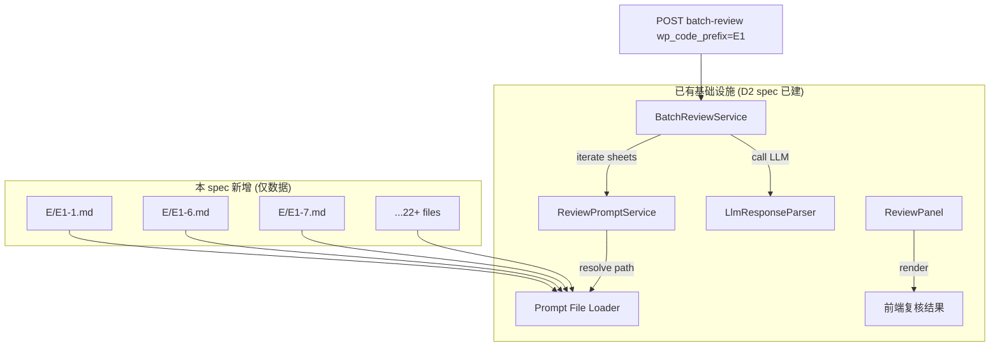

# Design Document: E1 货币资金底稿级复核提示词拆分

## Overview

本 spec 为纯数据交付：将科目级提示词 `货币资金提示词.md` 拆分为 22+ 个底稿级（sheet-level）Markdown 文件，存放于 `backend/data/tsj_review_prompts/E/` 目录。不新建任何服务、路由或前端组件——全部基础设施（ReviewPromptService / BatchReviewService / LlmResponseParser / ReviewPanel）由 D2 试点 spec (`review-prompt-sheet-level-split`) 已建且通用。

**核心设计决策：**
- 零代码变更，仅新增提示词文件
- 文件命名严格遵循 ReviewPromptService 的加载约定：`E/E1-{suffix}.md`
- 四大分组共用骨架（盘点/截止/IPO舞弊/其他），每张 sheet 在骨架基础上按业务细化
- 验证方式：运行 `batch-review` API with `wp_code_prefix="E1"`，确认 22+ sheets 全覆盖

## Architecture



**加载路径解析（已有逻辑，无需改动）：**
1. ReviewPromptService 收到 `wp_code="E1"` + `sheet_name="审定表E1-1"` 请求
2. 从 sheet_name 提取 suffix → `1`
3. 查找 `backend/data/tsj_review_prompts/E/E1-1.md`
4. 找到 → 返回 sheet-level 内容
5. 未找到 → 回退 `货币资金提示词.md`（subject-level）
6. 仍未找到 → 回退 generic 通用提示词

## Components and Interfaces

### 文件目录结构

```
backend/data/tsj_review_prompts/
├── 货币资金提示词.md              ← 源文件（保留，作 subject-level fallback）
├── E/                              ← 新建目录
│   ├── E1-1.md                    ← 审定表
│   ├── E1-2.md                    ← 现金明细
│   ├── E1-3.md                    ← 银行存款明细
│   ├── E1-4.md                    ← 数字货币明细
│   ├── E1-5.md                    ← 调整分录
│   ├── E1-6.md                    ← 余额调节表
│   ├── E1-7.md                    ← 库存现金盘点（人民币）
│   ├── E1-8.md                    ← 库存现金盘点（外币）
│   ├── E1-9.md                    ← 银行存单盘点
│   ├── E1-10.md                   ← 银行账户核对
│   ├── E1-11.md                   ← 承诺书
│   ├── E1-14.md                   ← 分析表
│   ├── E1-15.md                   ← 利息收入月度分析
│   ├── E1-18.md                   ← 企业信用报告查询
│   ├── E1-19.md                   ← 企业信用报告核对
│   ├── E1-20.md                   ← 应计利息测算
│   ├── E1-21.md                   ← 银行存款截止测试
│   ├── E1-22.md                   ← 其他货币资金截止测试
│   ├── E1-23.md                   ← 收支检查情况表
│   ├── E1-26.md                   ← IPO舞弊应对（大额定期存款）
│   ├── E1-27.md                   ← IPO舞弊应对（资金归集异常）
│   ├── E1-28.md                   ← IPO舞弊应对（频繁存取现金）
│   ├── E1-29.md                   ← IPO舞弊应对（跨行大额转账）
│   ├── E1-30.md                   ← IPO舞弊应对（关联方资金占用）
│   ├── E1-31.md                   ← IPO舞弊应对（异常开销户）
│   ├── E1-32.md                   ← IPO舞弊应对（信用报告异常）
│   ├── E1-note-listed.md          ← 附注（上市公司）
│   └── E1-note-soe.md             ← 附注（国有企业）
```

### 提示词内容结构（每文件通用骨架）

```markdown
# E1-{suffix} {sheet_name} 审计复核提示词

## 底稿概述
[该底稿审计目的 + 在 E1 循环中的定位]

## 复核要点清单
### 必检项目
- [ ] ...
### 条件检查项目
- [ ] ...
### 风险检查项目
- [ ] ...

## 数据勾稽关系
[与其他 E1 sheet 的数据联动关系]

## 常见问题模式
[该类底稿常见的错误模式和判断标准]

## 准则依据
[适用的 CAS/ISA 条款]
```

### 四大分组骨架设计

| 分组 | sheets | 共用骨架核心 | 差异化内容 |
|------|--------|-------------|-----------|
| 核心 | E1-1, E1-6, E1-14 | 无共用骨架，各自完整独立 | 高质量全覆盖 checklist |
| 盘点类 | E1-7, E1-8, E1-9 | 盘点程序执行/日期关系/差异处理/账实核对 | E1-7:人民币 E1-8:外币汇率 E1-9:存单到期日利率 |
| 截止类 | E1-21, E1-22 | 截止日前后交易归属/跨期金额重要性/凭证截止 | E1-21:银行存款 E1-22:保证金信用证 |
| IPO/舞弊 | E1-26~32 | 管理层动机/异常资金流转/体外循环/虚假函证 | 每张按检查范围细化(见 Req3.2) |

## Data Models

无新数据模型。提示词文件为静态 Markdown，由 ReviewPromptService 按路径约定加载到内存作为 LLM prompt context。

## Error Handling

| 场景 | 处理方式 | 已有机制 |
|------|---------|---------|
| E1 prompt 文件不存在 | 三级降级至 `货币资金提示词.md` | ReviewPromptService 内置 |
| subject-level 也不存在 | 降级至 generic prompt | ReviewPromptService 内置 |
| 文件编码错误 | UTF-8 读取失败 → 报 prompt_missing | Prompt File Loader 已处理 |
| batch-review 部分 sheet 无 prompt | 该 sheet 标记 `using_fallback`，继续处理余下 | BatchReviewService 已实现 |

## Correctness Properties

本 spec 不包含 Correctness Properties（property-based testing）。

**原因**：本 spec 是纯静态数据（Markdown 文件）的创建，不涉及纯函数或可变输入逻辑。ReviewPromptService 的通用行为正确性（路径解析、三级降级、内容解析）已由 D2 试点 spec 的 P1-P12 属性测试覆盖。本 spec 新增的验证属性 V1-V4 是覆盖率/结构检查，适合 example-based integration tests 而非 property-based tests。

## Testing Strategy

### 验证方式（纯集成验证）

D2 试点 spec 的 P1-P12 已覆盖 ReviewPromptService 的通用行为正确性（路径解析/降级/解析）。本 spec 仅需验证：

1. **文件存在性检查（冒烟测试）**
   - 验证 `backend/data/tsj_review_prompts/E/` 目录存在
   - 验证 22+ 个 `.md` 文件全部存在且非空
   - 验证文件名符合 `E1-{suffix}.md` 命名约定

2. **内容结构检查（lint）**
   - 每个文件包含 `# E1-` 标题
   - 每个文件包含 `## 复核要点清单` 或等价章节
   - 每个文件包含至少 3 个 `- [ ]` 检查项

3. **端到端集成验证**
   - 启动后端服务
   - `POST /api/projects/{pid}/batch-review` body: `{wp_code_prefix: "E1"}`
   - 验证响应包含 22+ sheet 结果
   - 验证 `sheets_with_dedicated_prompt >= 22`
   - 验证无 `prompt_missing` 错误

4. **E-specific 覆盖率属性（唯一新增验证逻辑）**

### E-Specific Verification Properties

以下属性为本 spec 独有的验证规则，补充 D2 spec P1-P12 的通用覆盖：

**V1: E1 全覆盖完整性**
- 对于 E1 循环中的所有已实例化底稿，batch-review 应返回非空结果

**V2: 四分组归属正确性**  
- E1-7/E1-8/E1-9 的 prompt 内容均包含"盘点"关键词
- E1-21/E1-22 的 prompt 内容均包含"截止"关键词
- E1-26~32 的 prompt 内容均包含"舞弊"关键词

**V3: 核心 sheet checklist 密度**
- E1-1, E1-6, E1-14 各自包含 ≥10 个 `- [ ]` checklist 项

**V4: 骨架共享一致性**
- 盘点类三文件（E1-7/8/9）共享至少 3 个相同 checklist 项
- 截止类两文件（E1-21/22）共享至少 3 个相同 checklist 项  
- IPO/舞弊类七文件（E1-26~32）共享至少 3 个相同 checklist 项

### 验证脚本

新建 `backend/scripts/check/check_e1_review_prompts.py`：
- `--lint`：静态检查文件存在性 + 结构
- `--coverage`：检查 V1-V4 属性
- `--e2e`：调用 batch-review API 验证端到端（需后端运行）
- 可挂 CI（governance-checks.yml）
