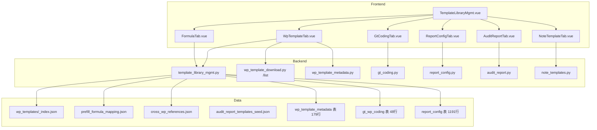
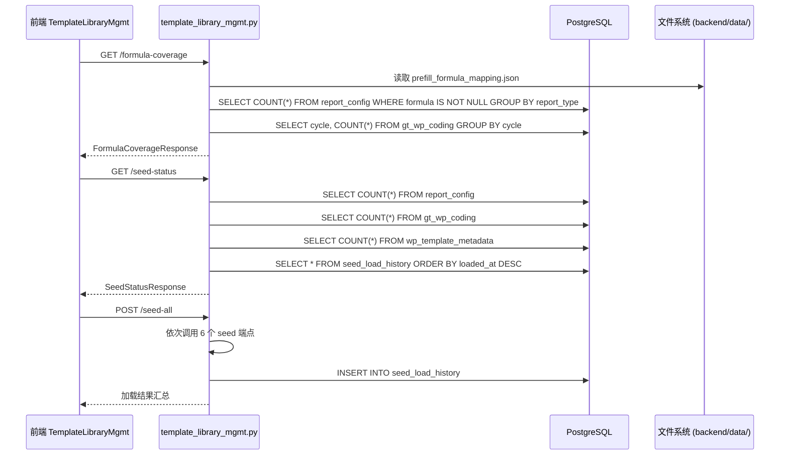

# 设计文档：全局模板库管理系统

## Overview

本设计整合致同审计平台 5 大模板库 + 1 套编码体系为统一管理页面，提供浏览、编辑、种子加载、版本管理、覆盖率统计等能力。

核心目标：
- 管理员在一个页面总览全部模板资源（476 文件/180 编码/94 公式映射/1191 报表行次/48 编码/8 种审计报告模板）
- 审计助理快速了解公式覆盖情况和底稿清单
- 项目经理查看模板与项目的关联状态
- WorkpaperWorkbench 树形数据源从 118 条映射升级为 180 个完整模板

## Architecture

### 架构决策

**D1: 新建独立路由 vs 扩展现有路由**
- 决策：新建 `backend/app/routers/template_library_mgmt.py`（prefix="/api/template-library-mgmt"）
- 理由：现有 `template_library.py` 负责三层体系（事务所/集团/项目），职责不同；新路由专注"全局管理视图"的聚合查询和种子加载状态

**D2: 前端页面架构**
- 决策：新建 `TemplateLibraryMgmt.vue` 单页面 + 6 个 Tab 子组件
- 理由：6 个子模块数据独立、交互独立，Tab 切换比路由跳转更轻量；不用 GtPageHeader 紫色渐变（简单 CRUD 页面用白色简洁工具栏）

**D3: WorkpaperWorkbench 树形数据源**
- 决策：复用现有 `GET /api/projects/{pid}/wp-templates/list` 端点，增强返回字段
- 理由：该端点已返回 180 个唯一 wp_code，只需补充 component_type/has_formula/generated 等字段

**D4: 种子加载状态追踪**
- 决策：不新建表，通过 COUNT 查询各表记录数 + 与 seed 文件条目数对比推导状态
- 理由：避免额外表维护成本；seed 文件条目数固定可硬编码或从文件读取

**D5: 公式覆盖率统计**
- 决策：实时计算（非缓存），从 prefill_formula_mapping.json + report_config 表聚合
- 理由：数据量小（94 映射 + 1191 行），查询耗时 <100ms；避免缓存一致性问题

**D6: 版本管理**
- 决策：轻量级方案——页面顶部显示硬编码版本标识 + seed_load_history 表记录加载时间戳
- 理由：当前模板版本固定为"致同 2025 修订版"，无需复杂版本控制系统

**D7: 权限控制**
- 决策：复用现有 `get_current_user` + 前端 `v-permission` 指令
- 理由：admin/partner 可编辑，其他角色只读；与现有权限体系一致

**D8: 前端表格样式**
- 决策：数字列统一 `.gt-amt` class（Arial Narrow + nowrap + tabular-nums）；最大化数据显示区域
- 理由：遵循用户偏好，工具栏按钮合并到 Tab 栏右侧

### 系统架构图



## Components and Interfaces

### 后端新增路由：template_library_mgmt.py

路由前缀：`/api/template-library-mgmt`（内部含完整 /api 前缀，注册时不加额外前缀）

| 端点 | 方法 | 描述 |
|------|------|------|
| `/formula-coverage` | GET | 公式覆盖率统计（按循环+按报表类型） |
| `/prefill-formulas` | GET | 全部 94 个预填充映射详情 |
| `/cross-wp-references` | GET | 全部 20 条跨底稿引用规则 |
| `/seed-status` | GET | 各种子数据加载状态 |
| `/seed-all` | POST | 一键加载全部种子 |
| `/version-info` | GET | 模板版本信息 |

### 现有端点增强：wp_template_download.py /list

增强 `GET /api/projects/{pid}/wp-templates/list` 返回字段：

```python
# 新增字段
{
    "wp_code": "D1",
    "wp_name": "应收票据",
    "cycle": "D",
    "cycle_name": "D 销售循环",
    "filename": "D1 应收票据.xlsx",
    "format": "xlsx",
    # --- 新增 ---
    "component_type": "univer",      # 从 wp_template_metadata 合并
    "audit_stage": "substantive",    # 从 wp_template_metadata 合并
    "linked_accounts": ["1121"],     # 从 wp_template_metadata 合并
    "has_formula": true,             # 从 prefill_formula_mapping 判断
    "file_count": 3,                 # 该 wp_code 对应的文件数量
    "generated": false,              # 是否已在当前项目生成底稿
    "sort_order": 4                  # 从 gt_wp_coding 取排序
}
```

### 前端组件层级

```
views/
  TemplateLibraryMgmt.vue          # 主页面（6 Tab）
components/
  template-library/
    WpTemplateTab.vue              # Tab 1: 底稿模板库
    FormulaTab.vue                 # Tab 2: 公式管理
    AuditReportTab.vue             # Tab 3: 审计报告模板
    NoteTemplateTab.vue            # Tab 4: 附注模板
    GtCodingTab.vue                # Tab 5: 编码体系
    ReportConfigTab.vue            # Tab 6: 报表配置
    SeedLoaderPanel.vue            # 种子加载面板（嵌入主页面顶部）
    FormulaCoverageChart.vue       # 覆盖率仪表盘
    WpTemplateDetail.vue           # 底稿模板详情面板
```

### WorkpaperWorkbench.vue 改造

```
变更点：
- treeData 数据源从 mappings 改为 /api/projects/{pid}/wp-templates/list
- 按 gt_wp_coding.sort_order 排序循环节点
- 未生成底稿的节点灰色文字
- 循环节点旁显示进度（已完成/总数）
- 顶部全局进度条（已生成底稿数/180）
```

## Data Models

### 新增表：seed_load_history

```sql
CREATE TABLE seed_load_history (
    id UUID PRIMARY KEY DEFAULT gen_random_uuid(),
    seed_name VARCHAR(100) NOT NULL,       -- report_config / gt_wp_coding / ...
    loaded_at TIMESTAMPTZ NOT NULL DEFAULT NOW(),
    loaded_by UUID REFERENCES users(id),
    record_count INTEGER NOT NULL DEFAULT 0,
    inserted INTEGER NOT NULL DEFAULT 0,
    updated INTEGER NOT NULL DEFAULT 0,
    errors JSONB DEFAULT '[]',
    status VARCHAR(20) NOT NULL DEFAULT 'loaded'  -- loaded / partial / failed
);
CREATE INDEX idx_seed_load_history_name ON seed_load_history(seed_name, loaded_at DESC);
```

### 现有表引用（只读聚合）

| 表名 | 用途 | 行数 |
|------|------|------|
| `gt_wp_coding` | 编码体系展示 | 48 |
| `report_config` | 报表行次配置 | 1191 |
| `wp_template_metadata` | 底稿模板元数据 | 179 |
| `working_paper` | 判断模板是否已生成底稿 | 动态 |

### 现有 JSON 文件引用（只读）

| 文件 | 用途 | 规模 |
|------|------|------|
| `wp_templates/_index.json` | 模板文件索引 | 476 条 |
| `prefill_formula_mapping.json` | 预填充公式 | 94 映射/481 单元格 |
| `cross_wp_references.json` | 跨底稿引用 | 20 条 |
| `audit_report_templates_seed.json` | 审计报告模板 | 8 种意见类型 |
| `note_template_soe.json` / `note_template_listed.json` | 附注模板 | SOE+Listed |

### API 响应模型

```python
# 公式覆盖率响应
class FormulaCoverageResponse(BaseModel):
    prefill_coverage: list[CycleCoverage]      # 按循环的预填充覆盖率
    report_formula_coverage: list[ReportTypeCoverage]  # 按报表类型的公式覆盖率
    formula_type_distribution: list[FormulaTypeCount]  # 公式类型分布
    no_formula_templates: list[NoFormulaItem]   # 无公式底稿清单

class CycleCoverage(BaseModel):
    cycle: str
    cycle_name: str
    total_templates: int
    templates_with_formula: int
    coverage_percent: float

class ReportTypeCoverage(BaseModel):
    report_type: str
    total_rows: int
    rows_with_formula: int
    coverage_percent: float

# 种子状态响应
class SeedStatusResponse(BaseModel):
    seeds: list[SeedInfo]

class SeedInfo(BaseModel):
    seed_name: str
    last_loaded_at: str | None
    record_count: int
    expected_count: int
    status: str  # loaded / not_loaded / partial
```

### 数据流图




## Correctness Properties

*A property is a characteristic or behavior that should hold true across all valid executions of a system—essentially, a formal statement about what the system should do. Properties serve as the bridge between human-readable specifications and machine-verifiable correctness guarantees.*

### Property 1: Role-based edit visibility

*For any* user with a given role, edit/delete action buttons are visible if and only if the role is in {admin, partner}; all other roles see read-only content with no mutation controls.

**Validates: Requirements 1.2, 1.3, 11.4**

### Property 2: Template list completeness and field presence

*For any* item returned by `GET /api/projects/{pid}/wp-templates/list`, it must contain non-null values for wp_code, wp_name, cycle, cycle_name, format, file_count, and sort_order; and if the template has a wp_template_metadata record, component_type and linked_accounts must also be present.

**Validates: Requirements 2.3, 3.2, 16.2, 16.4**

### Property 3: Cycle sort order

*For any* two adjacent cycle groups in the template list response, the first group's sort_order (from gt_wp_coding) must be less than or equal to the second group's sort_order.

**Validates: Requirements 2.4, 16.3**

### Property 4: Template count per cycle

*For any* cycle node in the tree, the displayed count must equal the actual number of templates whose wp_code starts with that cycle's code_prefix.

**Validates: Requirements 2.5, 11.3**

### Property 5: Search filter correctness

*For any* search query string and any filter combination (component_type, cycle), all returned templates must satisfy: (a) wp_code or wp_name contains the search string (case-insensitive), AND (b) component_type matches the filter if set, AND (c) cycle matches the filter if set.

**Validates: Requirements 5.1, 5.4, 5.5**

### Property 6: Coverage calculation correctness

*For any* coverage entry (whether by cycle for prefill or by report_type for report formulas), coverage_percent must equal (items_with_formula / total_items) × 100, rounded to one decimal place.

**Validates: Requirements 7.5, 8.2, 8.3, 17.2, 17.3**

### Property 7: Coverage color coding

*For any* coverage percentage value, the assigned color level must be: green if ≥ 80, yellow if 40–79, red if < 40.

**Validates: Requirements 8.4, 20.4**

### Property 8: Seed status derivation

*For any* seed entry, status must be "not_loaded" when record_count = 0, "partial" when 0 < record_count < expected_count, and "loaded" when record_count ≥ expected_count.

**Validates: Requirements 18.4, 18.5**

### Property 9: Seed load resilience

*For any* batch seed load operation where one or more individual seeds fail, all remaining seeds must still be attempted, and the response must contain per-seed results (inserted/updated/failed counts) for every seed regardless of others' success or failure.

**Validates: Requirements 13.3, 13.4**

### Property 10: Generated field correctness

*For any* template in the list response for a given project, the `generated` boolean field must be true if and only if at least one working_paper record exists with that wp_code in the specified project.

**Validates: Requirements 4.8, 16.5**

### Property 11: File count accuracy

*For any* template in the list response, the `file_count` field must equal the number of entries in `_index.json` whose wp_code matches that template's wp_code.

**Validates: Requirements 3.3, 16.6**

### Property 12: Progress calculation

*For any* scope (global or per-cycle), the progress value must equal the count of templates with `generated=true` divided by the total template count in that scope.

**Validates: Requirements 4.10, 20.1, 20.2**

### Property 13: "Only with data" filter

*For any* template hidden by the "仅有数据" filter, all of its linked_accounts must have zero balance in the project's trial balance; templates without linked_accounts (B/C/A/S types) must never be hidden by this filter.

**Validates: Requirements 19.1, 19.2**

### Property 14: Seed load history audit trail

*For any* seed load operation (single or batch), a new record must be inserted into seed_load_history containing the correct seed_name, loaded_by (current user ID), loaded_at (current timestamp), and accurate record_count.

**Validates: Requirements 14.3, 13.6**

### Property 15: Invalid formula reference detection

*For any* report_config formula containing a `ROW('xxx')` reference, if 'xxx' does not exist as a row_code in the same applicable_standard's report_config entries, the formula must be flagged as having an invalid reference.

**Validates: Requirements 7.6**

## Error Handling

| 场景 | 处理方式 |
|------|----------|
| `_index.json` 不存在或解析失败 | 返回空列表 + 日志 warning |
| `prefill_formula_mapping.json` 读取失败 | 公式覆盖率返回 0% + 日志 warning |
| 单个 seed 加载失败 | 记录错误到 seed_load_history(status=failed) + 继续后续 seed |
| gt_wp_coding 表为空 | 循环排序 fallback 到字母序 |
| wp_template_metadata 无记录 | component_type 返回 null，不影响列表展示 |
| 非 admin/partner 尝试编辑操作 | 后端返回 403 Forbidden |
| 项目不存在或无权限 | 复用现有 `require_project_access` 返回 404/403 |

## 补充设计：枚举字典管理 + 自定义查询（需求 21-22）

### D9: 枚举字典管理

- 决策：复用现有 `GET /api/system/dicts` 端点 + 前端 `useDictStore`，在模板库管理页新增 Tab 展示
- 现有基础：后端 `system_dicts.py` 已提供 9 套字典（wp_status/wp_review_status/project_status 等），前端 `GtStatusTag` 已从 dictStore 取值
- 新增能力：admin 可在 Tab 内新增/修改/禁用枚举项 + 显示引用计数 + 排序
- 前端组件：`components/template-library/EnumDictTab.vue`

### D10: 自定义查询

- 决策：复用现有 `backend/app/routers/custom_query.py`（已注册在 router_registry §6 合并报表组），前端新增可视化查询构建器
- 现有基础：`/api/custom-query` 端点已存在，前端 `views/CustomQuery.vue` 已有基础页面
- 新增能力：查询模板保存/共享 + 可视化条件构建器 + 结果导出 Excel + 在模板库管理页内嵌 Tab
- 数据源：底稿(working_paper) / 试算表(trial_balance) / 调整分录(adjustments) / 科目余额(tb_balance) / 序时账(tb_ledger) / 附注(disclosure_notes) / 报表行次(report_config) / 工时(work_hours)
- 前端组件：`components/template-library/CustomQueryTab.vue`（内嵌模式）+ 独立页面 `/custom-query`（已有）

## Testing Strategy

### 单元测试

- `test_template_library_mgmt.py`：覆盖 formula-coverage/seed-status/prefill-formulas/cross-wp-references 端点
- `test_wp_template_list_enhanced.py`：覆盖增强后的 /list 端点字段完整性、排序、generated 字段
- `test_seed_load_history.py`：覆盖 seed_load_history 表的 CRUD 和状态推导

### 属性测试（Property-Based Testing）

使用 `hypothesis` 库，每个属性测试最少 100 次迭代。

```python
# 标签格式示例
# Feature: template-library-coordination, Property 8: Seed status derivation
@given(record_count=st.integers(min_value=0, max_value=2000),
       expected_count=st.integers(min_value=1, max_value=2000))
def test_seed_status_derivation(record_count, expected_count):
    status = derive_seed_status(record_count, expected_count)
    if record_count == 0:
        assert status == "not_loaded"
    elif record_count < expected_count:
        assert status == "partial"
    else:
        assert status == "loaded"
```

关键属性测试清单：
- Property 5: 搜索筛选正确性（生成随机 wp_code/wp_name + 随机查询串）
- Property 6: 覆盖率计算正确性（生成随机 total/with_formula 组合）
- Property 7: 颜色编码正确性（生成随机百分比值）
- Property 8: 种子状态推导（生成随机 record_count/expected_count）
- Property 11: 文件计数准确性（生成随机 _index 数据）
- Property 13: "仅有数据"筛选逻辑（生成随机余额数据 + linked_accounts）
- Property 15: 无效公式引用检测（生成随机 ROW() 引用 + row_code 集合）

### 前端测试

- Vitest 单测：覆盖 Tab 切换、搜索过滤、覆盖率颜色计算
- 手动 UAT：6 个 Tab 完整浏览、种子加载流程、WorkpaperWorkbench 树形展示

### 测试配置

- 属性测试库：`hypothesis`（Python，已安装）
- 每个属性测试 `max_examples=100`
- 标签格式：`Feature: template-library-coordination, Property {number}: {title}`
