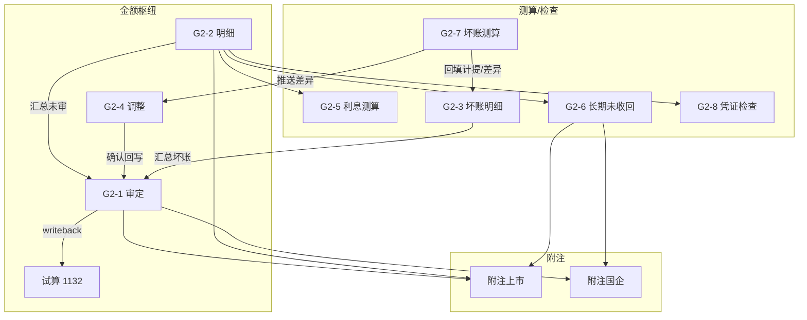

# G2 应收利息 — 底稿编制手册

> **适用范围**：科目 **1132**（应收利息）结构化底稿包  
> **组件**：`g2-interest-receivable`  
> **说明**：本手册说明各分表的审计目标、编制逻辑与勾稽关联。  
> **不替代**各表页内已有的审计目标/过程提示文案。  
> 平台按钮与操作步骤见「使用手册」页签。

---

## 1. 总体编制思路

G2 把「应收利息」拆成四条证据链，最后汇入审定与附注：

| 证据链 | 主要底稿 | 回答的问题 |
|--------|----------|------------|
| **金额枢纽** | G2-2 → G2-1 ← G2-4 | 未审→调整→审定是否完整准确？ |
| **计息/存在** | G2-5；G2-8 | 利息测算与凭证抽查是否支持账面？ |
| **减值/坏账** | G2-7 → G2-3；G2-6 | ECL 测算、滚动态与长期挂账是否充分？ |
| **披露** | 附注上市 / 附注国企 | 分类、逾期、坏账变动是否可勾稽？ |

**枢纽原则**：

1. **G2-2 明细表是数据枢纽**——G2-5/6/8/附注多从明细带入。  
2. **G2-4 是调整枢纽**——测算差异可推送为调整草稿，**确认**后回写 G2-1。  
3. **G2-1 是结论枢纽**——与试算 1132、附注披露勾稽；审定变更回写试算。  
4. **G2A 程序表**统领「做了哪些程序」；分表记录「证据与结论」。

### 建议编制顺序（标准路径）

```
G2A 程序计划
  → G2-2 明细（先立清单 + 账龄口径）
  → 并行：G2-5 利息测算；G2-7 坏账测算 → 回填 G2-3；G2-6 长期挂账；G2-8 抽凭
  → 差异汇入 G2-4 → 确认回写 G2-1
  → G2-1「从 G2-2/G2-3 汇总未审」+ 取/回写试算 1132
  → 附注上市 / 附注国企
```

---

## 2. 关联总图



---

## 3. 分表要点

| 分表 | 审计目标摘要 | 关键勾稽 |
|------|--------------|----------|
| **G2A** | 程序计划与索引 | — |
| **G2-1** | 原值/坏账/净值审定；变动分析；试算勾稽 | G2-2/3 未审、G2-4 调整、TB 1132 |
| **G2-2** | 明细滚动核对 + 账龄枚举 | 合计→G2-1；带入下游 |
| **G2-3** | 坏账准备滚动态（单项+组合） | G2-7 计提回填；→G2-1 坏账 |
| **G2-4** | 账项/报表调整汇总 | 确认→G2-1 原值·组合期末调整 |
| **G2-5** | 独立利息测算（365 天） | ⑤↔G2-1 原值；与 G2-2 计息勾稽 |
| **G2-6** | 长期未收回可收回性 | 超1年自 G2-2；Stage 建议衔接减值 |
| **G2-7** | 单项/账龄/其他组合 ECL 测算 | 差异→G2-4；计提→G2-3 |
| **G2-8** | 借方确认/贷方回笼抽查 | 总体可自 G2-2；异常索引 G2-4 |
| **附注** | 分类、重要逾期、ECL 变动 | 与 G2-1 坏账勾稽；同步附注模块 |

### 账龄口径

G2-2/3/6/7 支持 **3年段 / 5年段 / 自定义**。任一张表可「同步账龄至各表」，避免分表口径分叉。

### 坏账路径

1. G2-7 测算应计提与账面差异；  
2. 默认将**差异**回填 G2-3「本期计提」（亦可选应计提全额）；  
3. 显著差异推送 G2-4，确认后回写 G2-1；  
4. G2-1 从 G2-3 汇总坏账审定。

---

## 4. 试算勾稽

- G2-1 合计（净值）应对齐试算 **1132**。  
- 「取试算 1132」拉入核对参考；审定变更自动 **回写试算**（需项目上下文）。  
- 差异≠0 时应分析原因或补调整。

---

*与使用手册同版本维护。*
