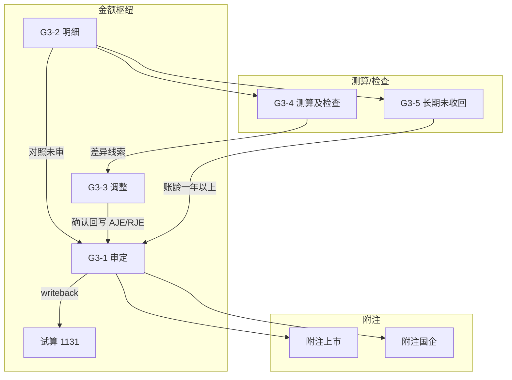

# G3 应收股利 — 底稿编制手册

> **适用范围**：科目 **1131**（应收股利）结构化底稿包  
> **组件**：`g3-dividend-receivable`  
> **说明**：本手册说明各分表的审计目标、编制逻辑与勾稽关联。  
> **不替代**各表页内已有的审计目标/过程提示文案。  
> 平台按钮与操作步骤见「使用手册」页签。

---

## 1. 总体编制思路

G3 把「应收股利」拆成四条证据链，最后汇入审定与附注：

| 证据链 | 主要底稿 | 回答的问题 |
|--------|----------|------------|
| **金额枢纽** | G3-2 → G3-1 ← G3-3 | 未审→调整→审定是否完整准确？ |
| **存在/准确性/截止** | G3-4 | 增加测算（账面−测算）？减少是否收现/正当转出？期后收回能否印证期末余额？ |
| **可收回性** | G3-5 | 长期未收回是否评估充分？ |
| **披露** | 附注上市 / 附注国企 | 分类与金额是否可勾稽至审定？ |

**枢纽原则**：

1. **G3-2 明细表是数据枢纽**——测算/逾期/附注多参照明细。  
2. **G3-3 是调整枢纽**——借贷平衡后点**确认回写**，净额落入 G3-1「账项调整汇总」。  
3. **G3-1 是结论枢纽**——与试算 1131、附注披露勾稽；审定变更回写试算；承载同比分析与账龄勾稽。  
4. **G3A 程序表**统领「做了哪些程序」；分表记录「证据与结论」。

### 相对 Excel 模板的结构化增强

致同 Excel（G3-1）以「账龄一年以内 / 一年以上」两行 + 期初/期末调整列 + 同比变动为主。平台保留该审计逻辑，但按**被投资方**立行并加入本期宣告/收回滚算，更利于实质性测试：

| Excel 模板要素 | 平台落点 |
|----------------|----------|
| 期初/期末 × 未审·账项·重分类·审定 | G3-1 同行组列；期末未审由滚算公式得出 |
| 本期未审/审定同比变动额·率 | 「同比（审定）」列；\|变动率\|>30% 原因分析必填 |
| 账龄一年内/一年以上 | G3-1 账龄汇总条（一年以上 ← G3-5 逾期≥365 天） |
| 波动原因与一年以上可收回性说明 | 行内原因分析 + 审计说明占位提示 |
| 特别风险（关联方/估计/异常交易） | 编制提示 + 索引至 G3-2/G3-4/G3-5/G3-3 |

### 建议编制顺序（标准路径）

```
G3A 程序计划
  → G3-2 明细（按被投资方立清单：持股、分红方案、应收/已收）
  → 并行：G3-4 增加测算/减少检查/期后收回；G3-5 长期未收回
  → 差异汇入 G3-3 → 确认回写 G3-1
  → G3-1 取/回写试算 1131，核对差异为 0；补齐 >30% 波动原因；核对账龄条
  → 附注上市 / 附注国企
```

---

## 2. 关联总图



---

## 3. 分表编制要点

| 分表 | 目标 | 关键公式 / 勾稽 |
|------|------|------------------|
| **G3A** | 程序计划与索引 | 程序勾选 ↔ 分表证据 |
| **G3-1** | 按被投资方审定 | 期初审定=未审+AJE+RJE（期初 AJE/RJE 仅前期差错/重述）；期末未审=期初审定+宣告−收回；期末审定=未审+AJE+RJE；变动额/率=期末审定−期初审定；\|变动率\|>30% 填原因；账龄条勾稽 G3-5；合计 ↔ TB 1131 |
| **G3-2** | 明细清单 | 权益份额、分红总额、实际分红率、期末应收 |
| **G3-3** | AJE/RJE | 借贷平衡；1131 借−贷净额 → G3-1 期末 AJE/RJE |
| **G3-4** | 测算+减少+期后 | 测算=持股×每股股利；差异=账面已计−测算；减少差异=本期减少−收现−其他；期后抽凭+勾选1–5；\|差异\|>100 高亮 |
| **G3-5** | 逾期可收回性 | 逾期天数；风险等级与可收回性评估；供 G3-1 账龄汇总 |
| **附注** | 披露 | 与 G3-1 审定勾稽 |

---

## 4. 试算勾稽

- G3-1 期末审定合计应对齐试算 **1131**。  
- 「取试算 1131」拉入核对参考；审定变更自动 **回写试算**（需项目上下文）。  
- 差异≠0 红色高亮，需查明后调整未审、调整分录或试算。

---

## 5. 常见误区

1. **只录 G3-3 不点确认**——不会写入 G3-1 AJE/RJE。  
2. **科目代码未写 1131**——确认回写时净额为 0。  
3. **G3-4 不填账面已计**——测算差异恒等于 −测算数，失去核对意义。  
3b. **G3-4 只做测算不做减少/期后**——只能验证计提，无法印证冲减与期末存在性。  
4. **只用明细凑审定、不取试算**——容易漏与 TB 勾稽。  
5. **把期初 AJE/RJE 当常规调整**——期初调整仅用于前期差错/重述；常规调整应进期末 AJE/RJE（经 G3-3）。  
6. **|变动率|>30% 不写原因**——行内原因分析与审计说明均应覆盖。  
7. **G3-5 空着却在说明里写「无一年以上」**——先补 G3-5，再看 G3-1 账龄条。
