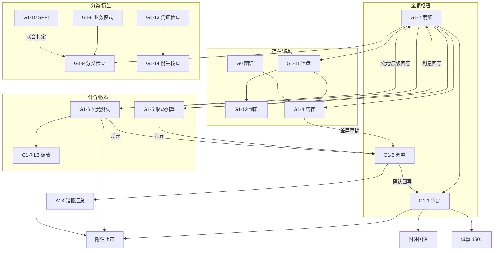

# G1 交易性金融资产 — 底稿编制手册

> **文档副本**：仓库可读版见 `audit-platform/docs/handbooks/`；  
> 程序内弹窗以本目录 `preparation.md` / `usage.md` 为准（G1A 程序控制台「编制手册」按钮）。
>
> **适用范围**：科目 **1501**（交易性金融资产）结构化底稿包  
> **组件**：`g1-trading-financial-assets`  
> **说明**：本手册说明各分表的审计目标、编制逻辑与勾稽关联。  
> **不替代**各表页内已有的审计目标/过程提示文案（页内说明保持不变）。  
> 平台按钮与操作步骤见「使用手册」页签。

---

## 1. 总体编制思路

G1 把「交易性金融资产」拆成四条证据链，最后汇入审定与附注：

| 证据链 | 主要底稿 | 回答的问题 |
|--------|----------|------------|
| **金额枢纽** | G1-2 → G1-1 ← G1-3 | 未审→调整→审定是否完整准确？ |
| **存在/权利** | G1-11 → G1-12；G1-4（+G0 函证） | 账实、对账、函证是否一致？ |
| **计价/收益** | G1-5、G1-6 → G1-7 | 利息股利与公允价值是否合理？ |
| **分类/衍生** | G1-8 → G1-10 / G1-9；G1-13 → G1-14 | CAS22 分类与衍生识别是否恰当？ |

**枢纽原则**：

1. **G1-2 明细表是数据枢纽**——绝大多数下游表从 G1-2 带入证券清单与账面数。  
2. **G1-3 是调整枢纽**——结存/收益/公允等差异可推送为调整草稿，确认后回写 G1-1。  
3. **G1-1 是结论枢纽**——与试算 1501、附注披露勾稽。  
4. **G1A 程序表**统领「做了哪些程序」；分表记录「证据与结论」。

### 建议编制顺序（标准路径）

```
G1A 程序计划
  → G1-2 明细（先立清单）
  → 并行：分类链 G1-8 → G1-10 / G1-9
         存在链 G1-11 → G1-12 → G1-4（+函证）
         计价链 G1-5、G1-6 → G1-7
         检查链 G1-13 → G1-14
  → 差异汇入 G1-3 → 确认回写 G1-1
  → 附注上市 / 附注国企
```

可按项目风险裁剪（如无实物券可弱化 G1-11/12；无 L3 可弱化 G1-7），但 **G1-2 → G1-1** 与 **分类结论可追溯** 不宜省略。

---

## 2. 关联总图



### 主要跨模块事件（实现层）

| 事件 | 含义 | 状态 |
|------|------|------|
| `g1:detail-updated` | 明细被收益/公允等回写后刷新 G1-2 | **已接线**（`useG1Detail` 监听） |
| `g1:adjustment-confirmed` | G1-3 确认 → G1-1 期末调整回写 | **已接线**（直写 `G1-1-rows` + 事件） |
| `g1:writeback-trial-balance` | G1-1 → 试算 1501 | **已接线**（宿主写回试算 API） |
| `g1:business-model-updated` | G1-8 结论变更旁路通知 | 旁路；主路径 G1-9 读 `allResponses` |
| `g1:level3-updated` | G1-6 → G1-7 旁路通知 | 旁路；主路径 G1-7 读共享 store |
| `disclosure:note-text-updated` | 附注文本同步 | 已接线 |
| `adjustment:created` | 差异推送产生的调整草稿信号 | 已接线 |

---

## 3. 分表编制说明

每张表按统一结构：**审计目标 → 编制逻辑 → 上游/下游 → 完成标志**。

---

### G1A 实质性程序表

| 项 | 内容 |
|----|------|
| **审计目标** | 规划并记录针对 1501 的实质性程序范围、性质与时间；与风险评估、认定对应。 |
| **编制逻辑** | 按程序模板勾选/填写执行情况与索引；结论与分表发现一致。 |
| **上游** | 计划阶段风险与重要性 |
| **下游** | 各分表为程序的执行载体；异常指向 G1-3 / A13 |
| **完成标志** | 计划程序均有执行记录或「不适用」说明；索引可跳转分表 |

---

### G1-1 审定表

| 项 | 内容 |
|----|------|
| **审计目标** | 核实投资成本、累计公允价值变动及账面余额的准确完整；分类列报恰当；为报表与附注提供审定数。 |
| **编制逻辑** | 期初/期末 × 未审 / 账项调整 / 审定；按「投资成本 / 累计 FV / 账面余额」× 会计分类 × 品种展开；审定 = 未审 + 调整。 |
| **上游** | G1-2 汇总未审；G1-3 确认回写期末调整 |
| **下游** | 试算 1501；附注上市/国企 |
| **完成标志** | 与 TB 勾稽差异已解释；调整来源可追溯至 G1-3；结论已填 |

---

### G1-2 明细表（数据枢纽）

| 项 | 内容 |
|----|------|
| **审计目标** | 核实存在、完整、权利与计价；验证成本与累计公允滚动及分类；支撑 G1-1。 |
| **编制逻辑** | 逐笔证券：会计三分类 × 品种；成本桶与累计公允变动桶滚动至期末；编制闸门控制关键字段完备性。 |
| **上游** | 序时账/明细账、期初审定、本期买卖；可被 G1-5（利息）、G1-6（公允/层级）回写 |
| **下游** | G1-1/4/5/6/7/9/11 等带入源 |
| **完成标志** | 清单完整、滚动勾稽通过、闸门无阻塞项；与 G1-1 汇总一致 |

---

### G1-3 调整分录汇总

| 项 | 内容 |
|----|------|
| **审计目标** | 核实 1501 及相关损益科目调整完整、借贷平衡；与调整模块、G1-1 一致。 |
| **编制逻辑** | 分录行（描述/科目/借贷/类别/索引）；可从调整模块按科目前缀（1501/6101/6111/1503 等）同步；确认后净调整回写 G1-1，并可推送 A13。 |
| **上游** | 调整分录模块；G1-4/5/6 等差异推送草稿 |
| **下游** | G1-1；A13 |
| **完成标志** | 借贷平衡；已确认回写；索引指向证据表 |

---

### G1-4 结存表（多源核对）

| 项 | 内容 |
|----|------|
| **审计目标** | 存在、完整、权利义务及计价；账面与库存/对账单/函证交叉核对。 |
| **编制逻辑** | ①账面 − ②库存 −（③对账单 **或** ④函证）→ ⑤差异。证据源可按行指定（自动：函证优先，否则对账单；或仅监盘）。 |
| **上游** | G1-2（账面）；G1-11（监盘②）；G0-3S / G0-1（函证④） |
| **下游** | 差异 → G1-3；与 G1-12 职责互补（见下） |
| **与 G1-12 分工** | **G1-4** 做报表日「多源外部证据」对照；**G1-12** 做「盘点日 → 报表日」时间倒轧。二者都服务存在认定，勿互相替代。 |
| **完成标志** | 重大差异已说明或已推送调整；证据索引齐全 |

---

### G1-5 收益测算表

| 项 | 内容 |
|----|------|
| **审计目标** | 核实本期投资收益（利息/股利）及处置损益准确；债类应计利息与账面勾稽。 |
| **编制逻辑** | 债息（合同本金×利率×持有天数）/ 股利 / 处置损益分表测算；与账面投资收益、应计利息核对。 |
| **上游** | G1-2 |
| **下游** | 利息可回写 G1-2；差异 → G1-3 |
| **完成标志** | 测算与账面差异已解释；需调整项已入 G1-3 |

---

### G1-6 公允价值测试表

| 项 | 内容 |
|----|------|
| **审计目标** | 期末以公允价值计量；层次与估值输入合理；测试值与账面差异可解释。 |
| **编制逻辑** | 账面公允 vs 独立测试值；标注 L1/L2/L3 与取证来源；差异分析。 |
| **上游** | G1-2 |
| **下游** | 回写 G1-2 期末公允/层级；L3 推送 G1-7；差异 → G1-3；支撑附注层次披露 |
| **完成标志** | 抽样或全覆盖策略已记录；L3 已衔接 G1-7；附注金额可勾稽 |

---

### G1-7 第三层次公允价值调节表

| 项 | 内容 |
|----|------|
| **审计目标** | L3 资产以恰当金额列示；调节与披露完整。 |
| **编制逻辑** | 期初 → 转入/转出 → 当期损益 → 购入/出售 → 期末；可按品种拆分供附注。 |
| **上游** | G1-2、G1-6 |
| **下游** | 附注上市 L3 段 |
| **完成标志** | 期末与 G1-6/G1-2 L3 合计一致；调节项有业务含义 |

---

### G1-8 业务模式评估问卷

| 项 | 内容 |
|----|------|
| **审计目标** | 评价管理金融资产的业务模式是否恰当（持有收取 / 兼有 / 其他）。 |
| **编制逻辑** | 是/否问卷 → 自动结论芯片；可维护次级组合；结论写入 `G1-8-model-result`。交易性常见为「其他业务模式」（FVTPL）。 |
| **上游** | 管理层政策、投资策略访谈/文件 |
| **下游** | G1-9「从 G1-8 带入依据」；与 G1-10 联合支撑分类 |
| **完成标志** | 问卷答完、结论合理；次级组合（如有）已说明 |

---

### G1-9 分类适当性检查表

| 项 | 内容 |
|----|------|
| **审计目标** | 确认以 FVTPL 计量的分类正确（交易性意图 / SPPI 失败 / 权益工具 / 指定消除错配等）。 |
| **编制逻辑** | 按明细行勾选分类依据矩阵；本表**不展开 SPPI 合同测试**（由 G1-10 承担）。 |
| **上游** | G1-2 明细；G1-8 业务模式依据；G1-10 结论（手工或索引引用） |
| **下游** | 支撑 G1-1/G1-2 分类列；异常分类 → 重分类调整（G1-3） |
| **完成标志** | 每笔重大投资有明确依据；与 G1-8/10 无矛盾 |

---

### G1-10 合同现金流量特征测试（SPPI）

| 项 | 内容 |
|----|------|
| **审计目标** | 判断合同现金流是否仅为对本金及未偿本金利息的支付（SPPI），与业务模式结合决定计量类别。 |
| **编制逻辑** | 六分区问卷/表：债券、理财两步、优先股/永续、可转债、信托、ABS 等。 |
| **上游** | 合同文本；G1-8 业务模式 |
| **下游** | 非 SPPI → 通常 FVTPL，在 G1-9 勾选对应依据 |
| **完成标志** | 需测品种均有结论；失败项已在 G1-9 反映 |

---

### G1-11 有价证券监盘表

| 项 | 内容 |
|----|------|
| **审计目标** | 报表所列交易性金融资产存在，并记入正确账户。 |
| **编制逻辑** | 盘点头信息 + 监盘明细；账实差异原因；无实物（托管/电子）应说明替代程序。 |
| **上游** | G1-2 |
| **下游** | G1-12；G1-4 ②库存 |
| **完成标志** | 盘点日、范围、差异处理已记录 |

---

### G1-12 盘点倒轧表

| 项 | 内容 |
|----|------|
| **审计目标** | 将盘点日实存倒轧至资产负债表日，确认报表日结存与账面一致。 |
| **编制逻辑** | 报表日结存 ≈ 盘点日实存 − 盘点日后增加 + 盘点日后减少（与实现公式一致）；与账面勾稽。 |
| **上游** | G1-11 |
| **下游** | 与 G1-4 交叉印证（时间维 vs 证据维） |
| **完成标志** | 倒轧差异已查明；重大未解释差异已升级 |

---

### G1-13 检查表（凭证）

| 项 | 内容 |
|----|------|
| **审计目标** | 核实存在与持有、权属/限制披露、公允计量与列报；通过凭证抽查获取细节测试证据。 |
| **编制逻辑** | 抽样计划 → 本期发生/期后处置检查 → 六项核对 → 检查比例；可对接科目 1501 抽凭引擎。 |
| **上游** | 序时账、抽样总体 |
| **下游** | G1-14 可带入抽查凭证；异常 → G1-3 |
| **完成标志** | 计划与执行一致；异常已跟进；比例达到方案要求 |

---

### G1-14 衍生金融工具核查表

| 项 | 内容 |
|----|------|
| **审计目标** | 衍生工具确认计量准确；区分单独衍生与嵌入衍生；会计处理与披露恰当。 |
| **编制逻辑** | B 变量问卷（8 项）→ 若存在变量再答 C 嵌入问卷 → 自动识别（无衍生 / 单独 / 嵌入 / 未完成）；抽查会计分录；专家工作索引（常链 S12）。**判定修正**：B **全部为否** 才结论「无衍生」（非「任一否」）。 |
| **上游** | 合同；G1-13 凭证；抽凭引擎 |
| **下游** | 分类/披露（G1-9、附注衍生段）；专家底稿 S12 |
| **完成标志** | 识别结论完整；嵌入/单独处理有证据；专家利用已评价或标注不适用 |

---

### 附注披露（上市公司）

| 项 | 内容 |
|----|------|
| **审计目标** | 按上市附注格式披露分类、衍生、公允层次、L2/L3 输入与 L3 调节等，并与审定勾稽。 |
| **编制逻辑** | 多段从 G1-1 / G1-6 / G1-7 / G1-2 等拉取后编制；同步至附注模块「五、2」。 |
| **上游** | G1-1、G1-6、G1-7、G1-14（衍生相关） |
| **下游** | 附注模块 / 报告 |
| **完成标志** | 金额与审定一致；层次与 G1-6/7 一致；已同步 |

---

### 附注披露（国有企业）

| 项 | 内容 |
|----|------|
| **审计目标** | 按国企附注格式披露交易性金融资产公允及衍生金融资产余额，与 G1-1 勾稽。 |
| **编制逻辑** | 以 G1-1 账面价值等为默认来源；同步「八、2 / 八、3」。 |
| **上游** | G1-1 |
| **下游** | 附注模块 |
| **完成标志** | 与审定一致；已同步 |

---

### 底稿目录

| 项 | 内容 |
|----|------|
| **审计目标** | 导航与编制进度总览（闸门/勾稽状态）。 |
| **编制逻辑** | 只读汇总各表关键键；优先走 B 类目录组件。 |
| **完成标志** | 计划执行的分表状态均为完成或已说明不适用 |

---

## 4. 认定覆盖速查

| 认定 | 主要底稿 |
|------|----------|
| 存在 | G1-11、G1-12、G1-4、G1-13、函证 G0 |
| 完整性 | G1-2、G1-4、G1-13、收益/公允未入账检查 |
| 权利与义务 | G1-13 权属/质押、G1-4、函证 |
| 准确性/计价 | G1-5、G1-6、G1-7、G1-1 |
| 分类与列报 | G1-8、G1-9、G1-10、G1-14、附注 |
| 截止 | G1-12、G1-13 期后、G1-5 持有天数 |

---

## 5. 外部模块衔接

| 模块 | 与 G1 关系 |
|------|------------|
| **G0 函证**（尤其 G0-3S / G0-1） | 回填 G1-4 ④函证列 |
| **调整分录模块** | 与 G1-3 双向同步；确认驱动 G1-1 |
| **A13 错报** | G1-3 推送 |
| **试算平衡表** | G1-1 审定回写 1501 |
| **附注模块** | 上市「五、2」/ 国企「八、2、八、3」 |
| **S12 专家** | G1-14 专家索引深链 |

---

## 6. 质量复核要点（摘要）

1. G1-2 合计 ↔ G1-1 未审是否勾稽？  
2. G1-3 已确认调整是否已体现在 G1-1？借贷是否平衡？  
3. G1-4 重大差异是否都有说明或调整？函证/监盘来源是否可追溯？  
4. G1-8 结论与 G1-9 勾选、G1-10 SPPI 是否自洽？  
5. G1-6 层次与附注、G1-7 调节是否一致？  
6. G1-14 识别结论是否与合同实质一致（注意「全否才无衍生」）？  
7. 附注金额是否等于 G1-1 审定（或已披露调节）？

---

## 7. 已知可改进项（产品/工程待办，非编制阻断）

下列为平台实现层面的后续优化建议，**不影响本手册所述编制逻辑的成立**：

| 优先级 | 项 | 说明 |
|--------|----|------|
| P1 | ~~G1-8/10 → G1-9 联合一键写入~~ | **已实现**：G1-9「G1-8+G1-10 联合写入」 |
| P1 | ~~G1-4 与 G1-12 自动交叉校验~~ | **已实现**：G1-4 页顶警告条 |
| P1 | ~~双模式未达"拉取成功"标准~~ | **已实现**（2026-07）：`useG1DualMode.switchMode` 切在线编辑前预拉该 sheet 的 onlyoffice-config，拉取成功才真正切换；失败回退结构化视图（对齐 D4/F2/K11 范式）。工具栏新增"拉取中/已拉取"状态提示。 |
| P1 | ~~G1-1「带入调整」与 G1-3 同步重复计算~~ | **已实现**（2026-07）：G1-1「带入调整」弹窗自动排除已在 G1-3 明细行中同步（sourceGroupId 命中）的分录，避免同一笔调整被 G1-3 明细合计与审定表账项调整重复计入；命中重复时提示改用 G1-3「确认调整」净额回写。 |
| P2 | ~~G1-3 → G1-1 回写行定位增强~~ | **已实现**：G1-1「分摊到明细行」引导 |
| P2 | G1-14 ↔ S12 结构化回写 | 现为索引芯片；专家评价字段可与 S12 字段映射 |
| P2 | ~~函证回填匹配率~~ | **已实现**：模糊匹配 + 未匹配清单 |
| P2 | ~~手册发现性~~ | **已实现**：Host 工具栏 / 目录 / G1A 均可打开 |
| P3 | ~~G1-9 导入导出~~ | **已实现**（2026-07）：单表结构，已纳入 IE 白名单（`G1_IMPORTABLE_SHEETS` + 后端 `_G1_SPECS["G1-9"]`）。 |
| P3 | G1-8 导入导出 | 仍未实现：问卷+子组合+文本字段多键结构，需类似 G1-10 的自定义 `build_workbook`/`parse_import`（非单表 headers/keys 可覆盖），暂缓。 |
| P3 | 底稿目录闸门与完成度 | StatusBar 可读性可再对齐项目质控清单 |
| P3 | `wp_guidance/G1.json` | 仍为笼统说明，可改为指向本手册摘要 |

---

## 8. 文档维护

| 项 | 约定 |
|----|------|
| 本手册路径 | `audit-platform/docs/handbooks/G1-交易性金融资产-编制手册.md` |
| 操作手册 | `audit-platform/docs/handbooks/G1-交易性金融资产-使用手册.md` |
| 页内说明 | **默认不改**；准则或 Excel 模板重大变更时另开任务同步 |
| 标签真源 | `frontend/.../composables/g1SheetLabels.ts` |
| 实现入口 | `frontend/.../GtG1TradingFinancialAssets.vue` |

*版本：与 2026-07 G1 结构化改造及后续加深（G1-3/4/8/14 联动）对齐。*
