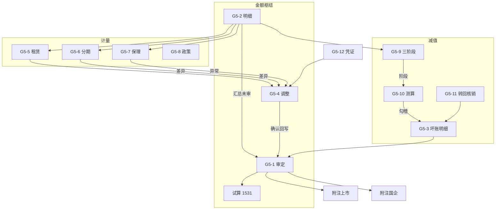

# G5 长期应收款 — 底稿编制手册

> **文档副本**：仓库可读版见 `audit-platform/docs/handbooks/`；  
> 程序内弹窗以本目录 `preparation.md` / `usage.md` 为准。  
> **适用范围**：科目 **1531**（长期应收款）结构化底稿包  
> **组件**：`g5-long-term-receivable`  
> **说明**：本手册说明各分表的审计目标、编制逻辑与勾稽关联。  
> **不替代**各表页内已有的审计目标/过程提示文案。

---

## 1. 总体编制思路

G5 把「长期应收款」拆成四条证据链，最后汇入审定与附注：

| 证据链 | 主要底稿 | 回答的问题 |
|--------|----------|------------|
| **金额枢纽** | G5-2 → G5-1 ← G5-4 | 未审→调整→审定是否完整准确？ |
| **计量/确认** | G5-5、G5-6、G5-7、G5-8 | 融资收益摊销、保理终止确认、政策是否恰当？ |
| **减值/坏账** | G5-9 → G5-10 → G5-3；G5-11 | 三阶段、ECL 测算、转回核销是否充分？ |
| **细节测试** | G5-12 | 凭证抽查是否支持存在与计价？ |

**枢纽原则**（对齐 G1）：

1. **G5-2 余额明细是数据枢纽**——债务人清单与业务类型驱动下游测算/阶段/坏账。  
2. **G5-4 是调整枢纽**——分录确认后回写 G5-1 期末 AJE/RJE。  
3. **G5-1 是结论枢纽**——与试算 1531、附注披露勾稽。  
4. **G5A 程序表**统领「做了哪些程序」；分表记录「证据与结论」。

### 建议编制顺序（标准路径）

```
G5A 程序计划
  → G5-2 明细（先立债务人清单 + 业务类型 + 账龄）
  → 并行：计量链 G5-5/6（按类型）· G5-7 保理 · G5-8 政策
         减值链 G5-9 → G5-10 → 回填/勾稽 G5-3 · G5-11
         检查链 G5-12
  → 差异汇入 G5-4 → 确认回写 G5-1
  → G5-1 汇总未审 + 试算勾稽
  → 附注上市 / 附注国企
```

可按业务裁剪（无融资租赁可弱化 G5-5；无保理可弱化 G5-7），但 **G5-2 → G5-1** 与 **减值结论可追溯** 不宜省略。

---

## 2. 关联总图



### 主要跨模块事件

| 事件 | 含义 |
|------|------|
| `g5:detail-updated` | G5-2 明细变更后刷新下游 |
| `g5:adjustment-confirmed` | G5-4 确认 → G5-1 期末调整回写 |
| `g5:stage-updated` | G5-9 → G5-10 阶段同步（G5-9 同时直写 `G5-10-rows`） |
| `substantive:adjudicated` | G5-1 审定数对外发布（1531） |
| `disclosure:note-text-updated` | 附注文本同步 |
| `aging-config:changed` | 账龄段配置变更 |

---

## 3. 分表要点

| 分表 | 审计目标摘要 | 关键勾稽 |
|------|--------------|----------|
| **G5A** | 程序计划与索引 | — |
| **G5-1** | 原值/坏账按单项·组合审定；减一年内；净值勾稽试算 1531 | G5-2/3 未审、G5-4 调整、TB 1531 |
| **G5-2** | 债务人余额+未实现收益+账龄 | 合计→G5-1；带入 G5-5/6/7/9 |
| **G5-3** | 坏账准备滚动（单项/组合「其中」动态行；期初→增减→期末） | ↔ G5-10；→G5-1 坏账；组合名↔G5-8/附注 |
| **G5-4** | AJE/RJE 汇总，借贷平衡 | **确认**→G5-1 |
| **G5-5** | 融资租赁未实现收益摊销 | 自 G5-2 lease 行 |
| **G5-6** | 分期销售实际利率摊销 | 自 G5-2 installment 行 |
| **G5-7** | 保理终止确认判断 | 有追索终止确认警示 |
| **G5-8** | ECL/计量会计政策检查 | 支撑减值链依据 |
| **G5-9** | 三阶段划分 | auditStage → G5-10 |
| **G5-10** | 分阶段 ECL 测算 | Σ⑧ ≈ G5-3 审定坏账 |
| **G5-11** | 转回≤累计；核销审批 | 与 G5-3 本期转回/核销**勾稽**（不自动写回） |
| **G5-12** | 凭证属性五项核对（完整/批准/账务/初始成本/对手） | 异常→G5-4 |
| **附注上市** | 性质分类·单项/组合·账龄块·坏账变动（动态插行） | 与 G5-1/2/3 取数勾稽；组合名 ↔ G5-8 政策 |
| **附注国企** | 性质分类·终止确认·继续涉入·坏账方法红区·单项/组合账龄（……动态段） | 与 G5-1/2/3/7 勾稽；组合名 ↔ G5-8 政策 |

### 减值路径

1. G5-9 判定阶段 → 同步到 G5-10；  
2. G5-10 测算审定坏账准备，与 G5-3 勾稽；  
3. 显著差异推送 G5-4，确认后回写 G5-1；  
4. G5-11 转回/核销与 G5-3 勾稽（需人工核对，无自动写回）。

---

## 4. 认定覆盖速查

| 认定 | 主要底稿 |
|------|----------|
| 存在 | G5-2、G5-12、函证（如适用） |
| 完整性 | G5-2、G5-5/6 未入账利息检查 |
| 权利与义务 | G5-7 保理、G5-12 权属 |
| 准确性/计价 | G5-5、G5-6、G5-3、G5-10、G5-1 |
| 分类与列报 | G5-1 一年内到期、附注 |
| 截止 | G5-12、G5-5/6 期间 |

---

## 5. 质量复核要点

1. G5-2 合计 ↔ G5-1 原值未审是否勾稽？  
2. G5-4 已确认调整是否体现在 G5-1？借贷是否平衡？  
3. G5-9 阶段与 G5-10 分组是否一致？  
4. G5-10 Σ⑧ ↔ G5-3 审定坏账？  
5. G5-1 报表列示 ↔ 试算 1531？  
6. 上市附注：表(1)性质合计 ↔ 表(2)坏账计提合计？组合名称是否与 G5-8「组合划分」及会计政策披露一致？ECL 率分母为零是否显示「—」（非 #DIV/0!）？  
7. 国企附注：除同上勾稽外，（2）终止确认是否与 G5-7 保理结论一致？（3）继续涉入金额是否完整？（4）红区方法说明是否已填？  

6. 附注金额是否等于 G5-1 审定（或已披露调节）？

---

*版本：与 2026-07 G5 结构化改造（持久化/枢纽回写）对齐。*
