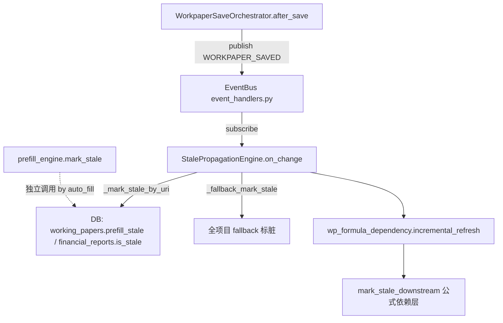

# Stale 传播分层文档

> 最后更新：2026-06-23
> 维护者：改 stale 行为前必读本文定位层

## 一句话

改 stale 传播行为，先看下面的调用图定位你应该改哪一层。**唯一对外入口 = `StalePropagationEngine.on_change`**（`stale_propagation_engine.py`），所有事件经它分发。

## 调用关系图

## 各层职责

| 层 | 文件 | 入口函数 | 职责 | 被谁调用 |
|----|------|----------|------|----------|
| 统一对外入口 | `stale_propagation_engine.py` (336行) | `on_change(event)` | 接收事件 → 解析受影响 URI → 标脏 | `event_handlers.py` 订阅 |
| 公式依赖层 | `wp_formula_dependency.py` | `mark_stale_downstream(db, pid, wp_code, graph?)` | 沿公式依赖图传播 stale | `incremental_refresh`（由 on_change 调用） |
| 预填层 | `prefill_engine.py` | `mark_stale(db, pid, account_codes?)` | 按科目标脏预填字段 | `wp_auto_fill_service` 独立调用 |
| 静态图 | `data/unified_dependency_graph.json` | — | 构建时加载的底稿间依赖关系 | StalePropagationEngine 内部查图 |

## 决策指引

| 你想改什么 | 应该改哪里 |
|-----------|-----------|
| "某事件该不该触发 stale" | `event_handlers.py` 订阅处（增删 subscribe） |
| "地址 URI → 哪些行变 stale" | `StalePropagationEngine._mark_stale_by_uri` |
| "公式上下游依赖关系" | `wp_formula_dependency` + `unified_dependency_graph.json` |
| "预填字段标脏逻辑" | `prefill_engine.mark_stale` |
| "写入后统一触发 stale+SSE+审计日志" | 不需要改——`WorkpaperSaveOrchestrator.after_save` 已收口 4 条路径 |

## 已删除的死代码（勿重建）

- `stale_incremental_propagation.py`（86 行，3 个 `propagate_stale_by_*` 函数）
- 2026-06-23 确认零引用（codegraph callers=0 + import grep=0 + getattr/字符串分发 grep=0）后删除
- 功能已被 `StalePropagationEngine.on_change` 完全覆盖
- **勿重建同名/同功能模块**——如需新的传播路径，扩展 `StalePropagationEngine`
