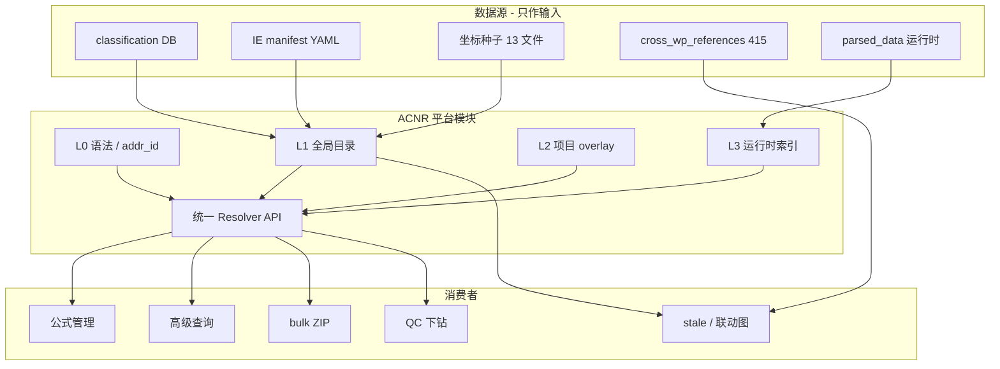

# 地址坐标名称注册中心（ACNR）— 全局模块架构提案

- **日期**：2026-07-10（**v1.10**：codegraph 实证补漏——索引命名空间子系统 §1.8 / 附注库重复 §1.9 / 四大消费库关联统一 §十七；v1.9：文档一致性修复 + 开发注意事项 + 附录 B 金样例）
- **状态**：架构提案 → **落地蓝图**（实施以 **§八·二 + 附录 A + §五 + §十三·十一** 为准）
- **v1.10 关键新增**：文档此前把 ACNR 定位为"五域 URI + `WP()/TB()` 公式语法"的真源，但 codegraph 实证发现平台还并行运行 **第 4 套寻址语法**——索引命名空间（`wp/sheet/cell/Note/TB/Adj/Att/EQCR/Calc/Sample/Confirm` + Layer 1-4，见 `wp_index_resolve.py`），数据源为 `workpaper_render_registry`；此前 §一/§四/§5.7 **未收录**。若不纳入，ACNR"单一真源"名不副实。详见 **§1.8 / §1.9 / §十七**。
- **定位**：平台级 **单一真源（Single Source of Truth）**，统一底稿/报表/附注/试算表/辅助余额的 **名称、坐标、URI、跳转、依赖锚点**
- **关联文档**：[`workpaper-bulk-tab-import-export-requirements.md`](./workpaper-bulk-tab-import-export-requirements.md)（bulk ZIP 为 ACNR 消费者之一；命名规则见该文档 §8.6）

### 文档体系地图

| 文档 | 路径 | 角色 | 状态 |
|------|------|------|------|
| **本文** | `docs/proposals/address-coordinate-name-registry-architecture.md` | 落地蓝图 + 现状 + 分期交付物 | ✅ **v1.9** |
| bulk ZIP 需求 | `docs/proposals/workpaper-bulk-tab-import-export-requirements.md` | 消费者需求；**命名规则 bulk §8.6 真源** | ✅ v1.4，与本文交叉引用 |
| 术语 | `.kiro/steering/glossary.md` | ACNR / addr_id / address_registry 词条 | ✅ 已补 |
| 平台体验 | `docs/平台全局体验与一致性建议.md` §3.5 / §七 | 联动/stale 背景；与 ACNR 互补 | ⚠️ 未链到本文 |
| 平台架构 | `.kiro/steering/architecture.md` | 自定义底稿公式、`touch_wp_registry` 片段 | ⚠️ **未更新 ACNR**，仍写旧口径 |
| **实施 spec** | `.kiro/specs/acnr/` 三件套 | requirements / design / tasks | ❌ **尚未创建**（G8 阻塞项） |
| 贡献指南 | `docs/acnr/CONTRIBUTING.md` | 新增 Tab / 别名 / 生成器 | ❌ 待 **M0** 创建 |
| JSON Schema | `docs/acnr/schemas/` | catalog / grammar / overlay | ❌ 未写（**附录 B** 已给 fixtures 草案） |
| 变更日志 | 本文 §十五·三 | 版本演进 | ⚠️ 此前无独立 changelog |

**阅读顺序（落地）**：**执行摘要** → **§八·二** → **§十三·十一** → §五 → 附录 A/B → bulk §8.6 → acnr spec。

### 执行摘要（决策人 + 落地）

| 项 | 结论 |
|----|------|
| **是什么** | 平台 **ACNR**：可生成的 `global_catalog` + 统一 `resolve` API |
| **不是什么** | 不是重写公式引擎 / 不是 24 万 L2 锚点手维护 / **首期不做** bulk ZIP、不做全 71 I/E 自动 AST 抽取 |
| **M0（先落地）** | D 循环 catalog JSON 进库 + 2 条 CI + `lookup`/`resolve` 只读 API（**2–3 周**） |
| **M1（能用）** | 种子坐标进公式选址器 + `resolve_instance`→`wp_id` + D 循环别名可解析（**+3–4 周**） |
| **M2（消费者）** | bulk D 试点 manifest + 公式选址切 catalog（**+4–6 周**） |
| **L1 首期** | **仅 wp 域** JSON；tb/report/note/aux 仍走现网 V1，经同一 `resolve` 出口 |
| **数据模型** | Sheet / Cell / Runtime 三实体；**canonical addr_id 以 A1 为准**（§5.1.1） |
| **生成器 v1** | classification + **D 循环 I/E 清单（YAML 手维）** + seeds + labels→aliases；**不**首期解析 71 个 py |
| **验收** | **附录 A** 勾选；**M0 完成物**见 §八·二 |
| **资源** | **1 人平台专职** 连续 8–10 周；D 循环 **0.2 人** 消歧 |

### 首期明确不做（防 scope 膨胀）

| 不做 | 原因 | 何时做 |
|------|------|--------|
| bulk ZIP API | 无 catalog 则 manifest 必硬编码 | M2 |
| 71 个 I/E Python 全自动 AST 抽取 | 脆弱、工期不可控 | M2+ 逐循环 EXPORT_SPEC |
| 全 2602 sheet 坐标填满 | 价值低；先 D 详情 + 全骨架 | M1 骨架 / M2 血肉 |
| CCR 415 条手工改 addr_id | CI 标缺口，blocking 先修 | M1 CI 报告驱动 |
| L2 语义 JSON 手编辑 / 迁入 L1 | 仅构建产物 | 持续离线 |
| 高级查询 `addr_id` 回写 | 依赖 M1 resolve 稳定 | M2 |
| 治理后台 UI | 用 CLI 报告 + JSON 即可 | M3 |
| 非 wp 域写入 global_catalog | 仍 V1 动态 | 有需要再议 |

### 开工三件套（评审通过后 Week 1）

| 顺序 | 动作 | 产出 |
|------|------|------|
| 1 | 附录 A **G7/G8** 评审签字 | A-Q / N-Q 决议归档 |
| 2 | 创建 `.kiro/specs/acnr/` 三件套 | requirements / design / tasks |
| 3 | 抄录 `d_cycle_ie_manifest.yaml` + 跑 `generate_catalog.py` 空壳 | 首版 `global_catalog.json`（可空 D 详情，先有骨架） |

> 开发 **不要** 从 bulk、formula 选址、CCR 迁移起手；**从 M0-3～M0-9** 按 §八·二 表格逐行交付。

---

## 〇、为什么必须是单独模块

今天与「地址 / 坐标 / 名称」相关的资产 **至少 12 处**，各模块各取一段，导致：

| 症状 | 影响模块 |
|------|----------|
| 同一 sheet 多处中文名不一致 | bulk ZIP manifest、跳转、导入列头匹配 |
| `WP()` 第三参数用语义名，种子用 A1，库内无映射 | 公式管理、跨底稿引用 |
| 自定义底稿 `extract_custom_cells` 与标准种子分裂 | 公式选址、高级查询回写 |
| `address_registry` v1（运行时）与 v2（静态 JSON）双轨 | stale 传播、依赖图 |
| 前端 `d1SheetLabels` 与 DB classification 双轨 | 目录、I/E、复核 chip |
| `_looks_like_standard_wp_code` 仅 `[A-I]\d`，J~S 误判 custom | 自定义底稿、render-config |

**公式管理库、高级查询库、bulk ZIP、跨底稿引用（CCR）、QC 下钻、联动全景图** 都应是 ACNR 的 **消费者**，而不是各自维护一份命名表。

**一句话结论**：平台 **不缺联动能力**（缓存、编排器、依赖图、公式反向索引都在），缺的是 **企业级寻址目录**——把 classification、种子、标签、I/E、CCR、运行时提取收敛到一个可版本化、可治理、可解析的 ACNR。

> **复盘摘要（v1.2）**：过去按「循环/feature」交付 I/E 与坐标种子，测试验种子、运行时用另一套数据源；CCR 与联动图按 3 参 `WP()` 建设，公式校验按 2 参——**能力叠上去了，真源没立住**。ACNR 不是新功能，是把已有资产 **收口成目录**；bulk ZIP 必须等 L1 目录验收后再做。

---

## 〇·二、复盘：从「联动很强」到「寻址很碎」

> 结合 §一现状诊断，对历史建设路径、根因、得失与修正战略做集中复盘。**仅更新文档，不含实现。**

### R1. 预期 vs 实际（常见误解纠正）

| 常见预期 | 代码实际 | 后果 |
|----------|----------|------|
| 「已有 address_registry，名称库差不多有了」 | V1 是 **运行时动态目录**（TB/报表/附注/科目映射 + 自定义格），**不读** 13 个种子文件 | 种子里的 D2-2/E100 等 **公式选址器搜不到** |
| 「v2 有 24 万锚点，覆盖很全」 | L2 是 **离线语义展开**，服务 stale BFS；与 V1 **不同 API、不同数据模型** | 全景图/stale 与公式校验 **各说各话** |
| 「各循环 spec 已要求注册坐标」 | 种子文件主要服务 **循环验收测试**（`test_*_address_registry.py`） | **测试绿 ≠ 运行时可用** |
| 「四路径已收口 orchestrator」 | `after_save` 发 `WORKPAPER_SAVED`，但 **`touch_wp_registry` 仍在各 router 分散调用**，orchestrator **未统一**失效 WP 域缓存 | 部分保存路径可能 **漏失效** 或重复失效 |
| 「马上能做 bulk ZIP」 | 缺 **sheet_code → item_id → api_prefix** 单一 join；manifest 无权威来源 | 做 ZIP = 硬编码路径，**每扩循环重写** |

### R2. 历史路径：怎么走到今天（根因，非甩锅）

```mermaid
flowchart LR
  subgraph phase1 [阶段1 循环交付 2024-2025]
    IE[每循环 _import_export.py]
    LABEL[每循环 *SheetLabels.ts]
    SEED[每循环 address_registry_seed]
    TEST[循环验收测试 P3]
  end
  subgraph phase2 [阶段2 联动基建 2025-2026]
    V1[V1 公式选址 动态 build]
    V2[V2 语义图 l2/l3 JSON]
    CCR[CCR 415 条 3参 WP]
    LINK[LinkageGraphBuilder 6源]
    ORCH[SaveOrchestrator 四路径]
  end
  subgraph gap [缺口]
    CAT[❌ 无 GlobalCatalog 生成器]
    ID[❌ 无 addr_id 稳定主键]
    GRAM[❌ WP 2参/3参 未冻结]
  end
  phase1 --> phase2
  phase2 --> gap
```



**根因归纳（5 条）**：

1. **Feature 纵向交付 > 平台横向收口**：D/F/G/H… 各循环独立 spec，天然产生 `d1SheetLabels`、`f_address_registry_seed` 等 **副本**，缺「一处写入、多处生成」。
2. **「能测」与「能用」混淆**：种子 + 结构测试保证 **文件存在**，未要求 **接入 `build_workpaper_entries` 或 resolve API**。
3. **两类问题用了两套系统**：**动态选址**（V1，服务公式编辑）与 **静态依赖图**（V2，服务 stale）分头建设，合并计划未写入 spec。
4. **业务语义先于语法冻结**：CCR 先按 Excel 行标签写 3 参 `WP()`；`formula_grammar` 后定为 2 参——**联动图能建、校验可能报错**。
5. **高级查询 / 函证等后挂模块未纳入契约**：`snapshot_writer` 直写 `sheet_name+cell_ref`；函证跳转仍桩实现——**消费者不均衡**。

### R3. 做对了什么（ACNR 应继承，不推倒重来）

| 资产 | 价值 | ACNR 中的位置 |
|------|------|---------------|
| 五域 URI + `formula_ref` 互转 | 跨模块统一寻址语法 | **L0 Grammar**（扩展 WP 3 参） |
| `AddressRegistryService` L1+Redis L2 + 精准失效 | 企业级缓存模型 | **L3 Runtime** 查询层 |
| `workpaper_sheet_classification` | sheet_name 最接近 xlsx 真名 | **L1 主数据首选源** |
| `_*_import_export.py`（71） | bulk 路由的「列/item_id 事实标准」 | **L1 `import_export` 段** |
| `LinkageGraphBuilder` + `FormulaReverseIndex` | 全局依赖与反向边 | **L4**（端点改绑 `addr_id`） |
| `WorkpaperSaveOrchestrator` | 保存后事件统一 | ACNR **invalidate 钩子应接入此处** |
| `useAddressRegistry` store | 前端已有选址 UX | 演进为 `useAcnr()` |
| `extract_custom_cells` | 自定义底稿坐标提取 | **L3** + `register_custom` |

### R4. 欠账清单（复盘确认的「必须还」）

| # | 欠账 | 严重度 | 还法（里程碑） |
|---|------|--------|----------------|
| D1 | 种子 473 坐标未进运行时 | 🔴 高 | **M0** 进 catalog；**M1** 进 `build_workpaper_entries` |
| D2 | `WP()` 2 参 vs 3 参分裂 | 🔴 高 | **M1**：`formula_grammar` 扩展 + 往返测试 |
| D3 | 14 个 `*SheetLabels.ts` 与 DB 漂移 | 🔴 高 | **M0** 生成器 ingest；**M2** 禁手改 CI |
| D4 | v1/v2 双轨 API | 🟠 中 | **M1**：`/api/acnr` + v1 转发 |
| D5 | `touch_wp_registry` 未进 orchestrator | 🟠 中 | **M1**：`after_save` 统一 WP 域失效 |
| D6 | 高级查询裸坐标回写 | 🟠 中 | **M2+**：`addr_id` 回写 |
| D7 | `[A-I]\d` 误判 J~S 标准底稿 | 🟡 中 | **M0**：扩为 `[A-S]\d` |
| D8 | CCR 415 条无 resolve 自检 | 🟡 中 | **M1** CI 报告；**M3** blocking 100% |
| D9 | **索引命名空间语法（11 ns + Layer）未纳入 L0 冻结**（§1.8） | 🔴 高 | **M0** grammar_v1 增「索引 ns ↔ addr_id/URI」映射；**M1** `GtIndexChip` 走 resolve |
| D10 | **三个 index-resolve 端点契约分裂**（§1.8） | 🟠 中 | **M1** `resolve_instance` 统一，旧端点转发 |
| D11 | **`[A-I]\d` / `[A-S]\d` 跨文件已裂**（§1.8） | 🟡 中 | **M0** grammar_v1 单一常量 `STANDARD_WP_CODE_RE=[A-S]\d`；`wp_render_config` / `wp_index_resolve` 均 import |
| D12 | **附注披露 composable 30+ 份逐字节重复**（§1.9） | 🟠 中 | **M2** `useDisclosureSection` 工厂；note 坐标进 catalog |
| D13 | **`workpaper_render_registry.upstream/downstream` 未登记为 L4 边源**（§1.8） | 🟡 中 | **M1** 纳入 §5.7 生成器输入表；边端点 normalize 为 addr_id |

### R5. 战略修正（相对 v1.0 提案的调整）

| 维度 | v1.0 / 早期想法 | **v1.2 修正（复盘后）** |
|------|-----------------|------------------------|
| 模块定位 | bulk ZIP 的 Prep 子项 | **平台级 ACNR**，bulk 降为消费者之一 |
| 第一期交付 | 名称库 + D 循环 ZIP 并行 | **M1 验收后** 开 bulk spec；**M2** 写 bulk API |
| 种子文件 | 与 Tab 库并列可选 | **必须汇入 L1**；测试存在 ≠ 交付完成 |
| L2 语义 JSON | 可能手维护 | **仅构建产物**；按 wp_code 分片，不当编辑源 |
| 语法 | 先目录后语法 | **M0 目录 + M1 语法**（分两里程碑，均早于 bulk） |
| 失效 | 沿用分散 `touch_wp_registry` | **目标态：orchestrator `after_save` 统一触发 ACNR.invalidate** |
| 前端 labels | 继续每循环维护 ts | **生成物**；人工只改 catalog overrides |

### R6. 若不做 ACNR 继续堆 feature 的风险（复盘预警）

1. **bulk ZIP**：manifest 硬编码 → D 试点勉强可用，扩 K/F 时 **大面积 manifest 漂移 bug**。
2. **公式**：CCR 引用在选址器 **not_found**，合伙人以为「联动坏了」。
3. **高级查询**：回写格与公式引用 **同一格两种身份**，stale chip 对不上。
4. **新人成本**：每循环再 copy 一套 `*SheetLabels.ts`，**技术债线性增长**。
5. **归档合规**：无 `registry_version` / `addr_id`，历史项目 **无法复现** 当时引用的到底是哪一格。

### R7. 里程碑 Gate（评审用）

> **v1.8**：对外统一 **M0 / M1 / M2**；附录 A 为勾选真源。旧称 Phase 0 ≈ M0，Phase 1 ≈ M1。

| Gate | 条件 | 解锁 |
|------|------|------|
| **→ M0 开工** | **G7 + G8** 签字 | 可写生成器、CI、只读 API |
| **M0 完成** | **G1–G3** + **MVD-1/2/5** + G4（catalog 侧） | 进入 M1 编码 |
| **M1 完成** | M0 + **G4**（runtime）+ **G5–G6** + **MVD-3/4/7/8** | 开 bulk **spec** |
| **M2 / bulk 代码** | M1 + **M2-1** `list_import_export` + bulk spec 签字 | 开 bulk **API**（D 试点） |

- [ ] **G1**–**G8**、**MVD-1**–**MVD-8** — 见 **附录 A**（含里程碑列）

---

## 一、程序现状诊断（2026-07-10 代码实证）

> 本节基于仓库当前实现，供评审与排期对照；**本文档仅描述现状与目标，不含代码改动**。

### 1.1 三套体系并行，职责重叠但不贯通

| 体系 | 实现 | 实际用途 | 核心问题 |
|------|------|----------|----------|
| **V1 运行时** | `address_registry.py` + `/api/address-registry` | 公式选址、校验、跳转 | 底稿域来自 `wp_account_mapping`、fine_rules、`extract_custom_cells`；**不读 `*_address_registry_seed.json`** |
| **V2 静态图** | `address_registry_v2.py` + l2/l3 JSON | 语义解析、stale 影响 BFS | 与 V1 数据模型、API 分离；`address_registry_l2_semantic.json` 体量极大（约 181 wp_code / 24 万锚点） |
| **种子文件** | 13 个 `*_address_registry_seed.json` | **仅测试断言** | 163 条底稿条目、473 个坐标；**运行时未接入** |

`build_workpaper_entries()` 当前路径（简化）：

```
wp_account_mapping.json
  → wp_fine_rules/*.json (cross_references)
  → _build_custom_wp_cell_entries() (parsed_data)
  ✗ 不经过 *_address_registry_seed.json
```

### 1.2 量化快照（仓库统计，2026-07-10）

| 指标 | 数值 | 说明 |
|------|------|------|
| 坐标种子文件 | 13 | `d_` ~ `s_` 等循环 |
| 种子底稿条目 | 163 | `entries[]` 合计 |
| 种子物理坐标 | 473 | `coordinates[]` 合计 |
| L2 语义 wp_code | 181 | `address_registry_l2_semantic.json` |
| L2 语义锚点 | ~239,693 | 离线展开产物，不宜人手维护 |
| CCR 引用规则 | 415 | `cross_wp_references.json` |
| 前端 sheet label 文件 | 14 | `*SheetLabels.ts`，按循环分散 |
| I/E Python 模块 | **71** | `_cycle_import_export.py` 等 |
| classification DB | ~2602 sheets | `workpaper_sheet_classification` |

### 1.3 命名漂移（已发生，非假设）

| 来源 | D1-2 的 sheet_name |
|------|---------------------|
| 前端 `D1_SHEET_LABEL_MAP` | 原值明细**表**（按**类别**）D1-2 |
| `d_address_registry_seed.json` | 原值明细（按**类**）D1-2 |
| `account_package_registry` | 原值明细表（按类别）D1-2 |

无统一 join 键时，manifest 路径、导入路由、`WP()` 第三参、ZIP 文件名都会对不上。

### 1.4 公式语法分裂（企业级最高风险）

| 模块 | `WP()` 形态 | 文件 |
|------|-------------|------|
| `formula_grammar.py` | **2 参**；`FORMULA_ARITY['WP'] = 2` | 公式引擎 / 校验单一来源 |
| `cross_wp_references.json` | **3 参**（语义第三参） | 415 条引用规则 |
| `formula_reverse_index.py` | **3 参** `_RE_WP` | 反向联动索引 |
| `formula_ref_to_uri()` | 只取前两参，**第三参丢弃** | `address_registry.py` |

典型 CCR 写法：

```
WP('H1','折旧分配分析表H1-13','销售费用折旧')
```

在 V1 选址/校验路径中可能 **解析不到或 URI 不完整**，而联动图仍能建边——同一平台内存在多套「正确」。

`PREV()` 存在同样分裂（grammar 为 2 参，业务侧存在 3 参用法）。

### 1.5 消费者接入不均衡

| 模块 | 接入程度 | 说明 |
|------|----------|------|
| 公式编辑 | ✅ 较好 | `FormulaRefPicker` / `useAddressRegistry` store |
| stale 影响 | ✅ 部分 | `useStaleImpact` → v2 API |
| 高级查询回写 | ❌ 未接 | `snapshot_writer` 使用裸 `wp_id + sheet_name + cell_ref` |
| 函证跳转 | ❌ 桩 | `useConfirmationNavigation` 注释「后续接入 addressRegistry」 |
| bulk ZIP | ❌ 未建 | manifest 尚无统一目录 |
| QC / ref_index chip | ⚠️ 部分 | 平台文档要求走 `jump_route`，实现未统一 |

### 1.6 缓存失效未完全收口（复盘补充）

`WorkpaperSaveOrchestrator.after_save` 已统一：`file_version`、`WORKPAPER_SAVED` 事件。

但 **WP 域地址缓存失效**（`touch_wp_registry` → `address_registry.invalidate_async`）仍分散在：

- `wp_html_save.py`
- `wp_editor_router.py`（Univer 保存 / parse 后）
- `wp_fine_rules.py`
- 多个专项 router（`touch_after_parsed_data_commit`）
- **未**在 orchestrator 内统一调用

`custom_query.snapshot_writer` 虽走 `after_save`，但 **不触发** `touch_wp_registry`（依赖其他路径或 TTL 兜底）。

**目标态**（**M1**）：`after_save` 增加 ACNR.invalidate（可按 `trigger` / `extra.sheets` 增量），删除 router 级重复调用。

### 1.7 已有优势（保留，Strangler 迁移）

| 能力 | 位置 | 评价 |
|------|------|------|
| 五域 URI 模型 | `address_registry.py` | tb/report/note/wp/aux，设计清晰 |
| L1 内存 + Redis L2 缓存 | `AddressRegistryService` | 企业级缓存 + 精准失效 |
| 保存编排收口 | `WorkpaperSaveOrchestrator` | 四条写入路径统一 `after_save` |
| WP 域缓存失效 | `touch_wp_registry()` | 已接 `invalidate_async(domain='wp')` |
| 联动总线 | `LinkageGraphBuilder` | 6 数据源合并依赖图 |
| 分类主数据 | `workpaper_sheet_classification` | sheet_name 权威候选已存在 |
| 结构化 I/E | `_*_import_export.py` | item_id / api_prefix 事实标准在代码中 |

**诊断结论**：问题不是从零建设，而是 **缺一层目录服务** 把上述资产串起来；**种子与运行时脱节、语法分裂、失效未收口** 必须在 **M0–M1** 解决（见 §〇·二 复盘）。

### 1.8 索引命名空间子系统——第 4 套寻址语法（v1.10 codegraph 补漏）

> 此前 §1.4 只诊断了 `WP()` 2 参 vs 3 参分裂。实证发现平台还有 **一整套独立索引寻址体系**，服务 `GtIndexChip` 跳转，§一原表、§四收敛表、§5.7 L4 数据源 **均未收录**。这是「单一真源」名不副实的最大隐患。

| 组件 | 实现 | 语法 / 数据模型 | 与 ACNR 的重叠 |
|------|------|----------------|----------------|
| **索引解析端点** | `backend/app/routers/wp_index_resolve.py` | **11 命名空间** `wp/sheet/cell/Note/TB/Adj/Att/EQCR/Calc/Sample/Confirm` + **Layer 1-4** 模型 | 与五域 URI（tb/report/note/wp/aux）**语义重叠但语法不同**（如 `TB:1001` vs `tb://1001#审定数`） |
| **前端索引跳转** | `useWorkpaperNavigation.ts`（`parseIndexRefs` / `resolveRoute`） | 逗号/顿号分隔多索引 → `render_type` 决定路由 | 与 ACNR `jump_route` **职责重叠**；组件内自拼 route |
| **前端类型注册表** | `useWorkpaperRegistry.ts`（`lookup` / `listByType` / `listByModule`） | 读 `workpaper_render_registry` | 与 `wp_code_overrides` component_type、classification **三处并存** |
| **后端注册表服务** | `workpaper_render_registry_service.py` + `wp_render_registry.py` | `render_type / module / upstream / downstream` | `upstream/downstream` 是 **第 6 个 L4 依赖源**（经 `workpaper_trace_stale_integration.py` 注入 unified graph） |

**实证到的三处碎片化**（均须在 spec 收口）：

1. **三个"索引解析"端点、三种契约**：
   - `GET /api/wp-index-resolve?ref=`（`wp_index_resolve.py`，11 命名空间 + trimmed/reason）
   - `GET /api/workpapers/render-registry/{wp_code}`（`wp_render_registry.py`，类型注册）
   - 前端 `useWorkpaperNavigation` 还调 `GET /api/workpapers/index-resolve/{wpCode}`（第三路径，返回 `{wpId, exists}`）
   - **后果**：`resolve_instance`（§6.1）若不统一这三者，ACNR 会成为**第四个** wp_id 解析入口。

2. **`[A-I]\d` vs `[A-S]\d` 已跨文件分裂**（此前 D7 当作单点欠账，实为已裂开）：
   | 文件 | 正则 | J~S 判定 |
   |------|------|----------|
   | `wp_render_config.py:168` `_STANDARD_WP_CODE` | `^[A-I]\d` | ❌ 误判为自建 |
   | `wp_index_resolve.py:69` `LOOSE_RE` | `^[A-S]\d+(?:-\d+)*[A-Z]?$` | ✅ 正确 |
   同一"标准码判定"语义在两文件已不一致——**必须收敛为 grammar_v1 的单一常量**，两处 import。

3. **`workpaper_render_registry.upstream/downstream` 是未登记的 L4 边源**：`linkage_graph_builder.py` 有 10 个数据源、`workpaper_trace_stale_integration.py` 再注入 render_registry 边，但 §5.7「生成器输入」表只列了 CCR/prefill/l3。

**结论（补 R4 欠账 D9-D11，见 §〇·二 R4）**：ACNR 的 **L0 Grammar 必须同时冻结「索引命名空间语法」**，并给出「索引命名空间 ↔ addr_id / 五域 URI」的双向映射表；否则 `GtIndexChip` 与公式选址各说各话。

### 1.9 附注库：30+ 份逐字节重复的披露 composable（v1.10 补漏）

> §5.7 把 note 域归为「V1 动态 DB build」，只覆盖后端取数；**前端附注编制层的重复**此前未诊断，是「附注库关联统一」的真实痛点。

实证（codegraph）：

| 现象 | 证据 |
|------|------|
| 每循环各一份披露 composable | `useD3DisclosureSoe.ts` 与 `useF1DisclosureSoe.ts` **逐字节相同**，仅 `PREFIX`（`D3-note-soe-` vs `F1-note-soe-`）与 crossSheet import 不同 |
| 每循环各一份披露组件 | `components.d.ts` 中 `*TabDisclosureSoe` / `*TabDisclosureListed` 达 **30+**（D3/D4/F1/F2/F3/F4/G1/G10~G14…），SOE/Listed 双份 |
| 附注同步靠 EventBus 广播 | 各循环各自 `publish disclosure:note-text-updated`（`useJ1Integration`/`useJ2Integration`/`useF3DisclosureSoe`…），无中心附注登记表 |
| 附注结构（SoeDisclosureRow） | 每份 composable 各自定义相同 interface（rowId/label/endAmount/priorAmount/reason） |

**问题本质**：附注既没有像 ACNR 那样的「note 域坐标目录」，也没有「披露行结构 + 取数契约」的复用工厂。新增一个循环 = 再 copy 一份 `useXDisclosureSoe`，与 §〇·二 R6「每循环再 copy 一套 labels」是同一类线性债务，只是发生在附注层。

**收敛方向（详见 §17.4）**：披露行结构 + crossSheet 取数 + EventBus 同步 抽为 `useDisclosureSection(cycle, options)` 工厂；note 域坐标（子节/合计/披露行）进 ACNR catalog 的 `note` 子域，`disclosure:note-text-updated` 的 wpCode/section 用 `addr_id` 寻址。

---

## 二、四维专家建议

### 2.1 企业级（Governance & Compliance）

| 现状问题 | 建议 |
|----------|------|
| 能力分散，无模块 DRI | 立项 **ACNR 为独立 spec**（`.kiro/specs/acnr/`），与 bulk ZIP 解耦；平台架构组任 DRI |
| 无稳定身份键 | 引入 **`addr_id`**（不因 sheet 改名而变）；公式/QC/导入记录绑 `addr_id`，展示名可演进 |
| 身份与展示混写 | 分离 `addr_id` / `sheet_name` / `display_label`；归档项目可锁定 `registry_version` |
| 变更不可追溯 | 项目 overlay（CUST、别名）需 **变更审计**（谁改了什么） |
| 合并无守门 | CI：**名称漂移**、种子未接入、I/E 与 catalog 不一致 → 阻断 PR |
| 语法不统一 | **P0**：`formula_grammar.py` 统一支持 `WP`/`PREV` 2 参与 3 参，`formula_ref_to_uri` 无损往返 |

**企业级终态**：Catalog（目录）+ Resolver（解析）+ Graph（依赖端点身份）三层服务；消费者只认 ACNR API。

### 2.2 可扩展（Scale & Onboarding）

| 现状问题 | 建议 |
|----------|------|
| L2 单文件 ~20MB | 语义展开 = **离线构建产物**；按 `wp_code` / cycle **分片**加载，不当人工编辑源 |
| 新循环靠复制 labels | **生成器流水线**：classification + I/E spec + seed → `global_catalog.json` + 自动生成 TS labels |
| 种子只服务测试 | `build_workpaper_entries` **必须汇入种子坐标**（或经 catalog 间接汇入） |
| 自定义底稿扩展难 | 标准 → L1；`CUST-*` → L2 overlay；保存后 → L3 `register_custom()` |
| 前端一次拉 5000 条 | 继续 **按域分页**（已有 `domain` 过滤）；搜索走后端，避免全量物化 |
| J~S 被误判 custom | `_looks_like_standard_wp_code` 扩为 **`[A-S]\d`**（与 bulk §8.6 一致） |

**扩展原则**：新增循环 = 往 catalog 源数据加条目 + 跑生成脚本 + CI 绿灯，而非新建一套 `*SheetLabels.ts`。

### 2.3 好维护（Single Source & Strangler）

| 现状问题 | 建议 |
|----------|------|
| v1 / v2 / 种子 / labels 四轨 | **Strangler Fig**：ACNR 只读聚合 → `/api/acnr/*` 统一入口 → v1/v2 **转发** deprecated |
| 12+ 处各管一段 | 收敛写入点：**仅 catalog 生成器 + overrides 文件** 可手改 |
| 测试只断言 seed 存在 | 升级为：**CCR source 可 resolve**、I/E 条目在 catalog、别名已登记 |
| `WP()` 三处正则不一致 | `formula_grammar.py` 为 **唯一语法源**；reverse_index / registry 从中导入 |
| 大爆炸迁移风险 | 分 **M0–M3**（见 §八）；旧 API 保留转发至 **M2 结束** |

**维护清单（低成本高收益，M0–M1 必做）**：

1. **M0**：种子进 catalog；`[A-S]\d` 标准码判定（grammar / 守卫）
2. **M1**：种子进运行时；`WP`/`PREV` 三参语法统一；orchestrator 失效收口

### 2.4 方便使用（UX & 闭环）

| 现状问题 | 建议 |
|----------|------|
| 公式有选址器，查询没有 | 前端 **`useAcnr()`**（演进自 `useAddressRegistry`）：公式、高级查询、chip 跳转共用同一棵树 |
| 用户记 A1 不记语义 | 双写 + **语义 resolve**：输入「期末合计」→ 显示 `E100`；输入 `E100` → 显示语义标签 |
| 跳转 URL 各组件自拼 | 规则：**凡可点击引用必须 `resolve → jump_route`** |
| 校验报错不友好 | 从「uri 不存在」改为「D2-2 › 合计行-期末余额（E100）未找到；相近项：…」 |
| 治理不可见 | 轻量 **覆盖度报表**：有 sheet 无坐标、有坐标无 I/E、有 CCR 无物理格 |

---

## 三、模块定义

### 3.1 名称

**ACNR** — Address Coordinate & Naming Registry（地址坐标名称注册中心）

中文产品名建议：**坐标名称库** 或 **底稿寻址中心**

### 3.2 职责边界（做什么 / 不做什么）

| ACNR 负责 | ACNR 不负责 |
|-----------|-------------|
| 全局命名规范（命名规则 v1，见 bulk 需求 doc §8.6） | 公式求值逻辑（归 `formula_engine`） |
| `addr_id` / URI / `formula_ref` 互转 | 业务数据存储（归 `checklist_responses` / `parsed_data`） |
| 标准 + 自定义底稿的 sheet/坐标登记 | Excel 文件生成（归各 `_*_import_export`） |
| 语义名 ↔ 物理单元格解析 | 反向依赖图构建算法（归 `linkage_graph`，但 **边端点身份** 来自 ACNR） |
| `jump_route` / 下钻入口 | 权限判断（消费 ACNR 的 `project_id` 上下文） |
| 项目级 overlay（CUST、实例 wp_id） | 附注正文编辑（只登记 note 域坐标） |
| 变更通知（register / invalidate 事件） | 高级查询 SQL 生成（消费 ACNR 解析结果） |

### 3.3 五层模型（全局考虑）

```
┌─────────────────────────────────────────────────────────────┐
│ L4 依赖与传播层  DependencyGraph（边：引用/公式/stale）      │
│     端点必须是 ACNR addr_id；不另造 wp/sheet 字符串           │
├─────────────────────────────────────────────────────────────┤
│ L3 运行时层      RuntimeIndex（parsed_data、当前值缓存）       │
│     extract_custom_cells / WORKPAPER_SAVED 增量更新            │
├─────────────────────────────────────────────────────────────┤
│ L2 项目层        ProjectOverlay（wp_id、CUST、项目别名）       │
├─────────────────────────────────────────────────────────────┤
│ L1 全局目录层    GlobalCatalog（标准底稿全量 sheet + 坐标种子） │
│     合并：classification + I/E specs + cycle seeds + labels    │
├─────────────────────────────────────────────────────────────┤
│ L0 语法层        Grammar（URI、addr_id、WP()/TB() 语法）       │
└─────────────────────────────────────────────────────────────┘
```

**关键原则**：上层只通过 **addr_id 或 URI** 引用下层，禁止消费者拼接 `wp_code + sheet + cell` 字符串。

---

## 四、与现有资产的关系（收敛路线图）

| 现有资产 | 现状 | 收敛到 ACNR |
|----------|------|-------------|
| `address_registry.py` (v1) | 5 域 URI + `extract_custom_cells` | → **L3 RuntimeIndex** + L0 Grammar |
| `address_registry_v2.py` + l2/l3 JSON | 语义解析、stale BFS | → **L4** API，端点改 addr_id |
| `*_address_registry_seed.json` | 按循环稀疏坐标；**仅测试** | → 汇入 **L1** `coordinates[]` |
| `cross_wp_references.json` | WP() 规则，415 条 | → **L4** 边表，source/target 用 addr_id |
| `workpaper_sheet_classification` (DB) | sheet_name 权威候选 | → **L1** 主数据之一 |
| `d*SheetLabels.ts` 等（14 文件） | 前端展示名 | → **L1** `sheet_name_aliases` + **生成** TS |
| `_*_import_export.py` specs（71） | item_id / api_prefix | → **L1** `import_export` 段 |
| `wp_code_overrides.json` | componentType 路由 | → **L1** `component_type` |
| `formula_reverse_index.py` | 被引用方→引用方 | → **L4** 消费者，节点 ID 来自 ACNR |
| `custom_query` snapshot_writer | 单元格回写 | → 回写前 **resolve(addr_id)** |
| bulk ZIP manifest（规划） | 文件路由 | → `list_import_export()` 查询结果 |
| `wp_index_resolve.py`（11 ns + Layer）**v1.10 补** | `GtIndexChip` 索引解析 | → **L0 Grammar** 增「索引 ns」profile；端点转发 `resolve` |
| `workpaper_render_registry`（render_type/module/**upstream/downstream**）**v1.10 补** | 类型注册 + 依赖边 | → component_type 进 **L1**；upstream/downstream 进 **L4** 边源 |
| `useWorkpaperNavigation` / `useWorkpaperRegistry`（前端）**v1.10 补** | 索引跳转 + 类型查询 | → 演进为 `useAcnr()` 的 navigation/registry 分支 |
| `useXDisclosureSoe.ts` × 30+（前端）**v1.10 补** | 附注披露编制 | → `useDisclosureSection` 工厂；note 坐标进 catalog（§17.4） |

**不建议一次性大爆炸迁移**；建议 **Strangler Fig**：ACNR 先只读聚合现有源，旧 API 转发，再逐模块切消费者。

---

## 五、核心数据模型（v1.8 修订）

> **v1.6→v1.8**：拆分为三类实体；与现网 `address_registry.AddressEntry` **脱钩**——实现时建议用 `CatalogEntry` 命名空间，避免同名 dataclass 混淆。

### 5.1 实体拆分：Sheet / Cell / Runtime

| 实体 | 粒度 | `addr_id` 模式 | 所在层 | 典型用途 |
|------|------|----------------|--------|----------|
| **SheetCatalogEntry** | Tab / sheet | `{parent}/{sheet_code}` 或 `{bundle}/{sheet_code}` | L1 | manifest、labels、I/E、`skip_reason` |
| **CellCatalogEntry** | 单元格或语义锚点 | `{parent}/{sheet_code}/{coordinate_key}` | L1 | 公式、CCR、合计校验 |
| **RuntimeCellEntry** | 项目实例格 | `runtime/{project_id}/{wp_id}/{sheet_or_code}/{cell}` | L2/L3 | CUST、parsed_data 提取 |

**层级约定（标准底稿）**：

| 字段 | 含义 | 示例（明细表 D2-2） |
|------|------|---------------------|
| `parent_wp_code` | 循环 bundle / 父底稿 | `D2` |
| `sheet_code` | Tab 编码（= API `?sheet=`） | `D2-2` |
| `sheet_name` | 权威中文 Tab 名 | `明细表D2-2` |
| `wp_code`（公式第一参） | **父底稿码**，与 CCR 一致 | `D2`（不是 `D2-2`） |

公式：`WP('D2','明细表D2-2','合计行-期末余额')` → 见 §5.1.1 canonical 规则。

#### 5.1.1 canonical `addr_id`（落地必遵）

| 规则 | 说明 |
|------|------|
| **Cell 主键** | 有 `cell_address` 时，canonical = `{parent}/{sheet_code}/{cell_address}`（如 `D2/D2-2/E100`） |
| **语义别名** | `semantic_label` 写入 `CellCatalogEntry.semantic_label` + `formula_ref`；**不**单独占 addr_id，除非 `semantic_only: true` 且无 A1 |
| **semantic_only** | addr_id = `{parent}/{sheet_code}/{slug(semantic_label)}`；CI 要求尽快补 A1 并加 `cell_address` |
| **Sheet 级** | `{parent}/{sheet_code}`，无第三段 |
| **禁止** | 同一物理格两个 canonical addr_id |

resolve 时：输入语义名 → 查 `semantic_label` / `formula_ref` → 返回 canonical `addr_id` + `cell_address`。

### 5.2 SheetCatalogEntry（L1 主条目）

```yaml
addr_id: "D2/D2-2"                    # sheet 级；无坐标后缀
domain: wp
origin: standard

cycle: D
parent_wp_code: D2
sheet_code: D2-2
sheet_name: "明细表D2-2"
sheet_name_aliases: ["D2-2明细"]
component_type: d2-accounts-receivable
class_code: F-明细表
functional_type: detail_table          # 见 §5.6 枚举

editor_engine: html                    # html | univer | onlyoffice | mixed
sheet_key_source: classification       # html_data 键 / snapshot 键来源说明

import_export:
  enabled: true
  api_prefix: d2
  item_id: D2-detail-rows
  storage_field: remark
  import_order: 20                     # bulk 拓扑排序
  depends_on_sheets: ["D2-1"]          # 可选

skip_reason: null                      # 非空则 bulk 跳过，见 §5.6

display_label: "底稿 > D2 > 明细表D2-2"
jump_route_template: "/workpapers/{wp_id}?sheet=D2-2"   # wp_id 由 ProjectBinding 填充

registry_version: "2026.07.10"
template_version_id: "..."             # 来自 classification
source_of_truth: classification_db
```

### 5.3 CellCatalogEntry（L1 坐标子条目）

```yaml
addr_id: "D2/D2-2/E100"
parent_addr_id: "D2/D2-2"              # FK → SheetCatalogEntry
uri: "wp://D2/明细表D2-2#E100"         # standard profile，见 §5.5
domain: wp

cell_address: E100
semantic_label: "合计行-期末余额"
semantic_only: false                   # true = 尚无可靠 A1，公式仍可引用语义
purpose: balance_verification          # balance_verification | conclusion | ratio_analysis | ...

formula_ref: "WP('D2','明细表D2-2','合计行-期末余额')"
registry_version: "2026.07.10"
```

### 5.4 项目实例化：ProjectBinding + RuntimeCellEntry

全局 catalog **不含** `project_id` / `wp_id`。项目内解析走 **绑定层**：

#### ProjectBinding（L2）

```yaml
project_id: "uuid"
parent_wp_code: D2
sheet_code: D2-2
wp_id: "uuid"                          # WorkingPaper 实例
wp_index_id: "uuid"
resolved_at: "2026-07-10T12:00:00Z"
```

| 规则 | 说明 |
|------|------|
| 解析时机 | `resolve(project_id, addr_id)` 在 L1 命中后，用 ProjectBinding 填 `wp_id` |
| `jump_route` | ACNR 返回 **模板** + 已解析 `wp_id`；消费者禁止自拼 |
| 多实例 | 同项目同 `(parent_wp_code, sheet_code)` 多条 → **disambiguation 错误**，须业务上避免或显式传 `wp_id` |
| 存储 | **M1**：运行时查 `WpIndex`；**M2+**：可选 DB 物化缓存 |

#### RuntimeCellEntry（L3，自定义 / 运行时）

```yaml
addr_id: "runtime/{project_id}/{wp_id}/CUST-01/B7"
domain: wp
origin: custom
uri_profile: custom_flat               # 见 §5.5
uri: "wp://CUST-01/B7"
formula_ref: "WP('CUST-01','B7')"
runtime_only: true                     # 不进全局 L1 种子
```

与现网 `extract_custom_cells` + `wp_formula_service` 对齐；登记走 `register_custom()`。

### 5.5 URI Profile（标准 vs 自定义）

| Profile | URI 形态 | 适用 | 公式 |
|---------|----------|------|------|
| **standard** | `wp://{parent}/{sheet_name}#{cell}` | 标准多 Tab 底稿 | `WP(parent, sheet_name, cell\|semantic)` 三参 |
| **custom_flat** | `wp://{wp_code}/{cell}` | CUST、单 sheet 自定义 | `WP(wp_code, cell)` 二参 |
| **tb / report / note / aux** | 既有五域语法不变 | 非 wp | `TB()` / `ROW()` / `NOTE()` / `AUX()` |

**语法冻结**（**M0** 写入 `grammar_v1.json` 设计；**M1** 在 `formula_grammar.py` 实现）：须同时收录 **standard** 与 **custom_flat**；`formula_ref_to_uri` 无损往返。

### 5.6 枚举（生成器与 CI 共用）

**functional_type**（节选）：`procedure_table` | `adjudication_table` | `detail_table` | `check_table` | `analysis_table` | `directory` | `note_disclosure` | `custom`

**skip_reason**（bulk 用，非空则 manifest 排除）：

| 值 | 含义 |
|----|------|
| `no_import_export` | 无结构化 I/E |
| `univer_only` | 仅 Univer 在线表 |
| `onlyoffice_only` | 仅 OnlyOffice |
| `procedure_checkbox` | 程序表勾选/段落 |
| `word_template` | Word 非 xlsx Tab |
| `readonly_directory` | 只读目录 |
| `custom_univer_only` | 自定义仅 Univer（bulk 二期前） |

### 5.7 L1 首期范围：wp 域静态 catalog（写死）

| 域 | **M0–M1** 进 `global_catalog.json`？ | 运行时来源 |
|----|--------------------------------------|------------|
| **wp** | ✅ **是**（全循环骨架，D 详情） | L1 catalog + L3 runtime |
| **tb** | ❌ 否 | V1 `build_*_entries` 动态 DB |
| **report** | ❌ 否 | V1 动态 |
| **note** | ❌ 否 | V1 动态 |
| **aux** | ❌ 否 | V1 动态 |

**统一出口**：所有域经 `ACNR.resolve()` / 现有 `/api/acnr/*`（转发 v1）对外；消费者 **不区分** 数据来自 L1 JSON 或 V1 动态 build。

**收敛表补充（生成器输入）**：

| 资产 | 纳入 L1 wp catalog | 说明 |
|------|-------------------|------|
| `wp_account_mapping.json` | ⚠️ 参考 / 二期 | 科目列名 WP 引用，非 sheet 级 |
| `wp_fine_rules/*.json` | ⚠️ 参考 | xref 条目；L4 边端点 normalize 为 addr_id |
| `prefill_formula_mapping.json` | ❌ 不进 L1 | L4 FormulaReverseIndex 继续读；端点改 addr_id |
| `workpaper_render_registry.json`（**v1.10 补**） | ⚠️ component_type 参考进 L1 | `render_type/module` → SheetCatalogEntry；**`upstream/downstream` 是第 6 个 L4 边源**（经 `workpaper_trace_stale_integration` 注入 unified graph），端点 normalize 为 addr_id |

### 5.8 项目 overlay（补丁）

```yaml
project_id: "..."
addr_id: "D2/D2-2"
overrides:
  sheet_name_alias_add: ["现场临时叫法"]
reason: "项目模板差异"
owner: "zhangsan"
expires_at: "2026-12-31"               # 可选；防永久临时补丁
```

---

## 六、统一 API（平台对内服务）

建议 **Python 服务** `app/services/acnr/` + **HTTP API** + **前端 TS SDK** 三件套。

### 6.1 核心方法

| 方法 | 用途 | 消费者 |
|------|------|--------|
| `resolve(addr_id \| uri \| formula_ref, project_id?)` | → Sheet / Cell / Runtime 条目 | 公式、查询、回写 |
| `resolve_instance(project_id, parent_wp_code, sheet_code)` | → `wp_id`（ProjectBinding） | jump_route、bulk manifest |
| `resolve_semantic(parent, sheet_name, desc, project_id?)` | 语义 → 物理格 | v2 `/resolve` 迁入 |
| `list_sheets(cycle?, import_export_only?)` | sheet 级目录 | bulk、Tab 树 |
| `list_cells(sheet_addr_id)` | 某 sheet 下 CellCatalogEntry | 公式选址 |
| `list_import_export(project_id, cycle?)` | bulk 清单（含 wp_id） | bulk-tab-export |
| `register_custom(project_id, wp_id, cells)` | RuntimeCellEntry | 保存后 |
| `invalidate(project_id, wp_id?, addr_id?)` | 缓存失效 | WORKPAPER_SAVED 后 |
| `stale_impact(addr_id)` | 下游依赖 | stale、QC |
| `to_manifest_entry(sheet_addr_id, mode)` | ZIP 一行 | bulk export |

### 6.1.1 resolve 决策树（normative 草案）

```
输入 (formula_ref | uri | addr_id | lookup{parent,sheet,cell_desc})
  │
  ├─1─► grammar 规范化（§5.5 URI profile）
  ├─2─► 若带 project_id：L2 overlay 补丁
  ├─3─► L1 CellCatalogEntry 精确 match
  ├─4─► L1 SheetCatalogEntry + aliases → cell 级 match
  │       └─ 多命中 → disambiguation（candidates[] 或 HTTP 409）
  ├─5─► 同 sheet 下 semantic_label 包含匹配
  ├─6─► L3 RuntimeCellEntry
  ├─7─► 非 wp 域：委托 V1 动态 build（tb/report/note/aux）
  └─8─► miss → metrics + 相近项推荐
```

### 6.2 HTTP（对外 / 前端）

```
GET  /api/acnr/resolve?uri=wp://...
GET  /api/acnr/lookup?wp_code=&sheet=&cell_desc=
GET  /api/acnr/entries?cycle=D&import_export_only=true
GET  /api/acnr/anchors?wp_code=&sheet=
POST /api/acnr/custom/register
GET  /api/acnr/stale-impact?addr_id=
GET  /api/acnr/coverage?cycle=D          # 覆盖度报表（治理）
```

### 6.2.1 最小响应契约（M0/M1 必实现）

**`GET /api/acnr/lookup`**（M0）

```json
{
  "found": true,
  "addr_id": "D2/D2-2",
  "entry_type": "sheet",
  "sheet_name": "明细表D2-2",
  "parent_wp_code": "D2",
  "sheet_code": "D2-2",
  "import_export": { "enabled": true, "api_prefix": "d2", "item_id": "D2-detail-rows" }
}
```

**`GET /api/acnr/resolve`**（M0 起）

```json
{
  "found": true,
  "addr_id": "D2/D2-2/E100",
  "entry_type": "cell",
  "cell_address": "E100",
  "semantic_label": "合计行-期末余额",
  "formula_ref": "WP('D2','明细表D2-2','合计行-期末余额')",
  "uri": "wp://D2/明细表D2-2#E100",
  "jump_route": "/workpapers/{wp_id}?sheet=D2-2",
  "wp_id": "uuid-if-project_id-provided"
}
```

**miss**（M0 起）：`found: false` + `candidates: [{ addr_id, display_label, score }]`（最多 5 条）

**disambiguation**（M1）：`found: false` + `error: "ambiguous"` + `candidates: [...]`

**兼容策略**：v1 `/api/address-registry` 与 v2 `/api/address-registry/v2` 在 M1 起 **转发**至 `/api/acnr/*`；M0 可先不转发，只上新 API。

---

## 七、消费者契约（公式 / 查询 / 其他）

### 7.1 公式管理库

| 改进 | 说明 |
|------|------|
| 选址器只读 ACNR | 下拉树 = `list_sheets` + `list_cells` + 按 domain 分组 |
| `formula_ref` 存库前 `resolve()` 校验 | 非法引用编译期失败 |
| 语义坐标与 A1 **双写** 在 ACNR | `WP()` 第三参可语义，内部解析到 A1 |
| `FormulaReverseIndex` 边端点用 `addr_id` | 重命名 sheet 时边不断 |

### 7.2 高级查询库

| 改进 | 说明 |
|------|------|
| 回写 API 接受 `addr_id` 而非裸 `wp/sheet/cell` | 避免字符串漂移 |
| 快照列元数据挂 `addr_id` | 溯源、staleness chip 一致 |
| 查询构建器「选字段」= ACNR 浏览 | 与公式选址同一棵树 |

### 7.3 跨底稿引用（CCR）/ 联动图

| 改进 | 说明 |
|------|------|
| `cross_wp_references.json` 迁移为 ACNR 边集 | `ref_id` → `source_addr_id` / `target_addr_id` |
| 全景图节点标签 = `display_label` | 单一展示逻辑 |
| CCR 每条规则在 CI 中 **resolve 自检** | source_cell 可落到物理格或标 `semantic_only` |

### 7.4 bulk ZIP / I/E

| 改进 | 说明 |
|------|------|
| manifest 100% 由 `list_import_export()` 生成 | 不再手写 sheet 列表 |
| ZIP 路径模板在 ACNR 配置 | `{cycle}/{parent}/{sheet_code}_…` |

### 7.5 QC / 复核 / ref_index chip

| 改进 | 说明 |
|------|------|
| chip 跳转统一 `jump_route` | 来自 ACNR，禁止组件内拼 URL |
| QC 规则绑定 `addr_id` | 警告可下钻到格 |

### 7.6 与 stale / 联动图的分工（边界）

| 组件 | 职责 | 与 ACNR 接口 |
|------|------|--------------|
| **ACNR** | 身份、resolve、catalog、ProjectBinding | 提供 `addr_id`、物理格、display_label |
| **address_registry_v2** | stale 影响 BFS、语义锚点查询 | 入参/出参逐步改为 `addr_id`；算法不迁入 ACNR |
| **LinkageGraphBuilder** | 离线全图 | 读 CCR / prefill / l3；边端点 **normalize** 为 addr_id |
| **StalePropagationEngine** | 运行时传播 | 见 `backend/docs/STALE-PROPAGATION-LAYERS.md`；**唯一对外入口**不变 |

ACNR **不实现** BFS 传播；`stale_impact(addr_id)` 可转发 v2 或读 L4 图，但对消费者呈现统一 API。

---

## 八、落地优先级与分期

> **v1.8**：用 **M0/M1/M2/M3 里程碑 + 仓库路径 + 完成物** 替代抽象 Phase 叙述；与附录 A Gate 一一对应。

### 8.1 里程碑总览

| 里程碑 | 周期（1 人专职） | 用户可感知价值 | bulk ZIP |
|--------|------------------|----------------|----------|
| **M0** | 2–3 周 | 仓库里有真 catalog；CI 防漂移；API 能 lookup D sheet | 禁止 |
| **M1** | +3–4 周 | 公式选址能看到 D 种子坐标；跳转能解析 `wp_id` | 禁止 |
| **M2** | +4–6 周 | D 循环 bulk manifest；选址器 D 循环切 catalog | **试点** |
| **M3** | 持续 | 扩循环、CCR normalize、治理报告 | 扩面 |

### 8.2 落地路线图（可执行）

#### M0 — 目录进库（无运行时改造）

| # | 交付物（仓库路径） | 完成标准 |
|---|-------------------|----------|
| M0-1 | `.kiro/specs/acnr/requirements.md` + `design.md` + `tasks.md` | G8 评审通过 |
| M0-2 | `docs/acnr/schemas/global_catalog.schema.json` | Sheet/Cell 字段可校验 |
| M0-3 | `backend/scripts/acnr/generate_catalog.py` | 一键生成 |
| M0-4 | `backend/data/acnr/sources/d_cycle_ie_manifest.yaml` | **手维** D1–D7 的 api_prefix/item_id（从现有 py 抄录，不 AST） |
| M0-5 | `backend/data/acnr/global_catalog.json` | 全循环 **sheet 骨架**；D 循环 **I/E+Cell 详情** |
| M0-6 | `backend/data/acnr/shards/catalog_D.json`（可选分片） | D 分片可独立加载 |
| M0-7 | `docs/acnr/fixtures/resolve_cases.json` | ≥10 条金样例（见 **附录 B**） |
| M0-8 | CI `check-acnr-catalog-drift` + `check-addr-id-unique` + `check-ie-catalog-sync` | PR 可挡漂移 |
| M0-9 | `backend/app/routers/acnr.py`：`lookup` + `resolve`（**只读**，读 JSON） | fixtures 全绿 |
| M0-10 | `docs/acnr/CONTRIBUTING.md` | 新增 Tab 流程可照做 |

**M0 验收**：附录 A **G1–G3 + G7 + G8 + MVD-1/2/5** + G4（catalog 侧，种子已在 JSON）。

**M0 不做**：改 `build_workpaper_entries`、bulk、`formula_grammar` 实现、全量 CCR 修复。

#### M0 第一周开工顺序（建议）

| 天 | 谁 | 做什么 | 产出 |
|----|-----|--------|------|
| D1 | 平台 | 立 `.kiro/specs/acnr/` 骨架 + `global_catalog.schema.json` 草案 | G8 可评审 |
| D2 | 平台 | 从现有 `d*_import_export.py` **抄录**（不 AST）→ `d_cycle_ie_manifest.yaml` | M0-4 |
| D3 | 平台 | `generate_catalog.py` v0：classification 骨架 + D manifest + seeds | 首版 JSON |
| D4 | 平台 | `resolve_cases.json` 10 条 + `acnr.py` lookup/resolve 读 JSON | M0-9 冒烟 |
| D5 | 平台+D 代表 | 对 D1–D7 跑 `catalog_report.json`，消歧进 overrides | MVD-3 预备 |

> **原则**：M0 周结束前仓库里必须有 **可 diff 的 `global_catalog.json`**，哪怕 D 循环还有缺口——缺口进 report，不靠口头。

---

#### M1 — 接上现网（Strangler 第一步）

| # | 交付物 | 完成标准 |
|---|--------|----------|
| M1-1 | `formula_grammar.py`：WP/PREV 2+3 参 + 往返测试 | G6 代码侧满足 |
| M1-2 | `build_workpaper_entries()` 读 catalog 合并 Cell 条目 | D 种子坐标在选址器可搜 |
| M1-3 | `resolve_instance(project_id, parent, sheet_code)` | MVD-7；返回 `wp_id` |
| M1-4 | `WorkpaperSaveOrchestrator.after_save` → `touch_wp_registry` / ACNR.invalidate | D5 收口 |
| M1-5 | v1 `/api/address-registry` → `/api/acnr` **转发**（兼容） | 旧前端不崩 |
| M1-6 | CI `check-ccr-resolve`（报告模式，不阻断）+ `check-ie-catalog-sync`（D 循环） | G5 有缺口清单 |
| M1-7 | D 循环 `sheet_name_aliases` 清理进 catalog | MVD-3 |

**M1 不做**：bulk ZIP、高级查询回写、全循环 I/E YAML、CCR addr_id 迁移。

**M1 验收**：附录 A **G4**（runtime）+ **G5–G6** + **MVD-3/4/7/8**（**不含** MVD-6，blocking CCR 属 **M3**）。

---

#### M2 — 消费者（bulk D 试点）

| # | 交付物 | 完成标准 |
|---|--------|----------|
| M2-1 | `list_import_export(project_id, cycle='D')` + manifest 生成 | bulk spec 可开工 |
| M2-2 | bulk-tab-export/import API（D only） | 3 张代表表 I/E 回归 |
| M2-3 | `useAcnr()` 替代 D 循环相关 `useAddressRegistry` 路径 | 选址单树 |
| M2-4 | 生成 `audit-platform/.../generated/dSheetLabels.ts`（或等价） | 禁手改 labels CI 全绿 |
| M2-5 | K 循环 `k_cycle_ie_manifest.yaml` + catalog 扩面（波 2 开始） | 可复制套路 |

---

#### M3 — 扩面与治理

- CCR 边端点 addr_id 化（blocking 先修）
- `registry_version` 项目锁定
- `GET /api/acnr/coverage`
- bulk 扩至 K/F/G/H

### 8.3 生成器 v1 管线（M0 按此实现）

```
输入（仅下列，不自动扫 71 py）
  ├─ DB/API 导出：workpaper_sheet_classification  → 全量 SheetCatalogEntry 骨架
  ├─ backend/data/acnr/sources/d_cycle_ie_manifest.yaml  → D 循环 import_export（手维）
  ├─ backend/data/*_address_registry_seed.json       → CellCatalogEntry
  ├─ audit-platform/.../d*SheetLabels.ts             → sheet_name_aliases（只 ingest，生成物另出）
  └─ global_catalog.overrides.json                   → 人工补丁

脚本：backend/scripts/acnr/generate_catalog.py
输出：
  ├─ backend/data/acnr/global_catalog.json
  ├─ backend/data/acnr/shards/catalog_{cycle}.json   （可选）
  └─ backend/data/acnr/catalog_report.json           （冲突/缺口/未登记别名）

CI：generate_catalog.py && git diff --exit-code global_catalog.json
```

**`d_cycle_ie_manifest.yaml` 示例结构**（落地模板）：

```yaml
version: "1"
cycle: D
entries:
  - sheet_code: D2-2
    api_prefix: d2
    item_id: D2-detail-rows
    storage_field: remark
    import_order: 20
    depends_on_sheets: [D2-1]
```

### 8.4 与 bulk ZIP 的关系（不变）

| 里程碑 | ACNR | bulk ZIP |
|--------|------|----------|
| **M0** | catalog + lookup API | 禁止 |
| **M1** | 现网接入 + resolve_instance | 禁止 |
| **M2** | list_import_export | **D 试点** |
| **M3** | 扩循环 | 扩面 |

### 8.5 目标架构图



---

## 九、模块目录结构（建议，实施时采用）

```
backend/app/services/acnr/
  grammar.py              # URI / addr_id / formula_ref（委托 formula_grammar 扩展）
  catalog.py              # L1 GlobalCatalog（读 JSON + 分片）
  overlay.py              # L2 项目 overlay
  runtime.py              # L3 extract_custom_cells 接入
  resolver.py             # 统一 resolve 入口
  manifest.py             # bulk ZIP 条目（M2）
  events.py               # invalidate
  loaders/
    from_classification.py
    from_ie_manifest.py   # 读 {cycle}_cycle_ie_manifest.yaml（M0 手维）
    from_address_seeds.py
    from_frontend_labels.py

backend/scripts/acnr/
  generate_catalog.py     # 唯一生成入口

backend/app/routers/acnr.py

backend/data/acnr/
  global_catalog.json
  global_catalog.overrides.json
  grammar_v1.json
  sources/
    d_cycle_ie_manifest.yaml
    k_cycle_ie_manifest.yaml   # M2+ 按需
  shards/
    catalog_D.json             # 可选

docs/acnr/
  schemas/global_catalog.schema.json
  fixtures/resolve_cases.json
  CONTRIBUTING.md

audit-platform/frontend/src/services/acnr/
  useAcnr.ts              # 演进自 stores/addressRegistry.ts
  resolveUri.ts

audit-platform/frontend/src/generated/   # M2 起
  dSheetLabels.ts         # 由 generate_catalog 产出，禁止手改
```

---

## 十、待拍板（架构级）

| # | 问题 | 建议 | 状态 |
|---|------|------|------|
| A-Q1 | 模块代号：ACNR 还是沿用 `address_registry`？ | 对内 ACNR；HTTP `/api/acnr`；旧路径转发 | **建议采纳** |
| A-Q2 | L1 存 JSON 还是 DB？ | **M0 JSON 生成物**；M2+ 可选 DB 索引表加速查询 | **建议采纳** |
| A-Q3 | addr_id 是否含 project_id？ | **全局不含**；项目用 `project_id + addr_id` | **建议采纳** |
| A-Q4 | MCP 集成？ | `acnr_lookup` / `acnr_resolve` | 可选（M3） |
| A-Q5 | DRI？ | **平台架构组**，非单循环 feature 组 | **建议采纳** |
| A-Q6 | `WP()` arity？ | **2 参与 3 参并存**；3 参第三项为 semantic_label 或 cell | **建议采纳** |
| A-Q7 | 种子何时进运行时？ | **M0** 进 catalog；**M1** 进 `build_workpaper_entries` | **建议采纳** |
| A-Q8 | bulk ZIP 何时启动？ | **M1 Gate 通过** → bulk spec；**M2** 写 API | **建议采纳** |

> 评审会须对 **A-Q1–A-Q3、A-Q5–A-Q8** 签字归档（G7）；未决项不得开工 M0 编码。

---

## 十一、相关代码与文档索引

| 用途 | 路径 |
|------|------|
| 命名规则细则 | `workpaper-bulk-tab-import-export-requirements.md` §8.6 |
| V1 运行时 | `backend/app/services/address_registry.py` |
| V1 API | `backend/app/routers/address_registry.py` |
| V2 静态图 API | `backend/app/routers/address_registry_v2.py` |
| 公式语法（待扩展 WP 3 参） | `backend/app/services/formula_grammar.py` |
| 反向索引 | `backend/app/services/formula_reverse_index.py` |
| 联动图构建 | `backend/app/services/linkage_graph_builder.py` |
| 高级查询回写 | `backend/app/services/custom_query/snapshot_writer.py` |
| 前端 store | `audit-platform/frontend/src/stores/addressRegistry.ts` |
| 标准码判定（`[A-I]\d`，待收敛） | `backend/app/routers/wp_render_config.py` |
| **索引解析（11 ns + Layer，`[A-S]\d`）** | `backend/app/routers/wp_index_resolve.py` |
| **类型注册表 API / 服务** | `backend/app/routers/wp_render_registry.py` / `app/services/workpaper_render_registry_service.py` |
| **render_registry 依赖边注入** | `backend/app/services/workpaper_trace_stale_integration.py` |
| **前端索引跳转 / 类型注册** | `audit-platform/frontend/src/composables/useWorkpaperNavigation.ts` / `useWorkpaperRegistry.ts` |
| **附注披露 composable（重复）** | `audit-platform/frontend/src/components/workpaper/composables/useD3DisclosureSoe.ts` 等 30+ |
| 平台联动建议 | `docs/平台全局体验与一致性建议.md` §七 |
| **开发文档复盘** | 本文 **§十五** |
| **验收清单（normative）** | 本文 **附录 A** |
| **resolve 金样例** | 本文 **附录 B** |
| **开发铁律** | 本文 **§13.11** |
| stale 分层 | `backend/docs/STALE-PROPAGATION-LAYERS.md` |
| bulk ZIP（消费者） | `workpaper-bulk-tab-import-export-requirements.md` |

---

## 十二、复盘结论（给决策人）

1. **不是缺能力，是缺真源**：联动、缓存、图、I/E 工厂都已存在；缺的是把 12+ 处副本 **收成一本目录**。
2. **种子「测过」≠「用上」**：**M0** 以 catalog JSON 为准；**M1** 以选址器可搜为准——不以测试文件存在为准。
3. **语法分裂是隐形炸弹**：**M1** 前统一 `WP()`，否则 bulk 与公式校验互相打脸。
4. **bulk ZIP 技术简单、路由难**：难在 manifest，不在 zipfile；**先 ACNR，后 ZIP** 不是保守，是顺序正确。
5. **下一步**：评审 R7 Gate + G7/G8 → 立 `acnr` spec → **§八·二 M0** → M1 → 再开 bulk spec。

---

## 十三、全局开发维护公约（补充意见）

> 架构与分期之外，**长期能不能养好**取决于下面几条。建议写入 `acnr` spec 的 Operating Model，并配 CI 守卫。

### 13.1 组织：谁写、谁审、谁背锅

| 角色 | 职责 | 禁止 |
|------|------|------|
| **平台 ACNR DRI** | 生成器、语法、CI Gate、overrides 合并、版本发布 | 代写各循环业务坐标细节 |
| **循环 feature 组** | 提 PR：I/E spec、坐标种子、别名申请 | 直接改 `*SheetLabels.ts` / 手写 manifest |
| **模板/实施** | classification 种子、xlsx 模板变更 | 绕过 catalog 改 sheet_name |
| **复核合伙人** | 拍板命名规则变更、覆盖缺口豁免 | — |

**铁律**：任何新 sheet / 新坐标，**只允许两条入口**——(1) 改 catalog 源数据 + 跑生成器；(2) 在 `global_catalog.overrides.json` 打补丁并注明 `reason` + `owner`。

### 13.2 开发流程：新增一张底稿 Tab 的标准路径

```
1. classification / xlsx 定 sheet_name（权威）
2. 循环 PR：写入 `backend/data/acnr/sources/{cycle}_cycle_ie_manifest.yaml`（M0 手维；M2+ 可半自动）
3. 可选：*_address_registry_seed.json 补关键格坐标
4. 跑 backend/scripts/acnr/generate_catalog.py → global_catalog.json 增量
5. CI：addr_id 唯一、别名已登记、manifest 与 catalog 一致（check-ie-catalog-sync）
6. 禁止：单独提交 d2SheetLabels.ts 手改（M2 起 generated 目录 + CI）
```

**Bundle / 虚拟码**（`S34-16-1` 等）：必须在 catalog 有 **parent_wp_code + bundle 映射**，不能只在前端 `bundleSheetAliases` 存在。

### 13.3 冲突裁决：多个源不一致时听谁的

优先级（高 → 低）：

1. **`workpaper_sheet_classification.sheet_name`**（xlsx Tab 真名，bulk 列头对齐）
2. **`_*_import_export.py`** 中的 `item_id` / `api_prefix` / 列头（I/E 路由）
3. **`*_address_registry_seed.json`** 坐标与 `description`（物理格）
4. **历史别名** → 写入 `sheet_name_aliases[]`，**不升格为权威名**
5. **`wp_render_schema/*.yaml`** → 仅作参考，**不作为真源**（478 文件格式不一、易过期）

冲突时：**不静默覆盖**；CI 出报告，由 ACNR DRI + 循环负责人联合消歧。

### 13.4 `addr_id` 与破坏性变更政策

| 操作 | 是否允许 | 做法 |
|------|----------|------|
| 改 `display_label` / 展示文案 | ✅ | 随时 |
| 改 `sheet_name` 权威名 | ⚠️ | 模板大版本升级；旧名进 `aliases` |
| 改 `addr_id` | ❌ 禁止 | 视为破坏性变更；须新 addr + 迁移映射表 |
| 删坐标 | ⚠️ | 标 `deprecated: true` + 保留至少一版 `registry_version` |
| 合并两张 sheet | ⚠️ | 新 addr_id；旧 id 进 `redirect_to` |

**归档项目**：创建时记录 `registry_version`；解析时按项目锁定版本，避免「今年打开去年项目公式全断」。

### 13.5 CI / 守卫（按里程碑启用）

| 守卫 | 检测内容 | 启用 |
|------|----------|------|
| `check-acnr-catalog-drift` | 生成器产出与 committed `global_catalog.json` 一致 | **M0** |
| `check-addr-id-unique` | 全局 addr_id 无重复 | **M0** |
| `check-ie-catalog-sync` | `*_cycle_ie_manifest.yaml` 与 catalog `import_export` 一致（先 D） | **M0** |
| `check-ccr-resolve` | CCR 每条 source 可 resolve 或标 `semantic_only` | **M1** 报告；**M3** blocking |
| `check-sheet-labels-generated` | 禁止新增手改 `*SheetLabels.ts` | **M2** |
| `grep-ban-raw-manifest` | 禁止 bulk 相关代码硬编码 sheet 列表 | **M2** |

### 13.6 运行时运维：可观测与降级

- **指标**：`acnr_resolve_total{result=hit|miss}`、`acnr_catalog_version`、`acnr_invalidate_total`
- **告警**：resolve miss 率突增（常意味模板升级未更新 catalog）
- **降级**：catalog 加载失败 → 只读缓存上一版 + 管理端告警；**禁止**静默退回各模块分散 JSON
- **性能**：catalog 按 cycle 分片懒加载；禁止前端一次拉全量 2602 sheet（延续按域分页）

### 13.7 安全与多租户

- `register_custom` / overlay 写入必须校验 **project_id + wp 归属**，防 IDOR
- 自定义底稿 `addr_id` 仅在 **L2/L3**；不得污染全局 L1 种子
- 高级查询回写改 `addr_id` 后，resolve 必须带 **project context**

### 13.8 与 `wp_render_schema` 的关系（建议瘦身）

478 个 YAML 与 ACNR 大量重叠。长期建议：

- **render 行为**（列定义、校验规则）留 YAML 或迁 TypeScript schema
- **寻址 / 命名 / I/E 路由** 一律以 ACNR 为准
- 新循环 **不再** 为寻址单独维护 YAML 字段

### 13.9 文档与开发者体验

建议维护一页 **`docs/acnr/CONTRIBUTING.md`**（**M0** 创建）：

- 如何为新 Tab 登记坐标
- 如何申请别名
- overrides 格式与审批
- 本地跑生成器与 diff 预览
- 常见错误：`WP 3参校验失败`、`sheet_code 反查不到`

可选：gt-plan MCP 暴露 `acnr_resolve` / `acnr_coverage`，减少新人 grep 各循环 labels。

### 13.10 最容易被忽视的 5 件事

1. **模板升级 ≠ 只改 xlsx**：classification 变 → 必须重跑生成器，否则 bulk 列头对不上。
2. **OnlyOffice / Univer 的 sheet 名** 可能与 HTML `html_data` 键不一致——catalog 须标 `editor_engine` + `sheet_key_source`，resolve 时走不同查找链。
3. **程序表、目录、附注披露** 要在 catalog 有条目（可 `skip_reason`），否则全景图缺节点。
4. **CCR 新增规则** 必须同时过 ACNR resolve 自检，不能只改 `cross_wp_references.json`。
5. **「临时 override」会永久化**——overrides 文件要有 `expires_at` 或季度清理 review。

### 13.11 开发注意事项（做扎实 — normative）

> 实现与 Code Review **必对照**本节；违反项视为架构债务，不得合并（除非 DRI 书面豁免）。

#### 终局目标（做什么才算「做完」）

| 层次 | 终态 | 验收信号 |
|------|------|----------|
| **真源** | 全平台寻址只认 `global_catalog` + overlay + runtime | 无新增手改 `*SheetLabels.ts` / 手写 manifest |
| **身份** | 公式/CCR/QC/导入记录绑 `addr_id`，展示名可改 | 改 `sheet_name` 不断边、不丢引用 |
| **解析** | 任意消费者经 `ACNR.resolve()` 得物理格 + `jump_route` | 禁止组件内拼 URL |
| **语法** | `formula_grammar.py` 为 WP/PREV **唯一语法源** | 2/3 参往返测试全绿 |
| **实例** | `resolve_instance` 填 `wp_id` | bulk manifest / chip 跳转不需二次查表 |
| **治理** | 生成器 + CI + overrides 双入口 | PR 可 diff catalog；漂移被挡 |

#### 开发铁律（10 条）

| # | 铁律 | 违反后果 |
|---|------|----------|
| 1 | **测过 ≠ 用上**：种子必须 M0 进 catalog、M1 进运行时 | 公式选址器继续 not_found |
| 2 | **禁止第四套副本**：不得手写 bulk manifest / 新 labels 文件 | 扩循环必漂移 |
| 3 | **`addr_id` 不可变**：改名走 `aliases`，不改主键 | 归档项目引用断裂 |
| 4 | **canonical 以 A1 为准**（§5.1.1）：语义名不占第二主键 | 同一物理格双 ID |
| 5 | **WP 第一参 = parent_wp_code**（如 `D2`），不是 `D2-2` | CCR / bulk 路由对不上 |
| 6 | **新增 Tab 只走 §13.2 六步** | 绕过 catalog 的 PR 应被拒 |
| 7 | **M0 不改运行时**：先 JSON + 只读 API + CI | 大爆炸、难回滚 |
| 8 | **M1 前不做 bulk API** | manifest 硬编码复发 |
| 9 | **失效收口 orchestrator**（M1-4） | 部分保存路径 stale 不准 |
| 10 | **非 wp 域首期不进 L1 JSON**（§5.7） | scope 膨胀；仍经同一 resolve 出口 |

#### Code Review 检查清单

- [ ] 是否新增/修改了 catalog 源（classification、manifest yaml、seed、overrides）并跑过 `generate_catalog.py`？
- [ ] `global_catalog.json` diff 是否可解释（无静默删坐标）？
- [ ] 新 `addr_id` 是否全局唯一？是否违反 canonical 规则？
- [ ] 公式/CCR 是否用 3 参且 parent 正确？是否过 grammar 往返？
- [ ] 跳转是否用 `resolve` 返回的 `jump_route`，而非字符串拼接？
- [ ] 保存路径是否触发 `ACNR.invalidate`（M1 后）？
- [ ] 是否误把 L2 语义 JSON 当编辑源？
- [ ] overrides 是否含 `reason` + `owner`（建议 `expires_at`）？

#### 常见误操作（禁止）

| 误操作 | 正确做法 |
|--------|----------|
| 从 71 个 py 做全自动 AST 抽取 I/E | M0 手维 `d_cycle_ie_manifest.yaml`；M2+ 逐循环半自动 |
| 等 2602 sheet 坐标全填完才上线 | 先全骨架，D 详情，按波补血肉 |
| 手工改 415 条 CCR 为 addr_id | M1 CI 报告；blocking 级 M3 分批修 |
| 在 router 里继续散落 `touch_wp_registry` | 统一进 `after_save` |
| 为赶工期跳过 fixtures / schema | M0-7 / M0-2 与 API 同步交付 |

---

## 十四、统一规则与工作量评估（决策用）

> **v1.8**：排期以 **§八·二 M0–M3 交付物表** 为准；本节保留 **规则冻结 + 人天粗估**。W 工作包与里程碑映射见 §14.4。

### 14.1 待统一资产规模（量级）

| 资产 | 约量 | 统一难度 | 说明 |
|------|------|----------|------|
| `workpaper_sheet_classification` | **~2602** sheets | 中 | 权威名首选源，但需与 I/E 对齐 |
| `_*_import_export.py` | **71** 模块 | 中高 | 列头/item_id 事实标准，需脚本抽取 |
| `*SheetLabels.ts` | **14** 文件 | 中 | 应降为生成物，停止手改 |
| `*_address_registry_seed.json` | **13** 文件 / **473** 坐标 | 低 | 体量小，先汇入 catalog |
| `cross_wp_references.json` | **415** 条 | 高 | 3 参 WP + 语义格，需 resolve 自检 |
| `wp_render_schema/*.yaml` | **478** 文件 | 高 | 与 ACNR 重叠，长期瘦身 |
| `address_registry_l2_semantic` | **~24 万** 锚点 | 高 | 仅构建产物，不当人工统一对象 |
| V1 运行时 + V2 静态图 | 2 套 API | 中 | 转发合并，非重写 |
| 消费者改造 | 公式/查询/CCR/bulk/QC | 中 | 分 **M1–M3** 切换 |

**粗算**：若以「每条 sheet 条目平均 0.5–2 人时（对齐+别名+CI）」估算，**全量人工对齐** 可达 **1300–5200 人时**——不可接受。  
**可行路径**：**80% 机器生成 + 15% overrides + 5% 人工消歧（集中在 D 循环与 CCR）**。

### 14.2 一套规则：什么必须统一、什么可以分期

**必须立即统一（M0，规则冻结）**——否则后面越做越乱：

| 规则项 | 统一内容 | 落点 |
|--------|----------|------|
| **R-URI** | 五域 URI 语法不变 | L0 `grammar_v1.json` |
| **R-ADDR** | `addr_id` 格式与不可变政策 | bulk §8.6 + §5.1.1 + §13.4 |
| **R-WP** | `WP()` 2 参 + 3 参并存、互转规则 | **M1** `formula_grammar` 扩展 |
| **R-NAME** | `sheet_name` 权威源 = classification | 冲突优先级 §13.3 |
| **R-ROUTE** | I/E 路由只认 catalog 的 `api_prefix` + `item_id` | **M0**：`d_cycle_ie_manifest.yaml` 手维；M2+ 再考虑从 py 半自动同步 |
| **R-ENTRY** | 新增/修改 sheet **只许走生成器或 overrides** | §13.1 铁律 |

**分波统一（M1–M3）**——允许旧路径并存，但禁止新增副本：

| 波次 | 范围 | 目标 |
|------|------|------|
| **波 1** | D 循环（D1–D7） | 详情 + 漂移清理 + I/E 全覆盖；bulk 试点 |
| **波 2** | K / F / G / H（高 I/E 覆盖） | 扩 bulk + 公式选址 |
| **波 3** | I / J / L / M / N / S / E | 骨架已有，补坐标与 CCR |
| **波 4** | A / B / C + 异构编辑器 | 程序表标 skip；OnlyOffice 键映射 |

**不要求一期统一的对象**（避免 scope 爆炸）：

- L2 语义 24 万锚点（继续离线构建，端点逐步改 `addr_id`）
- 478 个 render YAML 全量迁移（只停写寻址字段）
- 全平台 QC 规则一次改绑 `addr_id`

### 14.3 收敛策略：「冻结 + 生成 + 守卫」三板斧

```
         ┌─────────────────────────────────────┐
         │  L0 规则冻结（bulk §8.6 + grammar_v1）     │  ← 一次拍板，少改
         └─────────────────┬───────────────────┘
                           ▼
         ┌─────────────────────────────────────┐
         │  生成器：多源 → global_catalog.json   │  ← 80% 自动化
         └─────────────────┬───────────────────┘
                           ▼
         ┌─────────────────────────────────────┐
         │  CI 守卫：漂移 / 重复 / CCR resolve   │  ← 防止回潮
         └─────────────────┬───────────────────┘
                           ▼
         ┌─────────────────────────────────────┐
         │  overrides：仅人工补丁 + 季度 review  │  ← 5% 人工
         └─────────────────────────────────────┘
```

**禁止**：在没有 catalog 的情况下，继续新增 `*SheetLabels.ts`、新种子文件、或 CCR 裸字符串地址。

### 14.4 工作量拆分（W 包 ↔ 里程碑）

| 工作包 | 内容 | 粗估 | 归属里程碑 |
|--------|------|------|------------|
| **W0** | 规则评审 + `acnr` spec 三件套 | **3–5 人天** | **M0** |
| **W1** | 生成器 v1（classification + D manifest + seeds + labels ingest） | **8–12 人天** | **M0** |
| **W2** | CI `check-acnr-catalog-drift` + `check-addr-id-unique` + fixtures | **3–5 人天** | **M0** |
| **W3** | D 循环消歧 + overrides 清理 | **5–10 人天** | **M0–M1**（可并行） |
| **W4** | `formula_grammar` WP 3 参 + 往返测试 | **3–5 人天** | **M1** |
| **W5** | `/api/acnr` 扩展 + 种子进运行时 + v1 转发 | **8–12 人天** | **M1** |
| **W6** | orchestrator 失效收口 | **2–3 人天** | **M1** |
| **W7** | 前端 `useAcnr` + labels 生成物 | **5–8 人天** | **M2** |
| **W8** | 波 2–4 扩面（每循环 manifest YAML） | **每循环 3–8 人天** | **M2–M3** |
| **W9** | bulk / 查询 / CCR 消费者 | **各 5–15 人天** | **M2–M3** |

| 里程碑 | W 包合计 | 日历（1 人专职） |
|--------|----------|------------------|
| **M0** | W0 + W1 + W2（+ W3 部分） | **2–3 周** |
| **M1** | W3 收尾 + W4 + W5 + W6 | **+3–4 周** |
| **M2** | W7 + W9（bulk） | **+4–6 周** |

**M0–M1 合计（到 bulk 可开 spec）**：约 **35–55 人天**（1 平台 dev + 0.2 D 循环代表）。  
**全平台收敛终局**：约 **80–150+ 人天**（跨多季度）。

> 以上为 **工程估算**，不含业务方大批量命名拍板会议；D 循环消歧若业务争议多，W3 可能翻倍。

### 14.5 降低工作量的关键决策（强烈建议采纳）

1. **全循环先骨架、后血肉**：2602 sheet 先都有 `addr_id + sheet_code + sheet_name`；坐标与 I/E 按波次补——**不要等全填完才上线生成器**。
2. **别名包容漂移**：历史写法进 `aliases[]`，不强迫全库一次性改名——减少业务阻力。
3. **CCR 只自检不手工改 415 条**：CI 标 `semantic_only` / 缺口，按 severity 分批修——**blocking 先修**。
4. **render YAML 寻址字段停更**：新循环零新增；旧 YAML 只读——避免第三套真源。
5. **bulk ZIP 等 M1 Gate 后再写 spec**：避免 manifest 成为第四套副本。

### 14.6 统一规则的「最小可交付」定义（MVD）

满足以下即认为 **「一套规则已落地」**（不要求全平台消费完）：

- [ ] bulk §8.6 + `grammar_v1` 已拍板（G7）
- [ ] `global_catalog.json` 覆盖 classification **100% 骨架**（G1）
- [ ] D 循环 **I/E + 坐标 + 别名** 与现网零 CI 冲突（MVD-3，**M1**）
- [ ] 任意 `sheet_code` / 已登记别名 → 可 resolve（G2/G3，**M0**）
- [ ] 新增 sheet 只能走生成器或 overrides（MVD-5，**M0**）
- [ ] 种子进运行时、选址器可搜（G4，**M1**）
- [ ] CCR **blocking** 级规则 resolve 100%（MVD-6，**M3**；不阻塞 bulk D 试点）

**bulk D 试点最低门槛** = **M1 Gate**（上表除最后一项外全满足）。

> **v1.8**：逐项勾选见 **附录 A**（含里程碑列与交付物路径）。

### 14.7 对「工作量大」的正面表述

统一名称库 **不是重复建设**，是把过去各循环 spec 里 **已经付过的成本**（71 个 I/E、13 个种子、classification）**连接成网**。  
最大浪费不是做 ACNR，而是 **不做**——每上一个循环 feature，就多一套 labels/种子/manifest 副本，债务 **线性累积**。

**建议资源**：至少 **0.5–1 人平台专职 2 个季度** + 各循环 **接口人**（非全职）；无专职则极易被 feature 挤掉，回到碎片化。

---

## 十五、开发文档复盘（meta-review）

> **本节复盘的是「文档本身」**：写得够不够、有无矛盾、还缺什么、下一步怎么演进。  
> 复盘日期：2026-07-10。

### 15.1 总体评价

| 维度 | 评分 | 说明 |
|------|------|------|
| **问题诊断** | ⭐⭐⭐⭐⭐ | §一 + §〇·二 有代码实证、量化数据、根因，可支撑立项 |
| **战略与分期** | ⭐⭐⭐⭐⭐ | **M0–M3** 路线图 + 仓库路径 + 第一周顺序（§八·二） |
| **可执行性** | ⭐⭐⭐⭐☆ | §八·二/§6.2.1/§8.3 可开工；仍缺 **G8 spec 实文件** |
| **规则完整性** | ⭐⭐⭐⭐⭐ | bulk §8.6 + §十三（含 §13.11）+ §十四 + 附录 B |
| **文档治理** | ⭐⭐⭐⭐☆ | v1.9 全文 M 里程碑对齐；architecture.md 仍待更新 |
| **一致性** | ⭐⭐⭐⭐☆ | Gate/MVD 矛盾已修；§十六与正文仍有部分重复（历史对照） |

**结论**：v1.8 起 **可支撑 M0 开工**（路径、契约、验收已齐）；**编码前仍须 G8** — 创建 `.kiro/specs/acnr/` 与 `global_catalog.schema.json` 实体文件。

### 15.2 已写清楚的内容（可保留不动）

1. **为什么要 ACNR**（§〇）与 **历史怎么走到今天**（§〇·二）——决策依据充分。  
2. **程序现状**（§一）——与仓库一致，避免「以为已有名称库」。  
3. **五层模型 + 职责边界**（§三）——实施边界清楚。  
4. **消费者契约**（§七）——公式/查询/bulk/CCR/QC 各要什么，便于分任务。  
5. **Gate G1–G8 + MVD**（§〇·二 R7 + §14.6）——验收标准可勾选。  
6. **维护公约 + 开发铁律**（§十三、§13.11）——长期防回潮，应迁入 spec Operating Model。  
7. **工作量人天**（§14.4）——便于要人；标注了不可全人工对齐。

### 15.3 文档问题与矛盾（须修或迁入 spec 时解决）

| # | 问题 | 位置 | 建议处理 |
|---|------|------|----------|
| D-D1 | **命名规则真源在 bulk §8.6**，架构 doc 多处引用 | 两文件 | 保持 **§8.6 为 normative**；本文只解释不复制全文；spec 再 link |
| D-D2 | **Gate（G1–G8）与 MVD（§14.6）重叠** | §〇·二 / §14.6 | ✅ v1.7 合并为 **附录 A** |
| D-D3 | **`AddressEntry` 与现网同名不同构** | §5 | ✅ v1.7 拆为 Sheet/Cell/Runtime + CatalogEntry 命名建议 |
| D-D4 | **`addr_id` 层级** | §5 | ✅ v1.7 §5.1 层级约定 + parent_wp_code |
| D-D5 | **产物路径**：`wp_sheet_address_registry.json` vs `acnr/global_catalog.json` | bulk §8.3 | bulk 文已注迁移；生成器 **只认后者** |
| D-D6 | **Phase 编号**：ACNR vs Bulk | 两文件 | ✅ v1.8 起 ACNR 统一 **M0–M3**；bulk 用 B-Phase 或跟 M2 |
| D-D7 | **I/E 数量** 曾写 ~70，实为 **71** | 全文 | v1.5 已统一 71 |
| D-D8 | **`.kiro/steering/architecture.md`** 仍描述旧 registry，无 ACNR | steering | 补一段「寻址目录欠账 → ACNR」+ 链到本文 |
| D-D9 | **无测试策略专章** | — | ✅ **附录 B** 金样例；spec design 增 CCR 自检与生成器快照 |
| D-D10 | **tb/report/note/aux 域** 如何进 catalog | 本文偏 wp | ✅ **§5.7 写死**：首期仅 wp 静态 JSON；五域统一 resolve 出口 |

### 15.4 缺失文档（开工前建议补齐）

| 优先级 | 文档 | 内容要点 |
|--------|------|----------|
| P0 | `.kiro/specs/acnr/requirements.md` | 用户故事、G1–G8 转 Requirement ID、N-Q/A-Q 决议 |
| P0 | `.kiro/specs/acnr/design.md` | CatalogEntry schema、生成器管线、API 契约、与 v1/v2 转发 |
| P0 | `.kiro/specs/acnr/tasks.md` | W0–W9 拆任务 + 负责人 + 波次 |
| P1 | `docs/acnr/schemas/global_catalog.schema.json` | 机器校验 catalog 结构 |
| P1 | `docs/acnr/schemas/grammar_v1.schema.json` | WP 2/3 参、URI、addr_id |
| P1 | `docs/acnr/fixtures/resolve_cases.json` | **附录 B** 草案；M0 与 API 同步 |
| P1 | `docs/acnr/CONTRIBUTING.md` | §13.2 展开版 |
| P2 | `docs/acnr/MIGRATION.md` | Strangler：v1/v2/labels 迁移检查表 |
| P2 | steering `architecture.md` ACNR 小节 | 与自定义底稿公式段落对齐 |

### 15.5 文档演进路线（建议时间线）

```
当前（v1.9）  落地蓝图 + bulk §8.6  →  评审拍板 N-Q / A-Q（G7）
     ↓
+1 周        .kiro/specs/acnr/ 三件套 + schema + fixtures 草案（G8）
     ↓
+2 周        M0：生成器 + catalog.json + CI + 只读 API
     ↓
M0 末        Gate 勾选 + 首版 global_catalog.json 进 main
     ↓
M1           运行时接入 + grammar + resolve_instance + orchestrator
     ↓
M2           bulk spec → bulk D API；steering architecture.md 更新
```

### 15.6 版本变更摘要（changelog）

| 版本 | 日期 | 变更 |
|------|------|------|
| v1.0 | 2026-07-10 | 初版：模块定义、五层、API、消费者、分期 |
| v1.1 | 2026-07-10 | 四维专家建议 |
| v1.2 | 2026-07-10 | §〇·二 代码复盘；bulk 推迟到 Phase 2 |
| v1.3 | 2026-07-10 | §十三 全局开发维护公约 |
| v1.4 | 2026-07-10 | §十四 统一规则 + 工作量 + 分波 |
| v1.5 | 2026-07-10 | §十五 开发文档复盘；文档地图；I/E 71 统一 |
| v1.6 | 2026-07-10 | §十六 深度评审改进建议 |
| v1.7 | 2026-07-10 | 执行摘要；§5 三实体；§5.4–§5.7；§6.1.1；附录 A；R7 合并 |
| v1.8 | 2026-07-10 | **落地导向**：M0–M3 路线图、生成器 v1 范围、API 最小契约、canonical addr_id、W↔M 映射、开工三件套、附录 A 里程碑列 |
| v1.9 | 2026-07-10 | **一致性修复**：Phase→M 全文对齐；Gate 矛盾修正；§十三·十一 开发注意事项；§九 目录与 manifest 对齐；附录 B 金样例；A-Q 状态更新 |
| v1.10 | 2026-07-10 | **codegraph 实证补漏**：§1.8 索引命名空间子系统（11 ns + Layer，第 4 套语法）；§1.9 附注库 30+ 份重复；§十七 四大消费库关联统一（语法收敛映射表 + G9-G13）；R4 补 D9-D13；§四/§5.7 收敛表补 render_registry/index-ns；确认 `[A-I]` vs `[A-S]` 跨文件已裂 |

### 15.7 对评审会的文档使用建议

1. **决策项**：只投 §十 A-Q + bulk §8.6 N-Q + §14.2 规则冻结表。  
2. **资源项**：§14.4 人天 + §14.7 专职建议。  
3. **风险项**：§〇·二 R6 + §15.3 D-D10（非 wp 域范围）。  
4. **不必通读**：§九目录结构、§8.5 mermaid、§十六历史对照——给开发看即可。  
5. **开发必读**：**§13.11** + **附录 B** + §八·二。  
6. **评审通过后第一件文档活**：立 `acnr` spec，本文降级为 **架构背景**，细则以 spec 为准。

---

## 十六、进一步改进建议（深度评审 v1.6 → v1.9 对照）

> **v1.9 状态一览**（下文各节保留历史评审原文；✅ = 已写入正文，不必再改提案）：

| 改进项 | 状态 | 落点 |
|--------|------|------|
| 附录 A 单一验收表 | ✅ | 附录 A |
| Sheet/Cell/Runtime 三实体 | ✅ | §5 |
| custom URI profile | ✅ | §5.5 |
| ProjectBinding / resolve_instance | ✅ | §5.4、§6.1 |
| L1 首期 wp only | ✅ | §5.7 |
| resolve 决策树 | ✅ | §6.1.1 |
| stale 边界 | ✅ | §7.6 |
| skip_reason / functional_type 枚举 | ✅ | §5.6 |
| 开发注意事项硬核清单 | ✅ | **§13.11** |
| 金样例 fixtures | ✅ | **附录 B** |
| Executive Summary 瘦身 | ⚠️ 部分 | 文首执行摘要；§〇–§二 仍偏长 |
| NAMING-RULES 独立文件 | ⏳ M1 | 仍 link bulk §8.6 |
| spec 三件套实体文件 | ⏳ G8 | `.kiro/specs/acnr/` |

### 16.1 文档结构：建议「瘦身 + 分层」

| 现状 | 问题 | 建议 |
|------|------|------|
| 全文 ~1000 行，§〇·二 / §一 / §十二 / §十四 多处重复 | 评审人疲劳；改一处易漏另一处 | 文首增加 **2 页 Executive Summary**；正文保留 §三–§九；复盘/工作量/文档 meta 迁 **附录 A–C** |
| 命名规则在 bulk §8.6，本文反复引用 | 双文件同步成本 | 中期将 §8.6 **迁入** `docs/acnr/NAMING-RULES-v1.md`，两提案只 link |
| Gate 与 MVD 两套清单 | §15.3 D-D2 | **附录 A：单一验收表**（G1–G8 + MVD 合并，列 Phase / 验证方式） |

### 16.2 数据模型：须拆清的三类实体（现 §5.1 混为一谈）

现网与 bulk 实际需求至少是 **三种粒度**，建议 spec 明确拆分，避免一个 `AddressEntry` 包打天下：

| 实体 | 粒度 | 典型 addr_id | 用途 |
|------|------|--------------|------|
| **SheetCatalogEntry** | Tab / sheet | `D2/D2-2`（无坐标后缀） | manifest 路由、labels、I/E 元数据 |
| **CellCatalogEntry** | 单元格 / 语义锚点 | `D2/D2-2/E100` 或 `…/合计行-期末余额` | 公式、CCR、合计校验 |
| **RuntimeCellEntry** | 项目实例 + 自定义 | `project:{pid}/wp:{wp_id}/CUST-01/B7` | L3 overlay；不进全局种子 |

**改进点**：

- §5.1 示例中 `wp_code: D2-2` 与 `formula_ref` 里 `WP('D2','明细表D2-2',…)` 的 **bundle 父码 D2** 关系须写清规则。
- bulk 需要的 `import_order` / `depends_on_sheets[]` / `skip_reason`（bulk §8.3 已有）应 **写入 SheetCatalogEntry 字段表**，本文 §5.1 样例未列。
- `functional_type` / `skip_reason` 建议 **枚举表**（procedure_table / detail_table / univer_only / …），避免生成器自由文本。

### 16.3 与现网行为必须对齐的 4 处（文档未写透）

| # | 现网行为 | 文档缺口 | 建议写入 spec |
|---|----------|----------|---------------|
| C-1 | 自定义底稿 URI 为 `wp://{wp_code}/{cell}`（无 sheet 段） | §8.6 三层模型与 custom 两段 URI 并存 | L0 增加 **WP-URI-PROFILE**：`standard`（三层的）/ `custom_flat`（两段） |
| C-2 | `wp_account_mapping` + `wp_fine_rules` 参与 V1 build | §四 收敛表未列 | 生成器输入源 + 是否迁入 catalog 或仅 L3 |
| C-3 | `prefill_formula_mapping.json` 驱动 FormulaReverseIndex | 未列入 L4 数据源 | L4 边构建 **继续读** 该 JSON，但端点 normalize 为 addr_id |
| C-4 | TB/report/note/aux 由 DB **动态 build**，非静态 JSON | §3.3 L1 写「全量 sheet」易误解为五域都在 JSON | 明确：**L1 静态 catalog 首期仅 wp 域**；tb/report/note/aux 仍走 V1 动态 build + ACNR resolver 统一出口 |

### 16.4 解析链：建议补一张「resolve 决策树」

文档有 API 列表，但缺 **多输入优先级**（评审和实现都会问）：

```
输入 formula_ref / uri / addr_id / (wp,sheet,cell_desc)
  → 1) 规范化（grammar）
  → 2) L2 项目 overlay 命中？
  → 3) L1 catalog 精确 match
  → 4) aliases 模糊 match（阈值？）
  → 5) L3 runtime（parsed_data）
  → 6) miss → 相近项推荐 + 记录 metrics
```

**缺省**：别名模糊匹配策略（全文匹配 / 包含 / 编辑距离）、多命中时的 **disambiguation** 响应格式。

### 16.5 生成器：技术风险须在文档中点名

| 风险 | 说明 | 缓解 |
|------|------|------|
| **从 71 个 I/E Python AST 抽取** | 列头/item_id 无统一结构，抽取脆弱 | 首期 **白名单循环 + 手工 manifest 段**；或各模块导出 `EXPORT_SPEC` 常量 |
| **classification DB 与运行时不一致** | 种子脚本未跑 / 模板版本分叉 | 生成器打印 `template_version_id`；catalog 带版本戳 |
| **labels 生成覆盖 TS 常量** | 14 文件被引用处多，生成路径需 CI 守卫 | 明确生成到 `generated/sheetLabels.ts` 再 re-export |

建议在 §14.4 W1 旁注 **「W1 是工期最大不确定性」**，评审时单独 contingency。

### 16.6 与联动 / stale 的边界（避免 ACNR 膨胀）

文档写 L4 端点用 addr_id，但未说明 **谁调用谁**：

| 组件 | 职责 | 不应并入 ACNR |
|------|------|---------------|
| ACNR | 身份、resolve、catalog | BFS 传播算法 |
| `address_registry_v2` / stale | 影响分析 | 继续负责；**入参改为 addr_id** |
| `LinkageGraphBuilder` | 离线全图 | 读 ACNR 做端点 normalize |
| `StalePropagationEngine` | 运行时传播 | 见 `STALE-PROPAGATION-LAYERS.md` |

建议在 §十一索引增加 `backend/docs/STALE-PROPAGATION-LAYERS.md`，§七 增 **7.6 与 stale 分层协作** 半页即可。

### 16.7 实例化模型：全局 catalog vs 项目 wp_id（重大缺口）

bulk manifest 需要 `wp_id`；公式选址要 `project_id`；**文档几乎只谈全局 L1**，缺：

- **InstanceBinding**：`(project_id, wp_code, sheet_code) → wp_id`
- resolve 返回 `jump_route` 时 **谁填充 wp_id**（ACNR 还是消费者查 WpIndex）
- 同一项目多实例同 wp_code（是否允许）时的 disambiguation

建议在 §5.2 扩展 **ProjectBinding** 或 §6.1 增加 `resolve_instance(project_id, addr_id)`.

### 16.8 测试与样例：提案层最缺的一块

| 建议交付物 | 内容 |
|------------|------|
| **金样例包** | `docs/acnr/fixtures/`：D1-2 漂移名、D2-2/E100、CCR CW-01、CUST 自定义格 |
| **resolve 矩阵测试** | 输入 × 期望 addr_id × 期望物理格（表驱动） |
| **生成器快照** | 首版 catalog 的 D 循环子集 JSON 快照进 repo，防漂移 |

§15.4 提了 schema，但未提 **fixtures**；实现前应有 10–20 条金样例。

### 16.9 非功能需求：补 4 条量化指标

| 指标 | 建议目标 |
|------|----------|
| catalog 冷加载 | 单 cycle 分片 < 200ms；全量懒加载 |
| resolve P99 | < 50ms（L1 命中）；L3 含 DB < 200ms |
| 前端搜索 | 关键词 < 300ms（后端分页） |
| catalog 体积 | 全量 JSON < 15MB（wp 域）；更大则强制分片 |

### 16.10 优先级排序：若只改文档、不改代码

| 优先级 | 改进项 |
|--------|--------|
| **P0** | 附录 A 单一验收表；Sheet vs Cell 实体拆分；C-1 custom URI profile |
| **P0** | 实例化 / wp_id 绑定一节；L1 首期范围 = **wp 域 only** 写死 |
| **P1** | resolve 决策树；生成器风险与 W1 contingency；STALE 边界 §7.6 |
| **P1** | `import_order` / `skip_reason` 枚举并入 §5.1 |
| **P2** | Executive Summary 瘦身；NORMATIVE 命名规则独立文件；金样例 fixtures 目录 |

> **v1.8 已落实**：附录 A、§八·二 M 路线图、§5.1.1 canonical、§6.2.1 API 契约、§8.3 生成器 v1。**仍待 spec 实文件（G8）**。

---

## 十七、四大消费库关联统一深化建议（v1.10，codegraph 实证驱动）

> 本节回应「公式管理库 / 高级查询库 / 索引库 / 附注库 的关联统一」诉求。§七给了消费者契约的**方向**，本节给出**四库之间如何用一套 addr_id 关联、一套语法解析、一套跳转出口**的落地细则。核心命题：**四库共用一个 `resolve()`，四套语法收敛为一张映射表**。

### 17.1 现状：四库四套「身份」，互不认账

codegraph 实证四库当前各自的「地址身份」：

| 库 | 身份表达 | 语法样例 | 数据源 | 跳转方式 |
|----|----------|----------|--------|----------|
| **公式管理库** | 五域 URI + `WP()` 2 参 | `WP('D2','期末')` / `wp://D2#期末` | `wp_account_mapping` + fine_rules + parsed_data | `build_jump_route(uri)` |
| **高级查询库** | 裸 `wp_id + sheet_name + cell_ref` | `(uuid, '明细表D2-2', 'E100')` | `snapshot_writer` 直写 | 无（快照列无跳转身份） |
| **索引库（GtIndexChip）** | 11 命名空间 + Layer | `TB:1001` / `wp:D2-2` / `cell:D2-2!E100` | `workpaper_render_registry` | `useWorkpaperNavigation.resolveRoute` |
| **附注库** | 循环内 item_id + EventBus | `D3-note-soe-section2-rows` | `checklist_responses` + `disclosure:note-text-updated` | 无（附注不参与寻址） |

**四套语法互不解析**：`TB:1001`（索引库）与 `TB('1001','审定数')`（公式库）指同一试算表单元格，但**没有任何代码能把前者转成后者**；高级查询回写的 `E100` 与公式引用的 `WP('D2',...)#E100` 是同一物理格却是两个身份；附注库根本不在寻址网内。

### 17.2 统一命题：一格一 `addr_id`，四库都认它

```
                    ┌───────────────────────────┐
                    │   ACNR.resolve(任意输入)    │
                    │   → canonical addr_id       │
                    └─────────────┬─────────────┘
        ┌───────────────┬─────────┼─────────┬───────────────┐
        ▼               ▼         ▼         ▼               ▼
   公式 WP()/URI   索引 ns:Layer  高级查询   附注 note 子域   跳转 jump_route
   （语法 profile）（语法 profile）（回写身份） （坐标登记）    （统一出口）
```

**规则**：`resolve()` 的 **输入接受四种语法**（五域 URI / `WP()` 公式 / 索引 `ns:target` / 裸 wp+sheet+cell），**输出统一 canonical `addr_id` + 物理格 + jump_route**。四库不再各自解析，只调 `resolve`。

### 17.3 语法收敛映射表（L0 Grammar 必须冻结——D9）

这是 §1.8 缺口的正解。`grammar_v1.json` 须收录下表，`resolver` 第 1 步规范化按此执行：

| 索引命名空间 | Layer | ↔ 五域 URI / 公式 | ↔ addr_id | 备注 |
|--------------|-------|-------------------|-----------|------|
| `wp:D2-2` | 3 | `wp://D2/明细表D2-2` | `D2/D2-2` | parent=D2 |
| `sheet:D2-2` | 2 | 同上（sheet 级） | `D2/D2-2` | 与 wp 级同 addr_id 不同 entry_type |
| `cell:D2-2!E100` | 1 | `wp://D2/明细表D2-2#E100` | `D2/D2-2/E100` | `!` 分隔 |
| `TB:1001` | 4 | `tb://1001#审定数` / `TB('1001','审定数')` | （非 wp 域，经 V1 出口） | 默认列=审定数 |
| `Note:五、3` | 4 | `note://五、3` / `NOTE('五、3',…)` | （note 子域，见 §17.4） | 附注锚点 |
| `Adj:xxx` / `Att:` / `EQCR:` / `Calc:` / `Sample:` / `Confirm:` | 4 | 外部模块，`exists=true` 不校验 | 各模块 addr_id 命名空间 | 首期只登记不解析格 |

**同时冻结**：`STANDARD_WP_CODE_RE = ^[A-S]\d`（单一常量，解决 D11），`wp_render_config.py` / `wp_index_resolve.py` 均 import，删除各自 `[A-I]` / `[A-S]` 副本。

### 17.4 附注库：从「30+ 份 copy」到「一工厂 + note 子域」（D12）

| 层次 | 现状 | 目标 |
|------|------|------|
| **前端结构** | 30+ 份 `useXDisclosureSoe`（逐字节重复） | `useDisclosureSection(cycle, {crossSheet, prefix, applicable})` 工厂，各循环传参 |
| **披露行身份** | 循环内 `item_id`（`D3-note-soe-section2-rows`） | note 子域 addr_id：`note/{note_code}/{row_key}`，登记进 catalog |
| **附注同步** | 各循环 publish `disclosure:note-text-updated`（wpCode 字符串） | payload 带 `addr_id`；订阅方按 addr_id 精准刷新，不靠 wpCode 猜 |
| **取数** | crossSheet 各写各的 | 审定表/明细表取数经 `resolve` 拿物理格，附注引用即公式引用 |

**收益**：新增循环附注 = 传参调工厂 + 在 catalog 登记 note 坐标，不再 copy；附注与审定表**同一寻址网**，`disclosure:note-text-updated` 可被 stale 图追踪。

### 17.5 高级查询库：回写身份升级为 addr_id（D6）

| 改进 | 现状 → 目标 | 落点 |
|------|-------------|------|
| 回写身份 | `snapshot_writer` 裸 `(wp_id, sheet_name, cell_ref)` → 存 `addr_id` | `snapshot_writer.py` |
| 快照列溯源 | 无跳转 → 列元数据挂 `addr_id`，chip 可下钻到格 | 快照 schema |
| 「选字段」 | 自建下拉 → 复用 `list_sheets`/`list_cells`（与公式选址同一棵树） | 查询构建器 UI |
| 一致性 | `E100` 回写值与 `WP('D2',…)#E100` 公式值同格双身份 → 单一 addr_id，stale chip 对齐 | resolve 出口 |

### 17.6 索引库：GtIndexChip 走统一 resolve（D9/D10）

| 改进 | 现状 → 目标 |
|------|-------------|
| 解析 | `useWorkpaperNavigation.parseIndexRefs` 自解析 → 调 `resolve(ns:target)` 拿 addr_id + jump_route |
| 端点 | 三个 index-resolve 端点 → `resolve_instance` 统一出口，`wp-index-resolve` / `render-registry/{code}` / `index-resolve/{code}` **转发** |
| 存在性 | 各端点各查 wp_index → resolve 内一次查，返回 `exists/trimmed/reason` |
| 跳转 | `resolveRoute` 内部拼 route → 用 resolve 返回的 `jump_route`（§7.5 铁律） |

### 17.7 关联统一的验收信号（并入附录 A 建议）

| ID（建议） | 验收项 | 里程碑 |
|-----------|--------|--------|
| **G9**（建议新增） | 索引 ns ↔ addr_id/URI 映射在 grammar_v1；`TB:1001` 与 `TB('1001','审定数')` resolve 到同一目标 | M0 冻结 / M1 实现 |
| **G10**（建议新增） | `STANDARD_WP_CODE_RE` 单一常量，两文件 import，无 `[A-I]`/`[A-S]` 副本 | M0 |
| **G11**（建议新增） | 三 index-resolve 端点统一/转发；`resolve_instance` 唯一 wp_id 出口 | M1 |
| **G12**（建议新增） | `useDisclosureSection` 工厂上线，≥3 循环切换；note 坐标进 catalog | M2 |
| **G13**（建议新增） | 高级查询回写存 addr_id；快照列可下钻 | M2 |

> **落地顺序**：§17.3 语法映射表（M0，与 grammar 同时冻结）→ §17.6 索引统一（M1，与 `resolve_instance` 同期）→ §17.5 高级查询 + §17.4 附注工厂（M2，消费者波次）。四库统一是 ACNR「单一真源」从口号到实质的关键一跃。

### 17.8 金样例补充（并入附录 B）

建议 `resolve_cases.json` 增补跨库一致性用例：

```json
{ "id": "RC-11", "api": "resolve", "input": { "index_ref": "cell:D2-2!E100" },
  "expect": { "found": true, "addr_id": "D2/D2-2/E100" },
  "note": "索引库语法与 RC-03/RC-04 解析到同一 addr_id（跨库一致性）" },
{ "id": "RC-12", "api": "resolve", "input": { "index_ref": "TB:1001" },
  "expect": { "found": true, "delegates_to": "v1_dynamic_build" },
  "note": "索引 ns TB 与 RC-08 的 TB() 公式殊途同归" }
```

---

## 附录 A：验收清单（G1–G8 + MVD 合一）

> **normative**：按 **M0 / M1 / M2** 勾选；spec 立项时转为 Requirement ID。

| ID | 验收项 | 里程碑 | 关键交付物 | 验证 | 通过标准 |
|----|--------|--------|------------|------|----------|
| **G1** | global_catalog 生成 | M0 | `global_catalog.json` | gen+CI | classification 100% sheet 骨架；D 循环 I/E+坐标齐全 |
| **G2** | sheet_code 正向解析 | M0 | `resolve` / `lookup` | CI+fixtures | `D1-2` → 唯一 sheet_name + api_prefix + item_id |
| **G3** | 别名反查 | M0 | catalog aliases | CI | 已登记别名 → 唯一 sheet_code |
| **G4** | 种子汇入 | M0→M1 | catalog **M0**；runtime **M1** | CI+manual | 473 坐标在 CellCatalogEntry；M1 选址器可搜 |
| **G5** | CCR 自检 | M1 | `check-ccr-resolve` | CI 报告 | 415 条可 resolve 或 semantic_only（blocking 延 M3） |
| **G6** | WP/PREV 语法 | M1 | `formula_grammar.py` | test | grammar_v1 + bulk §8.6；standard + custom_flat |
| **G7** | 规则拍板 | M0 前 | 决议归档 | manual | bulk §8.6 + A-Q + N-Q 签字 |
| **G8** | acnr spec 三件套 | M0 前 | `.kiro/specs/acnr/*` | manual | requirements/design/tasks 评审通过 |
| **MVD-1** | R-* 规则冻结 | M0 | spec §规则 | manual | §14.2 六条写入 spec |
| **MVD-2** | 三实体模型 | M0 | design.md | manual | §5 + §5.5 评审通过 |
| **MVD-3** | D 循环零冲突 | M1 | catalog+aliases | CI | D1–D7 与现网一致 |
| **MVD-4** | resolve 可达 | M1 | `resolve_cases.json` | test | D 循环 sheet_code/别名可 resolve |
| **MVD-5** | 入口铁律 | M0 | CONTRIBUTING | CI | 生成器/override 双入口文档化 |
| **MVD-6** | CCR blocking | M3 | CCR 迁移 | CI | blocking 规则 100% resolve |
| **MVD-7** | ProjectBinding | M1 | `resolve_instance` | test | 返回正确 `wp_id` |
| **MVD-8** | 非 wp 统一出口 | M1 | acnr router | test | tb 等经 resolve 仍成功（V1 动态） |

**Gate（v1.8）**：

- **M0 完成** = G1–G3 + G7 + G8 + MVD-1/2/5 + G4（catalog 侧）
- **M1 完成** = M0 + G4（runtime）+ G5/G6 + MVD-3/4/7/8
- **M2 / bulk spec** = M1 + `list_import_export`（M2-1）+ bulk 需求签字
- **bulk 代码** = M2 spec + M2-2 代表表 I/E 回归计划签字

---

**结论**：ACNR 实施顺序 — **附录 A Gate → `.kiro/specs/acnr/` → 按 §八·二 M0→M1→M2 交付**。bulk ZIP 为 **M2 消费者**。v1.9 起 **§八·二 + 附录 A + §五 + §十三·十一** 为实施契约；§〇–§四 / §十五–§十六 为决策与复盘背景。

---

## 附录 B：`resolve_cases.json` 金样例（M0 起）

> **normative 草案**：实现 `lookup` / `resolve` 时 **表驱动测试**须覆盖下列用例；可增不可删（删须 DRI 审批）。

路径：`docs/acnr/fixtures/resolve_cases.json`

```json
{
  "version": "1",
  "cases": [
    {
      "id": "RC-01",
      "api": "lookup",
      "input": { "parent_wp_code": "D2", "sheet_code": "D2-2" },
      "expect": {
        "found": true,
        "addr_id": "D2/D2-2",
        "sheet_name": "明细表D2-2",
        "import_export.item_id": "D2-detail-rows"
      }
    },
    {
      "id": "RC-02",
      "api": "lookup",
      "input": { "parent_wp_code": "D1", "sheet_code": "D1-2", "alias": "原值明细（按类）D1-2" },
      "expect": { "found": true, "addr_id": "D1/D1-2", "sheet_name_contains": "D1-2" },
      "note": "漂移别名须登记在 sheet_name_aliases"
    },
    {
      "id": "RC-03",
      "api": "resolve",
      "input": { "addr_id": "D2/D2-2/E100" },
      "expect": {
        "found": true,
        "cell_address": "E100",
        "semantic_label": "合计行-期末余额",
        "formula_ref_contains": "WP('D2'"
      }
    },
    {
      "id": "RC-04",
      "api": "resolve",
      "input": { "formula_ref": "WP('D2','明细表D2-2','合计行-期末余额')" },
      "expect": { "found": true, "addr_id": "D2/D2-2/E100", "cell_address": "E100" }
    },
    {
      "id": "RC-05",
      "api": "resolve",
      "input": { "uri": "wp://D2/明细表D2-2#E100" },
      "expect": { "found": true, "addr_id": "D2/D2-2/E100" }
    },
    {
      "id": "RC-06",
      "api": "resolve_instance",
      "input": { "project_id": "<fixture-project-uuid>", "parent_wp_code": "D2", "sheet_code": "D2-2" },
      "expect": { "found": true, "wp_id": "<non-empty-uuid>" },
      "milestone": "M1"
    },
    {
      "id": "RC-07",
      "api": "resolve",
      "input": { "formula_ref": "WP('CUST-01','B7')", "project_id": "<fixture-project-uuid>" },
      "expect": { "found": true, "uri_profile": "custom_flat" },
      "milestone": "M1"
    },
    {
      "id": "RC-08",
      "api": "resolve",
      "input": { "domain": "tb", "formula_ref": "TB('货币资金','期末余额')" },
      "expect": { "found": true, "delegates_to": "v1_dynamic_build" },
      "note": "非 wp 域不走 L1 JSON，但必须经同一 resolve 出口"
    },
    {
      "id": "RC-09",
      "api": "resolve",
      "input": { "addr_id": "D2/D2-2/NOT_EXIST" },
      "expect": { "found": false, "candidates_max": 5 }
    },
    {
      "id": "RC-10",
      "api": "resolve",
      "input": { "parent_wp_code": "D2", "sheet_code": "D2-2", "semantic_label": "合计行-期末余额" },
      "expect": { "found": true, "addr_id": "D2/D2-2/E100" }
    }
  ]
}
```

**维护**：新增循环或消歧后，先补 case 再改 catalog；CI 跑 fixtures 与 `generate_catalog` 同等优先级。
