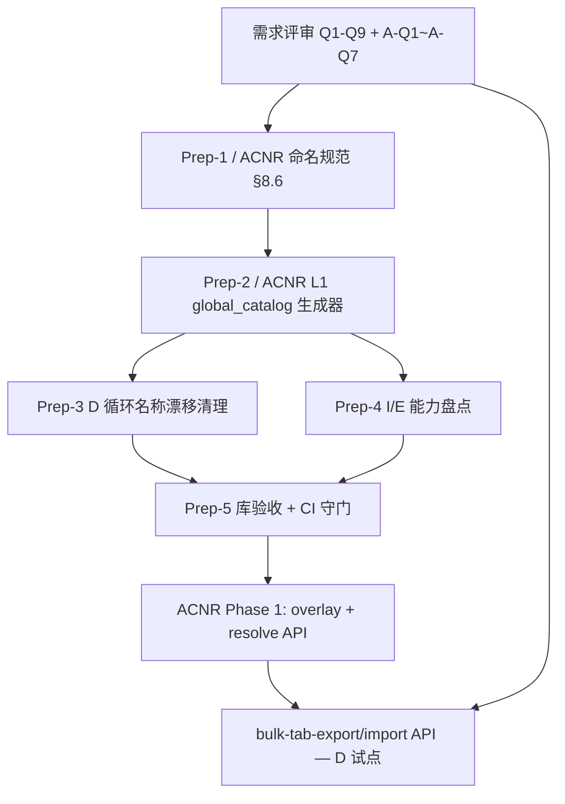

# 项目级底稿批量导入导出（ZIP）— 需求对齐文档

- **日期**：2026-07-10（**v1.4**：对齐 ACNR v1.7；§8.6 仍为命名规则 normative 真源）
- **状态**：需求对齐（非实施 spec）
- **目的**：在开发前把目标、范围、边界和待决问题说清楚，避免做错方向
- **前置模块**：[`address-coordinate-name-registry-architecture.md`](./address-coordinate-name-registry-architecture.md)（**ACNR** — 地址坐标名称注册中心；本文 bulk ZIP 为其消费者之一）

### 已确认决策（2026-07-10）

| 项 | 决议 |
|----|------|
| **终局目标** | 底稿 **全部** 纳入（A~S 全循环、全可离线 Tab） |
| **第一期试点** | **先做 D 循环**（D1~D7），验证名称库 + bulk ZIP 流程 |
| **名称库建设策略** | **全循环骨架 + D 循环填详情**（ACNR Phase 0：先铺全量 sheet 条目，D 循环优先补齐 I/E 与坐标） |
| **实施顺序** | **先 ACNR Phase 0–1，后 bulk ZIP（Phase 2）** |
| **工作量认知** | 全量人工对齐不可行（约千级人时级）；**规则冻结 + 生成器 + 分波收敛**（见 ACNR §十四） |
| **统一规则** | 新增/修改 sheet **只许走 catalog 生成器或 overrides**；禁止再手改 labels / 手写 manifest |

### 复盘摘要（2026-07-10）

| 判断 | 复盘后结论 |
|------|------------|
| 「单 Tab I/E 已有，bulk 差不多能拼」 | ✅ 解析器可复用；❌ **项目级 manifest 无权威表**，拼出来必漂移 |
| 「address_registry 就是名称库」 | ❌ V1 动态目录 **不读种子**；V2 服务 stale，**不是** Tab 路由库 |
| 「各循环已注册坐标，基础有了」 | ⚠️ 种子主要服务 **验收测试**，运行时选址器 **看不到** |
| 「四路径 orchestrator 已收口」 | ✅ 保存事件统一；❌ `touch_wp_registry` **未进 orchestrator** |
| **正确做法** | 先 ACNR catalog（G1–G8，见 ACNR doc §〇·二 R7）→ 再 bulk API |

---

## 〇、一句话目标

在一个审计项目内，支持 **一键导出全部可离线填写的底稿 Tab 模板（ZIP）→ 线下 Excel 填写 → 一键导入全部已填数据（ZIP）→ 一键导出全部已填数据（ZIP）**，用于外勤批量填表、项目归档和跨人协作。

---

## 一、用户场景（为什么要做）

| 角色 | 场景 | 痛点（今天） |
|------|------|----------------|
| 审计助理 | 年审现场，需同时填 D/K/F 等多个循环底稿 | 每个 Tab 单独点「导出模板 / 导入数据」，操作重复、易漏表 |
| 项目经理 | 安排多人分工填不同循环底稿 | 无法一次性下发「本项目全套空白表」，回收也要逐表导入 |
| 复核人 | 项目收尾归档 | 现有「批量导出」是整份底稿文件 ZIP，不是按 Tab 的结构化数据包 |
| IT/实施 | 新项目初始化、模板演练 | `wp-templates/download-all` 是**静态模板库**，不是**本项目实例化后的 Tab 模板** |

---

## 二、目标流程（期望体验）

```
┌─────────────────────────────────────────────────────────────────┐
│  项目工作台                                                      │
│  ┌──────────────┐  ┌──────────────┐  ┌──────────────┐           │
│  │ 导出全部模板  │  │ 导入全部数据  │  │ 导出全部数据  │           │
│  │   (ZIP)      │  │   (ZIP)      │  │   (ZIP)      │           │
│  └──────┬───────┘  └──────▲───────┘  └──────┬───────┘           │
└─────────┼──────────────────┼──────────────────┼──────────────────┘
          ▼                  │                  ▼
   project_xxx_templates.zip │         project_xxx_data.zip
          │                  │                  │
          ▼                  │                  │
   线下 Excel 填写 ──────────┘                  │
   （按目录 D/D1/D1-2_...xlsx）                 │
                                                ▼
                                         归档 / 交付 / 备份
```

**ZIP 内建议结构（草案，待确认）：**

```
manifest.json
README.txt
D/
  D1/
    D1-1_审定表_模板.xlsx
    D1-2_明细表_模板.xlsx
  D2/
    D2-1_审定表_模板.xlsx
K/
  ...
```

`manifest.json` 记录每个文件的 `wp_code`、`wp_id`、`sheet`、`api_prefix`、`item_id`、`sha256` 等，供导入时路由到现有单表 import 解析器。

---

## 三、与现有能力的关系（避免重复建设）

| 现有能力 | 端点/模块 | 与本需求关系 |
|----------|-----------|--------------|
| 单 Tab 导出模板/数据、导入 | `POST /api/workpapers/{wp_id}/{prefix}/export-template\|export-data\|import-data` | **复用**：bulk 层只做编排，不新造 Excel 列格式 |
| 批量导出整份底稿文件 | `POST .../working-papers/batch-export(-enhanced)` | **不同粒度**：导出的是 `working_paper.file_path` 整文件，不是 Tab 级结构化表 |
| 静态模板库 ZIP | `GET .../wp-templates/download-all` | **不同来源**：库模板，非项目当前 Tab 模板（含项目列定义/账龄段等） |
| 单底稿离线填写 | `POST .../offline/export-template` | **单 wp 级**，非项目全量 |
| 数据存储 | `checklist_responses`（`wp_id` + `item_id`） | bulk 导入的主战场；OnlyOffice/Univer/Word 需另议 |

**结论**：技术上可行，缺的是 **项目级编排层 + ACNR L1 目录**（manifest 真源），不是从零做 Excel 格式。单 Tab I/E 工厂是 **执行层**；bulk ZIP 是 **编排层**，编排层依赖目录层。

---

## 四、范围界定（必须先对齐）

### 4.1 分期范围（已确认：终局全部，首期 D）

| 阶段 | 范围 |
|------|------|
| **终局** | 项目内 **全部底稿** 可纳入 bulk ZIP（manifest 对不可纳入项标注 `skip_reason`） |
| **Prep / P1 试点** | **D 循环**（D1~D7）名称库详情 + bulk export/import API |
| **P2+** | 按循环扩展：K → F → G → H → … → A/B/C/S |

首期 D 循环约 **~96 个可 I/E Tab**（已有 `_*_import_export.py` 支撑），用于验证流程；名称库 Prep-2 仍建议 **全循环骨架先行**，避免二期推倒重来。

### 4.2 第一期纳入（D 循环高价值 Tab）

- **审计循环**：**D 循环**（D1~D7）
- **底稿类型**：`d-form-table` 类 HTML 结构化底稿（明细表、审定表、检查表等已有 `_*_import_export.py` 的 Tab）
- **数据形态**：`checklist_responses` 中的 JSON 行数组 / 标量字段

### 4.3 终局仍不纳入或仅标注 skip 的类型（各阶段通用）

| 类型 | 原因 |
|------|------|
| A/B/C 程序表、控制测试 | 无统一 Tab 级 I/E，交互以勾选/段落为主 |
| OnlyOffice / Univer 在线表 | 数据在 `parsed_data` / 单元格模型，非 checklist 行 JSON |
| Word 模板、自动报告 | 非 xlsx Tab 结构 |
| 函证中心（除已有 L0/F0 等 I/E 块） | 流程态 + 附件，非纯表格 |
| OCR 附件、AI 生成字段 | 批量 ZIP 通常只覆盖表格单元格数据 |

### 4.4 覆盖率预期（供决策参考）

| 口径 | 粗估覆盖率 |
|------|------------|
| 全平台所有 Tab | ~15%–25% |
| D~K 等已重构循环底稿的动态表 Tab | ~65%–75% |
| 以 wp_code 计有任意 I/E 的底稿 | ~18%–20% |

**Q1 已确认**：终局全部底稿；首期 **D 循环试点**；名称库 **全循环骨架 + D 填详情**。

---

## 五、功能需求（草案）

### FR-1 一键导出全部模板（ZIP）

**作为** 审计助理，**我希望** 按项目一键下载所有可离线填写的 Tab 空白模板，**以便** 在外勤统一填表。

| # | 验收标准 |
|---|----------|
| 1.1 | 支持按 **审计循环** 多选（如仅 D、或 D+K） |
| 1.2 | 仅导出该项目 **已实例化** 的底稿（`wp_index` ⋈ `working_paper` 有 `wp_id`） |
| 1.3 | 每个可 I/E 的 Tab 生成一个 xlsx，列头与当前项目配置一致（含账龄段口径等） |
| 1.4 | ZIP 内含 `manifest.json`，列出每个文件的路由元数据 |
| 1.5 | 跳过无 I/E 的 Tab，并在 manifest 或导出报告中标注 `skipped` 及原因 |
| 1.6 | 大项目支持异步导出 + 进度（可复用现有 `batch-export-async` / SSE 模式） |

### FR-2 一键导入全部已填数据（ZIP）

**作为** 审计助理，**我希望** 将线下填好的 ZIP 一次性导回项目，**以便** 避免逐 Tab 导入。

| # | 验收标准 |
|---|----------|
| 2.1 | 根据 `manifest.json` 将每个 xlsx 路由到对应 `{prefix}/import-data` 逻辑 |
| 2.2 | 支持 **dry_run（预检）**：校验表头、文件完整性，不写库，返回逐文件报告 |
| 2.3 | 正式导入前自动 **快照**（可复用 workpaper version trail），失败可回滚 |
| 2.4 | 导入结果报告：每个 sheet 的 `success / partial / failed`、导入行数、错误信息 |
| 2.5 | 冲突策略可配置（见 Q4）：覆盖 / 跳过已有数据 / 仅填空 |
| 2.6 | 遵守现有单表限制（如 500 行上限），超限 per-sheet 告警而非整包失败 |

### FR-3 一键导出全部已填数据（ZIP）

**作为** 项目经理，**我希望** 一键打包本项目全部已填 Tab 数据，**以便** 归档或发给复核人离线查看。

| # | 验收标准 |
|---|----------|
| 3.1 | 与 FR-1 相同的目录结构和 manifest，仅 `export_mode=data` |
| 3.2 | 导出内容为当前库内数据，非空白模板 |
| 3.3 | 可选：仅导出「有数据的 Tab」，减少空文件 |

### FR-4 导入后系统内行为

| # | 验收标准 |
|---|----------|
| 4.1 | 导入后触发相关底稿的 **公式重算 / 跨表联动**（如 D2-2 → D2-1 SUMIF） |
| 4.2 | 导入不破坏复核状态规则（见 Q5） |
| 4.3 | 导入操作记入审计日志（谁、何时、导入多少文件） |

### FR-5 入口与权限

| # | 验收标准 |
|---|----------|
| 5.1 | 入口：项目底稿列表 / 批量操作区（与现有 `WpBatchExportDialog` 并列或扩展） |
| 5.1 | 权限：导出 ≥ 只读；导入 ≥ 编制权限；回滚 ≥ 项目经理或同等角色 |
| 5.3 | 只读项目 / 已锁定项目禁止导入（若存在合并锁定等机制需统一） |

---

## 六、非功能需求

| 类别 | 要求 |
|------|------|
| 性能 | 单项目 500+ Tab 时支持异步任务，避免 HTTP 超时 |
| 可靠性 | 导入支持事务或快照回滚，避免「导入一半项目数据不一致」 |
| 兼容性 | 不新造 xlsx 列契约，100% 复用现有单表 import/export |
| 可追溯 | manifest 含 `exported_at`、`exported_by`、`platform_version` |
| 安全 | ZIP 不含密钥/Token；大文件上传限制与病毒扫描策略待 IT 确认 |

---

## 七、待决问题（碰需求最重要）

以下问题 **开发前必须拍板**，请业务方 / 合伙人 / 产品一起确认：

**待决问题 Q1**：~~第一期是否接受「仅 D 循环全量」~~ → **已确认：终局全部，首期 D 循环试点。**

### Q1 第一期范围 ✅ 已确认

- [x] **终局**：全部底稿（A~S 全循环，manifest 标注不可纳入项）
- [x] **首期试点**：**D 循环**（D1~D7，~96 可 I/E Tab）
- [ ] ~~B~~：D + K（并入 P2 扩展顺序）
- [ ] ~~C~~：用户勾选任意循环（终局能力，非首期）

### Q2 「全部底稿」的定义

- [ ] **A**：仅「本项目已生成的底稿实例」
- [ ] **B**：含「适用但未生成的底稿」（导入时自动建实例？）
- [ ] **C**：含不适用/跳过的底稿（manifest 标注 NA）

### Q3 模板 vs 数据的边界

- [ ] 导出模板时是否 **预填项目基础信息**（被审计单位、截止日、编制人）？
- [ ] 导入时是否允许 **只导入 ZIP 中的部分文件**（用户删改了 manifest 中的文件）？
- [ ] 是否支持 **仅导入某一循环** 的子 ZIP？

### Q4 冲突与覆盖策略（导入时库中已有数据）

- [ ] **覆盖**：以 ZIP 为准，全量替换该 `item_id` 行数据
- [ ] **合并**：按主键（如客户名）更新，新增行追加
- [ ] **仅填空**：只写入空字段/空行，不覆盖已有编制
- [ ] **拒绝**：任一冲突则该 sheet 失败，不部分写入

### Q5 工作流与状态

- [ ] 底稿处于 **待复核 / 已通过** 时是否允许批量导入？
- [ ] 导入后底稿状态是否自动回退为「编制中」？
- [ ] 是否需要 **导入审批**（项目经理确认后才 apply）？

### Q6 与现有「批量导出（元数据）」的关系

- [ ] **替代**：新功能取代旧 batch-export-enhanced
- [ ] **并存**：两种导出并存，UI 上区分「整份底稿文件」vs「Tab 结构化数据包」
- [ ] **合并**：一次 ZIP 内同时含整份文件 + Tab 级 xlsx（包会很大）

### Q7 离线填写范围

- [ ] 是否要求 ZIP 内附带 **填写说明 PDF / README**（每 Tab 链到编制提示）？
- [ ] 是否支持 **Mac 版 Excel / WPS** 填写后导入（列头编码、日期格式兼容性）？

### Q8 归档与交付

- [ ] 「导出全部数据」是否作为 **正式归档格式** 写入项目交付物清单？
- [ ] 是否需要 **密码保护 ZIP** 或加密 manifest？

### Q9 成功标准（验收）

请确认 MVP 验收场景（建议至少 3 条）：

1. [ ] 选定测试项目，一键导出 D 循环全部模板 ZIP，线下填 3 张代表表（审定/明细/检查），一键导入后系统内数据与手工录入一致
2. [ ] 导入后 D2-1 审定表与 D2-2 明细表 SUMIF 联动正确
3. [ ] 导入失败时整包可回滚到导入前快照
4. [ ] （可选）500+ Tab 项目异步导出 10 分钟内完成

---

## 八、开发前准备工作（前提，必须先做）

> **结论**：批量 ZIP 能否做成，不取决于 ZIP 打包技术，而取决于是否先建成统一的 **底稿地址坐标名称库**。当前这些信息分散在 15+ 处，名称不一致、无单一 join 键。
>
> **平台级模块**：名称库应独立为 **ACNR（地址坐标名称注册中心）**，作为公式管理、高级查询、bulk ZIP、CCR、QC 下钻的统一基础。架构详见 [`address-coordinate-name-registry-architecture.md`](./address-coordinate-name-registry-architecture.md)。

### 8.1 两类「库」，不要混为一谈

| 库 | 用途 | 今天有没有 | 批量 ZIP 是否需要 |
|----|------|------------|-------------------|
| **A. 底稿 Tab 名称路由库** | `wp_code` / `sheet_code` / `sheet_name` / `item_id` / `api_prefix` — 决定 ZIP 里每个文件叫什么、导入时路由到哪 | ❌ 无统一库，散落在 Python I/E、前端 labels、DB classification | ✅ **必须**（manifest 核心） |
| **B. 单元格地址坐标库** | `wp_code` + `sheet_name` + `cell_address`（如 F50）— 公式联动、CCR 跳转、合计校验 | ⚠️ 13 个种子文件（163 条目 / 473 坐标），**运行时未接入**，仅测试断言；名称漂移 | ⚠️ **批量 I/E 不直接依赖**；联动校验、归档公式需要 |

两类库统一收敛为 **ACNR**（见架构文档 §一–§三）。批量导入导出 **P0 前提是 ACNR L1 目录（库 A）**；库 B 与公式/CCR 共用同一 catalog 的 `coordinates[]`，在 ACNR Phase 0 与库 A 一并建设，不单独分叉。

### 8.2 今天名称/地址信息散在哪（碎片化现状）

```
wp_code
  ├─ wp_code_overrides.json          → componentType（~1400 条，路由用）
  ├─ wp_account_mapping.json         → 科目/循环（非 sheet 级）
  ├─ workpaper_sheet_classification  → sheet_name + class_code（DB，较权威）
  ├─ wp_render_schema/*.yaml         → 478 个，3 种格式，import_export 标记不全
  ├─ d1SheetLabels.ts 等             → sheet_code ↔ 中文名 ↔ tabKey（前端）
  ├─ _d1_import_export.py 等       → api_prefix + item_id + 列头（~80 个 Python 文件）
  ├─ d_address_registry_seed.json    → 物理坐标 F50/G50（稀疏）
  └─ cross_wp_references.json        → 跨底稿语义引用（415 条，多用 WP 三参）
```

**程序现状要点**（详见 ACNR 架构 doc §一）：

- V1 `build_workpaper_entries()` **不读** `*_address_registry_seed.json`（种子仅测试用）
- V1 与 V2（l2 语义 JSON）**双轨 API**，数据未统一
- `formula_grammar.py` 中 `WP` 为 **2 参**；CCR / reverse_index 为 **3 参** — 需 ACNR Phase 0 统一
- 高级查询 `snapshot_writer` 使用裸坐标，**未接** address registry

**同名 sheet 多处写法不一致**（真实例子）：

| 来源 | D1-2 的 sheet_name |
|------|---------------------|
| 前端 `D1_SHEET_LABEL_MAP` | 原值明细表（按类别）D1-2 |
| `d_address_registry_seed` | 原值明细（按类）D1-2 |
| `account_package_registry` | 原值明细表（按类别）D1-2 |

没有统一 join 键时，manifest 路径、导入路由、ZIP 文件名都会对不上。

### 8.3 准备工作清单（建议按顺序）

#### Prep-1：定 canonical 命名规范（业务拍板）

> **详见 §8.6 地址坐标命名规则（含自定义底稿）** — 本节为 Prep 核心交付物。

- [ ] 确认 §8.6 规则 v1.0（标准底稿 + 自定义底稿 + 扩展机制）
- [ ] **权威 sheet_name**：以 `workpaper_sheet_classification.sheet_name`（xlsx Tab 真名）为准；自定义底稿例外见 §8.6.3
- [ ] **权威 sheet_code**：以 `D1-2` 后缀编码为准（与 `?sheet=` 参数一致）；自定义用 `CUST-*` 或 `custom-*`
- [ ] **bundle 虚拟码**：`S34-16-1` 等纳入库（见 `bundleSheetAliases.ts`）
- [ ] **程序表 / 目录 / 附注**：`functional_type` 标注；批量 ZIP 默认 skip，但须在库中有条目

### 8.6 地址坐标命名规则（含自定义底稿）— 规则 v1.0 草案

> **原则**：所有底稿（标准 + 自定义）必须能用 **同一套寻址语法** 被引用、被 bulk ZIP 路由、被公式 `WP()` 定位。规则可扩展，禁止各模块私自造名。

#### 8.6.1 三层寻址模型

| 层 | 字段 | 作用 | 示例 |
|----|------|------|------|
| **L1 底稿** | `wp_code` | 底稿类型/实例在索引中的编码 | `D1`、`D2`、`CUST-99` |
| **L2 表页** | `sheet_code` + `sheet_name` | Tab 级定位（bulk ZIP 文件名、manifest 路由） | `D1-2` / `原值明细表（按类别）D1-2` |
| **L3 坐标** | `cell_address` 或 `semantic_label` | 单元格或语义锚点 | `F50` / `合计行-期末余额` |

**统一 URI**（与现有 `address_registry` 对齐）：

```
{domain}://{source}/{path}#{cell}

域 domain：wp | tb | report | note | aux
底稿域示例：
  标准：wp://D2-2/明细表D2-2#E100
  自定义（单 sheet）：wp://CUST-99/B7#B7   （path 可为 cell，见 extract_custom_cells）
```

**公式引用**（与 `cross_wp_references.json` / `WP()` 对齐）：

```
WP('{wp_code}', '{sheet_name}', '{semantic_label_or_cell}')
例：WP('H1','折旧分配分析表H1-13','销售费用折旧')
```

**库内稳定主键 `addr_id`**（新增，用于扩展与 CI）：

```
{parent_wp_code}/{sheet_code}/{coordinate_key}

coordinate_key = cell_address（A1）优先；无 A1 时用 semantic_label 的 slug
例：D2/D2-2/E100 、 D2/D2-2/合计行-期末余额
```

> **v1.7 对齐**：sheet 级条目为 `D2/D2-2`（无坐标后缀）；公式 `WP()` 第一参为 **父码** `D2`。详见 ACNR 架构 doc §5.1。

#### 8.6.2 标准底稿命名规则

**wp_code**

| 规则 | 正则/模式 | 示例 |
|------|-----------|------|
| 循环+序号 | `^[A-S]\d+` 开头 | `D1`, `D2`, `K13`, `E11` |
| 带 Tab 后缀 | `^{Cycle}\d+-\d+([A-Z])?$` | `D1-2`, `D1-8T`, `K1-2` |
| 程序表 | `^{Cycle}A$` 或含 `程序` | `D1A`, `D2A` |
| Bundle 子码 | `^S\d+-\d+-\d+$` 等 | `S34-16-1`（映射到 parent + sheet） |

判定函数与线上一致：`wp_render_config._looks_like_standard_wp_code` → `^[A-I]\d`（**待扩展为 `[A-S]\d`**，当前 J/K/L/M/N/S 可能被误判为自定义）。

**sheet_code**

- 从 `sheet_name` **尾部**提取：`(?<sheet_code>[A-S]\d+-\d+[A-Z]?|[A-S]\d+A)\s*$`
- 与 API `?sheet=D1-2`、前端 `D1_SHEET_LABEL_MAP` 的 key **必须一致**

**sheet_name（权威写法）**

```
{中文功能名}{sheet_code}
```

| 类型 | 模板 | 示例 |
|------|------|------|
| 审定表 | `审定表{code}` | `审定表D1-1` |
| 明细表 | `…明细表…{code}` 或 `明细表{code}` | `明细表D2-2` |
| 程序表 | `…程序表{code}` | `应收账款实质性程序表D2A` |
| 底稿目录 | `底稿目录` | 无 sheet_code 后缀 |

**权威源优先级**：`workpaper_sheet_classification.sheet_name` > xlsx 模板 Tab 名 > 前端 label（作 alias）

**坐标 cell_address**

- Excel 标准：`^[A-Z]{1,3}\d{1,7}$`（如 `F50`, `AA100`）
- 语义标签：中文描述，用于 `WP()` 第三参数；库内须同时记录 `cell_address`（若有）

**purpose 枚举**（坐标用途，扩展时只允许追加）：

`balance_verification` | `conclusion` | `aging_analysis` | `ratio_analysis` | `formula_anchor` | `import_export_total` | `other`

#### 8.6.3 自定义底稿命名规则

自定义底稿指：用户上传模板、程序裁剪「自定义新增」、手动 `source_type=manual` 且不符合标准 wp_code 的底稿（`componentType=custom`）。

| 项 | 规则 |
|----|------|
| **wp_code 分配** | 新建时系统生成：`CUST-{项目内序号}`（如 `CUST-01`）或用户指定；**禁止**与已有标准 wp_code 冲突 |
| **wp_code 格式** | `^CUST-\d{2,}$` 或 `^custom-\d+$`（程序表 `custom-{timestamp}` 可映射为 `CUST-*`） |
| **sheet_name** | **默认 = wp_code**（与 `parsed_data.html_data` 的 key 一致，见 `wp_render_config._maybe_custom_classifications`） |
| **sheet_code** | 单 sheet 自定义底稿：`sheet_code = wp_code` |
| **多 sheet 自定义** | 每 sheet：`sheet_name` 为用户上传 xlsx Tab 真名；`sheet_code` = `{wp_code}@{tab_slug}`，例 `CUST-01@sheet1` |
| **坐标注册** | 上传/保存后 `extract_custom_cells(parsed_data)` **自动**写入 WP 域；用户可为关键格追加 `semantic_label` |
| **class_code** | 固定 `CUSTOM` |
| **bulk ZIP** | 第一期可 `skip_reason=custom_univer_only`；二期支持自定义 xlsx 导出时走 `wp://` + 单元格直读 |

**自定义底稿进入名称库的最小条目**：

```json
{
  "addr_id": "CUST-01/CUST-01/B7",
  "origin": "custom",
  "wp_code": "CUST-01",
  "sheet_code": "CUST-01",
  "sheet_name": "CUST-01",
  "sheet_name_aliases": [],
  "component_type": "custom",
  "import_export_enabled": false,
  "coordinates": [
    { "cell_address": "B7", "semantic_label": "期末余额", "purpose": "balance_verification" }
  ]
}
```

#### 8.6.4 扩展与新增底稿规则（标准 + 自定义通用）

新增底稿（新科目、新 Tab、新检查表）**必须**按以下流程登记，否则不得接入 bulk ZIP / `WP()` / 跨底稿引用：

```
1. 申请 wp_code（或 CUST-xx）→ 2. 登记 sheet_name + sheet_code
→ 3. 登记 item_id / api_prefix（若有 I/E）→ 4. 登记坐标（可选）
→ 5. CI 校验 addr_id 唯一 + 命名符合 §8.6
```

| 扩展类型 | wp_code | sheet_code | 坐标 | 维护方式 |
|----------|---------|------------|------|----------|
| 新标准 Tab（如 D1-17） | 沿用 D1 | `D1-17` | 种子 JSON + 可选 I/E | 脚本 + PR 更新 registry |
| 新循环底稿 | 新 `X1` | `X1-1`… | 同左 | 同左 |
| 用户自定义 | `CUST-xx` | =wp_code 或 `wp@tab` | 自动 extract + 手工 semantic | 上传触发 + 用户标注 |
| 项目级临时表 | `CUST-xx` | 同上 | 同上 | 不写入全局种子，仅项目 registry |

**人工 override 文件**（建议）：

`backend/data/wp_sheet_address_registry.overrides.json` — 仅放别名、补充坐标、临时 skip；**不覆盖**标准 wp_code 主记录，CI 合并时 override 优先级高于自动生成。

#### 8.6.5 别名与兼容解析

库内每条记录允许 `sheet_name_aliases[]`，用于消化历史漂移：

```json
"sheet_name": "原值明细表（按类别）D1-2",
"sheet_name_aliases": ["原值明细（按类）D1-2", "D1-2明细"]
```

解析顺序：

1. 精确匹配 `sheet_name`
2. 匹配 `sheet_name_aliases`
3. 后缀匹配 `sheet_code`（`endsWith(sheet_code)`）
4. 自定义底稿：匹配 `wp_code` 作为 sheet_name

#### 8.6.6 与 bulk ZIP manifest 的映射

manifest 每条 file 记录 **必须**携带 §8.6 字段，保证标准/自定义同一套路：

```json
{
  "addr_id": "D1-2/D1-2/D1-cat-rows",
  "wp_code": "D1",
  "sheet_code": "D1-2",
  "sheet_name": "原值明细表（按类别）D1-2",
  "origin": "standard",
  "api_prefix": "d1",
  "item_id": "D1-cat-rows",
  "zip_path": "D/D1/D1-2_原值明细表_模板.xlsx"
}
```

ZIP 路径命名模板：

```
{audit_cycle}/{parent_wp_code}/{sheet_code}_{short_label}_{模板|数据}.xlsx

short_label：sheet_name 去掉 sheet_code 后缀的中文部分，slug 化
自定义：CUST/CUST-01/CUST-01_数据.xlsx
```

#### 8.6.7 待确认（命名规则专用）

| # | 问题 | 建议 |
|---|------|------|
| N-Q1 | 自定义 wp_code 前缀统一为 `CUST-` 还是允许用户中文名？ | 建议 **仅 `CUST-{nn}` 机器码**，中文放 `wp_name` |
| N-Q2 | 多 sheet 自定义的 `sheet_code` 用 `@` 还是 `/`？ | 建议 `CUST-01@Tab名slug`，URI 仍用 `/` |
| N-Q3 | `_looks_like_standard_wp_code` 是否扩到 `[A-S]\d`？ | 建议 **是**，避免 J/K 误判 custom |
| N-Q4 | 语义坐标是否强制绑定 A1？ | 建议 **尽量双写**；仅有语义时 formula 用 label，bulk 用 item_id 行 JSON |
| N-Q5 | 全局库 vs 项目库 | 建议 **全局种子 + 项目实例 overlay**（含 CUST 与 wp_id） |

---

> 可视为「底稿地址坐标名称库」的主表；批量 I/E 的 `wp_import_export_registry` 是其子集视图。

建议每条记录至少包含：

| 字段组 | 字段 | 说明 |
|--------|------|------|
| 身份 | `cycle`, `parent_wp_code`, `wp_code`, `sheet_code`, `sheet_name`, `sheet_name_aliases[]` | 唯一寻址 |
| 展示 | `wp_name`, `seq`, `tab_key`, `class_code`, `functional_type` | 目录排序、UI |
| 路由 | `component_type`, `render_schema_path` | 渲染 |
| 导入导出 | `import_export_enabled`, `api_prefix`, `item_id`, `item_ids[]`, `storage_field`, `headers[]`, `field_keys[]`, `row_limit`, `special_rules` | manifest 路由 |
| 坐标（可选） | `coordinates[{cell_address, description, purpose}]` | 合并 address_registry 种子 |
| 依赖 | `import_order`, `depends_on_sheets[]` | 批量导入拓扑排序 |
| 跳过 | `skip_reason` | 无 I/E / Univer / Word / 只读目录 |

**生成方式（建议）**：

1. 以 `workpaper_sheet_classification`（2602 sheets / 349 xlsx 分析）为 **sheet_name 主数据**
2. 脚本扫描 `_*_import_export.py` 注入 `api_prefix` + `item_id`
3. 合并 `d1SheetLabels.ts` 等前端 maps 作为 `aliases`
4. 合并 `*_address_registry_seed.json` 坐标
5. 输出 `backend/data/acnr/global_catalog.json`（主表名由 `wp_sheet_address_registry` 演进）+ CI 漂移检测

> **注**：产物路径以 ACNR 架构 doc §九 为准；`wp_sheet_address_registry.json` 为早期草案名，实施时统一为 `acnr/global_catalog.json`。

#### Prep-3：名称漂移清理（D 循环试点）

- [ ] 对齐 D1–D7：前端 labels、address seed、account_package、classification 四处 `sheet_name`
- [ ] D2 补 `d2SheetLabels.ts`（今天标签散落在 `D2TabIndex.vue`）
- [ ] 为 D 循环 generated YAML 补 `import_export` / `code` 字段（或明确「以 Python specs 为准」）

#### Prep-4：导入导出能力盘点（机器可读）

- [ ] 从 80 个 `_*_import_export.py` 自动生成 **I/E 覆盖清单**（哪些 sheet 可 bulk）
- [ ] 标注 `storage_field`：`conclusion` vs `remark`（工厂默认 vs D 类特例）
- [ ] 标注多 `item_id` sheet（如 D1-4 坏账准备双段、D1-15 ECL）

#### Prep-5：验收「库」本身（再做 bulk API）

> **对齐 ACNR §〇·二 R7 Gate G1–G4**；以下与 ACNR 文档合并验收，通过后方可写 bulk spec。

- [ ] 给定任意 `sheet_code`，能唯一解析出 `sheet_name` + `item_id` + `api_prefix`
- [ ] 给定任意 `sheet_name` 别名，能反查 `sheet_code`（模糊匹配有测试）
- [ ] D 循环 I/E 清单与 catalog 零冲突（CI gate）；`*SheetLabels.ts` 改为生成物后不再手改
- [ ] 种子 473 坐标 **100% 在 catalog** `coordinates[]`
- [ ] 坐标条目与 HTML 结构化表不矛盾（Univer/OnlyOffice 表标注 `skip_reason`）
- [ ] **禁止项**：在 Gate 未通过前，不得合并任何 `bulk-tab-export` / `bulk-tab-import` 实现 PR

### 8.4 准备工作与后续阶段关系

> **对齐 ACNR**：本节 Prep-1 ~ Prep-5 = ACNR **Phase 0**（见 [`address-coordinate-name-registry-architecture.md`](./address-coordinate-name-registry-architecture.md) §8.2）。bulk ZIP API 在 ACNR Phase 0 验收通过后再启动。



**Gate**：`Prep-1` ~ `Prep-5` = ACNR Phase 0；**G1–G8 全部通过** + Q1–Q9 / N-Q / A-Q 拍板 → 立 `.kiro/specs/acnr/` → **ACNR Phase 1**（API + 运行时）→ 再立 bulk spec → **Bulk Phase 2** 开发。

> **复盘修正（v1.2）**：bulk API 不得与 ACNR Phase 0 并行开发；此前「P1 与 ACNR Phase 1 并行 bulk」已取消。

### 8.5 待决问题（准备工作专用）

| # | 问题 | 选项 |
|---|------|------|
| P-Q1 | 统一库放哪？ | JSON 文件 / DB 表 / 双写（JSON 生成 + DB 查询） |
| P-Q2 | sheet_name 权威源？ | classification DB / 前端 labels / xlsx 模板扫描 |
| P-Q3 | 坐标库是否并入同一张表？ | 合并 / 分表关联（`wp_code+sheet_code` FK） |
| P-Q4 | 谁维护？ | 仅脚本生成 / 允许人工 override 文件（§8.6.4） |
| P-Q5 | 第一期库覆盖范围？ | ✅ **全循环骨架 + D 填详情**（终局全部，首期 D 试点） |
| P-Q6 | 自定义底稿命名？ | 遵循 §8.6.3 `CUST-{nn}` + 自动 extract 坐标 |

---

## 九、建议分期（复盘修正 v1.2）

| 阶段 | 内容 | 前置条件 | bulk 能否开发 |
|------|------|----------|---------------|
| **ACNR Phase 0** | Prep-1~5：命名规则 + `global_catalog` 生成器 + D 漂移清理 + CI；G1–G8 Gate | §八 + ACNR §〇·二 R7 | ❌ 禁止 |
| **ACNR Phase 1** | `/api/acnr/*`、种子进运行时、orchestrator 失效收口、overlay | Phase 0 Gate | ❌ 禁止 |
| **Bulk Phase 0** | bulk 需求评审 + `.kiro/specs/workpaper-bulk-tab-import-export/` 三件套 | ACNR Phase 1 + G1–G4 复验 | ❌ 仅 spec |
| **Bulk Phase 1** | bulk-tab-export/import API + manifest（**D 循环试点**） | Bulk Phase 0 spec 签字 | ✅ |
| **Bulk Phase 2** | 前端三按钮 + 导入报告 + 扩至 K/F/G/H… | Bulk P1 验收 | ✅ |
| **ACNR Phase 2** | 公式/查询 `useAcnr`、addr_id 回写 | 与 Bulk P2 可并行 | — |
| **Bulk Phase 3** | 异步/SSE、快照回滚、权限审计 | Bulk P2 | ✅ |
| **Bulk Phase 4** | OnlyOffice/程序表异构评估 | 业务优先级 | 评估 |

---

## 十、风险与约束（复盘增补）

1. **终局目标是全部底稿**；不可纳入项在 manifest 标注 `skip_reason`，而非永久排除  
2. **最大风险不是 ZIP 性能，是 manifest 漂移**——无 ACNR 时一期能「 demo」，二期必翻车  
3. **单表 500 行限制**：批量场景需在报告中汇总超限 sheet  
4. **账龄段等项目配置变更**：模板导出后若项目改配置，导入需按列名匹配并告警  
5. **跨 wp 公式**：导入顺序按依赖拓扑（先明细后审定）  
6. **附件/OCR/AI 字段**：不在第一期范围  
7. **「测试绿」误导**：循环验收只验种子文件存在时，**不代表 bulk/公式可用**——以 catalog Gate 为准  

---

## 十一、相关代码与文档索引（供评审时对照）

| 用途 | 路径 |
|------|------|
| **ACNR 架构（主文档）** | `address-coordinate-name-registry-architecture.md`（v1.7；**附录 A** 验收清单） |
| **命名规则 normative 真源** | **本文 §8.6** |
| 单表 I/E 工厂 | `backend/app/routers/wp_render_strategies/_cycle_import_export_common.py` |
| D1 示例 | `backend/app/routers/wp_render_strategies/_d1_import_export.py` |
| 批量整文件导出 | `backend/app/routers/wp_export_import_router.py`、`wp_batch_router.py` |
| 静态模板库 ZIP | `backend/app/routers/wp_template_download.py` |
| 前端批量导出 UI | `audit-platform/frontend/src/components/workpaper/WpBatchExportDialog.vue` |
| 数据模型 | `checklist_responses`（`backend/migrations/V085__checklist_responses.sql`） |
| **sheet 分类（名称权威候选）** | DB `workpaper_sheet_classification`；种子 `backend/scripts/seed/seed_workpaper_sheet_classification.py` |
| **前端 sheet 标签** | `audit-platform/frontend/src/components/workpaper/composables/d1SheetLabels.ts`（D3–D7 同类） |
| **wp_code 路由** | `backend/app/data/wp_code_overrides.json` |
| **单元格坐标种子** | `backend/data/d_address_registry_seed.json`（及 e~s 循环同类文件） |
| **跨底稿引用** | `backend/data/cross_wp_references.json` |
| **模板分析（2602 sheets）** | `.kiro/specs/_archive/07-workpaper-slimdown/workpaper-html-renderer/workpaper_template_analysis.json` |
| **render schema** | `backend/data/ledger_adapters/wp_render_schema/`（478 yaml） |

---

## 十二、评审记录（留白）

| 日期 | 参与人 | 决议 |
|------|--------|------|
| 2026-07-10 | 用户 | **终局全部底稿**；**首期 D 循环试点**；名称库策略：**全循环骨架 + D 填详情** |
| 2026-07-10 | 用户 | 地址坐标名称须有成文 **规则**，且支持 **自定义新增底稿**（§8.6） |
| | | Q2: |
| | | Q4 冲突策略: |

---

**下一步**：

1. 先评审 **第八节准备工作**（底稿地址坐标名称库）与 P-Q1~P-Q5  
2. 再评审 **第七节 Q1–Q9**（批量 ZIP 业务范围）  
3. Prep 验收通过后，另立 `.kiro/specs/workpaper-bulk-tab-import-export/` 三件套再开发
