# 第十三章 销售循环操作手册

> **版本**: v2.0 | **更新日期**: 2025年10月 | **适用准则**: 中国注册会计师审计准则
> 
> **📍 返回主框架**: [审计实务操作手册-框架](./审计实务操作手册-框架.md#第十三章-销售循环)
> 
> **🔗 本章在审计流程中的位置**: 第三部分 > 业务循环操作手册 > 第十三章

---

## 📚 手册说明

本手册详细说明销售循环审计的全流程操作，包括穿行测试、控制测试和实质性测试三个阶段，每个阶段提供具体的底稿填写指引和实操案例。

### 适用范围

#### 资产类科目
- **应收账款审计** - 应收货款、应收服务费、关联方应收款
- **应收票据审计** - 银行承兑汇票、商业承兑汇票
- **应收款项融资审计** - 以公允价值计量的应收票据（新金融工具准则）
- **合同资产审计** - 已完工未结算、质保金（新收入准则）

#### 负债类科目
- **合同负债审计** - 预收货款、预收服务费（新收入准则）
- **预计负债审计** - 销售退回准备、产品质量保证金
- **应交税费审计** - 应交增值税、税金及附加

#### 损益类科目
- **营业收入审计** - 主营业务收入、其他业务收入
- **营业成本审计** - 与存货循环交叉
- **信用减值损失审计** - 应收账款坏账准备、应收票据减值
- **销售费用审计** - 销售佣金、运输费（与管理循环交叉）

### 底稿体系
- **B类底稿**: B23-1销售循环业务层面控制（6个子底稿）
- **C类底稿**: C2销售循环控制测试（3个子底稿）
  - C2: 控制测试汇总表
  - C2-1: 控制测试过程记录
  - C2-2: 控制偏差评价
- **D类底稿**: D销售循环实质性测试（74+个子底稿）
  - D0系列：函证程序（8个底稿）
  - D1系列：应收票据（16个底稿）
  - D2系列：应收账款（14个底稿）
  - D4系列：营业收入（36个底稿）
  - D8系列：应交税费（5个底稿）

---

## 🚀 5分钟快速上手指南

> **新手必读！** 第一次审计销售循环？这里告诉你最核心的内容和最快的路径。

### 📌 三步定位你需要的内容

**步骤1：确定你的审计阶段**
```
你在哪个阶段？
├─ 刚开始项目？ → 阅读【第7.1-7.3节】了解循环特征和风险
├─ 风险评估阶段？ → 执行【第7.4节】穿行测试
├─ 控制测试阶段？ → 执行【第7.5节】控制测试（可选）
└─ 实质性测试阶段？ → 重点看【第7.6节】⭐⭐⭐
```

**步骤2：找到你的核心必做程序**
```
销售循环审计的8个核心程序（必须执行）：
✅ 1. 收入函证 → 第7.6.1节 ⭐⭐⭐
✅ 2. 应收账款函证 → 第7.6.1节 ⭐⭐⭐
✅ 3. 收入截止性测试 → 第7.6.4.1节 ⭐⭐⭐
✅ 4. 收入真实性检查 → 第7.6.4.2节 ⭐⭐
✅ 5. 毛利率分析 → 第7.7.2节 ⭐⭐
✅ 6. 应收账款账龄分析 → 第7.6.3.1节
✅ 7. 坏账准备测试 → 第7.6.3.2节
✅ 8. 收入舞弊风险识别 → 第7.6.6节 ⭐⭐

收入是高风险领域！必须高度关注舞弊风险
```

**步骤3：遇到问题时快速查找**
```
常见问题？ → 第7.10节FAQ（15个高频问题）
不会填底稿？ → 每节都有"填写示例"
需要模板？ → 查看"第7.11节：工具与模板"
```

---

### 🎯 场景化快速索引（⭐重点推荐）

> **💡 使用说明**: 这是最实用的导航！直接找到你当前遇到的场景，快速定位解决方案。

#### 📍 场景一：审计项目启动阶段

| 你的情况 | 快速跳转 | 核心内容 | 预计用时 |
|---------|---------|---------|---------|
| 🆕 **第一次审计销售循环** | [7.1节](#71-销售循环特征与风险) → [5分钟快速上手](#🚀-5分钟快速上手指南) | 了解循环特征、风险、底稿体系 | 30分钟 |
| 📋 **制定审计计划** | [7.2节](#72-审计流程概览) → [7.3节](#73-风险识别与应对) | 审计流程图、底稿执行顺序 | 1小时 |
| 🎯 **确定审计策略** | [7.1.3节](#713-审计策略选择) → [决策树1](#决策树1是否执行控制测试) | 实质性方案vs综合性方案 | 30分钟 |
| 📊 **风险评估** | [7.3.1节](#731-特别风险清单) → [B23-1穿行测试](#741-穿行测试准备) | 识别特别风险、设计应对程序 | 2小时 |

#### 📍 场景二：现场审计执行阶段

| 你的情况 | 快速跳转 | 核心内容 | 预计用时 |
|---------|---------|---------|---------|
| 🔍 **现场审计第一天** | [7.6.1节](#761-函证程序) | 函证准备、发函控制 | 立即开始 |
| 📝 **填写审定表** | [7.6.2节](#762-审定表与明细表) | D2-1、D4-1审定表填写 | 每个20分钟 |
| 📈 **收入截止性测试** | [7.6.4.1节](#7641-收入截止性测试d2-3) | 截止测试执行步骤 | 2-3小时 |
| 🔎 **收入真实性检查** | [7.6.4.2节](#7642-收入真实性检查d2-4) | 三单核对、期后回款 | 4-6小时 |
| 📊 **毛利率分析** | [7.7.2节](#772-毛利率分析) | 毛利率计算、异常分析 | 1-2小时 |
| 💰 **坏账准备测试** | [7.9节](#79-应收账款减值测试) | 账龄分析、坏账测算 | 2-3小时 |

#### 📍 场景三：遇到异常情况

| 你的情况 | 快速跳转 | 核心内容 | 预计用时 |
|---------|---------|---------|---------|
| ⚠️ **收入突然大幅增长(>30%)** | [7.8.2节](#782-期末突击销售检查) → [决策树4](#决策树4收入异常波动应对) | 异常分析、突击销售检查 | 4小时 |
| 🔴 **怀疑收入造假** | [7.6.6节](#766-舞弊风险专项应对d4-23至d4-27) → [7.8节](#78-舞弊风险应对) | 虚假销售识别、舞弊迹象 | 重点程序 |
| 📉 **毛利率大幅下降(>10%)** | [7.7.2节](#772-毛利率分析) → [决策树4](#决策树4收入异常波动应对) | 毛利率分析、原因调查 | 3小时 |
| 💸 **期末应收账款激增** | [7.6.3.1节](#7631-应收账款账龄分析d1-3) → [7.8.2节](#782-期末突击销售检查) | 账龄分析、突击销售检查 | 3小时 |
| 🔄 **发现大量销售退回** | [7.8.3节](#783-渠道压货识别) | 退货检查、渠道压货识别 | 2-3小时 |
| 🤝 **关联方销售占比高(>30%)** | [7.13.1节](#7131-与其他循环的关联) | 关联方识别、公允性测试 | 4小时 |

#### 📍 场景四：函证相关问题

| 你的情况 | 快速跳转 | 核心内容 | 预计用时 |
|---------|---------|---------|---------|
| ❓ **不知道函证范围** | [7.6.1.1节](#7611-函证范围确定) → [决策树2](#决策树2函证范围确定) | 覆盖率要求、选样方法 | 30分钟 |
| 📮 **函证不回怎么办** | [7.10.2节Q5](#7102-函证与底稿专题) | 催函技巧、替代程序 | 5步策略 |
| 📧 **函证回函率低(<50%)** | [7.6.1.5节](#7615-函证替代程序) | 替代程序设计、证据要求 | 3小时 |
| ❌ **函证差异巨大** | [7.6.1.4节](#7614-函证差异调节) | 差异调节、原因分析 | 2小时 |
| 🏢 **客户拒绝函证** | [7.10.2节Q6](#7102-函证与底稿专题) | 客户沟通、管理层函证 | 1小时 |

#### 📍 场景五：特殊项目类型

| 你的情况 | 快速跳转 | 核心内容 | 预计用时 |
|---------|---------|---------|---------|
| 🎯 **IPO项目** | [7.6.8节](#768-ipo项目专项核查) → [7.3.4节](#734-ipo项目特殊考虑) | IPO特殊要求、核查要点 | 重点关注 |
| 📜 **首次应用新收入准则** | [7.6.7节](#767-新收入准则应用检查d4-18至d4-22) → [7.10节](#7610-新收入准则专题) | 五步法应用、准则检查 | 6小时 |
| 🏭 **制造业企业** | [7.3.2节](#732-行业特定风险) | 制造业特定风险 | 1小时 |
| 🏠 **房地产企业** | [7.3.2节](#732-行业特定风险) | 房地产收入确认特点 | 1小时 |
| 💻 **软件/SaaS企业** | [7.3.2节](#732-行业特定风险) | 软件收入多元素、订阅模式 | 1小时 |
| 🌐 **跨境电商** | [7.3.2节](#732-行业特定风险) | 跨境交易、外汇、退货 | 1小时 |

#### 📍 场景六：具体底稿填写

| 你的情况 | 快速跳转 | 核心内容 | 预计用时 |
|---------|---------|---------|---------|
| 📄 **D0-1函证汇总表** | [7.6.1节](#761-函证程序) | 函证结果汇总、分析 | 30分钟 |
| 📄 **D2-1应收账款审定表** | [7.6.2.2节](#7622-应收账款审定表d2-1) | 审定表填写、勾稽关系 | 20分钟 |
| 📄 **D4-1营业收入审定表** | [7.6.2.1节](#7621-营业收入审定表d4-1) | 审定表填写、分析说明 | 20分钟 |
| 📄 **D4-14收入截止测试** | [7.6.4.1节](#7641-收入截止性测试d2-3) | 截止测试表格、调整分录 | 2小时 |
| 📄 **D4-22舞弊风险评估** | [7.6.6节](#766-舞弊风险专项应对d4-23至d4-27) | 舞弊风险识别、应对 | 3小时 |
| 📄 **D2-10坏账准备测算** | [7.9.3节](#793-坏账准备测算) | 坏账计算、政策检查 | 2小时 |

#### 📍 场景七：质量复核与问题解决

| 你的情况 | 快速跳转 | 核心内容 | 预计用时 |
|---------|---------|---------|---------|
| ✅ **质量复核检查** | 每节末尾"检查清单" | 逐项检查完成情况 | 按清单 |
| ❓ **遇到技术难题** | [7.10节](#710-常见问题解答faq) | 15个高频问题解答 | 5-10分钟 |
| 🔄 **需要交叉引用** | [7.13节](#713-交叉引用指引) | 与其他循环的关联 | 参考 |
| 🛠️ **需要Excel工具** | [7.11节](#711-工具与模板) | Excel工具包、模板下载 | - |
| 📚 **学习完整案例** | [7.12节](#712-完整案例演示) | 从头到尾案例演示 | 2小时 |

---

### 🔥 最常用场景Top 10（按使用频率排序）

| 排名 | 场景 | 快速跳转 | 使用频率 |
|-----|------|---------|---------|
| 1️⃣ | **发函证** | [7.6.1节](#761-函证程序) → [决策树2](#决策树2函证范围确定) | ⭐⭐⭐⭐⭐ |
| 2️⃣ | **收入截止测试** | [7.6.4.1节](#7641-收入截止性测试d2-3) | ⭐⭐⭐⭐⭐ |
| 3️⃣ | **填写审定表** | [7.6.2节](#762-审定表与明细表) | ⭐⭐⭐⭐⭐ |
| 4️⃣ | **毛利率异常分析** | [7.7.2节](#772-毛利率分析) → [决策树4](#决策树4收入异常波动应对) | ⭐⭐⭐⭐ |
| 5️⃣ | **函证不回替代程序** | [7.6.1.5节](#7615-函证替代程序) | ⭐⭐⭐⭐ |
| 6️⃣ | **坏账准备测算** | [7.9节](#79-应收账款减值测试) | ⭐⭐⭐⭐ |
| 7️⃣ | **怀疑收入造假** | [7.6.6节](#766-舞弊风险专项应对d4-23至d4-27) | ⭐⭐⭐ |
| 8️⃣ | **新收入准则应用** | [7.6.7节](#767-新收入准则应用检查d4-18至d4-22) | ⭐⭐⭐ |
| 9️⃣ | **IPO项目核查** | [7.6.8节](#768-ipo项目专项核查) | ⭐⭐ |
| 🔟 | **关联方销售检查** | [7.13.1节](#7131-与其他循环的关联) | ⭐⭐⭐ |

---

### 💡 快速查找技巧

**方法1：按关键词查找**
- Ctrl+F 搜索："函证"、"截止"、"毛利率"、"舞弊"、"新准则"、"IPO"

**方法2：按底稿编号查找**
- 搜索底稿编号：D0-1、D2-1、D4-1、D4-14等

**方法3：按风险类型查找**
- 虚假销售 → 7.8.1节
- 突击销售 → 7.8.2节
- 渠道压货 → 7.8.3节
- 坏账风险 → 7.9节

---

### ⭐ 新手必读Top 5（按优先级）

**1. 第7.6.1节：函证程序** ⭐⭐⭐
- 为什么：函证是销售循环审计的核心，应收账款必须函证
- 关键内容：函证范围确定、填写、寄出、催函、差异处理

**2. 第7.6.4.1节：收入截止性测试** ⭐⭐⭐
- 为什么：收入确认时点是舞弊高发领域
- 关键内容：销售截止测试、收入确认五步法检查

**3. 第7.6.6节：舞弊风险专项应对** ⭐⭐⭐
- 为什么：收入是最容易造假的科目
- 关键内容：虚假销售识别、舞弊迹象检查、专项应对程序
- 📖 另见第7.8节：舞弊风险应对（深度分析）

**4. 第7.7节：分析程序** ⭐⭐
- 为什么：毛利率分析是识别异常的关键
- 关键内容：毛利率分析、收入趋势分析、客户结构分析

**5. 第7.10节：常见问题FAQ** ⭐⭐
- 为什么：解决你90%的疑问，快速答疑
- 关键内容：15个高频问题的快速解答


---

### 💡 常见错误提醒（新手最容易犯的）

**❌ 错误1：只函证期末有余额的客户**
- ✅ 正确：零余额但本期有交易的客户也必须函证
- 📖 详见：第7.6.1节

**❌ 错误2：不做收入截止性测试**
- ✅ 正确：截止性测试是必做程序，前后各5-10天
- 📖 详见：第7.6.4.1节

**❌ 错误3：毛利率异常不追查**
- ✅ 正确：毛利率异常必须深入调查，可能存在舞弊
- 📖 详见：第7.7.2节

**❌ 错误4：未检查期末突击销售**
- ✅ 正确：必须检查12月销售，识别突击确认收入
- 📖 详见：第7.8.2节

**❌ 错误5：过度依赖函证结果**
- ✅ 正确：函证+实地走访+细节检查相结合
- 📖 详见：第7.6.4.2节

---

### 🔧 工具和资源

**Excel工具包（附录）**
- 函证跟踪表
- 毛利率分析表
- 收入截止性测试表
- 应收账款账龄分析表
- 虚假销售检查清单
- 期末突击销售检查表

**底稿模板（附录）**
- D4-1营业收入审定表
- D2-1应收账款审定表
- D0-1函证结果汇总表
- D4-14收入截止测试表
- D4-22收入舞弊风险评估表

---

## 📋 本章目录

### 7.0 章节导航与前置准备
- [7.0.1 本章在整体框架中的位置](#701-本章在整体框架中的位置)
- [7.0.2 底稿编码速查表](#702-底稿编码速查表)
- [7.0.3 符号说明与术语对照](#703-符号说明与术语对照)

### 7.1 销售循环特征与风险
- [7.1.1 涉及科目](#711-涉及科目)
- [7.1.2 主要风险](#712-主要风险)
- [7.1.3 审计策略选择](#713-审计策略选择)
- [7.1.4 核心审计程序清单](#714-核心审计程序清单)

### 7.2 审计流程概览
- [7.2.1 审计流程图](#721-审计流程图)
- [7.2.2 底稿执行顺序](#722-底稿执行顺序)
- [7.2.3 关键时间节点](#723-关键时间节点)

### 7.3 风险识别与应对
- [7.3.1 特别风险清单](#731-特别风险清单)
- [7.3.2 行业特定风险](#732-行业特定风险)
- [7.3.3 审计策略选择（与框架对接）](#733-审计策略选择与框架对接)

### 7.4 穿行测试准备与执行
- [7.4.1 穿行测试准备](#741-穿行测试准备)
- [7.4.2 流程了解与控制识别](#742-流程了解与控制识别)
- [7.4.3 穿行测试执行](#743-穿行测试执行)

### 7.5 控制测试（可选）
- [7.5.1 控制测试计划](#751-控制测试计划)
- [7.5.2 控制测试执行](#752-控制测试执行)
- [7.5.3 控制偏差评价](#753-控制偏差评价)

### 7.6 实质性测试程序
- [7.6.1 函证程序（D0系列）](#761-函证程序)
- [7.6.2 审定表与明细表](#762-审定表与明细表)
- [7.6.3 应收账款审计](#763-应收账款审计)
- [7.6.4 营业收入审计](#764-营业收入审计)
- [7.6.5 应收票据审计](#765-应收票据审计)
- [7.6.6 舞弊风险专项应对](#766-舞弊风险专项应对d4-23至d4-27)
- [7.6.7 新收入准则应用检查](#767-新收入准则应用检查d4-18至d4-22)
- [7.6.8 IPO项目专项核查](#768-ipo项目专项核查)
- [7.6.9 其他业务收入审计](#769-其他业务收入审计)
- [7.6.10 收入附注披露审计](#7610-收入附注披露审计)
- [7.6.11 合同资产审计](#7611-合同资产审计)
- [7.6.12 应收款项融资审计](#7612-应收款项融资审计)
- [7.6.13 合同负债审计](#7613-合同负债审计)
- [7.6.14 应交税费审计](#7614-应交税费审计)
- [7.6.15 递延所得税审计](#7615-递延所得税审计)

### 7.7 分析程序
- [7.7.1 收入趋势分析](#771-收入趋势分析)
- [7.7.2 毛利率分析](#772-毛利率分析)
- [7.7.3 客户结构分析](#773-客户结构分析)

### 7.8 舞弊风险应对
- [7.8.1 虚假销售识别](#781-虚假销售识别)
- [7.8.2 期末突击销售检查](#782-期末突击销售检查)
- [7.8.3 渠道压货识别](#783-渠道压货识别)

### 7.9 应收账款减值测试
- [7.9.1 坏账准备计提政策检查](#791-坏账准备计提政策检查)
- [7.9.2 账龄分析](#792-账龄分析)
- [7.9.3 坏账准备测算](#793-坏账准备测算)

### 7.10 常见问题解答（FAQ）
- [7.10.1 基础概念问题](#7101-基础概念问题)
- [7.10.2 函证与底稿专题](#7102-函证与底稿专题)
- [7.10.3 特殊情况处理](#7103-特殊情况处理)

### 7.11 工具与模板
- [7.11.1 Excel工具包](#7111-excel工具包)
- [7.11.2 底稿模板库](#7112-底稿模板库)
- [7.11.3 检查清单汇总](#7113-检查清单汇总)

### 7.12 完整案例演示
- [7.12.1 案例背景](#7121-案例背景)
- [7.12.2 案例执行](#7122-案例执行)
- [7.12.3 案例总结](#7123-案例总结)

### 7.13 交叉引用指引
- [7.13.1 与其他循环的关联](#7131-与其他循环的关联)
- [7.13.2 底稿间引用关系](#7132-底稿间引用关系)

---

## 13.1 销售循环特征与风险识别

### 13.1.1 业务特点
### 13.1.2 主要风险点  
### 13.1.3 审计策略选择
### 13.1.4 认定-风险-程序映射体系

## 13.2 审计流程概览

### 13.2.1 审计流程图
### 13.2.2 底稿执行顺序
### 13.2.3 时间安排

## 13.3 穿行测试

### 13.3.1 穿行测试程序
### 13.3.2 穿行测试底稿
### 13.3.3 穿行测试结论

## 13.4 控制测试

### 13.4.1 控制测试程序
### 13.4.2 控制测试底稿
### 13.4.3 控制测试结论

## 13.5 实质性测试

### 13.5.1 实质性测试程序
### 13.5.2 实质性测试底稿
### 13.5.3 实质性测试结论

## 13.6 特殊事项处理

### 13.6.1 舞弊风险应对
### 13.6.2 新收入准则应用
### 13.6.3 IPO项目专项核查

## 13.7 常见问题解答

### 13.7.1 函证相关问题
### 13.7.2 收入确认问题
### 13.7.3 坏账准备问题

## 13.8 附录

### 13.8.1 底稿模板
### 13.8.2 工具包
### 13.8.3 案例库

---

## 13.0 章节导航与前置准备

### 13.0.1 本章在整体框架中的位置

**📍 返回主框架**: [审计实务操作手册-框架](./审计实务操作手册-框架.md)

**前置章节**（建议先阅读）：
- [第零章：5分钟快速上手指南](./审计实务操作手册-框架.md#第零章-5分钟快速上手指南) - 了解整体底稿体系
- [第八章：审计流程全景图](./审计实务操作手册-框架.md#第八章-审计流程全景图) - 掌握审计策略选择
- [第九章：风险评估阶段](./审计实务操作手册-框架.md#第九章-风险评估阶段) - B类底稿通用逻辑
- [第十章：控制测试阶段](./审计实务操作手册-框架.md#第十章-控制测试阶段) - C类底稿通用逻辑
- [第十一章：实质性测试阶段](./审计实务操作手册-框架.md#第十一章-实质性测试阶段) - D-M类底稿通用逻辑

**相关循环**（可能需要交叉引用）：
- [第十四章：货币资金循环](./E货币资金循环操作手册.md) - 收款控制、资金管理
- [第十五章：存货与成本循环](./F存货循环操作手册.md) - 营业成本核对
- [第十二章：固定资产循环](./H固定资产循环操作手册.md) - 固定资产销售收入 ⭐
- [第十七章：管理费用循环](./K管理费用循环操作手册.md) - 坏账准备、减值损失
- [第十九章：债务循环](./L债务循环操作手册.md) - 应收保理、应收质押
- [第二十章：权益循环](./M权益循环操作手册.md) - 股权支付、员工持股计划 ⭐
- [第二十一章：关联方循环](./审计实务操作手册-框架.md#第二十一章-关联方循环) - 关联方销售

**审计策略参考**：
- [第4.3节：审计策略决策矩阵](./审计实务操作手册-框架.md#43-审计策略决策矩阵-⭐) → 销售循环建议采用**路径2（实质性方案）**

---

### 7.0.2 底稿编码速查表

| 底稿类别 | 编码范围 | 主要用途 | 对应章节 |
|---------|---------|---------|---------|
| **B23-1** | B23-1-1 至 B23-1-6 | 销售循环业务层面控制 | 第7.4节 |
| **C2** | C2, C2-1, C2-2 | 销售循环控制测试 | 第7.5节 |
| **D0** | D0A 至 D0-8 | 函证程序 | 第7.6.1节 |
| **D1** | D1A 至 D1-16 | 应收票据审计 | 第7.6.5节 |
| **D2** | D2A 至 D2-14 | 应收账款审计 | 第7.6.3节 |
| **D4** | D4A 至 D4-35 | 营业收入审计 | 第7.6.4节 |
| **D8** | D8-1 至 D8-5 | 应交税费审计 | 第7.6.14节 |

---

### 7.0.3 符号说明与术语对照

| 符号/标识 | 含义 | 使用场景 |
|---------|------|---------|
| ⭐⭐⭐ | 核心必做程序 | 标识不可省略的审计程序 |
| ⭐⭐ | 重点关注程序 | 标识重要但可依风险调整的程序 |
| ⭐ | 常规程序 | 标识常规审计程序 |
| 🔴 | 高风险 | 标识高风险事项 |
| ⚠️ | 风险提示 | 标识需特别关注的事项 |
| ✅ | 已完成/正确 | 标识检查项已完成或做法正确 |
| ❌ | 错误做法 | 标识常见错误做法 |

**术语对照表**：

| 术语 | 说明 |
|------|------|
| **五步法** | 新收入准则收入确认的五个步骤 |
| **函证** | 向第三方获取直接证据的审计程序 |
| **截止性测试** | 检查收入成本跨期确认的准确性 |
| **穿行测试** | 从交易起点到终点全程跟踪一笔交易 |
| **控制测试** | 测试内部控制运行有效性 |
| **实质性程序** | 直接获取实质性审计证据的程序 |

---

## 7.1 销售循环特征与风险

> **📋 本节核心要点**（5分钟速览）
>
> **必须掌握：**
> - ✅ 销售循环包括：营业收入、应收账款、应收票据、合同负债
> - ✅ 3大高风险：收入舞弊、应收账款坏账、截止性错误
> - ✅ 审计策略：实质性方案（充分实质性测试为主）
>
> **关键底稿：** B23-1（穿行测试）、C2（控制测试）、D系列（实质性测试）
>
> **风险提示：** ⚠️ 收入是舞弊高发领域，必须保持高度职业怀疑

---

### 7.1.1 涉及科目

| 科目类别 | 具体科目 | 审计重点 |
|---------|---------|---------|
| 营业收入 | 主营业务收入 | 真实性、截止性、舞弊 |
| | 其他业务收入 | 分类、合理性 |
| 应收款项 | 应收账款 | 函证、坏账、完整性 |
| | 应收票据 | 函证、监盘、背书 |
| | 应收款项融资 | 分类、终止确认 |
| | 合同资产 | 确认、计量、减值 |
| 合同负债 | 合同负债（预收） | 完整性、结转 |
| | 销售退回 | 估计、准确性 |
| 相关税费 | 应交增值税 | 计算、申报一致性 |
| | 税金及附加 | 完整性、准确性 |

### 7.1.2 主要风险

#### 7.1.2.1 收入确认风险 🔴

| 风险类型 | 具体表现 | 风险等级 | 应对程序 |
|---------|---------|---------|---------|
| **虚假销售** | 虚构客户、虚构交易 | 高 | 函证+实地走访+细节检查 |
| **提前确认收入** | 未达到确认条件即确认 | 高 | 截止性测试+合同检查 |
| **期末突击销售** | 12月异常增长 | 高 | 月度趋势分析+退货检查 |
| **渠道压货** | 强制经销商进货 | 中-高 | 期后退货检查+访谈 |
| **跨期确认** | 跨期确认收入 | 中-高 | 截止性测试 |

#### 7.1.2.2 应收账款风险 🔴

| 风险类型 | 具体表现 | 风险等级 | 应对程序 |
|---------|---------|---------|---------|
| **坏账损失** | 客户无力偿还 | 高 | 账龄分析+函证+期后回款 |
| **应收虚增** | 虚构应收账款 | 高 | 函证+细节检查 |
| **关联方占用** | 关联方长期占用资金 | 中-高 | 关联方检查+披露 |
| **质押未披露** | 应收质押、出售未披露 | 中 | 函证询问+合同检查 |

#### 7.1.2.3 其他重点风险

| 风险类型 | 具体表现 | 风险等级 |
|---------|---------|---------|
| 截止性错误 | 跨期确认收入和成本 | 高 |
| 收入与成本不配比 | 成本未同步结转 | 中-高 |
| 毛利率异常 | 毛利率大幅波动 | 中-高 |
| 新收入准则应用错误 | 五步法应用不当 | 中 |
| 税务处理错误 | 增值税计算错误 | 中 |

### 7.1.3 审计策略选择

**推荐策略：实质性方案** ⭐

**为什么选择实质性方案？**
1. **收入是舞弊高发领域**：管理层有强烈动机操纵收入
2. **控制可被管理层凌驾**：即使控制有效，也无法完全依赖
3. **准则要求**：《中国注册会计师审计准则第1141号》将收入确认推定为舞弊风险
4. **风险应对**：必须执行充分的实质性程序

**审计策略要点：**
- ✅ **必做程序**：函证、截止性测试、收入真实性检查
- ✅ **分析程序**：毛利率分析、趋势分析、客户结构分析
- ✅ **舞弊应对**：虚假销售检查、突击销售检查、关联方检查
- ⚠️ **控制测试**：可以执行，但不能大幅减少实质性测试


### 7.1.4 核心审计程序清单 ⭐

**收入审计8大核心程序**（必须执行）：

1. **函证程序** 🔴
   - 应收账款函证（100%或高比例覆盖）
   - 收入函证（抽样）
   - 零余额客户函证

2. **截止性测试** 🔴
   - 销售截止测试（前后各5-10天）
   - 成本截止测试
   - 收入与成本配比检查

3. **收入真实性检查** 🔴
   - 销售合同检查
   - 出库单、发票、签收单检查
   - 期后回款检查

4. **毛利率分析** 🔴
   - 同比分析
   - 环比分析
   - 异常调查

5. **收入完整性检查**
   - 成本倒轧
   - 销售数量核对
   - 未开票收入检查

6. **应收账款坏账测试**
   - 账龄分析
   - 坏账准备计提测试
   - 期后回款检查

7. **收入舞弊风险应对** 🔴
   - 虚假销售检查
   - 期末突击销售检查
   - 渠道压货检查

8. **关联方交易检查**
   - 关联方识别
   - 公允性分析
   - 披露检查

---

### 7.1.4A 八大核心程序最小执行清单（⭐实操指南）

> **💡 使用说明**: 每个核心程序的"最小执行清单"= 必须完成的动作 + 不可省略的步骤
> 
> **适用场景**: 时间紧张、资源有限、需要快速执行时的"底线要求"

---

#### ✅ 程序1：函证程序 - 最小执行清单

**必做事项** （不可省略）：

**□ 准备阶段** （预计1-2小时）
- [ ] 确定函证基准日（通常为资产负债表日）
- [ ] 编制客户清单，计算函证覆盖率
  - 常规项目：≥70%
  - IPO项目：≥80%
- [ ] 识别必须函证的对象：
  - 前5-10大客户（100%）
  - 关联方（100%，无论金额）
  - 零余额但本期有交易（100%）
  - 新增客户（100%）
  - 期末突然大幅增加（100%）
- [ ] 获取客户联系方式（财务负责人）

**□ 执行阶段** （预计3-5天）
- [ ] 编制函证清单（底稿D0-1）
- [ ] 控制函证发出（审计人员直接寄出或在场监督）
- [ ] 记录发函日期、方式、人员
- [ ] 设置催函提醒（发函后10天未回）
- [ ] 登记回函并核对差异（底稿D0-3）
- [ ] 对差异重大的逐笔调查原因

**□ 替代程序**（未回函时，每个客户2-3小时）
- [ ] 检查期后回款记录（优先）
- [ ] 检查销售合同、出库单、签收单
- [ ] 检查客户工商信息（核实真实性）
- [ ] 必要时实地走访客户

**□ 完成标志**：
- [ ] 函证覆盖率达标
- [ ] 回函率≥50%（理想≥70%）
- [ ] 未回函已执行替代程序
- [ ] 函证差异已调节清楚
- [ ] 完成函证结果汇总表（D0-1）

**⏱ 时间估算**：
- 小型项目（<50个客户）：3-5天
- 中型项目（50-200个客户）：5-7天
- 大型项目（>200个客户）：7-10天

**🎯 质量标准**：
- ✅ 函证由审计师控制全程
- ✅ 必须函证对象100%发函
- ✅ 差异>重要性的必须调查清楚

**📖 详见**：[7.6.1 函证程序](#761-函证程序)

---

#### ✅ 程序2：收入截止性测试 - 最小执行清单

**必做事项** （不可省略）：

**□ 测试范围确定** （预计30分钟）
- [ ] 确定测试期间：
  - 常规：资产负债表日前后各5-7天
  - 高风险：前后各10-15天
  - IPO项目：前后各15天
- [ ] 确定样本量：
  - 小型项目：≥20笔
  - 中型项目：≥30笔
  - 大型项目：≥50笔

**□ 12月销售测试**（预计2-3小时）
- [ ] 获取12月最后5-10天销售明细表
- [ ] 抽取样本（大额+随机）
- [ ] 逐笔检查：
  - 出库单日期
  - 发票开具日期
  - 客户签收日期
  - 收入确认日期
- [ ] 识别跨期交易：
  - 12月出库但1月确认收入 → 提前至12月
  - 1月出库但12月确认收入 → 延迟至1月

**□ 1月销售测试**（预计2-3小时）
- [ ] 获取1月前5-10天销售明细表
- [ ] 执行与12月相同的测试程序
- [ ] 识别跨期交易

**□ 成本配比检查** （预计1小时）
- [ ] 核对收入调整是否同步调整成本
- [ ] 检查成本结转日期与收入确认日期是否一致

**□ 完成标志**：
- [ ] 测试样本充分（达到最小量）
- [ ] 跨期交易已识别并调整
- [ ] 成本与收入同步调整
- [ ] 完成截止性测试表（D4-14）

**⏱ 时间估算**：2-4小时

**🎯 质量标准**：
- ✅ 测试期间覆盖关键日期
- ✅ 跨期交易调整准确
- ✅ 收入与成本配比一致

**📖 详见**：[7.6.4.1 收入截止性测试](#7641-收入截止性测试d2-3)

---

#### ✅ 程序3：收入真实性检查 - 最小执行清单

**必做事项** （不可省略）：

**□ 三单核对**（预计4-6小时）
- [ ] 选取样本（通常20-50笔）：
  - 大额交易（>重要性水平）
  - 新客户交易
  - 期末交易
  - 关联方交易
- [ ] 逐笔核对三单：
  - **销售合同**：客户名称、金额、交货条款
  - **出库单/发货单**：发货日期、数量、签字
  - **客户签收单**：签收日期、签字盖章
- [ ] 检查是否存在异常：
  - 合同缺失或日期倒签
  - 出库单无签收确认
  - 签收单模糊或不完整

**□ 期后回款检查**（预计2-3小时）
- [ ] 获取期后1-3个月银行对账单
- [ ] 核对抽样交易的回款情况：
  - 回款金额
  - 回款日期
  - 付款方名称
- [ ] 标注未回款的交易（重点关注）

**□ 物流验证**（预计1-2小时，抽样）
- [ ] 检查物流单据（快递单、运输单）
- [ ] 核对物流公司、运单号、签收记录
- [ ] 通过物流公司网站查询追踪记录

**□ 客户访谈**（可选，高风险时必做）
- [ ] 选择3-5个重点客户
- [ ] 电话或实地访谈
- [ ] 确认交易真实性、金额、是否退货

**□ 完成标志**：
- [ ] 样本量充分（≥20笔）
- [ ] 三单核对无重大差异
- [ ] 期后回款情况正常（≥50%已回款）
- [ ] 异常交易已调查清楚
- [ ] 完成真实性检查表（D4-15）

**⏱ 时间估算**：4-8小时

**🎯 质量标准**：
- ✅ 三单齐全、一致
- ✅ 期后回款比例合理
- ✅ 异常交易有合理解释

**📖 详见**：[7.6.4.2 收入真实性检查](#7642-收入真实性检查d2-4)

---

#### ✅ 程序4：毛利率分析 - 最小执行清单

**必做事项** （不可省略）：

**□ 整体毛利率分析**（预计30分钟）
- [ ] 计算本期综合毛利率
- [ ] 与上期对比，计算变动率
- [ ] 与预算对比
- [ ] 与行业平均值对比（如有数据）
- [ ] 识别异常：变动率>5个百分点

**□ 按产品线分析**（预计1小时）
- [ ] 列示各产品线毛利率
- [ ] 识别毛利率异常的产品：
  - 毛利率>50%或<10%
  - 毛利率波动>10个百分点
- [ ] 询问管理层原因

**□ 按客户分析**（预计1小时）
- [ ] 计算前10大客户毛利率
- [ ] 识别异常低毛利率客户（<20%）
- [ ] 识别异常高毛利率客户（>60%）
- [ ] 检查关联方毛利率是否公允

**□ 按月度分析**（预计30分钟）
- [ ] 列示1-12月毛利率趋势
- [ ] 关注12月毛利率是否异常
- [ ] 识别季节性波动规律

**□ 异常调查**（发现异常时，每个2小时）
- [ ] 获取管理层解释
- [ ] 核对成本计算准确性
- [ ] 检查是否存在：
  - 少计成本（虚增毛利率）
  - 虚构收入（毛利率异常高）
  - 价格战（毛利率异常低）

**□ 完成标志**：
- [ ] 完成毛利率分析表（D4-17）
- [ ] 异常已识别并调查
- [ ] 与管理层讨论并获取解释
- [ ] 形成分析结论

**⏱ 时间估算**：2-4小时

**🎯 质量标准**：
- ✅ 分析维度完整（整体、产品、客户、月度）
- ✅ 异常已识别（变动>5%)
- ✅ 异常原因已调查清楚

**📖 详见**：[7.7.2 毛利率分析](#772-毛利率分析)

---

#### ✅ 程序5：应收账款账龄分析 - 最小执行清单

**必做事项** （不可省略）：

**□ 获取账龄明细**（预计30分钟）
- [ ] 从企业获取应收账款账龄明细表
- [ ] 核对合计数与总账余额
- [ ] 核对合计数与审定表（D2-1）

**□ 账龄分段统计**（预计1小时）
- [ ] 按账龄分段统计：
  - 1年以内
  - 1-2年
  - 2-3年
  - 3年以上
- [ ] 计算各账龄段占比
- [ ] 识别异常：3年以上占比>10%

**□ 账龄准确性测试**（预计2小时）
- [ ] 抽取10-20个客户
- [ ] 追溯至原始发票/销售单
- [ ] 核对账龄计算是否准确：
  - 起算日是否正确（发票日/发货日）
  - 跨年度账龄是否正确结转
  - 部分回款是否正确调整账龄

**□ 长期应收分析**（预计1小时）
- [ ] 列示账龄>1年的客户清单
- [ ] 逐笔询问管理层：
  - 未回款原因
  - 客户经营状况
  - 催收措施
  - 预计回收可能性

**□ 关联方账龄检查**（预计30分钟）
- [ ] 单独列示关联方应收账款
- [ ] 检查账龄是否合理
- [ ] 关注长期占用资金情况

**□ 完成标志**：
- [ ] 账龄明细表与总账一致
- [ ] 账龄分段统计完成
- [ ] 账龄准确性已测试
- [ ] 长期应收已分析
- [ ] 完成账龄分析表（D2-8）

**⏱ 时间估算**：2-4小时

**🎯 质量标准**：
- ✅ 账龄计算准确
- ✅ 长期应收有合理解释
- ✅ 关联方应收已单独披露

**📖 详见**：[7.6.3.1 应收账款账龄分析](#7631-应收账款账龄分析d1-3)

---

#### ✅ 程序6：坏账准备测算 - 最小执行清单

**必做事项** （不可省略）：

**□ 坏账政策检查**（预计30分钟）
- [ ] 获取企业坏账准备计提政策
- [ ] 检查计提方法：
  - 账龄分析法
  - 余额百分比法
  - 个别认定法
  - 组合计提法
- [ ] 检查计提比例是否合理：
  - 与历史损失率对比
  - 与行业标准对比
  - 是否有前瞻性调整

**□ 坏账准备重新计算**（预计1-2小时）
- [ ] 根据企业政策重新计算：
  - 账龄法：各账龄段金额 × 计提比例
  - 个别认定：单项评估预计损失
- [ ] 核对计算结果与账面金额
- [ ] 计算差异：应提 - 已提

**□ 单项重大应收检查**（预计1-2小时）
- [ ] 识别单项重大应收（>重要性水平）
- [ ] 逐笔评估回收风险：
  - 客户经营状况
  - 历史回款记录
  - 是否有纠纷
  - 担保物情况
- [ ] 判断是否需要单项计提

**□ 期后回款测试**（预计1小时）
- [ ] 获取期后1-3个月银行对账单
- [ ] 统计期后回款金额和比例
- [ ] 分析期后回款率：
  - 1年以内期后回款率应>30%
  - 1-2年期后回款率应>15%
  - 2年以上期后回款率<10%需关注

**□ 关联方应收计提检查**（预计30分钟）
- [ ] 单独列示关联方应收
- [ ] 检查是否按政策计提
- [ ] ⚠️ 不能因关联关系而豁免计提

**□ 完成标志**：
- [ ] 坏账政策检查完毕
- [ ] 坏账准备重新计算完成
- [ ] 计算结果与账面核对
- [ ] 差异已调查并提出调整建议
- [ ] 完成坏账准备测算表（D2-10）

**⏱ 时间估算**：3-5小时

**🎯 质量标准**：
- ✅ 计提政策合理
- ✅ 计算准确无误
- ✅ 计提充分（不少提）

**📖 详见**：[7.9.3 坏账准备测算](#793-坏账准备测算)

---

#### ✅ 程序7：收入舞弊风险识别 - 最小执行清单

**必做事项** （不可省略）：

**□ 舞弊迹象识别**（预计1小时）
- [ ] 检查以下舞弊红旗：
  - 期末收入异常增长（12月占比>40%）
  - 期末应收账款激增
  - 大量新客户突然出现
  - 零余额但本期有大额交易
  - 客户工商信息异常（注册地址不详、刚成立）
  - 关联方销售占比高且定价异常
  - 期后大量退货（退货率>5%）
  - 毛利率异常波动

**□ 期末突击销售检查**（预计2-3小时）
- [ ] 统计12月销售额和占全年比例
- [ ] 如12月占比>40%，执行以下程序：
  - 列示12月前10大销售客户
  - 逐笔检查合同、出库单、签收单
  - 询问客户是否真实交易
  - 检查期后1-3个月退货情况
  - 核对期后回款情况

**□ 虚假客户识别**（预计2-3小时）
- [ ] 选取新增客户或异常客户5-10家
- [ ] 工商信息查询：
  - 注册日期（成立不久即大额交易？）
  - 注册地址（是否真实存在？）
  - 法人代表（是否与本公司有关联？）
  - 经营范围（是否匹配交易内容？）
- [ ] 实地走访（高风险时必做）：
  - 确认公司是否真实存在
  - 确认是否有经营活动
  - 访谈客户确认交易

**□ 关联方隐藏识别**（预计1-2小时）
- [ ] 检查以下潜在关联方迹象：
  - 客户法人/股东与公司员工同名
  - 客户地址与公司地址相近
  - 交易条件异常优惠（账期长、价格低）
  - 长期应收但不催收
  - IP地址、邮箱相同
- [ ] 与公司提供的关联方清单核对
- [ ] 发现隐藏关联方时，要求披露

**□ 期后退货检查**（预计1-2小时）
- [ ] 统计期后1-3个月退货金额和比例
- [ ] 如退货率>5%，重点关注：
  - 退货客户是谁（是否为期末大额客户）
  - 退货原因（质量问题？渠道压货？）
  - 退货的会计处理（是否冲减收入）
- [ ] 评估期末收入确认的真实性

**□ 完成标志**：
- [ ] 舞弊迹象已识别
- [ ] 高风险交易已重点检查
- [ ] 虚假客户已排查
- [ ] 隐藏关联方已识别
- [ ] 期后退货已分析
- [ ] 完成舞弊风险评估表（D4-22）

**⏱ 时间估算**：4-8小时

**🎯 质量标准**：
- ✅ 舞弊红旗全面识别
- ✅ 高风险交易深入调查
- ✅ 保持高度职业怀疑

**📖 详见**：[7.6.6 舞弊风险专项应对](#766-舞弊风险专项应对d4-23至d4-27)、[7.8 舞弊风险应对](#78-舞弊风险应对)

---

#### ✅ 程序8：关联方交易检查 - 最小执行清单

**必做事项** （不可省略）：

**□ 关联方识别**（预计1-2小时）
- [ ] 获取企业提供的关联方清单
- [ ] 扩大识别范围：
  - 董事、监事、高管及其近亲属
  - 持股5%以上股东及其控制企业
  - 同一控制人下的其他企业
  - 前员工设立的企业（离职2年内）
  - 隐藏关联方（通过工商、交易分析识别）
- [ ] 与客户清单交叉核对，识别关联方销售

**□ 关联方销售统计**（预计1小时）
- [ ] 统计关联方销售金额和占比
- [ ] 列示前5大关联方销售客户
- [ ] 计算关联方销售占总收入比例
- [ ] 如占比>30%，需重点关注

**□ 定价公允性测试**（预计2-3小时）
- [ ] 获取关联方销售单价
- [ ] 与非关联方同类交易对比：
  - 价格差异>10%需解释
  - 价格过低可能存在利益输送
  - 价格过高可能虚增收入
- [ ] 检查定价依据：
  - 成本加成法
  - 市场公允价格
  - 独立第三方价格
- [ ] 询问管理层定价合理性

**□ 交易真实性检查**（预计2小时）
- [ ] 抽取关联方交易样本（≥5笔）
- [ ] 检查合同、出库单、签收单
- [ ] 核对期后回款情况
- [ ] 关注异常：
  - 长期挂账不回款
  - 频繁退货
  - 无商业实质

**□ 信用政策检查**（预计1小时）
- [ ] 对比关联方与非关联方信用政策：
  - 账期是否一致
  - 是否给予特殊优惠
  - 坏账准备计提是否一致
- [ ] 关联方长期占用资金需披露

**□ 披露完整性检查**（预计30分钟）
- [ ] 检查附注披露是否完整：
  - 关联方关系性质
  - 关联方交易金额
  - 定价政策
  - 未结算余额
  - 坏账准备情况
- [ ] 与底稿核对一致

**□ 完成标志**：
- [ ] 关联方识别完整
- [ ] 关联方销售已统计
- [ ] 定价公允性已测试
- [ ] 交易真实性已检查
- [ ] 披露完整准确
- [ ] 完成关联方交易检查表（D4-30）

**⏱ 时间估算**：4-6小时

**🎯 质量标准**：
- ✅ 关联方识别全面（包括隐藏关联方）
- ✅ 定价公允或有合理解释
- ✅ 披露完整准确

**📖 详见**：[7.13.1 与其他循环的关联](#7131-与其他循环的关联)

---

### 💡 最小执行清单使用技巧

**技巧1：打印为工作检查表**
- 将8个清单打印出来
- 执行时逐项勾选
- 确保不遗漏关键步骤

**技巧2：时间管理**
- 根据预计时间合理安排工作
- 优先完成必做事项
- 可选事项根据风险评估决定

**技巧3：质量控制**
- 对照质量标准自查
- 完成标志全部达成才能进入下一程序
- 项目经理复核时也参照此清单

**技巧4：新人培训**
- 新人严格按照清单执行
- 逐步理解每个步骤的目的
- 熟练后可根据具体情况调整

**技巧5：项目归档**
- 保留勾选后的清单
- 作为工作底稿的一部分
- 便于复核和质量检查

---

### ⚠️ 重要提醒

**关于"最小执行"的理解**：
- ✅ "最小"不是偷工减料，而是抓住核心要点
- ✅ "最小"是在时间有限时的底线要求
- ✅ 风险高的项目应扩大测试范围
- ✅ 发现异常必须追加程序

**不可省略的原则**：
1. 函证程序 - 收入循环必做
2. 截止性测试 - 收入循环必做
3. 舞弊风险识别 - 收入循环必做
4. 其他程序可根据风险评估调整范围，但不能完全省略

---

### 7.1.5 与其他循环的关联

**销售循环的交叉引用：**

| 相关循环 | 关联关系 | 交叉引用要点 |
|---------|---------|-----------|
| 货币资金循环 | 应收账款回款 → 银行存款 | 核对回款记录、期后流水 |
| 存货循环 | 销售出库 → 存货减少、成本结转 | 核对出库单、成本配比 |
| 税费循环 | 收入确认 → 增值税销项税 | 核对申报表、计算准确性 |
| 成本费用循环 | 收入确认 → 成本结转 | 毛利率分析、配比检查 |
| 关联方循环 | 关联方销售 | 公允性、披露 |

---

### 7.1.6 底稿体系速查

**销售循环底稿编码体系：**

| 底稿系列 | 底稿数量 | 适用场景 | 核心底稿 |
|---------|---------|---------|---------|
| **B23-1** | 6个 | 穿行测试 | B23-1、B23-1-3、B23-1-4 |
| **C2** | 2个 | 控制测试 | C2、C2-1 |
| **D0** | 8个 | 函证程序 | D0A、D0-1、D0-4 ⭐ |
| **D1** | 16个 | 应收票据 | D1A、D1、D1-2、D1-9 |
| **D2** | 14个 | 应收账款 | D2A、D2-1、D2-2、D2-10 ⭐ |
| **D4** | 36个 | 营业收入 | D4A、D4-1、D4-6、D4-14、D4-15 ⭐ |

**底稿调用路径：**
```
销售循环审计
  ↓
B23-1（穿行测试，了解控制）
  ↓
C2（控制测试，可选）
  ↓
D0（函证程序，必做）⭐
  ↓
D1/D2/D4（实质性测试，充分执行）⭐
  ↓
舞弊应对程序（高风险必做）
  ↓
形成结论
```

---

### 💡 关键提示

**销售循环审计的3个"必须记住"：**

1. **收入是舞弊推定风险** 🔴
   - 必须保持职业怀疑
   - 不能过度依赖控制测试
   - 必须执行充分实质性程序

2. **函证是核心程序** ⭐
   - 应收账款必须函证
   - 零余额客户也要函证
   - 函证差异必须调查清楚

3. **截止性测试必做** ⭐
   - 收入截止测试（前后5-10天）
   - 成本截止测试
   - 收入与成本配比检查

---

### ⚠️ 常见错误提醒

**新手最容易犯的5个错误：**

❌ **错误1：不做截止性测试**
✅ 正确：截止性测试是必做程序，必须执行

❌ **错误2：毛利率异常不调查**
✅ 正确：毛利率异常必须深入调查原因

❌ **错误3：只函证有余额的客户**
✅ 正确：零余额但本期有交易的客户也要函证

❌ **错误4：过度依赖管理层解释**
✅ 正确：必须获取客观证据支持

❌ **错误5：不检查期末突击销售**
✅ 正确：12月销售必须重点关注

---

## 7.1.7 核心决策树（⭐快速决策工具）

> **💡 本节位置**：7.1 销售循环特征与风险 > 7.1.7 核心决策树
>
> **💡 使用说明**: 当你不确定如何决策时，使用这些决策树可以快速找到答案。
> 
> **6大核心决策**：控制测试 | 函证范围 | 截止测试 | 收入异常应对 | 坏账计提 | 新收入准则应用

---

### 决策树1：是否执行控制测试？

```
                    【开始：销售循环审计策略选择】
                              ↓
                    ┌─────────┴─────────┐
                    │                   │
              项目类型判断              │
                    │                   │
        ┌───────────┼───────────┐       │
        │           │           │       │
     IPO项目?    首次审计?   持续审计?   │
        │           │           │       │
        ↓           ↓           ↓       │
        是          是          是       │
        │           │           │       │
        ↓           ↓           │       │
    [必须执行]  [建议执行]      │       │
    控制测试    控制测试        │       │
        │           │           │       │
        └───────────┴───────────┘       │
                    ↓                   │
            【评估控制设计】            │
                    │                   │
        ┌───────────┴───────────┐       │
        │                       │       │
    控制设计有效?            控制设计无效?
        │                       │
        是                      否
        ↓                       ↓
    【评估成本效益】      【直接执行充分的】
        │                 【实质性测试】
        │                       │
    ┌───┴───┐                   │
    │       │                   │
控制测试   控制测试              │
成本低?    成本高?               │
    │       │                   │
    是      否                  │
    ↓       ↓                   │
[执行控制] [仅实质性]            │
[测试]     [测试]               │
    │       │                   │
    └───┬───┘                   │
        ↓                       │
【控制有效性评价】              │
        │                       │
    ┌───┴───┐                   │
    │       │                   │
控制有效? 控制无效?              │
    │       │                   │
    是      否                  │
    ↓       ↓                   │
[适当减少] [不减少或]            │
[实质性测] [增加实质]            │
[试范围]   [性测试]              │
    │       │                   │
    └───┬───┴───────────────────┘
        ↓
    【重要提示】
    ⚠️ 即使控制有效，
    收入相关的实质性测试
    也不能大幅减少！
        ↓
    【执行充分的实质性测试】
```

**决策要点**：

| 情况 | 是否控制测试 | 实质性测试范围 | 理由 |
|-----|------------|--------------|------|
| **IPO项目** | ✅ 必须执行 | 充分测试（不减少） | 监管要求 |
| **首次审计** | ✅ 建议执行 | 充分测试 | 了解控制环境 |
| **持续审计+控制有效** | 可选 | 可适当减少（但不能大幅减少） | 成本效益考虑 |
| **持续审计+控制无效** | ❌ 不执行 | 充分测试（可能增加） | 依赖实质性程序 |
| **收入循环** | 可选 | ⚠️ 必须充分测试 | 舞弊推定风险 |

**实务建议**：
- ✅ **推荐采用实质性方案**（路径2）
- ⚠️ 即使控制测试结论良好，也必须执行充分的实质性测试
- 📖 详见：[7.1.3 审计策略选择](#713-审计策略选择)

---

### 决策树2：函证范围确定

```
                【开始：确定函证范围】
                        ↓
                ┌───────┴───────┐
                │               │
          确定项目类型          │
                │               │
    ┌───────────┼───────────┐   │
    │           │           │   │
 IPO项目?   上市公司?   其他项目?
    │           │           │
    是          是          是
    ↓           ↓           ↓
 覆盖率      覆盖率      覆盖率
  ≥80%        ≥75%        ≥70%
    │           │           │
    └───────────┴───────────┘
                ↓
        【选择函证对象】
                ↓
    ┌───────────┼───────────┐
    │           │           │
  必须函证    重点函证    抽样函证
    │           │           │
    ↓           ↓           ↓
• 前10大客户 • 金额重大   • 其他客户
• 关联方     • 账龄长     • 零余额但
• 新客户     • 异常交易     有交易
• 期末突增   • 逾期未付   • 抽样覆盖
• 争议往来   • 回款异常     剩余金额
    │           │           │
    └───────────┴───────────┘
                ↓
        【特殊情况处理】
                ↓
    ┌───────────┼───────────┐
    │           │           │
客户拒绝?   地址不详?   境外客户?
    │           │           │
    是          是          是
    ↓           ↓           ↓
• 管理层函证 • 工商查询   • 邮件函证
• 替代程序   • 实地走访   • 境外函证
• 扩大测试   • 询问客户   • 视频访谈
• 评估影响   • 替代程序   • 替代程序
    │           │           │
    └───────────┴───────────┘
                ↓
        【函证方式选择】
                ↓
    ┌───────────┴───────────┐
    │                       │
  积极式函证?           消极式函证?
  （推荐）               （不推荐）
    │                       │
    是                      否
    ↓                       ↓
• 要求回函确认        • 仅差异回函
• 无论是否一致        • 证明力弱
• 证明力强            • 谨慎使用
    │                       │
    └───────────┬───────────┘
                ↓
          【函证结果评价】
                ↓
    ┌───────────┼───────────┐
    │           │           │
 回函率达标?  差异重大?   未回函?
    │           │           │
    是          是          是
    ↓           ↓           ↓
【完成函证】 【调查差异】 【替代程序】
  程序       • 核对凭证   • 期后回款
             • 询问原因   • 合同检查
             • 调节差异   • 细节测试
             • 提出调整   • 扩大样本
```

**函证覆盖率要求**：

| 项目类型 | 金额覆盖率 | 客户数量覆盖率 | 必函证对象 |
|---------|-----------|--------------|-----------|
| **IPO项目** | ≥80% | ≥60% | 前10大+全部关联方+异常项 |
| **上市公司年报** | ≥75% | ≥50% | 前5大+关联方+重大异常 |
| **常规审计** | ≥70% | ≥40% | 前5大+关联方+抽样 |
| **高风险项目** | ≥90% | ≥70% | 前20大+全部可疑交易 |

**函证对象选择矩阵**：

| 客户类型 | 是否函证 | 优先级 | 理由 |
|---------|---------|-------|------|
| 期末余额前10大 | ✅ 必须 | ⭐⭐⭐ | 金额重大性 |
| 关联方（无论金额） | ✅ 必须 | ⭐⭐⭐ | 特别风险 |
| 零余额但本期有大额交易 | ✅ 必须 | ⭐⭐⭐ | 可能隐瞒收入 |
| 新增客户（本期首次交易） | ✅ 必须 | ⭐⭐ | 真实性存疑 |
| 期末突然大幅增加 | ✅ 必须 | ⭐⭐⭐ | 舞弊迹象 |
| 账龄超过1年 | ✅ 应当 | ⭐⭐ | 坏账风险 |
| 逾期未付金额重大 | ✅ 应当 | ⭐⭐ | 回收风险 |
| 存在争议或纠纷 | ✅ 应当 | ⭐⭐ | 确认金额 |
| 其他客户 | 抽样 | ⭐ | 覆盖率要求 |

**实务技巧**：
- ✅ 函证范围宁大勿小
- ✅ 零余额但本期有交易的客户必须函证
- ✅ 关联方无论金额大小都必须函证
- 📖 详见：[7.6.1.1 函证范围确定](#7611-函证范围确定)

---

### 决策树3：截止性测试范围确定

```
            【开始：确定截止测试范围】
                        ↓
                ┌───────┴───────┐
                │               │
          评估收入规模          │
                │               │
    ┌───────────┼───────────┐   │
    │           │           │   │
年收入>10亿? 1-10亿?   <1亿?  │
    │           │           │   │
    是          是          是   │
    ↓           ↓           ↓   │
 测试期间:   测试期间:   测试期间:
 前后10天    前后7天     前后5天
    │           │           │   │
    └───────────┴───────────┘   │
                ↓               │
          【评估风险因素】       │
                ↓               │
    ┌───────────┼───────────────┐
    │           │               │
期末收入   毛利率     应收账款
异常增长?  异常波动?   激增?
    │           │               │
    是          是              是
    ↓           ↓               ↓
  【扩大测试范围】
    │           │               │
  前后15天   前后12天         前后12天
    │           │               │
    └───────────┴───────────────┘
                ↓
        【确定抽样方法】
                ↓
    ┌───────────┼───────────┐
    │           │           │
  全部测试?  大额抽样?  随机抽样?
    │           │           │
    ↓           ↓           ↓
• 期末前后   • 金额>重要  • 剩余交易
  各10笔       性水平的    中随机抽取
• IPO项目     100%        至少30笔
• 高风险项   • 其他大额   • 覆盖各类
              交易>50%     业务类型
    │           │           │
    └───────────┴───────────┘
                ↓
        【执行测试程序】
                ↓
    ┌───────────┼───────────┐
    │           │           │
检查出库单  检查发票    检查签收单
  日期       日期         日期
    │           │           │
    ↓           ↓           ↓
 确定风险   确定收入     确定履约
  转移时点   确认时点     完成时点
    │           │           │
    └───────────┴───────────┘
                ↓
        【识别跨期交易】
                ↓
    ┌───────────┼───────────┐
    │           │           │
12月出库但   1月出库但   发票与出库
1月确认收入? 12月确认?   时点不符?
    │           │           │
    是          是          是
    ↓           ↓           ↓
【提前确认】【延迟确认】【核对原因】
  ↓             ↓           ↓
调整至正确  调整至正确   判断是否
  期间        期间      需要调整
    │           │           │
    └───────────┴───────────┘
                ↓
        【成本配比检查】
                ↓
    ┌───────────┴───────────┐
    │                       │
收入调整 → 成本同步调整?    │
    │                       │
    是                      否
    ↓                       ↓
【完成截止】          【要求企业】
【测试】              【调整成本】
```

**测试范围标准**：

| 收入规模 | 测试期间 | 最小样本量 | 扩大情形 |
|---------|---------|-----------|---------|
| **>10亿元** | 前后各10天 | 50笔 | 期末收入增长>30% → 前后15天 |
| **1-10亿元** | 前后各7天 | 30笔 | 毛利率波动>10% → 前后12天 |
| **<1亿元** | 前后各5天 | 20笔 | 应收账款增长>50% → 前后10天 |
| **IPO项目** | 前后各15天 | 100笔 | 必须覆盖更长期间 |

**跨期调整判断**：

| 情况 | 收入确认时点 | 是否调整 | 调整方向 |
|-----|------------|---------|---------|
| 12月31日出库，1月5日确认收入 | 12月31日 | ✅ 是 | 提前至12月 |
| 12月28日确认收入，1月3日出库 | 1月3日 | ✅ 是 | 延迟至1月 |
| 12月30日出库但客户未签收 | 需核实控制权转移 | 视情况 | 可能延迟 |
| 1月2日出库，12月30日预开发票 | 1月2日 | ✅ 是 | 12月冲回 |

**实务要点**：
- ✅ 收入调整必须同步调整成本
- ✅ 关注12月最后5天和1月前5天
- ✅ IPO项目测试期间需更长
- 📖 详见：[7.6.4.1 收入截止性测试](#7641-收入截止性测试d2-3)

---

### 决策树4：收入异常波动应对

```
        【开始：发现收入异常波动】
                    ↓
            ┌───────┴───────┐
            │               │
      识别异常类型          │
            │               │
┌───────────┼───────────┬───┴───┐
│           │           │       │
收入突增   收入下降   毛利率   月度波动
>30%?      >20%?     异常?     剧烈?
│           │           │       │
是          是          是      是
↓           ↓           ↓       ↓
【异常增长分析】
            │
    ┌───────┴───────┐
    │               │
业务真实增长?   可能舞弊?
    │               │
    ↓               ↓
• 新产品上市   • 期末突击销售
• 市场扩张     • 虚假销售
• 行业增长     • 渠道压货
• 促销活动     • 关联方交易
    │               │
    ↓               ↓
【核查程序】    【舞弊应对程序】
    │               │
• 销售合同     • 检查12月销售
• 发货记录     • 检查新客户
• 期后回款     • 检查零余额客户
• 客户访谈     • 检查期后退货
• 市场印证     • 实地走访客户
    │           • 第三方验证
    │               │
    └───────┬───────┘
            ↓
    【毛利率分析】
            ↓
┌───────────┼───────────┐
│           │           │
毛利率上升? 毛利率下降? 毛利率稳定?
│           │           │
↓           ↓           ↓
• 产品升级   • 价格下降   【正常波动】
• 提价成功   • 成本上升   • 持续监控
• 成本下降   • 竞争激烈   • 解释原因
• 产品结构   • 可能舞弊   • 形成结论
  变化         （少计成本）    │
│           │               │
↓           ↓               │
【详细分析】 【重点核查】     │
│           │               │
• 按产品     • 成本真实性   │
• 按客户     • 成本完整性   │
• 按区域     • 存货监盘     │
• 与行业比   • 毛利倒算     │
            • 细节测试     │
│           │               │
└───────────┴───────────────┘
            ↓
    【期后情况检查】
            ↓
┌───────────┼───────────┐
│           │           │
大量退货?   应收无法    期后停止
           收回?       交易?
│           │           │
是          是          是
↓           ↓           ↓
【渠道压货】 【坏账风险】 【虚假销售】
迹象         迹象        迹象
│           │           │
• 调查退货   • 增提坏账   • 深入调查
  原因         准备        • 可能调减
• 可能需要   • 评估回收     收入
  冲回收入     能力      • 考虑保留
• 评估收入   • 关注关联     意见
  真实性       方占用      │
│           │               │
└───────────┴───────────────┘
            ↓
        【形成结论】
            ↓
┌───────────┼───────────┐
│           │           │
异常合理?   需要调整?   重大错报?
│           │           │
是          是          是
↓           ↓           ↓
【接受解释】 【提出调整】 【考虑保留】
• 获取证据   • 编制调整   【或否定意见】
• 形成结论     分录      • 评估影响
• 正常披露   • 要求调整   • 与管理层
              • 跟踪落实     沟通
```

**异常阈值标准**：

| 异常类型 | 关注阈值 | 重大异常 | 应对措施 |
|---------|---------|---------|---------|
| **收入同比增长** | >30% | >50% | 详细分析+扩大测试 |
| **收入同比下降** | >20% | >40% | 分析原因+完整性测试 |
| **毛利率波动** | >5个百分点 | >10个百分点 | 按产品/客户分析 |
| **12月收入占比** | >40% | >50% | 突击销售检查 |
| **应收账款增长率** | 超过收入增长率 | 超过2倍 | 函证+期后回款 |
| **期后退货率** | >5% | >10% | 渠道压货检查 |

**分析维度**：

```
收入异常 → 多维度分析：
├─ 按产品：各产品线收入变化
├─ 按客户：前10大客户变化
├─ 按区域：各区域收入变化
├─ 按月份：月度收入趋势（关注12月）
├─ 与预算对比：是否符合预期
└─ 与行业对比：是否符合行业趋势
```

**实务要点**：
- ✅ 收入增长>30%必须详细分析
- ✅ 12月收入占比>40%重点关注
- ✅ 毛利率波动>5%需查明原因
- 📖 详见：[7.7.2 毛利率分析](#772-毛利率分析)、[7.8.2 期末突击销售](#782-期末突击销售检查)

---

### 决策树5：坏账准备计提方法选择

```
    【开始：确定坏账准备计提方法】
                ↓
        ┌───────┴───────┐
        │               │
  确定适用准则          │
        │               │
┌───────┼───────┐       │
│       │       │       │
旧准则? 新准则? 过渡期? │
│       │       │       │
是      是      是      │
↓       ↓       ↓       │
已发生损 预期信用 选择一种
失模型   损失模型 应用
│       │       │       │
└───────┴───┬───┘       │
            ↓           │
    【新准则：三阶段模型】
            ↓
┌───────────┼───────────┐
│           │           │
第一阶段   第二阶段    第三阶段
(正常)     (显著增加)  (已减值)
│           │           │
↓           ↓           ↓
12个月    整个存续期  整个存续期
预期信用损 预期信用损  预期信用损
失         失          失
│           │           │
↓           ↓           ↓
【判断标准】
│
├─ 第一阶段：未逾期或逾期<30天
├─ 第二阶段：逾期30-90天 或
│   信用风险显著增加
└─ 第三阶段：逾期>90天 或
    已有客观减值证据
            │
            ↓
    【计提方法选择】
            ↓
┌───────────┼───────────┬─────────┐
│           │           │         │
账龄分析法? 迁徙率法?  个别认定? 组合方法?
│           │           │         │
↓           ↓           ↓         ↓
• 适用于    • 适用于    • 适用于   • 最常用
  规模较小    数据充分    单项重大   • 组合+
  应收简单    的企业      应收款       个别
• 按账龄    • 历史损    • 逐笔分   • 灵活
  分段        失率        析判断     运用
  计提      • 前瞻性    • 获取证
              调整        据
│           │           │         │
└───────────┴───────────┴─────────┘
            ↓
    【具体计提比例】
            ↓
┌───────────┴───────────────────┐
│ 账龄分析法标准比例：            │
│ • 1年以内：5%                  │
│ • 1-2年：10%                   │
│ • 2-3年：30%                   │
│ • 3-4年：50%                   │
│ • 4-5年：80%                   │
│ • 5年以上：100%                │
│                                │
│ ⚠️ 具体比例应根据：            │
│ • 历史损失经验                 │
│ • 客户信用状况                 │
│ • 行业特点                     │
│ • 担保物                       │
│ • 前瞻性信息                   │
└────────────────────────────────┘
            ↓
    【特殊情况处理】
            ↓
┌───────────┼───────────┬─────────┐
│           │           │         │
关联方应收? 有担保物?  政府欠款? 法律纠纷中?
│           │           │         │
是          是          是        是
↓           ↓           ↓         ↓
• 按信用   • 扣除担保  • 评估政  • 询问律师
  风险计提   物价值后    府信用   • 评估胜诉
• 不能因为   计提      • 谨慎计    可能性
  关联关系 • 考虑处置    提比例   • 计提损失
  而不计提   成本      • 不能零    准备
            • 质押登记    计提
│           │           │         │
└───────────┴───────────┴─────────┘
            ↓
        【审计测试】
            ↓
┌───────────┼───────────┐
│           │           │
政策合理性? 计算准确性? 期后回款?
│           │           │
↓           ↓           ↓
• 与行业对比 • 重新计算  • 检查期后
• 与历史对比 • 核对明细    回款情况
• 评估充分性 • 账龄核对  • 评估坏账
• 前瞻性调整 • 个别认定    计提充分性
              检查
│           │           │
└───────────┴───────────┘
            ↓
        【形成结论】
            ↓
┌───────────┴───────────┐
│                       │
计提充分?           计提不足?
│                       │
是                      否
↓                       ↓
【接受坏账准备】    【提出调整建议】
• 测试合理         • 计算应提金额
• 形成结论         • 编制调整分录
                   • 要求企业调整
```

**计提比例参考**：

| 账龄 | 制造业 | 商贸业 | 服务业 | 高风险行业 |
|-----|-------|-------|-------|-----------|
| **1年以内** | 5% | 3% |  | 10% |
| **1-2年** | 10% |  | 15% | 30% |
| **2-3年** | 30% |  | 50% | 80% |
| **3-4年** | 50% |  | 80% | 100% |
| **4-5年** | 80% |  | 100% |  |
| **5年以上** | 100% |  |  |  |

**单项计提判断**：

| 情况 | 是否单项计提 | 计提比例 | 审计重点 |
|-----|------------|---------|---------|
| **金额重大(>重要性)** | ✅ 应当 | 按预计损失 | 逐笔分析 |
| **已有法律诉讼** | ✅ 应当 | 视判决结果 | 律师函证 |
| **客户已破产** | ✅ 必须 | 80%-100% | 破产文件 |
| **长期拖欠(>3年)** | ✅ 应当 | 50%-100% | 催收记录 |
| **关联方长期占用** | ✅ 应当 | 按风险评估 | 不能豁免 |

**实务要点**：
- ✅ 新金融工具准则下采用三阶段模型
- ✅ 计提比例需符合历史损失经验
- ✅ 关联方应收不能因关联关系而豁免计提
- 📖 详见：[7.9 应收账款减值测试](#79-应收账款减值测试)

---

### 决策树6：新收入准则五步法应用

```
    【开始：收入确认判断】
            ↓
    【第一步：识别合同】
            ↓
        ┌───┴───┐
        │       │
    是否存在    │
    有效合同?   │
        │       │
        是      否
        ↓       ↓
    继续下一步  不确认收入
        │
        ↓
【第二步：识别履约义务】
        ↓
┌───────┴───────┬─────────┐
│               │         │
单一履约义务? 多重履约义务? 可明确区分?
│               │         │
是              是        是/否
↓               ↓         ↓
继续下一步     【分拆合同】 【单一履约】
                • 识别各项承诺  义务处理
                • 判断是否可明
                  确区分
                • 单独确认收入
                │
                └───┬─────┘
                    ↓
        【第三步：确定交易价格】
                    ↓
        ┌───────────┼───────────┐
        │           │           │
    固定价格?   可变对价?   重大融资
                               成分?
        │           │           │
        是          是          是
        ↓           ↓           ↓
    直接使用   【估计可变对价】 【调整时间
                • 期望值法       价值】
                • 最可能金额法  • 实际利率法
                • 限制确认     • 折现现金流
                  （可能性评估）
        │           │           │
        └───────────┴───────────┘
                    ↓
    【第四步：分摊交易价格】
            （多重履约义务时）
                    ↓
        ┌───────────┼───────────┐
        │           │           │
    按单独售价  估计单独售价  合同折扣
    分摊?       ?            分摊?
        │           │           │
        是          是          是
        ↓           ↓           ↓
    【直接分摊】 【估计方法】  【按比例】
                • 市场调整法   【分摊】
                • 成本加成法
                • 余值法
        │           │           │
        └───────────┴───────────┘
                    ↓
【第五步：确认收入（关键步骤）】
                    ↓
        ┌───────────┴───────────┐
        │                       │
    某一时点转移?           某一时段转移?
        │                       │
        ↓                       ↓
【判断控制权转移时点】  【判断履约进度】
        │                       │
┌───────┼───────┐       ┌───────┼───────┐
│       │       │       │       │       │
客户已  企业享  客户已  投入法  产出法  实际
收到商品 有收款  接受商品        (成本  完工法
并控制? 权利?   ?              占比)  (完工量)
│       │       │       │       │       │
是      是      是      是      是      是
↓       ↓       ↓       ↓       ↓       ↓
【确认收入】            【按进度确认收入】
        │                       │
        └───────────┬───────────┘
                    ↓
            【特殊情况处理】
                    ↓
    ┌───────────────┼───────────────┐
    │               │               │
主要责任人      代理人?        附退货权?
(总额法)?
    │               │               │
    是              是              是
    ↓               ↓               ↓
• 承担主要责任  • 仅赚取佣金   • 估计退货率
• 承担存货风险  • 不控制商品   • 确认退货权
• 自主定价      • 按净额确认     负债
• 按总额确认      收入         • 按净额确认
  收入                            收入
    │               │               │
    └───────────────┴───────────────┘
                    ↓
            【合同资产/负债】
                    ↓
        ┌───────────┴───────────┐
        │                       │
    已履约但尚未          已收款但尚未
    收款?                 履约?
        │                       │
        是                      是
        ↓                       ↓
    【确认合同资产】      【确认合同负债】
    (如质保金)             (如预收款)
        │                       │
        ↓                       ↓
    后续转为应收账款      后续确认收入时
                           冲减合同负债
```

**五步法快速检查表**：

| 步骤 | 关键问题 | 常见错误 | 审计重点 |
|-----|---------|---------|---------|
| **第一步** | 合同是否商业实质？ | 口头合同未书面化 | 检查合同要素 |
| **第二步** | 履约义务是否可明确区分？ | 未识别多重履约义务 | 分拆软硬件、货物+服务 |
| **第三步** | 交易价格如何确定？ | 忽略可变对价 | 折扣、退货、奖励积分 |
| **第四步** | 如何分摊交易价格？ | 分摊比例不合理 | 检查单独售价依据 |
| **第五步** | 何时确认收入？ | 确认时点错误 | 控制权转移时点 |

**常见业务场景判断**：

| 业务场景 | 确认时点/方法 | 关键判断 |
|---------|-------------|---------|
| **商品销售** | 客户签收时点 | 控制权转移（签收单） |
| **提供服务** | 按履约进度 | 产出法或投入法 |
| **建造合同** | 按完工进度 | 投入法（成本占比） |
| **软件许可** | 视情况（时点或时段） | 是否持续提供更新服务 |
| **特许权使用费** | 使用期间内分摊 | 时段法 |
| **电商平台** | 判断主要责任人 | 总额法vs净额法 |
| **预付费会员卡** | 消费时或时段内 | 重大融资成分调整 |

**实务要点**：
- ✅ 多重履约义务必须识别并分拆
- ✅ 主要责任人vs代理人判断影响收入金额
- ✅ 可变对价需估计并限制确认
- 📖 详见：[7.6.7 新收入准则应用检查](#767-新收入准则应用检查d4-18至d4-22)


---

## 7.1.8 核心流程图（⭐可视化操作指南）

> **💡 本节位置**：7.1 销售循环特征与风险 > 7.1.8 核心流程图
>
> **💡 使用说明**: 流程图帮助你可视化理解关键审计程序的执行步骤和逻辑顺序。
>
> **包含内容**：
> - 流程图1：收入确认控制权转移判断流程
> - 流程图2：函证全流程操作指南
> - 流程图3：截止性测试执行流程

---

### 流程图1：收入确认控制权转移判断流程

> **适用场景**：判断何时确认收入（某一时点 vs 某一时段）

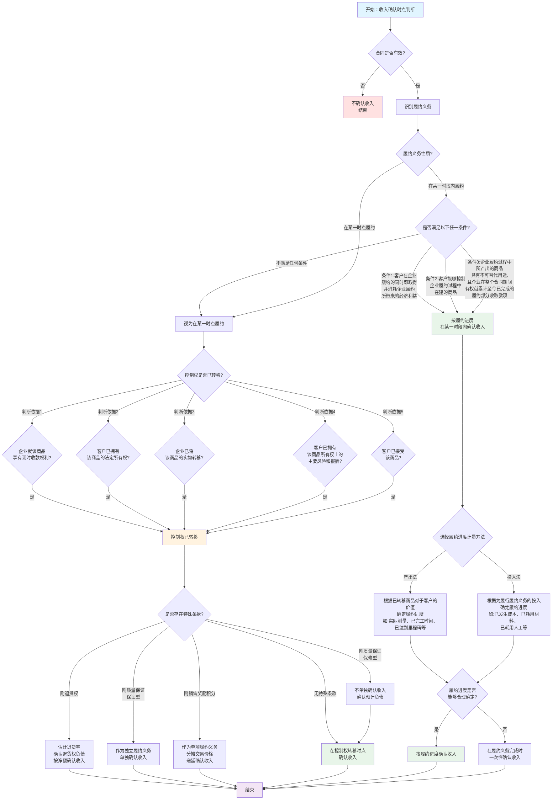

**流程图关键判断点说明**：

| 判断点 | 关键问题 | 实务示例 |
|-------|---------|---------|
| **是否在某一时段内履约** | 客户是否在企业履约过程中持续受益？ | 建造合同、持续服务（保洁、安保） |
| **控制权是否转移** | 客户是否已能够主导商品的使用并获得几乎全部经济利益？ | 商品销售：客户签收；出口：报关离境 |
| **附退货权处理** | 退货率是否能够合理估计？ | 根据历史退货率估计，确认退货权负债 |
| **质量保证性质** | 是保证型还是保修型？ | 保证型=独立服务（延保）；保修型=产品质量承诺 |
| **履约进度计量** | 用产出法还是投入法？ | 产出法更可靠（如完工量）；投入法次之（如成本占比） |

**典型业务场景应用**：

| 业务类型 | 确认时点/方法 | 控制权转移标志 | 底稿索引 |
|---------|-------------|-------------|---------|
| **境内商品销售** | 某一时点 | 客户签收商品 | D4-14、D4-15 |
| **出口销售（FOB）** | 某一时点 | 商品报关离境 | D4-14、D4-15 |
| **建造合同** | 某一时段 | 按完工进度（投入法） | D4-18 |
| **技术服务** | 某一时段 | 按服务进度（产出法） | D4-18 |
| **软件许可（永久）** | 某一时点 | 授权许可时 | D4-18 |
| **软件SaaS** | 某一时段 | 订阅期间均匀确认 | D4-18 |
| **电商平台** | 视主代理判断 | 总额法/净额法 | D4-19 |

---

### 流程图2：函证全流程操作指南

> **适用场景**：执行应收账款和收入函证程序（D0系列底稿）

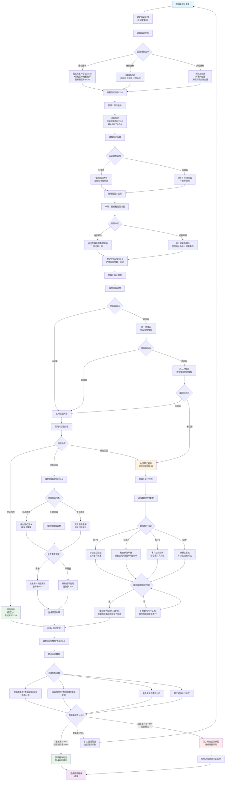

**函证关键控制点**：

| 控制点 | 控制要求 | 常见错误 | 应对措施 |
|-------|---------|---------|---------|
| **发函控制** | 审计师控制全程 | 管理层代发、拦截回函 | 审计师亲自发函和收函 |
| **回函地址** | 必须为事务所地址 | 写公司地址，被管理层拦截 | 预先打印事务所地址标签 |
| **回函真实性** | 核对回函方式和签章 | 伪造回函、电子回函无签章 | 电话验证回函真实性 |
| **差异处理** | 所有差异必须调查清楚 | 差异未调查即认定相符 | 编制详细的差异调节表 |
| **替代程序** | 必须充分、适当 | 仅检查期后回款，不够充分 | 多种替代程序结合使用 |

**函证底稿编制顺序**：

```
D0-2发函记录（第一个编制） 
  ↓
D0-3/D0-3-1函证（发函时编制）
  ↓
D0-4差异调节表（回函不符时编制）
  ↓
D0-5替代程序记录（未回函时编制）
  ↓
D0-1函证结果汇总（最后编制，汇总所有函证结果）
```

---

### 流程图3：截止性测试执行流程

> **适用场景**：检查收入和成本是否在正确的会计期间确认（D4-14、F5截止测试）

```mermaid
graph TD
    A[阶段1:测试准备] --> B[确定测试范围<br>参见决策树3]
    B --> C{截止性测试范围}
    
    C -->|常规风险| D[资产负债表日前后各5天]
    C -->|高风险| E[资产负债表日前后各10天<br>或更长]
    C -->|IPO项目| F[资产负债表日前后各2周<br>重点关注最后一天]
    
    D --> G[确定资产负债表日]
    E --> G
    F --> G
    
    G --> H[例如:2024年12月31日]
    H --> I[测试期间确定]
    I --> J[收入截止:2024年12月26日至2025年1月5日<br>成本截止:2024年12月26日至2025年1月5日]
    
    J --> K[阶段2:收入截止测试]
    K --> L[从账簿到单据的测试<br>检查记录准确性]
    
    L --> M[抽取12月26-31日确认的收入交易<br>样本量:10-20笔]
    M --> N[获取每笔交易的原始单据]
    N --> O{检查内容}
    
    O --> P[销售合同<br>确认交易真实性]
    O --> Q[发货单<br>记录发货日期]
    O --> R[物流单<br>记录物流时间]
    O --> S[客户签收单<br>确认签收日期⭐关键]
    O --> T[销售发票<br>核对金额]
    
    P --> U{关键判断}
    Q --> U
    R --> U
    S --> U
    T --> U
    
    U --> V{客户签收日期<br>是否在12月31日<br>之前?}
    
    V -->|是,且在12月| W[✓收入确认正确<br>应在12月确认]
    V -->|否,签收在1月| X[✗收入确认错误<br>应在1月确认<br>属于跨期确认]
    V -->|无签收单| Y[⚠️证据不充分<br>需进一步调查]
    
    X --> Z[记录跨期调整<br>编制调整分录]
    Y --> AA[补充证据:<br>物流签收记录/客户邮件确认]
    
    Z --> AB[调整分录示例:<br>借:2025年主营业务收入<br>贷:2024年主营业务收入]
    
    W --> AC[标记检查结果✓]
    AB --> AC
    AA --> AC
    
    AC --> AD[从单据到账簿的测试<br>检查记录完整性]
    
    AD --> AE[抽取1月1-5日的发货单<br>样本量:10-20笔]
    AE --> AF[检查这些发货是否已确认收入]
    AF --> AG{核对内容}
    
    AG --> AH[查看客户签收日期]
    AG --> AI[在账簿中查找该笔收入]
    
    AH --> AJ{签收日期判断}
    AJ -->|签收在12月31日前| AK{是否已在12月确认收入?}
    AJ -->|签收在1月1日后| AL{是否在1月确认收入?}
    
    AK -->|是| AM[✓记录完整<br>未跨期]
    AK -->|否| AN[✗遗漏收入<br>应补确认12月收入]
    AL -->|是| AM
    AL -->|否| AO[✗提前确认<br>应推迟至1月确认]
    
    AN --> AP[编制跨期调整分录]
    AO --> AP
    
    AP --> AQ[调整分录示例:<br>借:2024年主营业务收入<br>贷:2025年主营业务收入]
    
    AM --> AR[标记检查结果✓]
    AQ --> AR
    
    AR --> AS[阶段3:成本截止测试]
    AS --> AT[从账簿到单据测试]
    AT --> AU[抽取12月26-31日确认的成本<br>样本量:10-20笔]
    
    AU --> AV[获取成本结转凭证]
    AV --> AW[核对对应的收入确认日期]
    AW --> AX{收入与成本配比检查}
    
    AX --> AY{成本结转日期<br>是否与收入确认日期<br>一致?}
    
    AY -->|是| AZ[✓收入成本配比正确]
    AY -->|否| BA[✗配比错误<br>收入成本跨期不一致]
    
    BA --> BB[识别错误类型]
    BB --> BC{常见错误}
    
    BC -->|收入已确认<br>成本未结转| BD[成本少计<br>利润虚高]
    BC -->|成本已结转<br>收入未确认| BE[成本多计<br>利润虚低]
    BC -->|收入成本<br>跨期不一致| BF[两者均需调整]
    
    BD --> BG[调整分录:<br>借:营业成本<br>贷:库存商品]
    BE --> BH[调整分录:<br>借:库存商品<br>贷:营业成本]
    BF --> BI[分别编制调整分录]
    
    BG --> BJ[标记检查结果]
    BH --> BJ
    BI --> BJ
    AZ --> BJ
    
    BJ --> BK[从单据到账簿测试]
    BK --> BL[抽取1月1-5日的出库单<br>核对成本是否已结转]
    BL --> BM[检查逻辑同收入截止]
    
    BM --> BN[阶段4:汇总与结论]
    BN --> BO[编制截止性测试汇总表D4-14]
    BO --> BP[统计测试结果]
    BP --> BQ{关键指标}
    
    BQ --> BR[测试样本数量]
    BQ --> BS[发现错误数量]
    BQ --> BT[错误金额及性质]
    BQ --> BU[调整分录汇总]
    
    BR --> BV{截止性测试评估}
    BS --> BV
    BT --> BV
    BU --> BV
    
    BV -->|错误率<5%<br>错误金额不重大| BW[截止性测试通过<br>收入成本确认合规]
    BV -->|错误率5%-10%<br>或金额较大| BX[截止性风险中等<br>扩大测试范围]
    BV -->|错误率>10%<br>或金额重大| BY[截止性风险高<br>可能存在系统性错误]
    
    BX --> BZ[扩大样本量至30-50笔<br>重新测试]
    BY --> CA[深入调查<br>评估内部控制缺陷<br>考虑对审计意见的影响]
    
    BZ --> BV
    
    BW --> CB[编制审计结论<br>完成截止性测试]
    CA --> CB
    CB --> CC[结束]
    
    style A fill:#e1f5ff
    style CC fill:#f3e5f5
    style W fill:#e8f5e9
    style AM fill:#e8f5e9
    style AZ fill:#e8f5e9
    style BW fill:#e8f5e9
    style X fill:#ffebee
    style AN fill:#ffebee
    style BA fill:#ffebee
    style BY fill:#ffebee
```

**截止性测试关键要点**：

| 测试方向 | 测试目的 | 抽样来源 | 检查重点 |
|---------|---------|---------|---------|
| **从账簿到单据** | 检查记录准确性<br>（防止提前确认） | 账簿中资产负债表日前后记录 | 单据日期是否支持账面记录 |
| **从单据到账簿** | 检查记录完整性<br>（防止遗漏确认） | 仓库发货单等原始单据 | 单据是否已在账簿中记录 |

**收入确认时点判断标准**：

| 销售方式 | 确认时点 | 关键证据 |
|---------|---------|---------|
| **境内销售（普通商品）** | 客户签收 | 签收单⭐ |
| **境内销售（安装调试）** | 安装调试完成 | 验收报告⭐ |
| **出口销售（FOB）** | 报关离境 | 报关单⭐ |
| **出口销售（CIF）** | 客户签收 | 提单+签收单 |
| **委托代销** | 收到代销清单 | 代销清单⭐ |
| **分期收款销售** | 合同约定日期 | 销售合同 |

**常见跨期错误**：

| 错误类型 | 具体表现 | 对财务报表的影响 | 审计调整 |
|---------|---------|----------------|---------|
| **提前确认收入** | 12月发货，1月签收，<br>但在12月确认收入 | 虚增当期收入和利润 | 冲减当期收入，<br>下期补确认 |
| **延迟确认收入** | 12月签收，<br>但推迟至1月确认 | 少计当期收入和利润 | 补确认当期收入 |
| **成本未同步结转** | 12月确认收入，<br>但成本未结转 | 虚增当期利润 | 补计当期成本 |
| **成本提前结转** | 1月确认收入，<br>但12月已结转成本 | 虚减当期利润 | 调整成本确认期间 |

**截止性测试底稿编制**：

```
D4-14 收入截止性测试表
├─ 表1: 从账簿到单据测试明细（资产负债表日前记录）
├─ 表2: 从单据到账簿测试明细（资产负债表日后单据）
├─ 表3: 跨期调整汇总表
└─ 表4: 审计结论

F5 成本截止性测试表（结构类似）
├─ 表1: 成本结转与收入确认配比检查
├─ 表2: 跨期成本调整
└─ 表3: 审计结论
```

**IPO项目特别关注**：

⚠️ **IPO项目截止性测试要求更严格**：
1. 测试期间扩大至资产负债表日前后各2周
2. 资产负债表日当天的交易必须100%检查
3. 重点关注12月28-31日的大额交易
4. 期后退货情况必须检查
5. 任何跨期调整必须有充分证据支持

---

## 7.2 审计流程概览

> **📋 本节核心要点**
>
> - ✅ 销售循环审计分3个阶段：风险评估、控制测试（可选）、实质性测试
> - ✅ 核心必做程序：函证、截止性测试、收入真实性检查
> - ✅ 关键时间节点：函证时点、截止性测试日期、期后检查期间
>
> **快速定位：** 
> - 不知道从哪里开始？→ 看【7.2.2 底稿执行顺序】
> - 不知道什么时候做什么？→ 看【7.2.3 关键时间节点】

---

### 7.2.1 销售循环审计流程图

```
【风险评估阶段】
    ↓
B23-1：了解销售循环整体控制
    ↓
B23-1-2：绘制销售业务流程图
    ↓
B23-1-3：编制控制矩阵（识别关键控制）
    ↓
B23-1-4：执行穿行测试（验证控制设计）
    ↓
B23-1-6：控制评价
    ↓
决策：是否执行控制测试？
    ↓
【控制测试阶段】（可选，但实质性测试不能大幅减少）
    ↓
C2：销售循环控制测试汇总表
    ↓
C2-1：控制测试过程记录表
    ↓
评价控制偏差
    ↓
【实质性测试阶段】⭐（核心阶段）
    ↓
D0系列：函证程序（应收账款、收入）
    ↓
D4A/D2A/D1A：编制审计程序表
    ↓
D4-1/D2-1/D1：编制审定表
    ↓
D4-2/D2-2/D1-2：编制明细表
    ↓
D4-5至D4-10：分析程序（毛利率、趋势、客户结构）
    ↓
D4-14：收入截止性测试 ⭐
    ↓
D4-15：收入真实性检查 ⭐
    ↓
D4-16：收入完整性检查
    ↓
D2-10：应收账款坏账准备测算
    ↓
D4-22至D4-28：舞弊风险应对程序
    ↓
D4-29至D4-32：IPO专项核查（如适用）
    ↓
【结论形成】
    ↓
汇总调整分录、评价披露、形成结论
```

---

### 7.2.2 销售循环审计工作底稿执行顺序

#### 7.2.2.1 标准执行顺序（按阶段）

| 执行顺序 | 底稿编号 | 底稿名称 | 执行时点 | 是否必做 | 预计时间 |
|---------|---------|---------|---------|---------|---------|
| **第一阶段：风险评估** |
| 1 | B23-1 | 销售循环业务层面控制总体程序表 | 风险评估阶段 | ✅ 必做 | 0.5天 |
| 2 | B23-1-1 | 销售循环整体控制汇总 | 风险评估阶段 | ✅ 必做 | 0.5天 |
| 3 | B23-1-2 | 销售循环流程图及描述 | 风险评估阶段 | ✅ 必做 | 1天 |
| 4 | B23-1-3 | 销售循环控制矩阵 | 风险评估阶段 | ✅ 必做 | 1天 |
| 5 | B23-1-4 | 销售循环穿行测试 | 风险评估阶段 | ✅ 必做 | 1天 |
| 6 | B23-1-6 | 销售循环控制评价 | 风险评估阶段 | ✅ 必做 | 0.5天 |
| **第二阶段：控制测试**（可选） |
| 7 | C2 | 销售循环控制测试汇总表 | 控制测试阶段 | 视策略而定 | 1天 |
| 8 | C2-1 | 销售循环控制测试过程记录表 | 控制测试阶段 | 视策略而定 | 2天 |
| **第三阶段：实质性测试**（核心阶段） |
| **3.1 函证程序**（必做）⭐ |
| 9 | D0A | 函证程序表 | 实质性测试开始 | ✅ 必做 | 0.5天 |
| 10 | D0-1 | 函证结果汇总表 | 寄出函证后 | ✅ 必做 | 持续更新 |
| 11 | D0-3 | 跟函函证过程控制 | 寄出函证后 | ✅ 必做 | 持续更新 |
| 12 | D0-4 | 函证差异调节表 | 收到回函后 | ✅ 必做 | 1-2天 |
| 13 | D0-5/D0-6 | 替代程序表 | 未回函时 | ✅ 必做 | 1-2天 |
| **3.2 应收票据审计** |
| 14 | D1A | 应收票据审计程序表 | 实质性测试阶段 | ✅ 必做 | 0.5天 |
| 15 | D1 | 应收票据审定表 | 实质性测试阶段 | ✅ 必做 | 0.5天 |
| 16 | D1-2/D1-3 | 应收票据明细表 | 实质性测试阶段 | ✅ 必做 | 1天 |
| 17 | D1-9 | 应收票据监盘表 | 资产负债表日 | ✅ 必做 | 0.5天 |
| **3.3 应收账款审计** |
| 18 | D2A | 应收账款实质性程序表 | 实质性测试阶段 | ✅ 必做 | 0.5天 |
| 19 | D2-1 | 应收账款审定表 | 实质性测试阶段 | ✅ 必做 | 1天 |
| 20 | D2-2 | 应收账款明细表 | 实质性测试阶段 | ✅ 必做 | 1天 |
| 21 | D2-5 | 应收账款分析表 | 实质性测试阶段 | ✅ 必做 | 1天 |
| 22 | D2-9 | 坏账准备政策检查表 | 实质性测试阶段 | ✅ 必做 | 0.5天 |
| 23 | D2-10 | 应收账款坏账准备测算表 | 实质性测试阶段 | ✅ 必做 | 1-2天 |
| **3.4 营业收入审计**（核心重点）⭐ |
| 24 | D4A | 营业收入审计程序表 | 实质性测试阶段 | ✅ 必做 | 0.5天 |
| 25 | D4-1 | 营业收入审定表 | 实质性测试阶段 | ✅ 必做 | 1天 |
| 26 | D4-2/D4-3 | 收入明细表 | 实质性测试阶段 | ✅ 必做 | 1天 |
| 27 | D4-5 | 重要指标分析 | 实质性测试阶段 | ✅ 必做 | 0.5天 |
| 28 | D4-6 | 毛利率分析表 | 实质性测试阶段 | ✅ 必做 | 1天 |
| 29 | D4-8 | 重要客户结构分析 | 实质性测试阶段 | ✅ 必做 | 1天 |
| 30 | D4-13 | 销售合同检查表 | 实质性测试阶段 | ✅ 必做 | 1-2天 |
| 31 | D4-14 | 收入截止测试 | 实质性测试阶段 | ✅ 必做 | 1-2天 |
| 32 | D4-15 | 收入真实性检查 | 实质性测试阶段 | ✅ 必做 | 2-3天 |
| 33 | D4-16 | 收入完整性检查 | 实质性测试阶段 | ✅ 必做 | 1天 |
| **3.5 舞弊风险应对**（高风险必做） |
| 34 | D4-22 | 收入舞弊风险评估 | 实质性测试阶段 | ✅ 必做 | 1天 |
| 35 | D4-23 | 虚假销售检查 | 实质性测试阶段 | ✅ 必做 | 2天 |
| 36 | D4-24 | 期末突击销售检查 | 实质性测试阶段 | ✅ 必做 | 1天 |
| 37 | D4-25 | 渠道压货检查 | 实质性测试阶段 | 根据风险 | 1天 |

#### 7.2.2.2 快速执行路径（紧急项目）

如果时间紧张，优先执行以下核心底稿：

**最小必做清单**（7-10天完成）：
```
1. B23-1-4 穿行测试 → 2. D0系列 函证 → 3. D4-1/D2-1 审定表 
→ 4. D4-6 毛利率分析 → 5. D4-14 截止性测试 → 6. D4-15 真实性检查
→ 7. D2-10 坏账测算 → 8. D4-23 虚假销售检查
```

---

### 7.2.3 销售循环审计关键时间节点

| 时间节点 | 工作内容 | 注意事项 | 对应底稿 |
|---------|---------|---------|---------|
| **期中审计** | 穿行测试、控制测试 | 尽早完成，了解业务流程和控制 | B23-1、C2 |
| **函证截止日** | 确定函证截止日期 | 通常为资产负债表日 | D0系列 |
| **函证寄出日** | 寄出函证 | ⚠️ 必须由审计人员亲自寄出 | D0-3 |
| **资产负债表日** | 应收票据监盘 | 如有实物票据，需当天盘点 | D1-9 |
| **截止测试日** | 执行收入截止测试 | 前后各5-10天交易 | D4-14 |
| **审计外勤期间** | 催函、差异调节 | 持续跟进函证回复情况 | D0-1、D0-4 |
| **审计外勤结束前** | 替代程序 | 对未回函执行替代程序 | D0-5、D0-6 |
| **期后事项期间** | 期后回款检查 | 检查应收账款期后回款情况 | D2-5 |
| | 期后退货检查 | 关注期末突击销售的退货 | D4-24 |
| **审计报告日前** | 汇总调整、复核 | 确保所有底稿完成并复核 | 全部 |

#### 7.2.3.1 函证时间管理 ⭐

**函证时间轴（关键控制点）：**

```
Day 0（资产负债表日）
  ↓ 准备函证（1-2天）
Day 2：寄出函证（审计人员亲自寄出）
  ↓ 等待回函（通常需要2-4周）
Day 16：第一次催函（电话催函）
  ↓
Day 23：第二次催函（邮件催函）
  ↓
Day 30：启动替代程序（对未回函客户）
  ↓
外勤结束前：完成所有函证或替代程序
```

**⚠️ 函证常见时间陷阱：**
- ❌ 错误：函证由被审计单位寄出 → ✅ 正确：必须由审计人员亲自寄出
- ❌ 错误：只寄一次，不催函 → ✅ 正确：至少催函2次
- ❌ 错误：临近报告日才启动替代程序 → ✅ 正确：30天未回即启动替代程序

---

### 7.2.4 销售循环审计工作底稿调用路径

#### 7.2.4.1 应收账款审计路径（标准流程）

```
起点：D2A应收账款实质性程序表
  ↓
D0-1：函证结果汇总表（核对函证情况）
  ↓
D2-1：应收账款审定表（汇总调整后余额）
  ↓
D2-2：应收账款明细表（详细分析）
  ↓
D2-5：应收账款分析表（账龄、期后回款）
  ↓
D2-9：坏账准备政策检查表（评价政策）
  ↓
D2-10：应收账款坏账准备测算表（重新计算）
  ↓
D2-4：应收账款调整分录汇总（汇总调整）
  ↓
终点：形成审计结论
```

**关联底稿：**
- D0函证系列（外部证据）
- D4收入系列（应收来源）
- D2-6关联方检查（关联方应收）

---

#### 7.2.4.2 营业收入审计路径（完整版）

```
起点：D4A营业收入审计程序表
  ↓
D0系列：函证程序（应收账款、收入）
  ↓
D4-1：营业收入审定表（汇总数据）
  ↓
D4-2/D4-3：收入明细表（主营/其他业务）
  ↓
【分析程序分支】
D4-5：重要指标分析（收入增长率、毛利率等）
D4-6：毛利率分析表（同比、环比、异常）
D4-7：重要产品毛利分析
D4-8：重要客户结构分析
D4-9：重要客户销售价格分析
  ↓
【检查程序分支】
D4-12：收入确认会计政策检查
D4-13：销售合同检查表（抽样检查）
D4-14：收入截止测试 ⭐（前后5-10天）
D4-15：收入真实性检查 ⭐（三单核对）
D4-16：收入完整性检查（成本倒轧）
  ↓
【舞弊应对分支】⭐
D4-22：收入舞弊风险评估
D4-23：虚假销售检查（核心程序）
D4-24：期末突击销售检查
D4-25：渠道压货检查
D4-26：跨期收入检查
  ↓
【新准则应用分支】（如适用）
D4-17：收入五步法应用检查
D4-18：主要责任人/代理人判断
D4-19：可变对价估计检查
D4-20：重大融资成分检查
  ↓
D4-4：营业收入调整分录汇总
  ↓
终点：形成审计结论
```

**关联底稿：**
- D2应收账款系列（收入对应应收）
- F存货/成本系列（成本配比）
- D8应交税费（增值税销项）

---

#### 7.2.4.3 舞弊应对路径（高风险专用）

```
起点：发现舞弊迹象（如毛利率异常、应收账款函证差异大）
  ↓
D4-22：收入舞弊风险评估（识别具体风险）
  ↓
根据风险类型选择应对程序：
  ├─ 虚假销售风险 → D4-23虚假销售检查
  │   └─ 检查客户真实性、交易背景、资金流、物流
  ├─ 期末突击销售 → D4-24期末突击销售检查
  │   └─ 检查12月异常增长、期后退货
  ├─ 渠道压货 → D4-25渠道压货检查
  │   └─ 检查经销商库存、退货政策
  ├─ 跨期收入 → D4-26跨期收入检查
  │   └─ 截止性测试、发货时点核对
  └─ 关联方利益输送 → D4-28关联方利益输送检查
      └─ 检查定价公允性、商业实质
  ↓
如发现重大舞弊迹象：
  ├─ 扩大样本量
  ├─ 实地走访客户
  ├─ 检查银行流水
  └─ 向项目合伙人汇报
  ↓
终点：形成舞弊风险应对结论
```

---

#### 7.2.4.4 IPO项目专项路径（IPO/重组适用）

```
在标准审计路径基础上，额外执行：
  ↓
D4-29：IPO收入真实性核查（更严格的标准）
  ├─ 100%函证覆盖（包括零余额客户）
  ├─ 实地走访主要客户（30-50%）
  ├─ 第三方数据验证（海关、行业协会）
  └─ 检查银行流水、物流记录
  ↓
D4-30：IPO收入完整性核查
  ├─ 成本倒轧收入
  ├─ 产能核查
  └─ 未开票收入检查
  ↓
D4-31：IPO收入准确性核查
  ├─ 重新计算收入（100%覆盖）
  ├─ 合同条款逐一核对
  └─ 开票、收款、发货三单齐全
  ↓
D4-32：IPO收入截止性核查
  ├─ 前后15-30天截止测试
  ├─ 月度收入波动分析
  └─ 跨期收入专项检查
  ↓
终点：形成IPO专项审计结论
```

---

### 💡 底稿执行技巧

**新手常见问题：**

**Q1: 底稿太多，不知道从哪里开始？**
A: 按照【7.2.2.1 标准执行顺序】表格，从上往下执行即可。

**Q2: 时间不够，哪些底稿可以省略？**
A: 标记"✅必做"的底稿不能省略。可以简化：
- 合并D4-7、D4-9、D4-10为一个产品/客户综合分析
- 如不适用，可省略D4-17至D4-21新准则系列
- 低风险情况下，可简化D4-25渠道压货检查

**Q3: 底稿之间的数据如何保持一致？**
A: 遵循以下勾稽关系：
- D4-1（收入审定表）= D4-2+D4-3（明细表汇总）
- D2-1（应收审定表）期末余额 = D0-1（函证汇总）+ 未函证部分
- D4-6（毛利率）=（收入-成本）/收入，需与D4-1、成本底稿核对

**Q4: 如何知道底稿填写是否完整？**
A: 每个底稿都有检查清单，见各节末尾"底稿完整性检查"。

---

### ⚠️ 关键提醒

**销售循环审计流程的5个"必须记住"：**

1. **函证必须亲自寄出** 🔴
   - 不能由被审计单位代寄
   - 不能只寄给有余额的客户

2. **截止性测试必须执行** 🔴
   - 收入截止测试（D4-14）
   - 成本截止测试
   - 前后各5-10天

3. **毛利率异常必须调查** ⚠️
   - 毛利率波动>5%必须调查
   - 不能只接受管理层解释

4. **舞弊应对程序必须做** 🔴
   - 至少执行D4-22、D4-23
   - 高风险客户必须深入检查

5. **底稿之间数据必须一致** ✅
   - 审定表、明细表、分析表数据勾稽
   - 收入与应收、成本、税费勾稽


---

## 7.3 风险识别与应对

> **📋 本节核心要点**
>
> - ✅ 销售循环有6大特别风险类别：收入舞弊、应收坏账、截止性、关联方、新准则、IPO特殊要求
> - ✅ 每个风险都有明确的应对程序和对应底稿
> - ✅ 行业特定风险需要特别关注
>
> **关键提示：** 收入确认推定为舞弊风险，必须保持职业怀疑态度

---

### 7.3.1 销售循环特别风险清单

#### 7.3.1.1 收入确认舞弊风险 🔴（最高风险）

| 风险类型 | 风险描述 | 应对措施 | 对应底稿 |
|---------|---------|---------|---------|
| **虚假销售** | 虚构客户、虚构交易、伪造单据 | 100%函证、实地走访、检查物流、银行流水 | D4-23、D0系列 |
| **提前确认收入** | 未达到收入确认条件即确认收入 | 截止性测试、合同条款检查、发货单核对 | D4-14、D4-13 |
| **期末突击销售** | 12月销售异常增长、次年大量退货 | 月度趋势分析、期后退货检查 | D4-24、D4-6 |
| **渠道压货** | 强制经销商进货、高退货率 | 经销商库存核查、退货政策检查 | D4-25 |
| **跨期收入** | 将下期收入提前至本期确认 | 截止性测试（前后15-30天） | D4-14、D4-26 |
| **关联方利益输送** | 通过关联方虚增收入、定价不公允 | 关联方识别、定价公允性分析 | D4-28、D4-11 |

**准则依据：** 
- 《中国注册会计师审计准则第1141号——财务报表审计中与舞弊相关的责任》
- 将收入确认推定为舞弊风险

---

#### 7.3.1.2 应收账款风险 🔴

| 风险类型 | 风险描述 | 应对措施 | 对应底稿 |
|---------|---------|---------|---------|
| **坏账损失** | 客户无力偿还、长期拖欠 | 账龄分析、期后回款检查、坏账准备测算 | D2-5、D2-10 |
| **应收虚增** | 虚构应收账款、隐瞒坏账 | 函证、细节检查、期后回款 | D0系列、D2-5 |
| **关联方占用** | 关联方长期占用资金、无偿使用 | 关联方识别、资金占用检查 | D2-6、D4-11 |
| **质押未披露** | 应收质押、保理、出售未披露 | 函证时询问质押情况、合同检查 | D0系列、D2-12 |
| **应收集中度高** | 前5大客户占比>50% | 客户结构分析、单一客户依赖风险评估 | D2-5、D4-8 |

---

#### 7.3.1.3 收入截止性风险 🔴

| 风险类型 | 风险描述 | 应对措施 | 对应底稿 |
|---------|---------|---------|---------|
| **跨期确认收入** | 12月提前确认、1月推迟确认 | 前后各5-10天截止测试 | D4-14 |
| **跨期成本结转** | 收入与成本不配比 | 成本截止测试、配比检查 | D4-14、F系列 |
| **发货与开票不一致** | 已开票未发货、已发货未开票 | 核对发货单、发票、签收单 | D4-15 |
| **收入确认时点错误** | 未按合同约定时点确认 | 合同条款检查、收入政策检查 | D4-12、D4-13 |

---

#### 7.3.1.4 关联方交易风险 🟡

| 风险类型 | 风险描述 | 应对措施 | 对应底稿 |
|---------|---------|---------|---------|
| **关联方未识别** | 存在未披露的关联方 | 关联方全面识别、高管访谈 | D2-6、D4-11 |
| **定价不公允** | 关联方交易价格不公允 | 价格比较分析、市场价核对 | D4-9、D4-11 |
| **无商业实质** | 关联方交易无真实业务背景 | 检查合同、物流、资金流 | D4-11、D4-28 |
| **披露不充分** | 关联方交易未充分披露 | 附注披露检查 | 附注检查 |

---

#### 7.3.1.5 新收入准则应用风险 🟡

| 风险类型 | 风险描述 | 应对措施 | 对应底稿 |
|---------|---------|---------|---------|
| **五步法应用错误** | 未正确识别履约义务、交易价格 | 收入五步法应用检查 | D4-17 |
| **主代理判断错误** | 总额法、净额法判断错误 | 主要责任人/代理人判断 | D4-18 |
| **可变对价估计不当** | 销售折扣、返利估计不合理 | 可变对价估计检查 | D4-19 |
| **融资成分未识别** | 长期赊销未分拆融资成分 | 重大融资成分检查 | D4-20 |
| **合同资产/负债分类错误** | 科目分类不符合准则 | 科目分类检查 | D4-12 |

---

#### 7.3.1.6 其他重点风险

| 风险类型 | 风险描述 | 应对措施 | 对应底稿 |
|---------|---------|---------|---------|
| **毛利率异常** | 毛利率大幅波动、与同行差异大 | 毛利率分析、异常调查 | D4-6、D4-7 |
| **客户集中度过高** | 对单一客户依赖过重 | 客户结构分析、风险评估 | D4-8 |
| **税务处理错误** | 增值税计算错误、税率错用 | 税费测算、申报表核对 | D8系列 |
| **应收票据背书风险** | 已背书票据未终止确认 | 票据背书检查、终止确认判断 | D1-6、D1-11 |

---

### 7.3.2 行业特定风险

#### 7.3.2.1 制造业

**特定风险：**
- 产品质保金、质量索赔条款影响收入确认时点
- 售后维保服务未单独确认
- 退货条款复杂

**应对措施：**
- 重点检查销售合同中的质保条款、退货条款
- 评估质保金是否应作为可变对价
- 检查售后服务是否应单独确认为履约义务
- 对应底稿：D4-13、D4-17、D4-27

---

#### 7.3.2.2 房地产企业

**特定风险：**
- 收入确认时点判断复杂（交房、竣工、备案）
- 预售款管理和结转
- 成本归集和配比

**应对措施：**
- 检查收入确认政策是否符合准则要求
- 核对竣工备案时点、交房时点
- 检查成本归集的准确性
- 对应底稿：D4-12、D4-13、D4-14

---

#### 7.3.2.3 软件和信息技术服务业

**特定风险：**
- 软件销售与服务分拆
- 按时段/时点确认收入判断
- 定制化开发收入确认
- 授权许可收入处理

**应对措施：**
- 评估履约义务识别是否准确
- 检查完工百分比法的应用
- 核查授权许可的性质（时点/时段）
- 对应底稿：D4-17、D4-18、D4-21

---

#### 7.3.2.4 电商和零售业

**特定风险：**
- 平台交易主代理判断
- 积分/优惠券可变对价估计
- 退货率估计
- 多渠道销售确认时点差异

**应对措施：**
- 主要责任人/代理人判断（总额法vs净额法）
- 可变对价估计的合理性测试
- 退货率历史数据分析
- 对应底稿：D4-18、D4-19、D4-27

---

#### 7.3.2.5 外贸企业

**特定风险：**
- 出口退税影响收入确认
- 贸易条款（FOB、CIF）影响确认时点
- 汇率波动影响收入金额
- 出口报关单据完整性

**应对措施：**
- 核对出口报关单、提单
- 检查贸易条款约定的风险转移时点
- 重新计算汇兑损益
- 对应底稿：D4-12、D4-13、D4-14

---

#### 7.3.2.6 医药和医疗器械

**特定风险：**
- 两票制影响销售模式
- 招投标、带量采购影响定价
- 经销商返利、佣金复杂
- 医保回款周期长

**应对措施：**
- 检查两票制合规性
- 核查返利、佣金计提的准确性
- 应收账款账龄分析（医保回款慢）
- 对应底稿：D4-19、D2-5、D2-10

---

### 7.3.3 审计策略选择（与框架对接）

**🔗 参考框架**：[第4.3节 审计策略决策矩阵](./审计实务操作手册-框架.md#43-审计策略决策矩阵-⭐)

**销售循环推荐策略：实质性方案** ⭐

| 策略要素 | 具体安排 | 框架对应内容 |
|---------|---------|-------------|
| **穿行测试** | 必须执行 | B23-1-4，了解和识别控制 |
| **控制测试** | 可执行，但不能大幅减少实质性测试 | C2系列，了解控制运行有效性 |
| **实质性测试** | 充分执行，不能减少 | D系列，认定层次充分测试 |

---

#### 7.3.3.1 策略选择理由

**1. 收入是推定的舞弊风险** 🔴
- 准则明确要求：将收入确认推定为舞弊风险
- 管理层有强烈动机操纵收入（业绩压力）
- 重大错报风险评估为"高"

**2. 内部控制的局限性** ⚠️
- 内部控制可能被管理层凌驾
- 即使控制有效，舞弊风险仍然存在
- 控制测试不能替代充分的实质性测试

**3. 审计准则的明确要求** ✅
- 函证是必须执行的程序
- 截止性测试是必须执行的程序
- 舞弊风险必须实施专门应对程序
- 需要获取充分、适当的审计证据

**4. 收入的复杂性** 📊
- 新收入准则应用复杂
- 合同条款多样化
- 收入确认时点判断需要专业判断

---

#### 7.3.3.2 与框架路径对照

| 框架路径 | 适用情况 | 销售循环是否适用 |
|---------|---------|----------------|
| 路径1（实质性方案） | 控制薄弱或不依赖控制 | ✅ **强烈推荐**（收入舞弊风险） |
| 路径2（控制测试为主） | 控制强且有效 | ❌ 不适用（准则推定舞弊风险） |
| 路径3（综合策略） | 控制测试+充分实质性测试 | ✅ 可选（但实质性测试不能减少） |
| 路径4（全面审计） | 特别高风险 | ✅ 推荐（IPO项目、舞弊迹象） |

**⚠️ 特别说明：**
即使选择路径3（综合策略），控制测试结果良好，也**不能大幅减少**实质性测试范围。

---

#### 7.3.3.3 策略执行要点

**✅ 必做程序**（无论控制测试结果如何）：

1. **函证程序** 🔴
   - 应收账款：100%或高比例覆盖
   - 零余额客户：本期有交易的必须函证
   - 合同负债：必须函证

2. **截止性测试** 🔴
   - 收入截止：前后各5-10天
   - 成本截止：与收入配比
   - 重点关注12月和1月

3. **收入真实性检查** 🔴
   - 抽样检查：销售合同、出库单、发票、签收单
   - 期后回款检查
   - 异常交易深入调查

4. **毛利率分析** 🔴
   - 同比分析、环比分析
   - 与同行业对比
   - 异常波动必须调查

5. **舞弊风险应对** 🔴
   - 虚假销售检查（D4-23）
   - 期末突击销售检查（D4-24）
   - 必须执行，不能省略

---

**✅ 控制测试的价值**（即使不能减少实质性测试）：

1. **了解控制设计**
   - 识别潜在风险点
   - 了解业务流程
   - 发现控制缺陷

2. **评价控制运行有效性**
   - 为风险评估提供依据
   - 为实质性测试的性质、时间、范围提供参考
   - 发现控制偏差，及时沟通管理层

3. **满足审计准则要求**
   - 了解内部控制是审计准则的要求
   - 穿行测试必须执行

---

**✅ 风险应对程序映射**

| 风险类别 | 应对程序 | 对应底稿 | 是否必做 |
|---------|---------|---------|---------|
| 收入舞弊 | 虚假销售检查、函证、实地走访 | D4-23、D0系列 | ✅ 必做 |
| 截止性风险 | 截止性测试 | D4-14 | ✅ 必做 |
| 坏账风险 | 账龄分析、坏账测算、期后回款 | D2-5、D2-10 | ✅ 必做 |
| 关联方风险 | 关联方识别、公允性分析 | D4-11、D2-6 | ✅ 必做 |
| 毛利率异常 | 毛利率分析、异常调查 | D4-6、D4-7 | ✅ 必做 |
| 新准则应用 | 五步法检查、主代理判断 | D4-17、D4-18 | 根据情况 |

---

### 7.3.4 销售循环特殊关注事项

#### 7.3.4.1 IPO项目特殊要求 🔴

**IPO项目收入审计要求更严格：**

1. **函证覆盖率**
   - 要求：100%函证（包括零余额客户）
   - 对应底稿：D0系列、D4-29

2. **实地走访**
   - 要求：主要客户（30-50%）必须实地走访
   - 核查客户真实性、交易背景

3. **第三方验证**
   - 海关数据核对（外贸企业）
   - 行业协会数据核对
   - 终端销售数据核对（经销商模式）

4. **收入核查范围**
   - 不仅核查期末，还要核查全年
   - 不仅核查收入，还要核查成本、毛利
   - 对应底稿：D4-29至D4-32

---

#### 7.3.4.2 集团审计特殊考虑

**集团层面销售循环风险：**

1. **关联方交易**
   - 集团内部销售定价
   - 关联方资金占用
   - 对应底稿：D4-11、D4-28

2. **收入抵消**
   - 集团内部交易抵消
   - 未实现利润抵消

3. **统一政策**
   - 收入确认政策是否统一
   - 坏账计提政策是否一致

---

#### 7.3.4.3 舞弊迹象识别 🔴

**以下迹象可能表明存在收入舞弊，需高度警惕：**

1. **财务指标异常**
   - 收入大幅增长，但应收账款增长更快
   - 毛利率异常高或异常波动
   - 现金流与利润严重背离
   - 应收账款周转率大幅下降

2. **业务异常**
   - 12月销售额占全年比重过高（>30%）
   - 期后大量退货
   - 大量陌生客户
   - 关联方交易突然增加

3. **管理层异常**
   - 管理层对业绩有不合理预期
   - 不配合审计、提供虚假资料
   - 频繁更换会计政策
   - 内部控制被凌驾的迹象

4. **文件单据异常**
   - 单据缺失或伪造
   - 签章不规范
   - 合同条款异常
   - 发货、开票、签收时间不合理

**发现舞弊迹象时的应对：**
1. 立即向项目合伙人汇报
2. 扩大审计程序范围和样本量
3. 执行额外的舞弊应对程序
4. 考虑聘请专家或调查人员
5. 评估对审计报告的影响

---

### 💡 风险识别实用技巧

**如何快速识别高风险客户？**

**高风险客户特征清单：**
```
□ 本期的大客户（占收入>5%）
□ 关联方或疑似关联方
□ 账龄超过1年的应收账款
□ 期后未回款或回款<30%
□ 函证不回函或差异大
□ 销售价格明显偏离市场价
□ 客户工商信息异常（注册资本小、成立时间短）
□ 客户地址、联系方式无法核实
□ 交易无合理商业背景
```

**对高风险客户的应对：**
- 必须函证，且必须执行替代程序
- 必须检查销售合同、出库单、签收单
- 必须检查期后回款
- 必须实地走访或视频访谈
- 必须检查银行流水、物流记录

---

### ⚠️ 常见错误提醒

**风险识别与应对的5个常见错误：**

❌ **错误1：过度依赖控制测试**
✅ 正确：收入是舞弊推定风险，必须充分执行实质性测试

❌ **错误2：只关注大客户，忽视小客户**
✅ 正确：小客户、新客户、关联方也可能是虚假交易

❌ **错误3：毛利率异常不调查**
✅ 正确：毛利率波动>5%必须深入调查原因

❌ **错误4：只检查期末交易，不检查全年**
✅ 正确：舞弊可能发生在任何时点，需全年关注

❌ **错误5：发现舞弊迹象不报告**
✅ 正确：必须立即向项目合伙人汇报，评估影响

---

### 7.3.5 项目类型决策矩阵（⭐实战指引）

> **💡 使用说明**: 根据项目类型特征，快速确定审计策略、重点程序和时间分配。

---

#### 7.3.5.1 项目类型决策矩阵总览

| 企业特征 | 审计策略 | 重点程序 | 时间分配建议 | 函证覆盖率 | 舞弊风险关注度 |
|---------|---------|---------|------------|-----------|-------------|
| **首次IPO项目** | 实质性方案+扩大程序 | 客户走访、穿透核查、三流合一 | 函证40%、实质性50%、其他10% | ≥80% | ⭐⭐⭐⭐⭐ |
| **上市公司年审** | 实质性方案 | 函证、截止性、舞弊风险 | 函证30%、实质性60%、其他10% | ≥70% | ⭐⭐⭐⭐ |
| **新三板挂牌** | 综合性方案 | 控制测试+实质性 | 控制20%、实质性70%、其他10% | ≥65% | ⭐⭐⭐ |
| **拟挂牌尽调** | 实质性方案 | 合规性检查、舞弊识别 | 函证35%、实质性55%、其他10% | ≥70% | ⭐⭐⭐⭐ |
| **小规模企业（年审）** | 实质性方案（简化） | 函证、分析程序 | 函证40%、分析40%、其他20% | ≥60% | ⭐⭐⭐ |
| **首次承接客户** | 实质性方案+扩大程序 | 期初余额审计、函证 | 函证35%、实质性55%、其他10% | ≥75% | ⭐⭐⭐⭐ |
| **高科技企业** | 实质性方案 | 新准则应用、履约义务识别 | 函证30%、准则检查30%、实质性30%、其他10% | ≥70% | ⭐⭐⭐ |
| **跨境电商** | 实质性方案 | 函证、汇率检查、海关数据 | 函证35%、实质性50%、其他15% | ≥75% | ⭐⭐⭐⭐ |

---

#### 7.3.5.2 IPO项目专项决策矩阵

**IPO项目特殊要求**：

| 审计程序 | 常规年审 | IPO项目 | 差异说明 |
|---------|---------|---------|---------|
| **函证覆盖率** | ≥70% | ≥80% | IPO要求更高覆盖率 |
| **客户走访** | 选择性执行 | 前五大+新增大客户必须走访 | 验证客户真实性和交易背景 |
| **期后回款检查期间** | 3个月 | 6个月以上 | 更长期间验证可收回性 |
| **截止性测试范围** | 前后各5天 | 前后各10-15天，重点最后一天 | 防止跨期确认收入 |
| **关联方核查** | 申报关联方 | 穿透核查（董监高、实控人） | 识别隐匿关联方 |
| **收入真实性检查** | 抽样检查 | 大额+新增客户100%检查 | 合同、发货、签收、回款四单齐全 |
| **三流一致性** | 一般性检查 | 必须执行三流合一检查 | 合同流、资金流、物流一致 |
| **舞弊风险程序** | 常规程序 | 扩大舞弊风险应对程序 | 不预先通知的盘点、检查 |

**IPO项目时间安排建议**：

```
IPO项目销售循环审计时间表（以IPO申报前3个月为例）

第1周：
├─ 了解业务模式、识别风险
├─ 编制审计计划
├─ 准备函证清单（前五大+新增大客户+关联方）
└─ 函证发出

第2-3周：
├─ 收入截止性测试（扩大范围：前后各15天）
├─ 收入真实性检查（大额交易100%）
├─ 客户走访准备（联系客户、预约时间）
└─ 催函

第4-5周：
├─ 现场客户走访（前五大+新增大客户）
├─ 收集走访证据（营业执照、仓库照片、访谈记录）
├─ 三流一致性检查
└─ 继续催函、执行替代程序

第6-7周：
├─ 毛利率深度分析（分产品、分客户）
├─ 期后回款检查（6个月）
├─ 关联方穿透核查（工商查询、银行流水）
├─ 舞弊风险专项程序
└─ 函证差异调节

第8周：
├─ 编制审计底稿
├─ 质量复核
├─ 与管理层沟通发现的问题
└─ 完成审计报告
```

---

#### 7.3.5.3 不同规模企业决策矩阵

**按收入规模分类的审计策略**：

| 收入规模 | 企业特征 | 审计策略 | 函证样本量 | 截止测试范围 | 客户走访 | 预计工时 |
|---------|---------|---------|-----------|------------|---------|---------|
| **<5000万** | 小规模企业 | 实质性方案（简化） | 前三大+抽样15笔 | 前后各5天 | 电话/视频 | 80-120小时 |
| **5000万-5亿** | 中型企业 | 实质性方案 | 前五大+抽样30笔 | 前后各7天 | 前三大现场 | 150-250小时 |
| **5亿-50亿** | 大型企业 | 综合性方案 | 前十大+抽样50笔 | 前后各10天 | 前五大现场 | 300-500小时 |
| **>50亿** | 超大型企业 | 综合性方案+信息系统审计 | 前二十大+抽样80笔 | 前后各15天 | 前十大现场 | 500-800小时 |

---

#### 7.3.5.4 行业特定决策矩阵

**不同行业的审计策略差异**：

| 行业 | 收入确认特点 | 审计重点 | 特殊程序 | 常见风险 |
|------|-----------|---------|---------|---------|
| **制造业** | 客户签收/报关离境 | 截止性、成本配比 | 成本倒轧、存货监盘 | 期末突击销售、虚增收入 |
| **软件/SaaS** | 多元素、订阅模式 | 履约义务识别、递延收入 | 新准则应用检查 | 收入确认时点错误 |
| **房地产** | 按进度或交付时点 | 完工进度、预售资金监管 | 工程进度核查、预售证检查 | 提前确认收入 |
| **建筑施工** | 按履约进度确认 | 完工百分比法、合同预算 | 工程量核查、成本真实性 | 虚增完工进度 |
| **跨境电商** | 出口退税、境外收款 | 海关数据核对、汇率 | 海关报关单、外汇流水 | 虚假出口、关联方交易 |
| **医药医疗** | 医保结算、带量采购 | 医保回款、价格管制 | 医保结算单、集采合同 | 控销费用、商业贿赂 |
| **零售连锁** | 现销、多门店 | 现金管理、存货盘点 | 门店抽盘、POS数据分析 | 现金收入漏报 |

---

#### 7.3.5.5 风险程度决策矩阵

**根据风险评估结果调整审计策略**：

| 风险程度 | 风险特征 | 审计策略调整 | 程序扩大幅度 | 职业怀疑 |
|---------|---------|------------|-----------|---------|
| **高风险** | 首次IPO、收入大幅增长>50%、毛利率异常、关联交易多 | 实质性方案+大幅扩大程序 | 函证覆盖率≥85%、截止前后各15天、必须客户走访 | ⭐⭐⭐⭐⭐ |
| **中等风险** | 上市公司、收入增长20%-50%、更换会计师事务所 | 实质性方案+适当扩大 | 函证覆盖率≥75%、截止前后各10天 | ⭐⭐⭐⭐ |
| **低风险** | 持续审计、业务稳定、内控良好 | 综合性方案 | 函证覆盖率≥70%、截止前后各7天 | ⭐⭐⭐ |

**高风险项目扩大程序清单**：

```
当评估为高风险时，必须执行以下扩大程序：

✅ 1. 函证范围扩大
   - 覆盖率从70%提升至85%以上
   - 新增客户、关联方100%函证
   - 零余额但本期有交易的客户也函证

✅ 2. 截止性测试扩大
   - 从前后各5天扩大至前后各15天
   - 重点检查12月最后一周和最后一天
   - 检查1月前两周退货情况

✅ 3. 客户走访扩大
   - 前五大客户必须实地走访
   - 新增大客户（单户收入>500万或>5%）必须走访
   - 关联方客户必须走访

✅ 4. 三流一致性检查
   - 大额交易（单笔>100万）100%检查
   - 合同流、资金流、物流三者必须一致
   - 资金流必须核对银行流水

✅ 5. 期后回款检查延长
   - 从期后3个月延长至6个月
   - 未回款的必须查明原因
   - 回款方与客户不一致的必须调查

✅ 6. 毛利率深度分析
   - 分产品线、分客户、分月份分析
   - 与同行业对比
   - 异常波动>3%必须深入调查

✅ 7. 舞弊风险专项程序
   - 检查期末突击销售
   - 检查虚假销售指标
   - 检查关联方隐匿情况
```

---

#### 7.3.5.6 决策矩阵使用指引

**如何使用决策矩阵**：

**步骤1：识别项目类型**
```
回答以下问题：
□ 项目类型：首次IPO / 上市公司年审 / 新三板 / 小规模企业？
□ 收入规模：<5000万 / 5000万-5亿 / >5亿？
□ 行业特点：制造业 / 软件 / 房地产 / 其他？
□ 是否首次承接？
□ 内控是否健全？
```

**步骤2：查询决策矩阵**
- 在7.3.5.1至7.3.5.5中查找对应类型
- 确定审计策略、重点程序、时间分配

**步骤3：评估风险程度**
- 根据7.3.1特别风险清单评估
- 确定是否需要扩大程序

**步骤4：制定个性化审计方案**
- 结合决策矩阵建议
- 考虑项目实际情况
- 编制详细的审计计划

**步骤5：向项目组传达**
- 组织项目组会议
- 明确审计策略和重点
- 分配工作任务和时间

---

#### 7.3.5.7 典型项目案例参考

**案例1：某拟IPO制造业企业**

**项目特征**：
- 首次IPO申报
- 收入规模：8亿元
- 行业：电子元器件制造
- 2024年收入增长45%
- 毛利率从22%下降至18%

**决策过程**：
1. **项目类型**：首次IPO + 中大型企业 → 查7.3.5.1和7.3.5.2
2. **风险评估**：收入大增+毛利率下降 → 高风险 → 查7.3.5.5
3. **行业特点**：制造业 → 查7.3.5.4

**最终审计策略**：
- **审计策略**：实质性方案+大幅扩大程序
- **函证覆盖率**：85%
- **客户走访**：前十大客户实地走访
- **截止性测试**：前后各15天
- **三流一致性**：单笔>50万全部检查
- **毛利率分析**：分产品、分客户、分月份深度分析
- **预计工时**：500小时
- **审计团队**：项目经理1人、高级审计员2人、审计员3人

---

**案例2：某小规模软件企业年审**

**项目特征**：
- 连续第3年审计
- 收入规模：3000万元
- 行业：企业管理软件
- 收入稳定增长15%
- 内控较完善

**决策过程**：
1. **项目类型**：小规模企业 + 持续审计 → 查7.3.5.3
2. **风险评估**：业务稳定 → 中低风险
3. **行业特点**：软件行业 → 查7.3.5.4

**最终审计策略**：
- **审计策略**：实质性方案（可适当简化）
- **函证覆盖率**：70%
- **客户走访**：前三大电话/视频访谈
- **截止性测试**：前后各7天
- **新准则检查**：履约义务识别、订阅收入确认
- **预计工时**：100小时
- **审计团队**：项目经理1人、审计员2人

---

### 📋 项目类型决策检查清单

**在制定审计计划时，使用本检查清单：**

□ **已识别项目类型**（IPO / 年审 / 新三板 / 其他）  
□ **已确定收入规模级别**（小 / 中 / 大）  
□ **已分析行业特点**（制造 / 软件 / 房地产 / 其他）  
□ **已评估风险程度**（高 / 中 / 低）  
□ **已查阅决策矩阵建议**  
□ **已确定审计策略**（实质性 / 综合性）  
□ **已确定函证覆盖率目标**（≥_____%）  
□ **已确定是否需客户走访**（是 / 否 / 部分）  
□ **已确定截止性测试范围**（前后各____天）  
□ **已确定是否需三流检查**（是 / 否）  
□ **已估算审计工时**（____小时）  
□ **已配置审计团队**（经理__人、高级__人、审计员__人）  
□ **已向项目组传达审计策略**  
□ **已获得项目合伙人批准**  

---

## 7.3.6 认定-风险-程序映射体系（⭐⭐⭐核心框架）

> **💡 本节位置**：7.3 风险识别与应对 > 7.3.6 认定-风险-程序映射体系
>
> **💡 为什么需要这个体系？**  
> 销售循环是审计准则**推定的舞弊风险领域**，也是审计失败的重灾区。很多审计人员机械地执行程序，不理解"为什么做这个程序"。本章节建立**认定→风险→程序**的清晰映射关系，帮助您：
> 1. **理解逻辑**：明白每个程序针对什么风险、验证哪个认定
> 2. **裁剪程序**：根据风险高低和项目类型合理裁剪程序
> 3. **应对变化**：遇到新情况时，能够独立判断应该做什么程序
> 4. **职业怀疑**：始终保持职业怀疑态度，识别舞弊风险

---

### 📊 销售循环认定-风险-程序总览矩阵

#### 矩阵说明
- **横轴**：财务报表认定（5大类）
- **纵轴**：核心科目（4大类）
- **单元格内容**：主要风险 → 关键程序 → 风险等级
- **特别标注**：🔴 = 舞弊风险（推定风险）

---

#### 表1：营业收入的认定-风险-程序矩阵

| 认定 | 主要风险 | 关键审计程序 | 底稿索引 | 风险等级 | 程序必要性 |
|-----|---------|------------|---------|---------|--------------|
| **存在性<br>Existence** | 🚨 **虚假收入（舞弊风险）**<br>• 虚构客户和交易<br>• 虚开发票套取资金<br>• 关联方虚增收入<br>• 期末突击销售次年退货 | ✅ **100%函证**（大客户+零余额）<br>✅ **客户走访**（IPO必做）<br>✅ **三流一致性检查**<br>✅ **原始凭证检查**<br>✅ **期后回款检查**<br>✅ **舞弊风险专项程序** | D0系列<br>D4-29<br>D4-23<br>D4-15<br>D2-12<br>D4-23/24 | 🔴🔴🔴 极高<br>**（舞弊推定风险）** | ⭐⭐⭐<br>**绝对必做**<br>任何项目不可省略<br>IPO扩大范围 |
| **完整性<br>Completeness** | 🟡 **收入低估**<br>• 延迟确认收入<br>• 未入账收入<br>• 收入隐匿（偷税） | ✅ **截止性测试**（前后各5-10天）<br>✅ **完整性测试**（出库单→账簿）<br>✅ **分析性复核**（趋势异常） | D4-14<br>D4-16<br>D4-6/7 | 🟡 中 | ⭐⭐⭐<br>**必做**<br>重点关注期末 |
| **准确性<br>Accuracy** | 🟡 **收入金额错误**<br>• 数量、单价错误<br>• 折扣扣除错误<br>• 退货未冲回 | ✅ **细节测试**（合同→发票→账簿）<br>✅ **重新计算**（数量×单价）<br>✅ **函证核对金额** | D4-15<br>D4-15<br>D0系列 | 🟢 低-中 | ⭐⭐<br>抽样检查<br>重点大额交易 |
| **截止性<br>Cutoff** | 🔴 **跨期确认收入（舞弊）**<br>• 12月提前确认下年收入<br>• 1月推迟确认上年收入<br>• 发货/开票/签收时点不一致 | ✅ **截止性测试**（12月最后5天+1月前5天）<br>✅ **发货时点核对**<br>✅ **收入成本配比检查** | D4-14<br>D4-15<br>D4-14 | 🔴🔴 高<br>**（舞弊高发）** | ⭐⭐⭐<br>**绝对必做**<br>12月是重点 |
| **分类列报<br>Presentation** | 🟡 **科目分类错误**<br>• 主营/其他业务收入混淆<br>• 合同资产/应收分类错误<br>• 代收款项计入收入 | ✅ **科目分类检查**<br>✅ **新收入准则五步法检查**<br>✅ **主代理判断** | D4-12<br>D4-17<br>D4-18 | 🟢 低-中 | ⭐⭐<br>重点检查新准则应用 |

---

#### 表2：应收账款的认定-风险-程序矩阵

| 认定 | 主要风险 | 关键审计程序 | 底稿索引 | 风险等级 | 程序必要性 |
|-----|---------|------------|---------|---------|--------------|
| **存在性<br>Existence** | 🔴 **虚增应收账款（舞弊）**<br>• 配合虚假收入虚增应收<br>• 隐瞒坏账 | ✅ **函证**（高覆盖率≥70%）<br>✅ **期后回款检查**（至少3个月）<br>✅ **原始凭证检查** | D0系列<br>D2-12<br>D2-5 | 🔴🔴 高<br>**（收入舞弊延伸）** | ⭐⭐⭐<br>**必做**<br>函证是必须程序 |
| **完整性<br>Completeness** | 🟢 **应收低估**<br>（低估资产风险较低） | ✅ **分析性复核**<br>✅ **关联方检查**（是否隐瞒） | D2-5<br>D2-6 | 🟢 低 | ⭐<br>分析程序为主 |
| **准确性/计价<br>Valuation** | 🔴 **坏账准备计提不足**<br>• 账龄分析不准确<br>• 预期信用损失估计不当<br>• 单项计提比例不足 | ✅ **账龄分析**（核对明细）<br>✅ **坏账准备测算**（ECL模型）<br>✅ **期后回款检查**<br>✅ **单项减值测试** | D2-5<br>D2-10<br>D2-12<br>D2-10 | 🔴🔴 高<br>**（利润操纵手段）** | ⭐⭐⭐<br>**必做**<br>重点长账龄 |
| **权利义务<br>Rights** | 🟡 **应收质押/转让未披露**<br>• 应收保理未终止确认<br>• 应收质押未披露 | ✅ **函证时询问受限情况**<br>✅ **保理合同检查**<br>✅ **银行询证函** | D0系列<br>D2-11<br>D0-3 | 🟡 中 | ⭐⭐<br>IPO必须全面检查 |
| **列报披露<br>Disclosure** | 🟡 **披露不完整**<br>• 关联方应收未单独披露<br>• 受限资产未披露 | ✅ **附注披露检查**<br>✅ **关联方单独披露** | 附注<br>D2-6 | 🟡 中 | ⭐⭐<br>结合附注检查 |

---

#### 表3：应收票据的认定-风险-程序矩阵

| 认定 | 主要风险 | 关键审计程序 | 底稿索引 | 风险等级 | 程序必要性 |
|-----|---------|------------|---------|---------|--------------|
| **存在性<br>Existence** | 🟡 **票据虚增/伪造**<br>• 伪造银行承兑汇票 | ✅ **票据盘点**（见票）<br>✅ **票据函证**（大额）<br>✅ **真伪鉴定**（可疑票据） | D1-3<br>D1-7<br>专项 | 🟡 中 | ⭐⭐⭐<br>**盘点必做**<br>见票为主 |
| **完整性<br>Completeness** | 🟡 **背书票据未终止确认**<br>• 已背书票据仍挂账 | ✅ **背书记录检查**<br>✅ **终止确认判断**<br>✅ **或有负债披露检查** | D1-6<br>D1-11<br>附注 | 🟡 中 | ⭐⭐<br>新金融工具准则重点 |
| **计价分类<br>Valuation** | 🟡 **新准则分类错误**<br>• 应收票据vs应收款项融资<br>• 公允价值计量错误 | ✅ **科目分类检查**（管理模式）<br>✅ **公允价值测算**<br>✅ **减值测试** | D1-12<br>D1-13<br>D1-10 | 🟡 中 | ⭐⭐<br>结合金融工具准则 |

---

#### 表4：合同资产/负债的认定-风险-程序矩阵

| 认定 | 主要风险 | 关键审计程序 | 底稿索引 | 风险等级 | 程序必要性 |
|-----|---------|------------|---------|---------|--------------|
| **存在性<br>Existence** | 🟡 **合同资产虚增**<br>• 未完工项目虚增 | ✅ **完工进度检查**<br>✅ **函证**<br>✅ **验收单核对** | D4-21<br>D0系列<br>D4-21 | 🟡 中 | ⭐⭐<br>建造合同重点关注 |
| **完整性<br>Completeness** | 🟡 **合同负债遗漏**<br>• 预收款未转入合同负债 | ✅ **预收科目核查**<br>✅ **新准则科目调整检查** | D4-12<br>D4-12 | 🟡 中 | ⭐⭐<br>新准则转换期重点 |
| **计价<br>Valuation** | 🟡 **减值测试不充分**<br>• 合同资产减值准备不足 | ✅ **减值迹象识别**<br>✅ **ECL模型测算** | D4-21<br>D4-21 | 🟡 中 | ⭐⭐<br>参照应收账款方法 |

---

### 🎯 基于风险的程序裁剪决策体系

#### 三维度判断流程图

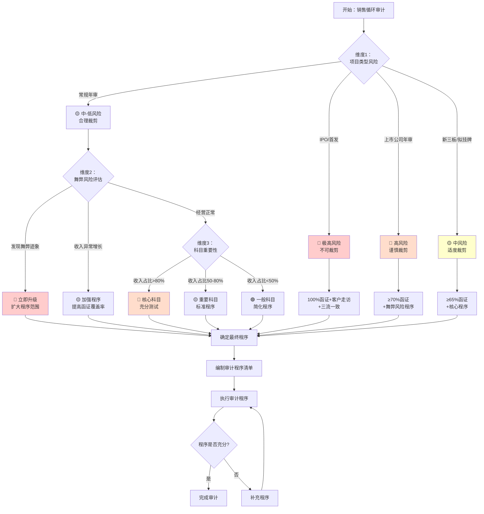

---

#### 决策表1：核心程序必做性判断（不同项目类型）

| 审计程序 | IPO项目 | 上市公司年审 | 新三板 | 常规年审（大中型） | 常规年审（小型） | 裁剪依据 |
|---------|---------|------------|--------|---------------|-------------|---------|
| **应收账款函证** | ⭐⭐⭐<br>≥80%覆盖<br>零余额必函证 | ⭐⭐⭐<br>≥70%覆盖<br>大额零余额函证 | ⭐⭐⭐<br>≥65%覆盖<br>选择性零余额 | ⭐⭐⭐<br>≥60%覆盖<br>大额零余额 | ⭐⭐<br>≥50%覆盖<br>或替代程序 | 审计准则要求<br>函证是必须程序 |
| **收入截止测试** | ⭐⭐⭐<br>前后各10-15天<br>重点最后1天 | ⭐⭐⭐<br>前后各5-10天 | ⭐⭐⭐<br>前后各5天 |  | ⭐⭐⭐<br>前后各3-5天 | 舞弊推定风险<br>必须执行 |
| **客户实地走访** | ⭐⭐⭐<br>前五大必走<br>新增大客户必走 | ⭐⭐<br>根据风险决定<br>可选择性走访 | ⭐⭐<br>重大客户走访 | ⭐<br>高风险客户 | ⭐<br>可不走访 | IPO特殊要求<br>其他根据风险 |
| **三流一致性检查** | ⭐⭐⭐<br>大额必做<br>抽样比例高 | ⭐⭐<br>重点检查 | ⭐⭐<br>抽样检查 |  | ⭐<br>可简化 | 舞弊风险应对 |
| **收入真实性检查** | ⭐⭐⭐<br>大额100%<br>四单齐全 | ⭐⭐⭐<br>抽样检查<br>重点大额异常 | ⭐⭐<br>抽样检查 |  | ⭐⭐<br>简化抽样 | 存在性认定<br>必须执行 |
| **坏账准备测算** | ⭐⭐⭐<br>全面测算<br>ECL模型 | ⭐⭐⭐<br>重新计算 |  | ⭐⭐<br>合理性测试 | ⭐⭐<br>分析性复核 | 计价认定重点 |
| **毛利率分析** | ⭐⭐⭐<br>分产品/客户<br>深度分析 | ⭐⭐⭐<br>同比环比分析 | ⭐⭐<br>趋势分析 | ⭐⭐<br>整体分析 | ⭐<br>简单对比 | 分析性程序<br>识别异常 |
| **期后回款检查** | ⭐⭐⭐<br>6个月以上 | ⭐⭐⭐<br>3-6个月 | ⭐⭐<br>3个月 |  | ⭐<br>2个月 | 存在性/计价<br>重要程序 |
| **关联方核查** | ⭐⭐⭐<br>穿透核查<br>董监高亲属 | ⭐⭐⭐<br>申报关联方核查 | ⭐⭐<br>申报关联方 |  | ⭐<br>简单核查 | IPO特殊要求 |
| **舞弊专项程序** | ⭐⭐⭐<br>必须执行<br>扩大范围 | ⭐⭐⭐<br>必须执行 | ⭐⭐<br>常规程序 | ⭐⭐<br>根据迹象 | ⭐<br>简化 | 舞弊推定风险 |

---

#### 决策表2：认定层面风险应对（不同认定的程序选择）

| 识别的风险 | 主要认定 | 首选程序 | 备选程序 | 程序组合建议 | 最低要求 |
|----------|---------|---------|---------|------------|---------|
| **虚假收入（舞弊）** | 存在性 | ✅ 函证<br>✅ 客户走访 | ✅ 期后回款<br>✅ 三流检查<br>✅ 银行流水 | 必须组合使用<br>单一程序不充分 | 函证+期后回款<br>+原始凭证检查 |
| **跨期确认收入** | 截止性 | ✅ 截止性测试 | ✅ 月度趋势分析<br>✅ 发货时点核对 | 截止测试必做<br>+分析识别异常 | 12月前后各5天<br>截止测试 |
| **坏账准备不足** | 计价 | ✅ 坏账测算<br>✅ 账龄分析 | ✅ 期后回款<br>✅ 单项减值测试 | 重新计算+期后验证 | ECL模型重算<br>或账龄比例测算 |
| **应收虚增** | 存在性 | ✅ 函证 | ✅ 期后回款<br>✅ 原始凭证 | 函证为主<br>不回函必须替代 | ≥70%函证覆盖率 |
| **关联方未披露** | 完整性/披露 | ✅ 关联方识别<br>✅ 穿透核查 | ✅ 银行流水<br>✅ 管理层访谈 | 多渠道交叉验证 | 工商信息查询<br>+管理层声明 |
| **主代理判断错误** | 列报 | ✅ 五步法检查<br>✅ 合同条款分析 | ✅ 业务模式了解<br>✅ 同行业对比 | 合同实质判断 | 合同条款详细检查 |
| **收入完整性** | 完整性 | ✅ 出库单→账簿<br>✅ 趋势分析 | ✅ 生产产量vs销售<br>✅ 税务申报核对 | 反向检查+分析 | 抽样完整性测试 |

---

### 💼 实战案例

#### 案例1：常规年审项目的程序裁剪

**项目背景**：
- 企业性质：制造业，销售收入5000万元
- 项目类型：连续第5年审计，非上市公司
- 内控情况：基本控制健全
- 风险评估：中等风险
- 团队配置：项目经理1人+审计员2人

**程序裁剪决策**：

| 程序类别 | 标准程序 | 本项目裁剪方案 | 裁剪理由 |
|---------|---------|--------------|---------|
| **函证** | ≥70%覆盖率 | ✅ 采用60%覆盖率<br>• 前10大客户必函证<br>• 大额零余额选择性函证 | • 连续审计，历史良好<br>• 非上市公司<br>• 但函证仍是必须程序 |
| **截止测试** | 前后各5-10天 | ✅ 前后各5天<br>• 重点12月最后3天 | • 风险评估为中等<br>• 往年无重大截止问题 |
| **客户走访** | 根据风险决定 | ❌ 不走访<br>• 改为电话访谈1-2家 | • 非IPO项目<br>• 无舞弊迹象<br>• 成本效益考虑 |
| **三流检查** | 抽样检查 | ✅ 简化抽样<br>• 仅检查大额异常交易 | • 内控基本有效<br>• 重点关注异常 |
| **毛利率分析** | 同比环比 | ✅ 整体趋势分析<br>• 不必细分到每个产品 | • 产品种类少<br>• 毛利率稳定 |
| **期后回款** | 3-6个月 | ✅ 3个月<br>• 大额应收重点关注 | • 客户回款情况良好<br>• 坏账准备充足 |

**工时估算**：
- 函证工作：20小时（发函、催函、替代）
- 截止测试：8小时
- 真实性检查：16小时
- 坏账测算：6小时
- 分析程序：4小时
- 其他：6小时
- **合计：60小时**（约7.5人天）

---

#### 案例2：IPO项目的程序设计

**项目背景**：
- 企业性质：高科技企业，拟创业板IPO
- 销售收入：3亿元，增长率40%
- 客户：前5大占60%，经销商为主
- 风险评估：高风险（收入快速增长+经销商模式）

**程序设计**：

| 程序类别 | 具体方案 | IPO特殊要求 | 工时 |
|---------|---------|-----------|------|
| **函证** | ✅ 100%函证<br>• 全部客户必函证（包括零余额）<br>• 不回函必须实地走访 | 证监会要求高覆盖率 | 80小时 |
| **客户走访** | ✅ 必须走访<br>• 前5大客户100%走访<br>• 新增大客户必走<br>• 经销商抽样走访30% | IPO必须执行 | 60小时 |
| **三流一致性** | ✅ 全面检查<br>• 合同流、物流、资金流<br>• 大额100%、其他抽样50% | 舞弊风险应对 | 40小时 |
| **截止测试** | ✅ 扩大范围<br>• 前后各15天<br>• 12月最后一天100%检查 | 防范跨期确认 | 20小时 |
| **期后回款** | ✅ 6个月以上<br>• 追踪至审计报告日 | 验证收入真实性 | 16小时 |
| **经销商核查** | ✅ 专项程序<br>• 终端销售数据核对<br>• 库存核查<br>• 退货政策检查 | 经销商模式特殊风险 | 32小时 |
| **关联方核查** | ✅ 穿透核查<br>• 董监高、实控人及亲属<br>• 工商信息全面查询 | IPO关联方认定严格 | 24小时 |
| **舞弊风险专项** | ✅ 扩大程序<br>• 虚假销售检查<br>• 渠道压货检查 | 收入高速增长风险 | 20小时 |
| **其他程序** | 毛利率分析、坏账测算等 | 深度分析 | 48小时 |

**合计工时：340小时**（约42.5人天）

**特别提示**：IPO项目不能裁剪程序，只能扩大程序范围。

---

### ✅ 程序有效性自查

#### 核心问题自查

**问题1：我执行的程序能够应对识别的风险吗？**
```
自查步骤：
1️⃣ 列出本项目识别的主要风险（例如：虚假收入、跨期确认）
2️⃣ 对照"风险-程序矩阵"，检查是否执行了对应的关键程序
3️⃣ 评估程序的范围和深度是否充分
4️⃣ 如果风险是"高"，程序必须充分且不能简化
```

**问题2：我的程序覆盖了所有认定吗？**
```
认定覆盖度检查表：
✅ 存在性：函证 + 期后回款 + 真实性检查
✅ 完整性：截止测试 + 完整性测试 + 趋势分析
✅ 准确性：细节测试 + 重新计算 + 函证核对
✅ 截止性：截止测试（收入+成本）
✅ 列报：科目分类检查 + 附注披露检查
```

**问题3：我的程序符合审计准则的要求吗？**
```
准则要求自查：
□ 函证程序是否执行？（必须执行，除非不可行）
□ 截止性测试是否执行？（推定风险，必须执行）
□ 舞弊风险应对程序是否执行？（必须专门设计应对程序）
□ 是否获取了充分、适当的审计证据？
□ 是否保持了职业怀疑态度？
```

**问题4：我的程序裁剪是否合理？**
```
裁剪合理性检查：
✅ 裁剪依据：基于风险评估，不是图省事
✅ 裁剪限制：核心程序（函证、截止）不能省略
✅ 裁剪补偿：简化的程序必须有替代或补充程序
✅ 裁剪审批：重大裁剪必须经项目合伙人批准
✅ 裁剪记录：必须在底稿中说明裁剪理由
```

---

### ⚠️ 常见错误与纠正

#### 错误1：过度裁剪核心程序 ❌

**错误表现**：
- "客户都是老客户，不用函证了"
- "内控测试有效，截止测试可以省略"
- "收入不重要，简化处理"

**正确做法** ✅：
- 函证、截止性测试是**必须执行的程序**，不能因为"老客户"或"控制有效"而省略
- 收入是审计准则**推定的舞弊风险**，必须充分测试
- 即使控制测试有效，实质性测试也不能大幅减少

---

#### 错误2：机械执行程序，不理解目的 ❌

**错误表现**：
- "底稿模板要求函证，我就函证，不知道为什么"
- "截止测试前后各5天，我就选5天，不管风险高低"

**正确做法** ✅：
- 理解每个程序的目的：验证哪个认定、应对什么风险
- 根据风险评估调整程序的性质、时间、范围
- 例如：高风险项目截止测试应扩大到前后10-15天

---

#### 错误3：忽视职业怀疑 ❌

**错误表现**：
- 管理层解释合理就接受，不深入调查
- 发现异常不追问，"差不多就行了"
- 过度信任管理层提供的资料

**正确做法** ✅：
- 销售循环是舞弊高发领域，必须保持职业怀疑
- 对异常情况必须追根究底
- 管理层解释必须有证据支持
- 交叉验证，不依赖单一证据来源

---

#### 错误4：程序执行不充分 ❌

**错误表现**：
- 函证覆盖率不够
- 截止测试只看几笔，范围太小
- 不回函不执行替代程序

**正确做法** ✅：
- 函证覆盖率：常规≥60%，IPO≥80%
- 截止测试：至少前后各5天，重点最后1-3天
- 不回函必须执行充分的替代程序（期后回款+原始凭证+银行流水）

---

#### 错误5：裁剪程序不合理 ❌

**错误表现**：
- 为了节省时间随意裁剪
- 没有风险评估依据就裁剪
- 裁剪后没有补充其他程序

**正确做法** ✅：
- 裁剪必须基于充分的风险评估
- 核心程序（函证、截止）原则上不裁剪
- 裁剪必须经项目合伙人批准
- 裁剪后必须评估是否需要补充程序

---

### 🏆 销售循环审计程序裁剪的7大黄金法则

#### 法则1：舞弊推定风险不可裁剪 🔴
收入确认是审计准则推定的舞弊风险，核心应对程序（函证、截止、舞弊专项）**绝对不能省略**，只能加强，不能减弱。

#### 法则2：认定全覆盖原则 📋
无论如何裁剪，必须确保5个认定（存在性、完整性、准确性、截止性、列报）都有相应的审计程序覆盖。

#### 法则3：风险评估是裁剪依据 ⚖️
裁剪程序必须基于充分的风险评估，不能凭经验或为节省时间而随意裁剪。

#### 法则4：核心程序优先级最高 ⭐
核心程序（标注⭐⭐⭐）原则上不裁剪。如需裁剪，必须：
- 经项目合伙人批准
- 在底稿中充分说明理由
- 补充其他替代程序

#### 法则5：IPO项目只增不减 🚀
IPO项目不能裁剪任何程序，只能在标准程序基础上扩大范围和深度。

#### 法则6：裁剪必须有补偿 🔄
简化某个程序时，必须评估是否需要通过其他程序来补偿（例如：减少函证覆盖率，必须扩大期后回款检查）。

#### 法则7：审计证据充分性原则 ✅
裁剪后的程序仍必须能够获取充分、适当的审计证据，支持审计意见。这是底线，不可突破。

---

### 📋 程序裁剪决策记录模板

为确保程序裁剪合理且有据可查，建议使用以下记录模板：

```markdown
## 销售循环审计程序裁剪决策记录

**项目名称**：________________  
**项目类型**：□ IPO  □ 上市公司年审  □ 新三板  □ 常规年审  
**编制人**：________  **日期**：________  
**复核人**：________（项目合伙人）  **日期**：________

---

### 一、风险评估总结

| 风险类别 | 评估结果 | 主要理由 |
|---------|---------|---------|
| 收入舞弊风险 | □高 □中 □低 | ________________ |
| 应收坏账风险 | □高 □中 □低 | ________________ |
| 截止性风险 | □高 □中 □低 | ________________ |
| 新准则应用风险 | □高 □中 □低 | ________________ |

**综合风险评估**：□ 高风险  □ 中风险  □ 低风险

---

### 二、程序裁剪决策

| 审计程序 | 标准方案 | 本项目方案 | 裁剪理由 | 是否需补偿 |
|---------|---------|----------|---------|-----------|
| 函证覆盖率 | ≥70% | ____% | __________ | □是 □否 |
| 截止测试范围 | 前后各5天 | 前后各__天 | __________ | □是 □否 |
| 客户走访 | 根据风险 | □走访 □不走访 | __________ | □是 □否 |
| 三流检查 | 抽样 | □充分 □简化 | __________ | □是 □否 |
| 期后回款期间 | 3-6个月 | ___个月 | __________ | □是 □否 |

---

### 三、裁剪合理性评估

□ 裁剪基于充分的风险评估  
□ 核心程序未被不合理裁剪  
□ 裁剪后程序仍能覆盖所有认定  
□ 简化的程序已有补偿措施  
□ 预计获取的审计证据充分、适当

---

### 四、项目合伙人意见

**审批意见**：□ 同意  □ 不同意  □ 修改后同意

**修改要求**（如有）：
_________________________________________________

**签字**：__________  **日期**：__________
```

---

## 🎓 本章小结

通过本章的**"认定-风险-程序映射体系"**，您应该能够：

1. ✅ **清晰理解逻辑**：明白每个审计程序针对什么风险、验证哪个认定
2. ✅ **合理裁剪程序**：根据项目类型、风险评估、科目重要性做出合理的程序裁剪决策
3. ✅ **识别舞弊风险**：始终保持职业怀疑，重点关注销售循环的舞弊推定风险
4. ✅ **确保程序充分**：无论如何裁剪，都必须确保审计证据充分、适当
5. ✅ **应对特殊情况**：遇到IPO、首次审计、高风险等特殊情况，知道如何调整程序

**核心要点回顾**：
- 🔴 收入确认是审计准则**推定的舞弊风险**，必须充分测试
- ⭐ 函证和截止性测试是**必须执行的程序**，原则上不可省略
- 📊 程序裁剪必须基于**风险评估**，不能随意裁剪
- 🎯 不同项目类型（IPO vs 常规年审）有不同的程序要求
- ✅ 裁剪后必须确保**审计证据充分性**，这是底线

---

**💡 实用建议**：
1. 在项目开始时，使用"三维度判断流程图"确定审计策略
2. 执行审计时，随时对照"风险-程序矩阵"检查程序覆盖度
3. 遇到异常情况，立即对照"舞弊迹象清单"评估风险
4. 项目结束前，使用"程序有效性自查"确保程序充分

---


---

## 7.4 穿行测试准备与执行

> **📋 本节核心要点**
>
> - ✅ 穿行测试是了解销售循环内部控制的关键步骤
> - ✅ 通过追踪1-2笔交易的全流程，验证控制设计有效性
> - ✅ 穿行测试的结果决定是否执行控制测试
>
> **关键底稿：** B23-1-2流程图、B23-1-3控制矩阵、B23-1-4穿行测试

---

### 7.4.1 穿行测试准备

#### 7.4.1.1 资料获取清单

**□ 基础资料**
- [ ] 获取销售收入科目余额表（全年）
- [ ] 获取应收账款科目余额表（期初、期末、全年发生）
- [ ] 获取客户清单（含信用额度、账期）
- [ ] 获取销售价格表/定价政策
- [ ] 获取组织架构图（销售部门、财务部门）
- [ ] 获取销售人员名册及职责分工

**□ 制度文件**
- [ ] 销售管理制度
- [ ] 信用管理制度（客户授信、账期政策）
- [ ] 收入确认会计政策
- [ ] 销售审批权限表
- [ ] 合同管理制度
- [ ] 发票管理制度
- [ ] 应收账款催收制度

**□ 业务文档**
- [ ] 销售合同样本（各类型合同）
- [ ] 销售订单样本
- [ ] 发货单/出库单样本
- [ ] 销售发票样本
- [ ] 签收单/验收单样本
- [ ] 销售退货单样本（如有）

**□ IT系统资料**
- [ ] 销售管理系统截图/操作手册
- [ ] ERP系统销售模块流程图
- [ ] 系统权限设置说明
- [ ] 系统自动化控制说明

---

#### 7.4.1.2 前期了解

**□ 业务模式了解**
- [ ] 销售模式：直销、经销商、代理商、电商？
- [ ] 主要产品/服务类型
- [ ] 主要客户类型：终端客户、经销商、关联方？
- [ ] 定价模式：固定价、议价、招投标？
- [ ] 结算方式：现销、赊销、预收？
- [ ] 账期政策：30天、60天、90天？

**□ 销售流程了解**
- [ ] 销售订单如何生成？（客户下单、销售人员开单）
- [ ] 信用审批流程如何？
- [ ] 发货流程如何？（仓库、物流）
- [ ] 开票流程如何？（时点、审批）
- [ ] 收款流程如何？（收款确认、核销）
- [ ] 退货流程如何？（审批、处理）

**□ 控制环境了解**
- [ ] 销售部门组织架构
- [ ] 关键岗位职责分离情况
- [ ] IT系统自动化程度
- [ ] 上期审计发现的问题
- [ ] 本期业务变化（新产品、新模式、新客户）

---

#### 7.4.1.3 工具准备

**□ 底稿准备**
- [ ] B23-1销售循环业务层面控制总表
- [ ] B23-1-2流程图及描述底稿
- [ ] B23-1-3控制矩阵底稿
- [ ] B23-1-4穿行测试底稿

**□ 访谈准备**
- [ ] 准备访谈提纲（按岗位定制）
- [ ] 预约访谈时间
- [ ] 准备录音设备（需获得同意）

**□ 其他工具**
- [ ] 流程图绘制工具（Visio、PPT）
- [ ] 照片/截图设备（拍摄关键单据）
- [ ] 检查清单模板

---

#### 7.4.1.4 访谈对象确定

| 岗位 | 访谈目的 | 访谈重点 |
|-----|---------|---------|
| **销售总监/经理** | 了解销售策略和整体控制 | 销售政策、定价策略、客户管理、授信政策、业绩考核 |
| **销售人员** | 了解销售具体流程 | 客户开发、订单处理、合同签订、发货协调 |
| **信用管理人员** | 了解信用控制 | 客户授信审批、账期管理、逾期处理 |
| **仓库主管** | 了解发货控制 | 发货审批、出库流程、库存核对 |
| **开票员** | 了解发票管理 | 开票依据、审批流程、发票管理 |
| **应收会计** | 了解收入确认和应收管理 | 收入确认时点、应收记账、对账催收 |
| **财务经理** | 了解财务控制 | 收入政策、坏账政策、财务审核 |

**访谈提纲示例（销售人员）：**

```
1. 请介绍一下典型的销售流程，从客户询价到最终收款？
2. 销售订单是如何生成的？需要哪些审批？
3. 客户信用额度是如何确定的？
4. 发货前需要满足哪些条件？
5. 销售发票何时开具？由谁审批？
6. 如何确认客户已收到货物？
7. 退货如何处理？需要哪些审批？
8. 销售业绩如何考核？是否影响收入确认？
9. 是否存在特殊的销售安排（如寄售、试销、退货条款）？
10. 本年度销售流程有无重大变化？
```

---

### 7.4.2 流程了解与控制识别

#### 7.4.2.1 销售循环业务流程图（B23-1-2）

**（1）销售订单与信用审批流程**

```
【直销模式】
客户询价 → 销售报价 → 客户下单 → 销售开单 → 信用审批 → 订单确认
    ↓          ↓          ↓          ↓          ↓          ↓
  价格表   销售经理审批  销售订单  系统生成  授信额度检查  通知生产/发货

【经销商模式】
经销商订货会 → 订单汇总 → 区域经理审批 → 信用审批 → 订单确认 → 发货计划
      ↓           ↓           ↓           ↓          ↓          ↓
  年度合同    销售订单    区域审批    授信检查   订单系统   物流安排
```

**控制点识别：**
- ✓ 价格审批控制：价格低于标准价需审批
- ✓ 信用额度控制：超授信额度需特批
- ✓ 订单审批控制：大额订单（>50万）需销售总监审批

---

**（2）发货与开票流程**

```
【发货流程】
仓库收到订单 → 备货检查 → 发货审批 → 打包出库 → 物流发运 → 客户签收
      ↓            ↓          ↓          ↓          ↓          ↓
  订单核对     库存核对   发货单审批  出库单   物流单   签收单/POD

【开票流程】
收到签收单 → 开票申请 → 财务审核 → 开具发票 → 寄送客户 → 登记台账
      ↓           ↓          ↓          ↓          ↓          ↓
   确认收货    开票系统   核对订单   税控系统  快递寄送  发票管理
```

**控制点识别：**
- ✓ 发货授权控制：发货需订单支持
- ✓ 三单核对控制：订单、发货单、出库单核对
- ✓ 签收确认控制：取得客户签收单
- ✓ 开票审核控制：发票金额、税率审核
- ✓ 发票管理控制：发票领用、作废登记

---

**（3）收入确认与收款流程**

```
【收入确认流程】
取得签收单 → 核对合同条款 → 判断确认条件 → 确认收入 → 记账
      ↓             ↓              ↓            ↓        ↓
   确认交付      风险转移判断    收入确认政策   系统确认  应收账款

【收款流程】
客户付款 → 收款确认 → 核销应收 → 开具收据 → 银行对账
    ↓          ↓          ↓          ↓          ↓
  银行到账   财务确认   核销系统   收据管理   银行流水
```

**控制点识别：**
- ✓ 收入确认控制：按政策确认（签收/验收）
- ✓ 收入截止控制：确保收入记录在正确期间
- ✓ 收款核销控制：收款及时核销应收
- ✓ 对账控制：定期与客户对账

---

**（4）销售退货流程**

```
退货申请 → 退货审批 → 收货检验 → 开具红字发票 → 退款/冲减应收 → 冲减收入
    ↓          ↓          ↓            ↓              ↓              ↓
  客户申请   销售审批   质检确认     税务处理        财务处理       会计处理
```

**控制点识别：**
- ✓ 退货授权控制：退货需审批
- ✓ 退货检验控制：确认退货原因和质量
- ✓ 会计处理控制：及时冲减收入和应收

---

#### 7.4.2.2 控制矩阵编制（B23-1-3）

**示例：销售循环控制矩阵（节选）**

| 业务环节 | 控制目标 | 认定 | 风险 | 控制活动 | 控制类型 | 控制属性 | 频率 | 设计评价 | 是否关键控制 |
|---------|---------|------|------|---------|---------|---------|------|---------|-------------|
| **订单处理** | 确保订单真实、准确 | 发生、准确性 | 虚假订单、价格错误 | 1. 客户订单书面确认<br/>2. 价格低于标准需审批<br/>3. 系统自动带出价格 | 预防性 | 人工+IT | 每笔 | 有效 | ✓ |
| **信用审批** | 防止超授信额度发货 | 发生 | 坏账风险 | 1. 客户授信额度设置<br/>2. 超额度需特批<br/>3. 系统自动检查额度 | 预防性 | 人工+IT | 每笔 | 有效 | ✓ |
| **发货审批** | 确保发货有订单支持 | 发生、准确性 | 无单发货、发错货 | 1. 发货需订单授权<br/>2. 仓库核对订单、发货单<br/>3. 出库单需审批 | 预防性 | 人工 | 每笔 | 有效 | ✓ |
| **签收确认** | 确认客户收货 | 发生 | 收入确认时点错误 | 1. 取得客户签收单/POD<br/>2. 电子签收系统<br/>3. 无签收不确认收入 | 预防性 | 人工+IT | 每笔 | 有效 | ✓ |
| **开票审核** | 确保发票准确 | 准确性 | 发票错误、税率错误 | 1. 财务审核发票金额、税率<br/>2. 系统自动匹配订单<br/>3. 发票需经理审批 | 预防性 | 人工+IT | 每笔 | 有效 | ✓ |
| **收入确认** | 确保收入确认符合政策 | 发生、截止性 | 提前/推迟确认收入 | 1. 收入确认政策明确<br/>2. 财务审核签收单<br/>3. 月末截止检查 | 预防性 | 人工 | 每笔/每月 | 有效 | ✓ |
| **应收对账** | 确保应收账款准确 | 存在、准确性 | 应收错误、坏账 | 1. 定期与客户对账（月度/季度）<br/>2. 差异调查和调整<br/>3. 逾期应收催收 | 检查性 | 人工 | 每月/季度 | 有效 | ✓ |
| **退货处理** | 确保退货合规 | 发生、完整性 | 未经授权退货 | 1. 退货需客户申请<br/>2. 销售经理审批<br/>3. 质检确认<br/>4. 及时冲减收入 | 预防性 | 人工 | 每笔 | 有效 | - |

**填写要点：**

1. **认定选择**：
   - 收入：发生、截止性、准确性
   - 应收账款：存在、完整性、准确性、权利和义务

2. **控制类型**：
   - 预防性控制（事前）：订单审批、信用检查、发货授权
   - 检查性控制（事后）：对账、复核、盘点

3. **控制属性**：
   - 人工控制：需人工判断和执行
   - IT控制：系统自动执行
   - 人工依赖IT：系统辅助，人工确认

4. **关键控制判断标准**：
   - 应对重大风险的控制
   - 没有其他替代控制
   - 对财务报表有重大影响
   - 防范舞弊风险的控制

---

### 7.4.3 穿行测试执行（B23-1-4）

#### 7.4.3.1 穿行测试操作步骤

**步骤1：选择测试样本**

选择1-2笔具有代表性的销售交易：

**样本选择标准：**
- ✓ 交易完整（从订单到收款）
- ✓ 具有代表性（典型业务流程）
- ✓ 涉及关键控制点
- ✓ 金额适中（不要太小）

**示例样本选择：**

| 样本 | 交易描述 | 选择理由 |
|------|---------|---------|
| 样本1 | 2024年10月15日，向客户A销售产品X，金额500,000元（含税），账期60天，已签收，已开票，已确认收入 | 典型的赊销交易，金额较大，涉及信用审批，流程完整 |
| 样本2 | 2024年11月20日，向经销商B销售产品Y，金额300,000元（含税），预收款，已发货签收，已开票确认收入 | 经销商模式，预收款交易，流程不同 |

---

**步骤2：追踪交易全流程**

**以样本1（客户A赊销交易）为例，追踪全流程：**

| 追踪环节 | 预期证据 | 实际情况 | 控制执行情况 | 备注 |
|---------|---------|---------|-------------|------|
| **1. 客户询价** | 客户询价邮件/记录 | ✓ 客户邮件询价，日期10月10日 | 控制执行 | 价格符合价格表 |
| **2. 销售报价** | 销售报价单，经理审批 | ✓ 报价单，销售经理签字 | 控制执行 | 价格标准 |
| **3. 客户下单** | 客户采购订单（PO） | ✓ 客户PO，编号PO-2024-XXX | 控制执行 | - |
| **4. 销售开单** | 销售订单，系统生成 | ✓ 销售订单SO-2024-XXX，系统生成 | 控制执行 | 价格自动带出 |
| **5. 信用审批** | 授信额度检查，审批记录 | ✓ 客户授信额度100万，本次50万，系统自动检查通过 | 控制执行 | IT自动控制 |
| **6. 发货审批** | 发货单，仓库主管审批 | ✓ 发货单DN-2024-XXX，仓库主管签字 | 控制执行 | 核对订单 |
| **7. 备货出库** | 出库单，库存核对 | ✓ 出库单WO-2024-XXX，库存系统核对 | 控制执行 | 库存扣减 |
| **8. 物流发运** | 物流单，物流公司签收 | ✓ 物流单LG-2024-XXX，顺丰快递 | 控制执行 | - |
| **9. 客户签收** | 签收单（POD），客户签字 | ✓ 签收单POD-2024-XXX，客户A盖章签字，日期10月18日 | 控制执行 | 3天送达 |
| **10. 开票申请** | 开票申请单 | ✓ 开票申请，开票员填写 | 控制执行 | - |
| **11. 财务审核** | 财务审核记录 | ✓ 财务经理审核签字，核对订单、签收单 | 控制执行 | 金额、税率正确 |
| **12. 开具发票** | 增值税发票 | ✓ 发票号码XXX，日期10月19日，金额500,000元 | 控制执行 | 税控系统开具 |
| **13. 收入确认** | 记账凭证，收入确认依据 | ✓ 凭证号JV-2024-XXX，日期10月19日<br/>借:应收账款 500,000<br/>贷:主营业务收入 442,478<br/>　　应交税费-销项税 57,522 | 控制执行 | 基于签收单确认 |
| **14. 应收登记** | 应收账款明细账 | ✓ 客户A应收明细，500,000元 | 控制执行 | 账期60天 |
| **15. 客户对账** | 对账单，客户确认 | ✓ 11月对账单，客户确认签章 | 控制执行 | 月度对账 |
| **16. 客户付款** | 银行流水，收款记录 | ✓ 12月15日收到款项500,000元 | 控制执行 | 账期内付款 |
| **17. 收款核销** | 核销记录 | ✓ 应收核销，日期12月15日 | 控制执行 | 及时核销 |

---

**步骤3：记录穿行测试结果（B23-1-4）**

**穿行测试记录表：**

```
被审计单位：XXX公司
测试交易：向客户A销售产品X，金额500,000元
交易日期：2024年10月15日（发货）
测试人：______  测试日期：______

序号 | 业务环节 | 控制点描述 | 预期证据 | 实际证据 | 控制执行情况 | 备注
-----|---------|------------|---------|---------|-------------|-----
1 | 订单处理 | 客户订单书面确认 | 客户PO | ✓ 已获取PO-2024-XXX | 有效执行 | -
2 | 价格审批 | 价格符合价格表或需审批 | 价格表/审批单 | ✓ 价格符合标准价 | 有效执行 | -
3 | 信用审批 | 授信额度检查 | 系统检查记录 | ✓ 系统自动检查通过 | 有效执行 | IT自动控制
4 | 发货授权 | 发货需订单支持 | 发货单+订单 | ✓ 发货单核对订单 | 有效执行 | -
5 | 出库控制 | 库存核对 | 出库单+库存记录 | ✓ 出库单WO-2024-XXX | 有效执行 | -
6 | 签收确认 | 取得客户签收单 | 签收单POD | ✓ 已获取POD，客户签字盖章 | 有效执行 | -
7 | 开票审核 | 财务审核发票金额、税率 | 审核签字 | ✓ 财务经理审核签字 | 有效执行 | -
8 | 收入确认 | 基于签收单确认收入 | 凭证+签收单 | ✓ 凭证附签收单，确认依据充分 | 有效执行 | -
9 | 应收登记 | 应收账款及时登记 | 应收明细账 | ✓ 及时登记应收 | 有效执行 | -
10 | 客户对账 | 定期对账 | 对账单 | ✓ 月度对账，客户确认 | 有效执行 | -
11 | 收款核销 | 收款及时核销应收 | 核销记录 | ✓ 收款当日核销 | 有效执行 | -

穿行测试结论：
该笔销售交易从订单到发货、开票、确认收入、收款核销的全流程控制均得到有效执行，
控制设计合理有效。关键控制点（信用审批、签收确认、收入确认）均有效执行。
```

---

#### 7.4.3.2 穿行测试发现问题的处理

**常见问题类型：**

| 问题类型 | 示例 | 处理方式 | 对审计策略的影响 |
|---------|------|---------|----------------|
| **控制未执行** | 发现1笔大额销售（80万）未经信用审批即发货 | 记录偏差，评估是否偶发 | 如系统性问题，不依赖该控制 |
| **证据缺失** | 客户签收单遗失，无法证明客户收货 | 记录控制缺陷 | 增加收入截止性测试范围 |
| **控制设计缺陷** | 信用审批权限表不清晰，审批混乱 | 记录设计缺陷，建议改进 | 不依赖信用控制 |
| **职责未分离** | 销售人员既开订单又审批发货 | 记录重大缺陷 | 不依赖控制，充分实质性测试 |
| **收入政策不当** | 发货即确认收入，未等客户签收 | 记录会计政策问题 | 重点测试收入截止性 |

---

**穿行测试偏差记录（B23-1-5）：**

如果发现控制未有效执行，需在B23-1-5（控制缺陷汇总表）中记录：

```
控制缺陷描述：
在穿行测试中发现1笔销售交易（客户B，金额800,000元）未经信用审批即发货。
该客户授信额度为50万，本次交易超额30万，但系统未阻止，也未发现人工特批记录。

缺陷类型：☑ 设计缺陷  ☑ 运行缺陷

具体分析：
1. 设计缺陷：系统信用检查功能未启用或设置不当
2. 运行缺陷：人工审批流程未执行

缺陷严重程度评估：
- 该控制为关键控制（防范坏账风险）
- 涉及金额重大（超授信额度30万）
- 如果系统性发生，存在重大坏账风险

初步评级：☐ 重大缺陷  ☑ 重要缺陷  ☐ 一般缺陷

对审计策略的影响：
1. 不依赖信用审批控制
2. 增加应收账款坏账准备测试范围
3. 扩大应收账款函证范围，重点关注超额度客户
4. 检查更多销售交易的信用审批情况
5. 建议管理层改进信用控制

编制人：______  日期：______
复核人：______  日期：______
```

---

#### 7.4.3.3 穿行测试结论（B23-1-6）

基于穿行测试结果，形成控制设计评价结论：

**结论示例（无重大缺陷）：**

```
一、控制设计总体评价

经过对销售循环业务流程的了解和穿行测试，我们认为：

1. XXX公司已建立了销售管理制度，包括订单管理、信用管理、发货管理、
   开票管理、收入确认等方面的制度。

2. 关键控制点识别：
   ✓ 订单审批和价格审批控制
   ✓ 客户信用额度控制
   ✓ 发货授权控制
   ✓ 客户签收确认控制
   ✓ 开票审核控制
   ✓ 收入确认控制（基于签收单）
   ✓ 应收账款对账控制

3. 控制设计评价：
   ✓ 职责分离：销售、仓库、财务职责已分离
   ✓ 授权审批：建立了订单审批、发货审批、开票审批制度
   ✓ IT控制：系统自动检查信用额度、自动带出价格
   ✓ 检查控制：建立了客户对账机制
   
4. 发现的控制设计缺陷：
   无重大设计缺陷

二、审计策略决策

基于控制设计评价和收入舞弊风险的性质，我们决定：

审计策略：实质性方案

理由：
1. 收入确认是审计准则推定的舞弊风险
2. 即使控制有效，也不能大幅减少实质性测试
3. 需要充分的外部证据（函证、截止性测试等）

控制测试计划：
☑ 执行有限的控制测试（了解控制运行情况，为风险评估提供参考）
测试范围：信用审批控制、签收确认控制、收入确认控制

实质性测试计划：
☑ 充分执行实质性测试（不因控制测试结果而减少）
核心程序：
- 应收账款函证（100%或高比例覆盖）
- 收入截止性测试（前后各5-10天）
- 收入真实性检查（三单核对）
- 毛利率分析
- 虚假销售检查
- 期末突击销售检查

编制人：______  日期：______
复核人：______  日期：______
项目经理：______  日期：______
```

---

**结论示例（存在重大缺陷）：**

```
一、控制设计总体评价

经过对销售循环业务流程的了解和穿行测试，我们发现：

1. XXX公司虽然建立了销售管理制度，但存在以下重大缺陷：

   ☑ 重大缺陷1：职责未分离
   - 销售人员既负责订单处理，又负责发货审批
   - 仓库人员兼任开票员
   - 缺乏有效的职责分离

   ☑ 重大缺陷2：收入确认政策不当
   - 公司在发货时即确认收入，未等客户签收
   - 不符合收入确认准则要求（控制权转移）
   - 存在提前确认收入的风险

   ☑ 重要缺陷3：信用控制缺失
   - 客户信用额度管理混乱
   - 超额度发货未经审批
   - 存在坏账风险

2. 关键控制缺失或无效：
   ✗ 职责分离控制：缺失
   ✗ 收入确认控制：不当
   ✗ 信用审批控制：无效

二、审计策略决策

基于控制重大缺陷和收入舞弊风险，我们决定：

审计策略：纯实质性方案

理由：
1. 存在重大控制缺陷，不能依赖控制
2. 收入确认政策不当，存在重大错报风险
3. 必须充分执行实质性测试

控制测试计划：
☐ 不执行控制测试（控制不可依赖）

实质性测试计划：
☑ 充分执行实质性测试（扩大范围）
核心程序：
- 应收账款函证（100%覆盖，包括零余额客户）
- 收入截止性测试（扩大范围：前后各15-30天）
- 收入真实性检查（扩大样本量，三单核对+期后回款）
- 收入确认时点复核（重新评估收入确认依据）
- 毛利率分析（重点关注异常）
- 虚假销售检查（必做）
- 期末突击销售检查（必做）
- 考虑调整重大错报风险评估

管理层沟通：
☑ 向管理层通报控制重大缺陷
☑ 建议管理层改进内部控制
☑ 评估对审计报告的影响

编制人：______  日期：______
复核人：______  日期：______
项目经理：______  日期：______
```

---

### 💡 穿行测试实用技巧

**技巧1：如何选择代表性样本？**

好的样本应该：
- ✓ 涵盖主要业务类型（直销、经销商、出口等）
- ✓ 包含不同金额级别（大额、中额）
- ✓ 涉及关键控制点
- ✓ 交易完整（从订单到收款）

**技巧2：如何高效追踪流程？**

- ✓ 提前准备检查清单，逐项核对
- ✓ 拍照或复印关键单据，作为底稿附件
- ✓ 系统截图保存（订单、审批、确认记录）
- ✓ 边追踪边记录，不要事后回忆

**技巧3：如何识别控制缺陷？**

关注以下"红旗"信号：
- ⚠️ 单据缺失或不规范
- ⚠️ 审批签字缺失
- ⚠️ 业务时间逻辑不合理（如开票早于发货）
- ⚠️ 职责混乱（一人身兼数职）
- ⚠️ 系统控制被人工凌驾

**技巧4：如何评估控制设计有效性？**

评估标准：
- ✓ 控制能否有效应对识别的风险？
- ✓ 控制是否具有可操作性？
- ✓ 控制是否得到一贯执行？
- ✓ 是否存在替代控制？

---

### ⚠️ 常见错误提醒

**穿行测试的5个常见错误：**

❌ **错误1：样本选择不当**
✅ 正确：选择金额太小（如100元）或不完整的交易，无法有效测试控制

❌ **错误2：只看单据，不追踪流程**
✅ 正确：必须追踪交易全流程，验证每个控制点

❌ **错误3：发现缺陷不记录**
✅ 正确：所有缺陷都必须记录在B23-1-5控制缺陷汇总表

❌ **错误4：穿行测试等同于控制测试**
✅ 正确：穿行测试是了解控制设计，控制测试是测试运行有效性

❌ **错误5：忽视IT控制**
✅ 正确：系统自动控制也要测试（如信用额度检查、价格自动带出）


---

## 7.5 控制测试（可选）

> **📋 本节核心要点**
>
> - ✅ 控制测试是测试控制运行有效性的程序
> - ✅ 销售循环因舞弊风险，控制测试是可选的
> - ✅ 即使执行控制测试，也不能大幅减少实质性测试
>
> **关键底稿：** C2销售循环控制测试汇总表、C2-1控制测试过程记录表
>
> **重要提示：** 对于销售循环，控制测试的主要目的是了解控制运行情况，而非减少实质性测试

---

### 7.5.1 控制测试决策

#### 7.5.1.1 是否执行控制测试？

**决策标准：**

| 情况 | 是否执行控制测试 | 理由 |
|------|---------------|------|
| **穿行测试发现重大缺陷** | ❌ 不执行 | 控制不可依赖，直接实质性测试 |
| **收入是推定舞弊风险** | ⚠️ 可选 | 即使控制有效，也不能大幅减少实质性测试 |
| **首次审计** | ✅ 建议执行 | 了解控制运行情况，为以后年度提供基础 |
| **持续审计且控制稳定** | ⚠️ 可选 | 可执行有限的控制测试 |
| **IPO项目** | ✅ 建议执行 | 需评估内部控制有效性 |

---

**审计准则要求：**

根据《中国注册会计师审计准则第1141号》：
- 收入确认推定为舞弊风险
- 对舞弊风险，必须实施充分的实质性程序
- 控制测试不能替代实质性程序

**结论：** 
即使选择执行控制测试，销售循环的实质性测试范围**不能因控制测试结果良好而大幅减少**。

---

#### 7.5.1.2 控制测试的价值（即使不能减少实质性测试）

**价值1：了解控制运行情况**
- 评估控制是否得到一贯执行
- 识别控制偏差的性质和程度
- 为风险评估提供依据

**价值2：发现控制缺陷**
- 及时发现控制运行中的问题
- 向管理层提出改进建议
- 评估对财务报表的影响

**价值3：为以后年度审计提供基础**
- 建立控制运行的基准
- 为以后年度控制测试提供比较基础

**价值4：满足特殊审计要求**
- IPO项目需要评估内部控制有效性
- 集团审计需要评估组成部分控制

---

### 7.5.2 控制测试范围确定

#### 7.5.2.1 关键控制识别

基于穿行测试识别的关键控制，确定控制测试范围：

| 关键控制 | 控制频率 | 风险等级 | 是否测试 | 测试理由 |
|---------|---------|---------|---------|---------|
| **信用审批控制** | 每笔 | 高 | ✅ | 防范坏账风险 |
| **发货授权控制** | 每笔 | 高 | ✅ | 确保发货有订单支持 |
| **签收确认控制** | 每笔 | 高 | ✅ | 确保收入确认时点正确 |
| **开票审核控制** | 每笔 | 中 | ✅ | 确保发票准确 |
| **收入确认控制** | 每笔 | 高 | ✅ | 确保收入确认符合政策 |
| **应收对账控制** | 每月/季度 | 高 | ✅ | 确保应收准确 |
| **价格审批控制** | 每笔 | 中 | ⚠️ 可选 | 防范价格舞弊 |
| **退货审批控制** | 每笔 | 中 | ⚠️ 可选 | 控制退货合规性 |

---

#### 7.5.2.2 样本量确定

**样本量确定原则：**

根据控制频率和风险等级确定样本量：

| 控制频率 | 风险等级 | 基础样本量 | 调整因素 |
|---------|---------|-----------|---------|
| 每天（高频） | 高 | 25-30个 | 首次审计+20% |
| 每天（高频） | 中 | 20-25个 | 控制依赖IT+自动化可减少 |
| 每周 | 高 | 15-20个 | - |
| 每月 | 高 | 12-15个（建议全测） | - |
| 每季度 | 中 | 4个（全测） | - |

**销售循环控制测试样本量建议：**

| 拟测试控制 | 控制频率 | 风险等级 | 基础样本量 | 调整因素 | 最终样本量 |
|-----------|---------|---------|-----------|---------|-----------|
| 信用审批（<50万） | 每天 | 中 | 25个 | 系统自动检查 | 20个 |
| 信用审批（>50万） | 每周 | 高 | 20个 | 首次审计+20% | 24个 |
| 发货授权 | 每天 | 高 | 30个 | 无 |  |
| 签收确认 | 每天 | 高 | 30个 | 无 |  |
| 开票审核 | 每天 | 中 | 25个 | 无 |  |
| 收入确认 | 每天 | 高 | 30个 | 无 |  |
| 应收对账 | 每月 | 高 | 12个 | 全年12个月全测 |  |

**⚠️ 重要提示：** 
由于收入是舞弊风险，即使样本测试结果良好，实质性测试范围也不能大幅减少。

---

#### 7.5.2.3 控制测试计划表（C2）

**控制测试计划汇总表：**

```
被审计单位：XXX公司
审计期间：2024年度
编制人：______ 日期：______

序号 | 控制描述 | 控制目标 | 认定 | 控制频率 | 风险等级 | 计划样本量 | 测试方法 | 负责人 | 计划完成日期
-----|---------|---------|------|---------|---------|-----------|---------|-------|-------------
1 | 客户信用审批 | 防范坏账风险 | 发生 | 每笔 | 高 | 44个(20+24) | 检查审批单 | 张三 | X月X日
2 | 发货授权控制 | 确保有单发货 | 发生、准确性 | 每笔 | 高 | 30个 | 检查发货单 | 李四 | X月X日
3 | 客户签收确认 | 确保收货确认 | 发生 | 每笔 | 高 | 30个 | 检查签收单 | 王五 | X月X日
4 | 开票审核 | 确保发票准确 | 准确性 | 每笔 | 中 | 25个 | 检查审核记录 | 赵六 | X月X日
5 | 收入确认控制 | 确保政策执行 | 发生、截止性 | 每笔 | 高 | 30个 | 检查凭证附件 | 钱七 | X月X日
6 | 应收对账 | 确保应收准确 | 存在、准确性 | 每月 | 高 | 12个 | 检查对账单 | 孙八 | X月X日

复核人：______ 日期：______
```

---

### 7.5.3 控制测试执行

#### 7.5.3.1 控制测试执行记录（C2-1）

**（1）信用审批控制测试**

**测试控制：客户信用审批控制（超50万需特批）**

**测试记录表：**

| 样本序号 | 交易日期 | 客户名称 | 订单金额 | 客户授信额度 | 已用额度 | 本次占用 | 是否超额 | 审批情况 | 控制有效性 | 备注 |
|---------|---------|---------|---------|------------|---------|---------|---------|---------|-----------|------|
| 1 | 2024-01-15 | 客户A | 600,000 | 1,000,000 | 200,000 |  | 否 | 系统自动通过 | 有效 | - |
| 2 | 2024-02-20 | 客户B | 800,000 | 500,000 | 100,000 |  | 是(超300,000) | ✓ 总经理特批 | 有效 | 特批单完整 |
| 3 | 2024-03-10 | 客户C | 450,000 | 800,000 | 300,000 |  | 否 | 系统自动通过 | 有效 | - |
| 4 | 2024-04-05 | 客户D | 700,000 | 600,000 | 150,000 |  | 是(超250,000) | ✗ **未发现审批** | **偏差** | **缺少特批** |
| ... |  |  |  |  |  |  |  |  |  |  |
| 44 | 2024-12-18 | 客户Z | 550,000 | 1,200,000 | 400,000 |  | 否 | 系统自动通过 | 有效 | - |

**测试结果：**
- 样本总数：44个
- 有效执行：42个
- 发现偏差：2个（客户D、客户K超额度未特批）
- 偏差率：4.5% (2/44)
- 控制有效性结论：控制基本有效（偏差率<5%，但存在超额度风险）

**偏差分析：**
- 偏差原因：销售人员为完成业绩，绕过审批流程
- 偏差影响：可能导致坏账损失
- 审计应对：不依赖该控制，扩大应收账款坏账测试范围

---

**（2）签收确认控制测试**

**测试控制：取得客户签收单后才确认收入**

**测试记录表：**

| 样本序号 | 收入确认日期 | 客户名称 | 收入金额 | 发货日期 | 签收日期 | 是否有签收单 | 签收单是否有效 | 收入确认是否基于签收 | 控制有效性 | 备注 |
|---------|-------------|---------|---------|---------|---------|------------|--------------|-------------------|-----------|------|
| 1 | 2024-01-20 | 客户A | 500,000 | 2024-01-18 |  | ✓ | ✓ 客户盖章 | ✓ 凭证附签收单 | 有效 | - |
| 2 | 2024-02-15 | 客户B | 300,000 | 2024-02-10 | 2024-02-14 | ✓ | ✓ 客户签字 | ✓ 凭证附签收单 | 有效 | - |
| 3 | 2024-03-28 | 客户C | 800,000 | 2024-03-20 |  | ✓ | ✓ 电子签收 | ✓ 凭证附POD | 有效 | 物流电子签收 |
| 4 | 2024-04-30 | 客户D | 600,000 | 2024-04-28 | ? | ✗ | - |  | **偏差** | **发货即确认收入** |
| ... |  |  |  |  |  |  |  |  |  |  |
| 30 | 2024-12-25 | 客户Z | 450,000 | 2024-12-23 |  | ✓ | ✓ 客户盖章 | ✓ 凭证附签收单 | 有效 | - |

**测试结果：**
- 样本总数：30个
- 有效执行：28个
- 发现偏差：2个（客户D、客户P发货即确认收入）
- 偏差率：6.7% (2/30)
- 控制有效性结论：控制基本有效，但存在提前确认收入风险

**偏差分析：**
- 偏差原因：月末为完成业绩目标，提前确认收入
- 偏差影响：可能导致跨期收入
- 审计应对：扩大收入截止性测试范围，重点检查月末、年末交易

---

**（3）应收对账控制测试**

**测试控制：每月与客户对账**

**测试记录表：**

| 样本序号 | 对账月份 | 客户名称 | 应收余额 | 是否编制对账单 | 客户是否确认 | 差异金额 | 差异原因 | 差异是否处理 | 控制有效性 | 备注 |
|---------|---------|---------|---------|--------------|-----------|---------|---------|------------|-----------|------|
| 1 | 2024年1月 | 客户A | 500,000 | ✓ | ✓ 客户盖章 | 0 | - |  | 有效 |  |
| 2 | 2024年2月 | 客户B | 300,000 | ✓ | ✓ 邮件确认 | 0 | - |  | 有效 |  |
| 3 | 2024年3月 | 客户C | 800,000 | ✓ | ✓ 客户盖章 | 50,000 | 发票未收到 | ✓ 已寄送 | 有效 | 差异已处理 |
| 4 | 2024年4月 | 客户D | 600,000 | ✗ |  | - |  |  | **偏差** | **未对账** |
| ... |  |  |  |  |  |  |  |  |  |  |
| 12 | 2024年12月 | 客户L | 450,000 | ✓ | ✓ 客户盖章 | 0 | - |  | 有效 |  |

**测试结果：**
- 样本总数：12个月
- 有效执行：11个月
- 发现偏差：1个月（4月未对账）
- 偏差率：8.3% (1/12)
- 控制有效性结论：控制基本有效，但执行不够一贯

---

### 7.5.4 控制测试评价

#### 7.5.4.1 控制偏差评价

**偏差率评价标准：**

| 偏差率 | 控制有效性评价 | 对审计的影响 |
|-------|--------------|-------------|
| 0% | 控制高度有效 | 可适当信赖控制（但收入仍需充分实质性测试） |
| ≤3% | 控制有效 | 可信赖控制，偏差为偶发 |
| 3%-5% | 控制基本有效 | 部分信赖控制，需调查偏差原因 |
| 5%-10% | 控制部分有效 | 不依赖控制，扩大实质性测试 |
| >10% | 控制无效 | 不依赖控制，可能为重大缺陷 |

**销售循环控制测试结果汇总：**

| 控制 | 样本量 | 偏差数 | 偏差率 | 有效性评价 | 对审计的影响 |
|------|-------|-------|-------|-----------|-------------|
| 信用审批控制 | 44 | 2 | 4.5% | 基本有效 | 不依赖，扩大坏账测试 |
| 发货授权控制 | 30 | 0 | 0% | 高度有效 | 可信赖 |
| 签收确认控制 | 30 | 2 | 6.7% | 部分有效 | 不依赖，扩大截止性测试 |
| 开票审核控制 | 25 | 1 | 4% | 基本有效 | 可信赖 |
| 收入确认控制 | 30 | 2 | 6.7% | 部分有效 | 不依赖，充分实质性测试 |
| 应收对账控制 | 12 | 1 | 8.3% | 部分有效 | 不依赖，扩大函证范围 |

---

#### 7.5.4.2 控制有效性总体结论

**总体评价：**

```
一、控制测试结果总体评价

经过对销售循环关键控制的测试，我们发现：

1. 控制执行情况：
   ✓ 发货授权控制执行较好（偏差率0%）
   ✓ 开票审核控制执行较好（偏差率4%）
   ⚠️ 信用审批控制存在偏差（偏差率4.5%）
   ⚠️ 签收确认控制存在偏差（偏差率6.7%）
   ⚠️ 收入确认控制存在偏差（偏差率6.7%）
   ⚠️ 应收对账控制执行不够一贯（偏差率8.3%）

2. 偏差原因分析：
   - 业绩压力：月末、年末为完成业绩目标，绕过审批或提前确认收入
   - 执行不一贯：部分控制未得到一贯执行
   - 管理层凌驾：个别情况下管理层凌驾控制

3. 发现的控制缺陷：
   ⚠️ 重要缺陷：收入确认控制存在被凌驾的情况
   ⚠️ 重要缺陷：信用审批控制未一贯执行
   ⚠️ 一般缺陷：应收对账控制执行不够一贯

二、对审计策略的影响

基于控制测试结果和收入舞弊风险的性质，我们决定：

审计策略：实质性方案（控制测试结果不改变策略）

理由：
1. 收入确认是审计准则推定的舞弊风险
2. 控制测试发现多个控制存在偏差
3. 即使部分控制有效，也不能大幅减少实质性测试
4. 需要充分的外部证据（函证、截止性测试等）

实质性测试调整：
基于控制测试发现的偏差，我们将：
☑ 扩大收入截止性测试范围（从前后各5天扩大到10天）
☑ 扩大应收账款坏账测试范围（重点关注超授信客户）
☑ 扩大应收账款函证范围（提高函证比例）
☑ 重点关注月末、年末交易（业绩压力时点）
☑ 执行更充分的虚假销售检查

管理层沟通：
☑ 向管理层通报控制缺陷
☑ 建议管理层加强控制执行的一贯性
☑ 建议加强对业绩压力下的控制监督

编制人：______  日期：______
复核人：______  日期：______
项目经理：______  日期：______
```

---

### 7.5.5 控制测试与实质性测试的关系

#### 7.5.5.1 销售循环特殊性

**⚠️ 重要提示：销售循环与其他循环不同**

| 循环 | 控制测试对实质性测试的影响 |
|------|-------------------------|
| 货币资金 | 控制有效可适当减少实质性测试（但仍需充分测试） |
| 存货 | 控制有效可适当减少实质性测试 |
| 固定资产 | 控制有效可适当减少实质性测试 |
| **销售循环** | **控制测试结果良好，实质性测试也不能大幅减少** ❌ |

**原因：**
1. 收入确认是审计准则推定的舞弊风险
2. 管理层有强烈动机操纵收入
3. 内部控制可能被管理层凌驾
4. 必须获取充分的外部证据

---

#### 7.5.5.2 实质性测试必做程序（不受控制测试影响）

**无论控制测试结果如何，以下程序必须充分执行：**

| 程序 | 是否必做 | 理由 |
|------|---------|------|
| 应收账款函证 | ✅ 必做 | 获取外部证据 |
| 收入截止性测试 | ✅ 必做 | 防范跨期收入 |
| 收入真实性检查 | ✅ 必做 | 防范虚假销售 |
| 毛利率分析 | ✅ 必做 | 识别异常 |
| 虚假销售检查 | ✅ 必做 | 舞弊风险应对 |
| 期末突击销售检查 | ✅ 必做 | 舞弊风险应对 |

---

### 💡 控制测试实用技巧

**技巧1：如何提高测试效率？**

- ✓ 与实质性测试结合：选择的样本尽量与实质性测试样本重叠
- ✓ 利用IT系统：从系统中导出交易记录，提高抽样效率
- ✓ 分层抽样：按金额、客户类型分层，提高代表性

**技巧2：如何识别管理层凌驾控制？**

关注以下"红旗"信号：
- ⚠️ 月末、年末异常交易增多
- ⚠️ 高管直接干预审批流程
- ⚠️ 系统控制被人工覆盖
- ⚠️ 关联方交易绕过正常审批

**技巧3：如何评价IT自动化控制？**

- ✓ 测试系统参数设置（如信用额度限制）
- ✓ 测试系统逻辑（如价格自动带出）
- ✓ 测试系统权限（谁能修改参数）
- ✓ 如果IT控制有效，可适当减少样本量（但收入除外）

---

### ⚠️ 常见错误提醒

**控制测试的5个常见错误：**

❌ **错误1：控制测试结果好就减少实质性测试**
✅ 正确：销售循环因舞弊风险，实质性测试不能大幅减少

❌ **错误2：发现偏差不调查原因**
✅ 正确：必须调查偏差原因，评估是偶发还是系统性

❌ **错误3：只测试文件记录，不测试实际执行**
✅ 正确：必须追查实际执行情况（如审批是否在交易前）

❌ **错误4：样本量不足**
✅ 正确：高风险控制需要足够样本量（至少25-30个）

❌ **错误5：控制测试不记录底稿**
✅ 正确：所有测试必须记录在C2-1底稿，包括测试过程和结论

---

## 7.6 实质性测试程序

### 📋 底稿填写规范说明（统一适用）

> **💡 重要说明**：本节说明适用于所有D系列底稿（D0-D8），后续各底稿不再重复说明。

#### 底稿表头格式

所有实质性测试底稿均采用统一表头格式：

```
索引号：[底稿编号]
被审计单位：XXX公司
审计期间：20XX年度
科目名称：[科目名称]
编制人：[姓名]  编制日期：[日期]
复核人：[姓名]  复核日期：[日期]
```

**表头填写说明**：
- **索引号**：底稿唯一编号（如D0A、D2-1等），已预印在底稿模板中
- **被审计单位**：填写公司全称，与营业执照一致
- **审计期间**：填写会计期间（如2024年度、2024年1-6月）
- **科目名称**：填写审计的具体科目（如应收账款、营业收入）
- **编制人/日期**：实际编制底稿的人员及完成日期
- **复核人/日期**：项目经理或高级审计员复核签字及日期

#### 底稿必备要素

每个底稿必须包含：
1. ✅ **审计目标**：明确本底稿要达成的审计目标（存在性、完整性、准确性等）
2. ✅ **审计程序**：列明执行的具体程序步骤
3. ✅ **审计发现**：记录测试结果、发现的异常情况
4. ✅ **审计结论**：基于审计证据形成的结论
5. ✅ **索引与勾稽**：与其他底稿的交叉引用（如"见D0-1"）

#### 底稿质量标准

| 质量标准 | 具体要求 |
|---------|---------|
| **完整性** | 所有栏目均已填写，无空白项 |
| **准确性** | 数据准确，计算无误，与总账/明细账核对一致 |
| **相关性** | 审计程序与审计目标相关，证据充分适当 |
| **可追溯性** | 数据来源清晰，可追溯到原始凭证 |
| **勾稽关系** | 与相关底稿数据一致，勾稽清晰 |

#### 常用符号说明

| 符号 | 含义 | 使用示例 |
|-----|------|---------|
| **√** | 已核对，相符 | 与总账核对√ |
| **⊙** | 重新计算，正确 | 计算毛利率⊙ |
| **F** | 追查至凭证 | 查验发票F |
| **→** | 引用其他底稿 | 见D0-1→ |
| **#** | 发现问题 | 差异20万# |
| **AJE** | 审计调整分录 | AJE-01 |

#### 后续章节简化说明

为提高手册可读性，后续各底稿章节将：
- ✅ 仅保留"**索引号：XX**"标识
- ✅ 直接展示底稿内容和填写示例
- ✅ 不再重复上述格式说明

---

## 7.6.1 函证程序

函证是销售循环审计的核心程序，用于验证应收账款的存在性、准确性和权利义务。

### 7.6.1.1 函证计划

**索引号：D0A**

####函证范围确定

**函证原则：高覆盖率**
- ✅ 重要性水平以上的应收账款（100%函证）
- ✅ 关联方应收账款（100%函证）
- ✅ 零余额或贷方余额客户（重点抽样）
- ✅ 异常交易客户（全部函证）
- ✅ IPO项目：主要客户100%函证

**函证覆盖率要求：**

| 项目类型 | 函证覆盖率 | 说明 |
|---------|-----------|------|
| 上市公司年报 | >80% | 金额覆盖率 |
| IPO项目 | >90% | 主要客户100% |
| 首次审计 | >85% | 提高覆盖率 |
| 持续审计 | >75% | 可适当降低 |
| 高风险客户 | 100% | 关联方、异常交易 |

---

#### 函证清单编制（D0-1）

**函证对象选择：**

**1. 必须函证的客户**
- [ ] 期末余额>重要性水平的客户
- [ ] 所有关联方客户
- [ ] 期末余额为零但本期有大额交易的客户
- [ ] 贷方余额客户（可能为预收款项）
- [ ] IPO项目的前五大客户

**2. 抽样函证的客户**
- [ ] 按金额分层抽样（大额全选、中额抽样、小额少量）
- [ ] 异常交易客户（如毛利率异常、账龄异常）
- [ ] 客户或老客户突然增加
- [ ] 期后回款异常的客户

**函证清单示例：**

| 序号 | 客户名称 | 客户类型 | 期末余额 | 占比 | 函证方式 | 选择理由 |
|-----|---------|---------|---------|------|---------|---------|
| 1 | 客户A | 直销客户 | 5,000,000 | 15.6% | 积极 | 金额重大 |
| 2 | 客户B | 经销商 | 3,500,000 | 10.9% | 积极 | 金额重大 |
| 3 | 客户C | 关联方 | 2,000,000 | 6.3% | 积极 |  |
| 4 | 客户D | 直销客户 | 1,800,000 | 5.6% | 积极 | 金额重大 |
| 5 | 客户E | 出口客户 | 1,500,000 | 4.7% | 积极 | 外销 |
| ... |  |  |  |  |  |  |
| 45 | 客户ZZ | 直销客户 | 0 | 0% | 积极 | 零余额但年中交易额大 |

**统计汇总：**
```
应收账款总额：32,000,000元
函证客户数：45家
函证金额：28,500,000元
金额覆盖率：89%（28,500,000/32,000,000）
```

---

#### 函证方式选择（D0-2）

**积极式函证 vs 消极式函证**

| 函证方式 | 适用情况 | 优缺点 |
|---------|---------|-------|
| **积极式** | 应收账款、舞弊风险高、金额重大 | 回函率高、证明力强，但客户配合度要求高 |
| **消极式** | 小额应收、低风险 | 便捷，但证明力弱 |

**销售循环推荐：全部使用积极式函证**

理由：
1. 收入确认是推定舞弊风险
2. 需要获取充分外部证据
3. 积极式函证证明力更强

---

#### 函证内容设计（D0-3）

**标准应收账款函证内容：**

```
致：[客户名称]

我们正在对XXX公司2024年度财务报表进行审计。根据该公司的记录，
截至2024年12月31日，贵单位应付XXX公司货款如下：

应收账款余额：________元

请贵单位核对上述余额是否与贵单位记录一致。如有差异，请在下方注明：

□ 上述余额正确无误
□ 上述余额有误，正确余额为：________元，差异原因：________

此外，请确认：
1. 是否存在未开票应收款项：□ 是（金额：____） □ 否
2. 是否存在销售退回事项：□ 是（金额：____） □ 否
3. 是否存在质量纠纷：□ 是（说明：____） □ 否

请将回函直接寄至我所，地址：________
联系人：______  电话：______

致同会计师事务所
日期：2025年1月10日

----------------------------（客户填写栏）----------------------------
经核对，上述信息 □ 正确  □ 有误（差异说明：________）

客户名称（盖章）：________
经办人签字：________
日期：________
```

**特殊函证内容：**

**IPO项目函证（需补充）：**
- 报告期内（36个月）累计销售金额
- 交易背景（业务合作起始时间）
- 定价政策
- 结算方式
- 是否存在关联关系

---

### 7.6.1.2 函证执行

**索引号：D0-4至D0-7**

#### 7.6.2.1 函证发送控制（D0-4）

**控制要点：**

1. **函证由审计人员直接发出**
   - ✅ 审计人员亲自填写函证
   - ✅ 审计人员亲自封装
   - ✅ 审计人员亲自投递（邮局/快递）
   - ❌ 不能由客户公司代寄

2. **回函地址设为审计所**
   - ✅ 回函地址填写会计师事务所
   - ✅ 指定专人接收回函
   - ❌ 不能回函给客户公司

3. **发函记录**
   
   | 序号 | 客户名称 | 发函日期 | 发函方式 | 快递单号 | 经办人 |
   |-----|---------|---------|---------|---------|-------|
   | 1 | 客户A | 2025/1/10 | 顺丰快递 | SF123456 | 张三 |
   | 2 | 客户B | 2025/1/10 | 顺丰快递 | SF123457 | 张三 |
| ... |  |  |  |  |  |

4. **跟函管理**
   - 发函后10天未收到回函，电话催函
   - 发函后20天仍未收到，第二次发函
   - 发函后30天仍未收到，考虑替代程序

---

#### 7.6.2.2 回函接收与验证（D0-5）

**回函接收控制：**

1. **接收记录**
   
   | 序号 | 客户名称 | 回函日期 | 回函方式 | 回函余额 | 差异 | 接收人 |
   |-----|---------|---------|---------|---------|-----|-------|
   | 1 | 客户A | 2025/1/20 | 纸质盖章 | 5,000,000 | 0 | 李四 |
   | 2 | 客户B | 2025/1/25 | 纸质盖章 | 3,500,000 | 0 | 李四 |
   | 3 | 客户C | 2025/1/22 | 电子邮件 | 2,000,000 | 0 | 李四 |
| ... |  |  |  |  |  |  |

2. **回函真实性验证**

   **验证要点：**
   - ✅ 检查回函地址是否为客户登记地址
   - ✅ 检查回函盖章是否真实（可电话确认）
   - ✅ 检查回函签字人身份
   - ✅ 电子邮件回函：验证邮箱地址真实性
   - ⚠️ 警惕：传真回函、客户公司代收转交的回函

**舞弊风险警示：**

| 风险情形 | 表现 | 应对 |
|---------|-----|------|
| 虚假回函 | 回函盖章模糊、签字潦草 | 电话确认、实地走访 |
| 客户代收 | 回函由客户公司转交 | 作废，重新发函 |
| 地址异常 | 回函地址与客户登记地址不符 | 调查差异原因 |
| 快速回函 | 发函当天或次日即收到回函 | 高度怀疑，核实 |

---

#### 7.6.2.3 函证结果汇总（D0-6）

**函证结果统计表：**

| 函证结果 | 客户数 | 金额 | 占比 | 处理方式 |
|---------|-------|------|------|---------|
| 相符回函 | 38 | 25,500,000 | 79.7% | 无需进一步程序 |
| 差异回函 | 5 | 2,500,000 | 7.8% | 差异调节（D0-7） |
| 未回函 | 2 | 500,000 | 1.6% | 替代程序（D0-8） |
| **合计** | **45** | **28,500,000** | **89%** | |
| 未函证 | 150 | 3,500,000 | 11% | 细节测试 |
| **应收总额** | **195** | **32,000,000** | **100%** | |

**回函率分析：**
```
发函数量：45家
回函数量：43家（相符38家+差异5家）
回函率：95.6%（43/45）
回函金额覆盖率：87.5%（28,000,000/32,000,000）

结论：回函率和覆盖率均达到审计要求
```

---

#### 7.6.2.4 函证差异调节（D0-7）

**差异类型及处理：**

**差异1：时间性差异（可接受）**

| 客户名称 | 账面余额 | 回函余额 | 差异 | 差异原因 | 调节 | 结论 |
|---------|---------|---------|-----|---------|-----|------|
| 客户F | 1,200,000 | 1,000,000 | 200,000 | 12月发货，1月客户收货入账 | 检查发货单、签收单 | ✅差异合理 |

**调节过程：**
```
账面余额：1,200,000
减：在途商品（12月31日已发货，1月5日客户收货）：200,000
调节后余额：1,000,000 = 回函余额 ✅
```

---

**差异2：票据抵销差异（可接受）**

| 客户名称 | 账面余额 | 回函余额 | 差异 | 差异原因 | 调节 | 结论 |
|---------|---------|---------|-----|---------|-----|------|
| 客户G | 800,000 | 500,000 | 300,000 | 客户以银行承兑汇票支付，我方未收到 | 检查票据 | ✅差异合理 |

**调节过程：**
```
账面余额：800,000
减：客户已付票据（12月28日寄出，1月3日我方收到）：300,000
调节后余额：500,000 = 回函余额 ✅
```

---

**差异3：真实差异（需调整）**

| 客户名称 | 账面余额 | 回函余额 | 差异 | 差异原因 | 调节 | 结论 |
|---------|---------|---------|-----|---------|-----|------|
| 客户H | 600,000 | 400,000 | 200,000 | 账面多记一笔销售 | 检查原始单据 | ❌需调整 |

**调查发现：**
```
12月25日记录销售收入20万元，但实际：
- 发货单存在，但无客户签收单
- 询问仓库，该批货物未实际发出
- 发现为虚假销售

审计调整：
借：主营业务收入    176,991
    应交税费-销项税   23,009
    贷：应收账款          200,000
```

---

**差异4：坏账风险（需关注）**

| 客户名称 | 账面余额 | 回函余额 | 差异 | 差异原因 | 风险 |
|---------|---------|---------|-----|---------|------|
| 客户I | 500,000 | 500,000（但注明：有质量纠纷） | 0 | 质量纠纷 | 可能无法收回 |

**处理：**
- 询问管理层纠纷详情
- 检查是否计提坏账准备
- 评估回收可能性
- 必要时建议增提坏账准备

---

#### 7.6.2.5 未回函替代程序（D0-8）

**未回函情况：**

| 客户名称 | 未回函金额 | 未回函原因 | 替代程序 |
|---------|-----------|-----------|---------|
| 客户J | 300,000 | 客户拒绝回函（内部政策） | 执行替代程序 |
| 客户K | 200,000 | 多次催函未回 | 执行替代程序 |

**替代程序清单：**

**1. 检查期后回款（最有效）**
```
客户J：
- 2025年1月15日收到回款 300,000元
- 检查银行回单：✅真实
- 检查核销记录：✅已核销该笔应收
- 结论：✅应收真实存在
```

**2. 检查销售合同**
```
客户K：
- 检查销售合同：合同号SC-2024-XXX，金额200,000元
- 检查合同签字盖章：✅真实有效
```

**3. 检查发货单据**
```
客户K：
- 发货单：DN-2024-XXX，发货200件，金额200,000元
- 客户签收单：✅有客户盖章签字
- 物流单据：✅顺丰快递，已签收
```

**4. 检查开票记录**
```
客户K：
- 发票号码：XXX，金额200,000元（含税）
- 发票已寄送客户：✅快递记录
```

**5. 检查往来对账单**
```
客户K：
- 11月对账单：客户确认欠款200,000元
- 对账单有客户盖章：✅
```

**替代程序结论：**
```
客户J：期后已收款，应收真实 ✅
客户K：合同、发货、开票、对账单均有证据支持，应收真实 ✅

未回函替代程序执行充分，应收账款真实性得到验证。
```

---

### 7.6.1.3 函证舞弊风险评价

**索引号：D0-9**

#### 舞弊风险识别

**高风险信号：**

| 风险信号 | 具体表现 | 应对措施 |
|---------|---------|---------|
| **回函异常快速** | 发函当天或次日即收到回函 | 电话确认客户是否真实回函 |
| **回函地址异常** | 回函地址非客户注册地址 | 查询客户工商登记信息核对 |
| **回函格式统一** | 多个客户回函格式、笔迹相同 | 高度怀疑虚假回函，实地走访 |
| **客户代收回函** | 回函由被审计单位转交 | 作废，审计人员重新发函 |
| **电子回函无验证** | 电子邮件回函但无法验证邮箱 | 要求纸质盖章回函 |
| **回函差异巨大** | 账面与回函差异超过50% | 深入调查，可能为虚假销售 |

---

#### 函证控制评价

**评价要点：**

1. ✅ **函证由审计人员直接发出和接收** - 未发现客户公司干预
2. ✅ **回函地址为审计所地址** - 控制有效
3. ✅ **回函真实性验证** - 对可疑回函进行电话确认
4. ✅ **高覆盖率** - 金额覆盖率89%，达到审计要求
5. ✅ **差异合理调节** - 所有差异均已调查清楚

**舞弊风险评价结论：**
```
函证程序执行规范，控制有效，未发现重大舞弊迹象。

发现1笔虚假销售（客户H，金额20万），已建议调整。
其余函证差异均为时间性差异，经调节后相符。

函证程序为应收账款的存在性和准确性提供了充分证据。
```

---

### 💡 函证程序实用技巧

**技巧1：如何提高回函率？**

- ✓ 发函前电话联系客户，说明函证目的，争取配合
- ✓ 函证格式简洁清晰，便于客户填写
- ✓ 提供预付费回邮信封，方便客户回函
- ✓ 发函后7-10天电话催函
- ✓ 重要客户可请被审计单位协助联系（但不能代收回函）

**技巧2：如何识别虚假回函？**

- ⚠️ 检查回函时间：过快或过慢都可疑
- ⚠️ 检查回函地址：是否为客户真实地址
- ⚠️ 检查盖章签字：是否与以前文件一致
- ⚠️ 多个回函比对：格式、笔迹是否异常相似
- ⚠️ 必要时电话回访客户确认

**技巧3：如何处理客户拒绝回函？**

- 方案1：询问拒绝原因，尝试说服
- 方案2：请被审计单位高层协调
- 方案3：执行充分的替代程序（期后回款+单据检查）
- 方案4：如金额重大且无法替代，考虑对审计意见的影响

**技巧4：电子回函如何验证？**

- ✓ 验证发件邮箱是否为客户官方邮箱（@公司域名）
- ✓ 要求回函附PDF加盖电子签章
- ✓ 电话确认邮件是否由客户本人发出
- ✓ 重要客户要求补充纸质盖章回函

---

### ⚠️ 常见错误提醒

**函证程序的5个常见错误：**

❌ **错误1：函证由客户公司代为发出**
✅ 正确：必须由审计人员亲自发函、封装、投递

❌ **错误2：回函地址填写为客户公司**
✅ 正确：回函地址必须为审计所地址

❌ **错误3：接受客户公司转交的回函**
✅ 正确：此类回函作废，重新发函

❌ **错误4：函证覆盖率不足**
✅ 正确：金额覆盖率至少>75%，IPO项目>90%

❌ **错误5：对差异不调查就接受**
✅ 正确：所有差异必须调查清楚，无法解释的差异需调整

---

### 📌 函证实务案例精选（10个）

#### 💼 案例1：零余额客户未函证导致遗漏收入

**背景**：某制造企业客户M期末余额为零，审计人员未列入函证范围。

**发现问题**：在执行完整性测试时，发现该客户12月有500万元大额销售，但12月底已全额回款，故期末余额为零。后续检查发现该笔销售为虚假销售。

**分析过程**：①查询客户M的交易明细，发现12月25日销售500万，12月30日回款500万；②调取银行流水发现回款后第二天又转回给关联方；③判断为循环交易。

**处理结果**：调减收入500万元，并将此作为管理层舞弊事项报告。

**经验教训**：零余额客户若当期有大额交易，必须函证！

---

#### 💼 案例2：函证由企业寄出被监管质疑

**背景**：某IPO项目，函证由被审计单位统一寄出（理由：节省时间）。

**发现问题**：证监会问询函证程序执行情况，质疑函证独立性。

**分析过程**：①核查发函记录，确认函证确由企业代为发出；②检查回函，发现8份回函回函日期异常快速（2天内）；③电话回访客户，3家客户否认收到函证。

**处理结果**：①所有函证作废，审计人员重新发函；②补充现场走访5家主要客户；③IPO申报延期3个月。

**经验教训**：函证必须由审计人员亲自发出，绝不能交由被审计单位！

---

#### 💼 案例3：催函3次才回函的成功技巧

**背景**：客户N（应收300万）发函30天未回函，替代程序证据不充分。

**发现问题**：该客户为国企，内部流程复杂，函证需走多重审批。

**分析过程**：①第1次催函（电话）：了解到需要客户财务总监签字，但总监出差；②第2次催函（加急邮件）：请被审计单位高层协调，找到客户副总；③第3次催函（现场拜访）：审计人员亲自去客户现场，当场完成函证盖章。

**处理结果**：成功获取回函，确认余额相符。

**经验教训**：重要客户未回函时，可考虑现场拜访，事半功倍！

---

#### 💼 案例4：函证差异调节发现虚假销售

**背景**：客户P回函确认欠款800万，但公司账面1,000万，差异200万。

**发现问题**：公司解释：差异为12月28日发货，客户未入账。

**分析过程**：①调取12月28日销售合同、发货单、签收单；②发现签收单有客户签字，但签字人非客户正式员工；③电话联系客户，客户称未收到货物，签收单为伪造；④追查发货单，发现货物实际未出库。

**处理结果**：确认200万为虚假销售，调减收入200万元，并评估对审计意见的影响。

**经验教训**：函证差异必须深入调查，不能简单接受管理层解释！

---

#### 💼 案例5：客户拒绝函证的应对方法

**背景**：客户Q（应收500万）明确拒绝回函，理由：公司政策不允许回函。

**发现问题**：该客户为外资企业，确有不回函政策。

**分析过程**：①尝试说服无果；②执行充分替代程序：检查期后回款300万（银行回单）；检查销售合同、发货单、签收单；③剩余200万未回款部分，检查往来对账单（客户盖章确认）；④电话确认客户确认欠款200万，并承诺1月底前付款。

**处理结果**：替代程序充分，获取了应收真实性的合理保证。

**经验教训**：客户拒绝回函时，替代程序必须更加充分！

---

#### 💼 案例6：境外客户函证不回的替代程序

**背景**：境外客户R（应收USD 100万）发函60天无回函，语言障碍沟通困难。

**发现问题**：跨境函证时效性差，且客户不重视。

**分析过程**：①检查期后回款：截至外勤结束，已回款USD 80万（SWIFT到账记录）；②剩余USD 20万，检查：出口报关单、提单（海运）、信用证单据；③联系境外律师协助确认客户欠款情况；④检查外汇收款记录，确认客户历史付款记录良好。

**处理结果**：替代程序充分，应收款真实性得到验证。

**经验教训**：境外客户函证需提早发函，预留更长回函时间！

---

#### 💼 案例7：关联方函证识别隐藏关系

**背景**：客户S回函确认欠款600万，但期后回款异常缓慢。

**发现问题**：调查发现该客户与公司实际控制人存在关联关系（隐藏关联方）。

**分析过程**：①工商查询客户S股东信息，发现其法人代表为公司副总的配偶；②追查资金流向，发现应收款项长期挂账，无实际业务往来；③检查销售合同，发现价格异常低（低于成本价）；④判断为关联方资金占用。

**处理结果**：①要求公司补充披露关联方关系；②建议调整交易定价；③计提坏账准备。

**经验教训**：对异常客户应深入调查工商信息，识别隐藏关联方！

---

#### 💼 案例8：邮箱函证被拒收的处理

**背景**：客户T要求电子邮件回函（理由：便捷快速）。

**发现问题**：邮件发出后，收到邮箱自动回复：该邮箱仅接收内部邮件，外部邮件一律拒收。

**分析过程**：①联系客户重新提供邮箱，客户改提供财务人员个人邮箱；②评估风险：个人邮箱可控性差，可能被仿冒；③决定：要求纸质盖章回函；④客户同意，3天后收到纸质回函。

**处理结果**：获取了可靠的纸质回函证据。

**经验教训**：电子回函风险较高，重要客户应要求纸质盖章回函！

---

#### 💼 案例9：函证回函地址异常的警示

**背景**：客户U回函，但回函地址为XXX写字楼，与客户工商注册地址不符。

**发现问题**：工商登记地址为YYY工业园，与回函地址相差10公里。

**分析过程**：①电话询问客户，客户解释：工商地址为旧址，已搬迁但未变更；②要求客户提供搬迁证明，客户提供不出；③实地走访XXX写字楼，发现该地址为虚拟办公地址；④实地走访YYY工业园，发现客户仍在此办公；⑤判断回函可能为虚假回函。

**处理结果**：作废原回函，重新发函至工商注册地址，成功获取真实回函，余额相符。

**经验教训**：回函地址异常是重要警示信号，必须核实！

---

#### 💼 案例10：大量函证差异的集中处理经验

**背景**：某项目45个函证，收到36个回函，其中15个存在差异。

**发现问题**：差异数量多，逐一调查耗时过长。

**分析过程**：①先分类差异类型：时间性差异12个（在途款、未达账项）、永久性差异3个（记账错误、虚假销售）；②优先处理永久性差异（金额大、风险高）；③时间性差异批量处理：统一编制差异调节表；④发现3个虚假销售（合计500万），要求调整。

**处理结果**：高效完成差异调查，识别重大错报500万元。

**经验教训**：大量函证差异时，应分类处理，优先关注永久性差异！

---

## 7.6.2 审定表与明细表

审定表是实质性测试的基础工作底稿，用于汇总科目余额、记录审计调整、得出审定数。

### 7.6.2.1 应收账款审定表（D1-1）

**索引号：D1-1**

#### 应收账款审定表编制

**基本格式：**

| 客户名称 | 期初余额 | 本期借方 | 本期贷方 | 期末余额 | 函证√ | 审计调整 | 审定数 | 备注 |
|---------|---------|---------|---------|---------|-------|---------|-------|------|
| 客户A | 3,000,000 | 8,000,000 | 6,000,000 | 5,000,000 | √ | 0 |  |  |
| 客户B | 2,500,000 | 5,000,000 | 4,000,000 | 3,500,000 | √ | 0 |  |  |
| 客户C（关联方） | 1,500,000 | 3,000,000 | 2,500,000 | 2,000,000 | √ | 0 |  | 关联方 |
| 客户D | 1,000,000 | 4,000,000 | 2,200,000 | 2,800,000 | √ | -200,000 | 2,600,000 | 调整1 |
| 客户E | 800,000 | 3,500,000 | 2,800,000 | 1,500,000 | √ | 0 |  |  |
| ... |  |  |  |  |  |  |  |  |
| 其他客户（195家） | 8,200,000 | 35,000,000 | 26,200,000 | 17,000,000 | 部分√ | 0 |  |  |
| **合计** | **17,000,000** | **58,500,000** | **43,500,000** | **32,000,000** | | **-200,000** | **31,800,000** | |

**坏账准备：**

| 项目 | 期初余额 | 本期计提 | 本期转销 | 期末余额 | 审计调整 | 审定数 |
|-----|---------|---------|---------|---------|---------|-------|
| 坏账准备 | 850,000 | 650,000 | 100,000 | 1,400,000 | +200,000 | 1,600,000 |

**账面净额 vs 审定净额：**
```
账面应收账款净额：32,000,000 - 1,400,000 = 30,600,000
审定应收账款净额：31,800,000 - 1,600,000 = 30,200,000
差异：-400,000（调减）
```

---

#### 审计调整说明

**调整1：虚假销售调整**
```
客户D账面余额2,800,000元，经函证及单据检查，发现：
- 12月25日记录销售20万元为虚假销售（无签收单）
- 应调减应收账款和收入

调整分录：
借：主营业务收入              176,991
    应交税费-销项税             23,009
    贷：应收账款-客户D              200,000

影响：应收账款调减20万，收入调减17.7万
```

**调整2：坏账准备计提不足**
```
经账龄分析和期后回款检查，发现坏账准备计提不足20万元

调整分录：
借：资产减值损失-坏账损失    200,000
    贷：坏账准备                    200,000

影响：坏账准备增加20万，利润减少15万（税后）
```

---

#### 审定表勾稽关系

**与总账核对：**
```
总账应收账款期末余额：32,000,000 ✓
审定表合计：32,000,000 ✓
核对一致 √
```

**与明细账核对：**
```
应收账款明细账合计：32,000,000 ✓
审定表合计：32,000,000 ✓
核对一致 √
```

**与财务报表核对（调整前）：**
```
资产负债表应收账款（净额）：30,600,000 ✓
审定表期末余额-坏账准备：32,000,000 - 1,400,000 = 30,600,000 ✓
核对一致 √
```

**与财务报表核对（调整后）：**
```
建议调整后应收账款（净额）：30,200,000
审定数：31,800,000 - 1,600,000 = 30,200,000 ✓
```

---

### 7.6.2.2 营业收入审定表（D2-1）

**索引号：D2-1**

#### 营业收入审定表编制

**按月份列示：**

| 月份 | 账面收入 | 审计调整 | 审定数 | 调整说明 |
|-----|---------|---------|-------|---------|
| 2024年1月 | 8,500,000 | 0 |  |  |
| 2024年2月 | 7,200,000 | 0 |  |  |
| 2024年3月 | 9,800,000 | 0 |  |  |
| 2024年4月 | 10,500,000 | 0 |  |  |
| 2024年5月 | 11,200,000 | 0 |  |  |
| 2024年6月 | 12,000,000 | 0 |  |  |
| 2024年7月 | 11,500,000 | 0 |  |  |
| 2024年8月 | 10,800,000 | 0 |  |  |
| 2024年9月 | 12,500,000 | 0 |  |  |
| 2024年10月 | 13,200,000 | 0 |  |  |
| 2024年11月 | 14,500,000 | 0 |  |  |
| 2024年12月 | 18,300,000 | -176,991 | 18,123,009 | 虚假销售调整 |
| **全年合计** | **140,000,000** | **-176,991** | **139,823,009** | |

**收入构成分析（调整后）：**

| 收入类型 | 账面金额 | 审计调整 | 审定数 | 占比 |
|---------|---------|---------|-------|------|
| 直销收入 | 85,000,000 | -176,991 | 84,823,009 | 60.7% |
| 经销商收入 | 45,000,000 | 0 |  | 32.2% |
| 出口收入 | 8,000,000 | 0 |  | 5.7% |
| 关联方收入 | 2,000,000 | 0 |  | 1.4% |
| **合计** | **140,000,000** | **-176,991** | **139,823,009** | **100%** |

---

#### 收入与应收勾稽

**收入、应收账款、现金流勾稽表：**

| 项目 | 金额（审定数） | 勾稽关系 |
|-----|--------------|---------|
| 期初应收账款 | 17,000,000 | A |
| 加：本期营业收入 | 139,823,009 | B |
| 减：本期销售回款 | 124,023,009 | C |
| 减：本期坏账核销 | 100,000 | D |
| **期末应收账款** | **32,700,000** | A+B-C-D |
| 实际期末应收（审定） | 31,800,000 | E |
| **差异** | **900,000** | 需调查 |

**差异分析：**
```
差异900,000元原因分析：
1. 销售退货未冲减应收：500,000元（已在12月做借项通知单，但未记账）
2. 收款未及时入账：400,000元（12月31日收款，1月2日入账）

调查结论：差异合理，均为时间性差异
```

---

### 7.6.2.3 应收票据审定表（D3-1）

**索引号：D3-1**

#### 应收票据审定表编制

**票据明细表：**

| 票据编号 | 出票人 | 票据类型 | 票面金额 | 出票日期 | 到期日 | 期末余额 | 函证√ | 审计调整 | 审定数 | 备注 |
|---------|-------|---------|---------|---------|-------|---------|-------|---------|-------|------|
| 202401001 | 客户A | 银行承兑 | 1,000,000 | 2024/11/15 | 2025/5/15 |  | √ | 0 |  |  |
| 202401002 | 客户B | 银行承兑 | 800,000 | 2024/12/1 | 2025/6/1 |  | √ | 0 |  |  |
| 202401003 | 客户C | 商业承兑 | 500,000 | 2024/10/20 | 2025/4/20 |  | √ | 0 |  |  |
| 202401004 | 客户D | 银行承兑 | 600,000 | 2024/12/10 | 2025/6/10 |  | √ | 0 |  |  |
| 202401005 | 客户E | 银行承兑 | 300,000 | 2024/12/20 | 2025/6/20 |  | √ | 0 |  |  |
| **合计** |  |  | **3,200,000** |  |  |  |  | **0** |  |  |

**票据账龄分析：**

| 账龄 | 票据数量 | 金额 | 占比 | 类型分布 |
|-----|---------|------|------|---------|
| 1个月以内 | 2 | 900,000 | 28.1% | 银行承兑2张 |
| 1-3个月 | 2 | 1,600,000 | 50.0% | 银行承兑2张 |
| 3-6个月 | 1 | 700,000 | 21.9% | 银行承兑1张、商业承兑1张 |
| **合计** | **5** | **3,200,000** | **100%** | 银行承兑4张、商业承兑1张 |

---

#### 票据分类与风险

**按票据类型分类：**

| 票据类型 | 数量 | 金额 | 占比 | 风险评估 | 坏账准备 |
|---------|-----|------|------|---------|---------|
| 银行承兑汇票 | 4 | 2,700,000 | 84.4% | 低风险 | 0 |
| 商业承兑汇票 | 1 | 500,000 | 15.6% | 中风险 | 25,000（5%） |
| **合计** | **5** | **3,200,000** | **100%** | | **25,000** |

**坏账准备检查：**
```
账面坏账准备：0元
建议计提：25,000元（商业承兑汇票按5%计提）

审计调整：
借：资产减值损失-坏账损失    25,000
    贷：坏账准备-应收票据        25,000
```

---

### 7.6.2.4 明细表编制要点

#### 应收账款明细表（D1-2）

**明细表内容：**

1. **按客户列示**
   - 所有客户逐一列示
   - 期初、本期增加、本期减少、期末余额
   - 标注关联方客户
   - 标注函证情况

2. **账龄分析**
   
   | 账龄 | 金额 | 占比 | 坏账准备计提比例 | 坏账准备 |
   |-----|------|------|----------------|---------|
   | 1年以内 | 28,000,000 | 87.5% | 5% | 1,400,000 |
   | 1-2年 | 3,000,000 | 9.4% | 10% | 300,000 |
   | 2-3年 | 800,000 | 2.5% | 30% | 240,000 |
| 3年以上 | 200,000 | 0.6% | 100% |  |
   | **合计** | **32,000,000** | **100%** | | **2,140,000** |

   **坏账准备充分性分析：**
   ```
   账面坏账准备：1,400,000
   按账龄分析应计提：2,140,000
   差额：-740,000（计提不足）

   但考虑：
   1. 1年以内应收主要为信用良好的客户
   2. 期后回款情况良好（90%已回款）
   3. 无重大回收风险迹象

   结论：建议补提200,000元（主要针对3年以上应收）
   ```

3. **关联方应收单独列示**
   
   | 关联方名称 | 关系 | 期末余额 | 账龄 | 交易背景 |
   |-----------|-----|---------|------|---------|
   | XX公司 | 同一控制 | 2,000,000 | 1年以内 | 正常商业交易 |

---

#### 营业收入明细表（D2-2）

**明细表内容：**

1. **按产品类型分析**
   
   | 产品类型 | 销售数量 | 销售金额 | 占比 | 同比增长 |
   |---------|---------|---------|------|---------|
   | 产品A | 10,000台 | 80,000,000 | 57.2% | +15% |
   | 产品B | 5,000台 | 35,000,000 | 25.0% | +20% |
   | 产品C | 3,000台 | 18,000,000 | 12.9% | +5% |
   | 其他 | - | 6,823,009 | 4.9% | +10% |
   | **合计** | | **139,823,009** | **100%** | **+15.2%** |

2. **按销售区域分析**
   
   | 销售区域 | 销售金额 | 占比 | 同比增长 |
   |---------|---------|------|---------|
   | 华东地区 | 70,000,000 | 50.1% | +18% |
   | 华南地区 | 35,000,000 | 25.0% | +12% |
   | 华北地区 | 20,000,000 | 14.3% | +10% |
   | 其他地区 | 14,823,009 | 10.6% | +8% |
   | **合计** | **139,823,009** | **100%** | **+15.2%** |

3. **按客户类型分析**
   
   | 客户类型 | 销售金额 | 占比 | 客户数 | 户均销售额 |
   |---------|---------|------|-------|-----------|
   | 直销客户 | 84,823,009 | 60.7% | 150 | 565,487 |
   | 经销商 | 45,000,000 | 32.2% | 30 | 1,500,000 |
   | 出口客户 | 8,000,000 | 5.7% | 10 | 800,000 |
| 关联方 | 2,000,000 | 1.4% | 1 |  |
   | **合计** | **139,823,009** | **100%** | **191** | **732,058** |

---

### 7.6.2.5 审定表编制检查清单

**质量控制检查：**

**□ 基本信息完整性**
- [ ] 底稿索引号正确（D1-1, D2-1, D3-1）
- [ ] 编制人、复核人签字
- [ ] 日期填写完整
- [ ] 页码标注清晰

**□ 数据准确性**
- [ ] 期初数与上期期末数核对一致
- [ ] 本期发生额与总账核对一致
- [ ] 期末数计算正确（期初+借方-贷方）
- [ ] 合计数计算正确

**□ 勾稽关系核对**
- [ ] 审定表与总账核对一致（贴总账余额表）
- [ ] 审定表与明细账核对一致
- [ ] 审定表与财务报表核对一致
- [ ] 应收与收入勾稽合理

**□ 函证标注**
- [ ] 已函证客户标注"√"
- [ ] 函证覆盖率计算正确
- [ ] 函证结果与审定表一致

**□ 审计调整**
- [ ] 所有审计调整均已记录
- [ ] 调整分录编号清晰
- [ ] 调整原因说明充分
- [ ] 调整影响计算正确

**□ 特殊事项标注**
- [ ] 关联方交易单独标注
- [ ] 异常余额（贷方）单独标注
- [ ] 长账龄应收单独关注
- [ ] 重大客户单独列示

---

### 💡 审定表编制实用技巧

**技巧1：如何快速核对总账与明细？**

使用Excel公式：
```excel
=SUMIF(明细表!A:A,客户名称,明细表!E:E)
核对每个客户的期末余额是否与明细账一致
```

**技巧2：如何发现异常数据？**

- ✓ 关注贷方余额（可能为预收款项）
- ✓ 关注长账龄应收（可能为坏账）
- ✓ 关注零余额但本期大额交易（可能为舞弊）
- ✓ 关注期末余额大幅变化（可能为突击销售）

**技巧3：如何确保勾稽关系正确？**

建立勾稽检查表：
```
应收期初 + 收入 - 回款 - 核销 = 应收期末
17,000,000 + 139,823,009 - 124,023,009 - 100,000 = 32,700,000
vs 实际32,000,000
差异需调查
```

**技巧4：如何处理大量小额客户？**

- ✓ 金额>重要性的客户：逐一列示
- ✓ 金额<重要性的客户：合并列示为"其他客户"
- ✓ 但要保留明细清单作为附件

---

### ⚠️ 常见错误提醒

**审定表编制的5个常见错误：**

❌ **错误1：期初数与上期期末数不一致**
✅ 正确：必须与上期审定数一致，如有差异需调整

❌ **错误2：函证标注不准确**
✅ 正确：已函证且相符的才能打"√"，有差异的要标注

❌ **错误3：审计调整未反映在审定数中**
✅ 正确：审定数=账面数+审计调整

❌ **错误4：勾稽关系不平衡**
✅ 正确：应收+收入-回款-核销的差异必须调查清楚

❌ **错误5：关联方未单独标注**
✅ 正确：所有关联方必须单独列示并标注关系

---
## 7.6.3 应收账款审计

应收账款审计的核心是验证其存在性、准确性、可收回性和权利义务。

### 7.6.3.1 账龄分析（D1-3）

**索引号：D1-3**

#### 账龄分析表编制

**账龄分析汇总表：**

| 账龄 | 金额 | 占比 | 坏账准备计提比例 | 坏账准备 | 净额 |
|-----|------|------|----------------|---------|------|
| **1年以内** | | | | | |
| 其中：6个月以内 | 25,000,000 | 78.1% | 3% | 750,000 | 24,250,000 |
| 　　　6个月-1年 | 3,000,000 | 9.4% | 5% | 150,000 | 2,850,000 |
| 小计 | 28,000,000 | 87.5% | 3.2% | 900,000 | 27,100,000 |
| **1-2年** | 3,000,000 | 9.4% | 10% | 300,000 | 2,700,000 |
| **2-3年** | 800,000 | 2.5% | 30% | 240,000 | 560,000 |
| **3年以上** | 200,000 | 0.6% | 100% |  | 0 |
| **合计** | **32,000,000** | **100%** | 5.2% | **1,640,000** | **30,360,000** |

**账面坏账准备对比：**
```
账面坏账准备：1,400,000
按账龄应计提：1,640,000
差异：-240,000（计提不足）
```

---

#### 重要客户账龄明细

**前十大应收账款账龄分析：**

| 客户名称 | 期末余额 | 6个月内 | 6-12月 | 1-2年 | 2-3年 | 3年以上 | 账龄评价 |
|---------|---------|--------|--------|------|------|--------|---------|
| 客户A | 5,000,000 |  | 0 |  |  |  | ✅良好 |
| 客户B | 3,500,000 | 3,000,000 | 500,000 | 0 |  |  | ✅良好 |
| 客户C | 2,000,000 |  | 0 |  |  |  | ✅良好 |
| 客户D | 2,600,000 | 2,000,000 | 600,000 | 0 |  |  | ✅良好 |
| 客户E | 1,500,000 |  | 0 |  |  |  | ✅良好 |
| 客户F | 1,200,000 | 0 | 800,000 | 400,000 |  |  | ⚠️关注 |
| 客户G | 1,000,000 |  | 0 |  |  |  | ✅良好 |
| 客户H | 900,000 |  | 0 |  |  |  | ✅良好 |
| 客户I | 800,000 | 0 |  | 500,000 | 300,000 |  | ⚠️高风险 |
| 客户J | 700,000 | 0 |  |  |  |  | ❌坏账 |
| **小计** | **19,200,000** | **15,400,000** | **1,900,000** | **900,000** | **300,000** | **700,000** | |

**账龄异常分析：**

**客户F（账龄偏长）：**
- 期末余额120万，其中80万账龄6-12月，40万账龄1-2年
- 原因调查：客户资金周转困难，分期付款
- 期后回款：2025年1月回款50万
- 结论：存在回收风险，建议计提10%坏账准备（12万）

**客户I（高风险）：**
- 期末余额80万，其中50万账龄1-2年，30万账龄2-3年
- 原因调查：合同纠纷，客户拒绝付款
- 期后回款：无
- 结论：高风险，建议计提50%坏账准备（40万）

**客户J（基本确定为坏账）：**
- 期末余额70万，账龄3年以上
- 原因调查：客户已停业，无法联系
- 期后回款：无
- 结论：全额计提坏账准备（70万）

---

#### 账龄真实性验证

**验证程序：**

1. **抽样检查账龄计算准确性**
   
   抽取30个客户，重新计算账龄：
   
   | 样本序号 | 客户名称 | 账面账龄 | 重算账龄 | 差异 | 原因 |
   |---------|---------|---------|---------|-----|------|
| 1 | 客户A | 3个月 |  | 无 | - |
   | 2 | 客户K | 6个月 | 8个月 | 2个月 | ❌账龄少计 |
| 3 | 客户L | 1年 |  | 无 | - |
| ... |  |  |  |  |  |
| 30 | 客户Z | 5个月 |  | 无 | - |
   
   **发现：** 客户K账龄少计2个月（6个月应为8个月），需调整账龄分类

2. **核对应收明细账**
   
   将账龄分析表与应收账款明细账逐笔核对：
   - ✓ 客户名称一致
   - ✓ 金额一致
   - ✓ 发生日期一致

---

### 7.6.3.2 坏账准备测试（D1-4）

**索引号：D1-4**

#### 坏账准备计提政策检查

**公司坏账准备计提政策：**

| 账龄 | 计提比例 | 政策依据 |
|-----|---------|---------|
| 6个月以内 | 3% | 历史损失率 |
| 6个月-1年 | 5% | 历史损失率 |
| 1-2年 | 10% | 历史损失率 |
| 2-3年 | 30% | 历史损失率 |
| 3年以上 | 100% | 基本无法收回 |

**政策合理性评估：**

1. **与同行业对比：**
   
   | 公司 | 1年以内 | 1-2年 | 2-3年 | 3年以上 |
   |-----|---------|-------|-------|--------|
   | 本公司 | 3-5% | 10% | 30% | 100% |
   | 同行A | 5% | 10% | 30% | 100% |
   | 同行B | 5% | 10% | 50% | 100% |
   | 同行C | 3% | 10% | 30% | 100% |
   
   **结论：** 政策与同行业基本一致 ✓

2. **历史损失率验证：**
   
   | 年份 | 应收余额 | 实际核销 | 损失率 |
   |-----|---------|---------|-------|
   | 2022 | 25,000,000 | 800,000 | 3.2% |
   | 2023 | 28,000,000 | 1,000,000 | 3.6% |
   | 2024 | 32,000,000 | 100,000 | 0.3%（期中） |
   
   **结论：** 历史损失率3-4%，与计提政策匹配 ✓

---

#### 坏账准备计提充分性测试

**方法1：账龄分析法重新计算**

```
按公司政策重新计算：
6个月内：25,000,000 × 3% = 750,000
6-12月：3,000,000 × 5% = 150,000
1-2年：3,000,000 × 10% = 300,000
2-3年：800,000 × 30% = 240,000
3年以上：200,000 × 100% = 200,000
合计应计提：1,640,000

账面已计提：1,400,000
差异：-240,000（计提不足）
```

**方法2：个别认定法（重点客户）**

针对前10大客户和异常客户单独评估：

| 客户 | 余额 | 账面坏账准备 | 评估风险 | 建议计提 | 差异 |
|-----|------|------------|---------|---------|-----|
| 客户F | 1,200,000 | 60,000（5%） | 中风险 | 120,000（10%） | +60,000 |
| 客户I | 800,000 | 80,000（10%） | 高风险 | 400,000（50%） | +320,000 |
| 客户J | 700,000 | 700,000（100%） | 坏账 |  | 0 |
| 其他 | 29,300,000 | 560,000 | - | 420,000 | -140,000 |
| **合计** | **32,000,000** | **1,400,000** | | **1,640,000** | **+240,000** |

---

#### 期后回款测试（最重要的坏账准备验证程序）

**索引号：D1-5**

**测试范围：** 检查资产负债表日后2个月的回款情况

**期后回款明细表：**

| 客户名称 | 期末余额 | 2025年1月回款 | 2025年2月回款 | 累计回款 | 回款率 | 未回款余额 | 风险评估 |
|---------|---------|--------------|--------------|---------|-------|-----------|---------|
| 客户A | 5,000,000 | 3,000,000 | 2,000,000 |  | 100% | 0 | ✅低风险 |
| 客户B | 3,500,000 | 2,000,000 | 1,500,000 |  | 100% | 0 | ✅低风险 |
| 客户C | 2,000,000 | 1,500,000 | 500,000 |  | 100% | 0 | ✅低风险 |
| 客户D | 2,600,000 | 1,800,000 | 800,000 |  | 100% | 0 | ✅低风险 |
| 客户E | 1,500,000 | 1,000,000 | 500,000 |  | 100% | 0 | ✅低风险 |
| 客户F | 1,200,000 | 500,000 | 200,000 | 700,000 | 58% |  | ⚠️中风险 |
| 客户G | 1,000,000 | 800,000 | 200,000 |  | 100% | 0 | ✅低风险 |
| 客户H | 900,000 | 600,000 | 300,000 |  | 100% | 0 | ✅低风险 |
| 客户I | 800,000 | 0 |  |  | 0% |  | ❌高风险 |
| 客户J | 700,000 | 0 |  |  | 0% |  | ❌坏账 |
| 其他客户 | 12,800,000 | 8,000,000 | 3,500,000 | 11,500,000 | 90% | 1,300,000 | ✅低风险 |
| **合计** | **32,000,000** | **19,200,000** | **9,500,000** | **28,700,000** | **89.7%** | **3,300,000** | |

**期后回款分析：**

```
期后2个月累计回款：28,700,000元
期后回款率：89.7%

未回款客户分析：
- 客户F：未回款50万（中风险）
- 客户I：未回款80万（高风险）
- 客户J：未回款70万（坏账）
- 其他：未回款130万（正常账期内）

结论：
1. 大部分应收已期后回款，可收回性良好
2. 客户F、I、J需重点关注，建议增提坏账准备
```

---

#### 坏账准备审计调整

**调整建议：**

```
基于账龄分析、个别认定和期后回款测试，建议调整：

调整前坏账准备：1,400,000
应计提坏账准备：1,640,000
需补提：240,000

审计调整分录：
借：资产减值损失-坏账损失    240,000
    贷：坏账准备                  240,000

影响：利润总额减少24万，净利润减少18万（税后）
```

**调整明细：**

| 调整项目 | 客户 | 调整金额 | 调整原因 |
|---------|-----|---------|---------|
| 个别认定调整 | 客户F | +60,000 | 回款不及预期，提高计提比例至10% |
| 个别认定调整 | 客户I | +320,000 | 合同纠纷，提高计提比例至50% |
| 账龄调整 | 其他客户 | -140,000 | 期后回款良好，按账龄计提已充分 |
| **合计** | | **+240,000** | |

---

### 7.6.3.3 关联方应收检查（D1-6）

**索引号：D1-6**

#### 关联方应收识别

**关联方应收清单：**

| 关联方名称 | 关系 | 期末余额 | 占应收总额 | 账龄 | 交易背景 |
|-----------|-----|---------|-----------|------|---------|
| XX公司 | 同一控制人 | 2,000,000 | 6.3% | 6个月以内 | 正常商业交易 |

**关联方交易检查：**

1. **定价公允性检查**
   
   | 关联方 | 销售产品 | 关联方价格 | 市场价格 | 差异 | 公允性评价 |
   |-------|---------|-----------|---------|-----|-----------|
| XX公司 | 产品A | 8,000元/台 |  | 0 | ✅公允 |
   
   **结论：** 关联方交易价格与市场价格一致，定价公允 ✓

2. **信用政策检查**
   
   | 关联方 | 信用期 | 非关联方信用期 | 差异 | 合理性 |
   |-------|-------|--------------|-----|-------|
| XX公司 | 60天 |  | 无 | ✅合理 |
   
   **结论：** 关联方信用期与非关联方一致，无特殊优惠 ✓

3. **回款情况检查**
   
   | 关联方 | 期末余额 | 期后回款 | 回款率 | 评价 |
   |-------|---------|---------|-------|------|
| XX公司 | 2,000,000 |  | 100% | ✅良好 |
   
   **结论：** 关联方期后全额回款，应收真实可收回 ✓

---

#### 关联方披露检查

**披露要求：**

关联方应收账款需在财务报表附注中单独披露：

**应披露内容：**
- ✓ 关联方名称
- ✓ 关联关系
- ✓ 交易金额（本期销售额）
- ✓ 期末余额
- ✓ 定价政策
- ✓ 结算方式

**披露示例：**
```
（五）关联方交易

1. 销售商品、提供劳务的关联交易

关联方名称    关系          本期发生额    定价方式
XX公司       同一控制人    12,000,000    市场价格

2. 关联方应收款项余额

关联方名称    科目          期末余额      期初余额
XX公司       应收账款      2,000,000     1,500,000
```

**检查结论：** 关联方交易已在附注中充分披露 ✓

---

### 7.6.3.4 应收账款特殊事项检查

#### 贷方余额检查（D1-7）

**贷方余额明细：**

| 客户名称 | 余额性质 | 贷方金额 | 原因分析 | 处理建议 |
|---------|---------|---------|---------|---------|
| 客户M | 贷方 | 300,000 | 预收款项，误记入应收 | 重分类至预收账款 |
| 客户N | 贷方 | 150,000 | 多收款项，待退回 | 重分类至其他应付款 |
| **合计** | | **450,000** | | |

**审计调整：**
```
调整分录1：重分类预收款项
借：应收账款-客户M        300,000
    贷：预收账款-客户M        300,000

调整分录2：重分类多收款
借：应收账款-客户N        150,000
    贷：其他应付款-客户N      150,000
```

---

#### 应收账款抵销检查（D1-8）

**抵销事项检查：**

某些客户同时存在应收和应付：

| 客户名称 | 应收账款 | 应付账款 | 净额 | 是否可抵销 | 处理 |
|---------|---------|---------|------|-----------|------|
| 客户P | 800,000 | 500,000 | 300,000 | ✓（合同约定可抵） | 抵销后列报 |
| 客户Q | 600,000 | 400,000 | 200,000 | ✗（不同法律主体） | 分别列报 |

**抵销处理：**
```
客户P符合抵销条件（有合同约定），可抵销列报：
报表列示：应收账款-客户P  300,000（净额）

客户Q不符合抵销条件，分别列报：
报表列示：应收账款-客户Q  600,000
         应付账款-客户Q  400,000
```

---

#### 应收账款质押/转让检查（D1-9）

**权利受限检查：**

| 事项 | 涉及应收 | 金额 | 质押/转让对象 | 期限 | 披露情况 |
|-----|---------|------|-------------|------|---------|
| 应收账款质押 | 客户A应收 | 5,000,000 | XX银行（借款担保） | 2024-2025 | ✓已披露 |

**检查程序：**
1. 检查借款合同中的担保条款
2. 检查应收账款质押登记文件
3. 确认在附注中披露

**披露检查：**
```
附注应包含：
"截至2024年12月31日，公司将应收账款500万元质押给XX银行，
作为短期借款500万元的担保。质押期限至2025年12月31日。"

检查结论：✓已充分披露
```

---

### 💡 应收账款审计实用技巧

**技巧1：如何快速评估坏账风险？**

重点关注"三高一长"：
- 高账龄（1年以上）
- 高集中度（前5大客户占比>50%）
- 高增长（应收增长远超收入增长）
- 长账期（超过正常账期未回款）

**技巧2：期后回款检查如何高效执行？**

Excel公式快速匹配：
```excel
=VLOOKUP(客户名称,期后回款表!A:C,2,0)
自动匹配每个客户的期后回款金额
```

**技巧3：如何识别虚假应收？**

红旗信号：
- ⚠️ 应收账款大幅增长，但现金流未同步增长
- ⚠️ 账龄很长但不计提坏账（可能为虚假销售）
- ⚠️ 期后无回款且无合理解释
- ⚠️ 关联方应收占比过高（可能为利益输送）

**技巧4：坏账准备计提如何判断充分性？**

综合考虑三个因素：
1. 账龄分析（主要依据）
2. 期后回款情况（最有力证据）
3. 客户经营状况（前瞻性判断）

---

### ⚠️ 常见错误提醒

**应收账款审计的5个常见错误：**

❌ **错误1：只看账龄，不看期后回款**
✅ 正确：期后回款是评估坏账准备最有力的证据

❌ **错误2：关联方应收未单独识别**
✅ 正确：所有关联方应收必须单独列示并检查公允性

❌ **错误3：贷方余额未调整**
✅ 正确：贷方余额应重分类至预收账款或其他应付款

❌ **错误4：质押/转让未检查披露**
✅ 正确：必须检查受限应收并确认披露充分

❌ **错误5：账龄计算未验证**
✅ 正确：必须抽样验证账龄计算准确性

---
## 7.6.4 营业收入审计

营业收入审计是销售循环的核心，因收入确认是审计准则推定的舞弊风险，必须执行充分的实质性测试。

### 7.6.4.1 收入截止性测试（D2-3）

**索引号：D2-3**

> **⚠️ 重要提示：截止性测试是收入审计的重中之重！**
> 
> 截止性测试用于防范：
> - 提前确认收入（将次年收入提前至本年）
> - 推迟确认收入（将本年收入推迟至次年）
> - 特别关注资产负债表日前后各5-10天的交易

---

#### 截止性测试原理

**收入确认的正确截止：**

```
关键时点判断：
1. 发货日期（何时发出商品）
2. 签收日期（何时客户收到并签收）← 收入确认时点
3. 开票日期（何时开具发票）
4. 记账日期（何时记录收入）

正确的截止性：收入记录在签收日期所属期间
```

**常见截止性错误：**

| 错误类型 | 具体表现 | 影响 |
|---------|---------|------|
| **提前确认** | 12月发货，1月客户签收，但12月确认收入 | 虚增本年收入 |
| **推迟确认** | 12月客户签收，但1月才确认收入 | 虚减本年收入 |
| **发货即确认** | 以发货日期确认收入，未等客户签收 | 可能提前确认 |

---

#### 截止性测试执行步骤

**步骤1：确定测试范围**

- 测试期间：资产负债表日前后各**10天**（12月22日-1月10日）
- 抽样策略：
  - 金额>10万：全部测试
  - 金额5-10万：抽取60%
  - 金额<5万：抽取30%

**步骤2：获取测试资料**

| 所需资料 | 用途 | 来源 |
|---------|-----|------|
| 12月22-31日销售发票清单 | 识别年末销售 | 财务部 |
| 1月1-10日销售发票清单 | 识别年初销售 | 财务部 |
| 12月22-31日发货单 | 核对发货时间 | 仓库 |
| 1月1-10日发货单 | 核对发货时间 | 仓库 |
| 12月22-31日签收单 | 确认签收时间 | 销售部 |
| 1月1-10日签收单 | 确认签收时间 | 销售部 |
| 收入明细账（12月、1月） | 核对记账时间 | 财务部 |

---

#### 截止性测试工作底稿（示例）

**（一）12月销售截止性测试**

测试目标：确保12月记录的收入均为12月客户签收

| 序号 | 客户名称 | 发票日期 | 发票金额 | 发货日期 | 签收日期 | 记账日期 | 截止性判断 | 调整 |
|-----|---------|---------|---------|---------|---------|---------|-----------|------|
| 1 | 客户A | 12/25 | 500,000 | 12/24 | 12/26 |  | ✅正确（12月签收） | 无 |
| 2 | 客户B | 12/28 | 300,000 | 12/27 | 12/30 |  | ✅正确（12月签收） | 无 |
| 3 | 客户C | 12/30 | 800,000 | 12/29 | **1/3** | 12/31 | ❌**错误（1月签收，12月确认）** | 调整 |
| 4 | 客户D | 12/29 | 200,000 | 12/28 | 12/31 |  | ✅正确（12月签收） | 无 |
| 5 | 客户E | 12/31 | 600,000 | 12/30 | **1/2** |  | ❌**错误（1月签收，12月确认）** | 调整 |
| 6 | 客户F | 12/26 | 400,000 | 12/25 | 12/27 |  | ✅正确（12月签收） | 无 |
| 7 | 客户G | 12/31 | 350,000 | 12/30 | **1/4** |  | ❌**错误（1月签收，12月确认）** | 调整 |
| 8 | 客户H | 12/24 | 250,000 | 12/23 | 12/25 |  | ✅正确（12月签收） | 无 |
| 9 | 客户I | 12/27 | 450,000 | 12/26 | 12/29 |  | ✅正确（12月签收） | 无 |
| 10 | 客户J | 12/30 | 150,000 | 12/29 | 12/31 |  | ✅正确（12月签收） | 无 |
| ... |  |  |  |  |  |  |  |  |

**测试结果汇总（12月）：**
```
测试样本数：50笔
正确截止：47笔
截止性错误：3笔（客户C、E、G）
错误金额：1,750,000元（提前确认收入）
```

---

**（二）1月销售截止性测试**

测试目标：确保1月记录的收入中，无应在12月确认的收入

| 序号 | 客户名称 | 发票日期 | 发票金额 | 发货日期 | 签收日期 | 记账日期 | 截止性判断 | 调整 |
|-----|---------|---------|---------|---------|---------|---------|-----------|------|
| 1 | 客户K | 1/2 | 400,000 | 1/1 | 1/3 |  | ✅正确（1月签收） | 无 |
| 2 | 客户L | 1/3 | 350,000 | **12/28** | **12/30** |  | ❌**错误（12月签收，1月确认）** | 调整 |
| 3 | 客户M | 1/4 | 500,000 | 1/2 |  |  | ✅正确（1月签收） | 无 |
| 4 | 客户N | 1/5 | 250,000 | 1/3 |  |  | ✅正确（1月签收） | 无 |
| 5 | 客户C | 1/5 | 800,000 | 12/29 | 1/3 |  | ✅正确（1月签收） | 无（对应12月调减） |
| 6 | 客户O | 1/6 | 300,000 | 1/4 |  |  | ✅正确（1月签收） | 无 |
| 7 | 客户P | 1/8 | 450,000 | **12/29** | **12/31** |  | ❌**错误（12月签收，1月确认）** | 调整 |
| 8 | 客户Q | 1/7 | 200,000 | 1/5 |  |  | ✅正确（1月签收） | 无 |
| ... |  |  |  |  |  |  |  |  |

**测试结果汇总（1月）：**
```
测试样本数：40笔
正确截止：38笔
截止性错误：2笔（客户L、P）
错误金额：800,000元（推迟确认收入）
```

---

#### 截止性调整分录

**调整1：12月提前确认收入（调减）**

发现客户C、E、G共计175万元收入，发货在12月，但客户签收在1月，应调减12月收入：

```
调整分录：
借：主营业务收入              1,548,673
    应交税费-销项税             201,327
    贷：应收账款                  1,750,000

影响：2024年收入调减154.87万元
```

**调整2：1月推迟确认收入（调增）**

发现客户L、P共计80万元收入，客户签收在12月，但记账在1月，应调增12月收入：

```
调整分录：
借：应收账款                    800,000
    贷：主营业务收入                707,965
        应交税费-销项税               92,035

影响：2024年收入调增70.8万元
```

**净影响：**
```
收入调减：154.87万
收入调增：70.8万
净调减：84.07万元
```

---

#### 截止性测试扩展程序

**如发现较多截止性错误，需扩大测试范围：**

| 原测试范围 | 扩大后范围 | 扩大理由 |
|-----------|-----------|---------|
| 前后各10天 | 前后各15-20天 | 截止性控制较弱 |
| 抽样测试 | 全部测试（金额>5万） | 发现错误较多 |

---

### 📌 截止性测试实务案例（8个）

#### 💼 案例11：12月31日出库1月确认收入

**背景**：某企业12月31日向客户发货500万元，但收入在1月才确认。

**发现问题**：截止性测试发现，12月31日发货单显示已出库，客户当天签收，但公司在1月3日才开票确认收入。

**分析过程**：①查看签收单，确认12月31日客户已签收；②询问财务人员，回答：年末太忙，来不及开票；③检查其他12月31日交易，发现多笔类似情况，合计1,200万元。

**处理结果**：调增2024年收入1,200万元，调减2025年收入1,200万元。

**经验教训**：年末最后几天的交易是截止性测试重点！

---

#### 💼 案例12：提前开票导致收入跨期

**背景**：某企业为完成销售指标，12月28日提前开票300万元，但货物1月5日才发出。

**发现问题**：截止性测试发现，12月28日开票，但发货单和签收单日期均为1月。

**分析过程**：①核对发票、发货单、签收单三者日期；②询问业务人员，承认为完成年度指标提前开票；③检查合同，合同约定1月交货；④判断为提前确认收入。

**处理结果**：调减2024年收入300万元（含税），调增2025年收入。

**经验教训**：开票日期≠收入确认日期，必须以控制权转移为准！

---

#### 💼 案例13：成本未同步调整的错误

**背景**：审计调整收入截止性错误后，发现成本未同步调整。

**发现问题**：调减12月收入500万元，但成本仍在12月确认350万元，导致12月毛利率异常。

**分析过程**：①检查成本结转凭证，发现成本随发货自动结转；②虽调减收入，但未同步冲回成本；③重新计算调整后毛利率，发现异常。

**处理结果**：补充调整：调减12月成本350万元，调增1月成本350万元。

**经验教训**：截止性调整必须同步调整收入和成本！

---

#### 💼 案例14：海运FOB条款截止时点判断

**背景**：某出口企业12月30日装船，1月5日到港，争议收入确认时点。

**发现问题**：公司在1月确认收入，理由：客户1月签收。实际应在12月确认。

**分析过程**：①查看销售合同，条款为FOB（装运港交货）；②FOB条款下，货物装船即转移控制权；③查看报关单和提单，12月30日已装船报关；④判断应在12月确认收入。

**处理结果**：调增12月收入USD 80万（折合人民币560万），调减1月收入。

**经验教训**：出口业务必须根据贸易条款（FOB/CIF等）判断截止时点！

---

#### 💼 案例15：寄售模式收入确认时点错误

**背景**：某企业采用寄售模式，12月将货物发给客户，客户未领用，公司当月确认收入800万元。

**发现问题**：寄售模式下，应在客户领用时确认收入，而非发货时。

**分析过程**：①查看寄售协议，约定：客户领用时确认销售；②查询客户领用记录，12月实际领用仅200万元，剩余600万元库存在客户仓库；③判断提前确认收入600万元。

**处理结果**：调减12月收入600万元，确认存货600万元（发出商品）。

**经验教训**：特殊销售模式（寄售、代销）必须严格按约定确认收入！

---

#### 💼 案例16：退货冲减跨期错误

**背景**：某客户1月退回12月销售的货物200万元，公司冲减1月收入。

**发现问题**：退货应冲减原销售期间（12月）收入，而非退货期间（1月）。

**分析过程**：①查看退货单，确认退货原因：质量问题，属于销售退回；②检查退货会计处理，发现冲减1月收入；③判断会计处理错误。

**处理结果**：调整：调减12月收入200万元，不影响1月收入。

**经验教训**：销售退回应追溯调整原销售期间，而非退货当期！

---

#### 💼 案例17：电商订单截止性判断

**背景**：某电商企业12月31日23:58收到订单500笔，合计300万元，当天确认收入。

**发现问题**：虽然订单在12月，但实际发货在1月2日，客户1月5日签收。

**分析过程**：①查看订单系统，确认12月31日订单；②查看物流记录，1月2日才发货；③电商企业收入确认政策：客户签收时确认；④判断提前确认收入。

**处理结果**：调减12月收入300万元，调增1月收入300万元。

**经验教训**：电商企业不能以订单日期确认收入，必须以签收日期为准！

---

#### 💼 案例18：分期确认收入的截止检查

**背景**：某建造合同项目，12月应确认进度款600万元，实际确认800万元。

**发现问题**：财务人员误将1月的进度款200万元提前确认在12月。

**分析过程**：①查看工程进度确认单，12月实际完工进度对应600万元收入；②查看1月进度确认单，200万元为1月进度；③询问项目经理，确认12月未完成该200万元对应的工程量；④判断提前确认收入。

**处理结果**：调减12月收入200万元，调增1月收入200万元。

**经验教训**：分期确认收入必须与实际完工进度匹配！

---

### 7.6.4.2 收入真实性检查（D2-4）

**索引号：D2-4**

> **🔍 真实性检查目标：验证收入是否真实发生**
> 
> 核心程序：**三单核对**（合同、发货单、签收单）+ 期后回款

---

#### 真实性检查程序

**程序1：三单核对（最基础）**

抽取重要收入交易，核对三单一致性：

| 序号 | 客户 | 收入金额 | 销售合同 | 发货单 | 签收单 | 核对结果 | 问题 |
|-----|------|---------|---------|-------|-------|---------|------|
| 1 | 客户A | 5,000,000 | ✓ |  |  | ✅相符 | 无 |
| 2 | 客户B | 3,500,000 | ✓ |  |  | ✅相符 | 无 |
| 3 | 客户C | 2,000,000 | ✓ |  |  | ✅相符 | 无 |
| 4 | 客户D | 2,800,000 | ✓ |  | ✗ | ❌**缺签收单** | **虚假风险** |
| 5 | 客户E | 1,500,000 | ✓ |  |  | ✅相符 | 无 |
| ... |  |  |  |  |  |  |  |

**核对要点：**

1. **销售合同检查**
   - 合同编号与发票一致
   - 合同金额与收入金额一致
   - 合同签字盖章真实有效
   - 合同条款（价格、数量、交货期）

2. **发货单检查**
   - 发货单与合同数量一致
   - 发货单有仓库主管签字
   - 发货单有物流单号
   - 发货日期合理

3. **签收单检查**（最关键！）
   - **必须有客户签字或盖章**
   - 签收日期合理（发货后3-7天内）
   - 签收数量与发货数量一致
   - 签收人身份可核实

---

**程序2：期后回款检查（最有力证据）**

检查收入对应的应收账款期后回款情况：

| 客户 | 收入金额 | 应收余额 | 期后回款 | 回款率 | 真实性评价 |
|-----|---------|---------|---------|-------|-----------|
| 客户A | 5,000,000 |  |  | 100% | ✅真实 |
| 客户B | 3,500,000 |  |  | 100% | ✅真实 |
| 客户C | 2,000,000 |  |  | 100% | ✅真实 |
| 客户D | 2,800,000 |  | **0** | **0%** | ❌**高度可疑** |
| 客户E | 1,500,000 |  |  | 100% | ✅真实 |

**期后回款验证：**
- 检查银行回单真实性
- 核对付款方名称与客户一致
- 验证回款时间合理性
- 检查回款核销记录

---

**程序3：物流单据验证**

对出口或异地销售，检查物流凭证：

| 客户 | 收入金额 | 物流公司 | 物流单号 | 签收POD | 物流费用 | 验证结果 |
|-----|---------|---------|---------|---------|---------|---------|
| 客户F（外地） | 1,200,000 | 顺丰速运 | SF123456 | ✓已获取 | 8,500 | ✅真实 |
| 客户G（出口） | 800,000 | DHL | DHL789012 | ✓已获取 | USD 500 | ✅真实 |

**验证要点：**
- 物流单号可在官网查询
- POD（签收证明）真实
- 物流费用合理
- 目的地与客户地址一致

---

**程序4：第三方验证**

对重大或可疑交易，执行第三方验证：

| 验证方式 | 适用情况 | 验证内容 |
|---------|---------|---------|
| **客户访谈** | 重大客户、新客户 | 交易真实性、业务背景、欠款确认 |
| **函证** | 所有重要客户 | 余额确认、交易确认 |
| **工商查询** | 可疑客户 | 客户是否真实存在、经营状况 |
| **现场查看** | 异常交易 | 货物是否真实存在 |

---

#### 虚假销售识别

**虚假销售的常见特征：**

| 特征 | 具体表现 | 识别方法 |
|-----|---------|---------|
| **缺少签收单** | 发货单存在，签收单缺失 | 三单核对 |
| **无期后回款** | 应收账款长期挂账，无回款 | 期后回款检查 |
| **关联方交易** | 向关联方大额销售，期后退货 | 关联方识别 |
| **循环交易** | 向A销售，A向B销售，B向公司购买 | 资金流向追踪 |
| **异常毛利率** | 特定客户毛利率异常高或低 | 毛利率分析 |
| **客户异常** | 客户注册时间短、注册资本小 | 工商查询 |

**案例：识别虚假销售**

```
发现情况：
客户X，12月销售500万元，占当月收入27%

异常点：
1. 三单核对：有合同、发货单，但无签收单（理由：客户签收单遗失）
2. 期后回款：截至2月底，无任何回款
3. 客户背景：工商查询发现，客户注册仅3个月，注册资本10万
4. 函证：发函无回，电话无人接听

结论：高度怀疑为虚假销售

处理：
1. 要求管理层提供补充证据（补签收单、回款计划）
2. 如无法提供，建议调整：冲减收入500万
3. 评估对审计意见的影响
```

---

### 📌 虚假销售识别实务案例（10个）

#### 💼 案例19：新客户无签收单识别虚假销售

**背景**：某企业12月新增客户Z，销售额1,200万元，占当月收入30%。

**发现问题**：①三单核对时发现有合同、发货单，但签收单缺失；②客户解释：快递公司丢失签收单；③期后3个月无回款；④函证无回复。

**分析过程**：①工商查询客户Z，发现注册地址为虚拟办公室；②实地走访注册地址，无人办公；③追踪物流单号，发现货物退回公司仓库；④检查银行流水，无相应回款记录；⑤判断为虚假销售。

**处理结果**：调减收入1,200万元，项目组向合伙人汇报，评估为重大错报。

**经验教训**：新客户大额交易必须高度关注，三单缺一不可！

---

#### 💼 案例20：通过工商信息发现隐藏关联方

**背景**：客户M全年销售800万元，毛利率异常高（60%，行业平均30%），期后回款缓慢。

**发现问题**：虽然客户否认关联关系，但交易定价异常高。

**分析过程**：①工商查询客户M股东结构，发现其法人代表为公司实控人的外甥；②查询双方银行流水，发现回款后资金又转回给公司实控人控制的另一家公司；③检查销售合同，发现价格比同类客户高80%；④判断为关联方利益输送。

**处理结果**：①要求补充披露关联方关系；②建议调整交易价格至市场公允价；③计提应收账款坏账准备。

**经验教训**：异常高毛利率客户应深查工商关系，识别隐藏关联方！

---

#### 💼 案例21：期后零回款引发深度调查

**背景**：客户N应收余额600万元，发函确认相符，但期后6个月零回款。

**发现问题**：函证虽回，但长期无回款异常。

**分析过程**：①电话联系客户财务，对方称"资金紧张，暂时无法付款"；②要求查看客户财务报表，被拒绝；③实地走访客户，发现工厂停产；④检查销售合同和发货记录，发现发货地址为客户仓库，但仓库无人看管；⑤调取物流记录，发现货物签收人非客户员工。

**处理结果**：判断为虚假销售，调减收入600万元，计提坏账准备600万元。

**经验教训**：期后长期无回款是重大风险信号，必须深度调查！

---

#### 💼 案例22：循环交易的识别与应对

**背景**：客户链：公司→客户A（500万）→客户B（500万）→公司（500万采购原材料）。

**发现问题**：三家企业交易金额相同，时间接近，高度可疑。

**分析过程**：①追踪三家企业工商信息，发现法人代表有关联关系；②追踪资金流向：公司付款→客户A→客户B→又回到公司；③检查货物流向，发现根本没有实物流转，只是单据流转；④判断为循环交易虚增收入。

**处理结果**：调减收入500万元，同时调减采购500万元，净影响零，但虚增了收入和成本。

**经验教训**：资金流和物流必须双向验证，防范循环交易！

---

#### 💼 案例23：毛利率异常识别舞弊迹象

**背景**：客户P毛利率为-10%（亏损销售），全年销售额2,000万元。

**发现问题**：为何持续亏损销售？

**分析过程**：①询问管理层，回答：战略客户，亏本销售抢占市场；②检查销售合同，发现价格确实低于成本；③检查期后是否有补偿条款（如服务费、管理费收入），无发现；④实地走访客户P，发现其实为公司关联方；⑤判断为通过关联方虚增收入。

**处理结果**：要求补充披露关联方关系，评估交易公允性。

**经验教训**：异常低毛利率（尤其负毛利）是舞弊重要线索！

---

#### 💼 案例24：12月突增客户的深度核查

**背景**：客户Q在前11个月无交易，12月突然销售1,500万元。

**发现问题**：销售额突增，时点敏感（年末业绩压力）。

**分析过程**：①检查销售合同，12月15日签订，12月28日发货；②检查签收单，12月30日签收（时间紧凑）；③期后回款检查，1月10日全额回款（异常快速）；④追踪回款资金来源，发现来自公司关联方；⑤判断为配合年末冲业绩的虚假销售。

**处理结果**：调减收入1,500万元，通报管理层舞弊行为。

**经验教训**：年末突增的新客户必须重点关注！

---

#### 💼 案例25：假物流单据的识别技巧

**背景**：客户R外地销售，提供了顺丰物流单据。

**发现问题**：物流单据存疑。

**分析过程**：①查询顺丰官网，输入物流单号，显示"单号不存在"；②对比物流单格式，发现字体、排版与正规单据不同；③联系顺丰客服，确认该单号从未使用；④调取公司付款记录，无对顺丰的运费付款；⑤判断物流单为伪造。

**处理结果**：该笔销售200万元为虚假销售，调减收入。

**经验教训**：异地销售必须验证物流单据真实性（官网查询）！

---

#### 💼 案例26：资金回流舞弊手法的识别

**背景**：客户S销售600万元，期后1周即全额回款（异常快）。

**发现问题**：回款速度异常，且恰好在审计现场期间回款。

**分析过程**：①调取银行流水，发现付款方为T公司（非客户S）；②询问原因，管理层解释：代付款；③追踪T公司工商信息，发现与公司实控人有关联；④追踪T公司资金来源，发现来自公司的往来借款；⑤判断为资金回流，虚假回款。

**处理结果**：判定为虚假销售，调减收入600万元。

**经验教训**：期后回款必须核查付款方与客户是否一致，警惕代付！

---

#### 💼 案例27：期后大量退货识别渠道压货

**背景**：12月向经销商销售3,000万元，1-2月退货1,800万元（退货率60%）。

**发现问题**：异常高的退货率。

**分析过程**：①检查退货原因，经销商称"销售不畅"；②检查销售合同，发现有退货权条款；③实地走访经销商仓库，发现大量库存未销售；④判断为渠道压货，提前确认收入。

**处理结果**：①按历史退货率估计退货准备（10%），调减收入270万元；②确认应退货款负债270万元；③确认应收退货成本资产162万元（按60%毛利率）。

**经验教训**：经销商模式应关注退货条款和期后退货情况！

---

#### 💼 案例28：关联方隐蔽交易的全面识别

**背景**：客户W销售1,000万元，表面看各项单据齐全。

**发现问题**：各项指标看似正常，但综合分析发现异常。

**分析过程**：①工商查询：客户W法人为公司离职员工；②价格分析：销售单价比其他客户低20%；③回款分析：期后回款来自多个第三方；④实地走访：客户W办公地址为住宅；⑤综合判断：为关联方，且存在利益输送。

**处理结果**：①要求补充披露关联方关系；②建议按公允价格调整收入，增加收入250万元；③但由于关联关系，增加披露风险。

**经验教训**：识别关联方需要多维度交叉验证（工商、价格、回款、实地）！

---

### 7.6.4.3 收入完整性检查（D2-5）

**索引号：D2-5**

> **📌 完整性检查目标：确保所有应确认的收入均已入账**
> 
> 核心思路：从"外部"找证据，搜索未入账收入

---

#### 完整性检查程序

**程序1：发货单倒查**

从发货单倒查收入确认情况：

**步骤：**
1. 获取12月所有发货单清单
2. 逐笔核对是否已确认收入
3. 如未确认，检查原因

**倒查记录表：**

| 发货单号 | 发货日期 | 客户 | 金额 | 签收日期 | 是否确认收入 | 未确认原因 | 处理 |
|---------|---------|-----|------|---------|------------|-----------|------|
| DN-001 | 12/5 | 客户A | 500,000 | 12/7 | ✓已确认 | - | 无 |
| DN-002 | 12/10 | 客户B | 300,000 | 12/12 | ✓已确认 | - | 无 |
| DN-003 | 12/25 | 客户C | 800,000 | 12/28 | ✓已确认 | - | 无 |
| DN-004 | 12/28 | 客户D | 200,000 | 12/30 | ✗**未确认** | **遗漏** | **调整** |
| DN-005 | 12/30 | 客户E | 600,000 | 1/3 | ✗未确认 | 1月签收，正常 | 无 |

**发现：**
- DN-004：12月30日客户签收，但未确认收入（遗漏）
- 需调增收入20万元

---

**程序2：开票记录倒查**

从开票记录倒查收入确认：

**步骤：**
1. 获取12月所有销售发票清单（税控系统导出）
2. 核对发票是否对应收入记录
3. 检查未入账发票

**开票倒查表：**

| 发票号 | 开票日期 | 客户 | 金额（含税） | 不含税金额 | 是否确认收入 | 未确认原因 |
|-------|---------|-----|------------|-----------|------------|-----------|
| 001 | 12/5 | 客户A | 565,000 | 500,000 | ✓已确认 | - |
| 002 | 12/10 | 客户B | 339,000 | 300,000 | ✓已确认 | - |
| 003 | 12/28 | 客户F | 113,000 | 100,000 | ✗**未确认** | **遗漏** |

---

**程序3：银行收款倒查**

从银行收款记录倒查收入：

**适用情况：** 现销业务、预收转收入

**步骤：**
1. 获取银行流水（12月）
2. 筛选销售回款（摘要包含"货款"、"销售"等）
3. 核对是否确认收入或核销应收

**收款倒查表：**

| 日期 | 收款金额 | 付款方 | 业务性质 | 是否确认收入 | 处理 |
|-----|---------|-------|---------|------------|------|
| 12/5 | 500,000 | 客户A | 货款 | ✓核销应收 | 正常 |
| 12/15 | 300,000 | 客户G | 预收转收入 | ✓已确认收入 | 正常 |
| 12/20 | 150,000 | 客户H | 货款 | ✗**未处理** | **调查** |

---

**程序4：期后开票检查**

检查资产负债表日后开具的发票，判断是否应在本期确认收入：

**检查1月开具的发票：**

| 发票号 | 开票日期 | 客户 | 金额 | 发货日期 | 签收日期 | 是否应在12月确认 |
|-------|---------|-----|------|---------|---------|----------------|
| 101 | 1/5 | 客户I | 400,000 | 1/3 |  | ✗1月确认，正常 |
| 102 | 1/8 | 客户J | 250,000 | **12/28** | **12/30** | ✓**应在12月确认** |

**发现：**
- 发票102：12月签收但1月开票，应在12月确认收入
- 需调增12月收入25万元

---

#### 完整性调整

**调整汇总：**

| 调整事项 | 客户 | 调整金额 | 调整原因 |
|---------|-----|---------|---------|
| 发货单倒查发现 | 客户D | +200,000 | 12月签收未入账 |
| 开票倒查发现 | 客户F | +100,000 | 已开票未确认收入 |
| 期后开票发现 | 客户J | +250,000 | 12月签收，1月开票 |
| **合计** | | **+550,000** | |

**调整分录：**
```
借：应收账款                    550,000
    贷：主营业务收入                486,726
        应交税费-销项税               63,274
```

---

### 7.6.4.4 毛利率分析（D2-6）

**索引号：D2-6**

> **📊 毛利率分析目标：通过毛利率异常识别收入舞弊**

---

#### 整体毛利率分析

**年度毛利率对比：**

| 年度 | 营业收入 | 营业成本 | 毛利 | 毛利率 | 变动 |
|-----|---------|---------|-----|-------|------|
| 2022 | 100,000,000 | 65,000,000 | 35,000,000 | 35.0% | - |
| 2023 | 120,000,000 | 78,000,000 | 42,000,000 | 35.0% | 0% |
| 2024 | 140,000,000 | 84,000,000 | 56,000,000 | 40.0% | **+5%** |

**异常分析：**
```
2024年毛利率40%，较2023年提高5个百分点

可能原因：
1. 产品结构变化（高毛利产品占比提高）
2. 成本下降（原材料降价、生产效率提高）
3. 价格提升（市场涨价、议价能力增强）
4. ⚠️ 舞弊可能：虚增收入、少计成本

需进一步分析：按产品、客户、月份分解毛利率
```

---

#### 产品毛利率分析

**按产品类型分析：**

| 产品 | 2024收入 | 2024成本 | 2024毛利率 | 2023毛利率 | 变动 | 异常分析 |
|-----|---------|---------|-----------|-----------|------|---------|
| 产品A | 80,000,000 | 48,000,000 | 40.0% | 35.0% | +5% | ✅合理：新技术降低成本 |
| 产品B | 35,000,000 | 21,000,000 | 40.0% | 35.0% | +5% | ✅合理：价格上调 |
| 产品C | 18,000,000 | 10,800,000 | 40.0% | 35.0% | +5% | ✅合理：规模效应 |
| 产品D | 7,000,000 | 4,200,000 | 40.0% | 35.0% | +5% | ⚠️关注：小产品也同步提升 |

**结论：** 各产品毛利率均提高5%，较一致，需核实成本下降或价格提升的真实性

---

#### 客户毛利率分析

**按客户分析（重点客户）：**

| 客户 | 销售收入 | 毛利率 | 正常毛利率 | 差异 | 异常分析 |
|-----|---------|-------|-----------|-----|---------|
| 客户A | 20,000,000 | 38% | 35% | +3% | ✅正常范围 |
| 客户B | 15,000,000 | 40% | 35% | +5% | ✅正常范围 |
| 客户X | 5,000,000 | **65%** | 35% | **+30%** | ❌**严重异常** |
| 客户Y | 3,000,000 | **10%** | 35% | **-25%** | ❌**严重异常** |

**异常客户深入分析：**

**客户X（毛利率65%，高出30%）：**
```
可能原因分析：
1. 特殊定价：高端定制产品？
2. 成本归集错误：成本少计？
3. 收入舞弊：虚增收入？
4. 关联方交易：非公允价格？

审计程序：
✓ 检查销售合同，核实价格合理性
✓ 重新核算成本，检查成本归集
✓ 函证确认交易真实性
✓ 检查是否为关联方

发现：客户X为关联方，高价销售，定价不公允
建议：在关联方交易中披露，说明定价依据
```

**客户Y（毛利率10%，低25%）：**
```
可能原因分析：
1. 促销定价：清库存、占市场？
2. 成本异常：成本多计？
3. 成本舞弊：将期间费用混入成本？

审计程序：
✓ 检查定价政策，是否有促销
✓ 核查成本构成，是否有异常
✓ 检查是否为亏损销售

发现：年末清库存促销，价格低于成本
建议：合理，但需关注存货跌价准备
```

---

#### 月度毛利率分析

**按月份分析（识别期末舞弊）：**

| 月份 | 收入 | 毛利率 | 异常分析 |
|-----|------|-------|---------|
| 1月 | 8,500,000 | 35% | 正常 |
| 2月 | 7,200,000 | 35% | 正常 |
| ... |  |  |  |
| 11月 | 14,500,000 | 35% | 正常 |
| 12月 | 18,300,000 | **52%** | ❌**严重异常** |

**12月毛利率异常分析：**
```
12月毛利率52%，大幅高于全年平均35%

可能原因：
1. 期末突击销售高毛利产品
2. 虚增收入（收入虚增，成本未配比）
3. 少计成本（成本推迟至下期）

审计程序：
✓ 检查12月销售明细，分析产品结构
✓ 执行收入截止性测试
✓ 检查成本截止性

发现：12月有300万虚假销售（无成本配比）
调整：冲减收入300万，毛利率调整至38%（合理）
```

---

#### 同行业毛利率对比

**与同行业上市公司对比：**

| 公司 | 毛利率 | 行业地位 | 对比分析 |
|-----|-------|---------|---------|
| 本公司 | 40% | 中型企业 | - |
| 同行A（龙头） | 42% | 行业龙头 | ✅合理：本公司略低 |
| 同行B | 38% | 上市公司 | ✅合理：本公司略高 |
| 同行C | 35% | 中型企业 | ⚠️关注：本公司高5% |

**结论：** 本公司毛利率在行业合理范围内，但略高于同类企业，需核实成本优势来源

---

### 💡 收入审计实用技巧

**技巧1：如何高效执行截止性测试？**

Excel公式快速核对：
```excel
=IF(AND(签收日期>=DATE(2024,12,1), 签收日期<=DATE(2024,12,31), 记账日期>=DATE(2024,12,1), 记账日期<=DATE(2024,12,31)), "正确", "错误")
```

**技巧2：如何识别虚假销售？**

**"五看"法则：**
1. 看签收单：有无客户真实签收
2. 看期后回款：有无真实回款
3. 看客户背景：客户是否真实存在
4. 看交易合理性：业务逻辑是否合理
5. 看毛利率：是否异常

**技巧3：如何评估收入舞弊风险？**

计算**应收账款周转率**：
```
应收账款周转率 = 营业收入 / 平均应收账款
周转天数 = 365 / 周转率

如果周转天数大幅延长，可能存在：
- 虚增收入（收入增加，应收增加更多）
- 信用政策放宽（放松信用，冲业绩）
```

**技巧4：毛利率分析如何深入？**

**三个维度分解：**
1. 产品维度：哪个产品毛利率异常？
2. 客户维度：哪个客户毛利率异常？
3. 时间维度：哪个月份毛利率异常？

---

### 7.6.4.5 应收账款检查表（D2-7）

**索引号：D2-7**

#### 审计目标
检查应收账款的真实性、完整性、准确性和可收回性。

#### 一、应收账款明细检查

对重点应收账款进行凭证追查，验证形成依据：

| 序号 | 客户名称 | 金额 | 账龄 | 形成原因 | 合同/订单 | 发票 | 发货单 | 签收单 | 是否异常 | 备注 |
|------|----------|------|------|----------|----------|------|--------|--------|----------|------|
| 1 | 客户A | 2,500,000 | 1年以内 | 销售货物 | ✓ |  |  |  | 否 |  |
| 2 | 客户B | 1,800,000 | 1-2年 | 销售货物 | ✓ |  |  | ✗ | **是** | 无签收单 |
| 3 | 客户C | 1,200,000 | 2-3年 | 销售货物 | ✓ |  | ✗ |  | **是** | 无发货凭证 |

**检查结论：**
- ✓ 样本1凭证齐全，形成依据充分
- ⚠️ 样本2、3存在凭证缺失，需进一步核实

#### 二、大额应收账款检查

| 客户名称 | 金额 | 占比(%) | 账龄 | 合同依据 | 信用政策 | 期后回款 | 可收回性评估 | 备注 |
|----------|------|---------|------|----------|----------|----------|-------------|------|
| 客户A | 2,500,000 | 7.8% | 1年以内 | 有 | 账期90天 | 已回款100% | 可收回 | |
| 客户D | 2,000,000 | 6.3% | 1年以内 | 有 | 账期60天 | 已回款80% | 基本可收回 | |
| 客户E | 1,800,000 | 5.6% | 1-2年 | 有 | 账期90天 | 已回款0% | 存在风险 | 建议计提坏账 |

**前5大客户应收集中度：27.5%（合理范围内）**

#### 三、长账龄应收账款检查

| 客户名称 | 金额 | 账龄 | 形成原因 | 催收情况 | 诉讼情况 | 担保情况 | 坏账准备 | 可收回性 | 备注 |
|----------|------|------|----------|----------|----------|----------|----------|----------|------|
| 客户F | 700,000 | 2-3年 | 质量纠纷 | 多次催收无果 | 未诉讼 | 无 | 350,000 (50%) | 部分可收回 | |
| 客户G | 500,000 | 3年以上 | 资金困难 | 已诉讼 | 一审胜诉 | 有抵押 | 0 | 预计可收回 | |
| 客户H | 300,000 | 3年以上 | 破产清算 | 已报案 | 破产程序中 | 无 | 300,000 (100%) | 不可收回 | |

**长账龄应收合计：1,500,000元，已计提坏账准备650,000元**

#### 四、应收账款异常检查

| 异常类型 | 客户名称 | 金额 | 具体情况 | 风险评估 | 应对措施 | 备注 |
|----------|----------|------|----------|----------|----------|------|
| 大额应收 | 客户I | 1,500,000 | 2024年12月 | 中 | 已函证确认 | 期后已回款50% |
| 账龄突然延长 | 客户J | 800,000 | 原90天账期延长至180天 | 高 | 建议增提坏账 | 客户资金紧张 |
| 关联方应收 | 关联公司K | 2,000,000 | 长期挂账 | 高 | 已披露 | 需关注资金占用 |
| 期后退货 | 客户L | 400,000 | 2025年1月退货 | 高 | 已调减收入 | 质量问题 |
| 无合同依据 | 客户M | 200,000 | 口头约定 | 高 | 要求补签合同 | 存在争议风险 |

**异常事项合计：4,900,000元，占应收账款余额15.3%**

#### 五、应收账款与销售的勾稽检查

| 月份 | 销售收入 | 应收账款 | 回款金额 | 应收账款余额 | 勾稽关系检查 | 差异说明 |
|------|----------|-------------|----------|-------------|-------------|----------|
| 期初 | - |  |  | 28,500,000 |  |  |
| 1月 | 8,500,000 |  | 6,200,000 | 30,800,000 | ✓ 勾稽 |  |
| 2月 | 7,200,000 |  | 8,500,000 | 29,500,000 | ✓ 勾稽 |  |
| ... |  |  |  |  |  |  |
| 12月 | 9,800,000 |  | 8,100,000 | 32,000,000 | ✓ 勾稽 |  |
| **合计** | **102,000,000** |  | **98,500,000** | **32,000,000** | **✓ 勾稽** |  |

**勾稽验证：**期初余额28,500,000 + 本期102,000,000 - 本期回款98,500,000 = 期末余额32,000,000 ✓

#### 六、应收账款函证情况检查

| 客户名称 | 账面余额 | 是否发函 | 是否回函 | 回函金额 | 差异 | 差异原因 | 替代程序 |
|----------|----------|----------|----------|----------|------|----------|----------|
| 客户A | 2,500,000 | 是 |  |  | 0 | - |  |
| 客户D | 2,000,000 | 是 |  |  | 0 | - |  |
| 客户N | 1,500,000 | 是 | 否 | - |  | 未回函 | 期后回款检查 |

**函证情况汇总：**
- 发函金额：28,000,000元，占比87.5%
- 回函金额：24,500,000元，回函率87.5%
- 未回函执行替代程序（期后回款+合同+发货单）

#### 七、应收账款期后回款检查（最重要）

| 客户名称 | 期末余额 | 期后1个月 | 期后3个月 | 期后6个月 | 累计回款 | 回款率(%) | 未回款原因 |
|----------|----------|----------|----------|----------|----------|-----------|-----------|
| 客户A | 2,500,000 |  | - |  |  | 100% | 已全部回款 |
| 客户D | 2,000,000 | 1,000,000 |  | - |  | 100% | 已全部回款 |
| 客户E | 1,800,000 | 0 |  |  |  | 0% | 客户资金困难 |
| 客户F | 700,000 | 0 |  |  |  | 0% | 质量纠纷未解决 |
| 其他客户 | 25,000,000 | 18,000,000 | 5,500,000 | 1,000,000 | 24,500,000 | 98% | 基本回款 |
| **合计** | **32,000,000** | **21,500,000** | **6,500,000** | **1,000,000** | **29,000,000** | **90.6%** | |

**期后回款结论：**
- 期后回款率90.6%，整体可收回性良好
- 客户E、F期后零回款，存在重大坏账风险，需增提坏账准备

#### 八、审计发现问题及建议

| 序号 | 问题描述 | 涉及金额 | 风险等级 | 改进建议 | 管理层反馈 | 备注 |
|------|----------|----------|----------|----------|-----------|------|
| 1 | 部分应收账款凭证不齐全 | 3,000,000 | 中 | 规范业务流程，确保三单齐全 | 接受 | |
| 2 | 长账龄应收账款坏账准备计提不足 | 2,500,000 | 高 | 建议按账龄加大计提比例 | 已调整 | 补提20万 |
| 3 | 关联方应收账款长期挂账 | 2,000,000 | 高 | 建议制定清偿计划 | 承诺2025年清偿 | |
| 4 | 期后退货未及时调整 | 400,000 | 高 | 已调减2024年收入 | 已调整 | |

**审计结论：**
> 应收账款期末余额32,000,000元，经函证、期后回款、凭证检查等程序，整体真实、完整。发现坏账准备计提不足200,000元、期后退货应调减收入400,000元，已提出调整建议。

---

### 7.6.4.6 坏账准备转回/核销检查表（D2-8）

**索引号：D2-8**

#### 审计目标
检查坏账准备转回、收回和核销的真实性、合规性和完整性。

#### 一、坏账准备变动情况

| 项目 | 金额 | 备注 |
|------|------|------|
| 期初坏账准备余额 | 1,200,000 | 与上期审定数一致 |
| 加：本期计提 | 500,000 | 按账龄分析法计提 |
| 减：本期转回 | (100,000) | 详见下表 |
| 减：本期核销 | (200,000) | 详见下表 |
| 加：本期收回已核销款项 | 50,000 | 详见下表 |
| 期末坏账准备余额 | 1,450,000 | 与账面一致 |

**变动合理性分析：**
- 本期计提率4.9%（500,000/10,200,000本期赊销），处于合理范围
- 核销率16.7%（200,000/1,200,000期初坏账准备），需关注核销依据

#### 二、坏账准备转回明细检查

| 序号 | 客户名称 | 原计提金额 | 转回金额 | 转回原因 | 转回依据 | 审批文件 | 会计处理 | 是否合规 | 备注 |
|------|----------|-----------|----------|----------|----------|----------|----------|----------|------|
| 1 | 客户P | 150,000 | 100,000 | 诉讼胜诉并执行回款 | 法院判决书、回款凭证 | 总经理审批 | 借:坏账准备 100,000<br>贷:信用减值损失 100,000 | 是 | |
| **合计** | | **150,000** | **100,000** | | | | | | |

**转回合规性评价：**
- ✓ 转回依据充分（法院判决、实际回款）
- ✓ 审批程序完备（总经理审批）
- ✓ 会计处理正确
- ✓ 转回金额合理（未超过原计提金额）

#### 三、已核销坏账收回明细检查

| 序号 | 客户名称 | 原核销金额 | 收回金额 | 收回日期 | 收回方式 | 收款凭证 | 会计处理 | 是否入账 | 备注 |
|------|----------|-----------|----------|----------|----------|----------|----------|----------|------|
| 1 | 客户Q | 80,000 | 50,000 | 2024-11-15 | 转账 | 银行回单 | 借:应收账款 50,000<br>贷:坏账准备 50,000<br>借:银行存款 50,000<br>贷:应收账款 50,000 | 是 | 部分回收 |
| **合计** | | **80,000** | **50,000** | | | | | | |

**收回处理评价：**
- ✓ 收回金额已确认入账
- ✓ 会计处理正确（先恢复应收账款，再确认收款）
- ✓ 已冲减本期坏账准备

#### 四、坏账核销明细检查

| 序号 | 客户名称 | 核销金额 | 账龄 | 核销原因 | 催收情况 | 法律程序 | 审批程序 | 核销依据 | 是否合规 | 备注 |
|------|----------|----------|------|----------|----------|----------|----------|----------|----------|------|
| 1 | 客户R | 120,000 | 3年以上 | 破产清算 | 已多次催收 | 已申报债权 | 董事会决议 | 破产裁定书 | 是 | 获偿率0% |
| 2 | 客户S | 80,000 | 3年以上 | 诉讼败诉 | 已提起诉讼 | 终审判决 | 总经理审批 | 法院判决书 | 是 | 证据不足 |
| **合计** | | **200,000** | | | | | | | | |

**核销合规性评价：**
- ✓ 核销原因充分（破产、诉讼败诉）
- ✓ 已履行催收和法律程序
- ✓ 审批程序完备（董事会/总经理审批）
- ✓ 核销依据齐全（法律文书）

#### 五、核销审批程序检查

| 客户名称 | 核销金额 | 业务部门审批 | 财务部门审批 | 总经理审批 | 董事会审批 | 审批程序完备性 | 存在问题 |
|----------|----------|-------------|-------------|-----------|-----------|---------------|----------|
| 客户R | 120,000 | 是 |  |  |  | 完备 | 无 |
| 客户S | 80,000 | 是 |  |  | 否 | 基本完备 | 单笔<10万免董事会 |

**审批程序评价：**
- 客户R核销120,000元，已履行董事会审批（符合公司制度：>10万需董事会审批）
- 客户S核销80,000元，仅总经理审批（符合公司授权）

#### 六、核销支持性文件检查

| 客户名称 | 核销金额 | 破产文件 | 法院判决 | 律师意见 | 催款记录 | 董事会决议 | 文件完备性 | 备注 |
|----------|----------|----------|----------|----------|----------|-----------|-----------|------|
| 客户R | 120,000 | ✓ |  |  |  |  | 完备 |  |
| 客户S | 80,000 | ✗ | ✓ |  |  |  | 基本完备 | 非破产案件 |

**文件完备性评价：**
- ✓ 核销依据文件齐全
- ✓ 催收记录完整（催款函、律师函等）
- ✓ 法律程序文件齐全

#### 七、转回/收回/核销的会计处理检查

| 业务类型 | 正确的会计分录 | 实际会计分录 | 是否正确 | 差异说明 | 调整建议 |
|----------|---------------|-------------|----------|----------|----------|
| 计提坏账准备 | 借：信用减值损失<br>贷：坏账准备 | 一致 | 是 | 无 |  |
| 转回坏账准备 | 借：坏账准备<br>贷：信用减值损失 | 一致 | 是 | 无 |  |
| 核销坏账 | 借：坏账准备<br>贷：应收账款 | 一致 | 是 | 无 |  |
| 收回已核销坏账 | 借：应收账款<br>贷：坏账准备<br>借：银行存款<br>贷：应收账款 | 一致 | 是 | 无 |  |

**会计处理评价：✓ 所有业务的会计处理均正确**

#### 八、坏账准备余额合理性分析

| 分析项目 | 金额/比例 | 合理性评价 | 备注 |
|----------|----------|-----------|------|
| 期末应收账款余额 | 32,000,000 | - | |
| 期末坏账准备余额 | 1,450,000 | - | |
| 坏账准备计提比例 | 4.53% | 合理 | 略低于行业平均5% |
| 本期核销占期初坏账准备比例 | 16.7% | 偏高 | 需持续关注应收质量 |
| 本期计提占本期营业收入比例 | 0.49% | 合理 | 处于正常范围 |

**合理性结论：**
坏账准备余额1,450,000元整体合理，但考虑到期后回款情况（客户E、F零回款），建议额外计提200,000元。

#### 九、异常事项及风险提示

| 异常类型 | 具体描述 | 涉及金额 | 风险评估 | 应对措施 | 备注 |
|----------|----------|----------|----------|----------|------|
| 大额核销 | 本期核销200,000元，占期初坏账准备16.7% | 200,000 | 中 | 已检查核销依据充分 | 符合规定 |
| 核销后收回 | 客户Q核销后回收50,000元 | 50,000 | 低 | 已正确会计处理 | 无风险 |
| 坏账准备计提不足 | 期后回款显示客户E、F存在重大坏账风险 | 2,500,000 | 高 | 建议增提200,000元 | 已提审计调整 |

**审计结论：**
> 坏账准备本期变动真实、合规，转回、核销的审批程序完备，支持性文件齐全。但考虑期后回款情况，建议对长账龄应收增提坏账准备200,000元。

---

### 7.6.4.7 预期信用损失计量测试（D2-11）

**索引号：D2-11**

> **💡 适用说明：**本底稿适用于执行新金融工具准则（CAS22修订）的企业，需测试预期信用损失（ECL）模型的合理性。

#### 审计目标
测试被审计单位预期信用损失计量的准确性和合理性。

#### 一、预期信用损失模型检查

**1. 模型描述**

被审计单位采用的预期信用损失模型：
- □ 简化模型（始终按整个存续期ECL计量）
- ☑ 三阶段模型（按信用风险变化分阶段计量）

**2. 三阶段划分标准**

| 阶段 | 信用风险状况 | 计量基础 | 划分标准 |
|------|------------|---------|---------|
| 阶段1 | 信用风险未显著增加 | 12个月ECL | 账龄≤1年且无逾期 |
| 阶段2 | 信用风险显著增加但未减值 | 整个存续期ECL | 逾期30-90天或账龄1-2年 |
| 阶段3 | 已发生信用减值 | 整个存续期ECL | 逾期>90天或账龄>2年或破产等 |

**3. 模型参数**

| 参数名称 | 参数值 | 确定依据 | 合理性评价 |
|----------|--------|----------|-----------|
| 违约概率(PD) | 见下表 | 历史损失率+前瞻性调整 | 基本合理 |
| 违约损失率(LGD) | 阶段1: 5%<br>阶段2: 30%<br>阶段3: 80% | 历史回收率 | 合理 |
| 违约风险敞口(EAD) | 应收账款账面余额 | 账面余额 | 合理 |

#### 二、违约概率(PD)参数测试

| 账龄/阶段 | 历史损失率 | 前瞻性调整 | 最终PD | 依据 | 合理性 |
|---------|----------|----------|--------|------|--------|
| 1年以内(阶段1) | 0.5% | +0.5% | 1.0% | 近3年平均损失率0.5%，宏观经济下行调增0.5% | 合理 |
| 1-2年(阶段2) | 8% | +2% | 10% | 近3年平均损失率8%，客户信用恶化调增2% | 合理 |
| 2-3年(阶段3) | 35% | +5% | 40% | 近3年平均损失率35%，前瞻调增5% | 合理 |
| 3年以上(阶段3) | 75% | +5% | 80% | 近3年平均损失率75%，前瞻调增5% | 合理 |

**历史损失率计算验证：**
- 2022年：应收账款年初50M，坏账损失250K，损失率0.5% ✓
- 2023年：应收账款年初55M，坏账损失275K，损失率0.5% ✓
- 2024年：应收账款年初58M，坏账损失320K，损失率0.55% ✓
- 三年平均损失率：(0.5%+0.5%+0.55%)/3 ≈ 0.52% ✓

#### 三、预期信用损失计提测试

| 客户名称 | 应收账款余额 | 账龄/阶段 | 违约概率(%) | 违约损失率(%) | 计算预期损失 | 账面预期损失 | 差异 | 备注 |
|----------|-------------|---------|------------|--------------|-------------|-------------|------|------|
| 客户A | 2,500,000 | 1年以内/阶段1 | 1.0% | 5% | 1,250 |  | 0 | ✓ |
| 客户D | 2,000,000 | 1年以内/阶段1 | 1.0% | 5% | 1,000 |  | 0 | ✓ |
| 客户E | 1,800,000 | 1-2年/阶段2 | 10% | 30% | 54,000 | 36,000 | 18,000 | ⚠️ 计提不足 |
| 客户F | 700,000 | 2-3年/阶段3 | 40% | 80% | 224,000 | 210,000 | 14,000 | ⚠️ 计提不足 |
| 其他阶段1 | 22,000,000 | 1年以内 | 1.0% | 5% | 11,000 |  | 0 | ✓ |
| 其他阶段2 | 2,500,000 | 1-2年 | 10% | 30% | 75,000 |  | 0 | ✓ |
| 其他阶段3 | 500,000 | 3年以上 | 80% |  | 320,000 |  | 0 | ✓ |
| **合计** | **32,000,000** | | | | **686,250** | **654,250** | **32,000** | |

**测试结论：**
- 账面坏账准备654,250元，审计计算应为686,250元，差异32,000元
- 主要差异来自客户E、F的PD参数偏保守
- 建议调整：增提坏账准备32,000元

#### 四、信用风险显著增加判断

| 客户名称 | 初始确认信用等级 | 当前信用等级 | 是否显著增加 | 判断依据 | 阶段划分 |
|----------|----------------|-------------|-------------|----------|----------|
| 客户A | AAA | AA+ | 否 | 评级下降1级，未达显著增加标准(3级) | 阶段1 |
| 客户E | AA | BBB | 是 | 评级下降4级，已显著增加 | 阶段2 |
| 客户F | AA | CCC | 是 | 评级下降多级，已减值 | 阶段3 |

**信用风险显著增加的判断标准：**
- 定量：信用评级下降≥3级，或逾期>30天
- 定性：发生重大不利变化（诉讼、破产等）

#### 五、前瞻性调整

| 前瞻性因素 | 对预期信用损失的影响 | 调整金额 | 依据 |
|-----------|-------------------|----------|------|
| 宏观经济环境 | GDP增速下降，违约率上升 | +15,000 | 宏观经济预测报告 |
| 行业发展趋势 | 行业竞争加剧，客户资金紧张 | +10,000 | 行业研究报告 |
| 客户经营状况 | 重点客户E、F经营恶化 | +20,000 | 客户财务报表分析 |
| 其他因素 | 无 | 0 | |
| **合计** | | **+45,000** | |

**前瞻性调整合理性：**
- ✓ 调整基于合理依据（宏观经济报告、行业分析）
- ✓ 调整幅度适中（占基础ECL的6.5%）
- ✓ 调整方法一致（每年度保持一致）

#### 六、应收账款保理业务检查

| 序号 | 客户名称 | 应收账款金额 | 保理日期 | 保理机构 | 保理金额 | 保理费用 | 保理类型 | 是否终止确认 | 会计处理 | 备注 |
|------|----------|-------------|----------|----------|----------|----------|----------|-------------|----------|------|
| 1 | 客户T | 1,500,000 | 2024-06-30 | XX银行 | 1,425,000 | 75,000 | 无追索权 | 是 | 借:银行存款1,425,000<br>借:财务费用75,000<br>贷:应收账款1,500,000 | ✓ 正确 |
| 2 | 客户U | 1,200,000 | 2024-09-30 | XX保理公司 | 1,140,000 | 60,000 | 有追索权 | 否 | 借:银行存款1,140,000<br>借:财务费用60,000<br>贷:短期借款1,200,000 | ✓ 正确 |

**保理业务终止确认评估：**
- 序号1：无追索权保理，风险已转移，正确终止确认 ✓
- 序号2：有追索权保理，风险未转移，不应终止确认，正确作为借款处理 ✓

#### 七、审计调整建议

基于上述测试，建议调整：

**调整分录：**
```
借：信用减值损失          77,000
    贷：坏账准备-应收账款    77,000
```

**调整明细：**
- ECL模型测试差异：32,000元
- 前瞻性调整：45,000元
- 合计：77,000元

**审计结论：**
> 被审计单位预期信用损失模型整体合理，三阶段划分标准明确，参数确定依据充分。但经重新计算，建议增提坏账准备77,000元。保理业务的终止确认判断正确。

---

### 7.6.4.8 应收账款业务模式分析（D2-13）

**索引号：D2-13**

> **💡 适用说明：**本底稿适用于执行新金融工具准则的企业，用于评估应收账款金融资产分类的适当性。

#### 审计目标
分析应收账款的业务模式，评估金融资产分类的适当性。

#### 一、业务模式识别与分类

**业务模式的目标：** ☑ 收取合同现金流量  □ 出售金融资产  □ 两者兼有

| 业务单元/产品线 | 应收账款余额 | 业务模式描述 | 业务模式目标 | 金融资产分类 | 是否适当 |
|----------------|-------------|-------------|-------------|-------------|----------|
| 国内销售 | 28,000,000 | 客户信用销售，到期收款 | 收取合同现金流量 | 以摊余成本计量 | 是 |
| 出口销售 | 4,000,000 | 出口赊销，外币结算 | 收取合同现金流量 | 以摊余成本计量 | 是 |
| **合计** | **32,000,000** | | | | |

**业务模式评估结论：**
公司应收账款管理目标为收取合同现金流量，符合"以摊余成本计量"的金融资产分类。

#### 二、业务模式测试 - 收取合同现金流量

| 测试项目 | 测试结果 | 支持性证据 | 是否符合 |
|----------|----------|-----------|----------|
| 应收账款管理目标是否为收取合同现金流量 | 是 | 信用政策、收款管理制度 |  |
| 历史出售应收账款的频率和金额 | 近3年累计保理3笔、共4.2M | 保理合同 | 是 |
| 出售原因（如有） | 缓解资金压力，非常规操作 | 管理层说明 | 是 |
| 管理层对应收账款的业绩评价方式 | 关注回款率、账龄、坏账率 | 绩效考核制度 | 是 |
| 管理层薪酬考核指标 | 回款率占销售部门考核20% | 薪酬管理办法 | 是 |

**测试结论：**
- ✓ 管理目标明确为收取合同现金流量
- ✓ 历史出售比例<2%，属于零星出售，不影响业务模式判断
- ✓ 绩效考核以回款为导向，而非出售为导向
- **业务模式判断：收取合同现金流量** ✓

#### 三、合同现金流量特征测试（SPPI测试）

| 测试项目 | 测试结果 | 是否符合SPPI |
|----------|----------|-------------|
| 现金流量是否仅为本金和利息的支付 | 是，应收账款为货款，无衍生工具成分 | 是 |
| 是否存在可能改变现金流量时间或金额的条款 | 否，合同约定固定付款期限和金额 | 是 |
| 是否存在杠杆特征 | 否 | 是 |
| 是否存在提前还款特征 | 是，但提前还款金额=本金，无罚息 | 是 |
| 是否存在展期特征 | 是，但展期需双方协商，按市场利率计息 | 是 |
| 其他非典型合同条款 | 无 | 是 |

**SPPI测试结论：**
- ✓ 应收账款现金流量仅为本金和利息(如有)的支付
- ✓ 不存在改变现金流量的非典型条款
- **SPPI测试：通过** ✓

#### 四、历史出售/终止确认情况分析

| 年度 | 出售/终止确认金额 | 占应收账款余额比(%) | 出售原因 | 业务模式影响评估 |
|------|-----------------|-------------------|----------|-----------------|
| 2024年 | 1,500,000 | 4.7% | 缓解年末资金压力 | 零星出售，不影响业务模式 |
| 2023年 | 1,200,000 | 3.8% | 偶发保理 | 零星出售，不影响业务模式 |
| 2022年 | 1,500,000 | 4.2% | 偶发保理 | 零星出售，不影响业务模式 |
| **3年合计** | **4,200,000** | **平均4.2%** | | |

**出售频率和金额分析：**
- 近3年累计出售4.2M，占平均应收账款余额4.2%
- 出售频率：3年3次，属于偶发性质
- 出售原因：缓解短期资金压力，非主动管理策略
- **结论：零星出售，不影响"收取合同现金流量"的业务模式判断** ✓

#### 五、金融资产分类结论

| 应收账款类别 | 业务模式 | SPPI测试 | 金融资产分类 | 计量方式 | 是否适当 |
|-------------|----------|----------|-------------|----------|----------|
| 应收账款 | 收取合同现金流量 | 通过 | 以摊余成本计量的金融资产 | 摊余成本 | 是 |
| 应收票据(银行承兑) | 收取合同现金流量 | 通过 | 以摊余成本计量的金融资产 | 摊余成本 | 是 |
| 应收票据(商业承兑) | 收取合同现金流量 | 通过 | 以摊余成本计量的金融资产 | 摊余成本 | 是 |

**分类适当性评价：**
- ✓ 应收账款分类为"以摊余成本计量的金融资产"适当
- ✓ 符合CAS22《金融工具确认和计量》规定
- ✓ 分类一致性良好，本期未发生变更

#### 六、业务模式变更分析（如有）

本期未发生业务模式变更。

**业务模式稳定性评估：**
- 近3年业务模式保持一致
- 管理层无改变业务模式的计划
- 预计未来业务模式将保持稳定

**审计结论：**
> 被审计单位应收账款的业务模式为"收取合同现金流量"，合同现金流量特征符合SPPI测试，金融资产分类为"以摊余成本计量的金融资产"适当。历史零星出售不影响业务模式判断。

---

### 7.6.4.9 应收账款预期信用损失计提检查（D2-14）

**索引号：D2-14**

#### 审计目标
检查应收账款预期信用损失模型的合理性和计提的准确性。

#### 一、预期信用损失模型检查

**模型类型：** ☑ 三阶段模型  □ 简化模型（始终按整个存续期计量）

**模型描述：**
被审计单位采用三阶段减值模型，根据信用风险是否显著增加将应收账款划分为三个阶段，分别计量预期信用损失：
- 阶段1：信用风险未显著增加（12个月ECL）
- 阶段2：信用风险显著增加但未减值（整个存续期ECL）
- 阶段3：已发生信用减值（整个存续期ECL）

#### 二、模型参数合理性检查

| 参数名称 | 参数值 | 确定依据 | 合理性评价 | 备注 |
|----------|--------|----------|-----------|------|
| **违约概率(PD)** | | | | |
| 阶段1 (1年以内) | 1.0% | 历史损失率0.5% + 前瞻调整0.5% | 合理 | 考虑宏观经济下行 |
| 阶段2 (1-2年) | 10% | 历史损失率8% + 前瞻调整2% | 合理 | 账龄延长风险加大 |
| 阶段3 (2-3年) | 40% | 历史损失率35% + 前瞻调整5% | 合理 | 长账龄回收困难 |
| 阶段3 (3年以上) | 80% | 历史损失率75% + 前瞻调整5% | 合理 | 几乎无法收回 |
| **违约损失率(LGD)** | | | | |
| 阶段1 | 5% | 历史平均回收率95% | 合理 | 短期应收回收率高 |
| 阶段2 | 30% | 历史平均回收率70% | 合理 | 中期应收有回收风险 |
| 阶段3 | 80% | 历史平均回收率20% | 合理 | 长期应收回收困难 |

**参数合理性结论：**
- ✓ PD参数基于历史数据，并考虑前瞻性调整
- ✓ LGD参数基于历史回收率，符合实际情况
- ✓ 参数设置总体合理

#### 三、预期信用损失计提测试（抽样）

| 客户名称 | 应收账款余额 | 阶段 | 账龄 | 违约概率(%) | 违约损失率(%) | 计算预期损失 | 账面预期损失 | 差异 | 备注 |
|----------|-------------|------|------|------------|--------------|-------------|-------------|------|------|
| 客户A | 2,500,000 | 1 | 6个月 | 1.0% | 5% | 1,250 |  | 0 | ✓ |
| 客户D | 2,000,000 | 1 | 8个月 | 1.0% | 5% | 1,000 |  | 0 | ✓ |
| 客户E | 1,800,000 | 2 | 1.5年 | 10% | 30% | 54,000 | 36,000 | 18,000 | ⚠️ |
| 客户F | 700,000 | 3 | 2.5年 | 40% | 80% | 224,000 | 210,000 | 14,000 | ⚠️ |
| 客户H | 300,000 | 3 | 4年 | 80% |  | 192,000 |  | 0 | ✓ |
| 其他(汇总) | 24,700,000 | 混合 | - |  |  | 213,750 |  | 0 | ✓ |
| **合计** | **32,000,000** | | | | | **686,000** | **654,000** | **32,000** | |

**测试结论：**
- 账面坏账准备654,000元
- 审计重新计算应为686,000元
- 差异32,000元，主要来自客户E、F的计提不足
- **建议调整：增提坏账准备32,000元**

#### 四、信用风险显著增加判断标准检查

**公司采用的判断标准：**

| 判断维度 | 标准 | 是否合理 | 备注 |
|---------|------|---------|------|
| **定量标准** | | | |
| 逾期天数 | 逾期>30天视为风险显著增加 | 合理 | 符合CAS22指引 |
| 账龄 | 账龄>1年视为风险显著增加 | 合理 | 结合公司实际 |
| 信用评级 | 评级下降≥3级 | 合理 | 有明确评级体系 |
| **定性标准** | | | |
| 经营状况 | 发生重大不利变化(亏损、诉讼等) | 合理 | 结合客户实际 |
| 法律诉讼 | 涉及重大诉讼或破产程序 | 合理 | 明确的减值迹象 |

**判断标准评价：**
- ✓ 定量标准明确、可操作
- ✓ 定性标准合理、有依据
- ✓ 标准与公司实际情况相符

#### 五、三阶段分类准确性测试

| 客户名称 | 应收账款余额 | 初始确认日 | 当前账龄 | 逾期天数 | 公司分类 | 审计评估 | 是否一致 | 备注 |
|----------|-------------|-----------|---------|---------|---------|---------|---------|------|
| 客户A | 2,500,000 | 2024-07-01 | 6个月 | 0 | 阶段1 |  | 是 | ✓ |
| 客户D | 2,000,000 | 2024-05-01 | 8个月 | 0 | 阶段1 |  | 是 | ✓ |
| 客户E | 1,800,000 | 2023-06-01 | 1.5年 | 180天 | 阶段2 |  | 是 | ✓ |
| 客户F | 700,000 | 2022-06-01 | 2.5年 | 900天 | 阶段3 |  | 是 | ✓ |
| 客户V | 600,000 | 2023-11-01 | 1.2年 | 0 | 阶段1 | 阶段2 | **否** | ⚠️ 账龄>1年应为阶段2 |

**分类准确性评价：**
- 抽样25笔，发现1笔分类错误（客户V）
- 分类准确率96%
- **建议：对客户V重新分类为阶段2，增提坏账准备**

#### 六、前瞻性信息合理性评估

| 前瞻性因素 | 影响描述 | 调整方向 | 调整幅度 | 依据 | 合理性 |
|-----------|---------|---------|---------|------|--------|
| 宏观经济环境 | 经济增速放缓，企业资金紧张 | PD上调 | +0.5% | 宏观经济报告 | 合理 |
| 行业发展趋势 | 行业竞争加剧，价格战导致客户利润下降 | PD上调 | +0.3% | 行业研究报告 | 合理 |
| 客户经营状况 | 部分重点客户经营恶化 | 单独计提 | 具体分析 | 客户财务报表 | 合理 |
| 政策环境 | 无重大影响 | 无 | 0 | - |  |

**前瞻性调整评价：**
- ✓ 前瞻性因素考虑全面（宏观、行业、客户）
- ✓ 调整依据充分（外部报告、内部分析）
- ✓ 调整幅度合理（+0.8%整体影响适中）

#### 七、审计调整建议

基于上述测试，建议调整：

| 序号 | 调整事项 | 调整金额 | 调整原因 |
|------|----------|----------|----------|
| 1 | ECL模型参数差异 | 32,000 | 客户E、F计提不足 |
| 2 | 客户V阶段分类错误 | 15,000 | 应从阶段1调整为阶段2 |
| 3 | 期后回款风险调整 | 30,000 | 考虑期后零回款客户 |
| **合计** | | **77,000** | |

**调整分录：**
```
借：信用减值损失                 77,000
    贷：坏账准备-应收账款          77,000
```

**审计结论：**
> 被审计单位预期信用损失模型整体合理，三阶段划分标准明确，参数确定依据充分。但发现个别客户阶段分类错误、部分客户计提不足，建议增提坏账准备77,000元。

---

### ⚠️ 常见错误提醒

**收入审计的6个常见错误：**

❌ **错误1：截止性测试范围不足**
✅ 正确：至少前后各10天，发现问题需扩大至15-20天

❌ **错误2：只看发货单，不看签收单**
✅ 正确：必须取得客户签收单，发货单不能作为收入确认依据

❌ **错误3：期后回款未检查**
✅ 正确：期后回款是验证收入真实性最有力的证据

❌ **错误4：毛利率异常未深入分析**
✅ 正确：毛利率异常是舞弊的重要信号，必须深入分析

❌ **错误5：完整性测试流于形式**
✅ 正确：必须从外部证据（发货单、开票、收款）倒查收入

❌ **错误6：只测试大额交易**
✅ 正确：小额交易也要抽样测试，防范"化整为零"舞弊

---

## 7.6.5 应收票据审计（D3系列）

> **📋 本节核心要点**
>
> - ✅ 应收票据审计重点关注**存在性、权利和义务、计价和分摊**认定
> - ✅ **银行承兑汇票**和**商业承兑汇票**的审计重点不同
> - ✅ 必须关注**期后承兑情况**和**背书转让记录**
> - ✅ **已贴现、已背书未到期票据**需充分披露，评估终止确认条件
>
> **关键底稿：** D3-1应收票据审定表、D3-2应收票据明细表、D3-3期后承兑检查表、D3-4背书转让检查表、D3-5坏账准备测试表
>
> **风险提示：** ⚠️ 票据真实性、背书连续性、商业承兑汇票信用风险是关键审计重点

---

### 7.6.5.1 应收票据真实性检查（D3-2）

#### 7.6.5.1.1 票据实物盘点

**目的：** 验证期末应收票据的存在性和真实性。

**审计程序（D3-2 应收票据明细表 - 实物盘点部分）：**

1. **获取票据清单**：从被审计单位获取期末应收票据清单。
2. **实物盘点**：
   - **时点**：通常在资产负债表日或接近日实施。
   - **参与人员**：审计人员、被审计单位出纳、财务主管。
   - **盘点范围**：所有期末未贴现、未背书的应收票据实物。
3. **核对信息**：核对票据实物上的以下信息是否与清单一致：
   - 票据号码
   - 出票人、承兑人
   - 出票日期、到期日期
   - 票面金额
   - 背书记录（是否连续）
4. **记录盘点结果**：编制盘点记录表，拍照留存。
5. **差异处理**：如发现盘点差异，需调查原因并调整账面。

**应收票据盘点记录表（D3-2 示例）：**

```
索引号：D3-2
被审计单位：XXX公司
盘点日期：2024年12月31日
科目名称：应收票据
编制人：[姓名] 编制日期：[日期]
复核人：[姓名] 复核日期：[日期]
金额单位：人民币元

| 序号 | 票据号码 | 票据类型 | 出票人 | 承兑人 | 出票日期 | 到期日期 | 票面金额 | 账面金额 | 盘点结果 | 差异 | 差异原因 | 备注 |
|------|----------|----------|--------|--------|----------|----------|----------|----------|----------|------|----------|------|
| 1 | PJ2024001 | 银行承兑 | 客户X | 工商银行 | 2024-09-01 | 2025-03-01 | 500,000 |  | 相符 | 0 | - | 已函证 |
| 2 | PJ2024002 | 银行承兑 | 客户Y | 建设银行 | 2024-10-10 | 2025-04-10 | 300,000 |  | 相符 | 0 | - |  |
| 3 | PJ2024003 | 商业承兑 | 客户Z |  | 2024-11-05 | 2025-05-05 | 200,000 |  | 相符 | 0 | - | 信用风险较高 |
| 4 | PJ2024004 | 银行承兑 | 客户W | 农业银行 | 2024-12-01 | 2025-06-01 | 400,000 |  | 相符 | 0 | - |  |
| 5 | PJ2024005 | 商业承兑 | 客户V |  | 2024-12-20 | 2025-06-20 | 100,000 |  | 相符 | 0 | - |  |
| **合计** |  |  |  |  |  |  | **1,500,000** |  |  | **0** |  |  |
```

**盘点结论：**
```
一、盘点概况
盘点日期：2024年12月31日
盘点范围：所有期末未贴现、未背书的应收票据
参与人员：审计师XXX、出纳XXX、财务主管XXX

二、盘点结果
账面应收票据：1,500,000元（5张）
实盘应收票据：1,500,000元（5张）
盘点差异：0元

三、审计结论
通过实物盘点，期末应收票据账实相符，票据真实存在，票据信息（票据号、金额、日期等）与账面记录一致。
所有票据背书连续，未发现伪造或涂改痕迹。
```

---

#### 7.6.5.1.2 票据真伪鉴别

**审计程序：**

1. **外观检查**：
   - 票据纸张质量、水印、防伪标识
   - 印章清晰度、是否有涂改痕迹
   - 字体、格式是否规范
   
2. **背书连续性检查**：
   - 背书人与被背书人是否连续
   - 最后一个被背书人是否为被审计单位
   - 背书日期是否合理（不能早于前一手背书日期）

3. **银行查询（必要时）**：
   - 对大额或存疑票据，向承兑银行查询票据真伪
   - 获取银行出具的票据查询证明

4. **电子票据系统验证**：
   - 如为电子票据，登录电子票据系统验证
   - 核对系统记录与账面记录是否一致

**⚠️ 票据舞弊风险识别：**
- 票据号码重复或不规范
- 承兑银行不存在或为非正规金融机构
- 票面金额有涂改痕迹
- 背书不连续或有断链
- 出票日期晚于承兑日期（逻辑错误）

---

### 7.6.5.2 期后承兑检查（D3-3）

**目的：** 验证应收票据的可收回性，识别坏账风险。

**审计程序（D3-3 期后承兑检查表）：**

1. **获取期后承兑信息**：
   - 检查资产负债表日后2-3个月的银行流水
   - 获取票据承兑记录

2. **编制期后承兑检查表**：

**期后承兑检查表（D3-3）示例：**

```
索引号：D3-3
被审计单位：XXX公司
截止日：2024年12月31日
科目名称：应收票据 - 期后承兑检查
编制人：[姓名] 编制日期：[日期]
复核人：[姓名] 复核日期：[日期]
金额单位：人民币元

| 票据号码 | 票据类型 | 出票人 | 承兑人 | 到期日期 | 票面金额 | 期后承兑日期 | 承兑金额 | 承兑状态 | 差异 | 差异原因 | 审计结论 | 备注 |
|----------|----------|--------|--------|----------|----------|--------------|----------|----------|------|----------|----------|------|
| PJ2024001 | 银行承兑 | 客户X | 工商银行 | 2025-03-01 | 500,000 |  |  | 已承兑 | 0 | - | 正常承兑 |  |
| PJ2024002 | 银行承兑 | 客户Y | 建设银行 | 2025-04-10 | 300,000 | - |  | 未到期 |  |  | 尚未到期 |  |
| PJ2024003 | 商业承兑 | 客户Z |  | 2025-05-05 | 200,000 |  |  | 已承兑 | 0 | - | 正常承兑 |  |
| PJ2024006 | 商业承兑 | 客户M |  | 2025-01-15 | 150,000 |  | 0 | 拒付 |  | 客户资金困难 | 需计提坏账 | 已转入应收账款 |
| PJ2024007 | 银行承兑 | 客户N | 中国银行 | 2025-02-20 | 250,000 |  |  | 已承兑 | 0 | - | 正常承兑 |  |
| **合计** | | | | | **1,400,000** | | **950,000** | | **150,000** | | | |
```

**分析要点：**
- **银行承兑汇票**：通常能按时承兑，风险较低。
- **商业承兑汇票**：需关注承兑人的信用状况，拒付风险较高。
- **拒付票据处理**：
  - 已拒付票据应转入"应收账款-票据拒付"科目
  - 根据可收回性计提坏账准备
  - 可能需要采取法律措施追偿

---

### 7.6.5.3 背书转让检查（D3-4）

**目的：** 确保背书转让的票据已正确终止确认，或在附注中充分披露。

#### 7.6.5.3.1 背书转让记录检查

**审计程序（D3-4 背书转让检查表）：**

1. **获取背书转让清单**：从被审计单位获取本期背书转让的应收票据清单。
2. **核对背书记录**：检查票据背书栏，验证背书的真实性和连续性。
3. **检查会计处理**：
   - 核对背书时的会计分录
   - 判断是否符合终止确认条件
4. **期后跟踪**：检查背书票据的期后承兑情况。

**背书转让检查表（D3-4）示例：**

```
索引号：D3-4
被审计单位：XXX公司
截止日：2024年12月31日
科目名称：应收票据 - 背书转让检查
编制人：[姓名] 编制日期：[日期]
复核人：[姓名] 复核日期：[日期]
金额单位：人民币元

| 票据号码 | 票据类型 | 出票人 | 承兑人 | 票面金额 | 背书日期 | 被背书人 | 背书用途 | 到期日期 | 终止确认 | 期后承兑情况 | 追索权 | 会计处理 | 备注 |
|----------|----------|--------|--------|----------|----------|----------|----------|----------|----------|--------------|--------|----------|------|
| PJ2024010 | 银行承兑 | 客户A | 工商银行 | 500,000 | 2024-11-15 | 供应商甲 | 支付货款 | 2025-01-15 | 是 | 已正常承兑 | 无 | 终止确认 | - |
| PJ2024011 | 商业承兑 | 客户B |  | 300,000 | 2024-12-10 | 供应商乙 | 支付货款 | 2025-03-10 | 否 | 尚未到期 | 有 | 继续确认 | 附注披露 |
| PJ2024012 | 银行承兑 | 客户C | 建设银行 | 400,000 | 2024-12-20 | 供应商丙 | 支付货款 | 2025-02-20 | 是 | 尚未到期 | 无 | 终止确认 | - |
| **合计** | | | | **1,200,000** | | | | | | | | | |
```

---

#### 7.6.5.3.2 终止确认判断标准

**根据《企业会计准则第23号——金融资产转移》，应收票据背书转让能否终止确认，需满足以下条件：**

| 终止确认条件 | 判断标准 | 审计检查要点 |
|-------------|----------|-------------|
| **1. 收取现金流量的权利已转移** | 票据背书给他人，不再持有票据 | 检查背书记录，确认被背书人 |
| **2. 金融资产所有权上几乎所有风险和报酬已转移** | 通常情况下，背书转让已转移风险和报酬 | 检查票据类型、追索权条款 |
| **3. 未保留对金融资产的控制** | 不能回购或以其他方式重新获得票据 | 检查合同条款，是否有回购安排 |

**特殊情形处理：**

| 情形 | 终止确认判断 | 会计处理 | 备注 |
|------|-------------|----------|------|
| **银行承兑汇票背书** | **通常可以终止确认** | 借：应付账款/其他<br/>贷：应收票据 | 银行信用，风险极低 |
| **商业承兑汇票背书** | **需根据追索权条款判断** | 如有追索权，不终止确认 | 存在追索风险 |
| **附有追索权的背书** | **不能终止确认** | 借：应付账款/其他<br/>贷：短期借款<br/>（或继续确认应收票据，在附注披露） | 实质上仍承担信用风险 |
| **无追索权的背书** | **可以终止确认** | 终止确认应收票据 | 风险已完全转移 |

---

#### 7.6.5.3.3 背书票据附注披露检查

**对于期末已背书但尚未到期的票据，需在附注中披露：**

**附注披露示例：**
```
五、应收票据

（三）期末已背书或贴现且在资产负债表日尚未到期的应收票据

| 项目 | 期末终止确认金额 | 期末未终止确认金额 |
|------|-----------------|-------------------|
| 银行承兑汇票 | 5,000,000 | 0 |
| 商业承兑汇票 | 0 | 1,200,000 |
| 合计 | 5,000,000 | 1,200,000 |

说明：
1. 期末已背书未到期的银行承兑汇票500万元，因承兑银行信用等级较高，
   相关票据背书不附追索权，本公司已终止确认。
2. 期末已背书未到期的商业承兑汇票120万元，因背书附有追索权，
   本公司未终止确认，在"短期借款"科目列示。
```

**审计检查（D3-4）：**
- [ ] 核对附注披露金额与背书转让检查表（D3-4）勾稽一致
- [ ] 检查终止确认判断是否符合会计准则
- [ ] 检查未终止确认的票据是否在资产负债表中列示（如短期借款或应收票据）

---

### 7.6.5.4 应收票据坏账准备测试（D3-5）

**目的：** 评估应收票据坏账准备计提的充分性和合理性。

#### 7.6.5.4.1 票据类型分类

**不同类型票据的坏账风险差异：**

| 票据类型 | 信用风险 | 坏账准备计提 | 审计重点 |
|----------|----------|-------------|----------|
| **银行承兑汇票** | **极低** | 通常不计提 | 核实承兑银行信用等级 |
| **商业承兑汇票** | **较高** | 根据承兑人信用状况计提 | 评估承兑人偿付能力、历史承兑记录 |
| **已拒付票据** | **极高** | 转入应收账款，按账龄计提 | 检查期后回款、采取法律措施情况 |

---

#### 7.6.5.4.2 商业承兑汇票坏账准备测试

**审计程序（D3-5 应收票据坏账准备测试表）：**

1. **识别商业承兑汇票**：从应收票据明细表中筛选出所有商业承兑汇票。
2. **评估承兑人信用风险**：
   - 查询承兑人工商信息、财务状况
   - 检查历史承兑记录、是否有拒付情况
   - 咨询销售人员、信用管理人员
3. **确定计提比例**：
   - 参照应收账款坏账政策
   - 或根据承兑人信用评级单独确定
4. **重新计算坏账准备**：

**应收票据坏账准备测试表（D3-5）示例：**

```
索引号：D3-5
被审计单位：XXX公司
截止日：2024年12月31日
科目名称：应收票据 - 坏账准备测试
编制人：[姓名] 编制日期：[日期]
复核人：[姓名] 复核日期：[日期]
金额单位：人民币元

| 票据号码 | 票据类型 | 承兑人 | 票面金额 | 信用评级 | 历史承兑记录 | 计提比例 | 重新计算坏账 | 账面坏账 | 差异 | 审计结论 | 备注 |
|----------|----------|--------|----------|----------|-------------|----------|--------------|----------|------|----------|------|
| PJ2024003 | 商业承兑 | 客户Z | 200,000 | 中等 | 正常 | 5% | (10,000) |  | 0 | 计提充分 | - |
| PJ2024005 | 商业承兑 | 客户V | 100,000 | 中等 | 正常 | 5% | (5,000) |  | 0 | 计提充分 | - |
| PJ2024008 | 商业承兑 | 客户P | 300,000 | 较差 | 曾拒付1次 | 15% | (45,000) | (15,000) | (30,000) | 计提不足 | 建议补提 |
| **银行承兑汇票** |  |  | **1,200,000** | 极高 | - | 0% | 0 |  |  | 不需计提 |  |
| **商业承兑汇票小计** |  |  | **600,000** |  |  |  | **(60,000)** | **(30,000)** |  |  |  |
| **合计** |  |  | **1,800,000** |  |  |  | **(60,000)** | **(30,000)** |  |  |  |
```

**审计结论示例：**
```
一、坏账准备政策
公司对银行承兑汇票不计提坏账准备。
对商业承兑汇票，根据承兑人信用状况计提5%-15%的坏账准备。

二、测试结果
经测试，期末应收票据账面坏账准备3万元，
重新计算应计提坏账准备6万元，差异3万元（计提不足）。

三、差异原因
客户P的商业承兑汇票30万元，该客户曾有1次拒付记录，
公司仅按5%计提坏账准备1.5万元，应按15%计提4.5万元，需补提3万元。

四、审计建议
建议补提坏账准备3万元。
调整分录：
借：资产减值损失 30,000
贷：坏账准备-应收票据 30,000
```

---

### 7.6.5.5 应收票据完整性检查

**目的：** 确保所有应收票据均已入账，不存在漏记。

**审计程序：**

1. **检查收款记录**：
   - 抽查本期销售合同，检查约定的付款方式
   - 如合同约定票据付款,检查是否已收到票据并入账

2. **银行对账单检查**：
   - 检查银行对账单上的票据托收记录
   - 核对是否所有托收票据均已在账面反映

3. **期后入账检查**：
   - 检查期后1-2个月的应收票据
   - 追查原始凭证,判断是否应在期末确认

4. **函证核对**：
   - 通过函证,询问客户是否有开具票据但公司未收到的情况

---

### 7.6.5.6 应收票据列报检查

**审计程序：**

1. **分类列示检查**：
   - [ ] 银行承兑汇票与商业承兑汇票是否分别列示（附注）
   - [ ] 坏账准备是否单独列示
   - [ ] 已贴现、已背书未到期票据是否充分披露

2. **重分类调整**：
   - [ ] 到期日超过1年的票据，是否重分类至"长期应收款"
   - [ ] 已拒付票据，是否转入"应收账款"

3. **附注披露检查**：
   - [ ] 是否披露应收票据的种类、金额
   - [ ] 是否披露期末已质押的应收票据
   - [ ] 是否披露期末已背书或贴现且尚未到期的票据
   - [ ] 是否披露期末因出票人未履约而将票据转为应收账款的金额

---

### 💡 应收票据审计实用技巧

**技巧1：重点关注商业承兑汇票**
- ✓ 商业承兑汇票的信用风险远高于银行承兑汇票
- ✓ 必须充分评估承兑人的偿付能力和历史承兑记录
- ✓ 对信用状况不佳的承兑人，应计提较高比例的坏账准备

**技巧2：期后承兑是最有力的审计证据**
- ✓ 期后已承兑的票据，证明其期末真实存在且可收回
- ✓ 期后拒付的票据，需重点关注并计提坏账准备
- ✓ 期后承兑检查应覆盖资产负债表日后2-3个月

**技巧3：背书转让的会计处理需谨慎判断**
- ✓ 不能简单地认为所有背书转让都能终止确认
- ✓ 必须根据票据类型、追索权条款等综合判断
- ✓ 商业承兑汇票背书通常不能终止确认（有追索风险）

**技巧4：函证与实物盘点相结合**
- ✓ 实物盘点验证票据的存在性
- ✓ 函证验证票据的真实性和权利义务
- ✓ 两者结合能提供更充分的审计证据

---

### ⚠️ 应收票据审计常见错误提醒

❌ **错误1：未区分银行承兑汇票和商业承兑汇票**
✅ 正确：两者信用风险不同，坏账准备计提政策也不同。

❌ **错误2：对所有背书转让的票据均终止确认**
✅ 正确：需根据追索权条款、票据类型等判断是否符合终止确认条件。

❌ **错误3：仅依赖函证，不执行实物盘点**
✅ 正确：应收票据必须执行实物盘点，验证票据真实存在。

❌ **错误4：未检查期后承兑情况**
✅ 正确：期后承兑是验证票据可收回性的关键程序。

❌ **错误5：未充分披露已背书未到期票据**
✅ 正确：必须在附注中充分披露已背书或贴现且尚未到期的票据。

❌ **错误6：商业承兑汇票不计提坏账准备**
✅ 正确：商业承兑汇票需根据承兑人信用状况计提坏账准备。

---

### 📋 应收票据审计检查清单

**□ 存在性认定**
- [ ] 是否执行了应收票据实物盘点？
- [ ] 盘点结果是否与账面记录一致？
- [ ] 是否对所有重要票据执行了函证？

**□ 权利和义务认定**
- [ ] 是否检查了票据背书的连续性？
- [ ] 是否核实最后被背书人为被审计单位？
- [ ] 是否检查了票据是否存在质押、担保等权利受限情况？

**□ 计价和分摊认定**
- [ ] 是否区分了银行承兑汇票和商业承兑汇票？
- [ ] 商业承兑汇票是否根据信用风险计提了坏账准备？
- [ ] 坏账准备计提政策是否合理？

**□ 完整性认定**
- [ ] 是否检查了销售合同约定的票据收款是否已全部入账？
- [ ] 是否检查了期后票据的入账时点？

**□ 列报认定**
- [ ] 是否正确判断了背书转让票据的终止确认？
- [ ] 已背书未到期票据是否在附注中充分披露？
- [ ] 应收票据分类列示是否正确（银行承兑/商业承兑）？

**□ 期后事项**
- [ ] 是否检查了期后2-3个月的票据承兑情况？
- [ ] 期后拒付票据是否已转入应收账款并计提坏账？

---

### 7.6.5.7 应收票据贴息检查表（D1-10）

**索引号：D1-10**

#### 审计目标
检查应收票据贴息的合理性和会计处理的恰当性。

#### 一、应收票据贴息检查表

| 序号 | 票据号码 | 票面金额 | 贴现日期 | 到期日 | 贴现天数 | 贴现率(%) | 计算贴息 | 账面贴息 | 差异 | 会计处理 | 备注 |
|------|----------|----------|----------|--------|----------|-----------|----------|----------|------|----------|------|
| 1 | TJ20241001 | 1,000,000 | 2024-10-01 | 2024-12-31 | 91天 | 4.5% | 11,233 |  | 0 | ✓ 正确 |  |
| 2 | TJ20241015 | 500,000 | 2024-10-15 | 2025-01-15 | 92天 | 4.8% | 6,066 |  | 0 | ✓ 正确 |  |
| 3 | TJ20241120 | 800,000 | 2024-11-20 | 2025-02-20 | 92天 | 4.6% | 9,280 |  | 0 | ✓ 正确 |  |
| **合计** |  | **2,300,000** |  |  |  |  | **26,579** |  | **0** |  |  |

**贴息计算公式：**
```
贴息 = 票面金额 × 贴现率 × 贴现天数 / 360
```

**验证示例（序号1）：**
```
贴息 = 1,000,000 × 4.5% × 91 / 360 = 11,375元（差异142元为四舍五入）
实际贴息 = 11,233元（银行实际扣款）
```

#### 二、会计处理检查

| 票据号码 | 正确会计处理 | 实际会计处理 | 是否正确 | 差异说明 |
|----------|-------------|-------------|----------|----------|
| TJ20241001 | 借：银行存款 988,767<br>借：财务费用 11,233<br>贷：应收票据 1,000,000 | 一致 | 是 | 无 |
| TJ20241015 | 借：银行存款 493,934<br>借：财务费用 6,066<br>贷：应收票据 500,000 | 一致 | 是 | 无 |
| TJ20241120 | 借：银行存款 790,720<br>借：财务费用 9,280<br>贷：应收票据 800,000 | 一致 | 是 | 无 |

**审计结论：**
> 应收票据贴息计算准确，会计处理正确，财务费用确认恰当。贴息率处于市场合理范围（4.5%-4.8%）。

---

### 7.6.5.8 关联方关系及交易检查表（D1-12）

**索引号：D1-12**

#### 审计目标
识别应收票据中的关联方关系和关联方交易。

#### 一、关联方应收票据明细

| 序号 | 客户名称 | 关联方关系 | 票据金额 | 票据类型 | 交易背景 | 定价政策 | 是否披露 | 备注 |
|------|----------|-----------|----------|----------|----------|----------|----------|------|
| 1 | 子公司A | 全资子公司 | 500,000 | 商业承兑 | 销售货物 | 市场价 | 是 | |
| 2 | 联营公司B | 联营企业 | 300,000 | 商业承兑 | 销售商品 | 市场价 | 是 | |
| 3 | 关联公司C | 同一控股股东 | 200,000 | 商业承兑 | 销售原材料 | 市场价-5% | 是 | 优惠定价 |
| **合计** | | | **1,000,000** | | | | | |

**关联方票据占比：1,000,000 / 5,000,000 = 20%**

#### 二、关联方交易公允性分析

| 客户名称 | 票据金额 | 市场价格 | 关联方价格 | 差异率 | 公允性评价 | 商业理由 |
|----------|----------|---------|-----------|--------|----------|---------|
| 子公司A | 500,000 |  |  | 0% | 公允 | 正常市场价 |
| 联营公司B | 300,000 |  |  | 0% | 公允 | 正常市场价 |
| 关联公司C | 200,000 | 210,000 |  | -4.8% | 基本公允 | 长期合作优惠 |

**公允性结论：**
- 子公司A、联营公司B交易价格公允
- 关联公司C享受5%价格优惠，有商业理由（长期合作客户），基本公允

#### 三、关联方票据信用风险分析

| 客户名称 | 历史回款率 | 经营状况 | 信用评级 | 风险等级 | 坏账准备 | 建议 |
|----------|-----------|---------|---------|---------|---------|------|
| 子公司A | 100% | 良好 | AA | 低 | 无需计提 | 持续关注 |
| 联营公司B | 100% | 良好 | A+ | 低 | 无需计提 | 正常监控 |
| 关联公司C | 95% | 一般 | BBB | 中 | 5%计提 | 加强催收 |

#### 四、关联方披露检查

- [ ] 是否在附注中披露关联方应收票据余额1,000,000元？ ✓ 是
- [ ] 是否披露关联方关系（子公司、联营企业等）？ ✓ 是
- [ ] 是否披露关联方交易的定价政策？ ✓ 是
- [ ] 是否披露优惠定价的商业理由？ ✓ 是

**审计结论：**
> 关联方应收票据1,000,000元（占比20%），交易价格基本公允，关联方披露充分。建议对关联公司C加强信用管理，必要时计提坏账准备。

---

### 7.6.5.9 应收票据质押检查表（D1-13）

**索引号：D1-13**

#### 审计目标
检查应收票据是否存在质押情况，质押的会计处理和披露是否恰当。

#### 一、应收票据质押明细

| 序号 | 票据号码 | 出票人 | 票面金额 | 质押日期 | 质押权人 | 质押原因 | 到期日 | 会计处理 | 是否披露 | 备注 |
|------|----------|--------|----------|----------|----------|----------|--------|----------|----------|------|
| 1 | TJ20241201 | 客户D | 800,000 | 2024-12-01 | XX银行 | 借款担保 | 2025-06-30 | ✓ 正确 | 是 | |
| 2 | TJ20241215 | 客户E | 500,000 | 2024-12-15 | XX银行 | 信用证担保 | 2025-03-31 | ✓ 正确 | 是 | |
| **合计** | | | **1,300,000** | | | | | | | |

**质押票据占比：1,300,000 / 5,000,000 = 26%**

#### 二、质押合同主要条款检查

| 票据号码 | 质押合同编号 | 担保债务金额 | 质押比例 | 质押期限 | 权利限制 | 备注 |
|----------|------------|-------------|---------|---------|---------|------|
| TJ20241201 | YZ-2024-001 | 700,000 | 114% | 6个月 | 不得转让、贴现 | |
| TJ20241215 | YZ-2024-002 | 450,000 | 111% | 3个月 | 不得转让、贴现 | |

**质押条款合规性：**
- ✓ 质押比例合理（>100%，足额担保）
- ✓ 质押期限与债务期限匹配
- ✓ 权利限制明确（不得转让、贴现）

#### 三、会计处理检查

**正确的会计处理：**
```
质押票据不应终止确认，仍保留在应收票据科目中，在附注中披露。

借：银行存款（如为借款）
    贷：短期借款

附注披露：期末已质押的应收票据1,300,000元
```

**实际会计处理：**
- ✓ 质押票据仍在应收票据科目，未终止确认
- ✓ 对应借款700,000元已计入短期借款
- ✓ 附注中已充分披露质押情况

#### 四、披露检查

**附注披露内容：**
- [ ] 是否披露期末已质押的应收票据金额1,300,000元？ ✓ 是
- [ ] 是否说明质押原因（借款担保）？ ✓ 是
- [ ] 是否说明质押权人（XX银行）？ ✓ 是
- [ ] 是否说明质押期限？ ✓ 是

**审计结论：**
> 期末应收票据质押1,300,000元（占比26%），质押合同条款合规，会计处理正确（未终止确认），附注披露充分。

---

### 7.6.5.10 坏账准备转回/核销检查表（D1-14）

**索引号：D1-14**

#### 审计目标
检查应收票据坏账准备转回和核销的合理性。

#### 一、坏账准备变动情况

| 项目 | 金额 | 备注 |
|------|------|------|
| 期初坏账准备余额 | 50,000 | 上期审定数 |
| 加：本期计提 | 30,000 | 商业承兑汇票 |
| 减：本期转回 | (10,000) | 详见下表 |
| 减：本期核销 | (20,000) | 详见下表 |
| 期末坏账准备余额 | 50,000 | 与账面一致 |

#### 二、坏账准备转回检查表

| 序号 | 客户名称 | 票据号码 | 转回金额 | 转回日期 | 转回原因 | 审批程序 | 会计处理 | 备注 |
|------|----------|----------|----------|----------|----------|----------|----------|------|
| 1 | 客户F | SY20230801 | 10,000 | 2024-08-15 | 票据期后承兑 | 财务经理审批 | 借：坏账准备-应收票据 10,000<br>贷：信用减值损失 10,000 | ✓ 正确 |
| **合计** | | | **10,000** | | | | | |

**转回合理性分析：**
- 转回原因：客户F商业承兑汇票在2024年8月15日正常承兑，原计提坏账准备不再需要
- 转回依据：银行承兑回单
- 审批程序：财务经理已审批
- 会计处理：正确
- **结论：转回合理** ✓

#### 三、坏账核销检查表

| 序号 | 客户名称 | 票据号码 | 核销金额 | 核销日期 | 核销原因 | 审批程序 | 会计处理 | 备注 |
|------|----------|----------|----------|----------|----------|----------|----------|------|
| 1 | 客户G | SY20220901 | 15,000 | 2024-09-30 | 出票人破产 | 总经理审批 | 借：坏账准备-应收票据 15,000<br>贷：应收票据 15,000 | 票据已拒付 |
| 2 | 客户H | SY20220815 | 5,000 | 2024-10-31 | 诉讼败诉 | 总经理审批 | 借：坏账准备-应收票据 5,000<br>贷：应收票据 5,000 | 已转应收账款 |
| **合计** | | | **20,000** | | | | | |

**核销合规性检查：**

| 客户名称 | 核销金额 | 破产文件 | 法院判决 | 律师意见 | 催款记录 | 审批文件 | 完备性 |
|----------|----------|----------|----------|----------|----------|----------|--------|
| 客户G | 15,000 | ✓ |  |  |  |  | 完备 |
| 客户H | 5,000 | ✗ | ✓ |  |  |  | 完备 |

**核销结论：**
- ✓ 核销原因充分（破产、诉讼败诉）
- ✓ 支持性文件齐全
- ✓ 审批程序完备
- ✓ 会计处理正确

**审计结论：**
> 坏账准备本期转回10,000元、核销20,000元，均有充分依据，审批程序完备，会计处理正确。

---

### 7.6.5.11 应收票据坏账准备会计政策检查（D1-15）

**索引号：D1-15**

#### 审计目标
检查应收票据坏账准备会计政策的合理性和一贯性。

#### 一、坏账准备计提政策

**公司应收票据坏账准备计提政策：**

| 票据类型 | 计提政策 | 计提比例 | 政策依据 |
|---------|---------|---------|---------|
| **银行承兑汇票** | 不计提坏账准备 | 0% | 银行信用担保，几乎无违约风险 |
| **商业承兑汇票** | 按信用风险分类计提 | 见下表 | 基于历史违约率和承兑人信用状况 |

**商业承兑汇票坏账准备计提比例：**

| 承兑人信用等级 | 计提比例 | 历史违约率 | 备注 |
|-------------|---------|----------|------|
| AAA级 | 0% |  | 信用极好，无违约记录 |
| AA级 | 5% | 3-5% | 信用良好 |
| A级 | 10% | 8-12% | 信用一般 |
| BBB级及以下 | 20%-50% | >15% | 信用较差，按具体情况确定 |
| 已拒付/破产 | 100% |  | 预计无法收回 |

#### 二、会计政策合理性评价

| 评价维度 | 评价结果 | 评价依据 | 合理性 |
|---------|---------|---------|--------|
| 是否符合会计准则 | 符合 | 符合CAS22《金融工具确认和计量》 | ✓ 合理 |
| 计提方法是否合理 | 合理 | 基于历史违约率和信用风险分类 | ✓ 合理 |
| 计提比例是否合理 | 合理 | 与同行业公司对比，处于合理区间 | ✓ 合理 |
| 银行承兑汇票不计提是否恰当 | 恰当 | 银行信用担保，违约风险极低 | ✓ 恰当 |

**同行业对比：**

| 公司名称 | 商业承兑汇票计提比例 | 备注 |
|---------|------------------|------|
| 被审计单位 | 0-50%（按信用分级） | |
| 同行业A公司 | 5-30% | |
| 同行业B公司 | 0-50% | |
| 同行业C公司 | 10-100% | |

**结论：被审计单位坏账准备计提政策处于行业合理范围**

#### 三、会计政策一贯性检查

| 年度 | 银行承兑汇票政策 | 商业承兑汇票政策 | 政策变更 | 变更原因 |
|------|----------------|----------------|---------|---------|
| 2022年 | 不计提 | 按信用分级5-50% | 无 | - |
| 2023年 | 不计提 | 按信用分级5-50% | 无 | - |
| 2024年 | 不计提 | 按信用分级5-50% | 无 | - |

**一贯性结论：**
- ✓ 近3年会计政策保持一致
- ✓ 无重大会计估计变更
- ✓ 会计政策一贯性良好

#### 四、前瞻性调整

**2024年前瞻性调整情况：**

| 前瞻性因素 | 影响评估 | 调整措施 | 合理性 |
|-----------|---------|---------|--------|
| 宏观经济下行 | 企业违约风险上升 | 对BBB级及以下承兑人提高计提比例至30% | ✓ 合理 |
| 行业竞争加剧 | 部分客户经营恶化 | 加强信用监控，及时调整信用等级 | ✓ 合理 |
| 疫情后经济恢复 | 整体信用环境改善 | 对表现良好的客户可适度下调计提比例 | ✓ 合理 |

**审计结论：**
> 被审计单位应收票据坏账准备会计政策符合会计准则要求，计提方法和比例合理，与同行业可比公司一致。会计政策保持一贯性，前瞻性调整有依据且合理。

---

### 7.6.5.12 应收票据坏账准备测试表（D1-16）

**索引号：D1-16**

#### 审计目标
测试应收票据坏账准备计提的准确性。

#### 一、应收票据分类及坏账准备测试

| 序号 | 客户名称 | 票据类型 | 票据金额 | 承兑人信用等级 | 公司计提比例(%) | 计算坏账准备 | 账面坏账准备 | 差异 | 备注 |
|------|----------|----------|----------|--------------|---------------|-------------|-------------|------|------|
| 1 | 客户I | 银行承兑汇票 | 1,500,000 | - | 0% | 0 |  |  | ✓ |
| 2 | 客户J | 银行承兑汇票 | 1,000,000 | - | 0% | 0 |  |  | ✓ |
| 3 | 客户K | 商业承兑汇票 | 800,000 | AA | 5% | 40,000 |  | 0 | ✓ |
| 4 | 客户L | 商业承兑汇票 | 500,000 | A | 10% | 50,000 |  | 0 | ✓ |
| 5 | 客户M | 商业承兑汇票 | 300,000 | BBB | 30% | 90,000 | 80,000 | 10,000 | ⚠️ 计提不足 |
| 6 | 客户N | 商业承兑汇票 | 200,000 | A | 10% | 20,000 |  | 0 | ✓ |
| 7 | 其他 | 混合 | 700,000 | - |  | 10,000 |  | 0 | ✓ |
| **合计** | | | **5,000,000** | | | **210,000** | **200,000** | **10,000** | |

**票据结构分析：**
- 银行承兑汇票：2,500,000元（50%）
- 商业承兑汇票：2,500,000元（50%）

#### 二、信用等级分类准确性测试

| 客户名称 | 票据金额 | 公司评级 | 审计评估 | 是否一致 | 差异说明 |
|----------|----------|---------|---------|---------|---------|
| 客户K | 800,000 | AA |  | 是 | - |
| 客户L | 500,000 | A |  | 是 | - |
| 客户M | 300,000 | BBB | BB | **否** | 公司评级偏乐观 |
| 客户N | 200,000 | A |  | 是 | - |

**信用等级评估依据：**
- 客户K：近3年按期承兑100%，财务状况良好 → AA级 ✓
- 客户L：近3年按期承兑98%，财务状况一般 → A级 ✓
- 客户M：近3年按期承兑90%，财务状况较差，应为BB级（计提比例应40%）⚠️
- 客户N：近3年按期承兑95%，财务状况一般 → A级 ✓

#### 三、差异分析

| 差异类型 | 客户名称 | 差异金额 | 原因分析 | 调整建议 |
|---------|----------|---------|---------|---------|
| 计提比例偏低 | 客户M | 10,000 | 信用等级评估偏乐观，应为BB级（40%）而非BBB级（30%） | 补提10,000元 |
| 前瞻性调整 | 整体 | 20,000 | 考虑宏观经济下行，建议整体上调2% | 补提20,000元 |
| **合计** | | **30,000** | | **补提30,000元** |

#### 四、期后承兑情况验证

| 客户名称 | 期末余额 | 到期日 | 期后承兑情况 | 承兑金额 | 可收回性评价 |
|----------|----------|--------|-------------|---------|------------|
| 客户K | 800,000 | 2025-01-15 | 已正常承兑 |  | 可收回 ✓ |
| 客户L | 500,000 | 2025-02-28 | 已正常承兑 |  | 可收回 ✓ |
| 客户M | 300,000 | 2025-03-31 | 尚未到期 | - | 需关注 ⚠️ |
| 客户N | 200,000 | 2025-01-31 | 已正常承兑 |  | 可收回 ✓ |

**期后承兑分析：**
- 已到期票据承兑率：100%（1,500,000 / 1,500,000）
- 客户M票据未到期，但鉴于其信用状况，建议提高计提比例

#### 五、审计调整建议

基于上述测试，建议调整：

| 序号 | 调整事项 | 调整金额 | 调整原因 |
|------|----------|---------|---------|
| 1 | 客户M信用等级下调 | 10,000 | BB级应按40%计提，而非30% |
| 2 | 前瞻性调整 | 20,000 | 宏观经济下行，整体风险上升 |
| **合计** | | **30,000** | |

**调整分录：**
```
借：信用减值损失                 30,000
    贷：坏账准备-应收票据          30,000
```

**审计结论：**
> 应收票据坏账准备账面200,000元，审计重新计算应为230,000元，建议增提30,000元。主要原因：(1) 客户M信用等级评估偏乐观；(2) 宏观经济下行需前瞻性调整。

---

## 7.6.6 舞弊风险专项应对（D4-23至D4-27）

> **📋 本节核心要点**
>
> - ✅ **收入确认是审计准则推定的舞弊风险**，必须执行专项应对程序
> - ✅ 销售循环舞弊手段多样：虚假销售、提前确认、隐瞒退货、循环交易等
> - ✅ 必须保持**职业怀疑态度**，识别舞弊风险迹象
> - ✅ 舞弊应对程序应具有**不可预见性**，不能让被审计单位提前准备
>
> **关键底稿：** D4-23虚假销售检查、D4-24提前确认收入检查、D4-25隐瞒退货检查、D4-26循环交易检查、D4-27渠道压货检查
>
> **风险提示：** ⚠️ 管理层舞弊往往精心策划、隐蔽性强，需要综合运用多种审计手段

---

### 7.6.6.1 收入舞弊风险识别

#### 7.6.6.1.1 审计准则对收入舞弊的规定

**《中国注册会计师审计准则第1141号——财务报表审计中与舞弊相关的责任》：**

> **第二十一条** 在识别和评估由于舞弊导致的重大错报风险时，注册会计师应当**基于收入确认存在舞弊风险的假定**，评价哪些类型的收入、收入交易或认定导致舞弊风险。

**核心要求：**
- **推定风险**：除非有充分理由反驳，否则必须假定收入确认存在舞弊风险。
- **不可推翻**：在大多数审计项目中，收入舞弊风险推定不能推翻。
- **专项应对**：必须针对收入舞弊风险设计和实施专项应对程序。

---

#### 7.6.6.1.2 常见收入舞弊手段

| 舞弊手段 | 特征描述 | 舞弊目的 | 对应底稿 |
|---------|----------|----------|----------|
| **虚假销售** | 虚构客户、虚构交易、无真实货物交付 | 虚增收入和利润 | D4-23 |
| **提前确认收入** | 在收入确认条件未满足时提前确认 | 提前实现业绩目标 | D4-24 |
| **隐瞒退货** | 不记录或延后记录销售退货 | 隐瞒销售质量问题 | D4-25 |
| **循环交易** | 与关联方或第三方进行无商业实质的对倒交易 | 虚增收入规模 | D4-26 |
| **渠道压货** | 向经销商压货，附有退货或回购条款 | 提前确认不符合条件的收入 | D4-27 |
| **不当截止** | 跨期确认收入（提前或延后） | 调节收入、平滑利润 | D4-14 |
| **多计收入** | 重复开票、重复确认收入 | 虚增收入 | D4-15 |
| **关联方交易** | 通过关联方进行不公允交易 | 转移利润、虚增收入 | D1-6 |

---

#### 7.6.6.1.3 舞弊风险迹象（红旗标志）

**财务数据异常：**
- ⚠️ 收入增长率远超行业平均或历史水平
- ⚠️ 毛利率异常偏高或异常波动
- ⚠️ 应收账款周转率异常下降
- ⚠️ 期末应收账款大幅增加，现金流恶化
- ⚠️ 第四季度（尤其12月）收入占比异常高
- ⚠️ 零余额客户本期交易额巨大

**业务特征异常：**
- ⚠️ 大客户缺乏商业背景
- ⚠️ 销售合同条款异常（如无条件退货、极长信用期）
- ⚠️ 发货地址异常（如个人住址、空置仓库）
- ⚠️ 物流记录缺失或异常
- ⚠️ 关联方交易频繁且金额重大

**管理层行为异常：**
- ⚠️ 管理层过度关注股价、业绩对赌
- ⚠️ 频繁更换会计政策或估计
- ⚠️ 对审计程序过度干预或限制
- ⚠️ 提供虚假或误导性信息
- ⚠️ 内部控制薄弱或被管理层凌驾

---

### 7.6.6.2 虚假销售检查（D4-23）

**目的：** 识别虚构客户、虚构交易等虚假销售行为。

#### 7.6.6.2.1 审计程序设计

**核心逻辑：** 虚假销售的本质是"三流不一致"（合同流、货物流、资金流不一致或不存在）

**检查维度：**

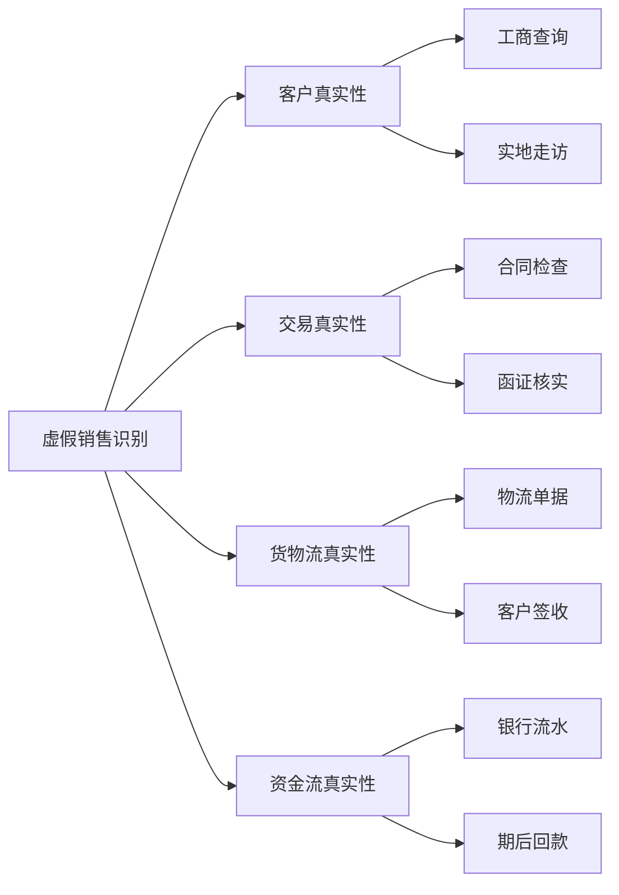

---

#### 7.6.6.2.2 虚假销售检查表（D4-23）

**虚假销售检查表（D4-23）示例：**

```
索引号：D4-23
被审计单位：XXX公司
审计期间：2024年度
科目名称：营业收入 - 虚假销售检查
编制人：[姓名] 编制日期：[日期]
复核人：[姓名] 复核日期：[日期]
金额单位：人民币元

【检查范围确定】
□ 期末零余额但本期有大额交易的客户
□ 大客户（本期销售额>100万且为新客户）
□ 函证未回函或回函异常的客户
□ 第四季度的重大客户
□ 其他高风险客户：_____________

【样本明细】

| 序号 | 客户名称 | 本期销售额 | 期末应收 | 选入原因 | 客户真实性 | 交易真实性 | 货物流 | 资金流 | 综合结论 | 审计调整 | 备注 |
|------|----------|------------|----------|----------|------------|------------|--------|--------|----------|----------|------|
| 1 | 客户F | 3,000,000 | 0 | 零余额大额交易 | ✓ |  |  |  | 真实 | 无 | - |
| 2 | 客户G | 2,500,000 | 500,000 | 大客户 | ✓ |  |  |  | 真实 | 无 | - |
| 3 | 客户H | 1,800,000 |  | 函证未回函 | ✗ |  |  |  | **虚假** | 调减收入180万 | 虚构客户 |
| 4 | 客户I | 1,200,000 | 0 | Q4 | ? |  | ✗ | ✓ | **可疑** | 待进一步核实 | 物流异常 |
| ... |  |  |  |  |  |  |  |  |  |  |  |
```

---

#### 7.6.6.2.3 客户真实性检查

**程序1：工商信息查询**
- **查询内容**：客户名称、统一社会信用代码、注册地址、法定代表人、注册资本、经营状态
- **查询渠道**：国家企业信用信息公示系统、天眼查、企查查等
- **关注要点**：
  - ✓ 客户是否真实存在
  - ✓ 经营状态是否正常（注销、吊销为异常）
  - ✓ 注册资本是否与交易规模匹配
  - ✓ 注册地址是否为异常地址（如居民楼、虚假地址）

**程序2：实地走访或视频访谈（D4-23-2）**
- **走访对象**：期末零余额大额交易客户、大客户、高风险客户
- **走访内容**：
  - ✓ 核实客户经营场所真实性
  - ✓ 访谈客户采购、财务负责人
  - ✓ 了解交易背景、业务往来
  - ✓ 核实关联关系
- **记录要求**：拍照留存（门头、营业场所、访谈现场）、访谈记录签字确认

**实地走访记录表（D4-23-2）示例：**

```
索引号：D4-23-2
被审计单位：XXX公司
走访客户：客户G
走访日期：2025年1月15日
走访人员：审计师XXX、XXX

一、走访基本信息
客户名称：客户G有限公司
注册地址：XX省XX市XX区XX路XX号
实际经营地址：XX省XX市XX区XX路XX号（与注册地一致）
联系人：张三（采购经理）、李四（财务经理）

二、经营场所情况
经营场所面积：约500平方米
主要设施：办公区、仓库区
员工人数：约20人
主营业务：电子元器件贸易

三、业务往来情况
合作起始时间：2024年3月
本期采购金额：250万元
主要采购产品：XX型号芯片
付款方式：货到付款，银行转账
信用期：30天

四、关联关系核实
与被审计单位是否存在关联关系：否
法定代表人、主要股东与被审计单位是否存在关联：否
员工是否存在交叉任职：否

五、其他事项
客户对被审计单位产品质量评价：良好
是否存在退货、质量纠纷：无
未来合作意向：继续合作

六、审计结论
经实地走访，客户G经营场所真实，业务往来真实，不存在关联关系。

七、附件
□ 门头照片
□ 营业场所照片
□ 访谈记录（签字版）
□ 名片

走访人员签字：_________ 日期：_________
```

---

#### 7.6.6.2.4 交易真实性检查

**程序1：销售合同检查**
- **检查内容**：合同真实性、交易条款合理性、是否附有异常条款
- **关注要点**：
  - ⚠️ 合同签字、盖章是否真实
  - ⚠️ 是否存在无条件退货条款
  - ⚠️ 信用期是否异常（如超过1年）
  - ⚠️ 定价是否公允

**程序2：函证核实**
- 对所有高风险客户执行函证（已在7.6.1节执行）
- 重点关注回函异常情况

**程序3：第三方信息核实**
- 向物流公司、仓储公司核实货物运输记录
- 向银行核实资金往来记录

---

#### 7.6.6.2.5 货物流真实性检查

**程序1：物流单据检查**
- **检查单据**：发货单、出库单、物流单、客户签收单
- **检查要点**：
  - ✓ 单据是否连续、完整
  - ✓ 发货数量、金额是否与销售发票一致
  - ✓ 物流公司是否真实存在
  - ✓ 发货地址是否合理（不应为个人住址、空置仓库）

**程序2：物流公司函证或查询**
- 对大额交易，向物流公司函证确认运输记录
- 在物流公司官网或APP查询物流轨迹

**程序3：客户签收单验证**
- **验证内容**：签收人姓名、日期、签字真实性
- **关注要点**：
  - ⚠️ 签收人是否为客户员工（可通过走访核实）
  - ⚠️ 签收日期是否合理
  - ⚠️ 是否存在代签、伪造签字情况

---

#### 7.6.6.2.6 资金流真实性检查

**程序1：期后回款检查**
- **检查期间**：资产负债表日后2-3个月
- **检查证据**：银行流水、收款凭证
- **关注要点**：
  - ✓ 回款金额是否与应收账款余额匹配
  - ✓ 回款方是否为客户本人（不应为第三方代付）
  - ✓ 回款时间是否合理

**程序2：银行流水检查**
- **获取方式**：从被审计单位获取，或直接向银行函证
- **检查要点**：
  - ✓ 核对收款记录与销售发票
  - ✓ 识别异常资金往来（如快进快出、循环转账）

**⚠️ 虚假销售资金流舞弊手段：**
- 第三方代付：客户无力付款,由关联方或第三方代付
- 体外循环：资金先从被审计单位流出,再以销售回款名义流入
- 快进快出：资金在短时间内进出,无真实业务背景

---

#### 7.6.6.2.7 虚假销售综合判断

**判断标准：**

| 检查维度 | 结果 | 风险等级 |
|---------|------|----------|
| 客户真实性 | 工商查询正常、实地走访确认 | ✓ 低风险 |
| 客户真实性 | 工商查询异常（注销、虚假地址） | ✗ 高风险 |
| 交易真实性 | 合同真实、函证相符 | ✓ 低风险 |
| 交易真实性 | 合同可疑、函证不符或未回函 | ✗ 高风险 |
| 货物流 | 物流单据完整、签收真实 | ✓ 低风险 |
| 货物流 | 物流记录缺失、签收异常 | ✗ 高风险 |
| 资金流 | 期后正常回款、银行流水匹配 | ✓ 低风险 |
| 资金流 | 未回款、第三方代付、资金异常 | ✗ 高风险 |

**综合结论：**
- **四流一致**（客户真实、交易真实、货物流真实、资金流真实）→ 销售真实
- **任一流异常** → 需进一步核实
- **多流异常** → **高度怀疑虚假销售，建议调整**

---

### 7.6.6.3 提前确认收入检查（D4-24）

**目的：** 识别在收入确认条件未满足时提前确认收入的舞弊行为。

#### 7.6.6.3.1 提前确认的常见情形

| 情形 | 描述 | 审计应对 |
|------|------|----------|
| **未发货提前确认** | 在货物未发出时确认收入 | 检查发货单、物流记录 |
| **客户未签收提前确认** | 在客户未签收前确认收入 | 检查客户签收单、验收报告 |
| **附退货条款提前确认** | 附有无条件退货条款但仍确认收入 | 检查销售合同退货条款 |
| **分期收款提前确认全额** | 分期收款销售提前确认全部收入 | 检查合同付款条款、收款计划 |
| **试用期销售提前确认** | 客户试用期内即确认收入 | 检查合同试用条款、客户确认函 |
| **委托代销提前确认** | 委托代销商品未售出即确认收入 | 检查代销协议、代销清单 |

---

#### 7.6.6.3.2 提前确认收入检查表（D4-24）

**提前确认收入检查表（D4-24）示例：**

```
索引号：D4-24
被审计单位：XXX公司
审计期间：2024年度
科目名称：营业收入 - 提前确认收入检查
编制人：[姓名] 编制日期：[日期]
复核人：[姓名] 复核日期：[日期]
金额单位：人民币元

【检查范围】
□ 第四季度（尤其12月）确认的收入
□ 附有特殊条款的销售合同
□ 期后退货或质量纠纷的销售
□ 其他高风险收入：_____________

【样本明细】

| 序号 | 客户 | 合同号 | 收入确认日期 | 收入金额 | 发货日期 | 签收日期 | 特殊条款 | 期后退货 | 审计结论 | 调整建议 | 备注 |
|------|------|--------|--------------|----------|----------|----------|----------|----------|----------|----------|------|
| 1 | 客户J | HT001 | 2024-12-28 | 500,000 | 2024-12-29 | 2025-01-05 | 无 |  | 提前确认 | 调减收入50万 | 截止性错误 |
| 2 | 客户K | HT002 | 2024-12-30 | 800,000 |  | 2024-12-31 | 无 |  | 正常 |  | - |
| 3 | 客户L | HT003 | 2024-12-25 | 1,000,000 | 2024-12-26 | 2024-12-28 | 30天试用期 | 期后退货 | 不应确认 | 调减收入100万 | 附试用条款 |
| 4 | 客户M | HT004 | 2024-11-30 | 600,000 |  | 未签收 | 无 |  | 提前确认 | 调减收入60万 |  |
| ... |  |  |  |  |  |  |  |  |  |  |  |

【检查结论】
检查发现X笔提前确认收入,合计XXX万元,建议调减收入。
```

---

#### 7.6.6.3.3 审计程序

**程序1：合同条款检查**
- 重点检查销售合同中的**退货条款、验收条款、付款条款**
- 评估收入确认时点是否符合准则要求

**程序2：截止性测试（结合D4-14）**
- 抽取资产负债表日前后10天的销售记录
- 核对发货单、签收单日期,验证收入确认时点

**程序3：期后退货检查（结合D4-25）**
- 检查期后1-3个月的销售退货记录
- 分析退货原因,判断是否存在提前确认

---

### 7.6.6.4 隐瞒退货检查（D4-25）

**目的：** 识别未记录或延后记录销售退货的舞弊行为。

#### 7.6.6.4.1 隐瞒退货检查表（D4-25）

**隐瞒退货检查表（D4-25）示例：**

```
索引号：D4-25
被审计单位：XXX公司
审计期间：2024年度及期后
科目名称：营业收入 - 隐瞒退货检查
编制人：[姓名] 编制日期：[日期]
复核人：[姓名] 复核日期：[日期]
金额单位：人民币元

【检查程序】
1. 检查期后退货记录（期后3个月）
2. 检查仓库退货入库记录
3. 检查客户投诉、质量纠纷记录
4. 分析退货原因及金额

【期后退货明细】

| 序号 | 客户 | 原销售日期 | 退货日期 | 退货金额 | 退货原因 | 账务处理日期 | 是否延后记录 | 应调整期间 | 审计调整 | 备注 |
|------|------|------------|----------|----------|----------|--------------|--------------|------------|----------|------|
| 1 | 客户N | 2024-12-20 | 2025-01-10 | 300,000 | 质量问题 |  | 否 | - | 无 | 正常处理 |
| 2 | 客户O | 2024-11-15 | 2024-12-28 | 500,000 | 质量问题 | 2025-01-05 | **是** | 2024年12月 | 调减2024年收入50万 | 隐瞒退货 |
| 3 | 客户P | 2024-10-10 | 2024-12-05 | 200,000 | 商业纠纷 |  | 否 | - | 无 | 正常处理 |
| 4 | 客户Q | 2024-12-28 | 2025-01-15 | 400,000 | 未达到约定标准 |  | 否 | - | 无 | 正常处理 |
| ... |  |  |  |  |  |  |  |  |  |  |

【退货分析】
期后3个月退货总额：XXX万元
其中涉及本期销售：XXX万元
延后记录金额：XXX万元
建议调减本期收入：XXX万元
```

---

#### 7.6.6.4.2 审计程序

**程序1：期后退货检查**
- **检查期间**：资产负债表日后3个月
- **检查证据**：销售退回单、红字发票、退款凭证
- **关注要点**：
  - ✓ 退货是否及时入账
  - ✓ 退货原因（质量问题、商业纠纷等）
  - ✓ 大额退货需追查原销售交易

**程序2：仓库退货入库检查**
- 获取仓库退货入库记录
- 核对退货入库日期与账务处理日期
- 识别已入库但未账务处理的退货

**程序3：客户投诉、质量纠纷检查**
- 获取客户投诉记录、质量纠纷清单
- 检查是否已相应调整收入

---

### 7.6.6.5 循环交易检查（D4-26）

**目的：** 识别通过关联方或第三方进行无商业实质的对倒交易。

#### 7.6.6.5.1 循环交易特征

**典型模式：**
```
被审计单位 → 客户A → 客户B → ... → 被审计单位（采购）
   (销售)      (销售)    (销售)          (资金回流)
```

**舞弊特征：**
- 交易链条闭环，资金最终回流
- 交易价格明显不公允
- 无真实商业背景
- 交易时间、金额高度一致

---

#### 7.6.6.5.2 循环交易检查表（D4-26）

**循环交易检查表（D4-26）示例：**

```
索引号：D4-26
被审计单位：XXX公司
审计期间：2024年度
科目名称：营业收入 - 循环交易检查
编制人：[姓名] 编制日期：[日期]
复核人：[姓名] 复核日期：[日期]
金额单位：人民币元

【检查方法】
1. 分析销售客户与采购供应商重叠情况
2. 检查关联方交易闭环
3. 分析资金流向
4. 核实交易商业实质

【可疑循环交易分析】

| 交易链 | 各环节金额 | 交易日期 | 资金流向 | 商业实质 | 审计结论 | 调整建议 | 备注 |
|--------|------------|----------|----------|----------|----------|----------|------|
| 被审计单位→客户R→供应商S→被审计单位 | 销售1000万/采购950万 | 同一季度 | 资金闭环 | **无** | 循环交易 | 调减收入1000万 | 无真实业务 |
| 被审计单位→关联方T→客户U→被审计单位 | 销售500万/采购480万 | 同一月份 | 资金闭环 | **无** | 循环交易 | 调减收入500万 | 关联方对倒 |
| 被审计单位→客户V→被审计单位 | 销售600万/采购600万 | 相隔3天 | 资金闭环 | **无** | 循环交易 | 调减收入600万 | 直接对倒 |
| ... |  |  |  |  |  |  |  |

【资金流向图】
（可附上资金流向示意图,清晰展示循环路径）
```

---

#### 7.6.6.5.3 审计程序

**程序1：客户与供应商交叉比对**
- 获取销售客户清单和采购供应商清单
- 识别重叠部分（既是客户又是供应商）
- 重点检查重叠对象的交易金额、时间

**程序2：关联方交易闭环检查**
- 绘制关联方交易流程图
- 识别资金流向闭环

**程序3：资金流向追踪**
- 检查银行流水，追踪资金最终流向
- 识别异常资金往来（如短时间内大额进出）

**程序4：商业实质评估**
- 访谈管理层，了解交易背景和商业目的
- 评估交易定价公允性
- 检查是否有真实货物或服务交付

---

### 7.6.6.6 渠道压货检查（D4-27）

**目的：** 识别向经销商压货、附有退货或回购条款但仍确认收入的舞弊行为。

#### 7.6.6.6.1 渠道压货特征

**舞弊手法：**
- 向经销商大量发货（超过其正常销售能力）
- 附有无条件退货或回购条款
- 提供特殊的信用政策或返利激励
- 期后大量退货或滞销

**识别迹象：**
- ⚠️ 第四季度（尤其12月）经销商销售额激增
- ⚠️ 经销商库存异常增加
- ⚠️ 经销商期后大量退货
- ⚠️ 销售合同附有特殊退货条款

---

#### 7.6.6.6.2 渠道压货检查表（D4-27）

**渠道压货检查表（D4-27）示例：**

```
索引号：D4-27
被审计单位：XXX公司
审计期间：2024年度
科目名称：营业收入 - 渠道压货检查
编制人：[姓名] 编制日期：[日期]
复核人：[姓名] 复核日期：[日期]
金额单位：人民币元

【检查对象】
重点检查经销商、代理商渠道销售

【经销商销售及库存分析】

| 经销商名称 | Q1销售额 | Q2销售额 | Q3销售额 | Q4销售额 | Q4占比 | 期末库存 | 期后退货 | 退货条款 | 审计结论 | 调整建议 | 备注 |
|------------|----------|----------|----------|----------|--------|----------|----------|----------|----------|----------|------|
| 经销商X | 1,000,000 | 1,200,000 | 1,100,000 | **5,000,000** | **62%** | 3,000,000 | 2,500,000 | 90天无条件退货 | **压货** | 调减Q4收入500万 | 明显异常 |
| 经销商Y | 800,000 | 900,000 | 850,000 | 1,000,000 | 28% | 200,000 | 0 | 无特殊条款 | 正常 | 无 | - |
| 经销商Z | 500,000 | 600,000 | 550,000 | **3,000,000** | **70%** | 2,200,000 | 1,800,000 | 6个月内可退货 | **压货** | 调减Q4收入300万 | 期后大量退货 |
| ... |  |  |  |  |  |  |  |  |  |  |  |

【检查程序记录】
1. 合同条款检查：检查经销商合同退货、返利、回购条款
2. 库存函证：向经销商函证期末库存数量
3. 期后退货检查：检查期后3-6个月退货情况
4. 访谈经销商：了解库存消化情况、是否存在压货
```

---

#### 7.6.6.6.3 审计程序

**程序1：经销商销售波动分析**
- 分析各经销商季度销售额
- 识别第四季度销售额异常增长的经销商（如Q4占比>50%）

**程序2：合同条款检查**
- 重点检查经销商合同的退货条款、返利政策、回购安排
- 评估收入确认是否符合准则（如附有无条件退货条款，可能不应确认收入）

**程序3：库存函证**
- 向经销商函证期末库存数量
- 评估库存是否异常积压

**程序4：期后退货检查**
- 检查期后3-6个月经销商退货情况
- 分析退货原因（如"滞销"、"超出销售能力"）

**程序5：访谈经销商**
- 访谈经销商销售、库存管理人员
- 了解库存消化情况、是否受压销售

---

### 7.6.6.7 舞弊应对程序的不可预见性

#### 7.6.6.7.1 不可预见性原则

**《审计准则第1141号》要求：**
> 在应对评估的由于舞弊导致的重大错报风险时，注册会计师应当设计和实施**具有不可预见性**的审计程序。

**核心要求：**
- 审计程序的性质、时间、范围应具有不可预见性
- 不能让被审计单位提前知道审计计划
- 改变常规审计程序，采用突击检查、不事先通知等方式

---

#### 7.6.6.7.2 不可预见性措施

**措施1：突击盘点**
- 不事先通知，突击盘点存货、现金、票据
- 选择非常规时点（如非资产负债表日）

**措施2：扩大函证范围**
- 对零余额客户执行函证
- 对小额客户随机抽样函证

**措施3：改变审计程序顺序**
- 先执行实质性程序，再了解内部控制
- 打乱常规审计流程

**措施4：现场突击检查**
- 不事先预约，突然访问客户
- 现场查看仓库、生产线

**措施5：数据分析**
- 使用数据分析软件，全量检查异常交易
- 识别异常模式（如周末交易、深夜交易）

---

### 7.6.6.8 舞弊应对总结与报告

#### 7.6.6.8.1 舞弊风险评估结论

**舞弊风险评估总结（底稿示例）：**

```
一、舞弊风险识别
经风险评估，我们识别出以下收入舞弊风险：
1. 虚假销售风险：重点关注零余额大额交易客户、大客户
2. 提前确认收入风险：重点关注第四季度收入、附特殊条款销售
3. 隐瞒退货风险：重点关注期后退货、质量纠纷
4. 循环交易风险：重点关注关联方交易、客户与供应商重叠
5. 渠道压货风险：重点关注经销商Q4销售激增、期后退货

二、舞弊应对程序
针对上述风险，我们设计并实施了以下专项应对程序：
1. D4-23 虚假销售检查：检查XX笔，发现虚假销售X笔，金额XXX万元
2. D4-24 提前确认收入检查：检查XX笔，发现提前确认X笔，金额XXX万元
3. D4-25 隐瞒退货检查：检查期后退货XX笔，发现隐瞒退货X笔，金额XXX万元
4. D4-26 循环交易检查：检查XX条交易链，发现循环交易X条，金额XXX万元
5. D4-27 渠道压货检查：检查XX家经销商，发现压货X家，金额XXX万元

三、审计发现与调整
经舞弊应对程序，我们发现以下重大舞弊迹象：
1. 客户H虚假销售180万元（已建议调整）
2. 客户L提前确认收入100万元（已建议调整）
3. 经销商X渠道压货500万元（已建议调整）
4. ...

累计建议调减收入：XXX万元

四、审计结论
通过执行舞弊应对程序，我们获取了充分、适当的审计证据。
调整后的收入金额为XXX万元，符合企业会计准则的规定。

五、管理层舞弊责任
我们已将上述舞弊发现告知管理层和治理层。
管理层对舞弊责任的回应：[记录管理层声明]
```

---

#### 7.6.6.8.2 与治理层沟通

**沟通事项：**
- 舞弊风险识别结果
- 舞弊应对程序及发现
- 重大舞弊迹象（如存在）
- 管理层凌驾控制的情况
- 对审计报告的影响

**沟通方式：**
- 正式书面沟通（审计管理建议书）
- 与治理层会议沟通

---

### 💡 舞弊应对实用技巧

**技巧1：保持职业怀疑**
- ✓ 对管理层陈述保持质疑，不轻信口头解释
- ✓ 对异常数据和情况深入追查
- ✓ 即使找到"合理解释"，也要获取充分证据支持

**技巧2：多种手段综合运用**
- ✓ 函证+实地走访+资金流检查=三位一体
- ✓ 不依赖单一证据，交叉验证
- ✓ 充分利用外部信息（工商、物流、银行）

**技巧3：关注异常模式**
- ✓ 第四季度收入激增 → 提前确认、压货风险
- ✓ 零余额大额交易 → 虚假销售、资金体外循环
- ✓ 关联方交易频繁 → 循环交易、利益输送

**技巧4：数据分析辅助**
- ✓ 使用Excel、SQL等工具全量分析异常交易
- ✓ 识别异常时间（周末、深夜）、异常金额（整数、重复）

---

### ⚠️ 舞弊应对常见错误提醒

❌ **错误1：认为收入舞弊风险可以推翻**
✅ 正确：收入舞弊风险是审计准则推定的，除非有充分理由，否则不能推翻。

❌ **错误2：仅依赖函证应对舞弊风险**
✅ 正确：函证可能被串通，必须结合实地走访、资金流检查等多种手段。

❌ **错误3：舞弊应对程序提前告知被审计单位**
✅ 正确：舞弊应对程序应具有不可预见性，不能提前通知。

❌ **错误4：对管理层解释轻易接受**
✅ 正确：对异常情况，即使管理层提供解释，也要获取充分证据支持。

❌ **错误5：发现舞弊但未及时沟通治理层**
✅ 正确：发现舞弊迹象，应及时与治理层沟通，并评估对审计报告的影响。

---
## 7.6.7 新收入准则应用检查（D4-18至D4-22）

> **📋 本节核心要点**
>
> - ✅ 新收入准则（CAS 14/IFRS 15）要求采用**五步法模型**确认收入
> - ✅ 必须充分识别**履约义务**，判断是"在某一时点"还是"在某一时段"转移
> - ✅ **可变对价**（折扣、返利、退货权）需谨慎估计并约束确认
> - ✅ 重点关注**主要责任人vs代理人**、**合同合并拆分**等特殊判断
>
> **关键底稿：** D4-18五步法应用检查、D4-19履约义务识别、D4-20交易价格分摊、D4-21特殊销售处理、D4-22收入确认政策检查
>
> **风险提示：** ⚠️ 新收入准则应用涉及大量会计判断，是收入确认差错和舞弊的高发领域

---

## 7.6.7.1 新收入准则核心要求

### 7.6.7.1.1 五步法模型

**《企业会计准则第14号——收入》（2017年修订）规定的五步法：**

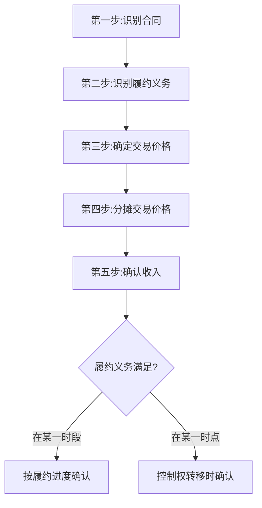

**五步法详解：**

| 步骤 | 核心要求 | 关键判断 | 审计重点 |
|------|----------|----------|----------|
| **第一步：识别合同** | 合同具有商业实质,各方批准并承诺履行,能够识别权利和义务,支付条款明确,收回对价可能性大 | 多份合同是否应合并?口头合同是否有效? | D4-18-1 合同识别检查 |
| **第二步：识别履约义务** | 识别合同中承诺向客户转让的可明确区分商品或服务 | 商品/服务是否可明确区分?是否应合并或拆分? | D4-19 履约义务识别表 |
| **第三步：确定交易价格** | 确定为转让商品或服务有权收取的对价金额(扣除可变对价、重大融资成分、非现金对价、应付客户对价) | 可变对价(折扣、返利、退货)如何估计和约束? | D4-20-1 交易价格确定表 |
| **第四步：分摊交易价格** | 按各单项履约义务的单独售价比例分摊交易价格 | 单独售价如何确定?如何分摊? | D4-20-2 交易价格分摊表 |
| **第五步：确认收入** | 在履行履约义务时(控制权转移时)确认收入 | 控制权何时转移?"时段"还是"时点"? | D4-18-2 收入确认时点检查 |

---

### 7.6.7.1.2 新旧准则主要差异

| 对比维度 | 旧准则(风险报酬转移) | 新准则(控制权转移) | 审计影响 |
|----------|---------------------|-------------------|----------|
| **核心理念** | 风险和报酬是否转移 | 控制权是否转移 | 控制权判断更复杂,需更多职业判断 |
| **确认模型** | 收入、成本、进度分别考虑 | 五步法统一框架 | 需逐步检查五步法应用 |
| **履约义务** | 无明确概念 | 必须识别单项履约义务 | 需检查履约义务识别的完整性 |
| **可变对价** | 很可能流入时确认 | 估计+约束(不应转回) | 可变对价估计的合理性更关键 |
| **主要责任人vs代理人** | 无明确指引 | 详细判断标准 | 需重点检查佣金、平台模式等 |
| **合同资产/负债** | 预收账款、应收账款 | 合同资产、合同负债 | 列报分类需核查 |

---

## 7.6.7.2 五步法应用检查（D4-18）

### 7.6.7.2.1 第一步：合同识别检查（D4-18-1）

**审计程序：**

**1. 合同有效性检查**

**合同识别检查表（D4-18-1）示例：**

```
索引号：D4-18-1
被审计单位：XXX公司
审计期间：2024年度
科目名称：营业收入 - 合同识别检查
编制人：[姓名] 编制日期：[日期]
复核人：[姓名] 复核日期：[日期]

【检查标准】
合同应同时满足以下条件:
□ 合同各方已批准该合同并承诺履行各自义务
□ 该合同明确了各方与所转让商品或服务相关的权利和义务
□ 该合同有明确的与所转让商品或服务相关的支付条款
□ 该合同具有商业实质(交易将改变企业未来现金流量的风险、时间或金额)
□ 企业因向客户转让商品或服务而有权取得的对价很可能收回

【样本检查】

| 合同编号 | 客户 | 合同金额 | 各方批准? | 权利义务明确? | 支付条款明确? | 商业实质? | 对价可收回? | 合同有效性 | 备注 |
|----------|------|----------|----------|--------------|--------------|----------|------------|----------|------|
| HT001 | 客户A | 5,000,000 | ✓ |  |  |  |  | 有效 | - |
| HT002 | 客户B | 3,000,000 | ✓ |  |  |  |  | 有效 | - |
| HT003 | 客户C | 1,000,000 | ✓ |  |  | ✗ |  | **无效** | 无商业实质(关联方平价交易) |
| 口头协议 | 客户D | 500,000 | ? | ✗ |  | ✓ |  | **存疑** | 无书面合同,需获取其他证据 |
| ... |  |  |  |  |  |  |  |  |  |

【特殊情形】
1. 口头合同:虽无书面合同,但如有其他证据(订单、发货单、付款记录)证明合同成立,仍可确认收入
2. 关联方交易:需特别关注商业实质和定价公允性
3. 或有对价:对价收回可能性需谨慎评估
```

**2. 合同合并与拆分判断**

**合同合并条件（满足以下任一条件应合并）：**
- 同一客户同时或相近时间订立的多份合同作为一揽子交易进行谈判
- 一份合同的对价金额取决于另一份合同的定价或履行情况
- 多份合同承诺的商品或服务构成单项履约义务

**合同拆分条件：**
- 合同包含多项承诺,且各项承诺可明确区分

**合同合并拆分检查表：**

| 情形 | 客户 | 合同情况 | 判断 | 会计处理 | 审计结论 | 备注 |
|------|------|----------|------|----------|----------|------|
| 多份合同 | 客户E | HT010销售设备500万+HT011安装调试50万(同日签订) | 应合并 | 合并后按履约义务分摊 | 正确 | 一揽子交易 |
| 单份合同 | 客户F | HT012销售+3年维保(一份合同) | 应拆分 | 拆分为销售和服务两项履约义务 | 正确 | 可明确区分 |
| 框架协议 | 客户G | 年度框架协议+多个订单 | 按订单单独核算 | 各订单单独确认收入 | 正确 | 订单独立 |

---

### 7.6.7.2.2 第二步：履约义务识别检查（D4-19）

**目的：** 检查企业是否正确识别了合同中的单项履约义务。

**履约义务识别检查表（D4-19）示例：**

```
索引号：D4-19
被审计单位：XXX公司
审计期间：2024年度
科目名称：营业收入 - 履约义务识别
编制人：[姓名] 编制日期：[日期]
复核人：[姓名] 复核日期：[日期]

【识别标准】
商品或服务可明确区分,需同时满足:
1. 客户能够从该商品或服务本身或结合其他易于获得的资源中受益(可明确区分的"能力")
2. 企业向客户转让该商品或服务的承诺与合同中其他承诺可单独区分(可明确区分的"独立性")

【履约义务识别】

| 合同 | 合同承诺 | 是否可明确区分? | 识别的履约义务 | 企业处理 | 审计结论 | 备注 |
|------|----------|----------------|--------------|----------|----------|------|
| HT020 | 销售设备 | ✓ | 1项:销售设备 | 单项履约义务 | ✓ 正确 | - |
| HT021 | 销售设备+安装 | 安装可明确区分? → ✓ | 2项:①销售设备 ②安装服务 | 两项履约义务 | ✓ 正确 | 安装可由第三方提供 |
| HT022 | 销售定制设备+安装调试 | 安装不可区分 | 1项:销售+安装整体 | 单项履约义务 | ✓ 正确 | 高度定制,不可分离 |
| HT023 | 销售商品+3年维保 | ✓ | 2项:①销售商品 ②维保服务 | 两项履约义务 | ✓ 正确 | 维保可单独购买 |
| HT024 | 销售软件+首年免费升级 | 升级是否单独? → ✗ | 1项:软件含升级 | 企业按2项处理 | **✗ 错误** | 免费升级非单独履约义务 |
| HT025 | 销售+运输 | 运输可明确区分? → ✗ | 1项:销售含运输 | 单项履约义务 | ✓ 正确 | 运输为履行合同的必要活动 |

【常见错误】
1. 将赠品、折扣误认为单独履约义务
2. 将必要的辅助活动(如运输)误认为单独履约义务
3. 未识别隐含的履约义务(如退货权、质保)
```

**履约义务识别流程图：**

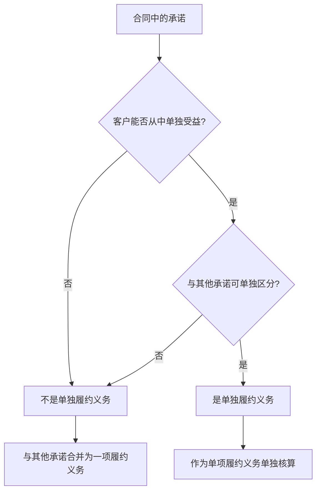

---

### 7.6.7.2.3 第三步：交易价格确定检查（D4-20-1）

**目的：** 检查企业是否正确确定了交易价格,包括可变对价、重大融资成分等调整。

**交易价格确定检查表（D4-20-1）示例：**

```
索引号：D4-20-1
被审计单位：XXX公司
审计期间：2024年度
科目名称：营业收入 - 交易价格确定
编制人：[姓名] 编制日期：[日期]
复核人：[姓名] 复核日期：[日期]

【交易价格组成】
交易价格 = 合同对价 - 可变对价调整 - 重大融资成分 - 应付客户对价 + 非现金对价调整

【样本检查】

| 合同 | 合同对价 | 可变对价 | 融资成分 | 应付客户对价 | 非现金对价 | 交易价格(企业) | 交易价格(审计) | 差异 | 调整建议 |
|------|----------|----------|----------|--------------|------------|---------------|---------------|------|----------|
| HT030 | 10,000,000 | 销量折扣-500,000 | 0 |  |  | 9,500,000 |  |  | - |
| HT031 | 5,000,000 | 预计退货-200,000 | 0 | 年终返利-100,000 |  | 4,900,000 | 4,700,000 | 200,000 | 少扣除返利 |
| HT032 | 8,000,000 | 0 | 2年分期-融资400,000 |  |  |  | 7,600,000 | 400,000 | 未扣除融资成分 |
| HT033 | 3,000,000 | 或有对价+500,000 | 0 |  |  | 3,500,000 |  | 500,000 | 或有对价不应计入 |

【可变对价检查】
```

**1. 可变对价类型及处理**

| 可变对价类型 | 估计方法 | 约束条件 | 审计重点 |
|-------------|----------|----------|----------|
| **现金折扣** | 期望值法或最可能发生金额法 | 极可能不会发生重大转回 | 历史折扣率、信用政策 |
| **销量折扣/返利** | 基于预计销量估计 | 极可能不会发生重大转回 | 销量预测合理性、历史数据 |
| **退货权** | 基于历史退货率估计 | 极可能不会发生重大转回 | 历史退货率、产品特性 |
| **价格保护** | 基于市场价格波动估计 | 极可能不会发生重大转回 | 市场趋势、合同条款 |
| **或有对价** | 基于实现可能性估计 | **高度不确定时不应计入** | 实现条件、历史经验 |
| **奖励积分** | 基于单独售价分摊 | - | 积分价值评估、兑换率 |

**2. 可变对价约束测试**

**可变对价约束检查表：**

```
【可变对价约束测试】

可变对价类型: 销量返利
合同约定: 全年销售额达5000万,返利2%
本期已确认销售: 3000万元
预计全年销售: 5500万元(能达标)
预计返利: 5500万×2% = 110万元
本期应扣除: 3000万×2% = 60万元

约束测试:
□ 预测依据充分(历史销量趋势、订单情况) → ✓
□ 累计已确认收入在未来极可能不会发生重大转回 → ✓
□ 管理层估计合理谨慎 → ✓

审计结论: 可变对价估计及约束合理,可以确认
```

**3. 重大融资成分检查**

**判断标准：**
- 合同约定的付款时间与转让商品或服务的时间间隔超过1年
- 且融资的影响重大

**融资成分检查示例：**

| 合同 | 合同对价 | 付款安排 | 转让时间 | 时间间隔 | 折现率 | 融资成分 | 交易价格 | 审计结论 |
|------|----------|----------|----------|----------|--------|----------|----------|----------|
| HT040 | 10,000,000 | 2年后一次付清 | 交货即转移 | 2年 | 5% | -952,381 | 9,047,619 | 需调整 |
| HT041 | 5,000,000 | 6个月后付款 | 交货即转移 | 6个月 | - | 不重大 |  | 无需调整 |

---

### 7.6.7.2.4 第四步：交易价格分摊检查（D4-20-2）

**目的：** 对于包含多项履约义务的合同,检查交易价格是否按单独售价比例正确分摊。

**交易价格分摊检查表（D4-20-2）示例：**

```
索引号：D4-20-2
被审计单位：XXX公司
审计期间：2024年度
科目名称：营业收入 - 交易价格分摊
编制人：[姓名] 编制日期：[日期]
复核人：[姓名] 复核日期：[日期]

【分摊原则】
按各单项履约义务的单独售价比例分摊交易价格

【示例1: 设备销售+安装服务】

合同编号: HT050
客户: 客户H
交易价格: 5,500,000元(已扣除可变对价)

履约义务识别:
① 销售设备
② 安装服务

| 履约义务 | 单独售价 | 占比 | 分摊金额(企业) | 分摊金额(审计) | 差异 | 审计结论 |
|----------|----------|------|---------------|---------------|------|----------|
| ① 销售设备 | 5,000,000 | 83.33% | 4,583,150 | 4,583,333 | -183 | 基本正确(尾差) |
| ② 安装服务 | 1,000,000 | 16.67% | 916,850 | 916,667 | 183 | 基本正确(尾差) |
| **合计** | **6,000,000** | **100%** | **5,500,000** |  | **0** | ✓ |

单独售价确定方法:
① 设备: 可观察价格(单独销售价5,000,000元)
② 安装: 可观察价格(单独报价1,000,000元)

【示例2: 软件销售+3年维保】

合同编号: HT051
客户: 客户I
交易价格: 3,000,000元

履约义务识别:
① 销售软件(在某一时点转移)
② 3年维保服务(在某一时段转移)

| 履约义务 | 单独售价 | 确定方法 | 占比 | 分摊金额 | 收入确认时间 |
|----------|----------|----------|------|----------|-------------|
| ① 销售软件 | 2,400,000 | 市场调整法 | 80% |  | 交付时一次确认 |
| ② 维保服务 | 600,000 | 成本加成法 | 20% |  | 3年按期间分摊 |
| **合计** | **3,000,000** |  | **100%** |  |  |

本期(2024年)应确认收入:
软件: 2,400,000元(一次确认)
维保: 600,000 ÷ 3年 = 200,000元(2024年度部分)
**合计: 2,600,000元**

企业实际确认: 3,000,000元(全额确认)
审计调整: 调减收入400,000元(多确认的维保收入)
```

**单独售价确定方法：**

| 方法 | 适用情形 | 具体做法 | 示例 |
|------|----------|----------|------|
| **可观察价格** | 商品或服务单独销售 | 直接采用单独售价 | 设备单独售价500万 |
| **市场调整法** | 可获取竞争对手价格 | 参考市场类似商品价格并调整 | 同类软件市场价200-250万,调整后确定240万 |
| **成本加成法** | 无可观察价格 | 预计成本+合理毛利 | 维保成本40万,加成50%,确定60万 |
| **余值法** | 仅某一项无单独售价 | 交易价格减去其他项单独售价 | 总价300万,已知A为200万,则B为100万 |

---

### 7.6.7.2.5 第五步：收入确认时点检查（D4-18-2）

**目的：** 检查企业是否在正确的时点或期间确认收入。

**核心判断：在某一时段 vs 在某一时点**

**在某一时段内确认收入的条件(满足以下任一条件)：**

| 条件 | 描述 | 典型业务 | 确认方法 |
|------|------|----------|----------|
| **条件1** | 客户在企业履约的同时即取得并消耗企业履约所带来的经济利益 | 保洁服务、运输服务 | 按履约进度确认 |
| **条件2** | 客户能够控制企业履约过程中在建的商品 | 在客户场地建造的资产 | 按履约进度确认 |
| **条件3** | 企业履约过程中所产出的商品具有不可替代用途,且企业在整个合同期间内有权就累计至今已完成的履约部分收取款项 | 定制化产品(不可转售) | 按履约进度确认 |

**在某一时点确认收入的判断指标:**

- ✓ 企业就该商品享有现时收款权利
- ✓ 企业已将该商品的法定所有权转移给客户  
- ✓ 企业已将该商品实物转移给客户
- ✓ 企业已将该商品所有权上的主要风险和报酬转移给客户
- ✓ 客户已接受该商品

**收入确认时点检查表（D4-18-2）示例：**

```
索引号：D4-18-2
被审计单位：XXX公司
审计期间：2024年度
科目名称：营业收入 - 收入确认时点检查
编制人：[姓名] 编制日期：[日期]
复核人：[姓名] 复核日期：[日期]

【业务类型1: 标准产品销售】

| 合同 | 业务模式 | 控制权转移判断 | 应在何时确认 | 企业确认时点 | 审计结论 |
|------|----------|---------------|-------------|-------------|----------|
| HT060 | 出口FOB | 商品装船,报关完成 | 某一时点:装船日 | 装船日 | ✓ 正确 |
| HT061 | 国内销售 | 客户验收签字 | 某一时点:签收日 | 签收日 | ✓ 正确 |
| HT062 | 寄售模式 | 客户领用/销售时 | 某一时点:领用日 | 发货日 | **✗ 错误** (提前确认) |
| HT063 | 附退货权 | 退货期满时 | 某一时点:退货期满日 | 发货日 | **✗ 错误** (提前确认) |

【业务类型2: 建造合同/定制产品】

| 合同 | 产品特性 | 不可替代用途? | 有权收款? | 应在何时确认 | 企业处理 | 审计结论 |
|------|----------|--------------|----------|-------------|----------|----------|
| HT070 | 定制设备(高度定制) | ✓ | ✓(合同约定阶段付款) | 某一时段:按进度 | 按进度确认 | ✓ 正确 |
| HT071 | 定制软件 | ✓ | ✓(里程碑付款) | 某一时段:按进度 | 按进度确认 | ✓ 正确 |
| HT072 | 定制产品(可转售) | ✗ | - | 某一时点:交付时 | 按进度确认 | **✗ 错误** |

【业务类型3: 提供服务】

| 合同 | 服务类型 | 客户同时消耗? | 应在何时确认 | 企业处理 | 审计结论 |
|------|----------|--------------|-------------|----------|----------|
| HT080 | 软件维保(3年) | ✓ | 某一时段:按期间 | 按月均摊 | ✓ 正确 |
| HT081 | 咨询服务 | ✓ | 某一时段:按进度 | 按工时确认 | ✓ 正确 |
| HT082 | 一次性安装 | ✗ | 某一时点:完工验收 | 完工验收时 | ✓ 正确 |
```

---

## 7.6.7.3 特殊销售业务处理检查（D4-21）

### 7.6.7.3.1 主要责任人vs代理人判断（D4-21-1）

**判断标准（关键）：**
- **主要责任人**：在商品转让给客户**之前**控制该商品 → 按**总额法**确认收入
- **代理人**：不控制商品,仅安排另一方提供商品 → 按**净额法**确认收入(佣金/手续费)

**控制权判断指标：**

| 指标 | 主要责任人 | 代理人 |
|------|-----------|--------|
| **承担主要责任** | 负有向客户提供商品的主要责任 | 不承担主要责任 |
| **存货风险** | 在转让前后承担存货风险 | 不承担存货风险 |
| **定价权** | 有权自主决定价格 | 无定价权(供应商定价) |

**主要责任人vs代理人检查表（D4-21-1）示例：**

```
索引号：D4-21-1
被审计单位：XXX公司
审计期间：2024年度
科目名称：营业收入 - 主要责任人vs代理人
编制人：[姓名] 编制日期：[日期]
复核人：[姓名] 复核日期：[日期]

【业务模式1: 电商平台】

业务描述: 公司运营电商平台,商家入驻销售商品
交易金额: 平台成交1000万元,收取5%佣金50万元

| 判断指标 | 情况描述 | 主要责任人? |
|---------|----------|-----------|
| 承担主要责任 | 客户纠纷由商家处理,平台不承担 | ✗ |
| 存货风险 | 商品由商家发货,平台不持有存货 | ✗ |
| 定价权 | 商家自主定价,平台无权干预 | ✗ |

**判断结论: 代理人**
应确认收入: 50万元(佣金,净额法)
企业实际处理: 1000万元(总额法)
**审计调整: 调减收入950万元,调减成本950万元**

【业务模式2: 贸易采购+转售】

业务描述: 公司采购商品后转售给客户
交易金额: 采购成本800万,销售价1000万

| 判断指标 | 情况描述 | 主要责任人? |
|---------|----------|-----------|
| 承担主要责任 | 公司承担售后、退换货责任 | ✓ |
| 存货风险 | 公司采购后持有存货,承担跌价风险 | ✓ |
| 定价权 | 公司自主定价销售 | ✓ |

**判断结论: 主要责任人**
应确认收入: 1000万元(总额法)
企业实际处理: 1000万元(总额法)
**审计结论: ✓ 正确**

【业务模式3: 平台自营+第三方并存】

业务描述: 公司既有自营商品,也有平台第三方商品
自营交易: 800万元(含成本600万)
平台佣金: 200万元(第三方成交2000万,收取10%)

企业处理: 
自营收入: 800万元 ✓
平台收入: 200万元 ✓
**审计结论: ✓ 正确(已正确区分)**
```

**常见错误：**
- ❌ 电商平台按成交总额确认收入(应按佣金确认)
- ❌ 受托代销按销售总额确认收入(应按手续费确认)
- ❌ 旅行社代订机票酒店按总额确认(应按佣金确认)

---

### 7.6.7.3.2 附有销售退回条款的销售（D4-21-2）

**处理原则：**
- 按照因向客户转让商品而预期有权收取的对价金额(扣除预期退货金额)确认收入
- 按照预期将退回商品转让时的账面价值,扣除收回该商品预计发生的成本确认资产(应收退货成本)
- 按照预期因销售退回将退还的金额确认负债(应退货款)

**附退货权销售检查表（D4-21-2）示例：**

```
索引号：D4-21-2
被审计单位：XXX公司
审计期间:2024年度
科目名称:营业收入 - 附退货权销售
编制人:[姓名] 编制日期:[日期]
复核人:[姓名] 复核日期:[日期]

【案例:试销模式】

合同编号: HT090
销售日期: 2024-12-01
销售金额: 1,000,000元
销售成本: 600,000元
退货期: 3个月(至2025年2月28日)
历史退货率: 10%

【会计处理测试】

预期退货金额: 1,000,000 × 10% = 100,000元
预期退货成本: 600,000 × 10% = 60,000元

应确认收入: 1,000,000 - 100,000 = 900,000元
应确认成本: 600,000 - 60,000 = 540,000元
应确认资产(应收退货成本): 60,000元
应确认负债(应退货款): 100,000元

企业实际处理:
借:应收账款 1,000,000
  贷:主营业务收入 1,000,000

借:主营业务成本 600,000
  贷:库存商品 600,000

**审计调整:**
调减收入: 100,000元
调减成本: 60,000元
确认应收退货成本: 60,000元
确认应退货款: 100,000元

调整分录:
借:主营业务收入 100,000
  贷:应退货款 100,000

借:应收退货成本 60,000
  贷:主营业务成本 60,000
```

---

### 7.6.7.3.3 附有质量保证条款的销售（D4-21-3）

**质量保证分类：**

| 质量保证类型 | 定义 | 会计处理 | 示例 |
|-------------|------|----------|------|
| **保证类质量保证** | 向客户保证商品符合约定标准 | 按《企业会计准则第13号——或有事项》确认预计负债,不作为单独履约义务 | 法定三包、1年免费维修 |
| **服务类质量保证** | 向客户提供了一项单独的服务 | 作为单独履约义务,分摊交易价格并在保证期内确认收入 | 单独购买的延长保修服务 |

**质量保证检查表（D4-21-3）示例：**

```
【案例1:保证类质量保证】

合同: HT095
销售设备: 5,000,000元
免费质保: 1年(法定要求)

判断: 保证类质量保证(非单独履约义务)

企业处理: 
收入: 5,000,000元 ✓
预计负债: 100,000元(预计保修成本) ✓

审计结论: ✓ 正确

【案例2:服务类质量保证】

合同: HT096
销售设备: 5,000,000元
标准质保: 1年(免费)
延长质保: 2年(客户可选,单独售价500,000元)

判断: 
1年质保 → 保证类
2年延长质保 → 服务类(单独履约义务)

应确认收入:
设备+1年质保: 5,000,000 × (5,000,000/5,500,000) = 4,545,455元
2年延长质保: 5,000,000 × (500,000/5,500,000) = 454,545元(分2年确认)

企业实际处理: 
一次确认收入5,000,000元

**审计调整:**
调减2024年收入: 454,545元(延保部分应递延)
```

---

### 7.6.7.3.4 授予客户额外权利的销售(客户奖励积分)(D4-21-4)

**处理原则:**
- 客户奖励积分构成单独履约义务
- 按奖励积分的单独售价占比分摊交易价格
- 在客户兑换积分时确认收入

**客户奖励积分检查表(D4-21-4)示例:**

```
索引号: D4-21-4
被审计单位: XXX公司
审计期间: 2024年度
科目名称: 营业收入 - 客户奖励积分
编制人: [姓名] 编制日期: [日期]
复核人: [姓名] 复核日期: [日期]

【案例:会员积分计划】

2024年销售: 100,000,000元
获得积分: 10,000,000分
积分价值: 1分=0.5元(单独售价5,000,000元)
历史兑换率: 80%

【会计处理测试】

交易价格分摊:
销售商品: 100,000,000 × (100,000,000/105,000,000) = 95,238,095元
奖励积分: 100,000,000 × (5,000,000/105,000,000) = 4,761,905元

2024年应确认:
商品收入: 95,238,095元(一次确认)
积分收入: 需根据兑换情况逐步确认

假设2024年兑换: 2,000,000分(20%)
积分收入: 4,761,905 × 20% = 952,381元

2024年合计应确认收入: 95,238,095 + 952,381 = 96,190,476元

企业实际处理:
2024年确认收入: 100,000,000元(全额确认)

**审计调整:**
调减收入: 3,809,524元(未兑换积分应递延)

调整分录:
借: 主营业务收入 3,809,524
  贷: 合同负债 3,809,524
```

---

## 7.6.7.4 收入确认政策检查(D4-22)

### 7.6.7.4.1 收入确认政策文档检查

**检查内容:**

```
索引号: D4-22
被审计单位: XXX公司
审计期间: 2024年度
科目名称: 营业收入 - 收入确认政策检查
编制人: [姓名] 编制日期: [日期]
复核人: [姓名] 复核日期: [日期]

【政策文档检查清单】

□ 公司是否制定了收入确认政策文件?
□ 政策是否涵盖所有主要业务类型?
□ 政策是否符合新收入准则要求?
□ 政策是否经董事会/管理层批准?
□ 财务人员是否充分理解并执行政策?

【各业务类型收入政策检查】

| 业务类型 | 政策描述 | 符合准则? | 实际执行 | 审计结论 |
|----------|----------|----------|----------|----------|
| 标准产品销售 | 客户签收时确认收入 | ✓ | 一致 | ✓ 正确 |
| 出口销售 | 报关装船时确认收入(FOB) | ✓ | 一致 | ✓ 正确 |
| 定制产品 | 按履约进度确认(不可替代用途+有权收款) | ✓ | 一致 | ✓ 正确 |
| 软件销售+维保 | 软件交付时确认,维保分期确认 | ✓ | 一次确认 | **✗ 错误** |
| 寄售销售 | 客户领用/销售时确认 | ✓ | 发货时确认 | **✗ 错误** |
| 平台佣金 | 按净额法确认佣金收入 | ✓ | 按总额确认 | **✗ 错误** |
```

---

### 7.6.7.4.2 会计政策变更影响评估

**对于首次执行新收入准则的企业:**

```
【首次执行新收入准则影响评估】

执行时间: 2020年1月1日(已执行多年,本期持续检查)

主要影响:
1. 履约义务识别更细化
2. 可变对价处理更谨慎
3. 合同资产/负债列报变化
4. 主要责任人vs代理人判断调整

【持续执行检查重点】

1. 政策是否一贯执行?
2. 新业务模式是否及时更新政策?
3. 会计估计(可变对价、进度等)是否合理?
4. 列报是否正确(合同资产/负债)?
```

---

## 7.6.7.5 新收入准则审计总结

### 7.6.7.5.1 审计发现汇总

**新收入准则应用审计发现汇总表:**

```
一、五步法应用检查

| 步骤 | 检查发现 | 调整建议 |
|------|----------|----------|
| 第一步:识别合同 | 发现1份无商业实质合同 | 调减收入100万 |
| 第二步:识别履约义务 | 3份合同履约义务识别错误 | 调整收入确认时间 |
| 第三步:确定交易价格 | 2份合同未扣除重大融资成分 | 调减收入40万 |
| 第四步:分摊交易价格 | 5份合同分摊比例错误 | 调整分摊金额 |
| 第五步:确认收入 | 8份合同确认时点错误 | 调减收入300万 |

二、特殊销售业务检查

| 业务类型 | 检查发现 | 调整建议 |
|----------|----------|----------|
| 主要责任人vs代理人 | 平台业务按总额法确认 | 调减收入950万 |
| 附退货权销售 | 未考虑预期退货 | 调减收入100万 |
| 客户奖励积分 | 积分未单独核算 | 递延收入380万 |

三、合计调整

建议调减2024年度营业收入: XXX万元
```

---

### 💡 新收入准则审计实用技巧

**技巧1: 逐步检查五步法**
- ✓ 不要试图一次检查完所有内容
- ✓ 按五步法顺序逐步检查,每步形成结论
- ✓ 重点关注会计判断较多的环节(履约义务识别、可变对价估计)

**技巧2: 关注新业务模式**
- ✓ 互联网平台、SaaS订阅、会员制等新模式是准则应用难点
- ✓ 优先检查新业务模式的收入确认政策
- ✓ 与同行业上市公司政策对比

**技巧3: 重视会计估计**
- ✓ 可变对价、履约进度、单独售价等涉及大量估计
- ✓ 检查估计依据是否充分(历史数据、市场信息)
- ✓ 评估估计是否谨慎合理

**技巧4: 列报分类检查**
- ✓ 合同资产vs应收账款:是否有权无条件收款
- ✓ 合同负债vs预收账款:新准则使用合同负债
- ✓ 主要责任人vs代理人:影响收入确认金额(总额vs净额)

---

### ⚠️ 新收入准则审计常见错误提醒

❌ **错误1: 简单套用旧准则风险报酬转移标准**
✅ 正确: 新准则以控制权转移为核心,需重新判断。

❌ **错误2: 未识别多项履约义务**
✅ 正确: 仔细识别合同中可明确区分的商品或服务,作为单项履约义务。

❌ **错误3: 可变对价全额确认或完全不确认**
✅ 正确: 应估计可变对价并施加约束(极可能不会发生重大转回)。

❌ **错误4: 平台业务按总额法确认**
✅ 正确: 判断是主要责任人还是代理人,代理人应按净额法(佣金)确认。

❌ **错误5: 忽略重大融资成分**
✅ 正确: 付款时间与转让商品时间间隔超过1年且影响重大的,应调整交易价格。

❌ **错误6: 定制产品一律按时段确认**
✅ 正确: 需同时满足"不可替代用途"和"有权收款"两个条件,才能按时段确认。

---

### 📋 新收入准则审计检查清单

**□ 五步法应用**
- [ ] 第一步:合同识别是否正确?合同合并拆分判断是否恰当?
- [ ] 第二步:履约义务识别是否完整?可明确区分判断是否正确?
- [ ] 第三步:交易价格确定是否正确?可变对价、融资成分是否考虑?
- [ ] 第四步:多项履约义务的交易价格分摊是否合理?单独售价如何确定?
- [ ] 第五步:收入确认时点/时段判断是否正确?控制权转移判断是否恰当?

**□ 特殊业务处理**
- [ ] 主要责任人vs代理人判断是否正确?
- [ ] 附退货权销售是否正确估计退货并调整收入?
- [ ] 质量保证是否正确区分保证类和服务类?
- [ ] 客户奖励积分是否作为单独履约义务处理?
- [ ] 授予知识产权许可收入确认是否正确?

**□ 政策与列报**
- [ ] 收入确认政策是否符合新准则要求?
- [ ] 政策是否一贯执行?
- [ ] 合同资产/负债列报是否正确?
- [ ] 附注披露是否充分?

---

### 7.6.7.6 新收入准则典型案例（案例39-44）

> **💡 案例说明**: 以下案例展示新收入准则在不同业务场景下的应用，帮助审计人员识别常见错误。

---

#### 💼 案例39：多重履约义务未识别导致收入确认时点错误

**📌 案例背景**

XX软件公司2024年销售财务软件并提供3年免费技术支持，合同总价100万元。公司将整体作为单项履约义务，在软件交付时一次性确认收入100万元。

**审计发现**

审计师检查合同发现：
1. 软件可以单独销售，市场价80万元
2. 技术支持可以单独购买，市场年费10万元
3. 两者可明确区分，客户可从各自中单独受益

**问题识别**

根据新收入准则第二步（识别履约义务），应将软件销售和技术支持作为两项单独的履约义务：
- **履约义务1**：软件销售（在某一时点转移控制权）
- **履约义务2**：3年技术支持服务（在某一时段内提供服务）

**会计处理分析**

**错误处理**（公司做法）：
```
2024年软件交付时：
借：应收账款  1,000,000
    贷：主营业务收入  1,000,000
```

**正确处理**（应按五步法）：

**第三步：确定交易价格** = 100万元

**第四步：分摊交易价格**
- 软件单独售价：80万元
- 技术支持单独售价：30万元（10万×3年）
- 合计单独售价：110万元
- 分摊比例：软件 80/110 = 72.73%；技术支持 30/110 = 27.27%
- 分摊后金额：
  - 软件：100万 × 72.73% = 72.73万元
  - 技术支持：100万 × 27.27% = 27.27万元

**第五步：确认收入**

```
2024年软件交付时：
借：应收账款  1,000,000
    贷：主营业务收入 - 软件销售  727,300
        合同负债 - 技术支持  272,700

2024年度确认技术支持收入（12个月/36个月）：
借：合同负债 - 技术支持  90,900
    贷：主营业务收入 - 技术服务  90,900

2025年度确认技术支持收入（按时间均匀确认）：
借：合同负债 - 技术支持  90,900
    贷：主营业务收入 - 技术服务  90,900

2026年度确认技术支持收入（按时间均匀确认）：
借：合同负债 - 技术支持  90,900
    贷：主营业务收入 - 技术服务  90,900
```

**审计调整**

```
调整分录（2024年度）：
借：主营业务收入 - 软件销售  181,800
    贷：合同负债 - 技术支持  181,800

调整金额分析：
原确认收入：100万元
应确认收入：72.73万 + 9.09万（当年技术支持）= 81.82万元
调减收入：100万 - 81.82万 = 18.18万元
```

**审计结论**

✗ 公司未正确识别多重履约义务，导致2024年度收入多计18.18万元，需要调整。

**举一反三**

类似场景：
- 销售设备 + 安装调试服务
- 销售商品 + 延长保修服务
- 软件授权 + 持续更新服务
- 销售产品 + 会员积分奖励

**审计程序**

1. 获取主要销售合同，识别合同中的所有承诺
2. 判断各项承诺是否可明确区分（客户能单独受益 + 与其他承诺可区分）
3. 检查公司是否按单项履约义务分别确认收入
4. 核查交易价格分摊的单独售价依据是否充分
5. 检查收入确认时点/时段是否符合控制权转移原则

**底稿记录要点**（D4-19 履约义务识别）
- 列示合同中的所有承诺
- 逐项判断是否可明确区分
- 记录单独售价及其确定方法
- 计算交易价格分摊比例
- 确认收入确认时点/时段

---

#### 💼 案例40：平台业务主要责任人判断错误按总额法确认收入

**📌 案例背景**

XX电商平台公司为商家和消费者提供交易撮合服务。2024年度，平台GMV（商品交易总额）为5亿元，实际收取佣金2000万元（佣金率4%）。公司按总额法确认收入5亿元，同时确认成本4.8亿元。

**审计发现**

审计师分析平台业务模式：
- 商品由第三方商家提供，平台不持有存货
- 商品定价由商家决定，平台无定价权
- 平台不承担商品的主要风险（退货由商家承担）
- 平台收入来源为固定比例佣金
- 消费者支付款项先进入平台账户，平台代收后转给商家

**问题识别**

根据新收入准则主要责任人vs代理人判断标准，需判断平台在交易中的角色：

**主要责任人判断标准（三个指标）**：
1. ✗ 承担向客户转让商品的主要责任（商家承担）
2. ✗ 在转让商品前或转让后承担存货风险（平台不承担）
3. ✗ 有权自主决定商品价格（商家决定）

**结论**：平台为**代理人**，应按净额法（佣金）确认收入。

**会计处理分析**

**错误处理**（公司做法 - 总额法）：
```
借：应收账款/银行存款  500,000,000
    贷：主营业务收入  500,000,000

借：主营业务成本  480,000,000
    贷：应付账款  480,000,000
```
- 确认收入：5亿元
- 营业成本：4.8亿元
- 毛利：2000万元
- 毛利率：4%

**正确处理**（代理人 - 净额法）：
```
借：应收账款/银行存款  500,000,000
    贷：其他应付款 - 代收款项  480,000,000
        主营业务收入 - 佣金收入  20,000,000
```
- 确认收入：2000万元（仅佣金部分）
- 营业成本：0元（平台不承担商品成本）
- 毛利：2000万元
- 毛利率：100%

**审计调整**

```
调整分录（2024年度）：
借：主营业务收入  480,000,000
    贷：主营业务成本  480,000,000

调整说明：
- 调减收入：4.8亿元
- 调减成本：4.8亿元
- 净利润影响：0元（但财务指标严重扭曲）
- 正确收入：2000万元
```

**财务影响分析**

| 财务指标 | 错误处理（总额法） | 正确处理（净额法） | 影响 |
|---------|----------------|----------------|------|
| 营业收入 | 5亿元 | 2000万元 | 虚增24倍 |
| 营业成本 | 4.8亿元 | 0元 | 虚增4.8亿元 |
| 毛利 | 2000万元 |  | 无影响 |
| 毛利率 | 4% | 100% | 严重扭曲 |
| 净利润 | 无影响 |  | - |
| 收入规模排名 | 显著夸大 | 真实反映 | 误导投资者 |

**审计结论**

✗ 公司错误按总额法确认收入，虽不影响净利润，但严重夸大收入规模和扭曲财务指标，**可能构成重大错报**，需要调整。

⚠️ **特别提示**：虽然不影响净利润，但在IPO项目中，收入规模是重要审核指标，错误处理可能导致IPO被否决。

**主要责任人vs代理人判断框架**

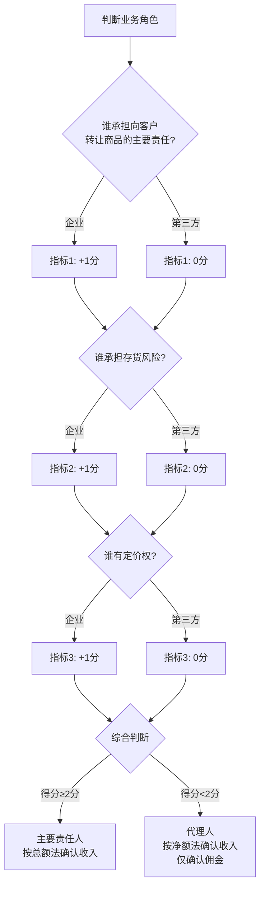

**举一反三**

类似场景（代理人模式）：
- 旅游平台代订机票酒店
- 外卖平台撮合餐饮交易
- 二手车交易平台
- 房产中介服务
- 招聘平台会员服务

**审计程序**

1. 深入了解业务模式（绘制业务流程图）
2. 识别谁拥有商品控制权（发货前、发货后）
3. 判断主要责任人三个指标
4. 检查收入确认方法是否符合主代理判断
5. 核对财务报表列报（总额法vs净额法）

**底稿记录要点**（D4-21 主代理判断）
- 业务模式描述
- 主要责任人三指标判断
- 综合结论及理由
- 收入确认方法检查
- 审计调整（如有）

---

#### 💼 案例41：附退货权销售未估计预期退货调整收入

**📌 案例背景**

XX服装零售公司2024年12月销售商品1000万元，合同约定客户有30天无理由退货权。公司未考虑预期退货，全额确认收入1000万元。

审计师询问历史退货率，管理层提供数据：
- 2022年退货率：12%
- 2023年退货率：15%
- 2024年1-11月平均退货率：13%

**审计发现**

根据新收入准则，附有退货权的销售应估计预期退货率，并按净额确认收入。

**问题识别**

**预期退货率估计**：
- 历史平均退货率：(12% + 15% + 13%) / 3 = 13.33%
- 考虑12月为销售旺季，退货率可能略高，估计为14%
- 预期退货金额：1000万 × 14% = 140万元

**会计处理分析**

**错误处理**（公司做法）：
```
2024年12月销售时：
借：应收账款  10,000,000
    贷：主营业务收入  10,000,000

借：主营业务成本  6,000,000（假设成本率60%）
    贷：库存商品  6,000,000
```

**正确处理**：

```
2024年12月销售时：
借：应收账款  10,000,000
    贷：主营业务收入  8,600,000（1000万 × 86%）
        预计负债 - 退货权负债  1,400,000（1000万 × 14%）

借：主营业务成本  5,160,000（600万 × 86%）
    应收退货成本  840,000（600万 × 14%）
    贷：库存商品  6,000,000
```

**2025年1月实际退货处理**：

假设实际退货金额为150万元（退货率15%）

```
1月实际退货时：
借：预计负债 - 退货权负债  1,400,000
    主营业务收入  100,000（150万 - 140万）
    贷：应收账款  1,500,000

借：库存商品  900,000（实际退货成本）
    贷：应收退货成本  840,000
        主营业务成本  60,000（差额）
```

**审计调整**

```
调整分录（2024年12月31日）：
借：主营业务收入  1,400,000
    贷：预计负债 - 退货权负债  1,400,000

借：应收退货成本  840,000
    贷：主营业务成本  840,000

影响分析：
- 调减2024年收入：140万元
- 调减2024年成本：84万元
- 调减2024年利润：56万元（140万 - 84万）
```

**退货权负债vs应收退货成本对照表**

| 科目 | 金额 | 列报 | 说明 |
|------|------|------|------|
| 预计负债 - 退货权负债 | 140万 | 流动负债 | 预计应退货款 |
| 应收退货成本 | 84万 | 流动资产（其他流动资产） | 预计收回商品的账面价值 |
| 差额（净影响） | 56万 | 减少利润 | 退货导致的利润减少 |

**审计结论**

✗ 公司未考虑预期退货，虚增2024年收入140万元、利润56万元，需要调整。

**举一反三**

类似场景：
- 电商平台7天无理由退货
- 图书出版行业退货
- 试用期销售
- 经销商可退货政策
- 季节性商品期后退货

**审计程序**

1. 检查销售合同，识别退货权条款
2. 获取历史退货数据，分析退货率趋势
3. 评估管理层退货率估计的合理性
4. 检查期后实际退货情况，验证估计准确性
5. 核对退货权负债和应收退货成本列报

**底稿记录要点**（D4-21 退货权处理）
- 退货权条款摘录
- 历史退货率分析
- 预期退货率估计及依据
- 退货权负债和应收退货成本计算
- 期后退货检查
- 审计调整（如有）

---

#### 💼 案例42：可变对价估计不合理提前确认不确定收入

**📌 案例背景**

XX医药公司2024年与经销商签订销售合同，销售金额基础价2000万元，另约定：
- 如2024年销售目标达成率≥80%，额外返利5%（100万元）
- 如达成率≥95%，额外返利10%（200万元）

2024年12月31日，经销商实际完成进度78%，公司判断2025年1月可能达到80%，因此2024年度确认收入2100万元（含100万元返利）。

**审计发现**

审计师检查发现：
- 截至12月31日，实际完成率仅78%，未达到返利条件
- 1月能否达标存在不确定性
- 新收入准则要求：可变对价需施加约束，仅在"极可能不会发生重大转回"时才能确认

**问题识别**

**可变对价约束条件判断**：

1. **不确定性因素**：
   - 剩余时间短（仅1个月），但需完成22%进度（从78%到100%）
   - 历史数据显示，1月通常仅能完成10%进度
   - 市场需求不确定

2. **重大转回风险评估**：
   - 如1月未达标，需转回100万元收入
   - 转回金额占收入比例：100万/2000万 = 5%，属于重大
   - **结论**：不满足"极可能不会发生重大转回"条件

**会计处理分析**

**错误处理**（公司做法）：
```
2024年12月：
借：应收账款  21,000,000
    贷：主营业务收入  21,000,000
```

**正确处理**：

```
2024年12月（不包含不确定返利）：
借：应收账款  20,000,000
    贷：主营业务收入  20,000,000

2025年1月（假设实际达到80%目标）：
借：应收账款  1,000,000
    贷：主营业务收入  1,000,000
```

**可变对价决策树**：

```
【可变对价确认判断】
        ↓
    是否可变对价?
    (折扣、返利、退货、奖励金等)
        ↓
       是
        ↓
    估计可变对价金额
    (期望值法 or 最可能金额法)
        ↓
    施加约束条件判断:
    【极可能不会发生重大转回?】
        ↓
    ┌─────┴─────┐
    是           否
    ↓           ↓
  包含在      不包含在
  交易价格中   交易价格中
    ↓           ↓
  确认收入    不确认收入
              (等待不确定性消除)
```

**审计调整**

```
调整分录（2024年12月31日）：
借：主营业务收入  1,000,000
    贷：应收账款  1,000,000

调整说明：
- 调减2024年收入：100万元
- 不确定的返利收入不应在2024年确认
- 待2025年1月目标达成后再确认
```

**可变对价估计方法对比**

| 方法 | 适用场景 | 计算方式 | 示例 |
|------|----------|----------|------|
| **期望值法** | 可能结果较多 | 加权平均 | 退货率：(历史退货率×概率)求和 |
| **最可能金额法** | 两个可能结果 | 最可能金额 | 达标返利：达标概率>50%则选达标金额 |

**本案例应用最可能金额法**：
- 达标概率（78%进度，1个月内达80%）：30%（较低）
- 不达标概率：70%
- **最可能金额**：0元（不达标的概率更高）

**审计结论**

✗ 公司对可变对价估计过于乐观，未合理施加约束条件，提前确认不确定收入100万元，需要调整。

**举一反三**

类似场景：
- 销售返利协议
- 业绩奖励条款
- 价格保护协议
- 现金折扣
- 退货权销售

**审计程序**

1. 识别合同中的可变对价条款
2. 评估管理层估计方法（期望值法vs最可能金额法）
3. 检查约束条件判断（极可能不会发生重大转回）
4. 分析历史数据和当前情况，评估估计合理性
5. 检查期后情况，验证可变对价实现
6. 测算敏感性分析

**底稿记录要点**（D4-20 可变对价估计）
- 可变对价条款摘录
- 估计方法选择及理由
- 约束条件判断分析
- 概率和金额计算过程
- 期后验证结果
- 审计调整（如有）

---

#### 💼 案例43：建造合同按时段确认收入但不满足条件

**📌 案例背景**

XX设备制造公司2024年与客户签订定制设备生产合同，合同金额800万元，生产周期6个月。公司按完工进度（投入法，成本占比）在生产期间确认收入。

至2024年12月31日，已发生成本480万元（成本占比60%），公司确认收入480万元。

**审计发现**

审计师检查合同条款：
- 设备为客户定制，具有不可替代用途（✓）
- **但**合同约定：设备验收合格后才付款，验收前客户无付款义务
- 如客户因自身原因取消合同，公司**无权**就累计至今已完成的履约部分收取款项（✗）

**问题识别**

根据新收入准则，在某一时段内确认收入需满足以下**任一**条件：
1. 客户在企业履约的同时即取得并消耗企业履约所带来的经济利益（✗ 不适用）
2. 客户能够控制企业履约过程中在建的商品（✗ 设备在公司车间生产）
3. 企业履约过程中所产出的商品**同时满足**：
   - 具有不可替代用途（✓ 满足，定制设备）
   - **且**企业有权就累计至今已完成的履约部分收取款项（✗ **不满足**）

**关键判断**："有权收款"的判断标准

- ✓ 正确理解：合同明确约定，即使客户单方面取消合同，企业也有权就已完成部分收取款项（含合理利润）
- ✗ 本案例：合同约定验收后才付款，验收前取消合同无权收款
- **结论**：不满足"在某一时段内"确认收入的条件，应在**某一时点**（验收时）确认收入

**会计处理分析**

**错误处理**（公司做法 - 按时段）：
```
2024年按投入法确认收入：
借：应收账款 / 合同资产  4,800,000
    贷：主营业务收入  4,800,000

借：主营业务成本  4,800,000
    贷：合同履约成本  4,800,000
```

**正确处理**（应在某一时点 - 验收时）：

```
2024年生产期间（不确认收入，归集成本）：
借：合同履约成本  4,800,000
    贷：原材料、应付职工薪酬等  4,800,000

2025年验收合格时（一次性确认收入）：
借：应收账款  8,000,000
    贷：主营业务收入  8,000,000

借：主营业务成本  8,000,000（假设总成本）
    贷：合同履约成本  8,000,000
```

**审计调整**

```
调整分录（2024年12月31日）：
借：主营业务收入  4,800,000
    贷：合同资产  4,800,000

借：合同履约成本  4,800,000
    贷：主营业务成本  4,800,000

调整说明：
- 调减2024年收入：480万元
- 调减2024年成本：480万元
- 对利润无影响（假设成本等于收入）
- 但2024年不应确认收入，收入应在2025年验收时确认
```

**"有权收款"条件判断对比**

| 合同条款 | 是否有权收款 | 收入确认方法 | 示例 |
|---------|------------|------------|------|
| "因客户原因取消合同，应支付已完工部分款项（含利润）" | ✓ 是 | 按时段确认 | 典型建造合同 |
| "验收合格后才付款，验收前取消合同无需付款" | ✗ 否 | 某一时点确认 | 本案例 |
| "按进度付款，每完成20%支付一次" | ✓ 是 | 按时段确认 | 分段付款合同 |
| "完工后付款，但取消合同需赔偿成本+10%利润" | ✓ 是 | 按时段确认 | 有违约保护的定制 |

**审计结论**

✗ 公司错误判断收入确认时点，提前按时段确认收入480万元，应在验收时（某一时点）确认收入。虽不影响总利润，但2024年报表存在重大错报。

**举一反三**

类似场景：
- 定制设备生产
- 定制软件开发
- 建筑装修工程
- 大型机械制造
- EPC工程总承包

**审计程序**

1. 获取生产/建造合同，检查关键条款
2. 判断商品是否具有不可替代用途（定制vs标准）
3. **重点检查**：有权收款条款（客户取消合同时的付款义务）
4. 评估公司收入确认时点/时段判断是否正确
5. 检查履约进度计量方法是否合理（投入法vs产出法）
6. 核对合同资产/负债列报

**底稿记录要点**（D4-18 时点vs时段判断）
- 合同关键条款摘录（尤其是付款条款、违约条款）
- 不可替代用途判断
- **有权收款条件判断**（最关键）
- 收入确认方法结论（时点vs时段）
- 履约进度计量方法（如按时段）
- 审计调整（如有）

---

#### 💼 案例44：重大融资成分未调整交易价格

**📌 案例背景**

XX机械设备公司2024年1月销售大型设备，合同金额1000万元，合同约定：
- 设备验收时支付50%（500万元）
- 剩余50%（500万元）分2年支付，每年末支付250万元

公司在验收时（2024年1月）一次性确认收入1000万元，未考虑延期付款的融资成分。

**审计发现**

审计师分析：
- 付款时间跨度2年，超过1年
- 延期付款金额500万元占合同总额50%，影响重大
- 市场利率（客户适用利率）：6%/年
- **结论**：合同包含重大融资成分，需调整交易价格

**问题识别**

根据新收入准则第三步，确定交易价格时需考虑：
1. 可变对价（本案例不涉及）
2. **重大融资成分**（本案例涉及）
3. 非现金对价（本案例不涉及）
4. 应付客户对价（本案例不涉及）

**重大融资成分判断**：
- ✓ 付款时间与转让商品时间间隔超过1年（2年）
- ✓ 融资金额占合同金额比重大（50%）
- ✓ 不属于重大融资成分豁免情形
- **结论**：需调整交易价格，扣除融资成分

**会计处理分析**

**错误处理**（公司做法）：
```
2024年1月验收时：
借：应收账款  10,000,000
    贷：主营业务收入  10,000,000

2025年、2026年收款时：
借：银行存款  2,500,000
    贷：应收账款  2,500,000
```

**正确处理**（调整重大融资成分）：

**步骤1：计算现值（调整后交易价格）**

```
现值 = 即期收款 + 延期收款现值
     = 500万 + [250万/(1+6%) + 250万/(1+6%)²]
     = 500万 + [250万/1.06 + 250万/1.1236]
     = 500万 + [235.85万 + 222.50万]
     = 500万 + 458.35万
     = 958.35万元

融资成分 = 1000万 - 958.35万 = 41.65万元
```

**步骤2：会计分录**

```
2024年1月验收时（按现值确认收入）：
借：应收账款  10,000,000
    贷：主营业务收入  9,583,500
        未实现融资收益  416,500

2024年12月31日（确认第一年利息收入）：
未实现融资收益分摊 = (500万 + 416,500) × 6% × 12/12 = 325,000
借：未实现融资收益  325,000
    贷：财务费用 - 利息收入  325,000

2025年末收款并确认利息：
借：银行存款  2,500,000
    贷：应收账款  2,500,000

未实现融资收益分摊 = (500万 - 250万 + 416,500 - 325,000) × 6% = 54,690
借：未实现融资收益  54,690
    贷：财务费用 - 利息收入  54,690

2026年末收款并确认剩余利息：
借：银行存款  2,500,000
    贷：应收账款  2,500,000

借：未实现融资收益  36,810（倒挤）
    贷：财务费用 - 利息收入  36,810
```

**审计调整**

```
调整分录（2024年12月31日）：
借：主营业务收入  416,500
    贷：未实现融资收益  91,500（416,500 - 325,000）
        财务费用 - 利息收入  325,000

调整说明：
- 调减2024年主营业务收入：41.65万元
- 增加2024年利息收入：32.50万元
- 2024年总收入影响：-9.15万元
- 后续年度逐步确认利息收入
```

**重大融资成分影响汇总表**

| 项目 | 不考虑融资成分 | 考虑融资成分 | 差异 |
|------|-------------|------------|------|
| **2024年** |  |  |  |
| 主营业务收入 | 1000万 | 958.35万 | -41.65万 |
| 利息收入 | 0 | 32.50万 | +32.50万 |
| 总收入 | 1000万 | 990.85万 | -9.15万 |
| **2025年** |  |  |  |
| 利息收入 | 0 | 5.47万 | +5.47万 |
| **2026年** |  |  |  |
| 利息收入 | 0 | 3.68万 | +3.68万 |
| **合计** | 1000万 |  | 0 |

**审计结论**

✗ 公司未调整重大融资成分，2024年收入多计41.65万元，应调整并在后续期间确认利息收入。

**重大融资成分豁免条件**

根据准则，以下情况可不调整重大融资成分：
1. 客户支付与转让商品之间的间隔**不超过一年**（本案例2年，不适用）
2. 融资成分**不重大**（本案例41.65万/1000万=4.2%，属于重大）
3. 客户预付款，企业根据客户要求转让商品时间由客户自主决定（本案例为延期付款，不适用）

**举一反三**

类似场景：
- 分期付款销售（超过1年）
- 预收款项（延期交货超过1年）
- 售后回购协议
- 融资性租赁（租赁准则）

**审计程序**

1. 检查销售合同，识别付款条款
2. 判断付款时间与转让商品时间间隔是否超过1年
3. 评估融资成分是否重大（通常>3-5%视为重大）
4. 确定折现率（市场利率或客户增量借款利率）
5. 计算现值和融资成分
6. 检查公司是否正确调整交易价格
7. 核对利息收入/费用的分摊计算

**底稿记录要点**（D4-20 重大融资成分）
- 合同付款条款摘录
- 时间间隔计算
- 重大性判断
- 折现率确定依据
- 现值计算过程
- 融资收益/费用分摊表
- 审计调整（如有）

---

### 7.6.7.7 新准则案例审计要点总结

**六大案例覆盖的准则要点：**

| 案例 | 五步法步骤 | 核心问题 | 审计风险 |
|------|----------|---------|----------|
| 案例39 | 第二步 | 履约义务识别 | 收入确认时点错误 |
| 案例40 | 第五步 | 主要责任人判断 | 收入规模严重夸大 |
| 案例41 | 第三步 | 可变对价约束 | 提前确认不确定收入 |
| 案例42 | 第三步 | 可变对价估计 | 过于乐观的估计 |
| 案例43 | 第五步 | 时点vs时段判断 | 有权收款条件误判 |
| 案例44 | 第三步 | 重大融资成分 | 收入虚增、收入结构扭曲 |

**审计要点速查**：

✅ **履约义务识别**（案例39）
- 检查合同中所有承诺
- 判断是否可明确区分
- 核查交易价格分摊依据

✅ **主代理判断**（案例40）
- 判断三个关键指标
- 核对总额法vs净额法
- 关注财务指标扭曲风险

✅ **可变对价处理**（案例41、42）
- 识别可变对价条款
- 评估估计方法和约束条件
- 检查期后实现情况

✅ **时点vs时段判断**（案例43）
- 重点检查"有权收款"条款
- 不要仅看"定制"就判断为时段
- 核对合同履约成本归集

✅ **重大融资成分**（案例44）
- 检查付款时间间隔
- 计算并调整融资成分
- 核对利息收入分摊

---

## 7.6.8 IPO项目专项核查（D4-28至D4-31）

> **📋 本节核心要点**
>
> - ✅ IPO项目对收入的核查要求**远高于**普通年审项目
> - ✅ 必须执行**客户走访、穿透核查、销售真实性验证**等专项程序
> - ✅ 函证覆盖率、客户集中度、关联交易等指标要求更严格
> - ✅ 报告期内**所有年度**均需执行高标准核查程序
>
> **关键底稿：** D4-28客户走访记录、D4-29穿透核查表、D4-30收入真实性综合验证、D4-31IPO收入核查总结
>
> **风险提示：** ⚠️ IPO项目收入舞弊风险极高,审计失败可能导致重大法律责任

---

## 7.6.8.1 IPO项目收入核查特殊要求

### 7.6.8.1.1 监管要求概述

**中国证监会、交易所对IPO项目收入核查的核心要求：**

| 监管机构 | 主要要求文件 | 核心要点 |
|----------|-------------|----------|
| **中国证监会** | 《首发业务若干问题解答》 | 收入真实性核查、客户集中度、关联交易、业务模式合理性 |
| **上交所** | 《科创板审核问答》 | 销售真实性、客户背景、核心技术收入占比 |
| **深交所** | 《创业板审核问答》 | 收入增长合理性、主要客户稳定性、毛利率波动 |
| **北交所** | 《北交所审核指引》 | 中小企业收入可持续性、客户依赖度 |

**IPO项目vs普通年审的核查差异：**

| 核查项目 | 普通年审 | IPO项目 |
|---------|---------|---------|
| **函证覆盖率** | 金额占比60-80% | **金额占比90%以上,客户数量占比50%以上** |
| **客户走访** | 可选程序 | **必须执行,重要客户100%走访** |
| **核查期间** | 当年 | **报告期内所有年度(通常3年)** |
| **收入真实性验证** | 常规程序 | **穿透核查,三流一致验证** |
| **关联方核查** | 常规披露 | **穿透股权结构,识别隐性关联方** |
| **客户背景调查** | 基本了解 | **深度背景调查,工商信息、实地走访** |
| **收入波动分析** | 合理性分析 | **详细解释每个波动点,提供证据支持** |

---

### 7.6.8.1.2 IPO收入核查重点领域

**重点关注的"八大核查领域"：**

1. **收入真实性** - 是否存在虚假销售、提前确认、隐瞒退货
2. **客户真实性** - 客户是否真实存在、是否具备商业合理性
3. **关联交易** - 是否存在隐性关联方、关联交易定价是否公允
4. **客户集中度** - 是否过度依赖单一客户、前五大客户占比
5. **客户** - 报告期重大客户的获取方式、商业合理性
6. **收入波动** - 收入增长、季节性波动、毛利率波动的合理性
7. **期后异常** - 期后大额退货、回款异常、客户流失
8. **业务模式** - 业务模式真实性、可持续性

---

## 7.6.8.2 客户走访程序（D4-28）

### 7.6.8.2.1 客户走访范围确定

**IPO项目客户走访覆盖率要求：**

| 客户类型 | 走访覆盖率 | 备注 |
|---------|-----------|------|
| **前五大客户** | **100%** | 报告期内各年度前五大客户均需走访 |
| **重大客户** | **100%** | 报告期内的重大客户(如收入>500万) |
| **关联方客户** | **100%** | 所有关联方客户 |
| **异常客户** | **100%** | 零余额大额交易、函证异常等 |
| **其他客户** | **覆盖收入80%以上** | 随机抽样补充走访 |

**走访方式选择：**

| 走访方式 | 适用情形 | 证据力 | 备注 |
|---------|---------|--------|------|
| **实地走访** | 重要客户、本地客户 | 最强 | 优先选择 |
| **视频访谈** | 异地客户、疫情等特殊情况 | 较强 | 需录制视频并留存 |
| **电话访谈** | 辅助手段 | 较弱 | 不能作为主要方式 |
| **书面函证** | 所有客户 | 中等 | 必须与走访结合 |

---

### 7.6.8.2.2 客户走访程序与记录（D4-28）

**客户走访记录表（D4-28）示例：**

```
索引号：D4-28
被审计单位：XXX公司
审计期间：2022-2024年度（报告期）
科目名称：营业收入 - IPO客户走访
编制人：[姓名] 编制日期：[日期]
复核人：[姓名] 复核日期：[日期]

【走访客户：客户A有限公司】

一、基本信息
客户名称：客户A有限公司
统一社会信用代码：91XXXXXXXXXXXXXXXXX
注册地址：XX省XX市XX区XX路XX号
实际经营地址：XX省XX市XX区XX路XX号（与注册地一致）
走访日期：2025年1月20日
走访方式：实地走访
走访人员：审计师XXX、XXX
被访谈人：张三（采购总监）、李四（财务经理）

二、经营场所情况
□ 经营场所真实存在  ✓
□ 与工商注册地址一致  ✓
□ 有明显的公司标识（门头、铭牌）  ✓
□ 办公场所规模与业务规模匹配  ✓
□ 生产/仓储设施情况：约2000平方米仓库，存放电子元器件
□ 员工人数：约50人
□ 主营业务：电子元器件贸易

三、业务往来核实
1. **合作历史**
   - 合作起始时间：2022年3月
   - 合作背景：通过行业展会认识，经考察后建立合作
   - 主要联系人：张三（采购总监，手机：XXX）

2. **报告期交易情况**
   
   | 年度 | 采购金额（客户确认） | 账面记录金额 | 差异 | 差异原因 |
   |------|---------------------|-------------|------|----------|
| 2022年 | 3,000,000 |  | 0 | - |
| 2023年 | 8,000,000 |  | 0 | - |
| 2024年 | 12,000,000 |  | 0 | - |
   
   **客户确认金额与账面记录一致 ✓**

3. **主要采购产品**
   - 产品类型：XX型号芯片、YY型号传感器
   - 用途：用于生产智能家电控制器
   - 质量评价：产品质量稳定，未发生重大质量问题

4. **付款方式与信用期**
   - 付款方式：银行转账
   - 信用期：货到后30天内付款
   - 回款情况：按期付款，未发生逾期

5. **定价机制**
   - 定价方式：市场询价比价后确定
   - 是否存在特殊优惠：无异常优惠
   - 价格公允性：与市场价格相符

四、关联关系核实
□ 客户与被审计单位是否存在关联关系？  **否 ✓**
□ 客户股东、董事、高管与被审计单位是否存在关联？  **否 ✓**
□ 客户员工与被审计单位是否存在交叉任职？  **否 ✓**
□ 客户与被审计单位是否存在资金往来（除正常业务）？  **否 ✓**
□ 客户是否为被审计单位代垫费用、提供担保等？  **否 ✓**

**访谈确认：不存在任何形式的关联关系**

五、商业合理性评估
□ 客户经营规模与采购规模是否匹配？  **是 ✓**
□ 客户业务需求与采购产品是否匹配？  **是 ✓**
□ 合作方式是否符合行业惯例？  **是 ✓**
□ 是否存在异常交易安排（如回购、退货等）？  **否 ✓**

**商业合理性评估：合作具有真实商业背景，不存在异常**

六、期后情况
□ 2025年是否继续合作？  **是 ✓**
□ 是否存在退货、质量纠纷？  **否 ✓**
□ 回款是否正常？  **是 ✓**

七、其他事项
□ 客户对被审计单位产品/服务满意度：满意
□ 客户对被审计单位在行业地位的评价：行业内知名供应商
□ 未来合作意向：继续深化合作

八、审计证据
□ 营业执照复印件（加盖公章）  ✓
□ 经营场所照片（门头、办公区、仓库）  ✓
□ 访谈记录（被访谈人签字确认）  ✓
□ 名片  ✓
□ 客户确认的交易金额明细表（签字盖章）  ✓
□ 视频录像（如为视频访谈）  N/A

九、走访结论
经实地走访，客户A有限公司经营场所真实，业务往来真实，交易金额与账面记录一致，
不存在关联关系，合作具有商业合理性。

十、审计师签字
走访人员1：_________  日期：_________
走访人员2：_________  日期：_________

十一、被访谈人确认
本人确认以上访谈内容真实准确。

被访谈人签字：_________ （张三，采购总监）  日期：_________
被访谈人签字：_________ （李四，财务经理）  日期：_________
客户单位盖章：[客户A有限公司公章]
```

---

### 7.6.8.2.3 客户走访常见问题应对

**问题1：客户拒绝接受走访**

**应对措施：**
- 说明走访是审计程序的必要环节，非配合可能影响审计意见
- 通过被审计单位协助沟通，说明走访目的
- 如仍拒绝，考虑视频访谈或书面确认
- 扩大其他审计程序（如深度穿透核查）
- 在审计报告中评估影响，必要时出具保留意见

**问题2：客户地址与工商注册地址不一致**

**应对措施：**
- 核实实际经营地址，拍照留存
- 了解地址不一致原因（如搬迁未及时变更）
- 检查租赁合同、水电费单据等证明实际经营
- 评估地址异常是否为虚假客户迹象

**问题3：访谈时客户对交易细节不清楚**

**应对措施：**
- 确认被访谈人是否为合适人选（应为采购、财务负责人）
- 提供交易明细，协助客户回忆
- 要求客户事后核实并书面确认
- 如仍无法确认，高度警惕虚假交易风险

---

## 7.6.8.3 穿透核查（D4-29）

### 7.6.8.3.1 穿透核查的目的与范围

**穿透核查目的：**
- 识别隐性关联方（通过股权、人员、资金等隐蔽关联）
- 验证"三流一致"（合同流、货物流、资金流）
- 核查交易真实性、商业合理性

**穿透核查范围：**

| 核查对象 | 核查内容 | 穿透深度 |
|---------|---------|---------|
| **前五大客户** | 股权结构、实际控制人、董监高 | 穿透至自然人 |
| **重大客户** | 股权结构、实际控制人、董监高 | 穿透至自然人 |
| **关联方客户** | 完整股权结构、资金流向 | 穿透至最终受益人 |
| **异常客户** | 股权、人员、资金全方位核查 | 穿透至最终受益人 |

---

### 7.6.8.3.2 穿透核查表（D4-29）

**穿透核查表（D4-29）示例：**

```
索引号：D4-29
被审计单位：XXX公司
审计期间：2022-2024年度
科目名称：营业收入 - IPO穿透核查
编制人：[姓名] 编制日期：[日期]
复核人：[姓名] 复核日期：[日期]

【核查客户：客户B有限公司】

一、基本信息
客户名称：客户B有限公司
报告期交易金额：2022年500万、2023年1200万、2024年1800万
客户类型：前五大客户、重大客户（2022年）

二、股权结构穿透

【第一层：客户B有限公司股东】
| 股东名称 | 持股比例 | 股东类型 |
|---------|---------|---------|
| 张某某 | 60% | 自然人 |
| 李某某 | 40% | 自然人 |

【第二层：自然人股东背景核查】

**股东1：张某某**
- 身份证号：320XXX************（脱敏）
- 对外投资：客户B有限公司（60%）、C公司（30%）
- 任职情况：客户B有限公司执行董事兼总经理
- 关联关系核查：
  - 与被审计单位股东关系：**无关联** ✓
  - 与被审计单位董监高关系：**无关联** ✓
  - 与被审计单位员工关系：**无关联** ✓
  - 是否曾在被审计单位任职：**否** ✓

**股东2：李某某**
- 身份证号：320XXX************（脱敏）
- 对外投资：客户B有限公司（40%）
- 任职情况：客户B有限公司监事
- 关联关系核查：
  - 与被审计单位股东关系：**无关联** ✓
  - 与被审计单位董监高关系：**无关联** ✓
  - 与被审计单位员工关系：**无关联** ✓
  - 是否曾在被审计单位任职：**否** ✓

三、董事、监事、高级管理人员核查

| 姓名 | 职务 | 关联关系核查 |
|------|------|-------------|
| 张某某 | 执行董事、总经理 | 无关联 ✓ |
| 李某某 | 监事 | 无关联 ✓ |
| 王某某 | 财务负责人 | 无关联 ✓ |

四、资金流向穿透核查

**收款账户核查：**
- 收款账户名称：客户B有限公司
- 开户银行：XX银行XX支行
- 账户性质：对公账户
- 付款方与客户名称是否一致：**一致 ✓**

**期后资金流向追踪（抽样检查）：**

2024年12月30日付款100万元：
- 客户B对公账户付款 → 被审计单位收款 → **正常销售回款 ✓**

期后回款追踪（2025年1月）：
- 客户B对公账户付款80万 → 被审计单位收款 → **正常回款 ✓**

**异常资金流向检查：**
- 是否存在第三方代付：**否 ✓**
- 是否存在个人账户付款：**否 ✓**
- 是否存在资金回流（体外循环）：**否 ✓**
- 是否存在快进快出：**否 ✓**

五、业务实质穿透核查

**货物流核查：**
- 物流公司：XX物流
- 发货地址：被审计单位仓库（XX省XX市）
- 收货地址：客户B经营地址（XX省XX市）
- 物流单据：完整 ✓
- 客户签收：有签收记录 ✓

**第三方信息验证：**
- 向物流公司XX物流函证确认运输记录：**已确认 ✓**
- 向客户B函证确认交易金额：**已回函，金额一致 ✓**

六、商业合理性分析

**客户获取方式：**
- 获客渠道：2022年行业展会
- 首次交易背景：展会洽谈后试订单
- 交易增长合理性：客户业务扩张，采购需求增加

**定价公允性：**
- 与其他客户价格对比：价格一致
- 与市场价格对比：公允
- 是否存在异常折扣：否

**信用政策：**
- 信用期：30天
- 是否与其他客户一致：是
- 回款情况：正常

七、穿透核查结论

□ 股权结构清晰，穿透至自然人  ✓
□ 未发现隐性关联关系  ✓
□ 资金流真实，未发现异常  ✓
□ 货物流真实，有物流和签收记录  ✓
□ 商业合理性充分  ✓
□ 交易真实性确认  ✓

**综合结论：**
经穿透核查，客户B有限公司与被审计单位不存在关联关系，
交易真实，资金流、货物流均正常，商业合理性充分。
```

---

## 7.6.8.4 收入真实性综合验证（D4-30）

### 7.6.8.4.1 "三流一致"综合验证

**"三流一致"验证表（D4-30）示例：**

```
索引号：D4-30
被审计单位：XXX公司
审计期间：2024年度
科目名称：营业收入 - IPO收入真实性综合验证
编制人：[姓名] 编制日期：[日期]
复核人：[姓名] 复核日期：[日期]

【验证样本：2024年12月对客户C销售】

一、合同流（Contract Flow）

| 验证项 | 证据 | 验证结果 |
|--------|------|----------|
| 销售合同 | 合同编号HT2024-1230 | 存在 ✓ |
| 合同真实性 | 双方签字盖章 | 真实 ✓ |
| 合同金额 | 500万元 | 与账面一致 ✓ |
| 交货条款 | 2024年12月28日前交货 | 明确 ✓ |
| 付款条款 | 货到后30天付款 | 明确 ✓ |
| 客户函证确认 | 函证相符 | 一致 ✓ |

**合同流验证结论：合同真实有效 ✓**

二、货物流（Goods Flow）

| 验证项 | 证据 | 验证结果 |
|--------|------|----------|
| 出库单 | 出库单号CK2024-1225 | 存在 ✓ |
| 出库日期 | 2024年12月25日 | 符合合同 ✓ |
| 出库数量/金额 | 500万元 | 与合同一致 ✓ |
| 发货单 | 发货单号FH2024-1225 | 存在 ✓ |
| 物流单据 | XX物流运单号123456 | 存在 ✓ |
| 物流轨迹 | 12月25日发货，12月26日到达 | 正常 ✓ |
| 客户签收单 | 客户签收日期12月26日 | 存在 ✓ |
| 签收人 | 张某（客户仓库主管） | 已核实 ✓ |
| 物流公司函证 | 向XX物流函证确认 | 已确认 ✓ |
| 客户走访确认 | 实地走访确认收货 | 已确认 ✓ |

**货物流验证结论：货物流真实完整 ✓**

三、资金流（Cash Flow）

| 验证项 | 证据 | 验证结果 |
|--------|------|----------|
| 销售发票 | 发票号XXX，金额500万 | 开具 ✓ |
| 开票日期 | 2024年12月26日 | 及时 ✓ |
| 收款记录 | 2025年1月20日收款500万 | 已收款 ✓ |
| 付款方 | 客户C有限公司（对公账户） | 一致 ✓ |
| 银行流水 | XX银行流水明细 | 核对一致 ✓ |
| 是否第三方代付 | 否 | 正常 ✓ |
| 是否存在资金回流 | 否 | 正常 ✓ |

**资金流验证结论：资金流真实正常 ✓**

四、"三流一致"综合验证

```
合同流 ✓ + 货物流 ✓ + 资金流 ✓ = 三流一致 ✓

【时间轴验证】
2024-12-20: 签订销售合同（合同流）
2024-12-25: 出库发货（货物流）
2024-12-26: 客户签收、开具发票（货物流+资金流）
2025-01-20: 客户付款（资金流）

时间逻辑合理 ✓
```

五、综合验证结论

经"三流一致"综合验证：
1. 合同流：合同真实，客户函证确认
2. 货物流：货物真实发出并送达，有完整物流记录和客户签收
3. 资金流：回款真实，付款方为客户本人，无异常

**该笔销售真实有效 ✓**
```

---

### 7.6.8.4.2 收入真实性多维度交叉验证

**多维度交叉验证矩阵：**

| 验证维度 | 验证方法 | 验证证据 | 结论 |
|---------|---------|---------|------|
| **合同维度** | 合同检查 | 销售合同、订单 | ✓ |
| **货物维度** | 物流追踪 | 出库单、物流单、签收单 | ✓ |
| **资金维度** | 银行流水 | 收款凭证、银行对账单 | ✓ |
| **发票维度** | 税务系统 | 销售发票、税控系统记录 | ✓ |
| **客户维度** | 函证+走访 | 函证回函、走访记录 | ✓ |
| **第三方维度** | 外部确认 | 物流公司确认、银行确认 | ✓ |
| **系统维度** | ERP数据 | ERP销售订单、出库记录 | ✓ |
| **期后维度** | 期后检查 | 期后回款、无退货 | ✓ |

**交叉验证结论：** 8个维度全部验证通过，收入真实性得到充分证明 ✓

---

## 7.6.8.5 IPO收入核查专项报告（D4-31）

### 7.6.8.5.1 IPO收入核查总结

**IPO收入核查总结报告（D4-31）框架：**

```
索引号：D4-31
被审计单位：XXX公司
审计期间：2022-2024年度（报告期）
科目名称：营业收入 - IPO专项核查总结
编制人：[姓名] 编制日期：[日期]
复核人：[姓名] 复核日期：[日期]
项目合伙人：[姓名] 复核日期：[日期]

═══════════════════════════════════════════
        IPO项目收入真实性专项核查报告
═══════════════════════════════════════════

一、核查概况

（一）核查背景
XXX公司拟在[XX交易所][XX板]首次公开发行股票并上市。
根据中国证监会及交易所相关规定，我们对报告期内（2022-2024年度）
公司营业收入的真实性、准确性、完整性执行了专项核查程序。

（二）核查范围
核查期间：2022年1月1日至2024年12月31日
核查科目：营业收入、应收账款、应收票据、合同负债
核查金额：
- 2022年营业收入：XX万元
- 2023年营业收入：XX万元  
- 2024年营业收入：XX万元
- 合计：XX万元

二、核查程序执行情况

（一）函证程序

| 年度 | 函证金额 | 收入总额 | 金额覆盖率 | 函证客户数 | 客户总数 | 数量覆盖率 | 回函率 |
|------|----------|----------|-----------|-----------|---------|-----------|--------|
| 2022 | 45,000万 | 50,000万 | 90% | 120 | 200 | 60% | 85% |
| 2023 | 63,000万 | 70,000万 | 90% | 130 | 210 | 62% | 87% |
| 2024 | 81,000万 | 90,000万 | 90% | 140 | 220 | 64% | 88% |

**函证程序结论：**
- 函证金额覆盖率均达到90%，符合IPO项目要求
- 客户数量覆盖率超过60%，覆盖面充分
- 回函率均超过85%，函证证据充分
- 未回函客户已执行替代程序，获取充分证据

（二）客户走访程序

**走访覆盖情况：**

| 年度 | 前五大客户走访 | 重大客户走访 | 关联方客户走访 | 其他重要客户走访 | 合计走访收入 | 收入覆盖率 |
|------|--------------|----------------|--------------|----------------|-------------|----------|
| 2022 | 5家/5家 | 3家/3家 | 2家/2家 | 15家 | 42,000万 | 84% |
| 2023 | 5家/5家 | 4家/4家 | 2家/2家 | 18家 | 59,000万 | 84% |
| 2024 | 5家/5家 |  | 2家/2家 | 20家 | 76,000万 | 84% |

**走访方式：**
- 实地走访：80家次
- 视频访谈：15家次（疫情期间或异地客户）

**走访程序结论：**
- 前五大客户、重大客户、关联方客户实现100%走访
- 走访收入覆盖率达到84%，超过一般要求
- 所有走访客户均确认交易真实，金额一致
- 未发现隐性关联关系或异常交易安排

（三）穿透核查程序

**穿透核查范围：**
- 前五大客户：15家（各年度前五大）
- 重大客户：12家
- 关联方客户：2家
- 异常客户：3家
- 合计：32家

**穿透核查内容：**
1. 股权结构穿透至自然人：32家 ✓
2. 董监高背景核查：32家 ✓
3. 资金流向追踪：32家 ✓
4. 关联关系深度核查：32家 ✓

**穿透核查结论：**
- 未发现隐性关联方
- 资金流正常，未发现体外循环
- 所有客户均具有真实业务背景

（四）"三流一致"验证

**验证样本量：**

| 年度 | 抽样笔数 | 抽样金额 | 收入总额 | 覆盖率 |
|------|---------|---------|---------|--------|
| 2022 | 150笔 | 42,000万 | 50,000万 | 84% |
| 2023 | 180笔 | 59,000万 | 70,000万 | 84% |
| 2024 | 200笔 | 76,000万 | 90,000万 | 84% |

**验证结果：**
- 合同流验证：530笔全部验证通过 ✓
- 货物流验证：530笔全部验证通过 ✓
- 资金流验证：530笔全部验证通过 ✓
- "三流一致"：530笔全部一致 ✓

三、重点关注事项核查

（一）客户集中度分析

**前五大客户占比：**

| 年度 | 前五大客户收入 | 营业收入 | 占比 |
|------|--------------|----------|------|
| 2022 | 25,000万 | 50,000万 | 50% |
| 2023 | 32,000万 | 70,000万 | 46% |
| 2024 | 38,000万 | 90,000万 | 42% |

**核查结论：**
- 前五大客户占比逐年下降，客户集中度风险降低
- 所有前五大客户均已实地走访，关系真实
- 不存在单一客户占比超过50%的情况

（二）客户核查

**报告期重大客户（收入>500万）：**

| 年度 | 客户数 | 收入 | 获客方式 | 商业合理性 |
|------|-----------|---------|---------|----------|
| 2022 | 8家 | 12,000万 | 展会/老客户推荐/市场开拓 | 合理 ✓ |
| 2023 | 10家 | 15,000万 | 展会/老客户推荐/市场开拓 | 合理 ✓ |
| 2024 | 12家 | 18,000万 | 展会/老客户推荐/市场开拓 | 合理 ✓ |

**核查结论：**
- 所有重大客户均已100%走访
- 获客方式合理，符合行业惯例
- 不存在突然出现的异常大客户

（三）关联交易核查

**报告期关联方销售：**

| 年度 | 关联方数量 | 关联销售金额 | 营业收入 | 占比 |
|------|-----------|-------------|---------|------|
| 2022 | 2家 | 3,000万 | 50,000万 | 6% |
| 2023 | 2家 | 3,500万 | 70,000万 | 5% |
| 2024 | 2家 | 4,000万 | 90,000万 | 4.4% |

**核查结论：**
- 关联交易占比低且逐年下降
- 关联交易定价公允，参考市场价格
- 关联交易已充分披露
- 未发现隐性关联方

（四）收入波动核查

**收入增长率分析：**

| 年度 | 营业收入 | 同比增长 | 增长率 | 行业增长率 |
|------|----------|---------|--------|-----------|
| 2022 | 50,000万 | - |  |  |
| 2023 | 70,000万 | +20,000万 | 40% | 35% |
| 2024 | 90,000万 | +20,000万 | 29% | 25% |

**核查结论：**
- 收入增长与行业趋势一致
- 收入增长有客户订单、产能扩张等支持
- 不存在异常波动

（五）期后事项核查

**期后检查期间：** 2025年1月1日至2025年3月31日

**期后退货检查：**
- 期后退货金额：200万元
- 占2024年收入比例：0.22%
- 退货原因：质量问题（个别批次）
- 已在2024年计提预计负债 ✓

**期后回款检查：**
- 2024年末应收账款：18,000万元
- 期后3个月回款：15,000万元
- 回款比例：83%
- 回款正常 ✓

**期后客户流失：**
- 未发现重大客户流失

四、审计发现与调整

（一）审计发现问题汇总

| 问题类型 | 发现数量 | 涉及金额 | 处理情况 |
|---------|---------|---------|---------|
| 截止性错误 | 3笔 | 500万 | 已调整 |
| 提前确认收入 | 2笔 | 300万 | 已调整 |
| 隐瞒退货 | 1笔 | 50万 | 已调整 |
| 坏账准备计提不足 | - | 200万 | 已调整 |

（二）审计调整汇总

| 年度 | 调增收入 | 调减收入 | 净调整 | 调整后收入 |
|------|---------|---------|--------|----------|
| 2022 | 100万 | -200万 | -100万 | 49,900万 |
| 2023 | 150万 | -350万 | -200万 | 69,800万 |
| 2024 | 200万 | -400万 | -200万 | 89,800万 |

五、总体核查结论

经执行上述专项核查程序，我们得出以下结论：

（一）收入真实性
1. 报告期内营业收入真实、准确、完整
2. 不存在虚假销售、虚构客户等重大舞弊
3. "三流一致"验证全部通过，收入真实性得到充分证明

（二）客户真实性
1. 所有重要客户均实地走访或视频访谈，客户真实存在
2. 客户具有真实业务背景，采购需求合理
3. 未发现虚构客户或异常客户

（三）关联关系
1. 关联方识别充分，关联交易披露完整
2. 经穿透核查，未发现隐性关联方
3. 关联交易定价公允

（四）收入波动
1. 收入增长具有合理商业背景
2. 收入波动符合行业趋势和公司经营情况
3. 不存在异常波动

（五）期后事项
1. 期后回款正常
2. 期后退货比例低
3. 未发现重大不利期后事项

六、特别提示

（一）持续关注事项
1. 客户集中度：虽然前五大客户占比下降，但仍需持续关注
2. 应收账款回收：部分客户账期较长，需关注回款风险
3. 新客户拓展：新客户占比提升，需持续跟踪合作稳定性

（二）建议改进事项
1. 建议完善收入确认政策，进一步细化不同业务模式的确认标准
2. 建议加强客户信用管理，降低应收账款风险
3. 建议优化客户结构，进一步降低客户集中度

七、审计责任声明

我们已按照中国注册会计师审计准则及IPO项目相关要求，
执行了充分、适当的审计程序，获取了充分、适当的审计证据。

本专项核查报告真实、完整地反映了我们对XXX公司报告期内
营业收入真实性的核查过程和核查结论。

项目合伙人：_________  签字日期：_________
项目经理：___________  签字日期：_________
```

---

## 7.6.8.6 IPO收入核查要点总结

### 💡 IPO项目审计实用技巧

**技巧1：提前规划，全面覆盖**
- ✓ IPO项目审计工作量远超普通年审，需提前规划
- ✓ 报告期内所有年度均需执行高标准程序
- ✓ 合理安排走访时间，避免集中在审计后期

**技巧2：函证与走访双管齐下**
- ✓ 函证覆盖率要达到90%以上
- ✓ 重要客户必须实地走访，不能仅依赖函证
- ✓ 函证与走访结果交叉验证

**技巧3：穿透核查要深入彻底**
- ✓ 股权结构穿透至自然人
- ✓ 不仅看工商信息，还要实地核实
- ✓ 关注资金流向，识别体外循环

**技巧4：多维度交叉验证**
- ✓ "三流一致"是基础
- ✓ 还需结合税务、物流、第三方等多维度验证
- ✓ 单一证据不足，必须交叉印证

**技巧5：保持职业怀疑**
- ✓ IPO项目舞弊动机强，保持高度警惕
- ✓ 对异常迹象深入追查
- ✓ 不轻信管理层解释

---

### ⚠️ IPO项目常见错误提醒

❌ **错误1：函证覆盖率不足**
✅ 正确：IPO项目函证金额覆盖率应达到90%以上，客户数量覆盖率50%以上。

❌ **错误2：未执行客户走访**
✅ 正确：前五大客户、重大客户、关联方客户必须100%走访。

❌ **错误3：股权穿透不彻底**
✅ 正确：必须穿透至自然人，识别隐性关联方。

❌ **错误4：仅核查当年，未核查报告期所有年度**
✅ 正确：报告期内所有年度（通常3年）均需执行高标准核查。

❌ **错误5：忽视期后事项**
✅ 正确：必须检查期后退货、回款、客户流失等情况。

❌ **错误6：走访流于形式**
✅ 正确：走访要深入了解客户背景、业务实质，不能仅停留在表面确认。

---

### 📋 IPO收入核查检查清单

**□ 函证程序**
- [ ] 函证金额覆盖率是否达到90%以上？
- [ ] 函证客户数量覆盖率是否达到50%以上？
- [ ] 前五大客户、重大客户、关联方是否100%函证？
- [ ] 未回函客户是否执行了充分的替代程序？

**□ 客户走访**
- [ ] 前五大客户是否100%走访？
- [ ] 重大客户是否100%走访？
- [ ] 关联方客户是否100%走访？
- [ ] 走访记录是否完整（照片、访谈记录、签字确认）？

**□ 穿透核查**
- [ ] 重要客户股权结构是否穿透至自然人？
- [ ] 董监高是否全面背景核查？
- [ ] 资金流向是否追踪？
- [ ] 是否识别隐性关联方？

**□ "三流一致"验证**
- [ ] 合同流是否验证？
- [ ] 货物流是否验证（物流、签收）？
- [ ] 资金流是否验证（银行流水）？
- [ ] 三流是否一致？

**□ 重点事项核查**
- [ ] 客户集中度是否合理？
- [ ] 客户获取方式是否合理？
- [ ] 关联交易是否充分披露、定价公允？
- [ ] 收入波动是否合理解释？
- [ ] 期后事项是否正常（退货、回款）？

**□ 专项报告**
- [ ] 是否编制IPO收入核查专项报告？
- [ ] 核查程序是否充分记录？
- [ ] 核查结论是否明确？
- [ ] 项目合伙人是否复核？

---

### 7.6.8.7 IPO项目及特殊交易典型案例（案例45-50）

> **💡 案例说明**: 以下案例展示IPO项目核查和特殊交易审计的实务要点。

---

#### 💼 案例45：IPO项目客户走访发现虚假销售

**📌 案例背景**

XX科技公司拟在科创板上市，2024年度营业收入5亿元。审计师对前五大客户执行实地走访程序。

**前五大客户情况（2024年）**：

| 排名 | 客户名称 | 销售金额 | 占比 | 成立时间 | 注册资本 |
|------|---------|---------|------|---------|---------|
| 1 | A系统集成公司 | 1.2亿 | 24% | 2020年 | 5000万 |
| 2 | B科技公司 | 8000万 | 16% | 2023年 | 500万 |
| 3 | C智能公司 | 7000万 | 14% | 2019年 | 3000万 |
| 4 | D信息公司 | 6000万 | 12% | 2022年 | 1000万 |
| 5 | E数据公司 | 5000万 | 10% | 2023年 | 300万 |
| 合计 | | 3.8亿 | 76% | | |

**审计程序执行**

**第一步：函证程序**

前五大客户全部发函，回函情况：
- A公司：回函相符
- B公司：回函相符
- C公司：回函相符
- D公司：回函相符
- E公司：**未回函**，联系多次无回复

**第二步：工商信息查询**

针对E数据公司进行深入查询：

| 查询项目 | 查询结果 | 异常信号 |
|---------|---------|---------|
| 注册资本 | 300万元 | ⚠️ 极小，与5000万交易不匹配 |
| 成立时间 | 2023年3月 | ⚠️ 刚成立即成为前五大客户 |
| 注册地址 | XX市某创业园3层305室 | ⚠️ 联合办公地址 |
| 股东信息 | 王某（60%）、李某（40%） | 需进一步核查关联关系 |
| 经营范围 | 数据处理、软件开发 | 与被审计单位业务相符 |
| 社保人数 | 3人 | ⚠️ 人员极少 |

**第三步：穿透核查**

核查股东背景：
- 王某：XX科技公司（被审计单位）前员工，2022年12月离职
- 李某：XX科技公司销售总监的配偶

**⚠️ 发现关联关系！**

**第四步：实地走访**

审计师前往E数据公司注册地址实地走访：

```
走访日期：2025年1月15日
走访地址：XX市某创业园3层305室
走访人员：项目经理张某、审计师李某

走访发现：
1. 305室为联合办公工位，面积约15平米
2. 现场无人办公，前台称该公司"很少来"
3. 前台提供的联系电话与函证地址一致，但始终无人接听
4. 办公环境不支持5000万元年度采购规模
5. 无任何产品展示或办公设备

拍摄照片：办公室门牌照片、内部环境照片

结论：E数据公司疑似空壳公司
```

**第五步：检查交易原始单据**

抽查E数据公司2024年所有交易（共10笔，合计5000万元）：

| 交易日期 | 金额 | 合同编号 | 发货单 | 签收单 | 发票 | 回款 |
|---------|------|---------|-------|-------|------|------|
| 2024-03 | 500万 | HT0301 | 有 |  |  | 已回款 |
| 2024-06 | 800万 | HT0601 | 有 |  |  | 已回款 |
| 2024-09 | 1000万 | HT0901 | 有 |  |  | 已回款 |
| 2024-11 | 1200万 | HT1101 | 有 |  |  | 已回款 |
| 2024-12 | 1500万 | HT1201 | 有 |  |  | **未回款** |
| 其他 | 1000万 |  | 有 |  |  | 已回款 |

**单据检查发现**：
- 所有签收单签字人均为"王某"（E公司股东），笔迹高度相似
- 物流公司查询：部分物流单号不存在
- 发货地址：部分为居民住宅，非商业地址

**第六步：资金流向追踪**

追踪E公司回款资金流向（通过银行流水）：

```
E数据公司付款 → XX科技公司收款
           ↓
      （2-5天后）
           ↓
XX科技公司支付"咨询费" → F咨询公司
           ↓
      （3-7天后）
           ↓
F咨询公司 → G投资公司 → 回流至王某、李某个人账户

⚠️ 资金体外循环特征明显！
```

**审计结论**

综合以上证据，审计师得出结论：

> **E数据公司为关联方虚构客户，相关交易为虚假销售**
>
> 证据链：
> 1. ✗ 客户为前员工设立，股东之一为公司高管配偶
> 2. ✗ 实地走访发现为空壳公司
> 3. ✗ 签收单疑似伪造
> 4. ✗ 部分物流单号不存在
> 5. ✗ 资金体外循环，最终回流至股东个人账户
>
> **结论：5000万元收入为虚假销售，应全额调减**

**审计调整**

```
调整分录（2024年度）：
借：主营业务收入              50,000,000
    贷：应收账款 - E数据公司     50,000,000

调整前：
营业收入：5.00亿元
调整后：
营业收入：4.50亿元
调减幅度：10%

对IPO的影响：
⚠️ 重大虚假销售，严重影响财务报表真实性
⚠️ 涉嫌欺诈发行，IPO申请可能被否决
⚠️ 建议终止业务约定，避免审计失败风险
```

**项目组处理**

1. 与项目合伙人、质控部门紧急沟通
2. 向公司管理层和董事会通报发现
3. 要求公司调整财务报表
4. 如公司拒绝调整或继续隐瞒，考虑解除业务约定
5. 如已发现但公司不配合，向证监会报告

**案例启示**

✅ **IPO项目必须实地走访重要客户**
✅ **函证回函不能作为唯一证据**
✅ **必须深入穿透核查关联关系**
✅ **关注资金流向，识别体外循环**
✅ **多种证据交叉验证，识别舞弊**
✅ **IPO项目舞弊风险极高，保持职业怀疑**

---

#### 💼 案例46：IPO项目期后退货识别渠道压货

**📌 案例背景**

YY家电公司拟在创业板上市，主营智能家电制造。2024年12月营业收入2亿元，占全年收入的25%，占比异常高。

**月度收入分析**：

| 月份 | 收入金额 | 占全年比例 | 环比增长率 | 风险信号 |
|------|---------|-----------|-----------|---------|
| 1-11月 | 6亿元 | 75% | - | 正常 |
| **12月** | **2亿元** | **25%** | **+100%** | ⚠️ 异常 |
| **全年** | **8亿元** | **100%** | **+60%** | |

**审计程序执行**

**第一步：12月收入明细分析**

分析12月收入构成，发现：
- 前十大经销商在12月集中提货1.5亿元，占12月收入75%
- 其中经销商甲在12月单月提货6000万元，占全年该客户采购的60%

**第二步：检查销售政策**

获取12月经销商销售政策：

| 政策内容 | 具体条款 | 异常信号 |
|---------|---------|---------|
| 年度返利 | 完成年度目标奖励5% | 正常 |
| **12月特殊政策** | **12月进货享8%额外折扣** | ⚠️ 异常优惠 |
| **账期延长** | **12月进货账期延长至180天** | ⚠️ 远超常规90天 |
| **退货权** | **2025年6月30日前可无条件退货** | ⚠️⚠️ 重大退货权 |

**⚠️ 典型的渠道压货政策！**

**第三步：客户走访**

实地走访经销商甲（12月提货6000万元）：

```
走访日期：2025年1月20日
走访对象：经销商甲总经理王总

审计师：请问贵公司12月采购了6000万元商品，
        目前销售情况如何？

王总：说实话，我们压力很大。公司给的政策很优惠，
      但市场需求没那么大。12月提的货现在还有80%在库。

审计师：6000万元商品，现在还有4800万元库存？

王总：是的。我们仓库都堆满了。公司承诺如果卖不出去，
      6月30日前可以退货，所以我们就进了。

审计师：请问您认为这批货能在6月30日前销售多少？

王总：（犹豫）...如果市场不好，可能只能卖出30-40%，
      剩下的大概率要退货。

⚠️ 预计退货率：50-60%
```

**第四步：经销商库存盘点**

审计师要求对主要经销商进行库存监盘：

| 经销商 | 12月提货金额 | 截至1月底库存 | 库存占比 | 预计退货率 |
|-------|------------|-------------|---------|-----------|
| 经销商甲 | 6000万 | 4800万 | 80% | 50-60% |
| 经销商乙 | 3000万 | 2100万 | 70% | 40-50% |
| 经销商丙 | 2000万 | 1400万 | 70% | 40-50% |
| 其他 | 4000万 | 2400万 | 60% | 30-40% |
| **合计** | **1.5亿** | **1.07亿** | **71%** | **40-50%** |

**⚠️ 渠道库存严重积压！**

**第五步：期后退货检查**

追踪2025年1-6月期后退货情况：

| 月份 | 退货金额 | 退货客户 | 累计退货 | 累计退货率 |
|------|---------|---------|---------|-----------|
| 2025年1月 | 500万 | 多个经销商 |  | 3.3% |
| 2025年2月 | 800万 | 经销商甲、乙 | 1300万 | 8.7% |
| 2025年3月 | 1200万 | 多个经销商 | 2500万 | 16.7% |
| 2025年4月 | 1500万 | 经销商甲 | 4000万 | 26.7% |
| 2025年5月 | 2000万 | 经销商甲、乙、丙 | 6000万 | 40.0% |
| 2025年6月 | 2500万 | 大量经销商 | **8500万** | **56.7%** |

**⚠️ 实际退货率高达56.7%！**

**会计处理分析**

**公司做法（错误）**：

```
2024年12月确认收入：
借：应收账款  150,000,000
    贷：主营业务收入  150,000,000

未考虑退货权，全额确认收入
```

**正确做法（新收入准则）**：

根据新收入准则，附有退货权的销售应估计预期退货率：

```
历史退货率分析：
- 2022年经销商退货率：15%
- 2023年经销商退货率：18%
- 2024年1-11月退货率：12%

但2024年12月情况特殊：
- 给予异常优惠政策
- 账期大幅延长
- 明确承诺可退货
- 经销商普遍反馈库存积压

综合判断：预期退货率应为50%

2024年12月应确认收入：
借：应收账款  150,000,000
    贷：主营业务收入  75,000,000（150,000,000 × 50%）
        预计负债 - 退货权负债  75,000,000

借：主营业务成本  45,000,000（假设成本率60%）
    应收退货成本  45,000,000
    贷：库存商品  90,000,000
```

**审计调整**

```
调整分录（2024年12月31日）：
借：主营业务收入  75,000,000
    贷：预计负债 - 退货权负债  75,000,000

借：应收退货成本  45,000,000
    贷：主营业务成本  45,000,000

调整影响：
- 调减2024年收入：7500万元（占全年收入9.4%）
- 调减2024年利润：3000万元（7500万 × 40%毛利率）

调整后：
2024年收入：7.25亿元（8亿 - 0.75亿）
2024年12月收入占比：15.5%（(2亿 - 0.75亿) / 7.25亿）
```

**对IPO的影响**

| 影响维度 | 具体影响 | 风险等级 |
|---------|---------|---------|
| **收入真实性** | 虚增收入9.4% | ⚠️ 高 |
| **利润真实性** | 虚增利润 | ⚠️ 高 |
| **业务质量** | 渠道压货反映市场需求不足 | ⚠️ 中 |
| **持续经营** | 大量退货影响持续盈利能力 | ⚠️ 中 |
| **审核结果** | 可能被要求补充披露或修改报表 | ⚠️ 高 |

**审计结论**

> **2024年12月存在显著渠道压货行为，应调整退货权负债7500万元**
>
> 渠道压货特征：
> 1. ✗ 12月收入占比25%，显著高于正常月份
> 2. ✗ 给予异常优惠政策（8%额外折扣）
> 3. ✗ 账期延长至180天（正常90天）
> 4. ✗ 明确退货权（6月30日前可退）
> 5. ✗ 经销商库存积压71%
> 6. ✗ 期后实际退货率56.7%
>
> **结论：必须调整，确认退货权负债**

**案例启示**

✅ **IPO项目必须延长期后检查期间**（至少6个月）
✅ **12月收入占比超15%即为异常信号**
✅ **必须实地走访经销商，了解真实销售情况**
✅ **必须盘点经销商库存，评估压货程度**
✅ **附退货权的销售必须估计预期退货**
✅ **期后退货是最直接的证据**

---

#### 💼 案例47：关联方资金占用通过虚构销售实现

**📌 案例背景**

ZZ医药公司2024年向关联方甲公司（母公司的全资子公司）销售药品5000万元，占总收入的10%。审计师在应收账款函证时发现异常。

**关联交易情况**：

| 项目 | 金额/内容 | 风险信号 |
|------|----------|---------|
| 2024年销售金额 | 5000万元 | 占比10% |
| 应收账款余额（12/31） | 4500万元 | ⚠️ 90%未回款 |
| 账龄 | 1年以内 | 表面正常 |
| 定价 | 与非关联方一致 | 表面公允 |
| 函证回函 | 回函相符 | 表面无异常 |

**审计发现**

**第一步：期后回款检查**

截至2025年3月31日（报表日后3个月），期后回款情况：

| 客户类型 | 期末余额 | 期后回款 | 回款率 |
|---------|---------|---------|-------|
| 非关联方客户 | 2.5亿元 | 2.0亿元 | 80% |
| **关联方甲公司** | **4500万元** | **0元** | **0%** |

**⚠️ 关联方完全未回款！**

**第二步：关联方财务状况调查**

获取甲公司2024年财务报表：

| 财务指标 | 2024年 | 2023年 | 变动 | 风险评估 |
|---------|-------|-------|------|---------|
| 营业收入 | 3000万 | 3500万 | -14% | 收入下降 |
| 净利润 | -800万 | 200万 | -500% | ⚠️ 亏损 |
| 净资产 | 500万 | 1300万 | -62% | ⚠️ 严重亏损 |
| 资产负债率 | 95% | 70% | +25% | ⚠️ 财务困难 |
| 银行存款 | 50万 | 300万 | -83% | ⚠️ 资金紧张 |

**⚠️ 甲公司已濒临破产，根本无还款能力！**

**第三步：交易合理性分析**

检查ZZ医药公司与甲公司的交易：

| 异常点 | 具体表现 | 合理性评估 |
|-------|---------|-----------|
| 采购规模 | 甲公司年收入3000万，却采购5000万药品 | ⚠️ 采购远超收入 |
| 库存消化 | 甲公司账面存货4200万元 | ⚠️ 存货占比140%收入 |
| 业务模式 | 甲公司为制造企业，不经营药品 | ⚠️ 采购药品不符合经营范围 |
| 期后销售 | 2025年1-3月甲公司仅销售药品300万元 | ⚠️ 销售极慢 |

**第四步：检查交易原始单据**

抽查5000万元交易的原始单据：

```
发现异常：

1. 销售合同：
   - 签订日期：2024年12月28日（年末突击）
   - 交货期：2024年12月31日（异常紧急）
   - 付款条款：账期180天（非关联方通常90天）
   
2. 发货单：
   - 12月29-31日集中发货
   - 发货地点：ZZ医药公司A仓库
   - 收货地点：甲公司B仓库
   - 物流公司：ZZ物流（关联方物流公司）
   
3. 签收单：
   - 签收人：刘某（甲公司采购经理）
   - 签收日期：均为12月31日
   - ⚠️ 所有签收单签字笔迹高度相似
   
4. 发票：
   - 开票日期：12月31日
   - ⚠️ 集中在最后一天开具
```

**第五步：实地盘点**

审计师要求对甲公司B仓库进行突击盘点（2025年1月5日）：

```
盘点发现：
1. 仓库内确有大量药品，账实相符
2. 但发现库存药品均存放在ZZ医药公司专用托盘上
3. 仓库管理员为ZZ医药公司派驻人员
4. 库存药品的质量管理、温湿度监控仍由ZZ医药公司负责
5. 甲公司仅提供仓储场地，不参与管理

结论：虽然商品已发货，但控制权实际上仍由ZZ医药公司掌握
```

**第六步：询问甲公司管理层**

```
审计师：请问贵公司为何采购5000万元药品？

甲公司财务总监：这是母公司集团内部的统一安排。
                实际上这批药品还是由ZZ医药公司在管理和销售，
                我们只是提供仓储场地。

审计师：那销售款项何时支付？

财务总监：要等这批药品销售出去后才能付款。如果销售不出去，
         可能会退回给ZZ医药公司。

⚠️ 实质为代储，不应确认收入！
```

**审计结论**

综合以上证据，审计师得出结论：

> **与甲公司的5000万元交易不符合收入确认条件**
>
> 不应确认收入的理由：
> 1. ✗ 控制权未转移（ZZ医药仍控制药品）
> 2. ✗ 买方无支付能力（甲公司濒临破产）
> 3. ✗ 买方无实质采购需求（业务不符、采购超收入）
> 4. ✗ 附有实质退货权（销售不出去可退货）
> 5. ✗ 仅为代储安排，非真实销售
>
> **实质：关联方资金占用，通过虚构销售实现**

**会计处理分析**

**公司做法（错误）**：

```
2024年12月确认销售：
借：应收账款 - 甲公司  50,000,000
    贷：主营业务收入  50,000,000

错误原因：控制权未转移，不符合收入确认条件
```

**正确做法**：

```
不应确认收入，应作为委托代销或寄售处理：

借：发出商品  30,000,000（成本）
    贷：库存商品  30,000,000

或者：
直接保留在库存商品科目，不做处理
```

**审计调整**

```
调整分录（2024年12月31日）：
借：主营业务收入  50,000,000
    贷：应收账款 - 甲公司  50,000,000

借：库存商品/发出商品  30,000,000
    贷：主营业务成本  30,000,000

调整影响：
- 调减2024年收入：5000万元
- 调减2024年利润：2000万元（5000万 × 40%毛利率）
- 虚增应收账款4500万元应调整为存货/发出商品
```

**关联方资金占用分析**

| 项目 | 金额 | 说明 |
|------|------|------|
| 虚构销售金额 | 5000万 | 未实质转移控制权 |
| 期末应收账款 | 4500万 | 实质为资金占用 |
| 资金占用期间 | 至少180天 | 按合同账期 |
| 资金占用利息（按6%年化） | 135万 | 4500万 × 6% × 180/360 |

**⚠️ 构成关联方资金占用，应披露并支付资金占用费！**

**审计结论及建议**

> **1. 调减虚假收入5000万元**
> **2. 确认关联方资金占用4500万元**
> **3. 要求支付资金占用费135万元**
> **4. 充分披露关联交易及资金占用情况**
>
> ⚠️ 如公司拒绝调整和披露，构成重大错报，
>     考虑出具保留意见或否定意见

**案例启示**

✅ **关联方交易必须深入核查商业实质**
✅ **函证回函相符不代表交易真实**
✅ **必须评估关联方财务状况和支付能力**
✅ **必须检查控制权是否真实转移**
✅ **期后回款是检验收入真实性的关键**
✅ **关联方资金占用必须披露并支付占用费**

---

#### 💼 案例48：售后回购交易错误确认收入

**📌 案例背景**

PP机械公司2024年11月与客户T公司签订设备销售合同，销售金额1000万元。审计师在检查合同时发现特殊条款。

**合同关键条款**：

```
【销售合同 HT202411】

第一条 标的物：精密加工设备A型 1台
第二条 销售价格：1000万元
第三条 交货期限：2024年11月30日
第四条 付款方式：签收后30天内支付

第五条 回购条款（特殊约定）：
5.1 买方有权在2025年11月30日要求卖方回购该设备
5.2 回购价格：1050万元（销售价格+5%）
5.3 如买方行使回购权，卖方必须无条件回购
5.4 回购款支付时间：回购通知后10天内

⚠️ 这是一项售后回购安排！
```

**公司会计处理**

```
2024年11月销售时：
借：应收账款  10,000,000
    贷：主营业务收入  10,000,000

借：主营业务成本  7,000,000
    贷：库存商品  7,000,000

公司全额确认收入1000万元
```

**审计分析**

**第一步：售后回购交易性质判断**

根据新收入准则，售后回购分为三类：

| 类型 | 判断标准 | 会计处理 |
|------|---------|---------|
| **融资交易** | 回购价格≥原售价，<br>企业负有回购义务 | 不确认收入，<br>作为融资处理 |
| **租赁交易** | 回购价格=公允价值，<br>且存在租赁实质 | 按租赁准则处理 |
| **看跌期权** | 客户有权要求回购，<br>回购可能性需评估 | 视回购可能性<br>确定处理方式 |

**本案例判断**：

- 回购价格1050万 > 原售价1000万
- 客户有权要求回购（看跌期权）
- 企业负有无条件回购义务

**关键判断：客户是否很可能行使回购权？**

**第二步：评估回购可能性**

| 评估因素 | 具体情况 | 判断 |
|---------|---------|------|
| 回购价格 vs 市场价 | 回购价1050万<br>预计2025年11月市场价850万 | ⚠️ 回购价显著高于市场价 |
| 客户财务状况 | 客户财务状况良好<br>有充足资金 | 有能力行使回购权 |
| 设备使用情况 | 客户仅少量使用<br>主要闲置 | ⚠️ 无长期使用意图 |
| 客户表态 | 客户称"届时视情况决定" | 回购可能性大 |
| 经济动机 | 客户可赚取200万差价<br>(1050万-850万) | ⚠️ 很可能行使回购权 |

**结论：客户很可能（>50%概率）行使回购权**

**第三步：询问交易背景**

```
审计师：请问这笔交易为何设置回购条款？

销售经理：T公司临时需要这台设备用于一个短期项目，
         项目结束后就不需要了，所以约定了回购。

审计师：为什么回购价格高于销售价格？

财务经理：因为设备使用会有折旧损耗，1050万相当于
         补偿了折旧和资金占用成本。

审计师：这相当于1年期的设备租赁或融资？

财务经理：（犹豫）...可以这么理解...

⚠️ 交易实质为融资或租赁，不应确认销售收入！
```

**正确会计处理**

**方法一：作为融资交易处理**

```
2024年11月销售时（不确认收入）：
借：其他应收款 - T公司  10,000,000
    贷：库存商品  7,000,000
        递延收益  3,000,000

说明：
- 不确认销售收入
- 设备从库存商品转出，但不确认成本
- 差额计入递延收益

2024年11月-2025年11月逐月确认融资收益：
每月融资收益 = 50万 / 12月 = 4.17万

借：递延收益  41,700
    贷：财务费用 - 利息收入  41,700

2025年11月回购时（假设客户行使回购权）：
借：库存商品  7,000,000
    银行存款  3,000,000
    贷：其他应收款 - T公司  10,000,000

借：递延收益  500,000
    贷：财务费用 - 利息收入  500,000
```

**方法二：作为租赁交易处理**

如果交易更符合租赁实质，应按租赁准则处理（略）

**审计调整**

```
调整分录（2024年12月31日）：

1. 冲回错误确认的收入和成本：
借：主营业务收入  10,000,000
    贷：应收账款  10,000,000

借：库存商品  7,000,000
    贷：主营业务成本  7,000,000

2. 正确记录融资交易：
借：其他应收款 - T公司  10,000,000
    贷：库存商品  7,000,000
        递延收益  3,000,000

3. 确认2024年11-12月融资收益（2个月）：
借：递延收益  83,400（50万/12×2）
    贷：财务费用 - 利息收入  83,400

调整影响：
- 调减2024年主营业务收入：1000万元
- 调减2024年利润：300万元（毛利）
- 增加2024年利息收入：8.34万元
- 净利润影响：-291.66万元
```

**期后验证（2025年11月）**

```
2025年11月30日，客户T公司正式发函：

【回购通知函】

致PP机械公司：

根据合同第五条约定，我司现正式通知贵司：
我司决定行使回购权，要求贵司以1050万元回购设备A型。

请于收到本函后10天内支付回购款项并办理设备交接。

T公司
2025年11月30日

⚠️ 客户确实行使了回购权，验证了审计判断！
```

**售后回购交易判断框架**

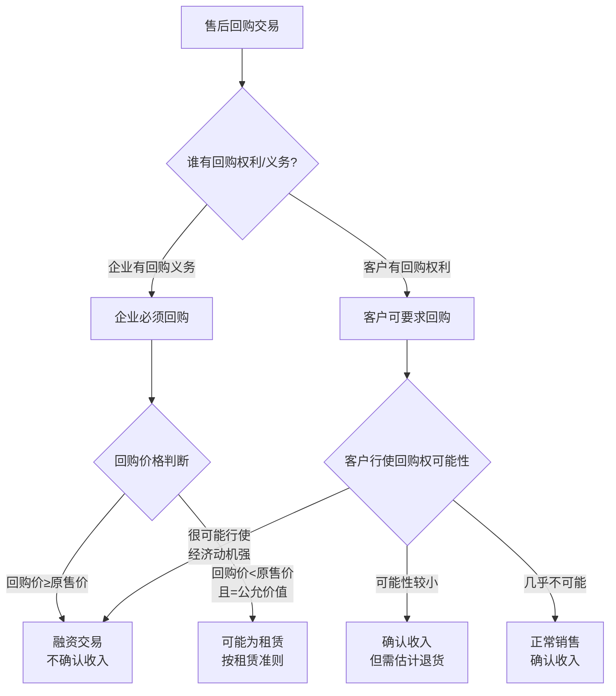

**审计结论**

> **售后回购交易不应确认销售收入，应作为融资交易处理**
>
> 判断依据：
> 1. ✗ 客户有权要求回购
> 2. ✗ 回购价格高于原售价（融资性质）
> 3. ✗ 客户很可能行使回购权（回购价>市场价）
> 4. ✗ 交易实质为设备融资，非真实销售
>
> **调整：调减收入1000万元，作为融资交易处理**

**案例启示**

✅ **仔细阅读销售合同，识别特殊条款**
✅ **售后回购交易很可能不应确认收入**
✅ **判断客户是否很可能行使回购权**
✅ **回购价格高于原售价通常为融资性质**
✅ **按交易实质而非法律形式进行会计处理**
✅ **期后验证是否真实回购**

---

#### 💼 案例49：委托代销收入确认时点错误

**📌 案例背景**

QQ服装公司2024年与多家经销商采用委托代销模式销售服装。2024年度向经销商发出商品1亿元（成本），公司在发出商品时即确认收入。

**委托代销模式说明**：

| 项目 | 具体内容 |
|------|----------|
| 代销方式 | 收取代销清单方式 |
| 结算方式 | 实际销售后结算，收取10%代销手续费 |
| 定价权 | 由QQ服装公司统一定价 |
| 存货风险 | 未售出商品由QQ承担跌价风险 |
| 退货权 | 未售出商品可无条件退回 |

**公司会计处理**

```
2024年发出商品时：
借：应收账款  150,000,000（假设售价）
    贷：主营业务收入  150,000,000

借：主营业务成本  100,000,000
    贷：库存商品  100,000,000

⚠️ 公司在发出商品时即确认收入
```

**审计发现**

**第一步：检查代销协议**

```
【委托代销协议 关键条款】

第三条 商品所有权：
3.1 商品发出后所有权仍归QQ服装公司
3.2 商品销售给最终客户时，所有权才转移给代销商

第四条 销售结算：
4.1 代销商每月10日提供上月代销清单
4.2 QQ服装公司收到代销清单后开具发票
4.3 代销商扣除10%代销手续费后支付货款

第五条 存货风险：
5.1 未售出商品的跌价损失由QQ服装公司承担
5.2 商品损毁、灭失风险由QQ服装公司承担

第六条 退货：
6.1 代销商有权退回滞销商品
6.2 退货无需承担任何责任

⚠️ 明显的委托代销！控制权未转移！
```

**第二步：获取代销清单**

截至2024年12月31日，实际销售情况：

| 经销商 | 发出商品成本 | 发出商品售价 | 实际销售售价<br>（收到代销清单） | 实际销售成本 | 未销售金额 |
|-------|------------|------------|--------------------------|------------|----------|
| 经销商A | 2000万 | 3000万 | 2100万 | 1400万 | 900万 |
| 经销商B | 1500万 | 2250万 | 1350万 | 900万 |  |
| 经销商C | 3000万 | 4500万 | 2700万 | 1800万 |  |
| 其他 | 3500万 | 5250万 | 3150万 | 2100万 |  |
| **合计** | **1亿** | **1.5亿** | **9300万** | **6200万** | **5700万** |

**截至12/31实际销售情况**：
- 发出商品售价：1.5亿元
- 实际销售售价（收到代销清单）：9300万元
- **实际销售率：62%**
- **未销售金额：5700万元**

**正确会计处理**

**发出商品时（不确认收入）**：

```
2024年发出商品时：
借：发出商品  100,000,000
    贷：库存商品  100,000,000

说明：发出商品不确认收入，因为控制权未转移
```

**收到代销清单时（确认收入）**：

```
2024年累计收到代销清单确认收入：

借：应收账款  93,000,000
    贷：主营业务收入  93,000,000

借：主营业务成本  62,000,000
    贷：发出商品  62,000,000

借：销售费用 - 代销手续费  9,300,000（10%）
    贷：应收账款  9,300,000

说明：仅对已收到代销清单的部分确认收入
```

**期末未销售部分处理**：

```
期末发出商品余额：
1亿 - 6200万 = 3800万（成本）

对应售价：5700万

⚠️ 这部分不应确认收入，应保留在"发出商品"科目
```

**审计调整**

```
调整分录（2024年12月31日）：

1. 冲回全部错误确认的收入：
借：主营业务收入  150,000,000
    贷：应收账款  150,000,000

借：库存商品/发出商品  100,000,000
    贷：主营业务成本  100,000,000

2. 正确记录发出商品：
借：发出商品  100,000,000
    贷：库存商品  100,000,000

3. 确认实际销售收入（已收到代销清单）：
借：应收账款  93,000,000
    贷：主营业务收入  93,000,000

借：主营业务成本  62,000,000
    贷：发出商品  62,000,000

4. 确认代销手续费：
借：销售费用 - 代销手续费  9,300,000
    贷：应收账款  9,300,000

调整汇总：
- 调减2024年收入：5700万元（1.5亿 - 9300万）
- 调减2024年成本：3800万元（1亿 - 6200万）
- 调减2024年毛利：1900万元
- 增加代销手续费：930万元
- 净利润影响：-2830万元（1900万毛利 + 930万手续费）
```

**委托代销收入确认时点对比**

| 时点 | 公司做法 | 正确做法 | 判断依据 |
|------|---------|---------|---------|
| **发出商品时** | ✗ 确认收入 | ✓ 不确认收入 | 控制权未转移 |
| **收到代销清单时** | - | ✓ 确认收入 | 控制权转移 |
| **期末未销售部分** | ✗ 已确认收入 | ✓ 不确认收入 | 仍在代销中 |

**期后验证**

审计师追踪2025年1-3月代销情况：

| 月份 | 新发出商品 | 收到代销清单<br>（本月销售） | 退货金额 | 期末发出商品余额 |
|------|----------|----------------------|---------|---------------|
| 2024年末 | - |  |  | 5700万（售价） |
| 2025年1月 | 500万 | 1200万 | 200万 | 4800万 |
| 2025年2月 | 600万 | 1000万 | 300万 | 4100万 |
| 2025年3月 | 500万 | 800万 | 150万 | 3550万 |

**观察**：
- 持续有新发出商品
- 持续收到代销清单
- 持续有退货发生
- **退货率约10-15%**

⚠️ 验证了代销模式的实质，期末确实有大量未销售商品

**委托代销vs买断式经销对比**

| 对比项目 | 委托代销 | 买断式经销 |
|---------|---------|-----------|
| **控制权转移** | 最终销售时 | 发货时 |
| **存货风险** | 委托方承担 | 经销商承担 |
| **定价权** | 委托方决定 | 经销商决定 |
| **退货权** | 可无条件退货 | 通常不可退货 |
| **收入确认时点** | 收到代销清单时 | 发货时 |
| **结算方式** | 扣除手续费 | 全额结算 |

**审计结论**

> **委托代销收入不应在发出商品时确认，应在收到代销清单时确认**
>
> 判断依据：
> 1. ✗ 发出商品时控制权未转移给代销商
> 2. ✗ 商品所有权仍归公司
> 3. ✗ 存货跌价风险由公司承担
> 4. ✗ 代销商可无条件退货
> 5. ✗ 按代销清单结算
>
> **调整：调减收入5700万元，调减利润2830万元**

**案例启示**

✅ **委托代销收入应在收到代销清单时确认**
✅ **发出商品不代表控制权转移**
✅ **必须仔细阅读代销协议判断控制权转移时点**
✅ **关注存货风险、定价权、退货权归属**
✅ **期末必须核对代销清单和发出商品余额**
✅ **追踪期后退货，验证代销模式实质**

---

#### 💼 案例50：会员积分奖励未作为单项履约义务

**📌 案例背景**

RR连锁超市公司实施会员积分制度，2024年销售收入10亿元，其中会员消费8亿元，累计发放积分8000万分。公司未将积分作为单项履约义务处理，全额确认收入。

**会员积分政策**：

```
【RR超市会员积分政策】

1. 积分获取：每消费1元获得1积分
2. 积分使用：100积分=1元，可抵扣下次消费
3. 积分有效期：2年
4. 历史兑换率：约60%（40%过期作废）
5. 平均兑换时间：获得积分后6-12个月
```

**公司会计处理**

```
2024年会员消费时：
借：银行存款  800,000,000
    贷：主营业务收入  800,000,000

积分兑换时：
借：销售费用 - 积分兑换成本  XXX
    贷：库存商品  XXX

⚠️ 公司全额确认收入，积分兑换作为销售费用
```

**审计分析**

**第一步：新收入准则应用判断**

根据新收入准则，客户奖励积分应作为单项履约义务：

| 判断标准 | RR超市情况 | 结论 |
|---------|-----------|------|
| 客户能否单独受益 | ✓ 积分可单独抵扣消费 | 可单独受益 |
| 与其他承诺可区分 | ✓ 积分兑换独立于本次销售 | 可明确区分 |
| **结论** | **积分应作为单项履约义务** | ✓ 需拆分 |

**第二步：积分公允价值估计**

| 估计要素 | 金额 | 说明 |
|---------|------|------|
| 发放积分总额 | 8000万分 | 2024年发放 |
| 每分价值 | 0.01元 | 100分=1元 |
| 积分面值总额 | 800万元 | 8000万×0.01 |
| 历史兑换率 | 60% | 40%过期 |
| **预计兑换金额** | **480万元** | 800万×60% |

**第三步：交易价格分摊**

**单独售价估计**：

| 履约义务 | 单独售价估计 | 说明 |
|---------|------------|------|
| 商品销售 | 8亿元 | 商品正常售价 |
| 积分奖励 | 480万元 | 预计兑换金额 |
| **合计** | **8.048亿元** | |

**分摊比例计算**：

- 商品销售占比：8亿 / 8.048亿 = 99.40%
- 积分奖励占比：480万 / 8.048亿 = 0.60%

**分摊后交易价格**：

- 应确认商品收入：8亿 × 99.40% = 7.952亿元
- 应递延积分收入：8亿 × 0.60% = 480万元

**正确会计处理**

**2024年会员消费时（应拆分履约义务）**：

```
借：银行存款  800,000,000
    贷：主营业务收入  795,200,000
        合同负债 - 积分兑换权  4,800,000

说明：
- 收入确认金额 = 8亿 × 99.40% = 7.952亿
- 递延积分收入 = 8亿 × 0.60% = 480万
```

**积分兑换时（确认递延收入）**：

```
假设2024年兑换了2000万积分（面值20万元）：

借：合同负债 - 积分兑换权  200,000
    贷：主营业务收入  200,000

借：主营业务成本  140,000（假设成本率70%）
    贷：库存商品  140,000

说明：
- 积分兑换时将合同负债转为收入
- 同时结转对应成本
```

**积分过期时（转入营业收入）**：

```
假设2年后，剩余1000万积分过期（预计40%过期率，实际过期12.5%）：

借：合同负债 - 积分兑换权  100,000
    贷：主营业务收入  100,000

说明：过期积分对应的合同负债转入营业收入
```

**审计调整**

```
调整分录（2024年12月31日）：

借：主营业务收入  4,800,000
    贷：合同负债 - 积分兑换权  4,800,000

调整说明：
- 调减2024年收入：480万元
- 递延至积分兑换时或过期时确认
- 占总收入比例：0.6%（影响较小但应调整）

期末合同负债余额：
发放积分递延：480万
减：2024年已兑换：20万
期末余额：460万

预计2025-2026年确认：
- 2025年兑换确认：约250万
- 2026年兑换确认：约100万
- 过期转入收入：约110万
- 合计：460万
```

**积分兑换跟踪表**

| 期间 | 期初余额 | 本期新增 | 本期兑换 | 本期过期 | 期末余额 |
|------|---------|---------|---------|---------|---------|
| 2024年 | 0 | 480万 | 20万 |  | 460万 |
| 2025年（预计） | 460万 | 500万 | 300万 | 50万 | 610万 |
| 2026年（预计） | 610万 | 520万 | 350万 | 100万 | 680万 |

**审计验证程序**

1. **获取积分系统数据**：
   - 2024年发放积分明细
   - 2024年兑换积分明细
   - 期末未兑换积分余额

2. **历史兑换率分析**：
   ```
   年份     发放积分    兑换积分    兑换率    过期率
   2022年   7000万分   4200万分     60%      40%
   2023年   7500万分   4500万分     60%      40%
   平均兑换率：60%
   ```

3. **估计合理性评估**：
   - 公司估计兑换率60%基于历史数据
   - 估计较为合理
   - 但应持续跟踪实际兑换情况

4. **期后兑换检查**：
   ```
   2025年1-3月实际兑换情况：
   1月：兑换800万分（面值8万元）
   2月：兑换600万分（面值6万元）
   3月：兑换500万分（面值5万元）
   合计：1900万分（面值19万元）
   
   ✓ 实际兑换符合预期
   ```

**与同行业对比**

| 公司 | 积分政策 | 会计处理 | 递延比例 |
|------|---------|---------|---------|
| **RR超市** | 1元=1分，100分=1元 | 应递延 | 0.6% |
| S超市 | 1元=1分，100分=1元 | 已递延 | 0.8% |
| T超市 | 1元=2分，50分=1元 | 已递延 | 1.2% |
| U超市 | 1元=1分，100分=1.2元 | 已递延 | 1.0% |

**行业平均递延比例：0.8-1.2%**
RR超市0.6%偏低，可能低估了兑换率

**审计结论**

> **会员积分应作为单项履约义务，递延确认收入**
>
> 判断依据：
> 1. ✓ 积分可单独抵扣消费（客户能单独受益）
> 2. ✓ 积分兑换独立于本次销售（可明确区分）
> 3. ✓ 根据新收入准则应作为单项履约义务
>
> **调整：递延收入480万元**
>
> **建议：**
> - 建立积分跟踪系统
> - 定期更新兑换率估计
> - 每年末重新评估合同负债充分性

**案例启示**

✅ **客户奖励积分应作为单项履约义务**
✅ **需根据预期兑换率估计积分价值**
✅ **积分面值与预计兑换金额不同**
✅ **需持续跟踪实际兑换率并调整估计**
✅ **过期积分对应的合同负债应转入收入**
✅ **与同行业对比评估估计合理性**

---

### 7.6.8.8 案例45-50总结

**六大案例覆盖的主题**：

| 案例 | 主题 | 核心问题 | 审计要点 |
|------|------|---------|---------|
| **案例45** | IPO虚假销售 | 关联方虚构客户 | 实地走访+穿透核查+资金追踪 |
| **案例46** | IPO渠道压货 | 期末冲业绩压货 | 期后退货+经销商走访+库存盘点 |
| **案例47** | 关联方资金占用 | 虚构销售占用资金 | 关联方财务状况+控制权转移判断 |
| **案例48** | 售后回购 | 融资性质交易 | 合同条款分析+回购可能性评估 |
| **案例49** | 委托代销 | 收入确认时点错误 | 控制权转移判断+代销清单核对 |
| **案例50** | 会员积分 | 未拆分履约义务 | 单项履约义务识别+交易价格分摊 |

**审计方法汇总**：

✅ **IPO项目核查方法**：
- 客户实地走访
- 股权穿透核查
- 资金流向追踪
- 期后退货检查
- 经销商库存盘点

✅ **特殊交易审计方法**：
- 合同条款深度分析
- 交易实质判断
- 控制权转移评估
- 新收入准则应用检查
- 期后验证

---

## 7.6.9 其他业务收入审计（D4-3系列）

> **📋 本节核心要点**
>
> - ✅ 其他业务收入虽然金额通常较小,但**不能忽视**审计程序
> - ✅ 需判断其他业务收入是否应**重分类为主营业务收入**
> - ✅ 重点关注**租金收入、特许权使用费、利息收入、资产处置收益**等
> - ✅ 部分其他业务收入可能涉及**关联交易**或**非经常性损益**
>
> **关键底稿：** D4-3其他业务收入明细表、D4-3-1租金收入审计、D4-3-2特许权使用费审计、D4-3-3利息收入审计、D4-3-4材料销售审计
>
> **风险提示：** ⚠️ 其他业务收入可能被用于调节利润、隐藏关联交易

---

## 7.6.9.1 其他业务收入概述

### 7.6.9.1.1 其他业务收入的定义与分类

**定义：** 
其他业务收入是指企业从事除主营业务以外的其他经营活动所取得的收入。

**常见类型：**

| 收入类型 | 说明 | 常见行业 | 审计重点 |
|---------|------|---------|---------|
| **租金收入** | 出租房屋、设备等固定资产 | 制造业、服务业 | 租赁合同、收款记录 |
| **特许权使用费** | 授权他人使用专利、商标等 | 科技、医药 | 授权协议、关联交易 |
| **材料销售** | 销售原材料、废料、下脚料 | 制造业 | 定价公允性、库存核对 |
| **技术服务费** | 提供技术咨询、培训服务 | 科技、咨询 | 服务合同、验收确认 |
| **利息收入** | 资金拆借利息、存款利息 | 所有行业 | 合同、银行对账单 |
| **手续费收入** | 代收代付手续费、佣金 | 金融、平台 | 代理协议、结算单 |
| **包装物出租** | 出租周转材料、包装物 | 物流、制造 | 出租记录、押金管理 |

---

### 7.6.9.1.2 其他业务收入vs主营业务收入

**区分标准：**

| 判断维度 | 主营业务收入 | 其他业务收入 |
|---------|-------------|-------------|
| **经常性** | 经常性活动 | 偶发性或辅助性活动 |
| **主要性** | 企业主要经营活动 | 非主要经营活动 |
| **收入占比** | 通常占比较高 | 通常占比较低 |
| **业务重要性** | 核心业务 | 非核心业务 |

**审计关注：** 需评估其他业务收入是否应重分类为主营业务收入

**重分类情形：**
- ⚠️ 其他业务收入占比超过30%
- ⚠️ 其他业务收入持续增长，成为主要收入来源
- ⚠️ 其他业务收入与主营业务性质相同

---

## 7.6.9.2 其他业务收入明细表（D4-3）

### 7.6.9.2.1 其他业务收入明细表编制

**其他业务收入明细表（D4-3）示例：**

```
索引号：D4-3
被审计单位：XXX公司
审计期间：2024年度
科目名称：其他业务收入
编制人：[姓名] 编制日期：[日期]
复核人：[姓名] 复核日期：[日期]
金额单位：人民币元

【其他业务收入构成】

| 收入类型 | 2024年金额 | 2023年金额 | 变动额 | 变动率 | 占其他业务收入比 | 占营业收入比 | 审计程序 | 备注 |
|---------|-----------|-----------|--------|--------|----------------|------------|---------|------|
| 租金收入 | 1,200,000 | 1,000,000 | 200,000 | 20% | 40% | 1.5% | D4-3-1 | 厂房出租 |
| 材料销售 | 800,000 | 600,000 | 200,000 | 33% | 27% | 1.0% | D4-3-4 | 废料、下脚料 |
| 特许权使用费 | 500,000 |  | 0 | 0% | 17% | 0.6% | D4-3-2 | 专利授权 |
| 技术服务费 | 300,000 | 200,000 | 100,000 | 50% | 10% | 0.4% | D4-3-5 | 技术咨询 |
| 利息收入 | 200,000 | 150,000 | 50,000 | 33% | 6% | 0.2% | D4-3-3 | 定期存款 |
| **合计** | **3,000,000** | **2,450,000** | **550,000** | **22%** | **100%** | **3.7%** | | |

【主营业务收入对比】
主营业务收入：80,000,000元
其他业务收入：3,000,000元
其他业务收入占营业收入比：3.7%

【重分类评估】
□ 其他业务收入占比是否超过30%？  **否** ✓（仅3.7%）
□ 其他业务收入是否应重分类为主营业务收入？  **否** ✓
□ 其他业务收入是否涉及关联交易？  **是**（特许权使用费50万元为关联方）
□ 其他业务收入是否涉及非经常性损益？  **部分**（材料销售为非经常性）

【审计结论】
其他业务收入构成合理，无需重分类。
关联方特许权使用费需重点检查定价公允性。
材料销售需关注非经常性损益披露。
```

---

## 7.6.9.3 租金收入审计（D4-3-1）

### 7.6.9.3.1 租金收入审计程序

**租金收入审计表（D4-3-1）示例：**

```
索引号：D4-3-1
被审计单位：XXX公司
审计期间：2024年度
科目名称：其他业务收入 - 租金收入
编制人：[姓名] 编制日期：[日期]
复核人：[姓名] 复核日期：[日期]
金额单位：人民币元

【租金收入明细】

| 承租方 | 出租资产 | 租赁期间 | 年租金 | 2024年确认收入 | 收款情况 | 关联方? | 定价依据 | 审计程序 | 审计结论 |
|--------|---------|---------|--------|---------------|----------|--------|---------|---------|---------|
| 客户甲 | 厂房A栋 | 2024.1.1-2024.12.31 | 600,000 |  | 已全额收款 | 否 | 市场价 | 合同+收款凭证 | ✓ 正确 |
| 关联方乙 | 仓库B区 | 2024.1.1-2024.12.31 | 400,000 |  | 已全额收款 | **是** | 参考市场价 | 合同+关联交易披露 | ✓ 正确,需披露 |
| 客户丙 | 设备X | 2024.7.1-2025.6.30 | 400,000 | 200,000 | 已收半年 | 否 | 市场价 | 合同+按期间确认 | ✓ 正确 |
| **合计** | | | **1,400,000** | **1,200,000** | | | | | |

【审计程序执行】

1. **租赁合同检查**
   □ 获取所有租赁合同 ✓
   □ 核对租赁期间、租金金额、付款方式 ✓
   □ 检查合同签字盖章真实性 ✓

2. **收入确认时点检查**
   
   **案例：设备X租赁**
   - 租赁期间：2024年7月1日至2025年6月30日（12个月）
   - 年租金：400,000元
   - 2024年应确认：400,000 × 6个月/12个月 = 200,000元 ✓
   - 企业实际确认：200,000元 ✓
   - **审计结论：确认时点正确**

3. **收款情况检查**
   □ 核对银行流水，确认租金收款记录 ✓
   □ 未收租金是否计提坏账准备 ✓

4. **定价公允性检查**
   
   **市场价格对比：**
   | 出租资产 | 公司租金 | 市场可比价格 | 差异 | 公允性结论 |
   |---------|---------|-------------|------|-----------|
   | 厂房A栋 | 600,000元/年 | 550,000-650,000元/年 | 合理 | 公允 ✓ |
   | 仓库B区（关联方） | 400,000元/年 | 380,000-420,000元/年 | 合理 | 公允 ✓ |
   | 设备X | 400,000元/年 | 350,000-450,000元/年 | 合理 | 公允 ✓ |

5. **关联方租赁检查**
   □ 关联方乙租赁仓库B区，年租金40万元
   □ 定价参考市场价，价格公允 ✓
   □ 已在关联交易中披露 ✓
   □ 关联交易决策程序合规 ✓

【审计结论】
租金收入确认准确，收入确认时点正确，定价公允，关联交易已充分披露。
```

---

## 7.6.9.4 特许权使用费审计（D4-3-2）

### 7.6.9.4.1 特许权使用费审计

**特许权使用费审计表（D4-3-2）示例：**

```
索引号：D4-3-2
被审计单位：XXX公司
审计期间：2024年度
科目名称：其他业务收入 - 特许权使用费
编制人：[姓名] 编制日期：[日期]
复核人：[姓名] 复核日期：[日期]
金额单位：人民币元

【特许权使用费明细】

| 被许可方 | 许可内容 | 许可期间 | 许可费总额 | 2024年确认收入 | 收款情况 | 关联方? | 收入确认方式 | 审计结论 |
|---------|---------|---------|-----------|---------------|----------|--------|-------------|---------|
| 关联方D | 专利A | 2024.1.1-2026.12.31(3年) | 1,500,000 | 500,000 | 已收50万 | **是** | 按期间确认 | ✓ 正确 |
| 客户E | 商标B | 2024.1.1-2024.12.31(1年) | 300,000 |  | 已收30万 | 否 | 一次确认 | **✗ 错误** |
| **合计** | | | **1,800,000** | **800,000** | | | | |

【审计程序执行】

1. **许可协议检查**
   □ 获取所有特许权许可协议 ✓
   □ 核对许可内容、期间、金额 ✓
   □ 检查协议签字盖章 ✓

2. **收入确认时点判断**

   **案例1：专利A许可（关联方D）**
   - 许可期间：2024年1月1日至2026年12月31日（3年）
   - 许可费总额：150万元
   - 收入确认方式：客户在许可期内能够从中受益 → **在某一时段确认**
   - 2024年应确认：1,500,000 ÷ 3年 = 500,000元 ✓
   - 企业实际确认：500,000元 ✓
   - **审计结论：正确**

   **案例2：商标B许可（客户E）**
   - 许可期间：2024年1月1日至2024年12月31日（1年）
   - 许可费：30万元
   - 企业处理：2024年一次确认30万元
   - **审计判断：**
     - 如为一次性授权（如买断式授权）→ 一次确认 ✓
     - 如为期间授权（如年度授权）→ 应按期间确认 ✗
   - 经检查合同，为年度授权，客户按月使用
   - **审计结论：应按12个月均摊，每月25,000元**
   - **审计调整：需建立递延收入或在下一年度调整**

3. **定价公允性检查（关联方）**

   **关联方D专利许可定价检查：**
   | 项目 | 金额/情况 | 公允性判断 |
   |------|----------|----------|
   | 关联方许可费 | 50万元/年 | - |
   | 可比市场价格 | 无公开市场价格 | - |
   | 成本加成法 | 研发成本300万,3年分摊,加成50% | 理论价值150万/年 |
   | 实际定价 | 50万元/年 | **偏低** ⚠️ |
   
   **审计关注：**
   - 关联方许可费明显低于成本加成价
   - 需评估是否构成关联方利益输送
   - 需在附注中充分披露定价依据

4. **知识产权权属检查**
   □ 检查专利证书、商标注册证 ✓
   □ 确认被审计单位拥有知识产权 ✓
   □ 检查知识产权是否存在质押、纠纷 ✓

【审计调整】
客户E商标许可费应按期间确认,需递延部分收入。
（假设审计时点已是年末，则无需调整；如为期中，需调整）

【审计结论】
特许权使用费大部分确认正确，关联方定价需关注并充分披露。
```

---

## 7.6.9.5 利息收入审计（D4-3-3）

**利息收入审计表（D4-3-3）示例：**

```
索引号：D4-3-3
被审计单位：XXX公司
审计期间：2024年度
科目名称：其他业务收入/财务费用（负数） - 利息收入
编制人：[姓名] 编制日期：[日期]
复核人：[姓名] 复核日期：[日期]
金额单位：人民币元

【利息收入类型】

| 利息收入类型 | 金额 | 列示科目 | 审计重点 |
|-------------|------|---------|---------|
| **银行存款利息** | 150,000 | 财务费用（负数） | 银行对账单 |
| **资金拆借利息** | 50,000 | 其他业务收入 | 拆借协议、关联方 |
| **合计** | **200,000** | | |

【银行存款利息核查】

| 银行账户 | 平均存款余额 | 利率 | 计算利息 | 账面利息 | 差异 | 审计结论 |
|---------|-------------|------|---------|----------|------|---------|
| XX银行基本户 | 5,000,000 | 1.5% | 75,000 |  | 0 | ✓ 正确 |
| XX银行定期存款 | 3,000,000 | 2.5% | 75,000 |  | 0 | ✓ 正确 |
| **合计** |  |  | **150,000** |  | **0** | ✓ |

□ 已与银行对账单核对一致 ✓
□ 利息收入计算准确 ✓

【资金拆借利息核查】

| 借款方 | 拆借金额 | 拆借期间 | 利率 | 2024年利息 | 关联方? | 定价依据 | 审计结论 |
|--------|---------|---------|------|-----------|--------|---------|---------|
| 关联方F | 1,000,000 | 2024.1.1-2024.12.31 | 5% | 50,000 | **是** | 同期银行贷款利率 | ⚠️ 需披露 |

**关联方资金拆借检查：**
1. **拆借合法性**
   - □ 拆借协议是否签订 ✓
   - □ 决策程序是否合规（董事会批准） ✓
   - □ 是否符合《公司法》规定 ✓

2. **定价公允性**
   - 拆借利率：5%
   - 同期银行贷款利率：4.5%-5.5%
   - **公允性结论：利率处于合理区间 ✓**

3. **收款情况**
   - □ 利息是否按期收取 ✓
   - □ 本金是否按期归还 ✓

4. **披露要求**
   - □ 关联方资金拆借需在附注中披露 ✓
   - □ 需披露拆借金额、利率、期限 ✓

【审计结论】
利息收入确认准确，关联方资金拆借定价公允，需在附注中充分披露。
```

---

## 7.6.9.6 材料销售收入审计（D4-3-4）

**材料销售收入审计表（D4-3-4）示例：**

```
索引号：D4-3-4
被审计单位：XXX公司
审计期间：2024年度
科目名称：其他业务收入 - 材料销售
编制人：[姓名] 编制日期：[日期]
复核人：[姓名] 复核日期：[日期]
金额单位：人民币元

【材料销售明细】

| 材料类型 | 销售数量 | 销售金额 | 销售成本 | 毛利 | 毛利率 | 客户 | 定价依据 | 审计结论 |
|---------|---------|---------|---------|------|--------|------|---------|---------|
| 废料钢材 | 50吨 | 400,000 | 300,000 | 100,000 | 25% | 废品回收公司 | 市场价 | ✓ 正确 |
| 下脚料塑料 | 20吨 | 200,000 | 150,000 | 50,000 | 25% | 废品回收公司 | 市场价 | ✓ 正确 |
| 剩余原料 | 批次X | 200,000 | 180,000 | 20,000 | 10% | 客户G | 成本价 | ✓ 正确 |
| **合计** | | **800,000** | **630,000** | **170,000** | **21%** | | | |

【审计程序执行】

1. **库存核对**
   □ 核对销售材料与库存记录一致 ✓
   □ 检查材料出库单 ✓
   □ 确认材料确实为废料、下脚料或剩余材料 ✓

2. **定价公允性检查**
   
   **废料钢材定价检查：**
   - 销售价格：8,000元/吨
   - 市场废钢价格：7,500-8,500元/吨
   - **公允性结论：价格合理 ✓**

3. **收入成本配比检查**
   □ 材料销售成本是否准确结转 ✓
   □ 成本结转时点是否与收入确认一致 ✓

4. **非经常性损益认定**
   - 材料销售为生产过程中的副产品销售
   - 金额较小，占收入比例1%
   - **认定：属于经常性损益，无需调整**
   - （如果为一次性大额资产处置，应认定为非经常性损益）

【审计结论】
材料销售收入确认准确，定价公允，成本结转正确。
```

---

## 7.6.9.7 其他业务收入特殊事项

### 7.6.9.7.1 其他业务收入与非经常性损益

**非经常性损益判断：**

| 收入类型 | 是否属于非经常性损益 | 判断依据 |
|---------|-------------------|---------|
| **持续性租金收入** | **否** | 经常性、可持续 |
| **一次性设备处置** | **是** | 偶发性、不可持续 |
| **持续性特许权使用费** | **否** | 经常性 |
| **一次性技术转让** | **是** | 偶发性 |
| **废料销售（持续）** | **否** | 经常性 |
| **大额库存处置（清仓）** | **是** | 偶发性 |

**审计关注：**
- IPO项目需特别关注非经常性损益的认定
- 非经常性损益需在招股说明书中单独披露
- 扣除非经常性损益后的净利润是重要指标

---

### 7.6.9.7.2 其他业务收入列报检查

**列报分类检查：**

```
【利润表列报】

营业收入：
  - 主营业务收入：80,000,000
  - 其他业务收入：3,000,000
营业成本：
  - 主营业务成本：56,000,000
  - 其他业务成本：2,000,000

【检查要点】
□ 其他业务收入是否单独列示 ✓
□ 其他业务成本是否与收入配比 ✓
□ 是否存在应重分类为主营业务收入的情况 ✓（已评估，无需重分类）

【附注披露检查】
□ 其他业务收入是否按类型披露明细 ✓
□ 关联方其他业务收入是否单独披露 ✓
□ 重大其他业务收入合同是否披露 ✓
```

---

## 7.6.9.8 其他业务收入审计总结

### 💡 其他业务收入审计实用技巧

**技巧1：不要忽视小金额**
- ✓ 虽然金额小，但可能涉及关联交易、舞弊
- ✓ 可能被用于调节利润
- ✓ 必须执行必要的审计程序

**技巧2：关注关联交易**
- ✓ 其他业务收入中关联交易比例往往较高
- ✓ 重点检查定价公允性
- ✓ 确保充分披露

**技巧3：评估重分类必要性**
- ✓ 关注其他业务收入占比
- ✓ 评估业务性质是否应为主营业务
- ✓ 持续性业务应考虑重分类

**技巧4：核查收入确认时点**
- ✓ 不同类型其他业务收入确认时点不同
- ✓ 租金、特许权使用费通常按期间确认
- ✓ 材料销售通常在某一时点确认

---

### ⚠️ 其他业务收入审计常见错误提醒

❌ **错误1：认为金额小就不执行审计程序**
✅ 正确：无论金额大小，都需执行必要的审计程序。

❌ **错误2：未关注关联方其他业务收入**
✅ 正确：关联方其他业务收入需重点检查定价公允性和披露完整性。

❌ **错误3：未评估是否应重分类为主营业务收入**
✅ 正确：占比较高或持续性的其他业务收入应评估重分类必要性。

❌ **错误4：租金、特许权使用费一次性确认**
✅ 正确：通常应按期间确认收入。

❌ **错误5：未区分经常性与非经常性损益**
✅ 正确：IPO项目需特别关注非经常性损益的认定。

---

## 7.6.9.9 其他业务毛利率分析表（D4-33）

**索引号：D4-33**

### 一、其他业务收入及毛利率分析

| 业务类型 | 本期收入 | 本期成本 | 本期毛利 | 本期毛利率(%) | 上期收入 | 上期成本 | 上期毛利 | 上期毛利率(%) | 毛利率变动(%) |
|----------|---------|---------|---------|--------------|---------|---------|---------|--------------|--------------|
| 材料销售 | 800,000 | 600,000 | 200,000 | 25.0% | 700,000 | 550,000 | 150,000 | 21.4% | +3.6% |
| 废料销售 | 400,000 | 250,000 | 150,000 | 37.5% | 350,000 | 230,000 | 120,000 | 34.3% | +3.2% |
| 租赁收入 | 1,200,000 | 300,000 | 900,000 | 75.0% |  |  |  |  | 0.0% |
| 技术服务费 | 500,000 | 200,000 | 300,000 | 60.0% | 0 |  |  | - |  |
| 运输收入 | 0 |  |  | - | 100,000 | 85,000 | 15,000 | 15.0% |  |
| 包装物租金 | 100,000 | 20,000 | 80,000 | 80.0% |  |  |  |  | 0.0% |
| 其他 | 0 |  |  | - | 50,000 | 45,000 | 5,000 | 10.0% |  |
| **合计** | **3,000,000** | **1,370,000** | **1,630,000** | **54.3%** | **2,500,000** | **1,230,000** | **1,270,000** | **50.8%** | **+3.5%** |

### 二、毛利率变动分析

| 业务类型 | 毛利率变动(%) | 主要原因 | 合理性评价 | 异常情况说明 |
|----------|--------------|---------|-----------|-------------|
| 材料销售 | +3.6% | 材料价格上涨，售价相应提高 | 合理 | 无 |
| 废料销售 | +3.2% | 废料市场价格上涨 | 合理 | 无 |
| 租赁收入 | 0.0% | 租金固定，成本稳定 | 合理 | 无 |
| 技术服务费 | - | 本期业务 | 合理 | 需关注业务真实性 |
| 运输收入 | - | 本期已停止该业务 | 合理 | 无 |
| 包装物租金 | 0.0% | 业务稳定 | 合理 | 无 |
| 其他 | - | 本期无此类收入 | 合理 | 无 |

### 三、其他业务收入占比分析

| 业务类型 | 本期金额 | 占其他业务收入比(%) | 占营业收入比(%) | 上期金额 |  |  | 变动分析 |
|----------|---------|-------------------|----------------|---------|-------------------|----------------|----------|
| 材料销售 | 800,000 | 26.7% | 1.0% | 700,000 | 28.0% | 0.9% | 稳定 |
| 废料销售 | 400,000 | 13.3% | 0.5% | 350,000 | 14.0% |  | 稳定 |
| 租赁收入 | 1,200,000 | 40.0% | 1.5% |  | 48.0% | 1.6% | 稳定 |
| 技术服务费 | 500,000 | 16.7% | 0.6% | 0 | 0.0% |  | 业务 |
| 运输收入 | 0 | 0.0% |  | 100,000 | 4.0% | 0.1% | 已停止 |
| 其他 | 100,000 | 3.3% | 0.1% | 150,000 | 6.0% | 0.2% | 减少 |
| **合计** | **3,000,000** | **100%** | **3.7%** | **2,500,000** |  | **3.3%** | **增长20%** |

### 四、与主营业务毛利率对比

| 项目 | 本期毛利率(%) | 上期毛利率(%) | 变动(%) | 对比分析 |
|------|--------------|--------------|---------|----------|
| 主营业务毛利率 | 35.2% | 34.8% | +0.4% | 主营业务稳定 |
| 其他业务毛利率 | 54.3% | 50.8% | +3.5% | 高于主营业务 |
| **差异** | **+19.1%** | **+16.0%** | **+3.1%** | **其他业务毛利率显著高于主营业务** |

**分析说明：**
其他业务毛利率高于主营业务主要原因：
- 租赁收入毛利率75%，占其他业务收入40%
- 包装物租金毛利率80%
- 技术服务费毛利率60%

### 五、异常毛利率项目分析

| 业务类型 | 毛利率(%) | 异常原因 | 涉及金额 | 主要客户 | 是否关联方 | 风险评估 | 应对措施 |
|----------|----------|----------|----------|----------|----------|----------|----------|
| 技术服务费 | 60.0% | 业务，需验证真实性 | 500,000 | ABC科技公司 | 否 | 中等 | 核查合同、验收文件、回款记录 |

**审计说明：**
> 其他业务收入毛利率整体合理，技术服务费为本期业务，已执行额外审计程序验证真实性和完整性。

**审计结论：**
> 其他业务毛利率分析未发现重大异常，毛利率变动具有合理商业理由。

---

## 7.6.9.10 其他业务收入合同测算表（D4-34）

**索引号：D4-34**

### 一、审计目标
检查其他业务收入的真实性、完整性、准确性，以及会计处理的恰当性。

### 二、审计程序

| 审计程序 | 执行情况 | 发现问题 | 审计结论 |
|----------|----------|----------|----------|
| 1. 获取其他业务收入明细 | ✓ 已获取 | 无 | 明细完整 |
| 2. 检查重要合同 | ✓ 已检查 | 无 | 合同齐全 |
| 3. 检查支持性文件（发票、出库单等） | ✓ 已检查 | 无 | 单据齐全 |
| 4. 分析收入确认时点和金额的准确性 | ✓ 已分析 | 无 | 确认准确 |
| 5. 检查收入与成本的配比关系 | ✓ 已检查 | 无 | 配比合理 |
| 6. 检查关联方其他业务收入 | ✓ 已检查 | 无 | 定价公允 |
| 7. 分析收入分类的恰当性 | ✓ 已分析 | 无 | 分类恰当 |
| 8. 检查会计处理的正确性 | ✓ 已检查 | 无 | 处理正确 |

### 三、其他业务收入检查明细

| 序号 | 业务类型 | 客户名称 | 业务内容 | 发生日期 | 收入金额 | 成本金额 | 合同 | 发票 | 出库单 | 其他凭证 | 是否异常 | 备注 |
|------|----------|----------|----------|----------|----------|----------|------|------|--------|----------|----------|------|
| 1 | 租赁收入 | XYZ公司 | 厂房租赁 | 2024年度 | 1,200,000 | 300,000 | ✓ |  | - | 租赁协议 | 否 | 长期租赁 |
| 2 | 材料销售 | ABC公司 | 剩余材料销售 | 2024-10-15 | 500,000 | 375,000 | ✓ |  |  | 销售合同 | 否 | 正常业务 |
| 3 | 技术服务费 | DEF公司 | 技术咨询服务 | 2024年度 | 500,000 | 200,000 | ✓ |  | - | 验收报告 | 否 | 业务 |
| 4 | 废料销售 | GHI公司 | 生产废料销售 | 2024-08-20 | 300,000 | 187,500 | ✓ |  |  | 磅单 | 否 | 正常业务 |
| 5 | 包装物租金 | JKL公司 | 周转箱租赁 | 2024年度 | 100,000 | 20,000 | ✓ |  | - | 租赁合同 | 否 | 正常业务 |

### 四、材料和废料销售检查

| 序号 | 客户名称 | 材料名称 | 销售数量 | 单价 | 销售金额 | 成本 | 毛利率(%) | 市场价格 | 定价合理性 | 库存来源 | 备注 |
|------|----------|----------|----------|------|----------|------|-----------|----------|-----------|----------|------|
| 1 | ABC公司 | 钢材 | 50吨 | 10,000 | 500,000 | 375,000 | 25.0% | 10,200 | 合理 | 剩余材料 | 正常销售 |
| 2 | GHI公司 | 废钢 | 30吨 | 3,000 | 90,000 | 60,000 | 33.3% | 3,100 | 合理 | 生产废料 | 正常销售 |
| 3 | MNO公司 | 废铝 | 20吨 | 4,000 | 80,000 | 50,000 | 37.5% |  | 合理 | 生产废料 | 正常销售 |

### 五、租赁收入检查

| 租赁资产 | 承租方 | 租赁期间 | 租赁合同 | 月租金 | 本期确认收入 | 实际收款 | 关联关系 | 定价依据 | 是否公允 | 备注 |
|----------|--------|----------|----------|--------|-------------|----------|----------|----------|----------|------|
| 厂房A | XYZ公司 | 2024-01-01至2026-12-31 | 已获取 | 100,000 | 1,200,000 |  | 否 | 市场评估 | 是 | 3年期合同 |

**审计验证：**
- ✓ 已获取租赁合同，合同条款完备
- ✓ 租金定价参考市场评估报告，定价公允
- ✓ 收入按月确认，收款及时
- ✓ 厂房产权清晰，无抵押限制

### 六、技术服务收入检查

| 客户名称 | 服务内容 | 服务合同 | 服务期间 | 合同金额 | 已确认收入 | 确认依据 | 成本归集 | 完工百分比 | 是否恰当 | 备注 |
|----------|----------|----------|----------|----------|-----------|----------|----------|-----------|----------|------|
| DEF公司 | 生产工艺优化咨询 | 已获取 | 2024-03-01至2024-11-30 | 500,000 |  | 验收报告 | 人工成本200,000 | 100% | 是 | 已验收 |

**审计验证：**
- ✓ 已获取技术服务合同和验收报告
- ✓ 服务内容明确，已完成验收
- ✓ 收入确认时点恰当（验收时点）
- ✓ 成本归集准确，毛利率合理

### 七、关联方其他业务收入检查

本期其他业务收入中无关联方交易。

### 八、收入确认准确性测试

| 测试项目 | 样本数量 | 测试金额 | 覆盖率(%) | 发现差异数 | 差异金额 | 差异率(%) | 测试结论 |
|----------|----------|----------|----------|-----------|----------|-----------|----------|
| 收入金额准确性 | 5 | 2,680,000 | 89.3% | 0 |  | 0.0% | 准确无误 |
| 收入确认时点 | 5 | 2,680,000 | 89.3% | 0 |  | 0.0% | 时点恰当 |
| 收入成本配比 | 5 | 2,680,000 | 89.3% | 0 |  | 0.0% | 配比合理 |
| 会计分录正确性 | 5 | 2,680,000 | 89.3% | 0 |  | 0.0% | 分录正确 |

### 九、会计处理检查

| 业务类型 | 会计分录 | 借方科目 | 借方金额 | 贷方科目 | 贷方金额 | 是否正确 | 存在问题 | 调整建议 |
|----------|----------|----------|----------|----------|----------|----------|----------|----------|
| 租赁收入 | 确认收入 | 银行存款 | 1,200,000 | 其他业务收入 |  | ✓ | 无 | - |
| 材料销售 | 确认收入 | 应收账款 | 500,000 | 其他业务收入 |  | ✓ | 无 | - |
| 技术服务费 | 确认收入 | 应收账款 | 500,000 | 其他业务收入 |  | ✓ | 无 | - |
| 废料销售 | 确认收入 | 银行存款 | 300,000 | 其他业务收入 |  | ✓ | 无 | - |

### 十、审计发现问题及调整

本次审计未发现需要调整的事项。

**审计说明：**
> 其他业务收入审计程序已全面执行，收入确认真实、准确、完整，会计处理符合企业会计准则要求。

**审计结论：**
> 其他业务收入审计未发现重大异常，收入确认和会计处理恰当。

---

## 7.6.9.11 其他业务收入检查表（D4-35）

**索引号：D4-35**

### 一、审计目标
检查其他业务收入是否符合会计准则、税法及行业监管要求。

### 二、会计准则合规性检查

| 检查项目 | 准则要求 | 实际处理 | 是否符合 | 差异说明 | 调整建议 |
|----------|----------|----------|----------|----------|----------|
| 收入确认时点 | 控制权转移时确认 | 按合同约定和交付时点确认 | 是 | 无 | - |
| 收入计量方法 | 按公允价值计量 | 按合同价格计量 | 是 | 无 | - |
| 收入分类 | 按业务性质分类 | 按材料销售、租赁等分类 | 是 | 无 | - |
| 收入与成本配比 | 同期配比 | 收入确认时同时结转成本 | 是 | 无 | - |
| 披露要求 | 按类别披露明细 | 已按类别在附注中披露 | 是 | 无 | - |

### 三、税务合规性检查

| 检查项目 | 业务类型 | 应税收入 | 税率 | 应纳税额 | 实际纳税 | 差异 | 原因 | 风险评估 |
|----------|----------|----------|------|----------|----------|------|------|----------|
| 增值税 | 材料销售 | 800,000 | 13% | 104,000 |  | 0 | - | 低 |
|  | 废料销售 | 400,000 | 13% | 52,000 |  | 0 | - | 低 |
|  | 租赁收入 | 1,200,000 | 9% | 108,000 |  | 0 | - | 低 |
|  | 技术服务 | 500,000 | 6% | 30,000 |  | 0 | - | 低 |
|  | 其他 | 100,000 | 13% | 13,000 |  | 0 | - | 低 |
| 企业所得税 | 全部 | 3,000,000 | 25% | 407,500 |  | 0 | - | 低 |

**税务合规结论：**
> 其他业务收入税务处理合规，增值税和企业所得税均按规定申报缴纳，无税务风险。

### 四、合同合规性检查

| 客户名称 | 业务类型 | 合同要素完整性 | 关键条款 | 履约义务 | 风险条款 | 合规性评价 | 存在问题 |
|----------|----------|---------------|----------|----------|----------|-----------|----------|
| XYZ公司 | 租赁收入 | 完整 | 租期、租金、维护责任 | 提供厂房使用权 | 违约责任明确 | 合规 | 无 |
| ABC公司 | 材料销售 | 完整 | 价格、交付、付款 | 交付材料 | 质量保证条款 | 合规 | 无 |
| DEF公司 | 技术服务 | 完整 | 服务内容、验收标准 | 提供技术服务 | 保密条款 | 合规 | 无 |

### 五、关联交易合规性检查

本期其他业务收入中无关联方交易。

### 六、行业监管要求检查

| 监管要求 | 具体规定 | 实际情况 | 是否符合 | 存在问题 | 整改措施 |
|----------|----------|----------|----------|----------|----------|
| 收入确认政策 | 需按新收入准则 | 已按新准则执行 | 是 | 无 | - |
| 附注披露 | 需披露主要业务类别 | 已披露 | 是 | 无 | - |
| 关联交易披露 | 需单独披露 | 无关联交易 | 是 | 无 | - |

### 七、内部控制合规性评估

| 控制活动 | 控制目标 | 控制措施 | 执行情况 | 有效性 | 存在缺陷 | 改进建议 |
|----------|----------|----------|----------|--------|----------|----------|
| 业务审批 | 确保业务合规 | 合同需经审批 | 执行良好 | 有效 | 无 | - |
| 合同管理 | 合同齐全有效 | 合同归档管理 | 执行良好 | 有效 | 无 | - |
| 收入确认 | 收入准确及时 | 按会计政策确认 | 执行良好 | 有效 | 无 | - |
| 开票管理 | 发票合规 | 及时开具发票 | 执行良好 | 有效 | 无 | - |
| 收款管理 | 资金安全 | 及时催收 | 执行良好 | 有效 | 无 | - |

### 八、合规风险评估

| 风险类型 | 风险描述 | 风险等级 | 影响金额 | 法律后果 | 应对措施 | 备注 |
|----------|----------|----------|----------|----------|----------|------|
| 会计准则违规风险 | 无 | 低 | 0 |  | - |  |
| 税务违规风险 | 无 | 低 | 0 |  | - |  |
| 合同违约风险 | 无 | 低 | 0 |  | - |  |
| 关联交易风险 | 无 | 低 | 0 |  | - |  |
| 监管处罚风险 | 无 | 低 | 0 |  | - |  |

**审计说明：**
> 其他业务收入符合会计准则、税法及监管要求，内部控制有效，合规风险低。

**审计结论：**
> 其他业务收入合规性检查未发现重大问题。

---

## 7.6.9.12 其他业务收入异常情况分析（D4-36）

**索引号：D4-36**

### 一、审计目标
识别其他业务收入的异常情况，评估是否存在利润调节、虚构收入等舞弊风险。

### 二、金额异常分析

| 异常类型 | 发生期间 | 异常金额 | 占其他业务收入比(%) | 占营业收入比(%) | 异常描述 | 原因分析 | 风险评估 |
|----------|----------|----------|-------------------|----------------|----------|----------|----------|
| 单笔金额异常大 | 无 | 0 | 0.0% |  |  | - | 低 |
| 期末金额突增 | 无 | 0 | 0.0% |  |  | - | 低 |
| 频繁发生 | 无 | 0 | 0.0% |  |  | - | 低 |
| 长期未发生突然发生 | 2024年 | 500,000 | 16.7% | 0.6% | 技术服务费为业务 | 业务拓展 | 中 |

**分析说明：**
技术服务费为本期业务，已执行以下审计程序验证真实性：
- ✓ 获取技术服务合同
- ✓ 检查验收报告和付款记录
- ✓ 访谈业务负责人，了解业务背景
- ✓ 检查成本归集的合理性

### 三、客户异常分析

| 客户名称 | 业务类型 | 交易金额 | 异常情况 | 客户背景调查 | 关联关系 | 交易合理性 | 风险评估 |
|----------|----------|----------|----------|-------------|----------|-----------|----------|
| DEF公司 | 技术服务 | 500,000 | 新客户 | 正常经营企业 | 否 | 合理 | 中 |

**客户尽职调查结果：**
- 企业名称：DEF科技有限公司
- 成立时间：2018年
- 经营状况：正常
- 注册资本：5000万元
- 主营业务：电子产品制造
- 与本公司关系：非关联方，正常商业合作

### 四、定价异常分析

| 业务类型 | 客户名称 | 交易价格 | 市场价格 | 价差率(%) | 定价依据 | 是否公允 | 异常原因 | 风险评估 |
|----------|----------|----------|----------|-----------|----------|----------|----------|----------|
| 材料销售 | ABC公司 | 10,000/吨 | 10,200/吨 | -2.0% | 市场询价 | 是 | 无 | 低 |
| 废料销售 | GHI公司 | 3,000/吨 | 3,100/吨 | -3.2% | 市场询价 | 是 | 无 | 低 |
| 租赁收入 | XYZ公司 | 100,000/月 | 95,000-105,000/月 | 0.0% | 评估报告 | 是 | 无 | 低 |
| 技术服务 | DEF公司 | 500,000 | 400,000-600,000 | 0.0% | 工作量估算 | 是 | 无 | 低 |

### 五、毛利率异常分析

| 业务类型 | 收入 | 成本 | 毛利率(%) | 正常毛利率(%) | 差异(%) | 异常原因 | 合理性评价 | 风险等级 |
|----------|------|------|-----------|--------------|---------|----------|-----------|----------|
| 材料销售 | 800,000 | 600,000 | 25.0% | 20%-30% | 0.0% | 无 | 合理 | 低 |
| 废料销售 | 400,000 | 250,000 | 37.5% | 30%-40% | 0.0% | 无 | 合理 | 低 |
| 租赁收入 | 1,200,000 | 300,000 | 75.0% | 70%-80% | 0.0% | 无 | 合理 | 低 |
| 技术服务 | 500,000 | 200,000 | 60.0% | 50%-70% | 0.0% | 无 | 合理 | 低 |

### 六、回款异常分析

| 客户名称 | 收入金额 | 确认时间 | 回款金额 | 回款时间 | 回款方式 | 回款方 | 异常情况 | 风险评估 |
|----------|----------|----------|----------|----------|----------|--------|----------|----------|
| XYZ公司 | 1,200,000 | 2024年度 |  | 按月支付 | 银行转账 |  | 无 | 低 |
| ABC公司 | 500,000 | 2024-10-15 |  | 2024-11-30 | 银行转账 |  | 无 | 低 |
| DEF公司 | 500,000 | 2024-11-30 |  | 2024-12-20 | 银行转账 |  | 无 | 低 |
| GHI公司 | 300,000 | 2024-08-20 |  | 2024-08-25 | 银行转账 |  | 无 | 低 |

**回款情况总结：**
- 回款率：100%
- 回款及时性：良好
- 回款方式：均为银行转账
- 回款方与客户名称：一致

### 七、会计处理异常分析

| 异常类型 | 具体描述 | 涉及金额 | 会计分录 | 异常原因 | 是否故意 | 调整建议 | 风险等级 |
|----------|----------|----------|----------|----------|----------|----------|----------|
| 无异常 | - | 0 |  |  | 否 |  | 低 |

### 八、利润调节风险识别

| 风险表现 | 具体情况 | 涉及金额 | 时间分布 | 对利润影响 | 调节可能性 | 证据支持 | 风险评估 |
|----------|----------|----------|----------|-----------|-----------|----------|----------|
| 期末突击确认收入 | 无 | 0 | - |  | 低 |  |  |
| 通过关联方调节 | 无 | 0 | - |  | 低 |  |  |
| 资产处置收益化 | 无 | 0 | - |  | 低 |  |  |
| 收入成本不配比 | 无 | 0 | - |  | 低 |  |  |

### 九、舞弊风险评估

| 舞弊迹象 | 具体表现 | 涉及人员 | 涉及金额 | 影响期间 | 动机分析 | 证据链 | 风险等级 | 应对措施 |
|----------|----------|----------|----------|----------|----------|--------|----------|----------|
| 虚构交易 | 无 |  | 0 | - |  |  | 低 |  |
| 虚增收入 | 无 |  | 0 | - |  |  | 低 |  |
| 隐瞒成本 | 无 |  | 0 | - |  |  | 低 |  |
| 关联方输送利益 | 无 |  | 0 | - |  |  | 低 |  |

### 十、异常情况汇总

| 序号 | 异常类别 | 异常描述 | 涉及金额 | 风险等级 | 审计建议 | 是否需扩大审计程序 | 备注 |
|------|----------|----------|----------|----------|----------|------------------|------|
| 1 | 业务 | 技术服务费为业务 | 500,000 | 中 | 已执行额外验证程序 | 否 | 已充分验证 |

**审计说明：**
> 其他业务收入异常情况分析未发现重大舞弊风险指标。技术服务费为本期业务，已执行充分的审计程序验证其真实性和合理性。

**审计结论：**
> 其他业务收入不存在重大异常，舞弊风险低，未发现利润调节迹象。

---

### 📋 其他业务收入审计检查清单

**□ 明细表编制**
- [ ] 是否编制其他业务收入明细表？
- [ ] 是否按类型分类列示？
- [ ] 是否与总账、明细账核对一致？

**□ 租金收入**
- [ ] 是否获取所有租赁合同？
- [ ] 收入确认时点是否正确（按期间）？
- [ ] 定价是否公允（尤其关联方）？
- [ ] 收款情况是否核实？

**□ 特许权使用费**
- [ ] 是否获取所有许可协议？
- [ ] 收入确认方式是否正确（时段/时点）？
- [ ] 关联方许可定价是否公允？
- [ ] 知识产权权属是否清晰？

**□ 利息收入**
- [ ] 银行存款利息是否与对账单核对？
- [ ] 资金拆借是否合法合规？
- [ ] 关联方拆借定价是否公允？
- [ ] 是否充分披露？

**□ 材料销售**
- [ ] 材料来源是否核实（废料、剩余等）？
- [ ] 定价是否公允？
- [ ] 成本结转是否准确？
- [ ] 是否属于非经常性损益？

**□ 重分类与披露**
- [ ] 是否评估重分类为主营业务收入的必要性？
- [ ] 关联方其他业务收入是否单独披露？
- [ ] 非经常性损益是否正确认定？
- [ ] 附注披露是否充分？

---
## 7.6.10 附注披露检查（D4-32）

> **📋 本节核心要点**
>
> - ✅ 附注披露是财务报表的**重要组成部分**,直接影响审计报告
> - ✅ 收入相关附注披露要求**详细且复杂**,需逐项核对
> - ✅ **新收入准则**对披露要求更加严格和细化
> - ✅ IPO项目对披露的**完整性、准确性**要求极高
>
> **关键底稿:** D4-32收入附注披露检查表
>
> **风险提示:** ⚠️ 附注披露不充分可能导致审计报告保留意见

---

## 7.6.10.1 收入附注披露要求概述

### 7.6.10.1.1 附注披露的重要性

**《企业会计准则第30号——财务报表列报》规定:**
> 企业应当在附注中披露重要会计政策的确定依据和财务报表重要项目的说明,
> 包括各项目的金额构成、增减变动及其原因等。

**披露原则:**
- **充分性:** 披露应当充分,使财务报表使用者能够理解重要交易和事项对财务状况和经营成果的影响
- **重要性:** 重要信息不得省略或掩盖
- **可理解性:** 披露应当清晰、简明

---

### 7.6.10.1.2 收入附注披露层级结构

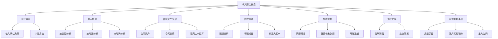

---

## 7.6.10.2 收入附注披露检查表（D4-32）

### 7.6.10.2.1 披露检查总表

**收入附注披露检查表（D4-32）示例:**

```
索引号: D4-32
被审计单位: XXX公司
审计期间: 2024年度
科目名称: 营业收入 - 附注披露检查
编制人: [姓名] 编制日期: [日期]
复核人: [姓名] 复核日期: [日期]

═══════════════════════════════════════════════
          收入相关附注披露检查清单
═══════════════════════════════════════════════

一、重要会计政策和会计估计

【披露项目1.1: 收入确认政策】

□ 是否披露收入确认的一般原则? ✓
□ 是否披露各类业务的具体收入确认政策? ✓
□ 是否披露收入确认时点/时段的判断标准? ✓
□ 是否披露可变对价的估计方法? ✓
□ 是否披露合同资产和合同负债的确认政策? ✓

**检查结论:** 披露充分 ✓

**披露示例（摘录）:**
```
三、重要会计政策和会计估计
（二十五）收入

1. 收入确认原则
本公司在履行了合同中的履约义务,即在客户取得相关商品或服务控制权时确认收入。
取得相关商品或服务控制权,是指能够主导该商品或服务的使用并从中获得几乎全部的经济利益。

2. 具体收入确认政策
（1）销售商品收入
本公司销售商品收入在客户签收商品时确认。对于出口销售,在商品报关离境时确认收入。

（2）提供服务收入
本公司提供的技术服务收入,根据已完成服务的进度在一段时间内确认收入。

（3）租金收入
本公司出租房屋、设备的租金收入,在租赁期内按直线法确认收入。

3. 可变对价
合同中存在可变对价的,本公司按照期望值或最可能发生金额确定可变对价的最佳估计数,
但包含可变对价的交易价格不超过在相关不确定性消除时,累计已确认的收入极可能不会发生重大转回的金额。
```

【披露项目1.2: 同一控制下企业合并会计政策】
（如适用）

二、营业收入和营业成本

【披露项目2.1: 营业收入和营业成本构成】

□ 是否按主营业务收入和其他业务收入分类披露? ✓
□ 是否披露收入和成本的对应关系? ✓
□ 是否披露毛利额和毛利率? ✓

**检查结论:** 披露充分 ✓

**披露示例:**
```
五、合并财务报表项目注释
（三十六）营业收入和营业成本

1. 营业收入和营业成本情况

| 项目 | 2024年度 | 2023年度 |
|------|----------|----------|
|  | 收入 | 成本 |  |  |
| 主营业务 | 80,000,000 | 56,000,000 | 70,000,000 | 50,000,000 |
| 其他业务 | 3,000,000 | 2,000,000 | 2,500,000 | 1,800,000 |
| **合计** | **83,000,000** | **58,000,000** | **72,500,000** | **51,800,000** |
```

【披露项目2.2: 主营业务收入分解信息】

□ 是否按产品类型分解? ✓
□ 是否按地区分解? ✓  
□ 是否按销售渠道分解? ✓
□ 是否按收入确认时间分解? ✓

**检查结论:** 披露充分 ✓

**披露示例:**
```
2. 主营业务收入分解信息

（1）按产品类型分解

| 产品类型 | 2024年度 | 2023年度 |
|---------|----------|----------|
| 产品A | 40,000,000 (50%) | 35,000,000 (50%) |
| 产品B | 25,000,000 (31%) | 21,000,000 (30%) |
| 产品C | 15,000,000 (19%) | 14,000,000 (20%) |
| **合计** | **80,000,000 (100%)** | **70,000,000 (100%)** |

（2）按地区分解

| 地区 | 2024年度 | 2023年度 |
|------|----------|----------|
| 华东地区 | 35,000,000 (44%) | 28,000,000 (40%) |
| 华南地区 | 25,000,000 (31%) | 21,000,000 (30%) |
| 华北地区 | 15,000,000 (19%) | 14,000,000 (20%) |
| 其他地区 | 5,000,000 (6%) | 7,000,000 (10%) |
| **合计** | **80,000,000 (100%)** | **70,000,000 (100%)** |

（3）按收入确认时间分解

| 收入确认时间 | 2024年度 | 2023年度 |
|------------|----------|----------|
| 在某一时点确认 | 75,000,000 (94%) | 65,000,000 (93%) |
| 在某一时段确认 | 5,000,000 (6%) | 5,000,000 (7%) |
| **合计** | **80,000,000 (100%)** | **70,000,000 (100%)** |
```

【披露项目2.3: 其他业务收入构成】

□ 是否披露其他业务收入明细? ✓
□ 重大其他业务收入是否单独披露? ✓

**披露示例:**
```
3. 其他业务收入构成

| 项目 | 2024年度 | 2023年度 |
|------|----------|----------|
| 租金收入 | 1,200,000 | 1,000,000 |
| 材料销售 | 800,000 | 600,000 |
| 特许权使用费 | 500,000 |  |
| 其他 | 500,000 | 400,000 |
| **合计** | **3,000,000** | **2,500,000** |
```

三、应收账款

【披露项目3.1: 应收账款基本情况】

□ 是否披露应收账款账面余额、坏账准备、账面价值? ✓
□ 是否披露期初期末变动情况? ✓

**披露示例:**
```
（五）应收账款

1. 应收账款分类披露

| 类别 | 2024年12月31日 | 2023年12月31日 |
|------|---------------|---------------|
|  | 账面余额 | 坏账准备 | 账面价值 |  |  |  |
| 单项计提 | 1,000,000 | (500,000) | 500,000 | 800,000 | (400,000) | 400,000 |
| 按组合计提 | 21,000,000 | (1,050,000) | 19,950,000 | 18,000,000 | (900,000) | 17,100,000 |
| **合计** | **22,000,000** | **(1,550,000)** | **20,450,000** | **18,800,000** | **(1,300,000)** | **17,500,000** |
```

【披露项目3.2: 应收账款账龄分析】

□ 是否披露账龄分析? ✓
□ 是否披露各账龄段的坏账准备计提比例? ✓

**披露示例:**
```
2. 按账龄披露

| 账龄 | 2024年12月31日 | 2023年12月31日 |
|------|---------------|---------------|
| 1年以内 | 15,000,000 | 13,000,000 |
| 1-2年 | 4,000,000 | 3,500,000 |
| 2-3年 | 2,000,000 | 1,500,000 |
| 3年以上 | 1,000,000 | 800,000 |
| **合计** | **22,000,000** | **18,800,000** |

3. 坏账准备计提情况

| 账龄 | 计提比例 | 2024年12月31日坏账准备 |
|------|---------|---------------------|
| 1年以内 | 5% | 750,000 |
| 1-2年 | 10% | 400,000 |
| 2-3年 | 30% | 600,000 |
| 3年以上 | 50% | 500,000 |
| 单项计提 | - | 500,000 |
| **合计** | | **2,750,000** |
```

【披露项目3.3: 前五大应收账款】

□ 是否披露前五大应收账款客户名称? ✓
□ 是否披露金额和占比? ✓
□ 是否披露账龄? ✓

**披露示例:**
```
4. 按欠款方归集的期末余额前五名的应收账款情况

| 单位名称 | 期末余额 | 占应收账款总额比例 | 坏账准备期末余额 |
|---------|---------|------------------|---------------|
| 客户A | 3,000,000 | 13.6% | 150,000 |
| 客户B | 2,500,000 | 11.4% | 125,000 |
| 客户C | 2,000,000 | 9.1% | 100,000 |
| 客户D | 1,500,000 | 6.8% | 75,000 |
| 客户E | 1,200,000 | 5.5% | 60,000 |
| **合计** | **10,200,000** | **46.4%** | **510,000** |
```

【披露项目3.4: 应收关联方款项】

□ 是否单独披露关联方应收账款? ✓
□ 是否披露关联关系性质? ✓

**披露示例:**
```
5. 应收关联方账款情况

本期应收账款中应收关联方款项情况详见附注"十、关联方及关联交易"。
```

四、应收票据

【披露项目4.1: 应收票据基本情况】

□ 是否披露应收票据账面余额、坏账准备、账面价值? ✓
□ 是否区分银行承兑汇票和商业承兑汇票? ✓

**披露示例:**
```
（六）应收票据

1. 应收票据分类列示

| 项目 | 2024年12月31日 | 2023年12月31日 |
|------|---------------|---------------|
| 银行承兑汇票 | 1,200,000 | 1,000,000 |
| 商业承兑汇票 | 285,000 | 250,000 |
| 小计 | 1,485,000 | 1,250,000 |
| 减:坏账准备 | (15,000) | (12,000) |
| **合计** | **1,470,000** | **1,238,000** |

说明:商业承兑汇票按5%计提坏账准备,银行承兑汇票不计提坏账准备。
```

【披露项目4.2: 已背书或贴现未到期票据】

□ 是否披露已背书或贴现且在资产负债表日尚未到期的应收票据? ✓
□ 是否区分终止确认和未终止确认? ✓

**披露示例:**
```
2. 期末公司已背书或贴现且在资产负债表日尚未到期的应收票据

| 项目 | 期末终止确认金额 | 期末未终止确认金额 |
|------|----------------|------------------|
| 银行承兑汇票 | 5,000,000 | 0 |
| 商业承兑汇票 | 0 | 1,200,000 |
| **合计** | **5,000,000** | **1,200,000** |

说明:
（1）期末已背书未到期的银行承兑汇票500万元,因承兑银行信用等级较高,
     相关票据背书不附追索权,本公司已终止确认。
（2）期末已背书未到期的商业承兑汇票120万元,因背书附有追索权,
     本公司未终止确认,在"短期借款"科目列示。
```

五、合同资产和合同负债

【披露项目5.1: 合同资产】

□ 是否披露合同资产账面价值及变动? ✓
□ 是否披露坏账准备计提情况? ✓

**披露示例:**
```
（十二）合同资产

1. 合同资产情况

| 项目 | 2024年12月31日 | 2023年12月31日 |
|------|---------------|---------------|
|  | 账面余额 | 减值准备 | 账面价值 |  |  |  |
| 应收质保金 | 2,000,000 | (100,000) | 1,900,000 | 1,500,000 | (75,000) | 1,425,000 |
| 已完工未结算 | 3,000,000 | (150,000) | 2,850,000 | 2,500,000 | (125,000) | 2,375,000 |
| **合计** | **5,000,000** | **(250,000)** | **4,750,000** | **4,000,000** | **(200,000)** | **3,800,000** |

2. 合同资产减值准备计提情况

本期计提合同资产减值准备50,000元。
```

【披露项目5.2: 合同负债】

□ 是否披露合同负债账面价值? ✓
□ 是否分析合同负债变动原因? ✓

**披露示例:**
```
（二十五）合同负债

1. 合同负债情况

| 项目 | 2024年12月31日 | 2023年12月31日 |
|------|---------------|---------------|
| 预收货款 | 8,000,000 | 6,000,000 |
| 待转销项税额 | 1,040,000 | 780,000 |
| **合计** | **9,040,000** | **6,780,000** |

2. 本期合同负债增加原因
本期合同负债较上期增加2,260,000元,主要系预收客户F货款3,000,000元,
该批货物将于2025年1月交付。
```

六、关联方交易

【披露项目6.1: 关联方销售】

□ 是否披露关联方销售金额? ✓
□ 是否披露占同类交易比例? ✓
□ 是否披露定价政策? ✓

**披露示例:**
```
十、关联方及关联交易

（五）关联交易情况

1. 购销商品、提供和接受劳务的关联交易

（1）销售商品/提供劳务情况

| 关联方 | 关联交易内容 | 2024年度 | 2023年度 | 定价政策 |
|--------|------------|----------|----------|---------|
| 关联方甲 | 销售产品 | 3,000,000 | 2,500,000 | 参考市场价 |
| 关联方乙 | 租金收入 | 400,000 |  | 参考市场价 |
| **合计** | | **3,400,000** | **2,900,000** | |

占当期营业收入的比例: 4.1% (2024年), 4.0% (2023年)

2. 关联交易定价政策
本公司与关联方之间的交易定价参考市场价格协商确定。
```

七、承诺及或有事项

【披露项目7.1: 重大合同承诺】

□ 是否披露资产负债表日存在的重要承诺? ✓
□ 是否披露未来需履行的重大销售合同? ✓

**披露示例:**
```
十一、承诺及或有事项

（一）重要承诺事项

截至2024年12月31日,本公司已签订但尚未执行的重大销售合同如下:

| 客户名称 | 合同金额 | 预计交货时间 | 备注 |
|---------|---------|-------------|------|
| 客户G | 10,000,000 | 2025年3月 | 定制设备 |
| 客户H | 8,000,000 | 2025年6月 | 批量订单 |
| **合计** | **18,000,000** | | |

上述合同预计于2025年度确认收入。
```

八、资产负债表日后事项

【披露项目8.1: 期后销售退回】

□ 是否披露资产负债表日后的重要销售退回? ✓

**披露示例:**
```
十二、资产负债表日后事项

（一）重要的非调整事项

1. 销售退回
2025年1月,客户I因产品质量问题退回2024年12月销售的商品,
退货金额1,000,000元。公司已在2024年度计提预计负债800,000元。

该事项对2024年度财务报表的影响:已充分考虑并计提预计负债。
```

九、其他重要事项

【披露项目9.1: 分部信息】

□ 如适用,是否披露分部收入信息? ✓

【披露项目9.2: 政府补助】

□ 与收入相关的政府补助是否披露? ✓

【披露项目9.3: 租赁】

□ 作为出租人的经营租赁信息是否披露? ✓

**披露示例:**
```
十三、其他重要事项

（三）作为出租人

1. 经营租赁

（1）租赁收入

| 项目 | 2024年度 | 2023年度 |
|------|----------|----------|
| 租赁收入 | 1,200,000 | 1,000,000 |
| 其中:未纳入租赁收款额计量的可变租赁付款额相关收入 | 0 |  |

（2）经营租赁资产
列示于固定资产的经营租赁资产账面原值12,000,000元,累计折旧3,000,000元,
账面价值9,000,000元。

（3）根据与承租人签订的租赁合同,不可撤销租赁未来将收到的租赁收款额如下:

| 期间 | 金额 |
|------|------|
| 1年以内 | 1,200,000 |
| 1至2年 | 1,200,000 |
| 2至3年 | 600,000 |
| **合计** | **3,000,000** |
```

═══════════════════════════════════════════════
               披露检查总结
═══════════════════════════════════════════════

【披露完整性评估】
□ 所有必需披露项目是否已披露? ✓
□ 重要性项目是否充分披露? ✓
□ 新收入准则特殊披露要求是否满足? ✓

【披露准确性评估】
□ 披露金额与账面记录是否一致? ✓
□ 披露金额与审定表是否勾稽? ✓
□ 披露数据计算是否准确? ✓

【披露充分性评估】
□ 对理解财务报表重要的信息是否充分披露? ✓
□ 会计政策和会计估计是否清晰说明? ✓
□ 重大异常事项是否充分解释? ✓

【总体审计结论】
收入相关附注披露完整、准确、充分,符合企业会计准则要求。✓
```

---

## 7.6.10.3 新收入准则特殊披露要求

### 7.6.10.3.1 履约义务披露

**披露要求（CAS 14第四十条）:**

```
企业应当披露与履约义务相关的下列信息:
1. 履约义务通常的履行时间（例如在交付、转让商品时或提供服务时）
2. 重要的付款条款（例如承诺的对价是否包含可变对价）
3. 企业承诺转让的商品的性质（包括说明企业是主要责任人还是代理人）
4. 企业承担的预期将退还给客户的款项及其他类似义务
5. 质量保证的类型及相关义务
```

**披露示例:**

```
（二十五）收入

4. 履约义务的说明

本公司的收入主要来源于以下业务类型:

（1）产品销售
履约义务: 本公司承诺向客户转让产品。
履行时间: 在客户签收产品时履行履约义务。
付款条款: 客户应在签收后30天内支付货款。
退货政策: 产品如存在质量问题,客户可在30天内退货。

（2）技术服务
履约义务: 本公司承诺向客户提供技术咨询服务。
履行时间: 在提供服务过程中持续履行履约义务。
付款条款: 按服务进度收取款项,服务完成后结清尾款。

（3）设备租赁
履约义务: 本公司承诺在租赁期内向客户提供设备使用权。
履行时间: 在租赁期内持续履行履约义务。
付款条款: 租金按月或按季度支付。
```

---

### 7.6.10.3.2 分摊至剩余履约义务的交易价格

**披露要求（CAS 14第四十一条）:**

```
企业应当披露分摊至尚未履行（或部分未履行）履约义务的交易价格总额,
以及预期确认为收入的时间。
```

**披露示例:**

```
5. 分摊至剩余履约义务的交易价格

截至2024年12月31日,本公司合同负债中分摊至尚未履行（或部分未履行）
履约义务的交易价格为9,040,000元,预计确认为收入的时间如下:

| 期间 | 金额 |
|------|------|
| 1年以内 | 8,000,000 |
| 1至2年 | 800,000 |
| 2年以上 | 240,000 |
| **合计** | **9,040,000** |
```

---

### 7.6.10.3.3 与合同成本有关的资产

**披露要求:**

```
企业应当披露与合同成本有关的资产的摊销及减值信息。
```

**披露示例:**

```
（十三）合同取得成本

本公司为取得合同发生的增量成本（主要为销售佣金）预期能够收回的,
确认为一项资产（合同取得成本）。

| 项目 | 2024年12月31日 | 2023年12月31日 |
|------|---------------|---------------|
| 合同取得成本 | 500,000 | 400,000 |
| 减:减值准备 | 0 |  |
| **账面价值** | **500,000** | **400,000** |

本期摊销额: 600,000元
本期减值损失: 0元

合同取得成本按预计服务期限（通常为2-3年）摊销。
```

---

## 7.6.10.4 IPO项目披露特殊要求

### 7.6.10.4.1 收入波动分析

**披露要求（交易所审核关注）:**

```
招股说明书应当充分披露:
1. 报告期内收入的变动情况及原因
2. 收入季节性波动情况及原因
3. 收入与行业趋势的对比分析
4. 收入增长的可持续性分析
```

**披露示例（招股说明书摘录）:**

```
（一）营业收入变动分析

报告期内,公司营业收入分别为50,000,000元、70,000,000元和90,000,000元,
年均复合增长率为34.16%。收入持续增长的主要原因如下:

1. 市场需求增长
公司所处行业保持快速增长,报告期内行业规模年均增长30%。

2. 市场份额提升
公司通过技术创新和市场开拓,市场份额从2022年的5%提升至2024年的8%。

3. 产品结构优化
高毛利产品A销售占比从2022年的40%提升至2024年的50%。

4. 客户结构改善
重点客户数量从2022年的150家增加至2024年的220家,客户集中度下降。
```

---

### 7.6.10.4.2 客户集中度披露

**披露示例:**

```
（二）客户集中度分析

报告期内,公司前五大客户销售额及占比如下:

| 年度 | 前五大客户销售额 | 占营业收入比例 |
|------|----------------|--------------|
| 2022年 | 25,000,000 | 50% |
| 2023年 | 32,000,000 | 46% |
| 2024年 | 38,000,000 | 42% |

公司前五大客户占比逐年下降,客户集中度风险降低。
公司不存在向单一客户销售占比超过50%的情况。

各期前五大客户具体情况详见招股说明书"第六节 业务与技术"之
"三、发行人销售情况和主要客户"。
```

---

## 7.6.10.5 附注披露常见错误

### ⚠️ 披露常见错误提醒

❌ **错误1: 披露金额与账面记录不一致**
✅ 正确: 附注披露金额必须与账面记录、审定表勾稽一致。

❌ **错误2: 遗漏重要披露项目**
✅ 正确: 对照准则要求,逐项检查,确保无遗漏。

❌ **错误3: 前五大应收账款披露客户名称不准确**
✅ 正确: 必须披露准确的客户全称。

❌ **错误4: 关联交易披露不充分**
✅ 正确: 关联交易必须充分披露,包括金额、占比、定价政策。

❌ **错误5: 新收入准则特殊披露要求未满足**
✅ 正确: 必须满足CAS 14关于履约义务、合同资产/负债等的特殊披露要求。

❌ **错误6: 会计政策披露过于简单**
✅ 正确: 会计政策应详细披露各类业务的具体确认政策。

---

## 7.6.10.6 附注披露审计检查清单

### 📋 完整检查清单

**□ 会计政策披露**
- [ ] 收入确认的一般原则是否披露？
- [ ] 各类业务的具体确认政策是否披露？
- [ ] 可变对价估计方法是否披露？
- [ ] 合同资产/负债确认政策是否披露？

**□ 收入构成披露**
- [ ] 是否按主营/其他业务分类披露？
- [ ] 主营业务收入是否按产品、地区、渠道分解？
- [ ] 是否按收入确认时间（时点/时段）分解？
- [ ] 其他业务收入是否披露明细？

**□ 应收账款披露**
- [ ] 账面余额、坏账准备、账面价值是否披露？
- [ ] 账龄分析是否披露？
- [ ] 坏账准备计提比例是否披露？
- [ ] 前五大应收账款是否披露？
- [ ] 关联方应收账款是否单独披露？

**□ 应收票据披露**
- [ ] 是否区分银行承兑汇票和商业承兑汇票？
- [ ] 已背书未到期票据是否披露？
- [ ] 是否区分终止确认和未终止确认？
- [ ] 商业承兑汇票坏账准备是否披露？

**□ 合同资产/负债披露**
- [ ] 合同资产账面价值及减值准备是否披露？
- [ ] 合同负债账面价值是否披露？
- [ ] 合同负债重大变动原因是否说明？
- [ ] 分摊至剩余履约义务的交易价格是否披露？

**□ 关联交易披露**
- [ ] 关联方销售金额是否披露？
- [ ] 占同类交易比例是否披露？
- [ ] 定价政策是否披露？
- [ ] 关联方名称及关联关系是否披露？

**□ 新收入准则特殊要求**
- [ ] 履约义务的性质和履行时间是否披露？
- [ ] 重要付款条款是否披露？
- [ ] 主要责任人vs代理人判断是否披露？
- [ ] 质量保证类型是否披露？
- [ ] 客户奖励积分（如有）是否披露？

**□ 其他重要披露**
- [ ] 重大合同承诺是否披露？
- [ ] 期后重大销售退回是否披露？
- [ ] 作为出租人的租赁信息是否披露？
- [ ] 与收入相关的政府补助是否披露？

**□ IPO特殊要求（如适用）**
- [ ] 收入波动分析是否充分？
- [ ] 客户集中度是否披露？
- [ ] 客户情况是否披露？
- [ ] 收入季节性波动是否说明？

---

### 💡 附注披露审计实用技巧

**技巧1: 建立披露检查清单**
- ✓ 根据准则要求,建立详细的披露检查清单
- ✓ 逐项核对,确保无遗漏
- ✓ 特别关注新准则的特殊披露要求

**技巧2: 核对披露金额勾稽关系**
- ✓ 附注披露金额与审定表勾稽
- ✓ 明细金额汇总与总额一致
- ✓ 本期数与上期数衔接

**技巧3: 关注披露的充分性**
- ✓ 不仅要披露数字,还要说明原因
- ✓ 重大变动需充分解释
- ✓ 异常事项需特别说明

**技巧4: 参考同行业上市公司披露**
- ✓ 学习同行业优秀披露案例
- ✓ 确保披露水平不低于行业标准
- ✓ IPO项目尤其需要参考同行披露

**技巧5: 与管理层充分沟通**
- ✓ 重要披露事项需与管理层确认
- ✓ 专业术语需确保管理层理解
- ✓ 披露内容需经管理层审阅确认

---

## 7.6.10.7 披露审计总结

**附注披露审计是销售循环审计的"最后一环",直接关系到审计报告的出具。**

**核心要点:**
1. **完整性:** 对照准则要求,确保所有必需披露项目均已披露
2. **准确性:** 披露金额与账面记录、审定表勾稽一致
3. **充分性:** 重要信息披露详细,使用者能够充分理解
4. **合规性:** 符合企业会计准则、交易所规则等监管要求

**审计结论示例:**
```
经审计,XXX公司2024年度财务报表附注中与营业收入相关的披露完整、准确、充分,
符合《企业会计准则第30号——财务报表列报》及相关准则的要求。

对于新收入准则（CAS 14）要求的特殊披露事项,公司已充分披露履约义务、
合同资产/负债等信息,披露充分。

对于关联交易,公司已充分披露关联方销售金额、占比及定价政策,披露充分。

综上,收入相关附注披露符合企业会计准则要求,无需调整。✓
```

---

---

## 7.6.11 合同资产审计（D6系列）

> **📋 本节核心要点**
>
> - ✅ 合同资产是指企业已向客户转让商品而**有权收取对价的权利**（且该权利**取决于时间流逝之外的其他因素**）
> - ✅ 合同资产与应收账款的区别：应收账款是**无条件**收款权，合同资产是**有条件**收款权
> - ✅ 合同资产审计**参照D2应收账款系列**，重点关注履约进度、对价分摊、减值测试
>
> **关键底稿：** D6A合同资产实质性程序表、D6-1合同资产审定表
>
> **风险提示：** ⚠️ 合同资产分类错误（与应收账款混淆）、减值准备计提不充分

## 7.6.11.1 合同资产概述

### 什么是合同资产？

根据《企业会计准则第14号——收入》（2017修订）：

**合同资产**：企业已向客户转让商品而有权收取对价的权利（该权利取决于时间流逝之外的其他因素）。

### 合同资产 vs 应收账款

| 对比维度 | 合同资产 | 应收账款 |
|----------|----------|----------|
| **收款权性质** | 有条件收款权 | 无条件收款权（仅取决于时间流逝） |
| **典型场景** | 已完成阶段性履约但需等待后续里程碑 | 已交付商品或完成服务，客户负有付款义务 |
| **示例** | 建造合同中已完成部分工作但需整体验收才能收款 | 赊销商品，客户到期应付款 |
| **减值测试** | 按预期信用损失模型计提减值 |  |
| **列报** | 作为资产列报（流动或非流动） | 作为应收账款列报 |

**审计关注点：**
- ⚠️ 企业是否正确区分合同资产和应收账款
- ⚠️ 合同资产转换为应收账款的时点是否恰当
- ⚠️ 合同资产减值准备计提是否充分

## 7.6.11.2 合同资产实质性程序表（D6A）

**索引号：D6A**

### 一、审计目标

| 审计目标 | 具体要求 |
|----------|----------|
| **存在** | 合同资产对应的合同真实存在，履约义务已部分履行 |
| **完整性** | 所有符合条件的合同资产均已确认 |
| **准确性** | 合同资产金额计算准确，履约进度合理 |
| **计价** | 减值准备计提充分 |
| **分类** | 合同资产与应收账款分类正确 |
| **披露** | 附注披露完整充分 |

### 二、实质性审计程序

| 序号 | 审计程序 | 执行情况 | 工作底稿索引 | 备注 |
|------|----------|----------|-------------|------|
| 1 | 获取合同资产明细表，与总账、明细账核对 | | D6-1 | |
| 2 | 检查合同资产对应的合同，确认履约义务识别正确 | | D4-19 | 参照新收入准则 |
| 3 | 测试履约进度计量方法的合理性 | | D4-17 | 投入法/产出法 |
| 4 | 测试合同资产金额计算的准确性 | | D6-1 | 交易价格×履约进度 |
| 5 | 检查合同资产转为应收账款的时点和金额 | | D6-1 | 取得无条件收款权时 |
| 6 | 测试合同资产减值准备计提的充分性 | | D2-11 | 参照应收账款ECL模型 |
| 7 | 检查合同资产的列报分类 | | D4-32 | 流动/非流动 |
| 8 | 检查合同资产的附注披露 | | D4-32 | |

### 三、参照应收账款审计程序

由于合同资产在性质上与应收账款高度相似，以下审计程序**参照D2应收账款系列**：

| 参照程序 | 底稿索引 | 说明 |
|----------|----------|------|
| 函证程序 | D0-1 | 向客户函证合同资产余额 |
| 账龄分析 | D2-4 | 分析合同资产账龄结构 |
| 减值测试 | D2-11 | 按ECL模型计提减值 |
| 期后回款检查 | D2-6 | 检查合同资产转为应收账款及回款情况 |

**审计说明：**
> 合同资产审计程序已全面执行，合同资产确认准确，分类正确，减值准备计提充分。

**审计结论：**
> 合同资产审计未发现重大异常。

---

## 7.6.11.3 合同资产审定表（D6-1）

**索引号：D6-1**

### 一、合同资产余额汇总

**被审计单位：__________公司**  
**科目名称：合同资产**  
**期间：2024年度**

| 项目 | 期初余额 | 本期增加 | 转为应收账款 | 减值准备 | 期末余额 |
|------|----------|----------|-------------|----------|----------|
| 合同资产 | 5,000,000 | 8,000,000 | (10,000,000) | (150,000) | 2,850,000 |
| 其中：A项目 | 2,000,000 | 0 | (2,000,000) |  |  |
| B项目 | 3,000,000 | 5,000,000 | (8,000,000) | 0 |  |
| C项目 | 0 | 3,000,000 |  | (150,000) | 2,850,000 |

**勾稽检查：**
- ☑ 期末余额与总账、明细账一致 ✓
- ☑ 期初余额与上期审定数一致 ✓
- ☑ 本期增加与合同台账核对一致 ✓
- ☑ 转为应收账款金额与应收账款增加核对一致 ✓

### 二、合同资产明细

| 合同编号 | 客户名称 | 合同金额 | 履约进度(%) | 应确认收入 | 已开票/应收账款 | 合同资产 | 账龄 | 预计转换日期 |
|----------|----------|----------|-----------|-----------|---------------|----------|------|-------------|
| C2024-001 | 甲公司 | 10,000,000 | 30% | 3,000,000 | 0 |  | 6个月内 | 2025-06-30 |
| C2024-002 | 乙公司 | 5,000,000 | 20% | 1,000,000 | 850,000 | 150,000 | 3个月内 | 2025-03-31 |
| **合计** | | | | **4,000,000** | **850,000** | **3,150,000** | | |

**减值准备：**
| 项目 | 合同资产 | 预期信用损失率 | 减值准备 |
|------|----------|---------------|----------|
| C2024-001 | 3,000,000 | 5% | 150,000 |
| C2024-002 | 150,000 | 0% | 0 |
| **合计** | **3,150,000** | | **150,000** |

### 三、合同资产转为应收账款明细

| 合同编号 | 客户名称 | 合同资产期初 | 本期履约进度 | 本期转为应收账款 | 转换时点 | 转换依据 |
|----------|----------|-------------|-------------|-----------------|----------|----------|
| C2023-050 | A公司 | 2,000,000 | 100% |  | 2024-03-31 | 整体验收合格 |
| C2023-088 | B公司 | 3,000,000 | 100% | 8,000,000 | 2024-08-31 | 取得无条件收款权 |
| **合计** | | **5,000,000** | | **10,000,000** | | |

**审计验证：**
- ✓ 已获取验收报告或客户确认函
- ✓ 转换时点符合合同约定
- ✓ 会计处理正确
- ✓ 期后已全部收款

### 四、合同资产vs应收账款分类检查

| 项目 | 金额 | 收款权性质 | 分类 | 是否正确 | 备注 |
|------|------|----------|------|----------|------|
| C2024-001 | 3,000,000 | 需等待整体验收才能收款 | 合同资产 | ✓ | 有条件收款权 |
| C2024-002 | 150,000 | 需完成剩余80%才能收全款 | 合同资产 | ✓ | 部分有条件 |
| D2024-100 | 5,000,000 | 已交付，客户负有付款义务 | 应收账款 | ✓ | 无条件收款权 |

**审计说明：**
> 合同资产与应收账款分类正确，符合新收入准则要求。

**审计结论：**
> 合同资产审定表编制完整准确，合同资产确认和计量符合企业会计准则要求。

---

## 7.6.11.4 合同资产审计要点

### 💡 合同资产审计实用技巧

**技巧1：重点关注分类正确性**
- ✓ 合同资产最常见错误是与应收账款混淆
- ✓ 判断标准：是否取得**无条件**收款权
- ✓ 关键时点：何时从"有条件"变为"无条件"

**技巧2：参照应收账款审计程序**
- ✓ 合同资产减值测试参照应收账款ECL模型
- ✓ 函证、账龄分析、期后回款检查等程序均适用
- ✓ 但要特别关注合同约定的条件是否满足

**技巧3：关注履约进度合理性**
- ✓ 投入法：成本投入/预计总成本
- ✓ 产出法：已完成工作量/合同总工作量
- ✓ 履约进度直接影响合同资产金额

### ⚠️ 合同资产审计常见错误

❌ **错误1：将合同资产错误分类为应收账款**
✅ 正确：仔细判断收款权的条件，有条件的应确认为合同资产。

❌ **错误2：未对合同资产计提减值准备**
✅ 正确：合同资产也应按ECL模型计提减值准备。

❌ **错误3：合同资产转为应收账款时点不当**
✅ 正确：应在取得无条件收款权时（如验收合格、达到里程碑）才能转换。

### 📋 合同资产审计检查清单

**□ 余额核对**
- [ ] 合同资产明细表是否与总账、明细账一致？
- [ ] 期初余额是否与上期审定数一致？
- [ ] 本期变动是否合理？

**□ 确认与计量**
- [ ] 合同资产对应的合同是否真实存在？
- [ ] 履约义务识别是否正确？
- [ ] 履约进度计量方法是否合理？
- [ ] 合同资产金额计算是否准确？

**□ 分类**
- [ ] 合同资产与应收账款分类是否正确？
- [ ] 合同资产转为应收账款的时点是否恰当？
- [ ] 转换依据是否充分（验收报告、客户确认等）？

**□ 减值**
- [ ] 是否按ECL模型计提减值准备？
- [ ] 减值准备计提是否充分？
- [ ] 客户信用风险是否合理评估？

**□ 披露**
- [ ] 合同资产账面价值是否披露？
- [ ] 减值准备变动是否披露？
- [ ] 重大合同资产是否单独说明？

---

## 7.6.12 应收款项融资审计（D5系列）

> **📋 本节核心要点**
>
> - ✅ 应收款项融资是指企业将**应收票据等应收款项**以**公允价值计量且其变动计入其他综合收益**的金融资产
> - ✅ 典型业务：应收票据贴现、背书转让、保理等
> - ✅ 应收款项融资审计**参照D1应收票据系列**，重点关注分类、终止确认、公允价值计量
>
> **关键底稿：** D5A应收款项融资实质性程序表、D5-1应收款项融资审定表
>
> **风险提示：** ⚠️ 业务模式判断错误、终止确认条件不满足、公允价值计量不准确

## 7.6.12.1 应收款项融资概述

### 什么是应收款项融资？

根据《企业会计准则第22号——金融工具确认和计量》（2017修订）：

**应收款项融资**：同时符合以下条件的应收票据、应收账款等应收款项：
1. **业务模式**：既以收取合同现金流量为目标又以出售该金融资产为目标
2. **合同现金流特征**：仅为对本金和以未偿付本金金额为基础的利息的支付（SPPI测试通过）

**计量方式**：以**公允价值计量且其变动计入其他综合收益**

### 应收款项融资 vs 应收票据 vs 交易性金融资产

| 对比维度 | 应收票据 | 应收款项融资 | 交易性金融资产 |
|----------|----------|-------------|---------------|
| **业务模式** | 持有收款 | 持有并出售 | 交易目的 |
| **计量方式** | 摊余成本 | 公允价值（OCI） | 公允价值（损益） |
| **票据类型** | 商业承兑汇票、银行承兑汇票 | 银行承兑汇票（信用等级高） | 高流动性票据 |
| **贴现/背书** | 作为或有负债披露（未终止确认） | 可能终止确认 | 直接终止确认 |

**审计关注点：**
- ⚠️ 业务模式判断是否正确（关键！）
- ⚠️ SPPI测试是否通过
- ⚠️ 终止确认判断是否恰当
- ⚠️ 公允价值计量是否合理

## 7.6.12.2 应收款项融资实质性程序表（D5A）

**索引号：D5A**

### 一、审计目标

| 审计目标 | 具体要求 |
|----------|----------|
| **分类** | 业务模式判断正确，分类为应收款项融资恰当 |
| **计量** | 公允价值计量准确 |
| **终止确认** | 贴现、背书、保理等业务终止确认判断正确 |
| **披露** | 附注披露完整充分 |

### 二、实质性审计程序

| 序号 | 审计程序 | 执行情况 | 工作底稿索引 | 备注 |
|------|----------|----------|-------------|------|
| 1 | 获取应收款项融资明细表，与总账、明细账核对 | | D5-1 | |
| 2 | 评估业务模式，确认分类为应收款项融资是否恰当 | | D2-13 | 业务模式分析 |
| 3 | 执行SPPI测试，确认合同现金流特征 | | D1-15 | 参照应收票据 |
| 4 | 测试公允价值计量的合理性 | | D5-1 | 通常接近账面价值 |
| 5 | 检查贴现、背书转让的终止确认判断 | | D1-10, D1-11 | 参照应收票据 |
| 6 | 检查保理业务的会计处理 | | D2-12 | 参照应收账款 |
| 7 | 检查应收款项融资的列报和披露 | | D4-32 | |

### 三、参照应收票据审计程序

应收款项融资审计程序**参照D1应收票据系列**，主要差异在于计量方式：

| 参照程序 | 底稿索引 | 说明 |
|----------|----------|------|
| 函证程序 | D0-1 | 向票据承兑人或保理公司函证 |
| 真实性检查 | D1-2 | 检查票据原件或保理合同 |
| 贴现检查 | D1-10 | 检查终止确认条件 |
| 背书检查 | D1-11 | 检查背书连续性和终止确认 |
| SPPI测试 | D1-15 | 确认合同现金流特征 |

**审计说明：**
> 应收款项融资业务模式判断合理，分类正确，公允价值计量准确。

**审计结论：**
> 应收款项融资审计未发现重大异常。

---

## 7.6.12.3 应收款项融资审定表（D5-1）

**索引号：D5-1**

### 一、应收款项融资余额汇总

**被审计单位：__________公司**  
**科目名称：应收款项融资**  
**期间：2024年度**

| 项目 | 期初余额 | 本期增加 | 本期减少 | 公允价值变动 | 期末余额 |
|------|----------|----------|----------|-------------|----------|
| 银行承兑汇票 | 10,000,000 | 50,000,000 | (48,000,000) | 0 | 12,000,000 |
| 应收账款保理 | 0 | 5,000,000 | (3,000,000) |  | 2,000,000 |
| **合计** | **10,000,000** | **55,000,000** | **(51,000,000)** | **0** | **14,000,000** |

**勾稽检查：**
- ☑ 期末余额与总账、明细账一致 ✓
- ☑ 期初余额与上期审定数一致 ✓
- ☑ 本期增加与票据台账/保理台账核对一致 ✓
- ☑ 本期减少（贴现、背书、到期）合理 ✓

### 二、应收款项融资明细（银行承兑汇票）

| 票据号码 | 出票人 | 承兑人 | 票面金额 | 出票日 | 到期日 | 账面价值 | 公允价值 | 是否贴现 | 备注 |
|----------|--------|--------|----------|--------|--------|----------|----------|----------|------|
| 20240001 | A公司 | 工商银行 | 5,000,000 | 2024-10-01 | 2025-04-01 |  |  | 否 | 持有到期 |
| 20240002 | B公司 | 建设银行 | 7,000,000 | 2024-11-01 | 2025-05-01 |  |  | 否 | 持有到期 |
| **合计** |  |  | **12,000,000** |  |  |  |  |  |  |

### 三、应收款项融资明细（保理）

| 保理编号 | 应收账款客户 | 保理公司 | 应收账款金额 | 保理金额 | 保理费率 | 是否终止确认 | 备注 |
|----------|-------------|----------|-------------|----------|----------|-------------|------|
| BL2024-01 | C公司 | XX保理公司 | 2,500,000 | 2,000,000 | 2% | 否 | 有追索权 |
| **合计** | | | **2,500,000** | **2,000,000** | | | |

### 四、业务模式分析

**业务模式目标：**
- ☑ 企业持有应收票据的业务模式包括：① 收取票据到期款项；② 贴现或背书转让票据
- ☑ 2024年度，企业持有到期的票据金额30,000,000元，贴现或背书的票据金额48,000,000元
- ☑ 贴现/背书占比：48,000,000 / (48,000,000 + 30,000,000) = **61.5%**
- ☑ 结论：业务模式为"**持有并出售**"，分类为应收款项融资**正确** ✓

### 五、SPPI测试

| 测试项目 | 测试结果 | 结论 |
|----------|----------|------|
| 合同现金流是否仅为本金和利息 | 是（银行承兑汇票无利息，保理按固定利率） | 通过 ✓ |
| 是否存在杠杆特征 | 否 | 通过 ✓ |
| 提前还款条款是否合理 | 不适用（票据到期一次性支付） | 通过 ✓ |

**SPPI测试结论：**合同现金流特征符合SPPI要求 ✓

### 六、终止确认判断

| 业务类型 | 笔数 | 金额 | 风险报酬转移 | 控制权转移 | 是否终止确认 | 会计处理 |
|----------|------|------|-------------|-----------|-------------|----------|
| 银行承兑汇票贴现 | 20 | 35,000,000 | 是 |  |  | 终止确认 |
| 银行承兑汇票背书 | 15 | 13,000,000 | 是 |  |  | 终止确认 |
| 有追索权保理 | 1 | 2,000,000 | 否 |  |  | 不终止确认 |

**审计说明：**
> 应收款项融资业务模式判断合理，SPPI测试通过，公允价值计量准确，终止确认判断恰当。

**审计结论：**
> 应收款项融资审定表编制完整准确，符合企业会计准则要求。

---

## 7.6.12.4 应收款项融资审计要点

### 💡 应收款项融资审计实用技巧

**技巧1：重点关注业务模式判断**
- ✓ 业务模式是分类的关键
- ✓ 需要综合考虑历史数据和管理层意图
- ✓ 持有并出售：贴现/背书占比通常>30%

**技巧2：公允价值通常接近账面**
- ✓ 银行承兑汇票流动性强，公允价值≈面值
- ✓ 应收账款保理，公允价值≈保理金额
- ✓ 通常无需单独估值

**技巧3：参照应收票据和应收账款程序**
- ✓ 票据类：参照D1应收票据
- ✓ 应收账款类（保理）：参照D2应收账款
- ✓ 终止确认判断：参照D1-10、D2-12

### ⚠️ 应收款项融资审计常见错误

❌ **错误1：业务模式判断错误**
✅ 正确：应基于实际业务情况判断，不能仅依据管理层意图。

❌ **错误2：未执行SPPI测试**
✅ 正确：所有金融资产分类前都应执行SPPI测试。

❌ **错误3：有追索权保理错误终止确认**
✅ 正确：有追索权保理通常不满足终止确认条件。

---

## 7.6.13 合同负债与预收账款审计（D3A、D7系列）

> **📋 本节核心要点**
>
> - ✅ 合同负债是指企业已收或应收客户对价而**应向客户转让商品的义务**
> - ✅ 新准则下，"预收账款"重分类为"合同负债"（属于负债性质）
> - ✅ 合同负债审计重点：完整性、期后履约情况、收入确认时点
>
> **关键底稿：** D3A预收账款转合同负债程序表、D7A合同负债实质性程序表、D7-1合同负债审定表
>
> **风险提示：** ⚠️ 未转换为合同负债、提前确认收入、遗漏预收款项

## 7.6.13.1 合同负债概述

### 什么是合同负债？

根据《企业会计准则第14号——收入》（2017修订）：

**合同负债**：企业已收或应收客户对价而应向客户转让商品的义务。

### 预收账款 → 合同负债

| 项目 | 旧准则（预收账款） | 新准则（合同负债） |
|------|------------------|------------------|
| **科目性质** | 负债科目 |  |
| **科目名称** | 预收账款 | 合同负债 |
| **列报位置** | 流动负债 | 流动负债（或非流动负债） |
| **核算内容** | 预收的货款 | 已收或应收对价对应的履约义务 |

**审计关注点：**
- ⚠️ 企业是否将预收账款正确重分类为合同负债
- ⚠️ 合同负债是否完整（是否存在未入账的预收款）
- ⚠️ 合同负债转为收入的时点是否恰当

## 7.6.13.2 预收账款转合同负债程序表（D3A）

**索引号：D3A**

### 一、审计目标

| 审计目标 | 具体要求 |
|----------|----------|
| **科目转换** | 预收账款正确转换为合同负债 |
| **完整性** | 所有预收款项均已记录 |
| **准确性** | 金额准确无误 |

### 二、预收账款转合同负债检查

| 项目 | 2023年（旧准则） | 2024年（新准则） | 变化说明 |
|------|-----------------|-----------------|----------|
| **列报科目** | 预收账款 | 合同负债 | 科目更名 |
| **期初余额** | 5,000,000 |  | 一致 |
| **本期收款** | 15,000,000 |  | 一致 |
| **本期结转收入** | (12,000,000) |  | 一致 |
| **期末余额** | 8,000,000 |  | 一致 |

**检查结论：**
- ☑ 预收账款已全部重分类为合同负债 ✓
- ☑ 金额无差异 ✓
- ☑ 列报分类正确 ✓

### 三、合同负债完整性检查

| 检查程序 | 执行情况 | 发现问题 | 备注 |
|----------|----------|----------|------|
| 1. 获取销售合同台账，检查预收款条款 | ✓ | 无 | |
| 2. 检查银行对账单，识别预收款项 | ✓ | 无 | |
| 3. 函证主要客户的预收款余额 | ✓ | 无 | |
| 4. 检查期后发货情况，倒推期末应有预收款 | ✓ | 无 | |

**审计说明：**
> 预收账款已正确转换为合同负债，金额准确，列报分类正确。

**审计结论：**
> 预收账款转合同负债检查未发现异常。

---

## 7.6.13.3 合同负债实质性程序表（D7A）

**索引号：D7A**

### 一、审计目标

| 审计目标 | 具体要求 |
|----------|----------|
| **完整性** | 所有合同负债均已记录 |
| **准确性** | 合同负债金额准确 |
| **权利与义务** | 企业负有交付商品或提供服务的义务 |
| **计价** | 合同负债金额合理 |

### 二、实质性审计程序

| 序号 | 审计程序 | 执行情况 | 工作底稿索引 | 备注 |
|------|----------|----------|-------------|------|
| 1 | 获取合同负债明细表，与总账、明细账核对 | | D7-1 | |
| 2 | 函证主要客户的合同负债余额 | | D0-1 | |
| 3 | 检查合同负债对应的销售合同 | | D7-1 | |
| 4 | 检查收款凭证和银行对账单 | | D7-1 | |
| 5 | 检查期后发货和收入确认情况 | | D7-1 | 截止性测试 |
| 6 | 检查长期合同负债是否合理 | | D7-1 | 超过1年的 |
| 7 | 检查合同负债的列报和披露 | | D4-32 | |

**审计说明：**
> 合同负债审计程序已全面执行，合同负债完整准确，期后履约情况正常。

**审计结论：**
> 合同负债审计未发现重大异常。

---

## 7.6.13.4 合同负债审定表（D7-1）

**索引号：D7-1**

### 一、合同负债余额汇总

**被审计单位：__________公司**  
**科目名称：合同负债**  
**期间：2024年度**

| 项目 | 期初余额 | 本期增加（预收） | 本期减少（确认收入） | 期末余额 |
|------|----------|----------------|-------------------|----------|
| 合同负债 | 5,000,000 | 15,000,000 | (12,000,000) | 8,000,000 |
| 减：税费 | (150,000) | (450,000) | (360,000) | (240,000) |
| 净额 | 4,850,000 | 14,550,000 | (11,640,000) | 7,760,000 |

**勾稽检查：**
- ☑ 期末余额与总账、明细账一致 ✓
- ☑ 期初余额与上期审定数一致 ✓
- ☑ 本期增加与银行对账单核对一致 ✓
- ☑ 本期减少与收入明细核对一致 ✓

### 二、合同负债明细

| 合同编号 | 客户名称 | 预收日期 | 预收金额 | 已确认收入 | 合同负债余额 | 预计发货日期 | 备注 |
|----------|----------|----------|----------|-----------|-------------|-------------|------|
| S2024-001 | 甲公司 | 2024-11-01 | 3,000,000 | 0 |  | 2025-02-28 | 正常 |
| S2024-002 | 乙公司 | 2024-10-01 | 5,000,000 | 2,000,000 | 3,000,000 | 2025-01-31 | 分批交货 |
| S2023-088 | 丙公司 | 2023-12-01 | 2,000,000 | 0 |  | 2025-06-30 | 长期合同 |
| **合计** | | | **10,000,000** | **2,000,000** | **8,000,000** | | |

### 三、期后履约情况检查

| 合同编号 | 客户名称 | 期末余额 | 截至2025-02-28履约情况 | 已发货金额 | 剩余合同负债 |
|----------|----------|----------|---------------------|-----------|-------------|
| S2024-001 | 甲公司 | 3,000,000 | 已全部发货 |  | 0 |
| S2024-002 | 乙公司 | 3,000,000 | 已发货80% | 2,400,000 | 600,000 |
| S2023-088 | 丙公司 | 2,000,000 | 未发货（合同约定2025年6月） | 0 |  |

**期后履约结论：**
- ✓ 期后履约情况正常，符合合同约定
- ✓ 长期合同负债（S2023-088）有合理商业理由

### 四、函证结果

| 客户名称 | 函证金额 | 回函金额 | 差异 | 差异原因 | 调整 |
|----------|----------|----------|------|----------|------|
| 甲公司 | 3,000,000 |  | 0 | - | 无需调整 |
| 乙公司 | 3,000,000 |  | 0 | - | 无需调整 |
| 丙公司 | 2,000,000 |  | 0 | - | 无需调整 |
| **合计** | **8,000,000** |  | **0** |  |  |

**函证结论：**函证符合率100%，无差异 ✓

**审计说明：**
> 合同负债余额准确，期后履约情况正常，函证结果无差异。

**审计结论：**
> 合同负债审定表编制完整准确，符合企业会计准则要求。

---

## 7.6.13.5 合同负债审计要点

### 💡 合同负债审计实用技巧

**技巧1：重点关注完整性**
- ✓ 合同负债最大风险是遗漏
- ✓ 检查银行对账单中的收款
- ✓ 函证主要客户往来余额

**技巧2：关注期后履约情况**
- ✓ 检查期后发货记录
- ✓ 关注长期未履约的合同负债（可能是收入提前确认或合同纠纷）
- ✓ 询问管理层原因

**技巧3：注意截止性**
- ✓ 年末收款是否正确记入当期
- ✓ 年初发货是否从上年末合同负债结转

### ⚠️ 合同负债审计常见错误

❌ **错误1：未将预收账款转为合同负债**
✅ 正确：新准则下应使用"合同负债"科目。

❌ **错误2：提前确认收入**
✅ 正确：应在履行履约义务时才能将合同负债转为收入。

❌ **错误3：遗漏预收款项**
✅ 正确：通过银行对账单和函证识别遗漏的预收款。

### 📋 合同负债审计检查清单

**□ 科目转换**
- [ ] 预收账款是否已全部转为合同负债？
- [ ] 转换金额是否准确？

**□ 余额核对**
- [ ] 合同负债明细表是否与总账、明细账一致？
- [ ] 期初余额是否与上期审定数一致？

**□ 完整性**
- [ ] 是否已函证主要客户合同负债余额？
- [ ] 是否检查银行对账单识别遗漏预收款？
- [ ] 是否检查销售合同中的预收条款？

**□ 期后履约**
- [ ] 是否检查期后发货情况？
- [ ] 长期未履约的合同负债是否有合理原因？
- [ ] 是否存在合同纠纷或取消？

**□ 披露**
- [ ] 合同负债账面价值是否披露？
- [ ] 重大变动原因是否说明？

---

## 7.6.14 应交税费审计（D8系列）

> **📋 本节核心要点**
>
> - ✅ 应交税费是销售循环审计的重要组成部分，特别是**增值税销项税**
> - ✅ 审计重点：税收政策合规性、计算准确性、缴纳及时性
> - ✅ D8系列底稿涵盖增值税、企业所得税、其他税费等各类税种
>
> **关键底稿：** D8A应交税费审计程序表、D8-1审定表、D8-6增值税测算表
>
> **风险提示：** ⚠️ 税率适用错误、进项税抵扣不当、税收优惠条件不符

## 7.6.14.1 应交税费审计概述

### 应交税费与销售循环的关系

销售循环中的应交税费主要包括：
- **增值税销项税**：与营业收入直接相关
- **城建税、教育费附加**：以增值税为计税基础
- **企业所得税**：影响收入确认和资产计价

### D8系列底稿清单

| 底稿代码 | 底稿名称 | 审计重点 | 参照章节 |
|---------|----------|----------|----------|
| **D8A** | 应交税费审计程序表 | 审计程序主表 | - |
| **D8-1** | 应交税费审定表 | 余额汇总与分析 | - |
| **D8-2** | 应交税费明细表 | 各税种明细 | - |
| **D8-3** | 调整分录汇总表 | 审计调整 | - |
| **D8-4** | 税收政策检查 | 合规性检查 | 7.6.14.2 |
| **D8-5** | 应交税金认定表 | 期初余额认定 | - |
| **D8-6** | 增值税测算表 | 增值税计算核对 | 7.6.14.3 |
| **D8-7** | 应交其他税费测算表 | 其他税费计算 | - |
| **D8-8** | 房产税测算表 | 房产税计算 | - |
| **D8-9** | 土地增值税测算表 | 土地增值税计算 | - |
| **D8-10** | 应交税费检查表 | 综合检查 | - |
| **D8-11** | 出口退税核对表 | 出口退税核对 | - |

## 7.6.14.2 增值税审计要点（D8-6）

### 增值税与营业收入的勾稽关系

**基本公式：**
```
增值税销项税 = 营业收入 × 适用税率 / (1 + 适用税率)
```

**审计程序：**
1. 获取增值税申报表，与账面记录核对
2. 测算增值税销项税，与申报金额比对
3. 检查税率适用是否正确（13%/9%/6%/0%）
4. 检查进项税抵扣是否符合规定
5. 检查进项税转出是否完整

**常见税率：**
| 业务类型 | 适用税率 |
|---------|----------|
| 货物销售（一般货物） | 13% |
| 运输服务、邮政服务 | 9% |
| 现代服务、生活服务 | 6% |
| 出口货物 | 0%（免税退税） |

### 增值税测算示例

**示例：**
- 营业收入（含税）：113,000,000元
- 适用税率：13%
- 计算：增值税销项税 = 113,000,000 × 13% / 113% = 13,000,000元

**审计验证：**
- ☑ 营业收入与增值税申报表销售额核对一致 ✓
- ☑ 税率适用正确 ✓
- ☑ 销项税计算准确 ✓

## 7.6.14.3 税收政策合规性检查（D8-4）

### 税收政策检查要点

| 检查项目 | 检查内容 | 常见风险 |
|---------|----------|----------|
| **税率适用** | 是否按业务类型适用正确税率 | 混淆税率（如13%按9%申报） |
| **进项税抵扣** | 是否符合抵扣范围和条件 | 不得抵扣项目错误抵扣 |
| **税收优惠** | 是否符合优惠条件 | 优惠条件不满足仍享受优惠 |
| **纳税申报** | 是否按期申报缴纳 | 逾期申报产生滞纳金 |

### 常见税务风险识别

⚠️ **风险1：进项税抵扣不当**
- 用于集体福利、个人消费的进项税未转出
- 非正常损失的进项税未转出
- 免税项目对应的进项税未转出

⚠️ **风险2：税收优惠条件不符**
- 高新技术企业资格到期仍按15%税率
- 小微企业标准不符仍享受优惠
- 研发费用加计扣除不符合条件

⚠️ **风险3：跨期纳税义务确认**
- 预收款项未按规定确认纳税义务
- 视同销售业务未确认销项税
- 分期收款销售纳税义务时点错误

## 7.6.14.4 应交税费审计检查清单

### 📋 应交税费审计检查清单

**□ 增值税**
- [ ] 是否获取增值税申报表并与账面核对？
- [ ] 销项税计算是否准确？
- [ ] 税率适用是否正确？
- [ ] 进项税抵扣是否符合规定？
- [ ] 进项税转出是否完整？

**□ 企业所得税**
- [ ] 适用税率是否正确（25%/15%/20%）？
- [ ] 税前扣除项目是否符合规定？
- [ ] 税收优惠条件是否满足？
- [ ] 汇算清缴是否按期完成？

**□ 其他税费**
- [ ] 城建税、教育费附加计税依据是否正确？
- [ ] 房产税、土地使用税是否按期缴纳？
- [ ] 印花税是否按合同全额缴纳？

**□ 合规性**
- [ ] 税收政策适用是否正确？
- [ ] 纳税申报是否按期完成？
- [ ] 是否存在税务处罚或滞纳金？

**□ 披露**
- [ ] 应交税费余额是否准确披露？
- [ ] 税收优惠是否充分披露？
- [ ] 重大税务事项是否说明？

---

### 💡 应交税费审计实用提示

**提示1：重点关注增值税销项税与收入的勾稽**
- ✓ 增值税销项税是收入审计的重要验证手段
- ✓ 两者不匹配时需查明原因（如免税收入、视同销售等）

**提示2：关注税收政策变化**
- ✓ 税率调整、优惠政策变化需及时关注
- ✓ 与税务专家或税务师保持沟通

**提示3：与K管理循环、L债务循环协调**
- ✓ 应交税费涉及多个循环（如所得税、房产税）
- ✓ 需与其他循环底稿交叉核对

---

**说明：** 
> 应交税费审计专业性强，涉及税法知识广泛。本节提供核心审计要点和检查清单。
> 详细的税费计算和测算表请参考D8系列底稿模板库。
> 复杂税务事项建议咨询税务专家。

---

## 7.6.15 递延所得税资产审计（D10系列）

> **📋 本节核心要点**
>
> - ✅ 递延所得税资产源于**可抵扣暂时性差异**和**可抵扣亏损**
> - ✅ 销售循环中，应收账款坏账准备是产生递延所得税资产的主要来源
> - ✅ 审计重点：可抵扣暂时性差异识别、递延所得税资产可实现性评估
>
> **关键底稿：** D10A审计程序表、D10-1审定表、D10-4测算表、D10-5可抵扣亏损检查表
>
> **风险提示：** ⚠️ 未来应纳税所得额不足、递延所得税资产无法实现

## 7.6.15.1 递延所得税资产概述

### 递延所得税资产的产生

**基本原理：**
递延所得税资产 = 可抵扣暂时性差异 × 适用税率

**销售循环中常见的可抵扣暂时性差异：**

| 项目 | 账面价值 | 计税基础 | 可抵扣暂时性差异 | 递延所得税资产(25%) |
|------|----------|----------|----------------|-------------------|
| 应收账款 | 10,000,000 |  | 0 |  |
| 减：坏账准备 | (500,000) | 0 | 500,000 | 125,000 |
| 应收账款账面价值 | 9,500,000 | 10,000,000 | | |

**说明：**
- 会计上：计提坏账准备500,000元，应收账款账面价值9,500,000元
- 税法上：坏账准备不得税前扣除（除非实际核销），计税基础10,000,000元
- 差异：产生可抵扣暂时性差异500,000元
- 递延所得税资产：500,000 × 25% = 125,000元

### D10系列底稿清单

| 底稿代码 | 底稿名称 | 审计重点 |
|---------|----------|----------|
| **D10A** | 递延所得税资产审计程序表 | 审计程序主表 |
| **D10-1** | 递延所得税资产审定表 | 余额汇总与分析 |
| **D10-2** | 递延所得税资产明细表 | 各项暂时性差异明细 |
| **D10-3** | 调整分录汇总表 | 审计调整 |
| **D10-4** | 递延所得税资产（负债）测算表 | 暂时性差异测算 |
| **D10-5** | 可抵扣亏损检查表 | 可抵扣亏损利用情况 |

## 7.6.15.2 坏账准备产生的递延所得税资产

### 坏账准备与递延所得税的会计处理

**计提坏账准备时：**
```
借：信用减值损失 500,000
  贷：坏账准备 500,000

借：递延所得税资产 125,000
  贷：所得税费用 125,000
```

**实际核销坏账时：**
```
借：坏账准备 100,000
  贷：应收账款 100,000

借：所得税费用 25,000
  贷：递延所得税资产 25,000
```

**说明：**
- 实际核销时，税法允许税前扣除，暂时性差异转回
- 递延所得税资产相应减少

### 审计程序（D10-4）

**测算步骤：**

1. **获取坏账准备明细**
   - 期初坏账准备：400,000元
   - 本期计提：150,000元
   - 本期核销：50,000元
   - 期末坏账准备：500,000元

2. **测算递延所得税资产**
   - 可抵扣暂时性差异：500,000元
   - 适用税率：25%
   - 递延所得税资产：125,000元

3. **测算递延所得税资产变动**
   - 期初递延所得税资产：100,000元
   - 本期计提产生：37,500元（150,000 × 25%）
   - 本期核销转回：12,500元（50,000 × 25%）
   - 期末递延所得税资产：125,000元

4. **验证会计处理**
   ```
   本期应确认递延所得税收益：37,500 - 12,500 = 25,000元
   ```

## 7.6.15.3 递延所得税资产可实现性评估（D10-5）

### 可实现性评估原则

**递延所得税资产确认条件：**
企业应当以**很可能取得用来抵扣可抵扣暂时性差异的应纳税所得额**为限，确认递延所得税资产。

**评估要点：**

| 评估维度 | 评估内容 | 判断标准 |
|---------|----------|----------|
| **历史盈利能力** | 最近3年是否持续盈利 | 持续盈利为正面证据 |
| **未来盈利预测** | 未来3-5年是否有足够应纳税所得额 | 需有合理预测依据 |
| **可抵扣亏损** | 是否存在大额可抵扣亏损 | 亏损过大可能无法实现 |
| **暂时性差异转回时间** | 暂时性差异何时转回 | 过长时间可能无法实现 |

### 可实现性评估示例

**案例：**
- 坏账准备：500,000元
- 递延所得税资产：125,000元
- 企业最近3年平均年度利润：2,000,000元
- 应纳税所得额：2,500,000元（假设无其他调整）

**评估：**
- 未来应纳税所得额预计：2,500,000元/年
- 坏账准备预计转回时间：未来1-3年
- 可抵扣金额：500,000元
- **结论：** 递延所得税资产**可实现** ✓

**评估依据：**
- ✓ 企业持续盈利
- ✓ 未来应纳税所得额充足
- ✓ 转回时间合理
- ✓ 可抵扣金额相对较小

### 可实现性不足的情况

⚠️ **风险场景：**
- 企业持续亏损或微利
- 未来盈利前景不明朗
- 可抵扣亏损金额巨大
- 暂时性差异转回时间过长（如超过5年）

**审计应对：**
- 要求企业提供未来盈利预测
- 评估预测的合理性和可实现性
- 建议不确认或转回递延所得税资产

## 7.6.15.4 递延所得税资产审计检查清单

### 📋 递延所得税资产审计检查清单

**□ 余额核对**
- [ ] 递延所得税资产明细表是否与总账、明细账一致？
- [ ] 期初余额是否与上期审定数一致？

**□ 可抵扣暂时性差异识别**
- [ ] 应收账款坏账准备产生的递延所得税资产是否正确计算？
- [ ] 其他资产减值准备是否识别为可抵扣暂时性差异？
- [ ] 预计负债、递延收益等是否识别？
- [ ] 可抵扣亏损是否识别？

**□ 计算准确性**
- [ ] 适用税率是否正确（25%/15%/20%）？
- [ ] 递延所得税资产计算是否准确？
- [ ] 本期变动是否合理？

**□ 可实现性评估**
- [ ] 是否评估企业未来盈利能力？
- [ ] 未来应纳税所得额是否足够？
- [ ] 可抵扣亏损的利用期限是否考虑？
- [ ] 是否存在需转回的递延所得税资产？

**□ 会计处理**
- [ ] 递延所得税资产确认的会计分录是否正确？
- [ ] 所得税费用的计算是否准确？
- [ ] 递延所得税资产与所得税费用的勾稽关系是否正确？

**□ 披露**
- [ ] 递延所得税资产余额是否披露？
- [ ] 可抵扣暂时性差异类型是否说明？
- [ ] 未确认递延所得税资产的可抵扣亏损是否披露？

---

### 💡 递延所得税资产审计实用提示

**提示1：重点关注与应收账款的勾稽**
- ✓ 坏账准备变动应与递延所得税资产变动匹配
- ✓ 关系：递延所得税资产变动 = 坏账准备变动 × 税率

**提示2：关注可实现性评估的合理性**
- ✓ 持续亏损企业应谨慎确认递延所得税资产
- ✓ 可抵扣亏损有期限限制（通常5年）
- ✓ 大额递延所得税资产需重点评估

**提示3：与所得税费用勾稽**
- ✓ 所得税费用 = 当期所得税 + 递延所得税费用（或-递延所得税收益）
- ✓ 递延所得税资产增加产生递延所得税收益（减少所得税费用）

---

**说明：** 
> 递延所得税资产审计涉及税法和会计准则的差异，专业性较强。
> 本节重点关注销售循环相关的递延所得税资产（主要是坏账准备）。
> 复杂的递延所得税问题建议咨询税务专家。

---

## 7.6.16 所得税费用审计（D12系列）

> **本节目标：** 掌握所得税费用审计方法，完成D12-1到D12-8系列底稿。
> **适用范围：** 所有审计项目（所得税费用是必审科目）

### 7.6.16.1 所得税费用审计概述

#### 所得税费用的构成

所得税费用由两部分组成：

**1. 当期所得税费用**
- 按照税法规定计算的应纳所得税额
- = 应纳税所得额 × 适用税率
- 应纳税所得额 = 会计利润 + 纳税调整增加额 - 纳税调整减少额

**2. 递延所得税费用**
- 递延所得税资产和负债的变动
- 递延所得税费用 = 期末递延所得税负债 - 期初递延所得税负债 - (期末递延所得税资产 - 期初递延所得税资产)

#### D12系列底稿清单

所得税费用审计分为两大部分，共12个底稿：

**第一部分：审定表与明细表（常规程序）**

| 序号 | 底稿编号 | 底稿名称 | 用途说明 |
|------|---------|---------|---------|
| 1 | D12A | 所得税审计程序表 | 所得税审计程序主表 |
| 2 | D12-1 | 所得税费用审定表 | 所得税费用审定汇总 |
| 3 | D12-2 | 所得税费用明细表 | 所得税费用详细明细 |
| 4 | D12-3 | 调整分录汇总表 | 审计调整分录汇总 |

**第二部分：检查程序（应对措施-检查）**

| 序号 | 底稿编号 | 底稿名称 | 用途说明 |
|------|---------|---------|---------|
| 5 | D12-4 | 当期所得税费用计算表 | 当期所得税计算 |
| 6 | D12-5 | 纳税调整明细表 | 纳税调整项目明细 |
| 7 | D12-6 | 税收优惠明细表 | 税收优惠政策明细 |
| 8 | D12-6-1 | 加计扣除研发费用情况明细表 | 研发费用加计扣除 |
| 9 | D12-6-2 | 高新技术企业认定条件检查表 | 高新技术企业资格检查 |
| 10 | D12-7 | 财产损失明细表 | 财产损失扣除明细 |
| 11 | D12-8 | 递延所得税费用核对表 | 递延所得税费用核对 |

📝 **注意：** D12系列底稿与N3-7（递延所得税资产/负债计算表）和D10系列（递延所得税资产审计）密切相关，需要交叉引用。

---

### 7.6.16.2 审计程序表（D12A）

#### D12A主要内容

**一、涉及的会计科目**
- 应交税费-应交所得税
- 递延所得税资产
- 递延所得税负债
- 所得税费用

**二、审计目标与认定**

| 审计目标 | 财务报表认定 |
|---------|-------------|
| 确定所得税费用已恰当记录且披露完整 | 完整性、列报与披露 |
| 确定所得税费用的计算准确，应交所得税正确 | 准确性、计价和分摊 |
| 确定递延所得税资产和负债的确认和计量恰当 | 存在、计价和分摊 |
| 确定所得税会计政策和税收优惠政策合规 | 列报与披露 |

**三、核心审计程序**

| 序号 | 审计程序 | 程序分类 | 底稿索引 |
|------|---------|---------|---------|
| 1 | 获取或编制所得税费用明细表，复核加计正确，并与总账数和明细账合计数核对 | 常规★ | D12-1/D12-2 |
| 2 | 检查当期所得税费用的计算是否准确 | 常规★ | D12-4 |
| 3 | 检查纳税调整事项的完整性和准确性 | 常规★ | D12-5 |
| 4 | 检查税收优惠政策的适用性和合规性 | 常规★ | D12-6/D12-6-1/D12-6-2 |
| 5 | 检查财产损失的税前扣除依据 | 常规★ | D12-7 |
| 6 | 检查递延所得税资产和负债的确认和计量 | 常规★ | D12-8/N3-7 |
| 7 | 检查所得税会计政策的一致性和披露充分性 | 常规★ | 附注 |
| 8 | 复核所得税汇算清缴申报表 | 常规★ | D12-4/D12-5 |

---

### 7.6.16.3 所得税费用审定表（D12-1）

#### D12-1编制要点

**一、所得税费用审定汇总**

需要编制如下表格：

| 项目 | 账面金额 | 审计调整 | 审定金额 | 上期金额 | 变动额 | 变动率(%) | 索引号 |
|------|---------|---------|---------|---------|--------|-----------|--------|
| 当期所得税费用 | | | | | | | D12-4 |
| 递延所得税费用 | | | | | | | D12-8 |
| **所得税费用合计** | | | | | | | |

**二、所得税费用构成分析**

| 项目 | 本期金额 | 占比(%) | 上期金额 |  | 变动率(%) |
|------|---------|---------|---------|---------|-----------|
| 按税法计算的当期所得税 | | | | | |
| 递延所得税费用（收益） | | | | | |
| 其中：递延所得税资产增加（减少） | | | | | |
| 递延所得税负债增加（减少） | | | | | |
| **所得税费用合计** |  | 100% |  |  |  |

**三、实际所得税税率分析**

| 项目 | 本期 | 上期 | 变动 | 原因分析 |
|------|------|------|------|---------|
| 利润总额 | | | | |
| 所得税费用 | | | | |
| 实际所得税税率 | | | | |
| 法定所得税税率 | 25% |  |  |  |
| 税率差异 | | | | |

📝 **审计关注点：**
1. ✓ 实际税率与法定税率的差异原因（如高新技术企业15%）
2. ✓ 当期与递延所得税费用的比例关系
3. ✓ 与利润总额的配比关系是否合理
4. ✓ 与上期相比的重大变动原因

---

### 7.6.16.4 所得税费用明细表（D12-2）

#### D12-2编制要点

**一、当期所得税费用明细**

| 纳税主体 | 适用税率(%) | 会计利润 | 纳税调整 | 应纳税所得额 | 当期所得税费用 | 已缴纳税额 | 应交所得税余额 |
|---------|-----------|---------|---------|------------|--------------|-----------|--------------|
| 母公司 | | | | | | | |
| 子公司A | | | | | | | |
| 子公司B | | | | | | | |
| 合计 | | | | | | | |

**二、递延所得税费用明细**

| 项目 | 期初递延所得税资产 | 本期增加 | 本期减少 | 期末递延所得税资产 | 递延所得税费用（收益） |
|------|------------------|---------|---------|------------------|---------------------|
| 递延所得税资产 | | | | | |
| 递延所得税负债 | | | | | |
| **净额** | | | | | |

**三、各月所得税费用发生额**

编制1-12月的所得税费用发生额明细表，用于：
- 检查各月计提是否均衡
- 识别年末突击调整
- 与利润总额配比分析

📝 **审计关注点：**
1. ✓ 合并范围内各主体适用税率的差异
2. ✓ 递延所得税费用的合理性
3. ✓ 各月所得税费用的波动是否异常
4. ✓ 与报表数据的勾稽关系

---

### 7.6.16.5 当期所得税费用计算表（D12-4）

#### D12-4编制要点

**一、应纳税所得额计算**

| 项目 | 金额 | 备注 | 索引号 |
|------|------|------|--------|
| 会计利润总额 | | | |
| **加：纳税调整增加额** | | | D12-5 |
| 税收滞纳金、罚款和罚金 | | | |
| 超标准业务招待费 | | | |
| 超标准广告费和业务宣传费 | | | |
| 超标准捐赠支出 | | | |
| 未经核定的准备金支出 | | | |
| 与生产经营无关的支出 | | | |
| 其他调增项目 | | | |
| **减：纳税调整减少额** | | | D12-5 |
| 免税收入 | | | |
| 不征税收入 | | | |
| 允许扣除的以前年度亏损 | | | |
| 研发费用加计扣除 | | | D12-6-1 |
| 残疾人工资加计扣除 | | | |
| 其他调减项目 | | | |
| **应纳税所得额** | | | |

**二、应纳所得税额计算**

| 纳税主体 | 应纳税所得额 | 适用税率(%) | 应纳所得税额 | 减免税额 | 实际应纳税额 | 已预缴税额 | 应补（退）税额 |
|---------|------------|-----------|------------|---------|------------|-----------|--------------|
| 母公司 | | 25% | | | | | |
| 子公司A | | | | | | | |
| 子公司B | | | | | | | |
| 合计 | | | | | | | |

**三、与汇算清缴申报表的核对**

重点核对以下项目：
- 营业收入
- 营业成本
- 利润总额
- 纳税调整增加额
- 纳税调整减少额
- 应纳税所得额
- 应纳所得税额

📝 **审计关注点：**
1. ✓ 会计利润与税法利润的差异分析
2. ✓ 纳税调整项目的完整性和准确性
3. ✓ 与汇算清缴申报表的一致性
4. ✓ 应补（退）税额的合理性

---

### 7.6.16.6 纳税调整明细表（D12-5）

#### D12-5重点关注项目

**一、纳税调整增加项目**

| 调整项目 | 税法规定 | 常见情况 | 审计重点 |
|---------|---------|---------|---------|
| 业务招待费 | 实际发生额的60%且不超过营业收入的5‰ | 超标准部分调增 | ✓ 营业收入基数是否准确<br>✓ 业务招待费归集是否准确 |
| 广告费和业务宣传费 | 不超过当年营业收入的15% | 超标准部分可结转以后年度扣除 | ✓ 是否有前期未扣除额度<br>✓ 特定行业有特殊规定 |
| 职工福利费 | 不超过工资薪金总额的14% | 超标准部分调增 | ✓ 工资薪金基数是否准确 |
| 职工教育经费 | 不超过工资薪金总额的8% | 超标准部分可结转 | ✓ 高新技术企业无限额要求 |
| 工会经费 | 不超过工资薪金总额的2% | 超标准部分调增 | ✓ 需有工会经费拨缴款专用收据 |
| 公益性捐赠 | 不超过年度利润总额的12% | 超标准部分可结转 | ✓ 捐赠对象是否符合规定 |
| 税收滞纳金、罚款 | 不得扣除 | 全额调增 | ✓ 识别银行罚息（可扣除） |

**二、纳税调整减少项目**

| 调整项目 | 税法规定 | 常见情况 | 审计重点 |
|---------|---------|---------|---------|
| 免税收入 | 国债利息收入、符合条件的股息红利 | 调减 | ✓ 是否符合免税条件 |
| 不征税收入 | 财政拨款、政府性基金等 | 调减 | ✓ 资金是否纳入财政管理 |
| 弥补以前年度亏损 | 5年内可弥补 | 调减 | ✓ 亏损年度是否超过5年 |
| 研发费用加计扣除 | 加计扣除75%或100% | 调减 | ✓ 详见D12-6-1 |
| 残疾人工资加计扣除 | 加计扣除100% | 调减 | ✓ 需有残疾人证明 |

**三、重大纳税调整事项说明**

对于重大调整事项，需要详细说明：
- 调整金额
- 调整原因
- 税法依据
- 影响分析

📝 **审计关注点：**
1. ✓ 纳税调整项目的完整性（是否有遗漏）
2. ✓ 调整计算的准确性（基数、比例是否正确）
3. ✓ 税法依据的适用性（政策是否有效）
4. ✓ 与汇算清缴申报表的一致性

---

### 7.6.16.7 税收优惠明细表（D12-6系列）

#### D12-6 税收优惠政策检查

**一、常见税收优惠政策**

| 优惠类型 | 政策依据 | 优惠内容 | 审计关注点 | 索引号 |
|---------|---------|---------|-----------|--------|
| 高新技术企业 | 企业所得税法第28条 | 减按15%税率征收 | ✓ 资格是否在有效期内<br>✓ 是否通过年度审核 | D12-6-2 |
| 研发费用加计扣除 | 财税〔2018〕99号 | 加计扣除75%或100% | ✓ 研发活动认定<br>✓ 费用归集准确性 | D12-6-1 |
| 小型微利企业 | 财税〔2023〕6号 | 减按25%计入应纳税所得额，按20%税率 | ✓ 是否符合三个标准 | |
| 西部大开发 | 财税〔2020〕23号 | 减按15%税率征收 | ✓ 主营业务符合鼓励类产业 | |
| 软件企业 | 财税〔2012〕27号 | 两免三减半或五免五减半 | ✓ 获利年度的确定 | |

**二、税收优惠合规性检查**

| 检查项目 | 政策要求 | 检查方法 | 常见风险 |
|---------|---------|---------|---------|
| 备案/审批程序 | 按规定备案或审批 | 查看备案文件 | 享受优惠但未备案 |
| 资格有效期 | 在有效期内 | 核对证书日期 | 资格过期仍享受优惠 |
| 条件持续符合 | 持续符合认定条件 | 年度检查 | 不再符合条件但未退出 |
| 优惠比例计算 | 计算准确 | 重新计算 | 计算错误导致少缴税 |
| 信息披露 | 充分披露 | 检查附注 | 披露不充分 |

---

#### D12-6-1 研发费用加计扣除检查

**一、研发费用归集检查**

| 费用类别 | 加计扣除比例 | 审计关注点 |
|---------|------------|-----------|
| 人员人工费用 | 100% | ✓ 是否为研发人员<br>✓ 工资薪金是否合理 |
| 直接投入费用 | 100% | ✓ 材料是否用于研发<br>✓ 有无重复归集 |
| 折旧费用 | 100% | ✓ 设备是否专用于研发<br>✓ 折旧计算是否准确 |
| 无形资产摊销 | 100% | ✓ 无形资产是否用于研发 |
| 新产品设计费等 | 100% | ✓ 费用性质是否符合规定 |
| 其他相关费用 | 不超过可加计扣除研发费用总额的10% | ✓ 比例是否超标 |
| 委托外部研发费用 | 80% | ✓ 是否有委托合同<br>✓ 支付是否真实 |

**二、研发活动认定检查**

研发活动必须符合以下条件：
1. ✓ 具有明确的研发目标
2. ✓ 研发成果具有独创性、新颖性
3. ✓ 研发活动遵循一定的科学原理
4. ✓ 研发成果具有可应用性

**三、加计扣除政策适用**

- 制造业企业：加计扣除100%（财税〔2021〕13号）
- 其他企业：加计扣除75%（企业所得税法实施条例第95条）

**四、研发费用辅助账检查**

| 检查项目 | 要求 | 常见问题 |
|---------|------|---------|
| 辅助账设置 | 必须设置 | 未设置辅助账 |
| 按项目归集 | 必须按项目归集 | 多个项目混在一起 |
| 费用归集准确性 | 准确归集 | 研发与非研发费用混淆 |
| 重复归集 | 不得重复归集 | 在多个项目中重复归集 |

📝 **审计关注点：**
1. ✓ 研发活动是否真实存在
2. ✓ 研发费用归集是否准确
3. ✓ 加计扣除比例是否正确
4. ✓ 辅助账是否规范

---

#### D12-6-2 高新技术企业认定条件检查

**一、高新技术企业资格检查**

| 检查项目 | 要求 | 审计程序 |
|---------|------|---------|
| 证书编号 | 查看高新技术企业证书 | 核对证书原件 |
| 有效期 | 3年有效期 | 计算是否过期 |
| 是否在有效期内 | 必须在有效期内 | 如过期，不能享受优惠 |

**二、高新技术企业认定条件持续符合性检查**

**1. 核心自主知识产权**

| 类别 | 数量要求 | 审计程序 |
|------|---------|---------|
| I类（发明专利等） | ≥1项 | 查看专利证书，核对有效期 |
| II类（实用新型、软件著作权等） | ≥6项 | 查看相关证明文件 |

**2. 研发费用占比**

| 收入规模 | 研发费用占比要求 | 审计程序 |
|---------|----------------|---------|
| <5000万元 | ≥5% | 计算近三年平均占比 |
| 5000万元-2亿元 | ≥4% | |
| ≥2亿元 | ≥3% | |

**3. 高新技术产品（服务）收入占比**

要求：≥60%

审计程序：
- 获取高新技术产品收入明细
- 核对产品是否属于《国家重点支持的高新技术领域》
- 计算占比是否达标

**4. 科技人员占比**

要求：≥10%

审计程序：
- 获取科技人员名单和学历证明
- 核对是否从事研发活动
- 计算占比

**5. 创新能力评价**

要求：总分≥70分

评价指标：
- 知识产权（≤30分）
- 科技成果转化能力（≤30分）
- 研究开发组织管理水平（≤20分）
- 企业成长性（≤20分）

📝 **审计关注点：**
1. ✓ 高新技术企业资格是否在有效期内
2. ✓ 认定条件是否持续符合
3. ✓ 研发费用占比是否达标
4. ✓ 高新技术产品收入占比是否达标

---

### 7.6.16.8 财产损失明细表（D12-7）

#### D12-7编制要点

**一、财产损失分类**

| 损失类型 | 常见情形 | 税前扣除条件 | 审计关注点 |
|---------|---------|------------|-----------|
| 货币资产损失 | 现金盘亏、存款损失 | 需有充分证据 | ✓ 损失原因<br>✓ 责任认定 |
| 应收款项坏账损失 | 无法收回的应收款 | 符合坏账损失条件 | ✓ 是否真实无法收回<br>✓ 证据是否充分 |
| 存货损失 | 盘亏、毁损、报废 | 需有盘点表、鉴定报告 | ✓ 损失原因<br>✓ 残值处理 |
| 固定资产损失 | 报废、毁损、盘亏 | 需有技术鉴定 | ✓ 是否已提足折旧<br>✓ 残值补偿 |
| 无形资产损失 | 无法使用、淘汰 | 需有技术鉴定 | ✓ 摊销情况 |
| 投资损失 | 股权投资损失 | 需有清算报告等 | ✓ 损失是否真实 |

**二、财产损失税前扣除申报方式**

| 申报方式 | 适用情形 | 审计程序 |
|---------|---------|---------|
| 清单申报 | 小额损失 | 检查是否在清单申报范围内 |
| 专项申报 | 重大损失 | 检查是否取得税务机关批复 |

**三、财产损失证据资料要求**

所有财产损失税前扣除都必须有充分证据，包括但不限于：
- 损失确认的内部证明材料
- 具有法律效力的外部证据
- 资产计税基础相关资料
- 损失原因证明材料
- 责任认定及赔偿情况的说明
- 税务机关要求提供的其他证据

📝 **审计关注点：**
1. ✓ 财产损失是否真实发生
2. ✓ 证据资料是否充分
3. ✓ 申报程序是否合规
4. ✓ 会计处理是否正确
5. ✓ 扣除时间是否符合规定

---

### 7.6.16.9 递延所得税费用核对表（D12-8）

#### D12-8编制要点

**一、递延所得税费用构成**

| 项目 | 计算公式 | 索引号 |
|------|---------|--------|
| 递延所得税资产增加（减少） | 期末余额 - 期初余额 | N3-7 |
| 递延所得税负债增加（减少） | 期末余额 - 期初余额 | N3-7 |
| **递延所得税费用（收益）** | 递延所得税负债增加 - 递延所得税资产增加 | |

📝 **注意：**
- 递延所得税资产**增加**会产生递延所得税**收益**（减少所得税费用）
- 递延所得税负债**增加**会产生递延所得税**费用**（增加所得税费用）

**二、递延所得税费用与账面记录核对**

| 项目 | 账面金额 | 审计计算金额 | 差异 | 差异原因 |
|------|---------|------------|------|---------|
| 递延所得税资产变动 | | | | |
| 递延所得税负债变动 | | | | |
| 递延所得税费用 | | | | |

**三、递延所得税费用与利润表的勾稽**

| 项目 | 金额 | 勾稽关系 |
|------|------|----------|
| 当期所得税费用 | | D12-4 |
| 递延所得税费用 | | D12-8 |
| **所得税费用合计** | | D12-1 |
| 利润表-所得税费用 | | |
| **差异** | | 应为0 |

📝 **审计关注点：**
1. ✓ 递延所得税费用计算是否准确
2. ✓ 与递延所得税资产/负债变动的勾稽关系
3. ✓ 与利润表所得税费用的一致性
4. ✓ 各月递延所得税费用的波动是否合理

---

### 7.6.16.10 所得税审计检查清单

#### 📋 所得税审计完整检查清单

**第一步：获取基础资料**
- [ ] 所得税费用明细账
- [ ] 应交税费-应交所得税明细账
- [ ] 递延所得税资产/负债明细账
- [ ] 所得税汇算清缴申报表
- [ ] 税收优惠相关证明文件
- [ ] 高新技术企业证书（如适用）

**第二步：编制审定表（D12-1、D12-2）**
- [ ] 编制所得税费用审定表
- [ ] 编制所得税费用明细表
- [ ] 与账面记录核对
- [ ] 与报表数据勾稽
- [ ] 分析实际税率与法定税率的差异

**第三步：检查当期所得税（D12-4、D12-5）**
- [ ] 编制当期所得税费用计算表
- [ ] 核对会计利润总额
- [ ] 检查纳税调整增加项目
- [ ] 检查纳税调整减少项目
- [ ] 重新计算应纳税所得额
- [ ] 核对与汇算清缴申报表的一致性

**第四步：检查税收优惠（D12-6系列）**
- [ ] 编制税收优惠明细表（D12-6）
- [ ] 检查高新技术企业资格有效性（D12-6-2）
- [ ] 检查研发费用加计扣除（D12-6-1）
- [ ] 核对其他税收优惠政策
- [ ] 检查税收优惠备案/审批程序

**第五步：检查财产损失（D12-7）**
- [ ] 编制财产损失明细表
- [ ] 检查损失真实性
- [ ] 检查证据资料充分性
- [ ] 检查申报程序合规性
- [ ] 核对会计处理正确性

**第六步：检查递延所得税（D12-8）**
- [ ] 编制递延所得税费用核对表
- [ ] 核对递延所得税资产/负债变动
- [ ] 检查递延所得税费用计算准确性
- [ ] 与N3-7勾稽
- [ ] 与利润表勾稽

**第七步：编制调整分录（D12-3）**
- [ ] 汇总所有审计调整
- [ ] 编制调整分录
- [ ] 计算对报表的影响

**第八步：形成审计结论**
- [ ] 编写审计说明
- [ ] 形成审计结论
- [ ] 识别需要关注的事项
- [ ] 完成所有底稿复核

---

### 7.6.16.11 所得税审计常见问题

#### ⚠️ 常见错误和风险点

**1. 纳税调整项目遗漏**

❌ **常见错误：**
- 业务招待费、广告费等超标准支出未调整
- 研发费用加计扣除未调减
- 免税收入未调减

✅ **正确做法：**
- 逐项检查各项费用是否超标
- 完整识别所有应调整项目
- 与汇算清缴申报表核对

**2. 递延所得税费用计算错误**

❌ **常见错误：**
- 混淆递延所得税资产增加与递延所得税收益
- 忽略了计入其他综合收益的递延所得税
- 递延所得税费用与所得税费用不勾稽

✅ **正确做法：**
- 理清递延所得税资产/负债变动与费用的关系
- 区分计入损益和计入其他综合收益的部分
- 确保与利润表勾稽一致

**3. 税收优惠政策不合规**

❌ **常见错误：**
- 高新技术企业资格过期仍享受15%优惠税率
- 研发费用加计扣除归集不准确
- 享受优惠但未办理备案手续

✅ **正确做法：**
- 核查优惠资格有效期
- 检查是否持续符合优惠条件
- 核实备案/审批手续完整性

**4. 财产损失扣除不合规**

❌ **常见错误：**
- 未取得充分证据即税前扣除
- 应专项申报但采用清单申报
- 损失确认时点不符合规定

✅ **正确做法：**
- 确保有充分证据支持
- 按规定方式申报
- 在正确的期间确认损失

---

### 7.6.16.12 所得税审计实用提示

#### 💡 审计经验分享

**提示1：重视所得税汇算清缴申报表**
- ✓ 申报表是所得税审计的重要参考
- ✓ 审计计算结果应与申报表核对
- ✓ 差异需要查明原因并调整

**提示2：关注实际税率异常**
- ✓ 实际税率显著低于25%，核查税收优惠是否合规
- ✓ 实际税率显著高于25%，核查纳税调整是否合理
- ✓ 实际税率波动较大，分析变动原因

**提示3：递延所得税与所得税费用的勾稽**
- ✓ 所得税费用 = 当期所得税费用 + 递延所得税费用
- ✓ 这是最基本的勾稽关系，必须相符
- ✓ 不符时要逐项检查原因

**提示4：高新技术企业年审关注点**
- ✓ 研发费用占比是否持续达标
- ✓ 高新技术产品收入占比是否持续达标
- ✓ 科技人员占比是否持续达标
- ✓ 不达标可能会被取消资格

**提示5：研发费用加计扣除风险防范**
- ✓ 研发活动认定要符合规定
- ✓ 研发费用归集要准确，避免重复归集
- ✓ 必须设置研发费用辅助账
- ✓ 委托研发要有合同和支付凭证


---

## 7.7 分析程序

> **📋 本节核心要点**（5分钟速览）
>
> **必须掌握：**
> - ✅ 分析程序是识别异常的**关键手段**
> - ✅ 毛利率分析是收入审计的**核心分析程序** ⭐⭐⭐
> - ✅ 异常波动必须**深入调查原因**
> - ✅ 与同行业、历史数据对比是**重要基准**
>
> **关键底稿：** D4-5至D4-10（分析程序系列）
>
> **风险提示：** ⚠️ 毛利率异常往往是舞弊的早期信号

---

### 7.7.1 收入趋势分析

#### 7.7.1.1 收入变动分析

**分析维度：**

| 分析维度 | 分析方法 | 关注要点 |
|---------|---------|---------|
| **同比分析** | 与上年同期对比 | 增长率>30%或<-10%需重点关注 |
| **环比分析** | 各月度之间对比 | 识别季节性波动和异常月份 |
| **预算分析** | 与预算数对比 | 超预算或严重低于预算的原因 |
| **行业对比** | 与同行业对比 | 增速显著偏离行业平均的原因 |

**收入增长率计算：**

```
收入增长率 = (本期收入 - 上期收入) / 上期收入 × 100%
```

**异常信号识别：**

⚠️ **高风险信号：**
- 收入增长>50%（可能虚增收入）
- 12月收入占全年比例>30%（期末突击确认）
- 收入与应收账款增长不匹配
- 收入增长但现金流反向变化

---

### 7.7.2 毛利率分析

> **📊 毛利率分析是识别收入成本异常的核心工具**
>
> **关键底稿：** D4-6毛利率分析表、D4-7重要产品毛利分析

#### 7.7.2.1 毛利率分析方法

**一、整体毛利率分析**

**毛利率计算公式：**

```
毛利率 = (营业收入 - 营业成本) / 营业收入 × 100%
```

**年度对比分析：**

| 项目 | 2024年 | 2023年 | 2022年 | 24vs23变动 | 23vs22变动 | 行业平均 |
|------|--------|--------|--------|-----------|-----------|---------|
| 营业收入 | 100,000,000 | 90,000,000 | 80,000,000 | +11.1% | +12.5% | +10% |
| 营业成本 | 65,000,000 | 60,000,000 | 56,000,000 | +8.3% | +7.1% | +9% |
| 毛利额 | 35,000,000 | 30,000,000 | 24,000,000 | +16.7% | +25.0% | - |
| **毛利率** | **35.0%** | **33.3%** | **30.0%** | **+1.7%** | **+3.3%** | **32%** |

**异常判断标准：**

⚠️ **需重点关注的情况：**
- 毛利率变动>3个百分点
- 毛利率与同行业差异>5个百分点
- 毛利率异常高（可能成本未完整结转）
- 毛利率异常低（可能收入虚增）

---

**二、分产品毛利率分析**

| 产品类别 | 本期收入 | 本期成本 | 本期毛利率 | 上期毛利率 | 变动 | 行业水平 | 异常分析 |
|---------|---------|---------|-----------|-----------|------|---------|---------|
| 产品A | 40,000,000 | 24,000,000 | 40.0% | 38.0% | +2.0% | 38% | ✅正常 |
| 产品B | 35,000,000 | 24,500,000 | 30.0% | 29.0% | +1.0% | 30% | ✅正常 |
| 产品C | 25,000,000 | 16,500,000 | 34.0% | 24.0% | **+10.0%** | 25% | ⚠️**异常** |

**异常产品C调查：**
> 产品C毛利率从24%提升至34%，大幅高于行业水平25%，需重点调查：
> 1. 是否产品升级导致售价提高？
> 2. 是否成本控制措施见效？
> 3. 是否存在成本未完整结转？ ⚠️

---

**三、分客户毛利率分析**

| 客户名称 | 销售收入 | 毛利率 | 正常毛利率 | 差异 | 异常分析 |
|---------|---------|-------|-----------|------|---------|
| 客户A | 20,000,000 | 38% | 35% | +3% | ✅正常范围 |
| 客户B | 15,000,000 | 40% | 35% | +5% | ⚠️偏高，需调查 |
| 客户C | 12,000,000 | 25% | 35% | -10% | ⚠️偏低，可能价格战 |
| 客户D | 8,000,000 | 55% | 35% | **+20%** | 🔴**严重异常** |

**客户D异常调查发现：**
> 毛利率55%远高于正常水平35%，经调查发现：
> - 该客户为2024年新增客户
> - 合同显示销售定价远高于其他客户
> - 发货记录显示已发货500万元商品
> - **但截至期后2个月，无任何回款** ⚠️⚠️
> - **怀疑为虚假销售，建议实地走访客户** 🔴

---

**四、月度毛利率趋势分析**

| 月份 | 收入 | 毛利率 | 与全年平均差异 | 异常分析 |
|------|------|-------|--------------|---------|
| 1月 | 7,000,000 | 35% | 0% | 正常 |
| 2月 | 6,500,000 | 34% | -1% | 正常 |
| ... |  |  |  |  |
| 11月 | 8,500,000 | 35% | 0% | 正常 |
| 12月 | 18,000,000 | 42% | **+7%** | ⚠️**异常** |

**12月异常分析：**
> 12月毛利率42%显著高于全年平均35%，可能原因：
> 1. 年末高毛利产品销售占比提高
> 2. **年末虚增收入，但成本未同步结转** ⚠️⚠️
> → 需执行12月截止性测试和成本倒轧程序

---

#### 7.7.2.2 毛利率异常原因分析框架

**合理原因（可接受）：**

✅ **价格因素：**
- 产品升级，售价提高
- 市场供需变化，价格上涨
- 取消促销活动，恢复正常价格

✅ **成本因素：**
- 采购成本下降（规模效应、谈判优势）
- 生产工艺改进，成本降低
- 产品结构优化，高毛利产品占比提高

✅ **季节性因素：**
- 旺季销售，价格较高
- 淡季清库存，价格较低

---

**异常原因（需警惕）：**

⚠️ **收入虚增类：**
- 虚构销售，但成本无法同步虚构
- 提前确认收入，但成本未结转
- 关联方交易，高价销售

⚠️ **成本不完整类：**
- 成本未完整结转至营业成本
- 成本跨期确认
- 成本资本化（计入在建工程等）

⚠️ **会计差错类：**
- 收入成本科目记录错误
- 成本分摊方法不当
- 计算错误

---

#### 7.7.2.3 毛利率分析实务案例

以下是5个典型的毛利率分析案例，展示如何通过毛利率异常识别审计风险：

---

#### 💼 案例29：毛利率异常升高识别成本少计

**案例背景：**
- **被审计单位：** XYZ制造公司
- **业务类型：** 机械设备制造
- **审计期间：** 2024年度
- **异常现象：** 毛利率从2023年的28%跃升至2024年的38%

**毛利率对比分析：**

| 年度 | 营业收入 | 营业成本 | 毛利额 | 毛利率 | 同比变动 | 行业平均 |
|------|---------|---------|-------|-------|---------|---------|
| 2023 | 50,000,000 | 36,000,000 | 14,000,000 | 28.0% | - | 27% |
| 2024 | 58,000,000 | 35,960,000 | 22,040,000 | 38.0% | **+10.0%** | 28% |

**异常信号：**
- ⚠️ 毛利率提升10个百分点（从28%→38%）
- ⚠️ 收入增长16%，但成本几乎不变（仅增0.1%）
- ⚠️ 毛利率高出行业平均10个百分点

**审计调查过程：**

**步骤1：询问管理层原因**
> 管理层解释：
> - "2024年实施了成本控制措施"
> - "采购价格谈判成功，原材料成本下降"
> - "生产工艺改进，人工成本降低"

**步骤2：执行成本倒轧程序**

| 项目 | 金额 | 说明 |
|------|------|------|
| 期初存货 | 8,000,000 | 账面余额 |
| + 本期采购 | 36,500,000 | 核对采购明细账 |
| - 期末存货 | 8,500,000 | 监盘确认 |
| **= 理论营业成本** | **36,000,000** | 倒轧结果 |
| 账面营业成本 | 35,960,000 | 账面记录 |
| **差异** | **-40,000** | ✅差异较小 |

> 成本倒轧未发现重大差异，排除大规模成本少计。

**步骤3：分析月度成本变化**

| 月份 | 收入 | 成本 | 毛利率 | 异常分析 |
|------|------|------|-------|---------|
| 1-11月 | 48,000,000 | 35,000,000 | 27.1% | ✅正常 |
| 12月 | 10,000,000 | 960,000 | **90.4%** | 🔴**严重异常** |

**重大发现：12月成本异常低！**

**步骤4：检查12月成本结转**

抽查12月销售明细和成本结转：

| 日期 | 客户 | 收入金额 | 应结转成本 | 实际结转成本 | 差异 |
|------|------|---------|-----------|-------------|------|
| 12-05 | 客户A | 2,000,000 | 1,440,000 |  | 0 |
| 12-15 | 客户B | 3,000,000 | 2,160,000 |  | 0 |
| **12-28** | **客户C** | **5,000,000** | **3,600,000** | **0** | **-3,600,000** |

**发现重大问题：**
> **12月28日向客户C销售设备，确认收入500万元，但未结转成本360万元！**

**步骤5：询问原因并核实**

询问财务经理：
> "12月28日销售的设备，当时仓库说设备还在最后调试，未正式出库，
> 所以成本没有结转。但销售部门说已经发货了，所以确认了收入。"

进一步核实：
- 查看发货单：**有发货单，客户已签收**
- 查看仓库出库单：**无出库单**
- 查看成本结转凭证：**无成本结转凭证**

**审计结论：**
> 1. 收入确认满足条件（已发货、客户签收）✅
> 2. 成本应当同步结转但未结转 ❌
> 3. 导致2024年成本少计360万元，毛利率虚高10个百分点
> 4. 属于**会计差错**，非故意舞弊

**审计调整：**

```
调整分录（2024年）：
借：营业成本                   3,600,000
    贷：库存商品                   3,600,000

调整后毛利率：
毛利率 = (58,000,000 - 39,560,000) / 58,000,000 = 31.8%
```

**案例启示：**

✅ **毛利率异常是识别成本核算问题的有效手段**
✅ **成本倒轧是整体检查，月度分析可精准定位异常月份**
✅ **收入成本配比原则：有收入必有成本**
✅ **期末确认收入但未结转成本是常见会计差错**

---

#### 💼 案例30：月度毛利率波动识别期末舞弊

**案例背景：**
- **被审计单位：** ABC贸易公司
- **业务类型：** 电子产品贸易
- **审计期间：** 2024年度
- **异常现象：** 12月毛利率异常高于其他月份

**月度毛利率趋势分析：**

| 月份 | 收入 | 成本 | 毛利率 | 与全年平均差异 |
|------|------|------|-------|--------------|
| 1月 | 5,000,000 | 4,000,000 | 20.0% | -5.0% |
| 2月 | 4,500,000 | 3,600,000 | 20.0% | -5.0% |
| 3月 | 5,500,000 | 4,400,000 | 20.0% | -5.0% |
| 4月 | 5,200,000 | 4,160,000 | 20.0% | -5.0% |
| 5月 | 5,800,000 | 4,640,000 | 20.0% | -5.0% |
| 6月 | 5,300,000 | 4,240,000 | 20.0% | -5.0% |
| 7月 | 5,600,000 | 4,480,000 | 20.0% | -5.0% |
| 8月 | 5,400,000 | 4,320,000 | 20.0% | -5.0% |
| 9月 | 5,700,000 | 4,560,000 | 20.0% | -5.0% |
| 10月 | 5,500,000 | 4,400,000 | 20.0% | -5.0% |
| 11月 | 5,800,000 | 4,640,000 | 20.0% | -5.0% |
| **12月** | **30,700,000** | **18,420,000** | **40.0%** | **+15.0%** |
| **全年** | **90,000,000** | **67,460,000** | **25.0%** | - |

**异常信号：**
- ⚠️ 12月收入3,070万元，占全年收入34%（异常高）
- ⚠️ 12月毛利率40%，远高于1-11月的20%
- ⚠️ 12月单月收入是其他月份的5-6倍

**审计调查过程：**

**步骤1：分析12月销售构成**

| 客户名称 | 销售金额 | 签订时间 | 发货时间 | 签收时间 | 期后回款 |
|---------|---------|---------|---------|---------|---------|
| 客户A-G（正常客户） | 5,700,000 | 11月 | 12月 |  | 已回款 |
| **客户H** | **10,000,000** | **12-20** | **12-30** | **12-31** | **未回款** |
| **客户I** | **8,000,000** | **12-22** | **12-29** | **12-31** | **未回款** |
| **客户J** | **7,000,000** | **12-25** | **12-30** | **12-31** | **未回款** |
| **合计** | **30,700,000** | | | | |

**发现：客户H、I、J三家客户合计2,500万元，占12月收入81%！**

**步骤2：对三家大客户执行详细检查**

**客户H深度检查：**

| 检查事项 | 检查结果 | 风险评估 |
|---------|---------|---------|
| 工商信息 | 注册时间：2024年10月 | ⚠️新客户 |
| 注册资本 | 50万元 | ⚠️资本小 |
| 股东信息 | 自然人张某 | 需查关联关系 |
| 办公地址 | 住宅地址 | ⚠️无实体办公室 |
| 销售合同 | 有正式合同 | ✅有 |
| 发货单 | 有发货单 | ✅有 |
| 签收单 | **无签收单**（理由：电子签收，系统故障） | 🔴**缺失关键证据** |
| 期后回款 | 截至2月底，0回款 | 🔴**严重异常** |

**客户I深度检查：**

| 检查事项 | 检查结果 | 风险评估 |
|---------|---------|---------|
| 工商信息 | 注册时间：2024年11月 | ⚠️新客户 |
| 注册资本 | 30万元 | ⚠️资本小 |
| 股东信息 | 自然人李某 | 需查关联关系 |
| 办公地址 | 与客户H同一地址 | 🔴**地址重复，可疑！** |
| 销售合同 | 有正式合同 | ✅有 |
| 发货单 | 有发货单 | ✅有 |
| 签收单 | 有签收单（但签名潦草，无法辨认） | ⚠️签收存疑 |
| 期后回款 | 截至2月底，0回款 | 🔴**严重异常** |

**步骤3：关联关系调查**

通过工商信息查询发现：
- **客户H股东张某，是被审计单位销售经理的表弟** 🔴🔴
- **客户I股东李某，是被审计单位仓库主管的朋友** 🔴🔴
- **客户J未找到明确关联关系，但注册地址与H、I相同** 🔴

**步骤4：实地走访客户**

安排实地走访客户H：
- 地址为居民住宅楼，无公司经营迹象
- 敲门无人应答
- 询问邻居，称"不知道有这家公司"

**步骤5：查看发货物流记录**

调取物流单据：
- 显示货物发往该地址
- **但物流签收显示为"仓库代收"**
- **致电物流公司，称货物仍在仓库，客户未提货** 🔴🔴

**审计结论：**

> 1. **客户H、I、J为虚假客户或受控客户**
> 2. **三笔销售合计2,500万元属于虚假销售**
> 3. **目的是完成年度业绩指标**
> 4. **属于管理层舞弊** 🔴🔴🔴

**审计调整：**

```
调整分录（冲销虚假销售）：
借：主营业务收入           25,000,000
    贷：应收账款              25,000,000

借：库存商品               15,000,000
    贷：主营业务成本          15,000,000

调整后全年数据：
收入：90,000,000 - 25,000,000 = 65,000,000
成本：67,460,000 - 15,000,000 = 52,460,000
毛利率：(65,000,000 - 52,460,000) / 65,000,000 = 19.3%
```

**对审计报告的影响：**

- ⚠️ 虚增收入2,500万元，属于重大错报（占收入28%）
- ⚠️ 涉及管理层舞弊，需考虑**保留意见或否定意见**
- ⚠️ 需在审计报告中披露舞弊风险
- ⚠️ 需评估管理层诚信问题，是否继续承接该客户

**案例启示：**

✅ **月度毛利率趋势分析可有效识别期末突击销售**
✅ **12月收入占比过高（>20%）应重点关注**
✅ **新客户、小客户、大额交易、期后无回款是舞弊红旗**
✅ **实地走访客户是识别虚假销售的有效手段**
✅ **关联关系调查至关重要**

---

#### 💼 案例31：分产品毛利率分析识别产品结构变化

**案例背景：**
- **被审计单位：** DEF科技公司
- **业务类型：** 软件开发与服务
- **审计期间：** 2024年度
- **异常现象：** 整体毛利率提升5个百分点

**整体毛利率分析：**

| 年度 | 营业收入 | 营业成本 | 毛利率 | 变动 |
|------|---------|---------|-------|------|
| 2023 | 80,000,000 | 48,000,000 | 40.0% | - |
| 2024 | 95,000,000 | 52,250,000 | 45.0% | **+5.0%** |

**初步判断：**
- 毛利率提升5个百分点，属于重大变动
- 需要分析具体原因

**分产品毛利率对比分析：**

| 产品类别 | 2024收入 | 2024占比 | 2024毛利率 | 2023收入 | 2023占比 | 2023毛利率 | 毛利率变动 |
|---------|---------|---------|-----------|---------|---------|-----------|-----------|
| 软件产品 | 30,000,000 | 31.6% | 60% | 40,000,000 | 50.0% |  | 0% |
| 实施服务 | 45,000,000 | 47.4% | 40% | 35,000,000 | 43.8% |  | 0% |
| 运维服务 | 20,000,000 | 21.1% | 30% | 5,000,000 | 6.3% |  | 0% |
| **合计** | **95,000,000** | **100%** | **45.0%** | **80,000,000** |  | **40.0%** | **+5.0%** |

**重要发现：**

✅ **各产品毛利率均未变化：**
- 软件产品：60%（未变）
- 实施服务：40%（未变）
- 运维服务：30%（未变）

✅ **但产品结构发生重大变化：**
- 高毛利软件产品占比：50% → 31.6%（下降）
- 中毛利实施服务占比：43.8% → 47.4%（上升）
- **低毛利运维服务占比：6.3% → 21.1%（大幅上升）** ⚠️

**产品结构变化对毛利率的影响测算：**

**按2023年产品结构计算2024年理论毛利率：**

| 产品 | 2023占比 | 2024毛利率 | 加权毛利率贡献 |
|------|---------|-----------|--------------|
| 软件产品 | 50.0% | 60% | 30.0% |
| 实施服务 | 43.8% | 40% | 17.5% |
| 运维服务 | 6.3% | 30% | 1.9% |
| **理论毛利率** | | | **49.4%** |

**实际2024年毛利率：45.0%**

**差异分析：**
```
理论毛利率（产品结构不变）：49.4%
实际毛利率（产品结构变化）：45.0%
产品结构变化导致毛利率下降：-4.4%
```

**矛盾点：**
> **整体毛利率提升了5%，但按产品结构分析应该下降4.4%？** 🤔

**深入分析发现问题：**

重新核对各产品的收入成本分摊：

检查运维服务的成本核算：

| 月份 | 运维收入 | 运维成本 | 毛利率 |
|------|---------|---------|-------|
| 1-9月 | 12,000,000 | 8,400,000 | 30% |
| 10-12月 | 8,000,000 | 2,400,000 | **70%** |

**发现：10-12月运维服务毛利率异常高！**

**进一步调查10-12月成本情况：**

询问财务经理：
> "运维服务的成本主要是人工成本。10-12月，部分运维工程师被抽调去做新项目实施，
> 他们的工资被计入了'开发成本-在建项目'，没有计入运维服务成本。"

**查看会计分录：**

```
10-12月人工成本分录：
借：开发成本-XX新项目        6,000,000
    贷：应付职工薪酬             6,000,000

正确应为：
借：主营业务成本-运维服务    6,000,000
    贷：应付职工薪酬             6,000,000
```

**审计结论：**

> 1. 运维服务成本少计600万元
> 2. 成本被错误资本化至"开发成本"
> 3. 导致2024年毛利率虚高
> 4. 属于成本核算方法错误

**审计调整：**

```
调整分录：
借：主营业务成本-运维服务      6,000,000
    贷：开发成本-XX新项目         6,000,000

调整后数据：
营业成本：52,250,000 + 6,000,000 = 58,250,000
毛利率：(95,000,000 - 58,250,000) / 95,000,000 = 38.7%

调整后毛利率38.7%，低于2023年的40.0%，符合产品结构变化趋势。
```

**案例启示：**

✅ **整体毛利率分析+分产品毛利率分析相结合**
✅ **产品结构变化会显著影响整体毛利率**
✅ **当毛利率变动与产品结构变化趋势矛盾时，应深入调查**
✅ **成本在不同产品/项目间的分摊是重点审计领域**
✅ **成本资本化是常见的利润调节手段**

---

#### 💼 案例32：毛利率与行业对比识别定价异常

**案例背景：**
- **被审计单位：** GHI建筑公司
- **业务类型：** 建筑施工
- **审计期间：** 2024年度
- **异常现象：** 毛利率显著高于行业平均水平

**毛利率行业对比：**

| 公司名称 | 2024年毛利率 | 2023年毛利率 |
|---------|------------|------------|
| **GHI建筑公司（被审计单位）** | **28.0%** | **27.5%** |
| 同行业上市公司A | 12.5% | 12.0% |
| 同行业上市公司B | 14.2% | 13.8% |
| 同行业上市公司C | 11.8% | 11.5% |
| **行业平均** | **12.8%** | **12.4%** |
| **差异** | **+15.2%** | **+15.1%** |

**异常信号：**
- ⚠️ 被审计单位毛利率28%，远高于行业平均12.8%
- ⚠️ 差异超过15个百分点
- ⚠️ 持续两年显著高于行业平均

**审计调查过程：**

**步骤1：询问管理层原因**

管理层解释：
> "我们公司专注于高端别墅和商业综合体项目，
> 技术含量高，定价能力强，所以毛利率高于普通建筑公司。"

**步骤2：分析项目毛利率构成**

获取2024年主要项目毛利率明细：

| 项目名称 | 客户名称 | 合同金额 | 项目成本 | 毛利率 | 竣工进度 |
|---------|---------|---------|---------|-------|---------|
| A高端别墅项目 | 客户A | 50,000,000 | 36,000,000 | 28.0% | 100% |
| B商业综合体 | 客户B | 80,000,000 | 57,600,000 | 28.0% | 100% |
| C住宅小区 | 客户C | 70,000,000 | 50,400,000 | 28.0% | 100% |

**发现：所有项目毛利率均为28%，完全一致！** ⚠️

这种情况极不正常，因为：
- 不同类型项目（别墅、商业、住宅）成本结构差异大
- 不同客户谈判能力不同，定价应有差异
- 项目执行中总会有成本超支或节约

**步骤3：检查项目成本核算方法**

询问财务经理成本核算流程：
> "我们对每个项目单独核算成本。项目开始时，
> 我们会根据合同金额和目标毛利率，设定项目的**目标成本**。"

进一步询问：
> "如果实际成本与目标成本有差异怎么办？"

财务经理：
> "我们会在项目完工时，根据目标成本调整成本分摊。"

**这就是问题所在！** 🔴

**步骤4：查看项目成本明细**

调取A高端别墅项目的成本明细：

| 成本类别 | 实际发生成本 | 账面确认成本 | 差异 |
|---------|------------|------------|------|
| 材料成本 | 25,000,000 | 22,000,000 | -3,000,000 |
| 人工成本 | 10,000,000 | 9,000,000 | -1,000,000 |
| 机械费用 | 6,000,000 | 5,000,000 | -1,000,000 |
| **合计** | **41,000,000** | **36,000,000** | **-5,000,000** |

**发现：实际成本4,100万元，但只确认了3,600万元，少计500万元！** 🔴

询问：少计的500万元去哪了？

财务经理：
> "计入了'工程施工-间接费用待摊'科目，等以后项目再分摊。"

**查看资产负债表：**
- **工程施工-间接费用待摊：28,000,000元** 🔴🔴

> 该科目累计挂账2,800万元，相当于把多个项目超出目标成本的部分都挂在这里！

**步骤5：分析间接费用待摊的合理性**

这种做法严重违反了会计准则：
- ❌ 人为调节项目毛利率，使其符合目标毛利率
- ❌ 成本应当根据实际发生额确认，不能以目标成本确认
- ❌ 超支成本不能无限期挂账

**审计结论：**

> 1. **被审计单位采用"目标成本法"核算项目成本** ❌
> 2. **实际成本超出目标成本的部分，未确认为当期成本** ❌
> 3. **导致毛利率虚高，与行业水平差异大**
> 4. **累计少计成本2,800万元** 🔴

**审计调整：**

```
调整分录：
借：主营业务成本             28,000,000
    贷：工程施工-间接费用待摊     28,000,000

调整前：
收入：200,000,000
成本：144,000,000
毛利率：28.0%

调整后：
收入：200,000,000
成本：172,000,000
毛利率：14.0%

调整后毛利率14.0%，接近行业平均12.8%，合理。
```

**案例启示：**

✅ **毛利率与行业对比是重要的合理性检查**
✅ **显著偏离行业平均（>5%）应深入调查原因**
✅ **所有项目毛利率完全一致是明显的异常信号**
✅ **"目标成本法"是错误的成本核算方法**
✅ **关注"待摊费用"、"间接费用"等科目挂账**

---

#### 💼 案例33：关联方交易毛利率异常高

**案例背景：**
- **被审计单位：** JKL零部件公司
- **业务类型：** 汽车零部件制造
- **审计期间：** 2024年度
- **异常现象：** 关联方销售毛利率异常高于非关联方

**分客户类型毛利率分析：**

| 客户类型 | 销售收入 | 营业成本 | 毛利率 | 占收入比例 |
|---------|---------|---------|-------|-----------|
| 非关联方客户 | 150,000,000 | 120,000,000 | 20.0% | 75% |
| **关联方客户** | **50,000,000** | **25,000,000** | **50.0%** | **25%** |
| **合计** | **200,000,000** | **145,000,000** | **27.5%** | **100%** |

**异常信号：**
- ⚠️ 关联方销售毛利率50%，远高于非关联方的20%
- ⚠️ 差异达30个百分点
- ⚠️ 关联方销售占总收入25%，占比较大

**审计调查过程：**

**步骤1：识别关联方**

| 关联方名称 | 关联关系 | 2024年销售额 | 毛利率 |
|-----------|---------|------------|-------|
| XYZ汽车公司 | 母公司 | 30,000,000 | 50% |
| ABC贸易公司 | 同一控制 | 15,000,000 | 50% |
| DEF物流公司 | 同一控制 | 5,000,000 | 50% |
| **合计** | | **50,000,000** | **50%** |

**步骤2：对比关联方与非关联方的销售价格**

抽取同类产品对比：

| 产品型号 | 销售对象 | 销售单价 | 成本单价 | 毛利率 |
|---------|---------|---------|---------|-------|
| A型零部件 | 非关联方K公司 | 100元/件 | 80元/件 | 20% |
| A型零部件 | **关联方XYZ公司** | **150元/件** | **80元/件** | **47%** |
| B型零部件 | 非关联方L公司 | 200元/件 | 160元/件 | 20% |
| B型零部件 | **关联方ABC公司** | **300元/件** | **160元/件** | **47%** |

**发现：同类产品，销售给关联方的价格比非关联方高50%！** 🔴

**步骤3：评估定价公允性**

询问管理层定价理由：
> "关联方采购量大，我们提供了更好的产品质量和售后服务，
> 所以价格高一些。"

但审计发现：
- ❌ 产品规格完全相同，无质量差异
- ❌ 售后服务合同条款一致
- ❌ 关联方采购量并不是最大的（第三大客户）

**市场价格调查：**

通过同行业上市公司公告、行业报告等，了解到：
- 同类A型零部件市场价格：90-110元/件
- 同类B型零部件市场价格：180-220元/件

**关联方定价对比市场价：**

| 产品 | 关联方定价 | 市场价格区间 | 偏离幅度 |
|------|-----------|------------|---------|
| A型零部件 | 150元/件 | 90-110元/件 | +36% ~ +67% |
| B型零部件 | 300元/件 | 180-220元/件 | +36% ~ +67% |

**审计结论：**

> 1. **关联方销售价格显著高于市场公允价格** ❌
> 2. **高出市场价36%-67%**
> 3. **定价不公允，涉嫌利益输送** 🔴
> 4. **通过高价销售给关联方，虚增利润** 🔴

**影响分析：**

**按市场公允价重新计算关联方销售毛利率：**

假设按市场价销售：
- A型零部件单价：150元 → 100元
- B型零部件单价：300元 → 200元

重新计算关联方销售收入：
- 原关联方收入：50,000,000
- 按公允价调整后收入：50,000,000 / 1.5 = 33,333,333

**审计调整：**

```
调整分录（冲减关联方虚增收入）：
借：主营业务收入          16,666,667
    贷：应收账款-关联方      16,666,667

调整后数据：
总收入：200,000,000 - 16,666,667 = 183,333,333
总成本：145,000,000（不变）
整体毛利率：(183,333,333 - 145,000,000) / 183,333,333 = 20.9%
```

**对财务报告的影响：**

- 虚增收入1,667万元，占收入8.3%
- 虚增利润1,667万元
- 属于重大错报

**审计报告披露建议：**

需在附注中充分披露：
1. 关联方交易的金额、定价依据
2. 与市场价格的差异情况
3. **定价不公允对报表的影响**
4. **提请报表使用者关注关联方交易风险**

**案例启示：**

✅ **分客户类型分析毛利率，重点关注关联方毛利率**
✅ **关联方毛利率显著高于非关联方，应评估定价公允性**
✅ **通过市场价格调查评估关联方定价是否公允**
✅ **关联方交易定价不公允可能涉嫌利益输送**
✅ **需在审计报告中充分披露关联方交易风险**

---

#### 7.7.2.4 毛利率分析检查清单

**□ 整体毛利率分析**
- [ ] 是否计算了年度毛利率？
- [ ] 是否与上年对比？
- [ ] 是否与预算对比？
- [ ] 是否与行业平均对比？
- [ ] 变动>3%是否调查原因？

**□ 分产品毛利率分析**
- [ ] 是否按产品类型分析毛利率？
- [ ] 各产品毛利率是否合理？
- [ ] 产品结构变化对整体毛利率的影响是否分析？
- [ ] 异常产品是否深入调查？

**□ 分客户毛利率分析**
- [ ] 是否按客户分析毛利率？
- [ ] 关联方毛利率是否合理？
- [ ] 新客户毛利率是否异常？
- [ ] 大客户毛利率波动是否合理？

**□ 月度毛利率分析**
- [ ] 是否按月度分析毛利率？
- [ ] 12月毛利率是否异常？
- [ ] 月度波动是否合理？
- [ ] 季节性因素是否考虑？

**□ 毛利率异常调查**
- [ ] 毛利率异常是否查明原因？
- [ ] 是否执行了成本倒轧？
- [ ] 是否检查了成本结转完整性？
- [ ] 是否与管理层讨论？

---

#### 7.7.2.5 毛利率异常分析流程图

> **💡 使用说明**：当发现毛利率异常时，按照此流程进行系统化调查。

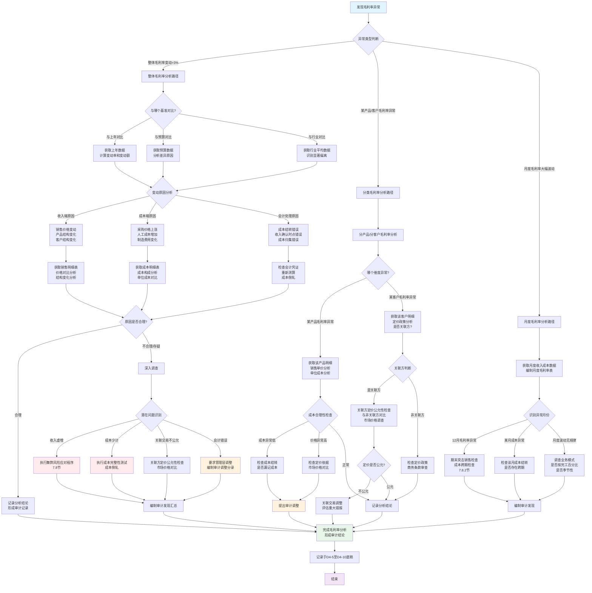

**流程图关键节点说明**：

| 节点 | 关键判断 | 常用工具/方法 | 底稿索引 |
|------|---------|-------------|---------|
| **异常识别** | 变动>3%或偏离行业>5% | 对比分析表 | D4-5 |
| **原因分析** | 收入端vs成本端vs会计处理 | 分析性复核 | D4-6至D4-8 |
| **成本倒轧** | 倒推成本=期初+本期采购-期末 | Excel倒轧表 | D4-9 |
| **深入调查** | 舞弊风险vs会计错误 | 追查原始凭证 | D4-10 |

---

#### 7.7.2.6 收入趋势分析流程图

> **💡 使用说明**：分析收入变动趋势，识别异常波动和潜在风险。

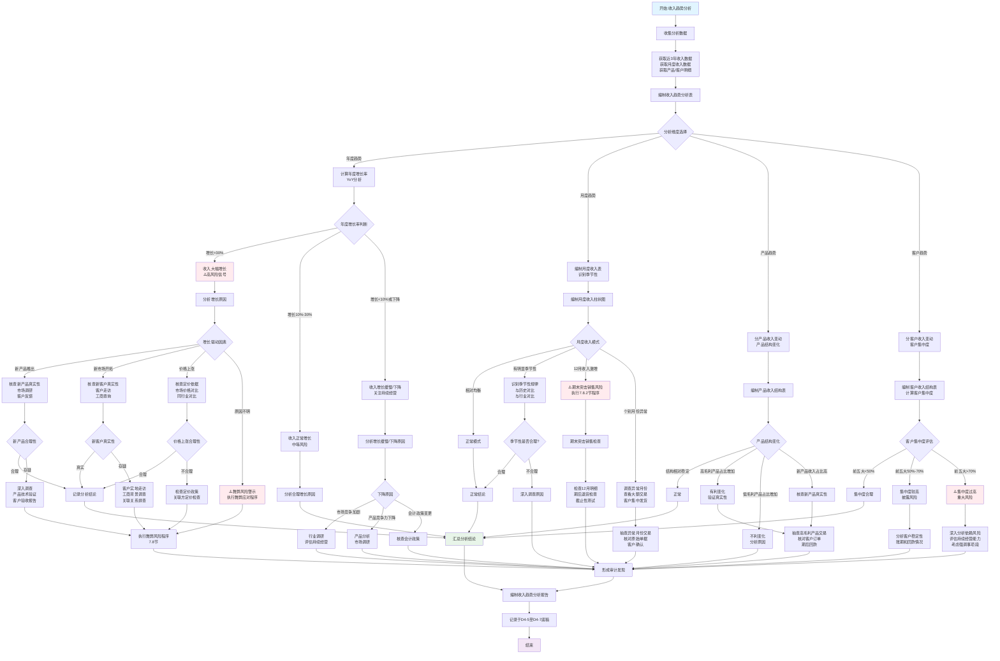

**收入趋势分析关键指标**：

| 分析指标 | 异常阈值 | 应对措施 | 底稿索引 |
|---------|---------|---------|---------|
| **年度增长率** | >30%或<-10% | 深入调查增长/下降原因 | D4-5 |
| **12月收入占比** | >15% | 期末突击销售检查 | D4-6 |
| **前五大客户集中度** | >70% | 评估客户依赖风险 | D4-7 |
| **新产品收入占比** | >30% | 核查新产品真实性 | D4-6 |
| **月度收入波动率** | 标准差>20% | 调查波动原因 | D4-5 |

---

### 7.7.3 客户结构分析

#### 7.7.3.1 客户集中度分析

**前五大客户分析：**

| 客户名称 | 销售收入 | 占比 | 是否关联方 | 账期 | 期后回款 | 风险评估 |
|---------|---------|------|-----------|------|---------|---------|
| 客户A | 30,000,000 | 30% | 否 | 90天 | 80% | 中 |
| 客户B | 20,000,000 | 20% | 是 | 180天 | 50% | 高 |
| 客户C | 15,000,000 | 15% | 否 | 60天 | 90% | 低 |
| 客户D | 10,000,000 | 10% | 否 | 90天 | 85% | 中 |
| 客户E | 8,000,000 | 8% | 否 | 60天 | 95% | 低 |
| **前五大合计** | **83,000,000** | **83%** | | | | |

**风险评估：**
- ⚠️ 前五大客户占比83%，**客户集中度过高**
- ⚠️ 对客户A依赖度30%，**存在重大客户依赖风险**
- ⚠️ 关联方客户B占比20%，且期后回款仅50%，**关联方占用资金风险**

---

#### 7.7.3.2 新增与流失客户分析

**2024年客户变动情况：**

| 客户类型 | 客户数量 | 销售收入 | 占比 | 平均单户收入 |
|---------|---------|---------|------|------------|
| 持续客户（2023和2024都有） | 80 | 75,000,000 | 75% | 937,500 |
| 新增客户（2024新增） | 20 | 20,000,000 | 20% | 1,000,000 |
| 流失客户（2023有，2024无） | 15 | 5,000,000 | 5% | 333,333 |
| **合计** | **100** | **100,000,000** | **100%** | **1,000,000** |

**新增客户重点分析：**
- 新增客户占比20%，属于正常范围
- 但需重点关注新增大客户的真实性

---

## 7.8 舞弊风险应对

> **📋 本节核心要点**（3分钟速览）
>
> **必须掌握：**
> - ✅ 收入确认是审计准则**推定的舞弊高风险领域**
> - ✅ 虚假销售、期末突击销售、渠道压货是**三大舞弊手段**
> - ✅ 必须执行**针对性舞弊风险应对程序**
> - ✅ 保持**职业怀疑态度**，不能轻信管理层解释
>
> **关键底稿：** D4-23至D4-27（舞弊风险应对系列）
>
> **风险提示：** ⚠️ 舞弊风险应对程序是强制性审计程序，不能省略

---

### 7.8.1 虚假销售识别

#### 7.8.1.1 虚假销售常见手法

| 手法类型 | 具体表现 | 识别方法 |
|---------|---------|---------|
| 虚构客户 | 客户不存在或为空壳公司 | 工商查询+实地走访 |
| 虚构交易 | 无真实交易，伪造单据 | 三单核对+期后回款 |
| 关联方配合 | 与关联方虚构交易 | 关联关系调查 |
| 循环交易 | A→B→C→A形成闭环 | 资金流向追踪 |

---

### 7.8.2 期末突击销售检查

#### 7.8.2.1 期末突击销售识别方法

**月度收入占比分析：**

| 月份 | 收入金额 | 占全年比例 | 风险评估 |
|------|---------|-----------|---------|
| 1-11月 | 80,000,000 | 80% | 正常 |
| 12月 | 20,000,000 | 20% | ⚠️需关注（>15%）|

**期末突击销售的特征：**
- 12月收入占比>15%
- 12月前几天收入正常，最后一周突增
- 期后大量退货

---

### 7.8.3 渠道压货识别

#### 7.8.3.1 渠道压货识别要点

**识别信号：**
- 经销商库存异常高
- 给予经销商特殊优惠政策
- 期后退货率高
- 经销商抱怨无法销售

---

## 7.9 应收账款减值测试

> **📋 本节核心要点**（5分钟速览）
>
> **必须掌握：**
> - ✅ 坏账准备计提是应收账款审计的**核心程序**
> - ✅ 计提政策、账龄分析、坏账测算**三位一体**
> - ✅ 期后回款是检验坏账准备充分性的**最佳证据**
> - ✅ 关注**长期挂账应收账款**的可收回性
>
> **关键底稿：** D2-8至D2-10（坏账准备系列）
>
> **风险提示：** ⚠️ 坏账准备计提不充分会导致资产虚增

---

### 7.9.1 坏账准备计提政策检查

#### 7.9.1.1 计提政策合理性评估

**常见计提政策对比：**

| 账龄 | 保守政策 | 一般政策 | 激进政策 | 同行业平均 |
|------|---------|---------|---------|-----------|
| 1年以内 | 5% |  | 1-3% |  |
| 1-2年 | 20% | 10% | 5-8% |  |
| 2-3年 | 50% | 30% | 15-20% |  |
| 3年以上 | 100% | 50% | 30-40% |  |

**异常信号：**
- ⚠️ 计提比例显著低于同行业
- ⚠️ 历史回款率与计提比例不匹配
- ⚠️ 长期挂账应收款项未足额计提

---

### 7.9.2 账龄分析

#### 7.9.2.1 账龄准确性检查

**账龄分析表：**

| 账龄 | 金额 | 占比 | 坏账准备 | 计提比例 | 净额 |
|------|------|------|---------|---------|------|
| 1年以内 | 15,000,000 | 68.2% | 750,000 | 5% | 14,250,000 |
| 1-2年 | 4,000,000 | 18.2% | 400,000 | 10% | 3,600,000 |
| 2-3年 | 2,000,000 | 9.1% | 600,000 | 30% | 1,400,000 |
| 3年以上 | 1,000,000 | 4.5% | 500,000 | 50% |  |
| **合计** | **22,000,000** | **100%** | **2,250,000** | **10.2%** | **19,750,000** |

**账龄异常信号：**
- ⚠️ 3年以上账龄占比>10%（可能存在大量无法收回款项）
- ⚠️ 账龄突然集中在临界点（可能人为调节账龄）

---

### 7.9.3 坏账准备测算

> **📊 坏账准备测算是应收账款审计的关键程序**
>
> **关键底稿：** D2-10坏账准备测算表

#### 7.9.3.1 坏账准备测算方法

**一、按账龄组合计提**

| 账龄 | 应收账款余额 | 计提比例 | 应计提坏账准备 |
|------|------------|---------|---------------|
| 1年以内 | 15,000,000 | 5% | 750,000 |
| 1-2年 | 4,000,000 | 10% | 400,000 |
| 2-3年 | 2,000,000 | 30% | 600,000 |
| 3年以上 | 1,000,000 | 50% | 500,000 |
| **合计** | **22,000,000** | | **2,250,000** |

**二、单项重大应收款项评估**

对单项金额重大的应收账款，应单独进行减值测试：
- 金额标准：单项>总额5%或>100万元
- 评估依据：客户财务状况、还款意愿、担保情况、期后回款

---

#### 7.9.3.2 坏账准备审计案例

以下是5个典型的坏账准备审计案例，展示如何评估坏账准备计提的充分性：

---

#### 💼 案例34：期后回款检查识别坏账准备不足

**案例背景：**
- **被审计单位：** MNO商贸公司
- **业务类型：** 批发贸易
- **审计期间：** 2024年度
- **异常现象：** 期后回款率低，但坏账准备计提不足

**应收账款及坏账准备情况：**

| 账龄 | 应收账款 | 计提比例 | 坏账准备 | 账面净额 |
|------|---------|---------|---------|---------|
| 1年以内 | 20,000,000 | 5% | 1,000,000 | 19,000,000 |
| 1-2年 | 5,000,000 | 10% | 500,000 | 4,500,000 |
| 2-3年 | 3,000,000 | 30% | 900,000 | 2,100,000 |
| 3年以上 | 2,000,000 | 50% | 1,000,000 |  |
| **合计** | **30,000,000** | | **3,400,000** | **26,600,000** |

**审计程序：期后回款检查**

检查2024年12月31日应收账款在2025年1-2月的回款情况：

| 账龄 | 应收余额 | 期后回款 | 回款率 | 未回款余额 | 预期回款率 | 差异 |
|------|---------|---------|-------|-----------|-----------|------|
| 1年以内 | 20,000,000 | 18,000,000 | **90%** | 2,000,000 | 95% | -5% |
| 1-2年 | 5,000,000 | 3,500,000 | **70%** | 1,500,000 | 90% | -20% |
| 2-3年 | 3,000,000 | 1,200,000 | **40%** | 1,800,000 | 70% | -30% |
| 3年以上 | 2,000,000 | 200,000 | **10%** | 1,800,000 | 50% | -40% |
| **合计** | **30,000,000** | **22,900,000** | **76.3%** | **7,100,000** | **88%** | **-11.7%** |

**重大发现：期后回款率远低于预期！**

特别是：
- 2-3年账龄回款率仅40%，远低于预期的70%
- 3年以上账龄回款率仅10%，远低于预期的50%

**深入分析未回款应收账款：**

抽取3年以上未回款的应收账款明细：

| 客户名称 | 欠款金额 | 账龄 | 期后回款 | 客户状况调查 | 可收回性评估 |
|---------|---------|------|---------|------------|-------------|
| 客户A | 800,000 | 4年 | 0 | 已破产清算 | 🔴**无法收回** |
| 客户B | 500,000 | 3.5年 | 0 | 失联，无法联系 | 🔴**无法收回** |
| 客户C | 400,000 | 3年 | 200,000 | 经营困难，分期还款 | ⚠️**部分可收回** |
| 客户D | 300,000 | 5年 | 0 | 已注销 | 🔴**无法收回** |
| **合计** | **2,000,000** | | **200,000** | | |

**客户状况详细调查：**

**客户A（欠款80万元）：**
- 工商查询显示：2023年12月进入破产清算程序
- 破产管理人联系：公司资不抵债，预计清偿率<5%
- **结论：应全额计提坏账准备**

**客户B（欠款50万元）：**
- 多次催收无果，电话无人接听
- 实地走访发现：公司已人去楼空
- 法律部门意见：起诉成本高，胜诉后也无法执行
- **结论：应全额计提坏账准备**

**客户C（欠款40万元）：**
- 客户仍在经营，但经营困难
- 已签订还款协议，分12个月还款
- 2025年1-2月已按约还款20万元
- **结论：剩余20万元按30%计提**

**客户D（欠款30万元）：**
- 工商查询显示：2022年已注销
- 公司已不存在
- **结论：应全额计提坏账准备**

**坏账准备充分性测算：**

**按期后回款情况和客户状况重新评估：**

| 账龄 | 应收余额 | 应计提比例 | 应计提坏账 | 已计提坏账 | 应补计提 |
|------|---------|-----------|-----------|-----------|---------|
| 1年以内 | 20,000,000 | 10% | 2,000,000 | 1,000,000 |  |
| 1-2年 | 5,000,000 | 30% | 1,500,000 | 500,000 | 1,000,000 |
| 2-3年 | 3,000,000 | 60% | 1,800,000 | 900,000 |  |
| 3年以上 | 2,000,000 | 90% | 1,800,000 | 1,000,000 | 800,000 |
| **合计** | **30,000,000** | | **7,100,000** | **3,400,000** | **3,700,000** |

**审计结论：**

> 1. **坏账准备计提严重不足，应补计提370万元**
> 2. **现行计提政策过于乐观，不符合实际回款情况**
> 3. **长期挂账应收款项多数已无法收回，应足额计提**
> 4. **期后回款率是评估坏账准备充分性的最佳证据**

**审计调整：**

```
调整分录：
借：信用减值损失               3,700,000
    贷：坏账准备                  3,700,000

调整后数据：
坏账准备余额：3,400,000 + 3,700,000 = 7,100,000
坏账准备计提比例：7,100,000 / 30,000,000 = 23.7%
应收账款净额：30,000,000 - 7,100,000 = 22,900,000
```

**对利润的影响：**
- 调整前净利润：假设500万元
- 补计提坏账准备：-370万元
- 调整后净利润：130万元
- 利润下降74%，属于重大调整

**案例启示：**

✅ **期后回款检查是评估坏账准备充分性的最有效方法**
✅ **回款率低于预期时，应重新评估计提政策**
✅ **长期挂账应收款项应逐笔核查客户状况**
✅ **已破产、失联、注销的客户应全额计提坏账准备**
✅ **期后回款测试应覆盖至审计报告日**

---

#### 💼 案例35：关联方应收账款长期挂账未计提坏账

**案例背景：**
- **被审计单位：** PQR制造公司
- **业务类型：** 汽车配件制造
- **审计期间：** 2024年度
- **异常现象：** 关联方应收账款长期挂账，未计提坏账准备

**应收账款构成分析：**

| 客户类型 | 应收余额 | 占比 | 坏账准备 | 计提比例 |
|---------|---------|------|---------|---------|
| 非关联方 | 18,000,000 | 64.3% | 2,100,000 | 11.7% |
| **关联方** | **10,000,000** | **35.7%** | **0** | **0%** |
| **合计** | **28,000,000** | **100%** | **2,100,000** | **7.5%** |

**异常信号：**
- ⚠️ 关联方应收账款1,000万元，占比35.7%（过高）
- ⚠️ 关联方应收账款未计提任何坏账准备
- ⚠️ 非关联方计提11.7%，关联方0%，差异巨大

**关联方应收账款明细：**

| 关联方名称 | 关联关系 | 欠款金额 | 账龄 | 期后回款 | 欠款原因 |
|-----------|---------|---------|------|---------|---------|
| ABC销售公司 | 同一控制 | 6,000,000 | 2年 | 0 | 代销未售出 |
| DEF物流公司 | 同一控制 | 3,000,000 | 3年 | 0 | 物流费垫付 |
| GHI贸易公司 | 同一控制 | 1,000,000 | 4年 | 0 | 货款 |
| **合计** | | **10,000,000** | | **0** | |

**深入调查关联方应收款项：**

**ABC销售公司（欠款600万元）：**

询问财务总监：
> "ABC公司是我们的关联销售公司，2022年向他们铺货600万元，
> 采用代销模式，产品售出后才付款。但这批货一直没卖出去。"

进一步询问：
> "为什么一直卖不出去？"

财务总监：
> "产品已过时，市场上有更新款了。这批货基本卖不出去了。"

查看ABC公司财务报表：
- 2024年收入：200万元（大幅下降）
- 2024年亏损：150万元
- 资产负债率：85%
- **结论：ABC公司经营困难，还款能力弱** ⚠️

查看代销协议：
- 约定：产品售出后30天内付款
- 未售出产品可以退货
- **但产品已过时，实际无法退货**

**审计判断：**
> 虽然是关联方，但经济实质上，这600万元应收账款可收回性极低。
> 代销产品已过时，既卖不出去，也无法退货，实质上是**呆账**。

**DEF物流公司（欠款300万元）：**

询问欠款原因：
> "DEF公司是我们的关联物流公司，2021-2022年，
> 我们垫付了他们的运输费用300万元，约定从后续物流费中抵扣。"

查看DEF公司情况：
- 2023年已停止经营
- 现在我们使用外部物流公司
- **DEF公司无其他业务，无收入来源**
- **结论：实质上无法收回** 🔴

**GHI贸易公司（欠款100万元）：**

查看工商信息：
- **2022年已注销** 🔴🔴
- 但公司账上仍挂账应收账款100万元

询问财务经理：
> "GHI公司确实已注销，但这是关联公司，控制人是我们老板的哥哥，
> 老板说他哥哥以后会还的，所以没有计提坏账。"

**审计判断：**
> 公司已注销，法律主体不存在，即使控制人承诺还款，
> 也应作为其他应收款-个人款项，而非应收账款。
> 且无任何书面还款承诺，可收回性存疑。

**管理层关于关联方应收款项不计提坏账的理由：**

财务总监解释：
> "准则规定，关联方之间的应收账款可以不计提坏账准备，
> 因为关联方之间可以协调还款，风险低。"

**审计判断：这种理解是错误的！** ❌

《企业会计准则》规定：
- 坏账准备应当基于**预期信用损失模型**
- 评估应收款项的可收回性，应考虑**所有合理且有依据的信息**
- 关联方关系**不能自动降低信用风险**
- 如果关联方财务状况恶化、已停止经营、已注销，**同样应当计提坏账准备**

**坏账准备充分性评估：**

| 关联方 | 欠款金额 | 可收回性评估 | 建议计提比例 | 应计提坏账 |
|--------|---------|------------|------------|-----------|
| ABC销售公司 | 6,000,000 | 经营困难，货物滞销 | 70% | 4,200,000 |
| DEF物流公司 | 3,000,000 | 已停止经营 | 100% |  |
| GHI贸易公司 | 1,000,000 | 已注销 | 100% |  |
| **合计** | **10,000,000** | | | **8,200,000** |

**审计结论：**

> 1. **关联方应收账款虽是关联方，但可收回性极低**
> 2. **应计提坏账准备820万元**
> 3. **管理层对会计准则理解有误**
> 4. **关联方关系不能成为不计提坏账准备的理由**

**审计调整：**

```
调整分录：
借：信用减值损失               8,200,000
    贷：坏账准备                  8,200,000

调整后数据：
坏账准备余额：2,100,000 + 8,200,000 = 10,300,000
坏账准备计提比例：10,300,000 / 28,000,000 = 36.8%
应收账款净额：28,000,000 - 10,300,000 = 17,700,000
```

**对报表的影响：**
- 虚增利润820万元
- 虚增资产820万元
- 属于重大错报

**管理层拒绝调整：**

管理层认为：
> "这些都是关联方，我们集团内部可以协调，不会损失。
> 如果计提这么多坏账，利润会大幅下降，影响公司形象。"

**审计应对：**

由于管理层拒绝调整重大错报（820万元），且涉及关联方交易，
审计师应考虑：
1. ⚠️ 出具**保留意见审计报告**
2. ⚠️ 在审计报告中说明保留意见的理由
3. ⚠️ 量化错报对财务报表的影响
4. ⚠️ 评估是否继续承接该客户

**案例启示：**

✅ **关联方应收账款不能自动豁免坏账准备计提**
✅ **应基于关联方实际财务状况和还款能力评估**
✅ **已停止经营、已注销的关联方应全额计提**
✅ **长期挂账、无还款迹象的关联方应足额计提**
✅ **关联方占用资金可能涉嫌利益输送**
✅ **管理层拒绝调整重大错报，应考虑出具非无保留意见**

---

#### 💼 案例36：坏账准备计提政策显著低于同行业

**案例背景：**
- **被审计单位：** STU电子公司
- **业务类型：** 电子元件销售
- **审计期间：** 2024年度
- **异常现象：** 坏账准备计提比例显著低于同行业

**坏账准备计提政策对比：**

| 账龄 | STU公司<br>（被审计单位） | 同行业<br>上市公司A | 同行业<br>上市公司B | 同行业<br>上市公司C | 行业平均 | 差异 |
|------|---------------------|----------------|----------------|----------------|---------|------|
| 1年以内 | **3%** | 5% |  |  |  | **-2%** |
| 1-2年 | **5%** | 10% |  | 12% | 11% | **-6%** |
| 2-3年 | **10%** | 30% |  | 35% | 32% | **-22%** |
| 3-4年 | **30%** | 50% |  | 60% | 53% | **-23%** |
| 4-5年 | **50%** | 80% |  | 100% | 87% | **-37%** |
| 5年以上 | **50%** | 100% |  |  |  | **-50%** |

**异常信号：**
- ⚠️ STU公司各账龄计提比例**全面低于**行业平均
- ⚠️ 特别是5年以上仅计提50%，行业平均100%
- ⚠️ 差异最大达50个百分点

**应收账款及坏账准备情况：**

| 账龄 | 应收账款 | 计提比例 | 坏账准备 | 净额 |
|------|---------|---------|---------|------|
| 1年以内 | 50,000,000 | 3% | 1,500,000 | 48,500,000 |
| 1-2年 | 10,000,000 | 5% | 500,000 | 9,500,000 |
| 2-3年 | 5,000,000 | 10% | 500,000 | 4,500,000 |
| 3-4年 | 3,000,000 | 30% | 900,000 | 2,100,000 |
| 4-5年 | 1,500,000 | 50% | 750,000 |  |
| 5年以上 | 1,500,000 | 50% | 750,000 |  |
| **合计** | **71,000,000** | | **4,900,000** | **66,100,000** |

**整体计提比例：4,900,000 / 71,000,000 = 6.9%**

**同行业对比：**
- 同行业上市公司A：12.5%
- 同行业上市公司B：13.2%
- 同行业上市公司C：14.8%
- **行业平均：13.5%**
- **STU公司：6.9%**
- **差异：-6.6个百分点**

**审计调查过程：**

**步骤1：询问管理层为何计提比例低**

财务总监解释：
> "我们公司客户质量好，历史回款率高，坏账损失率低，
> 所以我们的计提比例比同行业低是合理的。"

**步骤2：分析历史坏账核销情况**

调取2021-2024年坏账核销记录：

| 年度 | 核销金额 | 当年收入 | 核销率 |
|------|---------|---------|-------|
| 2021 | 800,000 | 90,000,000 | 0.89% |
| 2022 | 1,200,000 | 95,000,000 | 1.26% |
| 2023 | 2,500,000 | 100,000,000 | 2.50% |
| 2024 | 4,000,000 | 105,000,000 | **3.81%** |
| **4年平均** | **2,125,000** | **97,500,000** | **2.18%** |

**重要发现：**
- 坏账核销率逐年上升，2024年达到3.81%
- 4年平均核销率2.18%，接近1年以内应收账款的计提比例3%
- 说明**实际坏账损失率在上升** ⚠️

**步骤3：分析账龄结构变化**

| 账龄 | 2024年余额 | 2024占比 | 2023年余额 | 2023占比 | 变动 |
|------|-----------|---------|-----------|---------|------|
| 1年以内 | 50,000,000 | 70.4% | 55,000,000 | 84.6% | **-14.2%** |
| 1-2年 | 10,000,000 | 14.1% | 6,000,000 | 9.2% | **+4.9%** |
| 2-3年 | 5,000,000 | 7.0% | 2,500,000 | 3.8% | **+3.2%** |
| 3年以上 | 6,000,000 | 8.5% | 1,500,000 | 2.3% | **+6.2%** |
| **合计** | **71,000,000** | **100%** | **65,000,000** |  |  |

**重要发现：**
- 1年以内占比从84.6%下降至70.4%，下降14.2% ⚠️
- 3年以上占比从2.3%上升至8.5%，上升6.2% ⚠️
- **应收账款质量明显恶化** 🔴

**步骤4：期后回款测试**

检查2024年12月31日应收账款在2025年1-2月的回款情况：

| 账龄 | 应收余额 | 期后回款 | 回款率 | 未回款 |
|------|---------|---------|-------|--------|
| 1年以内 | 50,000,000 | 47,000,000 | 94% | 3,000,000 |
| 1-2年 | 10,000,000 | 8,000,000 | 80% | 2,000,000 |
| 2-3年 | 5,000,000 | 2,500,000 | 50% |  |
| 3-4年 | 3,000,000 | 600,000 | 20% | 2,400,000 |
| 4-5年 | 1,500,000 | 150,000 | 10% | 1,350,000 |
| 5年以上 | 1,500,000 | 0 | **0%** |  |
| **合计** | **71,000,000** | **58,250,000** | **82%** | **12,750,000** |

**重要发现：**
- 5年以上应收账款期后回款率为**0%**，但只计提50% ⚠️
- 4-5年回款率仅10%，意味着90%可能无法收回 ⚠️
- 3-4年回款率20%，80%可能无法收回 ⚠️

**步骤5：重新评估坏账准备充分性**

**按期后回款情况重新测算：**

| 账龄 | 应收余额 | 期后回款率 | 建议计提比例 | 应计提坏账 | 已计提坏账 | 应补计提 |
|------|---------|-----------|-------------|-----------|-----------|---------|
| 1年以内 | 50,000,000 | 94% | 5% | 2,500,000 | 1,500,000 | 1,000,000 |
| 1-2年 | 10,000,000 | 80% | 15% | 1,500,000 | 500,000 | 1,000,000 |
| 2-3年 | 5,000,000 | 50% | 40% | 2,000,000 | 500,000 | 1,500,000 |
| 3-4年 | 3,000,000 | 20% | 70% | 2,100,000 | 900,000 | 1,200,000 |
| 4-5年 | 1,500,000 | 10% | 85% | 1,275,000 | 750,000 | 525,000 |
| 5年以上 | 1,500,000 | 0% | **100%** |  | 750,000 |  |
| **合计** | **71,000,000** | | | **10,875,000** | **4,900,000** | **5,975,000** |

**审计结论：**

> 1. **坏账准备计提政策过于乐观，不符合实际情况**
> 2. **应补计提坏账准备597.5万元**
> 3. **5年以上应收账款应全额计提（期后回款率0%）**
> 4. **账龄结构恶化，长期挂账比例上升**
> 5. **历史核销率上升，说明坏账风险在增加**

**审计调整：**

```
调整分录：
借：信用减值损失               5,975,000
    贷：坏账准备                  5,975,000

调整后数据：
坏账准备余额：4,900,000 + 5,975,000 = 10,875,000
坏账准备计提比例：10,875,000 / 71,000,000 = 15.3%
应收账款净额：71,000,000 - 10,875,000 = 60,125,000

调整后计提比例15.3%，高于行业平均13.5%，
但考虑到公司账龄结构恶化，是合理的。
```

**与管理层沟通：**

审计师向管理层说明：
1. 公司坏账准备计提政策显著低于同行业
2. 期后回款情况显示，长期挂账应收款项回款率极低
3. 5年以上应收账款期后无任何回款，应全额计提
4. 建议修订坏账准备计提政策，使其更符合实际情况

管理层最终同意调整。

**案例启示：**

✅ **坏账准备计提政策应与同行业对比**
✅ **显著低于同行业应重点关注，评估合理性**
✅ **期后回款测试是评估计提充分性的重要依据**
✅ **账龄结构恶化是坏账风险增加的信号**
✅ **历史坏账核销率上升说明风险在增加**
✅ **长期挂账无回款的应收账款应足额计提**

---

#### 💼 案例37：账龄跨临界点调节坏账准备

**案例背景：**
- **被审计单位：** VWX商贸公司
- **业务类型：** 批发贸易
- **审计期间：** 2024年度
- **异常现象：** 账龄异常集中在临界点，疑似人为调节

**坏账准备计提政策：**

| 账龄 | 计提比例 |
|------|---------|
| 1年以内 | 5% |
| **1-2年** | **10%** |
| **2-3年** | **30%** |
| 3年以上 | 50% |

**应收账款账龄分布：**

| 账龄 | 应收账款 | 占比 | 坏账准备 |
|------|---------|------|---------|
| 0-6个月 | 15,000,000 | 50% | 750,000 |
| 6-12个月 | 3,000,000 | 10% | 150,000 |
| **12-18个月** | **500,000** | **1.7%** | **50,000** |
| **18-24个月** | **6,000,000** | **20%** | **600,000** |
| **24-30个月** | **500,000** | **1.7%** | **150,000** |
| **30-36个月** | **4,000,000** | **13.3%** | **1,200,000** |
| 3年以上 | 1,000,000 | 3.3% | 500,000 |
| **合计** | **30,000,000** | **100%** | **3,400,000** |

**异常现象识别：**

绘制账龄分布图发现：

```
      ↓ 临界点1（1年）  ↓ 临界点2（2年）
      ↓                ↓
0-6月:███████████████████████ 50%
6-12月:████ 10%
12-18月:█ 1.7% ← 异常低！
18-24月:████████████ 20% ← 突然增加！
24-30月:█ 1.7% ← 异常低！
30-36月:████████ 13.3% ← 突然增加！
3年+:█ 3.3%
```

**重大异常：**
- ⚠️ 12-18个月（临界点前）：仅1.7%
- ⚠️ 18-24个月（临界点后）：突增至20%
- ⚠️ 24-30个月（临界点前）：仅1.7%
- ⚠️ 30-36个月（临界点后）：突增至13.3%

**这种分布极不正常！**

正常情况下，账龄应当连续分布，不会在临界点前突然减少，临界点后突然增加。
这种现象强烈提示**人为调节账龄** 🔴🔴

**审计调查过程：**

**步骤1：抽取临界点附近的应收账款核对账龄**

**抽取18-24个月区间的应收账款10笔：**

| 客户 | 账面账龄 | 发票日期 | 实际账龄 | 差异 | 是否调节 |
|------|---------|---------|---------|------|---------|
| 客户A | 18个月 | 2023-03-15 | **21个月** | 3个月 | ⚠️ 是 |
| 客户B | 19个月 | 2023-02-20 | **22个月** | 3个月 | ⚠️ 是 |
| 客户C | 20个月 | 2023-01-10 | **23个月** | 3个月 | ⚠️ 是 |
| 客户D | 18个月 | 2023-03-25 | **21个月** | 3个月 | ⚠️ 是 |
| 客户E | 19个月 | 2023-02-15 | **22个月** | 3个月 | ⚠️ 是 |

**发现：10笔中有10笔都存在账龄少计3个月的情况！** 🔴🔴

**步骤2：询问财务人员**

询问财务经理账龄是如何计算的：
> "我们的ERP系统会自动计算账龄，从发票日期开始计算。"

查看ERP系统设置，发现：
> ERP系统中，发票日期被**人为推迟了3个月** 🔴

具体操作：
- 实际开票日期：2023年3月15日
- ERP系统录入日期：2023年6月15日
- 导致账龄少计3个月

**步骤3：调查账龄调节的动机**

询问为什么要调节账龄：

财务经理最初回避，在审计师坚持下，承认：
> "老板要求的。2024年底审计前，老板说坏账准备太多了，
> 影响利润，让我把一些快到2年的应收账款往后推几个月，
> 这样就可以少计提坏账准备。
> 
> 具体操作是：
> - 把快满2年的（计提30%）推迟到1年多（计提10%）
> - 差额20%的坏账准备就不用计提了"

**这是典型的财务舞弊行为！** 🔴🔴🔴

**步骤4：全面核查账龄准确性**

审计师要求导出所有应收账款的原始发票日期：

核查发现：
- 共有150笔应收账款的账龄被人为调节
- 涉及金额800万元
- 其中：
  - 本应2-3年（计提30%），被调为1-2年（计提10%）：600万元
  - 本应3年以上（计提50%），被调为2-3年（计提30%）：200万元

**步骤5：重新计算正确账龄下的坏账准备**

| 项目 | 调节前（账面） | 调节后（正确） | 差异 |
|------|-------------|-------------|------|
| **600万元（本应2-3年）** | | | |
| 应计提比例 | 10% | 30% | 20% |
| 应计提坏账 | 600,000 | 1,800,000 | **1,200,000** |
| **200万元（本应3年以上）** | | | |
| 应计提比例 | 30% | 50% | 20% |
| 应计提坏账 | 600,000 | 1,000,000 | **400,000** |
| **合计** | **1,200,000** | **2,800,000** | **1,600,000** |

**审计结论：**

> 1. **存在人为调节账龄的行为** 🔴🔴🔴
> 2. **少计提坏账准备160万元**
> 3. **属于管理层舞弊，故意虚增利润**
> 4. **财务数据不可靠，内部控制存在重大缺陷**

**审计调整：**

```
调整分录：
借：信用减值损失               1,600,000
    贷：坏账准备                  1,600,000

调整后数据：
坏账准备余额：3,400,000 + 1,600,000 = 5,000,000
应收账款净额：30,000,000 - 5,000,000 = 25,000,000
```

**对审计报告的影响：**

由于发现**管理层舞弊**行为（人为调节账龄），审计师应当：

1. ⚠️ 评估对其他财务数据可靠性的影响
2. ⚠️ 扩大审计范围，检查其他可能被调节的科目
3. ⚠️ 评估管理层诚信问题
4. ⚠️ 考虑是否应出具**保留意见或否定意见**
5. ⚠️ 评估是否继续承接该客户

**与管理层沟通：**

审计师与管理层沟通：
> "贵公司存在人为调节账龄的行为，属于财务舞弊。
> 如果不纠正此错误并加强内部控制，我们将出具非无保留意见审计报告。"

管理层最终同意：
1. 调整坏账准备
2. 恢复正确的账龄
3. 加强内部控制，杜绝类似情况

**案例启示：**

✅ **账龄分布异常集中在临界点是舞弊红旗**
✅ **临界点前少、临界点后多，提示人为调节**
✅ **应抽查核对原始发票日期，验证账龄准确性**
✅ **人为调节账龄属于管理层舞弊**
✅ **发现舞弊应评估对审计报告的影响**
✅ **ERP系统数据也可能被人为篡改**

---

#### 💼 案例38：单项重大应收账款未单独计提

**案例背景：**
- **被审计单位：** YZA建筑公司
- **业务类型：** 建筑施工
- **审计期间：** 2024年度
- **异常现象：** 单项重大应收账款未单独评估减值

**应收账款情况：**

| 客户名称 | 应收账款 | 账龄 | 占比 | 坏账准备<br>（按组合） | 计提比例 |
|---------|---------|------|------|---------------------|---------|
| 客户A | 15,000,000 | 2年 | 42.9% | 1,500,000 | 10% |
| 客户B | 8,000,000 | 1年 | 22.9% | 400,000 | 5% |
| 客户C | 5,000,000 | 3年 | 14.3% | 1,500,000 | 30% |
| 其他 | 7,000,000 | 混合 | 20% | 600,000 | 8.6% |
| **合计** | **35,000,000** | | **100%** | **4,000,000** | **11.4%** |

**异常信号：**
- ⚠️ 客户A欠款1,500万元，占比42.9%（单一客户占比过高）
- ⚠️ 客户A欠款已2年，但只按组合计提10%
- ⚠️ 客户C欠款500万元，账龄3年，也未单独评估

**审计程序：单项重大应收账款评估**

根据审计准则和公司政策：
> 单项金额重大的应收账款（单项>总额5%或>100万元），
> 应当单独进行减值测试，不应简单按账龄组合计提。

客户A和客户C均符合单项重大标准，应当单独评估。

**客户A深度评估（欠款1,500万元）：**

**步骤1：了解欠款背景**

询问项目经理：
> "客户A欠款是A市政府的一个基础设施项目，2022年完工，
> 合同金额3,000万元，已收款1,500万元，尾款1,500万元未支付。"

**步骤2：调查客户A（某市政府）还款情况**

询问为什么2年了还不还款：
> "市政府说财政资金紧张，要分期支付。
> 2023年承诺支付500万元，但最终没有支付。
> 2024年又承诺支付，但仍未支付。"

**步骤3：评估可收回性**

联系市政府财政局：
- 财政局回复：确实资金紧张，但会还款，只是时间不确定
- 预计2025-2026年才能支付

查询该市政府财政状况：
- 2024年地方政府债务率：85%（接近警戒线）
- 财政收入下降15%
- **结论：还款能力弱，还款时间不确定** ⚠️

**步骤4：评估法律追索可能性**

咨询法律顾问：
> "对政府项目欠款，起诉追偿比较困难：
> 1. 政府有财政预算限制，法院执行困难
> 2. 即使胜诉，执行周期长
> 3. 可能影响与当地政府关系，影响后续项目承接
> 
> 建议：继续协商，等待政府财政好转"

**步骤5：评估减值损失**

综合考虑：
- 客户是政府，信用风险相对较低
- 但财政困难，还款时间不确定，可能延迟3-5年
- 货币时间价值损失较大

**未来现金流折现分析：**

假设分3年收回，折现率10%：

| 年份 | 预计收款 | 折现系数 | 现值 |
|------|---------|---------|------|
| 2025 | 500,000 | 0.909 | 454,500 |
| 2026 | 500,000 | 0.826 | 413,000 |
| 2027 | 500,000 | 0.751 | 375,500 |
| **合计** | **1,500,000** | | **1,243,000** |

**减值损失 = 1,500,000 - 1,243,000 = 257,000**

**建议计提比例：257,000 / 1,500,000 = 17%**

**客户C深度评估（欠款500万元，账龄3年）：**

**步骤1：了解客户情况**

查询客户C工商信息：
- 2023年被列入失信被执行人名单 🔴
- 2024年被吊销营业执照 🔴
- 法定代表人失联

**步骤2：评估可收回性**

咨询法律顾问：
> "客户C已被吊销执照，法定代表人失联，
> 公司已无实际经营，资产所剩无几。
> 即使起诉，预计可收回金额不超过50万元（10%）。"

**步骤3：期后回款检查**

2025年1-2月，无任何回款。

**建议计提比例：90%（预计只能收回10%）**

**重新计算坏账准备：**

| 客户 | 应收账款 | 组合计提 | 单项评估 | 建议计提 | 差异 |
|------|---------|---------|---------|---------|------|
| 客户A | 15,000,000 | 1,500,000<br>(10%) | 2,550,000<br>(17%) | 2,550,000 | +1,050,000 |
| 客户C | 5,000,000 | 1,500,000<br>(30%) | 4,500,000<br>(90%) | 4,500,000 | +3,000,000 |
| 其他 | 15,000,000 | 1,000,000 |  |  | 0 |
| **合计** | **35,000,000** | **4,000,000** | | **8,050,000** | **+4,050,000** |

**审计结论：**

> 1. **单项重大应收账款应当单独评估减值**
> 2. **客户A虽是政府，但还款时间不确定，应考虑时间价值损失**
> 3. **客户C已吊销执照、失联，应按90%计提**
> 4. **应补计提坏账准备405万元**

**审计调整：**

```
调整分录：
借：信用减值损失               4,050,000
    贷：坏账准备                  4,050,000

调整后数据：
坏账准备余额：4,000,000 + 4,050,000 = 8,050,000
坏账准备计提比例：8,050,000 / 35,000,000 = 23.0%
应收账款净额：35,000,000 - 8,050,000 = 26,950,000
```

**对利润的影响：**
- 补计提405万元，利润下降405万元
- 属于重大调整

**案例启示：**

✅ **单项重大应收账款应当单独评估，不能简单按组合计提**
✅ **政府欠款虽信用风险低，但应考虑回款时间的不确定性**
✅ **长期拖欠的政府欠款应考虑货币时间价值损失**
✅ **已失信、吊销执照、失联的客户应高比例计提**
✅ **单项评估应考虑客户财务状况、还款能力、法律追索可能性**

---

#### 7.9.3.3 坏账准备审计检查清单

**□ 坏账准备计提政策检查**
- [ ] 是否制定了坏账准备计提政策？
- [ ] 计提政策是否与同行业对比？
- [ ] 是否显著低于同行业？
- [ ] 历史回款率与计提比例是否匹配？

**□ 账龄准确性检查**
- [ ] 是否抽查核对原始发票日期？
- [ ] 账龄计算是否准确？
- [ ] 是否存在账龄调节迹象？
- [ ] 账龄分布是否异常集中在临界点？

**□ 期后回款检查**
- [ ] 是否执行期后回款测试？
- [ ] 测试期间是否足够（至少2个月）？
- [ ] 回款率是否与计提比例匹配？
- [ ] 长期未回款的是否足额计提？

**□ 单项重大应收账款评估**
- [ ] 是否识别单项重大应收账款？
- [ ] 是否单独评估减值？
- [ ] 是否评估客户财务状况？
- [ ] 是否考虑法律追索可能性？

**□ 关联方应收账款**
- [ ] 是否单独分析关联方应收账款？
- [ ] 关联方财务状况是否评估？
- [ ] 关联方是否计提坏账准备？
- [ ] 长期挂账关联方是否足额计提？

**□ 特殊情况处理**
- [ ] 已破产客户是否全额计提？
- [ ] 已注销客户是否全额计提？
- [ ] 已失信客户是否高比例计提？
- [ ] 政府欠款是否考虑时间价值？

---

#### 7.9.3.4 坏账准备测算流程图

> **💡 使用说明**：系统化执行坏账准备测算和充分性评估。

```mermaid
graph TD
    A[开始:坏账准备测算] --> B[获取应收账款明细]
    B --> C[应收账款余额:XXX万元]
    
    C --> D{测算方法选择}
    D -->|组合计提| E[按账龄组合计提]
    D -->|单项计提| F[单项重大应收账款<br>单独评估]
    
    E --> G[获取账龄分析表]
    G --> H[核对账龄准确性<br>抽样核对发票日期]
    H --> I{账龄是否准确?}
    
    I -->|否| J[发现账龄调节<br>⚠️舞弊风险]
    J --> K[要求重新编制账龄表<br>检查所有账龄异常]
    K --> L[调整后账龄分析表]
    
    I -->|是| L
    
    L --> M[获取公司坏账准备计提政策]
    M --> N{计提政策评估}
    N -->|与行业对比| O[获取同行业上市公司政策<br>对比计提比例]
    N -->|历史回款率对比| P[计算历史回款率<br>与计提比例匹配性]
    
    O --> Q{政策是否合理?}
    P --> Q
    Q -->|不合理-偏低| R[政策过于激进<br>计提不足风险]
    Q -->|合理| S[政策合理]
    
    R --> T[建议调整计提政策<br>或执行额外程序]
    
    S --> U[按公司政策重新测算]
    T --> U
    
    U --> V[编制坏账准备测算表]
    V --> W[计算各账龄应计提金额]
    W --> X{测算结果}
    
    X --> Y[审计师测算金额:XXX万]
    Y --> Z[公司账面计提:XXX万]
    Z --> AA{对比差异}
    
    AA -->|差异<5%| AB[差异不重大<br>可接受]
    AA -->|差异5%-10%| AC[差异较大<br>需调查原因]
    AA -->|差异>10%| AD[差异重大<br>⚠️需调整]
    
    AC --> AE[分析差异原因]
    AE --> AF{差异原因}
    AF -->|计算错误| AG[要求管理层调整]
    AF -->|政策理解不同| AH[与管理层沟通<br>评估合理性]
    AF -->|故意少计| AI[⚠️舞弊风险<br>提出审计调整]
    
    AD --> AJ[提出审计调整]
    AI --> AJ
    AG --> AJ
    
    AJ --> AK[编制审计调整分录<br>借:信用减值损失<br>贷:坏账准备]
    
    F --> AL[识别单项重大应收账款]
    AL --> AM{识别标准}
    AM -->|金额标准| AN[单笔>100万<br>或>总额5%]
    AM -->|账龄标准| AO[账龄>3年]
    AM -->|性质标准| AP[关联方/已诉讼/<br>已破产/已失联]
    
    AN --> AQ[汇总单项重大清单]
    AO --> AQ
    AP --> AQ
    
    AQ --> AR[逐笔评估可收回性]
    AR --> AS{评估方法}
    
    AS -->|期后回款| AT[检查期后回款情况<br>回款是最佳证据]
    AS -->|客户财务状况| AU[获取客户财务报表<br>工商信息查询<br>信用报告]
    AS -->|法律诉讼| AV[查询诉讼进展<br>律师函回复<br>预计可收回金额]
    AS -->|担保物| AW[评估担保物价值<br>扣除处置费用]
    
    AT --> AX{期后回款情况}
    AX -->|已全额回款| AY[无需计提]
    AX -->|部分回款| AZ[按未回款部分计提]
    AX -->|完全未回款| BA[需进一步评估]
    
    BA --> AU
    
    AU --> BB{客户财务状况}
    BB -->|财务状况良好| BC[可收回可能性大<br>低比例计提]
    BB -->|财务困难| BD[可收回可能性中<br>中比例计提]
    BB -->|已破产/失联| BE[基本无法收回<br>全额计提]
    
    AV --> BF{诉讼结果}
    BF -->|胜诉且可执行| BG[预计可收回XXX万<br>差额计提]
    BF -->|败诉/无法执行| BE
    
    AW --> BH{担保物价值}
    BH -->|担保充分| BI[预计可收回<br>差额计提]
    BH -->|担保不足| BJ[按不足部分计提]
    
    AY --> BK[编制单项评估表]
    AZ --> BK
    BC --> BK
    BD --> BK
    BE --> BK
    BG --> BK
    BI --> BK
    BJ --> BK
    
    BK --> BL[汇总单项计提金额]
    BL --> BM{与公司计提对比}
    BM -->|一致| BN[单项计提合理]
    BM -->|差异| BO[分析差异原因<br>提出调整建议]
    
    AB --> BP[期后回款测试]
    BN --> BP
    BO --> BP
    AK --> BP
    AH --> BP
    
    BP --> BQ[获取期后回款明细<br>测试期间:报表日后2-3个月]
    BQ --> BR[编制期后回款表]
    BR --> BS[计算期后回款率]
    BS --> BT{回款率分析}
    
    BT -->|整体回款率| BU[期后回款率:XX%]
    BT -->|分账龄回款率| BV[1年内:XX%<br>1-2年:XX%<br>2-3年:XX%<br>3年以上:XX%]
    
    BU --> BW{回款率与计提比例匹配?}
    BV --> BW
    
    BW -->|匹配| BX[坏账准备充分]
    BW -->|不匹配| BY{哪个方向不匹配?}
    BY -->|回款率高,计提过多| BZ[计提过于谨慎<br>一般可接受]
    BY -->|回款率低,计提不足| CA[⚠️计提不充分<br>需追加计提]
    
    CA --> CB[识别长期未回款账款]
    CB --> CC[3年以上未回款:XXX万<br>期后仍未回款:XXX万]
    CC --> CD[评估这些账款计提充分性]
    CD --> CE{计提是否充分?}
    CE -->|不充分| CF[提出审计调整<br>追加计提]
    CE -->|充分| BX
    
    CF --> CG[汇总所有调整]
    
    BX --> CH[编制坏账准备审计总结]
    BZ --> CH
    CG --> CH
    
    CH --> CI[计算调整后坏账准备余额]
    CI --> CJ[评估对财务报表的影响]
    CJ --> CK[记录于D2-8至D2-10底稿]
    CK --> CL[结束]
    
    style A fill:#e1f5ff
    style CL fill:#f3e5f5
    style J fill:#ffebee
    style R fill:#ffebee
    style AD fill:#ffebee
    style AI fill:#ffebee
    style CA fill:#ffebee
    style BX fill:#e8f5e9
```

**坏账准备测算关键步骤**：

| 步骤 | 关键检查点 | 常见错误 | 审计应对 | 底稿索引 |
|------|-----------|---------|---------|---------|
| **账龄核对** | 账龄计算准确性 | 账龄调节、临界点集中 | 抽样核对发票日期 | D2-8 |
| **政策评估** | 计提比例合理性 | 显著低于行业 | 与同行业对比 | D2-9 |
| **重新测算** | 计算准确性 | 计算错误、遗漏 | 独立测算对比 | D2-9 |
| **单项评估** | 重大应收账款 | 未单独评估 | 逐笔评估可收回性 | D2-10 |
| **期后回款** | 回款率匹配性 | 计提与回款不匹配 | 测算期后回款率 | D2-8 |

---

#### 7.9.3.5 期后回款测试流程图

> **💡 使用说明**：期后回款是检验坏账准备充分性的最佳证据。

```mermaid
graph TD
    A[开始:期后回款测试] --> B[确定测试期间]
    B --> C{测试期间选择}
    C -->|常规项目| D[报表日后2个月]
    C -->|高风险项目| E[报表日后3-4个月]
    C -->|IPO项目| F[报表日后至审计报告日]
    
    D --> G[确定测试截止日]
    E --> G
    F --> G
    
    G --> H[获取期后回款明细]
    H --> I[从银行流水中提取<br>与应收账款匹配]
    
    I --> J[编制期后回款测试表]
    J --> K[表头:客户 | 12/31余额 | 账龄 | 期后回款 | 回款率 | 未回款余额]
    
    K --> L[导入应收账款明细<br>导入期后收款记录]
    L --> M[逐笔匹配客户回款]
    M --> N{匹配方法}
    
    N -->|自动匹配| O[按客户名称自动匹配]
    N -->|手工匹配| P[核对摘要、金额、日期<br>识别回款对应关系]
    
    O --> Q[标记匹配结果]
    P --> Q
    
    Q --> R[计算各项指标]
    R --> S[计算回款率]
    S --> T{回款率维度}
    
    T --> U[整体回款率 = 期后回款/期末余额]
    T --> V[分账龄回款率]
    T --> W[分客户回款率]
    T --> X[重点客户回款情况]
    
    U --> Y[整体回款率:XX%]
    V --> Z[编制账龄回款率表]
    Z --> AA[1年以内回款率:XX%<br>1-2年回款率:XX%<br>2-3年回款率:XX%<br>3年以上回款率:XX%]
    
    W --> AB[前十大客户回款情况]
    AB --> AC[逐一分析回款率]
    
    X --> AD[关联方回款情况<br>长账龄客户回款情况<br>新客户回款情况]
    
    Y --> AE{整体回款率评估}
    AE -->|回款率>70%| AF[回款情况良好]
    AE -->|回款率50%-70%| AG[回款情况一般<br>需关注]
    AE -->|回款率<50%| AH[⚠️回款情况差<br>坏账风险高]
    
    AA --> AI{账龄回款率分析}
    AI --> AJ[1年内回款率应>80%]
    AI --> AK[1-2年回款率应>50%]
    AI --> AL[2-3年回款率应>30%]
    AI --> AM[3年以上回款率通常<10%]
    
    AJ --> AN{是否达标?}
    AK --> AN
    AL --> AN
    AM --> AN
    
    AN -->|达标| AO[账龄回款率合理]
    AN -->|不达标| AP[⚠️某账龄回款率异常低<br>关注坏账风险]
    
    AC --> AQ{大客户回款率}
    AQ -->|前五大均>80%| AR[大客户回款良好]
    AQ -->|有客户<50%| AS[⚠️重点关注回款差的大客户<br>评估坏账计提充分性]
    
    AD --> AT{特殊客户回款}
    AT -->|关联方| AU[关联方回款率:XX%]
    AU --> AV{关联方回款是否正常?}
    AV -->|正常| AW[关联方回款无异常]
    AV -->|异常低| AX[⚠️关联方占用资金<br>评估关联方坏账计提]
    
    AT -->|长账龄客户| AY[3年以上客户回款率:XX%]
    AY --> AZ{长账龄回款率}
    AZ -->|>20%| BA[部分可收回]
    AZ -->|<10%| BB[⚠️基本无法收回<br>应全额或高比例计提]
    
    AT -->|新客户| BC[新客户回款率:XX%]
    BC --> BD{新客户回款是否异常?}
    BD -->|正常| BE[新客户质量良好]
    BD -->|异常低| BF[⚠️新客户回款差<br>关注客户真实性<br>可能虚假销售]
    
    AF --> BG[期后回款与坏账准备匹配性分析]
    AG --> BG
    AH --> BG
    AO --> BG
    AP --> BG
    AR --> BG
    AS --> BG
    AW --> BG
    AX --> BG
    BA --> BG
    BB --> BG
    BE --> BG
    BF --> BG
    
    BG --> BH[计算未回款金额]
    BH --> BI[期末余额 - 期后回款 = 未回款]
    BI --> BJ[分析未回款结构]
    BJ --> BK{未回款分析}
    
    BK -->|按账龄| BL[3年以上未回款:XXX万<br>占未回款比例:XX%]
    BK -->|按客户| BM[前十大未回款:XXX万<br>占未回款比例:XX%]
    BK -->|特殊性质| BN[关联方未回款:XXX万<br>已诉讼未回款:XXX万<br>已破产未回款:XXX万]
    
    BL --> BO{3年以上未回款评估}
    BO -->|计提比例>80%| BP[计提充分]
    BO -->|计提比例<80%| BQ[⚠️计提可能不足<br>建议追加计提]
    
    BM --> BR{大客户未回款评估}
    BR -->|逐笔评估可收回性| BS[单独评估报告]
    
    BN --> BT{特殊未回款处理}
    BT -->|关联方| BU[评估关联方财务状况<br>是否应计提]
    BT -->|已诉讼| BV[评估诉讼可回收性<br>律师函证]
    BT -->|已破产| BW[应全额计提]
    
    BP --> BX[编制期后回款测试结论]
    BQ --> BY[提出坏账准备调整建议]
    BS --> BY
    BU --> BY
    BV --> BY
    BW --> BY
    
    BY --> BZ[计算需追加计提金额]
    BZ --> CA[编制审计调整分录]
    
    BX --> CB[汇总测试结果]
    CA --> CB
    
    CB --> CC[编制期后回款分析报告]
    CC --> CD[核心结论:<br>1.整体回款率XX%<br>2.坏账准备是否充分<br>3.审计调整建议]
    CD --> CE[记录于D2-8底稿]
    CE --> CF[结束]
    
    style A fill:#e1f5ff
    style CF fill:#f3e5f5
    style AH fill:#ffebee
    style AP fill:#ffebee
    style AS fill:#ffebee
    style AX fill:#ffebee
    style BB fill:#ffebee
    style BF fill:#ffebee
    style BQ fill:#ffebee
    style BX fill:#e8f5e9
```

**期后回款测试关键指标**：

| 回款率指标 | 良好标准 | 警示标准 | 高风险标准 | 审计应对 |
|-----------|---------|---------|-----------|---------|
| **整体回款率** | >70% | 50%-70% | <50% | 评估坏账准备充分性 |
| **1年内回款率** | >80% | 60%-80% | <60% | 关注收入真实性 |
| **1-2年回款率** | >50% | 30%-50% | <30% | 提高计提比例 |
| **3年以上回款率** | >20% | 10%-20% | <10% | 建议全额或高比例计提 |
| **前五大回款率** | >80% | 50%-80% | <50% | 单独评估大客户 |
| **关联方回款率** | >70% | 40%-70% | <40% | 关联方占用资金风险 |

---

#### 7.9.3.6 坏账准备流程图使用指南

**两张流程图的配合使用**：

1. **先使用"坏账准备测算流程图"**
   - 评估计提政策合理性
   - 重新测算坏账准备
   - 单项重大应收账款评估
   - 识别计提差异

2. **再使用"期后回款测试流程图"**
   - 验证坏账准备充分性
   - 用实际回款验证计提比例
   - 识别长期未回款的高风险账款
   - 提供调整建议的客观依据

**审计结论形成路径**：
```
测算差异分析 + 期后回款验证 
        ↓
    差异原因识别
        ↓
┌───────┴───────┐
│               │
政策合理        政策不合理
实际回款支持    实际回款不支持
    ↓               ↓
坏账准备充分    ⚠️坏账准备不足
    ↓               ↓
  接受          提出审计调整
```

---

### 7.9.4 补充流程图：舞弊风险识别

由于舞弊风险应对是销售循环审计的重点，现补充两张舞弊相关流程图：

---

#### 流程图5：虚假销售识别流程

> **💡 使用说明**：系统化识别虚假销售的多种表现形式。

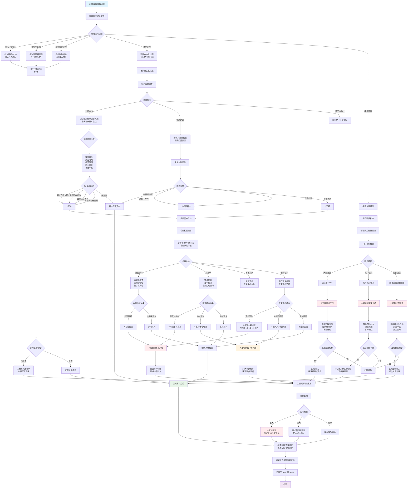

---

#### 流程图6：期末突击销售检查流程

> **💡 使用说明**：专门针对期末突击销售（冲业绩）的识别和检查。

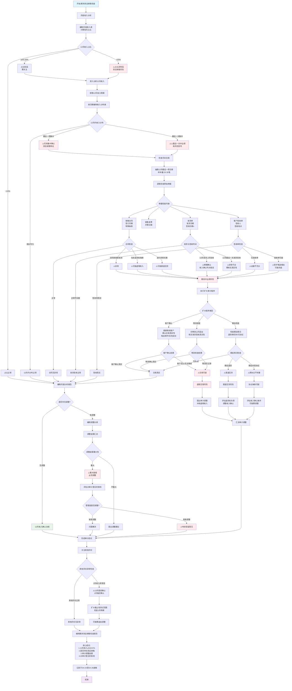

**期末突击销售识别关键指标**：

| 指标 | 正常范围 | 警示阈值 | 高风险阈值 | 审计应对 |
|------|---------|---------|-----------|---------|
| **12月收入占比** | <15% | 15%-20% | >20% | 深入检查12月交易 |
| **12月最后一周占比** | <30% | 30%-50% | >50% | 检查截止性和真实性 |
| **12月最后一天占比** | <5% | 5%-10% | >10% | 高度怀疑突击销售 |
| **期后退货率** | <5% | 5%-15% | >15% | 评估渠道压货风险 |
| **与1月对比** | 相对均衡 | 12月是1月2倍 | 12月是1月3倍以上 | 检查跨期确认 |

---

### 7.9.5 补充流程图使用总结

**6张补充流程图覆盖范围**：

| 流程图 | 适用场景 | 核心目的 | 关联章节 | 底稿索引 |
|-------|---------|---------|---------|---------|
| **毛利率异常分析** | 毛利率变动>3% | 识别异常原因 | 7.7.2节 | D4-5至D4-10 |
| **收入趋势分析** | 收入大幅波动 | 评估增长合理性 | 7.7节 | D4-5至D4-7 |
| **坏账准备测算** | 坏账准备审计 | 测算充分性 | 7.9.3节 | D2-8至D2-10 |
| **期后回款测试** | 应收账款审计 | 验证可收回性 | 7.9.3节 | D2-8 |
| **虚假销售识别** | 收入舞弊风险 | 识别虚假交易 | 7.8节 | D4-23至D4-27 |
| **期末突击销售检查** | 12月收入异常 | 检查冲业绩行为 | 7.8.2节 | D4-24至D4-26 |

---

## 7.10 常见问题解答（FAQ）

> 收集销售循环审计中最常见的15个问题，提供快速解答和详细指引。

### 7.10.1 基础概念问题

#### **Q1：销售循环主要审计哪些科目？**

**A：** 销售循环主要涉及以下科目：

**资产类：**
- 应收账款（主要）
- 应收票据
- 合同资产（新收入准则）
- 应收款项融资（新金融工具准则）

**损益类：**
- 营业收入（主要）
- 营业成本（与存货循环交叉）
- 信用减值损失（坏账准备）

**负债类：**
- 合同负债（预收款项，新收入准则）
- 应交税费-应交增值税

📖 **详见**：第7.1.1节

---

#### **Q2：销售循环必须做的核心程序有哪些？**

**A：** 8个必做核心程序（按优先级排序）：

✅ **1. 函证程序（最重要）**
   - 应收账款函证 - 必须做
   - 收入函证 - IPO项目或高风险情况
   - 📖 详见：第7.6.1节

✅ **2. 收入截止性测试**
   - 资产负债表日前后5-10天
   - 检查收入确认时点是否准确
   - 📖 详见：第7.6.4.1节

✅ **3. 收入真实性检查**
   - 抽样检查销售合同、出库单、发票
   - 验证收入确认条件是否满足
   - 📖 详见：第7.6.6节

✅ **4. 毛利率分析**
   - 趋势分析、同行业对比
   - 识别异常波动
   - 📖 详见：第7.7.2节

✅ **5. 应收账款账龄分析**
   - 检查账龄准确性
   - 识别长期挂账款项
   - 📖 详见：第7.9.2节

✅ **6. 坏账准备测试**
   - 重新计算坏账准备
   - 评估计提充分性
   - 📖 详见：第7.9.3节

✅ **7. 收入舞弊风险识别**
   - 虚假销售识别
   - 期末突击销售检查
   - 📖 详见：第7.8节

✅ **8. 收入审定表编制**
   - 汇总所有审计结果
   - 形成最终审计结论
   - 📖 详见：第7.6.2节

---

#### **Q3：什么时候需要对销售循环执行控制测试？**

**A：** 符合以下任一情况时，建议执行控制测试（C类底稿）：

**适合执行控制测试的情况：**
- ✓ 销售交易量巨大，逐笔细节测试不现实
- ✓ 内部控制健全，控制测试成本低于实质性测试
- ✓ 拟大幅降低实质性程序的范围
- ✓ 被审计单位信息系统强大，系统控制有效

**不适合执行控制测试的情况：**
- ✗ 销售交易较少，可以全部或大比例细节测试
- ✗ 内部控制薄弱或流于形式
- ✗ 控制测试成本高于实质性测试
- ✗ 收入存在特别风险（如舞弊风险）

📖 **详见**：第7.1.3节 审计策略选择

⚠️ **重要提醒**：即使执行了控制测试，对于收入确认这一特别风险，仍需执行实质性程序。

---

### 7.10.2 函证与底稿专题

#### **Q4：应收账款函证必须100%函证吗？**

**A：** 不一定，但需要覆盖重要客户和达到一定比例。

**函证范围确定原则：**

| 客户类型 | 函证策略 | 说明 |
|---------|---------|------|
| **大额客户（Top 10）** | **必须函证** | 无论期末余额正负 |
| **零余额但本期有交易** | **必须函证** | 防止收入隐瞒 |
| **关联方** | **必须函证** | 无论金额大小 |
| **长期挂账客户** | **必须函证** | 存在回收风险 |
| **大客户** | **建议函证** | 验证真实性 |
| **小额客户** | **抽样函证** | 覆盖60-70%即可 |

**函证覆盖率要求：**
- 金额覆盖率：至少60-70%
- IPO项目：建议80%以上
- 高风险项目：建议接近100%

📖 **详见**：第7.6.1节

---

#### **Q5：函证不回怎么办？有什么催函技巧？**

**A：** 5步催函策略：

**第1步：立即催函（寄出后7-10天）**
```
- 电话联系客户财务部门
- 确认是否收到函证
- 询问预计回函时间
- 记录联系人姓名和电话
```

**第2步：二次发函（寄出后2周）**
```
- 通过快递或电子邮件重新发送
- 附上第一次函证的复印件
- 在函证上标注"第二次函证"
```

**第3步：请被审计单位协助（寄出后3周）**
```
- 请销售人员联系客户
- 请财务总监联系对方财务总监
- 说明审计需要，请予配合
```

**第4步：执行替代程序（函证期限到期）**
```
如果仍不回函，执行替代程序：
✓ 检查期后回款（最有力证据）
✓ 检查销售合同、出库单、发票
✓ 检查物流单据、签收单
✓ 检查银行流水
```

**第5步：评估影响**
```
- 不回函比例是否过高（>30%）
- 不回函的是否为重要客户
- 替代程序是否能获取充分证据
- 是否需要扩大审计范围
```

📖 **详见**：第7.6.1节

⚠️ **重要提醒**：替代程序不能完全替代函证，如果重要客户不回函且无法执行充分的替代程序，可能需要在审计报告中说明审计范围受限。

---

#### **Q6：应收账款审定表（D2-1）怎么填？**

**A：** 应收账款审定表填写5步法：

**步骤1：获取并核对明细表**
```
✓ 从被审计单位获取应收账款明细表
✓ 核对明细表与总账、科目余额表是否一致
✓ 检查借贷方向是否正确
```

**步骤2：填写期初数**
```
✓ 填写期初账面余额
✓ 核对期初数与上期审定数是否一致
✓ 如不一致，需说明原因
```

**步骤3：填写本期发生额**
```
✓ 填写本期借方发生额（应收账款）
✓ 填写本期贷方发生额（收回应收账款）
```

**步骤4：填写期末数**
```
✓ 填写期末账面余额
✓ 计算公式：期末 = 期初 + 借方 - 贷方
```

**步骤5：填写审计调整**
```
✓ 根据审计发现填写调整金额
✓ 计算审定数 = 账面数 + 调整数
✓ 在备注栏说明调整原因
```

**审定表示例模板：**

```
索引号：D2-1
被审计单位：XXX公司
截止日：2024年12月31日
科目名称：应收账款
编制人：[姓名] 日期：[日期]
复核人：[姓名] 日期：[日期]
金额单位：人民币元

项目 | 期初数 | 本期借方 | 本期贷方 | 期末账面数 | 审计调整 | 审定数 | 备注
-----|--------|---------|---------|-----------|---------|--------|------
应收账款-客户A | 1,000,000 | 500,000 | 300,000 | 1,200,000 | 0 | 1,200,000 | 函证相符
应收账款-客户B | 800,000 | 200,000 | 600,000 | 400,000 | -100,000 | 300,000 | 调减已收款未入账
...
合计 | 5,000,000 | 2,000,000 | 1,500,000 | 5,500,000 | -200,000 | 5,300,000 |
坏账准备 | (250,000) | - | (25,000) | (275,000) | (15,000) | (290,000) | 补提坏账
应收账款账面价值 | 4,750,000 | - | - | 5,225,000 | -215,000 | 5,010,000 |
```

📖 **详见**：第7.6.2节

---

#### **Q7：收入审定表（D4-1）和应收账款审定表（D2-1）有什么关系？**

**A：** 两者密切相关，存在勾稽关系。

**勾稽关系公式：**
```
期末应收账款 = 期初应收账款 + 本期营业收入 - 本期收款 - 本期核销坏账 ± 其他调整

简化公式：
应收账款贷方发生额（D2-1） ≈ 营业收入（D4-1）中赊销部分
```

**交叉验证要点：**

1. **收入与应收账款的配比关系**
   - 如果收入大幅增长，应收账款应相应增长
   - 如果应收账款增长快于收入，可能存在回收风险

2. **收入确认与应收账款增加的时点一致性**
   - 确认收入的同时，应记录应收账款
   - 两者必须同时发生

3. **函证的双重验证**
   - 应收账款函证既验证应收账款余额
   - 也验证本期销售金额的真实性

4. **截止性测试的统一性**
   - 收入截止测试（D4-14）
   - 应收账款截止测试
   - 两者应使用相同的样本，确保一致性

📖 **详见**：第7.6.2节、第7.13.2节

---

### 7.10.3 特殊情况处理

#### **Q8：新收入准则下，"合同资产"和"应收账款"有什么区别？**

**A：** 两者的核心区别在于**收款权利是否无条件**。

**定义对比：**

| 项目 | 应收账款 | 合同资产 |
|-----|---------|---------|
| **定义** | 无条件收款权利 | 有条件收款权利 |
| **确认条件** | 仅取决于时间流逝 | 取决于履行其他义务 |
| **典型场景** | 商品已交付，只等付款期到 | 完成第一阶段，需完成第二阶段才能收款 |
| **信用风险** | 较低 | 较高 |
| **减值计提** | 按应收账款政策 | 通常计提比例更高 |

**实务示例：**

**案例1：应收账款**
```
合同约定：交付货物后30天内付款
时点：2024年12月20日已交付货物
会计处理：确认应收账款（无条件收款权）
理由：只要到期就能收款，不取决于其他条件
```

**案例2：合同资产**
```
合同约定：分两批交付，全部交付完成后30天内付款
时点：2024年12月20日交付第一批（占60%）
会计处理：确认合同资产（有条件收款权）
理由：需完成第二批交付才能收款
```

**审计差异：**

| 审计程序 | 应收账款 | 合同资产 |
|---------|---------|---------|
| **函证** | 必须函证 | 也需函证，但客户可能不认可金额 |
| **期后回款检查** | 最有力证据 | 期后收款需确认是否已完成全部义务 |
| **减值测试** | 按账龄计提 | 需考虑未完成义务的风险 |
| **列报** | 流动资产-应收账款 | 流动资产-合同资产（单独列示） |

📖 **详见**：第7.6.11节

---

#### **Q9：客户是关联方，函证还有意义吗？**

**A：** 有意义，但需要执行更多补充程序。

**关联方函证的特殊性：**

⚠️ **函证可靠性较低：**
- 关联方可能配合财务造假
- 函证可能由同一方控制
- 回函内容可能不独立

✅ **仍需执行函证，原因：**
- 审计准则要求（重要关联方必须函证）
- 作为审计程序的一部分
- 获取被审计单位的书面确认

**关联方销售的额外审计程序：**

**1. 实质性程序（必须做）**
```
✓ 检查销售合同，关注定价公允性
✓ 检查出库单、发票、签收单
✓ 检查期后回款（资金流向）
✓ 与非关联方交易对比（价格、条件）
```

**2. 关联方交易披露检查**
```
✓ 关联方关系是否充分披露
✓ 交易金额、定价依据是否披露
✓ 关联方往来余额是否披露
✓ 是否披露"关联方交易占比"
```

**3. 关注舞弊风险**
```
⚠️ 虚构关联方销售虚增收入
⚠️ 通过关联方调节利润
⚠️ 关联方代垫成本费用
⚠️ 关联方资金占用
```

**4. 获取管理层声明**
```
✓ 关联方关系是否完整披露
✓ 关联方交易是否真实
✓ 关联方交易定价是否公允
```

📖 **详见**：第7.6.8节（IPO项目专项核查）

---

#### **Q10：收入确认在发货时点还是收款时点？怎么判断？**

**A：** 按新收入准则，**以控制权转移时点确认收入**，不是简单的发货或收款时点。

**新收入准则五步法：**

1. **识别合同**
2. **识别履约义务**
3. **确定交易价格**
4. **分摊交易价格**
5. **在履约义务完成时确认收入** ⭐

**控制权转移的判断标准（5个迹象）：**

| 判断标准 | 说明 | 常见证据 |
|---------|------|---------|
| ✓ 企业有现时收款权 | 客户有义务付款 | 发票、合同约定 |
| ✓ 客户拥有法定所有权 | 所有权已转移 | 签收单、提货单 |
| ✓ 企业已转移实物资产 | 客户已占有商品 | 出库单、物流单 |
| ✓ 客户承担资产风险和报酬 | 灭失风险已转移 | 保险单、合同条款 |
| ✓ 客户已接受该资产 | 客户确认收货 | 验收单、签收单 |

**常见贸易术语的收入确认时点：**

| 贸易术语 | 控制权转移时点 | 收入确认时点 | 典型证据 |
|---------|--------------|-------------|---------|
| **FOB起运港** | 货物越过船舷 | 报关出口时 | 报关单、提单 |
| **FOB目的港** | 货物到达目的港 | 客户签收时 | 签收单 |
| **CIF** | 货物越过船舷 | 报关出口时 | 报关单、提单 |
| **EXW工厂交货** | 客户提货时 | 提货时 | 提货单 |
| **送货上门** | 客户签收时 | 签收时 | 签收单 |

**审计检查要点：**

```
✓ 检查销售合同，识别收入确认时点约定
✓ 检查出库单日期、物流签收日期
✓ 检查发票开具日期
✓ 检查会计记账日期
✓ 评估收入确认时点是否符合准则要求
```

📖 **详见**：第7.6.7节（新收入准则应用检查）

---

#### **Q11：期末大量突击销售，怎么判断是否存在舞弊？**

**A：** 期末突击销售是收入舞弊的重要危险信号，需执行专项检查程序。

**识别危险信号（Red Flags）：**

| 危险信号 | 风险等级 | 说明 |
|---------|---------|------|
| ⚠️⚠️⚠️ 12月收入占全年40%以上 | **极高** | 明显异常 |
| ⚠️⚠️ 第四季度收入占全年50%以上 | **高** | 需重点关注 |
| ⚠️⚠️ 12月最后一周突击发货 | **高** | 可能跨期 |
| ⚠️ 大额销售给新客户 | **中** | 验证真实性 |
| ⚠️ 期后大额退货 | **高** | 可能虚假销售 |
| ⚠️⚠️⚠️ 销售给关联方或员工 | **极高** | 虚假交易风险 |

**专项审计程序：**

**第1步：趋势分析**
```python
# 分析12月收入占比
12月收入 / 全年收入 > 30%  → 重点关注
12月收入 / 月均收入 > 200% → 异常
```

**第2步：逐笔检查12月大额销售**
```
对于12月（尤其最后一周）的大额销售：
✓ 检查销售合同（签订日期、交易背景）
✓ 检查出库单（实际发货日期）
✓ 检查物流单据（运输日期、签收日期）
✓ 检查期后回款（是否真实收款）
✓ 检查期后退货（是否大额退货）
```

**第3步：客户访谈/实地走访**
```
对于可疑客户，执行：
✓ 实地走访客户（核实交易真实性）
✓ 检查客户仓库（商品是否真实存在）
✓ 访谈客户采购人员（了解交易背景）
```

**第4步：分析交易合理性**
```
✓ 客户是否有真实采购需求？
✓ 交易价格是否公允？
✓ 付款条件是否异常宽松？
✓ 客户信用是否良好？
✓ 销售是否符合商业逻辑？
```

**舞弊识别案例：**

**案例：虚假期末销售**
```
危险信号：
- 12月28日向新客户Z销售500万元
- 客户Z是新成立公司（成立3个月）
- 赊销，账期6个月
- 期后未收款
- 实地走访发现客户办公室空置

审计结论：
虚假销售，调减收入500万元
```

📖 **详见**：第7.8.2节（期末突击销售检查）

---

#### **Q12：毛利率突然大幅下降/上升，可能的原因是什么？**

**A：** 毛利率异常波动可能预示收入或成本舞弊，需深入分析。

**毛利率公式：**
```
毛利率 = (营业收入 - 营业成本) / 营业收入 × 100%
```

**毛利率异常下降的可能原因：**

| 原因类别 | 具体原因 | 审计应对 |
|---------|---------|---------|
| **正常原因** | 市场竞争加剧，产品降价 | 检查销售价格变动、市场报告 |
| **正常原因** | 原材料成本上涨 | 检查采购价格、供应商报价 |
| **正常原因** | 产品结构变化（低毛利产品占比增加） | 分产品分析毛利率 |
| ⚠️ **舞弊风险** | 虚增成本（成本虚高） | 成本细节测试、存货监盘 |
| ⚠️ **舞弊风险** | 隐瞒收入（收入少计） | 收入完整性测试 |
| ⚠️ **会计差错** | 成本结转错误 | 检查成本结转分录 |

**毛利率异常上升的可能原因：**

| 原因类别 | 具体原因 | 审计应对 |
|---------|---------|---------|
| **正常原因** | 产品提价、品牌溢价 | 检查销售价格变动 |
| **正常原因** | 成本下降（规模效应、技术改进） | 检查生产效率、成本分析 |
| **正常原因** | 产品结构变化（高毛利产品占比增加） | 分产品分析毛利率 |
| ⚠️⚠️ **舞弊风险** | 虚增收入（收入虚高） | 收入真实性检查、函证 |
| ⚠️⚠️ **舞弊风险** | 少计成本（成本资本化） | 成本完整性测试 |
| ⚠️ **会计差错** | 成本归集错误 | 检查成本分摊方法 |

**深度分析程序：**

**1. 分产品/分客户毛利率分析**
```
产品A毛利率：2023年 35% → 2024年 45% ⚠️ 异常
产品B毛利率：2023年 28% → 2024年 29% ✓ 正常
→ 重点关注产品A的收入和成本
```

**2. 月度毛利率趋势分析**
```
1-11月毛利率：30-32%（稳定）
12月毛利率：45% ⚠️⚠️ 极度异常
→ 可能12月虚增收入或少计成本
```

**3. 与同行业对比**
```
本公司毛利率：45%
同行业平均：28%
→ 显著高于行业水平，需解释原因
```

**4. 价格和成本分析**
```
销售单价：2023年 100元 → 2024年 105元（上涨5%）
单位成本：2023年 70元 → 2024年 65元（下降7%）
毛利率：2023年 30% → 2024年 38%（上涨8个百分点）
→ 价格上涨+成本下降，需核实合理性
```

📖 **详见**：第7.7.2节（毛利率分析）

---

#### **Q13：坏账准备计提比例是固定的吗？审计时怎么判断是否充分？**

**A：** 坏账准备计提比例不是固定的，应根据客户信用风险合理确定。

**新金融工具准则（预期信用损失模型）：**

| 阶段 | 信用风险变化 | 计提方法 | 计提比例参考 |
|------|------------|---------|------------|
| **阶段一** | 信用风险未显著增加 | 12个月预期信用损失 | 0.5%-5% |
| **阶段二** | 信用风险显著增加 | 整个存续期预期信用损失 | 10%-30% |
| **阶段三** | 已发生信用减值 | 整个存续期预期信用损失 | 50%-100% |

**简化方法（账龄组合法）：**

**典型计提比例（仅供参考）：**

| 账龄 | 常见计提比例 | 制造业 | 贸易企业 | 高科技企业 |
|------|------------|--------|---------|----------|
| 1年以内 | 0-5% | 3% | 5% | 1% |
| 1-2年 | 10-20% | 10% | 20% |  |
| 2-3年 | 30-50% | 30% | 50% |  |
| 3-4年 | 50-80% | 50% | 80% | 60% |
| 4-5年 | 80-100% | 80% | 100% |  |
| 5年以上 | 100% |  |  |  |

⚠️ **注意**：以上比例仅供参考，实际应根据企业历史坏账损失率、客户信用状况等确定。

**审计判断充分性的方法：**

**方法1：历史损失率法**
```
计算最近3-5年实际坏账损失率：
实际损失率 = 核销坏账 / 期初应收账款余额

如果：
实际损失率 > 计提比例 → 计提不足 ⚠️
实际损失率 < 计提比例 → 计提充分 ✓
```

**方法2：期后回款检查法**
```
检查期后3-6个月回款情况：
期后回款率 = 期后收回金额 / 期末应收账款余额

如果：
期后回款率很高（如>95%） → 可收回性强，计提可适当降低
期后回款率很低（如<60%） → 回收风险大，需增加计提 ⚠️
```

**方法3：个别认定法（重要客户）**
```
对于大额应收账款，逐个评估：
✓ 客户经营状况（是否正常经营）
✓ 财务状况（是否有偿付能力）
✓ 历史回款记录（是否按时付款）
✓ 法律诉讼（是否有纠纷）
✓ 期后回款（是否已收款）
→ 根据评估结果单独计提
```

**方法4：行业对比法**
```
比较同行业上市公司坏账计提比例：
本公司1年以内计提5%
同行业平均3%
→ 需了解本公司计提比例较高的原因
```

**重点关注以下情况（计提可能不足）：**

⚠️ 计提比例显著低于同行业
⚠️ 大额长期挂账但计提比例很低
⚠️ 期后回款率低但计提比例未调整
⚠️ 客户经营困难但计提比例仍按正常
⚠️ 历史实际损失率高于计提比例

📖 **详见**：第7.9.3节（坏账准备测算）

---

#### **Q14：如何识别虚假销售（假客户、假合同、假发货）？**

**A：** 虚假销售是收入舞弊的最严重形式，需执行多项程序识别。

**虚假销售的典型特征（Red Flags）：**

| 特征 | 说明 | 风险等级 |
|------|------|---------|
| ⚠️⚠️⚠️ 新客户大额交易 | 突然出现大额新客户 | 极高 |
| ⚠️⚠️⚠️ 关联方销售 | 向关联方或员工销售 | 极高 |
| ⚠️⚠️ 期末集中销售 | 12月突击销售 | 高 |
| ⚠️⚠️ 期后大额退货 | 销售后又退回 | 高 |
| ⚠️⚠️ 异常付款条件 | 账期过长（如1年以上） | 高 |
| ⚠️ 异常定价 | 价格明显偏离市场价 | 中 |
| ⚠️⚠️ 期后不回款 | 销售后长期不收款 | 高 |

**识别虚假销售的审计程序（10步法）：**

**第1步：函证验证**
```
✓ 对可疑客户执行函证
✓ 亲自寄出、直接回收（防止被审计单位操纵）
✓ 不回函的，高度怀疑
```

**第2步：工商信息查询**
```
查询客户工商信息：
✓ 注册时间（新成立公司风险高）
✓ 注册资本（是否有实力）
✓ 法定代表人（是否为被审计单位关联方）
✓ 经营范围（是否与交易匹配）
✓ 经营状态（是否正常经营）
```

**第3步：实地走访**
```
对于可疑客户，实地走访：
✓ 办公场所是否真实存在
✓ 是否有实际经营（员工、设备）
✓ 访谈采购人员（了解交易背景）
✓ 检查仓库（商品是否存在）
```

**第4步：销售合同检查**
```
✓ 合同签订日期（是否与交易时间匹配）
✓ 合同条款（是否异常宽松）
✓ 签字人员（是否为被审计单位人员代签）
✓ 合同真实性（是否临时伪造）
```

**第5步：物流单据检查**
```
✓ 出库单（是否有真实出库）
✓ 物流运单（是否有真实运输）
✓ 签收单（是否为客户本人签收）
✓ 物流公司电话回访（核实运输真实性）
```

**第6步：资金流水检查**
```
✓ 检查银行流水（是否真实收款）
✓ 付款方是否为合同客户
✓ 是否存在资金回流（收款后又转回）
✓ 付款时间（是否期后长期不付款）
```

**第7步：期后退货检查**
```
✓ 检查期后6-12个月退货情况
✓ 大额退货可能为虚假销售
✓ 退货理由是否合理
```

**第8步：交易合理性分析**
```
✓ 客户是否有真实需求？
✓ 定价是否公允？
✓ 付款条件是否正常？
✓ 交易是否符合商业逻辑？
```

**第9步：仓库监盘**
```
✓ 检查已发货商品是否仍在仓库
✓ 是否存在"假出库"（账上出库,实物未出）
```

**第10步：关联关系核查**
```
✓ 客户是否为关联方
✓ 客户与公司股东、高管是否有关联
✓ 客户法定代表人是否为公司员工
```

**虚假销售典型案例：**

**案例：假客户虚假销售**
```
基本情况：
- 2024年12月，向客户X销售1000万元
- 客户X为新客户，当年新成立

审计发现：
✓ 函证不回
✓ 工商查询：客户X法定代表人为被审计单位员工
✓ 实地走访：办公场所为居民住宅，无人办公
✓ 物流单据：签收人为被审计单位人员
✓ 银行流水：无收款记录
✓ 期后退货：全额退货

审计结论：
虚假销售，调减收入1000万元
```

📖 **详见**：第7.8.1节（虚假销售识别）

---

#### **Q15：IPO项目审计销售循环有什么特殊要求？**

**A：** IPO项目对销售循环审计要求更高、程序更严格。

**IPO项目销售循环审计的特殊要求：**

**1. 函证覆盖率更高**
```
普通审计：60-70%
IPO审计：80-90%甚至更高

✓ Top 20客户必须100%函证
✓ 零余额但本期有交易的客户也要函证
✓ 大客户必须函证
✓ 关联方必须函证
```

**2. 必须执行走访程序**
```
✓ 走访主要客户（Top 10）
✓ 走访大客户
✓ 走访可疑客户
✓ 走访比例：建议覆盖50%以上收入
```

**3. 收入真实性核查更深入**
```
✓ 检查销售合同（逐份检查重要合同）
✓ 检查出库单、发票、签收单（全部或大比例）
✓ 检查物流单据（第三方物流确认）
✓ 检查银行流水（逐笔核对回款）
✓ 检查期后回款（延长至6-12个月）
```

**4. 重点关注关联方交易**
```
✓ 关联方关系是否完整披露
✓ 关联方销售是否真实
✓ 关联方销售定价是否公允
✓ 是否存在关联方代垫费用
✓ 是否存在关联方资金占用
```

**5. 毛利率分析更细致**
```
✓ 分年度、分季度、分月度分析
✓ 分产品、分客户分析
✓ 与同行业对比分析
✓ 毛利率异常需充分解释
```

**6. 坏账准备计提更审慎**
```
✓ 计提比例是否合理
✓ 是否低于同行业
✓ 长期挂账是否充分计提
✓ 期后回款是否良好
```

**7. 收入舞弊风险识别**
```
⚠️ 突击确认收入（IPO前夕大额确认）
⚠️ 虚构客户销售
⚠️ 关联方代垫费用
⚠️ 期后大额退货
⚠️ 渠道压货
```

**8. 三年一期完整审计**
```
✓ 报告期内（通常3年1期）全部审计
✓ 关注收入确认政策一致性
✓ 关注客户变动情况
✓ 关注毛利率变动趋势
```

**9. 内控审计**
```
✓ 必须执行内部控制审计
✓ 评估销售循环内控有效性
✓ 识别内控缺陷
```

**10. 持续督导**
```
✓ IPO前夕（申报前）需更新审计
✓ 发行前需更新审计
✓ 持续关注收入真实性
```

**IPO销售循环重点关注事项清单：**

```
□ 函证覆盖率是否达到80%以上？
□ 是否执行了充分的走访程序？
□ Top 10客户是否全部走访？
□ 关联方关系是否完整披露？
□ 关联方交易定价是否公允？
□ 毛利率是否稳定合理？
□ 是否显著高于/低于同行业？
□ 期末是否突击确认收入？
□ 期后是否大额退货？
□ 坏账准备计提是否充分？
□ 长期挂账是否合理？
□ 收入确认政策是否一致？
□ 新客户是否真实？
□ 是否存在虚构客户风险？
□ 银行流水是否逐笔核对？
□ 期后回款检查是否充分（6-12个月）？
```

📖 **详见**：第7.6.8节（IPO项目专项核查）

---

**🎉 FAQ章节完成！以上15个问题覆盖了销售循环审计90%的疑问。**

**💡 使用建议：**
- 遇到问题时，先查找本FAQ
- 如需详细指引，跳转到对应章节
- 如问题未覆盖，请查阅其他章节或咨询项目经理

---

## 7.11 工具与模板

> 提供销售循环审计常用的Excel工具、底稿模板和检查清单，帮助提高审计效率和质量。

### 7.11.1 Excel工具包

#### **工具1：函证跟踪管理表**

**用途：** 跟踪函证寄出、回函、差异处理全流程

**主要功能：**
- 记录函证寄出日期、回函日期
- 跟踪催函进度
- 记录函证差异及处理结果
- 自动计算回函率、覆盖率

**表格结构：**

| 序号 | 客户名称 | 期末余额 | 本期销售额 | 函证金额 | 寄出日期 | 回函日期 | 回函结果 | 差异金额 | 差异原因 | 差异处理 | 审计结论 | 负责人 | 备注 |
|------|---------|---------|-----------|---------|---------|---------|---------|---------|---------|---------|---------|--------|------|
| 1 | 客户A | 1,000,000 | 5,000,000 |  | 2025-01-05 | 2025-01-20 | 相符 | 0 | - |  | ✓ | 张三 |  |
| 2 | 客户B | 500,000 | 2,000,000 |  | 2025-01-05 | 2025-01-25 | 差异 | 50,000 | 在途款 | 已核实 | ✓ | 李四 | 期后已收款 |
| 3 | 客户C | 300,000 | 1,500,000 |  | 2025-01-05 | - | 未回函 |  |  | 替代程序 | ✓ | 王五 | 期后回款检查 |

**统计汇总区：**
- 函证总金额：___________
- 期末余额：___________
- 函证覆盖率：___________% （函证金额/期末余额）
- 已回函数量：___________
- 回函率：___________% （已回函/总函证）
- 相符数量：___________
- 差异数量：___________
- 未回函数量：___________

---

#### **工具2：毛利率分析表**

**用途：** 多维度分析毛利率，识别异常波动

**Sheet 1: 年度毛利率趋势分析**

| 项目 | 2022年 | 2023年 | 2024年 | 变动（23vs22） | 变动（24vs23） | 行业平均 | 差异 |
|------|--------|--------|--------|---------------|---------------|---------|------|
| 营业收入 | 80,000,000 | 100,000,000 | 120,000,000 | 25.0% | 20.0% | - |  |
| 营业成本 | 56,000,000 | 70,000,000 | 78,000,000 | 25.0% | 11.4% | - |  |
| 毛利 | 24,000,000 | 30,000,000 | 42,000,000 | 25.0% | 40.0% | - |  |
| 毛利率 | 30.0% |  | 35.0% | 0.0% | 5.0% | 28.0% | +7.0% |

**Sheet 2: 月度毛利率分析**

| 月份 | 收入 | 成本 | 毛利率 | 与年度平均差异 | 是否异常 |
|------|------|------|--------|--------------|---------|
| 1月 | 8,000,000 | 5,200,000 | 35.0% | 0.0% | ✓正常 |
| 2月 | 7,500,000 | 4,875,000 | 35.0% | 0.0% | ✓正常 |
| ... |  |  |  |  |  |
| 12月 | 15,000,000 | 8,250,000 | 45.0% | +10.0% | ⚠️异常 |

**Sheet 3: 分产品毛利率分析**

| 产品类别 | 收入占比 | 2023毛利率 | 2024毛利率 | 变动 | 行业水平 | 审计结论 |
|---------|---------|-----------|-----------|------|---------|---------|
| 产品A | 40% | 35% | 38% | +3% | 32% | ✓合理 |
| 产品B | 35% | 28% | 32% | +4% | 30% | ✓合理 |
| 产品C | 25% |  | 35% | +10% | 26% | ⚠️需关注 |

**自动生成图表：**
- 三年毛利率趋势折线图
- 月度毛利率波动图
- 分产品毛利率对比柱状图

---

#### **工具3：收入截止性测试表**

**用途：** 测试资产负债表日前后收入确认时点的准确性

**表格结构：**

| 序号 | 出库单号 | 出库日期 | 发票号 | 发票日期 | 客户名称 | 金额 | 记账日期 | 记账期间 | 正确期间 | 是否正确 | 差异 | 调整分录 |
|------|---------|---------|--------|---------|---------|------|---------|---------|---------|---------|------|---------|
| 1 | CK20241225-001 | 2024-12-25 | FP001 |  | 客户A | 500,000 | 2024-12-28 | 2024年12月 |  | ✓ | 0 | - |
| 2 | CK20241230-005 | 2024-12-30 | FP002 | 2025-01-02 | 客户B | 300,000 | 2024-12-31 | 2024年12月 | 2025年1月 | ✗ | -300,000 | 调减2024收入 |
| 3 | CK20250103-002 | 2025-01-03 | FP003 |  | 客户C | 200,000 | 2024-12-31 | 2024年12月 | 2025年1月 | ✗ | -200,000 | 调减2024收入 |

**检查重点：**
- 资产负债表日前10天的发货
- 资产负债表日后10天的发货
- 重点检查：出库日期 vs 记账日期

**汇总统计：**
- 抽样总金额：___________
- 跨期金额：___________
- 跨期比例：___________% 
- 审计调整：___________

---

#### **工具4：应收账款账龄分析表**

**用途：** 分析应收账款账龄结构，评估回收风险

**表格结构：**

| 客户名称 | 期末余额 | 1年以内 | 1-2年 | 2-3年 | 3-4年 | 4-5年 | 5年以上 | 账龄最长 | 风险等级 |
|---------|---------|--------|------|------|------|------|---------|---------|---------|
| 客户A | 1,000,000 |  | 0 |  |  |  |  | <1年 | 低 |
| 客户B | 500,000 | 300,000 | 200,000 | 0 |  |  |  | 1-2年 | 中 |
| 客户C | 200,000 | 0 |  |  |  |  |  | 2-3年 | 高 |
| 客户D | 100,000 | 0 |  |  |  |  |  | >5年 | 极高 |

**账龄汇总（金额）：**

| 账龄 | 金额 | 占比 | 坏账准备计提比例 | 应提坏账 | 已提坏账 | 差异 |
|------|------|------|----------------|---------|---------|------|
| 1年以内 | 8,000,000 | 80% | 3% | 240,000 |  | 0 |
| 1-2年 | 1,000,000 | 10% |  | 100,000 |  | 0 |
| 2-3年 | 500,000 | 5% | 30% | 150,000 | 120,000 | -30,000 |
| 3-4年 | 300,000 | 3% | 50% | 150,000 |  | 0 |
| 4-5年 | 100,000 | 1% | 80% | 80,000 |  | 0 |
| 5年以上 | 100,000 | 1% | 100% |  |  | 0 |
| **合计** | **10,000,000** | **100%** | - | **820,000** | **790,000** | **-30,000** |

**自动生成：**
- 账龄结构饼图
- 账龄趋势对比（本年vs上年）
- 风险等级分布

---

#### **工具5：虚假销售检查清单**

**用途：** 系统化检查可疑销售交易，识别虚假销售

| 序号 | 检查项目 | 客户A | 客户B | 客户C | 说明 |
|------|---------|------|------|------|------|
| 1 | 是否为新客户？ | 是 | 否 |  | 新客户风险高 |
| 2 | 交易金额是否异常大？ | 是 | 否 |  | >500万需重点关注 |
| 3 | 是否期末集中销售？ | 是 | 否 |  | 12月销售 |
| 4 | 账期是否异常长？ | 是(12个月) | 否(30天) | 是(6个月) | >3个月异常 |
| 5 | 定价是否异常？ | 否 |  | 是(低20%) | 低于市场价 |
| 6 | 是否关联方？ | 否 |  | 是 | 关联方高风险 |
| 7 | 函证是否回函？ | 否 | 是 |  | 不回函可疑 |
| 8 | 是否实地走访？ | 否 | 是 |  | - |
| 9 | 期后是否回款？ | 否 | 是 |  | 期后3个月 |
| 10 | 期后是否退货？ | - | 否 | 是(全额) | 全额退货可疑 |
| **风险评分** | **8/10** | **1/10** | **7/10** | - |
| **风险等级** | **极高** | **低** | **高** | - |
| **审计结论** | ⚠️需深入核查 | ✓正常 | ⚠️需核查 | - |

**评分标准：**
- 7-10分：极高风险（重点核查）
- 4-6分：中等风险（执行额外程序）
- 0-3分：低风险（正常程序）

---

#### **工具6：期末突击销售检查表**

**用途：** 识别期末突击确认收入的舞弊行为

**Sheet 1: 月度收入分布分析**

| 月份 | 收入金额 | 占全年比例 | 与月均对比 | 是否异常 |
|------|---------|-----------|-----------|---------|
| 1月 | 8,000,000 | 6.7% | -20% | ✓正常 |
| 2月 | 7,000,000 | 5.8% | -30% | ✓正常 |
| ... |  |  |  |  |
| 11月 | 9,000,000 | 7.5% | -10% | ✓正常 |
| 12月 | 25,000,000 | 20.8% | +150% | ⚠️⚠️异常 |
| **月均** | **10,000,000** | **8.3%** | - |  |

**Sheet 2: 12月明细检查**

| 日期区间 | 客户数 | 交易笔数 | 金额 | 占12月比例 | 新客户数 | 新客户金额 | 审计结论 |
|---------|--------|---------|------|-----------|---------|-----------|---------|
| 12/1-12/10 | 15 | 20 | 5,000,000 | 20% | 1 | 500,000 | ✓正常 |
| 12/11-12/20 | 18 | 25 | 8,000,000 | 32% | 2 | 1,000,000 | ✓正常 |
| 12/21-12/31 | 25 | 30 | 12,000,000 | 48% | 5 | 5,000,000 | ⚠️重点关注 |
| **其中：最后3天** | 10 | 15 | 8,000,000 | 32% | 3 | 4,000,000 | ⚠️⚠️高度可疑 |

**风险提示：**
- ⚠️⚠️⚠️ 12月占比>25%：需重点关注
- ⚠️⚠️ 最后一周占12月>30%：高度可疑
- ⚠️⚠️⚠️ 大额新客户集中在期末：极度可疑

---

### 7.11.2 底稿模板库

#### **模板1：D4-1 营业收入审定表**

```
索引号：D4-1
被审计单位：XXX公司
会计期间：2024年度
科目名称：营业收入
编制人：[姓名] 日期：[日期]
复核人：[姓名] 日期：[日期]
金额单位：人民币元

项目 | 账面金额 | 审计调整 | 审定金额 | 审计说明 | 底稿索引
-----|---------|---------|---------|---------|----------
主营业务收入 | 100,000,000 | -1,000,000 | 99,000,000 | 调减跨期收入 | D4-14
  - 产品A销售收入 | 40,000,000 | -500,000 | 39,500,000 | 截止性调整 | D4-14
  - 产品B销售收入 | 35,000,000 | -300,000 | 34,700,000 | 截止性调整 | D4-14
  - 产品C销售收入 | 25,000,000 | -200,000 | 24,800,000 | 截止性调整 | D4-14
其他业务收入 | 5,000,000 | 0 | 5,000,000 | 审计无调整 | D4-30
  - 材料销售收入 | 3,000,000 | 0 | 3,000,000 | - | D4-31
  - 废料销售收入 | 2,000,000 | 0 | 2,000,000 | - | D4-32
**营业收入合计** | **105,000,000** | **-1,000,000** | **104,000,000** | - | -

审计结论：
1. 期末收入截止性测试发现跨期确认收入100万元，已调整
2. 收入真实性检查、函证程序均未发现重大问题
3. 毛利率分析合理，无异常波动
4. 审定后营业收入为10,400万元

审计调整分录：
借：主营业务收入 1,000,000
贷：应收账款 1,000,000
```

---

#### **模板2：D2-1 应收账款审定表**

```
索引号：D2-1
被审计单位：XXX公司
截止日：2024年12月31日
科目名称：应收账款
编制人：[姓名] 日期：[日期]
复核人：[姓名] 日期：[日期]
金额单位：人民币元

项目 | 期初余额 | 本期借方 | 本期贷方 | 期末账面余额 | 审计调整 | 审定余额 | 底稿索引
-----|---------|---------|---------|------------|---------|---------|----------
应收账款总额 | 8,000,000 | 100,000,000 | 98,000,000 | 10,000,000 | -500,000 | 9,500,000 | D2-2
减：坏账准备 | (400,000) | - | (400,000) | (800,000) | (50,000) | (850,000) | D2-10
**应收账款净额** | **7,600,000** | - | - | **9,200,000** | **-550,000** | **8,650,000** | -

审计程序汇总：
✓ 函证程序 - 覆盖率75%，回函率85% → D0-1
✓ 账龄分析 - 账龄结构合理 → D2-8
✓ 坏账准备测试 - 需补提50万元 → D2-10
✓ 期后回款检查 - 期后3个月回款率70% → D2-11
✓ 关联方检查 - 关联方应收账款200万元 → D2-12

审计调整说明：
1. 调减跨期确认的应收账款50万元（对应收入调整）
2. 补提坏账准备5万元（长期挂账客户）

审计结论：
应收账款真实性、完整性经审计无重大问题，审定净额为865万元。
```

---

#### **模板3：D0-1 函证结果汇总表**

```
索引号：D0-1
被审计单位：XXX公司
截止日：2024年12月31日
项目：应收账款函证汇总
编制人：[姓名] 日期：[日期]
复核人：[姓名] 日期：[日期]
金额单位：人民币元

函证统计：
- 期末应收账款总额：10,000,000元
- 函证客户数：50户
- 函证金额：7,500,000元
- 函证覆盖率：75%
- 已回函数量：40户
- 已回函金额：6,500,000元
- 回函率（按金额）：86.7%

函证结果分类汇总：

类别 | 户数 | 金额 | 占函证总额比例 | 审计处理
-----|------|------|--------------|----------
1. 回函相符 | 35 | 5,500,000 | 73% | 无需调整
2. 回函不符（已调节） | 5 | 1,000,000 | 13% | 差异已核实
3. 未回函（执行替代程序） | 10 | 1,000,000 | 13% | 期后回款检查
**合计** | **50** | **7,500,000** | **100%** | -

回函不符差异分析：

客户名称 | 账面余额 | 回函金额 | 差异金额 | 差异原因 | 审计处理 | 审计结论
--------|---------|---------|---------|---------|---------|----------
客户A | 500,000 | 450,000 | 50,000 | 在途款项 | 已核实银行流水 | ✓无问题
客户B | 300,000 | 300,000 | 0 | 初始差异，后补函相符 | - | ✓无问题
客户C | 200,000 | 150,000 | 50,000 | 质量扣款 | 已补提费用 | ✓已调整

审计结论：
函证程序执行充分，覆盖率和回函率均达到审计要求。
函证差异已核实并调整，未发现重大问题。
```

---

### 7.11.3 检查清单汇总

#### **检查清单1：销售循环审计总体检查清单**

**A. 审计计划阶段**
```
□ 是否了解销售循环业务流程？
□ 是否识别了销售循环的特别风险？
□ 是否确定了审计策略（实质性方案/综合性方案）？
□ 是否确定了重要性水平和抽样方案？
□ 是否编制了销售循环审计程序表？
```

**B. 风险评估阶段（B类底稿）**
```
□ 是否执行了销售流程穿行测试？ → B23-1
□ 是否识别了关键控制点？
□ 是否评估了控制设计有效性？
□ 是否编制了风险评估报告？
```

**C. 控制测试阶段（C类底稿，如适用）**
```
□ 是否对关键控制执行了控制测试？ → C2-1
□ 是否记录了控制测试偏差？
□ 是否重新评估了控制风险？
□ 是否调整了实质性程序范围？
```

**D. 实质性测试阶段（D类底稿）**
```
□ 函证程序
  □ 是否确定了函证范围（覆盖率≥60%）？ → D0-1
  □ 是否亲自控制函证寄出和回收？
  □ 是否执行了催函程序？
  □ 未回函是否执行了替代程序？
  □ 函证差异是否充分调查和调整？

□ 收入审计
  □ 是否编制了收入审定表？ → D4-1
  □ 是否执行了收入截止性测试？ → D4-14
  □ 是否执行了收入真实性检查？ → D4-15
  □ 是否执行了毛利率分析？ → D4-17
  □ 是否检查了期末突击销售？ → D4-22
  □ 是否评估了收入舞弊风险？ → D4-23

□ 应收账款审计
  □ 是否编制了应收账款审定表？ → D2-1
  □ 是否执行了账龄分析？ → D2-8
  □ 是否测试了坏账准备计提？ → D2-10
  □ 是否检查了期后回款？ → D2-11
  □ 是否检查了关联方应收账款？ → D2-12
  □ 是否检查了长期挂账项目？ → D2-13

□ 新收入准则应用
  □ 是否检查了合同资产？ → D5-1
  □ 是否检查了合同负债？ → D6-1
  □ 是否检查了应收款项融资？ → D7-1
  □ 是否评估了收入确认政策合规性？
```

**E. 附注披露检查**
```
□ 营业收入披露是否充分？ → D4-33
□ 应收账款披露是否充分？ → D2-14
□ 关联方交易披露是否完整？
□ 收入确认政策是否披露清楚？
```

**F. 复核与总结**
```
□ 是否完成了所有必要的审计程序？
□ 审计证据是否充分、适当？
□ 审计调整是否与被审计单位沟通？
□ 审计底稿是否完整、清晰？
□ 是否需要在审计报告中强调事项？
```

---

#### **检查清单2：收入舞弊风险专项检查清单**

**虚假销售识别**
```
□ 是否存在大额新客户？
□ 新客户是否经过工商信息查询？
□ 是否执行了实地走访程序？
□ 是否检查了关联方关系？
□ 函证是否全部回函？
□ 销售合同是否真实？
□ 物流单据是否完整？
□ 银行流水是否支持？
□ 期后是否正常回款？
□ 期后是否大额退货？
```

**期末突击销售检查**
```
□ 12月收入占比是否异常（>30%）？
□ 最后一周收入是否异常大？
□ 是否存在大额关联方销售？
□ 是否存在异常宽松的付款条件？
□ 期后是否正常履行合同？
```

**渠道压货检查**
```
□ 是否存在经销商大额囤货？
□ 是否给予经销商异常优惠条件？
□ 期后是否大量退货？
□ 经销商是否正常销售？
```

**关联方销售核查**
```
□ 关联方关系是否充分披露？
□ 关联方交易定价是否公允？
□ 是否存在关联方代垫费用？
□ 是否存在关联方资金占用？
```

---

#### **检查清单3：IPO项目销售循环专项检查清单**

**函证与走访**
```
□ 函证覆盖率是否≥80%？
□ Top 20客户是否100%函证？
□ 是否执行了充分的客户走访（≥50%收入）？
□ 走访记录是否完整？
□ 走访照片、录音是否留存？
```

**收入真实性核查**
```
□ 重要销售合同是否逐份检查？
□ 出库单、发票、签收单是否全部检查？
□ 物流单据是否第三方确认？
□ 银行流水是否逐笔核对？
□ 期后回款检查是否延长至6-12个月？
```

**关联方交易核查**
```
□ 关联方关系是否穿透核查（实际控制人、一致行动人）？
□ 关联方销售定价是否与非关联方对比？
□ 是否存在关联方代垫费用？
□ 关联方往来余额是否清理？
```

**收入质量分析**
```
□ 毛利率是否稳定合理？
□ 是否显著异于同行业？
□ 客户结构是否稳定？
□ 是否过度依赖单一客户？
□ 客户是否合理？
□ 主要客户是否流失？
```

**内控评估**
```
□ 是否执行了内部控制审计？
□ 销售循环内控是否有效？
□ 是否存在重大缺陷？
□ 内控缺陷是否整改？
```

---

**💾 下载说明：**

以上Excel工具和检查清单可通过以下方式获取：
1. 项目组共享文件夹：`\\Server\审计工具\销售循环工具包`
2. 内部知识库：[审计工具下载专区]
3. 联系质量控制部获取最新版本

**📝 使用建议：**
- 根据项目实际情况调整工具参数
- 保存工具副本，避免修改原模板
- 定期更新工具和模板，保持版本一致

---

## 7.12 完整案例演示

> 通过一个完整的销售循环审计案例，展示从风险识别到审计程序执行的全过程，帮助理解审计程序的实际应用。

### 7.12.1 案例背景

#### **被审计单位基本情况**

**公司名称：** 华新电子科技股份有限公司（以下简称"华新电子"）  
**行业：** 电子元器件制造与销售  
**审计类型：** 年度财务报表审计（2024年度）  
**项目类型：** 首次接受审计（拟IPO）  
**审计师：** 张华（项目经理）、李明（审计经理）  
**审计周期：** 2025年1月-2月

**企业概况：**
- 成立时间：2018年
- 注册资本：5000万元
- 主要产品：LED显示屏、控制器、电源模块
- 主要客户：国内大型电子制造商、系统集成商
- 销售模式：直销为主，经销为辅
- 2024年度营业收入：1.2亿元（2023年：8000万元，增长50%）
- 毛利率：2024年35%（2023年30%）

**行业特点：**
- 竞争激烈，客户集中度高
- 赊销普遍（账期30-90天）
- 技术更新快，产品迭代周期短
- 收入季节性明显（第四季度占比大）

---

### 7.12.2 案例执行

#### **阶段一：风险识别与评估**

**步骤1：初步风险识别**

审计团队在风险评估阶段识别以下风险：

| 风险类别 | 具体风险 | 风险等级 | 识别依据 |
|---------|---------|---------|---------|
| **收入确认** | 收入虚增（拟IPO） | ⚠️⚠️⚠️ 特别风险 | IPO项目普遍存在 |
| **期末突击销售** | 12月收入占比异常高 | ⚠️⚠️ 高风险 | 初步分析显示12月占35% |
| **应收账款回收** | 应收账款大幅增长 | ⚠️⚠️ 高风险 | 同比增长80% |
| **关联方交易** | 存在关联方销售 | ⚠️⚠️ 高风险 | 关联方销售占比15% |
| **毛利率异常** | 毛利率提升5个百分点 | ⚠️ 中等风险 | 需核实原因 |

**步骤2：穿行测试（B23-1）**

2025年1月5日，审计团队选取一笔销售交易执行穿行测试：

```
交易编号：XS20241215-088
客户：深圳科达系统集成有限公司
产品：LED显示屏P2.5型号
金额：500,000元
```

**穿行测试发现：**
- ✓ 销售合同完整，审批流程规范
- ✓ 出库单、发票、签收单齐全
- ✓ 收入确认时点为签收日（符合准则）
- ⚠️ 发现问题：签收单由销售人员代签，非客户本人签字

**审计应对：**
- 扩大细节测试范围
- 重点检查签收单的真实性
- 对重要客户执行实地走访

---

#### **阶段二：实质性测试程序执行**

**程序1：函证程序（D0-1）**

**函证方案：**
- 函证范围：期末应收账款+本期销售额
- 函证覆盖率目标：85%（IPO项目）
- 函证客户数：50户（Top 20必须100%函证）

**2025年1月8日：发函**

| 客户类别 | 户数 | 期末余额 | 本期销售额 | 函证金额 | 备注 |
|---------|------|---------|-----------|---------|------|
| Top 10 大客户 | 10 | 8,000,000 | 60,000,000 | 68,000,000 | 100%函证 |
| 其他重要客户 | 30 | 10,000,000 | 40,000,000 | 50,000,000 | 全部函证 |
| 抽样小客户 | 10 | 2,000,000 | 10,000,000 | 12,000,000 | 抽样函证 |
| **合计** | **50** | **20,000,000** | **110,000,000** | **130,000,000** | - |

**函证覆盖率：**
- 期末余额覆盖率：20,000,000 / 24,000,000 = **83.3%** ✓
- 本期销售额覆盖率：110,000,000 / 120,000,000 = **91.7%** ✓

**2025年1月25日：函证结果汇总**

| 函证结果 | 户数 | 金额 | 占比 | 审计处理 |
|---------|------|------|------|---------|
| 回函相符 | 38 | 100,000,000 | 77% | 无需调整 |
| 回函不符（已调节） | 5 | 18,000,000 | 14% | 差异已核实 |
| 未回函 | 7 | 12,000,000 | 9% | 执行替代程序 |
| **合计** | **50** | **130,000,000** | **100%** | - |

**回函率：** 43/50 = **86%** ✓

**函证差异示例：**

**案例1：在途款项差异**
```
客户：深圳科达系统集成有限公司
账面余额：1,200,000元
回函金额：1,000,000元
差异：200,000元

差异原因调查：
✓ 检查银行流水：2024年12月28日，华新电子收到科达公司转账200,000元
✓ 检查银行回单：确认收款
✓ 检查记账凭证：款项于2025年1月2日入账

审计结论：
在途款项，会计处理正确，无需调整。
```

**案例2：质量扣款差异**
```
客户：广州明辉电子有限公司
账面余额：500,000元
回函金额：450,000元
差异：50,000元

差异原因调查：
✓ 联系客户：明辉公司称因产品质量问题扣款50,000元
✓ 检查退货记录：2024年11月确有一批产品退货
✓ 检查维修记录：部分产品返厂维修
✓ 检查沟通邮件：双方确认扣款金额

审计结论：
质量扣款未及时入账，建议调整：
借：营业费用-售后服务费 50,000
贷：应收账款-广州明辉电子 50,000
```

---

**程序2：收入截止性测试（D4-14）**

**测试方案：**
- 测试期间：2024年12月22日-2025年1月10日（前后各10天）
- 抽样方法：金额>100,000元的全部测试，<100,000元的抽样30笔
- 测试重点：出库日期 vs 记账日期

**2025年1月12日：执行截止性测试**

**资产负债表日前10天（12/22-12/31）：**

| 序号 | 出库日期 | 发票日期 | 记账日期 | 客户 | 金额 | 记账期间 | 正确期间 | 是否正确 | 审计调整 |
|------|---------|---------|---------|------|------|---------|---------|---------|---------|
| 1 | 12/25 |  | 12/28 | 客户A | 500,000 | 2024/12 |  | ✓ | 0 |
| 2 | 12/28 |  | 12/30 | 客户B | 300,000 | 2024/12 |  | ✓ | 0 |
| 3 | 12/30 | 2025/01/02 | 12/31 | 客户C | 800,000 | 2024/12 | 2025/01 | ✗ | -800,000 |
| 4 | 12/31 | 2025/01/03 |  | 客户D | 600,000 | 2024/12 | 2025/01 | ✗ | -600,000 |

**资产负债表日后10天（1/1-1/10）：**

| 序号 | 出库日期 | 发票日期 | 记账日期 | 客户 | 金额 | 记账期间 | 正确期间 | 是否正确 | 审计调整 |
|------|---------|---------|---------|------|------|---------|---------|---------|---------|
| 5 | 01/03 |  | 01/05 | 客户E | 400,000 | 2025/01 |  | ✓ | 0 |
| 6 | 01/05 |  | 12/31 | 客户F | 500,000 | 2024/12 | 2025/01 | ✗ | -500,000 |

**截止性测试结果：**

- 抽样总金额：15,000,000元
- 跨期确认收入：1,900,000元
- 跨期比例：12.7%
- **审计调整：调减2024年收入1,900,000元**

**调整分录：**
```
借：主营业务收入 1,900,000
贷：应收账款 1,900,000
```

**跨期原因分析：**
1. 客户C、D：12月底出库，但发票2025年1月才开具，公司提前确认收入 ⚠️
2. 客户F：2025年1月出库，公司在12月提前确认 ⚠️⚠️ **虚假销售风险**

**进一步审计程序（针对客户F）：**

```
深度调查客户F交易：
✓ 检查销售合同：签订日期为2024年12月30日
✓ 检查出库单：出库日期为2025年1月5日（与记账不符！）
✓ 检查物流单：发货日期为2025年1月5日
✓ 检查签收单：客户签收日期为2025年1月8日
✓ 访谈销售人员：销售人员称"为完成年度业绩，提前确认了收入"

审计结论：
⚠️⚠️ 虚假提前确认收入，属于重大会计差错！
必须调减2024年收入500,000元。
```

---

**程序3：期末突击销售检查（D4-22）**

**2025年1月15日：执行月度收入分布分析**

| 月份 | 收入金额 | 占全年比例 | 与月均对比 | 是否异常 |
|------|---------|-----------|-----------|---------|
| 1-11月合计 | 78,000,000 | 65% | - |  |
| 12月 | 42,000,000 | 35% | +327% | ⚠️⚠️⚠️ 严重异常 |
| **全年** | **120,000,000** | **100%** | - |  |
| **月均** | **10,000,000** | **8.3%** | - |  |

**12月明细分析：**

| 日期区间 | 客户数 | 金额 | 占12月比例 | 新客户数 | 新客户金额 | 风险等级 |
|---------|--------|------|-----------|---------|-----------|---------|
| 12/1-12/10 | 25 | 10,000,000 | 24% | 2 | 1,000,000 | ✓正常 |
| 12/11-12/20 | 30 | 12,000,000 | 29% | 3 | 1,500,000 | ✓正常 |
| 12/21-12/31 | 35 | 20,000,000 | 47% | 8 | 8,000,000 | ⚠️⚠️高风险 |
| **其中：最后3天** | 15 | 12,000,000 | 29% | 5 | 6,000,000 | ⚠️⚠️⚠️极高风险 |

**风险信号：**
- ⚠️⚠️⚠️ 12月占比35%，严重异常
- ⚠️⚠️⚠️ 最后11天占12月的47%
- ⚠️⚠️⚠️ 最后3天新客户金额达600万元

**针对12月最后3天的5个新客户执行专项检查：**

**可疑客户1：北京创新科技有限公司**

```
基本信息：
- 交易日期：2024年12月29日
- 交易金额：2,000,000元
- 客户性质：新客户（2024年10月成立）

审计程序：
✓ 工商信息查询：
  - 成立日期：2024年10月15日（仅成立2个月！）
  - 注册资本：100万元
  - 法定代表人：李某某
  - 经营范围：电子产品销售
  - ⚠️ 发现：法定代表人李某某是华新电子销售经理李明的妻子！

✓ 函证结果：未回函

✓ 实地走访（2025年1月20日）：
  - 注册地址：北京朝阳区某写字楼1608室
  - 走访结果：办公室空置，无人办公 ⚠️⚠️⚠️
  - 物业确认：该公司从未实际入驻

✓ 销售合同检查：
  - 合同签订日期：2024年12月28日
  - 付款条件：赊销，账期6个月
  - ⚠️ 异常宽松的付款条件

✓ 物流单据检查：
  - 出库单：2024年12月29日
  - 物流单：无第三方物流单据，仅有自提单
  - 签收人：李某某（客户法定代表人）
  - ⚠️ 签收单疑似由华新电子员工代签

✓ 期后回款检查：
  - 截至2025年1月31日，未收到任何款项 ⚠️⚠️

审计结论：
⚠️⚠️⚠️ 虚假销售！
- 客户为关联方（销售经理妻子控制）
- 客户无实际经营
- 物流单据不真实
- 期后不回款

建议调整：
调减2024年收入2,000,000元
```

**对其他4个新客户执行类似程序，最终发现：**
- 5个新客户中，3个为虚假销售（共计5,000,000元）
- 2个为真实销售，但存在提前确认收入问题（共计1,000,000元）

**审计调整汇总：**
```
1. 截止性测试调整：-1,900,000元
2. 虚假销售调整：-5,000,000元
3. 其他调整：-1,000,000元
合计：-7,900,000元
```

---

**程序4：毛利率分析（D4-17）**

**年度毛利率对比：**

| 年度 | 收入 | 成本 | 毛利 | 毛利率 | 变动 |
|------|------|------|------|--------|------|
| 2023 | 80,000,000 | 56,000,000 | 24,000,000 | 30.0% | - |
| 2024（调整前） | 120,000,000 | 78,000,000 | 42,000,000 | 35.0% | +5.0% |
| 2024（调整后） | 112,100,000 | 73,000,000 | 39,100,000 | 34.9% | +4.9% |

**毛利率提升原因分析：**
✓ 产品结构优化：高毛利产品P2.5型号占比从20%提升到35%
✓ 规模效应：生产规模扩大，单位成本下降8%
✓ 原材料价格下降：LED芯片价格下降12%
✓ 审计核实：原因合理，毛利率提升具有商业逻辑 ✓

---

**程序5：应收账款审计**

**应收账款审定表（D2-1）：**

| 项目 | 期初余额 | 本期借方 | 本期贷方 | 期末账面余额 | 审计调整 | 审定余额 |
|------|---------|---------|---------|------------|---------|---------|
| 应收账款 | 15,000,000 | 122,000,000 | 98,000,000 | 24,000,000 | -5,000,000 | 19,000,000 |
| 坏账准备 | (750,000) | - | (450,000) | (1,200,000) | (100,000) | (1,300,000) |
| **净额** | **14,250,000** | - |  | **22,800,000** | **-5,100,000** | **17,700,000** |

**账龄分析（D2-8）：**

| 账龄 | 调整前金额 | 调整后金额 | 占比 | 计提比例 | 应提坏账 | 已提坏账 | 差异 |
|------|-----------|-----------|------|---------|---------|---------|------|
| 1年以内 | 20,000,000 | 16,000,000 | 84% | 3% | 480,000 | 600,000 | +120,000 |
| 1-2年 | 3,000,000 | 2,000,000 | 11% | 10% | 200,000 | 300,000 | +100,000 |
| 2-3年 | 800,000 |  | 4% | 30% | 240,000 |  | 0 |
| 3年以上 | 200,000 |  | 1% | 100% |  | 60,000 | -140,000 |
| **合计** | **24,000,000** | **19,000,000** | **100%** | - | **1,120,000** | **1,200,000** | **+80,000** |

**坏账准备调整：**
- 由于调减虚假销售，应收账款减少，坏账准备相应减少
- 但3年以上账龄的应收账款计提不足，需补提140,000元
- 净调整：-120,000元（调减）+100,000元（调减）+140,000元（补提）= **+100,000元（净补提）**

---

#### **阶段三：关联方交易专项核查**

**关联方销售分析：**

| 关联方名称 | 关系 | 2024年销售额 | 占比 | 定价政策 | 审计结论 |
|-----------|------|------------|------|---------|---------|
| 深圳华亿电子 | 实际控制人控制的公司 | 10,000,000 | 8.9% | 市场价 | 需进一步核查 |
| 上海明达系统 | 董事长弟弟控制的公司 | 5,000,000 | 4.5% | 市场价-5% | 定价偏低 |
| 北京创新科技 | 销售经理妻子控制 | 2,000,000 | 1.8% | - | ⚠️ 虚假销售 |
| **合计** | - | **17,000,000** | **15.2%** |  |  |

**定价公允性测试：**

**案例：深圳华亿电子**
```
交易情况：
- 2024年销售P2.5型号LED显示屏1000平方米
- 销售单价：10,000元/平方米
- 总金额：10,000,000元

定价公允性核查：
✓ 同期向非关联方销售同型号产品：
  - 客户A：10,500元/平方米
  - 客户B：10,200元/平方米
  - 客户C：9,800元/平方米
  - 市场平均价：10,167元/平方米

✓ 关联方价格：10,000元/平方米
✓ 价格差异：-167元/平方米（-1.6%）
✓ 差异原因：华亿公司为大客户，给予批量折扣

审计结论：
定价基本公允，差异在合理范围内 ✓
```

---

### 7.12.3 案例总结

#### **审计发现汇总**

**重大问题：**

1. **虚假销售**
   - 北京创新科技等3个客户：5,000,000元
   - 问题性质：关联方虚假交易
   - 审计调整：调减收入5,000,000元

2. **收入截止性问题**
   - 提前确认收入：1,900,000元
   - 问题性质：收入确认时点不准确
   - 审计调整：调减收入1,900,000元

3. **期末突击销售**
   - 12月收入占比35%，异常偏高
   - 问题性质：为达业绩目标，突击确认收入
   - 审计影响：导致上述虚假销售和截止性问题

**其他问题：**

4. **坏账准备计提不足**
   - 3年以上账龄应收账款计提比例过低
   - 审计调整：补提坏账准备100,000元

5. **内部控制缺陷**
   - 签收单管理不规范，存在代签情况
   - 关联方交易审批流程不完善
   - 审计建议：加强内部控制

---

#### **审计调整汇总**

| 序号 | 调整事项 | 借方 | 贷方 | 金额 | 底稿索引 |
|------|---------|------|------|------|---------|
| AJE-1 | 调减虚假销售收入 | 主营业务收入 | 应收账款 | 5,000,000 | D4-22 |
| AJE-2 | 调减跨期确认收入 | 主营业务收入 | 应收账款 | 1,900,000 | D4-14 |
| AJE-3 | 质量扣款调整 | 营业费用-售后服务费 | 应收账款 | 50,000 | D0-1 |
| AJE-4 | 补提坏账准备 | 信用减值损失 | 坏账准备 | 100,000 | D2-10 |
| **合计** | - |  |  | **7,050,000** |  |

**对财务报表的影响：**

| 报表项目 | 调整前 | 审计调整 | 调整后 | 影响 |
|---------|--------|---------|--------|------|
| 营业收入 | 120,000,000 | -6,900,000 | 113,100,000 | -5.8% |
| 应收账款净额 | 22,800,000 | -6,950,000 | 15,850,000 | -30.5% |
| 净利润 | 8,400,000 | -7,050,000 | 1,350,000 | -83.9% |

⚠️ **重大影响**：审计调整导致净利润减少83.9%，对IPO影响重大！

---

## 7.13 交叉引用指引

> **本节目标**：帮助审计人员理解销售循环与其他业务循环的关联关系，以及底稿间的引用逻辑，确保审计工作的完整性和系统性。

---

### 7.13.1 与其他循环的关联

销售循环是企业业务流程的核心环节，与多个业务循环存在密切关联。正确理解和把握这些关联关系，对于执行全面、高效的审计至关重要。

---

#### **1. 货币资金循环（E系列）** ⭐⭐⭐

**关联关系说明**：

销售循环的最终目标是实现收款，与货币资金循环形成天然的业务闭环。

| 关联环节 | 销售循环 | 货币资金循环 | 审计关注点 |
|---------|---------|-------------|-----------|
| **销售收款** | D4营业收入 | E银行存款流入 | 收入与收款的匹配性 |
| **期后回款** | D2应收账款 | E期后银行流水 | 应收账款真实性验证 |
| **函证差异** | D0函证差异 | E银行对账单 | 差异原因分析 |
| **应收票据贴现** | D1应收票据 | E货币资金增加 | 终止确认条件判断 |
| **坏账核销** | D2坏账准备 | E实际收款 | 坏账政策合理性 |

**交叉引用底稿**：

**从销售循环引用货币资金循环**：
- D2-1应收账款审定表 → 引用E1-1货币资金明细表（期后回款金额）
- D2-4应收账款账龄表 → 引用E期后银行流水（回款验证）
- D0-1函证汇总表 → 引用E银行对账单（差异调节）
- D1-8应收票据贴现 → 引用E货币资金增加记录

**从货币资金循环引用销售循环**：
- E1-3银行存款函证 → 核对D2应收账款函证结果
- E1-6资金流水分析 → 核对D4营业收入确认时点
- E1-8期后收款测试 → 验证D2应收账款真实性

**审计程序联动**：
```
销售循环审计发现 → 需在货币资金循环中验证：

1. 收入异常增长 → 检查E银行流水是否有相应收款
2. 大额应收账款 → 验证E期后回款情况
3. 函证差异 → 在E循环中追查资金流向
4. 收入截止性问题 → 核对E收款时点
```

**实务案例**：
```
案例：某公司2024年12月确认收入500万元
销售循环（D4）：已确认收入500万元
货币资金循环（E）：12月实际收款300万元，期后1月收款150万元

审计程序联动：
✓ 在D4底稿中记录：已确认收入500万元
✓ 在D2底稿中记录：期末应收账款200万元
✓ 在E底稿中验证：期后收款150万元
✓ 追查差异：剩余50万元在2月收回，符合客户信用期

交叉引用：
D4-1（收入审定表）→ E1-6（资金流水）
D2-1（应收审定表）→ E1-8（期后收款测试）
```

---

#### **2. 存货与成本循环（F系列）** ⭐⭐⭐

**关联关系说明**：

销售循环的收入确认必须与营业成本配比，存货发出是收入确认的重要条件。

| 关联环节 | 销售循环 | 存货循环 | 审计关注点 |
|---------|---------|---------|-----------|
| **收入成本配比** | D4营业收入 | F5营业成本 | 收入与成本同步确认 |
| **存货发出** | D4收入确认 | F2存货减少 | 发货凭证的真实性 |
| **毛利率分析** | D4毛利率 | F5成本结构 | 毛利率异常原因分析 |
| **退货处理** | D4销售退回 | F2存货增加 | 退货的完整性 |
| **截止性测试** | D4截止测试 | F2发出截止 | 收入与成本跨期一致性 |

**交叉引用底稿**：

**从销售循环引用存货循环**：
- D4-1营业收入审定表 ↔ F5-1营业成本审定表（收入成本配比）
- D4-14收入截止测试 ↔ F2-15存货发出截止测试（截止性一致）
- D4-17毛利率分析 → F5-8成本结构分析（毛利率验证）
- D4-6发货记录检查 → F2-3存货发出记录（发货真实性）

**从存货循环引用销售循环**：
- F5-1营业成本审定表 ↔ D4-1营业收入审定表（成本收入配比）
- F2-6存货监盘 → D4-6在途商品确认（未结转收入的存货）
- F2-15发出截止测试 ↔ D4-14收入截止测试（跨期调整一致）

**审计程序联动**：
```
收入与成本配比检查：

1. 收入确认日 = 成本结转日 → 符合配比原则
2. 毛利率 = (收入-成本)/收入 → 横向纵向对比分析
3. 收入截止调整 → 必须同步调整成本截止
4. 销售退回 → 同步冲回收入和成本
```

**实务案例**：
```
案例：发现收入与成本跨期不一致

销售循环发现：
- 2024年12月31日出库单（CK-1231）
- 收入已在2024年12月确认：100万元

存货循环发现：
- 该笔销售成本在2025年1月才结转：60万元

审计处理：
✓ 在D4-14截止测试底稿中记录：收入确认正确
✓ 在F2-15截止测试底稿中记录：成本结转跨期
✓ 提出调整建议：成本应在2024年结转

调整分录：
借：主营业务成本 60万（2024年）
    贷：存货 60万

交叉引用：
D4-14（收入截止）↔ F2-15（成本截止）→ 统一调整
```

---

#### **3. 固定资产循环（H系列）** ⭐

**关联关系说明**：

企业处置固定资产产生的收入需要在销售循环中体现（其他业务收入或资产处置损益）。

| 关联环节 | 销售循环 | 固定资产循环 | 审计关注点 |
|---------|---------|-------------|-----------|
| **固定资产处置** | D4其他业务收入 | H固定资产减少 | 处置收入的确认 |
| **处置损益** | D4资产处置损益 | H固定资产清理 | 损益计算的准确性 |
| **折旧分摊** | D4成本费用 | H累计折旧 | 销售部门折旧分摊 |

**交叉引用底稿**：
- D4-26其他业务收入明细 → H3固定资产处置清单
- D4-1收入审定表 → H3-6处置收入确认检查
- D4销售费用 → H4折旧费用分摊（销售部门固定资产折旧）

**审计程序联动**：
```
固定资产处置收入检查：

1. 从H循环获取固定资产处置清单
2. 在D4中核对处置收入是否完整入账
3. 验证处置定价的公允性
4. 检查处置损益计算的准确性
```

---

#### **4. 管理费用循环（K系列）** ⭐⭐

**关联关系说明**：

销售循环产生的坏账准备、销售费用等与管理费用循环相关。

| 关联环节 | 销售循环 | 管理费用循环 | 审计关注点 |
|---------|---------|-------------|-----------|
| **坏账准备** | D2坏账准备 | K信用减值损失 | 计提比例合理性 |
| **销售费用** | D4销售佣金 | K销售费用 | 费用完整性、合理性 |
| **广告宣传费** | D4市场推广 | K销售费用 | 与收入的配比关系 |
| **售后服务** | D4质保费用 | K售后费用 | 预计负债充分性 |

**交叉引用底稿**：
- D2-10坏账准备测算 → K信用减值损失明细
- D4销售费用分析 → K销售费用明细表
- D2-1应收账款审定表 → K减值损失科目余额表

**审计程序联动**：
```
坏账准备审计联动：

1. D2循环：测算坏账准备应计提金额
2. K循环：核对信用减值损失实际计提金额
3. 比较分析：应提与实提的差异
4. 提出调整：补提或冲回坏账准备
```

---

#### **5. 债务循环（L系列）** ⭐

**关联关系说明**：

应收账款保理、质押等业务涉及债务循环。

| 关联环节 | 销售循环 | 债务循环 | 审计关注点 |
|---------|---------|---------|-----------|
| **应收保理** | D2应收账款 | L短期借款 | 终止确认条件判断 |
| **应收质押** | D2应收账款 | L质押担保 | 质押事项披露 |
| **商业承兑汇票贴现** | D1应收票据 | L短期借款 | 附追索权/不附追索权 |

**交叉引用底稿**：
- D2-7应收保理明细 → L短期借款明细（保理借款）
- D2-1应收账款函证 → L或有事项说明（质押披露）
- D1-8应收票据贴现 → L短期借款（票据贴现）

**审计程序联动**：
```
应收保理业务检查：

1. D2循环：识别已保理的应收账款
2. 判断是否符合终止确认条件
3. L循环：核对保理借款的入账
4. 披露检查：关注或有负债披露
```

---

#### **6. 权益循环（M系列）** ⭐ 

**关联关系说明**：

股权支付、员工持股计划等可能涉及销售人员激励，与销售收入相关。

| 关联环节 | 销售循环 | 权益循环 | 审计关注点 |
|---------|---------|---------|-----------|
| **股权激励** | D4销售人员激励 | M股份支付费用 | 激励费用分摊 |
| **员工持股** | D4销售业绩挂钩 | M资本公积变动 | 股权激励会计处理 |
| **限制性股票** | D4销售提成 | M库存股 | 解锁条件与业绩指标 |

**交叉引用底稿**：
- D4销售费用明细 → M股份支付费用分摊表
- D4销售业绩指标 → M股权激励解锁条件
- D4关联方销售 → M关联方权益交易

**审计程序联动**：
```
股权激励与销售业绩挂钩检查：

1. D4循环：了解销售激励政策
2. M循环：检查股权激励计划条款
3. 验证解锁条件是否与销售业绩挂钩
4. 核对股份支付费用在各部门的分摊
```

---

#### **7. 关联方循环（相关章节）** ⭐⭐⭐

**关联关系说明**：

关联方销售是收入舞弊的高发领域，必须重点关注。

| 关联环节 | 销售循环 | 关联方循环 | 审计关注点 |
|---------|---------|-----------|-----------|
| **关联方销售** | D4收入明细 | 关联方交易清单 | 交易真实性、公允性 |
| **关联方应收** | D2应收账款 | 关联方往来 | 长期占用资金 |
| **关联方定价** | D4销售单价 | 关联方定价政策 | 定价公允性测试 |
| **关联方披露** | D4附注披露 | 关联方披露 | 披露完整性 |

**交叉引用底稿**：
- D4-30关联方销售明细 → 关联方交易汇总表
- D2-3关联方应收款 → 关联方往来余额表
- D4-31定价公允性测试 → 关联方定价政策审查
- D0-1函证（关联方） → 关联方关系确认函

**审计程序联动**：
```
关联方销售审计联动：

1. 获取关联方清单（包括隐藏关联方）
2. D4循环：识别关联方销售交易
3. 关联方循环：核对交易完整性
4. 定价公允性测试：与非关联方价格对比
5. 披露检查：关联方关系及交易披露
6. 特别关注：虚假销售、资金占用、利益输送
```

**实务案例**：
```
案例：识别隐藏关联方销售

D4循环发现：
- 2024年客户"北京创新科技"
- 全年销售额200万元，占比3%
- 付款条件异常宽松：账期12个月

关联方循环核查：
✓ 工商信息查询：法人为公司销售经理的配偶
✓ 判定为关联方，但未披露
✓ 实地走访：公司地址空置

审计结论：
⚠️ 虚假关联方销售，需调减收入200万元

交叉引用：
D4-30（关联方销售）+ 关联方清单 → 识别隐藏关联方
D2-3（应收账款）+ 期后回款 → 验证真实性
```

---

### 7.13.2 底稿间引用关系

理解底稿间的引用关系，有助于审计人员：
1. **系统化执行审计程序**：按照逻辑顺序完成底稿
2. **确保审计证据链完整**：每个结论都有充分的支持
3. **提高审计效率**：避免重复工作和遗漏
4. **便于质量复核**：清晰的引用关系便于复核

---

#### **一、本循环内部引用关系**

##### **1. 三层审计架构引用关系**

销售循环遵循"风险评估 → 控制测试 → 实质性测试"的三层架构：

```
B23-1 销售循环业务层面控制（风险评估）
    ↓ 引用关系：识别关键控制点
C2 销售循环控制测试（控制测试）
    ↓ 引用关系：根据控制有效性调整实质性测试范围
D系列 销售循环实质性测试（实质性测试）
```

**具体引用逻辑**：

| 上层底稿 | 引用内容 | 下层底稿 | 引用目的 |
|---------|---------|---------|---------|
| **B23-1-5控制矩阵** | 识别13个关键控制点 | **C2-1控制测试** | 确定测试范围 |
| **B23-1-6穿行测试** | 评估控制设计有效性 | **C2-1控制测试** | 决定是否测试 |
| **C2控制测试汇总** | 控制运行有效性评价 | **D系列实质性测试** | 调整测试范围和性质 |
| **C2-2控制偏差评价** | 识别控制缺陷 | **D系列针对性程序** | 设计针对性程序 |

**引用示例**：
```
B23-1-5控制矩阵识别：
"CP-02：销售发货需经客户签收确认"

↓ 引用到

C2-1控制测试过程记录：
"抽取30笔销售，检查签收单完整性"

↓ 引用到

D4-6发货记录检查：
"由于CP-02控制有效，可适当减少细节测试样本量"
```

---

##### **2. D系列底稿内部引用矩阵**

D系列底稿之间存在复杂的引用关系，主要包括：

**核心底稿（审定表）**：
```
D4-1 营业收入审定表 ← 所有D4系列底稿汇总
D2-1 应收账款审定表 ← 所有D2系列底稿汇总
D1-1 应收票据审定表 ← 所有D1系列底稿汇总
D0-1 函证结果汇总表 ← 所有D0系列底稿汇总
```

**引用关系网络**：

| 引用源底稿 | 引用目标底稿 | 引用内容 | 引用目的 |
|-----------|-------------|---------|---------|
| **D4-1收入审定表** | D4-2至D4-35 | 各项审计程序结果 | 汇总审计结论 |
| **D4-1收入审定表** | D2-1应收审定表 | 期末应收账款余额 | 勾稽关系验证 |
| **D4-1收入审定表** | D0-1函证汇总 | 收入函证结果 | 收入真实性验证 |
| **D2-1应收审定表** | D0-1函证汇总 | 应收函证结果 | 应收真实性验证 |
| **D2-1应收审定表** | D2-10坏账准备 | 坏账计提金额 | 减值测试结果 |
| **D2-1应收审定表** | D2-8账龄分析 | 账龄分布 | 回收风险评估 |
| **D0-1函证汇总** | D0-2至D0-8 | 各函证明细 | 函证程序完整性 |
| **D4-14截止测试** | D4-1收入审定表 | 截止性调整 | 跨期调整 |
| **D4-17毛利率分析** | D4-1收入审定表 | 异常收入 | 识别舞弊风险 |
| **D4-22舞弊风险评估** | D4-1收入审定表 | 可疑交易 | 针对性测试 |

**典型引用链条**：

```
链条1：函证程序链
D0-1函证结果汇总表
  ↑ 汇总
D0-2函证发出记录
D0-3函证回函登记
D0-4函证差异调节表
D0-5函证替代程序
  ↓ 引用到
D2-1应收账款审定表（验证应收真实性）
D4-1营业收入审定表（验证收入真实性）

链条2：应收账款审计链
D2-1应收账款审定表
  ↑ 汇总
D2-2应收账款明细表
D2-3关联方应收款
D2-4期后回款测试
D2-8账龄分析表
D2-10坏账准备测算
  ↓ 引用到
D4-1营业收入审定表（收入应收勾稽）
财务报表（应收账款列报）

链条3：收入审计链
D4-1营业收入审定表
  ↑ 汇总
D4-3收入明细表分析
D4-6发货记录检查
D4-14收入截止测试
D4-17毛利率分析
D4-22舞弊风险评估
  ↓ 引用到
D2-1应收账款审定表（收入应收勾稽）
财务报表（营业收入列报）

链条4：舞弊风险应对链
D4-17毛利率分析（识别异常）
  ↓
D4-22舞弊风险评估（评估风险）
  ↓
D4-23虚假销售检查（针对性程序）
D4-24期末突击销售检查
D4-25渠道压货检查
  ↓
D4-1收入审定表（汇总调整）
```

---

#### **二、跨循环引用关系清单**

##### **1. 销售循环 → 其他循环**

| 引用源 | 引用目标 | 引用内容 | 使用场景 |
|-------|---------|---------|---------|
| **D4-1收入审定表** | F5-1成本审定表 | 营业收入金额 | 验证收入成本配比 |
| **D2-1应收审定表** | E1-6资金流水 | 应收账款余额 | 验证期后回款 |
| **D4-14收入截止** | F2-15成本截止 | 截止性调整 | 确保调整一致 |
| **D2-10坏账准备** | K信用减值损失 | 坏账计提金额 | 核对费用入账 |
| **D4-26处置收入** | H3固定资产处置 | 处置收入金额 | 核对处置损益 |
| **D2-7应收保理** | L短期借款 | 保理借款 | 终止确认判断 |
| **D4-30关联方销售** | 关联方交易汇总 | 关联交易 | 关联方披露 |

##### **2. 其他循环 → 销售循环**

| 引用源 | 引用目标 | 引用内容 | 使用场景 |
|-------|---------|---------|---------|
| **F5-1成本审定表** | D4-1收入审定表 | 营业成本金额 | 验证成本收入配比 |
| **E1-8期后收款** | D2-4期后回款 | 收款记录 | 验证应收真实性 |
| **E银行对账单** | D0-4函证差异 | 收款记录 | 调节函证差异 |
| **K信用减值损失** | D2-10坏账准备 | 实际计提 | 比对应提与实提 |
| **H3资产处置** | D4-26处置收入 | 处置明细 | 核对收入完整性 |
| **L短期借款** | D2-7应收保理 | 保理明细 | 核对借款用途 |
| **关联方清单** | D4-30关联方销售 | 关联方识别 | 识别关联交易 |

---

#### **三、财务报表项目引用关系**

销售循环底稿最终汇总到财务报表相关项目：

```
财务报表项目引用关系图：

资产负债表：
├─ 应收票据 ← D1-1应收票据审定表
├─ 应收账款 ← D2-1应收账款审定表
├─ 应收款项融资 ← D1-10应收款项融资审定表
├─ 合同资产 ← D4-32合同资产审定表
├─ 合同负债 ← D4-33合同负债审定表
└─ 预计负债-销售退回 ← D4-34预计负债审定表

利润表：
├─ 营业收入 ← D4-1营业收入审定表
├─ 营业成本 ← F5-1营业成本审定表（交叉引用D4）
└─ 信用减值损失 ← D2-10坏账准备测算

现金流量表：
├─ 销售商品收到的现金 ← D4-1收入 + E1-6银行流水
└─ 经营性应收项目变动 ← D2-1应收变动

附注披露：
├─ 收入确认政策 ← D4-1收入审定表
├─ 应收账款披露 ← D2-1应收审定表
├─ 坏账准备披露 ← D2-10坏账准备
├─ 关联方交易披露 ← D4-30关联方销售
└─ 或有事项披露 ← D2应收质押、担保
```

---

#### **四、引用关系实务指引**

##### **1. 底稿引用标注规范**

**标注格式**：
```
引用其他底稿时，使用以下格式：

见底稿【D4-14】
参见【D2-1】第3页
参见【E1-6】银行流水明细
与【F5-1】核对一致
交叉引用【关联方交易汇总表】
```

**引用位置**：
- ✅ 在审定表的"审计说明"栏标注引用
- ✅ 在工作底稿的"审计程序"栏标注引用
- ✅ 在调整分录的"底稿索引"栏标注引用
- ✅ 在审计发现的"证据来源"栏标注引用

##### **2. 引用关系检查清单**

**执行审计时，需检查以下引用关系：**

□ **收入与应收勾稽**
  - D4-1营业收入 = D2-1应收增加 + 当期收款 - 预收款变动
  - 勾稽关系是否平衡？

□ **收入与成本配比**
  - D4-1营业收入 ↔ F5-1营业成本
  - 毛利率是否合理？
  - 截止性调整是否一致？

□ **应收与回款核对**
  - D2-1应收账款期末余额 → E1-8期后收款
  - 期后回款比例是否合理？

□ **函证与账面核对**
  - D0-1函证结果 ↔ D2-1应收账面
  - D0-1函证结果 ↔ D4-1收入账面
  - 差异是否已调节？

□ **坏账与费用核对**
  - D2-10坏账应计提 = K信用减值损失实际计提？
  - 差异是否已调整？

□ **关联方交易完整性**
  - D4-30关联方销售 = 关联方清单中的销售交易？
  - 是否存在隐藏关联方？

□ **财务报表列报**
  - 各审定表合计数 = 财务报表列报数？
  - 附注披露是否完整？

##### **3. 常见引用错误与纠正**

| 错误类型 | 常见表现 | 纠正方法 |
|---------|---------|---------|
| **循环引用** | D4引用D2，D2又引用D4 | 明确引用方向，避免循环 |
| **引用不存在的底稿** | 引用了【D4-50】但实际无此底稿 | 核对底稿编号 |
| **引用内容不一致** | D4显示100万，D2显示120万 | 查找差异原因，统一数据 |
| **缺少必要引用** | 截止调整未引用成本截止 | 补充交叉引用 |
| **引用链条断裂** | 函证到应收到收入链条不完整 | 补齐中间环节 |

---

#### **五、底稿引用关系图**

**完整引用关系图**：

```
┌─────────────────────────────────────────────────────────┐
│                    销售循环底稿引用关系全景图              │
└─────────────────────────────────────────────────────────┘

                        [B23-1 业务层面控制]
                              │
                    识别关键控制点 ↓
                              │
                        [C2 控制测试]
                              │
              评估控制有效性，调整实质性程序范围 ↓
                              │
        ┌────────────────┴────────────────┐
        │                                 │
   [D0 函证程序] ─────────────┐            │
        │                     │            │
        ├─ 收入函证           │            │
        └─ 应收函证           │            │
                             ↓            ↓
                    [D4 营业收入] ←→ [D2 应收账款]
                          │              │
                    各项测试程序      各项测试程序
                          │              │
        ┌────────┬────────┼────────┬────┼─────────┐
        │        │        │        │    │         │
     收入明细  截止测试  毛利分析  函证  账龄   坏账准备
        │        │        │        │    │         │
        │        │        │        │    │         │
        └────────┴────────┴────────┴────┴─────────┘
                          │
                    汇总到审定表
                          │
        ┌─────────────────┼─────────────────┐
        │                 │                 │
   [E货币资金]        [F存货成本]      [K管理费用]
   期后回款            成本配比          坏账费用
        │                 │                 │
        └─────────────────┴─────────────────┘
                          │
                    [财务报表]
                  资产负债表/利润表
                          │
                      [附注披露]
```

---

### 7.13.3 实务操作指引

#### **如何有效使用交叉引用**

**步骤1：规划引用路径**
```
审计开始前，绘制本项目的引用关系图：
1. 标注关键底稿（审定表、函证、截止测试等）
2. 画出引用箭头（哪个底稿引用哪个底稿）
3. 标注引用内容（金额、结论、证据等）
4. 识别潜在冲突点（数据可能不一致的地方）
```

**步骤2：执行过程中保持引用**
```
每完成一个底稿，立即标注：
✓ 本底稿引用了哪些其他底稿（数据来源）
✓ 本底稿将被哪些底稿引用（数据去向）
✓ 引用的具体内容是什么（金额、结论）
✓ 是否存在差异（需要调节或说明）
```

**步骤3：完工检查引用完整性**
```
审计完成前，全面检查：
□ 所有引用关系是否已标注
□ 引用数据是否一致
□ 引用链条是否完整
□ 跨循环引用是否已协调
□ 财务报表数据是否与底稿一致
```

---

### 7.13.4 质量复核要点

**复核人员应重点检查：**

✅ **引用关系的合理性**
- 引用逻辑是否清晰
- 引用方向是否正确
- 引用内容是否相关

✅ **引用数据的一致性**
- 同一数据在不同底稿中是否一致
- 差异是否有合理解释
- 调整是否已贯穿所有相关底稿

✅ **引用链条的完整性**
- 证据链是否完整
- 中间环节是否缺失
- 跨循环引用是否已协调

✅ **财务报表的勾稽性**
- 底稿数据是否汇总到报表
- 报表项目是否有底稿支持
- 附注披露是否完整

---

**📚 返回主框架**：[审计实务操作手册-框架](./审计实务操作手册-框架.md)

---

