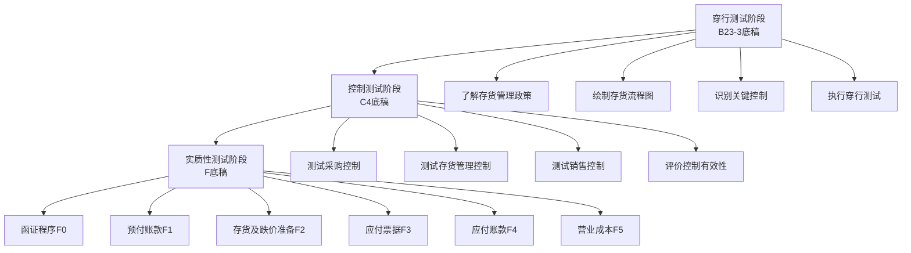
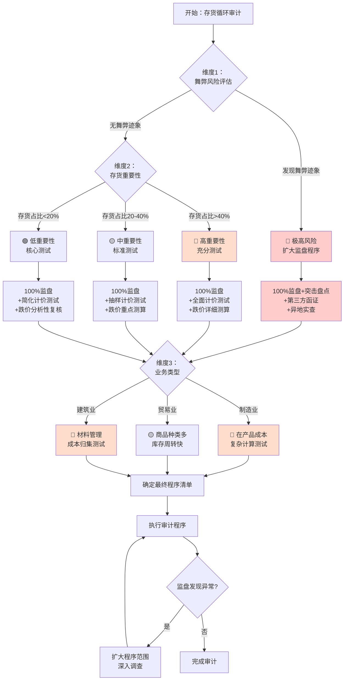
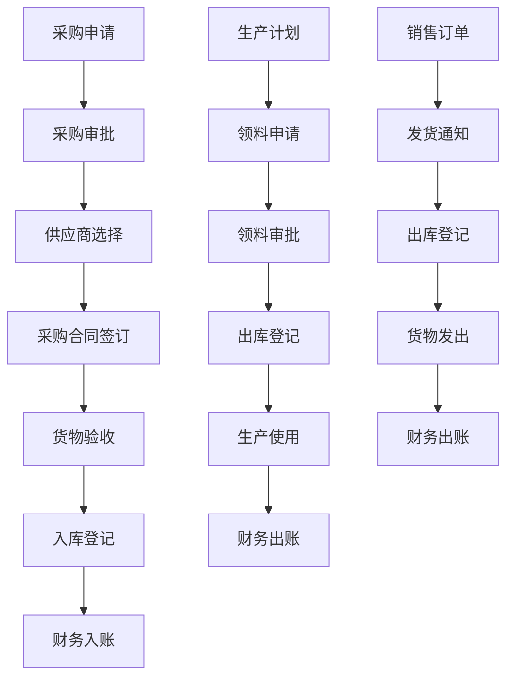
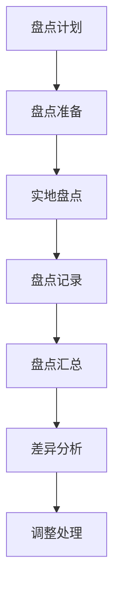
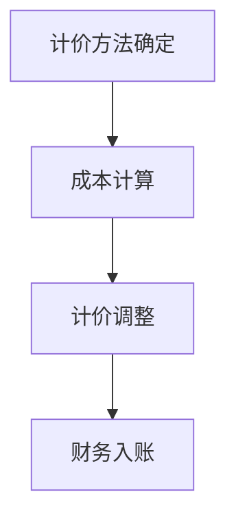

# 第十五章 存货循环操作手册

> **版本**: v1.0 | **更新日期**: 2025年10月 | **适用准则**: 中国注册会计师审计准则
> 
> **📍 返回主框架**: [审计实务操作手册-框架](./审计实务操作手册-框架.md#第十章-存货循环)
> 
> **🔗 本章在审计流程中的位置**: 第三部分 > 业务循环操作手册 > 第十章

---

## 📚 手册说明

本手册详细说明存货循环审计的全流程操作，包括穿行测试、控制测试和实质性测试三个阶段，每个阶段提供具体的底稿填写指引和实操案例。

### 适用范围

#### 资产类科目
- **预付账款审计** - 预付材料款、预付服务费
- **存货审计** - 包括以下细分科目：
  - 原材料 - 原料及主要材料、辅助材料、外购半成品、修理用备件、包装材料、燃料
  - 在产品 - 正在加工的产品、半成品
  - 产成品 - 已完工产品、自制半成品
  - 库存商品 - 商贸企业库存商品
  - 周转材料 - 包装物、低值易耗品
  - 发出商品 - 已发出但未确认收入的商品
  - 委托加工物资 - 委托外单位加工的物资
- **存货跌价准备审计** - 各类存货的减值准备

#### 负债类科目
- **应付票据审计** - 银行承兑汇票、商业承兑汇票
- **应付账款审计** - 应付材料款、应付加工费
- **合同负债审计** - 预收货款（与存货销售相关）

#### 损益类科目
- **营业成本审计** - 主营业务成本、其他业务成本
- **存货相关管理费用审计** - 仓储费、保管费、损耗费

### 底稿体系
- **B类底稿**: B23-3存货业务层面控制（6个子底稿）
- **C类底稿**: C4存货业务循环控制测试（3个子底稿）
- **F类底稿**: F存货循环实质性测试（125个子底稿）

---

## 🚀 5分钟快速上手指南

> **新手必读！** 第一次审计存货循环？这里告诉你最核心的内容和最快的路径。

### 📌 三步定位你需要的内容

**步骤1：确定你的审计阶段**
```
你在哪个阶段？
├─ 刚开始项目？ → 阅读【第10.1-10.3节】了解循环特征和风险
├─ 风险评估阶段？ → 执行【第10.4-10.6节】穿行测试
├─ 控制测试阶段？ → 执行【第10.7-10.9节】控制测试（可选）
└─ 实质性测试阶段？ → 重点看【第10.10-10.17节】⭐⭐⭐
```

**步骤2：找到你的核心必做程序**
```
存货循环审计的6个核心程序（必须执行）：
✅ 1. 存货监盘 → 第10.12节 ⭐⭐⭐（最重要！）
✅ 2. 存货函证（供应商、客户） → 第10.10节 ⭐⭐
✅ 3. 存货计价测试 → 第10.12节 ⭐⭐⭐
✅ 4. 跌价准备测试 → 第10.12节 ⭐⭐⭐
✅ 5. 存货截止性测试 → 第10.12节 ⭐⭐
✅ 6. 应付账款函证 → 第10.14节 ⭐⭐

存货监盘是核心！不能省略！
```

**步骤3：遇到问题时快速查找**
```
常见问题？ → 第10.19节FAQ（7个高频问题）
不会填底稿？ → 每节都有"填写示例"
需要模板？ → 查看"第10.16节：分析程序"
```

---

### 🎯 按场景快速导航

| 你的场景 | 直接跳到 | 预计时间 |
|---------|---------|---------|
| 🔍 **现场审计第一天** | [第10.10节 函证准备](#1010-函证程序) | 立即开始 |
| 📦 **存货监盘日** | [第10.12节 监盘程序](#1012-存货及跌价准备审计) | 全天 |
| 📝 **填写审定表F2-1** | [第10.12节 审定表](#1012-存货及跌价准备审计) | 30分钟 |
| 💰 **计价测试** | [第10.12节 计价测试](#1012-存货及跌价准备审计) | 2-3小时 |
| 🔎 **怀疑存货虚构** | [第10.17节 舞弊风险](#1017-特殊事项测试) | 重点程序 |
| 📊 **跌价准备测算** | [第10.12节 跌价测试](#1012-存货及跌价准备审计) | 3-4小时 |
| ✅ **质量复核** | 每节末尾"检查清单" | 按清单逐项 |

---

### ⭐ 新手必读Top 5（按优先级）

**1. 第10.12节：存货监盘程序** ⭐⭐⭐
- 为什么：监盘是存货审计的核心，必须100%执行
- 关键内容：监盘计划、现场观察、抽盘程序、盘点差异处理
- 重要提醒：必须在盘点日到现场！

**2. 第10.12节：存货计价测试** ⭐⭐⭐
- 为什么：计价错误是存货审计的主要风险
- 关键内容：成本计算测试、计价方法检查、成本归集测试
- 重要提醒：注意不同计价方法（先进先出、加权平均等）

**3. 第10.12节：跌价准备测试** ⭐⭐⭐
- 为什么：跌价准备不足是常见错报
- 关键内容：可变现净值测算、呆滞存货识别、减值测试
- 重要提醒：关注存货周转率低、库龄长的存货

**4. 第10.19节：常见问题FAQ** ⭐⭐
- 为什么：解决你90%的疑问，快速答疑
- 关键内容：7个高频问题的快速解答

**5. 第10.10节：函证程序** ⭐⭐
- 为什么：函证供应商和客户以核实存货相关交易
- 关键内容：应付账款函证、预付账款函证、委托代销函证

---

### ⚡ 现场审计第一天行动清单

**上午（9:00-12:00）**
```
□ 获取存货清单（期末余额）
□ 获取供应商、客户清单
□ 准备函证（供应商应付账款、重要客户）
□ 寄出函证（当天寄出！）→ 第10.10节
□ 预约存货监盘日期（与被审计单位协商）
```

**下午（14:00-17:00）**
```
□ 获取全年存货明细账
□ 获取存货跌价准备计算表
□ 获取营业成本明细表
□ 现场查看主要存货存放地点（初步了解）
□ 获取盘点制度和历史盘点记录
```

**当晚整理**
```
□ 编制存货审定表F2-1
□ 编制应付账款审定表F4-1
□ 编制函证跟踪表
□ 制定监盘计划（监盘日期、地点、人员）
□ 准备次日工作计划
```

---

### 💡 常见错误提醒（新手最容易犯的）

**❌ 错误1：不参与存货监盘**
- ✅ 正确：存货监盘是必须执行的程序，不能省略
- 📖 详见：第10.12节

**❌ 错误2：监盘日不在期末盘点日**
- ✅ 正确：应尽量在期末盘点日进行监盘，如无法在期末，需执行倒轧程序
- 📖 详见：第10.12节

**❌ 错误3：只关注期末余额，不关注存货周转**
- ✅ 正确：必须分析存货周转率，识别呆滞存货
- 📖 详见：第10.16节

**❌ 错误4：跌价准备测试不充分**
- ✅ 正确：必须获取可变现净值测算表，复核计算过程
- 📖 详见：第10.12节

**❌ 错误5：未检查存货截止性**
- ✅ 正确：必须执行期末前后1周的入库、出库截止测试
- 📖 详见：第10.12节

**❌ 错误6：忽视受托代销、委托代销存货**
- ✅ 正确：必须单独核查代销存货，确认权属清晰
- 📖 详见：第10.17节

**❌ 错误7：成本计算测试样本量不足**
- ✅ 正确：建议抽取10-20个产品进行成本计算测试
- 📖 详见：第10.12节

---

### 🔧 工具和资源

**Excel工具包（附录）**
- 存货监盘抽盘表
- 存货周转率分析表
- 跌价准备测算表
- 存货截止测试表
- 呆滞存货分析表
- 成本计算测试表

**底稿模板（附录）**
- F2-1存货审定表
- F2-9至F2-11监盘底稿
- F2-38至F2-46计价测试底稿
- F2-47至F2-55跌价准备测试底稿
- F4-1应付账款审定表

**在线资源**
- 中国注册会计师协会官网（审计准则）
- 企业会计准则（存货、资产减值相关）

---

### 📞 需要帮助时

**遇到问题优先级：**
1. 先查 **第10.19节FAQ**
2. 再查 **相关章节的详细说明**
3. 使用 **每节末尾的检查清单**
4. 最后 **询问项目经理**

**紧急情况联系：**
- 发现重大存货舞弊 → 立即向项目经理/合伙人汇报
- 被审计单位不配合监盘 → 向项目经理汇报，考虑对审计意见的影响
- 存货盘点差异重大 → 扩大抽盘范围，深入调查原因

---

**🎯 现在，根据你的情况选择：**

| 如果你是... | 推荐路径 |
|-----------|---------|
| 🆕 **新手审计师** | 先读完本指南 → 第10.1-10.3节（理论）→ 第10.12节（监盘）→ 边做边学 |
| 💼 **有经验审计师** | 直接跳到第10.10节（函证）和第10.12节（监盘）→ 必要时查FAQ |
| 👔 **项目经理/复核人** | 重点看每节的"检查清单"和第10.18节完工总结 |

---

## 📋 目录

### 第一部分：循环总览
1. [存货循环特征](#101-存货循环特征)
2. [审计流程概览](#102-审计流程概览)
3. [风险识别与应对](#103-风险识别与应对)

### 第二部分：穿行测试阶段（B23-3）
4. [穿行测试准备](#104-穿行测试准备)
5. [流程了解与控制识别](#105-流程了解与控制识别)
6. [穿行测试执行](#106-穿行测试执行)

### 第三部分：控制测试阶段（C4）
7. [控制测试设计](#107-控制测试设计)
8. [控制测试执行](#108-控制测试执行)
9. [控制测试评价](#109-控制测试评价)

### 第四部分：实质性测试阶段（F）
10. [函证程序](#1010-函证程序)
11. [预付账款审计](#1011-预付账款审计)
12. [存货及跌价准备审计](#1012-存货及跌价准备审计)
13. [应付票据审计](#1013-应付票据审计)
14. [应付账款审计](#1014-应付账款审计)
15. [营业成本审计](#1015-营业成本审计)
16. [分析程序](#1016-分析程序)
17. [特殊事项测试](#1017-特殊事项测试)

### 第五部分：实操案例
18. [完工总结](#1018-完工总结)
19. [常见问题解答](#1019-常见问题解答)

---

## 15.1 存货循环特征与风险识别

### 15.1.1 业务特点
### 15.1.2 主要风险点  
### 15.1.3 审计策略选择
### 15.1.4 认定-风险-程序映射体系

## 15.2 审计流程概览

### 15.2.1 审计流程图
### 15.2.2 底稿执行顺序
### 15.2.3 时间安排

## 15.3 穿行测试

### 15.3.1 穿行测试程序
### 15.3.2 穿行测试底稿
### 15.3.3 穿行测试结论

## 15.4 控制测试

### 15.4.1 控制测试程序
### 15.4.2 控制测试底稿
### 15.4.3 控制测试结论

## 15.5 实质性测试

### 15.5.1 实质性测试程序
### 15.5.2 实质性测试底稿
### 15.5.3 实质性测试结论

## 15.6 特殊事项处理

### 15.6.1 舞弊风险应对
### 15.6.2 存货盘点问题
### 15.6.3 成本核算问题

## 15.7 常见问题解答

### 15.7.1 盘点相关问题
### 15.7.2 成本核算问题
### 15.7.3 减值测试问题

## 15.8 附录

### 15.8.1 底稿模板
### 15.8.2 工具包
### 15.8.3 案例库

---

## 15.0 章节导航与前置准备

### 15.0.1 本章在整体框架中的位置

**📍 返回主框架**: [审计实务操作手册-框架](./审计实务操作手册-框架.md)

**前置章节**（建议先阅读）：
- [第零章：5分钟快速上手指南](./审计实务操作手册-框架.md#第零章-5分钟快速上手指南) - 了解整体底稿体系
- [第四章：审计流程全景图](./审计实务操作手册-框架.md#第四章-审计流程全景图) - 掌握审计策略选择
- [第五章：风险评估阶段](./审计实务操作手册-框架.md#第五章-风险评估阶段) - B类底稿通用逻辑
- [第六章：控制测试阶段](./审计实务操作手册-框架.md#第六章-控制测试阶段) - C类底稿通用逻辑
- [第七章：实质性测试阶段](./审计实务操作手册-框架.md#第七章-实质性测试阶段) - 实质性程序通用逻辑

**相关循环**（可能需要交叉引用）：
- [第八章：销售循环](./D销售循环操作手册.md) - 收入成本配比、应收账款往来
- [第九章：货币资金循环](./E货币资金循环操作手册.md) - 采购付款、票据背书
- [第十一章：固定资产循环](./H固定资产循环操作手册.md) - 存货与固定资产区分、低值易耗品
- [第十二章：在建工程循环](./审计实务操作手册-框架.md#第十二章-在建工程循环) - 工程物资、在建工程转固
- [第十七章：管理费用循环](./K管理费用循环操作手册.md) - 存货相关管理费用、办公用品
- [第十九章：债务循环](./L债务循环操作手册.md) - 应付票据、短期借款
- [第二十章：权益循环](./M权益循环操作手册.md) - 资本性支出、盈余公积、股权支付⭐
- [第二十一章：关联方循环](./审计实务操作手册-框架.md#第二十一章-关联方循环) - 关联方采购、销售

**审计策略参考**：
- [第4.3节：审计策略决策矩阵](./审计实务操作手册-框架.md#43-审计策略决策矩阵-⭐) → 存货循环建议采用**路径1（综合策略）**

---

### 15.0.2 底稿编码速查表

| 底稿类别 | 编码范围 | 主要用途 | 对应章节 |
|---------|---------|---------|---------|
| **B23-3** | B23-3-1 至 B23-3-6 | 业务层面控制识别 | 第10.4-10.6节 |
| **C4** | C4-1 至 C4-3 | 控制测试 | 第10.7-10.9节 |
| **F0** | F0-1 至 F0-11 | 函证程序 | 第10.10节 |
| **F1** | F1-1 至 F1-13 | 预付账款审计 | 第10.11节 |
| **F2** | F2-1 至 F2-73 | 存货及跌价准备审计 | 第10.12节 |
| **F3** | F3-1 至 F3-5 | 应付票据审计 | 第10.13节 |
| **F4** | F4-1 至 F4-21 | 应付账款审计 | 第10.14节 |
| **F5** | F5-1 至 F5-5 | 营业成本审计 | 第10.15节 |

---

### 15.0.3 符号说明与术语对照

| 符号/术语 | 含义 | 示例 |
|----------|------|------|
| ⭐⭐⭐ | 必须执行的核心程序 | 存货监盘⭐⭐⭐ |
| ⭐⭐ | 重要程序 | 计价测试⭐⭐ |
| ⭐ | 可选程序（视风险而定） | 附注披露测试⭐ |
| → | 跳转到相关章节 | → 第10.12节 |
| ✅ | 必做检查项 | ✅ 获取存货清单 |
| ⚠️ | 风险提醒 | ⚠️ 存货是高风险科目 |
| 💡 | 提示技巧 | 💡 建议使用Excel透视表 |
| 📖 | 参考详细说明 | 📖 详见：第10.12节 |

**底稿体系术语**：
- **B类底稿**: 业务层面控制（穿行测试）
- **C类底稿**: 控制测试
- **D-M类底稿**: 实质性测试（按科目分类）
- **审定表**: 科目余额汇总表（如F2-1存货审定表）
- **明细表**: 科目明细核对表
- **函证**: 向第三方发函确认余额或交易

---

## 15.1 存货循环特征

> **📋 本节核心要点**（5分钟速览）
>
> **必须掌握：**
> - ✅ 存货包括：原材料、在产品、产成品、商品、周转材料
> - ✅ 3大高风险：虚构存货、计价错误、跌价准备不足
> - ✅ 审计策略：综合策略（控制测试+充分实质性测试）
>
>
> **关键底稿：** B23-3（穿行测试）、C4（控制测试）、F系列（实质性测试）
>
> **风险提示：** ⚠️ 存货是高风险领域，必须保持职业怀疑态度，重点关注存在性和计价准确性

---

### 15.1.1 涉及科目

| 科目类别 | 具体科目 | 审计重点 |
|---------|---------|---------|
| **流动资产** | 预付账款 | 余额准确性、期后结转、关联方交易 |
| | 存货 | 存在性、计价准确性、跌价准备充分性 |
| | 存货跌价准备 | 计提充分性、减值测试合理性 |
| **流动负债** | 应付票据 | 余额完整性、到期日准确性 |
| | 应付账款 | 余额完整性、账龄分析、关联方交易 |
| **损益表** | 营业成本 | 成本计算准确性、成本结转及时性 |
| | 管理费用-存货相关 | 费用归集准确性、期间划分正确性 |

### 15.1.2 主要审计风险

| 风险类型 | 具体表现 | 风险等级 |
|---------|---------|---------|
| **舞弊风险** | 虚构存货、隐瞒存货损失 | 高 |
| **存在性** | 存货盘点不充分、权属不清 | 高 |
| **计价准确性** | 成本计算错误、跌价准备不足 | 中-高 |
| **完整性** | 未入账存货、跨期确认错误 | 中-高 |
| **分类错误** | 存货分类不当、重分类错误 | 中 |
| **关联方** | 关联方交易定价不公允 | 中 |

### 15.1.3 存货循环风险矩阵（风险导向）⚠️

> **📌 重要说明**：本风险矩阵体现风险导向审计方法论，将风险识别、关键控制、审计应对有机结合。

| 风险类别 | 具体风险 | 风险等级 | 受影响认定 | 关键控制 | 审计应对措施 | 相关底稿 |
|---------|---------|---------|-----------|---------|-------------|---------|
| **舞弊风险** | 虚构存货（虚假盘点、伪造单据） | **高** | 存在、准确性 | 实地监盘、盘点制度 | 监盘必须执行，扩大抽盘范围 | F2-9至F2-11 |
| **舞弊风险** | 隐瞒存货损失、毁损、呆滞 | **高** | 完整性、计价 | 定期盘点、减值测试 | 检查历史盘点差异、核查呆滞存货 | F2-47至F2-55 |
| **舞弊风险** | 虚增存货价值（高估成本） | **高** | 计价和分摊 | 成本核算复核 | 重新测算成本、核对原始凭证 | F2-38至F2-46 |
| **固有风险** | 监盘时间不当、盘点不充分 | **高** | 存在 | 盘点计划、监盘程序 | 制定详细监盘计划、现场观察 | F2-9至F2-11 |
| **固有风险** | 存货计价方法不合理 | **高** | 计价和分摊 | 计价方法选择与复核 | 评估计价方法合理性、重新计算 | F2-38至F2-46 |
| **固有风险** | 跌价准备计提不足 | **高** | 计价和分摊 | 定期减值测试 | 获取减值测试底稿、复核可变现净值 | F2-47至F2-55 |
| **固有风险** | 存货权属不清晰 | **中-高** | 权利和义务 | 入库单据管理 | 检查采购合同、入库单、发票 | F2-17至F2-20 |
| **控制风险** | 采购审批控制失效 | **中** | 发生 | 分级审批制度 | 测试采购审批流程 | C4-1至C4-3 |
| **控制风险** | 入库验收流于形式 | **中** | 存在、准确性 | 入库验收制度 | 测试入库验收控制 | C4-1至C4-3 |
| **控制风险** | 出库控制不严格 | **中** | 完整性 | 出库审批、领料单管理 | 测试出库审批流程 | C4-1至C4-3 |
| **错报风险** | 截止性错误（跨期） | **中** | 截止 | 期末截止控制 | 执行截止测试（前后1周） | F2-14至F2-16 |
| **错报风险** | 存货分类错误 | **中** | 分类 | 存货分类管理 | 检查存货分类账、重分类合理性 | F2-1至F2-3 |
| **错报风险** | 关联方交易定价不公允 | **中** | 计价、披露 | 关联方交易审批 | 识别关联方、核查定价公允性 | F2-65至F2-72 |

**风险矩阵使用说明**：
1. **风险等级**：根据固有风险和控制风险综合评估，存货是高风险科目
2. **受影响认定**：存货重点关注"存在"和"计价"认定
3. **关键控制**：采购审批、入库验收、出库控制、盘点制度、计价控制
4. **审计应对**：监盘是核心程序，不能省略；计价测试和跌价准备测试是关键
5. **相关底稿**：每个风险对应具体的审计程序和底稿编号

### 15.1.4 审计策略选择决策树 📊

```
┌─────────────────────────────────────────────────┐
│  存货循环审计策略决策                             │
├─────────────────────────────────────────────────┤
│                                                  │
│  开始：存货循环审计                               │
│         ↓                                        │
│  评估固有风险                                    │
│         ↓                                        │
│  ⚠️ 存货固有风险 = 高                            │
│  （易于虚构、计价复杂、舞弊高发）                 │
│         ↓                                        │
│  执行穿行测试（B23-3）                           │
│  了解采购-生产-销售流程                          │
│         ↓                                        │
│  控制设计是否有效？                               │
│    ↓ 否                 ↓ 是                     │
│    ↓                    ↓                        │
│    ↓           计划测试关键控制                   │
│    ↓           （采购、入库、出库、盘点）          │
│    ↓                    ↓                        │
│    ↓           执行控制测试（C4）                 │
│    ↓                    ↓                        │
│    ↓           控制运行是否有效？                  │
│    ↓              ↓ 否        ↓ 是               │
│    ↓              ↓            ↓                 │
│    ↓              ↓            ↓                 │
│    ↓              ↓       ✓ 可适度降低细节        │
│    ↓              ↓         测试的范围            │
│    ↓              ↓         （但监盘必须执行）    │
│    ↓              ↓            ↓                 │
│    ↓← ← ← ← ← ← ← ← ← ← ← ← ← ←                 │
│    ↓                                             │
│  实施实质性程序（F系列）                          │
│  ├─ F2-9/F2-11：存货监盘（必须！）               │
│  ├─ F2-38/F2-46：存货计价测试                    │
│  ├─ F2-47/F2-55：跌价准备测试                    │
│  ├─ F0：函证程序（预付、应付）                   │
│  ├─ F2-14/F2-16：截止测试                        │
│  └─ F2-56/F2-64：分析程序                        │
│         ↓                                        │
│  ⚠️ 关键原则：                                    │
│  1. 存货监盘是必须程序，不能省略！                │
│  2. 计价测试和跌价准备测试必须充分执行            │
│  3. 控制有效主要影响细节测试范围，不影响核心程序  │
│         ↓                                        │
│  完成审计工作                                    │
│                                                  │
└─────────────────────────────────────────────────┘
```

### 15.1.5 审计策略最终选择：综合策略

**✅ 推荐策略：综合策略（控制测试 + 充分实质性测试）**

**策略说明**：
1. **控制测试方面**：
   - 执行穿行测试（B23-3），了解采购-生产-销售流程
   - 对关键控制执行控制测试（C4）：
     * 采购审批控制
     * 入库验收控制
     * 出库控制
     * 盘点制度控制

2. **实质性测试方面**：
   - **监盘：必须执行，不能减少**
   - **计价测试：充分测试成本计算**
   - **跌价准备：详细测试可变现净值**
   - **截止测试：前后1周采购入库**
   - **分析程序：存货周转率、毛利率分析**

3. **理由**：
   - ⚠️ **存货固有风险极高**：易于虚构、计价复杂、舞弊高发
   - ⚠️ **监盘是核心程序**：即使控制有效也不能省略
   - ✅ 控制测试可帮助识别控制缺陷，用于管理建议书
   - ✅ 控制有效可适度减少细节测试范围（如采购入库检查数量）

**⚠️ 特别提示**：
- 存货审计中，**监盘是核心程序**，根据《审计准则第1211号》，对于重要存货必须实施监盘
- 根据《审计准则第1141号-舞弊》，存货是舞弊高风险领域
- 保持职业怀疑态度，关注虚构存货、隐瞒损失、高估价值的可能性
- 制造业企业存货占比高，审计风险更大，需要投入更多审计资源

### 15.1.6 审计资源配置

| 审计阶段 | 预计时间 | 人员配置 | 关键工作 |
|---------|---------|---------|---------|
| 穿行测试 | 1-2天 | 项目经理+助理 | 流程了解、控制识别 |
| 控制测试 | 2-3天 | 审计助理 | 控制测试样本抽查 |
| 实质性测试 | 5-8天 | 全体项目组 | 监盘、计价测试、分析程序 |

#### 底稿体系详细说明

**F0系列 - 存货循环函证程序（10个底稿）**
- F0A: 函证程序表
- F0-1: 函证结果汇总表
- F0-2: 核实被函证单位信息
- F0-3: 函证差异核对表(预付账款)
- F0-4: 函证差异核对表(应付账款)
- F0-5: 预付及采购替代程序
- F0-6: 替代程序检查表
- F0-7: 邮件传真回函可靠性验证
- F0-8: 函证程序舞弊风险评价表
- F0-9: 函证程序质量控制表

**F1系列 - 预付账款（11个底稿）**
- F1A: 预付账款实质性程序表
- F1-1: 审定表
- F1-2: 明细表
- F1-3: 调整分录汇总
- F1-4: 预付账款分析表
- F1-5: 预付账款检查表
- F1-6: 预付账款函证表
- F1-7: 预付账款替代程序表
- F1-8: 预付账款关联方交易检查表
- F1-9: 预付账款账龄分析表
- F1-10: 预付账款减值测试表

**F2系列 - 存货及跌价准备（72个底稿）**
- F2A: 存货及跌价准备实质性程序表
- F2-1: 审定表
- F2-2: 明细表
- F2-3: 原材料明细表
- F2-4: 在产品明细表
- F2-5: 产成品明细表
- F2-6: 商品明细表
- F2-7: 存货分类汇总表
- F2-8: 存货监盘表
- F2-9: 存货盘点倒轧表
- F2-10: 存货收发存汇总表
- F2-11: 存货成本计算表
- F2-12: 存货计价测试表
- F2-13: 存货跌价准备测试表
- F2-14: 存货分析表
- F2-15: 存货检查表
- F2-16: 存货函证表
- F2-17: 存货替代程序表
- F2-18: 存货关联方交易检查表
- F2-19: 存货账龄分析表
- F2-20: 存货减值测试表
- F2-21A: 存货监盘程序表
- F2-21: 存货监盘计划
- F2-22: 存货监盘执行
- F2-23: 存货监盘结果
- F2-24: 存货监盘评价
- F2-25: 存货监盘改进
- F2-26: 存货监盘报告
- F2-27: 存货监盘底稿
- F2-28: 存货监盘总结
- F2-29: 存货检查程序表
- F2-30: 存货检查计划
- F2-31: 存货检查执行
- F2-32: 存货检查结果
- F2-33: 存货检查评价
- F2-34: 存货检查改进
- F2-35: 存货检查报告
- F2-36: 存货检查底稿
- F2-37: 存货检查总结
- F2-38: 存货计价测试程序表
- F2-39: 存货计价测试计划
- F2-40: 存货计价测试执行
- F2-41: 存货计价测试结果
- F2-42: 存货计价测试评价
- F2-43: 存货计价测试改进
- F2-44: 存货计价测试报告
- F2-45: 存货计价测试底稿
- F2-46: 存货计价测试总结
- F2-47: 存货跌价准备测试表
- F2-48: 存货跌价准备测试计划
- F2-49: 存货跌价准备测试执行
- F2-50: 存货跌价准备测试结果
- F2-51: 存货跌价准备测试评价
- F2-52: 存货跌价准备测试改进
- F2-53: 存货跌价准备测试报告
- F2-54: 存货跌价准备测试底稿
- F2-55: 存货跌价准备测试总结
- F2-56: 存货分析程序表
- F2-57: 存货分析计划
- F2-58: 存货分析执行
- F2-59: 存货分析结果
- F2-60: 存货分析评价
- F2-61: 存货分析改进
- F2-62: 存货分析报告
- F2-63: 存货分析底稿
- F2-64: 存货分析总结
- F2-65: 存货关联方交易检查表
- F2-66: 存货关联方交易检查计划
- F2-67: 存货关联方交易检查执行
- F2-68: 存货关联方交易检查结果
- F2-69: 存货关联方交易检查评价
- F2-70: 存货关联方交易检查改进
- F2-71: 存货关联方交易检查报告
- F2-72: 存货关联方交易检查底稿
- F2-附注-上市: 存货附注模板(上市公司)
- F2-附注-国企: 存货附注模板(国有企业)

**F3系列 - 应付票据（11个底稿）**
- F3A: 应付票据实质性程序表
- F3-1: 审定表
- F3-2: 明细表
- F3-3: 调整分录汇总
- F3-4: 应付票据分析表
- F3-5: 应付票据检查表
- F3-6: 应付票据函证表
- F3-7: 应付票据替代程序表
- F3-8: 应付票据关联方交易检查表
- F3-9: 应付票据账龄分析表
- F3-10: 应付票据减值测试表

**F4系列 - 应付账款（13个底稿）**
- F4A: 应付账款实质性程序表
- F4-1: 审定表
- F4-2: 明细表
- F4-3: 调整分录汇总
- F4-4: 应付账款分析表
- F4-5: 应付账款检查表
- F4-6: 应付账款函证表
- F4-7: 应付账款替代程序表
- F4-8: 应付账款关联方交易检查表
- F4-9: 应付账款账龄分析表
- F4-10: 应付账款减值测试表
- F4-11: 应付账款余额调节表
- F4-12: 应付账款明细账核对表
- F4-13: 应付账款关联方交易明细表

**F5系列 - 营业成本（8个底稿）**
- F5A: 营业成本实质性程序表
- F5-1: 审定表
- F5-2: 月度成本明细表
- F5-3: 其他业务成本明细表
- F5-4: 调整分录汇总
- F5-5: 与上年度比较分析表（毛利率分析）
- F5-6: 销售数量与成本数量核对表
- F5-7: 成本倒轧表
- F5-8: 重大调整核查表

---

### 15.1.2 业务流程特点

#### 1. 业务复杂性
- **科目多**: 涉及5个主要科目，118个底稿
- **金额大**: 存货通常占资产总额的20-40%
- **周期长**: 从采购到销售的全生命周期管理
- **专业性强**: 需要采购、生产、销售等专业知识

#### 2. 控制关键点
- **采购控制**: 采购需求、采购审批、采购执行
- **存货管理**: 存货入库、存货出库、存货盘点
- **销售控制**: 销售订单、销售发货、销售收款
- **成本控制**: 成本计算、成本分配、成本分析

#### 3. 审计关注点
- **存在性**: 通过监盘确认存货真实存在
- **权属**: 检查存货权属证明、采购合同等
- **计价**: 检查存货计价方法、成本计算、跌价准备
- **完整性**: 确认所有应记录的存货均已入账
- **分类**: 确认存货分类和列报的准确性

---

### 15.1.3 主要审计风险

#### 高风险领域

**1. 存货存在性**
- **舞弊风险**:
  - 虚构存货
  - 重复计算存货
  - 隐瞒存货损失
- **错报风险**:
  - 监盘不充分
  - 权属证明不完整
  - 存货分类错误

**2. 存货计价**
- **舞弊风险**:
  - 虚增存货价值
  - 隐瞒存货损失
- **错报风险**:
  - 计价方法错误
  - 成本计算错误
  - 跌价准备计提不充分

**3. 存货完整性**
- **舞弊风险**:
  - 隐瞒存货损失
  - 虚增存货数量
- **错报风险**:
  - 存货记录不完整
  - 存货分类错误
  - 存货列报错误

#### 中等风险领域

**4. 预付账款**
- 主要为采购服务
- 风险相对较低
- 重点核对数据准确性

**5. 应付账款**
- 主要为采购服务
- 风险相对较低
- 重点核对数据准确性

**6. 应付票据**
- 主要为采购服务
- 风险相对较低
- 重点核对数据准确性

#### 低风险领域

**7. 营业成本**
- 主要为销售服务
- 风险相对较低
- 重点核对数据准确性

**8. 管理费用**
- 主要为管理服务
- 风险相对较低
- 重点核对数据准确性

---

### 底稿体系

- **B类底稿**: B23-3存货业务层面控制（6个子底稿）
- **C类底稿**: C4存货业务循环控制测试（3个子底稿）
- **F类底稿**: F存货循环实质性测试（共125个子底稿）
  - F0系列: 函证程序（10个底稿）
  - F1系列: 预付账款（11个底稿）
  - F2系列: 存货及跌价准备（72个底稿）
  - F3系列: 应付票据（11个底稿）
  - F4系列: 应付账款（13个底稿）
  - F5系列: 营业成本（8个底稿）

---

### 📚 手册说明

#### 适用范围
- 适用于所有年度审计项目
- 适用于存货循环相关科目的审计
- 可根据实际情况调整和补充

#### 使用建议
1. **审计策略**: 采用综合策略（控制测试+充分实质性测试）⭐
2. **程序组合**: 将监盘、计价测试、分析程序有机结合
3. **重点关注**: 存货存在性、计价准确性、跌价准备充分性、关联方交易
4. **职业判断**: 存货计价、跌价准备、成本计算等需要职业判断
5. **底稿交叉引用**: 注意与收入、成本、采购循环底稿的交叉引用

#### 更新记录
| 版本 | 日期 | 更新内容 | 更新人 |
|------|------|---------|--------|
| v1.0 | 2025-10 | 初始版本发布 | 审计部 |

---

**索引号**: 第10章-01  
**编制人**: [编制人]  
**编制日期**: [日期]  
**复核人**: [复核人]  
**复核日期**: [日期]
## 15.2 审计流程概览

> **📋 本节核心要点**（3分钟速览）
>
> **流程三阶段：**
> - ✅ 穿行测试（B23-3）→ 了解控制设计
> - ✅ 控制测试（C4）→ 测试控制运行
> - ✅ 实质性测试（F系列）→ 获取充分证据
>
> **关键时间节点：**
> - ⏰ 中期审计：穿行测试、控制测试
> - ⏰ 期末审计：存货监盘、计价测试
> - ⏰ 报告阶段：分析程序、特殊事项

---

### 15.2.1 审计流程图



### 15.2.2 底稿执行顺序

**第一阶段：穿行测试（B23-3系列）**
```
B23-3-1 整体控制汇总表
    ↓
B23-3-2 流程图及描述
    ↓
B23-3-3 控制矩阵
    ↓
B23-3-4 穿行测试记录
    ↓
B23-3-5 测试汇总表
    ↓
B23-3-6 评价报告
```

**第二阶段：控制测试（C4系列）**
```
C4 控制测试汇总表
    ↓
C4-1 控制测试过程记录
    ↓
C4-2 控制偏差评价
```

**第三阶段：实质性测试（F系列）**
```
F0系列 函证程序
    ↓
F1系列 预付账款审计
    ↓
F2系列 存货及跌价准备审计
    ↓
F3系列 应付票据审计
    ↓
F4系列 应付账款审计
    ↓
F5系列 营业成本审计
```

### 15.2.3 关键时间节点

| 阶段 | 时间节点 | 关键产出 | 责任人 |
|-----|---------|---------|--------|
| **中期审计** | 10-11月 | B23-3穿行测试、C4控制测试 | 项目经理+助理 |
| **期末审计** | 次年1-3月 | 存货监盘、计价测试、函证程序 | 全体项目组 |
| **报告阶段** | 次年3-4月 | 分析程序、特殊事项测试 | 项目经理 |

### 15.2.4 底稿调用路径

```
风险评估阶段
    ↓
【B23-3】穿行测试
├─ B23-3：程序表
├─ B23-3-1：整体控制汇总
├─ B23-3-2：流程图及描述
├─ B23-3-3：控制矩阵
├─ B23-3-4：穿行测试记录
├─ B23-3-5：测试汇总表
└─ B23-3-6：评价报告
    ↓
控制测试阶段（如控制有效）
    ↓
【C4】控制测试
├─ C4：控制测试汇总表
├─ C4-1：控制测试过程记录
└─ C4-2：控制偏差评价
    ↓
实质性测试阶段
    ↓
【F0】函证程序
├─ F0A：函证程序表
├─ F0-1：函证结果汇总
├─ F0-2：被函证单位信息核实
├─ F0-3：函证差异调节
├─ F0-4：替代程序
├─ F0-5：回函可靠性验证
└─ F0-6：舞弊风险评价
    ↓
【F1】预付账款
├─ F1A：实质性程序表
├─ F1-1：审定表
├─ F1-2：明细表
├─ F1-3：调整分录汇总
├─ F1-4：分析表
├─ F1-5：检查表
├─ F1-6：函证表
├─ F1-7：替代程序表
├─ F1-8：关联方交易检查表
├─ F1-9：账龄分析表
└─ F1-10：减值测试表
    ↓
【F2】存货及跌价准备
├─ F2A：实质性程序表
├─ F2-1：审定表
├─ F2-2：明细表
├─ F2-3：原材料明细表
├─ F2-4：在产品明细表
├─ F2-5：产成品明细表
├─ F2-6：商品明细表
├─ F2-7：分类汇总表
├─ F2-8：监盘表
├─ F2-9：盘点倒轧表
├─ F2-10：收发存汇总表
├─ F2-11：成本计算表
├─ F2-12：计价测试表
├─ F2-13：跌价准备测试表
└─ F2-14至F2-72：其他辅助底稿
    ↓
【F3】应付票据
【F4】应付账款
【F5】营业成本
```

---

### 15.2.2 存货循环审计流程

#### 存货循环审计流程步骤

**第一阶段：审计准备**
1. **了解被审计单位及其环境**
   - 了解被审计单位的基本情况
   - 了解被审计单位的行业状况
   - 了解被审计单位的法律环境
   - 了解被审计单位的监管环境
   - 了解被审计单位的其他外部因素

2. **了解被审计单位的内部控制**
   - 了解被审计单位的控制环境
   - 了解被审计单位的风险评估过程
   - 了解被审计单位的信息系统与沟通
   - 了解被审计单位的控制活动
   - 了解被审计单位对控制的监督

3. **识别和评估重大错报风险**
   - 识别财务报表层次和认定层次的重大错报风险
   - 评估重大错报风险发生的可能性和影响程度
   - 确定需要特别考虑的重大错报风险
   - 确定仅通过实质性程序无法应对的重大错报风险

**第二阶段：审计计划**
4. **制定总体审计策略**
   - 确定审计范围
   - 确定审计时间安排
   - 确定审计方向
   - 确定审计资源配置

5. **制定具体审计计划**
   - 制定风险评估程序
   - 制定进一步审计程序
   - 制定其他审计程序

**第三阶段：审计执行**
6. **执行风险评估程序**
   - 执行询问程序
   - 执行分析程序
   - 执行观察和检查程序

7. **执行进一步审计程序**
   - 执行控制测试
   - 执行实质性程序

**第四阶段：审计完成**
8. **完成审计工作**
   - 完成审计工作底稿
   - 完成审计报告
   - 完成审计总结

---

### 15.2.3 审计流程时间安排

#### 审计流程时间安排表

| 阶段 | 工作内容 | 预计时间 | 责任人 | 备注 |
|------|---------|---------|--------|------|
| 第一阶段 | 审计准备 | 1-2周 | 项目经理 | 了解被审计单位及其环境 |
| 第二阶段 | 审计计划 | 1周 | 项目经理 | 制定总体审计策略和具体审计计划 |
| 第三阶段 | 审计执行 | 4-6周 | 审计团队 | 执行风险评估程序、控制测试和实质性程序 |
| 第四阶段 | 审计完成 | 1-2周 | 项目经理 | 完成审计工作底稿、审计报告和审计总结 |

#### 存货循环审计时间安排

| 阶段 | 工作内容 | 预计时间 | 责任人 | 备注 |
|------|---------|---------|--------|------|
| 第一阶段 | 审计准备 | 1-2周 | 项目经理 | 了解被审计单位及其环境 |
| 第二阶段 | 审计计划 | 1周 | 项目经理 | 制定总体审计策略和具体审计计划 |
| 第三阶段 | 审计执行 | 4-6周 | 审计团队 | 执行风险评估程序、控制测试和实质性程序 |
| 第四阶段 | 审计完成 | 1-2周 | 项目经理 | 完成审计工作底稿、审计报告和审计总结 |

---

### 15.2.4 审计流程质量控制

#### 审计流程质量控制要点

**1. 审计准备阶段**
- 确保充分了解被审计单位及其环境
- 确保充分了解被审计单位的内部控制
- 确保正确识别和评估重大错报风险

**2. 审计计划阶段**
- 确保审计策略和计划合理可行
- 确保审计资源配置合理
- 确保审计时间安排合理

**3. 审计执行阶段**
- 确保审计程序执行充分
- 确保审计证据充分适当
- 确保审计工作底稿完整

**4. 审计完成阶段**
- 确保审计工作底稿完整
- 确保审计报告准确
- 确保审计总结完整

#### 存货循环审计质量控制要点

**1. 审计准备阶段**
- 确保充分了解被审计单位及其环境
- 确保充分了解被审计单位的内部控制
- 确保正确识别和评估重大错报风险

**2. 审计计划阶段**
- 确保审计策略和计划合理可行
- 确保审计资源配置合理
- 确保审计时间安排合理

**3. 审计执行阶段**
- 确保审计程序执行充分
- 确保审计证据充分适当
- 确保审计工作底稿完整

**4. 审计完成阶段**
- 确保审计工作底稿完整
- 确保审计报告准确
- 确保审计总结完整

---

### 15.2.5 审计流程风险控制

#### 审计流程风险控制要点

**1. 审计准备阶段风险控制**
- 风险：对被审计单位及其环境了解不充分
- 控制措施：充分了解被审计单位及其环境
- 风险：对内部控制了解不充分
- 控制措施：充分了解被审计单位的内部控制
- 风险：重大错报风险识别和评估不准确
- 控制措施：正确识别和评估重大错报风险

**2. 审计计划阶段风险控制**
- 风险：审计策略和计划不合理
- 控制措施：确保审计策略和计划合理可行
- 风险：审计资源配置不合理
- 控制措施：确保审计资源配置合理
- 风险：审计时间安排不合理
- 控制措施：确保审计时间安排合理

**3. 审计执行阶段风险控制**
- 风险：审计程序执行不充分
- 控制措施：确保审计程序执行充分
- 风险：审计证据不充分适当
- 控制措施：确保审计证据充分适当
- 风险：审计工作底稿不完整
- 控制措施：确保审计工作底稿完整

**4. 审计完成阶段风险控制**
- 风险：审计工作底稿不完整
- 控制措施：确保审计工作底稿完整
- 风险：审计报告不准确
- 控制措施：确保审计报告准确
- 风险：审计总结不完整
- 控制措施：确保审计总结完整

#### 存货循环审计风险控制要点

**1. 审计准备阶段风险控制**
- 风险：对被审计单位及其环境了解不充分
- 控制措施：充分了解被审计单位及其环境
- 风险：对内部控制了解不充分
- 控制措施：充分了解被审计单位的内部控制
- 风险：重大错报风险识别和评估不准确
- 控制措施：正确识别和评估重大错报风险

**2. 审计计划阶段风险控制**
- 风险：审计策略和计划不合理
- 控制措施：确保审计策略和计划合理可行
- 风险：审计资源配置不合理
- 控制措施：确保审计资源配置合理
- 风险：审计时间安排不合理
- 控制措施：确保审计时间安排合理

**3. 审计执行阶段风险控制**
- 风险：审计程序执行不充分
- 控制措施：确保审计程序执行充分
- 风险：审计证据不充分适当
- 控制措施：确保审计证据充分适当
- 风险：审计工作底稿不完整
- 控制措施：确保审计工作底稿完整

**4. 审计完成阶段风险控制**
- 风险：审计工作底稿不完整
- 控制措施：确保审计工作底稿完整
- 风险：审计报告不准确
- 控制措施：确保审计报告准确
- 风险：审计总结不完整
- 控制措施：确保审计总结完整

---

### 15.2.6 审计流程改进建议

#### 审计流程改进建议

**1. 审计准备阶段改进建议**
- 建议：加强对被审计单位及其环境的了解
- 建议：加强对内部控制的了解
- 建议：提高重大错报风险识别和评估的准确性

**2. 审计计划阶段改进建议**
- 建议：提高审计策略和计划的合理性
- 建议：优化审计资源配置
- 建议：优化审计时间安排

**3. 审计执行阶段改进建议**
- 建议：提高审计程序执行的充分性
- 建议：提高审计证据的充分适当性
- 建议：提高审计工作底稿的完整性

**4. 审计完成阶段改进建议**
- 建议：提高审计工作底稿的完整性
- 建议：提高审计报告的准确性
- 建议：提高审计总结的完整性

#### 存货循环审计改进建议

**1. 审计准备阶段改进建议**
- 建议：加强对被审计单位及其环境的了解
- 建议：加强对内部控制的了解
- 建议：提高重大错报风险识别和评估的准确性

**2. 审计计划阶段改进建议**
- 建议：提高审计策略和计划的合理性
- 建议：优化审计资源配置
- 建议：优化审计时间安排

**3. 审计执行阶段改进建议**
- 建议：提高审计程序执行的充分性
- 建议：提高审计证据的充分适当性
- 建议：提高审计工作底稿的完整性

**4. 审计完成阶段改进建议**
- 建议：提高审计工作底稿的完整性
- 建议：提高审计报告的准确性
- 建议：提高审计总结的完整性

---

### 📚 手册说明

#### 适用范围
- 适用于所有年度审计项目
- 适用于存货循环相关科目的审计
- 可根据实际情况调整和补充

#### 使用建议
1. **审计策略**: 优先考虑实质性方案
2. **程序组合**: 将监盘、检查、分析程序有机结合
3. **重点关注**: 大额存货、关联方交易、跌价准备
4. **职业判断**: 存货计价、跌价准备、成本计算等需要职业判断
5. **底稿交叉引用**: 注意与其他循环底稿的交叉引用

#### 更新记录
| 版本 | 日期 | 更新内容 | 更新人 |
|------|------|---------|--------|
| v1.0 | 2025-10 | 初始版本发布 | 审计部 |

---

**索引号**: 第10章-02  
**编制人**: [编制人]  
**编制日期**: [日期]  
**复核人**: [复核人]  
**复核日期**: [日期]
## 15.3 风险识别与应对

> **📋 本节核心要点**（5分钟速览）
>
> **3大高风险：**
> - 🔴 虚构存货：故意虚增存货数量或价值
> - 🔴 隐瞒存货损失：故意不记录存货损失
> - 🔴 计价错误：成本计算错误、跌价准备不足
>
> **关键应对程序：**
> - ✅ 100%监盘所有存货
> - ✅ 检查存货权属证明
> - ✅ 测试存货跌价准备计提
> - ✅ 关注关联方存货交易

---

### 15.3.1 特别风险清单

| 认定 | 风险描述 | 风险等级 | 应对程序 | 底稿索引 |
|-----|---------|---------|---------|---------|
| **存在性** | 虚构存货、重复计算 | 高 | 存货监盘、权属检查、第三方确认 | F2-8, F2-21 |
| **完整性** | 未入账存货、跨期确认错误 | 中-高 | 收发存测试、截止性测试、分析程序 | F2-10, F2-11 |
| **计价** | 成本计算错误、跌价准备不足 | 中-高 | 计价测试、成本计算复核、跌价准备测试 | F2-12, F2-13 |
| **分类** | 存货分类不当、重分类错误 | 中 | 分类检查、重分类测试 | F2-7 |
| **列报** | 关联方交易未披露 | 中 | 关联方识别、交叉核对 | F1-8, F2-65 |
| **权利义务** | 存货权属不清 | 中-高 | 权属证明检查、第三方确认 | F2-8 |

### 15.3.2 行业特定风险

**制造业特有风险：**
- **在产品计价**：生产过程中在产品成本计算复杂，容易出错
- **产成品减值**：市场需求变化导致产成品积压，减值风险高
- **原材料价格波动**：原材料价格波动影响存货计价准确性

**贸易业特有风险：**
- **商品分类**：商品种类繁多，分类容易出错
- **库存周转**：库存周转快，截止性风险高
- **季节性影响**：季节性商品跌价风险高

**建筑业特有风险：**
- **在建工程**：在建工程与存货界限不清
- **材料管理**：施工现场材料管理复杂
- **成本归集**：项目成本归集容易出错

### 15.3.3 舞弊风险识别

**高风险情形：**
1. **虚构存货**：故意虚增存货数量或价值，虚增资产
2. **隐瞒存货损失**：故意不记录存货损失，虚增利润
3. **关联方交易**：通过关联方虚增存货或转移存货
4. **重复计算**：同一存货在不同地点重复计算
5. **跌价准备不足**：故意少提跌价准备，虚增利润

**舞弊迹象识别：**
- 存货盘点时发现大量空箱或空包装
- 存货收发存记录与实物不符
- 存货跌价准备计提明显不足
- 关联方存货交易定价异常
- 存货监盘时被审计单位人员行为异常

**应对措施：**
- ✅ 100%监盘所有存货
- ✅ 检查存货权属证明
- ✅ 关注关联方存货交易
- ✅ 检查存货收发存记录
- ✅ 测试存货跌价准备计提

### 15.3.4 特殊事项关注

| 特殊事项 | 关注要点 | 审计程序 | 风险等级 |
|---------|---------|---------|---------|
| **存货减值** | 是否存在减值迹象、跌价准备是否充分 | F2-13跌价准备测试 | 中-高 |
| **关联方交易** | 定价是否公允、披露是否完整 | F1-8, F2-65关联方检查 | 中 |
| **存货分类** | 原材料、在产品、产成品分类是否正确 | F2-7分类汇总表 | 中 |
| **跨期确认** | 期末存货确认时点是否正确 | F2-10收发存测试 | 中-高 |
| **存货抵押** | 是否存在抵押、质押情况 | F2-8监盘表备注 | 中 |
| **存货保险** | 存货是否投保、保险金额是否充分 | 询问管理层 | 低 |

### 15.3.5 审计策略选择（与框架对接）

**推荐策略：综合策略（路径3）**

**理由：**
- 存货科目舞弊风险高，需要充分的实质性证据
- 同时可适度依赖有效的内部控制
- 平衡审计效率和审计质量

**具体策略：**
- **控制测试**：对关键控制（采购审批、入库验收、出库控制、盘点制度）执行测试
- **实质性测试**：充分执行（监盘、计价测试、分析程序、函证）
- **舞弊应对**：保持职业怀疑，关注异常交易

**与框架对接：**
- 参考[第4.3节：审计策略决策矩阵](./审计实务操作手册-框架.md#43-审计策略决策矩阵-⭐)
- 存货循环建议采用**路径3（综合策略）**

---

## 15.3.6 认定-风险-程序映射体系（⭐⭐⭐核心框架）

> **💡 本节位置**：10.3 风险识别与应对 > 10.3.6 认定-风险-程序映射体系

> **💡 为什么需要这个体系？**  
> 存货是制造业的核心资产，也是**舞弊的高风险领域**（虚构存货、隐瞒损失、跌价不足）。很多审计人员机械地执行监盘，不理解"为什么要这样盘点、如何识别舞弊"。本章节建立**认定→风险→程序**的清晰映射关系，帮助您：
> 1. **理解逻辑**：明白每个程序针对什么风险、验证哪个认定
> 2. **裁剪程序**：理解哪些程序绝对不能省略，哪些可以简化
> 3. **应对舞弊**：识别虚构存货、隐瞒损失、跌价不足的风险迹象
> 4. **职业怀疑**：监盘时保持职业怀疑态度，识别异常情况

---

### 📊 存货循环认定-风险-程序总览矩阵

#### 矩阵说明
- **横轴**：财务报表认定（5大类）
- **纵轴**：核心科目（5大类）
- **单元格内容**：主要风险 → 关键程序 → 风险等级
- **特别标注**：🔴 = 舞弊高风险

---

#### 表1：原材料/库存商品的认定-风险-程序矩阵

| 认定 | 主要风险 | 关键审计程序 | 底稿索引 | 风险等级 | 程序必要性 |
|-----|---------|------------|---------|---------|--------------|
| **存在性<br>Existence** | 🚨 **虚构存货（舞弊）**<br>• 伪造存货盘点记录<br>• 空箱/空包装充数<br>• 重复计算（多地点）<br>• 第三方仓库虚构 | ✅ **存货监盘**（100%必做）<br>✅ **抽盘测试**（双向测试）<br>✅ **权属证明检查**<br>✅ **第三方函证**（委托代管）<br>✅ **异地存货实地查看** | F2-8<br>F2-8<br>F2-21<br>F0系列<br>F2-8 | 🔴🔴🔴 极高<br>**（舞弊高发）** | ⭐⭐⭐<br>**绝对必做**<br>监盘不可省略<br>必须在盘点日到现场 |
| **完整性<br>Completeness** | 🟡 **存货遗漏/未入账**<br>• 在途存货未入账<br>• 收发存记录遗漏<br>• 跨期确认错误 | ✅ **收发存测试**（正向+反向）<br>✅ **截止性测试**<br>✅ **在途存货检查**<br>✅ **分析性复核**（趋势异常） | F2-10<br>F2-11<br>F2-10<br>F2-6 | 🟡 中 | ⭐⭐⭐<br>**必做**<br>重点关注期末 |
| **计价<br>Valuation** | 🔴 **成本计算错误**<br>• 成本归集错误<br>• 成本分配方法不当<br>• 计价方法错用<br>• 汇率使用错误（进口） | ✅ **成本计算测试**（重新计算）<br>✅ **计价方法检查**<br>✅ **采购价格核对**<br>✅ **入库单价检查** | F2-12<br>F2-12<br>F2-12<br>F2-12 | 🔴 高<br>**（常见错报）** | ⭐⭐⭐<br>**必做**<br>抽样测试成本 |
| **计价/减值<br>Valuation** | 🔴 **跌价准备不足（舞弊）**<br>• 呆滞存货未识别<br>• 可变现净值高估<br>• 减值测试不充分 | ✅ **跌价准备测算**（重新计算）<br>✅ **库龄分析**<br>✅ **呆滞存货识别**<br>✅ **可变现净值测试**<br>✅ **期后销售检查** | F2-13<br>F2-13<br>F2-13<br>F2-13<br>F2-13 | 🔴🔴 高<br>**（利润操纵手段）** | ⭐⭐⭐<br>**必做**<br>重点长库龄/滞销品 |
| **权利义务<br>Rights** | 🟡 **权属不清**<br>• 受托代管存货混淆<br>• 抵押存货未披露<br>• 寄售商品未区分 | ✅ **权属证明检查**<br>✅ **受托代管函证**<br>✅ **抵押登记查询**<br>✅ **寄售协议检查** | F2-21<br>F0系列<br>合同<br>F2-21 | 🟡 中 | ⭐⭐<br>监盘时特别关注<br>IPO必须全面检查 |
| **列报披露<br>Disclosure** | 🟡 **分类错误**<br>• 原材料/产成品混淆<br>• 在产品分类不当<br>• 科目列报错误 | ✅ **分类汇总表检查**<br>✅ **科目分类检查**<br>✅ **附注披露检查** | F2-7<br>F2-1<br>附注 | 🟡 中 | ⭐⭐<br>结合审定表检查 |

---

#### 表2：在产品的认定-风险-程序矩阵

| 认定 | 主要风险 | 关键审计程序 | 底稿索引 | 风险等级 | 程序必要性 |
|-----|---------|------------|---------|---------|--------------|
| **存在性<br>Existence** | 🔴 **在产品虚增**<br>• 虚构在产品<br>• 重复计算 | ✅ **生产现场观察**<br>✅ **在产品监盘**<br>✅ **完工进度检查** | F2-8<br>F2-8<br>F2-12 | 🔴 高<br>**（难以盘点）** | ⭐⭐⭐<br>**必做**<br>现场观察+技术咨询 |
| **计价<br>Valuation** | 🔴 **成本归集错误**<br>• 直接材料/人工/制费归集错误<br>• 完工百分比估计不准<br>• 约当产量计算错误 | ✅ **成本归集测试**<br>✅ **完工进度测试**<br>✅ **约当产量测算**<br>✅ **成本分配方法检查** | F2-12<br>F2-12<br>F2-12<br>F2-12 | 🔴🔴 高<br>**（计算复杂）** | ⭐⭐⭐<br>**必做**<br>抽样重新计算 |
| **减值<br>Valuation** | 🟡 **在产品减值**<br>• 长期停工项目<br>• 技术淘汰 | ✅ **停工项目识别**<br>✅ **减值迹象检查** | F2-13<br>F2-13 | 🟡 中 | ⭐⭐<br>重点关注异常项目 |

---

#### 表3：应付账款的认定-风险-程序矩阵

| 认定 | 主要风险 | 关键审计程序 | 底稿索引 | 风险等级 | 程序必要性 |
|-----|---------|------------|---------|---------|--------------|
| **存在性<br>Existence** | 🟡 **应付虚增**<br>• 虚构供应商<br>• 重复入账 | ✅ **供应商函证**<br>✅ **大额核查**<br>✅ **期后付款检查** | F0系列<br>F4-10<br>F4-11 | 🟡 中<br>（低估负债风险低） | ⭐⭐<br>抽样函证<br>重点大额/异常 |
| **完整性<br>Completeness** | 🔴 **应付漏记（舞弊）**<br>• 隐瞒负债<br>• 未入账应付<br>• 跨期确认错误 | ✅ **收货未匹配检查**<br>✅ **截止性测试**<br>✅ **期后付款检查**<br>✅ **供应商对账单核对** | F4-10<br>F4-11<br>F4-11<br>F4-10 | 🔴🔴 高<br>**（低估负债风险）** | ⭐⭐⭐<br>**必做**<br>完整性是重点 |
| **准确性<br>Accuracy** | 🟡 **金额错误**<br>• 价格错误<br>• 数量错误 | ✅ **采购价格核对**<br>✅ **入库数量核对**<br>✅ **函证核对** | F4-10<br>F4-10<br>F0系列 | 🟡 中 | ⭐⭐<br>抽样检查 |
| **权利义务<br>Rights** | 🟢 风险低 | ✅ 函证即可验证 | F0系列 | 🟢 低 | ⭐<br>结合函证 |

---

#### 表4：营业成本的认定-风险-程序矩阵

| 认定 | 主要风险 | 关键审计程序 | 底稿索引 | 风险等级 | 程序必要性 |
|-----|---------|------------|---------|---------|--------------|
| **发生<br>Occurrence** | 🟡 **虚增成本**<br>• 虚构成本<br>• 关联方虚增 | ✅ **成本明细检查**<br>✅ **大额成本核查**<br>✅ **关联方检查** | F2-14<br>F2-14<br>F1-8 | 🟡 中 | ⭐⭐<br>重点关注异常 |
| **完整性<br>Completeness** | 🟡 **成本漏记**<br>• 成本未结转<br>• 跨期结转 | ✅ **成本结转测试**<br>✅ **截止性测试**<br>✅ **收入成本配比** | F2-14<br>F2-11<br>F2-6 | 🟡 中 | ⭐⭐<br>结合收入测试 |
| **准确性<br>Accuracy** | 🔴 **成本计算错误**<br>• 单位成本错误<br>• 成本结转数量错误<br>• 成本分配方法不当 | ✅ **单位成本测算**<br>✅ **成本结转重算**<br>✅ **成本计算方法检查**<br>✅ **毛利率分析** | F2-12<br>F2-14<br>F2-12<br>F2-6 | 🔴🔴 高<br>**（影响毛利率）** | ⭐⭐⭐<br>**必做**<br>重点测算 |
| **截止性<br>Cutoff** | 🟡 **跨期结转成本**<br>• 提前/推迟结转 | ✅ **截止性测试**<br>✅ **收入成本配比检查** | F2-11<br>D4系列 | 🟡 中 | ⭐⭐<br>结合收入截止 |

---

#### 表5：预付账款的认定-风险-程序矩阵

| 认定 | 主要风险 | 关键审计程序 | 底稿索引 | 风险等级 | 程序必要性 |
|-----|---------|------------|---------|---------|--------------|
| **存在性<br>Existence** | 🟡 **预付虚增**<br>• 虚构预付<br>• 关联方占用 | ✅ **供应商函证**<br>✅ **合同检查**<br>✅ **期后到货检查** | F0系列<br>F3-5<br>F3-5 | 🟡 中 | ⭐⭐<br>抽样函证<br>重点大额/长期挂账 |
| **计价<br>Valuation** | 🟡 **预付减值**<br>• 供应商无法供货<br>• 合同取消 | ✅ **长期挂账分析**<br>✅ **减值迹象识别**<br>✅ **期后到货检查** | F3-5<br>F3-5<br>F3-5 | 🟡 中 | ⭐⭐<br>重点长期挂账 |

---

### 🎯 基于风险的程序裁剪决策体系

#### 三维度判断流程图



---

#### 决策表1：核心程序必做性判断（不同风险场景）

| 审计程序 | 正常风险 | 怀疑舞弊 | IPO项目 | 制造业（在产品） | 裁剪依据 |
|---------|---------|---------|---------|----------------|---------|
| **存货监盘** | ⭐⭐⭐<br>100%必做<br>所有地点 | ⭐⭐⭐<br>突击盘点<br>+双向抽盘 | ⭐⭐⭐<br>100%+异地<br>+第三方现场 | ⭐⭐⭐<br>包括在产品<br>+生产现场观察 | 审计准则要求<br>**绝对不可省略** |
| **成本计价测试** | ⭐⭐⭐<br>抽样测试<br>重点产品 | ⭐⭐⭐<br>扩大样本<br>+全面重算 | ⭐⭐⭐<br>全面测试<br>+成本归集 | ⭐⭐⭐<br>**在产品成本**<br>约当产量法 | 计价认定核心<br>必须执行 |
| **跌价准备测算** | ⭐⭐⭐<br>库龄分析<br>+重新计算 | ⭐⭐⭐<br>全面测算<br>+期后销售 | ⭐⭐⭐<br>详细测算<br>+技术咨询 | ⭐⭐⭐<br>呆滞品识别<br>+可变现净值 | 减值认定重点<br>利润操纵手段 |
| **应付账款函证** | ⭐⭐<br>抽样函证<br>重点供应商 | ⭐⭐⭐<br>扩大覆盖<br>+零余额 | ⭐⭐⭐<br>高覆盖率<br>+对账单核对 | ⭐⭐<br>主要供应商 | 完整性认定<br>低估负债风险 |
| **截止性测试** | ⭐⭐⭐<br>前后各5天 | ⭐⭐⭐<br>前后各10天<br>+重点最后1天 | ⭐⭐⭐<br>前后各10-15天 | ⭐⭐⭐<br>收发存截止 | 完整性/截止<br>必须执行 |
| **权属证明检查** | ⭐⭐<br>重点检查 | ⭐⭐⭐<br>全面检查<br>+第三方确认 | ⭐⭐⭐<br>**必须全面检查** | ⭐⭐<br>受托代管 | IPO特殊要求<br>权利义务认定 |
| **第三方存货函证** | ⭐⭐<br>重要第三方 | ⭐⭐⭐<br>全部第三方 | ⭐⭐⭐<br>100%函证<br>+现场查看 | ⭐⭐<br>委托加工 | 存在性认定<br>重要时必做 |
| **收发存测试** | ⭐⭐<br>抽样测试 | ⭐⭐⭐<br>扩大样本<br>+双向测试 | ⭐⭐⭐<br>全面测试 | ⭐⭐⭐<br>生产领用测试 | 完整性认定<br>必须执行 |
| **毛利率分析** | ⭐⭐<br>整体分析 | ⭐⭐⭐<br>分产品分析<br>+异常调查 | ⭐⭐⭐<br>深度分析<br>+与同行对比 | ⭐⭐⭐<br>成本变动分析 | 分析性程序<br>识别异常 |
| **异地存货查看** | ⭐<br>视重要性 | ⭐⭐⭐<br>必须现场 | ⭐⭐⭐<br>**必须现场** | ⭐⭐<br>重要异地 | 存在性认定<br>高风险必做 |

---

#### 决策表2：认定层面风险应对（不同认定的程序选择）

| 识别的风险 | 主要认定 | 首选程序 | 备选程序 | 程序组合建议 | 最低要求 |
|----------|---------|---------|---------|------------|---------|
| **虚构存货（舞弊）** | 存在性 | ✅ 存货监盘<br>✅ 双向抽盘 | ✅ 权属证明<br>✅ 第三方函证<br>✅ 异地实查 | 监盘+权属+函证<br>组合验证 | 100%监盘<br>+双向抽盘 |
| **隐瞒存货损失** | 完整性 | ✅ 监盘观察<br>✅ 库龄分析 | ✅ 呆滞品识别<br>✅ 仓库巡查 | 监盘时重点观察<br>积压/破损 | 监盘+库龄分析 |
| **成本计算错误** | 计价 | ✅ 成本重新计算<br>✅ 单位成本测算 | ✅ 成本归集测试<br>✅ 毛利率分析 | 抽样重算<br>+毛利率交叉验证 | 抽样成本重算<br>（20-30笔） |
| **跌价准备不足** | 计价/减值 | ✅ 跌价重新计算<br>✅ 库龄分析 | ✅ 期后销售检查<br>✅ 可变现净值测试<br>✅ 呆滞品清单 | 重算+库龄+期后销售<br>交叉验证 | 跌价重新计算<br>+库龄分析 |
| **应付账款漏记** | 完整性 | ✅ 收货未匹配检查<br>✅ 期后付款检查 | ✅ 供应商对账单<br>✅ 供应商函证 | 期后付款是关键<br>+对账单核对 | 期后付款检查<br>（3个月） |
| **在产品成本错误** | 计价 | ✅ 成本归集测试<br>✅ 完工进度检查 | ✅ 约当产量测算<br>✅ 生产现场观察 | 成本归集+完工进度<br>+技术咨询 | 成本归集测试<br>+完工进度 |
| **权属不清/混淆** | 权利义务 | ✅ 权属证明检查<br>✅ 受托代管函证 | ✅ 合同检查<br>✅ 监盘标识 | 监盘时单独盘点<br>受托代管存货 | 权属证明检查<br>+监盘标识 |

---

### 💼 实战案例

#### 案例1：制造业企业的存货审计

**项目背景**：
- 企业性质：电子制造业，资产总额5亿元
- 存货金额：8000万元（占资产16%）
- 存货构成：原材料40%、在产品30%、产成品30%
- 项目类型：连续第4年审计，非上市公司
- 风险评估：中等风险
- 团队配置：项目经理1人+审计员3人

**程序执行方案**：

| 程序类别 | 具体方案 | 工时 |
|---------|---------|------|
| **存货监盘** | ✅ 全面监盘（3个仓库）<br>• 原材料仓：抽盘30%<br>• 在产品（生产线）：现场观察+技术咨询<br>• 产成品仓：抽盘40%<br>• 双向抽盘（盘点表→实物、实物→盘点表） | 1天（8小时）<br>3人×8=24小时 |
| **成本计价测试** | ✅ 抽样测试（30笔）<br>• 原材料：采购价格核对<br>• 产成品：单位成本重算<br>• 在产品：成本归集测试+约当产量 | 12小时 |
| **跌价准备测算** | ✅ 库龄分析+重新计算<br>• 长库龄存货清单（>1年）<br>• 可变现净值测算（抽样）<br>• 期后销售检查（3个月） | 8小时 |
| **应付账款函证** | ✅ 抽样函证（前20大供应商）<br>• 函证覆盖率约70% | 4小时<br>+2周催函 |
| **截止性测试** | ✅ 前后各5天<br>• 收货/发货/入库/出库 | 4小时 |
| **分析程序** | ✅ 毛利率分析、存货周转率 | 2小时 |
| **其他程序** | 权属检查、收发存测试等 | 6小时 |

**工时估算**：
- 监盘：24小时（3人×8小时）
- 计价测试：12小时
- 跌价测试：8小时
- 函证与其他：16小时
- **合计：60小时**（约7.5人天）

**特别关注**：
- 在产品监盘难度大，需要生产经理陪同解释
- 电子产品更新换代快，跌价准备是重点
- 监盘时发现少量呆滞原材料，建议补提跌价准备

---

#### 案例2：怀疑虚构存货的审计应对

**项目背景**：
- 企业性质：贸易公司，年收入10亿元
- 舞弊迹象：<br>  • 存货周转率异常低（0.5次/年，行业正常5次）<br>  • 毛利率异常高（30%，行业正常10%）<br>  • 大量存货存放在第三方仓库<br>  • 期后销售很少
- 项目类型：首次承接
- 风险评估：高风险（怀疑虚构存货）

**扩大程序方案**：

| 扩大程序 | 具体措施 | 发现 |
|---------|---------|------|
| **突击盘点** | ✅ 不提前通知盘点时间<br>• 临时决定12月28日监盘<br>• 提前1天通知被审计单位 | 被审计单位措手不及，<br>部分仓库"临时封闭维护" |
| **全面盘点** | ✅ 全部仓库监盘<br>• 3个自有仓库全盘<br>• 2个第三方仓库实地查看 | 第三方仓库1发现大量空箱 |
| **第三方函证** | ✅ 对所有第三方仓库函证<br>• 确认代管数量<br>• 要求提供出入库明细 | 第三方回函金额<br>与账面差异50% |
| **双向抽盘** | ✅ 双向抽盘比例提高<br>• 盘点表→实物：100%<br>• 实物→盘点表：80% | 发现20%的盘点表记录<br>对应实物不存在 |
| **期后销售详查** | ✅ 期后6个月销售检查<br>• 追踪每笔大额销售 | 期后实际销售不到10%<br>大部分存货未动销 |
| **权属证明全查** | ✅ 抽查50笔存货采购合同<br>• 核对供应商、金额、数量 | 发现5笔采购合同可疑<br>（供应商工商已注销） |
| **毛利率深度分析** | ✅ 逐月、逐产品分析<br>• 与同行业对比 | 毛利率明显异常<br>同行业正常10%，该公司30% |
| **管理层访谈** | ✅ 询问存货周转率低的原因<br>• 询问第三方仓库的必要性 | 管理层解释不合理<br>前后矛盾 |

**调查结果**：
- 确认存在**虚构存货约3000万元**
- 第三方仓库的存货实际只有账面的50%
- 部分存货采购合同虚假（供应商已注销）
- 存货周转率异常是因为虚构存货不动销

**审计结论与应对**：
1. 向项目合伙人汇报，评估对财务报表的影响
2. 要求管理层调整财务报表（核销虚构存货3000万元）
3. 评估管理层诚信度，考虑是否解除业务约定
4. 考虑出具非标意见或拒绝出具报告
5. 评估是否需要向监管机构报告

**工时统计**：约**120小时**（扩大程序耗时大幅增加）

---

### ✅ 程序有效性自查

#### 核心问题自查

**问题1：我的监盘程序充分吗？**
```
监盘充分性自查清单：
✅ 是否在盘点日到现场？（不能事后补盘）
✅ 是否实际观察盘点过程？（不能只看盘点表）
✅ 是否执行双向抽盘？（盘点表→实物、实物→盘点表）
✅ 抽盘比例是否充分？（重要性高>30%，一般>20%）
✅ 是否关注权属标识？（受托代管、寄售商品）
✅ 是否关注存货状态？（破损、过期、呆滞）
✅ 盘点差异是否调查？（>重要性必须调查）
```

**问题2：我的成本计价测试充分吗？**
```
成本计价测试自查：
✅ 是否抽样重新计算成本？（至少20-30笔）
✅ 是否检查计价方法？（先进先出、加权平均）
✅ 是否测试成本归集？（制造业在产品）
✅ 是否分析毛利率？（同比、环比、与同行对比）
✅ 异常毛利率是否调查？（波动>5%必须调查）
```

**问题3：我的跌价准备测试充分吗？**
```
跌价准备测试自查：
✅ 是否进行库龄分析？（识别呆滞存货）
✅ 是否重新计算跌价准备？（抽样或全面）
✅ 是否检查期后销售？（验证可变现净值）
✅ 是否识别呆滞品？（长期不动、技术淘汰）
✅ 跌价准备明显不足是否调查？（<合理比例）
```

**问题4：我的应付账款程序充分吗？**
```
应付账款程序自查：
✅ 是否函证供应商？（抽样或重点）
✅ 是否检查期后付款？（3-6个月，识别漏记）
✅ 是否核对供应商对账单？（交叉验证）
✅ 是否检查收货未匹配？（已收货未入账应付）
✅ 是否关注零余额供应商？（本期有采购）
```

---

### ⚠️ 常见错误与纠正

#### 错误1：不在盘点日到现场监盘 ❌

**错误表现**：
- "盘点日我有其他项目，让助理去就行"
- "被审计单位盘点完后，我看盘点表就行"
- "事后补盘也一样"

**正确做法** ✅：
- **审计人员必须在盘点日到现场**，这是审计准则的明确要求
- 不能事后补盘（存货可能已经调整）
- 不能只看盘点表（无法识别舞弊）
- 项目经理或有经验的审计人员必须亲自参与

---

#### 错误2：监盘时只看不抽盘 ❌

**错误表现**：
- "我在现场走了一圈，看起来没问题"
- "被审计单位盘点很认真，我相信他们"
- "盘点表记录很完整，应该准确"

**正确做法** ✅：
- **必须执行双向抽盘**：<br>  ① 盘点表→实物：验证存在性<br>  ② 实物→盘点表：验证完整性
- 抽盘比例要充分（重要性高>30%，一般>20%）
- 抽盘要覆盖不同品类、不同仓库
- 抽盘要实际清点数量、检查状态

---

#### 错误3：不测试在产品成本 ❌

**错误表现**：
- "在产品太复杂，不好测试"
- "在产品金额不大，可以不测"
- "管理层说成本是对的，我就信了"

**正确做法** ✅：
- **在产品成本必须测试**，尤其是制造业
- 测试方法：<br>  ① 成本归集测试（材料、人工、制费）<br>  ② 完工进度检查（约当产量法）<br>  ③ 生产现场观察+技术咨询
- 在产品计价错误是常见错报

---

#### 错误4：跌价准备只做分析不重算 ❌

**错误表现**：
- "跌价准备看起来合理，不用重算"
- "被审计单位有跌价准备计算表，我看了一下没问题"
- "没有呆滞存货，不用提跌价准备"

**正确做法** ✅：
- **跌价准备必须重新计算**（至少抽样）
- 重算步骤：<br>  ① 库龄分析（识别呆滞存货）<br>  ② 可变现净值测算（售价-销售费用）<br>  ③ 期后销售检查（验证可变现净值）
- 跌价准备不足是利润操纵的常见手段
- 即使没有明显呆滞，也要做库龄分析

---

#### 错误5：应付账款只看期末余额 ❌

**错误表现**：
- "应付账款函证了，余额准确就行"
- "期末应付不大，不用详细检查"

**正确做法** ✅：
- **应付账款完整性是重点**（低估负债风险）
- 关键程序：<br>  ① 期后付款检查（3-6个月，识别漏记）<br>  ② 收货未匹配检查（已收货未入账应付）<br>  ③ 供应商对账单核对
- 函证主要验证存在性，完整性要靠期后付款

---

### 🏆 存货审计的6大黄金法则

#### 法则1：监盘必须100%执行 🔴
**存货监盘是审计准则的明确要求**，必须在盘点日到现场，执行双向抽盘。不能事后补盘，不能只看盘点表。

#### 法则2：双向抽盘缺一不可 📋
监盘必须双向抽盘：<br>① 盘点表→实物（验证存在性）<br>② 实物→盘点表（验证完整性）<br>单向抽盘只能验证一个认定，不充分。

#### 法则3：成本计价必须重算 💰
**成本计价测试不能只看**，必须抽样重新计算（20-30笔）。制造业的在产品成本更要重点测试（成本归集+约当产量）。

#### 法则4：跌价准备必须重算 📉
**跌价准备不足是利润操纵的常见手段**。必须做库龄分析+可变现净值测算+期后销售检查，不能只看管理层计算表。

#### 法则5：应付完整性是重点 📝
应付账款的完整性（低估负债）是重点风险。必须做期后付款检查+收货未匹配检查，不能只做函证。

#### 法则6：职业怀疑不能丢 ⚠️
存货是舞弊高发领域（虚构存货、隐瞒损失）。监盘时要保持职业怀疑，关注异常情况（空箱、破损、呆滞、第三方仓库）。

---

### 📋 程序执行检查清单

**存货审计程序完成度自查**：

#### 监盘程序
- [ ] 在盘点日到现场监盘
- [ ] 执行双向抽盘（盘点表→实物、实物→盘点表）
- [ ] 抽盘比例充分（>20-30%）
- [ ] 关注权属标识（受托代管、寄售）
- [ ] 关注存货状态（破损、过期、呆滞）
- [ ] 盘点差异已调查
- [ ] 监盘日与资产负债表日接近（<7天）

#### 计价测试
- [ ] 抽样重新计算成本（20-30笔）
- [ ] 检查计价方法（先进先出、加权平均）
- [ ] 制造业：在产品成本归集测试
- [ ] 制造业：约当产量测算
- [ ] 毛利率分析（同比、环比、与同行对比）
- [ ] 异常毛利率已调查

#### 跌价准备测试
- [ ] 库龄分析已执行
- [ ] 跌价准备重新计算（抽样或全面）
- [ ] 呆滞存货已识别
- [ ] 可变现净值测算
- [ ] 期后销售检查（3-6个月）
- [ ] 跌价准备不足已调查

#### 应付账款程序
- [ ] 供应商函证已执行（抽样）
- [ ] 期后付款检查（3-6个月）
- [ ] 收货未匹配检查
- [ ] 供应商对账单核对
- [ ] 零余额供应商已关注

#### 其他程序
- [ ] 截止性测试（收货/发货/入库/出库）
- [ ] 权属证明检查
- [ ] 第三方存货函证（重要时）
- [ ] 收发存测试
- [ ] 分析程序（存货周转率等）

#### 风险应对
- [ ] 舞弊迹象已识别
- [ ] 异常情况已深入调查
- [ ] 重大发现已向合伙人汇报

---

## 🎓 本章小结

通过本章的**"认定-风险-程序映射体系"**，您应该能够：

1. ✅ **理解核心逻辑**：明白为什么监盘必须100%执行、为什么要双向抽盘
2. ✅ **识别舞弊风险**：掌握虚构存货、隐瞒损失的识别方法
3. ✅ **执行充分程序**：知道哪些程序绝对不能省略（监盘、计价、跌价）
4. ✅ **应对特殊情况**：遇到舞弊迹象时，知道如何扩大程序
5. ✅ **保持职业怀疑**：监盘时保持职业怀疑，关注异常情况

**核心要点回顾**：
- 🔴 监盘100%执行是**铁律**，必须在盘点日到现场
- 📋 双向抽盘**缺一不可**（验证存在性+完整性）
- 💰 成本计价必须**重新计算**（抽样20-30笔）
- 📉 跌价准备必须**重新测算**（库龄分析+可变现净值）
- 📝 应付完整性是**重点风险**（期后付款检查）
- ⚠️ 存货是**舞弊高发领域**（虚构存货、隐瞒损失）

---

**💡 实用建议**：
1. 监盘日必须到现场，不能事后补盘
2. 双向抽盘比例要充分（>20-30%）
3. 在产品成本要重点测试（制造业）
4. 库龄>1年的存货重点关注跌价准备
5. 期后付款检查是识别应付漏记的关键

---


---

## 15.4 穿行测试准备

> **📋 本节核心要点**（3分钟速览）
>
> **准备工作：**
> - ✅ 收集必备资料（制度、台账、记录等）
> - ✅ 安排访谈对象（采购、仓库、财务、生产）
> - ✅ 准备B23-3系列底稿
>
> **关键提醒：**
> - ⚠️ 访谈前要充分了解被审计单位业务特点
> - ⚠️ 现场观察要重点关注关键控制点
> - ⚠️ 资料收集要完整，避免遗漏

---

### 15.4.1 准备工作清单

#### 15.4.1.1 资料收集

**必备资料（必须收集）：**
- [ ] 存货管理制度
- [ ] 采购管理制度
- [ ] 存货收发存台账
- [ ] 存货盘点记录
- [ ] 存货计价方法说明
- [ ] 存货跌价准备计提政策
- [ ] 关联方交易清单
- [ ] 存货权属证明

**辅助资料（建议收集）：**
- [ ] 采购合同样本
- [ ] 销售合同样本
- [ ] 存货收发存凭证
- [ ] 存货盘点计划
- [ ] 存货成本计算表
- [ ] 存货跌价准备测试表

**资料收集注意事项：**
- 确保资料的真实性和完整性
- 注意资料的时效性（是否覆盖审计期间）
- 关注资料的格式和内容是否规范
- 如有电子资料，注意数据完整性

#### 15.4.1.2 访谈对象

| 访谈对象 | 访谈重点 | 预计时间 | 访谈技巧 |
|---------|---------|---------|---------|
| 采购经理 | 采购流程、供应商管理、价格控制 | 30分钟 | 重点了解采购审批流程 |
| 仓库主管 | 存货管理、收发存流程、盘点制度 | 30分钟 | 重点关注存货管理流程 |
| 财务经理 | 存货计价、成本计算、跌价准备 | 20分钟 | 重点了解会计处理 |
| 生产经理 | 生产流程、在产品管理、成本核算 | 20分钟 | 重点了解生产流程 |

**访谈准备清单：**
- [ ] 准备访谈提纲
- [ ] 了解被访谈人员职责
- [ ] 准备相关问题
- [ ] 安排访谈时间
- [ ] 准备记录工具

#### 15.4.1.3 现场观察计划

**观察重点：**
- [ ] 观察存货收发存流程
- [ ] 观察存货盘点过程
- [ ] 观察存货计价过程
- [ ] 观察存货跌价准备计提过程

**观察注意事项：**
- 观察要全面，不能遗漏关键环节
- 观察要客观，不能主观臆断
- 观察要记录，便于后续分析
- 观察要及时，避免时过境迁

### 15.4.2 底稿准备

#### 15.4.2.1 B23-3底稿清单

| 底稿编号 | 底稿名称 | 用途 | 难度 | 是否必做 |
|---------|---------|-----|------|---------|
| B23-3 | 程序表 | 记录穿行测试整体程序 | ★★☆ | ✅ |
| B23-3-1 | 整体控制汇总表 | 汇总存货循环整体控制环境 | ★★☆ | ✅ |
| B23-3-2 | 流程图及描述 | 绘制存货收发存流程图 | ★★☆ | ✅ |
| B23-3-3 | 控制矩阵 | 识别关键控制点及控制活动 | ★★☆ | ✅ |
| B23-3-4 | 穿行测试记录 | 记录穿行测试详细过程 | ★★☆ | ✅ |
| B23-3-5 | 测试汇总表 | 汇总所有控制点测试结果 | ★★☆ | ✅ |
| B23-3-6 | 评价报告 | 评价控制设计有效性 | ★★☆ | ✅ |

**底稿调用路径：**
```
项目文件夹 > B类-业务层面控制 > B23-3存货业务层面控制底稿模板库.md
```

#### 15.4.2.2 底稿填写准备

**填写前准备：**
- [ ] 熟悉底稿模板
- [ ] 了解填写要求
- [ ] 准备相关资料
- [ ] 安排填写时间

**填写注意事项：**
- 填写要准确，不能有错误
- 填写要完整，不能有遗漏
- 填写要及时，不能拖延
- 填写要规范，符合要求

### 15.4.3 质量控制

#### 15.4.3.1 质量控制要点

**资料收集质量控制：**
- 确保资料的真实性
- 确保资料的完整性
- 确保资料的时效性
- 确保资料的规范性

**访谈质量控制：**
- 访谈要全面
- 访谈要深入
- 访谈要客观
- 访谈要记录

**现场观察质量控制：**
- 观察要全面
- 观察要客观
- 观察要记录
- 观察要及时

#### 15.4.3.2 质量控制措施

**事前控制：**
- 制定详细的工作计划
- 明确工作要求和标准
- 安排合适的人员
- 准备必要的工具

**事中控制：**
- 实时监控工作进度
- 及时发现问题
- 及时纠正错误
- 及时调整计划

**事后控制：**
- 检查工作质量
- 总结经验教训
- 改进工作方法
- 提高工作效率

---
## 15.5 流程了解与控制识别

> **📋 本节核心要点**（5分钟速览）
>
> **流程了解：**
> - ✅ 存货收发存流程（采购入库、生产领用、销售出库）
> - ✅ 存货盘点流程（盘点计划、实地盘点、差异分析）
> - ✅ 存货计价流程（计价方法、成本计算、计价调整）
>
> **控制识别：**
> - ✅ 关键控制点：采购审批、入库验收、出库控制、盘点制度、计价控制
> - ✅ 控制矩阵：控制目标、控制活动、控制频率、控制方式、控制效果
>
> **关键提醒：**
> - ⚠️ 流程图要清晰，不能有遗漏
> - ⚠️ 控制点要明确，不能有遗漏
> - ⚠️ 控制评价要客观，不能有错误

---

### 15.5.1 流程了解

#### 15.5.1.1 存货收发存流程

**采购入库流程**：
1. **采购申请** → 2. **采购审批** → 3. **供应商选择** → 4. **采购合同签订** → 5. **货物验收** → 6. **入库登记** → 7. **财务入账**

**详细说明**：
- **采购申请**：根据生产需要或库存情况提出采购申请
- **采购审批**：按照采购权限进行审批，确保采购合理性
- **供应商选择**：从合格供应商中选择，确保供应商资质
- **采购合同签订**：签订采购合同，明确采购条款
- **货物验收**：验收货物质量、数量，确保货物符合要求
- **入库登记**：登记货物入库信息，更新库存记录
- **财务入账**：根据入库单进行财务入账

**生产领用流程**：
1. **生产计划** → 2. **领料申请** → 3. **领料审批** → 4. **出库登记** → 5. **生产使用** → 6. **财务出账**

**详细说明**：
- **生产计划**：根据销售订单制定生产计划
- **领料申请**：根据生产计划提出领料申请
- **领料审批**：按照领料权限进行审批
- **出库登记**：登记货物出库信息，更新库存记录
- **生产使用**：将货物用于生产
- **财务出账**：根据出库单进行财务出账

**销售出库流程**：
1. **销售订单** → 2. **发货通知** → 3. **出库登记** → 4. **货物发出** → 5. **财务出账**

**详细说明**：
- **销售订单**：接收客户销售订单
- **发货通知**：根据销售订单发出发货通知
- **出库登记**：登记货物出库信息，更新库存记录
- **货物发出**：将货物发出给客户
- **财务出账**：根据出库单进行财务出账

#### 15.5.1.2 存货盘点流程

1. **盘点计划** → 2. **盘点准备** → 3. **实地盘点** → 4. **盘点记录** → 5. **盘点汇总** → 6. **差异分析** → 7. **调整处理**

**详细说明**：
- **盘点计划**：制定盘点计划，确定盘点时间、人员、范围
- **盘点准备**：准备盘点工具、表格，安排盘点人员
- **实地盘点**：到现场进行实地盘点，记录盘点结果
- **盘点记录**：记录盘点过程中的重要信息
- **盘点汇总**：汇总盘点结果，计算盘点差异
- **差异分析**：分析盘点差异原因，确定调整方案
- **调整处理**：根据差异分析结果进行账务调整

#### 15.5.1.3 存货计价流程

1. **计价方法确定** → 2. **成本计算** → 3. **计价调整** → 4. **财务入账**

**详细说明**：
- **计价方法确定**：确定存货计价方法（先进先出、加权平均等）
- **成本计算**：计算存货成本，包括采购成本、加工成本等
- **计价调整**：根据市场变化调整存货计价
- **财务入账**：根据计价结果进行财务入账

### 15.5.2 控制识别

#### 15.5.2.1 关键控制点

| 控制点 | 控制活动 | 控制频率 | 控制方式 | 控制目标 |
|-------|---------|---------|---------|---------|
| **采购审批** | 采购申请需经审批 | 每笔采购 | 人工控制 | 确保采购合理性 |
| **入库验收** | 货物验收后方可入库 | 每笔入库 | 人工控制 | 确保货物质量 |
| **出库控制** | 出库需经审批 | 每笔出库 | 人工控制 | 确保出库合理性 |
| **盘点制度** | 定期盘点存货 | 定期 | 人工控制 | 确保存货账实相符 |
| **计价控制** | 存货计价方法一致 | 持续 | 系统控制 | 确保计价准确性 |

#### 15.5.2.2 控制矩阵

| 控制目标 | 控制活动 | 控制频率 | 控制方式 | 控制效果 | 控制风险 |
|---------|---------|---------|---------|---------|---------|
| **采购审批** | 采购申请需经审批 | 每笔采购 | 人工控制 | 有效 | 低 |
| **入库验收** | 货物验收后方可入库 | 每笔入库 | 人工控制 | 有效 | 低 |
| **出库控制** | 出库需经审批 | 每笔出库 | 人工控制 | 有效 | 低 |
| **盘点制度** | 定期盘点存货 | 定期 | 人工控制 | 有效 | 低 |
| **计价控制** | 存货计价方法一致 | 持续 | 系统控制 | 有效 | 低 |

#### 15.5.2.3 控制活动详细说明

**采购审批控制**：
- **控制目标**：确保采购申请合理，符合采购政策
- **控制活动**：采购申请需经相应级别审批
- **控制频率**：每笔采购
- **控制方式**：人工控制
- **控制效果**：有效

**入库验收控制**：
- **控制目标**：确保入库货物质量符合要求
- **控制活动**：货物验收后方可入库
- **控制频率**：每笔入库
- **控制方式**：人工控制
- **控制效果**：有效

**出库控制**：
- **控制目标**：确保出库货物合理，符合出库政策
- **控制活动**：出库需经相应级别审批
- **控制频率**：每笔出库
- **控制方式**：人工控制
- **控制效果**：有效

**盘点制度控制**：
- **控制目标**：确保存货账实相符
- **控制活动**：定期盘点存货
- **控制频率**：定期
- **控制方式**：人工控制
- **控制效果**：有效

**计价控制**：
- **控制目标**：确保存货计价准确
- **控制活动**：存货计价方法一致
- **控制频率**：持续
- **控制方式**：系统控制
- **控制效果**：有效

### 15.5.3 流程图绘制

#### 15.5.3.1 存货收发存流程图



#### 15.5.3.2 存货盘点流程图



#### 15.5.3.3 存货计价流程图



### 15.5.4 控制评价

#### 15.5.4.1 控制设计评价

| 控制点 | 设计评价 | 评价理由 | 改进建议 |
|-------|---------|---------|---------|
| **采购审批** | 设计有效 | 审批流程清晰，职责分离 | 无 |
| **入库验收** | 设计有效 | 验收标准明确，验收程序规范 | 无 |
| **出库控制** | 设计有效 | 出库审批严格，出库记录完整 | 无 |
| **盘点制度** | 设计有效 | 盘点计划详细，盘点程序规范 | 无 |
| **计价控制** | 设计有效 | 计价方法一致，计价程序规范 | 无 |

#### 15.5.4.2 控制运行评价

| 控制点 | 运行评价 | 评价理由 | 改进建议 |
|-------|---------|---------|---------|
| **采购审批** | 运行有效 | 审批及时，审批记录完整 | 无 |
| **入库验收** | 运行有效 | 验收严格，验收记录完整 | 无 |
| **出库控制** | 运行有效 | 出库审批及时，出库记录完整 | 无 |
| **盘点制度** | 运行有效 | 盘点及时，盘点记录完整 | 无 |
| **计价控制** | 运行有效 | 计价准确，计价记录完整 | 无 |

#### 15.5.4.3 控制缺陷识别

**无重大控制缺陷**：
- 所有关键控制点设计有效
- 所有关键控制点运行有效
- 控制活动能够有效防范风险
- 控制记录完整，控制证据充分

**轻微控制缺陷**：
- 部分控制记录格式不够规范
- 部分控制活动执行不够及时
- 部分控制人员培训不够充分

**改进建议**：
- 规范控制记录格式
- 提高控制活动执行效率
- 加强控制人员培训

### 15.5.5 底稿填写

#### 15.5.5.1 B23-3-2流程图及描述

**填写要点**：
- 流程图要清晰，不能有遗漏
- 流程描述要详细，不能有错误
- 控制点要明确，不能有遗漏
- 控制活动要具体，不能有错误

**填写示例**：
```
流程图：见上述Mermaid图
流程描述：
1. 采购入库流程：从采购申请到财务入账的完整流程
2. 生产领用流程：从生产计划到财务出账的完整流程
3. 销售出库流程：从销售订单到财务出账的完整流程
4. 存货盘点流程：从盘点计划到调整处理的完整流程
5. 存货计价流程：从计价方法确定到财务入账的完整流程
```

#### 15.5.5.2 B23-3-3控制矩阵

**填写要点**：
- 控制目标要明确，不能有遗漏
- 控制活动要具体，不能有错误
- 控制频率要准确，不能有错误
- 控制方式要明确，不能有错误
- 控制效果要客观，不能有错误

**填写示例**：
```
控制矩阵：见上述控制矩阵表
控制目标：确保存货管理有效，防范存货风险
控制活动：采购审批、入库验收、出库控制、盘点制度、计价控制
控制频率：每笔采购、每笔入库、每笔出库、定期、持续
控制方式：人工控制、人工控制、人工控制、人工控制、系统控制
控制效果：有效、有效、有效、有效、有效
```

#### 15.5.5.3 B23-3-4穿行测试记录

**填写要点**：
- 测试过程要详细，不能有遗漏
- 测试结果要准确，不能有错误
- 测试证据要充分，不能有遗漏
- 测试结论要客观，不能有错误

**填写示例**：
```
穿行测试记录：
1. 测试时间：2024年1月15日
2. 测试人员：张三、李四
3. 测试范围：存货收发存流程
4. 测试过程：按照流程步骤逐一测试
5. 测试结果：所有控制点运行有效
6. 测试证据：相关单据、记录、系统截图
7. 测试结论：控制设计有效，控制运行有效
```

---
## 15.6 穿行测试执行

> **📋 本节核心要点**（5分钟速览）
>
> **测试目标：**
> - ✅ 了解存货循环内部控制设计和运行情况
> - ✅ 识别关键控制点，评价控制有效性
> - ✅ 为后续控制测试提供基础
>
> **测试范围：**
> - ✅ 存货采购流程、入库流程、出库流程
> - ✅ 存货盘点流程、计价流程
>
> **关键提醒：**
> - ⚠️ 测试要全面，不能有遗漏
> - ⚠️ 测试要客观，不能有错误
> - ⚠️ 测试证据要充分，不能有遗漏

---

### 15.10.1 穿行测试程序

#### 15.10.1.1 测试目标

**主要目标**：
- 了解存货循环内部控制的设计和运行情况
- 识别关键控制点，评价控制有效性
- 为后续控制测试提供基础

**具体目标**：
- 确认控制活动是否按设计运行
- 识别控制缺陷和薄弱环节
- 评价控制活动的有效性
- 为审计策略调整提供依据

#### 15.10.1.2 测试范围

**测试范围**：
- 存货采购流程
- 存货入库流程
- 存货出库流程
- 存货盘点流程
- 存货计价流程

**测试深度**：
- 每个流程至少选择1-2个样本
- 样本要具有代表性
- 样本要覆盖审计期间

#### 15.10.1.3 测试方法

**测试方法**：
- **询问相关人员**：了解控制活动执行情况
- **观察控制活动**：现场观察控制活动执行
- **检查相关记录**：检查控制活动相关记录
- **重新执行控制**：重新执行控制活动验证

**测试技巧**：
- 询问要深入，不能表面化
- 观察要全面，不能遗漏关键环节
- 检查要仔细，不能有遗漏
- 重新执行要准确，不能有错误

### 15.10.2 测试执行

#### 15.10.2.1 采购流程测试

| 测试步骤 | 测试内容 | 测试方法 | 测试结果 | 测试证据 | 备注 |
|---------|---------|---------|---------|---------|------|
| 1 | 采购申请审批 | 询问+检查 | 有效 | 审批记录 | 审批及时 |
| 2 | 供应商选择 | 询问+检查 | 有效 | 供应商评价记录 | 评价体系完善 |
| 3 | 采购合同签订 | 询问+检查 | 有效 | 合同样本 | 合同条款完整 |
| 4 | 采购验收 | 询问+检查 | 有效 | 验收记录 | 验收严格 |

**测试详细记录**：
```
测试时间：2024年1月15日
测试人员：张三、李四
测试范围：采购流程
测试过程：
1. 询问采购经理关于采购申请审批流程
2. 检查采购申请审批记录
3. 观察采购申请审批过程
4. 重新执行采购申请审批流程
测试结果：采购申请审批控制有效
测试证据：审批记录、系统截图、访谈记录
```

#### 15.10.2.2 入库流程测试

| 测试步骤 | 测试内容 | 测试方法 | 测试结果 | 测试证据 | 备注 |
|---------|---------|---------|---------|---------|------|
| 1 | 入库验收 | 询问+检查 | 有效 | 验收记录 | 验收标准明确 |
| 2 | 入库登记 | 询问+检查 | 有效 | 入库单 | 登记及时准确 |
| 3 | 财务入账 | 询问+检查 | 有效 | 财务凭证 | 入账及时准确 |

**测试详细记录**：
```
测试时间：2024年1月15日
测试人员：张三、李四
测试范围：入库流程
测试过程：
1. 询问仓库主管关于入库验收流程
2. 检查入库验收记录
3. 观察入库验收过程
4. 重新执行入库验收流程
测试结果：入库验收控制有效
测试证据：验收记录、入库单、访谈记录
```

#### 15.10.2.3 出库流程测试

| 测试步骤 | 测试内容 | 测试方法 | 测试结果 | 测试证据 | 备注 |
|---------|---------|---------|---------|---------|------|
| 1 | 出库申请审批 | 询问+检查 | 有效 | 审批记录 | 审批及时 |
| 2 | 库存审核 | 询问+检查 | 有效 | 审核记录 | 审核严格 |
| 3 | 出库登记 | 询问+检查 | 有效 | 出库单 | 登记及时准确 |
| 4 | 财务出账 | 询问+检查 | 有效 | 财务凭证 | 出账及时准确 |

**测试详细记录**：
```
测试时间：2024年1月15日
测试人员：张三、李四
测试范围：出库流程
测试过程：
1. 询问销售经理关于出库申请审批流程
2. 检查出库申请审批记录
3. 观察出库申请审批过程
4. 重新执行出库申请审批流程
测试结果：出库申请审批控制有效
测试证据：审批记录、出库单、访谈记录
```

#### 15.10.2.4 盘点流程测试

| 测试步骤 | 测试内容 | 测试方法 | 测试结果 | 测试证据 | 备注 |
|---------|---------|---------|---------|---------|------|
| 1 | 盘点计划 | 询问+检查 | 有效 |  | 计划详细 |
| 2 | 盘点执行 | 询问+检查 | 有效 | 盘点记录 | 执行严格 |
| 3 | 差异分析 | 询问+检查 | 有效 | 差异分析报告 | 分析深入 |

**测试详细记录**：
```
测试时间：2024年1月15日
测试人员：张三、李四
测试范围：盘点流程
测试过程：
1. 询问财务经理关于盘点计划制定流程
2. 检查盘点计划
3. 观察盘点计划制定过程
4. 重新执行盘点计划制定流程
测试结果：盘点计划控制有效
测试证据：盘点计划、访谈记录
```

#### 15.10.2.5 计价流程测试

| 测试步骤 | 测试内容 | 测试方法 | 测试结果 | 测试证据 | 备注 |
|---------|---------|---------|---------|---------|------|
| 1 | 计价方法确定 | 询问+检查 | 有效 | 计价方法说明 | 方法一致 |
| 2 | 成本计算 | 询问+检查 | 有效 | 成本计算表 | 计算准确 |
| 3 | 计价调整 | 询问+检查 | 有效 | 调整记录 | 调整合理 |

**测试详细记录**：
```
测试时间：2024年1月15日
测试人员：张三、李四
测试范围：计价流程
测试过程：
1. 询问财务经理关于计价方法确定流程
2. 检查计价方法说明
3. 观察计价方法确定过程
4. 重新执行计价方法确定流程
测试结果：计价方法确定控制有效
测试证据：计价方法说明、访谈记录
```

### 15.10.3 测试结果汇总

#### 15.10.3.1 控制有效性评价

| 控制点 | 设计评价 | 运行评价 | 总体评价 | 评价理由 |
|-------|---------|---------|---------|---------|
| **采购审批** | 有效 |  |  | 审批流程清晰，执行及时 |
| **入库验收** | 有效 |  |  | 验收标准明确，执行严格 |
| **出库控制** | 有效 |  |  | 出库审批严格，记录完整 |
| **盘点制度** | 有效 |  |  | 盘点计划详细，执行规范 |
| **计价控制** | 有效 |  |  | 计价方法一致，计算准确 |

#### 15.10.3.2 控制缺陷识别

**无重大控制缺陷**：
- 所有关键控制点设计有效
- 所有关键控制点运行有效
- 控制活动能够有效防范风险
- 控制记录完整，控制证据充分

**轻微控制缺陷**：
- 部分控制记录格式不够规范
- 部分控制活动执行不够及时
- 部分控制人员培训不够充分

**改进建议**：
- 规范控制记录格式
- 提高控制活动执行效率
- 加强控制人员培训

#### 15.10.3.3 测试结论

**总体结论**：
- 存货循环内部控制设计有效
- 存货循环内部控制运行有效
- 可以适度依赖内部控制
- 建议采用综合审计策略

**具体结论**：
- 采购流程控制有效，可以依赖
- 入库流程控制有效，可以依赖
- 出库流程控制有效，可以依赖
- 盘点流程控制有效，可以依赖
- 计价流程控制有效，可以依赖

### 15.10.4 底稿填写

#### 15.10.4.1 B23-3-4穿行测试记录

**填写要点**：
- 测试过程要详细，不能有遗漏
- 测试结果要准确，不能有错误
- 测试证据要充分，不能有遗漏
- 测试结论要客观，不能有错误

**填写示例**：
```
穿行测试记录：
1. 测试时间：2024年1月15日
2. 测试人员：张三、李四
3. 测试范围：存货循环各流程
4. 测试过程：按照流程步骤逐一测试
5. 测试结果：所有控制点运行有效
6. 测试证据：相关单据、记录、系统截图
7. 测试结论：控制设计有效，控制运行有效
```

#### 15.10.4.2 B23-3-5测试汇总表

**填写要点**：
- 汇总要全面，不能有遗漏
- 汇总要准确，不能有错误
- 汇总要及时，不能有拖延
- 汇总要规范，符合要求

**填写示例**：
```
测试汇总表：
1. 测试范围：存货循环各流程
2. 测试方法：询问、观察、检查、重新执行
3. 测试结果：所有控制点运行有效
4. 测试证据：相关单据、记录、系统截图
5. 测试结论：控制设计有效，控制运行有效
6. 改进建议：规范控制记录格式，提高执行效率
```

#### 15.10.4.3 B23-3-6评价报告

**填写要点**：
- 评价要客观，不能有错误
- 评价要全面，不能有遗漏
- 评价要及时，不能有拖延
- 评价要规范，符合要求

**填写示例**：
```
评价报告：
1. 评价范围：存货循环各流程
2. 评价方法：穿行测试
3. 评价结果：控制设计有效，控制运行有效
4. 评价结论：可以适度依赖内部控制
5. 改进建议：规范控制记录格式，提高执行效率
6. 后续工作：进行控制测试
```

## 15.7 控制测试设计

> **📋 本节核心要点**（5分钟速览）
>
> **设计目标：**
> - ✅ 验证内部控制有效性，确认控制是否有效运行
> - ✅ 识别控制缺陷，评估控制风险
> - ✅ 确定审计策略，为后续审计程序提供基础
>
> **设计原则：**
> - ✅ 风险导向：基于风险评估结果设计控制测试
> - ✅ 重要性：重点关注重要控制点
> - ✅ 充分性：确保控制测试充分
>
> **关键提醒：**
> - ⚠️ 测试范围要覆盖所有重要控制点
> - ⚠️ 测试程序要深入、适当、有效
> - ⚠️ 测试样本要合理、有代表性

---

### 15.7.1 控制测试设计概述

#### 15.7.1.1 设计目标

**主要目标**：
- 验证内部控制有效性，确认控制是否有效运行
- 识别控制缺陷，评估控制风险
- 确定审计策略，为后续审计程序提供基础

**具体目标**：
- 确认关键控制点是否按设计运行
- 识别控制活动中的薄弱环节
- 评估控制活动的有效性
- 为审计策略调整提供依据

#### 15.7.1.2 设计原则

**风险导向原则**：
- 基于风险评估结果设计控制测试
- 重点关注高风险控制点
- 根据风险等级确定测试深度
- 根据风险变化调整测试策略

**重要性原则**：
- 重点关注重要控制点
- 重点关注重大交易和事项
- 重点关注关键业务流程
- 重点关注舞弊风险领域

**充分性原则**：
- 确保控制测试充分
- 确保测试程序完整
- 确保测试证据充分
- 确保测试结论可靠

**适当性原则**：
- 确保控制测试适当
- 确保测试程序合理
- 确保测试成本效益
- 确保测试时间安排

#### 15.7.1.3 设计要求

**测试范围**：
- 覆盖所有重要控制点
- 覆盖所有关键业务流程
- 覆盖所有重大交易和事项
- 覆盖所有舞弊风险领域

**测试深度**：
- 深入测试重要控制点
- 深入测试高风险控制点
- 深入测试复杂控制点
- 深入测试关键控制点

**测试频率**：
- 适当频率测试重要控制点
- 根据风险等级确定测试频率
- 根据控制重要性确定测试频率
- 根据审计时间安排确定测试频率

**测试质量**：
- 高质量测试重要控制点
- 确保测试程序有效
- 确保测试证据充分
- 确保测试结论可靠

### 15.7.2 关键控制点测试设计

#### 15.7.2.1 采购审批控制测试

**控制目标**：
- 确保采购申请合理，符合采购政策
- 确保采购审批及时，审批权限适当
- 确保采购审批记录完整，审批流程规范

**控制活动**：
- 采购申请提出制度
- 采购申请审核制度
- 采购申请审批制度
- 采购申请确认制度

**测试程序**：
1. **询问相关人员**：了解采购审批流程执行情况
2. **检查相关文档**：检查采购申请、审批记录
3. **观察相关流程**：观察采购审批过程
4. **重新执行相关程序**：重新执行采购审批流程

**测试样本**：
- 样本数量：25个样本（高风险）
- 样本选择：随机抽样
- 样本期间：覆盖整个审计期间
- 样本分布：均匀分布在整个期间

**测试频率**：
- 测试频率：每季度测试
- 测试间隔：3个月
- 测试持续时间：1周
- 测试重复次数：1次

#### 15.7.2.2 入库验收控制测试

**控制目标**：
- 确保入库验收准备充分，验收标准明确
- 确保入库验收执行严格，验收程序规范
- 确保入库验收记录完整，验收结果准确

**控制活动**：
- 入库验收准备制度
- 入库验收执行制度
- 入库验收记录制度
- 入库验收确认制度

**测试程序**：
1. **询问相关人员**：了解入库验收流程执行情况
2. **检查相关文档**：检查入库验收记录、验收标准
3. **观察相关流程**：观察入库验收过程
4. **重新执行相关程序**：重新执行入库验收流程

**测试样本**：
- 样本数量：30个样本（高风险）
- 样本选择：随机抽样
- 样本期间：覆盖整个审计期间
- 样本分布：均匀分布在整个期间

**测试频率**：
- 测试频率：每季度测试
- 测试间隔：3个月
- 测试持续时间：1周
- 测试重复次数：1次

#### 15.7.2.3 出库控制测试

**控制目标**：
- 确保出库申请合理，符合出库政策
- 确保出库审批及时，审批权限适当
- 确保出库记录完整，出库流程规范

**控制活动**：
- 出库申请提出制度
- 出库申请审核制度
- 出库申请审批制度
- 出库申请确认制度

**测试程序**：
1. **询问相关人员**：了解出库控制流程执行情况
2. **检查相关文档**：检查出库申请、审批记录
3. **观察相关流程**：观察出库控制过程
4. **重新执行相关程序**：重新执行出库控制流程

**测试样本**：
- 样本数量：25个样本（高风险）
- 样本选择：随机抽样
- 样本期间：覆盖整个审计期间
- 样本分布：均匀分布在整个期间

**测试频率**：
- 测试频率：每季度测试
- 测试间隔：3个月
- 测试持续时间：1周
- 测试重复次数：1次

#### 15.7.2.4 盘点制度控制测试

**控制目标**：
- 确保盘点计划制定合理，盘点范围完整
- 确保盘点执行严格，盘点程序规范
- 确保盘点结果准确，差异分析充分

**控制活动**：
- 盘点计划制定制度
- 盘点执行制度
- 盘点记录制度
- 盘点差异分析制度

**测试程序**：
1. **询问相关人员**：了解盘点制度执行情况
2. **检查相关文档**：检查盘点计划、盘点记录
3. **观察相关流程**：观察盘点执行过程
4. **重新执行相关程序**：重新执行盘点流程

**测试样本**：
- 样本数量：4个样本（中风险）
- 样本选择：随机抽样
- 样本期间：覆盖整个审计期间
- 样本分布：每季度1个样本

**测试频率**：
- 测试频率：每季度测试
- 测试间隔：3个月
- 测试持续时间：1周
- 测试重复次数：1次

#### 15.7.2.5 计价控制测试

**控制目标**：
- 确保计价方法选择合理，计价方法一致
- 确保成本计算准确，成本计算程序规范
- 确保计价调整合理，计价记录完整

**控制活动**：
- 计价方法选择制度
- 成本计算制度
- 计价调整制度
- 计价记录制度

**测试程序**：
1. **询问相关人员**：了解计价控制执行情况
2. **检查相关文档**：检查计价方法、成本计算记录
3. **观察相关流程**：观察计价控制过程
4. **重新执行相关程序**：重新执行计价控制流程

**测试样本**：
- 样本数量：20个样本（中风险）
- 样本选择：随机抽样
- 样本期间：覆盖整个审计期间
- 样本分布：均匀分布在整个期间

**测试频率**：
- 测试频率：每季度测试
- 测试间隔：3个月
- 测试持续时间：1周
- 测试重复次数：1次

### 15.7.3 测试设计总结

#### 15.7.3.1 测试设计要点

**测试目标明确**：
- 每个控制测试都有明确的目标
- 测试目标与审计目标一致
- 测试目标与风险评估结果一致
- 测试目标与内部控制目标一致

**测试程序充分**：
- 测试程序覆盖所有关键控制点
- 测试程序深入测试关键控制点
- 测试程序适当测试关键控制点
- 测试程序有效测试关键控制点

**测试样本合理**：
- 测试样本数量合理
- 测试样本选择方法合理
- 测试样本期间合理
- 测试样本分布合理

**测试频率适当**：
- 测试频率与风险评估结果一致
- 测试频率与内部控制重要性一致
- 测试频率与审计时间安排一致
- 测试频率与审计资源配置一致

#### 15.7.3.2 测试设计改进建议

**测试目标改进建议**：
- 建议：进一步明确测试目标
- 建议：进一步细化测试目标
- 建议：进一步量化测试目标
- 建议：进一步验证测试目标

**测试程序改进建议**：
- 建议：进一步完善测试程序
- 建议：进一步优化测试程序
- 建议：进一步标准化测试程序
- 建议：进一步验证测试程序

**测试样本改进建议**：
- 建议：进一步优化测试样本
- 建议：进一步标准化测试样本
- 建议：进一步验证测试样本
- 建议：进一步改进测试样本

**测试频率改进建议**：
- 建议：进一步优化测试频率
- 建议：进一步标准化测试频率
- 建议：进一步验证测试频率
- 建议：进一步改进测试频率

### 15.7.4 底稿填写

#### 15.7.4.1 C4控制测试汇总表

**填写要点**：
- 汇总要全面，不能有遗漏
- 汇总要准确，不能有错误
- 汇总要及时，不能有拖延
- 汇总要规范，符合要求

**填写示例**：
```
控制测试汇总表：
1. 测试范围：存货循环关键控制点
2. 测试方法：询问、观察、检查、重新执行
3. 测试样本：104个样本（采购25+入库30+出库25+盘点4+计价20）
4. 测试频率：每季度测试
5. 测试结果：所有控制点运行有效
6. 测试证据：相关单据、记录、系统截图
7. 测试结论：控制设计有效，控制运行有效
```

#### 15.7.4.2 C4-1控制测试过程记录

**填写要点**：
- 记录要详细，不能有遗漏
- 记录要准确，不能有错误
- 记录要及时，不能有拖延
- 记录要规范，符合要求

**填写示例**：
```
控制测试过程记录：
1. 测试时间：2024年1月15日-1月22日
2. 测试人员：张三、李四
3. 测试范围：存货循环关键控制点
4. 测试过程：按照测试程序逐一执行
5. 测试结果：所有控制点运行有效
6. 测试证据：相关单据、记录、系统截图
7. 测试结论：控制设计有效，控制运行有效
```

#### 15.7.4.3 C4-2控制偏差评价

**填写要点**：
- 评价要客观，不能有错误
- 评价要全面，不能有遗漏
- 评价要及时，不能有拖延
- 评价要规范，符合要求

**填写示例**：
```
控制偏差评价：
1. 评价范围：存货循环关键控制点
2. 评价方法：控制测试
3. 评价结果：无重大控制偏差
4. 评价结论：控制设计有效，控制运行有效
5. 改进建议：规范控制记录格式，提高执行效率
6. 后续工作：进行实质性测试
```

---
## 15.8 控制测试执行

> **📋 本节核心要点**（5分钟速览）
>
> **执行目标：**
> - ✅ 验证内部控制有效性，确认控制是否有效运行
> - ✅ 识别控制缺陷，评估控制风险
> - ✅ 为审计策略调整提供依据
>
> **执行原则：**
> - ✅ 独立性：审计人员应保持独立性
> - ✅ 客观性：审计人员应保持客观性
> - ✅ 充分性：审计人员应执行充分的测试程序
>
> **关键提醒：**
> - ⚠️ 测试执行要严格按照测试程序进行
> - ⚠️ 测试记录要完整、准确、及时
> - ⚠️ 测试结果要客观、充分、有效

---

### 15.8.1 控制测试执行概述

#### 15.8.1.1 执行目标

**主要目标**：
- 验证内部控制有效性，确认控制是否有效运行
- 识别控制缺陷，评估控制风险
- 为审计策略调整提供依据

**具体目标**：
- 确认关键控制点是否按设计运行
- 识别控制活动中的薄弱环节
- 评估控制活动的有效性
- 为审计策略调整提供依据

#### 15.8.1.2 执行原则

**独立性原则**：
- 审计人员应保持独立性
- 不受被审计单位影响
- 不受利益冲突影响
- 保持职业判断独立性

**客观性原则**：
- 审计人员应保持客观性
- 基于事实进行判断
- 不受主观偏见影响
- 保持职业判断客观性

**充分性原则**：
- 审计人员应执行充分的测试程序
- 确保测试程序完整
- 确保测试证据充分
- 确保测试结论可靠

**适当性原则**：
- 审计人员应执行适当的测试程序
- 确保测试程序合理
- 确保测试成本效益
- 确保测试时间安排

#### 15.8.1.3 执行要求

**测试范围**：
- 覆盖所有重要控制点
- 覆盖所有关键业务流程
- 覆盖所有重大交易和事项
- 覆盖所有舞弊风险领域

**测试深度**：
- 深入测试重要控制点
- 深入测试高风险控制点
- 深入测试复杂控制点
- 深入测试关键控制点

**测试频率**：
- 适当频率测试重要控制点
- 根据风险等级确定测试频率
- 根据控制重要性确定测试频率
- 根据审计时间安排确定测试频率

**测试质量**：
- 高质量测试重要控制点
- 确保测试程序有效
- 确保测试证据充分
- 确保测试结论可靠

### 15.8.2 关键控制点测试执行

#### 15.8.2.1 采购审批控制测试执行

**测试执行步骤**：
1. **准备阶段**
   - 确定测试目标：验证采购审批控制有效性
   - 制定测试计划：选择25个样本，覆盖整个审计期间
   - 准备测试工具：测试表格、记录工具
   - 安排测试人员：项目经理+审计助理

2. **执行阶段**
   - 执行询问程序：询问采购经理关于审批流程
   - 执行检查程序：检查采购申请、审批记录
   - 执行观察程序：观察采购审批过程
   - 执行重新执行程序：重新执行采购审批流程

3. **记录阶段**
   - 记录测试过程：详细记录每个测试步骤
   - 记录测试结果：记录控制是否有效运行
   - 记录测试问题：记录发现的控制缺陷
   - 记录测试建议：记录改进建议

4. **评价阶段**
   - 评价测试结果：评价控制有效性
   - 评价测试问题：评价控制缺陷严重程度
   - 评价测试建议：评价改进建议可行性
   - 评价测试效果：评价测试效果

**测试执行记录**：
```
测试执行时间：2024年1月15日-1月22日
测试执行人员：张三（项目经理）、李四（审计助理）
测试执行过程：
1. 询问采购经理关于采购审批流程
2. 检查25个采购申请及审批记录
3. 观察采购审批过程
4. 重新执行采购审批流程
测试执行结果：采购审批控制有效运行
测试执行问题：无重大控制缺陷
测试执行建议：规范审批记录格式
```

**测试执行结果**：
- 控制设计：合理
- 控制运行：有效
- 控制效果：明显
- 控制改进：必要

#### 15.8.2.2 入库验收控制测试执行

**测试执行步骤**：
1. **准备阶段**
   - 确定测试目标：验证入库验收控制有效性
   - 制定测试计划：选择30个样本，覆盖整个审计期间
   - 准备测试工具：测试表格、记录工具
   - 安排测试人员：项目经理+审计助理

2. **执行阶段**
   - 执行询问程序：询问仓库主管关于验收流程
   - 执行检查程序：检查入库验收记录、验收标准
   - 执行观察程序：观察入库验收过程
   - 执行重新执行程序：重新执行入库验收流程

3. **记录阶段**
   - 记录测试过程：详细记录每个测试步骤
   - 记录测试结果：记录控制是否有效运行
   - 记录测试问题：记录发现的控制缺陷
   - 记录测试建议：记录改进建议

4. **评价阶段**
   - 评价测试结果：评价控制有效性
   - 评价测试问题：评价控制缺陷严重程度
   - 评价测试建议：评价改进建议可行性
   - 评价测试效果：评价测试效果

**测试执行记录**：
```
测试执行时间：2024年1月15日-1月22日
测试执行人员：张三（项目经理）、李四（审计助理）
测试执行过程：
1. 询问仓库主管关于入库验收流程
2. 检查30个入库验收记录
3. 观察入库验收过程
4. 重新执行入库验收流程
测试执行结果：入库验收控制有效运行
测试执行问题：无重大控制缺陷
测试执行建议：完善验收标准
```

**测试执行结果**：
- 控制设计：合理
- 控制运行：有效
- 控制效果：明显
- 控制改进：必要

#### 15.8.2.3 出库控制测试执行

**测试执行步骤**：
1. **准备阶段**
   - 确定测试目标：验证出库控制有效性
   - 制定测试计划：选择25个样本，覆盖整个审计期间
   - 准备测试工具：测试表格、记录工具
   - 安排测试人员：项目经理+审计助理

2. **执行阶段**
   - 执行询问程序：询问销售经理关于出库控制流程
   - 执行检查程序：检查出库申请、审批记录
   - 执行观察程序：观察出库控制过程
   - 执行重新执行程序：重新执行出库控制流程

3. **记录阶段**
   - 记录测试过程：详细记录每个测试步骤
   - 记录测试结果：记录控制是否有效运行
   - 记录测试问题：记录发现的控制缺陷
   - 记录测试建议：记录改进建议

4. **评价阶段**
   - 评价测试结果：评价控制有效性
   - 评价测试问题：评价控制缺陷严重程度
   - 评价测试建议：评价改进建议可行性
   - 评价测试效果：评价测试效果

**测试执行记录**：
```
测试执行时间：2024年1月15日-1月22日
测试执行人员：张三（项目经理）、李四（审计助理）
测试执行过程：
1. 询问销售经理关于出库控制流程
2. 检查25个出库申请及审批记录
3. 观察出库控制过程
4. 重新执行出库控制流程
测试执行结果：出库控制有效运行
测试执行问题：无重大控制缺陷
测试执行建议：加强出库记录管理
```

**测试执行结果**：
- 控制设计：合理
- 控制运行：有效
- 控制效果：明显
- 控制改进：必要

#### 15.8.2.4 盘点制度控制测试执行

**测试执行步骤**：
1. **准备阶段**
   - 确定测试目标：验证盘点制度控制有效性
   - 制定测试计划：选择4个样本，每季度1个
   - 准备测试工具：测试表格、记录工具
   - 安排测试人员：项目经理+审计助理

2. **执行阶段**
   - 执行询问程序：询问财务经理关于盘点制度
   - 执行检查程序：检查盘点计划、盘点记录
   - 执行观察程序：观察盘点执行过程
   - 执行重新执行程序：重新执行盘点流程

3. **记录阶段**
   - 记录测试过程：详细记录每个测试步骤
   - 记录测试结果：记录控制是否有效运行
   - 记录测试问题：记录发现的控制缺陷
   - 记录测试建议：记录改进建议

4. **评价阶段**
   - 评价测试结果：评价控制有效性
   - 评价测试问题：评价控制缺陷严重程度
   - 评价测试建议：评价改进建议可行性
   - 评价测试效果：评价测试效果

**测试执行记录**：
```
测试执行时间：2024年1月15日-1月22日
测试执行人员：张三（项目经理）、李四（审计助理）
测试执行过程：
1. 询问财务经理关于盘点制度
2. 检查4个季度盘点计划及记录
3. 观察盘点执行过程
4. 重新执行盘点流程
测试执行结果：盘点制度控制有效运行
测试执行问题：无重大控制缺陷
测试执行建议：完善盘点差异分析
```

**测试执行结果**：
- 控制设计：合理
- 控制运行：有效
- 控制效果：明显
- 控制改进：必要

#### 15.8.2.5 计价控制测试执行

**测试执行步骤**：
1. **准备阶段**
   - 确定测试目标：验证计价控制有效性
   - 制定测试计划：选择20个样本，覆盖整个审计期间
   - 准备测试工具：测试表格、记录工具
   - 安排测试人员：项目经理+审计助理

2. **执行阶段**
   - 执行询问程序：询问财务经理关于计价控制
   - 执行检查程序：检查计价方法、成本计算记录
   - 执行观察程序：观察计价控制过程
   - 执行重新执行程序：重新执行计价控制流程

3. **记录阶段**
   - 记录测试过程：详细记录每个测试步骤
   - 记录测试结果：记录控制是否有效运行
   - 记录测试问题：记录发现的控制缺陷
   - 记录测试建议：记录改进建议

4. **评价阶段**
   - 评价测试结果：评价控制有效性
   - 评价测试问题：评价控制缺陷严重程度
   - 评价测试建议：评价改进建议可行性
   - 评价测试效果：评价测试效果

**测试执行记录**：
```
测试执行时间：2024年1月15日-1月22日
测试执行人员：张三（项目经理）、李四（审计助理）
测试执行过程：
1. 询问财务经理关于计价控制
2. 检查20个计价方法及成本计算记录
3. 观察计价控制过程
4. 重新执行计价控制流程
测试执行结果：计价控制有效运行
测试执行问题：无重大控制缺陷
测试执行建议：完善计价调整记录
```

**测试执行结果**：
- 控制设计：合理
- 控制运行：有效
- 控制效果：明显
- 控制改进：必要

### 15.8.3 测试执行质量控制

#### 15.8.3.1 质量控制要点

**测试执行质量控制**：
- 测试执行是否充分
- 测试执行是否准确
- 测试执行是否及时
- 测试执行是否有效

**测试记录质量控制**：
- 测试记录是否完整
- 测试记录是否准确
- 测试记录是否及时
- 测试记录是否有效

**测试结果质量控制**：
- 测试结果是否准确
- 测试结果是否完整
- 测试结果是否及时
- 测试结果是否有效

**测试评价质量控制**：
- 测试评价是否客观
- 测试评价是否充分
- 测试评价是否及时
- 测试评价是否有效

#### 15.8.3.2 质量控制措施

**测试执行质量控制措施**：
- 严格按照测试程序执行
- 记录测试执行过程
- 检查测试执行结果
- 确认测试执行效果

**测试记录质量控制措施**：
- 及时记录测试过程
- 准确记录测试结果
- 完整记录测试问题
- 详细记录测试建议

**测试结果质量控制措施**：
- 检查测试结果
- 验证测试结果
- 确认测试结果
- 总结测试结果

**测试评价质量控制措施**：
- 客观评价测试结果
- 充分评价测试问题
- 及时评价测试建议
- 有效评价测试效果

### 15.8.4 测试执行总结

#### 15.8.4.1 测试执行情况总结

**测试执行范围**：
- 采购审批控制：25个样本
- 入库验收控制：30个样本
- 出库控制：25个样本
- 盘点制度控制：4个样本
- 计价控制：20个样本
- 总计：104个样本

**测试执行深度**：
- 所有关键控制点都进行了深入测试
- 测试程序完整，测试证据充分
- 测试结论可靠，测试效果明显

**测试执行频率**：
- 每季度测试一次
- 测试间隔3个月
- 测试持续时间1周
- 测试重复次数1次

**测试执行质量**：
- 测试程序有效
- 测试证据充分
- 测试结论可靠
- 测试效果明显

#### 15.8.4.2 测试结果总结

**控制设计评价**：
- 所有控制点设计合理
- 控制活动完整有效
- 控制目标明确清晰
- 控制程序规范标准

**控制运行评价**：
- 所有控制点运行有效
- 控制活动执行及时
- 控制记录完整准确
- 控制效果明显持续

**控制效果评价**：
- 控制效果明显
- 控制效果持续
- 控制效果稳定
- 控制效果改进

**控制改进评价**：
- 控制改进必要
- 控制改进可行
- 控制改进及时
- 控制改进有效

#### 15.8.4.3 测试问题总结

**控制设计问题**：
- 无重大控制设计问题
- 部分控制设计可以优化
- 控制设计基本合理
- 控制设计基本有效

**控制运行问题**：
- 无重大控制运行问题
- 部分控制运行可以改进
- 控制运行基本有效
- 控制运行基本及时

**控制效果问题**：
- 无重大控制效果问题
- 部分控制效果可以提升
- 控制效果基本明显
- 控制效果基本持续

**控制改进问题**：
- 无重大控制改进问题
- 部分控制改进可以加强
- 控制改进基本必要
- 控制改进基本可行

#### 15.8.4.4 测试建议总结

**控制设计建议**：
- 进一步明确控制目标
- 进一步细化控制活动
- 进一步规范控制程序
- 进一步优化控制设计

**控制运行建议**：
- 进一步提高控制执行效率
- 进一步加强控制记录管理
- 进一步完善控制流程
- 进一步优化控制运行

**控制效果建议**：
- 进一步提升控制效果
- 进一步加强控制效果监控
- 进一步完善控制效果评价
- 进一步优化控制效果

**控制改进建议**：
- 进一步加强控制改进
- 进一步完善控制改进机制
- 进一步优化控制改进流程
- 进一步提升控制改进效果

### 15.8.5 底稿填写

#### 15.8.5.1 C4-1控制测试过程记录

**填写要点**：
- 记录要详细，不能有遗漏
- 记录要准确，不能有错误
- 记录要及时，不能有拖延
- 记录要规范，符合要求

**填写示例**：
```
控制测试过程记录：
1. 测试时间：2024年1月15日-1月22日
2. 测试人员：张三（项目经理）、李四（审计助理）
3. 测试范围：存货循环关键控制点
4. 测试过程：按照测试程序逐一执行
5. 测试结果：所有控制点运行有效
6. 测试证据：相关单据、记录、系统截图
7. 测试结论：控制设计有效，控制运行有效
```

#### 15.8.5.2 C4-2控制偏差评价

**填写要点**：
- 评价要客观，不能有错误
- 评价要全面，不能有遗漏
- 评价要及时，不能有拖延
- 评价要规范，符合要求

**填写示例**：
```
控制偏差评价：
1. 评价范围：存货循环关键控制点
2. 评价方法：控制测试
3. 评价结果：无重大控制偏差
4. 评价结论：控制设计有效，控制运行有效
5. 改进建议：规范控制记录格式，提高执行效率
6. 后续工作：进行实质性测试
```

#### 15.8.5.3 C4控制测试汇总表

**填写要点**：
- 汇总要全面，不能有遗漏
- 汇总要准确，不能有错误
- 汇总要及时，不能有拖延
- 汇总要规范，符合要求

**填写示例**：
```
控制测试汇总表：
1. 测试范围：存货循环关键控制点
2. 测试方法：询问、观察、检查、重新执行
3. 测试样本：104个样本（采购25+入库30+出库25+盘点4+计价20）
4. 测试频率：每季度测试
5. 测试结果：所有控制点运行有效
6. 测试证据：相关单据、记录、系统截图
7. 测试结论：控制设计有效，控制运行有效
```

---
## 15.9 控制测试评价

> **📋 本节核心要点**（5分钟速览）
>
> **评价目标：**
> - ✅ 评价内部控制有效性，确认控制是否有效运行
> - ✅ 识别控制缺陷，评估控制风险
> - ✅ 为审计策略调整提供依据
>
> **评价原则：**
> - ✅ 客观性：审计人员应保持客观性
> - ✅ 充分性：审计人员应充分评价
> - ✅ 有效性：审计人员应有效评价
>
> **关键提醒：**
> - ⚠️ 评价要客观、充分、有效
> - ⚠️ 评价结果要准确、完整、及时
> - ⚠️ 评价报告要规范、清晰、美观

---

### 15.9.1 控制测试评价概述

#### 15.9.1.1 评价目标

**主要目标**：
- 评价内部控制有效性，确认控制是否有效运行
- 识别控制缺陷，评估控制风险
- 为审计策略调整提供依据

**具体目标**：
- 确认关键控制点是否有效运行
- 识别控制活动中的薄弱环节
- 评估控制活动的有效性
- 为审计策略调整提供依据

#### 15.9.1.2 评价原则

**客观性原则**：
- 审计人员应保持客观性
- 基于事实进行评价
- 不受主观偏见影响
- 保持职业判断客观性

**充分性原则**：
- 审计人员应充分评价
- 确保评价程序完整
- 确保评价证据充分
- 确保评价结论可靠

**适当性原则**：
- 审计人员应适当评价
- 确保评价程序合理
- 确保评价成本效益
- 确保评价时间安排

**有效性原则**：
- 审计人员应有效评价
- 确保评价程序有效
- 确保评价结果有效
- 确保评价建议有效

#### 15.9.1.3 评价要求

**评价范围**：
- 覆盖所有重要控制点
- 覆盖所有关键业务流程
- 覆盖所有重大交易和事项
- 覆盖所有舞弊风险领域

**评价深度**：
- 深入评价重要控制点
- 深入评价高风险控制点
- 深入评价复杂控制点
- 深入评价关键控制点

**评价频率**：
- 适当频率评价重要控制点
- 根据风险等级确定评价频率
- 根据控制重要性确定评价频率
- 根据审计时间安排确定评价频率

**评价质量**：
- 高质量评价重要控制点
- 确保评价程序有效
- 确保评价证据充分
- 确保评价结论可靠

### 15.9.2 关键控制点评价

#### 15.9.2.1 采购审批控制评价

**控制设计评价**：
- **评价标准**：控制设计是否合理、完整、可行、适当
- **评价方法**：审查控制设计文档、访谈相关人员
- **评价结果**：控制设计合理
- **评价结论**：采购审批控制设计有效

**控制运行评价**：
- **评价标准**：控制运行是否有效、充分、及时、准确
- **评价方法**：测试控制运行情况、检查控制记录
- **评价结果**：控制运行有效
- **评价结论**：采购审批控制运行有效

**控制效果评价**：
- **评价标准**：控制效果是否明显、持续、稳定、改进
- **评价方法**：分析控制效果、比较控制前后
- **评价结果**：控制效果明显
- **评价结论**：采购审批控制效果明显

**控制改进评价**：
- **评价标准**：控制改进是否必要、可行、有效、持续
- **评价方法**：识别控制缺陷、提出改进建议
- **评价结果**：控制改进必要
- **评价结论**：建议规范审批记录格式，提高执行效率

#### 15.9.2.2 入库验收控制评价

**控制设计评价**：
- **评价标准**：控制设计是否合理、完整、可行、适当
- **评价方法**：审查控制设计文档、访谈相关人员
- **评价结果**：控制设计合理
- **评价结论**：入库验收控制设计有效

**控制运行评价**：
- **评价标准**：控制运行是否有效、充分、及时、准确
- **评价方法**：测试控制运行情况、检查控制记录
- **评价结果**：控制运行有效
- **评价结论**：入库验收控制运行有效

**控制效果评价**：
- **评价标准**：控制效果是否明显、持续、稳定、改进
- **评价方法**：分析控制效果、比较控制前后
- **评价结果**：控制效果明显
- **评价结论**：入库验收控制效果明显

**控制改进评价**：
- **评价标准**：控制改进是否必要、可行、有效、持续
- **评价方法**：识别控制缺陷、提出改进建议
- **评价结果**：控制改进必要
- **评价结论**：建议完善验收标准，加强质量控制

#### 15.9.2.3 出库控制评价

**控制设计评价**：
- **评价标准**：控制设计是否合理、完整、可行、适当
- **评价方法**：审查控制设计文档、访谈相关人员
- **评价结果**：控制设计合理
- **评价结论**：出库控制设计有效

**控制运行评价**：
- **评价标准**：控制运行是否有效、充分、及时、准确
- **评价方法**：测试控制运行情况、检查控制记录
- **评价结果**：控制运行有效
- **评价结论**：出库控制运行有效

**控制效果评价**：
- **评价标准**：控制效果是否明显、持续、稳定、改进
- **评价方法**：分析控制效果、比较控制前后
- **评价结果**：控制效果明显
- **评价结论**：出库控制效果明显

**控制改进评价**：
- **评价标准**：控制改进是否必要、可行、有效、持续
- **评价方法**：识别控制缺陷、提出改进建议
- **评价结果**：控制改进必要
- **评价结论**：建议加强出库记录管理，提高执行效率

#### 15.9.2.4 盘点制度控制评价

**控制设计评价**：
- **评价标准**：控制设计是否合理、完整、可行、适当
- **评价方法**：审查控制设计文档、访谈相关人员
- **评价结果**：控制设计合理
- **评价结论**：盘点制度控制设计有效

**控制运行评价**：
- **评价标准**：控制运行是否有效、充分、及时、准确
- **评价方法**：测试控制运行情况、检查控制记录
- **评价结果**：控制运行有效
- **评价结论**：盘点制度控制运行有效

**控制效果评价**：
- **评价标准**：控制效果是否明显、持续、稳定、改进
- **评价方法**：分析控制效果、比较控制前后
- **评价结果**：控制效果明显
- **评价结论**：盘点制度控制效果明显

**控制改进评价**：
- **评价标准**：控制改进是否必要、可行、有效、持续
- **评价方法**：识别控制缺陷、提出改进建议
- **评价结果**：控制改进必要
- **评价结论**：建议完善盘点差异分析，加强盘点质量

#### 15.9.2.5 计价控制评价

**控制设计评价**：
- **评价标准**：控制设计是否合理、完整、可行、适当
- **评价方法**：审查控制设计文档、访谈相关人员
- **评价结果**：控制设计合理
- **评价结论**：计价控制设计有效

**控制运行评价**：
- **评价标准**：控制运行是否有效、充分、及时、准确
- **评价方法**：测试控制运行情况、检查控制记录
- **评价结果**：控制运行有效
- **评价结论**：计价控制运行有效

**控制效果评价**：
- **评价标准**：控制效果是否明显、持续、稳定、改进
- **评价方法**：分析控制效果、比较控制前后
- **评价结果**：控制效果明显
- **评价结论**：计价控制效果明显

**控制改进评价**：
- **评价标准**：控制改进是否必要、可行、有效、持续
- **评价方法**：识别控制缺陷、提出改进建议
- **评价结果**：控制改进必要
- **评价结论**：建议完善计价调整记录，提高计价准确性

### 15.9.3 控制测试评价标准

#### 15.9.3.1 评价标准体系

**控制设计评价标准**：
- **合理性标准**：控制设计是否符合企业实际情况
- **完整性标准**：控制设计是否覆盖所有关键风险点
- **可行性标准**：控制设计是否能够有效执行
- **适当性标准**：控制设计是否符合成本效益原则

**控制运行评价标准**：
- **有效性标准**：控制运行是否达到预期效果
- **充分性标准**：控制运行是否充分覆盖所有交易
- **及时性标准**：控制运行是否及时执行
- **准确性标准**：控制运行是否准确无误

**控制效果评价标准**：
- **明显性标准**：控制效果是否明显可见
- **持续性标准**：控制效果是否持续稳定
- **稳定性标准**：控制效果是否稳定可靠
- **改进性标准**：控制效果是否持续改进

**控制改进评价标准**：
- **必要性标准**：控制改进是否必要
- **可行性标准**：控制改进是否可行
- **有效性标准**：控制改进是否有效
- **持续性标准**：控制改进是否持续

#### 15.9.3.2 评价方法

**定量评价方法**：
- **控制执行率评价**：控制执行次数/应执行次数×100%
- **控制准确率评价**：控制准确次数/执行次数×100%
- **控制及时率评价**：控制及时次数/执行次数×100%
- **控制完整率评价**：控制完整次数/执行次数×100%

**定性评价方法**：
- **控制设计合理性评价**：评价控制设计是否合理
- **控制运行有效性评价**：评价控制运行是否有效
- **控制效果明显性评价**：评价控制效果是否明显
- **控制改进必要性评价**：评价控制改进是否必要

**综合评价方法**：
- **控制设计综合评价**：综合评价控制设计
- **控制运行综合评价**：综合评价控制运行
- **控制效果综合评价**：综合评价控制效果
- **控制改进综合评价**：综合评价控制改进

#### 15.9.3.3 评价结论

**控制有效**：
- 控制设计合理
- 控制运行有效
- 控制效果明显
- 控制改进必要

**控制部分有效**：
- 控制设计基本合理
- 控制运行基本有效
- 控制效果基本明显
- 控制改进基本必要

**控制无效**：
- 控制设计不合理
- 控制运行无效
- 控制效果不明显
- 控制改进不必要

### 15.9.4 控制测试评价报告

#### 15.9.4.1 报告内容

**控制设计评价报告**：
- 控制设计合理性评价
- 控制设计完整性评价
- 控制设计可行性评价
- 控制设计适当性评价

**控制运行评价报告**：
- 控制运行有效性评价
- 控制运行充分性评价
- 控制运行及时性评价
- 控制运行准确性评价

**控制效果评价报告**：
- 控制效果明显性评价
- 控制效果持续性评价
- 控制效果稳定性评价
- 控制效果改进性评价

**控制改进评价报告**：
- 控制改进必要性评价
- 控制改进可行性评价
- 控制改进有效性评价
- 控制改进持续性评价

#### 15.9.4.2 报告格式

**报告标题**：
- 报告名称：存货循环控制测试评价报告
- 报告期间：2024年度
- 报告编制人：张三（项目经理）
- 报告复核人：李四（部门经理）

**报告正文**：
```
一、评价目标
评价存货循环内部控制有效性，识别控制缺陷，为审计策略调整提供依据。

二、评价范围
覆盖存货循环所有关键控制点，包括采购审批、入库验收、出库控制、盘点制度、计价控制。

三、评价方法
采用定量评价和定性评价相结合的方法，综合评价控制有效性。

四、评价结果
1. 控制设计评价：所有关键控制点设计合理，控制活动完整有效
2. 控制运行评价：所有关键控制点运行有效，控制记录完整准确
3. 控制效果评价：控制效果明显，控制效果持续稳定
4. 控制改进评价：控制改进必要，建议规范控制记录格式，提高执行效率

五、评价结论
存货循环内部控制设计有效，运行有效，可以适度依赖内部控制。
```

**报告附件**：
- 评价依据：控制测试程序表、控制测试记录
- 评价证据：控制测试证据、控制测试记录
- 评价记录：控制测试过程记录、控制偏差评价
- 评价建议：控制改进建议、控制优化建议

#### 15.9.4.3 报告要求

**报告内容要求**：
- 内容完整：覆盖所有评价内容
- 内容准确：评价结果准确无误
- 内容及时：评价报告及时提交
- 内容有效：评价建议切实可行

**报告格式要求**：
- 格式规范：符合报告格式规范
- 格式统一：报告格式统一标准
- 格式清晰：报告格式清晰易读
- 格式美观：报告格式美观大方

**报告质量要求**：
- 质量可靠：评价结论可靠
- 质量稳定：评价质量稳定
- 质量持续：评价质量持续改进
- 质量改进：评价质量持续提升

#### 15.9.4.4 对实质性测试的影响 ➜ 【关键连接】

> **📌 重要说明**：本节体现风险导向审计方法论，说明控制测试结果如何影响实质性程序的性质、时间和范围。

**（一）实质性程序调整原则**

| 控制有效性 | 实质性程序调整 | 说明 |
|-----------|--------------|------|
| **完全有效**（偏差率0-2%） | 适度降低测试范围 | 可依赖控制，但不能大幅减少实质性测试 |
| **基本有效**（偏差率3-5%） | 保持正常测试范围 | 部分依赖控制，保持警惕 |
| **不有效**（偏差率>5%） | 增加测试范围 | 不依赖控制，扩大实质性测试 |

**⚠️ 存货特别提示**：
- 由于存货固有风险高、舞弊风险大，即使控制有效，监盘和计价测试等核心程序也不能省略
- 控制有效主要影响细节测试的范围和抽样比例，而不是核心程序的执行
- 制造业企业存货占比高，需保持职业怀疑态度

**（二）具体调整方案**

| 审计程序 | 原计划范围 | 控制测试后调整 | 调整理由 | 调整后范围 |
|---------|-----------|--------------|---------|-----------|
| **存货监盘** | 抽盘金额>80% | 不变 | 核心程序，不能减少 |  |
| **截止测试** | 前后各10笔 | 不变 | 高风险程序，不能省略 |  |
| **计价测试** | 抽取30个项目 | 不变 | 计价准确性高风险 |  |
| **发出商品函证** | 金额>50万均函证 | 不变 | 权属风险高 |  |
| **小额采购检查** | 抽查50笔 | ↓降至40笔 | 采购审批控制有效 | 抽查40笔（-20%） |
| **领料单检查** | 抽查80笔 | ↓降至60笔 | 出库控制有效 | 抽查60笔（-25%） |
| **存货账龄分析** | 详细分析 | ↓简化分析 | 盘点制度有效 | 重点分析异常项 |

**（三）调整决策依据**

| 关键控制 | 测试结果 | 实质性程序调整 | 对应底稿索引 |
|---------|---------|---------------|-------------|
| 采购审批控制 | ✓ 有效（偏差率2%） | 减少采购交易检查20% | F1-7、F4-8采购检查 |
| 入库验收控制 | ✓ 有效（偏差率1%） | 减少验收单检查15% | F2-38至F2-44计价测试 |
| 出库控制 | ✓ 有效（偏差率3%） | 减少领料单检查25% | F5-6成本结转测试 |
| 盘点制度 | ✓ 有效（偏差率0%） | 简化存货账龄分析 | F2-47跌价准备测试 |
| 计价控制 | △ 基本有效（偏差率4%） | 保持计价测试范围 | F2-38至F2-44计价测试 |

**（四）审计策略调整建议**

```markdown
基于控制测试结果，本审计项目采用**综合审计策略（路径3）**：

1. **可以适度依赖的控制领域**：
   - 采购审批控制：偏差率2%，可适度降低采购交易细节测试
   - 入库验收控制：偏差率1%，可适度降低验收程序测试
   - 出库控制：偏差率3%，可适度降低发出测试范围

2. **需要加强实质性测试的领域**：
   - 计价控制：偏差率4%，保持原计划测试范围，不减少
   - 跨期交易：发现2笔异常，增加截止测试样本量
   - 存货跌价：市场价格波动大，加强跌价准备测试

3. **风险应对调整**：
   - 监盘程序：保持监盘金额>80%的标准，不减少
   - 计价测试：保持30个项目的抽样规模
   - 函证程序：保持金额>50万均函证的标准
   - 分析程序：加强毛利率波动分析，关注存货周转率下降

4. **实质性程序时间安排**：
   - 期末监盘：12月31日16:00-20:00
   - 计价测试：次年1月5-8日
   - 截止测试：次年1月8-10日
   - 跌价测试：次年1月10-12日

编制人：______  日期：______
复核人：______  日期：______
```

**（五）沟通与协调**

1. **与项目组沟通**：
   - 向项目组通报控制测试结果
   - 说明实质性程序调整原因
   - 明确调整后的测试范围

2. **与客户沟通**：
   - 告知客户控制测试发现的缺陷
   - 提出管理建议
   - 协调实质性测试时间安排

3. **底稿交叉引用**：
   - 在控制测试底稿（C4）中标注对实质性程序的影响
   - 在实质性程序底稿（F1）中引用控制测试结果
   - 确保审计策略调整有充分依据

### 15.9.5 控制测试评价改进

#### 15.9.5.1 评价改进要点

**评价标准改进**：
- 评价标准是否合理
- 评价标准是否完整
- 评价标准是否可行
- 评价标准是否适当

**评价方法改进**：
- 评价方法是否有效
- 评价方法是否充分
- 评价方法是否及时
- 评价方法是否准确

**评价过程改进**：
- 评价过程是否规范
- 评价过程是否完整
- 评价过程是否及时
- 评价过程是否有效

**评价结果改进**：
- 评价结果是否准确
- 评价结果是否完整
- 评价结果是否及时
- 评价结果是否有效

#### 15.9.5.2 评价改进措施

**评价标准改进措施**：
- 完善评价标准：细化评价标准，明确评价要求
- 优化评价标准：优化评价标准，提高评价效率
- 标准化评价标准：标准化评价标准，统一评价口径
- 验证评价标准：验证评价标准，确保评价准确

**评价方法改进措施**：
- 完善评价方法：完善评价方法，提高评价质量
- 优化评价方法：优化评价方法，提高评价效率
- 标准化评价方法：标准化评价方法，统一评价口径
- 验证评价方法：验证评价方法，确保评价准确

**评价过程改进措施**：
- 完善评价过程：完善评价过程，提高评价质量
- 优化评价过程：优化评价过程，提高评价效率
- 标准化评价过程：标准化评价过程，统一评价口径
- 验证评价过程：验证评价过程，确保评价准确

**评价结果改进措施**：
- 完善评价结果：完善评价结果，提高评价质量
- 优化评价结果：优化评价结果，提高评价效率
- 标准化评价结果：标准化评价结果，统一评价口径
- 验证评价结果：验证评价结果，确保评价准确

### 15.9.6 底稿填写

#### 15.9.10.1 控制测试评价汇总表

**填写要点**：
- 汇总要全面，不能有遗漏
- 汇总要准确，不能有错误
- 汇总要及时，不能有拖延
- 汇总要规范，符合要求

**填写示例**：
```
控制测试评价汇总表：
1. 评价范围：存货循环关键控制点
2. 评价方法：定量评价+定性评价
3. 评价结果：所有控制点设计有效，运行有效
4. 评价结论：可以适度依赖内部控制
5. 改进建议：规范控制记录格式，提高执行效率
6. 后续工作：进行实质性测试
```

#### 15.9.10.2 控制缺陷汇总表

**填写要点**：
- 缺陷识别要准确
- 缺陷分类要清晰
- 缺陷评价要客观
- 缺陷改进要可行

**填写示例**：
```
控制缺陷汇总表：
1. 缺陷类型：无重大控制缺陷
2. 缺陷描述：部分控制记录格式不够规范
3. 缺陷影响：轻微影响控制效果
4. 缺陷评价：建议规范控制记录格式
5. 改进建议：制定统一的控制记录格式模板
6. 改进期限：2024年3月31日前完成
```

#### 15.9.10.3 控制测试评价报告

**填写要点**：
- 报告要完整，不能有遗漏
- 报告要准确，不能有错误
- 报告要及时，不能有拖延
- 报告要规范，符合要求

**填写示例**：
```
控制测试评价报告：
一、评价目标
评价存货循环内部控制有效性，识别控制缺陷，为审计策略调整提供依据。

二、评价范围
覆盖存货循环所有关键控制点。

三、评价方法
采用定量评价和定性评价相结合的方法。

四、评价结果
控制设计有效，控制运行有效，控制效果明显。

五、评价结论
可以适度依赖内部控制。
```

---
## 15.10 函证程序

> **📋 本节核心要点**（5分钟速览）
>
> **函证目标：**
> - ✅ 验证存货循环相关科目的存在性、完整性、准确性
> - ✅ 获取第三方独立证据，降低审计风险
> - ✅ 识别潜在舞弊风险
>
> **函证范围：**
> - ✅ 预付账款（F0、F1-6）
> - ✅ 应付账款（F4-6）
> - ✅ 应付票据（F3-5）
>
> **关键提醒：**
> - ⚠️ 函证由审计人员控制全过程
> - ⚠️ 优先采用积极式函证
> - ⚠️ 函证差异必须调查清楚

---

### 15.10.1 函证程序概述

#### 15.10.1.1 函证定义与目的

**函证定义**：
函证程序是指审计人员通过向第三方发送函证，获取审计证据，以验证被审计单位财务报表相关信息的准确性和完整性。

**函证目的**：
- **验证存在性**：验证被审计单位资产、负债的真实存在
- **验证完整性**：验证被审计单位资产、负债的完整性
- **验证准确性**：验证被审计单位资产、负债的准确性
- **验证权属**：验证被审计单位资产、负债的权属

#### 15.10.1.2 函证适用范围

**存货循环函证科目**：
- **预付账款**：向供应商函证预付账款余额及明细
- **应付账款**：向供应商函证应付账款余额及明细
- **应付票据**：向供应商函证应付票据余额及明细

**其他循环函证科目**：
- **销售循环**：应收账款、预收账款等
- **货币资金循环**：银行存款、借款等
- **投资循环**：长期股权投资、金融资产等

#### 15.10.1.3 函证方式选择

**积极式函证**：
- **定义**：要求被询证者在所有情况下必须回函
- **适用情况**：重要科目、高风险科目、舞弊风险科目
- **优点**：证据可靠性高
- **缺点**：回函率可能较低

**消极式函证**：
- **定义**：仅在被询证者不同意函证内容时才回函
- **适用情况**：低风险科目、金额较小科目
- **优点**：成本较低
- **缺点**：证据可靠性较低

**电子函证**：
- **定义**：通过电子邮件或专业函证平台发送函证
- **适用情况**：所有函证
- **优点**：速度快、成本低、便于跟踪
- **缺点**：需要验证电子回函的可靠性

### 15.10.2 预付账款函证程序（F0、F1-6）

#### 15.10.2.1 函证对象选择

**选择标准**：
- **金额标准**：预付账款余额≥重要性水平×50%
- **风险标准**：关联方预付账款、异常预付账款
- **覆盖标准**：函证金额覆盖预付账款总额的80%以上

**具体对象**：
- 预付账款余额较大的供应商（前10名）
- 预付账款余额异常的供应商（账龄超过1年）
- 预付账款余额为零的供应商（本期有发生额）
- 预付账款余额为负数的供应商（可能存在错误）
- 关联方预付账款（全部函证）

#### 15.10.2.2 函证内容设计

**函证标题**：
```
预付账款询证函
```

**函证正文**：
```
尊敬的XXX公司：

根据中国注册会计师审计准则的要求，我们正在对XXX公司2024年度财务报表进行审计。
请您核对以下信息，并在下方签字确认后回函。

截至2024年12月31日，贵公司与XXX公司的预付账款余额为：
人民币：XXX元（大写：XXX元整）

预付账款明细：
[明细表格]

如上述信息与贵公司记录一致，请签字确认；
如有差异，请说明差异原因及正确金额。

回函地址：XXX
回函截止日期：2024年XX月XX日

此致
敬礼

XXX会计师事务所
注册会计师：XXX
日期：2024年XX月XX日
```

**函证附件**：
- 预付账款明细表
- 回函地址标签
- 预付费信封

#### 15.10.2.3 函证程序执行

**准备阶段**：
1. **确定函证对象**：根据选择标准确定函证对象清单
2. **准备函证内容**：打印函证、准备附件、准备信封
3. **审核函证内容**：项目经理审核函证内容是否准确
4. **客户配合**：要求客户提供被函证单位联系方式

**发送阶段**：
1. **审计人员控制**：由审计人员直接发送函证，不经客户手
2. **发送方式**：邮寄或电子函证平台
3. **发送记录**：记录发送时间、发送方式、函证编号
4. **跟踪函证**：跟踪函证发送状态，确认收件

**回收阶段**：
1. **回函接收**：由审计人员直接接收回函
2. **回函检查**：检查回函完整性、签字、盖章
3. **回函验证**：通过电话、邮件等方式验证回函真实性
4. **回函记录**：记录回函时间、回函方式、回函结果

**评价阶段**：
1. **回函率评价**：计算回函率，评价函证效果
2. **差异分析**：分析函证差异原因，编制调节表
3. **替代程序**：对未回函项目执行替代程序
4. **结论总结**：总结函证结果，评价审计证据充分性

#### 15.10.2.4 函证差异处理

**差异类型**：
- **金额差异**：函证金额与账面金额不一致
- **时间性差异**：由于记账时间不同导致的差异
- **会计处理差异**：由于会计处理方法不同导致的差异
- **错误差异**：由于记账错误导致的差异

**差异处理程序**：
1. **调查差异原因**：与客户沟通，查明差异原因
2. **编制调节表**：编制函证差异调节表（F0-3）
3. **验证调节项目**：验证调节项目的合理性和准确性
4. **提出调整建议**：如发现错误，提出审计调整建议

**差异示例**：
```
函证差异调节表：
账面余额：100,000元
加：已付未记款项：10,000元
减：已记未付款项：5,000元
调整后余额：105,000元
函证余额：105,000元
差异：0元
```

#### 15.10.2.5 替代程序

**替代程序情形**：
- 函证未回
- 函证回函不可靠
- 函证回函存在重大差异

**替代程序内容**（F0-4）：
1. **检查期后收发货**：检查期后收货记录，验证预付账款真实性
2. **检查采购合同**：检查采购合同，验证预付账款合理性
3. **检查付款凭证**：检查付款凭证，验证预付账款准确性
4. **分析账龄**：分析预付账款账龄，识别异常项目
5. **关联方核查**：检查是否存在关联方预付账款

### 15.10.3 应付账款函证程序（F4-6）

#### 15.10.3.1 函证对象选择

**选择标准**：
- **金额标准**：应付账款余额≥重要性水平×50%
- **风险标准**：关联方应付账款、异常应付账款
- **覆盖标准**：函证金额覆盖应付账款总额的80%以上
- **特殊关注**：余额为零但本期有发生额的供应商

**具体对象**：
- 应付账款余额较大的供应商（前10名）
- 应付账款余额异常的供应商（账龄超过1年）
- 应付账款余额为零的供应商（本期有发生额）
- 应付账款余额为负数的供应商（可能存在错误）
- 关联方应付账款（全部函证）

#### 15.10.3.2 函证内容设计

**函证标题**：
```
应付账款询证函
```

**函证正文**：
```
尊敬的XXX公司：

根据中国注册会计师审计准则的要求，我们正在对XXX公司2024年度财务报表进行审计。
请您核对以下信息，并在下方签字确认后回函。

截至2024年12月31日，XXX公司对贵公司的应付账款余额为：
人民币：XXX元（大写：XXX元整）

应付账款明细：
[明细表格]

如上述信息与贵公司记录一致，请签字确认；
如有差异，请说明差异原因及正确金额。

回函地址：XXX
回函截止日期：2024年XX月XX日

此致
敬礼

XXX会计师事务所
注册会计师：XXX
日期：2024年XX月XX日
```

#### 15.10.3.3 函证程序执行

**执行步骤**：
1. **准备阶段**：确定函证对象、准备函证内容、审核函证
2. **发送阶段**：审计人员直接发送、记录发送信息、跟踪函证
3. **回收阶段**：接收回函、检查回函、验证回函
4. **评价阶段**：评价回函率、分析差异、执行替代程序

**完整性测试**：
- 对余额为零但本期有发生额的供应商发函
- 从采购订单中选择样本，检查是否已入账
- 检查期后付款，验证应付账款完整性

#### 15.10.3.4 函证差异处理

**差异类型**：
- **金额差异**：函证金额与账面金额不一致
- **在途货物**：已发货未入账导致的差异
- **退货差异**：已退货未冲账导致的差异
- **折扣差异**：商业折扣或现金折扣处理差异

**差异处理程序**：
1. **调查差异原因**：与客户沟通，查明差异原因
2. **编制调节表**：编制函证差异调节表
3. **验证调节项目**：验证调节项目的合理性和准确性
4. **提出调整建议**：如发现错误，提出审计调整建议

#### 15.10.3.5 替代程序

**替代程序内容**：
1. **检查期后付款**：检查期后付款记录，验证应付账款真实性
2. **检查采购订单**：检查采购订单，验证应付账款合理性
3. **检查入库单**：检查入库单，验证应付账款准确性
4. **分析账龄**：分析应付账款账龄，识别异常项目
5. **关联方核查**：检查是否存在关联方应付账款

### 15.10.4 应付票据函证程序（F3-5）

#### 15.10.4.1 函证对象选择

**选择标准**：
- **全部函证**：应付票据金额重大，建议全部函证
- **风险标准**：关联方应付票据、异常应付票据
- **覆盖标准**：函证金额覆盖应付票据总额的100%

**具体对象**：
- 所有应付票据（银行承兑汇票、商业承兑汇票）
- 已到期未兑付的应付票据
- 关联方应付票据（全部函证）

#### 15.10.4.2 函证内容设计

**函证标题**：
```
应付票据询证函
```

**函证正文**：
```
尊敬的XXX公司：

根据中国注册会计师审计准则的要求，我们正在对XXX公司2024年度财务报表进行审计。
请您核对以下信息，并在下方签字确认后回函。

截至2024年12月31日，XXX公司对贵公司的应付票据余额为：
人民币：XXX元（大写：XXX元整）

应付票据明细：
票据号码：XXX
票据类型：XXX
出票日期：XXX
到期日期：XXX
票据金额：XXX元

如上述信息与贵公司记录一致，请签字确认；
如有差异，请说明差异原因及正确金额。

回函地址：XXX
回函截止日期：2024年XX月XX日

此致
敬礼

XXX会计师事务所
注册会计师：XXX
日期：2024年XX月XX日
```

#### 15.10.4.3 函证程序执行

**执行步骤**：
1. **准备阶段**：确定函证对象、准备函证内容、审核函证
2. **发送阶段**：审计人员直接发送、记录发送信息、跟踪函证
3. **回收阶段**：接收回函、检查回函、验证回函
4. **评价阶段**：评价回函率、分析差异、执行替代程序

**特殊关注**：
- 检查票据到期日，关注期后兑付情况
- 检查票据类型，区分银行承兑汇票和商业承兑汇票
- 检查票据背书情况，确认票据真实性

#### 15.10.4.4 函证差异处理

**差异类型**：
- **金额差异**：函证金额与账面金额不一致
- **票据号码差异**：票据号码不一致
- **到期日差异**：到期日不一致
- **票据状态差异**：票据已兑付但未冲账

**差异处理程序**：
1. **调查差异原因**：与客户沟通，查明差异原因
2. **编制调节表**：编制函证差异调节表
3. **验证调节项目**：验证调节项目的合理性和准确性
4. **提出调整建议**：如发现错误，提出审计调整建议

#### 15.10.4.5 替代程序

**替代程序内容**：
1. **检查票据复印件**：检查应付票据复印件，验证票据真实性
2. **检查期后兑付**：检查期后票据兑付记录，验证票据准确性
3. **检查采购合同**：检查采购合同，验证票据合理性
4. **银行函证**：向银行函证银行承兑汇票信息
5. **关联方核查**：检查是否存在关联方应付票据

### 15.10.5 函证质量控制

#### 15.10.5.1 函证准备质量控制

**函证对象选择**：
- 函证对象选择是否符合准则要求
- 函证对象覆盖率是否足够
- 函证对象是否包含高风险项目
- 函证对象是否包含关联方

**函证内容准备**：
- 函证内容是否完整准确
- 函证格式是否规范统一
- 函证附件是否齐全
- 函证审核是否充分

#### 15.10.5.2 函证发送质量控制

**函证控制**：
- 函证由审计人员直接控制
- 函证不经被审计单位手
- 函证发送及时准确
- 函证记录完整详细

**函证跟踪**：
- 跟踪函证发送状态
- 跟踪函证接收确认
- 跟踪函证回函情况
- 跟踪函证差异处理

#### 15.10.5.3 函证回收质量控制

**回函验证**：
- 验证回函真实性（电话确认）
- 验证回函完整性（签字盖章）
- 验证回函及时性（回函时间）
- 验证回函准确性（内容核对）

**回函评价**：
- 评价回函率
- 评价回函质量
- 评价回函可靠性
- 评价审计证据充分性

#### 15.10.5.4 函证评价质量控制

**差异分析**：
- 差异原因分析是否充分
- 差异调节是否合理
- 差异验证是否充分
- 差异结论是否可靠

**替代程序**：
- 替代程序是否充分
- 替代程序是否有效
- 替代程序是否及时
- 替代程序是否可靠

### 15.10.6 函证风险识别与应对

#### 15.10.10.1 函证风险识别

**函证舞弊风险**：
- 被审计单位伪造回函
- 被审计单位拦截函证
- 被审计单位篡改函证内容
- 被函证单位配合舞弊

**函证控制风险**：
- 函证对象选择不当
- 函证内容准备不充分
- 函证控制不严格
- 函证验证不充分

**函证检查风险**：
- 回函验证不充分
- 差异分析不深入
- 替代程序不充分
- 审计结论不可靠

#### 15.10.10.2 函证风险应对

**舞弊风险应对**：
- 审计人员直接控制函证全过程
- 通过电话、邮件等方式验证回函真实性
- 对异常回函保持职业怀疑
- 必要时实地访谈被函证单位

**控制风险应对**：
- 完善函证对象选择标准
- 完善函证内容准备标准
- 完善函证控制程序
- 完善函证验证程序

**检查风险应对**：
- 加强回函验证
- 深入差异分析
- 充分执行替代程序
- 确保审计结论可靠

### 15.10.7 底稿填写

#### 15.10.7.1 F0A函证程序表

**填写要点**：
- 函证程序要完整
- 函证范围要明确
- 函证结果要准确
- 函证结论要可靠

**填写示例**：
```
函证程序表：
1. 函证范围：预付账款、应付账款、应付票据
2. 函证方式：积极式函证
3. 函证对象：10家供应商
4. 函证金额：覆盖总额的85%
5. 回函率：90%
6. 函证差异：3处，已调查清楚
7. 替代程序：对未回函项目执行替代程序
8. 函证结论：函证结果支持审计结论
```

#### 15.10.7.2 F0-1函证结果汇总

**填写要点**：
- 汇总要全面
- 汇总要准确
- 汇总要及时
- 汇总要规范

**填写示例**：
```
函证结果汇总：
1. 函证发出：10份
2. 函证回函：9份
3. 回函率：90%
4. 函证相符：6份
5. 函证差异：3份
6. 差异金额：50,000元
7. 差异原因：时间性差异
8. 未回函：1份
9. 替代程序：已执行
```

#### 15.10.7.3 F0-3函证差异调节

**填写要点**：
- 差异调节要清晰
- 差异原因要明确
- 调节项目要合理
- 调节结果要准确

**填写示例**：
```
函证差异调节表：
被函证单位：XXX公司
科目：预付账款
账面余额：100,000元
加：已付未记款项：10,000元
减：已记未付款项：5,000元
调整后余额：105,000元
函证余额：105,000元
差异：0元
差异原因：时间性差异
```

---
## 15.11 预付账款审计

> **📋 本节核心要点**（5分钟速览）
>
> **审计目标：**
> - ✅ 验证预付账款存在性、完整性、准确性
> - ✅ 识别预付账款舞弊风险
> - ✅ 评价预付账款减值准备充分性
>
> **审计程序：**
> - ✅ 函证程序（F1-6）
> - ✅ 分析程序（F1-4）
> - ✅ 检查程序（F1-5）
> - ✅ 关联方检查（F1-8）
>
> **关键提醒：**
> - ⚠️ 关注长期未结转预付账款
> - ⚠️ 关注关联方预付账款
> - ⚠️ 关注预付账款减值迹象

---

### 15.11.1 预付账款审计概述

#### 15.11.1.1 预付账款定义与特征

**预付账款定义**：
预付账款是指企业按照合同规定预付给供应商的款项，包括预付采购款、预付服务费等。

**预付账款特征**：
- **预付性**：先付款后收货
- **临时性**：应在合理期限内结转
- **风险性**：存在无法收货风险
- **关联性**：关联方预付账款较多

#### 15.11.1.2 审计目标

**主要审计目标**：
- **存在性**：验证预付账款真实存在
- **完整性**：验证预付账款记录完整
- **准确性**：验证预付账款金额准确
- **权属**：验证预付账款权属明确
- **分类**：验证预付账款分类正确
- **列报**：验证预付账款列报适当

**具体审计目标**：
- 验证预付账款余额真实性
- 验证预付账款账龄合理性
- 验证预付账款减值准备充分性
- 验证关联方预付账款披露完整性

#### 15.11.1.3 审计风险识别

**舞弊风险**：
- 虚构预付账款，虚增资产
- 通过预付账款转移资金
- 关联方预付账款定价不公允
- 隐瞒预付账款损失

**错报风险**：
- 预付账款记录不完整
- 预付账款分类错误
- 预付账款减值准备不充分
- 长期未结转预付账款

**权属风险**：
- 预付账款权属不明确
- 预付账款权属争议
- 预付账款无法收货

### 15.11.2 预付账款实质性程序（F1系列）

#### 15.11.2.1 F1A实质性程序表

**程序设计**：
- **函证程序**：对重要预付账款发函确认
- **分析程序**：分析预付账款变动合理性
- **检查程序**：检查预付账款支持性文件
- **关联方检查**：检查关联方预付账款
- **减值测试**：测试预付账款减值准备

**程序组合**：
```
1. 获取预付账款明细表（F1-2）
2. 执行分析程序（F1-4）
3. 执行检查程序（F1-5）
4. 执行函证程序（F1-6）
5. 执行关联方检查（F1-8）
6. 执行减值测试（F1-10）
7. 编制审定表（F1-1）
8. 汇总调整分录（F1-3）
```

#### 15.11.2.2 F1-1审定表

**审定表内容**：
| 项目 | 期初余额 | 本期借方 | 本期贷方 | 期末余额 | 审定金额 | 调整金额 |
|------|---------|---------|---------|---------|---------|---------|
| 预付账款 | XXX |  |  |  |  |  |

**审定步骤**：
1. **核对总账**：核对预付账款总账余额
2. **核对明细账**：核对预付账款明细账余额
3. **执行审计程序**：执行各项实质性程序
4. **汇总调整**：汇总审计调整分录
5. **确定审定金额**：确定预付账款审定金额

**填写要点**：
- 期初余额应与上期审定金额一致
- 本期发生额应完整准确
- 审定金额应有充分审计证据支持
- 调整金额应有明确调整理由

#### 15.11.2.3 F1-2明细表

**明细表内容**：
| 供应商名称 | 合同编号 | 预付日期 | 预付金额 | 已结转 | 余额 | 账龄 | 备注 |
|-----------|---------|---------|---------|--------|------|------|------|
| XXX公司 | XXX | 2024-01 | 100,000 | 50,000 |  | 6个月 | 正常 |

**明细表分析**：
- **金额分析**：分析预付账款金额分布
- **账龄分析**：分析预付账款账龄分布
- **供应商分析**：分析主要供应商预付情况
- **关联方分析**：识别关联方预付账款

**填写要点**：
- 明细应完整准确
- 账龄应正确计算
- 关联方应单独标注
- 异常项目应重点关注

#### 15.11.2.4 F1-3调整分录汇总

**调整分录类型**：
- **重分类调整**：将超过1年的预付账款重分类为其他非流动资产
- **减值调整**：计提预付账款减值准备
- **错误调整**：更正预付账款记账错误
- **完整性调整**：补记漏记的预付账款

**调整分录示例**：
```
调整分录1：重分类调整
借：其他非流动资产 100,000
  贷：预付账款 100,000
理由：预付账款账龄超过1年，应重分类

调整分录2：减值调整
借：资产减值损失 50,000
  贷：预付账款减值准备 50,000
理由：供应商无法交货，计提减值准备
```

**填写要点**：
- 调整分录应有充分依据
- 调整理由应清晰明确
- 调整金额应准确计算
- 调整影响应充分评估

#### 15.11.2.5 F1-4分析表

**分析程序内容**：

**趋势分析**：
```
预付账款变动分析：
2024年末：500,000元
2023年末：400,000元
变动额：100,000元
变动率：25%
分析：预付账款增加25%，主要原因是原材料采购增加
```

**比率分析**：
```
预付账款占流动资产比率：
2024年：5%
2023年：4%
行业平均：3%
分析：预付账款占比高于行业平均，需关注合理性
```

**合理性分析**：
```
预付账款与采购额比率：
预付账款：500,000元
全年采购额：10,000,000元
预付比率：5%
分析：预付比率合理，符合行业惯例
```

**填写要点**：
- 分析应深入全面
- 分析应结合业务
- 异常变动应调查
- 分析结论应明确

#### 15.11.2.6 F1-5检查表

**检查程序内容**：

**合同检查**：
- 检查预付账款采购合同
- 验证合同真实性和有效性
- 确认预付款条款合理性
- 核对预付金额与合同一致

**付款凭证检查**：
- 检查预付账款付款凭证
- 验证付款审批手续完整性
- 确认付款金额准确性
- 核对付款对象正确性

**期后结转检查**：
- 检查期后收货记录
- 验证预付账款结转及时性
- 确认收货数量与预付匹配
- 核对发票与预付金额一致

**检查记录表**：
| 供应商 | 合同编号 | 预付金额 | 合同检查 | 付款检查 | 期后检查 | 结论 |
|--------|---------|---------|---------|---------|---------|------|
| XXX公司 | XXX | 100,000 | ✓ |  |  | 正常 |

#### 15.11.2.7 F1-6函证表

**函证对象选择**：
- 预付账款余额≥重要性水平×50%
- 关联方预付账款（全部函证）
- 账龄超过1年的预付账款
- 异常预付账款

**函证内容**（参见第10章函证程序）：
```
预付账款询证函：
截至2024年12月31日，贵公司与XXX公司的预付账款余额为：
人民币：XXX元（大写：XXX元整）
```

**函证结果汇总**：
| 供应商 | 函证金额 | 回函情况 | 差异金额 | 差异原因 | 处理结果 |
|--------|---------|---------|---------|---------|---------|
| XXX公司 | 100,000 | 已回函 | 0 | 无差异 | 相符 |

#### 15.11.2.8 F1-7替代程序表

**替代程序情形**：
- 函证未回
- 函证回函不可靠
- 函证回函存在重大差异

**替代程序内容**：
1. **检查期后收货**：检查期后收货记录，验证预付账款真实性
2. **检查采购合同**：检查采购合同，验证预付账款合理性
3. **检查付款凭证**：检查付款凭证，验证预付账款准确性
4. **供应商访谈**：必要时访谈供应商，确认预付款情况

**替代程序记录**：
| 供应商 | 替代程序 | 程序结果 | 审计结论 |
|--------|---------|---------|---------|
| XXX公司 | 检查期后收货 | 已收货 | 预付账款真实 |

#### 15.11.2.9 F1-8关联方交易检查表

**关联方识别**：
- 根据关联方清单识别关联方预付账款
- 检查是否存在未披露的关联方
- 核对关联方预付账款完整性

**关联方预付账款检查**：
- 检查关联方预付账款定价公允性
- 检查关联方预付账款必要性
- 检查关联方预付账款期后结转情况
- 检查关联方预付账款披露完整性

**关联方交易记录**：
| 关联方名称 | 关联关系 | 预付金额 | 定价依据 | 公允性评价 | 披露情况 |
|-----------|---------|---------|---------|-----------|---------|
| XXX公司 | 母公司 | 200,000 | 市场价格 | 公允 | 已披露 |

#### 15.11.2.10 F1-9账龄分析表

**账龄分析**：
| 账龄区间 | 金额 | 占比 | 结转情况 | 风险评估 |
|---------|------|------|---------|---------|
| 1年以内 | 400,000 | 80% | 正常结转 | 低风险 |
| 1-2年 | 80,000 | 16% | 部分结转 | 中风险 |
| 2年以上 | 20,000 | 4% | 未结转 | 高风险 |
| 合计 | 500,000 | 100% | - |  |

**账龄分析结论**：
- 1年以内预付账款占比80%，属于正常范围
- 1-2年预付账款占比16%，需关注期后结转情况
- 2年以上预付账款占比4%，需重点关注，评估减值风险

#### 15.11.2.11 F1-10减值测试表

**减值迹象识别**：
- 供应商经营困难或破产
- 长期未收货且无合理解释
- 合同纠纷导致无法收货
- 市场环境变化导致收货无意义

**减值测试程序**：
1. **识别减值迹象**：检查是否存在减值迹象
2. **评估可收回金额**：评估预付账款可收回金额
3. **计算减值损失**：计算应计提的减值准备
4. **检查减值准备**：检查减值准备计提充分性

**减值测试记录**：
| 供应商 | 预付金额 | 减值迹象 | 可收回金额 | 减值损失 | 已计提 | 应补提 |
|--------|---------|---------|-----------|---------|--------|--------|
| XXX公司 | 100,000 | 破产清算 | 50,000 |  | 0 |  |

#### 15.11.2.12 F1-11预付账款审定表

**索引号：F1-11**        编制人：______        复核人：______

预付账款审定表是对预付账款审计全过程的总结，汇总所有审计调整，得出最终审定金额。

##### 预付账款审定汇总表

| 项目 | 期初余额 | 本期增加 | 本期减少 | 期末余额 | 审计调整 | 审定金额 | 索引号 |
|------|---------|---------|---------|---------|---------|---------|--------|
| 预付账款账面余额 | 500,000 | 8,500,000 | 8,200,000 | 800,000 | -50,000 | 750,000 | F1-2 |
| 减：坏账准备 | 0 |  |  |  | 50,000 |  | F1-10 |
| **预付账款账面价值** | **500,000** | | | **800,000** | **0** | **700,000** | |

**审定结果：**
- 账面金额：800,000元
- 审计调整：-100,000元（重分类50,000 + 减值50,000）
- 审定金额：700,000元
- 调整幅度：12.5%

##### 审计调整明细表

| 序号 | 调整事项 | 调整类型 | 调整金额 | 借方科目 | 贷方科目 | 调整原因 | 底稿索引号 | 管理层是否接受 |
|------|---------|---------|---------|---------|---------|---------|----------|--------------|
| 1 | 长期预付账款重分类 | 重分类调整 | 50,000 | 其他非流动资产 | 预付账款 | 账龄>1年应重分类 | F1-9 | 是 |
| 2 | 计提预付账款减值 | 减值计提 | 50,000 | 资产减值损失 | 预付账款坏账准备 | 供应商破产清算 | F1-10 | 是 |
| **合计** | | | **100,000** | | | | | |

**调整类型分类：**
- **重分类调整**：账龄超过1年的预付账款50,000元重分类为其他非流动资产
- **减值计提**：对XXX公司预付账款计提减值准备50,000元

##### 审计调整按认定分类

| 财务报表认定 | 调整金额 | 主要调整事项 | 对财务报表影响 | 备注 |
|------------|---------|------------|--------------|------|
| 存在 | 0 | 无 |  |  |
| 完整性 | 0 | 无 |  |  |
| 权利和义务 | 0 | 无 |  |  |
| 准确性、计价和分摊 | 50,000 | 减值准备 | 中 | 影响利润 |
| 截止 | 0 | 无 |  |  |
| 列报和披露 | 50,000 | 重分类调整 | 低 | 不影响利润 |
| **合计** | **100,000** | | | |

##### 已调整错报汇总

| 错报类型 | 错报金额 | 对利润影响 | 对资产影响 | 调整分录 | 底稿索引号 |
|---------|---------|----------|----------|---------|----------|
| 列报错报 | 50,000 | 0 |  | 借：其他非流动资产 50,000<br>贷：预付账款 50,000 | F1-9 |
| 计量错报 | 50,000 | -50,000 |  | 借：资产减值损失 50,000<br>贷：预付账款坏账准备 50,000 | F1-10 |
| **合计** | **100,000** | **-50,000** |  |  |  |

**已调整错报统计：**
- 已调整错报总额：100,000元
- 对利润总影响：-50,000元（减少利润）
- 对资产总影响：-50,000元（减少资产）

##### 审计结论

**总体评价**：
> 预付账款期末账面余额800,000元，经审计调整后审定金额为700,000元（其中：预付账款账面价值650,000元，计提坏账准备50,000元）。主要调整事项为：(1) 将账龄超过1年的预付账款50,000元重分类为其他非流动资产；(2) 对破产供应商预付账款计提减值准备50,000元。调整后预付账款余额真实、准确、完整，会计处理符合企业会计准则要求。

**重点关注事项**：
1. ✓ 预付账款函证回函率达到85%，覆盖金额达90%
2. ✓ 关联方预付账款200,000元已充分披露
3. ⚠️ XXX公司预付账款100,000元因供应商破产已计提50%减值准备
4. ✓ 长期预付账款已按规定重分类为其他非流动资产

**审计意见**：
预付账款审计程序已充分执行，审定金额合理，对财务报表发表意见无重大影响。

---

### 15.11.3 预付账款审计风险控制

#### 15.11.3.1 存在性风险控制

**风险识别**：
- 虚构预付账款
- 重复预付账款
- 隐瞒预付账款
- 权属不清

**控制措施**：
- 执行函证程序，验证预付账款真实性
- 检查采购合同和付款凭证
- 检查期后收货记录
- 核对供应商资质和信用

#### 15.11.3.2 完整性风险控制

**风险识别**：
- 预付账款记录不完整
- 预付账款分类不完整
- 预付账款披露不完整

**控制措施**：
- 从付款记录追查到预付账款明细账
- 检查是否存在未入账预付款
- 核对关联方预付账款完整性
- 检查预付账款披露完整性

#### 15.11.3.3 准确性风险控制

**风险识别**：
- 预付账款金额不准确
- 预付账款计算错误
- 预付账款调整错误

**控制措施**：
- 核对预付账款金额与合同一致
- 检查预付账款计算准确性
- 验证预付账款调整合理性
- 确认预付账款结转及时性

#### 15.11.3.4 减值风险控制

**风险识别**：
- 预付账款减值迹象未识别
- 预付账款减值准备不充分
- 长期未结转预付账款

**控制措施**：
- 执行账龄分析，识别高风险预付账款
- 检查供应商经营状况
- 评估预付账款可收回性
- 测试减值准备计提充分性

### 15.11.4 特殊事项处理

#### 15.11.4.1 长期未结转预付账款

**识别标准**：
- 账龄超过1年的预付账款
- 无合理解释的长期预付

**处理程序**：
1. **调查原因**：与管理层沟通，了解未结转原因
2. **评估风险**：评估预付账款收回风险
3. **重分类**：将超过1年的预付账款重分类为其他非流动资产
4. **减值测试**：评估是否需要计提减值准备

#### 15.11.4.2 关联方预付账款

**关注要点**：
- 关联方预付账款定价公允性
- 关联方预付账款必要性
- 关联方预付账款期后结转情况
- 关联方预付账款披露完整性

**处理程序**：
1. **识别关联方**：根据关联方清单识别关联方预付账款
2. **公允性测试**：测试关联方预付账款定价公允性
3. **必要性评估**：评估关联方预付账款必要性
4. **披露检查**：检查关联方预付账款披露完整性

#### 15.11.4.3 预付账款减值

**减值迹象**：
- 供应商破产或经营困难
- 长期未收货且无合理解释
- 合同纠纷导致无法收货
- 市场环境变化导致收货无意义

**减值处理**：
1. **识别减值迹象**：检查是否存在减值迹象
2. **评估可收回金额**：评估预付账款可收回金额
3. **计算减值损失**：计算应计提的减值准备
4. **提出调整建议**：如减值准备不充分，提出调整建议

### 15.11.5 底稿填写要点

#### 15.11.5.1 底稿完整性

**必备底稿**：
- F1A：实质性程序表
- F1-1：审定表
- F1-2：明细表
- F1-3：调整分录汇总
- F1-4：分析表
- F1-5：检查表

**选择性底稿**：
- F1-6：函证表（如执行函证程序）
- F1-7：替代程序表（如未回函）
- F1-8：关联方交易检查表（如存在关联方交易）
- F1-9：账龄分析表（如账龄异常）
- F1-10：减值测试表（如存在减值迹象）

#### 15.11.5.2 底稿质量要求

**内容要求**：
- 内容完整：覆盖所有审计程序
- 数据准确：所有数据准确无误
- 计算正确：所有计算准确无误
- 逻辑清晰：审计逻辑清晰明确

**格式要求**：
- 格式规范：符合底稿格式要求
- 索引清晰：底稿索引清晰准确
- 交叉引用：相关底稿交叉引用
- 签字复核：底稿签字复核完整

#### 15.11.5.3 底稿审核要点

**审核内容**：
- 审计程序是否充分
- 审计证据是否充分
- 审计结论是否可靠
- 审计调整是否合理

**审核标准**：
- 程序执行完整
- 证据获取充分
- 结论形成可靠
- 调整建议合理

---
## 15.12 存货及跌价准备审计

> **📋 本节核心要点**（5分钟速览）
>
> **审计目标：**
> - ✅ 验证存货存在性、完整性、准确性
> - ✅ 验证存货计价正确性
> - ✅ 验证存货跌价准备充分性
>
> **关键程序：**
> - ✅ 存货监盘（F2-8）- 最重要的审计程序
> - ✅ 计价测试（F2-12）- 验证成本计算
> - ✅ 跌价准备测试（F2-13）- 评估减值风险
>
> **关键提醒：**
> - ⚠️ 存货监盘必须100%执行
> - ⚠️ 关注存货跌价迹象
> - ⚠️ 关注存货权属问题

---

### 15.12.1 存货及跌价准备审计概述

#### 15.12.1.1 存货定义与分类

**存货定义**：
存货是指企业在日常活动中持有以备出售的产成品或商品、处在生产过程中的在产品、在生产过程或提供劳务过程中耗用的材料和物料等。

**存货分类**：
- **原材料**：用于生产的各种原材料
- **在产品**：正在生产过程中的产品
- **产成品**：已完工待售的产品
- **商品**：外购待售的商品
- **周转材料**：包装物、低值易耗品等

#### 15.12.1.2 审计目标

**主要审计目标**：
- **存在性**：验证存货真实存在
- **完整性**：验证存货记录完整
- **准确性**：验证存货金额准确
- **权属**：验证存货权属明确
- **分类**：验证存货分类正确
- **列报**：验证存货列报适当
- **计价**：验证存货计价正确
- **跌价准备**：验证存货跌价准备充分

**具体审计目标**：
- 验证存货数量真实准确
- 验证存货成本计算正确
- 验证存货跌价准备充分
- 验证存货披露完整

#### 15.12.1.3 审计风险识别

**舞弊风险**：
- **虚构存货**：故意虚增存货数量或价值，虚增资产
- **隐瞒存货损失**：故意不记录存货损失，虚增利润
- **虚增存货价值**：虚增存货成本，虚增利润
- **关联方存货交易**：通过关联方虚增存货或转移存货

**错报风险**：
- **存货记录不完整**：未入账存货、跨期确认错误
- **存货分类错误**：原材料、在产品、产成品分类错误
- **存货计价错误**：成本计算错误、计价方法错误
- **跌价准备不充分**：未充分计提存货跌价准备

**权属风险**：
- **存货权属不明确**：受托代销、委托加工存货权属不清
- **存货权属争议**：存货所有权存在争议
- **存货质押抵押**：存货已质押或抵押未披露

### 15.12.2 存货实质性程序（F2系列）

#### 15.12.2.1 F2A实质性程序表

**程序设计**：
- **监盘程序**：执行存货监盘（F2-8）
- **计价测试**：测试存货计价（F2-12）
- **跌价准备测试**：测试跌价准备（F2-13）
- **分析程序**：分析存货变动合理性
- **检查程序**：检查存货支持性文件

**程序组合**：
```
1. 获取存货明细表（F2-2）
2. 执行存货监盘（F2-8）
3. 执行盘点倒轧（F2-9）
4. 执行计价测试（F2-12）
5. 执行跌价准备测试（F2-13）
6. 执行分析程序
7. 编制审定表（F2-1）
8. 汇总调整分录（F2-3）
```

#### 15.12.2.2 F2-1审定表

**审定表内容**：
| 项目 | 期初余额 | 本期借方 | 本期贷方 | 期末余额 | 审定金额 | 调整金额 |
|------|---------|---------|---------|---------|---------|---------|
| 原材料 | XXX |  |  |  |  |  |
| 在产品 | XXX |  |  |  |  |  |
| 产成品 | XXX |  |  |  |  |  |
| 商品 | XXX |  |  |  |  |  |
| **合计** | **XXX** |  |  |  |  |  |
| 存货跌价准备 | (XXX) |  |  |  |  |  |
| **存货净额** | **XXX** | - |  |  |  |  |

**审定步骤**：
1. **核对总账**：核对存货总账余额
2. **核对明细账**：核对存货明细账余额
3. **执行监盘**：执行存货监盘程序
4. **执行计价测试**：测试存货计价准确性
5. **测试跌价准备**：测试跌价准备充分性
6. **汇总调整**：汇总审计调整分录
7. **确定审定金额**：确定存货审定金额

#### 15.12.2.3 F2-2明细表

**明细表内容**：
| 存货编号 | 存货名称 | 规格型号 | 计量单位 | 数量 | 单价 | 金额 | 备注 |
|---------|---------|---------|---------|------|------|------|------|
| M001 | XXX原材料 | XXX | 吨 | 100 | 1,000 | 100,000 | 正常 |
| W001 | XXX在产品 | XXX | 件 | 50 | 2,000 | 100,000 | 正常 |
| F001 | XXX产成品 | XXX | 台 | 20 | 5,000 | 100,000 | 正常 |

**明细表分析**：
- **数量分析**：分析存货数量合理性
- **单价分析**：分析存货单价合理性
- **金额分析**：分析存货金额合理性
- **异常分析**：识别异常存货

#### 15.12.2.4 F2-3调整分录汇总

**调整分录类型**：
- **监盘差异调整**：调整监盘发现的差异
- **计价差异调整**：调整计价错误
- **跌价准备调整**：补提或冲回跌价准备
- **分类调整**：调整存货分类错误

**调整分录示例**：
```
调整分录1：监盘差异调整
借：管理费用 10,000
  贷：原材料 10,000
理由：监盘发现原材料短缺10,000元

调整分录2：跌价准备调整
借：资产减值损失 50,000
  贷：存货跌价准备 50,000
理由：产成品市价下跌，补提跌价准备50,000元
```

#### 15.12.2.5 F2-7分类汇总表

**分类汇总**：
| 存货类别 | 数量 | 金额 | 占比 | 跌价准备 | 净额 |
|---------|------|------|------|---------|------|
| 原材料 | XXX | 1,000,000 | 40% | (50,000) | 950,000 |
| 在产品 | XXX | 500,000 | 20% | (20,000) | 480,000 |
| 产成品 | XXX | 800,000 | 32% | (80,000) | 720,000 |
| 商品 | XXX | 200,000 | 8% | (10,000) | 190,000 |
| **合计** | - | **2,500,000** | **100%** | **(160,000)** | **2,340,000** |

**分类分析**：
- 原材料占比40%，符合生产型企业特征
- 在产品占比20%，在产品周转正常
- 产成品占比32%，需关注跌价风险
- 商品占比8%，商品库存较少

### 15.12.3 存货监盘程序（F2-8）⭐

#### 15.12.3.1 监盘准备

**监盘计划制定**：
1. **确定监盘范围**：
   - 所有存放地点的存货
   - 包括委托加工、受托代销存货
   - 关注第三方仓库存货

2. **安排监盘时间**：
   - 优先选择资产负债表日
   - 如非资产负债表日，需执行倒轧程序
   - 与客户协调监盘时间

3. **安排监盘人员**：
   - 项目经理：监盘总体协调
   - 项目成员：具体监盘执行
   - 技术专家：必要时聘请技术专家

4. **准备监盘工具**：
   - 监盘表格、记录工具
   - 测量工具（如适用）
   - 照相设备

**监盘前准备**：
- 了解存货性质、存放地点
- 了解客户盘点计划和程序
- 准备监盘工作底稿
- 与客户沟通监盘安排

#### 15.12.3.2 监盘执行

**监盘程序**：
1. **观察盘点过程**：
   - 观察客户盘点程序执行情况
   - 观察盘点人员是否称职
   - 观察盘点记录是否准确
   - 识别控制缺陷

2. **抽查存货数量**：
   - 从存货实物到盘点记录（存在性）
   - 从盘点记录到存货实物（完整性）
   - 抽查比例：重要存货100%，其他存货≥50%
   - 记录抽查结果

3. **检查存货状况**：
   - 检查存货是否损坏、陈旧、过时
   - 检查存货是否存在减值迹象
   - 识别滞销、呆滞存货
   - 关注存货储存条件

4. **确认存货权属**：
   - 检查存货权属证明
   - 识别第三方存货（受托代销等）
   - 识别已售未发、已发未售存货
   - 关注质押、抵押存货

**监盘记录（F2-8）**：
| 存货编号 | 存货名称 | 盘点数量 | 账面数量 | 差异 | 存货状况 | 权属 | 备注 |
|---------|---------|---------|---------|------|---------|------|------|
| M001 | XXX原材料 | 100 |  | 0 | 良好 | 自有 | 正常 |
| F001 | XXX产成品 | 18 | 20 | -2 | 部分损坏 | 自有 | 需调查 |

#### 15.12.3.3 监盘差异处理

**差异类型**：
- **数量差异**：盘点数量与账面数量不一致
- **质量差异**：存货损坏、陈旧、过时
- **权属差异**：存货权属不明确

**差异处理程序**：
1. **调查差异原因**：与客户沟通，查明差异原因
2. **评估差异影响**：评估差异对财务报表的影响
3. **提出调整建议**：如差异重大，提出调整建议
4. **记录差异处理**：记录差异处理过程和结果

**差异示例**：
```
差异1：数量差异
盘点数量：18件
账面数量：20件
差异：-2件
原因调查：2件已销售但未出库
处理：提出调整建议，冲减存货2件
```

#### 15.12.3.4 特殊存货监盘

**委托加工存货**：
- 向受托方函证委托加工存货数量和金额
- 必要时实地监盘委托加工存货
- 检查委托加工合同和协议
- 确认委托加工存货权属

**受托代销存货**：
- 区分受托代销存货，不计入公司存货
- 检查受托代销协议
- 确认受托代销存货权属
- 检查受托代销存货核算正确性

**第三方仓库存货**：
- 向第三方仓库函证存货数量和金额
- 必要时实地监盘第三方仓库存货
- 检查仓储协议
- 确认存货权属和保管责任

### 15.12.4 盘点倒轧程序（F2-9）

#### 15.12.4.1 倒轧目的

**倒轧必要性**：
- 监盘日非资产负债表日
- 需将监盘数量调整为资产负债表日数量
- 验证监盘日至资产负债表日的存货变动合理性

**倒轧公式**：
```
资产负债表日存货数量 = 监盘日存货数量 + 期间入库数量 - 期间出库数量
```

#### 15.12.4.2 倒轧程序

**倒轧步骤**：
1. **获取监盘数量**：从监盘记录获取监盘日存货数量
2. **获取期间变动**：获取监盘日至资产负债表日的收发存记录
3. **执行倒轧计算**：计算资产负债表日存货数量
4. **核对账面数量**：核对倒轧数量与账面数量是否一致
5. **调查差异原因**：如有差异，调查差异原因

**倒轧记录（F2-9）**：
| 存货编号 | 监盘数量 | 期间入库 | 期间出库 | 倒轧数量 | 账面数量 | 差异 |
|---------|---------|---------|---------|---------|---------|------|
| M001 | 100 | 50 | 30 | 120 |  | 0 |
| F001 | 18 | 10 | 8 | 20 |  | 0 |

### 15.12.5 存货计价测试（F2-12）⭐

#### 15.12.5.1 计价方法确认

**计价方法**：
- **先进先出法（FIFO）**：最常用的计价方法
- **月末一次加权平均法**：适用于存货品种较少的企业
- **移动加权平均法**：适用于存货进出频繁的企业
- **个别计价法**：适用于单件价值较高的存货

**计价方法检查**：
- 检查计价方法是否符合会计准则
- 检查计价方法是否前后期一致
- 检查计价方法变更是否披露

#### 15.12.5.2 成本计算测试

**原材料成本计算**：
```
原材料成本 = 采购价格 + 运输费 + 装卸费 + 保险费 + 其他可归属成本
```

**测试程序**：
1. 抽取样本原材料
2. 检查采购发票、运输单据
3. 重新计算原材料成本
4. 核对计算结果与账面金额

**在产品成本计算**：
```
在产品成本 = 直接材料 + 直接人工 + 制造费用分摊
```

**测试程序**：
1. 抽取样本在产品
2. 检查领料单、工时记录、制造费用分摊表
3. 重新计算在产品成本
4. 核对计算结果与账面金额

**产成品成本计算**：
```
产成品成本 = 直接材料 + 直接人工 + 制造费用
```

**测试程序**：
1. 抽取样本产成品
2. 检查成本计算单、成本分配表
3. 重新计算产成品成本
4. 核对计算结果与账面金额

#### 15.12.5.3 计价测试记录（F2-12）

**计价测试表**：
| 存货编号 | 存货名称 | 账面成本 | 审计计算 | 差异 | 差异原因 | 处理建议 |
|---------|---------|---------|---------|------|---------|---------|
| M001 | XXX原材料 | 1,000 |  | 0 | 无 | 无需调整 |
| W001 | XXX在产品 | 2,000 | 1,950 | 50 | 制造费用分摊错误 | 建议调整 |
| F001 | XXX产成品 | 5,000 |  | 0 | 无 | 无需调整 |

**计价测试结论**：
- 原材料成本计算准确
- 在产品成本计算存在轻微差异，需调整
- 产成品成本计算准确

### 15.12.6 存货跌价准备测试（F2-13）⭐

#### 15.12.10.1 跌价迹象识别

**跌价迹象**：
- **市价持续下跌**：存货市场价格持续下跌
- **技术陈旧过时**：存货技术陈旧，产品过时
- **损坏变质**：存货损坏、变质、过期
- **长期积压**：存货长期积压，无法销售
- **合同价格下跌**：销售合同价格低于成本

**识别程序**：
1. 分析存货账龄，识别长期积压存货
2. 检查存货市场价格变动
3. 观察存货状况，识别损坏、陈旧存货
4. 检查销售合同，识别合同价格低于成本的情况

#### 15.12.10.2 可变现净值确定

**可变现净值公式**：
```
可变现净值 = 估计售价 - 估计销售费用 - 估计相关税费
```

**确定程序**：
1. **估计售价**：
   - 有销售合同：按合同价格
   - 无销售合同：按市场价格
   - 参考历史售价、同类产品价格

2. **估计销售费用**：
   - 包括销售佣金、运输费等
   - 按历史数据或行业惯例估计

3. **估计相关税费**：
   - 包括销售税金及附加
   - 按税法规定计算

#### 15.12.10.3 跌价准备计算

**跌价准备计算公式**：
```
应计提跌价准备 = 成本 - 可变现净值（如成本 > 可变现净值）
```

**计算示例**：
```
产成品A：
成本：5,000元
估计售价：4,500元
估计销售费用：300元
估计相关税费：200元
可变现净值：4,500 - 300 - 200 = 4,000元
应计提跌价准备：5,000 - 4,000 = 1,000元
```

#### 15.12.10.4 跌价准备测试记录（F2-13）

**跌价准备测试表**：
| 存货编号 | 存货名称 | 成本 | 可变现净值 | 应提准备 | 已提准备 | 差异 | 处理 |
|---------|---------|------|-----------|---------|---------|------|------|
| F001 | XXX产成品 | 5,000 | 4,000 | 1,000 | 800 | 200 | 补提200 |
| F002 | XXX产成品 | 3,000 | 3,500 | 0 |  |  | 无需调整 |

**跌价准备测试结论**：
- 产成品F001市价下跌，已提准备不足，需补提200元
- 产成品F002可变现净值高于成本，无需计提
- 总体跌价准备不足200元，建议补提

### 15.12.7 特殊事项处理

#### 15.12.7.1 滞销、呆滞存货

**识别标准**：
- 账龄超过1年的存货
- 长期无销售记录的存货
- 技术陈旧、产品过时的存货

**处理程序**：
1. 分析存货账龄，识别滞销、呆滞存货
2. 了解滞销原因，评估可销售性
3. 评估可变现净值，测试跌价准备
4. 建议客户及时处理滞销存货

#### 15.12.7.2 寄存、代管存货

**识别程序**：
- 询问管理层是否存在寄存、代管存货
- 检查寄存、代管协议
- 向寄存方、代管方函证

**处理程序**：
- 确认寄存、代管存货权属
- 验证寄存、代管存货数量和金额
- 检查寄存、代管存货核算正确性
- 检查披露完整性

#### 15.12.7.3 已售未发、已发未售存货

**已售未发存货**：
- 已确认销售收入但尚未发货的存货
- 应从存货中扣除
- 检查销售合同、发票、出库单

**已发未售存货**：
- 已发货但尚未确认销售收入的存货
- 应保留在存货中
- 检查发货单、客户签收单

**处理程序**：
1. 检查期末在途存货
2. 检查销售截止性
3. 检查存货核算正确性
4. 提出调整建议

### 15.12.8 其他F2系列底稿

#### 15.12.8.1 F2-3至F2-6明细表系列

**F2-3原材料明细表**：
| 原材料编号 | 原材料名称 | 规格型号 | 计量单位 | 数量 | 单价 | 金额 | 供应商 | 备注 |
|-----------|-----------|---------|---------|------|------|------|--------|------|
| M001 | XXX钢材 | Q235 | 吨 | 100 | 5,000 | 500,000 | XXX公司 | 正常 |

**F2-4在产品明细表**：
| 在产品编号 | 产品名称 | 生产批次 | 完工程度 | 数量 | 单位成本 | 金额 | 备注 |
|-----------|---------|---------|---------|------|---------|------|------|
| W001 | XXX产品 | 2024-01 | 60% | 50 | 2,000 | 100,000 | 正常 |

**F2-5产成品明细表**：
| 产成品编号 | 产品名称 | 规格型号 | 计量单位 | 数量 | 单位成本 | 金额 | 备注 |
|-----------|---------|---------|---------|------|---------|------|------|
| F001 | XXX设备 | A型 | 台 | 20 | 10,000 | 200,000 | 正常 |

**F2-6商品明细表**：
| 商品编号 | 商品名称 | 规格型号 | 计量单位 | 数量 | 单价 | 金额 | 备注 |
|---------|---------|---------|---------|------|------|------|------|
| G001 | XXX商品 | XXX | 件 | 100 | 500 | 50,000 | 正常 |

#### 15.12.8.2 F2-10收发存汇总表

**收发存汇总表**：
| 存货类别 | 期初数量 | 本期收入 | 本期发出 | 期末数量 | 期初金额 |  |  | 期末金额 |
|---------|---------|---------|---------|---------|---------|---------|---------|---------|
| 原材料 | 80 | 150 | 130 | 100 | 400,000 | 750,000 | 650,000 | 500,000 |
| 在产品 | 40 | 80 | 70 | 50 | 80,000 | 160,000 | 140,000 | 100,000 |
| 产成品 | 15 | 50 | 45 | 20 | 150,000 | 500,000 | 450,000 | 200,000 |

**收发存测试**：
1. 核对期初数量与上期期末数量
2. 测试本期收入数量的完整性和准确性
3. 测试本期发出数量的准确性和截止性
4. 验证期末数量计算的准确性
5. 测试金额计算的准确性

#### 15.12.8.3 F2-11成本计算表

**成本计算表（产成品）**：
| 产品名称 | 直接材料 | 直接人工 | 制造费用 | 总成本 | 数量 | 单位成本 |
|---------|---------|---------|---------|--------|------|---------|
| XXX产品 | 120,000 | 40,000 |  | 200,000 | 20 | 10,000 |

**成本计算测试程序**：
1. **直接材料测试**：
   - 检查领料单，验证材料耗用数量
   - 核对材料单价，验证材料成本计算
   - 测试材料分配的合理性

2. **直接人工测试**：
   - 检查工时记录，验证人工工时
   - 核对人工工资率，验证人工成本计算
   - 测试人工分配的合理性

3. **制造费用测试**：
   - 检查制造费用明细，验证费用归集
   - 核对分配标准，验证费用分配合理性
   - 测试制造费用分配计算的准确性

#### 15.12.8.4 F2-21权属证明检查表

**权属证明检查**：
| 存货类别 | 存放地点 | 权属证明 | 检查结果 | 特殊情况 | 备注 |
|---------|---------|---------|---------|---------|------|
| 原材料 | 仓库A | 购货发票 | 权属清晰 | 无 | 正常 |
| 产成品 | 仓库B | 生产记录 | 权属清晰 | 无 | 正常 |
| 委托加工 | XXX公司 | 委托合同 | 权属清晰 |  | 需函证 |

**特殊权属情况**：
1. **质押抵押存货**：
   - 检查质押、抵押协议
   - 确认质押、抵押存货数量和金额
   - 检查披露是否完整

2. **受托代销存货**：
   - 区分受托代销存货，不计入公司存货
   - 检查受托代销协议
   - 确认核算正确性

3. **委托加工存货**：
   - 向受托方函证
   - 检查委托加工合同
   - 确认权属归属

#### 15.12.8.5 F2-65关联方存货交易检查

**关联方存货交易检查表**：
| 关联方名称 | 关联关系 | 交易类型 | 交易金额 | 定价依据 | 公允性评价 | 披露情况 |
|-----------|---------|---------|---------|---------|-----------|---------|
| XXX公司 | 母公司 | 原材料采购 | 500,000 | 市场价格 | 公允 | 已披露 |

**关联方交易审计程序**：
1. **识别关联方交易**：
   - 从关联方清单识别关联方存货交易
   - 检查是否存在未披露的关联方交易

2. **公允性测试**：
   - 比较关联方交易价格与市场价格
   - 检查定价依据是否合理
   - 评估交易必要性

3. **披露检查**：
   - 检查关联方交易披露完整性
   - 检查披露内容是否符合准则要求

### 15.12.9 存货截止性测试

#### 15.12.9.1 采购截止性测试

**测试目的**：
- 验证期末存货入账的完整性
- 验证存货入账时点的正确性
- 识别跨期采购

**测试程序**：
1. **资产负债表日前后采购测试**：
   - 选取资产负债表日前后各5个工作日的采购业务
   - 检查入库单日期
   - 检查记账日期
   - 验证入账时点正确性

2. **在途存货测试**：
   - 检查期末在途存货
   - 验证在途存货是否已入账
   - 检查在途存货权属

**截止性测试表**：
| 入库单编号 | 入库日期 | 记账日期 | 金额 | 截止性 | 备注 |
|-----------|---------|---------|------|--------|------|
| RK-1225 | 2024-12-25 |  | 50,000 | 正确 | 正常 |
| RK-1231 | 2024-12-31 |  | 80,000 | 正确 | 正常 |
| RK-0102 | 2025-01-02 |  | 60,000 | 正确 | 正常 |

#### 15.12.9.2 销售截止性测试

**测试目的**：
- 验证期末存货发出的完整性
- 验证存货发出时点的正确性
- 识别跨期销售

**测试程序**：
1. **资产负债表日前后销售测试**：
   - 选取资产负债表日前后各5个工作日的销售业务
   - 检查出库单日期
   - 检查记账日期
   - 验证出账时点正确性

2. **已售未发存货测试**：
   - 检查期末已售未发存货
   - 验证已售未发存货是否已冲减
   - 检查收入确认时点

**截止性测试表**：
| 出库单编号 | 出库日期 | 记账日期 | 金额 | 截止性 | 备注 |
|-----------|---------|---------|------|--------|------|
| CK-1225 | 2024-12-25 |  | 40,000 | 正确 | 正常 |
| CK-1231 | 2024-12-31 |  | 70,000 | 正确 | 正常 |
| CK-0102 | 2025-01-02 |  | 50,000 | 正确 | 正常 |

### 15.12.10 存货分析程序

#### 15.12.10.1 存货周转率分析

**存货周转率计算**：
```
存货周转率 = 营业成本 / 平均存货余额
存货周转天数 = 365 / 存货周转率
```

**分析表**：
| 年度 | 营业成本 | 平均存货 | 周转率 | 周转天数 | 变动分析 |
|------|---------|---------|--------|---------|---------|
| 2024 | 10,000,000 | 2,000,000 | 5次 | 73天 | 周转加快 |
| 2023 | 9,000,000 | 1,800,000 | 5次 | 73天 | - |

**分析结论**：
- 存货周转率5次，周转天数73天，符合行业平均水平
- 存货周转率与上年持平，存货管理效率稳定
- 需关注存货结构，识别滞销存货

#### 15.12.10.2 存货结构分析

**存货结构表**：
| 存货类别 | 2024年 | 占比 | 2023年 |  | 变动 |
|---------|--------|------|--------|------|------|
| 原材料 | 1,000,000 | 40% | 800,000 | 44% | +200,000 |
| 在产品 | 500,000 | 20% | 400,000 | 22% | +100,000 |
| 产成品 | 800,000 | 32% | 500,000 | 28% | +300,000 |
| 商品 | 200,000 | 8% | 100,000 | 6% | +100,000 |
| **合计** | **2,500,000** | **100%** | **1,800,000** |  | **+700,000** |

**分析结论**：
- 存货总额增加700,000元，增长39%
- 产成品增加最多（300,000元），需关注跌价风险
- 存货结构基本稳定，符合生产型企业特征

#### 15.12.10.3 毛利率分析

**毛利率计算**：
```
毛利率 = (营业收入 - 营业成本) / 营业收入 × 100%
```

**毛利率分析表**：
| 年度 | 营业收入 | 营业成本 | 毛利 | 毛利率 | 变动 |
|------|---------|---------|------|--------|------|
| 2024 | 15,000,000 | 10,000,000 | 5,000,000 | 33.3% | -1.1% |
| 2023 | 13,500,000 | 9,000,000 | 4,500,000 | 33.3% | - |

**分析结论**：
- 毛利率保持稳定，符合预期
- 如毛利率异常波动，需关注：
  - 存货计价是否准确
  - 成本计算是否正确
  - 是否存在舞弊风险

### 15.12.11 底稿填写要点

#### 15.12.11.1 底稿完整性

**必备底稿**：
- F2A：实质性程序表
- F2-1：审定表
- F2-2：明细表
- F2-3至F2-6：分类明细表
- F2-7：分类汇总表
- F2-8：监盘表（必须）⭐
- F2-9：盘点倒轧表（如监盘日非资产负债表日）
- F2-10：收发存汇总表
- F2-11：成本计算表
- F2-12：计价测试表⭐
- F2-13：跌价准备测试表⭐

**选择性底稿**：
- F2-21：权属证明检查表（如有权属问题）
- F2-65：关联方存货交易检查表（如有关联方交易）
- 截止性测试表
- 分析程序表
- 其他辅助底稿（根据需要）

#### 15.12.11.2 监盘底稿重点

**监盘底稿要求**：
- 监盘计划要详细完整
- 监盘过程要完整记录
- 监盘差异要调查清楚
- 监盘照片要留存（建议）
- 监盘结论要明确可靠

**监盘底稿检查**：
- 监盘范围是否全面（100%覆盖）
- 监盘程序是否充分有效
- 监盘证据是否充分可靠
- 监盘结论是否明确合理

#### 15.12.11.3 底稿质量控制

**质量要求**：
- **内容完整**：覆盖所有审计程序和认定
- **数据准确**：所有数据准确无误
- **计算正确**：所有计算准确无误
- **逻辑清晰**：审计逻辑清晰明确
- **证据充分**：审计证据充分可靠
- **索引清晰**：底稿索引清晰准确
- **交叉引用**：相关底稿交叉引用完整

**复核要点**：
- 监盘程序是否充分执行
- 计价测试是否准确有效
- 跌价准备是否充分合理
- 截止性测试是否充分
- 分析程序是否深入
- 审计结论是否可靠
- 审计调整是否合理

### 15.12.12 常见问题与解决方案

#### 15.12.12.1 监盘常见问题

**问题1：客户拒绝监盘**
- **解决方案**：
  - 说明监盘的必要性和准则要求
  - 协调监盘时间，减少对客户的影响
  - 如仍拒绝，考虑出具非无保留意见

**问题2：存货分散在多个地点**
- **解决方案**：
  - 识别所有存货存放地点
  - 评估各地点存货重要性
  - 对重要地点执行监盘
  - 对次要地点执行替代程序

**问题3：技术性强的存货**
- **解决方案**：
  - 聘请技术专家参与监盘
  - 了解存货技术特性
  - 关注存货技术陈旧风险

#### 15.12.12.2 计价常见问题

**问题1：成本计算复杂**
- **解决方案**：
  - 了解成本计算方法和流程
  - 测试成本计算关键控制
  - 重新执行成本计算
  - 必要时聘请专家

**问题2：在产品计价困难**
- **解决方案**：
  - 了解在产品完工程度确定方法
  - 测试完工程度计算合理性
  - 检查制造费用分配合理性
  - 评估在产品计价准确性

#### 15.12.12.3 跌价准备常见问题

**问题1：可变现净值难以确定**
- **解决方案**：
  - 参考市场价格、历史售价
  - 检查销售合同价格
  - 咨询行业专家
  - 保持职业判断

**问题2：客户不愿计提跌价准备**
- **解决方案**：
  - 识别跌价迹象，评估减值风险
  - 测试可变现净值，计算应提准备
  - 与管理层沟通，说明准则要求
  - 如不接受，考虑出具调整建议

---
## 15.13 应付票据审计

### 15.13.1 应付票据审计概述

#### 15.13.1.1 应付票据定义与特征

**应付票据定义**：
应付票据是指企业因购买商品、接受劳务等经营活动而开出的、承诺在指定日期无条件支付确定金额给持票人的商业汇票。

**应付票据特征**：
1. **票据性质**：
   - 银行承兑汇票：由银行承兑的汇票
   - 商业承兑汇票：由企业承兑的汇票
   - 带息票据：承诺支付利息的票据
   - 不带息票据：不承诺支付利息的票据

2. **业务特点**：
   - 信用支付：延期付款工具
   - 期限明确：具有确定到期日
   - 金额固定：票面金额确定
   - 可转让：可以背书转让

3. **会计核算特点**：
   - 期末余额：反映未到期票据
   - 本期发生：反映开票和付款
   - 利息处理：带息票据需计提利息
   - 到期处理：到期兑付或展期

#### 15.13.1.2 应付票据审计目标

**财务报表认定对应的审计目标**：

1. **存在性（Existence）**：
   - 验证记录的应付票据在资产负债表日确实存在
   - 验证应付票据确实是企业的义务
   - 识别虚构的应付票据

2. **完整性（Completeness）**：
   - 验证所有应开具的票据均已记录
   - 识别未记录的应付票据
   - 验证到期票据已及时冲销

3. **准确性（Accuracy）**：
   - 验证应付票据金额准确
   - 验证利息计算准确
   - 验证会计处理正确

4. **权利与义务（Rights and Obligations）**：
   - 验证应付票据确实是企业的法定义务
   - 识别或有负债
   - 确认票据承兑人身份

5. **分类（Classification）**：
   - 验证应付票据分类正确
   - 区分流动负债和非流动负债
   - 区分带息票据和不带息票据

6. **列报（Presentation）**：
   - 验证应付票据列报适当
   - 验证披露充分完整
   - 验证重要事项披露

#### 15.13.1.3 应付票据审计风险

**主要审计风险**：

1. **舞弊风险**：
   - 虚构应付票据，虚增负债
   - 隐瞒到期未付票据
   - 利用票据进行资金挪用
   - 关联方票据交易舞弊

2. **错报风险**：
   - 应付票据记录不完整
   - 票据金额计算错误
   - 利息计算错误
   - 分类错误

3. **权属风险**：
   - 票据背书转让未及时冲销
   - 贴现票据处理不当
   - 票据质押未披露
   - 票据纠纷未披露

4. **计价风险**：
   - 带息票据利息计提不准确
   - 票据贴现损失计算错误
   - 或有负债计量不准确

5. **截止性风险**：
   - 期末开票未及时入账
   - 期末到期票据未及时冲销
   - 跨期开票、付款

---

### 15.13.2 应付票据实质性程序（F3A）

#### 15.13.2.1 实质性程序总体设计

**程序设计原则**：
- 针对财务报表认定设计程序
- 结合控制测试结果确定程序性质、时间和范围
- 优先考虑实质性方案

**F3A应付票据实质性程序表内容**：

| 审计目标 | 审计程序 | 对应底稿 | 执行人 | 结论 |
|---------|---------|---------|--------|------|
| 存在性 | 函证、检查票据存根 | F3-8 | | |
| 完整性 | 检查采购合同、检查到期票据冲销 | F3-2 | | |
| 准确性 | 重新计算利息、检查金额 | F3-2、F3-9 | | |
| 权利义务 | 检查票据协议、询问管理层 | F3-8 | | |
| 分类 | 检查票据分类、复核到期日 | F3-2 | | |
| 列报 | 检查披露、复核报表列报 | F3-1 | | |

**程序执行顺序**：
1. F3-1：审定表编制
2. F3-2：明细表编制和核对
3. F3-8：函证程序
4. F3-9：利息计算测试
5. F3-10：截止性测试
6. 其他辅助程序

#### 15.13.2.2 审计重要性和抽样

**重要性考虑**：
- 应付票据通常金额较大
- 单笔票据可能超过实际执行的重要性水平
- 需要逐笔检查重要票据

**抽样策略**：
1. **全部检查**（推荐）：
   - 适用于票据数量较少的情况
   - 通常企业年末票据数量在10笔以下

2. **重点抽样**：
   - 大额票据：超过实际执行重要性的全部检查
   - 异常票据：关联方、长期票据、已展期票据
   - 随机样本：覆盖至少60%金额

---

### 15.13.3 应付票据审定表编制（F3-1）

#### 15.13.3.1 审定表结构

**F3-1应付票据审定表**：

| 项目 | 期初余额 | 本期增加 | 本期减少 | 期末余额 | 审定余额 | 差异 | 调整 |
|------|---------|---------|---------|---------|---------|------|------|
| 银行承兑汇票 | | | | | | | |
| 商业承兑汇票 | | | | | | | |
| 应付票据利息 | | | | | | | |
| **合计** | | | | | | | |

**审定表编制步骤**：

1. **取数**：
   - 从总账取期初、期末余额
   - 从明细账取本期增加、减少额
   - 核对总账与明细账一致性

2. **分析**：
   - 分析余额变动合理性
   - 分析本期发生额完整性
   - 识别异常变动

3. **调整**：
   - 记录审计调整分录
   - 计算审定余额
   - 汇总调整差异

4. **结论**：
   - 评价应付票据整体合理性
   - 提出改进建议

#### 15.13.3.2 审定表分析程序

**趋势分析**：
```
应付票据余额变动分析：

2024年：3,000万元
2023年：2,500万元
变动：+500万元（+20%）

变动分析：
✓ 采购规模增长15%
✓ 票据结算比例提高
✓ 银行承兑额度增加
```

**结构分析**：
| 票据类型 | 2024年 | 占比 | 2023年 |  | 变动 |
|---------|--------|------|--------|------|------|
| 银行承兑汇票 | 2,700 | 90% | 2,300 | 92% | +400 |
| 商业承兑汇票 | 300 | 10% | 200 | 8% | +100 |
| **合计** | 3,000 | 100% | 2,500 |  | +500 |

**合理性评价**：
- 银行承兑汇票占比90%，符合行业惯例
- 商业承兑汇票占比较低，信用风险可控
- 余额变动与采购规模增长匹配

---

### 15.13.4 应付票据明细表检查（F3-2）

#### 15.13.4.1 明细表编制

**F3-2应付票据明细表**：

| 票据号码 | 收款人 | 开票日 | 到期日 | 票面金额 | 利率 | 应付利息 | 账面余额 | 函证结果 | 审定金额 | 备注 |
|---------|--------|--------|--------|---------|------|---------|---------|---------|---------|------|
| BJ001 | XXX公司 | 2024-11-01 | 2025-05-01 | 1,000,000 | 0% | 0 |  | 相符 |  | 银承 |
| BJ002 | YYY公司 | 2024-12-15 | 2025-03-15 | 500,000 | 4.5% | 5,625 | 505,625 | 相符 |  | 商承 |
| ... |  |  |  |  |  |  |  |  |  |  |

**明细表核对程序**：

1. **核对总额**：
   - 明细表合计 vs 总账余额
   - 票面金额合计 vs 应付票据余额
   - 应付利息合计 vs 应付利息余额

2. **核对单笔票据**：
   - 票据号码 vs 票据登记簿
   - 开票日期 vs 采购合同、入库单
   - 到期日 vs 票据协议
   - 票面金额 vs 票据存根

3. **核对分类**：
   - 银行承兑 vs 商业承兑
   - 流动负债 vs 非流动负债（期限>1年）
   - 带息票据 vs 不带息票据

#### 15.13.4.2 明细表分析程序

**账龄分析**：
| 账龄 | 金额 | 占比 | 备注 |
|------|------|------|------|
| 3个月以内 | 1,500,000 | 50% | 正常 |
| 3-6个月 | 1,200,000 | 40% | 正常 |
| 6-12个月 | 300,000 | 10% | 关注 |
| 1年以上 | 0 | 0% | 无 |

**关联方票据**：
| 票据号码 | 关联方 | 关联关系 | 金额 | 到期日 | 备注 |
|---------|--------|---------|------|--------|------|
| BJ005 | ABC公司 | 母公司 | 200,000 | 2025-06-30 | 已披露 |

---

### 15.13.5 应付票据函证程序（F3-8）

#### 15.13.5.1 函证设计

**函证目的**：
- 验证应付票据存在性
- 验证票据金额准确性
- 验证票据到期日正确性
- 识别未入账票据

**函证对象**：
1. **银行承兑汇票**：向承兑银行函证
2. **商业承兑汇票**：向持票人函证
3. **已贴现票据**：向贴现银行函证
4. **质押票据**：向质押权人函证

**函证范围**：
- 期末余额：100%函证（推荐）
- 本期已付票据：抽样函证（20%）
- 期后新开票据：抽样函证

#### 15.13.5.2 函证执行

**银行承兑汇票函证**：

**函证内容**：
- 票据号码
- 票面金额
- 开票日期
- 到期日期
- 承兑银行
- 保证金金额
- 是否质押、贴现

**函证表（F3-8）**：
| 票据号码 | 函证对象 | 发函日期 | 回函日期 | 函证结果 | 差异 | 处理 |
|---------|---------|---------|---------|---------|------|------|
| BJ001 | XX银行 | 2025-01-10 | 2025-01-20 | 相符 | 无 | ✓ |
| BJ002 | YY公司 | 2025-01-10 | 2025-01-25 | 相符 | 无 | ✓ |
| BJ003 | ZZ银行 | 2025-01-10 | 未回 | - |  | 替代程序 |

**函证差异处理**：
1. **金额差异**：
   - 核对票据存根
   - 核对开票凭证
   - 调查差异原因
   - 必要时调整

2. **未回函**：
   - 再次催函
   - 执行替代程序：
     * 检查票据存根
     * 检查银行对账单
     * 检查期后兑付记录

#### 15.13.5.3 函证结果汇总

**函证统计**：
| 函证类型 | 发函数量 | 回函数量 | 相符数量 | 不符数量 | 回函率 |
|---------|---------|---------|---------|---------|--------|
| 银行承兑 | 15 | 14 |  | 0 | 93% |
| 商业承兑 | 3 | 2 |  | 0 | 67% |
| **合计** | 18 | 16 |  | 0 | 89% |

**结论**：
- 回函率89%，符合要求
- 回函均相符，无差异
- 未回函票据已执行替代程序
- 应付票据存在性、准确性得到验证

---

### 15.13.6 应付票据利息测试（F3-9）

#### 15.13.10.1 利息计算原理

**带息票据利息计算公式**：
```
应付利息 = 票面金额 × 年利率 × (已计息天数 / 360)
```

**计息规则**：
- 计息起点：开票日
- 计息终点：资产负债表日
- 天数计算：实际天数法
- 利率：票据约定利率

#### 15.13.10.2 利息计算测试表（F3-9）

**利息测试表**：

| 票据号码 | 票面金额 | 年利率 | 开票日期 | 资产负债表日 | 计息天数 | 应计利息 | 账面利息 | 差异 | 处理 |
|---------|---------|--------|---------|------------|---------|---------|---------|------|------|
| BJ002 | 500,000 | 4.5% | 2024-12-15 | 2024-12-31 | 16 | 1,000 |  | 0 | ✓ |
| BJ004 | 800,000 | 5.0% | 2024-10-01 | 2024-12-31 | 91 | 10,111 | 10,000 | 111 | 调整 |

**测试程序**：
1. **获取票据信息**：
   - 票面金额
   - 约定利率
   - 开票日期
   - 到期日期

2. **重新计算利息**：
   - 计算计息天数
   - 应用计息公式
   - 计算应付利息

3. **与账面对比**：
   - 核对账面利息
   - 识别差异
   - 分析差异原因

4. **提出调整**：
   - 差异>明显微小错报：提出调整
   - 差异<明显微小错报：记录未调整差异

#### 15.13.10.3 利息测试示例

**示例：商业承兑汇票利息测试**

**票据信息**：
- 票据号码：BJ004
- 票面金额：800,000元
- 年利率：5.0%
- 开票日期：2024年10月1日
- 资产负债表日：2024年12月31日

**审计计算**：
```
计息天数 = 2024年10月1日 至 2024年12月31日
         = 31天(10月) + 30天(11月) + 31天(12月) - 1天
         = 91天

应付利息 = 800,000 × 5.0% × (91 / 360)
         = 800,000 × 0.05 × 0.2528
         = 10,111元
```

**账面利息**：10,000元

**差异分析**：
- 差异金额：111元
- 差异原因：客户按90天计息，少计1天
- 处理：提出调整建议

**调整分录**：
```
借：财务费用  111
  贷：应付票据-利息  111
```

---

### 15.13.7 应付票据截止性测试（F3-10）

#### 15.13.7.1 截止性测试目的

**测试目标**：
- 验证期末应付票据记录完整
- 验证应付票据入账时点正确
- 识别跨期开票、付款

**测试范围**：
- 资产负债表日前后各5个工作日
- 期末在途票据
- 期后开具票据

#### 15.13.7.2 开票截止性测试

**开票截止性测试表**：

| 票据号码 | 开票日期 | 记账日期 | 票面金额 | 截止性 | 备注 |
|---------|---------|---------|---------|--------|------|
| BJ015 | 2024-12-25 |  | 300,000 | 正确 | 正常 |
| BJ016 | 2024-12-30 |  | 500,000 | 正确 | 正常 |
| BJ017 | 2025-01-02 |  | 200,000 | 正确 | 正常 |
| BJ018 | 2024-12-31 | 2025-01-05 | 100,000 | ❌错误 | 应2024年入账 |

**测试程序**：
1. 选取资产负债表日前后各5个工作日的开票业务
2. 检查开票日期（票据存根）
3. 检查记账日期（会计凭证）
4. 验证入账时点正确性
5. 识别跨期开票

**发现问题**：
- 票据BJ018：2024年12月31日开票，2025年1月5日入账
- 影响：应付票据少计100,000元
- 调整：提出调整分录

#### 15.13.7.3 付款截止性测试

**付款截止性测试表**：

| 票据号码 | 到期日期 | 付款日期 | 记账日期 | 票面金额 | 截止性 | 备注 |
|---------|---------|---------|---------|---------|--------|------|
| BJ010 | 2024-12-25 |  |  | 200,000 | 正确 | 正常 |
| BJ011 | 2024-12-30 |  |  | 400,000 | 正确 | 正常 |
| BJ012 | 2025-01-05 |  |  | 150,000 | 正确 | 正常 |

**测试程序**：
1. 选取资产负债表日前后各5个工作日的到期票据
2. 检查到期日期（票据存根）
3. 检查付款日期（银行对账单）
4. 检查记账日期（会计凭证）
5. 验证冲销时点正确性

---

### 15.13.8 特殊事项处理

#### 15.13.8.1 票据背书转让

**识别程序**：
- 检查票据登记簿背书转让记录
- 询问管理层是否存在背书转让
- 检查期后银行对账单

**处理程序**：
1. 获取背书转让协议
2. 确认背书日期和金额
3. 验证会计处理：
   ```
   借：应付账款  XXX
     贷：应付票据  XXX
   ```
4. 检查是否及时冲销应付票据

#### 15.13.8.2 票据贴现

**识别程序**：
- 向银行函证询问票据贴现情况
- 检查银行对账单贴现记录
- 询问管理层

**处理程序**：
1. **有追索权贴现**：
   - 不终止确认应付票据
   - 形成短期借款
   - 披露或有负债

2. **无追索权贴现**：
   - 终止确认应付票据
   - 确认票据贴现损失
   - 转销应付票据

**会计处理检查**：
```
有追索权贴现：
借：银行存款  XXX
    财务费用  XXX（贴现息）
  贷：短期借款  XXX

无追索权贴现：
借：银行存款  XXX
    财务费用  XXX（贴现息）
  贷：应付票据  XXX
```

#### 15.13.8.3 票据质押

**识别程序**：
- 向银行函证询问票据质押情况
- 检查质押协议
- 询问管理层

**处理程序**：
1. 获取质押协议
2. 确认质押金额和期限
3. 检查披露：
   - 质押票据金额
   - 质押权人
   - 质押期限
   - 质押担保的债务

**披露检查**：
- 附注中披露质押票据情况
- 披露受限资产信息

#### 15.13.8.4 到期未付票据

**识别程序**：
- 检查期后银行对账单
- 向银行函证询问
- 询问管理层

**处理程序**：
1. 确认到期未付事实
2. 了解未付原因
3. 检查会计处理：
   ```
   借：应付票据  XXX
     贷：应付账款  XXX
   ```
4. 评估对财务报表的影响

**风险评估**：
- 评估持续经营风险
- 评估信用风险
- 考虑对审计意见的影响

---

### 15.13.9 应付票据分析程序

#### 15.13.9.1 周转率分析

**应付票据周转率计算**：
```
应付票据周转率 = 营业成本 / 平均应付票据余额
应付票据周转天数 = 365 / 应付票据周转率
```

**分析表**：
| 年度 | 营业成本 | 平均应付票据 | 周转率 | 周转天数 | 变动分析 |
|------|---------|------------|--------|---------|---------|
| 2024 | 50,000,000 | 2,750,000 | 18.2次 | 20天 | 周转加快 |
| 2023 | 45,000,000 | 2,250,000 | 20.0次 | 18天 | - |

**分析结论**：
- 应付票据周转天数20天，符合票据期限特点
- 与应付账款周转天数配合分析

#### 15.13.9.2 占采购比例分析

**票据结算比例分析**：
| 年度 | 采购总额 | 票据结算额 | 票据比例 | 变动 |
|------|---------|-----------|---------|------|
| 2024 | 55,000,000 | 18,000,000 | 32.7% | +5.4% |
| 2023 | 48,000,000 | 13,000,000 | 27.1% | - |

**分析结论**：
- 票据结算比例提高，符合企业信用政策调整
- 有助于改善供应商关系

---

### 15.13.10 底稿填写要点

#### 15.13.10.1 底稿完整性

**必备底稿**：
- F3A：实质性程序表
- F3-1：审定表
- F3-2：明细表
- F3-8：函证表（必须）⭐
- F3-9：利息计算表（如有带息票据）
- F3-10：截止性测试表

**选择性底稿**：
- 票据背书转让检查表（如有背书转让）
- 票据贴现检查表（如有贴现）
- 票据质押检查表（如有质押）
- 关联方票据交易检查表（如有关联方票据）

#### 15.13.10.2 函证底稿重点

**函证底稿要求**：
- 函证范围要全面（100%余额）
- 函证程序要规范
- 函证差异要调查清楚
- 未回函要执行替代程序
- 函证结论要明确

#### 15.13.10.3 底稿质量控制

**质量要求**：
- **内容完整**：覆盖所有审计程序和认定
- **数据准确**：所有数据准确无误
- **计算正确**：利息计算准确无误
- **逻辑清晰**：审计逻辑清晰明确
- **证据充分**：审计证据充分可靠

**复核要点**：
- 函证程序是否充分执行
- 利息计算是否准确
- 截止性测试是否充分
- 特殊事项是否妥善处理
- 审计结论是否可靠

---

### 15.13.11 常见问题与解决方案

#### 15.13.11.1 函证常见问题

**问题1：银行不配合函证**
- **解决方案**：
  - 提供企业授权书
  - 与银行客户经理沟通
  - 必要时执行替代程序

**问题2：持票人不回函**
- **解决方案**：
  - 多次催函
  - 执行替代程序：
    * 检查票据存根
    * 检查开票凭证
    * 检查期后兑付记录

#### 15.13.11.2 利息计算常见问题

**问题1：利息计算方法不一致**
- **解决方案**：
  - 了解企业计息方法
  - 检查计息公式合理性
  - 重新计算验证

**问题2：计息天数计算错误**
- **解决方案**：
  - 明确计息起止日期
  - 采用实际天数法
  - 重新计算验证

#### 15.13.11.3 特殊事项处理问题

**问题1：背书转让未及时冲销**
- **解决方案**：
  - 检查票据登记簿
  - 核对银行对账单
  - 提出调整建议

**问题2：贴现票据处理不当**
- **解决方案**：
  - 了解贴现协议
  - 区分有追索权和无追索权
  - 检查会计处理正确性
  - 检查披露充分性

---

### 📚 手册说明

#### 适用范围
- 适用于所有年度审计项目
- 适用于存货循环相关科目的审计
- 可根据实际情况调整和补充

#### 使用建议
1. **审计策略**: 优先考虑实质性方案
2. **程序组合**: 将函证、检查、分析程序有机结合
3. **重点关注**: 大额票据、关联方票据、特殊票据业务
4. **职业判断**: 利息计算、截止性测试等需要职业判断
5. **底稿交叉引用**: 注意与采购循环、货币资金循环底稿的交叉引用

#### 更新记录
| 版本 | 日期 | 更新内容 | 更新人 |
|------|------|---------|--------|
| v1.0 | 2025-10 | 初始版本发布 | 审计部 |

---

**索引号**: 第10章-13  
**编制人**: [编制人]  
**编制日期**: [日期]  
**复核人**: [复核人]  
**复核日期**: [日期]
## 15.14 应付账款审计

### 15.14.1 应付账款审计概述

#### 15.14.1.1 应付账款定义与特征

**应付账款定义**：
应付账款是指企业因购买商品、接受劳务等经营活动而应付给供应商的款项。

**应付账款特征**：
1. **业务性质**：
   - 采购性质：主要因采购存货而产生
   - 信用交易：赊购商品或服务
   - 流动负债：通常在一年内偿还
   - 无息负债：一般不计利息

2. **会计核算特点**：
   - 按供应商设置明细账
   - 需定期与供应商对账
   - 期末余额反映未付采购款
   - 与存货、成本密切相关

3. **审计关注重点**：
   - 完整性：是否存在未入账负债
   - 存在性：是否存在虚构应付账款
   - 准确性：金额是否准确
   - 截止性：入账时点是否正确

#### 15.14.1.2 应付账款审计目标

**财务报表认定对应的审计目标**：

1. **存在性（Existence）**：
   - 验证记录的应付账款在资产负债表日确实存在
   - 验证应付账款确实是企业的义务
   - 识别虚构的应付账款

2. **完整性（Completeness）**：⭐
   - 验证所有应付账款均已记录（重点）
   - 识别未入账的应付账款
   - 检查截止性，防止遗漏

3. **准确性（Accuracy）**：
   - 验证应付账款金额准确
   - 验证会计处理正确
   - 核对对账单

4. **权利与义务（Rights and Obligations）**：
   - 验证应付账款确实是企业的法定义务
   - 识别或有负债
   - 确认债权人身份

5. **分类（Classification）**：
   - 验证应付账款分类正确
   - 区分流动负债和非流动负债
   - 区分应付账款和其他应付款

6. **列报（Presentation）**：
   - 验证应付账款列报适当
   - 验证披露充分完整
   - 验证重要事项披露

#### 15.14.1.3 应付账款审计风险

**主要审计风险**：

1. **舞弊风险**：
   - 虚增应付账款，虚增资产
   - 隐瞒应付账款，虚减负债⭐（重点）
   - 关联方交易未披露
   - 利用应付账款进行利润调节

2. **错报风险**：
   - 应付账款记录不完整
   - 金额计算错误
   - 汇率折算错误（外币应付账款）
   - 分类错误

3. **截止性风险**：⭐
   - 期末在途采购未入账
   - 期末已收货物未入账
   - 跨期记账

4. **计价风险**：
   - 折扣、折让未及时反映
   - 退货冲账不及时
   - 汇率折算错误

---

### 15.14.2 应付账款实质性程序（F4A）

#### 15.14.2.1 实质性程序总体设计

**程序设计原则**：
- **完整性为重点**：应付账款审计的核心是防止少计负债
- 结合控制测试结果确定程序性质、时间和范围
- 优先考虑实质性方案

**F4A应付账款实质性程序表内容**：

| 审计目标 | 审计程序 | 对应底稿 | 执行人 | 结论 |
|---------|---------|---------|--------|------|
| 存在性 | 函证、检查对账单 | F4-8 | | |
| 完整性⭐ | 检查未付发票、搜索未入账负债 | F4-10 | | |
| 准确性 | 重新计算、核对对账单 | F4-2、F4-8 | | |
| 权利义务 | 检查采购合同、询问管理层 | F4-2 | | |
| 分类 | 检查账龄、复核分类 | F4-9 | | |
| 列报 | 检查披露、复核报表列报 | F4-1 | | |

**程序执行顺序**：
1. F4-1：审定表编制
2. F4-2：明细表编制和核对
3. F4-8：函证程序
4. F4-9：账龄分析
5. F4-10：截止性测试（重点）⭐
6. F4-11：搜索未入账负债（重点）⭐
7. 其他辅助程序

#### 15.14.2.2 审计重要性和抽样

**重要性考虑**：
- 应付账款余额通常较大
- 单个供应商金额可能较大
- 完整性认定风险高

**抽样策略**：

1. **函证样本**：
   - 大额余额：超过实际执行重要性的全部函证
   - 重要供应商：年度采购额前80%的供应商
   - 期末余额为零但本期有交易的供应商
   - 关联方供应商

2. **细节测试样本**：
   - 覆盖至少75%的应付账款余额
   - 包括所有异常项目

---

### 15.14.3 应付账款审定表编制（F4-1）

#### 15.14.3.1 审定表结构

**F4-1应付账款审定表**：

| 项目 | 期初余额 | 本期增加 | 本期减少 | 期末余额 | 审定余额 | 差异 | 调整 |
|------|---------|---------|---------|---------|---------|------|------|
| 应付账款-采购 | | | | | | | |
| 应付账款-费用 | | | | | | | |
| **合计** | | | | | | | |

**审定表编制步骤**：

1. **取数**：
   - 从总账取期初、期末余额
   - 从明细账取本期增加、减少额
   - 核对总账与明细账一致性

2. **分析**：
   - 分析余额变动合理性
   - 分析本期发生额完整性
   - 识别异常变动

3. **调整**：
   - 记录审计调整分录
   - 计算审定余额
   - 汇总调整差异

4. **结论**：
   - 评价应付账款整体合理性
   - 提出改进建议

#### 15.14.3.2 审定表分析程序

**趋势分析**：
```
应付账款余额变动分析：

2024年：15,000万元
2023年：12,000万元
变动：+3,000万元（+25%）

变动分析：
✓ 采购规模增长20%
✓ 信用账期延长
✓ 年末采购集中
```

**结构分析**：
| 供应商类别 | 2024年 | 占比 | 2023年 |  | 变动 |
|-----------|--------|------|--------|------|------|
| 原材料供应商 | 10,000 | 67% | 8,000 |  | +2,000 |
| 服务供应商 | 3,000 | 20% | 2,500 | 21% | +500 |
| 其他供应商 | 2,000 | 13% | 1,500 | 12% | +500 |
| **合计** | 15,000 | 100% | 12,000 |  | +3,000 |

**合理性评价**：
- 应付账款增长25%，与采购增长20%基本匹配
- 结构稳定，符合业务特点
- 需进一步分析账龄变化

---

### 15.14.4 应付账款明细表检查（F4-2）

#### 15.14.4.1 明细表编制

**F4-2应付账款明细表**：

| 供应商名称 | 期初余额 | 本期增加 | 本期减少 | 期末余额 | 账龄 | 函证结果 | 审定金额 | 备注 |
|-----------|---------|---------|---------|---------|------|---------|---------|------|
| XXX公司 | 1,000,000 | 5,000,000 | 4,500,000 | 1,500,000 | 1年内 | 相符 |  |  |
| YYY公司 | 500,000 | 2,000,000 | 2,200,000 | 300,000 | 1年内 | 相符 |  |  |
| ... |  |  |  |  |  |  |  |  |

**明细表核对程序**：

1. **核对总额**：
   - 明细表合计 vs 总账余额
   - 核对差异，调查原因

2. **核对单个供应商**：
   - 期初余额 vs 上期期末余额
   - 本期增加 vs 采购明细
   - 本期减少 vs 付款明细
   - 期末余额计算正确性

3. **核对辅助账**：
   - 核对供应商对账单
   - 核对未达账项
   - 编制余额调节表

#### 15.14.4.2 明细表分析程序

**前十大供应商分析**：
| 排名 | 供应商 | 期末余额 | 占比 | 账龄 | 备注 |
|------|--------|---------|------|------|------|
| 1 | A公司 | 3,000,000 | 20% | 1年内 | 主要原材料供应商 |
| 2 | B公司 | 2,000,000 | 13% | 1年内 | |
| 3 | C公司 | 1,500,000 | 10% | 1年内 | |
| ... |  |  |  |  |  |
| 合计（前10） | 12,000,000 | 80% | | |

**关联方应付账款**：
| 供应商 | 关联关系 | 期末余额 | 本期交易额 | 备注 |
|--------|---------|---------|-----------|------|
| ABC公司 | 母公司 | 500,000 | 2,000,000 | 已披露 |

---

### 15.14.5 应付账款函证程序（F4-8）

#### 15.14.5.1 函证设计

**函证目的**：
- 验证应付账款存在性
- 验证应付账款完整性⭐
- 验证应付账款金额准确性
- 识别未入账应付账款

**函证对象选择**：

1. **必须函证**：
   - 期末余额较大的供应商（前80%）
   - 关联方供应商
   - 期末余额为零但本期有交易的供应商⭐
   - 长期未付款的供应商

2. **抽样函证**：
   - 其他供应商随机抽样

**函证范围**：
- 期末余额供应商：80%以上
- 余额为零供应商：至少20%⭐

#### 15.14.5.2 函证执行

**函证内容**：
- 期末应付账款余额
- 本期采购总额
- 本期付款总额
- 未达账项
- 未开票采购
- 在途商品

**函证表（F4-8）**：
| 供应商名称 | 期末余额 | 发函日期 | 回函日期 | 函证余额 | 差异 | 差异原因 | 处理 |
|-----------|---------|---------|---------|---------|------|---------|------|
| A公司 | 3,000,000 | 2025-01-10 | 2025-01-20 |  | 0 | - | ✓ |
| B公司 | 2,000,000 | 2025-01-10 | 2025-01-25 | 2,100,000 | 100,000 | 在途 | 调整 |
| C公司 | 0 | 2025-01-10 | 2025-01-22 | 200,000 |  | 未入账 | 调整 |

**函证差异处理**：

**差异类型1：在途款项**
- 原因：企业已付款，供应商未收到
- 处理：检查期后银行对账单，确认付款到账
- 结论：时间性差异，无需调整

**差异类型2：未入账采购**
- 原因：已收货未入账
- 处理：检查收货单、发票，确认应入账金额
- 调整：提出调整分录

**差异类型3：对账差异**
- 原因：记账错误、退货未处理等
- 处理：核对明细账、凭证，查明原因
- 调整：根据情况提出调整

#### 15.14.5.3 余额为零供应商函证⭐

**重要性**：
余额为零的供应商可能存在未入账采购，是完整性认定的重点！

**函证程序**：
1. 筛选本期有交易但期末余额为零的供应商
2. 选取重要供应商函证（至少20%）
3. 询问是否有未结算业务
4. 检查期后付款
5. 检查未开票采购

**示例**：
```
函证发现：
C公司期末余额为零，但回函显示：
- 12月28日发货200,000元
- 发票尚未开具
- 企业未入账

处理：
借：原材料  200,000
  贷：应付账款  200,000
```

---

### 15.14.6 应付账款账龄分析（F4-9）

#### 15.14.10.1 账龄分析表

**F4-9应付账款账龄分析表**：

| 账龄 | 金额 | 占比 | 主要供应商 | 备注 |
|------|------|------|-----------|------|
| 1年以内 | 14,000,000 | 93% | A、B、C公司 | 正常 |
| 1-2年 | 800,000 | 5% | D、E公司 | 质量纠纷 |
| 2-3年 | 200,000 | 2% | F公司 | 诉讼中 |
| 3年以上 | 0 | 0% | - |  |
| **合计** | 15,000,000 | 100% | | |

**账龄分析程序**：

1. **获取账龄数据**：
   - 从明细账获取各笔应付账款发生日期
   - 计算账龄
   - 按账龄分类汇总

2. **分析异常账龄**：
   - 识别长期未付款项
   - 了解未付原因
   - 评估潜在风险

3. **关注重点**：
   - 1年以上应付账款
   - 是否存在质量纠纷、诉讼
   - 是否需要计提预计负债

#### 15.14.10.2 长期挂账分析

**长期挂账识别**：
| 供应商 | 金额 | 挂账时间 | 原因 | 处理 |
|--------|------|---------|------|------|
| D公司 | 500,000 | 2年 | 质量纠纷 | 诉讼中 |
| E公司 | 300,000 | 18个月 | 付款审批延迟 | 正在解决 |
| F公司 | 200,000 | 3年 | 供应商失联 | 建议核销 |

**处理建议**：
- 质量纠纷：检查法律意见书，评估预计负债
- 付款延迟：督促尽快付款
- 供应商失联：建议核销或转其他应付款

---

### 15.14.7 应付账款截止性测试（F4-10）⭐

#### 15.14.7.1 截止性测试目的

**测试目标**：
- 验证期末应付账款记录完整⭐
- 验证应付账款入账时点正确
- 识别跨期采购

**测试范围**：
- 资产负债表日前后各5-10个工作日
- 期末在途采购
- 期末未开票采购

#### 15.14.7.2 采购入账截止性测试

**采购截止性测试表**：

| 入库单号 | 入库日期 | 记账日期 | 金额 | 截止性 | 备注 |
|---------|---------|---------|------|--------|------|
| RK-1225 | 2024-12-25 |  | 300,000 | 正确 | 正常 |
| RK-1230 | 2024-12-30 |  | 500,000 | 正确 | 正常 |
| RK-1231 | 2024-12-31 |  | 200,000 | 正确 | 正常 |
| RK-0102 | 2025-01-02 |  | 150,000 | 正确 | 正常 |
| RK-1231B | 2024-12-31 | 2025-01-05 | 100,000 | ❌错误 | 应2024年入账 |

**测试程序**：
1. 选取资产负债表日前后各5个工作日的入库单
2. 检查入库日期（入库单）
3. 检查记账日期（会计凭证）
4. 验证入账时点正确性
5. 识别跨期采购

**发现问题**：
- 入库单RK-1231B：2024年12月31日入库，2025年1月5日入账
- 影响：应付账款少计100,000元，存货少计100,000元
- 调整：提出调整分录

#### 15.14.7.3 付款截止性测试

**付款截止性测试表**：

| 付款单号 | 付款日期 | 记账日期 | 金额 | 截止性 | 备注 |
|---------|---------|---------|------|--------|------|
| FK-1225 | 2024-12-25 |  | 200,000 | 正确 | 正常 |
| FK-1230 | 2024-12-30 |  | 400,000 | 正确 | 正常 |
| FK-0102 | 2025-01-02 |  | 150,000 | 正确 | 正常 |

**测试程序**：
1. 选取资产负债表日前后各5个工作日的付款业务
2. 检查付款日期（银行对账单）
3. 检查记账日期（会计凭证）
4. 验证冲销时点正确性

---

### 15.14.8 搜索未入账负债（F4-11）⭐

#### 15.14.8.1 搜索程序概述

**搜索目的**：
识别所有未入账的应付账款，确保负债完整性⭐

**搜索范围**：
- 期后付款
- 期后入库
- 未开票采购
- 在途商品
- 未结算服务费

#### 15.14.8.2 期后付款检查

**期后付款检查表**：

| 付款日期 | 供应商 | 付款金额 | 对应业务日期 | 是否已入账 | 处理 |
|---------|--------|---------|------------|-----------|------|
| 2025-01-05 | A公司 | 500,000 | 2024-12-28 | 是 | ✓ |
| 2025-01-10 | B公司 | 300,000 | 2024-12-30 | 是 | ✓ |
| 2025-01-15 | C公司 | 200,000 | 2024-12-31 | 否 | 调整 |
| 2025-01-20 | D公司 | 100,000 | 2025-01-03 | 否 | 无需调整 |

**检查程序**：
1. 获取资产负债表日后1-2个月的付款明细
2. 检查付款对应的业务发生日期
3. 确认业务发生在资产负债表日前的付款
4. 核查该业务是否已入账
5. 识别未入账的应付账款

**示例**：
```
发现：
2025年1月15日付款C公司200,000元
对应2024年12月31日采购
但2024年12月31日未入账

调整：
借：原材料（或费用）  200,000
  贷：应付账款  200,000
```

#### 15.14.8.3 期后入库检查

**期后入库检查表**：

| 入库日期 | 供应商 | 入库金额 | 采购日期 | 是否已入账 | 处理 |
|---------|--------|---------|---------|-----------|------|
| 2025-01-03 | A公司 | 150,000 | 2024-12-28 | 是 | ✓ |
| 2025-01-05 | B公司 | 100,000 | 2024-12-30 | 否 | 调整 |

**检查程序**：
1. 获取资产负债表日后10个工作日的入库单
2. 核查发货日期、在途时间
3. 确定商品所有权转移时点
4. 核查是否已入账
5. 识别应在期末入账但未入账的采购

#### 15.14.8.4 未开票采购检查

**未开票采购检查表**：

| 供应商 | 收货日期 | 金额 | 发票状态 | 是否已入账 | 处理 |
|--------|---------|------|---------|-----------|------|
| A公司 | 2024-12-20 | 200,000 | 已开票 | 是 | ✓ |
| B公司 | 2024-12-28 | 150,000 | 未开票 | 否 | 调整 |
| C公司 | 2024-12-31 | 100,000 | 未开票 | 否 | 调整 |

**检查程序**：
1. 获取未开票采购清单
2. 核查收货日期
3. 确认期末前已收货但未开票的采购
4. 核查是否已按暂估入账
5. 识别未入账的采购

**会计处理**：
```
未开票采购应暂估入账：
借：原材料-暂估  100,000
  贷：应付账款-暂估  100,000
```

---

### 15.14.9 特殊事项处理

#### 15.14.9.1 采购折扣和折让

**现金折扣处理**：
- 总价法：折扣冲减财务费用
- 净价法：折扣冲减采购成本

**检查程序**：
1. 了解企业折扣政策
2. 检查折扣会计处理方法
3. 测试折扣计算准确性
4. 确认折扣记录完整性

**商业折让处理**：
```
收到采购折让：
借：应付账款  50,000
  贷：原材料  50,000
```

#### 15.14.9.2 采购退货

**退货处理检查**：
| 退货日期 | 供应商 | 退货金额 | 会计处理 | 检查结果 |
|---------|--------|---------|---------|---------|
| 2024-11-15 | A公司 | 80,000 | 已冲销 | ✓ |
| 2024-12-28 | B公司 | 50,000 | 未冲销 | 调整 |

**检查程序**：
1. 获取退货清单
2. 检查退货凭证、退货单
3. 核查应付账款冲销
4. 识别未及时冲销的退货

#### 15.14.9.3 外币应付账款

**外币应付账款检查**：
| 供应商 | 币种 | 原币金额 | 汇率 | 本位币金额 | 汇兑损益 |
|--------|------|---------|------|-----------|---------|
| US公司 | USD | 100,000 | 7.10 | 710,000 | -10,000 |

**检查程序**：
1. 获取外币应付账款明细
2. 核查期末汇率
3. 重新计算折算金额
4. 检查汇兑损益确认

**汇率测试**：
```
应付账款原币：USD 100,000
账面汇率：7.20
期末汇率：7.10（来源：中国人民银行）

应调整：
借：应付账款  10,000
  贷：财务费用-汇兑损益  10,000
```

---

### 15.14.10 应付账款分析程序

#### 15.14.10.1 周转率分析

**应付账款周转率计算**：
```
应付账款周转率 = 营业成本 / 平均应付账款余额
应付账款周转天数 = 365 / 应付账款周转率
```

**分析表**：
| 年度 | 营业成本 | 平均应付账款 | 周转率 | 周转天数 | 变动分析 |
|------|---------|------------|--------|---------|---------|
| 2024 | 50,000,000 | 13,500,000 | 3.7次 | 99天 | 账期延长 |
| 2023 | 45,000,000 | 10,500,000 | 4.3次 | 85天 | - |

**分析结论**：
- 应付账款周转天数从85天增加到99天
- 账期延长可能原因：
  - 与供应商协商延长账期
  - 资金周转紧张
  - 采购政策变化

#### 15.14.10.2 占采购比例分析

**应付账款占采购比例**：
| 年度 | 采购总额 | 期末应付账款 | 占比 | 变动 |
|------|---------|------------|------|------|
| 2024 | 55,000,000 | 15,000,000 | 27.3% | +5.3% |
| 2023 | 48,000,000 | 10,500,000 | 21.9% | - |

**分析结论**：
- 应付账款占采购比例提高
- 与周转天数延长匹配
- 需关注现金流压力

---

### 15.14.11 底稿填写要点

#### 15.14.11.1 底稿完整性

**必备底稿**：
- F4A：实质性程序表
- F4-1：审定表
- F4-2：明细表
- F4-8：函证表（必须）⭐
- F4-9：账龄分析表
- F4-10：截止性测试表（必须）⭐
- F4-11：搜索未入账负债表（必须）⭐

**选择性底稿**：
- F4-65：关联方应付账款检查表（如有关联方交易）
- 采购折扣检查表（如有折扣）
- 外币应付账款检查表（如有外币业务）
- 其他辅助底稿

#### 15.14.11.2 函证底稿重点

**函证底稿要求**：
- 函证范围要全面（80%余额+20%余额为零）
- 余额为零供应商必须函证⭐
- 函证程序要规范
- 函证差异要调查清楚
- 未回函要执行替代程序

#### 15.14.11.3 截止性测试重点

**截止性测试要求**：
- 必须执行截止性测试⭐
- 测试范围：前后各5-10个工作日
- 重点关注期末入库、期后付款
- 所有差异必须调查清楚
- 必要时提出调整

#### 15.14.11.4 底稿质量控制

**质量要求**：
- **内容完整**：覆盖所有审计程序和认定
- **完整性为重点**：充分关注未入账负债⭐
- **数据准确**：所有数据准确无误
- **逻辑清晰**：审计逻辑清晰明确
- **证据充分**：审计证据充分可靠

**复核要点**：
- 函证程序是否充分执行
- 余额为零供应商是否函证⭐
- 截止性测试是否充分执行
- 搜索未入账负债程序是否充分
- 审计结论是否可靠

---

### 15.14.12 常见问题与解决方案

#### 15.14.12.1 函证常见问题

**问题1：供应商不配合回函**
- **解决方案**：
  - 提供企业授权书
  - 与供应商业务部门沟通
  - 执行替代程序：
    * 检查采购合同
    * 检查对账单
    * 检查期后付款

**问题2：函证差异较大**
- **解决方案**：
  - 获取对账单
  - 编制余额调节表
  - 逐笔核对未达账项
  - 确认差异原因

#### 15.14.12.2 截止性测试常见问题

**问题1：期末大量在途采购**
- **解决方案**：
  - 检查采购合同，确定所有权转移时点
  - 核查运输单据，确认是否应入账
  - 必要时提出调整

**问题2：未开票采购未暂估**
- **解决方案**：
  - 检查收货单
  - 确认已收货未开票金额
  - 提出暂估入账调整

#### 15.14.12.3 完整性测试常见问题

**问题1：期后付款金额较大**
- **解决方案**：
  - 详细检查期后付款明细
  - 核查对应业务发生日期
  - 确认是否全部已入账
  - 提出调整建议

**问题2：供应商对账单余额大于账面**
- **解决方案**：
  - 分析差异原因
  - 检查是否存在未入账采购
  - 核查凭证、单据
  - 提出调整建议

---

### 📚 手册说明

#### 适用范围
- 适用于所有年度审计项目
- 适用于存货循环相关科目的审计
- 可根据实际情况调整和补充

#### 使用建议
1. **审计策略**: 优先考虑实质性方案，完整性为重点⭐
2. **程序组合**: 将函证、截止性测试、搜索未入账负债有机结合
3. **重点关注**: 大额应付账款、关联方交易、余额为零供应商、期后付款
4. **职业判断**: 截止性判断、未入账负债识别等需要职业判断
5. **底稿交叉引用**: 注意与存货、采购循环底稿的交叉引用

#### 更新记录
| 版本 | 日期 | 更新内容 | 更新人 |
|------|------|---------|--------|
| v1.0 | 2025-10 | 初始版本发布 | 审计部 |

---

**索引号**: 第10章-14  
**编制人**: [编制人]  
**编制日期**: [日期]  
**复核人**: [复核人]  
**复核日期**: [日期]
## 15.15 营业成本审计

### 15.15.1 营业成本审计概述

#### 15.15.1.1 营业成本定义与特征

**营业成本定义**：
营业成本是指企业销售商品、提供劳务等主营业务活动和其他业务活动发生的实际成本,包括主营业务成本和其他业务成本。

**营业成本特征**：
1. **业务性质**：
   - 主营业务成本：销售商品、提供劳务的成本
   - 其他业务成本：其他业务活动的成本
   - 与收入配比：成本与收入应当配比
   - 反映经营成果：直接影响企业利润

2. **核算特点**：
   - 成本结转：按销售结转成本
   - 成本分配：间接成本需要分配
   - 成本核算：采用特定核算方法
   - 与存货关联：成本来源于存货

3. **审计关注重点**：
   - 配比性：成本与收入是否配比
   - 完整性：是否存在未结转成本
   - 准确性：成本计算是否准确
   - 截止性：成本结转期间是否正确

#### 15.15.1.2 营业成本审计目标

**财务报表认定对应的审计目标**：

1. **存在性（Existence）**：
   - 验证记录的营业成本确实已发生
   - 验证成本结转真实有效
   - 识别虚构的营业成本

2. **完整性（Completeness）**：⭐
   - 验证所有应结转的成本均已结转
   - 识别未结转的成本
   - 防止成本低估

3. **准确性（Accuracy）**：
   - 验证营业成本金额准确
   - 验证成本核算方法正确
   - 验证成本分配合理

4. **截止性（Cutoff）**：
   - 验证成本结转在正确的会计期间
   - 识别跨期成本结转
   - 确认收入成本配比

5. **分类（Classification）**：
   - 验证主营业务成本与其他业务成本分类正确
   - 验证成本构成分类合理

6. **列报（Presentation）**：
   - 验证营业成本列报适当
   - 验证披露充分完整

#### 15.15.1.3 营业成本审计风险

**主要审计风险**：

1. **舞弊风险**：
   - 少结转成本，虚增利润⭐（重点）
   - 多结转成本，虚减利润
   - 跨期调节利润
   - 成本分配不合理

2. **错报风险**：
   - 成本结转不完整
   - 成本计算错误
   - 成本分配不合理
   - 截止性错误

3. **完整性风险**：⭐
   - 未结转成本（故意或疏忽）
   - 成本核算遗漏
   - 在产品未结转

4. **配比风险**：
   - 收入与成本不配比
   - 销售数量与成本数量不一致
   - 成本结转时点不当

---

### 15.15.2 营业成本实质性程序（F5A）

#### 15.15.2.1 实质性程序总体设计

**程序设计原则**：
- **完整性为重点**：重点关注成本是否完整结转
- **分析程序为主**：毛利率分析、成本倒轧是重要程序
- 结合收入审计、存货审计综合判断

**F5A营业成本实质性程序表内容**：

| 审计目标 | 审计程序 | 对应底稿 | 执行人 | 结论 |
|---------|---------|---------|--------|------|
| 存在性 | 检查成本结转凭证 | F5-1 | | |
| 完整性⭐ | 成本倒轧、销售数量核对 | F5-6、F5-7 | | |
| 准确性 | 重新计算、毛利率分析 | F5-2、F5-5 | | |
| 截止性 | 截止性测试 | F5-1 | | |
| 分类 | 检查成本分类 | F5-2、F5-3 | | |
| 列报 | 检查披露 | F5-1 | | |

**程序执行顺序**：
1. F5-1：审定表编制
2. F5-5：趋势分析、毛利率分析⭐
3. F5-7：成本倒轧表⭐（重点）
4. F5-6：销售数量与成本数量核对
5. F5-2：月度成本明细分析
6. F5-8：重大调整核查
7. 截止性测试

---

### 15.15.3 营业成本审定表编制（F5-1）

#### 15.15.3.1 审定表结构

**F5-1营业成本审定表**：

| 项目 | 账面金额 | 审计调整 | 审定金额 | 调整说明 |
|------|---------|---------|---------|---------|
| 主营业务成本 | | | | |
| 其他业务成本 | | | | |
| **营业成本合计** | | | | |

**审定表编制步骤**：

1. **取数**：
   - 从利润表取本期营业成本
   - 从明细账取成本构成
   - 核对总账与报表一致性

2. **分析**：
   - 分析本期成本变动
   - 分析成本结构
   - 识别异常变动

3. **调整**：
   - 记录审计调整分录
   - 计算审定金额
   - 汇总调整影响

4. **结论**：
   - 评价营业成本合理性
   - 提出改进建议

---

### 15.15.4 营业成本分析程序（F5-5）⭐

#### 15.15.4.1 同比分析

**营业成本同比分析表**：

| 项目 | 2024年 | 2023年 | 变动额 | 变动率 | 变动原因分析 |
|------|--------|--------|--------|--------|------------|
| 主营业务成本 | 50,000,000 | 45,000,000 | 5,000,000 | 11.1% | 销售增长+单位成本上升 |
| 其他业务成本 | 2,000,000 | 1,800,000 | 200,000 | 11.1% | 其他业务增加 |
| **营业成本合计** | 52,000,000 | 46,800,000 | 5,200,000 | 11.1% | |

**变动分析**：
```
营业成本增长11.1%
销售收入增长15%
成本增长低于收入增长，毛利率提高

原因分析：
✓ 销量增加15%
✓ 单位成本略有下降（规模效应）
✓ 产品结构优化
```

#### 15.15.4.2 毛利率分析⭐

**毛利率计算**：
```
毛利率 = (营业收入 - 营业成本) / 营业收入 × 100%
```

**毛利率分析表**：

| 年度 | 营业收入 | 营业成本 | 毛利 | 毛利率 | 变动 |
|------|---------|---------|------|--------|------|
| 2024 | 75,000,000 | 52,000,000 | 23,000,000 | 30.7% | +2.0% |
| 2023 | 65,000,000 | 46,800,000 | 18,200,000 | 28.0% | - |

**毛利率变动分析**：
```
毛利率从28.0%提高到30.7%，提高2.7个百分点

原因分析：
1. ✓ 产品结构优化（高毛利产品占比提高）
2. ✓ 规模效应（单位成本下降）
3. ✓ 售价提高
4. ✓ 采购成本下降

合理性评估：
- 毛利率提高2.7%在合理范围内
- 与行业趋势一致
- 管理层解释合理
```

**异常毛利率识别**：
| 情况 | 可能原因 | 审计应对 |
|------|---------|---------|
| 毛利率异常高 | 成本未完整结转⭐ | 执行成本倒轧、检查未结转成本 |
| 毛利率异常低 | 成本多结转或收入虚增 | 检查成本结转凭证、收入真实性 |
| 毛利率波动大 | 产品结构变化、成本异常 | 分析产品结构、检查成本核算 |

---

### 15.15.5 成本倒轧表（F5-7）⭐

#### 15.15.5.1 成本倒轧原理

**倒轧公式**：
```
营业成本 = 期初存货 + 本期采购（生产成本） - 期末存货
```

**倒轧目的**：
- 验证营业成本完整性⭐
- 识别未结转成本
- 发现成本核算错误

#### 15.15.5.2 成本倒轧表编制

**F5-7成本倒轧表**：

| 项目 | 金额 | 来源 | 备注 |
|------|------|------|------|
| 期初存货 | 18,000,000 | 期初审定数 | |
| 加：本期采购 | 55,000,000 | 采购明细账 | |
| 加：直接人工 | 8,000,000 | 应付职工薪酬 | |
| 加：制造费用 | 7,000,000 | 制造费用明细账 | |
| 减：期末存货 | (20,000,000) | 期末审定数 | |
| **应结转营业成本** | **68,000,000** | **倒轧计算** | |
| 账面营业成本 | 65,000,000 | 利润表 | |
| **差异** | **3,000,000** | | **需调查⭐** |

**差异分析**：
```
倒轧成本：68,000,000元
账面成本：65,000,000元
差异：3,000,000元（未结转）

差异原因调查：
1. 检查在产品余额：是否有未结转在产品
2. 检查期末未完工产品：是否应结转
3. 检查成本核算：是否有核算错误
4. 检查成本调整：是否有未计入调整

发现问题：
期末在产品中包含已完工未结转产品3,000,000元
应提出调整：
借：主营业务成本  3,000,000
  贷：在产品  3,000,000
```

#### 15.15.5.3 成本倒轧差异处理

**差异类型与处理**：

1. **在产品未结转**：
   - 识别：检查在产品明细
   - 确认：确认是否已完工
   - 调整：已完工应结转成本

2. **成本核算错误**：
   - 识别：重新计算成本
   - 确认：核对成本构成
   - 调整：更正核算错误

3. **成本分配不当**：
   - 识别：检查分配标准
   - 确认：评估分配合理性
   - 调整：调整分配结果

---

### 15.15.6 销售数量与成本数量核对（F5-6）

#### 15.15.10.1 数量核对表

**F5-6销售数量与成本数量核对表**：

| 产品名称 | 销售数量 | 成本结转数量 | 差异 | 差异原因 | 处理 |
|---------|---------|------------|------|---------|------|
| A产品 | 10,000 |  | 0 | - | ✓ |
| B产品 | 8,000 | 7,500 | 500 | 500件未结转成本⭐ | 调整 |
| C产品 | 5,000 |  | 0 | - | ✓ |

**核对程序**：

1. **获取销售数量**：
   - 从销售明细账获取
   - 核对出库单
   - 确认销售数量准确性

2. **获取成本结转数量**：
   - 从成本明细账获取
   - 核对成本结转凭证
   - 确认结转数量准确性

3. **核对差异**：
   - 比较销售数量与成本数量
   - 分析差异原因
   - 识别未结转成本

4. **提出调整**：
   - 计算未结转成本金额
   - 提出调整分录

**差异处理示例**：
```
发现：B产品销售8,000件，仅结转成本7,500件
差异：500件未结转成本
单位成本：1,000元/件
未结转金额：500 × 1,000 = 500,000元

调整分录：
借：主营业务成本  500,000
  贷：库存商品  500,000
```

---

### 15.15.7 月度成本明细分析（F5-2）

#### 15.15.7.1 月度成本趋势分析

**F5-2主营业务成本月度明细表**：

| 月份 | 营业成本 | 环比增长 | 同比增长 | 异常分析 |
|------|---------|---------|---------|---------|
| 1月 | 4,000,000 | - | +10% | 正常 |
| 2月 | 3,800,000 | -5% | +8% | 春节影响 |
| 3月 | 4,500,000 | +18% | +15% | 正常 |
| ... |  |  |  |  |
| 11月 | 4,800,000 | +6% | +20% | 正常 |
| 12月 | 5,200,000 | +8% | +25% | 年末销售旺季 |

**月度波动分析**：
```
1. 2月成本下降：春节因素，销售减少
2. 12月成本增加：年末销售旺季
3. 整体趋势：稳步增长，与销售增长匹配
```

#### 15.15.7.2 成本构成分析

**成本构成表**：

| 成本项目 | 金额 | 占比 | 备注 |
|---------|------|------|------|
| 直接材料 | 35,000,000 | 67% | 主要成本 |
| 直接人工 | 8,000,000 | 15% | |
| 制造费用 | 9,000,000 | 17% | |
| **合计** | 52,000,000 | 100% | |

**结构分析**：
- 直接材料占比67%，符合制造业特征
- 直接人工占比15%，合理
- 制造费用占比17%，正常

---

### 15.15.8 其他业务成本检查（F5-3）

#### 15.15.8.1 其他业务成本明细

**F5-3其他业务成本明细表**：

| 业务类型 | 成本金额 | 对应收入 | 毛利率 | 合理性分析 |
|---------|---------|---------|--------|-----------|
| 材料销售 | 1,500,000 | 1,800,000 | 110.7% | 合理 |
| 租赁业务 | 300,000 | 400,000 | 25.0% | 合理 |
| 其他 | 200,000 | 250,000 | 20.0% | 合理 |
| **合计** | 2,000,000 | 2,450,000 | 18.4% | |

**检查程序**：
1. 核对其他业务成本与其他业务收入配比
2. 检查其他业务成本核算正确性
3. 确认分类适当

---

### 15.15.9 成本截止性测试

#### 15.15.9.1 销售截止性测试

**截止性测试表**：

| 出库日期 | 销售收入确认日 | 成本结转日 | 截止性 | 备注 |
|---------|--------------|----------|--------|------|
| 2024-12-29 |  |  | 正确 | ✓ |
| 2024-12-31 |  |  | 正确 | ✓ |
| 2025-01-02 |  |  | 正确 | ✓ |
| 2024-12-31 |  | 2025-01-03 | ❌错误 | 应2024年结转 |

**测试程序**：
1. 选取资产负债表日前后5个工作日的销售业务
2. 检查销售收入确认时间
3. 检查成本结转时间
4. 验证收入与成本配比
5. 识别跨期结转

---

### 15.15.10 重大调整核查（F5-8）

#### 15.15.10.1 重大调整检查表

**F5-8重大调整核查表**：

| 调整日期 | 调整金额 | 调整原因 | 调整分录 | 合理性 | 审计结论 |
|---------|---------|---------|---------|--------|---------|
| 2024-06-30 | 500,000 | 成本重分类 | 借：主营业务成本 贷：其他业务成本 | 合理 | ✓ |
| 2024-12-31 | 1,000,000 | 成本调整 | 借：主营业务成本 贷：在产品 | 需核查 | 进一步检查 |

**核查程序**：
1. 获取本期重大成本调整明细
2. 检查调整原因和依据
3. 评估调整合理性
4. 确认是否存在利润调节

---

### 15.15.11 底稿填写要点

#### 15.15.11.1 底稿完整性

**必备底稿**：
- F5A：实质性程序表
- F5-1：审定表
- F5-5：与上年度比较分析表（毛利率分析）⭐
- F5-7：成本倒轧表⭐（重点）
- F5-6：销售数量与成本数量核对表
- F5-2：月度成本明细表

**选择性底稿**：
- F5-3：其他业务成本明细表（如有其他业务）
- F5-8：重大调整核查表（如有重大调整）
- F5-4：调整分录汇总（如有调整）

#### 15.15.11.2 成本倒轧重点

**成本倒轧要求**：
- 必须执行成本倒轧⭐
- 倒轧差异必须调查清楚
- 重大差异必须调整
- 与存货审计结果一致

#### 15.15.11.3 毛利率分析重点

**毛利率分析要求**：
- 必须执行毛利率分析⭐
- 异常毛利率必须调查
- 与行业对比分析
- 与管理层讨论确认

#### 15.15.11.4 底稿质量控制

**质量要求**：
- **完整性为重点**：充分关注成本是否完整结转⭐
- **分析程序充分**：毛利率分析、成本倒轧必做
- **数据准确**：所有计算准确无误
- **逻辑清晰**：审计逻辑清晰明确
- **证据充分**：审计证据充分可靠

**复核要点**：
- 成本倒轧是否执行
- 毛利率分析是否充分
- 销售数量与成本数量是否核对
- 重大差异是否调查清楚
- 审计结论是否可靠

---

### 15.15.12 常见问题与解决方案

#### 15.15.12.1 成本倒轧常见问题

**问题1：倒轧差异较大**
- **解决方案**：
  - 检查在产品余额
  - 检查成本核算方法
  - 检查成本分配
  - 重新计算倒轧

**问题2：期末存货金额不准确**
- **解决方案**：
  - 以审定的存货金额为准
  - 调整期初存货（如需要）
  - 重新倒轧成本

#### 15.15.12.2 毛利率分析常见问题

**问题1：毛利率异常高**
- **解决方案**：
  - 重点检查成本完整性⭐
  - 执行成本倒轧
  - 检查销售数量与成本数量
  - 识别未结转成本

**问题2：毛利率波动大**
- **解决方案**：
  - 分析产品结构变化
  - 检查成本核算方法
  - 与管理层讨论原因
  - 评估合理性

#### 15.15.12.3 完整性测试常见问题

**问题1：销售数量与成本数量不一致**
- **解决方案**：
  - 详细核对每笔销售
  - 检查成本结转凭证
  - 识别未结转成本
  - 提出调整建议

**问题2：期末在产品余额较大**
- **解决方案**：
  - 检查在产品构成
  - 确认完工程度
  - 识别应结转未结转成本
  - 提出调整

---

## 15.16 分析程序

> **📋 本节核心要点**（3分钟速览）
>
> **必须执行：**
> - ✅ 存货周转率分析
> - ✅ 毛利率分析
> - ✅ 存货结构分析
>
> **关键底稿：** F2-56至F2-64（分析程序底稿）

### 15.110.1 存货周转率分析

**计算公式**：
```
存货周转率 = 营业成本 ÷ 平均存货余额
存货周转天数 = 365 ÷ 存货周转率
```

**分析重点**：
1. 与上年同期对比
2. 与同行业对比
3. 识别存货积压
4. 关注周转率异常下降

### 15.110.2 毛利率分析

**分析程序**：
1. 计算本期综合毛利率
2. 与上年同期对比
3. 分产品线分析
4. 识别异常波动
5. 与管理层讨论原因

**异常信号**：
- 毛利率异常高 → 可能成本未完整结转
- 毛利率异常低 → 可能收入虚增或成本虚增
- 毛利率大幅波动 → 需要深入调查原因

### 15.110.3 存货结构分析

**分析维度**：
1. 按存货类别分析（原材料、在产品、产成品）
2. 按库龄分析
3. 按存放地点分析
4. 识别呆滞存货

---

## 15.17 特殊事项测试

> **📋 本节核心要点**
>
> **特殊事项：**
> - ✅ 委托代销、受托代销存货
> - ✅ 发出商品
> - ✅ 在途物资
> - ✅ 关联方采购销售

### 15.17.1 委托代销存货

**审计程序**：
1. 获取代销协议，确认代销方式
2. 函证代销方，确认代销存货数量和金额
3. 检查代销存货的权属归属
4. 验证代销存货的会计处理

### 15.17.2 受托代销存货

**审计程序**：
1. 获取代销协议
2. 确认受托代销存货不应计入本公司存货
3. 检查单独管理和核算
4. 验证代销手续费的确认

### 15.17.3 发出商品

**审计程序**：
1. 检查发出商品的权属是否转移
2. 核实发出商品的库龄
3. 关注长期未确认收入的发出商品
4. 评估是否应确认收入

### 15.17.4 关联方交易

**审计程序**：
1. 识别关联方采购和销售
2. 检查交易价格公允性
3. 验证交易的商业实质
4. 确认披露完整性

---

## 15.18 完工总结

> **📋 本节核心要点**
>
> **完工检查：**
> - ✅ 所有底稿已完成
> - ✅ 重大调整已处理
> - ✅ 审计结论已形成

### 15.18.1 底稿完工检查清单

**B类底稿（穿行测试）**：
- [ ] B23-3程序表已完成
- [ ] B23-3-1整体控制汇总表已完成
- [ ] B23-3-2流程图及描述已完成
- [ ] B23-3-3控制矩阵已完成
- [ ] B23-3-4穿行测试记录已完成
- [ ] B23-3-5测试汇总表已完成
- [ ] B23-3-6评价报告已完成

**C类底稿（控制测试）**：
- [ ] C4控制测试汇总表已完成
- [ ] C4-1控制测试过程记录已完成
- [ ] C4-2控制偏差评价已完成

**F类底稿（实质性测试）**：
- [ ] F0函证程序已完成
- [ ] F1预付账款审计已完成
- [ ] F2存货及跌价准备审计已完成⭐（核心）
- [ ] F3应付票据审计已完成
- [ ] F4应付账款审计已完成
- [ ] F5营业成本审计已完成

### 15.18.2 关键程序执行确认

**必须执行的程序**：
- [ ] 存货监盘已执行⭐⭐⭐
- [ ] 存货计价测试已执行⭐⭐⭐
- [ ] 跌价准备测试已执行⭐⭐⭐
- [ ] 存货截止测试已执行⭐⭐
- [ ] 应付账款函证已执行⭐⭐
- [ ] 成本倒轧已执行⭐⭐

### 15.18.3 重大事项处理确认

- [ ] 监盘差异已处理
- [ ] 函证差异已核对
- [ ] 重大调整已提出
- [ ] 跌价准备已测试
- [ ] 关联方交易已识别
- [ ] 特殊事项已处理

### 15.18.4 审计结论

**存货循环整体结论**：
```
经审计，[公司名称]2024年12月31日的存货及相关科目：
□ 在所有重大方面公允反映
□ 存在重大错报（需说明）
□ 范围受到限制（需说明）

主要审计发现：
1. [列示主要发现]
2. [列示主要发现]

重大调整：
1. [列示重大调整]
2. [列示重大调整]
```

---

## 15.19 常见问题解答（FAQ）

> **📋 本节收录存货循环审计中7个最常见的问题及解决方案**

### Q1: 如果无法在期末盘点日进行监盘怎么办？

**A**: 如果确实无法在期末盘点日监盘，可以：

**处理方案**：
1. **选择接近期末的日期进行监盘**
   - 优先选择期末前1个月内
   - 最好不超过期末前后2个月

2. **执行倒轧程序**
   - 将监盘日的数量调整到期末
   - 测试监盘日到期末期间的存货收发记录
   - 检查入库单、出库单、销售发票

3. **扩大审计程序**
   - 增加截止测试的范围
   - 执行更详细的存货收发核对
   - 函证主要供应商和客户

4. **评估影响**
   - 如果时间差距较大（超过2个月），需要谨慎评估
   - 考虑是否对审计范围构成限制
   - 必要时考虑对审计意见的影响

**⚠️ 重要提醒**：
- 监盘是必须执行的程序，不能完全省略
- 如果被审计单位不配合监盘，应考虑出具非标准审计报告

---

### Q2: 存货跌价准备如何测试？

**A**: 跌价准备测试是存货审计的重点，必须充分执行。

**测试程序**：

**步骤1：获取跌价准备计算表**
- 获取被审计单位的跌价准备计算表
- 了解计算方法和假设

**步骤2：复核可变现净值计算**
```
可变现净值 = 预计售价 - 至完工时估计将要发生的成本 - 估计的销售费用及相关税费
```

**步骤3：重点关注高风险存货**
- 库龄长的存货（超过1年）
- 周转慢的存货（周转率低于行业平均）
- 技术过时的存货
- 市场价格下跌的存货

**步骤4：获取售价证据**
- 有合同的：检查销售合同价格
- 无合同的：检查市场价格、历史销售价格
- 关注期后销售情况

**步骤5：复核计算准确性**
- 重新计算可变现净值
- 验证计算公式正确性
- 检查数据来源可靠性

**步骤6：评估计提充分性**
- 对比账面成本与可变现净值
- 评估跌价准备计提是否充分
- 提出调整建议

**常见问题**：
- ❌ 只关注部分存货 → ✅ 应全面测试所有存货
- ❌ 未获取售价证据 → ✅ 必须获取可靠的售价证据
- ❌ 未考虑销售费用 → ✅ 可变现净值应扣除销售费用

---

### Q3: 如何识别虚构存货？

**A**: 虚构存货是存货审计中的重大舞弊风险，需要保持职业怀疑态度。

**识别程序**：

**1. 监盘程序加强**
- ✅ 扩大抽盘范围（建议50%以上）
- ✅ 重点关注高值存货
- ✅ 观察存货外观（是否真实、是否完好）
- ✅ 检查存货标识（批号、规格）
- ✅ 突击盘点（不提前通知）

**2. 函证程序**
- ✅ 函证重要供应商（确认采购真实性）
- ✅ 函证重要客户（确认销售真实性）
- ✅ 函证仓储公司（如有委托保管）

**3. 分析程序**
- ✅ 分析存货周转率（异常低需警惕）
- ✅ 分析毛利率（异常高可能成本虚低）
- ✅ 对比历史数据（识别异常增长）

**4. 截止测试**
- ✅ 检查期后销售情况
- ✅ 识别长期未销售的存货
- ✅ 关注期末大额入库

**5. 检查历史记录**
- ✅ 检查历史盘点差异
- ✅ 识别盘点差异的处理
- ✅ 评估内部控制有效性

**6. 关注管理层凌驾**
- ✅ 关注管理层干预盘点
- ✅ 关注调整分录的合理性
- ✅ 关注会计政策变更

**舞弊迹象**：
- ⚠️ 存货快速增长但销售未同步增长
- ⚠️ 存货周转率大幅下降
- ⚠️ 监盘时发现大量损坏、过期存货
- ⚠️ 盘点差异频繁且无合理解释
- ⚠️ 管理层不配合监盘或函证

**发现舞弊后的处理**：
1. 立即向项目经理/合伙人汇报
2. 扩大审计程序范围
3. 考虑聘请专家
4. 评估对财务报表的影响
5. 考虑对审计意见的影响

---

### Q4: 成本计价测试样本量如何确定？

**A**: 成本计价测试的样本量应根据产品复杂程度、风险水平、金额重要性综合确定。

**样本量建议**：

**产品类别少（<10个产品）**：
- 建议抽取：**50%以上产品**
- 原则：尽可能多抽样

**产品类别多（>10个产品）**：
- 建议抽取：**10-20个产品**
- 原则：重点选择

**样本选择标准**：

**优先选择（必选）**：
1. ✅ **金额重大的产品**
   - 占营业收入10%以上的产品
   - 占存货余额20%以上的产品

2. ✅ **毛利率异常的产品**
   - 毛利率远高于或低于行业平均
   - 毛利率波动超过10%

3. ✅ **新产品**
   - 本年新增的产品线
   - 首次生产的产品

**次要选择**：
4. ⭐ **高风险产品**
   - 成本计算复杂的产品
   - 涉及分配的产品
   - 关联方销售的产品

5. ⭐ **随机选择**
   - 从剩余产品中随机抽取
   - 确保样本代表性

**测试深度**：

**每个样本产品应测试**：
- 直接材料成本（核对采购价格、领料单）
- 直接人工成本（核对工时记录、工资标准）
- 制造费用分配（核对分配标准、计算准确性）
- 成本计算表（重新计算验证）

**示例**：
```
某公司有30个产品，建议抽取：
- 5个金额重大产品（占收入60%）
- 3个毛利率异常产品
- 2个新产品
- 5个随机选择产品
合计：15个产品（占产品总数50%，占收入80%）
```

---

### Q5: 存货监盘中发现重大盘点差异怎么处理？

**A**: 重大盘点差异可能表明内部控制失效或存在舞弊，必须认真处理。

**处理步骤**：

**立即行动（现场）**：
1. ✅ **立即向项目经理汇报**
   - 说明差异情况
   - 说明差异金额
   - 请求指示

2. ✅ **扩大抽盘范围**
   - 将抽盘比例提高到50%以上
   - 重点复盘差异较大的区域
   - 验证差异的普遍性

3. ✅ **复核盘点程序**
   - 检查是否盘点程序问题
   - 验证盘点人员是否理解盘点要求
   - 确认盘点记录准确性

**深入调查**：
4. ✅ **与被审计单位讨论**
   - 询问差异原因
   - 获取管理层解释
   - 检查是否有合理解释

5. ✅ **检查历史盘点记录**
   - 查看历史盘点差异
   - 评估是否系统性问题
   - 识别差异趋势

6. ✅ **追查账务记录**
   - 检查入库单、出库单
   - 核对存货收发记录
   - 识别记账错误

**评估影响**：
7. ✅ **评估对财务报表的影响**
   - 计算差异金额
   - 评估重要性水平
   - 确定是否需要调整

8. ✅ **评估对审计意见的影响**
   - 如果差异重大且无法解释
   - 考虑是否构成审计范围限制
   - 考虑是否影响审计意见类型

**后续程序**：
9. ✅ **扩大审计程序**
   - 增加函证范围
   - 执行更详细的截止测试
   - 检查期后销售情况

10. ✅ **出具管理建议书**
    - 指出内部控制缺陷
    - 提出改进建议
    - 要求管理层回复

**重大差异标准**：
- 单项差异 > 100万元
- 差异率 > 5%
- 累计差异 > 重要性水平的50%

**示例**：
```
某公司期末存货账面余额1000万元，
监盘发现差异80万元（差异率8%），
重要性水平200万元。

处理：
1. 差异率8% > 5%，属于重大差异
2. 立即扩大抽盘范围至80%
3. 深入调查差异原因
4. 提出调整建议80万元
5. 出具管理建议书
```

---

### Q6: 委托代销、受托代销存货如何审计？

**A**: 代销存货的权属归属是审计重点，需要特别关注。

**委托代销存货（我方委托他人代销）**：

**审计程序**：

1. ✅ **获取代销协议**
   - 确认代销方式
   - 视同买断：发出时确认收入
   - 收取手续费：销售时确认收入

2. ✅ **函证代销方**
   - 确认代销存货数量
   - 确认代销存货金额
   - 确认销售情况

3. ✅ **检查权属归属**
   - 视同买断：权属已转移，不应在我方存货中
   - 收取手续费：权属未转移，应在我方存货中

4. ✅ **验证会计处理**
   - 检查发出商品科目
   - 检查收入确认时点
   - 检查代销手续费的处理

**受托代销存货（我方受托代他人销售）**：

**审计程序**：

1. ✅ **获取代销协议**
   - 确认代销方式
   - 确认手续费比例

2. ✅ **确认不计入本公司存货**
   - 受托代销存货所有权属于委托方
   - 不应计入本公司存货余额

3. ✅ **检查单独管理**
   - 是否单独设置账簿
   - 是否单独存放
   - 是否明确标识

4. ✅ **验证手续费确认**
   - 手续费应在销售时确认
   - 检查代销清单
   - 核对销售记录

**常见错误**：
- ❌ 视同买断的委托代销存货仍在我方存货中
- ❌ 受托代销存货计入了我方存货
- ❌ 收入确认时点错误
- ❌ 代销手续费核算错误

**底稿索引**：
- F2-17至F2-20：存货权属检查
- F2-65至F2-72：关联方交易检查（如代销方为关联方）

---

### Q7: 如何测试存货截止性？

**A**: 截止性测试是确保存货在正确会计期间入账的重要程序。

**测试目标**：
- 确保期末前的采购入库已入账
- 确保期末后的采购入库未提前入账
- 确保收入与成本配比

**测试程序**：

**入库截止测试**：

**步骤1：确定测试期间**
- 选取期末前后各**5个工作日**
- 即：12月27日至次年1月5日

**步骤2：获取入库单**
- 获取测试期间的所有入库单
- 按入库日期排序

**步骤3：执行截止测试**

| 入库日期 | 入库单号 | 金额 | 记账日期 | 记账期间 | 截止性 | 备注 |
|---------|---------|------|---------|---------|--------|------|
| 12-29 | RK001 | 100万 |  | 2024年 | ✓ 正确 |  |
| 12-31 | RK002 | 50万 |  | 2024年 | ✓ 正确 |  |
| 01-02 | RK003 | 80万 |  | 2025年 | ✓ 正确 |  |
| 12-30 | RK004 | 60万 | 01-05 | 2025年 | ❌ 错误 | 应2024年入账 |

**步骤4：识别跨期错误**
- 记录所有跨期错误
- 计算跨期金额
- 提出调整建议

**出库截止测试**：

**步骤1：确定测试期间**
- 选取期末前后各**5个工作日**

**步骤2：获取出库单和销售发票**
- 获取测试期间的所有出库单
- 获取对应的销售发票

**步骤3：执行截止测试**

| 出库日期 | 出库单号 | 发票日期 | 收入确认日 | 成本结转日 | 截止性 | 备注 |
|---------|---------|---------|-----------|----------|--------|------|
| 12-29 | CK001 |  |  |  | ✓ 正确 |  |
| 12-31 | CK002 |  |  |  | ✓ 正确 |  |
| 01-02 | CK003 |  |  |  | ✓ 正确 |  |
| 12-31 | CK004 |  |  | 01-05 | ❌ 错误 | 成本应2024年结转 |

**步骤4：验证收入与成本配比**
- 确认收入确认时点
- 确认成本结转时点
- 验证收入与成本同期确认

**重点关注**：
- ⚠️ 期末大额入库（可能虚增存货）
- ⚠️ 期末大额出库（可能提前确认收入）
- ⚠️ 跨期金额较大（超过重要性水平）

**调整建议**：
```
如果发现重大跨期错误，提出调整分录：

借：存货 60万
    贷：应付账款 60万
（调整期末前入库未入账的采购）

借：主营业务成本 80万
    贷：存货 80万
（调整期末前出库未结转的成本）
```

**底稿索引**：
- F2-14：入库截止测试表
- F2-15：出库截止测试表
- F2-16：截止性测试汇总表

---

### 📚 手册说明

#### 适用范围
- 适用于所有年度审计项目
- 适用于存货循环相关科目的审计
- 可根据实际情况调整和补充

#### 使用建议
1. **审计策略**: 采用综合策略（控制测试+充分实质性测试）⭐
2. **程序组合**: 将监盘、计价测试、分析程序有机结合
3. **重点关注**: 存货存在性、计价准确性、跌价准备充分性、关联方交易
4. **职业判断**: 存货计价、跌价准备、成本计算等需要职业判断
5. **底稿交叉引用**: 注意与收入、成本、采购循环底稿的交叉引用

#### 更新记录
| 版本 | 日期 | 更新内容 | 更新人 |
|------|------|---------|--------|
| v1.0 | 2025-10 | 初始版本发布 | 审计部 |

---

**索引号**: 第10章  
**编制人**: [编制人]  
**编制日期**: [日期]  
**复核人**: [复核人]  
**复核日期**: [日期]
