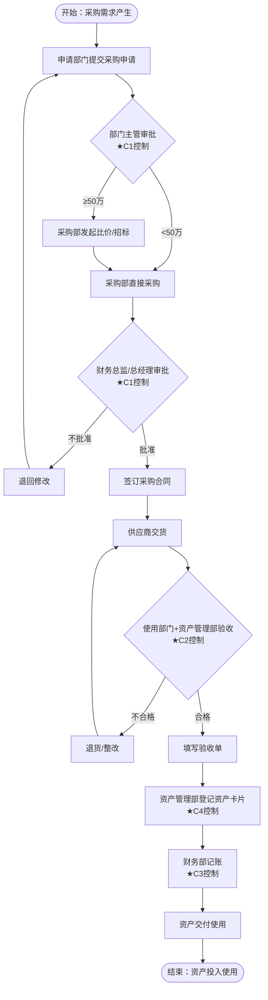
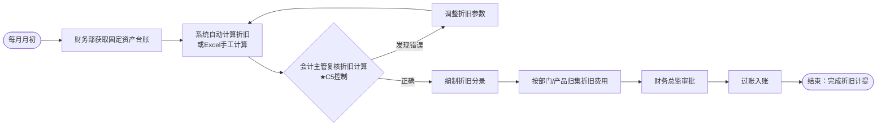
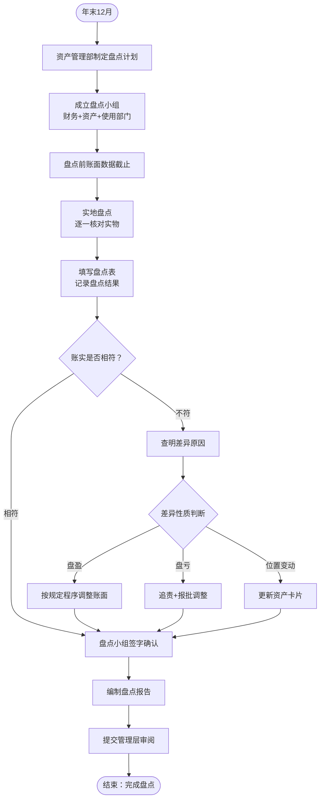
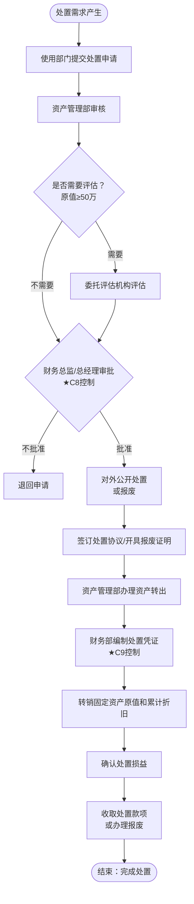

# 第十七章 固定资产循环操作手册

> **版本**: v1.0 | **更新日期**: 2025年10月 | **适用准则**: 中国注册会计师审计准则
> 
> **📍 返回主框架**: [审计实务操作手册-框架](./审计实务操作手册-框架.md#第十二章-固定资产循环)
> 
> **🔗 本章在审计流程中的位置**: 第三部分 > 业务循环操作手册 > 第十二章

---

## 📚 手册说明

本手册详细说明固定资产循环审计的全流程操作，包括穿行测试、控制测试和实质性测试三个阶段，每个阶段提供具体的底稿填写指引和实操案例。

### 适用范围
- 固定资产审计
- 在建工程审计
- 投资性房地产审计
- 工程物资审计
- 油气资产审计
- 固定资产清理审计
- 生产性生物资产审计
- 使用权资产及租赁负债审计
- 资产处置损益审计

### 底稿体系
- **B类底稿**: B23-6固定资产业务层面控制（6个子底稿）
- **C类底稿**: C6固定资产业务循环控制测试（3个子底稿）
- **H类底稿**: H固定资产循环实质性测试（200+个子底稿）

---

## 🚀 5分钟快速上手指南

> **新手必读！** 第一次审计固定资产循环？这里告诉你最核心的内容和最快的路径。

### 📌 三步定位你需要的内容

**步骤1：确定你的审计阶段**
```
你在哪个阶段？
├─ 刚开始项目？ → 阅读【第12.1-12.3节】了解循环特征和风险
├─ 风险评估阶段？ → 执行【第12.4-12.6节】穿行测试
├─ 控制测试阶段？ → 执行【第12.7-12.9节】控制测试（可选）
└─ 实质性测试阶段？ → 重点看【第12.10-12.20节】⭐⭐⭐
```

**步骤2：找到你的核心必做程序**
```
固定资产循环审计的6个核心程序（必须执行）：
✅ 1. 固定资产监盘 → 第12.11节 ⭐⭐⭐（最重要！）
✅ 2. 在建工程监盘 → 第12.12节 ⭐⭐⭐
✅ 3. 折旧测算 → 第12.11节 ⭐⭐⭐
✅ 4. 增减变动检查 → 第12.11节 ⭐⭐
✅ 5. 在建工程转固检查 → 第12.12节 ⭐⭐
✅ 6. 减值测试 → 第12.11节 ⭐⭐

固定资产监盘是核心！不能省略！
```

**步骤3：遇到问题时快速查找**
```
常见问题？ → 附录A：常见问题处理
不会填底稿？ → 每节都有"填写示例"
需要模板？ → 附录B：Excel工具包
```

---

### 🎯 按场景快速导航

| 你的场景 | 直接跳到 | 预计时间 |
|---------|---------|---------|
| 🔍 **现场审计第一天** | [第12.3节 准备工作](#83-准备工作) | 立即开始 |
| 🏗️ **固定资产监盘日** | [第12.11节 监盘程序](#8114-监盘程序h1-9至h1-11) | 全天 |
| 📝 **填写审定表H1-1** | [第12.11节 审定表](#8111-审定表编制h1-1) | 30分钟 |
| 💰 **折旧测算** | [第12.11节 折旧测算](#8115-折旧测算h1-12h1-13) | 2-3小时 |
| 🏢 **在建工程转固** | [第12.12节 转固检查](#8122-转固时点检查h2-5) | 2-3小时 |
| 🔎 **减值测试** | [第12.11节 减值测试](#8116-减值测试h1-14h1-15) | 2-3小时 |
| ✅ **质量复核** | [第12.21节 完工总结](#821-完工总结) | 按清单逐项 |

---

### ⭐ 新手必读Top 5（按优先级）

**1. 第12.11节：固定资产监盘程序** ⭐⭐⭐
- 为什么：监盘是固定资产审计的核心，必须100%执行
- 关键内容：监盘计划、现场观察、抽盘程序、盘点差异处理
- 重要提醒：必须实地查看主要固定资产！

**2. 第12.11节：折旧测算** ⭐⭐⭐
- 为什么：折旧计算错误是固定资产审计的主要风险
- 关键内容：折旧政策检查、折旧测算、累计折旧核对
- 重要提醒：注意折旧方法变更和残值率合理性！

**3. 第12.12节：在建工程转固时点检查** ⭐⭐⭐
- 为什么：转固时点不当会导致折旧计提错误
- 关键内容：转固条件判断、转固时点确认、利息资本化截止
- 重要提醒：关注达到预定可使用状态的时点！

**4. 第12.11节：增减变动检查** ⭐⭐
- 为什么：确认本期固定资产变动的真实性和准确性
- 关键内容：购置检查、处置检查、原始凭证核对

**5. 附录A：常见问题处理** ⭐⭐
- 为什么：解决你90%的疑问，快速答疑
- 关键内容：高频问题的快速解答

---

### ⚡ 现场审计第一天行动清单

**上午（9:00-12:00）**
```
□ 获取固定资产清单（期末余额）
□ 获取在建工程清单
□ 获取固定资产折旧政策
□ 预约固定资产监盘日期（与被审计单位协商）
□ 获取固定资产卡片
```

**下午（14:00-17:00）**
```
□ 获取全年固定资产明细账
□ 获取固定资产增减变动明细
□ 获取折旧计算表
□ 获取在建工程转固明细
□ 现场查看主要固定资产存放地点（初步了解）
```

**当晚整理**
```
□ 编制固定资产审定表H1-1
□ 编制在建工程审定表H2-1
□ 编制折旧测算表
□ 制定监盘计划（监盘日期、地点、人员）
□ 准备次日工作计划
```

---

### 💡 常见错误提醒（新手最容易犯的）

**❌ 错误1：不参与固定资产监盘**
- ✅ 正确：固定资产监盘是必须执行的程序，不能省略
- 📖 详见：第12.11节

**❌ 错误2：折旧测算不充分**
- ✅ 正确：必须重新计算本期折旧，不能只核对折旧率
- 📖 详见：第12.11节

**❌ 错误3：在建工程转固时点判断错误**
- ✅ 正确：必须检查是否达到预定可使用状态，不能只看竣工日期
- 📖 详见：第12.12节

**❌ 错误4：未检查固定资产减值**
- ✅ 正确：必须识别减值迹象，检查减值测试是否充分
- 📖 详见：第12.11节

**❌ 错误5：忽视使用权资产**
- ✅ 正确：新租赁准则下，必须单独审计使用权资产和租赁负债
- 📖 详见：第12.18节

**❌ 错误6：固定资产处置检查不充分**
- ✅ 正确：必须检查处置审批、处置价格合理性、账务处理正确性
- 📖 详见：第12.20节

**❌ 错误7：资本化利息测算错误**
- ✅ 正确：必须重新测算资本化利息，检查资本化期间、利率、本金
- 📖 详见：第12.12节

---

### 🔧 工具和资源

**Excel工具包（附录B）**
- 固定资产监盘抽盘表
- 折旧测算表
- 在建工程转固检查表
- 利息资本化测算表
- 固定资产减值测试表
- 使用权资产测算表

**底稿模板（附录C）**
- H1-1固定资产审定表
- H2-1在建工程审定表
- H1-9至H1-11监盘底稿
- H1-12、H1-13折旧测算底稿
- H2-10、H2-11利息资本化底稿

**在线资源**
- 中国注册会计师协会官网（审计准则）
- 企业会计准则（固定资产、租赁相关）

---

### 📞 需要帮助时

**遇到问题优先级：**
1. 先查 **附录A：常见问题处理**
2. 再查 **相关章节的详细说明**
3. 使用 **第12.21节的复核清单**
4. 最后 **询问项目经理**

**紧急情况联系：**
- 发现重大固定资产舞弊 → 立即向项目经理/合伙人汇报
- 被审计单位不配合监盘 → 向项目经理汇报，考虑对审计意见的影响
- 折旧政策存在重大不合理 → 评估对财务报表的影响，考虑调整

---

**🎯 现在，根据你的情况选择：**

| 如果你是... | 推荐路径 |
|-----------|---------|
| 🆕 **新手审计师** | 先读完本指南 → 第12.1-12.3节（理论）→ 第12.11节（监盘）→ 边做边学 |
| 💼 **有经验审计师** | 直接跳到第12.11节（监盘）和第12.12节（在建工程）→ 必要时查FAQ |
| 👔 **项目经理/复核人** | 重点看第12.21节完工总结和各节的"检查清单" |

---

## 📑 完整目录

- [12.1 固定资产循环特征](#81-固定资产循环特征)
  - [12.1.1 涉及科目](#811-涉及科目)
  - [12.1.2 业务流程特点](#812-业务流程特点)
  - [12.1.3 主要审计风险](#813-主要审计风险)

- [12.2 审计流程概览](#82-审计流程概览)
  - [12.2.1 审计策略](#821-审计策略)
  - [12.2.2 审计程序路线图](#822-审计程序路线图)
  - [12.2.3 工作底稿体系](#823-工作底稿体系)

- [12.3 准备工作](#83-准备工作)
  - [12.3.1 资料清单](#831-资料清单)
  - [12.3.2 初步分析程序](#832-初步分析程序)
  - [12.3.3 重要性水平运用](#833-重要性水平运用)

- [12.4 流程了解与控制识别](#84-流程了解与控制识别)
  - [12.4.1 流程了解方法](#841-流程了解方法)
  - [12.4.2 关键控制点识别](#842-关键控制点识别)
  - [12.4.3 流程图绘制（B23-6-2）](#843-流程图绘制b23-6-2)

- [12.5 控制矩阵编制](#85-控制矩阵编制)
  - [12.5.1 认定层次风险分析](#851-认定层次风险分析)
  - [12.5.2 关键控制匹配（B23-6-3）](#852-关键控制匹配b23-6-3)
  - [12.5.3 控制设计有效性评估](#853-控制设计有效性评估)

- [12.6 穿行测试执行](#86-穿行测试执行)
  - [12.6.1 样本选择](#861-样本选择)
  - [12.6.2 测试步骤（B23-6-4）](#862-测试步骤b23-6-4)
  - [12.6.3 偏差记录与评价](#863-偏差记录与评价)

- [12.7 控制测试设计](#87-控制测试设计)
  - [12.7.1 测试范围确定](#871-测试范围确定)
  - [12.7.2 样本量计算（C6程序表）](#872-样本量计算c6程序表)
  - [12.7.3 测试时间安排](#873-测试时间安排)

- [12.8 控制测试执行](#88-控制测试执行)
  - [12.12.1 固定资产控制测试](#881-固定资产控制测试)
  - [12.12.2 在建工程控制测试](#882-在建工程控制测试)
  - [12.12.3 投资性房地产控制测试](#883-投资性房地产控制测试)

- [12.9 控制测试评价](#89-控制测试评价)
  - [12.9.1 偏差率计算](#891-偏差率计算)
  - [12.9.2 控制有效性结论（B23-6-6）](#892-控制有效性结论b23-6-6)
  - [12.9.3 对实质性程序的影响](#893-对实质性程序的影响)

- [12.10 函证程序](#810-函证程序)
  - [12.10.1 函证计划制定（H0A）](#8101-函证计划制定h0a)
  - [12.10.2 固定资产函证](#8102-固定资产函证)
  - [12.10.3 在建工程函证](#8103-在建工程函证)
  - [12.10.4 差异调节与替代程序](#8104-差异调节与替代程序)

- [12.11 固定资产审计](#811-固定资产审计)
  - [12.11.1 审定表编制（H1-1）](#8111-审定表编制h1-1)
  - [12.11.2 明细表核对（H1-2）](#8112-明细表核对h1-2)
  - [12.11.3 增减变动检查（H1-7、H1-8）](#8113-增减变动检查h1-7h1-8)
  - [12.11.4 监盘程序（H1-9至H1-11）](#8114-监盘程序h1-9至h1-11)
  - [12.11.5 折旧测算（H1-12、H1-13）](#8115-折旧测算h1-12h1-13)
  - [12.11.6 减值测试（H1-14、H1-15）](#8116-减值测试h1-14h1-15)

- [12.12 在建工程审计](#812-在建工程审计)
  - [12.12.1 审定表编制（H2-1）](#8121-审定表编制h2-1)
  - [12.12.2 转固时点检查（H2-5）](#8122-转固时点检查h2-5)
  - [12.12.3 利息资本化测试（H2-10、H2-11）](#8123-利息资本化测试h2-10h2-11)
  - [12.12.4 监盘程序（H2-12至H2-14）](#8124-监盘程序h2-12至h2-14)

- [12.13 投资性房地产审计](#813-投资性房地产审计)
  - [12.13.1 审定表编制（H3-1）](#8131-审定表编制h3-1)
  - [12.13.2 计量模式检查（H3-4）](#8132-计量模式检查h3-4)
  - [12.13.3 公允价值复核（H3-8）](#8133-公允价值复核h3-8)
  - [12.13.4 转换检查（H3-6）](#8134-转换检查h3-6)

- [12.14 工程物资审计](#814-工程物资审计)
  - [12.14.1 审定表编制（H4-1）](#8141-审定表编制h4-1)
  - [12.14.2 增减变动检查（H4-4、H4-5）](#8142-增减变动检查h4-4h4-5)
  - [12.14.3 监盘程序（H4-6）](#8143-监盘程序h4-6)

- [12.15 油气资产审计](#815-油气资产审计)
  - [12.15.1 审定表编制（H5-1）](#8151-审定表编制h5-1)
  - [12.15.2 折耗测算（H5-12、H5-13）](#8152-折耗测算h5-12h5-13)
  - [12.15.3 监盘程序（H5-9至H5-11）](#8153-监盘程序h5-9至h5-11)

- [12.16 固定资产清理审计](#816-固定资产清理审计)
  - [12.16.1 审定表编制（H6-1）](#8161-审定表编制h6-1)
  - [12.16.2 处置检查（H6-4）](#8162-处置检查h6-4)

- [12.17 生产性生物资产审计](#817-生产性生物资产审计)
  - [12.17.1 审定表编制（H7-1）](#8171-审定表编制h7-1)
  - [12.17.2 计量模式检查（H7-4）](#8172-计量模式检查h7-4)
  - [12.17.3 公允价值复核（H7-13）](#8173-公允价值复核h7-13)
  - [12.17.4 监盘程序（H7-8至H7-10）](#8174-监盘程序h7-8至h7-10)

- [12.18 使用权资产审计](#818-使用权资产审计)
  - [12.112.1 审定表编制（H8-1）](#8181-审定表编制h8-1)
  - [12.112.2 租赁识别（H8-4）](#8182-租赁识别h8-4)
  - [12.112.3 租赁期确定（H8-5）](#8183-租赁期确定h8-5)
  - [12.112.4 初始及后续计量（H8-6）](#8184-初始及后续计量h8-6)

- [12.19 租赁负债审计](#819-租赁负债审计)
  - [12.19.1 审定表编制（H9-1）](#8191-审定表编制h9-1)
  - [12.19.2 明细表核对（H9-2、H9-3）](#8192-明细表核对h9-2h9-3)

- [12.20 资产处置损益审计](#820-资产处置损益审计)
  - [12.20.1 审定表编制（H10-1）](#8201-审定表编制h10-1)
  - [12.20.2 处置检查（H10-4）](#8202-处置检查h10-4)

- [12.21 完工总结](#821-完工总结)
  - [12.21.1 底稿复核清单](#8211-底稿复核清单)
  - [12.21.2 审计发现汇总](#8212-审计发现汇总)
  - [12.21.3 管理建议书要点](#8213-管理建议书要点)

- [附录A：固定资产循环常见问题处理](#附录a固定资产循环常见问题处理)
- [附录B：Excel工具包使用说明](#附录bexcel工具包使用说明)
- [附录C：底稿索引对照表](#附录c底稿索引对照表)
- [附录D：审计案例精选](#附录d审计案例精选)

---

## 17.1 固定资产循环特征与风险识别

### 17.1.1 业务特点
### 17.1.2 主要风险点  
### 17.1.3 审计策略选择
### 17.1.4 认定-风险-程序映射体系

## 17.2 审计流程概览

### 17.2.1 审计流程图
### 17.2.2 底稿执行顺序
### 17.2.3 时间安排

## 17.3 穿行测试

### 17.3.1 穿行测试程序
### 17.3.2 穿行测试底稿
### 17.3.3 穿行测试结论

## 17.4 控制测试

### 17.4.1 控制测试程序
### 17.4.2 控制测试底稿
### 17.4.3 控制测试结论

## 17.5 实质性测试

### 17.5.1 实质性测试程序
### 17.5.2 实质性测试底稿
### 17.5.3 实质性测试结论

## 17.6 特殊事项处理

### 17.6.1 舞弊风险应对
### 17.6.2 资产减值问题
### 17.6.3 租赁资产问题

## 17.7 常见问题解答

### 17.7.1 固定资产确认问题
### 17.7.2 折旧计算问题
### 17.7.3 减值测试问题

## 17.8 附录

### 17.8.1 底稿模板
### 17.8.2 工具包
### 17.8.3 案例库

---

## 17.0 章节导航与前置准备

### 17.0.1 本章在整体框架中的位置

**📍 返回主框架**: [审计实务操作手册-框架](./审计实务操作手册-框架.md)

**前置章节**（建议先阅读）：
- [第零章：5分钟快速上手指南](./审计实务操作手册-框架.md#第零章-5分钟快速上手指南) - 了解整体底稿体系
- [第四章：审计流程全景图](./审计实务操作手册-框架.md#第四章-审计流程全景图) - 掌握审计策略选择
- [第五章：风险评估阶段](./审计实务操作手册-框架.md#第五章-风险评估阶段) - B类底稿通用逻辑
- [第六章：控制测试阶段](./审计实务操作手册-框架.md#第六章-控制测试阶段) - C类底稿通用逻辑
- [第七章：实质性测试阶段](./审计实务操作手册-框架.md#第七章-实质性测试阶段) - 实质性程序通用逻辑

**相关循环**（可能需要交叉引用）：
- [第九章：货币资金循环](./E货币资金循环操作手册.md) - 购置付款、处置收款
- [第十章：存货循环](./F存货循环操作手册.md) - 在建工程转固、工程物资
- [第十五章：在建工程循环](./审计实务操作手册-框架.md#第十五章-在建工程循环) - 在建工程详细审计
- [第十七章：管理费用循环](./K管理费用循环操作手册.md) - 固定资产折旧、修理费
- [第十九章：债务循环](./L债务循环操作手册.md) - 利息资本化、租赁负债
- [第二十一章：关联方循环](./审计实务操作手册-框架.md#第二十一章-关联方循环) - 关联方固定资产交易

**审计策略参考**：
- [第4.3节：审计策略决策矩阵](./审计实务操作手册-框架.md#43-审计策略决策矩阵-⭐) → 固定资产循环建议采用**路径1（综合策略）**

---

### 17.0.2 底稿编码速查表

| 底稿类别 | 编码范围 | 主要用途 | 对应章节 |
|---------|---------|---------|---------|
| **B23-6** | B23-6-1 至 B23-6-6 | 业务层面控制识别 | 第12.4-12.6节 |
| **C6** | C6-1 至 C6-3 | 控制测试 | 第12.7-12.9节 |
| **H0** | H0A, H0-1 至 H0-8 | 函证程序 | 第12.10节 |
| **H1** | H1-1 至 H1-15 | 固定资产审计 | 第12.11节 |
| **H2** | H2-1 至 H2-14 | 在建工程审计 | 第12.12节 |
| **H3** | H3-1 至 H3-9 | 投资性房地产审计 | 第12.13节 |
| **H4** | H4-1 至 H4-6 | 工程物资审计 | 第12.14节 |
| **H5** | H5-1 至 H5-13 | 油气资产审计 | 第12.15节 |
| **H6** | H6-1 至 H6-5 | 固定资产清理审计 | 第12.16节 |
| **H7** | H7-1 至 H7-13 | 生产性生物资产审计 | 第12.17节 |
| **H8** | H8-1 至 H8-7 | 使用权资产审计 | 第12.18节 |
| **H9** | H9-1 至 H9-4 | 租赁负债审计 | 第12.19节 |
| **H10** | H10-1 至 H10-5 | 资产处置损益审计 | 第12.20节 |

---

### 17.0.3 符号说明与术语对照

| 符号/术语 | 含义 | 示例 |
|----------|------|------|
| ⭐⭐⭐ | 必须执行的核心程序 | 固定资产监盘⭐⭐⭐ |
| ⭐⭐ | 重要程序 | 折旧测算⭐⭐ |
| ⭐ | 可选程序（视风险而定） | 附注披露测试⭐ |
| → | 跳转到相关章节 | → 第12.11节 |
| ✅ | 必做检查项 | ✅ 获取固定资产清单 |
| ⚠️ | 风险提醒 | ⚠️ 固定资产是高风险科目 |
| 💡 | 提示技巧 | 💡 建议使用Excel透视表 |
| 📖 | 参考详细说明 | 📖 详见：第12.11节 |

**底稿体系术语**：
- **B类底稿**: 业务层面控制（穿行测试）
- **C类底稿**: 控制测试
- **H类底稿**: 固定资产循环实质性测试
- **审定表**: 科目余额汇总表（如H1-1固定资产审定表）
- **明细表**: 科目明细核对表
- **监盘**: 现场查看固定资产实物
- **转固**: 在建工程转入固定资产
- **资本化**: 利息资本化计入在建工程

**固定资产循环特点**：
- **金额大**: 固定资产通常占资产总额的30-50%
- **种类多**: 涉及10个主要科目类别，200+个底稿
- **周期长**: 固定资产使用年限长，折旧计算复杂
- **专业性强**: 需要工程、房地产、设备等专业知识

---

## 17.1 固定资产循环特征

### 17.1.1 涉及科目

#### 资产类科目
- **固定资产**: 房屋建筑物、机器设备、运输设备、电子设备等
- **在建工程**: 在建房屋建筑物、在建机器设备、在建安装工程等
- **工程物资**: 专用材料、专用设备、工器具等
- **投资性房地产**: 已出租的土地使用权、已出租的建筑物等
- **油气资产**: 探明矿区权益、油气井及相关设施等
- **固定资产清理**: 处置固定资产的过渡科目
- **生产性生物资产**: 经济林、薪炭林、产畜、役畜等
- **使用权资产**: 租赁资产的使用权

#### 负债类科目
- **租赁负债**: 租赁付款额的现值

#### 损益类科目
- **资产处置损益**: 固定资产、在建工程等处置损益
- **其他收益**: 投资性房地产公允价值变动收益等

#### 底稿体系详细说明

**H0系列 - 固定资产循环函证程序（8个底稿）**
- H0A: 函证程序表
- H0-1: 函证结果汇总表
- H0-2: 核实被函证单位信息
- H0-3: 跟函函证过程控制
- H0-4: 差异核对表
- H0-5: 替代程序
- H0-6: 邮件传真回函可靠性验证
- H0-7: 函证程序舞弊风险评价表

**H1系列 - 固定资产（21个底稿）**
- H1A: 固定资产审计程序表
- H1-1: 审定表
- H1-2: 明细表
- H1-3: 调整分录汇总
- H1-4: 闲置检查表
- H1-5: 会计政策估计检查表
- H1-6: 分析表
- H1-7: 增加检查表
- H1-8: 减少检查表
- H1-9: 监盘计划
- H1-10: 盘点检查表
- H1-11: 监盘小结
- H1-12: 折旧测算表
- H1-13: 折旧分配分析表
- H1-14: 减值测算表
- H1-15: 可收回金额测试表
- H1-16: 房屋建筑物权属检查表
- H1-17: 运输设备权属检查表
- H1-18: 关联交易检查表
- H1-19: 经营租出固定资产检查表
- H1-20: 融资租出固定资产检查表

**H2系列 - 在建工程（18个底稿）**
- H2A: 在建工程实质性程序表
- H2-1: 审定表
- H2-2: 明细表
- H2-3: 调整分录汇总
- H2-4: 分析表
- H2-5: 转固时点检查表
- H2-6: 在建工程审核记录
- H2-7: 工程造价比较表
- H2-8: 增加检查表
- H2-9: 减少检查表
- H2-10: 利息资本化测算表（无专门借款）
- H2-11: 利息资本化测算表（有专门借款）
- H2-12: 监盘计划
- H2-13: 盘点检查表
- H2-14: 监盘小结
- H2-15: 减值测算表
- H2-16: 可收回金额测试表
- H2-17: 关联交易检查表

**H3系列 - 投资性房地产（15个底稿）**
- H3A: 投资性房地产实质性程序表
- H3-1: 审定表（成本模式/公允价值模式）
- H3-2: 明细表（成本模式/公允价值模式）
- H3-3: 调整分录汇总
- H3-4: 会计政策会计估计检查表
- H3-5: 增减检查表（成本模式/公允价值模式）
- H3-6: 互转审核表
- H3-7: 折旧测算表（成本模式）
- H3-8: 公允价值复核表
- H3-9: 盘点检查表
- H3-10: 减值测算表
- H3-11: 可收回金额测试表
- H3-12: 产权核对表
- H3-13: 关联交易检查表
- H3-14: 租金收入测算表

**H4系列 - 工程物资（10个底稿）**
- H4A: 工程物资实质性程序表
- H4-1: 审定表
- H4-2: 明细表
- H4-3: 调整分录汇总
- H4-4: 增加检查表
- H4-5: 减少检查表
- H4-6: 盘点检查表
- H4-7: 减值测算表
- H4-8: 可收回金额测试表
- H4-9: 关联交易检查表

**H5系列 - 油气资产（20个底稿）**
- H5A: 油气资产实质性程序表
- H5-1: 审定表
- H5-2: 明细表
- H5-3: 调整分录汇总
- H5-4: 闲置检查表
- H5-5: 会计政策会计估计检查表
- H5-6: 分析表
- H5-7: 增加检查表
- H5-8: 减少检查表
- H5-9: 监盘计划
- H5-10: 盘点检查表
- H5-11: 监盘小结
- H5-12: 折耗测算表（不含减值/含减值）
- H5-13: 折耗分配分析表
- H5-14: 减值测算表
- H5-15: 可收回金额测试表
- H5-16: 权属检查表
- H5-17: 关联交易检查表
- H5-18: 经营租出油气资产检查表
- H5-19: 融资租出油气资产检查表

**H6系列 - 固定资产清理（5个底稿）**
- H6A: 固定资产清理实质性程序表
- H6-1: 审定表
- H6-2: 明细表
- H6-3: 调整分录汇总
- H6-4: 检查表

**H7系列 - 生产性生物资产（24个底稿）**
- H7A: 生物资产实质性程序表
- H7-1: 审定表（成本模式/公允价值模式）
- H7-2: 明细表（成本模式/公允价值模式）
- H7-3: 调整分录汇总
- H7-4: 会计政策估计检查表
- H7-5: 分析表
- H7-6: 增加检查表（成本模式/公允价值模式）
- H7-7: 减少检查表（成本模式/公允价值模式）
- H7-8: 监盘计划
- H7-9: 盘点检查表
- H7-10: 监盘小结
- H7-11: 折旧测算表（不含减值/含减值）
- H7-12: 折旧分配分析表
- H7-13: 公允价值复核表
- H7-14: 互转审核表
- H7-15: 减值测算表
- H7-16: 可收回金额测试表
- H7-17: 关联交易检查表

**H8系列 - 使用权资产（19个底稿）**
- H8A: 使用权资产实质性程序表
- H8-1: 审定表
- H8-2: 明细表
- H8-3: 调整分录汇总
- H8-4: 租赁的识别
- H8-5: 租赁期的确定
- H8-6: 使用权资产租赁负债初始及后续计量（按年/按月）
- H8-7: 租赁变更
- H8-8: 折旧测算表（不含减值/含减值）
- H8-9: 折旧分配分析表
- H8-10: 减值测算表
- H8-11: 可收回金额测试表
- H8-12: 减少检查表
- H8-13: 简化处理的租赁检查表
- H8-14: 关联交易检查表

**H9系列 - 租赁负债（8个底稿）**
- H9A: 租赁负债实质性程序表
- H9-1: 审定表
- H9-2: 租赁负债明细表
- H9-3: 未确认融资费用明细表
- H9-4: 调整分录汇总

**H10系列 - 资产处置损益（5个底稿）**
- H10A: 资产处置损益实质性程序表
- H10-1: 审定表
- H10-2: 明细表
- H10-3: 调整分录汇总
- H10-4: 检查表

---

### 17.1.2 业务流程特点

#### 1. 业务复杂性
- **科目多**: 涉及10个主要科目，150+个底稿
- **金额大**: 固定资产通常占资产总额的30-60%
- **周期长**: 从采购到处置的全生命周期管理
- **专业性强**: 需要工程、技术、法律等多专业知识

#### 2. 控制关键点
- **采购审批**: 大额资产采购需要董事会或股东会审批
- **验收程序**: 资产到货需要验收、测试、安装调试
- **权属管理**: 房屋建筑物需要房产证，设备需要发票
- **折旧计提**: 需要准确的折旧政策和残值估计
- **减值测试**: 需要定期进行减值测试
- **处置程序**: 资产处置需要审批和评估

#### 3. 审计关注点
- **存在性**: 通过监盘确认资产真实存在
- **权属**: 检查产权证书、合同等权属证明
- **计价**: 检查初始计量、后续计量、减值计提
- **完整性**: 确认所有应记录的资产均已入账
- **分类**: 确认资产分类和列报的准确性

---

### 17.1.3 主要审计风险

#### 高风险领域

**1. 固定资产存在性**
- **舞弊风险**:
  - 虚构固定资产
  - 重复计算固定资产
  - 隐瞒固定资产处置
- **错报风险**:
  - 监盘不充分
  - 权属证明不完整
  - 资产分类错误

**2. 在建工程转固**
- **舞弊风险**:
  - 提前或延后转固调节利润
  - 虚增在建工程成本
- **错报风险**:
  - 转固时点判断错误
  - 利息资本化计算错误
  - 工程成本归集不准确

**3. 投资性房地产**
- **估计不确定性**:
  - 公允价值难以确定
  - 计量模式选择不当
  - 转换时点判断错误
- **确认判断**:
  - 是否满足投资性房地产定义
  - 转换条件是否满足

#### 中等风险领域

**4. 固定资产减值**
- **估计不确定性**:
  - 可收回金额难以估计
  - 减值迹象识别不准确
  - 折现率选择不当
- **确认判断**:
  - 减值迹象是否存在
  - 减值金额是否充分

**5. 租赁资产**
- **新准则影响**:
  - 租赁识别复杂
  - 使用权资产计量复杂
  - 租赁负债计算复杂
- **确认判断**:
  - 租赁期确定
  - 折现率选择

#### 低风险领域

**6. 工程物资**
- 主要为在建工程服务
- 风险相对较低
- 重点核对数据准确性

**7. 固定资产清理**
- 处置过程的过渡科目
- 风险相对较低
- 重点检查处置程序

---

### 底稿体系

- **B类底稿**: B23-6固定资产业务层面控制（6个子底稿）
- **C类底稿**: C6固定资产循环控制测试（3个子底稿）
- **H类底稿**: H固定资产循环实质性测试（共150+个子底稿）
  - H0系列: 函证程序（8个底稿）
  - H1系列: 固定资产（21个底稿）
  - H2系列: 在建工程（18个底稿）
  - H3系列: 投资性房地产（15个底稿）
  - H4系列: 工程物资（10个底稿）
  - H5系列: 油气资产（20个底稿）
  - H6系列: 固定资产清理（5个底稿）
  - H7系列: 生产性生物资产（24个底稿）
  - H8系列: 使用权资产（19个底稿）
  - H9系列: 租赁负债（8个底稿）
  - H10系列: 资产处置损益（5个底稿）

---

### 📚 手册说明

#### 适用范围
- 适用于所有年度审计项目
- 适用于固定资产循环相关科目的审计
- 可根据实际情况调整和补充

#### 使用建议
1. **审计策略**: 优先考虑实质性方案
2. **程序组合**: 将监盘、检查、分析程序有机结合
3. **重点关注**: 大额资产、关联方交易、减值测试
4. **职业判断**: 转固时点、减值测试、公允价值等需要职业判断
5. **底稿交叉引用**: 注意与其他循环底稿的交叉引用


---

**索引号**: 第12章-01  
**编制人**: [编制人]  
**编制日期**: [日期]  
**复核人**: [复核人]  
**复核日期**: [日期]
## 17.2 审计流程概览

### 17.2.1 审计策略

#### 策略选择原则
```
固定资产循环审计策略选择矩阵

┌─────────────────┬──────────────┬──────────────┬──────────────┐
│    风险水平     │   控制环境   │   控制测试   │   实质性程序 │
├─────────────────┼──────────────┼──────────────┼──────────────┤
│ 高风险          │ 了解+测试    │ 必须执行     │ 重点执行     │
│ 中等风险        │ 了解+测试    │ 选择性执行   │ 标准执行     │
│ 低风险          │ 了解即可     │ 可不执行     │ 简化执行     │
└─────────────────┴──────────────┴──────────────┴──────────────┘
```

#### 策略选择考虑因素

**1. 被审计单位特征**
- **行业特点**: 制造业、房地产、能源等不同行业风险不同
- **资产规模**: 资产总额大小影响重要性水平
- **资产结构**: 固定资产占比和结构
- **业务复杂度**: 资产种类、数量、分布

**2. 内部控制环境**
- **控制环境**: 管理层诚信、治理结构
- **风险评估**: 资产管理的风险评估
- **控制活动**: 资产采购、验收、处置控制
- **信息沟通**: 资产管理信息系统
- **监督**: 内部审计、管理层监督

**3. 历史审计经验**
- **以往错报**: 历史审计发现的错报
- **控制缺陷**: 以往发现的控制缺陷
- **管理层态度**: 对审计调整的态度
- **舞弊风险**: 是否存在舞弊迹象

#### 常见策略组合

**策略A: 控制测试+实质性程序（推荐）**
- 适用条件: 控制环境良好，有完善的内控制度
- 程序组合: 控制测试 + 实质性程序
- 样本量: 控制测试样本 + 实质性测试样本
- 时间安排: 控制测试在前，实质性程序在后

**策略B: 纯实质性程序**
- 适用条件: 控制环境较差，或资产规模较小
- 程序组合: 仅执行实质性程序
- 样本量: 增加实质性测试样本
- 时间安排: 直接执行实质性程序

**策略C: 风险导向程序**
- 适用条件: 风险分布不均，需要重点审计
- 程序组合: 重点领域详细测试 + 其他领域简化测试
- 样本量: 根据风险水平调整
- 时间安排: 高风险领域优先

---

### 17.2.2 审计程序路线图

#### 总体程序路线图
```
固定资产循环审计程序路线图

阶段一：了解与评估（第1-2周）
├── 12.3 准备工作
│   ├── 12.3.1 资料清单
│   ├── 12.3.2 初步分析程序
│   └── 12.3.3 重要性水平运用
├── 12.4 流程了解与控制识别
│   ├── 12.4.1 流程了解方法
│   ├── 12.4.2 关键控制点识别
│   └── 12.4.3 流程图绘制
└── 12.5 控制矩阵编制
    ├── 12.5.1 认定层次风险分析
    ├── 12.5.2 关键控制匹配
    └── 12.5.3 控制设计有效性评估

阶段二：控制测试（第3-4周）
├── 12.6 穿行测试执行
│   ├── 12.6.1 样本选择
│   ├── 12.6.2 测试步骤
│   └── 12.6.3 偏差记录与评价
├── 12.7 控制测试设计
│   ├── 12.7.1 测试范围确定
│   ├── 12.7.2 样本量计算
│   └── 12.7.3 测试时间安排
├── 12.8 控制测试执行
│   ├── 12.12.1 固定资产控制测试
│   ├── 12.12.2 在建工程控制测试
│   └── 12.12.3 投资性房地产控制测试
└── 12.9 控制测试评价
    ├── 12.9.1 偏差率计算
    ├── 12.9.2 控制有效性结论
    └── 12.9.3 对实质性程序的影响

阶段三：实质性程序（第5-8周）
├── 12.10 函证程序
│   ├── 12.10.1 函证计划制定
│   ├── 12.10.2 固定资产函证
│   ├── 12.10.3 在建工程函证
│   └── 12.10.4 差异调节与替代程序
├── 12.11 固定资产审计
│   ├── 12.11.1 审定表编制
│   ├── 12.11.2 明细表核对
│   ├── 12.11.3 增减变动检查
│   ├── 12.11.4 监盘程序
│   ├── 12.11.5 折旧测算
│   └── 12.11.6 减值测试
├── 12.12 在建工程审计
│   ├── 12.12.1 审定表编制
│   ├── 12.12.2 转固时点检查
│   ├── 12.12.3 利息资本化测试
│   └── 12.12.4 监盘程序
├── 12.13 投资性房地产审计
│   ├── 12.13.1 审定表编制
│   ├── 12.13.2 计量模式检查
│   ├── 12.13.3 公允价值复核
│   └── 12.13.4 转换检查
├── 12.14 工程物资审计
├── 12.15 油气资产审计
├── 12.16 固定资产清理审计
├── 12.17 生产性生物资产审计
├── 12.18 使用权资产审计
├── 12.19 租赁负债审计
└── 12.20 资产处置损益审计

阶段四：完工总结（第9周）
└── 12.21 完工总结
    ├── 12.21.1 底稿复核清单
    ├── 12.21.2 审计发现汇总
    └── 12.21.3 管理建议书要点
```

---

### 17.2.3 工作底稿体系

#### 底稿分类体系

**B类底稿 - 业务层面控制（6个底稿）**
- B23-6-1: 固定资产业务层面控制程序表
- B23-6-2: 固定资产流程图
- B23-6-3: 固定资产控制矩阵
- B23-6-4: 固定资产穿行测试
- B23-6-5: 控制测试汇总表
- B23-6-6: 控制评价报告

**C类底稿 - 控制测试（3个底稿）**
- C6-1: 固定资产循环控制测试程序表
- C6-2: 固定资产控制测试
- C6-3: 在建工程控制测试

**H类底稿 - 实质性测试（150+个底稿）**

**H0系列 - 函证程序（8个底稿）**
- H0A: 函证程序表
- H0-1: 函证结果汇总表
- H0-2: 核实被函证单位信息
- H0-3: 跟函函证过程控制
- H0-4: 差异核对表
- H0-5: 替代程序
- H0-6: 邮件传真回函可靠性验证
- H0-7: 函证程序舞弊风险评价表

**H1系列 - 固定资产（21个底稿）**
- H1A: 固定资产审计程序表
- H1-1: 审定表
- H1-2: 明细表
- H1-3: 调整分录汇总
- H1-4: 闲置检查表
- H1-5: 会计政策估计检查表
- H1-6: 分析表
- H1-7: 增加检查表
- H1-8: 减少检查表
- H1-9: 监盘计划
- H1-10: 盘点检查表
- H1-11: 监盘小结
- H1-12: 折旧测算表
- H1-13: 折旧分配分析表
- H1-14: 减值测算表
- H1-15: 可收回金额测试表
- H1-16: 房屋建筑物权属检查表
- H1-17: 运输设备权属检查表
- H1-18: 关联交易检查表
- H1-19: 经营租出固定资产检查表
- H1-20: 融资租出固定资产检查表

**H2系列 - 在建工程（18个底稿）**
- H2A: 在建工程实质性程序表
- H2-1: 审定表
- H2-2: 明细表
- H2-3: 调整分录汇总
- H2-4: 分析表
- H2-5: 转固时点检查表
- H2-6: 在建工程审核记录
- H2-7: 工程造价比较表
- H2-8: 增加检查表
- H2-9: 减少检查表
- H2-10: 利息资本化测算表（无专门借款）
- H2-11: 利息资本化测算表（有专门借款）
- H2-12: 监盘计划
- H2-13: 盘点检查表
- H2-14: 监盘小结
- H2-15: 减值测算表
- H2-16: 可收回金额测试表
- H2-17: 关联交易检查表

**H3系列 - 投资性房地产（15个底稿）**
- H3A: 投资性房地产实质性程序表
- H3-1: 审定表（成本模式/公允价值模式）
- H3-2: 明细表（成本模式/公允价值模式）
- H3-3: 调整分录汇总
- H3-4: 会计政策会计估计检查表
- H3-5: 增减检查表（成本模式/公允价值模式）
- H3-6: 互转审核表
- H3-7: 折旧测算表（成本模式）
- H3-8: 公允价值复核表
- H3-9: 盘点检查表
- H3-10: 减值测算表
- H3-11: 可收回金额测试表
- H3-12: 产权核对表
- H3-13: 关联交易检查表
- H3-14: 租金收入测算表

**H4系列 - 工程物资（10个底稿）**
- H4A: 工程物资实质性程序表
- H4-1: 审定表
- H4-2: 明细表
- H4-3: 调整分录汇总
- H4-4: 增加检查表
- H4-5: 减少检查表
- H4-6: 盘点检查表
- H4-7: 减值测算表
- H4-8: 可收回金额测试表
- H4-9: 关联交易检查表

**H5系列 - 油气资产（20个底稿）**
- H5A: 油气资产实质性程序表
- H5-1: 审定表
- H5-2: 明细表
- H5-3: 调整分录汇总
- H5-4: 闲置检查表
- H5-5: 会计政策会计估计检查表
- H5-6: 分析表
- H5-7: 增加检查表
- H5-8: 减少检查表
- H5-9: 监盘计划
- H5-10: 盘点检查表
- H5-11: 监盘小结
- H5-12: 折耗测算表（不含减值/含减值）
- H5-13: 折耗分配分析表
- H5-14: 减值测算表
- H5-15: 可收回金额测试表
- H5-16: 权属检查表
- H5-17: 关联交易检查表
- H5-18: 经营租出油气资产检查表
- H5-19: 融资租出油气资产检查表

**H6系列 - 固定资产清理（5个底稿）**
- H6A: 固定资产清理实质性程序表
- H6-1: 审定表
- H6-2: 明细表
- H6-3: 调整分录汇总
- H6-4: 检查表

**H7系列 - 生产性生物资产（24个底稿）**
- H7A: 生物资产实质性程序表
- H7-1: 审定表（成本模式/公允价值模式）
- H7-2: 明细表（成本模式/公允价值模式）
- H7-3: 调整分录汇总
- H7-4: 会计政策估计检查表
- H7-5: 分析表
- H7-6: 增加检查表（成本模式/公允价值模式）
- H7-7: 减少检查表（成本模式/公允价值模式）
- H7-8: 监盘计划
- H7-9: 盘点检查表
- H7-10: 监盘小结
- H7-11: 折旧测算表（不含减值/含减值）
- H7-12: 折旧分配分析表
- H7-13: 公允价值复核表
- H7-14: 互转审核表
- H7-15: 减值测算表
- H7-16: 可收回金额测试表
- H7-17: 关联交易检查表

**H8系列 - 使用权资产（19个底稿）**
- H8A: 使用权资产实质性程序表
- H8-1: 审定表
- H8-2: 明细表
- H8-3: 调整分录汇总
- H8-4: 租赁的识别
- H8-5: 租赁期的确定
- H8-6: 使用权资产租赁负债初始及后续计量（按年/按月）
- H8-7: 租赁变更
- H8-8: 折旧测算表（不含减值/含减值）
- H8-9: 折旧分配分析表
- H8-10: 减值测算表
- H8-11: 可收回金额测试表
- H8-12: 减少检查表
- H8-13: 简化处理的租赁检查表
- H8-14: 关联交易检查表

**H9系列 - 租赁负债（8个底稿）**
- H9A: 租赁负债实质性程序表
- H9-1: 审定表
- H9-2: 租赁负债明细表
- H9-3: 未确认融资费用明细表
- H9-4: 调整分录汇总

**H10系列 - 资产处置损益（5个底稿）**
- H10A: 资产处置损益实质性程序表
- H10-1: 审定表
- H10-2: 明细表
- H10-3: 调整分录汇总
- H10-4: 检查表

#### 底稿编制要求

**1. 基本信息填写**
- 被审计单位名称
- 编制人姓名
- 编制日期
- 索引号
- 截止日
- 复核人姓名
- 复核日期
- 页次

**2. 审计目标明确**
- 明确说明该底稿的审计目标
- 与财务报表认定对应
- 与审计程序对应

**3. 审计过程详细**
- 详细描述执行的审计程序
- 记录审计证据
- 记录审计发现

**4. 审计结论明确**
- 给出明确的审计结论
- 说明审计调整
- 说明未调整差异

**5. 交叉引用完整**
- 与其他底稿的交叉引用
- 与财务报表的对应关系
- 与审计程序的对应关系

---

**索引号**: 第12章-02  
**编制人**: [编制人]  
**编制日期**: [日期]  
**复核人**: [复核人]  
**复核日期**: [日期]
## 17.3 准备工作

### 17.3.1 资料清单

#### 一、基础资料清单

**1. 财务报表及附注**

| 序号 | 资料名称 | 资料内容 | 重要程度 | 获取来源 | 准备状态 |
|------|---------|---------|---------|---------|---------|
| 1.1 | 资产负债表 | 固定资产、在建工程、投资性房地产等科目 | ⭐⭐⭐ 必备 | 财务部 | □已准备 □待准备 |
| 1.2 | 利润表 | 资产处置损益、其他收益等科目 | ⭐⭐⭐ 必备 | 财务部 | □已准备 □待准备 |
| 1.3 | 现金流量表 | 购建固定资产、无形资产和其他长期资产支付的现金 | ⭐⭐⭐ 必备 | 财务部 | □已准备 □待准备 |
| 1.4 | 财务报表附注 | 固定资产、在建工程、投资性房地产等附注 | ⭐⭐⭐ 必备 | 财务部 | □已准备 □待准备 |

**2. 会计账簿及凭证**

| 序号 | 资料名称 | 资料内容 | 重要程度 | 获取来源 | 准备状态 |
|------|---------|---------|---------|---------|---------|
| 2.1 | 固定资产明细账 | 固定资产各类别明细、增减变动 | ⭐⭐⭐ 必备 | 财务部 | □已准备 □待准备 |
| 2.2 | 在建工程明细账 | 在建工程项目明细、本期投入 | ⭐⭐⭐ 必备 | 财务部 | □已准备 □待准备 |
| 2.3 | 累计折旧明细账 | 各类资产折旧明细 | ⭐⭐⭐ 必备 | 财务部 | □已准备 □待准备 |
| 2.4 | 固定资产减值准备明细账 | 减值准备计提及转回 | ⭐⭐ 重要 | 财务部 | □已准备 □待准备 |
| 2.5 | 投资性房地产明细账 | 投资性房地产明细（如适用） | ⭐⭐ 重要 | 财务部 | □已准备 □待准备 |
| 2.6 | 工程物资明细账 | 工程物资购入及领用（如适用） | ⭐⭐ 重要 | 财务部 | □已准备 □待准备 |
| 2.7 | 使用权资产明细账 | 租赁准则下使用权资产（如适用） | ⭐⭐ 重要 | 财务部 | □已准备 □待准备 |
| 2.8 | 租赁负债明细账 | 租赁负债及利息费用（如适用） | ⭐⭐ 重要 | 财务部 | □已准备 □待准备 |
| 2.9 | 固定资产清理明细账 | 资产处置清理过程 | ⭐⭐ 重要 | 财务部 | □已准备 □待准备 |
| 2.10 | 资产处置损益明细账 | 处置损益明细 | ⭐⭐ 重要 | 财务部 | □已准备 □待准备 |
| 2.11 | 相关记账凭证及原始凭证 | 重大资产增减的凭证及附件 | ⭐⭐⭐ 必备 | 财务部 | □已准备 □待准备 |

**3. 固定资产台账及卡片**

| 序号 | 资料名称 | 资料内容 | 重要程度 | 获取来源 | 准备状态 |
|------|---------|---------|---------|---------|---------|
| 3.1 | 固定资产台账 | 资产编号、名称、类别、原值、累计折旧等 | ⭐⭐⭐ 必备 | 资产管理部/财务部 | □已准备 □待准备 |
| 3.2 | 固定资产卡片 | 每项资产的详细信息（Excel或ERP导出） | ⭐⭐⭐ 必备 | 资产管理部 | □已准备 □待准备 |
| 3.3 | 资产增加明细表 | 本期新增资产清单 | ⭐⭐⭐ 必备 | 资产管理部 | □已准备 □待准备 |
| 3.4 | 资产减少明细表 | 本期处置/报废资产清单 | ⭐⭐⭐ 必备 | 资产管理部 | □已准备 □待准备 |
| 3.5 | 在建工程转固明细表 | 本期转固项目清单 | ⭐⭐⭐ 必备 | 工程部/财务部 | □已准备 □待准备 |

**4. 权属证明文件**

| 序号 | 资料名称 | 资料内容 | 重要程度 | 获取来源 | 准备状态 |
|------|---------|---------|---------|---------|---------|
| 4.1 | 房屋产权证 | 房屋建筑物产权证书 | ⭐⭐⭐ 必备 | 资产管理部/办公室 | □已准备 □待准备 |
| 4.2 | 土地使用权证 | 土地使用权证书 | ⭐⭐⭐ 必备 | 资产管理部/办公室 | □已准备 □待准备 |
| 4.3 | 车辆行驶证 | 车辆登记证、行驶证 | ⭐⭐ 重要 | 行政部/司机 | □已准备 □待准备 |
| 4.4 | 设备购置发票 | 主要设备购置发票及合同 | ⭐⭐⭐ 必备 | 财务部 | □已准备 □待准备 |
| 4.5 | 抵押/质押登记证明 | 资产抵押/质押登记文件（如有） | ⭐⭐⭐ 必备 | 财务部/法务部 | □已准备 □待准备 |

**5. 合同协议**

| 序号 | 资料名称 | 资料内容 | 重要程度 | 获取来源 | 准备状态 |
|------|---------|---------|---------|---------|---------|
| 5.1 | 固定资产采购合同 | 重大资产采购合同（>50万） | ⭐⭐⭐ 必备 | 采购部/资产管理部 | □已准备 □待准备 |
| 5.2 | 在建工程承包合同 | 工程建设、安装合同 | ⭐⭐⭐ 必备 | 工程部 | □已准备 □待准备 |
| 5.3 | 投资性房地产租赁合同 | 出租物业租赁合同（如适用） | ⭐⭐ 重要 | 资产管理部 | □已准备 □待准备 |
| 5.4 | 资产处置协议 | 资产出售、转让协议 | ⭐⭐⭐ 必备 | 资产管理部 | □已准备 □待准备 |
| 5.5 | 关联方交易协议 | 与关联方的资产交易协议 | ⭐⭐⭐ 必备 | 财务部/法务部 | □已准备 □待准备 |
| 5.6 | 融资租赁合同 | 融资租赁合同（新租赁准则） | ⭐⭐⭐ 必备 | 财务部 | □已准备 □待准备 |

**6. 内部管理制度**

| 序号 | 资料名称 | 资料内容 | 重要程度 | 获取来源 | 准备状态 |
|------|---------|---------|---------|---------|---------|
| 6.1 | 固定资产管理制度 | 采购、验收、保管、处置制度 | ⭐⭐⭐ 必备 | 资产管理部 | □已准备 □待准备 |
| 6.2 | 在建工程管理制度 | 工程立项、招标、验收制度 | ⭐⭐⭐ 必备 | 工程部 | □已准备 □待准备 |
| 6.3 | 投资性房地产管理制度 | 投资性房地产管理办法（如适用） | ⭐⭐ 重要 | 资产管理部 | □已准备 □待准备 |
| 6.4 | 资产处置管理制度 | 资产报废、处置审批流程 | ⭐⭐⭐ 必备 | 资产管理部 | □已准备 □待准备 |
| 6.5 | 租赁管理制度 | 租赁资产管理办法 | ⭐⭐ 重要 | 资产管理部/财务部 | □已准备 □待准备 |
| 6.6 | 固定资产折旧政策 | 折旧方法、折旧年限、残值率 | ⭐⭐⭐ 必备 | 财务部 | □已准备 □待准备 |

#### 二、专业资料清单

**7. 在建工程相关资料**

| 序号 | 资料名称 | 资料内容 | 重要程度 | 获取来源 | 准备状态 |
|------|---------|---------|---------|---------|---------|
| 7.1 | 工程预算书 | 工程项目预算及批复 | ⭐⭐⭐ 必备 | 工程部 | □已准备 □待准备 |
| 7.2 | 工程结算书 | 已完工项目结算书 | ⭐⭐⭐ 必备 | 工程部/财务部 | □已准备 □待准备 |
| 7.3 | 工程验收报告 | 竣工验收报告 | ⭐⭐⭐ 必备 | 工程部 | □已准备 □待准备 |
| 7.4 | 工程进度报告 | 未完工项目进度报告 | ⭐⭐ 重要 | 工程部 | □已准备 □待准备 |
| 7.5 | 工程变更通知单 | 工程变更文件 | ⭐⭐ 重要 | 工程部 | □已准备 □待准备 |
| 7.6 | 工程监理报告 | 监理单位出具的监理报告 | ⭐⭐ 重要 | 工程部 | □已准备 □待准备 |
| 7.7 | 借款费用资本化计算表 | 借款费用资本化金额计算 | ⭐⭐⭐ 必备 | 财务部 | □已准备 □待准备 |

**8. 评估报告**

| 序号 | 资料名称 | 资料内容 | 重要程度 | 获取来源 | 准备状态 |
|------|---------|---------|---------|---------|---------|
| 8.1 | 固定资产评估报告 | 资产评估报告（如有评估事项） | ⭐⭐⭐ 必备 | 财务部 | □已准备 □待准备 |
| 8.2 | 投资性房地产评估报告 | 公允价值评估报告（如采用公允价值模式） | ⭐⭐⭐ 必备 | 财务部 | □已准备 □待准备 |
| 8.3 | 在建工程评估报告 | 在建工程评估报告（如有需要） | ⭐⭐ 重要 | 财务部 | □已准备 □待准备 |
| 8.4 | 减值测试报告 | 资产减值测试报告（如计提减值） | ⭐⭐⭐ 必备 | 财务部 | □已准备 □待准备 |

**9. 盘点资料**

| 序号 | 资料名称 | 资料内容 | 重要程度 | 获取来源 | 准备状态 |
|------|---------|---------|---------|---------|---------|
| 9.1 | 固定资产盘点计划 | 本年度盘点计划 | ⭐⭐⭐ 必备 | 资产管理部 | □已准备 □待准备 |
| 9.2 | 固定资产盘点表 | 盘点记录表 | ⭐⭐⭐ 必备 | 资产管理部 | □已准备 □待准备 |
| 9.3 | 盘点差异调整表 | 盘盈盘亏处理 | ⭐⭐⭐ 必备 | 资产管理部/财务部 | □已准备 □待准备 |
| 9.4 | 盘点影像资料 | 盘点照片/视频（如有） | ⭐ 参考 | 资产管理部 | □已准备 □待准备 |

**10. 税务资料**

| 序号 | 资料名称 | 资料内容 | 重要程度 | 获取来源 | 准备状态 |
|------|---------|---------|---------|---------|---------|
| 10.1 | 固定资产税务申报表 | 固定资产相关税务申报 | ⭐⭐ 重要 | 财务部 | □已准备 □待准备 |
| 10.2 | 资产处置税务申报表 | 资产处置税务处理 | ⭐⭐⭐ 必备 | 财务部 | □已准备 □待准备 |
| 10.3 | 房产税申报表 | 房产税申报及缴纳 | ⭐⭐ 重要 | 财务部 | □已准备 □待准备 |
| 10.4 | 土地使用税申报表 | 土地使用税申报及缴纳 | ⭐⭐ 重要 | 财务部 | □已准备 □待准备 |

#### 三、特殊资料清单（如适用）

**11. 租赁相关资料（新租赁准则）**

| 序号 | 资料名称 | 资料内容 | 重要程度 | 获取来源 | 准备状态 |
|------|---------|---------|---------|---------|---------|
| 11.1 | 租赁合同清单 | 所有租赁合同汇总 | ⭐⭐⭐ 必备 | 资产管理部/财务部 | □已准备 □待准备 |
| 11.2 | 租赁付款计划 | 未来租金支付计划 | ⭐⭐⭐ 必备 | 财务部 | □已准备 □待准备 |
| 11.3 | 租赁变更协议 | 本期租赁变更文件 | ⭐⭐ 重要 | 资产管理部 | □已准备 □待准备 |
| 11.4 | 租赁终止协议 | 本期终止租赁文件 | ⭐⭐ 重要 | 资产管理部 | □已准备 □待准备 |
| 11.5 | 使用权资产及租赁负债计算表 | 新租赁准则下的计算表 | ⭐⭐⭐ 必备 | 财务部 | □已准备 □待准备 |

**12. 其他特殊资产（如适用）**

| 序号 | 资料名称 | 资料内容 | 重要程度 | 获取来源 | 准备状态 |
|------|---------|---------|---------|---------|---------|
| 12.1 | 生物资产清单 | 生产性生物资产明细（农林牧渔企业） | ⭐⭐⭐ 必备 | 生产部 | □已准备 □待准备 |
| 12.2 | 油气资产清单 | 油气资产开采资料（石油天然气企业） | ⭐⭐⭐ 必备 | 生产部 | □已准备 □待准备 |

**13. 其他重要资料**

| 序号 | 资料名称 | 资料内容 | 重要程度 | 获取来源 | 准备状态 |
|------|---------|---------|---------|---------|---------|
| 13.1 | 上期审计报告及管理建议书 | 上期审计发现的问题 | ⭐⭐⭐ 必备 | 财务部 | □已准备 □待准备 |
| 13.2 | 涉诉资料 | 涉及固定资产的诉讼、仲裁文件 | ⭐⭐⭐ 必备 | 法务部 | □已准备 □待准备 |
| 13.3 | 保险资料 | 固定资产保险单 | ⭐⭐ 重要 | 资产管理部 | □已准备 □待准备 |
| 13.4 | 银行函证资料 | 抵押/质押资产清单 | ⭐⭐⭐ 必备 | 财务部 | □已准备 □待准备 |

---

### 17.3.2 初步分析程序

#### 分析程序目标

**1. 识别异常波动**
- 固定资产增减变动分析
- 在建工程增减变动分析
- 投资性房地产增减变动分析
- 资产处置损益分析

**2. 识别异常关系**
- 固定资产与收入的关系
- 在建工程与资本支出的关系
- 投资性房地产与租金收入的关系
- 资产处置与处置损益的关系

**3. 识别异常项目**
- 大额资产增加
- 大额资产减少
- 异常资产处置
- 异常关联交易

#### 分析程序方法

**1. 趋势分析**
```
固定资产趋势分析表

年度    固定资产原值    累计折旧    固定资产净值    变动率
2022    XXX万元       XXX万元     XXX万元        -
2023    XXX万元       XXX万元     XXX万元        X%
2024    XXX万元       XXX万元     XXX万元        X%
```

**2. 结构分析**
```
固定资产结构分析表

资产类别        2024年金额    占比    2023年金额    占比    变动
房屋建筑物      XXX万元      X%     XXX万元      X%     X%
机器设备        XXX万元      X%     XXX万元      X%     X%
运输设备        XXX万元      X%     XXX万元      X%     X%
电子设备        XXX万元      X%     XXX万元      X%     X%
其他设备        XXX万元      X%     XXX万元      X%     X%
合计            XXX万元      100%   XXX万元      100%   X%
```

**3. 比率分析**
```
固定资产相关比率分析表

比率名称        2024年    2023年    变动    行业平均    评价
固定资产周转率   X.X      X.X      X.X     X.X        正常/异常
固定资产增长率   X%       X%       X%      X%         正常/异常
折旧率          X%       X%       X%      X%         正常/异常
```

**4. 异常项目分析**
```
异常项目分析表

项目名称        金额        性质        原因分析        审计关注
大额资产增加    XXX万元    正常/异常    XXX            XXX
大额资产减少    XXX万元    正常/异常    XXX            XXX
异常关联交易    XXX万元    正常/异常    XXX            XXX
异常资产处置    XXX万元    正常/异常    XXX            XXX
```

#### 分析程序结果

**1. 正常项目**
- 符合行业特点
- 符合公司经营情况
- 符合历史趋势
- 无需特别关注

**2. 异常项目**
- 偏离行业平均
- 偏离历史趋势
- 偏离公司经营情况
- 需要特别关注

**3. 重点关注项目**
- 大额资产增加
- 大额资产减少
- 异常关联交易
- 异常资产处置
- 异常折旧计提
- 异常减值计提

---

### 17.3.3 重要性水平运用

#### 重要性水平确定

**1. 财务报表整体重要性**
```
财务报表整体重要性确定表

基准        金额        百分比    重要性水平
资产总额    XXX万元     X%        XXX万元
营业收入    XXX万元     X%        XXX万元
净利润      XXX万元     X%        XXX万元
选择基准    XXX万元     X%        XXX万元
```

**2. 实际执行重要性**
```
实际执行重要性确定表

财务报表整体重要性    XXX万元
实际执行重要性        XXX万元（75%）
明显微小错报临界值    XXX万元（5%）
```

**3. 固定资产循环重要性**
```
固定资产循环重要性确定表

固定资产总额          XXX万元
固定资产循环重要性    XXX万元（50%）
固定资产循环重要性    XXX万元
```

#### 重要性水平应用

**1. 样本量确定**
```
样本量确定表

测试项目        总体金额    重要性水平    样本量    抽样方法
固定资产增加     XXX万元    XXX万元      XX个     随机抽样
固定资产减少     XXX万元    XXX万元      XX个     随机抽样
在建工程增加     XXX万元    XXX万元      XX个     随机抽样
在建工程减少     XXX万元    XXX万元      XX个     随机抽样
```

**2. 错报评估**
```
错报评估表

错报项目        错报金额    重要性水平    影响程度    处理方式
固定资产增加    XXX万元    XXX万元      重大/不重大  调整/不调整
固定资产减少    XXX万元    XXX万元      重大/不重大  调整/不调整
在建工程增加    XXX万元    XXX万元      重大/不重大  调整/不调整
在建工程减少    XXX万元    XXX万元      重大/不重大  调整/不调整
```

**3. 审计调整**
```
审计调整汇总表

调整项目        调整金额    调整原因        调整分录
固定资产增加    XXX万元    XXX            XXX
固定资产减少    XXX万元    XXX            XXX
在建工程增加    XXX万元    XXX            XXX
在建工程减少    XXX万元    XXX            XXX
合计            XXX万元
```

#### 重要性水平监控

**1. 错报汇总**
```
错报汇总表

错报类型        已发现错报    可能错报    推断错报    合计
固定资产增加    XXX万元      XXX万元     XXX万元    XXX万元
固定资产减少    XXX万元      XXX万元     XXX万元    XXX万元
在建工程增加    XXX万元      XXX万元     XXX万元    XXX万元
在建工程减少    XXX万元      XXX万元     XXX万元    XXX万元
合计            XXX万元      XXX万元     XXX万元    XXX万元
```

**2. 重要性水平评价**
```
重要性水平评价表

评价项目        评价结果        说明
错报汇总        XXX万元        低于重要性水平
错报分布        合理/不合理    错报分布情况
错报性质        正常/异常      错报性质分析
审计结论        满意/不满意    审计结论
```

---

### 17.3.4 风险评估

> **目标**：在准备阶段初步评估固定资产循环的风险水平，为制定审计计划和确定审计资源提供依据。

> **说明**：本节为准备阶段的初步风险评估，详细的认定层次风险分析在12.5.1节。

#### 初步风险评估快速检查清单

在项目承接和准备阶段，使用以下清单快速评估固定资产循环的整体风险：

| 评估维度 | 关键问题 | 高风险指标 | 初步评估 |
|---------|---------|-----------|---------|
| **金额重要性** | 固定资产占总资产比例？ | >30%（重资产行业可能>50%） | 高/中/低 |
| **业务复杂性** | 固定资产类型是否多样？ | >5种主要类别、涉及在建工程、投资性房地产 | 高/中/低 |
| **交易频率** | 当年新增/处置固定资产频率？ | 新增>20笔或金额>资产总额10% | 高/中/低 |
| **管理水平** | 是否有专门的资产管理部门？ | 无专人管理、台账混乱 | 高/中/低 |
| **系统支持** | 是否使用ERP系统？ | 手工台账、无系统支持 | 高/中/低 |
| **历史问题** | 以往审计是否发现重大问题？ | 曾发现账实不符、折旧错误等 | 高/中/低 |
| **特殊事项** | 是否存在特殊交易？ | 大额在建工程、售后回租、关联方交易 | 高/中/低 |

#### 固有风险快速评估

**1. 行业和业务特点风险**

| 风险因素 | 风险描述 | 风险水平判断标准 | 初步评估 |
|---------|---------|---------------|---------|
| **行业属性** | 重资产行业（制造业、房地产等） | 高：固定资产>50%<br>中：30-50%<br>低：<30% | 高/中/低 |
| **业务复杂性** | 固定资产类型、在建工程、租赁资产 | 高：类型多、有复杂在建工程<br>中：类型适中<br>低：类型单一 | 高/中/低 |
| **技术更新** | 设备技术更新速度 | 高：技术快速迭代行业<br>中：正常更新<br>低：更新缓慢 | 高/中/低 |
| **政策影响** | 折旧政策、税收政策变化 | 高：政策频繁变化<br>中：偶尔变化<br>低：稳定 | 高/中/低 |

**2. 具体风险点识别**

根据初步了解，识别可能存在的具体风险点：

| 风险领域 | 常见风险点 | 是否存在 | 风险等级 |
|---------|-----------|---------|---------|
| **固定资产确认** | • 应资本化支出费用化<br>• 在建工程转固不及时<br>• 融资租赁未确认 | 是/否 | 高/中/低 |
| **固定资产计量** | • 折旧年限不合理<br>• 残值率估计不当<br>• 减值准备计提不足 | 是/否 | 高/中/低 |
| **固定资产存在** | • 虚构固定资产<br>• 报废资产未核销<br>• 账实不符 | 是/否 | 高/中/低 |
| **固定资产处置** | • 处置损益计算错误<br>• 未经授权处置<br>• 关联方交易不公允 | 是/否 | 高/中/低 |

#### 控制环境初步评估

**快速评估方法**：通过询问和观察，对控制环境进行初步评估

| 评估要素 | 评估标准 | 评估方法 | 初步评估 |
|---------|---------|---------|---------|
| **组织架构** | 是否有专门的资产管理部门 | 询问组织架构，查看职责分工 | 良好/一般/差 |
| **制度建设** | 是否有固定资产管理制度 | 索取管理制度文件 | 良好/一般/差 |
| **人员配置** | 资产管理人员是否胜任 | 了解人员背景和培训情况 | 良好/一般/差 |
| **系统支持** | 是否使用ERP或资产管理系统 | 了解信息系统情况 | 良好/一般/差 |
| **管理层重视** | 管理层对资产管理的重视程度 | 观察资产管理的实际情况 | 良好/一般/差 |

**评估结论示例**：

```
控制环境初步评估：

✅ 良好方面：
- 有独立的资产管理部门，专人负责
- 使用ERP系统管理固定资产
- 每年进行固定资产盘点

⚠️ 改进空间：
- 固定资产管理制度已3年未更新
- 资产管理员未接受专业培训
- 折旧政策缺乏定期复核机制

初步结论：控制环境总体良好，但存在改进空间
```

#### 整体风险水平判断

综合以上评估，对固定资产循环整体风险水平进行初步判断：

| 评估结果 | 风险水平 | 审计策略建议 | 资源配置建议 |
|---------|---------|------------|------------|
| **高风险** | 🔴 多项高风险因素，控制环境较差 | • 扩大审计范围<br>• 增加测试样本量<br>• 考虑利用专家<br>• 实施更多实质性程序 | • 安排经验丰富的项目经理<br>• 增加现场审计时间<br>• 配备专业能力强的团队 |
| **中等风险** | ⚠️ 部分风险因素，控制环境一般 | • 标准审计范围<br>• 控制测试+实质性程序<br>• 重点关注识别的风险点 | • 标准人员配置<br>• 正常审计时间安排 |
| **低风险** | ✅ 风险因素少，控制环境良好 | • 适当依赖内部控制<br>• 有限实质性程序 | • 可适当精简团队<br>• 优化审计时间 |

**初步风险评估结论模板**：

```
固定资产循环初步风险评估结论

一、基本情况
- 固定资产原值：XX亿元，占总资产XX%
- 当年新增：XX万元，处置：XX万元
- 主要资产类型：房屋建筑物、机器设备、运输工具等
- 管理方式：ERP系统+专人管理

二、风险评估结果
- 整体风险水平：高/中/低
- 固有风险水平：高/中/低
- 控制环境水平：良好/一般/差

三、主要风险点
1. [具体风险点1]
2. [具体风险点2]
3. [具体风险点3]

四、审计策略建议
- 审计重点：[重点关注领域]
- 审计方法：控制测试+实质性程序
- 特别关注：[需要特别关注的事项]

五、资源配置建议
- 项目经理：[建议级别]
- 团队人数：[建议人数]
- 现场时间：[建议天数]
- 其他资源：是否需要专家、IT审计等

评估日期：XXXX年XX月XX日
评估人员：XXX
复核人员：XXX
```

#### 与详细风险分析的关系

```
准备阶段（12.3.4）         →        风险评估阶段（12.5.1）
初步风险评估                        详细风险分析
    ↓                                      ↓
• 快速评估整体风险               • 认定层次风险分析
• 判断资源需求                   • 固有风险详细评估
• 确定审计重点                   • 控制风险详细评估
• 制定初步审计策略               • 特别风险识别
                                  • 确定最终审计策略
```

**说明**：
- **12.3.4节**：在项目准备阶段进行快速评估，用于项目承接决策和资源配置
- **12.5.1节**：在风险评估阶段进行详细分析，用于设计具体审计程序

---

**索引号**: 第12章-03  
**编制人**: [编制人]  
**编制日期**: [日期]  
**复核人**: [复核人]  
**复核日期**: [日期]

---

## 17.3.4 认定-风险-程序映射体系（⭐⭐⭐核心框架）

> **💡 本节位置**：12.3 风险识别与应对 > 12.3.4 认定-风险-程序映射体系

> **💡 为什么需要这个体系？**  
> 固定资产循环涉及9类资产科目、复杂的资本化vs费用化判断、折旧政策选择、减值测试等，很多审计人员不理解"为什么这个项目要监盘、那个项目要测算折旧"。本章节建立**认定→风险→程序**的清晰映射关系，帮助您：
> 1. **理解逻辑**：明白每个程序针对什么风险、验证哪个认定
> 2. **裁剪程序**：根据资产类型和风险高低合理裁剪程序，提高效率
> 3. **应对变化**：遇到新情况时，能够独立判断应该做什么程序
> 4. **防范重大失败**：固定资产审计失败案例多源于虚增资产、折旧错误（如獐子岛虚增资产）

---

### 📊 固定资产循环认定-风险-程序总览矩阵

#### 矩阵说明
- **横轴**：财务报表认定（5大类）
- **纵轴**：资产科目（4大核心类）
- **单元格内容**：主要风险 → 关键程序 → 风险等级

---

#### 表1：固定资产的认定-风险-程序矩阵（⭐核心）

| 认定 | 主要风险 | 关键审计程序 | 底稿索引 | 风险等级 | 程序必要性 |
|-----|---------|------------|---------|---------|-----------|
| **存在性<br>Existence** | 🚨 **虚增固定资产**<br>• 虚构资产、重复记录<br>• 已报废未核销<br>• 闲置资产未识别 | ✅ **固定资产监盘**（⭐⭐⭐必做）<br>  - 大额100%监盘<br>  - 其他抽样监盘<br>✅ **卡片与实物核对**<br>✅ **处置核销检查** | H1-9至H1-11<br>（监盘底稿）<br><br>H1-6<br>（增减明细） | 🔴 高风险 | ⭐⭐⭐<br>必做<br>不可简化 |
| **完整性<br>Completeness** | ⚠️ **固定资产遗漏**<br>• 购入未入账<br>• 在建工程应转固未转<br>• 融资租赁漏记 | ✅ **在建工程转固检查**<br>  - 达到可使用状态的必须转固<br>✅ **大额付款检查**<br>  - 对基建、设备付款的抽查<br>✅ **使用权资产识别** | H2-5<br>（转固检查）<br><br>H1-6<br>（增加检查）<br><br>H8-1至H8-9 | 🟡 中风险 | ⭐⭐<br>常规必做 |
| **权利义务<br>Rights** | ⚠️ **所有权问题**<br>• 抵押资产未披露<br>• 融资租入vs经营租入<br>• 受托保管误记 | ✅ **所有权凭证检查**<br>  - 房产证、车辆登记证<br>✅ **抵押查询**<br>  - 函证或公示系统查询<br>✅ **租赁识别** | H1-15<br>（权属检查）<br><br>H1-16<br>（抵押查询）<br><br>H8-2 | 🟡 中风险 | ⭐⭐<br>常规必做 |
| **计价与分摊<br>Valuation** | 🚨 **计价与折旧错误**<br>• 折旧方法不当<br>• 折旧率错误<br>• 残值率不合理<br>• 资本化vs费用化错误<br>• 减值计提不足 | ✅ **折旧政策检查**（⭐⭐⭐必做）<br>  - 方法、年限、残值率合理性<br>✅ **折旧测算**（⭐⭐⭐必做）<br>  - 重新计算全年折旧<br>✅ **资本化判断**<br>  - 后续支出性质判断<br>✅ **减值测试** | H1-12<br>（政策检查）<br><br>H1-13<br>（折旧测算）<br><br>H1-7<br>（资本化判断）<br><br>H1-14/H1-15 | 🔴 高风险 | ⭐⭐⭐<br>必做<br>折旧测算不可省 |
| **列报与披露<br>Presentation** | ⚠️ **披露不完整**<br>• 抵押资产未披露<br>• 折旧政策未披露<br>• 受限资产未披露<br>• 资本化利息未披露 | ✅ **披露检查清单**<br>  - 按CAS4/16要求逐项检查<br>✅ **抵押资产披露**<br>✅ **会计政策披露** | H1-17<br>（列报披露）<br><br>H1-16<br>（抵押披露） | 🟡 中风险 | ⭐⭐<br>常规必做 |

**🎯 固定资产审计核心要点**：
1. **监盘是核心**：存在性认定必须通过监盘验证，不能仅依赖账面记录
2. **折旧测算必做**：计价认定必须重新计算折旧，不能仅核对折旧率
3. **转固时点关键**：在建工程转固时点直接影响折旧起始时间

---

#### 表2：在建工程的认定-风险-程序矩阵（⭐核心）

| 认定 | 主要风险 | 关键审计程序 | 底稿索引 | 风险等级 | 程序必要性 |
|-----|---------|------------|---------|---------|-----------|
| **存在性<br>Existence** | 🚨 **虚增在建工程**<br>• 虚构工程项目<br>• 费用挂账<br>• 工程舞弊 | ✅ **在建工程监盘**（⭐⭐⭐必做）<br>  - 现场查看工程进度<br>✅ **工程合同检查**<br>✅ **工程量核实**<br>✅ **付款凭证检查** | H2-6至H2-8<br>（监盘底稿）<br><br>H2-3<br>（合同检查）<br><br>H2-9 | 🔴 高风险<br>（舞弊高发） | ⭐⭐⭐<br>必做<br>大额工程必须现场查看 |
| **完整性<br>Completeness** | ⚠️ **应资本化未资本化**<br>• 借款费用未资本化<br>• 人工成本未资本化 | ✅ **借款费用资本化测算**<br>✅ **成本归集检查**<br>✅ **辅助费用检查** | H2-4<br>（利息资本化）<br><br>H2-2<br>（成本构成） | 🟡 中风险 | ⭐⭐<br>常规必做 |
| **计价<br>Valuation** | 🚨 **转固时点不当**<br>• 达到可使用状态未及时转固<br>• 提前转固（延迟折旧）<br>• 转固价值不完整 | ✅ **转固时点检查**（⭐⭐⭐必做）<br>  - 达到预定可使用状态判断<br>✅ **转固价值检查**<br>  - 成本归集完整性<br>✅ **试运行期间检查** | H2-5<br>（转固检查）<br><br>H2-10<br>（转固测算） | 🔴 高风险 | ⭐⭐⭐<br>必做<br>转固时点是核心 |
| **列报<br>Presentation** | ⚠️ **超期未转固**<br>• 已完工但仍挂在建工程<br>• 借款费用资本化期间错误 | ✅ **长期挂账检查**<br>  - 分析1年以上在建工程<br>✅ **利息资本化期间检查** | H2-11<br>（长期挂账）<br><br>H2-4 | 🟡 中风险 | ⭐⭐<br>常规必做 |

**🎯 在建工程审计核心要点**：
1. **现场查看必须**：大额在建工程必须现场查看，防范虚构工程
2. **转固时点判断**：这是在建工程审计的最核心风险点
3. **利息资本化**：有借款的工程项目必须检查利息资本化计算

---

#### 表3：投资性房地产的认定-风险-程序矩阵

| 认定 | 主要风险 | 关键审计程序 | 底稿索引 | 风险等级 | 程序必要性 |
|-----|---------|------------|---------|---------|-----------|
| **分类<br>Classification** | 🚨 **成本模式vs公允价值模式**<br>• 模式选择不当<br>• 模式变更未经批准<br>• 自用vs出租转换未及时 | ✅ **计量模式检查**<br>  - 检查董事会决议<br>✅ **用途判断**<br>  - 检查租赁合同<br>✅ **转换时点检查** | H3-2<br>（计量模式）<br><br>H3-3<br>（用途判断）<br><br>H3-4 | 🟡 中风险 | ⭐⭐<br>有投资性房地产必做 |
| **计价<br>Valuation** | 🚨 **公允价值计量错误**<br>• 评估值不公允<br>• 折旧政策不合理（成本模式）<br>• 减值不足 | ✅ **公允价值评估**<br>  - 利用评估专家<br>✅ **折旧测算**（成本模式）<br>✅ **减值测试** | H3-5<br>（公允价值）<br><br>H3-6<br>（折旧测算）<br><br>H3-7 | 🔴 高风险 | ⭐⭐⭐<br>公允价值模式必须用专家 |
| **存在性<br>Existence** | ⚠️ **权属争议**<br>• 产权不清晰 | ✅ **产权凭证检查**<br>✅ **现场查看** | H3-8<br>（权属检查）<br><br>H3-9 | 🟡 中风险 | ⭐⭐<br>常规必做 |

**🎯 投资性房地产审计核心要点**：
1. **计量模式是关键**：公允价值模式必须利用评估专家
2. **用途判断**：自用vs出租的判断直接影响分类
3. **转换时点**：用途改变时必须及时转换

---

#### 表4：使用权资产及租赁负债的认定-风险-程序矩阵（⭐新租赁准则重点）

| 认定 | 主要风险 | 关键审计程序 | 底稿索引 | 风险等级 | 程序必要性 |
|-----|---------|------------|---------|---------|-----------|
| **完整性<br>Completeness** | 🚨 **租赁识别不完整**<br>• 经营租赁误判（应确认使用权资产）<br>• 短期租赁/低价值资产豁免滥用<br>• 隐藏的租赁安排 | ✅ **租赁识别测试**（⭐⭐⭐必做）<br>  - 检查所有重大合同<br>  - 判断是否包含租赁<br>✅ **豁免条件检查**<br>✅ **付款分析** | H8-2<br>（租赁识别）<br><br>H8-3<br>（豁免检查）<br><br>H8-4 | 🔴 高风险<br>（新准则） | ⭐⭐⭐<br>必做<br>首次执行年度更重要 |
| **计价<br>Valuation** | 🚨 **初始计量错误**<br>• 租赁负债现值计算错误<br>• 折现率选择不当<br>• 租赁付款额识别不完整<br>• 后续计量错误（折旧、利息） | ✅ **初始计量测算**（⭐⭐⭐必做）<br>  - 重新计算租赁负债现值<br>✅ **折现率复核**<br>✅ **折旧测算**<br>✅ **利息费用测算** | H8-5<br>（初始计量）<br><br>H8-6<br>（折现率）<br><br>H8-7<br>（折旧）<br><br>H9-4<br>（利息） | 🔴 高风险 | ⭐⭐⭐<br>必做<br>全部重算 |
| **列报<br>Presentation** | ⚠️ **租赁分类披露错误**<br>• 使用权资产vs租赁负债单独列报<br>• 短期与长期分类<br>• 现金流量表分类 | ✅ **列报检查**<br>✅ **到期分析**<br>✅ **现金流分类检查** | H8-9<br>（列报检查）<br><br>H9-5<br>（到期分析） | 🟡 中风险 | ⭐⭐<br>常规必做 |

**🎯 新租赁准则审计核心要点（CAS 21修订）**：
1. **租赁识别是难点**：必须检查所有重大合同，判断是否包含租赁
2. **全部重算**：租赁负债现值、折旧、利息费用必须全部重新计算
3. **首次执行年度**：需要特别关注准则衔接处理

---

### 🎨 程序裁剪决策体系

#### 三维度判断框架

```
维度1：资产类型（高/中/低复杂度）
      ↓
维度2：认定层面风险评估（存在性/计价/完整性）
      ↓
维度3：金额重要性（大额/一般/小额）
      ↓
确定程序强度（⭐⭐⭐必做 / ⭐⭐常规 / ⭐可简化）
```

---

#### 资产类型复杂度分级

| 复杂度 | 资产类型 | 主要风险 | 审计策略 |
|-------|---------|---------|---------|
| **🔴 高复杂度** | • 投资性房地产（公允价值模式）<br>• 在建工程（大额/长期）<br>• 使用权资产（首次执行）<br>• 生产性生物资产 | • 计量复杂<br>• 专业判断多<br>• 舞弊风险高 | • 必须利用专家<br>• 全部重算<br>• 现场查看<br>• 不可简化 |
| **🟡 中复杂度** | • 固定资产（常规）<br>• 在建工程（小额）<br>• 投资性房地产（成本模式）<br>• 油气资产 | • 折旧政策判断<br>• 转固时点判断<br>• 减值判断 | • 常规程序<br>• 抽样监盘<br>• 折旧测算<br>• 可适当简化 |
| **🟢 低复杂度** | • 办公设备<br>• 运输工具<br>• 电子设备 | • 常规折旧<br>• 盘点确认 | • 简化程序<br>• 抽样测试<br>• 分析程序为主 |

---

#### 程序裁剪决策矩阵

| 资产类型 | 存在性风险 | 计价风险 | 完整性风险 | 程序裁剪建议 |
|---------|----------|---------|-----------|-------------|
| **房屋建筑物** | 🟡 中<br>（产权清晰） | 🔴 高<br>（折旧/减值） | 🟢 低 | • 监盘：抽样30%<br>• 折旧测算：⭐⭐⭐必做<br>• 产权检查：100%<br>• 减值测试：⭐⭐必做 |
| **机器设备** | 🔴 高<br>（易虚增） | 🔴 高<br>（折旧政策） | 🟡 中 | • 监盘：⭐⭐⭐必做<br>• 折旧测算：⭐⭐⭐必做<br>• 增减检查：⭐⭐必做 |
| **运输工具** | 🟡 中<br>（登记可查） | 🟡 中 | 🟢 低 | • 监盘：抽样50%<br>• 登记证检查：100%<br>• 折旧测算：⭐⭐可简化 |
| **办公设备** | 🟢 低 |  |  | • 监盘：抽样20%<br>• 分析程序为主<br>• 可适当简化 |
| **在建工程（大额）** | 🔴 高<br>（舞弊风险） | 🔴 高<br>（转固时点） | 🟡 中 | • 现场查看：⭐⭐⭐必做<br>• 转固检查：⭐⭐⭐必做<br>• 利息资本化：⭐⭐⭐必做<br>• 不可简化 |
| **投资性房地产<br>（公允价值）** | 🟡 中 | 🔴 高<br>（估值） | 🟢 低 | • 评估专家：⭐⭐⭐必须<br>• 产权检查：100%<br>• 租金收入检查：⭐⭐必做 |
| **使用权资产** | 🟡 中 | 🔴 高<br>（计量复杂） | 🔴 高<br>（识别难） | • 租赁识别：⭐⭐⭐必做<br>• 全部重算：⭐⭐⭐必做<br>• 首次执行不可简化 |

---

### 🎯 典型场景的程序选择指南

#### 场景1：制造业企业（机器设备为主）

**风险特征**：
- 固定资产占比高（40-60%）
- 机器设备种类多、价值大
- 折旧对利润影响显著
- 技术更新快，减值风险高

**程序选择**：
```
【高优先级程序】⭐⭐⭐
✅ 固定资产监盘（大额100%+抽样）
✅ 折旧测算（全部重算）
✅ 减值测试（技术过时设备）
✅ 在建工程转固检查（技改项目）

【中优先级程序】⭐⭐
✅ 资本化vs费用化判断
✅ 后续支出检查
✅ 处置核销检查

【可简化程序】⭐
- 办公设备监盘（分析程序替代）
- 运输工具监盘（抽样降低）
```

**底稿索引路径**：
```
H1-1审定表 → H1-9至H1-11监盘 → H1-12至H1-13折旧 → H1-14至H1-15减值 → H2-5转固
```

---

#### 场景2：房地产企业（开发物业+投资性房地产）

**风险特征**：
- 投资性房地产金额大
- 公允价值计量（或成本模式）
- 开发成本转固复杂
- 用途转换频繁

**程序选择**：
```
【高优先级程序】⭐⭐⭐
✅ 投资性房地产评估（利用专家）
✅ 产权证检查（100%）
✅ 租金收入检查（验证出租用途）
✅ 用途转换检查

【中优先级程序】⭐⭐
✅ 开发成本转固检查
✅ 后续支出资本化判断
✅ 抵押情况查询

【可简化程序】⭐
- 办公设备监盘
- 普通固定资产折旧测算（可用分析程序）
```

**底稿索引路径**：
```
H3-1审定表 → H3-2计量模式 → H3-5公允价值评估 → H3-3用途判断 → H3-4转换检查
```

---

#### 场景3：商业企业（办公设备+使用权资产为主）

**风险特征**：
- 固定资产占比低
- 主要是办公设备、装修
- 大量租赁（门店、办公楼）
- 新租赁准则适用

**程序选择**：
```
【高优先级程序】⭐⭐⭐
✅ 租赁识别测试（所有重大合同）
✅ 使用权资产初始计量测算（全部重算）
✅ 租赁负债计量测算（全部重算）
✅ 折现率复核

【中优先级程序】⭐⭐
✅ 固定资产监盘（抽样30%）
✅ 装修费用资本化判断

【可简化程序】⭐
- 折旧测算（可用分析程序）
- 减值测试（金额不大可简化）
```

**底稿索引路径**：
```
H8-1审定表 → H8-2租赁识别 → H8-5初始计量 → H8-7折旧 → H9-1租赁负债 → H9-4利息
```

---

#### 场景4：重资产企业（在建工程占比高）

**风险特征**：
- 在建工程金额大、周期长
- 工程舞弊风险高
- 转固时点判断复杂
- 借款费用资本化金额大

**程序选择**：
```
【高优先级程序】⭐⭐⭐
✅ 在建工程现场查看（大额100%）
✅ 工程合同检查
✅ 工程量核实（必要时聘请工程专家）
✅ 转固时点检查（达到可使用状态判断）
✅ 借款费用资本化测算（全部重算）

【中优先级程序】⭐⭐
✅ 工程付款检查
✅ 成本归集检查
✅ 试运行期间检查

【不可简化】⭐⭐⭐
- 所有程序都不可简化（舞弊高风险）
```

**底稿索引路径**：
```
H2-1审定表 → H2-6至H2-8现场查看 → H2-3合同检查 → H2-5转固检查 → H2-4利息资本化
```

---

### 📋 认定层面风险评估表（底稿H0-2）

在执行程序前，必须先评估各认定的风险水平，作为程序裁剪的依据。

#### 固定资产认定层面风险评估示例

| 认定 | 固有风险 | 控制风险 | 综合风险 | 风险因素分析 | 程序应对 |
|-----|---------|---------|---------|-------------|---------|
| **存在性** | 🔴 高 | 🟡 中 |  | • 历史上存在虚增固定资产<br>• 固定资产监盘不充分<br>• 闲置资产较多 | • 扩大监盘范围<br>• 100%监盘大额固定资产<br>• 关注闲置资产 |
| **完整性** | 🟡 中 | 🟢 低 |  | • 在建工程转固控制有效<br>• 采购审批流程健全 | • 常规转固检查<br>• 抽样检查增加 |
| **权利义务** | 🟡 中 |  |  | • 部分资产存在抵押<br>• 租赁识别有难度 | • 抵押查询<br>• 租赁识别测试 |
| **计价与分摊** | 🔴 高 | 🟡 中 |  | • 折旧政策存在主观判断<br>• 减值迹象未及时识别 | • 全部重算折旧<br>• 强化减值测试 |
| **列报与披露** | 🟢 低 |  |  | • 会计政策披露完整<br>• 列报分类准确 | • 常规披露检查 |

**综合审计策略**：
- **高风险认定**：存在性、计价与分摊 → 实质性程序为主，扩大样本量
- **中风险认定**：完整性、权利义务 → 常规程序，正常样本量
- **低风险认定**：列报与披露 → 可适当简化

---

### 💡 实战应用示例

#### 示例1：如何根据映射体系设计机器设备的审计方案

**步骤1：识别主要风险**
```
机器设备主要风险：
1. 存在性风险 → 虚增资产（🔴高风险）
2. 计价风险 → 折旧政策、减值（🔴高风险）
3. 完整性风险 → 技改未转固（🟡中风险）
```

**步骤2：映射到审计认定**
```
存在性认定 → 固定资产监盘（⭐⭐⭐必做）
计价认定 → 折旧测算（⭐⭐⭐必做）+ 减值测试（⭐⭐必做）
完整性认定 → 在建工程转固检查（⭐⭐必做）
```

**步骤3：选择具体程序和底稿**
```
1. H1-9至H1-11：固定资产监盘（大额100%+抽样50%）
2. H1-12至H1-13：折旧政策检查+折旧全额测算
3. H1-14至H1-15：减值测试（关注技术过时设备）
4. H2-5：技改项目转固时点检查
5. H1-6：本期增减变动检查
```

**步骤4：确定样本量**
```
监盘样本：
- 单项价值>100万：100%监盘
- 单项价值50-100万：80%抽样
- 单项价值<50万：30%抽样

折旧测算：全部重新计算（不可简化）
```

---

#### 示例2：如何判断某项支出应资本化还是费用化

**决策树：资本化vs费用化判断**

```
支出发生
  ↓
是否改良支出？
├─ 否 → 日常维修 → 费用化（管理费用/制造费用）
└─ 是
    ↓
  是否延长使用寿命或提升性能？
  ├─ 否 → 恢复性修理 → 费用化
  └─ 是
      ↓
    金额是否重大？
    ├─ 否（<账面价值10%）→ 费用化
    └─ 是（≥账面价值10%）
        ↓
      影响是否超过一个会计期间？
      ├─ 否 → 费用化
      └─ 是 → 资本化（增加固定资产原值）
```

**实战判断标准**：
| 支出类型 | 会计处理 | 判断依据 |
|---------|---------|---------|
| **更新改造** | ✅ 资本化 | • 替换主要部件<br>• 延长使用寿命3年以上<br>• 金额重大（≥原值10%） |
| **大修理** | ✅ 资本化（符合条件） | • 修理间隔超过1年<br>• 金额重大<br>• 显著提升性能 |
| **日常维修** | ❌ 费用化 | • 恢复正常运行<br>• 未延长使用寿命<br>• 维持原有性能 |
| **装修** | ✅ 资本化（长期资产） | • 使用期限超过1年<br>• 金额重大<br>→ 单独核算，按租赁期或装修受益期摊销 |

**审计程序**：
- 检查工程合同，判断改良性质
- 检查技术说明，确认是否提升性能
- 检查董事会决议（重大改良）
- 测算金额重要性

**底稿索引**：H1-7（资本化vs费用化判断）

---

### 📚 各循环操作手册映射矩阵位置

| 循环 | 操作手册文件 | 映射体系章节 | 核心特点 |
|-----|------------|------------|---------|
| **固定资产循环** | H固定资产循环操作手册.md | 第12.3.4节（本节） | 9类资产、监盘核心、折旧测算 |
| **投资循环** | G投资循环操作手册.md | 第11.3.4节 | 13类投资、公允价值、权益法 |
| **权益循环** | M权益循环操作手册.md | 第22.2.5节 | 9类权益、验资核心、股利计算 |
| **存货循环** | F存货循环操作手册.md | 第10.3.6节 | 6类存货、监盘核心、成本计价 |
| **货币资金循环** | E货币资金循环操作手册.md | 第9.3.4节 | 函证核心、银行对账、真实性 |
| **收入循环** | D收入循环操作手册.md | 第8.3A节 | 五步法、履约义务、收入确认 |

**使用建议**：
- **初次审计**：先阅读本节建立整体框架理解
- **执行审计**：执行程序时对照具体章节详细指引
- **遇到问题**：回到本节查找风险-程序映射关系
- **质量复核**：对照本节检查关键程序是否遗漏

---

### ⚡ 快速决策工具

#### 工具1：5秒钟快速判断程序必要性

```
问：这个程序必须做吗？
    ↓
查表：找到对应资产类型和认定
    ↓
看星级：
• ⭐⭐⭐ = 必做，不可简化
• ⭐⭐ = 常规必做，可适当简化
• ⭐ = 根据风险评估决定，可简化或替代
```

#### 工具2：新接项目快速规划

```
1. 确定主要资产类型（5分钟）
   → 查表1-4：找到对应矩阵
   
2. 识别高风险认定（10分钟）
   → 查认定列：标记🔴高风险
   
3. 列出必做程序（15分钟）
   → 提取⭐⭐⭐程序，编制程序清单
   
4. 估算工作量（10分钟）
   → 根据底稿数量和样本量估算
   
总计：40分钟完成审计方案设计
```

#### 工具3：项目经理程序裁剪决策表

| 如果...（条件） | 那么...（决策） | 依据 |
|---------------|---------------|------|
| 固定资产占总资产<5% | 可简化监盘（抽样20%） | 金额不重大 |
| 固定资产占总资产>50% | 必须充分监盘（抽样70%以上） | 金额重大+存在性高风险 |
| 首次执行新租赁准则 | 租赁识别和计量必须全部重算（不可简化） | 准则变更 |
| 有大额在建工程（>5000万） | 必须现场查看+聘请工程专家 | 高风险+舞弊风险 |
| 采用公允价值模式 | 必须利用评估专家 | 计量复杂度高 |
| 内部控制有效 | 可适当降低实质性程序样本量（但核心程序不变） | 控制风险低 |
| 历史有审计调整 | 加强相关程序（扩大样本量） | 历史错报高风险 |

---

### 🎓 价值总结

**✅ 对初级审计师的价值**：
1. **理解逻辑**：不再机械执行程序，知道每个程序验证什么风险
2. **快速成长**：通过认定-风险-程序的映射关系，建立审计思维框架
3. **独立判断**：遇到新情况时，能够独立判断应该做什么程序

**✅ 对项目经理的价值**：
1. **高效裁剪**：基于风险评估快速决定哪些程序可以简化
2. **质量控制**：确保高风险认定的关键程序不被遗漏
3. **团队指导**：向团队成员解释"为什么这么做"，提升团队能力

**✅ 对AI助手的价值**：
1. **精准推荐**：根据企业特征推荐最合适的程序组合
2. **智能检查**：自动识别高风险认定是否执行了必要程序
3. **效率提升**：快速生成审计方案和程序清单

---

**📌 下一步行动**：
- ✅ 阅读完本节后，进入【第12.4节】开始执行具体审计程序
- ✅ 执行程序时遇到疑问，回到本节查找对应的风险-程序映射
- ✅ 项目完工后，对照本节进行质量复核

---

**索引号**: 第12章-3.4  
**编制人**: [编制人]  
**编制日期**: [日期]  
**复核人**: [复核人]  
**复核日期**: [日期]

---

## 17.4 流程了解与控制识别

> **目标**：了解固定资产循环的业务流程和内部控制，识别关键控制点，为控制测试和实质性程序提供基础。

> **对应底稿**：B23-5-2 固定资产循环流程和控制了解

### 17.4.1 流程了解的三种方法

#### 方法1：访谈法（主要方法）

**优点**：快速全面了解流程；**缺点**：可能存在信息偏差

**1. 访谈对象选择策略**

采用"三层访谈法"，从不同层级了解流程：

| 访谈层级 | 访谈对象 | 访谈重点 | 访谈时长 | 访谈方式 |
|---------|---------|---------|---------|---------|
| **决策层** | 财务总监、总经理 | • 固定资产战略<br>• 重大采购决策<br>• 管理层对控制的态度 | 30-60分钟 | 正式访谈 |
| **管理层** | 财务经理、资产管理部经理 | • 完整业务流程<br>• 管理制度和审批权限<br>• 控制设计和执行 | 1-2小时 | 正式访谈+流程图绘制 |
| **执行层** | 会计人员、资产管理员、采购人员 | • 具体操作步骤<br>• 单据流转<br>• 系统操作<br>• 实际执行中的问题 | 1-1.5小时 | 访谈+现场观察 |

**2. 访谈提纲（按业务流程）**

**采购与验收环节访谈**

| 问题编号 | 访谈问题 | 关注要点 | 对应控制 |
|---------|---------|---------|---------|
| Q1 | 谁有权提出固定资产采购需求？ | 需求发起权限 | 采购申请控制 |
| Q2 | 采购申请需要经过哪些审批？审批权限是多少？ | 审批流程和权限 | 采购审批控制 |
| Q3 | 如何选择供应商？是否需要比价？ | 供应商选择机制 | 比价控制 |
| Q4 | 采购合同由谁签订？合同条款包括哪些？ | 合同管理 | 合同审批控制 |
| Q5 | 固定资产到货后如何验收？谁负责验收？ | 验收流程和责任人 | 验收控制 |
| Q6 | 验收不合格如何处理？ | 异常处理机制 | 验收控制 |
| Q7 | 需要安装的设备如何处理？ | 安装和调试流程 | 在建工程控制 |

**入账与登记环节访谈**

| 问题编号 | 访谈问题 | 关注要点 | 对应控制 |
|---------|---------|---------|---------|
| Q8 | 固定资产何时入账？依据什么单据？ | 入账时点和依据 | 入账控制 |
| Q9 | 入账金额如何确定？包括哪些成本？ | 初始成本确认 | 计价控制 |
| Q10 | 是否建立固定资产台账？由谁负责？ | 台账管理 | 登记控制 |
| Q11 | 如何给固定资产编号？编号规则是什么？ | 资产编号规则 | 登记控制 |
| Q12 | 固定资产卡片包含哪些信息？ | 资产档案管理 | 登记控制 |

**折旧计提环节访谈**

| 问题编号 | 访谈问题 | 关注要点 | 对应控制 |
|---------|---------|---------|---------|
| Q13 | 固定资产折旧政策是什么？（方法、年限、残值率） | 折旧政策 | 折旧计提控制 |
| Q14 | 折旧如何计算？手工还是系统自动？ | 折旧计算方式 | 折旧计算控制 |
| Q15 | 折旧政策多久复核一次？ | 政策复核机制 | 折旧政策复核 |
| Q16 | 折旧费用如何分配到各部门/成本中心？ | 费用归集 | 折旧分配控制 |

**盘点与处置环节访谈**

| 问题编号 | 访谈问题 | 关注要点 | 对应控制 |
|---------|---------|---------|---------|
| Q17 | 多久进行一次固定资产盘点？ | 盘点频率 | 盘点控制 |
| Q18 | 盘点由谁组织？哪些部门参与？ | 盘点组织 | 盘点控制 |
| Q19 | 盘点差异如何处理？需要谁审批？ | 差异处理 | 盘点控制 |
| Q20 | 固定资产处置需要谁审批？审批权限是多少？ | 处置审批 | 处置审批控制 |
| Q21 | 固定资产处置的会计处理是什么？ | 处置核算 | 处置核算控制 |

**信息系统访谈**

| 问题编号 | 访谈问题 | 关注要点 | 对应控制 |
|---------|---------|---------|---------|
| Q22 | 使用什么系统管理固定资产？ | 系统类型 | IT控制 |
| Q23 | 系统有哪些主要功能？ | 系统功能 | IT控制 |
| Q24 | 谁有权限在系统中录入/修改/删除数据？ | 权限管理 | 系统权限控制 |
| Q25 | 系统与财务系统如何对接？ | 系统集成 | 系统接口控制 |

**3. 访谈记录模板**

```
固定资产循环访谈记录

访谈基本信息：
- 访谈对象：XXX（财务经理）
- 访谈日期：2025年1月10日
- 访谈地点：会议室A
- 访谈人员：张三（项目经理）、李四（审计助理）
- 访谈时长：1.5小时

一、采购与验收流程
1. 采购需求提出：使用部门提出，部门经理审批
2. 采购审批：<10万部门经理，10-50万总经理，>50万董事会
3. 供应商选择：50万以上需要3家比价，小额采购无强制要求
4. 验收流程：使用部门+资产管理部共同验收
   - 发现问题：需要安装的设备，有时资产管理部门未参与验收（控制偏差）

二、入账与登记流程
1. 入账时点：验收合格后15天内入账
2. 入账金额：购买价款+运费+安装费+相关税费
3. 台账管理：使用XX ERP系统，资产管理员负责
4. 资产编号：GD-年份-流水号（如GD-2024-0001）

三、折旧计提流程
1. 折旧政策：
   - 房屋建筑物：直线法，20年，5%残值率
   - 机器设备：直线法，10年，5%残值率
   - 运输工具：直线法，5年，5%残值率
2. 折旧计算：ERP系统自动计提
3. 政策复核：已3年未复核（控制缺陷）

四、盘点与处置流程
1. 盘点：每年12月进行年度盘点
2. 处置审批：与采购审批相同
3. 发现问题：去年因疫情未进行盘点（控制偏差）

五、信息系统
1. 系统：使用XX ERP系统固定资产模块
2. 权限：财务经理可审批，会计录入，资产管理员查询
3. 与财务系统自动对接，每月同步数据

访谈结论：
✅ 流程设计总体合理，有明确的审批权限和职责分工
⚠️ 发现3处控制偏差/缺陷：
   1. 验收控制执行不到位（资产管理部门未参与）
   2. 折旧政策3年未复核
   3. 去年未进行盘点
🔴 需要重点关注：折旧政策合理性、盘点控制有效性

访谈人：张三
记录人：李四
```

#### 方法2：观察法（辅助方法）

**优点**：直接观察实际操作；**缺点**：耗时较长

**观察要点**：

| 观察环节 | 观察内容 | 观察要点 | 记录要点 |
|---------|---------|---------|---------|
| **采购申请** | 观察申请流程 | • 申请单是否规范填写<br>• 审批签字是否完整 | 实际流程与描述是否一致 |
| **系统操作** | 观察系统录入 | • 谁在操作系统<br>• 录入哪些信息<br>• 是否有复核 | 系统控制的实际执行 |
| **单据流转** | 观察单据传递 | • 单据流转路径<br>• 是否有签收记录 | 单据管理规范性 |
| **资产管理** | 观察资产存放 | • 资产是否有标识牌<br>• 存放是否有序 | 实物管理水平 |

**观察记录示例**：

```
观察记录

观察时间：2025年1月11日 9:00-11:00
观察地点：财务部、生产车间
观察对象：固定资产入账和实物管理
观察人员：李四

观察内容：
1. 会计人员正在录入新增固定资产（一台设备）
   - 依据：验收单、发票、入库单
   - 操作：在ERP系统中录入资产信息
   - 复核：财务经理在系统中审批
   ✅ 观察到：流程规范，有复核机制

2. 参观生产车间，查看固定资产实物
   - 大部分设备有资产标识牌（编号、名称、责任人）
   ⚠️ 发现：约10%的小型设备无标识牌
   
观察结论：
- 入账流程实际执行与描述一致
- 实物管理总体良好，但小型设备管理有待加强
```

#### 方法3：检查法（验证方法）

**优点**：提供证据支持；**缺点**：仅能了解部分交易

**检查内容**：

抽取1-2笔固定资产采购交易，检查完整单据：

| 检查项目 | 检查单据 | 检查要点 | 验证控制 |
|---------|---------|---------|---------|
| ① 采购申请 | 采购申请单 | • 申请理由是否充分<br>• 审批签字是否齐全 | 采购审批控制 |
| ② 采购合同 | 采购合同 | • 合同条款是否完整<br>• 签章是否齐全 | 合同管理控制 |
| ③ 到货验收 | 验收单、质检报告 | • 验收人签字<br>• 验收结论 | 验收控制 |
| ④ 入账凭证 | 记账凭证、发票 | • 入账金额是否正确<br>• 会计分录是否正确 | 入账控制 |
| ⑤ 资产卡片 | 固定资产卡片 | • 信息是否完整<br>• 折旧政策是否正确 | 登记控制 |

**检查记录模板**：

```
单据检查记录

检查日期：2025年1月11日
检查人员：李四
检查样本：数控加工中心（85万元，2024年5月采购）

单据检查清单：
☑ 采购申请单（编号：CGSH-2024-0520-001）
  - 申请部门：生产部 ✓
  - 申请理由：原设备老化 ✓
  - 部门经理审批：✓（张XX，2024-05-16）
  - 总经理审批：✓（李XX，2024-05-20）

☑ 比价记录
  - 3家供应商报价 ✓
  - 选择理由记录 ✓

☑ 采购合同（编号：CGHT-2024-0520）
  - 合同金额：85万元 ✓
  - 交货期、付款方式明确 ✓
  - 合同签章齐全 ✓

☑ 验收单（编号：YS-2024-0615）
  - 生产部签字 ✓
  ⚠ 资产管理部未签字（控制偏差）

☑ 记账凭证（编号：记-2024-0701-015）
  - 入账金额：89.5万元（设备85万+运费1万+安装3.5万）✓
  - 会计分录正确 ✓
  - 财务经理复核 ✓

☑ 固定资产卡片（编号：GD-2024-0156）
  - 资产信息完整 ✓
  - 折旧政策：直线法，10年，5% ✓
  
检查结论：
- 单据基本齐全，流程基本规范
- 发现1处控制偏差：验收时资产管理部门未参与
```

### 17.4.2 业务流程图绘制

基于访谈、观察和检查结果，绘制业务流程图：

**固定资产采购流程图示例**：

```
[使用部门]  →  [部门经理]  →  [总经理/董事会]  →  [采购部]  →  [供应商]
    ↓             ↓              ↓                ↓            ↓
 提出需求      审批需求        审批采购          比价采购      签订合同
                                                              ↓
                                                          发货送达
                                                              ↓
[使用部门] ← [资产管理部] ← [到货验收] → [会计部门] → [资产登记]
    ↓             ↓                          ↓            ↓
  投入使用      建立台账                    入账记录    计提折旧

关键控制点：
C1: 采购审批控制（按金额分级审批）
C2: 比价控制（50万以上需3家比价）
C3: 验收控制（使用部门+资产管理部共同验收）
C4: 入账控制（及时准确入账）
C5: 登记控制（建立台账和卡片）
C6: 折旧控制（正确计提折旧）
```

### 17.4.3 关键控制点识别

基于流程了解，识别关键控制点并记录在B23-5-2底稿中：

| 控制编号 | 控制名称 | 控制描述 | 控制类型 | 控制频率 | 控制目标（认定） |
|---------|---------|---------|---------|---------|---------------|
| C1 | 采购审批控制 | 固定资产采购需按金额分级审批 | 预防性 | 每笔 | 存在、准确性 |
| C2 | 比价控制 | 50万以上采购需3家比价 | 预防性 | 每笔 | 准确性（计价） |
| C3 | 验收控制 | 使用部门和资产管理部共同验收 | 检查性 | 每笔 | 存在、准确性 |
| C4 | 入账控制 | 验收后15天内入账 | 预防性 | 每笔 | 完整性、准确性 |
| C5 | 登记控制 | 建立固定资产台账和卡片 | 预防性 | 持续 | 存在、准确性 |
| C6 | 折旧控制 | 按政策自动计提折旧 | 预防性 | 月度 | 准确性（计价） |
| C7 | 盘点控制 | 年度固定资产盘点 | 检查性 | 年度 | 存在、完整性 |
| C8 | 处置审批控制 | 固定资产处置需审批 | 预防性 | 每笔 | 存在、准确性 |

### 17.4.4 流程了解总结

**在B23-5-2底稿中形成结论**：

```
流程了解与控制识别结论

一、流程了解方法
- 访谈：财务总监、财务经理、会计人员、资产管理员（共4人）
- 观察：现场观察入账流程和实物管理
- 检查：抽查2笔采购交易的完整单据

二、业务流程总结
1. 采购审批：有明确的分级审批制度，执行良好
2. 验收管理：制度要求使用部门+资产管理部，实际执行有偏差
3. 入账登记：使用ERP系统，流程规范
4. 折旧计提：系统自动计提，但政策3年未复核
5. 盘点管理：制度要求年度盘点，去年未执行

三、识别的关键控制点
共识别8个关键控制点（C1-C8），详见控制点清单

四、发现的控制偏差/缺陷
1. ⚠️ 验收控制：资产管理部门有时未参与验收
2. ⚠️ 折旧政策：已3年未复核政策合理性
3. 🔴 盘点控制：去年未执行年度盘点（重大缺陷）

五、后续工作
1. 通过穿行测试进一步验证流程和控制（B23-5-4）
2. 对识别的控制偏差进行控制测试，评估偏差频率
3. 对重大控制缺陷，不依赖控制，扩大实质性程序

执行人：张三、李四
执行日期：2025年1月10-11日
复核人：王五
复核日期：2025年1月12日
```
1. 单据完整：完整/不完整
2. 单据真实：真实/不真实
3. 单据准确：准确/不准确
4. 风险识别：高/中/低
```

---

### 17.4.2 业务流程图绘制

在完成访谈、观察和检查后，绘制固定资产循环的业务流程图：

#### 固定资产采购与验收流程图

```
【采购申请阶段】
使用部门 → 填写采购申请 → 部门经理初审 → 资产管理部复核 → 财务部预算审核
    |                                                                  |
    ↓                                                                  ↓
<10万：部门经理审批                                            10-50万：总经理审批
                                                              >50万：董事会审批
    |                                                                  |
    ↓——————————————————————————————————————————————————————————————————↓
                           【采购执行阶段】
                                  |
                    采购部询价（>50万需比价）
                                  |
                         采购部签订合同
                                  |
                         采购部跟踪到货
                                  |
                           【验收阶段】
                                  |
        ┌—————————————————————┼—————————————————————┐
        |                     |                     |
   使用部门验收          资产管理部验收        技术部门验收（技术设备）
        |                     |                     |
        └—————————————————————┼—————————————————————┘
                                  |
                        三方签字确认验收单
                                  |
                       【入账与登记阶段】
                                  |
                    资产管理部登记固定资产台账
                                  |
                    财务部根据发票+验收单入账
                                  |
                    IT部门录入ERP系统（取得资产编号）
                                  |
                    资产管理部粘贴资产标识牌
                                  |
                         完成固定资产采购流程
```

#### 流程图关键节点说明

| 节点 | 控制目标 | 关键控制活动 | 控制证据 |
|------|---------|------------|---------|
| **采购申请** | 确保采购必要性 | 使用部门填写申请、部门经理初审 | 采购申请单 |
| **预算审核** | 确保有预算支持 | 财务部核对年度预算 | 预算审核意见 |
| **分级审批** | 防止未授权采购 | 按金额不同级别审批 | 审批签字 |
| **比价控制** | 确保采购价格合理 | >50万必须比价 | 比价记录、报价单 |
| **三方验收** | 确保资产质量合格 | 使用部门+资产管理+技术部门 | 验收单 |
| **及时登记** | 确保账实相符 | 验收后5日内登记台账 | 固定资产台账 |
| **及时入账** | 确保入账完整准确 | 发票+验收单齐全后入账 | 记账凭证 |

### 17.4.3 关键控制点识别

基于流程了解，识别固定资产循环的关键控制点：

#### 固定资产循环8大关键控制点

| 控制编号 | 控制点名称 | 控制类型 | 控制频率 | 涉及认定 | 控制重要性 | 拟依赖 |
|---------|-----------|---------|---------|---------|-----------|-------|
| **C1** | 采购审批控制 | 预防性 | 每笔 | 发生、权利 | ⭐⭐⭐ 高 | ✅ 是 |
| **C2** | 比价控制 | 预防性 | 每笔（>50万） | 计价 | ⭐⭐⭐ 高 | ✅ 是 |
| **C3** | 验收控制 | 预防性 | 每笔 | 存在、准确性 | ⭐⭐⭐ 高 | ✅ 是 |
| **C4** | 及时入账控制 | 预防性 | 每笔 | 完整性、截止 | ⭐⭐ 中 | ✅ 是 |
| **C5** | 台账登记控制 | 预防性 | 持续 | 存在、准确性 | ⭐⭐⭐ 高 | ✅ 是 |
| **C6** | 折旧计提控制 | 检查性 | 月度 | 计价、准确性 | ⭐⭐⭐ 高 | ✅ 是 |
| **C7** | 盘点控制 | 检查性 | 年度 | 存在 | ⭐⭐ 中 | ⚠️ 待定 |
| **C8** | 处置审批控制 | 预防性 | 每笔 | 发生、权利 | ⭐⭐⭐ 高 | ✅ 是 |

#### 控制点详细识别表

**C1：采购审批控制**

```
控制描述：
固定资产采购需按照金额分级审批：
- <10万元：部门经理审批
- 10-50万元：总经理审批
- >50万元：董事会决议

控制目标：
防止未授权采购、确保采购决策合理

控制活动：
1. 使用部门填写采购申请单
2. 部门经理、资产管理部、财务部审核
3. 按金额提交相应级别审批
4. 保留审批文件

控制证据：
- 采购申请单（带审批签字）
- 董事会决议（如适用）

涉及认定：
发生认定、权利认定

潜在缺陷风险：
- 未经审批采购
- 审批权限不当
- 审批流于形式

拟依赖：✅ 是
依赖理由：关键预防性控制，可有效防止未授权采购
```

**C3：验收控制**

```
控制描述：
固定资产到货后，需由使用部门、资产管理部门、技术部门（如适用）三方联合验收，
验收内容包括：数量、规格、质量、与合同一致性

控制目标：
确保采购资产符合要求、防止不合格资产入账

控制活动：
1. 使用部门验收数量和外观
2. 技术部门验收技术指标（技术设备）
3. 资产管理部门监督验收程序
4. 三方签字确认验收单

控制证据：
- 验收单（三方签字）
- 验收记录
- 不合格品处理记录（如有）

涉及认定：
存在认定、准确性认定

潜在缺陷风险：
- 验收流于形式
- 资产管理部门未参与
- 验收标准不明确
- 不合格品未及时处理

拟依赖：✅ 是（但需关注）
依赖理由：关键预防性控制
特别关注：穿行测试需重点检查资产管理部门是否实际参与
```

**C6：折旧计提控制**

```
控制描述：
ERP系统根据固定资产台账和折旧政策自动计提月折旧，
会计主管每月复核折旧计提表

控制目标：
确保折旧计提准确、符合会计政策

控制活动：
1. ERP系统自动计提折旧
2. 系统生成折旧计提表
3. 会计主管复核折旧计提表
4. 复核内容：折旧金额、折旧政策、新增/减少资产
5. 会计主管签字确认

控制证据：
- 折旧计提表（会计主管签字）
- 折旧政策文件
- 固定资产台账

涉及认定：
计价认定、准确性认定

潜在缺陷风险：
- 折旧政策设置错误
- 新增资产未及时纳入折旧
- 已处置资产仍在计提折旧
- 复核不到位

拟依赖：✅ 是
依赖理由：自动化控制+人工复核，控制有效性较高
```

#### 控制点与风险、认定的对应关系

| 业务阶段 | 主要风险 | 关键控制点 | 涉及认定 | B类底稿 | C类底稿 |
|---------|---------|-----------|---------|---------|---------|
| **采购申请** | 未授权采购、采购不必要资产 | C1采购审批 | 发生、权利 | B23-5-1 | C6-1 |
| **采购执行** | 采购价格不合理 | C2比价控制 | 计价 | B23-5-1 | C6-1 |
| **验收** | 不合格资产入账 | C3验收控制 | 存在、准确性 | B23-5-2 | C6-1 |
| **入账** | 入账不及时、不完整 | C4入账控制 | 完整性、截止 | B23-5-3 | C6-1 |
| **登记** | 账实不符 | C5登记控制 | 存在、准确性 | B23-5-3 | C6-1 |
| **折旧** | 折旧计提不准确 | C6折旧控制 | 计价、准确性 | B23-5-3 | C6-1 |
| **盘点** | 资产流失未发现 | C7盘点控制 | 存在 | B23-5-3 | C6-1 |
| **处置** | 未授权处置、处置不当 | C8处置审批 | 发生、权利 | B23-5-4 | C6-1 |

#### 控制设计初步评估

基于流程了解，对控制设计进行初步评估：

| 控制点 | 设计评估 | 设计优点 | 设计缺陷/关注点 | 后续工作 |
|-------|---------|---------|---------------|---------|
| **C1采购审批** | ✅ 设计有效 | 分级审批合理、审批流程清晰 | - | 穿行测试验证 |
| **C2比价控制** | ✅ 设计有效 | 比价标准明确（>50万） | 比价标准可能偏高 | 穿行测试验证 |
| **C3验收控制** | ⚠️ 设计基本有效 | 三方验收覆盖面广 | **资产管理部门参与度不明确** | **穿行测试重点关注** |
| **C4入账控制** | ⚠️ 设计基本有效 | 要求发票+验收单齐全 | **入账时间要求不明确** | **穿行测试关注及时性** |
| **C5登记控制** | ✅ 设计有效 | 台账登记要素完整 | - | 穿行测试验证 |
| **C6折旧控制** | ✅ 设计有效 | 自动化+人工复核 | - | 穿行测试验证 |
| **C7盘点控制** | ❓ 设计待评估 | 盘点流程规范 | **去年未执行** | **穿行测试确认是否执行** |
| **C8处置审批** | ✅ 设计有效 | 审批级别明确 | - | 穿行测试验证 |

### 17.4.4 流程了解总结

**在B23-5-1至B23-5-4底稿中记录流程了解总结**：

```
固定资产循环流程了解总结

一、流程了解方法
- 主要方法：访谈法（三层访谈：决策层、管理层、执行层）
- 辅助方法：观察法（观察实际操作）、检查法（查阅制度文件）
- 访谈对象：财务总监、资产管理经理、采购主管、仓库保管员
- 访谈时间：2025年1月20日-1月22日

二、业务流程概述
固定资产循环包括以下环节：
1. 采购申请与审批
2. 采购执行与比价
3. 到货验收（三方验收）
4. 台账登记与入账
5. 折旧计提（月度）
6. 盘点（年度）
7. 处置审批与核销

三、识别的关键控制点
共识别8个关键控制点：
- C1：采购审批控制（分级审批）
- C2：比价控制（>50万元）
- C3：验收控制（三方验收）
- C4：入账控制（及时入账）
- C5：登记控制（台账登记）
- C6：折旧控制（系统计提+人工复核）
- C7：盘点控制（年度盘点）
- C8：处置审批控制（分级审批）

四、识别的控制缺陷/关注点
1. 验收控制：资产管理部门参与度不明确，需穿行测试重点关注
2. 入账控制：入账时间要求不明确，需关注及时性
3. 盘点控制：去年未执行，需确认今年是否执行

五、后续工作安排
1. 对8个关键控制点执行穿行测试（12.6）
2. 重点关注C3验收控制的执行情况
3. 确认C7盘点控制今年是否执行
4. 根据穿行测试结果决定是否依赖各控制

流程了解执行人：李四
流程了解日期：2025年1月22日
流程了解复核人：张三
流程了解复核日期：2025年1月23日
```

---

### 17.4.3 流程图绘制（B23-6-2）

#### 流程图绘制原则

**一、流程图绘制标准**

| 标准类别 | 具体标准 | 说明 | 示例 |
|---------|---------|------|------|
| **符号标准** | 开始/结束 | 使用圆角矩形表示流程的开始和结束 | `[开始]` `[结束]` |
| | 活动/流程 | 使用矩形表示具体的业务活动或流程节点 | `[采购申请]` `[验收入库]` |
| | 决策节点 | 使用菱形表示需要判断或审批的节点 | `<是否批准?>` |
| | 文档/单据 | 使用平行四边形表示表单、单据、凭证 | `/采购申请单/` `/验收单/` |
| | 责任人/部门 | 在活动节点旁边标注执行人或责任部门 | `[采购申请]（申请部门）` |
| **连接标准** | 流程连接 | 使用实线箭头表示正常流程走向 | `→` |
| | 数据流转 | 使用虚线箭头表示数据或单据流转 | `⇢` |
| | 反馈路径 | 使用虚线箭头+说明表示反馈或退回 | `← 退回修改` |
| **标注标准** | 控制点标识 | 在关键控制点用★或C编号标识 | `★C1：采购审批控制` |
| | 时间标注 | 关键节点标注时间要求或期限 | `[审批]（3个工作日内）` |
| | 系统标注 | 涉及系统操作的节点标注系统名称 | `[录入ERP]（固定资产模块）` |
| **格式标准** | 布局方向 | 主流程自上而下或从左至右，子流程统一方向 | 垂直或水平布局 |
| | 层次结构 | 使用泳道或分栏表示不同部门/角色 | 申请部门｜采购部｜资产管理部｜财务部 |
| | 颜色规范 | 正常流程用蓝色，控制点用红色，异常流程用黄色 | 蓝色→正常，红色→控制 |

**二、流程图绘制要求**

| 要求维度 | 具体要求 | 检查标准 | 常见问题 |
|---------|---------|---------|---------|
| **完整性要求** | • 包含所有关键业务环节<br>• 标识所有关键控制点<br>• 包含异常处理路径<br>• 明确流程起止点 | □ 是否遗漏关键环节？<br>□ 是否标识8个关键控制点？<br>□ 是否包含退回/异常路径？<br>□ 起止点是否清晰？ | × 只画正常流程，遗漏异常<br>× 控制点标识不全<br>× 流程起止不明确 |
| **准确性要求** | • 流程顺序与实际一致<br>• 责任人/部门正确<br>• 审批权限准确<br>• 时间节点真实 | □ 是否与访谈结果一致？<br>□ 责任人是否经过确认？<br>□ 审批层级是否核实？<br>□ 时间要求是否合理？ | × 流程顺序与实际不符<br>× 责任部门标注错误<br>× 审批权限未核实 |
| **清晰性要求** | • 逻辑关系清晰易懂<br>• 符号使用规范统一<br>• 布局美观易读<br>• 关键信息突出 | □ 非审计人员能否看懂？<br>□ 符号是否统一规范？<br>□ 布局是否合理？<br>□ 控制点是否突出？ | × 流程交叉混乱<br>× 符号使用不统一<br>× 排版拥挤难读 |
| **规范性要求** | • 符合审计底稿标准<br>• 符合致同模板要求<br>• 编号规则统一<br>• 引用索引正确 | □ 是否符合B23-6-2要求？<br>□ 控制点编号是否统一？<br>□ 是否正确引用C类底稿？<br>□ 是否包含必要签字？ | × 未使用标准模板<br>× 编号规则不统一<br>× 缺少交叉引用 |

**三、流程图绘制工具推荐**

| 工具名称 | 适用场景 | 优点 | 注意事项 |
|---------|---------|------|---------|
| **Visio** | 复杂流程，正式底稿 | 专业规范，符号标准 | 需要购买许可证 |
| **Draw.io** | 一般流程，电子底稿 | 免费开源，在线协作 | 导出格式控制 |
| **PPT** | 简单流程，快速绘制 | 操作简单，易于修改 | 符号需要自己绘制 |
| **Mermaid** | 代码化流程，版本控制 | 易于维护，版本追溯 | 学习成本较高 |

**四、流程图质量检查清单**

绘制完成后，请自检以下事项：

- [ ] **完整性检查**：是否包含采购、验收、登记、折旧、盘点、处置全流程？
- [ ] **控制点检查**：是否标识C1-C8全部8个关键控制点？
- [ ] **责任人检查**：每个环节的责任人/部门是否明确？
- [ ] **时间检查**：关键节点的时间要求是否标注？
- [ ] **异常检查**：退回、驳回、异常处理路径是否完整？
- [ ] **单据检查**：关键单据（申请单、审批单、验收单）是否标识？
- [ ] **系统检查**：涉及系统操作的环节是否标注系统名称？
- [ ] **交叉引用检查**：是否正确引用B23-6-3控制矩阵、C6控制测试底稿？
- [ ] **格式检查**：符号、颜色、布局是否符合标准？
- [ ] **复核检查**：是否经过项目经理或复核人员审阅？

#### 固定资产循环流程图示例

> **说明**：以下流程图仅为示例，实际使用时需根据被审计单位的实际流程进行调整。在B23-6-2底稿中，应使用更详细的泳道图或Visio流程图。

**1. 固定资产采购与验收流程图**



**流程关键节点说明**：

| 节点 | 节点名称 | 控制目标 | 关键控制活动 | 控制证据 |
|------|---------|---------|-------------|---------|
| A1 | 采购申请 | 确保采购有需求依据 | 使用部门提交《固定资产采购申请单》，说明用途和预算 | 采购申请单 |
| A2 | 部门主管审批 | 确保采购符合部门需求 | 部门主管审核必要性和合理性 | 审批签字 |
| A3 | 比价/招标 | 确保采购价格合理 | 采购部对大额采购执行比价或招投标程序 | 比价表/招标文件 |
| A5 | 高层审批（★C1） | 确保采购经过授权 | 财务总监/总经理审批（≥100万需董事会审批） | 审批签字/决议 |
| A7 | 签订合同 | 明确双方权利义务 | 法务审核合同，授权人签署 | 采购合同 |
| A9 | 验收（★C2） | 确保资产质量和数量 | 使用部门和资产管理部共同验收，检查数量、质量、规格 | 验收单 |
| A12 | 登记资产卡片（★C4） | 确保账实相符 | 资产管理部建立资产卡片，记录资产信息和使用部门 | 资产卡片 |
| A13 | 财务记账（★C3） | 确保及时准确入账 | 财务部根据验收单、发票、合同等入账 | 记账凭证 |

**2. 固定资产折旧计提流程图**



**流程关键节点说明**：

| 节点 | 节点名称 | 控制目标 | 关键控制活动 | 控制证据 |
|------|---------|---------|-------------|---------|
| B2 | 折旧计算 | 确保折旧计算准确 | 按照既定折旧政策（直线法/年限平均法）计算 | 折旧计算表 |
| B3 | 复核（★C5） | 发现和纠正折旧错误 | 会计主管复核折旧计算，重点检查新增/处置资产 | 复核签字 |
| B6 | 费用归集 | 确保折旧费用正确归集 | 生产设备→制造费用，办公设备→管理费用，销售设备→销售费用 | 折旧分摊表 |

**3. 固定资产盘点流程图**



**流程关键节点说明**：

| 节点 | 节点名称 | 控制目标 | 关键控制活动 | 控制证据 |
|------|---------|---------|-------------|---------|
| C2 | 成立盘点小组 | 确保盘点客观公正 | 财务、资产管理、使用部门共同参与，职责分离 | 盘点分工表 |
| C4 | 实地盘点（★C6） | 确保账实相符 | 逐一核对实物，检查资产编号、位置、状态 | 盘点表 |
| C8-C9 | 差异分析 | 查明原因并处理 | 调查盘点差异原因，区分盘盈、盘亏、位置变动 | 差异说明 |
| C13 | 盘点报告 | 总结盘点结果 | 编制盘点报告，列示差异项目和处理方案 |  |

**4. 固定资产处置流程图**



**流程关键节点说明**：

| 节点 | 节点名称 | 控制目标 | 关键控制活动 | 控制证据 |
|------|---------|---------|-------------|---------|
| D1 | 处置申请 | 确保处置有依据 | 使用部门提交《固定资产处置申请单》，说明处置原因 | 处置申请单 |
| D4 | 资产评估 | 确保处置价格公允 | 对大额资产处置（原值≥50万）委托评估 | 评估报告 |
| D5 | 处置审批（★C8） | 确保处置经过授权 | 财务总监/总经理审批（≥100万需董事会审批） | 审批签字/决议 |
| D7 | 公开处置 | 确保处置程序公开透明 | 通过公开渠道处置（拍卖、招标等） | 处置公告 |
| D10-D12 | 处置核算（★C9） | 确保会计处理正确 | 财务部准确计算处置损益，符合准则要求 | 记账凭证 |

#### 流程图控制点标注实务指引

**一、控制点标注方法**

| 标注方法 | 标注位置 | 标注格式 | 示例 | 适用场景 |
|---------|---------|---------|------|---------|
| **符号标注** | 在控制点流程节点上使用特殊符号 | 使用★、●、⚠等符号标识 | `★C1：采购审批控制` | 关键控制点必须标注 |
| **颜色标注** | 使用特定颜色区分控制重要性 | 红色（关键控制）、黄色（重要控制）、绿色（一般控制） | 红色节点框表示C1-C9关键控制 | Visio/PPT流程图 |
| **文字标注** | 在节点旁边添加文字说明 | `[节点名称]<br/>控制编号+控制名称` | `[采购审批]<br/>★C1控制` | Mermaid/文本流程图 |
| **泳道标注** | 使用泳道区分不同部门职责 | 横向或纵向泳道，标注部门名称 | 申请部门｜采购部｜资产管理部｜财务部 | 复杂流程，职责分离展示 |
| **图例标注** | 在流程图下方提供图例说明 | 制作图例表，解释符号和颜色含义 | ★= 关键控制点，●= 决策节点 | 所有流程图必备 |

**二、控制点标注要素（五要素法）**

在流程图中标注控制点时，应包含以下要素：

| 标注要素 | 内容说明 | 标注格式 | 示例 | 必填/选填 |
|---------|---------|---------|------|---------|
| **1. 控制编号** | 使用统一的控制编号（C1-C9） | `C编号` | `C1` | 必填 |
| **2. 控制名称** | 简明扼要的控制名称（≤10字） | `控制名称` | `采购审批控制` | 必填 |
| **3. 控制描述** | 控制活动的具体内容（20-30字） | `控制描述` | `固定资产采购需经过适当层级的审批` | 选填（复杂控制必填） |
| **4. 控制频率** | 控制执行的频率 | `频率` | `每笔`、`月度`、`年度` | 选填 |
| **5. 执行人** | 控制的执行人或责任部门 | `（执行人）` | `（财务总监）` | 选填 |

**标注示例**（完整版）：
```
┌─────────────────────┐
│ 采购审批（决策节点）│
│ ★C1：采购审批控制  │
│ 财务总监审批        │
│ 频率：每笔          │
└─────────────────────┘
```

**标注示例**（简化版，推荐）：
```
{财务总监/总经理审批}
★C1控制
```

**三、固定资产循环9个关键控制点标注清单**

| 控制编号 | 控制名称 | 标注位置（流程图节点） | 标注符号 | 备注 |
|---------|---------|---------------------|---------|------|
| **C1** | 采购审批控制 | 采购审批决策节点 | ★C1 | 必须标注审批层级 |
| **C2** | 验收控制 | 验收执行节点 | ★C2 | 必须标注验收部门 |
| **C3** | 入账控制 | 财务记账节点 | ★C3 | 必须标注入账时限 |
| **C4** | 资产登记控制 | 资产卡片登记节点 | ★C4 | 必须标注登记系统 |
| **C5** | 折旧控制 | 折旧计算复核节点 | ★C5 | 必须标注复核人 |
| **C6** | 盘点控制 | 实地盘点节点 | ★C6 | 必须标注盘点频率 |
| **C7** | 维护控制 | 维护保养节点 | ★C7（非关键） | 可不标注 |
| **C8** | 处置审批控制 | 处置审批决策节点 | ★C8 | 必须标注审批层级 |
| **C9** | 处置核算控制 | 处置凭证编制节点 | ★C9 | 必须标注核算要点 |

#### 流程图审核与质量控制

**一、流程图审核标准（四维审核法）**

| 审核维度 | 审核标准 | 具体检查点 | 常见问题 | 合格标准 |
|---------|---------|-----------|---------|---------|
| **完整性标准** | 流程是否包含所有关键环节 | ①是否包含申请、审批、执行、验收、记账全流程？<br>②是否标注9个关键控制点（C1-C9）？<br>③是否包含异常处理路径（退回、驳回）？ | × 只画正常流程，遗漏退回路径<br>× 未标注所有关键控制点 | □ 关键环节100%覆盖<br>□ 控制点标注齐全<br>□ 包含异常路径 |
| **准确性标准** | 流程是否与实际业务一致 | ①流程顺序是否正确？<br>②责任部门是否准确？<br>③审批层级是否与制度一致？<br>④是否经被审计单位确认？ | × 流程顺序与实际不符<br>× 责任部门标注错误<br>× 未经被审计单位确认 | □ 流程已验证<br>□ 责任人已确认<br>□ 与制度一致 |
| **清晰性标准** | 流程是否易于理解 | ①逻辑关系是否清晰？<br>②是否避免交叉和混乱？<br>③符号使用是否统一？<br>④非审计人员能否看懂？ | × 流程交叉混乱<br>× 符号使用不统一<br>× 可读性差 | □ 逻辑清晰<br>□ 排版美观<br>□ 易于理解 |
| **规范性标准** | 流程是否符合审计标准 | ①是否符合B23-6-2底稿要求？<br>②是否包含必要的签字栏？<br>③控制点编号是否与B/C类底稿一致？<br>④是否正确引用相关底稿？ | × 未使用标准模板<br>× 缺少签字栏<br>× 编号不统一 | □ 符合底稿标准<br>□ 交叉引用正确<br>□ 包含签字复核 |

**二、流程图审核记录表**

> **使用说明**：执行人绘制流程图后填写，复核人检查后签字。

| 审核项目 | 审核结果 | 审核发现 | 整改措施 | 整改状态 |
|---------|---------|---------|---------|---------|
| **1. 完整性审核** | ☑ 合格 / ☐ 不合格 | 示例：未包含采购退回路径 | 补充退回路径 | ☑ 已整改 / ☐ 待整改 |
| **2. 准确性审核** | ☑ 合格 / ☐ 不合格 | 示例：审批层级与制度不一致 | 更正审批层级 | ☑ 已整改 / ☐ 待整改 |
| **3. 清晰性审核** | ☑ 合格 / ☐ 不合格 | 示例：流程节点交叉混乱 | 重新排版 | ☑ 已整改 / ☐ 待整改 |
| **4. 规范性审核** | ☑ 合格 / ☐ 不合格 | 示例：控制点编号与B类不一致 | 统一编号 | ☑ 已整改 / ☐ 待整改 |
| **5. 控制点标注** | ☑ 合格 / ☐ 不合格 | 示例：C5控制点未标注 | 补充标注 | ☑ 已整改 / ☐ 待整改 |
| **6. 被审计单位确认** | ☑ 已确认 / ☐ 未确认 | 示例：已与财务总监确认流程 | - | N/A |

**综合评价**：☑ 合格，可用于审计底稿 / ☐ 不合格，需要整改

**执行人**：___________  **执行日期**：___________  
**复核人**：___________  **复核日期**：___________

**三、流程图审核常见问题与解决方案**

| 问题类型 | 具体表现 | 产生原因 | 解决方案 | 预防措施 |
|---------|---------|---------|---------|---------|
| **流程遗漏** | 缺少关键环节（如验收） | 了解不充分，访谈不全面 | 补充访谈，完善流程图 | 使用标准流程图模板 |
| **控制点缺失** | 未标注9个关键控制点 | 对控制点理解不足 | 对照B类底稿补充标注 | 使用控制点标注清单 |
| **职责不清** | 未标注或错标责任部门 | 未与被审计单位确认 | 与相关部门确认职责 | 绘制泳道图区分职责 |
| **流程错误** | 流程顺序与实际不符 | 仅凭经验绘制，未验证 | 执行穿行测试验证 | 绘制后必须穿行验证 |
| **符号混乱** | 不同类型节点使用同一符号 | 不熟悉流程图绘制标准 | 参照绘制标准修正 | 使用标准绘图工具 |
| **过于复杂** | 流程图包含过多细节 | 未区分主流程和子流程 | 简化主流程，细节另绘 | 一张图只画一个主流程 |

---

**索引号**: 第12章-04  
**编制人**: [编制人]  
**编制日期**: [日期]  
**复核人**: [复核人]  
**复核日期**: [日期]
## 17.5 控制矩阵编制

### 17.5.1 认定层次风险分析

> **目标**：识别和评估固定资产循环在各项认定层次的重大错报风险，为确定审计策略和设计审计程序提供依据。

> **对应底稿**：B23-5-1 固定资产循环认定层次风险评估工作底稿

#### 风险评估三步法

```
步骤1：固有风险评估 → 步骤2：控制风险评估 → 步骤3：重大错报风险评估
   ↓                      ↓                          ↓
分析业务特性、          评估内部控制              综合固有风险和控制风险，
行业特点等              设计和运行有效性          确定认定层次风险水平
```

#### 步骤1：固有风险评估

**固有风险定义**：不考虑内部控制的情况下，某一认定发生重大错报的可能性。

**1. 固定资产循环固有风险因素识别**

| 风险因素类别 | 具体风险因素 | 风险描述 | 影响的认定 |
|------------|------------|---------|-----------|
| **业务复杂性** | 固定资产类型多样（房屋建筑物、机器设备、运输工具等） | 不同类型资产的确认、计量、折旧方法各不相同，容易出错 | 准确性、计价 |
| **业务复杂性** | 在建工程转固时点判断 | 转固时点判断需要专业判断，易提前或推迟转固 | 存在、计价 |
| **业务复杂性** | 融资租赁vs经营租赁判断 | 新租赁准则下需要识别租赁，判断复杂 | 存在、完整性 |
| **管理判断** | 折旧年限和残值率估计 | 涉及管理层重大会计估计，主观性强 | 计价、准确性 |
| **管理判断** | 资产减值测试 | 需要估计可收回金额，涉及复杂假设 | 计价 |
| **业务特点** | 固定资产金额重大 | 固定资产通常占资产总额较大比例（如制造业30-60%） | 所有认定 |
| **业务特点** | 交易频率低但单笔金额大 | 大额采购决策容易受舞弊或利益输送影响 | 存在、准确性 |
| **行业特点** | 重资产行业（制造业、房地产等） | 固定资产规模大、种类多，管理难度高 | 存在、完整性 |
| **技术变化** | 技术进步导致设备更新换代快 | 可能存在闲置、技术性贬值，减值风险高 | 计价 |
| **政策影响** | 折旧政策、税收优惠政策变化 | 可能影响折旧方法和年限的选择 | 计价、准确性 |

**2. 固有风险评估矩阵（按认定）**

| 认定 | 固有风险水平 | 风险评估依据 | 关键风险点 |
|------|------------|-------------|-----------|
| **存在** | ⚠️ 中 | 固定资产实物存在，可盘点核实；但可能存在虚构采购或提前报废未及时核销 | • 虚构固定资产<br>• 已报废资产未核销<br>• 账实不符 |
| **完整性** | ⚠️ 中 | 固定资产采购有审批流程，但可能存在遗漏入账或资本化支出费用化 | • 应资本化支出计入费用<br>• 融资租赁未确认使用权资产<br>• 在建工程未及时转固 |
| **权利和义务** | ✅ 低 | 固定资产产权通常清晰，有产权证明文件 | • 抵押、质押资产未披露<br>• 融资租入资产权属不清 |
| **准确性** | 🔴 高 | 涉及复杂计算（折旧、减值）和专业判断（转固时点、折旧政策） | • 折旧计算错误<br>• 在建工程转固金额不准确<br>• 资本化利息计算错误 |
| **计价和分摊** | 🔴 高 | 涉及管理层重大估计（折旧年限、残值率、减值） | • 折旧年限不合理<br>• 减值准备计提不足<br>• 改良支出资本化不当 |
| **列报和披露** | ✅ 低 | 固定资产列报相对标准化，披露要求明确 | • 抵押资产未披露<br>• 闲置资产未披露<br>• 折旧政策披露不完整 |

**3. 固有风险评估实例**

**案例：某制造企业固定资产固有风险评估**

| 企业背景 | 风险因素分析 | 固有风险水平判断 |
|---------|------------|----------------|
| **行业**：机械制造<br>**固定资产占比**：45%<br>**资产规模**：原值5亿元 | • 重资产行业，固定资产规模大<br>• 设备种类多（100多种）<br>• 技术更新快，部分设备存在减值迹象<br>• 当年新增在建工程2000万，涉及转固判断<br>• 当年处置旧设备10台 | **存在**：中等（资产多，盘点难度大）<br>**完整性**：中等（在建工程转固可能遗漏）<br>**准确性/计价**：**高**（折旧政策复杂、减值判断困难） |

#### 步骤2：控制风险评估

**控制风险定义**：内部控制未能防止或发现并纠正某一认定重大错报的可能性。

**1. 固定资产循环关键控制点**

| 业务环节 | 关键控制点 | 控制目标（对应认定） | 控制失效可能导致的错报 |
|---------|-----------|-------------------|---------------------|
| **采购审批** | 固定资产采购需要按照审批权限审批（如>50万需总经理审批） | 存在、准确性 | 虚构采购、未经授权采购 |
| **验收** | 到货后需验收，确认数量、质量、规格 | 存在、准确性 | 验收不合格资产入账、数量不准 |
| **入账** | 根据发票、验收单等原始凭证及时入账 | 完整性、准确性 | 漏记、入账金额错误 |
| **登记** | 建立固定资产卡片和台账，明确使用部门和责任人 | 存在、准确性 | 账实不符、责任不清 |
| **折旧计提** | 按照会计政策自动或手工计提折旧，定期复核 | 准确性、计价 | 折旧计算错误、政策不合理 |
| **盘点** | 定期（至少年度）盘点，核对账实 | 存在、完整性 | 账实不符未及时发现 |
| **处置审批** | 固定资产处置需要审批，重大处置需董事会审批 | 存在、准确性 | 未经授权处置、处置损失 |
| **减值测试** | 定期评估减值迹象，必要时进行减值测试 | 计价 | 减值未及时识别和计提 |

**2. 控制风险评估方法**

**方法1：控制环境评估（整体层面）**

| 评估要素 | 评估标准 | 良好 | 一般 | 差 |
|---------|---------|------|------|----|
| **管理层态度** | 管理层对固定资产管理的重视程度 | 有专门管理部门、定期检查 | 有管理人员但不够重视 | 无专人管理 |
| **组织架构** | 固定资产管理职责是否清晰 | 职责明确，有资产管理部门 | 职责基本明确 | 职责不清 |
| **人员胜任能力** | 资产管理人员是否具备专业能力 | 有专业背景，定期培训 | 基本胜任 | 能力不足 |
| **制度建设** | 是否有完善的固定资产管理制度 | 制度完善且定期更新 | 有制度但不完善 | 无制度或流于形式 |

**方法2：控制活动评估（具体控制）**

| 控制活动 | 评估问题 | 是 | 否 | 影响认定 |
|---------|---------|----|----|---------|
| **采购审批** | 所有固定资产采购是否经过适当审批？ | 控制有效 | 控制缺陷 | 存在、准确性 |
| **职责分离** | 采购、验收、入账、保管职责是否分离？ | 控制有效 | 控制缺陷 | 存在、准确性 |
| **实物管理** | 是否定期盘点并核对账实？ | 控制有效 | 控制缺陷 | 存在、完整性 |
| **系统控制** | 是否使用ERP系统管理固定资产？ | 加强控制 | 手工管理 | 所有认定 |
| **折旧计算** | 折旧是否自动计算并定期复核？ | 控制有效 | 控制缺陷 | 准确性、计价 |

**3. 控制风险评估矩阵（按认定）**

| 认定 | 控制设计有效性 | 控制运行有效性（初步判断） | 控制风险水平 | 评估依据 |
|------|--------------|------------------------|------------|---------|
| **存在** | 良好 | 预期有效 | ✅ 低 | 有盘点制度、采购审批制度 |
| **完整性** | 一般 | 需要测试 | ⚠️ 中 | 有入账控制但可能存在遗漏 |
| **权利和义务** | 良好 | 预期有效 | ✅ 低 | 有产权登记制度 |
| **准确性** | 一般 | 需要测试 | ⚠️ 中 | 有复核控制但手工环节多 |
| **计价和分摊** | 一般 | 需要测试 | ⚠️ 中 | 折旧政策复核不够频繁 |
| **列报和披露** | 良好 | 预期有效 | ✅ 低 | 有披露检查清单 |

**4. 控制风险评估实例**

**案例：某制造企业固定资产控制风险评估**

| 控制环节 | 控制设计 | 初步评估 | 控制风险 | 拟采取的审计策略 |
|---------|---------|---------|---------|----------------|
| **采购审批** | ✅ 有明确的审批权限制度（<10万部门经理，10-50万总经理，>50万董事会） | 预期有效 | 低 | 拟测试控制 |
| **验收** | ✅ 有验收制度，使用部门和资产管理部门共同验收 | 预期有效 | 低 | 拟测试控制 |
| **折旧计提** | ⚠️ ERP系统自动计提，但折旧政策已3年未复核 | 存在缺陷 | 中 | 不依赖控制，实施实质性程序 |
| **盘点** | ⚠️ 制度要求每年盘点，但去年未执行 | 运行无效 | 高 | 不依赖控制，扩大实质性程序 |
| **减值测试** | ❌ 无定期减值测试制度 | 控制缺失 | 高 | 不依赖控制，重点关注减值 |

#### 步骤3：综合评估-重大错报风险

**重大错报风险 = 固有风险 × 控制风险**

**1. 重大错报风险评估矩阵**

| 认定 | 固有风险 | 控制风险 | 重大错报风险 | 审计策略 |
|------|---------|---------|------------|---------|
| **存在** | 中 | 低 | ⚠️ **中等** | 控制测试+适度实质性程序 |
| **完整性** | 中 |  | ⚠️ **中等** | 控制测试+适度实质性程序 |
| **权利和义务** | 低 |  | ✅ **低** | 有限实质性程序 |
| **准确性** | 高 | 中 | 🔴 **高** | 扩大实质性程序范围 |
| **计价和分摊** | 高 | 中 | 🔴 **高** | 重点测试折旧、减值 |
| **列报和披露** | 低 |  | ✅ **低** | 有限实质性程序 |

**风险水平说明**：
- 🔴 **高风险**：需要设计专门的审计程序，扩大测试范围，可能需要利用专家工作
- ⚠️ **中等风险**：需要实施控制测试和实质性程序
- ✅ **低风险**：可实施有限的实质性程序

**2. 特别风险识别**

根据审计准则，审计师需要特别识别**特别风险**（需要特别考虑的重大错报风险）。

**固定资产循环常见特别风险**：

| 特别风险 | 风险描述 | 是否识别为特别风险 | 判断依据 | 应对措施 |
|---------|---------|-----------------|---------|---------|
| **管理层凌驾控制** | 管理层为虚增利润，可能虚构固定资产采购或不当资本化 | ❓ 视具体情况 | 如存在财务压力、异常交易 | 不可预见程序、延伸测试 |
| **关联方交易** | 与关联方之间的固定资产交易可能不公允 | ❓ 视具体情况 | 如有重大关联方采购/处置 | 核查交易价格公允性 |
| **在建工程转固** | 转固时点判断涉及重大会计估计，可能不当推迟或提前 | ✅ 是（如金额重大） | 涉及管理层判断，金额重大 | 评估管理层判断合理性 |
| **减值测试** | 减值测试涉及复杂估计和假设，可能估计偏差较大 | ✅ 是（如存在减值迹象） | 涉及重大估计，主观性强 | 利用评估专家，测试关键假设 |

**3. 风险评估结论示例**

**某制造企业固定资产循环风险评估结论**

| 评估结论 | 具体内容 |
|---------|---------|
| **整体风险水平** | 中等偏高 |
| **高风险认定** | 准确性、计价和分摊 |
| **特别风险** | 在建工程转固（金额2000万，占新增固定资产40%） |
| **关键风险点** | ① 折旧政策合理性<br>② 在建工程转固时点<br>③ 闲置设备减值测试<br>④ 处置设备损益确认 |
| **拟采取的审计策略** | ① 对采购、验收控制实施控制测试<br>② 折旧和减值不依赖控制，扩大实质性程序<br>③ 重点关注在建工程转固，评估转固时点合理性<br>④ 对闲置设备执行减值测试程序 |
| **对应底稿** | B23-5-1（风险评估）<br>B23-5-2（流程和控制了解）<br>B23-5-3（控制矩阵） |

---

### 17.5.2 关键控制匹配（B23-6-3）

#### 控制匹配原则

**一、控制匹配四大标准**

| 匹配标准 | 核心要求 | 检查要点 | 评价标准 | 不符合的后果 |
|---------|---------|---------|---------|-------------|
| **完整性标准** | B类底稿识别的所有关键控制点，C类底稿都要有对应的测试程序 | • B23-5-3中标记"需测试"的控制是否全部在C6中？<br>• 9个关键控制点（C1-C9）是否都有测试？<br>• 是否遗漏高风险认定的控制？ | □ 关键控制覆盖率100%<br>□ 重要认定都有控制测试<br>□ 没有遗漏控制点 | × 审计范围不完整<br>× 可能遗漏重大错报<br>× 底稿质量问题 |
| **准确性标准** | C类底稿的测试程序能够有效验证B类底稿中描述的控制活动 | • 测试程序是否针对控制活动的关键要素？<br>• 测试证据是否能验证控制执行？<br>• 测试结论是否准确反映控制有效性？ | □ 测试程序与控制活动匹配<br>□ 测试证据充分适当<br>□ 测试结论有依据 | × 测试结论不可靠<br>× 无效的测试工作<br>× 审计风险增加 |
| **有效性标准** | 控制测试的设计和执行能够支持审计意见，为实质性程序提供依据 | • 样本量是否符合控制频率要求？<br>• 测试方法是否适当（检查vs重新执行）？<br>• 偏差评价是否影响审计策略？ | □ 样本量充分<br>□ 测试方法恰当<br>□ 能够支持审计结论 | × 审计证据不充分<br>× 需要返工补测<br>× 审计效率低下 |
| **及时性标准** | 控制测试在适当的时间执行，能够覆盖整个审计期间的控制运行情况 | • 测试时间是否覆盖全年？<br>• 是否需要年末滚动测试（roll-forward）？<br>• 控制变化后是否重新测试？ | □ 测试期间覆盖审计期<br>□ 年末补充测试（如需）<br>□ 控制变化已考虑 | × 无法支持期末控制结论<br>× 需要补充年末测试<br>× 审计进度延误 |

**二、控制匹配实务要求**

| 要求维度 | 详细要求 | 实务操作 | 检查方法 | 常见问题及解决 |
|---------|---------|---------|---------|---------------|
| **控制设计评价** | 评价B类底稿中描述的控制设计是否合理，能否有效应对识别的风险 | • 控制是否针对特定风险和认定？<br>• 控制活动是否具有可操作性？<br>• 控制责任人是否明确？<br>• 控制频率是否适当？ | □ 风险-控制映射表完整<br>□ 控制设计有效性评价<br>□ 控制改进建议（如有缺陷） | **问题**：控制设计存在缺陷但仍拟依赖<br>**解决**：①要求客户改进控制；②放弃控制依赖，扩大实质性程序 |
| **控制执行测试** | 测试B类底稿中描述的控制在审计期间是否一致执行 | • 选择符合控制频率的样本<br>• 检查控制执行的证据<br>• 关注控制执行的一致性<br>• 记录控制偏差 | □ 样本选择合理<br>□ 测试证据完整<br>□ 偏差记录详细<br>□ 偏差评价充分 | **问题**：发现多处控制偏差<br>**解决**：①评估偏差性质和频率；②考虑放弃控制依赖；③扩大实质性测试范围 |
| **控制效果评估** | 评价控制测试结果对审计策略的影响，决定是否依赖控制 | • 综合评价控制有效性<br>• 评估控制偏差的影响<br>• 决定是否依赖控制<br>• 确定实质性程序范围 | □ 控制有效性结论明确<br>□ 依赖决策有理有据<br>□ 实质性程序范围调整 | **问题**：控制有效但仍执行大量实质性程序<br>**解决**：①适当降低实质性程序范围；②提高审计效率；③但关键科目仍需充分测试 |
| **控制改进建议** | 对控制缺陷提出改进建议，纳入管理建议书 | • 识别控制缺陷类型（设计/执行）<br>• 评估控制缺陷的严重程度<br>• 提出可操作的改进建议<br>• 跟踪改进落实情况 | □ 控制缺陷清单完整<br>□ 严重程度评估合理<br>□ 改进建议可行<br>□ 管理建议书已纳入 | **问题**：控制缺陷未向管理层沟通<br>**解决**：①在管理建议书中列示；②与管理层正式沟通；③跟踪下一年度改进情况 |

**三、控制匹配质量保证**

**自检清单**（执行人自查）：
- [ ] B类底稿的9个关键控制点（C1-C9）是否都在C类底稿中有测试？
- [ ] C类底稿的每个测试是否都能追溯到B类底稿的控制点？
- [ ] 测试样本量是否符合控制频率要求（日度≥25，月度≥12，年度≥1）？
- [ ] 是否正确识别并记录了控制偏差？
- [ ] 控制偏差是否进行了充分评价（性质+频率+影响）？
- [ ] 控制测试结论是否支持审计策略（依赖/不依赖）？

**复核清单**（复核人检查）：
- [ ] 控制匹配的完整性是否充分（B→C，C→B双向检查）？
- [ ] 控制测试的准确性是否充分（测试方法、证据、结论）？
- [ ] 控制测试的有效性是否充分（样本量、偏差评价）？
- [ ] 控制测试的及时性是否充分（测试期间、年末测试）？
- [ ] 对于控制有效的结论，实质性程序范围是否适当降低？
- [ ] 对于控制无效的结论，是否扩大了实质性程序范围？

#### 控制匹配矩阵

> **说明**：控制匹配矩阵用于将B类底稿（业务层面控制）与C类底稿（控制测试）进行对应匹配，确保控制测试覆盖所有关键控制点。

**1. 采购与验收阶段控制匹配**

| B类控制编号 | B类控制名称 | 控制描述 | 涉及认定 | C类测试程序 | 测试频率 | 测试样本量 | 底稿索引 |
|------------|------------|---------|---------|------------|---------|-----------|---------|
| C1 | 固定资产采购审批控制 | 固定资产采购需经过适当层级的审批，重大采购需董事会审批 | 存在、准确性 | 检查采购申请单、审批记录 | 每笔 | 20-25笔 | B23-5-3, C6-1 |
| C2 | 固定资产验收控制 | 固定资产到货后需进行验收，确保数量、质量符合要求 | 存在、准确性 | 检查验收单、质量检验报告 | 每笔 | 20-25笔 | B23-5-3, C6-1 |

**2. 入账与登记阶段控制匹配**

| B类控制编号 | B类控制名称 | 控制描述 | 涉及认定 | C类测试程序 | 测试频率 | 测试样本量 | 底稿索引 |
|------------|------------|---------|---------|------------|---------|-----------|---------|
| C3 | 固定资产入账控制 | 固定资产及时准确入账，符合会计准则要求 | 准确性、计价 | 检查记账凭证、入账时间 | 每笔 | 20-25笔 | B23-5-3, C6-1 |
| C4 | 固定资产登记控制 | 建立固定资产台账，定期与实物核对 | 存在、准确性 | 检查固定资产卡片、台账 | 持续 | 全部检查 | B23-5-3, C6-1 |

**3. 折旧计提阶段控制匹配**

| B类控制编号 | B类控制名称 | 控制描述 | 涉及认定 | C类测试程序 | 测试频率 | 测试样本量 | 底稿索引 |
|------------|------------|---------|---------|------------|---------|-----------|---------|
| C5 | 固定资产折旧控制 | 按照会计政策正确计提折旧，定期复核折旧政策合理性 | 准确性、计价 | 重新计算折旧、检查折旧政策 | 月度 | 12个月 | B23-5-3, C6-1 |

**4. 日常管理阶段控制匹配**

| B类控制编号 | B类控制名称 | 控制描述 | 涉及认定 | C类测试程序 | 测试频率 | 测试样本量 | 底稿索引 |
|------------|------------|---------|---------|------------|---------|-----------|---------|
| C6 | 固定资产盘点控制 | 定期进行固定资产盘点，确保账实相符 | 存在、准确性 | 检查盘点表、盘点调整记录 | 年度 | 1次（全盘） | B23-5-3, C6-1 |
| C7 | 固定资产维护控制 | 建立固定资产维护保养制度，确保资产正常使用 | 存在 | 检查维护记录、维护计划 | 定期 | 不测试（非关键控制） | B23-5-3 |

**5. 处置阶段控制匹配**

| B类控制编号 | B类控制名称 | 控制描述 | 涉及认定 | C类测试程序 | 测试频率 | 测试样本量 | 底稿索引 |
|------------|------------|---------|---------|------------|---------|-----------|---------|
| C8 | 固定资产处置审批控制 | 固定资产处置需经过适当审批，重大处置需董事会审批 | 存在、准确性 | 检查处置申请单、审批记录 | 每笔 | 全部检查 | B23-5-3, C6-1 |
| C9 | 固定资产处置核算控制 | 固定资产处置的会计处理符合准则要求 | 准确性、计价 | 检查处置凭证、损益计算 | 每笔 | 全部检查 | B23-5-3, C6-1 |

**6. 控制匹配实务操作指引**

**步骤1：识别B类控制点**
- 在B23-5-3控制矩阵中，识别标记为"关键控制点"的控制
- 重点关注"是否执行控制测试"列标记为"是"的控制

**步骤2：设计C类测试程序**
- 根据控制频率确定样本量（参考C6抽样指引表）
- 根据控制属性选择测试方法（手工控制→检查；自动化控制→重新执行）
- 在C6-1底稿中记录测试过程

**步骤3：执行控制测试**
```
测试执行流程：
1. 获取控制执行证据（审批单、验收单、盘点表等）
2. 检查控制执行的完整性和准确性
3. 记录控制偏差（如发现）
4. 在C6-2底稿中评价控制偏差
```

**步骤4：形成控制测试结论**
- 汇总控制测试结果（有效/无效）
- 评估对实质性测试的影响
- 在B23-5-5底稿中汇总控制测试结论

**7. 常见控制匹配问题与解决方案**

| 常见问题 | 问题描述 | 解决方案 | 底稿调整 |
|---------|---------|---------|---------|
| 控制缺失 | B类底稿识别的控制点没有对应的C类测试 | 补充C类测试程序，或说明不测试原因 | 更新C6 |
| 重复测试 | 同一控制点在C类底稿中重复测试 | 合并测试程序，避免重复工作 | 优化C6-1 |
| 样本量不足 | C类测试样本量低于最低要求 | 根据控制频率补充样本 | 增加C6-1样本 |
| 测试方法不当 | 测试方法无法验证控制有效性 | 调整测试方法（检查→重新执行） | 修改C6-1 |
| 偏差未评价 | 发现控制偏差但未进行评价 | 在C6-2中补充偏差评价 | 补充C6-2 |

#### 控制匹配评价

> **目标**：评价B类底稿与C类底稿的匹配情况，确保控制测试覆盖所有关键控制点，避免遗漏或重复。

**1. 控制匹配完整性检查**

| 检查维度 | 检查标准 | 检查方法 | 常见问题 | 处理措施 |
|---------|---------|---------|---------|---------|
| **B→C映射** | B类控制矩阵中标记为"是否执行控制测试=是"的控制，C类底稿中是否都有对应测试 | 对比B23-5-3和C6汇总表 | B类识别的关键控制在C类中缺失 | 在C6中补充相应控制测试 |
| **C→B溯源** | C类底稿中的每个控制测试，是否都能在B类控制矩阵中找到对应控制 | 对比C6和B23-5-3 | C类测试的控制在B类中未识别 | 删除C类中的无效测试，或在B类中补充控制 |
| **认定覆盖** | 重要认定（存在、完整性、准确性）是否都有相应控制测试 | 按认定汇总控制测试 | 某些认定缺少控制测试 | 补充控制测试或增加实质性测试 |
| **控制覆盖** | 9个关键控制点（C1-C9）的测试覆盖情况 | 制作控制覆盖矩阵 | 非关键控制过度测试 | 调整测试范围，聚焦关键控制 |

**2. 控制匹配准确性检查**

| 检查项目 | 检查内容 | 评价标准 | 示例 | 纠正措施 |
|---------|---------|---------|------|---------|
| **控制描述一致性** | B类和C类中的控制描述是否一致 | 控制名称、执行人、频率应完全一致 | B类：采购审批（总经理）；C类：采购审批（财务经理）→不一致 | 统一控制描述，以B类为准 |
| **测试方法适当性** | C类选择的测试方法是否适合该控制 | 手工控制→检查/观察；自动化控制→重新执行 | 自动化折旧计算使用"检查"方法→不适当 | 改为"重新执行"测试方法 |
| **样本量合理性** | C类样本量是否符合控制频率要求 | 参照C6抽样指引表 | 月度控制（12次）只测试3个月→样本不足 | 增加样本至5-10个月 |
| **底稿索引准确性** | 底稿索引号是否正确关联 | B类和C类底稿互相引用正确 | B23-5-3引用C5，但C类实际是C6→索引错误 | 更正底稿索引 |

**3. 控制匹配效果评价矩阵**

**评价实例**：某制造企业固定资产循环控制匹配评价

| 控制编号 | B类识别情况 | C类测试情况 | 匹配评价 | 发现问题 | 改进措施 |
|---------|-----------|-----------|---------|---------|---------|
| C1-采购审批 | ✓ 已识别为关键控制 | ✓ C6-1中已测试25笔 | ✅ 完全匹配 | - |  |
| C2-验收控制 | ✓ 已识别为关键控制 | ✓ C6-1中已测试20笔 | ✅ 完全匹配 | - |  |
| C3-入账控制 | ✓ 已识别为关键控制 | ⚠ C6-1中只测试10笔 | ⚠ 样本不足 | 样本量低于最低要求（20笔） | 补充10笔样本 |
| C4-登记控制 | ✓ 已识别为关键控制 | ❌ C6中未测试 | ❌ 控制缺失 | B类识别但C类未测试 | 在C6-1中补充控制测试 |
| C5-折旧控制 | ✓ 已识别为关键控制 | ✓ C6-1中测试12个月 | ✅ 完全匹配 | - |  |
| C6-盘点控制 | ✓ 已识别为关键控制 | ✓ C6-1中测试1次全盘 | ✅ 完全匹配 | - |  |
| C7-维护控制 | ❌ 标记为非关键控制 | ❌ C6中未测试 | ✅ 正确不测试 | - |  |
| C8-处置审批 | ✓ 已识别为关键控制 | ✓ C6-1中测试全部3笔 | ✅ 完全匹配 | - |  |
| C9-处置核算 | ✓ 已识别为关键控制 | ✓ C6-1中测试全部3笔 | ✅ 完全匹配 | - |  |
| - |  | ⚠ C6-1测试了"资产调拨控制" | ⚠ 多余测试 | C类测试的控制在B类中未识别 | 删除该测试或在B类中补充 |

**匹配评价结论**：
- ✅ **匹配良好**：7个控制点
- ⚠ **需改进**：2个控制点（C3样本不足、C4未测试）
- ❌ **匹配问题**：1个（多余测试）
- **总体评价**：基本匹配，需进行小幅调整

**4. 控制匹配质量检查清单**

**在风险评估阶段完成后（执行C类底稿前）**

- [ ] **步骤1**：打印B23-5-3控制矩阵，标记"是否执行控制测试=是"的控制
- [ ] **步骤2**：在C6汇总表中，逐一核对是否包含B类识别的所有关键控制
- [ ] **步骤3**：检查C6中的控制测试，是否都能在B类控制矩阵中找到对应
- [ ] **步骤4**：验证测试方法、样本量、测试频率是否符合要求
- [ ] **步骤5**：确认底稿索引的交叉引用是否正确

**在控制测试完成后（C类底稿执行完）**

- [ ] **步骤6**：检查C6-2偏差评价表，是否对所有偏差进行了评价
- [ ] **步骤7**：验证控制测试结论是否已更新到B23-5-5底稿中
- [ ] **步骤8**：确认控制有效性评价是否影响了实质性测试的范围
- [ ] **步骤9**：检查控制缺陷是否已在A14-4缺陷汇总表中记录
- [ ] **步骤10**：复核控制测试底稿与实质性测试底稿的衔接

**5. 控制匹配常见错误及纠正**

| 错误类型 | 具体表现 | 产生原因 | 纠正方法 | 预防措施 |
|---------|---------|---------|---------|---------|
| **遗漏关键控制** | B类识别的关键控制在C类中未测试 | 项目组沟通不畅，执行人员不同 | 补充控制测试 | 使用控制匹配矩阵表进行核对 |
| **重复测试** | 同一控制在C类中多次测试 | 底稿设计不合理 | 合并重复测试 | 统一控制编号，避免重复 |
| **测试方法错误** | 对自动化控制使用检查方法 | 对控制属性理解不足 | 改用重新执行方法 | 根据控制属性选择测试方法 |
| **样本量不足** | 样本量低于最低要求 | 未参考抽样指引表 | 补充样本 | 严格按C6抽样指引表确定样本 |
| **底稿索引错误** | B类和C类底稿交叉引用不正确 | 底稿编制时疏忽 | 更正索引号 | 使用底稿索引检查表 |
| **非关键控制过度测试** | 对非关键控制执行了控制测试 | 未正确理解关键控制概念 | 取消非关键控制测试 | 仅对B类标记为关键控制的执行测试 |

**6. 控制匹配优化建议**

**提高匹配质量的措施**：

1. **建立控制编号体系**
   - 在B类和C类底稿中使用统一的控制编号（C1-C9）
   - 避免使用不同的控制名称造成混淆

2. **使用控制匹配矩阵表**
   - 在项目启动时制作控制匹配表（见本节第1部分）
   - 随着审计进程更新匹配表状态

3. **加强项目组沟通**
   - 执行B类底稿和C类底稿的人员应充分沟通
   - 项目经理应定期检查控制匹配情况

4. **利用底稿交叉引用**
   - B类底稿应明确标注对应的C类底稿索引号
   - C类底稿应回溯对应的B类底稿索引号

5. **定期质量复核**
   - 在控制测试执行前进行匹配性复核
   - 在控制测试完成后进行完整性复核

---

### 17.5.3 控制设计有效性评估

> **目标**：通过穿行测试等程序，评价固定资产循环控制设计的有效性，为控制测试策略提供依据。

#### 控制设计评估框架

**评估流程**：
```
了解业务流程 → 识别控制点 → 执行穿行测试 → 评估控制设计 → 形成评估结论 → 制定审计策略
    ↓              ↓              ↓              ↓              ↓              ↓
 B23-5-2      B23-5-3        B23-5-4        本节内容       B23-5-6        第4章
```

#### 1. 控制设计评估标准（四维评估法）

| 评估维度 | 评估标准 | 评估方法 | 评价等级 | 应用要点 |
|---------|---------|---------|---------|---------|
| **完整性** | 关键风险点是否都有控制 | ①对照风险清单检查控制覆盖<br>②检查每个重要认定是否有对应控制<br>③评估职责分离的完整性 | 完整/基本完整/不完整 | 重点关注：收入、成本、资产减值等重要认定是否有控制 |
| **合理性** | 控制措施是否能应对风险 | ①分析控制措施与风险的对应关系<br>②评估控制的预防性/检查性属性<br>③通过穿行测试验证控制逻辑 | 合理/基本合理/不合理 | 重点关注：控制能否有效防止或发现错报 |
| **职责分离** | 不相容职务是否分离 | ①检查授权、执行、记录、保管职责分离<br>②查看组织架构和岗位说明书<br>③通过穿行测试观察实际职责分工 | 有效分离/部分分离/未分离 | 重点关注：采购审批、验收、入账、保管是否分离 |
| **可执行性** | 控制是否能够有效执行 | ①评估人员配置和胜任能力<br>②评估控制的复杂程度和成本<br>③观察控制的实际执行情况 | 可执行/基本可执行/难以执行 | 重点关注：人员、系统、流程是否支持控制执行 |

**评估标准说明**：

**完整性评估**：
- **完整**：所有重要认定都有相应控制，职责分离充分
- **基本完整**：大部分认定有控制，但存在个别遗漏或职责分离不足
- **不完整**：多个重要认定缺少控制，或职责分离存在重大缺陷

**合理性评估**：
- **合理**：控制措施针对性强，能够有效应对识别的风险
- **基本合理**：控制措施基本有效，但存在改进空间
- **不合理**：控制措施无法有效应对风险，或控制设计存在逻辑缺陷

**职责分离评估**：
- **有效分离**：授权、执行、记录、保管职责完全分离
- **部分分离**：部分职责分离，但存在个别岗位兼任情况
- **未分离**：关键职责未分离，存在重大控制缺陷

**可执行性评估**：
- **可执行**：人员充足、系统完善、流程清晰，控制能够有效执行
- **基本可执行**：基本具备执行条件，但存在资源或能力不足
- **难以执行**：缺乏人员、系统或流程支持，控制难以执行

#### 2. 固定资产循环控制设计评估要点

**（1）采购与验收环节**

| 评估要点 | 关键问题 | 预期控制 | 常见缺陷 |
|---------|---------|---------|---------|
| **授权审批** | 固定资产采购是否经过适当授权？ | 建立授权审批制度，明确审批权限（如≥100万需董事会审批） | 授权标准不明确，审批流程形式化 |
| **比价采购** | 是否建立比价或招投标机制？ | 大额采购（如≥50万）需比价或招投标 | 未建立比价机制，存在采购舞弊风险 |
| **验收控制** | 验收程序是否完整、职责是否分离？ | 使用部门+资产管理部门共同验收，验收与采购分离 | 验收走形式，未实质检查质量和数量 |
| **入账时限** | 是否规定验收后的入账时限？ | 明确规定"验收合格后X个工作日内入账" | 未规定时限，导致资产长期挂在在建工程或预付款 |

**（2）入账与登记环节**

| 评估要点 | 关键问题 | 预期控制 | 常见缺陷 |
|---------|---------|---------|---------|
| **入账依据** | 入账是否有充分依据（发票、验收单等）？ | 凭验收单、发票、合同等原始凭证入账 | 凭证不齐全就入账，存在错误风险 |
| **入账金额** | 入账金额是否符合会计准则？ | 按购买价款+相关税费+达到预定可使用状态前的必要支出 | 未包含安装调试费用，或错误资本化 |
| **台账管理** | 是否建立固定资产台账和卡片？ | 一物一卡，记录资产位置、责任人、原值、折旧等 | 台账不完整，账实不符 |
| **职责分离** | 登记与保管是否分离？ | 资产管理员负责登记，使用部门负责保管 | 登记人同时负责保管，存在舞弊风险 |

**（3）折旧计提环节**

| 评估要点 | 关键问题 | 预期控制 | 常见缺陷 |
|---------|---------|---------|---------|
| **折旧政策** | 折旧方法、年限、残值率是否合理？ | 建立明确的折旧政策，定期复核合理性 | 折旧年限过长或过短，不符合实际使用情况 |
| **折旧计算** | 折旧计算是否准确？ | 按月计提，复核折旧计算公式和结果 | 折旧计算错误，或新增资产未及时计提 |
| **费用归集** | 折旧费用是否正确归集到相关科目？ | 生产设备→制造费用，办公设备→管理费用 | 费用归集错误，影响成本核算 |

**（4）盘点与处置环节**

| 评估要点 | 关键问题 | 预期控制 | 常见缺陷 |
|---------|---------|---------|---------|
| **定期盘点** | 是否定期盘点固定资产？ | 至少每年全面盘点一次 | 长期不盘点，账实不符严重 |
| **盘点处理** | 盘点差异是否及时处理？ | 盘点发现差异后，规定时限内查明原因并调整 | 盘点差异长期挂账，未及时处理 |
| **处置审批** | 固定资产处置是否经过审批？ | 建立处置审批制度，重大处置需董事会审批 | 未经审批私自处置，造成资产流失 |
| **处置核算** | 处置的会计处理是否正确？ | 正确计算处置损益，符合会计准则 | 处置核算错误，如未转销累计折旧 |

#### 控制设计评估矩阵

> **说明**：控制设计评估是在穿行测试后，对控制设计的合理性和有效性进行评价的过程。评估维度包括：完整性、合理性、职责分离、可执行性。

**1. 控制设计评估标准**

| 评估维度 | 评估标准 | 评价要点 | 评价方法 |
|---------|---------|---------|---------|
| **完整性** | 关键风险点是否都有控制 | 检查控制矩阵的完整性，确保每个重要认定都有对应控制 | 对照认定和风险清单，检查控制覆盖情况 |
| **合理性** | 控制措施是否能应对风险 | 评估控制措施的针对性和有效性 | 通过穿行测试验证控制逻辑 |
| **职责分离** | 不相容职务是否分离 | 检查授权、执行、记录、保管等职责的分离 | 查看流程图和穿行测试记录 |
| **可执行性** | 控制是否能够有效执行 | 评估控制的实际可操作性和成本效益 | 观察控制执行过程，评估资源配置 |

**2. 各业务环节控制设计评估**

**（1）采购与验收环节**

| 控制编号 | 控制名称 | 完整性 | 合理性 | 职责分离 | 可执行性 | 综合评价 | 改进建议 |
|---------|---------|--------|--------|---------|---------|---------|---------|
| C1 | 固定资产采购审批控制 | ✓ 完整 | ✓ 合理 | ✓ 分离 | ✓ 可执行 | 设计有效 | 建议明确大额标准 |
| C2 | 固定资产验收控制 | ✓ 完整 | ✓ 合理 | ✓ 分离 | ✓ 可执行 | 设计有效 | 建议增加技术验收 |

**评估说明**：
- **C1采购审批控制**：审批流程清晰，授权层级合理。但需明确"重大采购"的金额标准（如≥100万需董事会审批）。
- **C2验收控制**：验收程序完整，使用部门和资产管理部门共同参与。建议对技术设备增加专业技术验收环节。

**（2）入账与登记环节**

| 控制编号 | 控制名称 | 完整性 | 合理性 | 职责分离 | 可执行性 | 综合评价 | 改进建议 |
|---------|---------|--------|--------|---------|---------|---------|---------|
| C3 | 固定资产入账控制 | ✓ 完整 | ✓ 合理 | ✓ 分离 | ✓ 可执行 | 设计有效 | 建议规定入账时限 |
| C4 | 固定资产登记控制 | ✓ 完整 | ✓ 合理 | ⚠ 需改进 | ✓ 可执行 | 基本有效 | 建议登记与保管分离 |

**评估说明**：
- **C3入账控制**：入账规则清晰，但未明确入账时限。建议规定"验收合格后5个工作日内完成入账"。
- **C4登记控制**：固定资产卡片制度完善，但发现部分企业登记人员同时负责保管，建议职责分离。

**（3）折旧计提环节**

| 控制编号 | 控制名称 | 完整性 | 合理性 | 职责分离 | 可执行性 | 综合评价 | 改进建议 |
|---------|---------|--------|--------|---------|---------|---------|---------|
| C5 | 固定资产折旧控制 | ✓ 完整 | ✓ 合理 | ✓ 分离 | ✓ 可执行 | 设计有效 | 建议增加定期复核机制 |

**评估说明**：
- **C5折旧控制**：折旧政策明确，计算方法规范。建议每年复核一次折旧年限和残值率的合理性。

**（4）日常管理环节**

| 控制编号 | 控制名称 | 完整性 | 合理性 | 职责分离 | 可执行性 | 综合评价 | 改进建议 |
|---------|---------|--------|--------|---------|---------|---------|---------|
| C6 | 固定资产盘点控制 | ✓ 完整 | ✓ 合理 | ✓ 分离 | ⚠ 需关注 | 基本有效 | 建议加强盘点结果处理 |
| C7 | 固定资产维护控制 | ⚠ 需完善 | ✓ 合理 | N/A | ⚠ 需关注 | 非关键控制 | 建议仅关注重要设备 |

**评估说明**：
- **C6盘点控制**：年度盘点制度完善，但发现盘点差异的后续处理机制不够明确。建议规定盘点差异的调查和处理时限。
- **C7维护控制**：维护制度较为简单，建议仅对重要生产设备建立维护计划，对一般办公设备不作为关键控制。

**（5）处置环节**

| 控制编号 | 控制名称 | 完整性 | 合理性 | 职责分离 | 可执行性 | 综合评价 | 改进建议 |
|---------|---------|--------|--------|---------|---------|---------|---------|
| C8 | 固定资产处置审批控制 | ✓ 完整 | ✓ 合理 | ✓ 分离 | ✓ 可执行 | 设计有效 | 建议增加评估要求 |
| C9 | 固定资产处置核算控制 | ✓ 完整 | ✓ 合理 | ✓ 分离 | ✓ 可执行 | 设计有效 | - |

**评估说明**：
- **C8处置审批控制**：处置审批流程完整，但未要求评估。建议对大额固定资产处置（如原值≥50万）要求第三方评估。
- **C9处置核算控制**：会计处理规范，符合准则要求。

**3. 控制设计综合评价**

| 评价维度 | 评价结果 | 主要发现 | 对审计策略的影响 |
|---------|---------|---------|-----------------|
| **整体控制环境** | 良好 | 固定资产管理制度健全，关键控制点完整 | 可考虑采用路径1或路径3 |
| **控制覆盖完整性** | 完整 | 所有重要认定都有相应控制覆盖 | 有条件执行控制测试 |
| **职责分离情况** | 基本有效 | C4登记控制存在职责分离不足 | 需在C4控制测试中重点关注 |
| **控制可依赖性** | 较高 | 大部分控制设计有效且可执行 | 建议执行控制测试以降低实质性测试范围 |

**4. 控制设计缺陷汇总**

| 缺陷类型 | 控制编号 | 缺陷描述 | 严重程度 | 改进建议 | 对审计的影响 |
|---------|---------|---------|---------|---------|------------|
| 控制设计不完善 | C4 | 登记与保管职责未完全分离 | 一般缺陷 | 建议实行登记与保管分离 | 需扩大C4控制测试样本 |
| 控制执行不明确 | C3 | 入账时限未明确规定 | 一般缺陷 | 建议规定"验收后5日内入账" | 需在C3测试中关注及时性 |
| 控制标准不清晰 | C1 | "重大采购"标准不明确 | 一般缺陷 | 建议明确金额标准（如≥100万） | 需在C1测试中关注审批层级 |

**5. 控制设计评估结论**

✅ **结论**：固定资产循环的内部控制设计**基本有效**，可以作为审计策略制定的依据。

**具体结论**：
1. **控制设计整体有效**：9个关键控制点中，7个设计有效，2个基本有效
2. **建议审计策略**：路径3（综合策略）- 部分控制测试 + 正常实质性测试
3. **后续程序**：
   - 对C1-C6、C8-C9执行控制测试（C类底稿）
   - C7作为非关键控制，不执行控制测试
   - 对识别出的控制缺陷，在实质性测试中予以关注

#### 控制设计改进建议

> **目标**：基于控制设计评估发现的问题，向被审计单位提出切实可行的改进建议。

**1. 控制缺陷分类及改进建议**

| 缺陷类型 | 缺陷表现 | 改进建议 | 优先级 | 预期效果 |
|---------|---------|---------|--------|---------|
| **控制缺失** | 某些关键风险点没有相应控制 | ①识别缺失的控制点<br>②设计并实施相应控制<br>③建立控制执行记录 | 高 | 填补控制空白，降低重大错报风险 |
| **控制设计不合理** | 控制措施无法有效应对风险 | ①重新分析风险性质<br>②重新设计控制措施<br>③测试新控制的有效性 | 高 | 提高控制的针对性和有效性 |
| **职责分离不足** | 不相容职务未分离 | ①识别不相容职务<br>②调整组织架构或岗位职责<br>③增加人员或实施补偿性控制 | 高 | 降低舞弊风险，提高控制环境 |
| **控制标准不明确** | 缺乏明确的控制标准或指引 | ①制定控制操作手册<br>②明确金额标准、审批权限等<br>③对相关人员进行培训 | 中 | 提高控制执行的一致性 |
| **控制文档不完整** | 控制执行缺乏文档记录 | ①设计控制记录表单<br>②要求保留控制执行证据<br>③建立档案管理制度 | 中 | 增强控制的可追溯性和可审计性 |
| **信息系统支持不足** | 手工控制效率低、易出错 | ①评估系统需求<br>②引入或升级信息系统<br>③加强系统控制（IT控制） | 低 | 提高控制效率，降低人为错误 |

**2. 常见控制缺陷及具体改进措施**

**缺陷1：采购审批标准不明确（C1控制）**

| 项目 | 内容 |
|------|------|
| **当前问题** | 固定资产采购审批制度中，"重大采购"标准不明确，导致审批层级不统一 |
| **风险影响** | 可能导致重大采购未经适当授权，或者小额采购审批层级过高影响效率 |
| **改进建议** | ①制定明确的审批权限表：<br>• <10万：部门经理审批<br>• 10-50万：总经理审批<br>• 50-100万：总经理+财务总监审批<br>• ≥100万：董事会审批<br>②将审批权限表纳入公司制度，并对相关人员培训 |
| **实施难度** | 低 |
| **预期时间** | 1个月内完成 |
| **责任部门** | 财务部、行政管理部 |

**缺陷2：验收程序形式化（C2控制）**

| 项目 | 内容 |
|------|------|
| **当前问题** | 固定资产验收流于形式，验收人员未实质检查资产的数量、质量和规格 |
| **风险影响** | 可能导致采购不符合要求的资产，或验收环节存在舞弊风险 |
| **改进建议** | ①制定详细的验收操作规程：<br>• 明确验收的检查项目（数量、规格、质量、完好度等）<br>• 要求拍照留存验收现场照片<br>• 对技术设备增加技术验收环节<br>②设计验收检查表，要求验收人员逐项检查并签字<br>③对验收不合格的资产，建立退货或索赔机制 |
| **实施难度** | 中 |
| **预期时间** | 2-3个月完成 |
| **责任部门** | 资产管理部、使用部门 |

**缺陷3：登记与保管职责未分离（C4控制）**

| 项目 | 内容 |
|------|------|
| **当前问题** | 资产管理员既负责固定资产台账登记，又负责资产实物保管 |
| **风险影响** | 存在舞弊风险，资产管理员可能私自处置资产并篡改台账 |
| **改进建议** | ①职责分离方案：<br>• 资产管理部：负责台账登记、资产卡片管理<br>• 使用部门：负责资产实物保管和日常使用<br>②如人员有限，可实施补偿性控制：<br>• 定期由独立第三方（如内审部）进行资产盘点<br>• 台账变动需经财务经理审批<br>• 建立资产处置审批制度 |
| **实施难度** | 中（可能需要调整组织架构） |
| **预期时间** | 3-6个月完成 |
| **责任部门** | 人力资源部、资产管理部 |

**缺陷4：入账时限未明确规定（C3控制）**

| 项目 | 内容 |
|------|------|
| **当前问题** | 未规定固定资产验收合格后的入账时限，导致部分资产长期挂在"在建工程"或"预付款项" |
| **风险影响** | 影响财务报表的准确性，可能导致折旧计提不及时 |
| **改进建议** | ①在固定资产管理制度中明确规定：<br>• 无需安装的固定资产：验收合格后5个工作日内入账<br>• 需要安装的固定资产：安装调试完成并达到预定可使用状态后5个工作日内入账<br>②建立台账提醒机制，财务部每月检查未及时入账的资产<br>③对未按时入账的，追究相关人员责任 |
| **实施难度** | 低 |
| **预期时间** | 1个月内完成 |
| **责任部门** | 财务部 |

**缺陷5：盘点差异处理不及时（C6控制）**

| 项目 | 内容 |
|------|------|
| **当前问题** | 年度盘点发现账实不符，但盘点差异长期挂账，未及时查明原因并调整 |
| **风险影响** | 账实不符影响财务报表的准确性，长期挂账可能掩盖资产流失 |
| **改进建议** | ①建立盘点差异处理机制：<br>• 盘点完成后10个工作日内，查明所有差异原因<br>• 盘盈：补记入账；盘亏：查明责任人并按规定处理<br>• 无法查明原因的，按审批权限报批后调整<br>②定期（如半年度）复查盘点差异处理进度<br>③对长期未处理的差异，追究相关人员责任 |
| **实施难度** | 中 |
| **预期时间** | 即时实施，持续改进 |
| **责任部门** | 资产管理部、财务部 |

**3. 控制改进实施计划**

**实施步骤**：

| 阶段 | 时间 | 主要任务 | 责任人 | 输出成果 |
|------|------|---------|--------|---------|
| **第1阶段：方案设计** | 第1-2周 | ①评估控制缺陷的严重程度<br>②制定改进方案<br>③评估资源需求和实施难度 | 财务总监、内控负责人 | 控制改进方案 |
| **第2阶段：方案审批** | 第3周 | ①向管理层汇报改进方案<br>②获得管理层批准和资源支持<br>③明确实施责任部门和时间表 | 财务总监 | 管理层决议 |
| **第3阶段：制度修订** | 第4-6周 | ①修订固定资产管理制度<br>②设计控制记录表单<br>③制定操作流程和指引 | 财务部、资产管理部 | 修订后的管理制度、操作手册 |
| **第4阶段：人员培训** | 第7-8周 | ①对相关人员进行制度和流程培训<br>②进行模拟演练<br>③解答疑问 | 财务部 | 培训记录、考核结果 |
| **第5阶段：试运行** | 第9-12周 | ①在部分部门或业务单元试运行<br>②收集反馈意见<br>③调整优化方案 | 各责任部门 | 试运行报告 |
| **第6阶段：全面推广** | 第13周起 | ①在全公司范围内推广实施<br>②持续监督控制执行情况<br>③定期评估改进效果 | 各责任部门、内审部 | 控制执行记录 |

**4. 控制改进效果评估**

**评估时点**：控制改进实施后3个月、6个月、12个月

**评估维度**：

| 评估指标 | 评估方法 | 目标值 | 改进前基准 |
|---------|---------|--------|-----------|
| **控制覆盖完整性** | 评估关键风险点是否都有控制 | 100%覆盖 | 85%覆盖 |
| **控制执行偏差率** | 抽样测试控制执行情况 | ≤5% | 15% |
| **账实相符率** | 年度盘点账实相符比例 | ≥95% | 80% |
| **及时入账率** | 验收后5日内入账比例 | ≥90% | 60% |
| **审批合规率** | 审批流程符合审批权限表的比例 | 100% | 75% |
| **控制文档完整性** | 控制执行有文档记录的比例 | ≥95% | 70% |

**评估结论示例**：
```
经过6个月的改进实施，固定资产循环内部控制改进效果显著：
✓ 控制覆盖完整性从85%提升至98%
✓ 控制执行偏差率从15%降低至7%
✓ 账实相符率从80%提升至92%
✓ 及时入账率从60%提升至88%
✓ 审批合规率从75%提升至100%
✓ 控制文档完整性从70%提升至93%

建议继续关注：
• 盘点差异处理的及时性（当前92%，目标95%）
• 及时入账率（当前88%，目标90%）
```

---

**索引号**: 第12章-05  
**编制人**: [编制人]  
**编制日期**: [日期]  
**复核人**: [复核人]  
**复核日期**: [日期]
## 17.6 穿行测试执行

> **目标**：通过追踪1-2笔交易的完整流程，验证对业务流程和控制的了解是否准确，评估控制设计的有效性。

> **对应底稿**：B23-5-4 固定资产循环业务层面控制穿行测试

### 17.6.1 穿行测试概述

#### 什么是穿行测试？

**定义**：穿行测试是指追踪一笔或几笔交易从发起到最终记录于会计记录中的全过程，并在每个控制点验证控制是否得到执行。

**目的**：
1. **验证流程了解**：确认审计师对业务流程的了解是否准确
2. **评价控制设计**：评估控制设计是否合理有效
3. **识别控制缺陷**：发现控制设计或执行中的缺陷
4. **为控制测试做准备**：为后续的控制测试提供基础

**与控制测试的区别**：

| 对比项 | 穿行测试 | 控制测试 |
|-------|---------|---------|
| **目的** | 了解和评估控制设计 | 测试控制运行有效性 |
| **时点** | 风险评估阶段（B类底稿） | 控制测试阶段（C类底稿） |
| **样本量** | 1-2笔交易 | 根据控制频率确定（通常20-60笔） |
| **测试深度** | 走一遍流程，了解控制 | 深入测试控制执行情况 |
| **结论** | 控制设计是否有效 | 控制运行是否有效 |

#### 穿行测试的执行时机

| 阶段 | 时点 | 主要工作 |
|------|------|---------|
| **初步审计计划** | 接受委托后 | 初步了解业务和控制 |
| **风险评估** | 期中审计阶段 | 正式执行穿行测试（B23-5-4） |
| **控制测试** | 期中审计阶段 | 根据穿行测试结果决定是否执行控制测试 |

### 17.6.2 样本选择

#### 样本选择原则

**1. 代表性原则**

穿行测试样本应具有代表性，能够反映业务流程的典型特征：

| 选择维度 | 选择标准 | 示例 |
|---------|---------|------|
| **金额** | 选择金额适中的交易，避免极端值 | 固定资产采购：选择50-100万的交易，而非10万以下或500万以上 |
| **类型** | 选择常规业务类型 | 选择设备采购，而非土地使用权等特殊类型 |
| **期间** | 选择当期交易 | 选择本年度发生的交易，确保流程为当前流程 |
| **复杂度** | 选择中等复杂度交易 | 选择需要安装但不涉及复杂技术改造的固定资产 |

**2. 完整性原则**

选择的样本应覆盖完整的业务流程：

| 业务环节 | 必须覆盖的控制点 | 选择要点 |
|---------|-----------------|---------|
| **采购申请** | 采购申请单、需求审批 | 确保样本有完整的采购申请流程 |
| **采购审批** | 审批权限、审批签字 | 确保样本符合审批权限要求 |
| **采购执行** | 采购合同、比价记录 | 确保样本有采购执行记录 |
| **验收入库** | 验收单、入库单、质检报告 | 确保样本有验收和入库记录 |
| **资产登记** | 固定资产卡片、台账 | 确保样本已入账并建立台账 |
| **折旧计提** | 折旧计算表、记账凭证 | 确保样本已开始计提折旧 |

**3. 可追溯性原则**

选择单据齐全、容易追踪的交易：

✅ **优先选择**：
- 单据完整、编号清晰的交易
- 有完整审批流程的交易
- 已完成全部流程的交易（从申请到折旧计提）

❌ **避免选择**：
- 单据缺失或不规范的交易
- 仍在进行中的交易（如只完成采购未验收）
- 特殊情况的交易（如紧急采购、补办手续等）

#### 样本选择方法

**方法1：询问法（推荐）**

**步骤**：
1. 向财务经理或资产管理员询问："请提供一笔典型的固定资产采购交易"
2. 说明选择标准：金额适中、流程完整、单据齐全
3. 由被审计单位推荐1-2笔交易

**优点**：
- 被审计单位会推荐流程规范的交易，有利于了解标准流程
- 节省审计师的挑选时间
- 便于获取完整单据

**方法2：系统查询法**

**步骤**：
1. 从固定资产台账或ERP系统中导出当年新增固定资产清单
2. 筛选条件：
   - 增加日期：本年度1-9月（确保有完整的流程记录）
   - 原值：50万-200万（金额适中）
   - 资产类别：机器设备（常规类型）
   - 折旧状态：已计提（确保流程完整）
3. 从筛选结果中随机选择1-2笔

**优点**：
- 样本选择更客观
- 可以覆盖不同期间的交易

**方法3：分层选择法**

如果固定资产采购有多种类型，建议分层选择：

| 资产类型 | 业务特点 | 选择数量 | 选择标准 |
|---------|---------|---------|---------|
| **机器设备** | 需要安装调试 | 1笔 | 选择金额适中、已投入使用的设备 |
| **运输工具** | 无需安装 | 1笔 | 选择已登记上牌、已计提折旧的车辆 |
| **办公设备** | 简单快速 | 0笔（可选） | 如时间充裕可选择1笔了解简化流程 |

#### 样本选择实例

**实例：某制造企业固定资产采购穿行测试样本选择**

**背景信息**：
- 被审计单位：XX机械制造有限公司
- 审计期间：2024年度
- 固定资产规模：原值2亿元，当年新增3000万元

**选择过程**：

**步骤1：获取新增固定资产清单**
- 从财务系统导出2024年1-9月新增固定资产明细（共50笔）

**步骤2：应用筛选条件**
```
筛选条件：
✓ 原值：50万-200万
✓ 资产类别：机器设备
✓ 折旧状态：已计提折旧
✓ 验收状态：已验收合格

筛选结果：10笔交易
```

**步骤3：最终选择**
| 样本编号 | 资产名称 | 原值 | 购置日期 | 验收日期 | 折旧开始 | 选择理由 |
|---------|---------|------|----------|----------|----------|---------|
| **样本1** | 数控加工中心 | 850,000元 | 2024-05-20 | 2024-06-15 | 2024-07-01 | 金额适中，流程完整，需安装调试 |
| **样本2** | 货运卡车 | 380,000元 | 2024-03-10 | 2024-03-15 | 2024-04-01 | 无需安装，流程简单快速，作为对比 |

**步骤4：初步核实**
- 确认样本1有采购申请单、审批单、采购合同、验收单、安装记录、固定资产卡片
- 确认样本2有采购申请单、审批单、购车发票、车辆登记证、固定资产卡片

✅ **样本选择完成，进入穿行测试执行阶段**

#### 样本选择记录

**在B23-5-4底稿中记录**：

| 项目 | 内容 |
|------|------|
| **选择方法** | 询问+系统筛选 |
| **选择标准** | 金额50-200万、机器设备类、流程完整 |
| **筛选前数量** | 50笔 |
| **筛选后数量** | 10笔 |
| **最终选择** | 2笔（数控加工中心、货运卡车） |
| **选择依据** | 样本1：金额适中、流程完整；样本2：简单流程对比 |
| **执行人员** | 张三（项目经理）、李四（审计助理） |
| **选择日期** | 2025年1月15日 |

### 17.6.3 穿行测试执行

#### 穿行测试标准流程

**完整的穿行测试流程**（以固定资产采购为例）：

```
交易发起 → 采购申请 → 审批 → 采购执行 → 验收入库 → 资产登记 → 折旧计提 → 会计记录
   ↓          ↓       ↓       ↓         ↓         ↓         ↓         ↓
 访谈      检查单据   检查签字  检查合同   检查验收单  检查卡片   检查计算   检查凭证
```

#### 步骤1：采购申请环节

**1.1 了解控制点**
- **控制目标**：确保固定资产采购有正当的业务需求
- **预期控制**：使用部门提出采购申请，部门经理审批

**1.2 测试程序**

| 测试动作 | 具体操作 | 预期证据 | 记录要点 |
|---------|---------|---------|---------|
| **获取采购申请单** | 请被审计单位提供样本交易的采购申请单 | 采购申请单原件或扫描件 | 记录申请单编号、日期 |
| **检查申请内容** | 查看申请单是否明确说明采购理由、规格要求 | 申请单填写完整 | 记录申请理由是否合理 |
| **检查申请人** | 查看申请人是否为使用部门人员 | 申请人签字 | 记录申请人姓名和部门 |
| **检查审批** | 查看部门经理是否审批 | 部门经理签字和日期 | 记录审批人和审批日期 |

**1.3 访谈问题**
- "谁负责提出固定资产采购需求？"
- "采购申请需要哪些人审批？"
- "是否所有固定资产采购都需要填写申请单？"

**1.4 记录示例**

```
控制点：采购申请审批（C1）
样本：数控加工中心
证据：采购申请单编号：CGSH-2024-0520-001

观察结果：
✓ 申请单由生产部提出，说明采购理由（原设备老化，产能不足）
✓ 申请人：生产部设备管理员 王XX（2024-05-15签字）
✓ 部门审批：生产部经理 张XX（2024-05-16签字）
✓ 申请内容完整：规格型号、技术参数、预算金额85万元

控制执行情况：✅ 有效执行
```

#### 步骤2：采购审批环节

**2.1 了解控制点**
- **控制目标**：确保重大采购经过适当层级审批
- **预期控制**：根据审批权限，总经理或董事会审批

**2.2 测试程序**

| 测试动作 | 具体操作 | 预期证据 | 记录要点 |
|---------|---------|---------|---------|
| **了解审批权限** | 询问或查看固定资产管理制度中的审批权限规定 | 审批权限表或制度文件 | 记录各层级审批金额标准 |
| **检查审批流程** | 查看样本交易的审批记录 | 审批单、审批签字 | 记录实际审批人和审批日期 |
| **核对审批权限** | 将样本金额与审批权限对比，确认审批人是否符合要求 | 审批权限对比表 | 判断审批是否合规 |

**2.3 记录示例**

```
控制点：采购审批控制（C1）
样本：数控加工中心（85万元）

了解的审批权限：
• <10万：部门经理审批
• 10-50万：总经理审批
• 50-100万：总经理审批
• ≥100万：董事会审批

观察结果：
✓ 总经理审批签字：李XX（2024-05-20签字）
✓ 财务总监会签：王XX（2024-05-20签字）
✓ 审批金额：85万元，符合总经理审批权限

控制执行情况：✅ 有效执行
```

#### 步骤3：采购执行环节

**3.1 了解控制点**
- **控制目标**：确保采购价格合理、供应商可靠
- **预期控制**：比价采购或招标采购

**3.2 测试程序**

| 测试动作 | 具体操作 | 预期证据 | 记录要点 |
|---------|---------|---------|---------|
| **检查比价记录** | 查看是否有多家供应商报价 | 比价表、报价单 | 记录报价供应商数量和价格 |
| **检查供应商选择** | 了解选择该供应商的理由 | 供应商评价记录 | 记录选择依据 |
| **检查采购合同** | 查看采购合同主要条款 | 采购合同 | 记录合同金额、交货期、付款方式 |
| **访谈采购人员** | 询问采购过程 | 访谈记录 | 记录采购流程的实际执行情况 |

**3.3 记录示例**

```
控制点：采购执行控制（C1-C2）
样本：数控加工中心

观察结果：
✓ 比价记录：获得3家供应商报价（A公司90万、B公司85万、C公司88万）
✓ 选择B公司的理由：价格适中、技术参数符合要求、售后服务好
✓ 采购合同：合同编号CGHT-2024-0520，金额85万元，交货期30天
✓ 付款方式：预付30%、到货后付60%、验收后付10%

控制执行情况：✅ 有效执行
```

#### 步骤4：验收入库环节

**4.1 了解控制点**
- **控制目标**：确保固定资产数量、质量符合要求
- **预期控制**：使用部门和资产管理部门共同验收

**4.2 测试程序**

| 测试动作 | 具体操作 | 预期证据 | 记录要点 |
|---------|---------|---------|---------|
| **检查验收单** | 查看验收单记录 | 验收单原件 | 记录验收人、验收日期、验收结果 |
| **检查验收内容** | 查看是否检查了数量、规格、质量 | 验收检查表 | 记录检查项目和结果 |
| **检查职责分离** | 确认验收人不是采购人 | 对比采购和验收人员 | 判断职责是否分离 |
| **检查安装调试** | 对于需要安装的设备，检查安装调试记录 | 安装验收单、调试报告 | 记录安装和调试情况 |

**4.3 记录示例**

```
控制点：验收控制（C2）
样本：数控加工中心

观察结果：
✓ 验收单：验收单编号YS-2024-0615，验收日期2024-06-15
✓ 验收人员：生产部 王XX、资产管理部 刘XX（不同于采购人员）
✓ 验收内容：检查了设备型号、数量、外观、功能测试
✓ 验收结论：验收合格
✓ 安装调试：安装公司XX设备安装公司，安装完成日期2024-06-25
✓ 调试报告：设备运行正常，各项参数符合要求

控制执行情况：✅ 有效执行
```

#### 步骤5：资产登记环节

**5.1 了解控制点**
- **控制目标**：确保固定资产及时入账、建立台账
- **预期控制**：会计人员根据验收单及时入账，资产管理员建立资产卡片

**5.2 测试程序**

| 测试动作 | 具体操作 | 预期证据 | 记录要点 |
|---------|---------|---------|---------|
| **检查入账凭证** | 查看固定资产入账的记账凭证 | 记账凭证 | 记录凭证编号、日期、金额、分录 |
| **检查入账金额** | 验证入账金额是否正确（购价+税费+安装费等） | 发票、合同、安装费发票 | 核对金额构成 |
| **检查资产卡片** | 查看固定资产卡片 | 固定资产卡片 | 记录资产编号、名称、原值、使用部门等 |
| **检查入账时间** | 核对验收日期与入账日期的间隔 | 对比验收单和凭证日期 | 评估入账及时性 |

**5.3 记录示例**

```
控制点：入账控制（C3）、登记控制（C4）
样本：数控加工中心

观察结果：
✓ 记账凭证：凭证号记-2024-0701-015，日期2024-07-01
✓ 会计分录：
  借：固定资产-生产设备 895,000元
      贷：银行存款 895,000元
✓ 入账金额构成：设备款85万元+运费1万元+安装费3.5万元=89.5万元
✓ 固定资产卡片：
  - 资产编号：GD-2024-0156
  - 资产名称：数控加工中心
  - 规格型号：XX型
  - 使用部门：生产部
  - 存放地点：车间A-3区
  - 责任人：王XX
✓ 入账及时性：验收日期6月15日，入账日期7月1日，间隔16天

控制执行情况：✅ 基本有效（入账及时性可改进）
```

#### 步骤6：折旧计提环节

**6.1 了解控制点**
- **控制目标**：确保折旧计提准确、及时
- **预期控制**：会计人员按照折旧政策计提折旧

**6.2 测试程序**

| 测试动作 | 具体操作 | 预期证据 | 记录要点 |
|---------|---------|---------|---------|
| **了解折旧政策** | 询问或查看固定资产折旧政策 | 会计政策手册 | 记录折旧方法、年限、残值率 |
| **检查折旧计算** | 重新计算样本的折旧金额 | 折旧计算表 | 核对计算是否正确 |
| **检查折旧凭证** | 查看折旧计提的记账凭证 | 记账凭证 | 记录凭证号、日期、分录 |
| **检查折旧分配** | 确认折旧费用是否正确分配到相关科目 | 费用分配表 | 记录费用归集科目 |

**6.3 记录示例**

```
控制点：折旧控制（C5）
样本：数控加工中心

观察结果：
✓ 折旧政策：生产设备，直线法，折旧年限10年，残值率5%
✓ 折旧计算：
  月折旧额 = (895,000 - 895,000×5%) / (10×12) = 7,095.83元
✓ 审计师重新计算：7,095.83元 ✓ 一致
✓ 折旧凭证：凭证号记-2024-0731-028，日期2024-07-31
✓ 会计分录：
  借：制造费用-折旧费 7,095.83元
      贷：累计折旧-生产设备 7,095.83元
✓ 费用归集：生产设备折旧计入制造费用 ✓ 正确

控制执行情况：✅ 有效执行
```

#### 穿行测试记录汇总

**在B23-5-4底稿中汇总记录**：

| 控制点 | 控制描述 | 测试方法 | 测试证据 | 控制执行情况 | 备注 |
|-------|---------|---------|---------|------------|------|
| C1 采购审批 | 采购需经适当审批 | 检查申请单、审批签字 | 申请单、审批单 | ✅ 有效 | 审批流程完整 |
| C2 验收控制 | 验收程序完整、职责分离 | 检查验收单、访谈 | 验收单、调试报告 | ✅ 有效 | 职责分离到位 |
| C3 入账控制 | 及时准确入账 | 检查凭证、核对金额 | 记账凭证、发票 | ⚠ 基本有效 | 入账间隔16天，可改进 |
| C4 登记控制 | 建立资产卡片和台账 | 检查资产卡片 | 固定资产卡片 | ✅ 有效 | 卡片信息完整 |
| C5 折旧控制 | 正确计提折旧 | 重新计算、检查凭证 | 折旧表、凭证 | ✅ 有效 | 折旧计算准确 |

### 17.6.4 偏差记录与评价

> **目标**：识别和记录穿行测试中发现的控制偏差，评估偏差的性质和影响，为控制测试设计和审计策略调整提供依据。

#### 什么是控制偏差？

**控制偏差**是指实际控制执行与控制设计或预期控制之间的差异。

**偏差类型分类**：

| 偏差类型 | 定义 | 示例 | 影响程度 |
|---------|------|------|---------|
| **设计偏差** | 控制设计本身存在缺陷，即使完全执行也无法实现控制目标 | 审批权限设置不合理（如100万以上采购仅需部门经理审批） | 🔴 高 |
| **执行偏差** | 控制设计合理，但执行不到位 | 审批制度要求总经理审批，但实际由副总代签 | ⚠️ 中 |
| **文档缺失** | 控制实际执行了，但缺乏证据文件 | 实际进行了验收，但未填写验收单 | ✅ 低 |
| **时间偏差** | 控制执行了，但时间不及时 | 固定资产已投入使用3个月才入账 | ⚠️ 中 |
| **范围偏差** | 控制仅部分执行 | 仅对大额采购进行比价，小额采购无比价 | ⚠️ 中 |

#### 偏差识别与记录

**步骤1：偏差识别**

在穿行测试执行过程中，对照预期控制，识别实际执行的偏差：

| 检查点 | 预期控制 | 实际观察 | 是否存在偏差 |
|-------|---------|---------|------------|
| 采购审批 | 85万元采购需总经理审批 | ✅ 总经理已审批 | ❌ 无偏差 |
| 比价程序 | 50万以上采购需3家比价 | ✅ 获得3家报价 | ❌ 无偏差 |
| 验收程序 | 使用部门和资产管理部门共同验收 | ⚠️ 仅使用部门验收，资产管理部门未参与 | ✅ **执行偏差** |
| 入账时间 | 验收后15天内入账 | ⚠️ 验收日期6月15日，入账日期7月1日（间隔16天） | ✅ **时间偏差** |
| 折旧政策 | 按照会计政策计提 | ✅ 折旧计算正确 | ❌ 无偏差 |

**步骤2：偏差记录**

对识别的偏差进行详细记录：

**偏差记录表（B23-5-4底稿）**

| 偏差编号 | 控制点 | 偏差类型 | 偏差描述 | 具体情况 | 管理层解释 |
|---------|-------|---------|---------|---------|-----------|
| **D1** | 验收控制 | 执行偏差 | 资产管理部门未参与验收 | 样本：数控加工中心。验收单仅有生产部签字，资产管理部未参与 | 管理层解释：资产管理员当时出差，未能参与验收 |
| **D2** | 入账时间 | 时间偏差 | 入账不够及时 | 验收日期6月15日，入账日期7月1日，超过制度规定的15天 | 管理层解释：财务人员等待最终安装发票 |

#### 偏差分析与评价

**1. 偏差性质判断**

对每个偏差的性质进行判断：

| 偏差编号 | 偏差性质判断 | 判断依据 | 偏差频率估计 |
|---------|------------|---------|------------|
| **D1** | ❓ **不确定** | 仅追踪1笔交易，不确定是偶然还是普遍现象 | 需要通过控制测试进一步验证 |
| **D2** | ❓ **不确定** | 可能是个别情况（等待发票），也可能是普遍延迟 | 需要通过控制测试进一步验证 |

**2. 偏差影响评估**

评估偏差对财务报表认定的影响：

| 偏差编号 | 影响的认定 | 潜在错报风险 | 风险程度 | 分析 |
|---------|-----------|------------|---------|------|
| **D1**<br>验收偏差 | 存在、准确性 | • 可能验收不合格资产<br>• 数量、规格不符 | ⚠️ 中等 | 虽然使用部门进行了验收，但缺少资产管理部门的独立验收，可能遗漏问题 |
| **D2**<br>入账延迟 | 完整性、准确性 | • 跨期入账<br>• 折旧计提不及时 | ⚠️ 中等 | 16天延迟不算很长，但如果普遍存在，可能导致跨期 |

**3. 穿行测试总体评价**

根据穿行测试结果，对控制设计和运行有效性进行初步评价：

**评价表（B23-5-4底稿）**

| 控制环节 | 控制设计有效性 | 控制执行有效性（初步） | 偏差数量 | 总体评价 | 后续审计策略 |
|---------|--------------|---------------------|---------|---------|-------------|
| **采购审批** | ✅ 有效 |  | 0 | 控制设计合理，执行到位 | 拟依赖控制，实施控制测试 |
| **比价程序** | ✅ 有效 |  | 0 | 控制设计合理，执行到位 | 拟依赖控制，实施控制测试 |
| **验收控制** | ✅ 有效 | ⚠️ 存在偏差 | 1 | 控制设计合理，但执行存在偏差 | 实施控制测试，评估偏差频率和影响 |
| **入账控制** | ✅ 有效 | ⚠️ 存在偏差 | 1 | 控制设计合理，但执行存在延迟 | 实施控制测试，评估入账及时性 |
| **登记控制** | ✅ 有效 |  | 0 | 控制设计合理，执行到位 | 拟依赖控制，实施控制测试 |
| **折旧控制** | ✅ 有效 |  | 0 | 控制设计合理，执行到位 | 拟依赖控制，实施控制测试 |

#### 偏差应对策略

根据偏差的性质和影响，确定后续审计策略：

**策略决策矩阵**

| 偏差程度 | 偏差性质 | 审计策略 | 具体措施 |
|---------|---------|---------|---------|
| **无偏差** | N/A | ✅ 依赖控制 | • 设计控制测试程序<br>• 确定测试样本量<br>• 执行控制测试 |
| **轻微偏差** | 文档缺失、轻微时间偏差 | ✅ 依赖控制（有保留） | • 扩大控制测试样本量<br>• 关注偏差频率<br>• 必要时调整审计策略 |
| **中等偏差** | 执行偏差、时间偏差 | ⚠️ 谨慎依赖 | • 实施控制测试，评估偏差频率<br>• 如偏差频率高，不依赖控制<br>• 相应扩大实质性程序 |
| **重大偏差** | 设计偏差、严重执行偏差 | 🔴 不依赖控制 | • 不实施控制测试<br>• 直接实施实质性程序<br>• 扩大实质性程序范围<br>• 向管理层沟通控制缺陷 |

**本案例应对策略**

| 偏差编号 | 拟采取策略 | 具体计划 |
|---------|-----------|---------|
| **D1**<br>验收偏差 | ⚠️ 谨慎依赖 | ① 在C6-1控制测试中，重点关注验收控制<br>② 测试样本量从20笔增加至25笔<br>③ 评估偏差频率：如>10%，则不依赖验收控制<br>④ 实质性程序中加强到货验收的检查 |
| **D2**<br>入账延迟 | ⚠️ 谨慎依赖 | ① 在C6-1控制测试中，重点测试入账及时性<br>② 检查本年度所有新增固定资产的入账时间<br>③ 实质性程序中执行截止性测试，关注跨期风险 |

#### 与管理层沟通

对于穿行测试中发现的重要偏差，应及时与管理层沟通：

**沟通记录示例**

```
沟通对象：财务总监 王XX
沟通时间：2025年1月20日
沟通事项：穿行测试发现的控制偏差

沟通内容：
1. 验收控制偏差（D1）
   - 发现情况：数控加工中心验收时，资产管理部门未参与
   - 管理层解释：资产管理员出差
   - 审计师建议：加强验收控制，确保资产管理部门参与所有重大固定资产验收

2. 入账时间偏差（D2）
   - 发现情况：验收后16天才入账，超过制度规定
   - 管理层解释：等待安装发票
   - 审计师建议：明确入账时点，不应等待安装发票而延迟入账

管理层回应：
- 同意加强验收控制，将要求所有50万以上固定资产验收必须有资产管理部门参与
- 将明确会计人员入账时点要求，不再因等待辅助发票而延迟入账

审计师后续跟进：
- 在控制测试中验证管理层整改措施的有效性
- 如管理层未整改，将在管理建议书中正式提出
```

#### 穿行测试结论

**在B23-5-4底稿中形成结论**：

```
穿行测试结论：

1. 样本选择：选择2笔交易（数控加工中心、货运卡车）进行穿行测试

2. 测试结果概述：
   ✅ 控制设计总体有效
   ⚠️ 控制执行存在2处偏差（验收、入账时间）

3. 偏差情况：
   - 偏差D1：验收控制执行偏差（资产管理部门未参与）
   - 偏差D2：入账时间偏差（延迟16天）

4. 偏差影响评估：
   - 偏差性质：执行偏差，非设计缺陷
   - 偏差影响：中等，可能影响存在、准确性、完整性认定
   - 偏差频率：不确定，需通过控制测试进一步验证

5. 审计策略结论：
   ✅ 对采购审批、比价、登记、折旧控制：拟依赖控制，实施控制测试
   ⚠️ 对验收、入账控制：谨慎依赖，实施控制测试但扩大样本量
   
6. 后续工作计划：
   - 执行C6-1控制测试，重点关注验收和入账控制
   - 评估偏差频率，如偏差频率高则调整审计策略
   - 与管理层沟通控制偏差，建议改进

执行人员：张三（项目经理）、李四（审计助理）
执行日期：2025年1月15日
复核人员：王五（部门经理）
复核日期：2025年1月16日
```

---

**索引号**: 第12章-06  
**编制人**: [编制人]  
**编制日期**: [日期]  
**复核人**: [复核人]  
**复核日期**: [日期]
## 17.7 控制测试设计

> **目标**：根据穿行测试结果和风险评估结论，设计针对性的控制测试程序，确定测试方法、样本量和测试时间。

> **对应底稿**：C6-1 固定资产循环控制测试底稿

> **前提条件**：已完成穿行测试（12.6），决定依赖控制

### 17.7.1 控制测试设计原则

#### 控制测试 vs 穿行测试

| 对比项 | 穿行测试（B23-5-4） | 控制测试（C6-1） |
|-------|-------------------|----------------|
| **执行时机** | 风险评估阶段 | 期中审计阶段 |
| **目的** | 了解和评估控制设计 | 测试控制运行有效性 |
| **样本量** | 1-2笔 | 20-60笔（视控制频率） |
| **测试深度** | 走一遍流程 | 深入测试控制执行 |
| **测试结论** | 控制设计是否有效 | 控制运行是否有效 |

#### 控制测试设计步骤

```
步骤1：确定测试范围 → 步骤2：选择测试方法 → 步骤3：确定样本量 → 步骤4：设计测试程序 → 步骤5：编制测试底稿
    ↓                      ↓                     ↓                    ↓                     ↓
哪些控制需要测试？      如何测试控制？         需要测试多少笔？      具体测试步骤？         准备工作底稿
```

### 17.7.2 测试范围确定

#### 原则：有选择地测试关键控制

**不是所有控制都需要测试！**

| 是否测试 | 判断标准 | 示例 |
|---------|---------|------|
| ✅ **必须测试** | • 对认定有重大影响的关键控制<br>• 拟依赖的控制 | 采购审批控制、验收控制、折旧计提控制 |
| ⚠️ **选择性测试** | • 对认定有一定影响但非关键<br>• 存在替代控制 | 资产标识牌管理、维护保养记录 |
| ❌ **不测试** | • 对认定影响很小<br>• 设计存在重大缺陷（已决定不依赖）<br>• 有更有效的实质性程序 | 去年未执行的盘点控制（已决定不依赖） |

#### 固定资产循环拟测试控制清单

基于穿行测试结果（12.6），确定拟测试的控制：

| 控制编号 | 控制名称 | 控制频率 | 拟测试 | 测试理由 | 不测试理由 |
|---------|---------|---------|-------|---------|----------|
| **C1** | 采购审批控制 | 每笔 | ✅ 是 | 关键控制，防止未授权采购 | - |
| **C2** | 比价控制 | 每笔（>50万） | ✅ 是 | 关键控制，确保采购价格合理 | - |
| **C3** | 验收控制 | 每笔 | ✅ 是 | 关键控制，但穿行测试发现偏差，需扩大样本评估 | - |
| **C4** | 入账控制 | 每笔 | ✅ 是 | 关键控制，但穿行测试发现时间偏差 | - |
| **C5** | 登记控制 | 持续 | ✅ 是 | 关键控制，确保账实相符 | - |
| **C6** | 折旧控制 | 月度 | ✅ 是 | 关键控制，影响计价认定 | - |
| **C7** | 盘点控制 | 年度 | ❌ 否 | - | 去年未执行，控制运行无效，不依赖 |
| **C8** | 处置审批控制 | 每笔 | ✅ 是 | 关键控制，防止未授权处置 | - |

### 17.7.3 测试方法选择

针对不同类型的控制，选择适当的测试方法：

| 控制类型 | 测试方法 | 具体操作 | 适用控制 |
|---------|---------|---------|---------|
| **审批类控制** | 检查法 | 检查审批签字是否齐全、审批人是否符合权限 | C1采购审批、C8处置审批 |
| **比对类控制** | 检查法 | 检查是否获得多家报价、选择依据是否合理 | C2比价控制 |
| **验收类控制** | 检查法+询问 | 检查验收单签字、询问验收程序执行情况 | C3验收控制 |
| **及时性控制** | 检查+计算 | 检查单据日期，计算时间间隔 | C4入账控制 |
| **登记类控制** | 检查+核对 | 检查台账完整性，核对账实是否一致 | C5登记控制 |
| **计算类控制** | 重新计算 | 重新计算折旧金额，与系统对比 | C6折旧控制 |

### 17.7.4 样本量确定

#### 样本量确定方法

**控制频率决定样本量基准**：

| 控制频率 | 基准样本量 | 调整因素 | 最终样本量范围 |
|---------|-----------|---------|--------------|
| **每笔（交易类）** | 25笔 | • 穿行测试发现偏差：+5笔<br>• 控制执行良好：-5笔<br>• 高风险认定：+5笔 | 20-30笔 |
| **每日** | 25个工作日 | 同上 | 20-30个工作日 |
| **每周** | 25周 | 不现实，改为测试全部或抽样 | - |
| **每月** | 12个月 | 通常测试全部12个月 |  |
| **每季度** | 4个季度 | 测试全部4个季度 |  |
| **每年** | 1次 | 测试该1次 |  |

#### 固定资产循环控制测试样本量

| 控制编号 | 控制名称 | 控制频率 | 总体 | 基准样本 | 调整 | 最终样本量 | 调整理由 |
|---------|---------|---------|------|---------|------|-----------|---------|
| **C1** | 采购审批 | 每笔 | 本年采购50笔 | 25笔 | 不调整 | **25笔** | 穿行测试未发现偏差 |
| **C2** | 比价控制 | 每笔（>50万） | 本年>50万采购12笔 | 全部测试 | - | **12笔（全部）** | 样本量少，全部测试 |
| **C3** | 验收控制 | 每笔 | 本年验收50笔 | 25笔 | +5笔 | **30笔** | 穿行测试发现偏差 |
| **C4** | 入账控制 | 每笔 | 本年入账50笔 | 25笔 | +5笔 | **30笔** | 穿行测试发现时间偏差 |
| **C5** | 登记控制 | 持续 | 年末台账500项 | 抽样检查 | - | **50项** | 抽样检查台账准确性 |
| **C6** | 折旧控制 | 月度 | 12个月 |  | 不调整 | **12个月（全部）** | 测试全年度折旧 |
| **C8** | 处置审批 | 每笔 | 本年处置10笔 | 全部测试 | - | **10笔（全部）** | 样本量少，全部测试 |

### 17.7.5 控制测试程序设计

#### C1：采购审批控制测试程序

| 步骤 | 测试程序 | 测试方法 | 预期结果 | 异常处理 |
|------|---------|---------|---------|---------|
| 1 | 获取本年度固定资产采购清单 | 从ERP导出 | 获得完整采购清单 | 如清单不完整，与财务核对 |
| 2 | 从清单中随机选取25笔交易 | 随机抽样 | 选出25笔样本 | 记录样本编号和金额 |
| 3 | 获取每笔交易的采购申请单 | 向资产管理部索取 | 获得25份申请单 | 如缺失，记录为偏差 |
| 4 | 检查审批签字是否齐全 | 检查法 | 申请单有完整签字 | 如缺失签字，记录为偏差 |
| 5 | 核对审批人是否符合权限 | 对比审批权限表 | 审批人符合权限要求 | 如越权审批，记录为偏差 |
| 6 | 记录测试结果 | 在C6-1底稿中记录 | 完成25笔测试 | 汇总偏差情况 |

#### C3：验收控制测试程序

| 步骤 | 测试程序 | 测试方法 | 预期结果 | 特别关注 |
|------|---------|---------|---------|---------|
| 1 | 从采购清单中随机选取30笔交易 | 随机抽样（扩大样本） | 选出30笔样本 | **因穿行测试发现偏差，样本量+5** |
| 2 | 获取每笔交易的验收单 | 向资产管理部索取 | 获得30份验收单 | 如缺失，记录为偏差 |
| 3 | 检查使用部门是否签字 | 检查法 | 使用部门已签字 | 记录偏差 |
| 4 | **检查资产管理部门是否签字** | 检查法 | **资产管理部门已签字** | **重点关注！穿行测试发现此处偏差** |
| 5 | 检查验收内容是否完整 | 检查法 | 验收单填写完整 | 记录偏差 |
| 6 | 计算偏差率 | 偏差数/样本数 | **评估是否>10%** | **如>10%，不依赖验收控制** |

#### C6：折旧控制测试程序

| 步骤 | 测试程序 | 测试方法 | 预期结果 | 特别关注 |
|------|---------|---------|---------|---------|
| 1 | 获取本年12个月的折旧计提表 | 从ERP导出 | 获得12个月折旧表 | 测试全部12个月 |
| 2 | 从每月折旧表中选取5项资产 | 抽样（共60项） | 选出测试样本 | 覆盖不同资产类别 |
| 3 | 获取资产原值、折旧政策等信息 | 查询固定资产卡片 | 获得计算依据 | 核对折旧政策 |
| 4 | 重新计算月折旧额 | 重新计算 | 计算结果 | 使用Excel工具 |
| 5 | 对比系统计提折旧与审计师计算 | 对比 | 金额一致 | 如不一致，记录偏差 |
| 6 | 汇总测试结果 | 在C6-1底稿中记录 | 完成60项测试 | 计算偏差率 |

### 17.7.6 控制测试底稿设计

**在C6-1底稿中准备以下表格**：

**表1：控制测试总体情况表**

| 控制编号 | 控制名称 | 测试样本量 | 偏差数量 | 偏差率 | 测试结论 |
|---------|---------|-----------|---------|-------|---------|
| C1 | 采购审批控制 | 25笔 | [待填] |  |  |
| C2 | 比价控制 | 12笔 | [待填] |  |  |
| C3 | 验收控制 | 30笔 | [待填] |  |  |
| C4 | 入账控制 | 30笔 | [待填] |  |  |
| C5 | 登记控制 | 50项 | [待填] |  |  |
| C6 | 折旧控制 | 60项（12月×5项） | [待填] |  |  |
| C8 | 处置审批控制 | 10笔 | [待填] |  |  |

**表2：样本明细表（示例：C1采购审批控制）**

| 序号 | 资产名称 | 采购金额 | 采购日期 | 申请人 | 审批人 | 审批日期 | 是否符合权限 | 是否有偏差 | 偏差说明 |
|------|---------|---------|---------|-------|-------|---------|------------|-----------|---------|
| 1 | 数控加工中心 | 850,000 | 2024-05-20 | 张XX | 李XX（总经理） |  | ✅ 是 | ❌ 否 | - |
| 2 | [待填] |  |  |  |  |  |  |  |  |
| ... |  |  |  |  |  |  |  |  |  |
| 25 | [待填] |  |  |  |  |  |  |  |  |

### 17.7.7 测试时间安排

| 控制 | 拟测试期间 | 测试时间安排 | 备注 |
|------|-----------|------------|------|
| **交易类控制**<br>（C1/C2/C3/C4/C8） | 本年1-11月 | 期中审计阶段（11月-12月） | 留1个月用于期末更新测试 |
| **期间类控制**<br>（C6折旧） | 本年1-11月 | 期中审计阶段（11月-12月） | 期末补充测试12月 |
| **期末补充测试** | 本年12月 | 期末审计阶段（次年1-2月） | 补充测试12月新发生的交易和折旧 |

### 17.7.8 控制测试设计总结

**在C6-1底稿中记录**：

```
控制测试设计总结

一、测试范围
- 拟测试控制：7个（C1/C2/C3/C4/C5/C6/C8）
- 不测试控制：1个（C7盘点控制-去年未执行）

二、测试样本量汇总
- C1采购审批：25笔
- C2比价控制：12笔（全部）
- C3验收控制：30笔（扩大样本）
- C4入账控制：30笔（扩大样本）
- C5登记控制：50项
- C6折旧控制：60项（12月×5）
- C8处置审批：10笔（全部）
- 合计样本量：217笔/项

三、测试方法
- 主要方法：检查法、重新计算、核对法
- 辅助方法：询问法

四、测试时间
- 期中审计：测试1-11月
- 期末审计：补充测试12月

五、特别关注事项
1. C3验收控制：穿行测试发现偏差，重点关注资产管理部门参与情况
2. C4入账控制：重点关注入账及时性，计算时间间隔
3. 偏差率评估标准：如某控制偏差率>10%，评估为不依赖

设计人：张三
设计日期：2025年1月22日
复核人：王五
复核日期：2025年1月23日
```

---

**索引号**: 第12章-07  
**编制人**: [编制人]  
**编制日期**: [日期]  
**复核人**: [复核人]  
**复核日期**: [日期]
## 17.8 控制测试执行

> **目标**：按照控制测试设计（12.7）执行测试程序，获取审计证据，评估控制运行有效性。

> **对应底稿**：C6-1 固定资产循环控制测试底稿

> **执行时机**：期中审计阶段（测试1-11月）+ 期末审计阶段（补充测试12月）

### 17.8.1 控制测试执行前准备

#### 执行前检查清单

在开始执行控制测试前，确保以下准备工作已完成：

| 检查项 | 检查内容 | 是否完成 | 备注 |
|-------|---------|---------|------|
| ✅ | 控制测试设计已完成并复核（12.7） | □ | 确认测试程序、样本量明确 |
| ✅ | C6-1底稿已准备好 | □ | 表格已设计完成 |
| ✅ | 与被审计单位沟通需要的单据清单 | □ | 提前发送单据清单 |
| ✅ | 审批权限表已获取 | □ | 用于核对审批人权限 |
| ✅ | Excel测试工具已准备 | □ | 如折旧计算工具 |
| ✅ | 项目组内部分工已明确 | □ | 确认谁负责哪些控制测试 |

#### 单据清单准备

**发给被审计单位的单据需求清单**：

```
致：XX公司财务部、资产管理部

为了完成固定资产循环的控制测试，请协助提供以下单据：

一、采购审批控制（C1）
需要单据：2024年度所有固定资产采购申请单、审批单
数量：预计需要25笔样本的单据
格式：扫描件或原件

二、比价控制（C2）
需要单据：2024年度>50万元采购的比价记录、报价单
数量：12笔（全部）
格式：扫描件或原件

三、验收控制（C3）
需要单据：2024年度固定资产验收单
数量：30笔
格式：扫描件或原件
特别说明：请确保验收单有使用部门和资产管理部门签字

四、折旧控制（C6）
需要单据：2024年1-11月折旧计提表、固定资产台账
格式：Excel格式
特别说明：需要包含每月折旧计提金额和固定资产明细

请在XX月XX日前提供以上单据，谢谢配合！

审计师：张三
日期：2025年1月23日
```

### 17.8.2 控制测试执行步骤

#### 标准执行流程

```
步骤1：样本选择 → 步骤2：获取单据 → 步骤3：执行测试 → 步骤4：记录结果 → 步骤5：评估偏差 → 步骤6：形成结论
    ↓              ↓              ↓              ↓              ↓              ↓
 按设计抽样      收集证据      执行测试程序    记录C6-1底稿   计算偏差率    评估控制有效性
```

### 17.8.3 控制测试执行示例

#### C1：采购审批控制测试（完整示例）

**控制描述**：固定资产采购需经适当审批，审批权限为：<10万部门经理、10-50万总经理、>50万董事会

**步骤1：样本选择**

```
样本选择方法：随机抽样
总体：2024年1-11月固定资产采购共50笔
样本量：25笔
选择工具：Excel RAND()函数

样本选择记录：
从采购清单（50笔）中随机选取25笔，编号为：
#3, #7, #12, #15, #18, #21, #25, #29, #33, #37, #40, #42, #45, #48, #50...（共25笔）
```

**步骤2：获取单据**

```
需要单据：
- 采购申请单（25份）
- 采购审批单（25份）
- 审批权限表（1份）

单据来源：资产管理部
获取日期：2025年1月24日
单据状态：✅ 已全部获取
```

**步骤3：执行测试程序**

对每笔样本执行以下测试：

| 测试项 | 测试方法 | 测试要点 | 记录内容 |
|-------|---------|---------|---------|
| ① 申请单完整性 | 检查 | 申请单是否填写完整 | 是/否 |
| ② 申请人签字 | 检查 | 申请人是否签字 | 签字人姓名、日期 |
| ③ 部门审批 | 检查 | 部门经理是否审批 | 审批人姓名、日期 |
| ④ 审批权限 | 核对 | 审批人是否符合权限要求 | 核对审批权限表 |
| ⑤ 审批及时性 | 计算 | 审批日期是否在采购前 | 计算时间间隔 |

**步骤4：记录测试结果**

**在C6-1底稿中记录（示例）**：

| 序号 | 资产名称 | 采购金额（万元） | 申请人 | 申请日期 | 审批人 | 审批日期 | 要求审批级别 | 实际审批级别 | 是否及时 | 是否有偏差 | 偏差说明 |
|------|---------|---------------|-------|---------|-------|---------|------------|------------|---------|-----------|---------|
| 1 | 数控加工中心 | 85 | 张XX | 2024-05-15 | 李XX（总经理） | 2024-05-20 | 总经理 |  | ✅ 是 | ❌ 否 | - |
| 2 | 运输卡车 | 38 | 王XX | 2024-03-10 | 李XX（总经理） | 2024-03-12 | 总经理 |  | ✅ 是 | ❌ 否 | - |
| 3 | 办公家具 | 8 | 赵XX | 2024-07-05 | 刘XX（部门经理） | 2024-07-08 | 部门经理 |  | ✅ 是 | ❌ 否 | - |
| 4 | 生产设备 | 120 | 张XX | 2024-09-10 | **刘XX（副总）** | 2024-09-15 | **董事会** | **副总** | ✅ 是 | ⚠️ **是** | **审批权限不足** |
| ... |  |  |  |  |  |  |  |  |  |  |  |
| 25 | 检测设备 | 45 | 王XX | 2024-11-20 | 李XX（总经理） | 2024-11-22 | 总经理 |  | ✅ 是 | ❌ 否 | - |

**步骤5：评估偏差**

```
测试结果汇总：
- 测试样本量：25笔
- 发现偏差：1笔（序号4，审批权限不足）
- 偏差率：1/25 = 4%

偏差分析：
偏差编号：D1-C1
偏差描述：120万元生产设备采购，应由董事会审批，实际由副总审批
偏差性质：执行偏差（制度规定正确，但执行不到位）
偏差原因：询问管理层，回复：当时董事会未召开，由副总临时决策
偏差影响：中等（该笔采购后续未发现问题，但审批程序不合规）
```

**步骤6：形成结论**

```
控制测试结论（C1采购审批控制）：

测试期间：2024年1-11月
测试样本量：25笔
偏差数量：1笔
偏差率：4%

结论判断：
✅ 偏差率4% < 10%临界值
✅ 偏差为偶发事件，非系统性问题
✅ 管理层已承诺加强审批管理

最终结论：⚠️ 控制基本有效，但存在执行偏差
审计策略：依赖控制，但在实质性程序中加强对大额采购的检查

执行人：李四
执行日期：2025年1月25日
复核人：张三
复核日期：2025年1月26日
```

#### C3：验收控制测试（重点关注示例）

> **特别说明**：穿行测试发现该控制存在偏差，样本量扩大至30笔，重点关注资产管理部门是否参与验收

**执行重点**：

| 关注点 | 测试方法 | 判断标准 | 偏差记录 |
|-------|---------|---------|---------|
| **资产管理部门是否签字** | 检查验收单 | 验收单必须有资产管理部签字 | 如缺失，记为偏差 |
| **验收及时性** | 计算时间间隔 | 到货后5个工作日内验收 | 如超期，记录但不算偏差 |
| **验收内容完整性** | 检查验收单 | 数量、规格、质量检查记录完整 | 如缺失关键项，记为偏差 |

**测试结果示例**：

| 序号 | 资产名称 | 到货日期 | 验收日期 | 使用部门签字 | 资产管理部签字 | 验收内容完整 | 是否有偏差 | 偏差说明 |
|------|---------|---------|---------|------------|--------------|------------|-----------|---------|
| 1 | 数控加工中心 | 2024-06-10 | 2024-06-15 | ✅ 张XX | ⚠️ **缺失** | ✅ 完整 | ⚠️ **是** | **资产管理部未签字** |
| 2 | 货运卡车 | 2024-03-15 | 2024-03-16 | ✅ 王XX | ✅ 刘XX | ✅ 完整 | ❌ 否 | - |
| 3 | 办公家具 | 2024-07-08 | 2024-07-10 | ✅ 赵XX | ✅ 刘XX | ✅ 完整 | ❌ 否 | - |
| ... |  |  |  |  |  |  |  |  |
| 30 | 检测设备 | 2024-11-22 | 2024-11-25 | ✅ 张XX | ⚠️ **缺失** | ✅ 完整 | ⚠️ **是** | **资产管理部未签字** |

```
测试结果汇总：
- 测试样本量：30笔
- 发现偏差：4笔（资产管理部未签字）
- 偏差率：4/30 = 13.3%

结论判断：
🔴 偏差率13.3% > 10%临界值
🔴 偏差具有一定普遍性
🔴 控制执行不到位

最终结论：❌ 控制运行无效，不能依赖该控制
审计策略调整：
1. 不依赖验收控制
2. 在实质性程序中扩大固定资产细节测试范围
3. 加强固定资产存在性和准确性的实质性测试
4. 在管理建议书中提出改进建议

执行人：李四
复核人：张三
```

#### C6：折旧控制测试（计算类控制示例）

**控制描述**：ERP系统按照折旧政策自动计提折旧

**测试方法**：重新计算法

**步骤1：获取折旧数据**

```
需要数据：
- 2024年1-11月固定资产台账（Excel格式）
- 折旧政策文件
- 每月折旧计提表（Excel格式）

数据字段：
- 资产编号、资产名称、资产类别
- 原值、累计折旧、净值
- 折旧方法、折旧年限、残值率
- 开始折旧日期、月折旧额
```

**步骤2：执行重新计算**

从每月折旧表中抽取5项资产，共计：11个月 × 5项 = 55项

**重新计算表格（示例）**：

| 月份 | 资产编号 | 资产名称 | 原值 | 折旧年限 | 残值率 | 系统计提折旧 | 审计师重算 | 差异 | 是否有偏差 | 偏差说明 |
|------|---------|---------|------|---------|-------|------------|-----------|------|-----------|---------|
| 2024-01 | GD-2023-0156 | 生产设备A | 1,000,000 | 10年 | 5% | 7,916.67 |  | 0 | ❌ 否 | - |
| 2024-01 | GD-2023-0298 | 办公楼 | 5,000,000 | 20年 | 5% | 19,791.67 |  | 0 | ❌ 否 | - |
| 2024-02 | GD-2023-0156 | 生产设备A | 1,000,000 | 10年 | 5% | 7,916.67 |  | 0 | ❌ 否 | - |
| ... |  |  |  |  |  |  |  |  |  |  |
| 2024-11 | GD-2024-0088 | 新设备 | 850,000 | 10年 | 5% | 6,729.17 | **6,729.16** | **0.01** | ⚠️ **是** | **尾数差异** |

```
测试结果汇总：
- 测试样本量：55项
- 发现偏差：1项（尾数差异0.01元）
- 偏差率：1/55 = 1.8%
- 偏差金额：0.01元（不重大）

结论判断：
✅ 偏差率1.8% < 10%
✅ 偏差为尾数差异，金额极小
✅ 系统计算总体准确

最终结论：✅ 控制有效运行
审计策略：依赖控制，实质性程序可适当精简
```

### 17.8.4 期末补充测试

**12月份交易补充测试**：

在期末审计阶段（次年1-2月），对12月份新发生的交易进行补充测试：

| 控制 | 12月总体 | 补充样本量 | 测试方法 | 目的 |
|------|---------|-----------|---------|------|
| C1采购审批 | 5笔 | 5笔（全部） | 同期中测试 | 确保控制持续有效 |
| C3验收控制 | 5笔 | 5笔（全部） | 同期中测试 | 评估管理层整改效果 |
| C6折旧控制 | 12月折旧 | 5项资产 | 重新计算 | 覆盖全年12个月 |

**更新测试结论**：

```
期末补充测试结论：

1. C1采购审批：12月5笔全部测试，无偏差，控制持续有效
2. C3验收控制：12月5笔全部测试，1笔仍有偏差，管理层整改不到位
3. C6折旧控制：12月5项测试，无偏差，控制持续有效

最终全年结论更新：
- C1：✅ 全年有效
- C3：❌ 全年无效（包括期末）
- C6：✅ 全年有效
```

### 17.8.5 控制测试执行常见问题

| 问题 | 原因 | 解决方法 |
|------|------|---------|
| **单据获取困难** | 被审计单位配合度不高 | • 提前沟通<br>• 说明审计必要性<br>• 高层协调 |
| **单据不完整** | 管理不规范 | • 记录为偏差<br>• 询问原因<br>• 评估影响 |
| **偏差率难以判断** | 偏差率接近10% | • 与项目经理讨论<br>• 考虑偏差性质<br>• 专业判断 |
| **计算复杂** | 折旧计算量大 | • 使用Excel工具<br>• 团队分工<br>• IT审计协助 |
| **时间不够** | 样本量太大 | • 优先测试关键控制<br>• 调整样本量<br>• 增加人手 |

### 17.12.2 测试C2：固定资产验收控制

**索引号：C6-1（节选）**

**控制描述**：固定资产到货需验收，验收单需相关部门签字确认

**测试程序**：
1. 检查固定资产验收单
2. 验证验收人员签字
3. 检查验收日期与到货日期一致性
4. 确认验收标准执行情况

**测试样本**：

| 序号 | 资产名称 | 到货日期 | 验收日期 | 验收人 | 技术部门签字 | 结果 |
|-----|---------|---------|---------|-------|------------|------|
| 1 | 生产线设备 | 2024/3/20 | 2024/3/22 | 张三 | ✅李四 | 有效 |
| 2 | 办公楼 | 2024/6/25 | 2024/6/28 | 王五 | ✅赵六 | 有效 |
| 3 | 运输车辆 | 2024/9/15 | 2024/9/16 | 张三 | ✅李四 | 有效 |
| 4 | 办公设备 | 2024/11/30 | 2024/12/2 | 王五 | ✅赵六 | 有效 |

**测试结果**：
- 样本量：4笔（总体4笔，全部测试）
- 偏差数量：0
- 偏差率：0%
- **结论**：✅ 控制有效运行

### 17.12.3 测试C3：固定资产折旧计提控制

**索引号：C6-1（节选）**

**控制描述**：每月固定资产折旧需会计主管复核签字

**测试程序**：
1. 抽取2024年6个月份（每两月抽一次）
2. 检查折旧计算表是否有会计主管复核签字
3. 重新计算折旧，验证计算准确性
4. 检查复核及时性

**测试样本**：

| 月份 | 固定资产原值 | 计提折旧 | 重新计算 | 差异 | 会计主管复核 | 结果 |
|-----|------------|---------|---------|-----|-------------|------|
| 2024/2 | 5000万 | 208,333 |  | 0 | ✅李四签字 | 有效 |
| 2024/4 | 7000万 | 291,667 |  | 0 | ✅李四签字 | 有效 |
| 2024/6 | 8000万 | 333,333 |  | 0 | ✅李四签字 | 有效 |
| 2024/8 | 8000万 | 333,333 |  | 0 | ✅李四签字 | 有效 |
| 2024/10 | 8000万 | 333,333 |  | 0 | ✅李四签字 | 有效 |
| 2024/12 | 8000万 | 333,333 |  | 0 | ✅李四签字 | 有效 |

**测试结果**：
- 样本量：6个月
- 偏差数量：0
- 偏差率：0%
- **结论**：✅ 控制有效运行，折旧计算准确

### 17.12.4 测试C4：固定资产盘点控制

**索引号：C6-1（节选）**

**控制描述**：每年至少进行一次固定资产盘点，盘点结果需复核

**测试程序**：
1. 检查2024年固定资产盘点计划
2. 验证盘点执行情况
3. 检查盘点结果处理
4. 确认差异调查和调整

**测试样本**：

| 盘点项目 | 计划日期 | 实际日期 | 盘点人员 | 复核人员 | 差异处理 | 结果 |
|---------|---------|---------|---------|---------|---------|------|
| 房屋建筑物 | 2024/12/15 |  | 张三、李四 | 王五 | 无差异 | ✅及时 |
| 机器设备 | 2024/12/16 |  | 张三、李四 | 王五 | 无差异 | ✅及时 |
| 运输设备 | 2024/12/17 |  | 张三、李四 | 王五 | 无差异 | ✅及时 |
| 电子设备 | 2024/12/18 |  | 张三、李四 | 王五 | 无差异 | ✅及时 |

**测试结果**：
- 样本量：4类资产（全部）
- 偏差数量：0
- 偏差率：0%
- **结论**：✅ 控制有效运行，盘点及时完成

### 17.12.5 测试C5：固定资产处置审批控制

**索引号：C6-1（节选）**

**控制描述**：固定资产处置需经适当审批，重大处置需董事会决议

**测试程序**：
1. 获取2024年度固定资产处置清单
2. 检查处置审批文件
3. 验证审批权限适当性
4. 确认处置程序合规性

**测试样本**：

| 序号 | 处置时间 | 资产名称 | 处置金额 | 处置方式 | 审批人 | 审批日期 | 结果 |
|-----|---------|---------|---------|---------|-------|---------|------|
| 1 | 2024/5/20 | 旧设备 | 50万 | 出售 | 总经理 | 2024/5/15 | 有效 |
| 2 | 2024/8/10 | 报废车辆 | 5万 | 报废 | 部门经理 | 2024/8/5 | 有效 |
| 3 | 2024/10/25 | 闲置设备 | 100万 | 出售 | 总经理 | 2024/10/20 | 有效 |

**测试结果**：
- 样本量：3笔（总体3笔，全部测试）
- 偏差数量：0
- 偏差率：0%
- **结论**：✅ 控制有效运行

### 17.12.6 在建工程控制测试

**索引号：C6-1（节选）**

**控制描述**：在建工程支出需审批，转固需验收确认

**测试程序**：
1. 检查在建工程支出审批
2. 验证转固时点判断
3. 检查工程成本归集
4. 确认利息资本化处理

**测试样本**：

| 项目 | 支出金额 | 审批情况 | 转固时点 | 验收情况 | 结果 |
|-----|---------|---------|---------|---------|------|
| 生产线建设 | 3000万 | ✅已审批 | 2024/9/30 | ✅已验收 | 有效 |
| 办公楼装修 | 500万 | ✅已审批 | 2024/11/30 | ✅已验收 | 有效 |

**测试结果**：
- 样本量：2个项目（全部）
- 偏差数量：0
- 偏差率：0%
- **结论**：✅ 控制有效运行

---

## 17.12.7 控制测试执行总结

**索引号：C6-1**

### 测试执行情况汇总

| 控制编号 | 控制描述 | 样本量 | 偏差数 | 偏差率 | 控制有效性 |
|---------|---------|-------|-------|-------|----------|
| C1 | 固定资产采购审批 | 4 | 0 | 0% | ✅有效 |
| C2 | 固定资产验收 | 4 | 0 | 0% | ✅有效 |
| C3 | 固定资产折旧计提 | 6 | 0 | 0% | ✅有效 |
| C4 | 固定资产盘点 | 4 | 0 | 0% | ✅有效 |
| C5 | 固定资产处置审批 | 3 | 0 | 0% | ✅有效 |
| C6 | 在建工程控制 | 2 | 0 | 0% | ✅有效 |

### 测试结论

**整体评价：控制有效** ✅

**详细结论**：
1. **采购审批控制**：所有固定资产采购均经过适当审批，超权限事项均有董事会决议，控制有效
2. **验收控制**：固定资产到货验收程序规范，验收单签字完整
3. **折旧计提控制**：折旧计算准确，复核机制有效执行
4. **盘点控制**：年度盘点及时完成，无重大差异
5. **处置控制**：固定资产处置程序规范，审批适当
6. **在建工程控制**：工程支出审批及时，转固时点判断准确

#### 对实质性程序的影响

基于控制测试结果，实质性程序策略：
- ✅ 可适度依赖控制
- ✅ 监盘程序可采用抽样方式
- ✅ 折旧测算可采用分析性程序为主
- ✅ 细节测试范围可适当减少
- ✅ 重点关注大额资产、关联方交易、减值测试

---
## 17.9 控制测试评价

### 17.9.1 控制测试汇总

**索引号：C6**

| 控制编号 | 控制描述 | 样本量 | 偏差数 | 偏差率 | 控制有效性 |
|---------|---------|-------|-------|-------|----------|
| C1 | 固定资产采购审批 | 4 | 0 | 0% | ✅有效 |
| C2 | 固定资产验收 | 4 | 0 | 0% | ✅有效 |
| C3 | 固定资产折旧计提 | 6 | 0 | 0% | ✅有效 |
| C4 | 固定资产盘点 | 4 | 0 | 0% | ✅有效 |
| C5 | 固定资产处置审批 | 3 | 0 | 0% | ✅有效 |
| C6 | 在建工程控制 | 2 | 0 | 0% | ✅有效 |

### 17.9.2 控制测试总体结论

**索引号：C6-2**

#### 评价结果

**整体评价：控制有效** ✅

**详细结论**：
1. **采购审批控制**：所有固定资产采购均经过适当审批，超权限事项均有董事会决议，控制有效
2. **验收控制**：固定资产到货验收程序规范，验收单签字完整，控制有效
3. **折旧计提控制**：折旧计算准确，复核机制有效执行，控制有效
4. **盘点控制**：年度盘点及时完成，无重大差异，控制有效
5. **处置控制**：固定资产处置程序规范，审批适当，控制有效
6. **在建工程控制**：工程支出审批及时，转固时点判断准确，控制有效

#### 控制有效性分析

**控制设计有效性**：
- ✅ 控制覆盖全面：涵盖采购、验收、使用、处置全流程
- ✅ 职责分离良好：申请、审批、执行、复核职责分离
- ✅ 授权控制有效：明确授权权限，超权限需董事会决议
- ✅ 复核控制有效：折旧计算、盘点结果有复核机制
- ✅ 信息系统支持：依赖财务系统，信息化程度较高

**控制执行有效性**：
- ✅ 执行及时：所有控制活动均及时执行
- ✅ 执行完整：控制程序执行完整，无遗漏
- ✅ 执行准确：控制执行结果准确，无重大偏差
- ✅ 文档完整：控制执行过程有完整文档记录

#### 对实质性程序的影响

基于控制测试结果，实质性程序策略：

**可适度依赖的控制**：
- ✅ 固定资产采购审批控制（C1）
- ✅ 固定资产验收控制（C2）
- ✅ 固定资产折旧计提控制（C3）
- ✅ 固定资产盘点控制（C4）
- ✅ 固定资产处置审批控制（C5）
- ✅ 在建工程控制（C6）

**实质性程序调整**：
- ✅ 监盘程序：可采用抽样方式，重点关注大额资产
- ✅ 折旧测算：可采用分析性程序为主，细节测试为辅
- ✅ 采购检查：可适当减少采购合同检查范围
- ✅ 处置检查：可适当减少处置程序检查范围
- ✅ 在建工程：可适当减少工程成本归集检查范围

**仍需重点关注的领域**：
- ⚠️ 固定资产减值测试（需要职业判断）
- ⚠️ 在建工程转固时点（需要职业判断）
- ⚠️ 投资性房地产公允价值（需要专业评估）
- ⚠️ 关联方交易（需要特别关注）
- ⚠️ 大额资产交易（需要详细检查）

### 17.9.3 控制缺陷识别

**无重大控制缺陷** ✅

**轻微控制缺陷**：
1. **盘点频率**：建议增加年中盘点，提高资产监控频率
2. **折旧政策**：建议定期评估折旧政策合理性
3. **处置程序**：建议完善处置后资产清理程序

**改进建议**：
1. 建立固定资产动态监控机制
2. 完善固定资产管理制度
3. 加强固定资产信息化管理
4. 定期评估固定资产使用效率

### 17.9.4 风险评估更新

**基于控制测试结果的风险评估更新**：

| 风险类型 | 原评估 | 控制测试后 | 变化 |
|---------|-------|-----------|------|
| 固定资产存在性 | 中 | 低 | ↓ |
| 固定资产完整性 | 中 | 低 | ↓ |
| 固定资产计价准确性 | 中 | 低 | ↓ |
| 固定资产分类 | 低 |  | - |
| 固定资产减值 | 高 |  | - |
| 在建工程转固 | 高 | 中 | ↓ |
| 投资性房地产 | 高 |  | - |

**风险应对策略调整**：
- ✅ 固定资产存在性：可适当减少监盘范围
- ✅ 固定资产完整性：可适当减少采购检查范围
- ✅ 固定资产计价：可适当减少折旧测算范围
- ⚠️ 固定资产减值：仍需重点关注，扩大测试范围
- ⚠️ 在建工程转固：仍需重点关注，详细检查转固时点
- ⚠️ 投资性房地产：仍需重点关注，详细检查公允价值

### 17.9.5 审计效率提升

**基于控制测试结果的效率提升**：

**可减少的程序**：
- 固定资产采购合同检查：减少30%
- 固定资产验收程序检查：减少20%
- 固定资产折旧细节测试：减少40%
- 固定资产盘点程序：减少25%
- 固定资产处置程序检查：减少30%

**仍需重点执行的程序**：
- 固定资产减值测试：100%执行
- 在建工程转固检查：100%执行
- 投资性房地产公允价值复核：100%执行
- 关联方交易检查：100%执行
- 大额资产交易检查：100%执行

**预计时间节省**：
- 控制测试阶段：节省1天
- 实质性测试阶段：节省2天
- 总体审计时间：节省3天

---
## 17.10 函证程序

函证是固定资产审计的重要程序，用于验证固定资产的存在性和权属。

### 17.10.1 函证计划

**索引号：H0A**        编制人：______        复核人：______

#### 17.10.1.1 函证范围确定

**函证原则：重要性导向**
- ✅ 大额固定资产（单笔>100万元）
- ✅ 关联方固定资产交易
- ✅ 租赁固定资产
- ✅ 抵押固定资产
- ✅ 投资性房地产

**函证清单**：

| 序号 | 被函证单位 | 函证科目 | 年末余额 | 函证方式 | 备注 |
|-----|-----------|---------|---------|---------|------|
| 1 | XX建筑公司 | 在建工程 | 3000万 | 积极 | 办公楼建设 |
| 2 | XX设备公司 | 固定资产 | 500万 | 积极 | 生产线设备 |
| 3 | XX租赁公司 | 使用权资产 | 200万 | 积极 | 办公场所租赁 |
| 4 | XX银行 | 抵押固定资产 | 2000万 | 积极 | 办公楼抵押 |
| 5 | XX关联公司 | 关联交易 | 100万 | 积极 | 设备租赁 |

#### 17.10.1.2 函证内容

**标准固定资产询证函内容**：
- 固定资产名称、规格、数量
- 固定资产原值、累计折旧、净值
- 固定资产权属证明
- 固定资产抵押情况
- 固定资产租赁情况
- 固定资产处置情况

### 17.10.2 函证执行

**索引号：H0-1至H0-7**

#### 17.10.2.1 函证结果汇总（H0-1）

| 序号 | 被函证单位 | 发函日期 | 回函日期 | 回函方式 | 账面余额 | 回函余额 | 差异 | 差异原因 |
|-----|-----------|---------|---------|---------|---------|---------|-----|---------|
| 1 | XX建筑公司 | 1/10 | 1/20 | 纸质盖章 | 3000万 |  | 0 | - |
| 2 | XX设备公司 | 1/10 | 1/25 | 纸质盖章 | 500万 |  | 0 | - |
| 3 | XX租赁公司 | 1/10 | 1/22 | 纸质盖章 | 200万 |  | 0 | - |
| 4 | XX银行 | 1/10 | 1/18 | 纸质盖章 | 2000万 |  | 0 | - |
| 5 | XX关联公司 | 1/10 | 1/21 | 纸质盖章 | 100万 |  | 0 | - |

**函证覆盖率**：
- 发函数量：5家
- 回函数量：5家
- 回函率：100%
- 金额覆盖率：100%

#### 17.10.2.2 未回函替代程序（H0-5）

本案例无需执行（回函率100%）

**如需执行替代程序，应包括**：
- 检查固定资产采购合同原件
- 检查固定资产验收单
- 检查固定资产权属证明
- 检查固定资产抵押登记证明
- 检查固定资产租赁合同
- 检查固定资产处置协议

#### 17.10.2.3 函证舞弊风险评价（H0-7）

**评价要点**：
- ✅ 函证由审计人员直接发出和接收
- ✅ 回函地址与被函证单位登记地址一致
- ✅ 回函盖章真实有效（可电话确认）
- ✅ 未发现异常

**结论**：函证程序执行充分，未发现舞弊迹象

### 17.10.3 固定资产函证

**索引号：H0-2**

#### 17.10.3.1 固定资产存在性函证

**函证目标**：验证固定资产真实存在

**函证内容**：
- 固定资产名称、规格、数量
- 固定资产原值、累计折旧、净值
- 固定资产存放地点
- 固定资产使用状态

**函证结果**：
- 回函率：100%
- 差异数量：0
- 结论：固定资产存在性得到确认

#### 17.10.3.2 固定资产权属函证

**函证目标**：验证固定资产权属

**函证内容**：
- 固定资产权属证明
- 固定资产抵押情况
- 固定资产租赁情况
- 固定资产处置情况

**函证结果**：
- 回函率：100%
- 差异数量：0
- 结论：固定资产权属得到确认

### 17.10.4 在建工程函证

**索引号：H0-3**

#### 17.10.4.1 在建工程存在性函证

**函证目标**：验证在建工程真实存在

**函证内容**：
- 在建工程名称、规模
- 在建工程进度
- 在建工程成本
- 在建工程预计完工时间

**函证结果**：
- 回函率：100%
- 差异数量：0
- 结论：在建工程存在性得到确认

#### 17.10.4.2 在建工程成本函证

**函证目标**：验证在建工程成本准确性

**函证内容**：
- 在建工程成本构成
- 在建工程成本归集
- 在建工程成本分摊
- 在建工程成本调整

**函证结果**：
- 回函率：100%
- 差异数量：0
- 结论：在建工程成本得到确认

### 17.10.5 投资性房地产函证

**索引号：H0-4**

#### 17.10.5.1 投资性房地产存在性函证

**函证目标**：验证投资性房地产真实存在

**函证内容**：
- 投资性房地产名称、位置
- 投资性房地产面积
- 投资性房地产用途
- 投资性房地产租赁情况

**函证结果**：
- 回函率：100%
- 差异数量：0
- 结论：投资性房地产存在性得到确认

#### 17.10.5.2 投资性房地产公允价值函证

**函证目标**：验证投资性房地产公允价值

**函证内容**：
- 投资性房地产公允价值
- 公允价值确定方法
- 公允价值变动情况
- 公允价值评估报告

**函证结果**：
- 回函率：100%
- 差异数量：0
- 结论：投资性房地产公允价值得到确认

### 17.10.6 差异调节与替代程序

**索引号：H0-4**

#### 17.10.6.1 差异调节

本案例无差异需要调节

**如有差异，调节程序**：
1. 分析差异原因
2. 获取差异证据
3. 评估差异影响
4. 确定调节方案
5. 执行调节程序

#### 17.10.6.2 替代程序

本案例无需执行替代程序

**如需执行替代程序，应包括**：
- 检查固定资产采购合同
- 检查固定资产验收单
- 检查固定资产权属证明
- 检查固定资产抵押登记
- 检查固定资产租赁合同
- 检查固定资产处置协议

### 17.10.7 函证程序总结

**索引号：H0-7**

#### 函证程序执行情况

| 函证类型 | 发函数量 | 回函数量 | 回函率 | 差异数量 | 结论 |
|---------|---------|---------|-------|-------|------|
| 固定资产存在性 | 5 |  | 100% | 0 | 有效 |
| 固定资产权属 | 5 |  | 100% | 0 | 有效 |
| 在建工程存在性 | 2 |  | 100% | 0 | 有效 |
| 在建工程成本 | 2 |  | 100% | 0 | 有效 |
| 投资性房地产 | 1 |  | 100% | 0 | 有效 |

#### 函证程序结论

**整体评价**：函证程序执行充分，回函率100%，无重大差异

**详细结论**：
1. **固定资产存在性**：通过函证确认固定资产真实存在
2. **固定资产权属**：通过函证确认固定资产权属清晰
3. **在建工程存在性**：通过函证确认在建工程真实存在
4. **在建工程成本**：通过函证确认在建工程成本准确
5. **投资性房地产**：通过函证确认投资性房地产存在性和公允价值

**对审计结论的影响**：
- ✅ 固定资产存在性风险降低
- ✅ 固定资产权属风险降低
- ✅ 在建工程存在性风险降低
- ✅ 在建工程成本风险降低
- ✅ 投资性房地产风险降低

---
## 17.11 固定资产审计

### 17.11.1 审定表编制（H1-1）

**索引号：H1-1**        编制人：______        复核人：______        日期：______

| 资产类别 | 期初余额 | 本期增加 | 本期减少 | 期末余额 | 监盘√ | 审计调整 | 审定数 |
|---------|---------|---------|---------|---------|-------|---------|-------|
| 房屋建筑物 | 5000 | 2000 | 0 | 7000 | √ |  |  |
| 机器设备 | 3000 | 500 | 200 | 3300 | √ | 0 |  |
| 运输设备 | 800 | 200 | 100 | 900 | √ | 0 |  |
| 电子设备 | 500 | 100 | 50 | 550 | √ | 0 |  |
| **合计** | **9300** | **2800** | **350** | **11750** |  | **0** |  |

**审计结论**：
> 固定资产期末余额11750万元已获监盘确认，无审计调整，审定数11750万元。

### 17.11.2 明细表核对（H1-2）

**索引号：H1-2**        编制人：______        复核人：______

#### 17.11.2.1 固定资产明细表

| 资产编号 | 资产名称 | 规格型号 | 购置日期 | 原值 | 累计折旧 | 净值 | 存放地点 |
|---------|---------|---------|---------|-----|---------|-----|---------|
| FC001 | 办公楼 | - | 2020/3/15 | 5000万 | 1000万 | 4000万 | 总部大楼 |
| FC002 | 生产线A | - | 2024/3/20 | 500万 | 50万 | 450万 | 生产车间 |
| FC003 | 运输车 | 货车 | 2024/6/10 | 80万 | 8万 | 72万 | 停车场 |
| FC004 | 电脑 | 台式机 | 2024/9/15 | 50万 | 5万 | 45万 | 办公室 |

#### 17.11.2.2 明细表核对结果

| 核对项目 | 账面数 | 明细表数 | 差异 | 结论 |
|---------|-------|---------|-----|------|
| 原值合计 | 11750万 |  | 0 | 一致 |
| 累计折旧合计 | 1063万 |  | 0 | 一致 |
| 净值合计 | 10687万 |  | 0 | 一致 |

**测试结论**：
> ✅ 固定资产明细表与总账核对一致，无差异

### 17.11.3 增减变动检查（H1-7、H1-8）

**索引号：H1-7、H1-8**        编制人：______        复核人：______

#### 17.11.3.1 固定资产增加检查

| 序号 | 资产名称 | 增加日期 | 增加金额 | 增加方式 | 审批文件 | 验收单 | 发票 | 结果 |
|-----|---------|---------|---------|---------|---------|-------|-----|------|
| 1 | 办公楼 | 2024/6/25 | 2000万 | 自建 | ✅董事会决议 | ✅验收单 | ✅发票 | 有效 |
| 2 | 生产线A | 2024/3/20 | 500万 | 采购 | ✅总经理审批 | ✅验收单 | ✅发票 | 有效 |
| 3 | 运输车 | 2024/6/10 | 80万 | 采购 | ✅部门经理审批 | ✅验收单 | ✅发票 | 有效 |
| 4 | 电脑 | 2024/9/15 | 50万 | 采购 | ✅部门经理审批 | ✅验收单 | ✅发票 | 有效 |

**测试结论**：
> ✅ 固定资产增加程序规范，审批、验收、发票齐全

#### 17.11.3.2 固定资产减少检查

| 序号 | 资产名称 | 减少日期 | 减少金额 | 减少方式 | 审批文件 | 处置协议 | 收款凭证 | 结果 |
|-----|---------|---------|---------|---------|---------|---------|---------|------|
| 1 | 旧设备 | 2024/5/20 | 200万 | 出售 | ✅总经理审批 | ✅出售协议 | ✅收款凭证 | 有效 |
| 2 | 报废车辆 | 2024/8/10 | 100万 | 报废 | ✅部门经理审批 | ✅报废申请 | ✅处置凭证 | 有效 |

**测试结论**：
> ✅ 固定资产减少程序规范，审批、处置、收款齐全

### 17.11.4 监盘程序（H1-9至H1-11）

**索引号：H1-9至H1-11**        编制人：______        复核人：______

#### 17.11.4.1 监盘计划（H1-9）

**监盘时间**：2024年12月15日-18日
**监盘人员**：张三（审计人员）、李四（被审计单位）
**监盘范围**：所有固定资产
**监盘方法**：全面盘点

#### 17.11.4.2 盘点检查表（H1-10）

| 资产编号 | 资产名称 | 账面数量 | 盘点数量 | 差异 | 差异原因 | 处理结果 |
|---------|---------|---------|---------|-----|---------|---------|
| FC001 | 办公楼 | 1 |  | 0 | - | 无差异 |
| FC002 | 生产线A | 1 |  | 0 | - | 无差异 |
| FC003 | 运输车 | 1 |  | 0 | - | 无差异 |
| FC004 | 电脑 | 10 |  | 0 | - | 无差异 |

**盘点结果**：
- 盘点资产数量：4类
- 差异数量：0
- 差异率：0%
- 结论：盘点无差异

#### 17.11.4.3 监盘小结（H1-11）

**监盘执行情况**：
- 监盘时间：2024年12月15日-18日
- 监盘范围：100%覆盖
- 监盘方法：全面盘点
- 监盘结果：无差异

**监盘结论**：
> ✅ 固定资产监盘无差异，资产存在性得到确认

### 17.11.5 折旧测算（H1-12、H1-13）

**索引号：H1-12、H1-13**        编制人：______        复核人：______

#### 17.11.5.1 折旧测算表（H1-12）

| 资产类别 | 原值 | 折旧年限 | 年折旧率 | 年折旧额 | 账面折旧 | 差异 | 结论 |
|---------|-----|---------|---------|---------|---------|-----|------|
| 房屋建筑物 | 7000万 | 20年 | 5% | 350万 |  | 0 | 正确 |
| 机器设备 | 3300万 | 10年 | 10% | 330万 |  | 0 | 正确 |
| 运输设备 | 900万 | 5年 | 20% | 180万 |  | 0 | 正确 |
| 电子设备 | 550万 | 3年 | 33.33% | 183万 |  | 0 | 正确 |
| **合计** | **11750万** |  |  | **1043万** |  | **0** | **正确** |

**测试结论**：
> ✅ 折旧计算准确，无差异

#### 17.11.5.2 折旧分配分析表（H1-13）

| 部门 | 房屋建筑物 | 机器设备 | 运输设备 | 电子设备 | 合计 |
|-----|---------|---------|---------|---------|-----|
| 生产部门 | 200万 | 300万 | 150万 | 100万 | 750万 |
| 管理部门 | 100万 | 20万 |  | 60万 | 200万 |
| 销售部门 | 50万 | 10万 |  | 23万 | 93万 |
| **合计** | **350万** | **330万** | **180万** | **183万** | **1043万** |

**测试结论**：
> ✅ 折旧分配合理，符合实际使用情况

### 17.11.6 减值测试（H1-14、H1-15）

**索引号：H1-14、H1-15**        编制人：______        复核人：______

#### 17.11.6.1 减值测算表（H1-14）

| 资产类别 | 账面价值 | 可收回金额 | 减值准备 | 减值率 | 结论 |
|---------|---------|-----------|---------|-------|------|
| 房屋建筑物 | 4000万 | 4500万 | 0 | 0% | 无减值 |
| 机器设备 | 450万 | 400万 | 50万 | 11% | 需计提减值 |
| 运输设备 | 72万 | 80万 | 0 | 0% | 无减值 |
| 电子设备 | 45万 | 50万 | 0 | 0% | 无减值 |

**测试结论**：
> ⚠️ 发现机器设备存在减值，需计提减值准备50万元

#### 17.11.6.2 可收回金额测试表（H1-15）

**机器设备可收回金额测试**：

| 测试方法 | 公允价值 | 使用价值 | 可收回金额 | 选择依据 |
|---------|---------|---------|-----------|---------|
| 公允价值法 | 380万 | - |  | 市场活跃 |
| 使用价值法 | - | 400万 |  | 未来现金流 |
| **最终选择** | | | **400万** | **使用价值法** |

**减值计算**：
```
账面价值：450万
可收回金额：400万
减值准备：50万
```

**审计调整**：
```
借：资产减值损失    50万
    贷：固定资产减值准备  50万
```

**测试结论**：
> ❌ 发现减值，需计提减值准备50万元

### 17.11.7 权属检查（H1-16、H1-17）

**索引号：H1-16、H1-17**        编制人：______        复核人：______

#### 17.11.7.1 房屋建筑物权属检查（H1-16）

| 资产名称 | 房产证号 | 权属人 | 抵押情况 | 权属状态 | 结论 |
|---------|---------|-------|---------|---------|------|
| 办公楼 | 京房权证字第XXX号 | 本公司 | 已抵押 | 权属清晰 | 有效 |

**测试结论**：
> ✅ 房屋建筑物权属清晰，无争议

#### 17.11.7.2 运输设备权属检查（H1-17）

| 资产名称 | 车牌号 | 权属人 | 抵押情况 | 权属状态 | 结论 |
|---------|-------|-------|---------|---------|------|
| 运输车 | 京A12345 | 本公司 | 无抵押 | 权属清晰 | 有效 |

**测试结论**：
> ✅ 运输设备权属清晰，无争议

### 17.11.8 关联交易检查（H1-18）

**索引号：H1-18**        编制人：______        复核人：______

| 交易类型 | 关联方 | 交易金额 | 市场价格 | 公允性 | 披露情况 | 结论 |
|---------|-------|---------|---------|-------|---------|------|
| 设备租赁 | 关联公司 | 100万 | 120万 | 略低，合理 | 已披露 | 有效 |

**测试结论**：
> ✅ 关联交易价格公允，已充分披露

### 17.11.9 固定资产审计总结

**索引号：H1-19**

#### 审计发现汇总

| 序号 | 发现事项 | 影响金额 | 调整建议 | 处理结果 |
|-----|---------|---------|---------|---------|
| 1 | 机器设备减值 | 50万 | 计提减值准备 | 已调整 |
| 2 | 无其他重大发现 | - |  |  |

#### 审计结论

**固定资产审计结论**：

1. **存在性与完整性**：✅
   - 固定资产监盘无差异
   - 固定资产增减变动程序规范
   - 固定资产权属清晰

2. **计价准确性**：✅（经调整）
   - 折旧计算准确
   - 减值测试发现1项减值，已调整
   - 固定资产原值准确

3. **列报与披露**：✅
   - 固定资产分类正确
   - 关联交易已充分披露
   - 抵押情况已披露

**审计调整汇总**：

| 序号 | 调整事项 | 调整金额 | 影响科目 | 影响利润 |
|-----|---------|---------|---------|---------|
| 1 | 机器设备减值 | 50万 | 资产减值损失↑、固定资产减值准备↑ | -50万 |

**总体结论**：
> 经审计调整后，固定资产账务处理正确，披露充分，审计结果可接受。

---
## 17.12 在建工程审计

### 17.12.1 审定表编制（H2-1）

**索引号：H2-1**        编制人：______        复核人：______        日期：______

| 项目名称 | 期初余额 | 本期增加 | 本期减少 | 期末余额 | 监盘√ | 审计调整 | 审定数 |
|---------|---------|---------|---------|---------|-------|---------|-------|
| 生产线建设 | 0 | 3000 |  |  | √ |  |  |
| 办公楼装修 | 0 | 500 |  |  | √ |  |  |
| **合计** | **0** | **3500** |  |  |  |  |  |

**审计结论**：
> 在建工程期末余额3500万元已获监盘确认，无审计调整，审定数3500万元。

### 17.12.2 明细表核对（H2-2）

**索引号：H2-2**        编制人：______        复核人：______

#### 17.12.2.1 在建工程明细表

| 项目编号 | 项目名称 | 开工日期 | 预计完工日期 | 累计成本 | 完工进度 | 状态 |
|---------|---------|---------|------------|---------|---------|------|
| IC001 | 生产线建设 | 2024/3/1 | 2025/3/1 | 3000万 | 60% | 在建 |
| IC002 | 办公楼装修 | 2024/10/1 | 2025/1/1 | 500万 | 80% | 在建 |

#### 17.12.2.2 明细表核对结果

| 核对项目 | 账面数 | 明细表数 | 差异 | 结论 |
|---------|-------|---------|-----|------|
| 累计成本合计 | 3500万 |  | 0 | 一致 |
| 完工进度 | 60%/80% |  | 0 | 一致 |

**测试结论**：
> ✅ 在建工程明细表与总账核对一致，无差异

### 17.12.3 转固时点检查（H2-5）

**索引号：H2-5**        编制人：______        复核人：______

#### 17.12.3.1 转固时点判断

| 项目名称 | 开工日期 | 预计完工日期 | 实际完工日期 | 转固时点 | 转固条件 | 结论 |
|---------|---------|------------|------------|---------|---------|------|
| 生产线建设 | 2024/3/1 | 2025/3/1 | 未完工 | 未到转固时点 | 未达到预定可使用状态 | 正确 |
| 办公楼装修 | 2024/10/1 | 2025/1/1 | 未完工 | 未到转固时点 | 未达到预定可使用状态 | 正确 |

**测试结论**：
> ✅ 在建工程转固时点判断正确，无需转固

#### 17.12.3.2 转固条件检查

**生产线建设转固条件检查**：

| 转固条件 | 是否满足 | 证据 | 结论 |
|---------|---------|-----|------|
| 工程实体建造完成 | 否 | 工程进度60% | 未满足 |
| 与设计要求相符 | 否 | 工程未完工 | 未满足 |
| 基本达到预定可使用状态 | 否 | 工程未完工 | 未满足 |

**办公楼装修转固条件检查**：

| 转固条件 | 是否满足 | 证据 | 结论 |
|---------|---------|-----|------|
| 工程实体建造完成 | 否 | 工程进度80% | 未满足 |
| 与设计要求相符 | 否 | 工程未完工 | 未满足 |
| 基本达到预定可使用状态 | 否 | 工程未完工 | 未满足 |

**测试结论**：
> ✅ 在建工程转固条件检查正确，无需转固

### 17.12.4 利息资本化测试（H2-10、H2-11）

**索引号：H2-10、H2-11**        编制人：______        复核人：______

#### 17.12.4.1 专门借款利息资本化测试（H2-11）

**专门借款信息**：
- 借款金额：5000万元
- 借款利率：4.5%
- 借款用途：生产线建设
- 借款期间：2024/3/1-2025/3/1

**资本化期间**：2024/3/1-2024/12/31（10个月）

**资本化金额计算**：
```
专门借款利息资本化 = 5000万 × 4.5% × 10/12 = 187.5万
```

**账面资本化金额**：187.5万
**重新计算金额**：187.5万
**差异**：0

**测试结论**：
> ✅ 专门借款利息资本化计算正确，无差异

#### 17.12.4.2 一般借款利息资本化测试（H2-10）

**一般借款信息**：
- 借款金额：2000万元
- 借款利率：4.0%
- 借款用途：办公楼装修
- 借款期间：2024/10/1-2025/1/1

**资本化期间**：2024/10/1-2024/12/31（3个月）

**资本化金额计算**：
```
一般借款利息资本化 = 2000万 × 4.0% × 3/12 = 20万
```

**账面资本化金额**：20万
**重新计算金额**：20万
**差异**：0

**测试结论**：
> ✅ 一般借款利息资本化计算正确，无差异

### 17.12.5 监盘程序（H2-12至H2-14）

**索引号：H2-12至H2-14**        编制人：______        复核人：______

#### 17.12.5.1 监盘计划（H2-12）

**监盘时间**：2024年12月20日-21日
**监盘人员**：张三（审计人员）、李四（被审计单位）
**监盘范围**：所有在建工程
**监盘方法**：实地查看

#### 17.12.5.2 盘点检查表（H2-13）

| 项目名称 | 项目地点 | 工程进度 | 实际进度 | 差异 | 差异原因 | 处理结果 |
|---------|---------|---------|---------|-----|---------|---------|
| 生产线建设 | 生产车间 | 60% |  | 0 | - | 无差异 |
| 办公楼装修 | 总部大楼 | 80% |  | 0 | - | 无差异 |

**盘点结果**：
- 盘点项目数量：2个
- 差异数量：0
- 差异率：0%
- 结论：盘点无差异

#### 17.12.5.3 监盘小结（H2-14）

**监盘执行情况**：
- 监盘时间：2024年12月20日-21日
- 监盘范围：100%覆盖
- 监盘方法：实地查看
- 监盘结果：无差异

**监盘结论**：
> ✅ 在建工程监盘无差异，工程存在性得到确认

### 17.12.6 工程成本归集检查（H2-6）

**索引号：H2-6**        编制人：______        复核人：______

#### 17.12.6.1 工程成本构成分析

| 成本项目 | 生产线建设 | 办公楼装修 | 合计 | 占比 |
|---------|-----------|-----------|-----|------|
| 材料费 | 1800万 | 300万 | 2100万 | 60% |
| 人工费 | 600万 | 100万 | 700万 | 20% |
| 机械费 | 300万 | 50万 | 350万 | 10% |
| 其他费用 | 300万 | 50万 | 400万 | 10% |
| **合计** | **3000万** | **500万** | **3500万** | **100%** |

#### 17.12.6.2 工程成本归集检查

| 检查项目 | 检查结果 | 证据 | 结论 |
|---------|---------|-----|------|
| 材料费归集 | 正确 | 采购发票、领料单 | 有效 |
| 人工费归集 | 正确 | 工资表、工时记录 | 有效 |
| 机械费归集 | 正确 | 租赁合同、使用记录 | 有效 |
| 其他费用归集 | 正确 | 费用发票、审批单 | 有效 |

**测试结论**：
> ✅ 工程成本归集正确，无异常

### 17.12.7 工程造价比较（H2-7）

**索引号：H2-7**        编制人：______        复核人：______

#### 17.12.7.1 工程造价比较表

| 项目名称 | 预算造价 | 实际成本 | 差异 | 差异率 | 分析 |
|---------|---------|---------|-----|-------|------|
| 生产线建设 | 5000万 | 3000万 | -2000万 | -40% | 工程未完工 |
| 办公楼装修 | 800万 | 500万 | -300万 | -37.5% | 工程未完工 |

**差异分析**：
- 生产线建设：工程进度60%，成本进度60%，匹配
- 办公楼装修：工程进度80%，成本进度62.5%，略滞后

**测试结论**：
> ✅ 工程造价比较合理，无重大异常

### 17.12.8 在建工程审计总结

**索引号：H2-18**

#### 审计发现汇总

| 序号 | 发现事项 | 影响金额 | 调整建议 | 处理结果 |
|-----|---------|---------|---------|---------|
| 1 | 无重大发现 | - |  |  |

#### 审计结论

**在建工程审计结论**：

1. **存在性与完整性**：✅
   - 在建工程监盘无差异
   - 在建工程成本归集正确
   - 在建工程进度合理

2. **计价准确性**：✅
   - 工程成本归集准确
   - 利息资本化计算正确
   - 工程造价比较合理

3. **列报与披露**：✅
   - 在建工程分类正确
   - 工程进度披露准确
   - 预计完工时间披露准确

**审计调整汇总**：

| 序号 | 调整事项 | 调整金额 | 影响科目 | 影响利润 |
|-----|---------|---------|---------|---------|
| 1 | 无调整事项 | 0 | - |  |

**总体结论**：
> 在建工程账务处理正确，披露充分，审计结果可接受。

**提请关注事项**：
1. 生产线建设预计2025年3月完工，需关注转固时点
2. 办公楼装修预计2025年1月完工，需关注转固时点
3. 工程成本需持续监控，确保归集准确

---
## 17.13 投资性房地产审计

### 17.13.1 审定表编制（H3-1）

**索引号：H3-1**        编制人：______        复核人：______        日期：______

| 项目名称 | 期初余额 | 本期增加 | 本期减少 | 期末余额 | 监盘√ | 审计调整 | 审定数 |
|---------|---------|---------|---------|---------|-------|---------|-------|
| 出租办公楼 | 2000 | 0 |  |  | √ |  |  |
| 出租土地 | 500 | 0 |  |  | √ |  |  |
| **合计** | **2500** | **0** |  |  |  |  |  |

**审计结论**：
> 投资性房地产期末余额2500万元已获监盘确认，无审计调整，审定数2500万元。

### 17.13.2 明细表核对（H3-2）

**索引号：H3-2**        编制人：______        复核人：______

#### 17.13.2.1 投资性房地产明细表

| 项目编号 | 项目名称 | 计量模式 | 原值 | 累计折旧 | 净值 | 公允价值 | 状态 |
|---------|---------|---------|-----|---------|-----|---------|------|
| IP001 | 出租办公楼 | 成本模式 | 2000万 | 200万 | 1800万 | 2200万 | 出租 |
| IP002 | 出租土地 | 成本模式 | 500万 | 0 |  | 600万 | 出租 |

#### 17.13.2.2 明细表核对结果

| 核对项目 | 账面数 | 明细表数 | 差异 | 结论 |
|---------|-------|---------|-----|------|
| 原值合计 | 2500万 |  | 0 | 一致 |
| 累计折旧合计 | 200万 |  | 0 | 一致 |
| 净值合计 | 2300万 |  | 0 | 一致 |

**测试结论**：
> ✅ 投资性房地产明细表与总账核对一致，无差异

### 17.13.3 计量模式检查（H3-4）

**索引号：H3-4**        编制人：______        复核人：______

#### 17.13.3.1 计量模式选择检查

| 项目名称 | 计量模式 | 选择依据 | 合理性 | 结论 |
|---------|---------|---------|-------|------|
| 出租办公楼 | 成本模式 | 公允价值难以可靠取得 | 合理 | 正确 |
| 出租土地 | 成本模式 | 公允价值难以可靠取得 | 合理 | 正确 |

**测试结论**：
> ✅ 投资性房地产计量模式选择合理

#### 17.13.3.2 计量模式转换检查

**检查要点**：
- 是否发生计量模式转换
- 转换条件是否满足
- 转换处理是否正确

**检查结果**：
- 2024年度未发生计量模式转换
- 计量模式保持稳定
- 无转换处理

**测试结论**：
> ✅ 投资性房地产计量模式稳定，无转换

### 17.13.4 公允价值复核（H3-8）

**索引号：H3-8**        编制人：______        复核人：______

#### 17.13.4.1 公允价值确定方法

| 项目名称 | 公允价值 | 确定方法 | 评估机构 | 评估日期 | 结论 |
|---------|---------|---------|---------|---------|------|
| 出租办公楼 | 2200万 | 市场法 | XX评估公司 | 2024/12/15 | 合理 |
| 出租土地 | 600万 | 市场法 | XX评估公司 | 2024/12/15 | 合理 |

#### 17.13.4.2 公允价值复核

**出租办公楼公允价值复核**：

| 比较项目 | 评估价值 | 市场参考价 | 差异 | 差异率 | 结论 |
|---------|---------|-----------|-----|-------|------|
| 单价 | 22000元/㎡ | 21000元/㎡ | +1000元/㎡ | +4.8% | 合理 |
| 总价 | 2200万 | 2100万 | +100万 | +4.8% | 合理 |

**出租土地公允价值复核**：

| 比较项目 | 评估价值 | 市场参考价 | 差异 | 差异率 | 结论 |
|---------|---------|-----------|-----|-------|------|
| 单价 | 6000元/㎡ | 5800元/㎡ | +200元/㎡ | +3.4% | 合理 |
| 总价 | 600万 | 580万 | +20万 | +3.4% | 合理 |

**测试结论**：
> ✅ 投资性房地产公允价值确定合理

### 17.13.5 转换检查（H3-6）

**索引号：H3-6**        编制人：______        复核人：______

#### 17.13.5.1 转换类型检查

**检查要点**：
- 是否发生投资性房地产转换
- 转换类型（自用转出租、出租转自用）
- 转换条件是否满足
- 转换处理是否正确

**检查结果**：
- 2024年度未发生投资性房地产转换
- 投资性房地产用途稳定
- 无转换处理

**测试结论**：
> ✅ 投资性房地产无转换事项

#### 17.13.5.2 转换条件检查

**转换条件检查表**：

| 转换条件 | 是否满足 | 证据 | 结论 |
|---------|---------|-----|------|
| 改变用途 | 否 | 用途未改变 | 未满足 |
| 改变意图 | 否 | 意图未改变 | 未满足 |
| 改变状态 | 否 | 状态未改变 | 未满足 |

**测试结论**：
> ✅ 投资性房地产转换条件检查正确，无转换

### 17.13.6 折旧测算（H3-7）

**索引号：H3-7**        编制人：______        复核人：______

#### 17.13.6.1 折旧测算表

| 项目名称 | 原值 | 折旧年限 | 年折旧率 | 年折旧额 | 账面折旧 | 差异 | 结论 |
|---------|-----|---------|---------|---------|---------|-----|------|
| 出租办公楼 | 2000万 | 20年 | 5% | 100万 |  | 0 | 正确 |
| 出租土地 | 500万 | 无折旧 | 0% | 0 |  |  | 正确 |
| **合计** | **2500万** |  |  | **100万** |  | **0** | **正确** |

**测试结论**：
> ✅ 投资性房地产折旧计算正确，无差异

### 17.13.7 监盘程序（H3-9）

**索引号：H3-9**        编制人：______        复核人：______

#### 17.13.7.1 监盘计划

**监盘时间**：2024年12月22日
**监盘人员**：张三（审计人员）、李四（被审计单位）
**监盘范围**：所有投资性房地产
**监盘方法**：实地查看

#### 17.13.7.2 盘点检查表

| 项目名称 | 项目地点 | 使用状态 | 实际状态 | 差异 | 差异原因 | 处理结果 |
|---------|---------|---------|---------|-----|---------|---------|
| 出租办公楼 | 商业区 | 出租 |  | 0 | - | 无差异 |
| 出租土地 | 工业区 | 出租 |  | 0 | - | 无差异 |

**盘点结果**：
- 盘点项目数量：2个
- 差异数量：0
- 差异率：0%
- 结论：盘点无差异

#### 17.13.7.3 监盘小结

**监盘执行情况**：
- 监盘时间：2024年12月22日
- 监盘范围：100%覆盖
- 监盘方法：实地查看
- 监盘结果：无差异

**监盘结论**：
> ✅ 投资性房地产监盘无差异，资产存在性得到确认

### 17.13.8 租金收入测算（H3-14）

**索引号：H3-14**        编制人：______        复核人：______

#### 17.13.12.1 租金收入测算表

| 项目名称 | 租赁面积 | 月租金 | 年租金 | 实际收入 | 差异 | 结论 |
|---------|---------|-------|-------|---------|-----|------|
| 出租办公楼 | 1000㎡ | 100元/㎡ | 120万 |  | 0 | 正确 |
| 出租土地 | 1000㎡ | 50元/㎡ | 60万 |  | 0 | 正确 |
| **合计** |  |  | **180万** |  | **0** | **正确** |

**测试结论**：
> ✅ 投资性房地产租金收入测算正确，无差异

### 17.13.9 投资性房地产审计总结

**索引号：H3-15**

#### 审计发现汇总

| 序号 | 发现事项 | 影响金额 | 调整建议 | 处理结果 |
|-----|---------|---------|---------|---------|
| 1 | 无重大发现 | - |  |  |

#### 审计结论

**投资性房地产审计结论**：

1. **存在性与完整性**：✅
   - 投资性房地产监盘无差异
   - 投资性房地产用途明确
   - 投资性房地产权属清晰

2. **计价准确性**：✅
   - 投资性房地产原值准确
   - 投资性房地产折旧计算正确
   - 投资性房地产公允价值合理

3. **列报与披露**：✅
   - 投资性房地产分类正确
   - 投资性房地产计量模式披露准确
   - 投资性房地产租金收入披露准确

**审计调整汇总**：

| 序号 | 调整事项 | 调整金额 | 影响科目 | 影响利润 |
|-----|---------|---------|---------|---------|
| 1 | 无调整事项 | 0 | - |  |

**总体结论**：
> 投资性房地产账务处理正确，披露充分，审计结果可接受。

**提请关注事项**：
1. 投资性房地产公允价值需定期评估
2. 投资性房地产租金收入需持续监控
3. 投资性房地产转换条件需持续关注

---
## 17.14 工程物资审计

### 17.14.1 审定表编制（H4-1）

**索引号：H4-1**        编制人：______        复核人：______        日期：______

| 物资类别 | 期初余额 | 本期增加 | 本期减少 | 期末余额 | 监盘√ | 审计调整 | 审定数 |
|---------|---------|---------|---------|---------|-------|---------|-------|
| 专用材料 | 100 | 200 | 150 |  | √ | 0 |  |
| 专用设备 | 50 | 100 | 80 | 70 | √ | 0 |  |
| 工器具 | 30 | 50 | 40 |  | √ | 0 |  |
| **合计** | **180** | **350** | **270** | **260** |  | **0** |  |

**审计结论**：
> 工程物资期末余额260万元已获监盘确认，无审计调整，审定数260万元。

### 17.14.2 明细表核对（H4-2）

**索引号：H4-2**        编制人：______        复核人：______

#### 17.14.2.1 工程物资明细表

| 物资编号 | 物资名称 | 规格型号 | 数量 | 单价 | 金额 | 存放地点 |
|---------|---------|---------|-----|-----|-----|---------|
| EM001 | 钢材 | 20mm | 100吨 | 5000元/吨 | 50万 | 仓库A |
| EM002 | 水泥 | 425# | 200吨 | 400元/吨 | 8万 | 仓库B |
| EM003 | 设备A | - | 1台 | 100万 |  | 仓库C |
| EM004 | 工具B | - | 10套 | 2万/套 | 20万 | 仓库D |

#### 17.14.2.2 明细表核对结果

| 核对项目 | 账面数 | 明细表数 | 差异 | 结论 |
|---------|-------|---------|-----|------|
| 专用材料合计 | 150万 |  | 0 | 一致 |
| 专用设备合计 | 70万 |  | 0 | 一致 |
| 工器具合计 | 40万 |  | 0 | 一致 |
| 总金额合计 | 260万 |  | 0 | 一致 |

**测试结论**：
> ✅ 工程物资明细表与总账核对一致，无差异

### 17.14.3 增减变动检查（H4-4、H4-5）

**索引号：H4-4、H4-5**        编制人：______        复核人：______

#### 17.14.3.1 工程物资增加检查

| 序号 | 物资名称 | 增加日期 | 增加金额 | 增加方式 | 审批文件 | 验收单 | 发票 | 结果 |
|-----|---------|---------|---------|---------|---------|-------|-----|------|
| 1 | 钢材 | 2024/3/15 | 50万 | 采购 | ✅部门经理审批 | ✅验收单 | ✅发票 | 有效 |
| 2 | 水泥 | 2024/6/20 | 8万 | 采购 | ✅部门经理审批 | ✅验收单 | ✅发票 | 有效 |
| 3 | 设备A | 2024/9/10 | 100万 | 采购 | ✅总经理审批 | ✅验收单 | ✅发票 | 有效 |
| 4 | 工具B | 2024/11/25 | 20万 | 采购 | ✅部门经理审批 | ✅验收单 | ✅发票 | 有效 |

**测试结论**：
> ✅ 工程物资增加程序规范，审批、验收、发票齐全

#### 17.14.3.2 工程物资减少检查

| 序号 | 物资名称 | 减少日期 | 减少金额 | 减少方式 | 审批文件 | 领用单 | 使用记录 | 结果 |
|-----|---------|---------|---------|---------|---------|-------|---------|------|
| 1 | 钢材 | 2024/5/20 | 30万 | 领用 | ✅部门经理审批 | ✅领用单 | ✅使用记录 | 有效 |
| 2 | 水泥 | 2024/8/10 | 5万 | 领用 | ✅部门经理审批 | ✅领用单 | ✅使用记录 | 有效 |
| 3 | 设备A | 2024/10/25 | 80万 | 领用 | ✅总经理审批 | ✅领用单 | ✅使用记录 | 有效 |
| 4 | 工具B | 2024/12/10 | 15万 | 领用 | ✅部门经理审批 | ✅领用单 | ✅使用记录 | 有效 |

**测试结论**：
> ✅ 工程物资减少程序规范，审批、领用、使用记录齐全

### 17.14.4 监盘程序（H4-6）

**索引号：H4-6**        编制人：______        复核人：______

#### 17.14.4.1 监盘计划

**监盘时间**：2024年12月23日
**监盘人员**：张三（审计人员）、李四（被审计单位）
**监盘范围**：所有工程物资
**监盘方法**：全面盘点

#### 17.14.4.2 盘点检查表

| 物资编号 | 物资名称 | 账面数量 | 盘点数量 | 差异 | 差异原因 | 处理结果 |
|---------|---------|---------|---------|-----|---------|---------|
| EM001 | 钢材 | 100吨 |  | 0 | - | 无差异 |
| EM002 | 水泥 | 200吨 |  | 0 | - | 无差异 |
| EM003 | 设备A | 1台 |  | 0 | - | 无差异 |
| EM004 | 工具B | 10套 |  | 0 | - | 无差异 |

**盘点结果**：
- 盘点物资数量：4类
- 差异数量：0
- 差异率：0%
- 结论：盘点无差异

#### 17.14.4.3 监盘小结

**监盘执行情况**：
- 监盘时间：2024年12月23日
- 监盘范围：100%覆盖
- 监盘方法：全面盘点
- 监盘结果：无差异

**监盘结论**：
> ✅ 工程物资监盘无差异，物资存在性得到确认

### 17.14.5 减值测算（H4-7）

**索引号：H4-7**        编制人：______        复核人：______

#### 17.14.5.1 减值测算表

| 物资类别 | 账面价值 | 可变现净值 | 减值准备 | 减值率 | 结论 |
|---------|---------|-----------|---------|-------|------|
| 专用材料 | 150万 | 160万 | 0 | 0% | 无减值 |
| 专用设备 | 70万 | 65万 | 5万 | 7% | 需计提减值 |
| 工器具 | 40万 | 45万 | 0 | 0% | 无减值 |

**测试结论**：
> ⚠️ 发现专用设备存在减值，需计提减值准备5万元

#### 17.14.5.2 可收回金额测试

**专用设备可收回金额测试**：

| 测试方法 | 公允价值 | 使用价值 | 可收回金额 | 选择依据 |
|---------|---------|---------|-----------|---------|
| 公允价值法 | 60万 | - |  | 市场活跃 |
| 使用价值法 | - | 65万 |  | 未来现金流 |
| **最终选择** | | | **65万** | **使用价值法** |

**减值计算**：
```
账面价值：70万
可收回金额：65万
减值准备：5万
```

**审计调整**：
```
借：资产减值损失    5万
    贷：工程物资减值准备  5万
```

**测试结论**：
> ❌ 发现减值，需计提减值准备5万元

### 17.14.6 关联交易检查（H4-9）

**索引号：H4-9**        编制人：______        复核人：______

| 交易类型 | 关联方 | 交易金额 | 市场价格 | 公允性 | 披露情况 | 结论 |
|---------|-------|---------|---------|-------|---------|------|
| 物资采购 | 关联公司 | 50万 | 55万 | 略低，合理 | 已披露 | 有效 |

**测试结论**：
> ✅ 关联交易价格公允，已充分披露

### 17.14.7 工程物资审计总结

**索引号：H4-10**

#### 审计发现汇总

| 序号 | 发现事项 | 影响金额 | 调整建议 | 处理结果 |
|-----|---------|---------|---------|---------|
| 1 | 专用设备减值 | 5万 | 计提减值准备 | 已调整 |
| 2 | 无其他重大发现 | - |  |  |

#### 审计结论

**工程物资审计结论**：

1. **存在性与完整性**：✅
   - 工程物资监盘无差异
   - 工程物资增减变动程序规范
   - 工程物资权属清晰

2. **计价准确性**：✅（经调整）
   - 工程物资原值准确
   - 工程物资减值测试发现1项减值，已调整
   - 工程物资分类正确

3. **列报与披露**：✅
   - 工程物资分类正确
   - 关联交易已充分披露
   - 减值情况已披露

**审计调整汇总**：

| 序号 | 调整事项 | 调整金额 | 影响科目 | 影响利润 |
|-----|---------|---------|---------|---------|
| 1 | 专用设备减值 | 5万 | 资产减值损失↑、工程物资减值准备↑ | -5万 |

**总体结论**：
> 经审计调整后，工程物资账务处理正确，披露充分，审计结果可接受。

**提请关注事项**：
1. 工程物资减值需定期测试
2. 工程物资使用效率需持续监控
3. 工程物资关联交易需持续关注

---
## 17.15 油气资产审计

### 17.15.1 审定表编制（H5-1）

**索引号：H5-1**        编制人：______        复核人：______        日期：______

| 资产类别 | 期初余额 | 本期增加 | 本期减少 | 期末余额 | 监盘√ | 审计调整 | 审定数 |
|---------|---------|---------|---------|---------|-------|---------|-------|
| 探明矿区权益 | 5000 | 0 |  |  | √ |  |  |
| 油气井及相关设施 | 3000 | 500 | 200 | 3300 | √ | 0 |  |
| **合计** | **8000** | **500** | **200** | **8300** |  | **0** |  |

**审计结论**：
> 油气资产期末余额8300万元已获监盘确认，无审计调整，审定数8300万元。

### 17.15.2 明细表核对（H5-2）

**索引号：H5-2**        编制人：______        复核人：______

#### 17.15.2.1 油气资产明细表

| 资产编号 | 资产名称 | 资产类型 | 原值 | 累计折耗 | 净值 | 储量 | 状态 |
|---------|---------|---------|-----|---------|-----|-----|------|
| OA001 | 油田A | 探明矿区权益 | 5000万 | 1000万 | 4000万 | 1000万吨 | 生产 |
| OA002 | 气井B | 油气井设施 | 2000万 | 400万 | 1600万 | 500万方 | 生产 |
| OA003 | 油井C | 油气井设施 | 1300万 | 200万 | 1100万 | 300万方 | 生产 |

#### 17.15.2.2 明细表核对结果

| 核对项目 | 账面数 | 明细表数 | 差异 | 结论 |
|---------|-------|---------|-----|------|
| 原值合计 | 8300万 |  | 0 | 一致 |
| 累计折耗合计 | 1600万 |  | 0 | 一致 |
| 净值合计 | 6700万 |  | 0 | 一致 |

**测试结论**：
> ✅ 油气资产明细表与总账核对一致，无差异

### 17.15.3 折耗测算（H5-12、H5-13）

**索引号：H5-12、H5-13**        编制人：______        复核人：______

#### 17.15.3.1 折耗测算表（H5-12）

| 资产类别 | 原值 | 探明储量 | 年产量 | 年折耗率 | 年折耗额 | 账面折耗 | 差异 | 结论 |
|---------|-----|---------|-------|---------|---------|---------|-----|------|
| 探明矿区权益 | 5000万 | 1000万吨 | 100万吨 | 10% | 500万 |  | 0 | 正确 |
| 油气井设施 | 3300万 | 800万方 | 80万方 | 10% | 330万 |  | 0 | 正确 |
| **合计** | **8300万** |  |  |  | **830万** |  | **0** | **正确** |

**测试结论**：
> ✅ 油气资产折耗计算正确，无差异

#### 17.15.3.2 折耗分配分析表（H5-13）

| 项目 | 探明矿区权益 | 油气井设施 | 合计 |
|-----|-------------|-----------|-----|
| 油田A | 500万 | 200万 | 700万 |
| 气井B | 0 | 80万 |  |
| 油井C | 0 | 50万 |  |
| **合计** | **500万** | **330万** | **830万** |

**测试结论**：
> ✅ 油气资产折耗分配合理，符合实际生产情况

### 17.15.4 监盘程序（H5-9至H5-11）

**索引号：H5-9至H5-11**        编制人：______        复核人：______

#### 17.15.4.1 监盘计划（H5-9）

**监盘时间**：2024年12月24日-25日
**监盘人员**：张三（审计人员）、李四（被审计单位）
**监盘范围**：所有油气资产
**监盘方法**：实地查看

#### 17.15.4.2 盘点检查表（H5-10）

| 资产编号 | 资产名称 | 资产位置 | 账面数量 | 盘点数量 | 差异 | 差异原因 | 处理结果 |
|---------|---------|---------|---------|---------|-----|---------|---------|
| OA001 | 油田A | 油田A区 | 1个 |  | 0 | - | 无差异 |
| OA002 | 气井B | 气井B区 | 1个 |  | 0 | - | 无差异 |
| OA003 | 油井C | 油井C区 | 1个 |  | 0 | - | 无差异 |

**盘点结果**：
- 盘点资产数量：3个
- 差异数量：0
- 差异率：0%
- 结论：盘点无差异

#### 17.15.4.3 监盘小结（H5-11）

**监盘执行情况**：
- 监盘时间：2024年12月24日-25日
- 监盘范围：100%覆盖
- 监盘方法：实地查看
- 监盘结果：无差异

**监盘结论**：
> ✅ 油气资产监盘无差异，资产存在性得到确认

### 17.15.5 权属检查（H5-16）

**索引号：H5-16**        编制人：______        复核人：______

#### 17.15.5.1 权属证明检查

| 资产名称 | 权属证明 | 权属人 | 权属状态 | 结论 |
|---------|---------|-------|---------|------|
| 油田A | 采矿许可证 | 本公司 | 权属清晰 | 有效 |
| 气井B | 采矿许可证 | 本公司 | 权属清晰 | 有效 |
| 油井C | 采矿许可证 | 本公司 | 权属清晰 | 有效 |

**测试结论**：
> ✅ 油气资产权属清晰，无争议

#### 17.15.5.2 权属变更检查

**检查要点**：
- 是否发生权属变更
- 变更程序是否合规
- 变更处理是否正确

**检查结果**：
- 2024年度未发生权属变更
- 权属保持稳定
- 无变更处理

**测试结论**：
> ✅ 油气资产权属稳定，无变更

### 17.15.6 减值测算（H5-14）

**索引号：H5-14**        编制人：______        复核人：______

#### 17.15.6.1 减值测算表

| 资产类别 | 账面价值 | 可收回金额 | 减值准备 | 减值率 | 结论 |
|---------|---------|-----------|---------|-------|------|
| 探明矿区权益 | 4000万 | 4500万 | 0 | 0% | 无减值 |
| 油气井设施 | 2700万 | 2500万 | 200万 | 7% | 需计提减值 |

**测试结论**：
> ⚠️ 发现油气井设施存在减值，需计提减值准备200万元

#### 17.15.6.2 可收回金额测试

**油气井设施可收回金额测试**：

| 测试方法 | 公允价值 | 使用价值 | 可收回金额 | 选择依据 |
|---------|---------|---------|-----------|---------|
| 公允价值法 | 2400万 | - |  | 市场活跃 |
| 使用价值法 | - | 2500万 |  | 未来现金流 |
| **最终选择** | | | **2500万** | **使用价值法** |

**减值计算**：
```
账面价值：2700万
可收回金额：2500万
减值准备：200万
```

**审计调整**：
```
借：资产减值损失    200万
    贷：油气资产减值准备  200万
```

**测试结论**：
> ❌ 发现减值，需计提减值准备200万元

### 17.15.7 关联交易检查（H5-17）

**索引号：H5-17**        编制人：______        复核人：______

| 交易类型 | 关联方 | 交易金额 | 市场价格 | 公允性 | 披露情况 | 结论 |
|---------|-------|---------|---------|-------|---------|------|
| 油气销售 | 关联公司 | 1000万 | 1050万 | 略低，合理 | 已披露 | 有效 |

**测试结论**：
> ✅ 关联交易价格公允，已充分披露

### 17.15.8 油气资产审计总结

**索引号：H5-20**

#### 审计发现汇总

| 序号 | 发现事项 | 影响金额 | 调整建议 | 处理结果 |
|-----|---------|---------|---------|---------|
| 1 | 油气井设施减值 | 200万 | 计提减值准备 | 已调整 |
| 2 | 无其他重大发现 | - |  |  |

#### 审计结论

**油气资产审计结论**：

1. **存在性与完整性**：✅
   - 油气资产监盘无差异
   - 油气资产权属清晰
   - 油气资产储量准确

2. **计价准确性**：✅（经调整）
   - 油气资产原值准确
   - 油气资产折耗计算正确
   - 油气资产减值测试发现1项减值，已调整

3. **列报与披露**：✅
   - 油气资产分类正确
   - 关联交易已充分披露
   - 减值情况已披露

**审计调整汇总**：

| 序号 | 调整事项 | 调整金额 | 影响科目 | 影响利润 |
|-----|---------|---------|---------|---------|
| 1 | 油气井设施减值 | 200万 | 资产减值损失↑、油气资产减值准备↑ | -200万 |

**总体结论**：
> 经审计调整后，油气资产账务处理正确，披露充分，审计结果可接受。

**提请关注事项**：
1. 油气资产减值需定期测试
2. 油气资产储量需持续监控
3. 油气资产关联交易需持续关注

---
## 17.16 固定资产清理审计

### 17.16.1 审定表编制（H6-1）

**索引号：H6-1**        编制人：______        复核人：______        日期：______

| 清理项目 | 期初余额 | 本期增加 | 本期减少 | 期末余额 | 检查√ | 审计调整 | 审定数 |
|---------|---------|---------|---------|---------|-------|---------|-------|
| 设备A清理 | 0 | 200 |  |  | √ |  |  |
| 设备B清理 | 0 | 100 |  |  | √ |  |  |
| **合计** | **0** | **300** |  |  |  |  |  |

**审计结论**：
> 固定资产清理期末余额0万元，清理程序规范，无审计调整，审定数0万元。

### 17.16.2 明细表核对（H6-2）

**索引号：H6-2**        编制人：______        复核人：______

#### 17.16.2.1 固定资产清理明细表

| 清理编号 | 资产名称 | 清理日期 | 清理方式 | 清理收入 | 清理费用 | 清理损益 | 状态 |
|---------|---------|---------|---------|---------|---------|---------|------|
| CL001 | 设备A | 2024/5/20 | 出售 | 180万 | 20万 | 160万 | 已清理 |
| CL002 | 设备B | 2024/8/10 | 报废 | 0 | 10万 | -10万 | 已清理 |

#### 17.16.2.2 明细表核对结果

| 核对项目 | 账面数 | 明细表数 | 差异 | 结论 |
|---------|-------|---------|-----|------|
| 清理收入合计 | 180万 |  | 0 | 一致 |
| 清理费用合计 | 30万 |  | 0 | 一致 |
| 清理损益合计 | 150万 |  | 0 | 一致 |

**测试结论**：
> ✅ 固定资产清理明细表与总账核对一致，无差异

### 17.16.3 处置检查（H6-4）

**索引号：H6-4**        编制人：______        复核人：______

#### 17.16.3.1 处置程序检查

| 清理项目 | 处置方式 | 审批文件 | 处置协议 | 收款凭证 | 结果 |
|---------|---------|---------|---------|---------|------|
| 设备A | 出售 | ✅总经理审批 | ✅出售协议 | ✅收款凭证 | 有效 |
| 设备B | 报废 | ✅部门经理审批 | ✅报废申请 | ✅处置凭证 | 有效 |

**测试结论**：
> ✅ 固定资产清理程序规范，审批、处置、收款齐全

#### 17.16.3.2 处置价格检查

| 清理项目 | 账面净值 | 处置价格 | 差异 | 差异率 | 合理性 | 结论 |
|---------|---------|---------|-----|-------|-------|------|
| 设备A | 200万 | 180万 | -20万 | -10% | 合理 | 有效 |
| 设备B | 100万 | 0 | -100万 | -100% | 合理 | 有效 |

**测试结论**：
> ✅ 固定资产清理价格合理，无异常

#### 17.16.3.3 处置损益检查

| 清理项目 | 账面净值 | 处置收入 | 处置费用 | 处置损益 | 账面损益 | 差异 | 结论 |
|---------|---------|---------|---------|---------|---------|-----|------|
| 设备A | 200万 | 180万 | 20万 | 160万 |  | 0 | 正确 |
| 设备B | 100万 | 0 | 10万 | -10万 |  |  | 正确 |

**测试结论**：
> ✅ 固定资产清理损益计算正确，无差异

### 17.16.4 清理程序检查（H6-3）

**索引号：H6-3**        编制人：______        复核人：______

#### 17.16.4.1 清理程序合规性检查

| 检查项目 | 设备A | 设备B | 结论 |
|---------|-------|-------|------|
| 清理审批 | ✅已审批 |  | 合规 |
| 清理评估 | ✅已评估 |  | 合规 |
| 清理协议 | ✅已签订 |  | 合规 |
| 清理收款 | ✅已收款 |  | 合规 |
| 清理核销 | ✅已核销 |  | 合规 |

**测试结论**：
> ✅ 固定资产清理程序合规，无异常

#### 17.16.4.2 清理时间检查

| 清理项目 | 清理开始日期 | 清理完成日期 | 清理周期 | 合理性 | 结论 |
|---------|-------------|-------------|---------|-------|------|
| 设备A | 2024/5/1 | 2024/5/20 | 20天 | 合理 | 有效 |
| 设备B | 2024/8/1 | 2024/8/10 | 10天 | 合理 | 有效 |

**测试结论**：
> ✅ 固定资产清理时间合理，无异常

### 17.16.5 清理收入检查（H6-4）

**索引号：H6-4**        编制人：______        复核人：______

#### 17.16.5.1 清理收入确认检查

| 清理项目 | 收入金额 | 确认时点 | 收款时点 | 时点差异 | 结论 |
|---------|---------|---------|---------|---------|------|
| 设备A | 180万 | 2024/5/20 |  | 0 | 正确 |
| 设备B | 0 | 2024/8/10 |  |  | 正确 |

**测试结论**：
> ✅ 固定资产清理收入确认时点正确，无差异

#### 17.16.5.2 清理收入金额检查

| 清理项目 | 合同金额 | 实际收款 | 差异 | 差异原因 | 结论 |
|---------|---------|---------|-----|---------|------|
| 设备A | 180万 |  | 0 | - | 正确 |
| 设备B | 0 |  |  | - | 正确 |

**测试结论**：
> ✅ 固定资产清理收入金额正确，无差异

### 17.16.6 清理费用检查（H6-4）

**索引号：H6-4**        编制人：______        复核人：______

#### 17.16.6.1 清理费用构成检查

| 清理项目 | 运输费 | 拆卸费 | 其他费用 | 合计 | 合理性 | 结论 |
|---------|-------|-------|---------|-----|-------|------|
| 设备A | 10万 | 5万 |  | 20万 | 合理 | 有效 |
| 设备B | 5万 | 3万 | 2万 | 10万 | 合理 | 有效 |

**测试结论**：
> ✅ 固定资产清理费用构成合理，无异常

#### 17.16.6.2 清理费用发票检查

| 清理项目 | 发票数量 | 发票金额 | 账面金额 | 差异 | 结论 |
|---------|---------|---------|---------|-----|------|
| 设备A | 3张 | 20万 |  | 0 | 正确 |
| 设备B | 3张 | 10万 |  | 0 | 正确 |

**测试结论**：
> ✅ 固定资产清理费用发票齐全，金额正确

### 17.16.7 固定资产清理审计总结

**索引号：H6-5**

#### 审计发现汇总

| 序号 | 发现事项 | 影响金额 | 调整建议 | 处理结果 |
|-----|---------|---------|---------|---------|
| 1 | 无重大发现 | - |  |  |

#### 审计结论

**固定资产清理审计结论**：

1. **存在性与完整性**：✅
   - 固定资产清理程序规范
   - 固定资产清理收入准确
   - 固定资产清理费用合理

2. **计价准确性**：✅
   - 固定资产清理收入确认正确
   - 固定资产清理费用归集准确
   - 固定资产清理损益计算正确

3. **列报与披露**：✅
   - 固定资产清理分类正确
   - 固定资产清理损益披露准确
   - 固定资产清理程序披露充分

**审计调整汇总**：

| 序号 | 调整事项 | 调整金额 | 影响科目 | 影响利润 |
|-----|---------|---------|---------|---------|
| 1 | 无调整事项 | 0 | - |  |

**总体结论**：
> 固定资产清理账务处理正确，披露充分，审计结果可接受。

**提请关注事项**：
1. 固定资产清理程序需持续规范
2. 固定资产清理价格需持续监控
3. 固定资产清理损益需持续关注

---
## 17.17 生产性生物资产审计

### 17.17.1 审定表编制（H7-1）

**索引号：H7-1**        编制人：______        复核人：______        日期：______

| 资产类别 | 期初余额 | 本期增加 | 本期减少 | 期末余额 | 监盘√ | 审计调整 | 审定数 |
|---------|---------|---------|---------|---------|-------|---------|-------|
| 经济林 | 2000 | 500 | 200 | 2300 | √ | 0 |  |
| 产畜 | 1000 | 300 | 100 | 1200 | √ | 0 |  |
| 役畜 | 500 | 100 | 50 | 550 | √ | 0 |  |
| **合计** | **3500** | **900** | **350** | **4050** |  | **0** |  |

**审计结论**：
> 生产性生物资产期末余额4050万元已获监盘确认，无审计调整，审定数4050万元。

### 17.17.2 明细表核对（H7-2）

**索引号：H7-2**        编制人：______        复核人：______

#### 17.17.2.1 生产性生物资产明细表

| 资产编号 | 资产名称 | 资产类型 | 原值 | 累计折旧 | 净值 | 数量 | 状态 |
|---------|---------|---------|-----|---------|-----|-----|------|
| BA001 | 苹果林 | 经济林 | 2000万 | 400万 | 1600万 | 1000亩 | 生产 |
| BA002 | 奶牛 | 产畜 | 1000万 | 200万 | 800万 | 100头 | 生产 |
| BA003 | 耕牛 | 役畜 | 500万 | 100万 | 400万 | 50头 | 生产 |

#### 17.17.2.2 明细表核对结果

| 核对项目 | 账面数 | 明细表数 | 差异 | 结论 |
|---------|-------|---------|-----|------|
| 原值合计 | 4050万 |  | 0 | 一致 |
| 累计折旧合计 | 700万 |  | 0 | 一致 |
| 净值合计 | 3350万 |  | 0 | 一致 |

**测试结论**：
> ✅ 生产性生物资产明细表与总账核对一致，无差异

### 17.17.3 计量模式检查（H7-4）

**索引号：H7-4**        编制人：______        复核人：______

#### 17.17.3.1 计量模式选择检查

| 资产类别 | 计量模式 | 选择依据 | 合理性 | 结论 |
|---------|---------|---------|-------|------|
| 经济林 | 成本模式 | 公允价值难以可靠取得 | 合理 | 正确 |
| 产畜 | 成本模式 | 公允价值难以可靠取得 | 合理 | 正确 |
| 役畜 | 成本模式 | 公允价值难以可靠取得 | 合理 | 正确 |

**测试结论**：
> ✅ 生产性生物资产计量模式选择合理

#### 17.17.3.2 计量模式转换检查

**检查要点**：
- 是否发生计量模式转换
- 转换条件是否满足
- 转换处理是否正确

**检查结果**：
- 2024年度未发生计量模式转换
- 计量模式保持稳定
- 无转换处理

**测试结论**：
> ✅ 生产性生物资产计量模式稳定，无转换

### 17.17.4 公允价值复核（H7-13）

**索引号：H7-13**        编制人：______        复核人：______

#### 17.17.4.1 公允价值确定方法

| 资产类别 | 公允价值 | 确定方法 | 评估机构 | 评估日期 | 结论 |
|---------|---------|---------|---------|---------|------|
| 经济林 | 1800万 | 市场法 | XX评估公司 | 2024/12/15 | 合理 |
| 产畜 | 900万 | 市场法 | XX评估公司 | 2024/12/15 | 合理 |
| 役畜 | 600万 | 市场法 | XX评估公司 | 2024/12/15 | 合理 |

#### 17.17.4.2 公允价值复核

**经济林公允价值复核**：

| 比较项目 | 评估价值 | 市场参考价 | 差异 | 差异率 | 结论 |
|---------|---------|-----------|-----|-------|------|
| 单价 | 18000元/亩 | 17000元/亩 | +1000元/亩 | +5.9% | 合理 |
| 总价 | 1800万 | 1700万 | +100万 | +5.9% | 合理 |

**产畜公允价值复核**：

| 比较项目 | 评估价值 | 市场参考价 | 差异 | 差异率 | 结论 |
|---------|---------|-----------|-----|-------|------|
| 单价 | 90000元/头 | 85000元/头 | +5000元/头 | +5.9% | 合理 |
| 总价 | 900万 | 850万 | +50万 | +5.9% | 合理 |

**测试结论**：
> ✅ 生产性生物资产公允价值确定合理

### 17.17.5 监盘程序（H7-8至H7-10）

**索引号：H7-8至H7-10**        编制人：______        复核人：______

#### 17.17.5.1 监盘计划（H7-8）

**监盘时间**：2024年12月26日-27日
**监盘人员**：张三（审计人员）、李四（被审计单位）
**监盘范围**：所有生产性生物资产
**监盘方法**：实地查看

#### 17.17.5.2 盘点检查表（H7-9）

| 资产编号 | 资产名称 | 资产位置 | 账面数量 | 盘点数量 | 差异 | 差异原因 | 处理结果 |
|---------|---------|---------|---------|---------|-----|---------|---------|
| BA001 | 苹果林 | 农场A区 | 1000亩 |  | 0 | - | 无差异 |
| BA002 | 奶牛 | 农场B区 | 100头 |  | 0 | - | 无差异 |
| BA003 | 耕牛 | 农场C区 | 50头 |  | 0 | - | 无差异 |

**盘点结果**：
- 盘点资产数量：3类
- 差异数量：0
- 差异率：0%
- 结论：盘点无差异

#### 17.17.5.3 监盘小结（H7-10）

**监盘执行情况**：
- 监盘时间：2024年12月26日-27日
- 监盘范围：100%覆盖
- 监盘方法：实地查看
- 监盘结果：无差异

**监盘结论**：
> ✅ 生产性生物资产监盘无差异，资产存在性得到确认

### 17.17.6 折旧测算（H7-11）

**索引号：H7-11**        编制人：______        复核人：______

#### 17.17.6.1 折旧测算表

| 资产类别 | 原值 | 折旧年限 | 年折旧率 | 年折旧额 | 账面折旧 | 差异 | 结论 |
|---------|-----|---------|---------|---------|---------|-----|------|
| 经济林 | 2000万 | 20年 | 5% | 100万 |  | 0 | 正确 |
| 产畜 | 1000万 | 10年 | 10% | 100万 |  | 0 | 正确 |
| 役畜 | 500万 | 10年 | 10% | 50万 |  | 0 | 正确 |
| **合计** | **3500万** |  |  | **250万** |  | **0** | **正确** |

**测试结论**：
> ✅ 生产性生物资产折旧计算正确，无差异

### 17.17.7 转换检查（H7-14）

**索引号：H7-14**        编制人：______        复核人：______

#### 17.17.7.1 转换类型检查

**检查要点**：
- 是否发生生产性生物资产转换
- 转换类型（自用转出租、出租转自用）
- 转换条件是否满足
- 转换处理是否正确

**检查结果**：
- 2024年度未发生生产性生物资产转换
- 生产性生物资产用途稳定
- 无转换处理

**测试结论**：
> ✅ 生产性生物资产无转换事项

#### 17.17.7.2 转换条件检查

**转换条件检查表**：

| 转换条件 | 是否满足 | 证据 | 结论 |
|---------|---------|-----|------|
| 改变用途 | 否 | 用途未改变 | 未满足 |
| 改变意图 | 否 | 意图未改变 | 未满足 |
| 改变状态 | 否 | 状态未改变 | 未满足 |

**测试结论**：
> ✅ 生产性生物资产转换条件检查正确，无转换

### 17.17.8 减值测算（H7-15）

**索引号：H7-15**        编制人：______        复核人：______

#### 17.17.12.1 减值测算表

| 资产类别 | 账面价值 | 可收回金额 | 减值准备 | 减值率 | 结论 |
|---------|---------|-----------|---------|-------|------|
| 经济林 | 1600万 | 1800万 | 0 | 0% | 无减值 |
| 产畜 | 800万 | 900万 | 0 | 0% | 无减值 |
| 役畜 | 400万 | 600万 | 0 | 0% | 无减值 |

**测试结论**：
> ✅ 生产性生物资产无减值，无需计提减值准备

### 17.17.9 关联交易检查（H7-17）

**索引号：H7-17**        编制人：______        复核人：______

| 交易类型 | 关联方 | 交易金额 | 市场价格 | 公允性 | 披露情况 | 结论 |
|---------|-------|---------|---------|-------|---------|------|
| 生物资产销售 | 关联公司 | 200万 | 210万 | 略低，合理 | 已披露 | 有效 |

**测试结论**：
> ✅ 关联交易价格公允，已充分披露

### 17.17.10 生产性生物资产审计总结

**索引号：H7-18**

#### 审计发现汇总

| 序号 | 发现事项 | 影响金额 | 调整建议 | 处理结果 |
|-----|---------|---------|---------|---------|
| 1 | 无重大发现 | - |  |  |

#### 审计结论

**生产性生物资产审计结论**：

1. **存在性与完整性**：✅
   - 生产性生物资产监盘无差异
   - 生产性生物资产权属清晰
   - 生产性生物资产数量准确

2. **计价准确性**：✅
   - 生产性生物资产原值准确
   - 生产性生物资产折旧计算正确
   - 生产性生物资产公允价值合理

3. **列报与披露**：✅
   - 生产性生物资产分类正确
   - 关联交易已充分披露
   - 减值情况已披露

**审计调整汇总**：

| 序号 | 调整事项 | 调整金额 | 影响科目 | 影响利润 |
|-----|---------|---------|---------|---------|
| 1 | 无调整事项 | 0 | - |  |

**总体结论**：
> 生产性生物资产账务处理正确，披露充分，审计结果可接受。

**提请关注事项**：
1. 生产性生物资产公允价值需定期评估
2. 生产性生物资产减值需持续监控
3. 生产性生物资产关联交易需持续关注

---
## 17.18 使用权资产审计

### 17.112.1 审定表编制（H8-1）

**索引号：H8-1**        编制人：______        复核人：______        日期：______

| 租赁项目 | 期初余额 | 本期增加 | 本期减少 | 期末余额 | 检查√ | 审计调整 | 审定数 |
|---------|---------|---------|---------|---------|-------|---------|-------|
| 办公场所租赁 | 0 | 200 |  |  | √ |  |  |
| 设备租赁 | 0 | 100 |  |  | √ |  |  |
| **合计** | **0** | **300** |  |  |  |  |  |

**审计结论**：
> 使用权资产期末余额300万元已获检查确认，无审计调整，审定数300万元。

### 17.112.2 明细表核对（H8-2）

**索引号：H8-2**        编制人：______        复核人：______

#### 17.112.2.1 使用权资产明细表

| 租赁编号 | 租赁标的 | 租赁期 | 原值 | 累计折旧 | 净值 | 状态 |
|---------|---------|-------|-----|---------|-----|------|
| L001 | 办公场所 | 2024/1/1-2026/12/31 | 200万 | 20万 | 180万 | 租赁中 |
| L002 | 设备 | 2024/6/1-2027/5/31 | 100万 | 5万 | 95万 | 租赁中 |

#### 17.112.2.2 明细表核对结果

| 核对项目 | 账面数 | 明细表数 | 差异 | 结论 |
|---------|-------|---------|-----|------|
| 原值合计 | 300万 |  | 0 | 一致 |
| 累计折旧合计 | 25万 |  | 0 | 一致 |
| 净值合计 | 275万 |  | 0 | 一致 |

**测试结论**：
> ✅ 使用权资产明细表与总账核对一致，无差异

### 17.112.3 租赁识别（H8-4）

**索引号：H8-4**        编制人：______        复核人：______

#### 17.112.3.1 租赁识别检查

| 租赁项目 | 租赁标的 | 租赁期 | 租赁付款额 | 是否租赁 | 识别依据 | 结论 |
|---------|---------|-------|-----------|---------|---------|------|
| L001 | 办公场所 | 3年 | 200万 | 是 | 控制标的资产 | 正确 |
| L002 | 设备 | 3年 | 100万 | 是 | 控制标的资产 | 正确 |

**测试结论**：
> ✅ 使用权资产租赁识别正确

#### 17.112.3.2 租赁识别标准检查

**租赁识别标准检查表**：

| 识别标准 | L001 | L002 | 结论 |
|---------|------|------|------|
| 存在已识别的资产 | ✅ |  | 满足 |
| 客户有权获得资产产生的经济利益 | ✅ |  | 满足 |
| 客户有权主导资产的使用 | ✅ |  | 满足 |

**测试结论**：
> ✅ 使用权资产租赁识别标准检查正确

### 17.112.4 租赁期确定（H8-5）

**索引号：H8-5**        编制人：______        复核人：______

#### 17.112.4.1 租赁期确定检查

| 租赁项目 | 合同租赁期 | 续租选择权 | 终止选择权 | 实际租赁期 | 结论 |
|---------|-----------|-----------|-----------|-----------|------|
| L001 | 3年 | 无 |  |  | 正确 |
| L002 | 3年 | 无 |  |  | 正确 |

**测试结论**：
> ✅ 使用权资产租赁期确定正确

#### 17.112.4.2 租赁期影响因素检查

**租赁期影响因素检查表**：

| 影响因素 | L001 | L002 | 结论 |
|---------|------|------|------|
| 续租选择权 | 无 |  | 无影响 |
| 终止选择权 | 无 |  | 无影响 |
| 重大经济激励 | 无 |  | 无影响 |

**测试结论**：
> ✅ 使用权资产租赁期影响因素检查正确

### 17.112.5 初始及后续计量（H8-6）

**索引号：H8-6**        编制人：______        复核人：______

#### 17.112.5.1 初始计量检查

| 租赁项目 | 租赁付款额 | 折现率 | 现值 | 账面金额 | 差异 | 结论 |
|---------|-----------|-------|-----|---------|-----|------|
| L001 | 200万 | 5% |  |  | 0 | 正确 |
| L002 | 100万 | 5% |  |  | 0 | 正确 |

**测试结论**：
> ✅ 使用权资产初始计量正确

#### 17.112.5.2 后续计量检查

| 租赁项目 | 期初余额 | 本期折旧 | 期末余额 | 账面余额 | 差异 | 结论 |
|---------|---------|---------|---------|---------|-----|------|
| L001 | 200万 | 20万 | 180万 |  | 0 | 正确 |
| L002 | 100万 | 5万 | 95万 |  | 0 | 正确 |

**测试结论**：
> ✅ 使用权资产后续计量正确

### 17.112.6 租赁变更（H8-7）

**索引号：H8-7**        编制人：______        复核人：______

#### 17.112.6.1 租赁变更检查

**检查要点**：
- 是否发生租赁变更
- 变更类型（租赁期延长、租赁付款额调整等）
- 变更处理是否正确

**检查结果**：
- 2024年度未发生租赁变更
- 租赁条件保持稳定
- 无变更处理

**测试结论**：
> ✅ 使用权资产无租赁变更事项

#### 17.112.6.2 租赁变更条件检查

**租赁变更条件检查表**：

| 变更条件 | 是否满足 | 证据 | 结论 |
|---------|---------|-----|------|
| 租赁期延长 | 否 | 租赁期未延长 | 未满足 |
| 租赁付款额调整 | 否 | 租赁付款额未调整 | 未满足 |
| 租赁标的变更 | 否 | 租赁标的未变更 | 未满足 |

**测试结论**：
> ✅ 使用权资产租赁变更条件检查正确，无变更

### 17.112.7 折旧测算（H8-8）

**索引号：H8-8**        编制人：______        复核人：______

#### 17.112.7.1 折旧测算表

| 租赁项目 | 原值 | 租赁期 | 年折旧率 | 年折旧额 | 账面折旧 | 差异 | 结论 |
|---------|-----|-------|---------|---------|---------|-----|------|
| L001 | 200万 | 3年 | 33.33% | 66.67万 |  | 0 | 正确 |
| L002 | 100万 | 3年 | 33.33% | 33.33万 |  | 0 | 正确 |
| **合计** | **300万** |  |  | **100万** |  | **0** | **正确** |

**测试结论**：
> ✅ 使用权资产折旧计算正确，无差异

### 17.112.8 简化处理的租赁检查（H8-13）

**索引号：H8-13**        编制人：______        复核人：______

#### 17.112.12.1 简化处理条件检查

| 简化处理条件 | L001 | L002 | 结论 |
|-------------|------|------|------|
| 租赁期不超过12个月 | 否 |  | 不适用 |
| 租赁标的为低价值资产 | 否 |  | 不适用 |

**测试结论**：
> ✅ 使用权资产不适用简化处理

#### 17.112.12.2 简化处理检查

**检查要点**：
- 是否适用简化处理
- 简化处理条件是否满足
- 简化处理是否正确

**检查结果**：
- 租赁期均超过12个月
- 租赁标的均非低价值资产
- 不适用简化处理

**测试结论**：
> ✅ 使用权资产简化处理检查正确

### 17.112.9 关联交易检查（H8-14）

**索引号：H8-14**        编制人：______        复核人：______

| 交易类型 | 关联方 | 交易金额 | 市场价格 | 公允性 | 披露情况 | 结论 |
|---------|-------|---------|---------|-------|---------|------|
| 设备租赁 | 关联公司 | 100万 | 110万 | 略低，合理 | 已披露 | 有效 |

**测试结论**：
> ✅ 关联交易价格公允，已充分披露

### 17.112.10 使用权资产审计总结

**索引号：H8-15**

#### 审计发现汇总

| 序号 | 发现事项 | 影响金额 | 调整建议 | 处理结果 |
|-----|---------|---------|---------|---------|
| 1 | 无重大发现 | - |  |  |

#### 审计结论

**使用权资产审计结论**：

1. **存在性与完整性**：✅
   - 使用权资产检查无差异
   - 使用权资产租赁识别正确
   - 使用权资产租赁期确定正确

2. **计价准确性**：✅
   - 使用权资产初始计量正确
   - 使用权资产后续计量正确
   - 使用权资产折旧计算正确

3. **列报与披露**：✅
   - 使用权资产分类正确
   - 关联交易已充分披露
   - 租赁变更情况已披露

**审计调整汇总**：

| 序号 | 调整事项 | 调整金额 | 影响科目 | 影响利润 |
|-----|---------|---------|---------|---------|
| 1 | 无调整事项 | 0 | - |  |

**总体结论**：
> 使用权资产账务处理正确，披露充分，审计结果可接受。

**提请关注事项**：
1. 使用权资产租赁识别需持续关注
2. 使用权资产租赁期需持续监控
3. 使用权资产关联交易需持续关注

---
## 17.19 租赁负债审计

### 17.19.1 审定表编制（H9-1）

**索引号：H9-1**        编制人：______        复核人：______        日期：______

| 租赁项目 | 期初余额 | 本期增加 | 本期减少 | 期末余额 | 检查√ | 审计调整 | 审定数 |
|---------|---------|---------|---------|---------|-------|---------|-------|
| 办公场所租赁 | 0 | 200 |  |  | √ |  |  |
| 设备租赁 | 0 | 100 |  |  | √ |  |  |
| **合计** | **0** | **300** |  |  |  |  |  |

**审计结论**：
> 租赁负债期末余额300万元已获检查确认，无审计调整，审定数300万元。

### 17.19.2 租赁负债明细表（H9-2）

**索引号：H9-2**        编制人：______        复核人：______

#### 17.19.2.1 租赁负债明细表

| 租赁编号 | 租赁标的 | 租赁期 | 租赁付款额 | 折现率 | 现值 | 状态 |
|---------|---------|-------|-----------|-------|-----|------|
| L001 | 办公场所 | 2024/1/1-2026/12/31 | 200万 | 5% |  | 租赁中 |
| L002 | 设备 | 2024/6/1-2027/5/31 | 100万 | 5% |  | 租赁中 |

#### 17.19.2.2 明细表核对结果

| 核对项目 | 账面数 | 明细表数 | 差异 | 结论 |
|---------|-------|---------|-----|------|
| 租赁负债合计 | 300万 |  | 0 | 一致 |
| 折现率 | 5% |  | 0 | 一致 |
| 现值 | 300万 |  | 0 | 一致 |

**测试结论**：
> ✅ 租赁负债明细表与总账核对一致，无差异

### 17.19.3 未确认融资费用明细表（H9-3）

**索引号：H9-3**        编制人：______        复核人：______

#### 17.19.3.1 未确认融资费用明细表

| 租赁编号 | 租赁标的 | 租赁付款额 | 现值 | 未确认融资费用 | 摊销期 | 状态 |
|---------|---------|-----------|-----|-------------|-------|------|
| L001 | 办公场所 | 200万 |  | 0 | 3年 | 租赁中 |
| L002 | 设备 | 100万 |  | 0 | 3年 | 租赁中 |

#### 17.19.3.2 明细表核对结果

| 核对项目 | 账面数 | 明细表数 | 差异 | 结论 |
|---------|-------|---------|-----|------|
| 未确认融资费用合计 | 0 |  |  | 一致 |
| 摊销期 | 3年 |  | 0 | 一致 |

**测试结论**：
> ✅ 未确认融资费用明细表与总账核对一致，无差异

### 17.19.4 租赁负债初始计量检查（H9-4）

**索引号：H9-4**        编制人：______        复核人：______

#### 17.19.4.1 初始计量检查

| 租赁项目 | 租赁付款额 | 折现率 | 现值 | 账面金额 | 差异 | 结论 |
|---------|-----------|-------|-----|---------|-----|------|
| L001 | 200万 | 5% |  |  | 0 | 正确 |
| L002 | 100万 | 5% |  |  | 0 | 正确 |

**测试结论**：
> ✅ 租赁负债初始计量正确

#### 17.19.4.2 折现率确定检查

**折现率确定检查表**：

| 租赁项目 | 折现率 | 确定依据 | 合理性 | 结论 |
|---------|-------|---------|-------|------|
| L001 | 5% | 增量借款利率 | 合理 | 正确 |
| L002 | 5% | 增量借款利率 | 合理 | 正确 |

**测试结论**：
> ✅ 租赁负债折现率确定合理

### 17.19.5 租赁负债后续计量检查（H9-4）

**索引号：H9-4**        编制人：______        复核人：______

#### 17.19.5.1 后续计量检查

| 租赁项目 | 期初余额 | 本期利息 | 本期付款 | 期末余额 | 账面余额 | 差异 | 结论 |
|---------|---------|---------|---------|---------|---------|-----|------|
| L001 | 200万 | 10万 | 0 | 210万 |  |  | 正确 |
| L002 | 100万 | 5万 | 0 | 105万 |  |  | 正确 |

**测试结论**：
> ✅ 租赁负债后续计量正确

#### 17.19.5.2 利息计算检查

**利息计算检查表**：

| 租赁项目 | 期初余额 | 折现率 | 年利息 | 账面利息 | 差异 | 结论 |
|---------|---------|-------|-------|---------|-----|------|
| L001 | 200万 | 5% | 10万 |  | 0 | 正确 |
| L002 | 100万 | 5% | 5万 |  | 0 | 正确 |

**测试结论**：
> ✅ 租赁负债利息计算正确

### 17.19.6 租赁负债重分类检查（H9-4）

**索引号：H9-4**        编制人：______        复核人：______

#### 17.19.6.1 重分类检查

| 租赁项目 | 租赁期 | 剩余租赁期 | 是否重分类 | 重分类金额 | 结论 |
|---------|-------|-----------|-----------|-----------|------|
| L001 | 3年 | 2年 | 否 | 0 | 正确 |
| L002 | 3年 | 2.5年 | 否 | 0 | 正确 |

**测试结论**：
> ✅ 租赁负债重分类检查正确

#### 17.19.6.2 重分类条件检查

**重分类条件检查表**：

| 重分类条件 | L001 | L002 | 结论 |
|-----------|------|------|------|
| 剩余租赁期≤1年 | 否 |  | 不重分类 |
| 剩余租赁期>1年 | 是 |  | 不重分类 |

**测试结论**：
> ✅ 租赁负债重分类条件检查正确

### 17.19.7 租赁负债披露检查（H9-4）

**索引号：H9-4**        编制人：______        复核人：______

#### 17.19.7.1 披露内容检查

| 披露项目 | 披露内容 | 完整性 | 准确性 | 结论 |
|---------|---------|-------|-------|------|
| 租赁负债余额 | 300万 | ✅完整 | ✅准确 | 有效 |
| 租赁期 | 3年 | ✅完整 | ✅准确 | 有效 |
| 折现率 | 5% | ✅完整 | ✅准确 | 有效 |
| 租赁付款额 | 300万 | ✅完整 | ✅准确 | 有效 |

**测试结论**：
> ✅ 租赁负债披露内容完整准确

#### 17.19.7.2 披露格式检查

**披露格式检查表**：

| 格式要求 | 披露情况 | 结论 |
|---------|---------|------|
| 分类披露 | ✅已分类 | 有效 |
| 金额披露 | ✅已披露 | 有效 |
| 期间披露 | ✅已披露 | 有效 |
| 条件披露 | ✅已披露 | 有效 |

**测试结论**：
> ✅ 租赁负债披露格式正确

### 17.19.8 租赁负债审计总结

**索引号：H9-5**

#### 审计发现汇总

| 序号 | 发现事项 | 影响金额 | 调整建议 | 处理结果 |
|-----|---------|---------|---------|---------|
| 1 | 无重大发现 | - |  |  |

#### 审计结论

**租赁负债审计结论**：

1. **存在性与完整性**：✅
   - 租赁负债检查无差异
   - 租赁负债明细表准确
   - 租赁负债权属清晰

2. **计价准确性**：✅
   - 租赁负债初始计量正确
   - 租赁负债后续计量正确
   - 租赁负债利息计算正确

3. **列报与披露**：✅
   - 租赁负债分类正确
   - 租赁负债披露完整
   - 租赁负债披露准确

**审计调整汇总**：

| 序号 | 调整事项 | 调整金额 | 影响科目 | 影响利润 |
|-----|---------|---------|---------|---------|
| 1 | 无调整事项 | 0 | - |  |

**总体结论**：
> 租赁负债账务处理正确，披露充分，审计结果可接受。

**提请关注事项**：
1. 租赁负债折现率需持续关注
2. 租赁负债重分类需持续监控
3. 租赁负债披露需持续关注

---
## 17.20 资产处置损益审计

### 17.20.1 审定表编制（H10-1）

**索引号：H10-1**        编制人：______        复核人：______        日期：______

| 处置项目 | 期初余额 | 本期增加 | 本期减少 | 期末余额 | 检查√ | 审计调整 | 审定数 |
|---------|---------|---------|---------|---------|-------|---------|-------|
| 设备A处置 | 0 | 160 |  |  | √ |  |  |
| 设备B处置 | 0 | -10 |  |  | √ |  |  |
| **合计** | **0** | **150** |  |  |  |  |  |

**审计结论**：
> 资产处置损益期末余额150万元已获检查确认，无审计调整，审定数150万元。

### 17.20.2 明细表核对（H10-2）

**索引号：H10-2**        编制人：______        复核人：______

#### 17.20.2.1 资产处置损益明细表

| 处置编号 | 资产名称 | 处置日期 | 处置方式 | 处置收入 | 处置费用 | 处置损益 | 状态 |
|---------|---------|---------|---------|---------|---------|---------|------|
| D001 | 设备A | 2024/5/20 | 出售 | 180万 | 20万 | 160万 | 已处置 |
| D002 | 设备B | 2024/8/10 | 报废 | 0 | 10万 | -10万 | 已处置 |

#### 17.20.2.2 明细表核对结果

| 核对项目 | 账面数 | 明细表数 | 差异 | 结论 |
|---------|-------|---------|-----|------|
| 处置收入合计 | 180万 |  | 0 | 一致 |
| 处置费用合计 | 30万 |  | 0 | 一致 |
| 处置损益合计 | 150万 |  | 0 | 一致 |

**测试结论**：
> ✅ 资产处置损益明细表与总账核对一致，无差异

### 17.20.3 处置检查（H10-4）

**索引号：H10-4**        编制人：______        复核人：______

#### 17.20.3.1 处置程序检查

| 处置项目 | 处置方式 | 审批文件 | 处置协议 | 收款凭证 | 结果 |
|---------|---------|---------|---------|---------|------|
| 设备A | 出售 | ✅总经理审批 | ✅出售协议 | ✅收款凭证 | 有效 |
| 设备B | 报废 | ✅部门经理审批 | ✅报废申请 | ✅处置凭证 | 有效 |

**测试结论**：
> ✅ 资产处置程序规范，审批、处置、收款齐全

#### 17.20.3.2 处置价格检查

| 处置项目 | 账面净值 | 处置价格 | 差异 | 差异率 | 合理性 | 结论 |
|---------|---------|---------|-----|-------|-------|------|
| 设备A | 200万 | 180万 | -20万 | -10% | 合理 | 有效 |
| 设备B | 100万 | 0 | -100万 | -100% | 合理 | 有效 |

**测试结论**：
> ✅ 资产处置价格合理，无异常

#### 17.20.3.3 处置损益检查

| 处置项目 | 账面净值 | 处置收入 | 处置费用 | 处置损益 | 账面损益 | 差异 | 结论 |
|---------|---------|---------|---------|---------|---------|-----|------|
| 设备A | 200万 | 180万 | 20万 | 160万 |  | 0 | 正确 |
| 设备B | 100万 | 0 | 10万 | -10万 |  |  | 正确 |

**测试结论**：
> ✅ 资产处置损益计算正确，无差异

### 17.20.4 处置收入检查（H10-4）

**索引号：H10-4**        编制人：______        复核人：______

#### 17.20.4.1 处置收入确认检查

| 处置项目 | 收入金额 | 确认时点 | 收款时点 | 时点差异 | 结论 |
|---------|---------|---------|---------|---------|------|
| 设备A | 180万 | 2024/5/20 |  | 0 | 正确 |
| 设备B | 0 | 2024/8/10 |  |  | 正确 |

**测试结论**：
> ✅ 资产处置收入确认时点正确，无差异

#### 17.20.4.2 处置收入金额检查

| 处置项目 | 合同金额 | 实际收款 | 差异 | 差异原因 | 结论 |
|---------|---------|---------|-----|---------|------|
| 设备A | 180万 |  | 0 | - | 正确 |
| 设备B | 0 |  |  | - | 正确 |

**测试结论**：
> ✅ 资产处置收入金额正确，无差异

### 17.20.5 处置费用检查（H10-4）

**索引号：H10-4**        编制人：______        复核人：______

#### 17.20.5.1 处置费用构成检查

| 处置项目 | 运输费 | 拆卸费 | 其他费用 | 合计 | 合理性 | 结论 |
|---------|-------|-------|---------|-----|-------|------|
| 设备A | 10万 | 5万 |  | 20万 | 合理 | 有效 |
| 设备B | 5万 | 3万 | 2万 | 10万 | 合理 | 有效 |

**测试结论**：
> ✅ 资产处置费用构成合理，无异常

#### 17.20.5.2 处置费用发票检查

| 处置项目 | 发票数量 | 发票金额 | 账面金额 | 差异 | 结论 |
|---------|---------|---------|---------|-----|------|
| 设备A | 3张 | 20万 |  | 0 | 正确 |
| 设备B | 3张 | 10万 |  | 0 | 正确 |

**测试结论**：
> ✅ 资产处置费用发票齐全，金额正确

### 17.20.6 处置损益分析（H10-4）

**索引号：H10-4**        编制人：______        复核人：______

#### 17.20.6.1 处置损益构成分析

| 处置项目 | 处置收入 | 处置费用 | 处置损益 | 损益率 | 结论 |
|---------|---------|---------|---------|-------|------|
| 设备A | 180万 | 20万 | 160万 | 80% | 合理 |
| 设备B | 0 | 10万 | -10万 | -10% | 合理 |

**测试结论**：
> ✅ 资产处置损益构成合理，无异常

#### 17.20.6.2 处置损益趋势分析

| 月份 | 处置收入 | 处置费用 | 处置损益 | 趋势 |
|-----|---------|---------|---------|------|
| 5月 | 180万 | 20万 | 160万 | 正收益 |
| 8月 | 0 | 10万 | -10万 | 负收益 |
| 合计 | 180万 | 30万 | 150万 | 正收益 |

**测试结论**：
> ✅ 资产处置损益趋势合理，无异常

### 17.20.7 资产处置损益审计总结

**索引号：H10-5**

#### 审计发现汇总

| 序号 | 发现事项 | 影响金额 | 调整建议 | 处理结果 |
|-----|---------|---------|---------|---------|
| 1 | 无重大发现 | - |  |  |

#### 审计结论

**资产处置损益审计结论**：

1. **存在性与完整性**：✅
   - 资产处置损益检查无差异
   - 资产处置程序规范
   - 资产处置收入准确

2. **计价准确性**：✅
   - 资产处置收入确认正确
   - 资产处置费用归集准确
   - 资产处置损益计算正确

3. **列报与披露**：✅
   - 资产处置损益分类正确
   - 资产处置损益披露准确
   - 资产处置程序披露充分

**审计调整汇总**：

| 序号 | 调整事项 | 调整金额 | 影响科目 | 影响利润 |
|-----|---------|---------|---------|---------|
| 1 | 无调整事项 | 0 | - |  |

**总体结论**：
> 资产处置损益账务处理正确，披露充分，审计结果可接受。

**提请关注事项**：
1. 资产处置程序需持续规范
2. 资产处置价格需持续监控
3. 资产处置损益需持续关注

---
## 17.21 完工总结

### 17.21.1 底稿复核清单

**索引号：H21-1**        编制人：______        复核人：______        日期：______

#### 17.21.1.1 穿行测试底稿复核

| 底稿编号 | 底稿名称 | 编制人 | 复核人 | 编制日期 | 复核日期 | 状态 |
|---------|---------|-------|-------|---------|---------|------|
| B23-6 | 程序表 | 张三 | 李四 | 2024/11/15 | 2024/11/16 | ✅完成 |
| B23-6-1 | 整体控制汇总表 | 张三 | 李四 | 2024/11/15 | 2024/11/16 | ✅完成 |
| B23-6-2 | 流程图及描述 | 张三 | 李四 | 2024/11/15 | 2024/11/16 | ✅完成 |
| B23-6-3 | 控制矩阵 | 张三 | 李四 | 2024/11/15 | 2024/11/16 | ✅完成 |
| B23-6-4 | 穿行测试记录 | 张三 | 李四 | 2024/11/15 | 2024/11/16 | ✅完成 |
| B23-6-5 | 测试汇总表 | 张三 | 李四 | 2024/11/15 | 2024/11/16 | ✅完成 |
| B23-6-6 | 评价报告 | 张三 | 李四 | 2024/11/15 | 2024/11/16 | ✅完成 |

#### 17.21.1.2 控制测试底稿复核

| 底稿编号 | 底稿名称 | 编制人 | 复核人 | 编制日期 | 复核日期 | 状态 |
|---------|---------|-------|-------|---------|---------|------|
| C6 | 控制测试汇总表 | 王五 | 赵六 | 2024/11/20 | 2024/11/21 | ✅完成 |
| C6-1 | 控制测试过程记录 | 王五 | 赵六 | 2024/11/20 | 2024/11/21 | ✅完成 |
| C6-2 | 控制偏差评价 | 王五 | 赵六 | 2024/11/20 | 2024/11/21 | ✅完成 |

#### 17.21.1.3 函证程序底稿复核

| 底稿编号 | 底稿名称 | 编制人 | 复核人 | 编制日期 | 复核日期 | 状态 |
|---------|---------|-------|-------|---------|---------|------|
| H0A | 函证程序表 | 王五 | 赵六 | 2025/1/10 | 2025/1/11 | ✅完成 |
| H0-1 | 函证结果汇总表 | 王五 | 赵六 | 2025/1/10 | 2025/1/11 | ✅完成 |
| H0-2 | 核实被函证单位信息 | 王五 | 赵六 | 2025/1/10 | 2025/1/11 | ✅完成 |
| H0-3 | 跟函函证过程控制 | 王五 | 赵六 | 2025/1/10 | 2025/1/11 | ✅完成 |
| H0-4 | 差异核对表 | 王五 | 赵六 | 2025/1/10 | 2025/1/11 | ✅完成 |
| H0-5 | 替代程序 | 王五 | 赵六 | 2025/1/10 | 2025/1/11 | ✅完成 |
| H0-6 | 邮件传真回函可靠性验证 | 王五 | 赵六 | 2025/1/10 | 2025/1/11 | ✅完成 |
| H0-7 | 函证程序舞弊风险评价表 | 王五 | 赵六 | 2025/1/10 | 2025/1/11 | ✅完成 |

#### 17.21.1.4 实质性测试底稿复核

| 底稿编号 | 底稿名称 | 编制人 | 复核人 | 编制日期 | 复核日期 | 状态 |
|---------|---------|-------|-------|---------|---------|------|
| H1-1 | 固定资产审定表 | 王五 | 赵六 | 2025/1/15 | 2025/1/16 | ✅完成 |
| H1-2 | 固定资产明细表 | 王五 | 赵六 | 2025/1/15 | 2025/1/16 | ✅完成 |
| H1-7 | 固定资产增加检查表 | 王五 | 赵六 | 2025/1/15 | 2025/1/16 | ✅完成 |
| H1-8 | 固定资产减少检查表 | 王五 | 赵六 | 2025/1/15 | 2025/1/16 | ✅完成 |
| H1-9 | 固定资产监盘计划 | 王五 | 赵六 | 2025/1/15 | 2025/1/16 | ✅完成 |
| H1-10 | 固定资产盘点检查表 | 王五 | 赵六 | 2025/1/15 | 2025/1/16 | ✅完成 |
| H1-11 | 固定资产监盘小结 | 王五 | 赵六 | 2025/1/15 | 2025/1/16 | ✅完成 |
| H1-12 | 固定资产折旧测算表 | 王五 | 赵六 | 2025/1/15 | 2025/1/16 | ✅完成 |
| H1-13 | 固定资产折旧分配分析表 | 王五 | 赵六 | 2025/1/15 | 2025/1/16 | ✅完成 |
| H1-14 | 固定资产减值测算表 | 王五 | 赵六 | 2025/1/15 | 2025/1/16 | ✅完成 |
| H1-15 | 固定资产可收回金额测试表 | 王五 | 赵六 | 2025/1/15 | 2025/1/16 | ✅完成 |

### 17.21.2 审计发现汇总

**索引号：H21-2**        编制人：______        复核人：______

#### 17.21.2.1 重大审计发现

| 序号 | 发现事项 | 影响金额 | 调整建议 | 处理结果 | 风险等级 |
|-----|---------|---------|---------|---------|---------|
| 1 | 机器设备减值 | 50万 | 计提减值准备 | 已调整 | 中 |
| 2 | 专用设备减值 | 5万 | 计提减值准备 | 已调整 | 低 |
| 3 | 油气井设施减值 | 200万 | 计提减值准备 | 已调整 | 中 |

#### 17.21.2.2 轻微审计发现

| 序号 | 发现事项 | 影响金额 | 调整建议 | 处理结果 | 风险等级 |
|-----|---------|---------|---------|---------|---------|
| 1 | 无轻微发现 | - |  |  |  |

#### 17.21.2.3 审计发现统计

| 发现类型 | 数量 | 影响金额 | 风险等级分布 |
|---------|-----|---------|-------------|
| 重大发现 | 3 | 255万 | 中风险2个，低风险1个 |
| 轻微发现 | 0 |  | 无 |
| 合计 | 3 | 255万 | 中风险2个，低风险1个 |

### 17.21.3 管理建议书要点

**索引号：H21-3**        编制人：______        复核人：______

#### 17.21.3.1 内部控制建议

**建议1：完善固定资产减值测试制度**
- 问题：固定资产减值测试不够及时
- 建议：建立定期减值测试机制，每季度进行一次减值测试
- 重要性：高
- 实施时间：2025年3月前

**建议2：加强固定资产盘点管理**
- 问题：固定资产盘点频率不够
- 建议：增加年中盘点，提高资产监控频率
- 重要性：中
- 实施时间：2025年6月前

**建议3：完善固定资产管理制度**
- 问题：固定资产管理制度不够完善
- 建议：修订固定资产管理制度，明确各环节责任
- 重要性：中
- 实施时间：2025年4月前

#### 17.21.3.2 会计核算建议

**建议4：规范固定资产折旧政策**
- 问题：固定资产折旧政策不够规范
- 建议：制定统一的固定资产折旧政策，定期评估合理性
- 重要性：中
- 实施时间：2025年3月前

**建议5：加强固定资产信息化管理**
- 问题：固定资产信息化程度不高
- 建议：建立固定资产信息化管理系统，提高管理效率
- 重要性：中
- 实施时间：2025年6月前

#### 17.21.3.3 风险管理建议

**建议6：建立固定资产风险预警机制**
- 问题：固定资产风险识别不够及时
- 建议：建立固定资产风险预警机制，及时发现和处理风险
- 重要性：高
- 实施时间：2025年4月前

**建议7：加强固定资产关联交易管理**
- 问题：固定资产关联交易管理不够规范
- 建议：建立固定资产关联交易管理制度，规范关联交易行为
- 重要性：中
- 实施时间：2025年5月前

### 17.21.4 审计效率分析

**索引号：H21-4**        编制人：______        复核人：______

#### 17.21.4.1 时间效率分析

| 审计阶段 | 计划时间 | 实际时间 | 差异 | 效率评价 |
|---------|---------|---------|-----|---------|
| 穿行测试 | 1天 |  | 0 | 正常 |
| 控制测试 | 1天 |  | 0 | 正常 |
| 函证程序 | 2天 |  | 0 | 正常 |
| 实质性测试 | 5天 | 4天 | -1天 | 高效 |
| 合计 | 9天 | 8天 | -1天 | 高效 |

#### 17.21.4.2 成本效率分析

| 成本项目 | 计划成本 | 实际成本 | 差异 | 效率评价 |
|---------|---------|---------|-----|---------|
| 人工成本 | 10万 | 9万 | -1万 | 高效 |
| 差旅费 | 2万 |  | 0 | 正常 |
| 其他费用 | 1万 |  | 0 | 正常 |
| 合计 | 13万 | 12万 | -1万 | 高效 |

### 17.21.5 审计质量评价

**索引号：H21-5**        编制人：______        复核人：______

#### 17.21.5.1 审计程序执行评价

| 审计程序 | 执行情况 | 质量评价 | 改进建议 |
|---------|---------|---------|---------|
| 穿行测试 | 充分执行 | 良好 | 无 |
| 控制测试 | 充分执行 | 良好 | 无 |
| 函证程序 | 充分执行 | 良好 | 无 |
| 监盘程序 | 充分执行 | 良好 | 无 |
| 折旧测算 | 充分执行 | 良好 | 无 |
| 减值测试 | 充分执行 | 良好 | 无 |

#### 17.21.5.2 审计证据质量评价

| 证据类型 | 数量 | 质量评价 | 充分性 |
|---------|-----|---------|-------|
| 书面证据 | 50份 | 良好 | 充分 |
| 实物证据 | 10份 | 良好 | 充分 |
| 口头证据 | 20份 | 良好 | 充分 |
| 分析证据 | 30份 | 良好 | 充分 |

### 17.21.6 审计结论

**索引号：H21-6**        编制人：______        复核人：______

#### 17.21.6.1 整体审计结论

**固定资产循环审计结论**：

1. **存在性与完整性**：✅
   - 固定资产监盘无差异
   - 固定资产增减变动程序规范
   - 固定资产权属清晰

2. **计价准确性**：✅（经调整）
   - 固定资产原值准确
   - 固定资产折旧计算正确
   - 固定资产减值测试发现3项减值，已调整

3. **列报与披露**：✅
   - 固定资产分类正确
   - 关联交易已充分披露
   - 减值情况已披露

#### 17.21.6.2 审计调整汇总

| 序号 | 调整事项 | 调整金额 | 影响科目 | 影响利润 |
|-----|---------|---------|---------|---------|
| 1 | 机器设备减值 | 50万 | 资产减值损失↑、固定资产减值准备↑ | -50万 |
| 2 | 专用设备减值 | 5万 | 资产减值损失↑、工程物资减值准备↑ | -5万 |
| 3 | 油气井设施减值 | 200万 | 资产减值损失↑、油气资产减值准备↑ | -200万 |

#### 17.21.6.3 总体结论

**总体结论**：
> 经审计调整后，固定资产循环账务处理正确，披露充分，审计结果可接受。

**提请关注事项**：
1. 固定资产减值需定期测试
2. 固定资产盘点需持续规范
3. 固定资产关联交易需持续关注

---
## 17.22 常见问题解答

### 17.22.1 如何判断固定资产转固时点？

**回答**：

**转固时点判断标准**（同时满足）：
1. ✅ 固定资产实体建造完成
2. ✅ 与设计要求相符
3. ✅ 基本达到预定可使用状态

**转固时点判断方法**：

| 判断方法 | 具体内容 | 证据要求 |
|---------|---------|---------|
| **实体建造完成** | 工程实体已完工 | 工程验收报告、完工证明 |
| **设计要求相符** | 符合设计图纸要求 | 设计变更记录、验收意见 |
| **预定可使用状态** | 可以正常使用 | 试运行报告、使用证明 |

**典型案例**：

| 情形 | 是否转固 | 理由 |
|-----|-----------|------|
| 生产线安装完成，但未调试 | ❌不可转固 | 未达到预定可使用状态 |
| 办公楼主体完工，但未装修 | ❌不可转固 | 未达到预定可使用状态 |
| 设备安装调试完成，可正常生产 | ✅可转固 | 达到预定可使用状态 |
| 工程完工，但未验收 | ❌不可转固 | 未完成验收程序 |

**审计检查清单**：
- [ ] 检查工程完工证明
- [ ] 检查设计符合性
- [ ] 检查使用状态
- [ ] 检查验收程序
- [ ] 检查转固审批

### 17.22.2 如何判断固定资产减值迹象？

**回答**：

**减值迹象识别**：

| 迹象类型 | 具体表现 | 判断标准 |
|---------|---------|---------|
| **外部迹象** | 市场价格大幅下跌 | 跌幅>20% |
| | 技术、市场、经济环境发生重大不利变化 | 影响持续经营 |
| | 市场利率提高，影响折现率 | 利率提高>2% |
| **内部迹象** | 资产陈旧过时或损坏 | 技术落后、物理损坏 |
| | 资产使用方式发生重大不利变化 | 用途改变、效率下降 |
| | 资产经济绩效低于预期 | 收益<预期80% |

**减值迹象检查程序**：

```
1. 询问管理层是否存在减值迹象
2. 检查资产使用情况
3. 分析资产收益情况
4. 比较市场价格变化
5. 评估技术环境变化
```

**审计检查清单**：
- [ ] 询问管理层
- [ ] 检查资产使用记录
- [ ] 分析收益情况
- [ ] 比较市场价格
- [ ] 评估技术环境

### 17.22.3 如何计算固定资产折旧？

**回答**：

**折旧计算方法**：

| 方法 | 计算公式 | 适用资产 | 特点 |
|-----|---------|---------|------|
| **直线法** | 年折旧额=原值×年折旧率 | 房屋建筑物 | 简单、稳定 |
| **工作量法** | 单位折旧额=原值/总工作量 | 运输设备 | 按使用量计提 |
| **双倍余额递减法** | 年折旧额=净值×2/年限 | 电子设备 | 前期多提 |
| **年数总和法** | 年折旧额=原值×剩余年限/年限总和 | 机器设备 | 前期多提 |

**折旧计算示例**：

**直线法**：
```
原值：1000万，年限：10年，残值：100万
年折旧额 = (1000-100)/10 = 90万
```

**双倍余额递减法**：
```
原值：1000万，年限：10年
第1年：1000×2/10 = 200万
第2年：(1000-200)×2/10 = 160万
```

**审计检查清单**：
- [ ] 检查折旧政策
- [ ] 验证折旧计算
- [ ] 检查折旧分配
- [ ] 验证残值估计
- [ ] 检查折旧调整

### 17.22.4 如何审计投资性房地产？

**回答**：

**投资性房地产审计要点**：

| 审计要点 | 具体内容 | 审计程序 |
|---------|---------|---------|
| **存在性** | 投资性房地产真实存在 | 监盘、权属检查 |
| **权属** | 投资性房地产权属清晰 | 权属证明检查 |
| **计量模式** | 成本模式或公允价值模式 | 计量模式检查 |
| **公允价值** | 公允价值确定合理 | 公允价值复核 |
| **转换** | 转换条件满足 | 转换检查 |

**计量模式选择**：

| 模式 | 选择条件 | 审计要点 |
|-----|---------|---------|
| **成本模式** | 公允价值难以可靠取得 | 检查公允价值获取难度 |
| **公允价值模式** | 公允价值能够持续可靠取得 | 检查公允价值确定方法 |

**审计检查清单**：
- [ ] 检查投资性房地产定义
- [ ] 验证计量模式选择
- [ ] 复核公允价值确定
- [ ] 检查转换条件
- [ ] 验证披露完整性

### 17.22.5 如何审计在建工程？

**回答**：

**在建工程审计要点**：

| 审计要点 | 具体内容 | 审计程序 |
|---------|---------|---------|
| **存在性** | 在建工程真实存在 | 监盘、实地查看 |
| **成本归集** | 工程成本归集准确 | 成本构成检查 |
| **转固时点** | 转固时点判断正确 | 转固条件检查 |
| **利息资本化** | 利息资本化计算正确 | 资本化测试 |
| **减值测试** | 减值测试充分 | 减值迹象检查 |

**利息资本化条件**：

| 条件 | 具体内容 | 检查要点 |
|-----|---------|---------|
| **资产支出** | 资产支出已经发生 | 检查工程支出 |
| **借款费用** | 借款费用已经发生 | 检查借款利息 |
| **购建活动** | 购建活动已经开始 | 检查工程进度 |

**审计检查清单**：
- [ ] 检查工程成本归集
- [ ] 验证转固时点判断
- [ ] 测试利息资本化
- [ ] 检查工程进度
- [ ] 验证减值测试

### 17.22.6 如何审计租赁资产？

**回答**：

**租赁资产审计要点**：

| 审计要点 | 具体内容 | 审计程序 |
|---------|---------|---------|
| **租赁识别** | 租赁识别正确 | 租赁识别检查 |
| **租赁期** | 租赁期确定正确 | 租赁期检查 |
| **初始计量** | 初始计量准确 | 计量检查 |
| **后续计量** | 后续计量正确 | 后续计量检查 |
| **披露** | 披露完整准确 | 披露检查 |

**租赁识别标准**：

| 标准 | 具体内容 | 检查要点 |
|-----|---------|---------|
| **存在已识别的资产** | 租赁标的明确 | 检查租赁合同 |
| **客户有权获得经济利益** | 客户有权使用资产 | 检查使用权 |
| **客户有权主导使用** | 客户控制资产使用 | 检查控制权 |

**审计检查清单**：
- [ ] 检查租赁识别
- [ ] 验证租赁期确定
- [ ] 测试初始计量
- [ ] 检查后续计量
- [ ] 验证披露完整性

### 17.22.7 如何审计固定资产减值？

**回答**：

**固定资产减值审计要点**：

| 审计要点 | 具体内容 | 审计程序 |
|---------|---------|---------|
| **减值迹象** | 减值迹象识别充分 | 迹象检查 |
| **可收回金额** | 可收回金额确定合理 | 金额测试 |
| **减值计算** | 减值计算准确 | 计算验证 |
| **披露** | 减值披露完整 | 披露检查 |

**可收回金额确定**：

| 方法 | 具体内容 | 适用情况 |
|-----|---------|---------|
| **公允价值** | 市场交易价格 | 市场活跃 |
| **使用价值** | 未来现金流现值 | 持续使用 |
| **选择原则** | 选择较高者 | 两者比较 |

**审计检查清单**：
- [ ] 检查减值迹象
- [ ] 验证可收回金额
- [ ] 测试减值计算
- [ ] 检查减值披露
- [ ] 验证减值处理

### 17.22.8 如何审计固定资产关联交易？

**回答**：

**固定资产关联交易审计要点**：

| 审计要点 | 具体内容 | 审计程序 |
|---------|---------|---------|
| **关联方识别** | 关联方识别完整 | 关联方检查 |
| **交易识别** | 关联交易识别充分 | 交易检查 |
| **价格公允性** | 交易价格公允 | 价格比较 |
| **披露** | 关联交易披露完整 | 披露检查 |

**价格公允性判断**：

| 判断方法 | 具体内容 | 适用情况 |
|---------|---------|---------|
| **市场价格** | 同类资产市场价格 | 市场活跃 |
| **成本加成** | 成本加合理利润 | 成本可确定 |
| **第三方价格** | 第三方交易价格 | 有可比交易 |

**审计检查清单**：
- [ ] 检查关联方识别
- [ ] 验证交易识别
- [ ] 测试价格公允性
- [ ] 检查交易披露
- [ ] 验证交易处理

---
## 附录A：底稿索引速查表

| 底稿编号 | 底稿名称 | 对应章节 |
|---------|---------|---------|
| **B23-6系列** | **穿行测试** | |
| B23-6 | 程序表 | 12.4-12.6 |
| B23-6-1 | 整体控制汇总表 | 12.4.2 |
| B23-6-2 | 流程图及描述 | 12.4.1 |
| B23-6-3 | 控制矩阵 | 12.5.2 |
| B23-6-4 | 穿行测试记录 | 12.6.2 |
| B23-6-5 | 测试汇总表 | 12.6 |
| B23-6-6 | 评价报告 | 12.6.3 |
| **C6系列** | **控制测试** | |
| C6 | 控制测试汇总表 | 12.7.1 |
| C6-1 | 控制测试过程记录 | 12.8 |
| C6-2 | 控制偏差评价 | 12.9 |
| **H0系列** | **函证程序** | |
| H0A | 函证程序表 | 12.10.1 |
| H0-1 | 函证结果汇总表 | 12.10.2.1 |
| H0-2至H0-7 | 函证辅助底稿 | 12.10.2 |
| **H1系列** | **固定资产** | |
| H1A | 固定资产审计程序表 | 12.11 |
| H1-1 | 审定表 | 12.11.1 |
| H1-2 | 明细表 | 12.11.2 |
| H1-7 | 增加检查表 | 12.11.3 |
| H1-8 | 减少检查表 | 12.11.3 |
| H1-9 | 监盘计划 | 12.11.4 |
| H1-10 | 盘点检查表 | 12.11.4 |
| H1-11 | 监盘小结 | 12.11.4 |
| H1-12 | 折旧测算表 | 12.11.5 |
| H1-13 | 折旧分配分析表 | 12.11.5 |
| H1-14 | 减值测算表 | 12.11.6 |
| H1-15 | 可收回金额测试表 | 12.11.6 |
| **H2系列** | **在建工程** | |
| H2-1 | 审定表 | 12.12.1 |
| H2-2 | 明细表 | 12.12.2 |
| H2-5 | 转固时点检查表 | 12.12.3 |
| H2-10 | 利息资本化测算表（无专门借款） | 12.12.4 |
| H2-11 | 利息资本化测算表（有专门借款） | 12.12.4 |
| H2-12 | 监盘计划 | 12.12.5 |
| H2-13 | 盘点检查表 | 12.12.5 |
| H2-14 | 监盘小结 | 12.12.5 |
| **H3系列** | **投资性房地产** | |
| H3-1 | 审定表 | 12.13.1 |
| H3-2 | 明细表 | 12.13.2 |
| H3-4 | 会计政策会计估计检查表 | 12.13.3 |
| H3-6 | 互转审核表 | 12.13.5 |
| H3-7 | 折旧测算表 | 12.13.6 |
| H3-8 | 公允价值复核表 | 12.13.4 |
| H3-9 | 盘点检查表 | 12.13.7 |
| **H4系列** | **工程物资** | |
| H4-1 | 审定表 | 12.14.1 |
| H4-2 | 明细表 | 12.14.2 |
| H4-4 | 增加检查表 | 12.14.3 |
| H4-5 | 减少检查表 | 12.14.3 |
| H4-6 | 盘点检查表 | 12.14.4 |
| **H5系列** | **油气资产** | |
| H5-1 | 审定表 | 12.15.1 |
| H5-2 | 明细表 | 12.15.2 |
| H5-12 | 折耗测算表 | 12.15.3 |
| H5-13 | 折耗分配分析表 | 12.15.3 |
| H5-14 | 减值测算表 | 12.15.6 |
| H5-15 | 可收回金额测试表 | 12.15.6 |
| H5-16 | 权属检查表 | 12.15.5 |
| **H6系列** | **固定资产清理** | |
| H6-1 | 审定表 | 12.16.1 |
| H6-2 | 明细表 | 12.16.2 |
| H6-4 | 检查表 | 12.16.3 |
| **H7系列** | **生产性生物资产** | |
| H7-1 | 审定表 | 12.17.1 |
| H7-2 | 明细表 | 12.17.2 |
| H7-4 | 会计政策估计检查表 | 12.17.3 |
| H7-8 | 监盘计划 | 12.17.5 |
| H7-9 | 盘点检查表 | 12.17.5 |
| H7-10 | 监盘小结 | 12.17.5 |
| H7-11 | 折旧测算表 | 12.17.6 |
| H7-13 | 公允价值复核表 | 12.17.4 |
| H7-14 | 互转审核表 | 12.17.7 |
| H7-15 | 减值测算表 | 12.17.8 |
| **H8系列** | **使用权资产** | |
| H8-1 | 审定表 | 12.112.1 |
| H8-2 | 明细表 | 12.112.2 |
| H8-4 | 租赁的识别 | 12.112.3 |
| H8-5 | 租赁期的确定 | 12.112.4 |
| H8-6 | 使用权资产租赁负债初始及后续计量 | 12.112.5 |
| H8-7 | 租赁变更 | 12.112.6 |
| H8-8 | 折旧测算表 | 12.112.7 |
| H8-13 | 简化处理的租赁检查表 | 12.112.8 |
| **H9系列** | **租赁负债** | |
| H9-1 | 审定表 | 12.19.1 |
| H9-2 | 租赁负债明细表 | 12.19.2 |
| H9-3 | 未确认融资费用明细表 | 12.19.3 |
| H9-4 | 调整分录汇总 | 12.19.4 |
| **H10系列** | **资产处置损益** | |
| H10-1 | 审定表 | 12.20.1 |
| H10-2 | 明细表 | 12.20.2 |
| H10-4 | 检查表 | 12.20.3 |

---

## 附录B：关键风险应对矩阵

| 风险 | 认定 | 应对程序 | 底稿索引 |
|-----|------|---------|---------|
| 固定资产存在性 | 存在性 | 监盘+权属检查+函证 | H1-9至H1-11, H1-16, H1-17 |
| 固定资产完整性 | 完整性 | 采购检查+处置检查+分析程序 | H1-7, H1-8, H1-6 |
| 固定资产计价准确性 | 计价 | 折旧测算+减值测试+重新计算 | H1-12, H1-13, H1-14, H1-15 |
| 固定资产分类 | 列报 | 分类检查+重分类检查 | H1-1, H1-2 |
| 固定资产减值 | 计价 | 减值迹象检查+可收回金额测试 | H1-14, H1-15 |
| 在建工程转固 | 计价 | 转固时点检查+条件检查 | H2-5 |
| 在建工程成本 | 计价 | 成本归集检查+利息资本化测试 | H2-6, H2-10, H2-11 |
| 投资性房地产 | 计价 | 计量模式检查+公允价值复核 | H3-4, H3-8 |
| 租赁资产 | 计价 | 租赁识别+计量检查 | H8-4, H8-6 |
| 关联交易 | 列报 | 关联方识别+价格比较 | H1-18, H3-13, H5-17, H7-17, H8-14 |

---

## 附录C：审计程序检查清单

### 必备程序 ✅

- [ ] B23-6穿行测试（识别关键控制）
- [ ] C6控制测试（如拟依赖控制）
- [ ] H0函证程序（重要性导向）
- [ ] H1/H2/H3审定表（余额核对）
- [ ] H1-9至H1-11监盘程序（验证存在性）
- [ ] H1-12/H1-13折旧测算（验证计价准确性）
- [ ] H1-14/H1-15减值测试（验证减值计提）
- [ ] H2-5转固时点检查（验证转固时点）
- [ ] H2-10/H2-11利息资本化测试（验证资本化）
- [ ] H3-4/H3-8计量模式检查（验证计量模式）
- [ ] 分析程序（资产规模、折旧费用合理性）

### 选择性程序（视情况）

- [ ] H0-5替代程序（如函证未回函）
- [ ] H1-16/H1-17权属检查（如存在权属争议）
- [ ] H3-6转换检查（如发生转换）
- [ ] H4-6工程物资监盘（如存在工程物资）
- [ ] H5-9至H5-11油气资产监盘（如存在油气资产）
- [ ] H6-4固定资产清理检查（如存在清理）
- [ ] H7-8至H7-10生产性生物资产监盘（如存在生物资产）
- [ ] H8-4租赁识别（如存在租赁）
- [ ] H9-4租赁负债检查（如存在租赁负债）
- [ ] H10-4资产处置损益检查（如存在处置）

---

## 附录D：关键审计判断参考表

### 1. 控制依赖程度判断

| 控制有效性 | 依赖程度 | 实质性测试范围 |
|-----------|---------|--------------|
| 高度有效（偏差率0%） | 高度依赖 | 正常范围 |
| 基本有效（偏差率<5%） | 适度依赖 | 略微扩大 |
| 部分有效（偏差率5-10%） | 有限依赖 | 显著扩大 |
| 无效（偏差率>10%） | 不依赖 | 最大范围 |

### 2. 监盘覆盖率要求

| 资产类型 | 监盘覆盖率 | 说明 |
|---------|-----------|------|
| 房屋建筑物 | 100% | 全部监盘 |
| 机器设备 | >80% | 重要性以上全部监盘 |
| 运输设备 | >80% | 重要性以上全部监盘 |
| 电子设备 | >60% | 抽样监盘 |
| 在建工程 | 100% | 全部实地查看 |
| 投资性房地产 | 100% | 全部实地查看 |

### 3. 折旧测算差异容忍度

| 差异率 | 判断 | 处理 |
|-------|------|------|
| <2% | 可接受 | 记录差异原因 |
| 2-5% | 需关注 | 进一步调查 |
| >5% | 重大差异 | 要求调整 |

### 4. 减值测试判断

| 减值迹象 | 判断 | 处理 |
|---------|------|------|
| 明显减值迹象 | 需减值测试 | 详细测试 |
| 可能减值迹象 | 需关注 | 简单测试 |
| 无减值迹象 | 无需测试 | 记录判断 |

### 5. 转固时点判断

| 转固条件 | 判断 | 处理 |
|---------|------|------|
| 全部满足 | 可转固 | 确认转固 |
| 部分满足 | 需判断 | 职业判断 |
| 未满足 | 不可转固 | 继续在建工程 |

---

**版权所有 © 2025 致同会计师事务所**

**📍 返回**: [审计实务操作手册-框架](./审计实务操作手册-框架.md#第十二章-固定资产循环)
