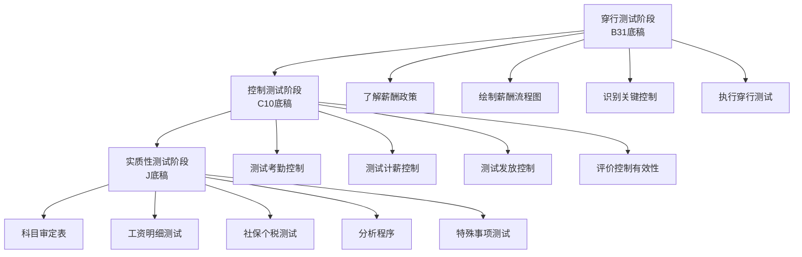

# 第二十一章 职工薪酬循环操作手册

> **版本**: v1.0 | **更新日期**: 2025年10月 | **适用准则**: 中国注册会计师审计准则
> 
> **📍 返回主框架**: [审计实务操作手册-框架](./审计实务操作手册-框架.md#第十六章-职工薪酬循环)
> 
> **🔗 本章在审计流程中的位置**: 第三部分 > 业务循环操作手册 > 第十六章

---

## 📚 手册说明

本手册详细说明职工薪酬循环审计的全流程操作，包括穿行测试、控制测试和实质性测试三个阶段，每个阶段提供具体的底稿填写指引和实操案例。

### 适用范围
- 应付职工薪酬审计
- 工资、奖金、津贴审计
- 社会保险和住房公积金审计
- 离职后福利（辞退福利、离职补偿）审计
- 股份支付审计（如适用）

### 底稿体系
- **B类底稿**: B23-9（旧B31）职工薪酬业务层面控制（8个子底稿）
- **C类底稿**: C10职工薪酬循环控制测试（3个子底稿）
- **J类底稿**: J职工薪酬实质性测试（20+个子底稿）
  - J0系列：薪酬函证（2个底稿）
  - J1系列：应付职工薪酬审定表（4个底稿）
  - J2系列：工资明细测试（6个底稿）
  - J3系列：社保个税测试（5个底稿）
  - J4系列：特殊事项测试（3+个底稿）

---

## 🚀 5分钟快速上手指南

> **新手必读！** 第一次审计职工薪酬循环？这里告诉你最核心的内容和最快的路径。

### 📌 三步定位你需要的内容

**步骤1：确定你的审计阶段**
```
你在哪个阶段？
├─ 刚开始项目？ → 阅读【第16.1-16.3节】了解循环特征和风险
├─ 风险评估阶段？ → 执行【第16.4-16.6节】穿行测试
├─ 控制测试阶段？ → 执行【第16.7-16.9节】控制测试（可选）
└─ 实质性测试阶段？ → 重点看【第16.10-16.14节】⭐⭐⭐
```

**步骤2：找到你的核心必做程序**
```
职工薪酬循环审计的6个核心程序（必须执行）：
✅ 1. 工资明细核对 → 第16.11节 ⭐⭐⭐（最重要！）
✅ 2. 社保个税测算 → 第16.12节 ⭐⭐⭐
✅ 3. 薪酬总额分析 → 第16.13.1节 ⭐⭐⭐
✅ 4. 人员真实性验证 → 第16.11节 ⭐⭐（防止"吃空饷"）
✅ 5. 费用归集检查 → 第16.13.2节 ⭐⭐
✅ 6. 关联方薪酬检查 → 第16.14.4节 ⭐⭐

人员真实性是高风险！防止虚构人员"吃空饷"
```

**步骤3：遇到问题时快速查找**
```
常见问题？ → 第16.16节常见问题解答（FAQ）
不会填底稿？ → 每节都有"底稿示例"
社保如何测算？ → 第16.12节详细说明
关联方薪酬？ → 第16.14.4节专题
```

---

### 🎯 场景化快速导航（⭐重点推荐）

> **💡 使用说明**: 这是最实用的导航！直接找到你当前遇到的场景，快速定位解决方案。

#### 📍 场景一：审计项目启动阶段

| 你的情况 | 快速跳转 | 核心内容 | 预计用时 |
|---------|---------|---------|---------|
| 🆕 **第一次审计职工薪酬循环** | [16.1节](#161-职工薪酬循环特征) → [5分钟快速上手](#🚀-5分钟快速上手指南) | 了解循环特征、风险、底稿体系 | 30分钟 |
| 📋 **制定审计计划** | [16.2节](#162-审计流程概览) | 审计流程图、底稿执行顺序 | 1小时 |
| 🎯 **确定审计策略** | [16.1.3节](#1613-审计策略选择) | 综合策略（控制+实质性） | 30分钟 |
| 📊 **风险评估** | [16.3.4节](#1634-认定-风险-程序映射体系) ⭐ | 识别风险、设计应对程序 | 1小时 |

#### 📍 场景二：现场审计执行阶段

| 你的情况 | 快速跳转 | 核心内容 | 预计用时 |
|---------|---------|---------|---------|
| 🔍 **现场审计第一天** | [第一天行动清单](#⚡-现场审计第一天行动清单) | 资料获取、审定表填写 | 立即开始 |
| 📝 **填写审定表J1-1** | [16.10节](#1610-审定表与明细表) | 应付职工薪酬审定表填写 | 20分钟 |
| 🧾 **工资明细核对** | [16.11节](#1611-工资明细测试) | 抽样核对工资表 | 2-3小时 |
| 💰 **社保个税测算** | [16.12节](#1612-社保个税测试) | 社保基数、比例、个税计算 | 2-3小时 |
| 📊 **薪酬分析程序** | [16.13节](#1613-分析程序) | 同比、环比、人均薪酬分析 | 2小时 |
| 👥 **验证人员真实性** | [16.11节](#1611-工资明细测试) | 防止虚构人员"吃空饷" | 1-2小时 |

#### 📍 场景三：遇到特殊情况

| 你的情况 | 快速跳转 | 核心内容 | 预计用时 |
|---------|---------|---------|---------|
| ⚠️ **怀疑有虚构人员"吃空饷"** | [16.3.2节](#1632-舞弊风险识别) | 虚构人员识别方法 | 重点程序 |
| 🔴 **社保个税严重不符** | [16.12节](#1612-社保个税测试) | 测算差异、合规性风险 | 2-3小时 |
| 📉 **人均薪酬异常下降(>20%)** | [16.13.1节](#16131-薪酬总额分析) | 异常原因分析 | 2小时 |
| 💸 **发现大额一次性奖金** | [16.11节](#1611-工资明细测试) | 奖金合理性、审批、个税 | 2小时 |
| 🔄 **辞退福利计提不足** | [16.14.1节](#16141-辞退福利检查) | 计提充分性、支付依据 | 2-3小时 |
| 🤝 **关联方薪酬异常高** | [16.14.4节](#16144-关联方薪酬测试) ⭐ | 关联方薪酬公允性 | 2小时 |

#### 📍 场景四：特定测试程序

| 你的情况 | 快速跳转 | 核心内容 | 预计用时 |
|---------|---------|---------|---------|
| 🧮 **社保基数和比例测算** | [16.12节](#1612-社保个税测试) | 五险一金计算验证 | 2-3小时 |
| 💰 **个人所得税测算** | [16.12节](#1612-社保个税测试) | 个税计算、专项扣除 | 2小时 |
| 📊 **人均薪酬分析** | [16.13节](#1613-分析程序) | 人均薪酬、同比、环比 | 1小时 |
| 🔢 **费用归集检查** | [16.13.2节](#16132-费用配比分析) | 成本费用分类合理性 | 1-2小时 |
| 📅 **月度趋势分析** | [16.13.3节](#16133-月度趋势分析) | 12个月薪酬波动分析 | 1小时 |
| 💼 **辞退福利审计** | [16.14.1节](#16141-辞退福利检查) | 辞退计划、补偿标准 | 2小时 |

#### 📍 场景五：特殊项目类型

| 你的情况 | 快速跳转 | 核心内容 | 预计用时 |
|---------|---------|---------|---------|
| 🎯 **IPO项目** | 全流程加强版 | 社保合规、人员真实性 | 重点关注 |
| 🏢 **上市公司** | [16.14.3节](#16143-股份支付检查) | 股权激励、股份支付 | 3-4小时 |
| 🏭 **制造业企业** | [16.13.2节](#16132-费用配比分析) | 直接人工、制造费用归集 | 2-3小时 |
| 💻 **高新技术企业** | [16.13.2节](#16132-费用配比分析) | 研发人员认定、资本化 | 2-3小时 |
| 🔬 **劳动密集型企业** | [16.12节](#1612-社保个税测试) | 社保合规性、劳务派遣 | 重点关注 |
| 🏗️ **建筑企业** | [16.13.2节](#16132-费用配比分析) | 项目人工成本归集 | 2-3小时 |

#### 📍 场景六：具体底稿填写

| 你的情况 | 快速跳转 | 核心内容 | 预计用时 |
|---------|---------|---------|---------|
| 📄 **J1-1应付职工薪酬审定表** | [16.10节](#1610-审定表与明细表) | 审定表填写、勾稽关系 | 20分钟 |
| 📄 **J2-1工资明细核对表** | [16.11节](#1611-工资明细测试) | 抽样核对、计算验证 | 2-3小时 |
| 📄 **J3-1社保测算表** | [16.12节](#1612-社保个税测试) | 五险一金测算 | 1-2小时 |
| 📄 **J3-2个税测算表** | [16.12节](#1612-社保个税测试) | 个人所得税计算验证 | 1-2小时 |
| 📄 **J1-4薪酬分析表** | [16.13节](#1613-分析程序) | 同比环比分析 | 1小时 |
| 📄 **J4-1辞退福利检查表** | [16.14.1节](#16141-辞退福利检查) | 辞退福利计提检查 | 1-2小时 |

---

### ⚡ 现场审计第一天行动清单

> **目标**: 第一天完成基础资料获取和审定表编制，为后续测试打好基础

**上午（9:00-12:00）**
```
□ 获取应付职工薪酬明细表（期末余额，按类别：工资、社保、公积金、福利费等）
□ 获取全年工资表（12个月，包含人员名单、工资明细）
□ 获取员工花名册（在职员工名单、部门、岗位、入职日期）
□ 获取社保缴纳明细（12个月，五险一金缴纳记录）
□ 获取个税申报表（12个月，个人所得税申报数据）
□ 获取薪酬制度文件（薪酬政策、考勤制度、奖金制度）
```

**下午（14:00-17:00）**
```
□ 获取费用归集明细（管理费用、销售费用、生产成本中的职工薪酬）
□ 获取辞退福利明细（如有裁员、辞退补偿）
□ 获取关联方人员薪酬清单（关键管理人员、关联自然人）
□ 获取非货币性福利明细（如有：车辆、住房等）
□ 获取股权激励方案（如适用：股票期权、限制性股票）
□ 现场了解薪酬发放流程（考勤→计薪→审批→发放）
□ 获取劳动合同样本（抽查5-10份）
```

**当晚整理**
```
□ 编制应付职工薪酬审定表J1-1
□ 编制全年薪酬总额统计表
□ 识别需抽样核对的工资表月份（通常抽3-6个月）
□ 编制社保个税测算底稿框架
□ 识别异常事项（人员激增、薪酬异常波动、社保个税差异等）
□ 识别关联方人员（关键管理人员、实际控制人亲属等）
□ 准备次日工资明细核对的抽样清单
□ 准备次日工作计划
```

---

### ⭐ 新手必读Top 5（按优先级）

> **💡 阅读建议**：第一次做职工薪酬审计的新人，建议按照下列顺序学习。

---

#### 📌 第1优先级：工资明细核对（第16.11节）⭐⭐⭐

**🎯 为什么必须先学这个？**
工资明细核对是职工薪酬审计的核心，验证人员真实性、工资计算准确性、防止虚构人员"吃空饷"。这是基础中的基础！

**👶 第一次做时你会遇到什么？**
```
场景：公司有200名员工，12个月工资表，要核对什么？

你的困惑：
❓ 工资表要全部核对吗？还是抽样？
❓ 核对工资表要看哪些内容？
❓ 如何验证人员是否真实存在（防止"吃空饷"）？
❓ 工资计算公式复杂，如何验证准确性？
```

**✅ 你需要掌握的核心操作（预计学习2小时）**

**第一步：确定抽样范围（30分钟）**

| 项目规模 | 抽样月份 | 抽样人数 | 选样标准 |
|---------|---------|---------|---------|
| **小型企业(<100人)** | 3-4个月 | 每月15-20人 | • 关键管理人员<br>• 高薪员工Top 10<br>• 新入职/离职人员<br>• 随机抽样其他人员 |
| **中型企业(100-500人)** | 4-6个月 | 每月20-30人 | 同上 + 各部门抽样 |
| **大型企业(>500人)** | 6个月 | 每月30-50人 | 同上 + 分层抽样 |

**第二步：核对工资明细（1小时）**

**工资表核对检查表**：

| 检查项 | 具体内容 | 核对方法 | 发现问题怎么办 |
|-------|---------|---------|---------------|
| **① 人员真实性** | 人员是否真实存在 | • 与花名册核对<br>• 查看劳动合同<br>• 现场访谈（随机抽5人） | 发现"吃空饷"→提请调整 |
| **② 基本工资** | 基本工资是否符合合同约定 | 与劳动合同核对 | 不符→了解原因 |
| **③ 绩效奖金** | 奖金发放是否有依据 | 检查考核表、审批文件 | 无依据→关注合理性 |
| **④ 加班工资** | 加班费计算是否正确 | 核对考勤记录、加班单 | 计算错误→提请调整 |
| **⑤ 扣款项目** | 社保、公积金、个税扣款 | 与测算表核对 | 差异→了解原因 |
| **⑥ 实发金额** | 实发=应发-扣款 | 重新计算 | 计算错误→提请调整 |
| **⑦ 银行流水** | 实际发放是否一致 | 抽查银行流水（5-10人） | 不一致→追查去向 |

**第三步：验证人员真实性（30分钟）**

**防止"吃空饷"的5个方法**：

1. **花名册核对**：工资表人员与在职员工花名册100%核对
2. **劳动合同检查**：抽查10-15份劳动合同，验证合同真实性
3. **现场访谈**：随机抽5-10名员工现场访谈，确认在职
4. **社保缴纳核对**：工资表人员与社保缴纳人员名单核对
5. **银行流水抽查**：抽查5-10人的工资发放银行流水

**识别虚构人员的5个信号**：
1. ❌ 工资表上有人员，但花名册没有
2. ❌ 工资表上有人员，但社保未缴纳
3. ❌ 工资表上有人员，但无劳动合同
4. ❌ 工资表上有人员，但现场访谈找不到人
5. ❌ 工资发放银行账户异常（如个人账户重复）

**💡 新手保命技巧**：
1. **防止虚构人员是重点**：必须验证人员真实性，特别是IPO项目
2. **工资计算要重算**：不能只看账面，要抽样重新计算工资
3. **关键管理人员100%检查**：高管、关联方人员的薪酬必须全部核对

**📋 配套底稿**：J2-1工资明细核对表、J2-2人员真实性验证表  
**⏱️ 实际操作时间**：抽样核对2-3小时

---

#### 📌 第2优先级：社保个税测算（第16.12节）⭐⭐⭐

**🎯 为什么必须学这个？**
社保个税测算是验证薪酬合规性的核心程序。社保少缴、个税漏缴是常见问题，也是监管重点，IPO项目必查！

**👶 第一次做时你会遇到什么？**
```
场景：公司账面社保费500万，个税200万

你的困惑：
❓ 社保基数和比例怎么确定？各地不一样怎么办？
❓ 个人所得税怎么计算？专项扣除怎么处理？
❓ 测算出来的社保个税与账面不符，怎么办？
❓ 社保合规性风险如何评估？
```

**✅ 你需要掌握的核心操作（预计学习3小时）**

**第一步：社保基数和比例确定（1小时）**

**社保基数规则**：
```
社保缴费基数 = 上年度月平均工资

特殊情况：
• 低于当地最低基数 → 按最低基数缴纳
• 高于当地最高基数 → 按最高基数缴纳
• 新入职员工 → 按合同约定工资或当月实际工资
```

**社保比例示例（以北京2024年为例）**：

| 险种 | 单位比例 | 个人比例 | 备注 |
|-----|---------|---------|------|
| **养老保险** | 16% | 8% | 最常见 |
| **医疗保险** | 9% | 2%+3元 | 含生育保险 |
| **失业保险** | 0.5% |  |  |
| **工伤保险** | 0.2%-1.9% | 0% | 按行业不同 |
| **住房公积金** | 5%-12% |  | 单位自定 |

**重要提示**：
- ⚠️ 各地社保比例不同，必须查询当地当年政策！
- ⚠️ 社保有封顶和保底限额，要核对当地标准！

**第二步：社保测算（1小时）**

**测算公式**：
```
月社保费 = Σ(员工缴费基数 × 社保比例)

示例（某员工）：
上年月平均工资：10,000元
缴费基数：10,000元（未超封顶）

单位社保费 = 10,000 × (16% + 9% + 0.5% + 0.5% + 12%) = 3,800元
个人社保费 = 10,000 × (8% + 2% + 0.5% + 12%) = 2,250元
```

**测算步骤**：
1. 获取全年社保缴纳明细（12个月）
2. 选取2-3个月进行详细测算（通常选1月、6月、12月）
3. 重新计算应缴社保费
4. 与账面和实际缴纳金额对比
5. 分析差异原因

**第三步：个人所得税测算（1小时）**

**个税计算公式（综合所得）**：
```
应纳税所得额 = 累计收入 - 累计免税收入 - 累计减除费用 - 累计专项扣除 
                - 累计专项附加扣除 - 累计其他扣除

其中：
• 累计减除费用 = 5,000元/月 × 月份数
• 累计专项扣除 = 五险一金个人部分
• 累计专项附加扣除 = 子女教育、继续教育、大病医疗、住房贷款利息、
                      住房租金、赡养老人（需员工申报）

应纳税额 = 应纳税所得额 × 税率 - 速算扣除数
```

**2024年个税税率表（综合所得）**：

| 级数 | 累计应纳税所得额 | 税率 | 速算扣除数 |
|-----|----------------|------|-----------|
| 1 | ≤36,000元 | 3% | 0 |
| 2 | 36,000-144,000元 | 10% | 2,520 |
| 3 | 144,000-300,000元 | 20% | 16,920 |
| 4 | 300,000-420,000元 | 25% | 31,920 |
| 5 | 420,000-660,000元 | 30% | 52,920 |
| 6 | 660,000-960,000元 | 35% | 85,920 |
| 7 | >960,000元 | 45% | 181,920 |

**💡 新手保命技巧**：
1. **社保比例查当地政策**：不同城市社保比例不同，必须查当地当年规定
2. **个税要累计计算**：个税是按年累计计算的，不能只看单月
3. **专项扣除要关注**：专项附加扣除需要员工申报，要核对申报表

**📋 配套底稿**：J3-1社保测算表、J3-2个税测算表  
**⏱️ 实际操作时间**：社保测算2小时，个税测算2小时

---

#### 📌 第3优先级：薪酬分析程序（第16.13节）⭐⭐⭐

**🎯 为什么要学这个？**
分析程序是效率最高的审计方法，通过数据分析快速识别异常。薪酬分析可以发现人员变动异常、薪酬波动异常、费用归集错误等问题。

**关键分析指标**：

**1. 薪酬总额分析**
```
同比分析：本年薪酬 vs 上年薪酬
环比分析：本年各月薪酬波动情况
人均薪酬：薪酬总额 / 平均员工人数
```

**2. 费用配比分析**
```
薪酬费用率 = 薪酬总额 / 营业收入
成本费用分配：管理费用、销售费用、生产成本、研发费用
```

**3. 月度趋势分析**
```
12个月薪酬波动曲线
识别异常月份（波动>30%需调查）
季节性因素分析
```

**异常信号识别**：
- ⚠️ 薪酬总额同比增长>30%或下降>20%
- ⚠️ 人均薪酬异常波动（>30%）
- ⚠️ 某月薪酬突增（可能是一次性奖金）
- ⚠️ 费用归集比例异常变化

**📋 配套底稿**：J1-4薪酬分析表  
**⏱️ 实际操作时间**：分析程序2小时

---

#### 📌 第4优先级：认定-风险-程序映射体系（第16.3.4节）⭐⭐

**🎯 为什么要学这个？**
理解"为什么做这个程序"，才能正确执行审计。认定-风险-程序映射体系帮你理解每个审计程序背后的逻辑。

**核心映射关系（应付职工薪酬示例）**：

| 认定 | 主要风险 | 关键审计程序 | 底稿索引 | 风险等级 |
|-----|---------|------------|---------|---------|
| **存在性** | 🚨 **虚构人员**<br>"吃空饷" | ✅ 人员真实性验证<br>✅ 花名册核对<br>✅ 现场访谈 | J2-2<br>J2-1 | 🔴 高 |
| **完整性** | ⚠️ **漏计薪酬**<br>少计社保 | ✅ 社保个税测算<br>✅ 薪酬总额分析 | J3-1<br>J1-4 | 🟡 中 |
| **准确性** | ⚠️ **计算错误**<br>社保个税错误 | ✅ 工资明细核对<br>✅ 社保个税重算 | J2-1<br>J3-1/J3-2 | 🟡 中 |
| **分类** | 🟢 **归集错误**<br>成本费用分类不当 | ✅ 费用归集检查 | J1-4 | 🟢 低 |

**📋 详见**：第16.3.4节完整映射矩阵  
**⏱️ 学习时间**：1小时

---

#### 📌 第5优先级：常见问题解答（第16.16节）⭐⭐

**🎯 为什么要看这个？**
快速解答你90%的疑问，节省查找时间。

**6大高频问题**：
1. 如何验证人员真实性（防止"吃空饷"）
2. 社保基数和比例如何确定
3. 个人所得税如何计算（含专项扣除）
4. 关联方薪酬如何检查
5. 辞退福利如何审计
6. 股权激励如何处理

**⏱️ 阅读时间**：30分钟

---

### 💡 常见错误提醒（新手最容易犯的）

**❌ 错误1：不验证人员真实性**
- ✅ 正确：必须验证人员真实性，防止虚构人员"吃空饷"
- 📖 详见：第16.11节

**❌ 错误2：社保个税不测算，只看账面**
- ✅ 正确：必须重新测算社保个税，验证计算准确性和合规性
- 📖 详见：第16.12节

**❌ 错误3：工资表核对只看总额，不看明细**
- ✅ 正确：必须抽样核对工资明细，验证计算准确性
- 📖 详见：第16.11节

**❌ 错误4：关联方薪酬不单独检查**
- ✅ 正确：关联方人员（高管、实际控制人亲属）薪酬必须单独检查公允性
- 📖 详见：第16.14.4节

**❌ 错误5：费用归集不关注，只看薪酬总额**
- ✅ 正确：必须检查薪酬在成本费用科目间的分配合理性
- 📖 详见：第16.13.2节

---

## 📋 目录

### 第一部分：循环总览
1. [职工薪酬循环特征](#161-职工薪酬循环特征)
2. [审计流程概览](#162-审计流程概览)
3. [风险识别与应对](#163-风险识别与应对)
   - 3.1 [风险矩阵](#1631-风险矩阵)
   - 3.2 [舞弊风险识别](#1632-舞弊风险识别)
   - 3.3 [特殊事项关注](#1633-特殊事项关注)
   - 3.4 [认定-风险-程序映射体系](#1634-认定-风险-程序映射体系) ⭐

### 第二部分：穿行测试阶段（B31）
4. [穿行测试准备](#164-穿行测试准备)
5. [流程了解与控制识别](#165-流程了解与控制识别)
6. [穿行测试执行](#166-穿行测试执行)

### 第三部分：控制测试阶段（C10）
7. [控制测试计划](#167-控制测试计划)
8. [控制测试执行](#168-控制测试执行)
9. [控制偏差评价](#169-控制偏差评价)

### 第四部分：实质性测试阶段（J）
10. [审定表与明细表](#1610-审定表与明细表)
11. [工资明细测试](#1611-工资明细测试)
12. [社保个税测试](#1612-社保个税测试)
13. [分析程序](#1613-分析程序)
    - 13.1 [薪酬总额分析](#16131-薪酬总额分析)
    - 13.2 [费用配比分析](#16132-费用配比分析)
    - 13.3 [月度趋势分析](#16133-月度趋势分析)
    - 13.4 [应付职工薪酬检查表](#16134-应付职工薪酬检查表) ⭐
14. [特殊事项测试](#1614-特殊事项测试)
    - 14.1 [辞退福利检查](#16141-辞退福利检查)
    - 14.2 [非货币性福利检查](#16142-非货币性福利检查)
    - 14.3 [股份支付检查](#16143-股份支付检查)
    - 14.4 [关联方薪酬测试](#16144-关联方薪酬测试) ⭐
    - 14.5 [设定受益计划审计](#16145-设定受益计划审计)

### 第五部分：实操案例
15. [完整案例演示](#1615-完整案例演示)
16. [常见问题解答](#1616-常见问题解答)

---

## 21.1 职工薪酬循环特征

### 21.1.1 涉及科目

| 科目类别 | 具体科目 | 审计重点 |
|---------|---------|---------|
| **资产负债表** | 应付职工薪酬-工资 | 余额准确性、计提充分性 |
| | 应付职工薪酬-社保 | 计提准确性、缴纳及时性 |
| | 应付职工薪酬-公积金 | 计提准确性、缴纳及时性 |
| | 应付职工薪酬-福利费 | 福利费性质、使用合规性 |
| | 应付职工薪酬-辞退福利 | 计提充分性、支付依据 |
| **损益表** | 管理费用-职工薪酬 | 归集准确性、分类合理性 |
| | 销售费用-职工薪酬 | 归集准确性、分类合理性 |
| | 生产成本-直接人工 | 成本归集、分配合理性 |
| | 制造费用-工资 | 成本归集、分配合理性 |
| | 研发支出-人工费用 | 研发人员认定、资本化判断 |

### 21.1.2 主要风险

| 风险类型 | 具体表现 | 风险等级 |
|---------|---------|---------|
| **虚构人员** | "吃空饷"、已离职人员未删除 | 高 |
| **计算错误** | 工资计算错误、考勤数据不准确 | 中-高 |
| **社保合规** | 少缴、漏缴社保公积金，违反劳动法 | 中 |
| **个税风险** | 个税申报不实、逃税漏税 | 中 |
| **归集错误** | 成本费用科目分类错误 | 中 |
| **离职补偿** | 辞退福利计提不充分 | 中 |
| **关联方** | 关联方人员薪酬未披露 | 中 |

### 21.1.3 审计策略选择

**推荐策略：综合策略（路径3）**
- 控制测试：对关键控制（考勤审批、薪酬计算、发放审核）执行测试
- 实质性测试：正常范围执行（工资明细核对、社保测算、分析程序）
- 理由：中等风险循环，部分企业内控较好，可适当依赖控制

### 21.1.4 审计资源配置

| 审计阶段 | 预计时间 | 人员配置 | 关键工作 |
|---------|---------|---------|---------|
| 穿行测试 | 1天 | 项目经理+助理 | 流程了解、控制识别 |
| 控制测试 | 1-2天 | 审计助理 | 考勤、计薪、发放控制测试 |
| 实质性测试 | 3-4天 | 审计助理 | 工资明细核对、社保测算 |

---

## 21.2 审计流程概览

### 21.2.1 审计流程图



### 21.2.2 底稿调用路径

```
风险评估阶段
    ↓
【B31】穿行测试
├─ B31-1：整体控制汇总
├─ B31-2：流程图及描述（薪酬管理流程）
├─ B31-3：控制矩阵（识别关键控制点）
└─ B31-4：穿行测试记录
    ↓
控制测试阶段（如控制有效）
    ↓
【C10】控制测试
├─ C10：控制测试主表
├─ C10-1：控制测试执行记录
└─ C10-2：控制偏差评价表
    ↓
实质性测试阶段
    ↓
【J】实质性测试
├─ J1A：职工薪酬审计程序表
├─ J1-1：应付职工薪酬审定表
├─ J1-2：工资明细核对表
├─ J1-3：社保公积金测算表
├─ J1-4：个税测算表
├─ J1-5：薪酬分析程序表
├─ J1-6：人员真实性测试
└─ J1-7至J1-20：其他专项测试
```

### 21.2.3 时间安排

| 工作内容 | 时间节点 | 持续时间 | 完成标志 |
|---------|---------|---------|---------|
| 穿行测试 | 期中审计 | 1天 | B31底稿完成 |
| 控制测试 | 期中/期末审计 | 1-2天 | C10底稿完成 |
| 实质性测试（期中） | 期中审计 | 1-2天 | J系列底稿（1-9月） |
| 实质性测试（期末） | 期末审计 | 2-3天 | J系列底稿全部完成 |

---

## 21.3 风险识别与应对

### 21.3.1 风险矩阵

| 认定 | 固有风险 | 控制风险 | 检查风险 | 实质性测试应对 |
|-----|---------|---------|---------|---------------|
| **存在** | 中 | 低-中 | 低 | 工资明细核对+人员访谈 |
| **完整性** | 中-高 | 中 | 低 | 工资表与账面核对+社保核对 |
| **准确性** | 中 | 低-中 | 低 | 重新计算+测算 |
| **截止** | 低 |  |  | 截止测试（期末计提） |
| **分类** | 中 |  | 低 | 科目归集检查 |
| **列报** | 低 |  |  | 披露检查 |

### 21.3.2 舞弊风险识别

**高风险舞弊情形：**

1. **虚构人员领工资**
   - 风险表现：已离职人员未删除，继续发放工资
   - 舞弊手段：人事部门与财务串通，私分工资
   - 应对措施：人员真实性测试（抽查身份证、访谈、现场观察）

2. **工资数据人为调整**
   - 风险表现：考勤数据事后修改，工资表手工调整
   - 舞弊手段：管理层凌驾于控制之上
   - 应对措施：核对考勤原始记录，检查系统日志

3. **社保少缴、漏缴**
   - 风险表现：按最低基数缴纳，未全员参保
   - 舞弊手段：降低人工成本，规避合规责任
   - 应对措施：社保花名册核对，测算缴费基数

4. **虚增成本费用**
   - 风险表现：虚构员工、虚增工资
   - 舞弊手段：虚增成本，减少利润，逃避税收
   - 应对措施：人员真实性测试，工资水平合理性分析

### 21.3.3 特殊事项关注

| 特殊事项 | 审计关注点 | 审计程序 |
|---------|-----------|---------|
| **股份支付** | 公允价值计量、费用确认 | 检查股权激励协议、重新计算 |
| **关联方薪酬** | 关联方任职、薪酬合理性 | 关联方清单核对、薪酬对比 |
| **劳务派遣** | 劳务费与工资区分 | 检查劳务派遣协议、发票 |
| **离职补偿** | 计提充分性、支付依据 | 检查劳动合同、补偿计算 |
| **未休年假** | 是否应计提 | 了解政策、测算未休天数 |

---

## 21.3.4 认定-风险-程序映射体系（⭐⭐⭐核心框架）

> **💡 本节位置**：16.3 风险识别与应对 > 16.3.4 认定-风险-程序映射体系
> 
> **💡 为什么需要这个体系？**  
> 职工薪酬循环涉及工资、社保、公积金、福利费、辞退福利、股份支付等多个子科目，涵盖计算准确性、人员真实性、社保合规性、个税申报等复杂问题，很多审计人员不理解"为什么要做人员真实性测试、为什么要测算社保"。本章节建立**认定→风险→程序**的清晰映射关系，帮助您：
> 1. **理解逻辑**：明白每个程序针对什么风险、验证哪个认定
> 2. **裁剪程序**：根据企业规模和风险高低合理裁剪程序，提高效率
> 3. **应对变化**：遇到新情况（如股份支付、大规模裁员）时，能够独立判断应该做什么程序
> 4. **防范重大失败**：职工薪酬审计失败案例多源于虚构人员、社保合规风险（如虚增工资套取资金）

---

### 📊 职工薪酬循环认定-风险-程序总览矩阵

#### 矩阵说明
- **横轴**：财务报表认定（6大类）
- **纵轴**：职工薪酬子科目（4大核心类）
- **单元格内容**：主要风险 → 关键程序 → 风险等级

---

#### 表1：工资薪酬的认定-风险-程序矩阵（⭐核心）

| 认定 | 主要风险 | 关键审计程序 | 底稿索引 | 风险等级 | 程序必要性 |
|-----|---------|------------|---------|---------|-----------|
| **存在性<br>Existence** | 🚨 **虚构人员"吃空饷"**<br>• 已离职人员未删除<br>• 虚假员工套取资金<br>• 关联方虚增工资 | ✅ **人员真实性测试**（⭐⭐⭐必做）<br>  - 花名册核对（全员）<br>  - 现场访谈（抽样20-30人）<br>  - 身份证核对（抽样10-15人）<br>✅ **工资银行流水核对**<br>  - 检查是否资金回流<br>✅ **关联方识别** | J1-6<br>（人员真实性测试）<br><br>J1-2<br>（工资明细表）<br><br>关联方清单 | 🔴 高风险<br>（舞弊高发） | ⭐⭐⭐<br>必做<br>人员真实性测试不可简化 |
| **完整性<br>Completeness** | ⚠️ **应计未计工资**<br>• 期末计提不足<br>• 年终奖未计提<br>• 加班费遗漏<br>• 离职补偿未计提 | ✅ **期末计提检查**（⭐⭐⭐必做）<br>  - 核对12月工资表与账面<br>  - 检查计提分录<br>✅ **年终奖计提检查**<br>✅ **离职补偿检查**<br>✅ **工资表与账面核对** | J1-1<br>（审定表）<br><br>J1-10<br>（辞退福利）<br><br>J1-2 | 🟡 中风险 | ⭐⭐⭐<br>必做<br>期末计提必须检查 |
| **准确性<br>Accuracy** | 🚨 **工资计算错误**<br>• 公式设置错误<br>• 考勤数据不准确<br>• 社保个税扣除错误<br>• 手工调整无依据 | ✅ **工资重新计算**（⭐⭐⭐必做）<br>  - 抽样30-50人<br>  - 重算应发、扣款、实发<br>✅ **社保公积金测算**（⭐⭐⭐必做）<br>✅ **个税测算**（⭐⭐必做）<br>✅ **考勤记录核对** | J1-2<br>（工资明细核对表）<br><br>J1-3<br>（社保测算表）<br><br>J1-4<br>（个税测算表） | 🔴 高风险 | ⭐⭐⭐<br>必做<br>工资重算不可省 |
| **截止性<br>Cutoff** | 🟢 **截止错误**<br>• 计提跨期<br>• 发放跨期 | ✅ **截止测试**<br>  - 检查12月工资计提<br>  - 检查1月发放记录 | J1-1<br>（审定表） | 🟢 低风险 | ⭐<br>常规程序 |
| **分类<br>Classification** | ⚠️ **科目归集错误**<br>• 成本费用归集不当<br>• 研发人员工资资本化错误<br>• 劳务费误计工资 | ✅ **科目归集检查**（⭐⭐必做）<br>  - 检查工资分配表<br>  - 核对各科目明细<br>✅ **研发人员工资资本化检查**<br>✅ **劳务派遣vs正式员工区分** | J1-7<br>（成本费用分配表）<br><br>J1-2<br>（费用明细表） | 🟡 中风险 | ⭐⭐<br>常规必做<br>研发资本化需重点关注 |
| **列报<br>Presentation** | 🟢 **披露不充分**<br>• 关键管理人员薪酬未披露<br>• 社保欠缴未披露 | ✅ **披露检查**<br>  - 关键管理人员薪酬<br>  - 社保公积金缴纳情况<br>  - 股份支付（如有） | 附注披露 | 🟢 低风险 | ⭐<br>常规程序 |

**🎯 工资薪酬审计核心要点**：

**人员真实性测试三步法**：
```
步骤1：花名册全员核对（100%）
→ 工资表人数 = 人事花名册人数
→ 人员信息一致（姓名、工号、部门）

步骤2：现场访谈（抽样20-30人）
→ 随机抽取员工访谈或电话确认
→ 询问岗位、入职时间、工资水平
→ 确认工资卡账号

步骤3：身份证核对（抽样10-15人）
→ 核对人事档案身份证复印件
→ 检查劳动合同签署
→ 验证身份证号真实性（无连号、无虚假）
```

**工资计算重算重点**：
1. **应发工资** = 基本工资 + 绩效奖金 + 各项津贴 + 加班费
2. **扣款合计** = 社保个人部分 + 公积金个人部分 + 个税 + 其他扣款
3. **实发工资** = 应发工资 - 扣款合计
4. **核对公式**：应发 - 扣款 = 实发（差异必须为0）

**审计要点**：
1. **人员真实性测试必做**：防范虚构人员套取资金（⭐⭐⭐必做）
2. **工资重算必做**：抽样30-50人，全部重算（⭐⭐⭐必做）
3. **期末计提检查必做**：12月工资、年终奖是否充分计提（⭐⭐⭐必做）
4. **社保个税测算必做**：验证计算准确性和合规性（⭐⭐⭐必做）

---

#### 表2：社保公积金的认定-风险-程序矩阵（⭐核心）

| 认定 | 主要风险 | 关键审计程序 | 底稿索引 | 风险等级 | 程序必要性 |
|-----|---------|------------|---------|---------|-----------|
| **完整性<br>Completeness** | 🚨 **未全员参保**<br>• 试用期员工未参保<br>• 劳务派遣员工混淆<br>• 新入职员工遗漏 | ✅ **参保人数核对**（⭐⭐⭐必做）<br>  - 社保缴纳人数 = 在职员工人数<br>  - 检查社保花名册<br>✅ **新增减少人员核对**<br>✅ **劳务派遣人员识别** | J1-3<br>（社保测算表）<br><br>J1-6<br>（人员核对） | 🔴 高风险<br>（合规风险） | ⭐⭐⭐<br>必做<br>全员参保必须核实 |
| **准确性<br>Accuracy** | 🚨 **缴费基数不实**<br>• 按最低基数缴纳<br>• 基数与工资不匹配<br>• 少报缴费基数<br>• 缴费比例错误 | ✅ **缴费基数测算**（⭐⭐⭐必做）<br>  - 抽样20-30人<br>  - 核对工资基数与社保基数<br>  - 差异率分析<br>✅ **缴费比例检查**<br>  - 核对当地政策<br>✅ **社保全额测算**（⭐⭐⭐必做）<br>  - 重新计算全年社保 | J1-3<br>（社保测算表）<br><br>当地社保政策文件 | 🔴 高风险<br>（合规风险+舞弊） | ⭐⭐⭐<br>必做<br>缴费基数必须抽样核实 |
| **及时性<br>Timeliness** | ⚠️ **缴费不及时**<br>• 逾期缴纳<br>• 欠缴未缴<br>• 补缴情况 | ✅ **缴费及时性检查**<br>  - 每月缴费时间<br>  - 是否有滞纳金<br>✅ **欠缴情况检查**<br>✅ **补缴情况核实** | J1-3<br>（社保测算表）<br><br>J1-8<br>（检查表） | 🟡 中风险 | ⭐⭐<br>常规必做 |
| **计价<br>Valuation** | ⚠️ **计提错误**<br>• 账面计提与实际缴纳不符<br>• 比例计算错误 | ✅ **计提测算**<br>  - 重新计算应计提金额<br>  - 与账面对比<br>✅ **实际缴纳核对**<br>  - 银行扣款凭证 | J1-3<br>（社保测算表）<br><br>银行流水 | 🟡 中风险 | ⭐⭐<br>常规必做 |

**🎯 社保公积金审计核心要点**：

**社保测算公式**：
```
公司应缴社保 = Σ(缴费基数 × 公司比例)
个人应缴社保 = Σ(缴费基数 × 个人比例)

主要险种比例（示例）：
养老保险：公司16%，个人8%
医疗保险：公司8-10%，个人2%
失业保险：公司0.5-1%，个人0.5%
工伤保险：公司0.2-2%，个人0%
```

**审计要点**：
1. **全员参保必须核实**：社保人数 = 在职人数（⭐⭐⭐必做）
2. **缴费基数抽样核实**：抽样20-30人，核对差异率（⭐⭐⭐必做）
3. **全额测算**：重新计算全年应缴社保（⭐⭐⭐必做）

---

#### 表3：个人所得税的认定-风险-程序矩阵

| 认定 | 主要风险 | 关键审计程序 | 底稿索引 | 风险等级 | 程序必要性 |
|-----|---------|------------|---------|---------|-----------|
| **准确性<br>Accuracy** | 🚨 **个税计算错误**<br>• 税率档次错误<br>• 专项扣除遗漏<br>• 累计预扣法错误 | ✅ **个税测算**（⭐⭐必做）<br>  - 抽样10-15人<br>  - 重新计算个税<br>✅ **专项附加扣除检查**<br>✅ **年终奖计税方式检查** | J1-4<br>（个税测算表） | 🔴 高风险 | ⭐⭐<br>必做 |
| **完整性<br>Completeness** | ⚠️ **申报遗漏**<br>• 年终奖未申报<br>• 高管收入遗漏 | ✅ **申报完整性检查**<br>  - 工资总额vs个税申报总额 | J1-4 | 🟡 中风险 | ⭐⭐<br>必做 |

---

#### 表4：特殊薪酬事项的认定-风险-程序矩阵

| 特殊事项 | 主要风险 | 关键审计程序 | 底稿索引 | 风险等级 | 程序必要性 |
|---------|---------|------------|---------|---------|-----------|
| **辞退福利** | 🔴 **计提不充分** | ✅ **辞退福利检查**（⭐⭐⭐必做）<br>  - 检查裁员决议<br>  - 核对补偿计算 | J1-10 | 🔴 高风险 | ⭐⭐⭐<br>必做（如有裁员） |
| **股份支付** | 🔴 **公允价值错误** | ✅ **股份支付检查**（⭐⭐⭐必做）<br>  - 复核公允价值<br>  - 利用估值专家 | J1-11A/11/12 | 🔴 高风险 | ⭐⭐⭐<br>必做（如有股权激励） |
| **关联方薪酬** | 🟡 **披露不充分** | ✅ **关联方识别**（⭐⭐必做）<br>  - 核对关联方清单<br>  - 薪酬合理性分析 | 关联方清单 | 🟡 中风险 | ⭐⭐<br>必做 |

---

### 🎨 程序裁剪决策体系

#### 企业规模分级

| 规模 | 员工人数 | 主要风险 | 审计策略 |
|-----|---------|---------|---------|
| **🔴 大型企业** | >1,000人 | • 跨地区社保差异<br>• 股份支付复杂 | • 可适度依赖控制<br>• 股份支付充分测试<br>• 跨地区分别测算 |
| **🟡 中型企业** | 100-1,000人 | • 社保合规风险<br>• 人员真实性<br>• 计算准确性 | • 综合策略<br>• 人员真实性测试必做<br>• 社保全额测算<br>• 工资重算30-50人 |
| **🟢 小型企业** | <100人 | • 虚构人员风险高<br>• 社保少缴常见<br>• 个税申报不规范 | • 实质性测试为主<br>• 扩大测试范围<br>• 人员真实性全面测试 |

---

### 🎯 典型场景的程序选择指南

#### 场景1：制造企业（员工1,500人，生产人员占70%）

**风险特征**：
- 生产人员基数大、薪酬相对固定
- 加班费计算复杂
- 社保全员参保压力大

**程序选择**：
```
【高优先级程序】⭐⭐⭐
✅ 社保全员参保核实（生产人员常见少缴）
✅ 社保缴费基数测算（抽样30人）
✅ 加班费计算重算（抽样20人）
✅ 工资分配检查（生产成本vs管理费用）

【中优先级程序】⭐⭐
✅ 人员真实性测试（抽样25人）
✅ 个税测算（抽样15人）
```

---

#### 场景2：互联网科技企业（员工600人，研发占比50%）

**风险特征**：
- 薪酬水平高、结构复杂
- 股权激励普遍
- 研发人员工资资本化判断
- 人员流动快

**程序选择**：
```
【高优先级程序】⭐⭐⭐
✅ 股份支付充分测试（公允价值+费用分摊+利用专家）
✅ 研发人员工资资本化检查（工时分配+资本化条件）
✅ 社保缴费基数测算（高薪人员容易按最低基数）
✅ 个税测算（高管薪酬+期权行权个税）
```

**特别提醒**：
- 🚨 股份支付公允价值必须复核（⭐⭐⭐）
- 🚨 研发人员工时分配需充分证据（⭐⭐⭐）

---

#### 场景3：餐饮连锁企业（员工800人，门店分散，兼职多）

**风险特征**：
- 员工分散在多个门店
- 兼职员工多、流动性大
- 社保参保率低
- 现金发放工资较多

**程序选择**：
```
【高优先级程序】⭐⭐⭐
✅ 人员真实性测试（扩大范围，抽样50人）
  - 多门店随机抽取
  - 现场访谈
  - 银行流水核对（现金发放需重点关注）
✅ 全职vs兼职员工区分
✅ 社保参保完整性检查（全职必须全员参保）
✅ 工资计算重算（小时工资+提成验证）
```

---

#### 场景4：建筑施工企业（正式员工300人+农民工500人）

**风险特征**：
- 农民工管理混乱
- 虚构人员"吃空饷"风险极高
- 社保参保不全
- 劳务分包与自有员工混淆

**程序选择**：
```
【高优先级程序】⭐⭐⭐
✅ 人员真实性测试（重中之重，扩大到100人）
  - 身份证核对（检查连号、虚假）
  - 现场访谈（随机抽取30人）
  - 银行流水追踪（检查资金回流）
  - 劳动合同检查
✅ 劳务分包vs自有员工区分
  - 检查劳务分包合同
  - 核对劳务费发票
✅ 社保参保率检查
✅ 工资发放核对
```

**特别提醒**：
- 🚨 建筑行业虚构人员套取资金案例最多（⭐⭐⭐高度警惕）
- 🚨 身份证连号、电话号码相同需重点关注（⭐⭐⭐）
- 🚨 银行流水必须核查，关注资金回流（⭐⭐⭐）

---

### 💡 实战应用示例

#### 示例1：如何识别和应对"吃空饷"舞弊风险

**舞弊手法识别清单**：

```
🚩 红旗指标（Red Flags）：

【人员信息异常】
❌ 身份证号连号
❌ 电话号码相同（如：15人电话号码都是同一个）
❌ 银行卡号相似
❌ 工资金额整数（如：28,000、30,000、35,000）
❌ 人员无法联系

【银行流水异常】
❌ 工资发放后立即转出（当天或次日）
❌ 资金回流至固定账户（如老板账户）
❌ 转账备注异常（如："归还"、"借款"）

【考勤记录异常】
❌ 考勤记录完美（从不请假、加班）
❌ 打卡时间规律（每天同一时间）
❌ 多人同时打卡
```

**审计程序设计（J1-6人员真实性测试）**：

**步骤1：数据分析筛查**
```
1. 身份证号码校验
   - 检查18位格式
   - 检查出生日期合理性
   - 筛选连号身份证

2. 电话号码统计
   - 统计电话号码频次
   - 筛选重复电话号码（>5人）

3. 工资金额分析
   - 统计工资金额分布
   - 筛选整数工资
```

**步骤2：现场访谈**
```
随机抽取20-30名员工进行访谈：

访谈问题清单：
1. 您叫什么名字？在哪个部门工作？
2. 您的岗位职责是什么？
3. 您是什么时候入职的？
4. 您的工资大概多少？
5. 您的工资是发到哪张银行卡？
```

**步骤3：银行流水追踪**
```
对于可疑人员，获取工资卡银行流水：

检查要点：
1. 工资到账时间是否一致
2. 工资金额是否一致
3. 工资到账后是否立即转出
4. 转出账户是谁（关注是否为公司关联人员）

案例：
张XX工资卡流水显示：
- 2024-01-05：工资入账30,000元
- 2024-01-05：转出29,000元至账户尾号8888（❌ 异常）
- 进一步调查：账户尾号8888为公司老板账户（❌ 高度可疑）

结论：存在虚构人员套取资金的舞弊风险
```

---

#### 示例2：如何测算社保缴费基数是否合规

**步骤1：了解当地社保政策**
```
获取资料：
✓ 当地社保缴费基数上下限
✓ 各险种缴费比例

示例（上海2024年）：
- 缴费基数上限：36,549元/月
- 缴费基数下限：7,310元/月
- 养老保险：公司16%，个人8%
- 医疗保险：公司10%，个人2%
```

**步骤2：抽样测算缴费基数**
```
抽样方法：分层抽样
- 高管层：全部（5人）
- 中层：50%（8人）
- 普通员工：5%（24人）
- 合计：37人

测算表格式：
| 姓名 | 月均工资 | 社保基数 | 差异 | 差异率 | 是否合规 |
|------|---------|---------|------|--------|---------|
| 张三 | 20,000 |  | 0 | 0% | ✓ 合规 |
| 李四 | 18,000 | 7,310 | -10,690 | -59% | ❌ 不合规 |

汇总分析：
- 合规人数：12人（32%）
- 不合规人数：25人（68%）
- 平均差异率：-45%

主要问题：大部分员工按最低基数缴纳
```

**步骤3：全员测算应缴社保**
```
如果按实际工资缴纳：
全年工资总额：2,650万元
应缴社保（公司部分）= 2,650÷12 × 20% × 12 = 529.9万元

实际账面计提：520万元

差异分析：少计提9.9万元

风险评估：
🔴 高风险：存在合规风险
- 员工可要求补缴
- 社保部门可能处罚
```

---

### 📚 各循环操作手册映射矩阵位置

| 循环 | 操作手册文件 | 映射体系章节 | 核心特点 |
|-----|------------|------------|---------|
| **职工薪酬循环** | J职工薪酬循环操作手册.md | 第16.3.4节（本节） | 人员真实性、社保合规、工资准确性 |
| **无形资产循环** | I无形资产循环操作手册.md | 第14.3.4节 | 研发资本化、商誉减值、权利完整性 |
| **固定资产循环** | H固定资产循环操作手册.md | 第12.3.4节 | 9类资产、监盘核心、折旧测算 |
| **投资循环** | G投资循环操作手册.md | 第11.3.4节 | 13类投资、公允价值、权益法 |

---

### ⚡ 快速决策工具

#### 工具1：5秒钟快速判断程序必要性

```
问：这个程序必须做吗？
    ↓
查表：找到对应薪酬类型和认定
    ↓
看星级：
• ⭐⭐⭐ = 必做，不可简化
• ⭐⭐ = 常规必做，可适当简化
• ⭐ = 根据风险评估决定，可简化或替代
```

#### 工具2：项目经理程序裁剪决策表

| 如果...（条件） | 那么...（决策） | 依据 |
|---------------|---------------|------|
| 员工<100人 | 人员真实性测试扩大范围（全员核对） | 小企业内控薄弱 |
| 有股权激励 | 股份支付充分测试+利用专家（不可简化） | 估值复杂、金额重大 |
| 有大规模裁员 | 辞退福利充分测试（不可简化） | 金额重大、法律风险 |
| 建筑企业+农民工 | 人员真实性重点测试+银行流水追踪 | 虚构人员高发 |
| 社保缴费基数差异>10% | 全面测算+合规性评估+建议补缴 | 合规风险 |
| 多地办公 | 各地分别测算社保（不可简化） | 各地政策不同 |
| 现金发放工资 | 扩大人员真实性测试范围 | 舞弊风险高 |

---

### 🎓 价值总结

**✅ 对初级审计师的价值**：
1. **理解逻辑**：不再机械执行程序，知道每个程序验证什么风险
2. **快速成长**：通过认定-风险-程序的映射关系，建立审计思维框架
3. **独立判断**：遇到新情况时，能够独立判断应该做什么程序
4. **避免踩雷**：人员真实性、社保合规是高风险领域

**✅ 对项目经理的价值**：
1. **高效裁剪**：基于企业规模和风险评估快速决定哪些程序可以简化
2. **质量控制**：确保高风险认定的关键程序不被遗漏
3. **团队指导**：向团队成员解释"为什么这么做"
4. **风险防范**：虚构人员、社保合规是审计失败高发区

**✅ 对AI助手的价值**：
1. **精准推荐**：根据企业特征推荐最合适的程序组合
2. **智能检查**：自动识别高风险认定是否执行了必要程序
3. **效率提升**：快速生成审计方案和程序清单

---

**📌 下一步行动**：
- ✅ 阅读完本节后，进入【第16.4节】开始执行具体审计程序
- ✅ 执行程序时遇到疑问，回到本节（16.3.4）查找对应的风险-程序映射
- ✅ 项目完工后，对照本节进行质量复核

---

**🚨 特别提醒（职工薪酬审计三大雷区）**：

1. **虚构人员"吃空饷"**：历年审计失败案例高发，必须充分执行人员真实性测试（身份证核对+现场访谈+银行流水追踪），不可简化
2. **社保缴费基数不实**：合规风险高，必须抽样核实缴费基数与实际工资是否匹配，差异>10%需全面测算
3. **股份支付公允价值错误**：估值复杂，必须复核Black-Scholes模型参数（尤其是预期波动率），必要时利用估值专家

---

**索引号**: 第16.3.4节  
**编制人**: [编制人]  
**编制日期**: [日期]  
**复核人**: [复核人]  
**复核日期**: [日期]

---

## 21.4 穿行测试准备

### 21.4.1 准备工作清单

**16.4.1.1 资料收集**

在开始穿行测试前，收集以下资料：

| 资料类别 | 具体内容 | 获取途径 |
|---------|---------|---------|
| **制度文件** | 薪酬管理制度、考勤管理制度 | 人事部门/行政部门 |
| | 员工手册、劳动合同模板 | 人事部门 |
| **组织架构** | 组织架构图、人员花名册 | 人事部门 |
| | 部门职责说明 | 各部门 |
| **薪酬数据** | 工资表（1个月样本） | 财务部门 |
| | 社保缴纳清单 | 财务部门/人事部门 |
| | 个税申报表 | 财务部门 |
| **系统资料** | 考勤系统说明、薪酬系统说明 | IT部门/人事部门 |
| | 系统权限设置表 | IT部门 |

**16.4.1.2 访谈对象**

| 访谈对象 | 访谈重点 | 预计时间 |
|---------|---------|---------|
| 人事经理 | 薪酬政策、考勤管理、人员变动 | 1-2小时 |
| 财务经理 | 工资核算、社保缴纳、科目归集 | 1小时 |
| 工资核算员 | 工资计算流程、系统操作 | 30分钟 |
| IT负责人 | 考勤系统、薪酬系统功能（如适用） | 30分钟 |

**16.4.1.3 现场观察计划**

- 考勤打卡设备（指纹、人脸识别、刷卡）
- 工资发放流程（网银操作、现金发放）
- 人事档案管理（纸质/电子）
- 办公区域人员分布

### 21.4.2 底稿准备

**16.4.2.1 B23-9底稿清单**

| 底稿编号 | 底稿名称 | 主要用途 |
|---------|---------|---------|
| B31 | 总体程序表 | 指导整个业务层面控制评价 |
| B31-1 | 整体控制汇总 | 了解控制环境 |
| B31-2 | 流程图及描述 | 描述薪酬管理流程 |
| B31-3 | 控制矩阵 | 识别和评价控制点 |
| B31-4 | 穿行测试 | 记录穿行测试过程 |
| B31-5 | 控制测试 | 控制运行有效性测试 |
| B31-6 | 控制缺陷汇总 | 汇总控制缺陷 |
| B31-7 | 控制测试汇总 | 汇总控制测试结果 |
| B31-8 | 控制评价报告 | 形成控制评价结论 |

---

## 21.5 流程了解与控制识别

### 21.5.1 职工薪酬循环标准流程

#### 21.5.1.1 考勤管理流程

```
员工打卡/签到
    ↓
考勤数据汇总（人事部门）
    ↓
部门经理审批异常考勤（请假、加班）
    ↓
人事部门汇总考勤表
    ↓
提交财务部门计薪
```

**关键控制点：**
- ✓ 考勤数据自动记录（打卡机、人脸识别）
- ✓ 异常考勤审批（请假单、加班单）
- ✓ 考勤数据汇总复核

#### 21.5.1.2 工资计算流程

```
获取考勤数据
    ↓
基本工资+绩效奖金+各项津贴
    ↓
扣除：社保个人部分+公积金个人部分+个税
    ↓
计算应发工资和实发工资
    ↓
工资表复核（人事经理/财务经理）
    ↓
总经理审批
```

**关键控制点：**
- ✓ 工资计算公式设置（系统自动计算）
- ✓ 社保个税扣除标准
- ✓ 工资表复核审批

#### 21.5.1.3 工资发放流程

```
工资表审批完成
    ↓
财务制单（网银批量代发）
    ↓
财务经理复核
    ↓
总经理/法人审批（网银）
    ↓
银行批量代发工资
    ↓
会计记账
```

**关键控制点：**
- ✓ 工资发放审批
- ✓ 网银权限分离（制单、复核、审批）
- ✓ 发放清单与工资表核对

#### 21.5.1.4 社保公积金缴纳流程

```
人事部门确定缴费基数和人员
    ↓
财务部门计提社保公积金
    ↓
向社保中心/公积金中心申报
    ↓
银行扣款/转账缴费
    ↓
获取缴费凭证
    ↓
会计记账
```

**关键控制点：**
- ✓ 缴费基数准确性（与工资匹配）
- ✓ 参保人员完整性（全员参保）
- ✓ 缴费申报与实际扣款核对

### 21.5.2 控制矩阵示例

| 业务环节 | 控制目标 | 认定 | 风险 | 控制活动 | 控制类型 | 控制属性 | 频率 | 是否关键控制 |
|---------|---------|-----|------|---------|---------|---------|-----|------------|
| 考勤记录 | 考勤真实准确 | 准确性 | 考勤数据造假 | 打卡机自动记录+人脸识别 | 预防性 | 自动化 | 每天 | 是 |
| 异常考勤审批 | 请假加班合规 | 准确性 | 未审批私自调整 | 请假单/加班单部门经理审批 | 预防性 | 人工 | 每笔 | 是 |
| 工资计算 | 工资计算准确 | 准确性 | 计算错误 | 薪酬系统自动计算+公式设定 | 预防性 | 自动化 | 每月 | 是 |
| 工资表复核 | 发现计算错误 | 准确性 | 工资发放错误 | 人事经理/财务经理复核 | 检查性 | 人工 | 每月 | 是 |
| 工资发放审批 | 防止未授权发放 | 存在 | 虚增工资 | 总经理审批 | 预防性 | 人工 | 每月 | 是 |
| 网银权限分离 | 防止单人操作 | 存在 | 资金挪用 | 制单、复核、审批分离 | 预防性 | 依赖IT | 每月 | 是 |
| 社保计提 | 社保计提准确 | 准确性 | 少计社保 | 按工资基数自动计提 | 预防性 | 自动化 | 每月 | 是 |
| 社保缴纳核对 | 申报与扣款一致 | 完整性 | 少缴社保 | 申报清单与银行扣款核对 | 检查性 | 人工 | 每月 | 是 |
| 职责分离 | 防止舞弊 | 存在 | 串通舞弊 | 人事与财务职责分离 | 预防性 | 持续 |  | 是 |

---

## 21.6 穿行测试执行

### 21.6.1 穿行测试样本选择

**推荐样本：**
选择1个月的完整薪酬周期（建议选择最近月份，如2024年12月）

**样本内容：**
- 考勤记录（该月全员）
- 工资表（该月全员）
- 社保缴纳清单（该月）
- 个税申报表（该月）
- 工资发放银行回单

### 21.6.2 穿行测试记录表

| 环节 | 控制点 | 预期控制证据 | 实际观察情况 | 控制执行情况 | 备注 |
|-----|--------|------------|------------|------------|------|
| 1. 考勤记录 | 打卡机自动记录 | 考勤打卡记录表 | ✓ 查看考勤系统，2024年12月全员考勤数据完整 | 有效执行 | 系统自动生成 |
| 2. 异常考勤审批 | 请假单审批 | 请假单有部门经理签字 | ✓ 抽查5份请假单，均有部门经理签字审批 | 有效执行 | 电子审批流程 |
| 3. 考勤汇总 | 人事部门汇总 | 考勤汇总表 | ✓ 获取12月考勤汇总表，人事专员李XX签字 | 有效执行 | 每月25日汇总 |
| 4. 工资计算 | 系统自动计算 | 工资表+计算公式 | ✓ 查看薪酬系统，基本工资、绩效、扣款等自动计算 | 有效执行 | 公式设定正确 |
| 5. 工资表复核 | 人事/财务经理复核 | 工资表复核签字 | ✓ 12月工资表有人事经理王XX、财务经理张XX签字 | 有效执行 | 复核日期：12月26日 |
| 6. 总经理审批 | 总经理审批工资表 | 工资表总经理签字 | ✓ 工资表有总经理审批签字，日期12月27日 | 有效执行 | 审批金额：215万元 |
| 7. 网银制单 | 财务制单 | 网银系统截图 | ✓ 查看网银系统，制单人：财务出纳刘XX | 有效执行 | 批量代发215万元 |
| 8. 网银复核 | 财务经理复核 | 网银复核记录 | ✓ 复核人：财务经理张XX，复核时间12月27日 | 有效执行 | 职责分离 |
| 9. 网银审批 | 总经理审批 | 网银审批记录 | ✓ 审批人：总经理，审批时间12月27日 | 有效执行 | 三级审批完整 |
| 10. 工资发放 | 银行批量代发 | 银行回单 | ✓ 获取银行批量代发回单，发放成功500人 | 有效执行 | 全部发放成功 |
| 11. 会计记账 | 根据工资表记账 | 记账凭证 | ✓ 获取记账凭证（凭证号：记-1227-056），分录正确 | 有效执行 | 科目归集正确 |
| 12. 社保计提 | 按基数计提 | 社保计提表 | ✓ 查看社保计提表，按工资基数计提，公司部分43万元 | 有效执行 | 比例正确 |
| 13. 社保缴纳 | 向社保中心缴纳 | 社保缴费凭证 | ✓ 获取社保缴费凭证，缴纳金额43万元（公司）+27万元（个人） | 有效执行 | 缴纳及时 |

### 21.6.3 控制设计有效性评价

**评价结论：**

> **职工薪酬循环的关键控制设计有效，并在测试的样本中得到有效执行。**

**具体评价：**

| 控制要素 | 评价 | 说明 |
|---------|-----|------|
| 职责分离 | ✓ 有效 | 人事、财务、网银操作职责分离明确 |
| 审批控制 | ✓ 有效 | 工资表经过人事、财务、总经理三级审批 |
| 系统控制 | ✓ 有效 | 考勤、薪酬系统自动化程度高，公式设定合理 |
| 复核控制 | ✓ 有效 | 工资表、社保缴纳均有复核机制 |
| 完整性控制 | ✓ 有效 | 考勤数据完整，社保全员参保 |

**建议审计策略：**

基于穿行测试结果，建议采用**路径3（综合策略）**：
- 执行适当的控制测试（C10）
- 执行正常范围的实质性测试（J系列）

---

## 21.7 控制测试计划

### 21.7.1 控制测试清单

基于穿行测试识别的关键控制，确定以下控制需要测试：

| 控制编号 | 控制描述 | 控制频率 | 样本量 | 抽样方法 |
|---------|---------|---------|--------|---------|
| C1 | 异常考勤审批控制 | 每次请假/加班 | 25个 | 随机抽样 |
| C2 | 工资表复核审批控制 | 每月 | 12个月全部 | 全部测试 |
| C3 | 网银权限分离控制 | 每月发放 | 12个月全部 | 全部测试 |
| C4 | 社保缴纳核对控制 | 每月 | 12个月全部 | 全部测试 |

### 21.7.2 样本量确定

**C1：异常考勤审批控制**
- 控制频率：每次（估计全年约200-300次）
- 风险评估：中风险
- 基础样本量：30个
- 调整因素：无特殊因素
- 最终样本量：**25个**（随机抽取请假单或加班单）

**C2-C4：每月控制**
- 控制频率：每月
- 总体规模：12个月
- 样本量：**全部12个月**

---

## 21.8 控制测试执行

### 21.8.1 测试C1：异常考勤审批控制

**测试目标：**
验证员工请假、加班等异常考勤是否经过适当审批

**测试步骤：**
1. 从2024年全年请假单/加班单中随机抽取25个样本
2. 检查每个样本是否有部门经理审批签字
3. 检查审批日期是否在考勤日期之后、工资发放之前
4. 检查审批人是否具有审批权限

**测试记录：**

| 序号 | 员工姓名 | 请假/加班日期 | 类型 | 审批人 | 审批日期 | 测试结论 |
|-----|---------|-------------|------|--------|---------|---------|
| 1 | 张XX | 2024-01-15 | 事假1天 | 研发部经理 | 2024-01-14 | ✓ 符合预期 |
| 2 | 李XX | 2024-02-20 | 加班4小时 | 生产部经理 | 2024-02-21 | ✓ 符合预期 |
| 3 | 王XX | 2024-03-08 | 病假2天 | 销售部经理 | 2024-03-07 | ✓ 符合预期 |
| ... |  |  |  |  |  |  |
| 25 | 赵XX | 2024-12-10 | 调休1天 | 行政部经理 | 2024-12-09 | ✓ 符合预期 |

**测试结果：**
- 测试样本数：25个
- 无偏差样本数：25个
- 偏差率：0%
- **结论：控制有效**

### 21.8.2 测试C2：工资表复核审批控制

**测试目标：**
验证每月工资表是否经过人事经理、财务经理、总经理三级审批

**测试步骤：**
1. 获取2024年全年12个月的工资表
2. 检查每月工资表是否有三级审批签字
3. 检查审批时间顺序是否合理
4. 检查审批人是否具有审批权限

**测试记录：**

| 月份 | 工资总额（万元） | 人事经理审批 | 财务经理审批 | 总经理审批 | 测试结论 |
|-----|----------------|------------|------------|-----------|---------|
| 2024-01 | 218 | ✓ 王XX 01-26 | ✓ 张XX 01-26 | ✓ 总经理 01-27 | ✓ 符合预期 |
| 2024-02 | 225 | ✓ 王XX 02-25 | ✓ 张XX 02-25 | ✓ 总经理 02-26 | ✓ 符合预期 |
| 2024-03 | 220 | ✓ 王XX 03-26 | ✓ 张XX 03-26 | ✓ 总经理 03-27 | ✓ 符合预期 |
| 2024-04 | 215 | ✓ 王XX 04-25 | ✓ 张XX 04-25 | ✓ 总经理 04-26 | ✓ 符合预期 |
| 2024-05 | 230 | ✓ 王XX 05-26 | ✓ 张XX 05-26 | ✓ 总经理 05-27 | ✓ 符合预期 |
| 2024-06 | 235 | ✓ 王XX 06-25 | ✓ 张XX 06-25 | ✓ 总经理 06-26 | ✓ 符合预期 |
| 2024-07 | 228 | ✓ 王XX 07-26 | ✓ 张XX 07-26 | ✓ 总经理 07-27 | ✓ 符合预期 |
| 2024-08 | 222 | ✓ 王XX 08-26 | ✓ 张XX 08-26 | ✓ 总经理 08-27 | ✓ 符合预期 |
| 2024-09 | 218 | ✓ 王XX 09-25 | ✓ 张XX 09-25 | ✓ 总经理 09-26 | ✓ 符合预期 |
| 2024-10 | 225 | ✓ 王XX 10-26 | ✓ 张XX 10-26 | ✓ 总经理 10-27 | ✓ 符合预期 |
| 2024-11 | 220 | ✓ 王XX 11-25 | ✓ 张XX 11-25 | ✓ 总经理 11-26 | ✓ 符合预期 |
| 2024-12 | 215 | ✓ 王XX 12-26 | ✓ 张XX 12-26 | ✓ 总经理 12-27 | ✓ 符合预期 |

**测试结果：**
- 测试样本数：12个月
- 无偏差样本数：12个月
- 偏差率：0%
- **结论：控制有效**

### 21.8.3 测试C3：网银权限分离控制

**测试目标：**
验证工资发放网银操作是否实现制单、复核、审批三权分离

**测试步骤：**
1. 获取2024年全年12个月的网银操作记录
2. 检查制单人、复核人、审批人是否为不同人员
3. 检查操作时间顺序是否合理
4. 检查操作人员是否具有相应权限

**测试记录：**

| 月份 | 制单人 | 制单时间 | 复核人 | 复核时间 | 审批人 | 审批时间 | 测试结论 |
|-----|--------|---------|--------|---------|--------|---------|---------|
| 2024-01 | 出纳刘XX | 01-27 09:00 | 财务经理张XX | 01-27 10:00 | 总经理 | 01-27 11:00 | ✓ 职责分离 |
| 2024-02 | 出纳刘XX | 02-26 09:00 | 财务经理张XX | 02-26 10:00 | 总经理 | 02-26 11:00 | ✓ 职责分离 |
| ... |  |  |  |  |  |  |  |
| 2024-12 | 出纳刘XX | 12-27 09:00 | 财务经理张XX | 12-27 10:00 | 总经理 | 12-27 11:00 | ✓ 职责分离 |

**测试结果：**
- 测试样本数：12个月
- 无偏差样本数：12个月
- 偏差率：0%
- **结论：控制有效**

### 21.8.4 测试C4：社保缴纳核对控制

**测试目标：**
验证每月社保申报金额与实际银行扣款金额是否核对一致

**测试步骤：**
1. 获取2024年全年12个月的社保申报清单
2. 获取银行扣款凭证
3. 核对申报金额与扣款金额是否一致
4. 检查是否有核对签字

**测试记录：**

| 月份 | 社保申报（万元） | 银行扣款（万元） | 差异 | 核对人 | 测试结论 |
|-----|----------------|----------------|------|--------|---------|
| 2024-01 | 70.5 |  | 0 | 财务张XX | ✓ 核对一致 |
| 2024-02 | 72.3 |  | 0 | 财务张XX | ✓ 核对一致 |
| ... |  |  |  |  |  |
| 2024-12 | 70.0 |  | 0 | 财务张XX | ✓ 核对一致 |

**测试结果：**
- 测试样本数：12个月
- 无偏差样本数：12个月
- 偏差率：0%
- **结论：控制有效**

---

## 21.9 控制偏差评价

### 21.9.1 控制测试汇总

| 控制编号 | 控制描述 | 样本量 | 偏差数 | 偏差率 | 控制有效性评价 |
|---------|---------|--------|--------|--------|---------------|
| C1 | 异常考勤审批 | 25 | 0 | 0% | 有效 |
| C2 | 工资表复核审批 | 12 | 0 | 0% | 有效 |
| C3 | 网银权限分离 | 12 | 0 | 0% | 有效 |
| C4 | 社保缴纳核对 | 12 | 0 | 0% | 有效 |

### 21.9.2 控制测试总体结论

**结论：**

> **职工薪酬循环的关键控制运行有效，偏差率为0%。**

**对审计策略的影响：**

基于控制测试结果，我们可以：
- ✅ 部分依赖控制
- ✅ 实质性测试按正常范围执行（不增加样本量）
- ✅ 继续执行J系列实质性测试

---

## 21.10 审定表与明细表

### 21.10.1 应付职工薪酬审定表（J1-1）

**审定表结构：**

| 科目 | 期初余额 | 本期增加 | 本期减少 | 期末余额 | 审计调整 | 审定数 |
|-----|---------|---------|---------|---------|---------|--------|
| 应付职工薪酬-工资 | 185 | 2,650 | 2,640 | 195 | 0 |  |
| 应付职工薪酬-社保（公司） | 40 | 520 | 518 | 42 | 0 |  |
| 应付职工薪酬-公积金（公司） | 25 | 320 | 318 | 27 | 0 |  |
| 应付职工薪酬-福利费 | 0 | 85 |  |  |  |  |
| 应付职工薪酬-工会经费 | 0 | 20 |  |  |  |  |
| 应付职工薪酬-教育经费 | 0 | 15 |  |  |  |  |
| **合计** | **250** | **3,610** | **3,596** | **264** | **0** |  |

**审定表填写说明：**

1. **期初余额**：从上期审定数转入
2. **本期增加**：本年计提的职工薪酬总额
3. **本期减少**：本年实际支付的职工薪酬
4. **期末余额**：期初+增加-减少
5. **审计调整**：审计发现的错报调整
6. **审定数**：账面数±调整

### 21.10.2 工资费用明细表（J1-2）

**费用明细：**

| 科目 | 工资 | 社保（公司） | 公积金（公司） | 福利费 | 其他 | 合计 |
|-----|-----|------------|-------------|--------|------|------|
| 生产成本-直接人工 | 1,200 | 180 | 110 | 35 | 10 | 1,535 |
| 制造费用-工资 | 380 | 60 | 35 | 12 | 5 | 492 |
| 管理费用-职工薪酬 | 680 | 160 | 100 | 20 | 10 | 970 |
| 销售费用-职工薪酬 | 350 | 100 | 60 | 15 | 8 | 533 |
| 研发支出-人工费用 | 40 | 20 | 15 | 3 | 2 | 80 |
| **合计** | **2,650** | **520** | **320** | **85** | **35** | **3,610** |

**核对要点：**
- ✓ 费用明细合计数 = 审定表"本期增加"数
- ✓ 科目分类合理（生产、管理、销售、研发）
- ✓ 社保公积金比例合理

---

## 21.11 工资明细测试

### 21.11.1 测试目标

验证工资计算的准确性和人员的真实性

### 21.11.2 测试样本选择

**抽样方法：**
分层抽样 + 随机抽样

**抽样方案：**

| 层级 | 人员范围 | 全年平均人数 | 抽样比例 | 样本量 |
|-----|---------|-------------|---------|--------|
| 高管层 | 总经理、副总经理等 | 5人 | 100% |  |
| 中层管理 | 部门经理、主管等 | 15人 | 50% | 8人 |
| 普通员工 | 一般员工 | 480人 | 5% | 24人 |
| **合计** | | **500人** | | **37人** |

**选择月份：**
- 12月（期末月）：全部37人
- 6月（期中月）：部分抽查15人

### 21.11.3 工资明细测试记录

**测试记录表（12月样本）：**

| 序号 | 姓名 | 部门 | 岗位 | 基本工资 | 绩效奖金 | 津贴 | 应发合计 | 社保个人 | 公积金个人 | 个税 | 实发工资 | 重新计算 | 差异 |
|-----|------|------|------|---------|---------|------|---------|---------|----------|------|---------|---------|------|
| 1 | 总经理 | 总经办 |  | 30,000 | 20,000 | 5,000 | 55,000 | 2,200 | 2,400 | 7,890 | 42,510 |  | 0 |
| 2 | 张XX | 研发部 | 经理 | 18,000 | 8,000 | 2,000 | 28,000 | 1,120 | 1,200 | 3,200 | 22,480 |  | 0 |
| ... |  |  |  |  |  |  |  |  |  |  |  |  |  |
| 37 | 赵XX | 生产部 | 操作工 | 5,000 | 1,500 | 800 | 7,300 | 292 | 300 | 58 | 6,650 |  | 0 |

**测试步骤：**

1. **获取工资明细**：从工资表中提取样本人员的12月工资数据
2. **重新计算**：
   - 应发工资 = 基本工资 + 绩效奖金 + 各项津贴
   - 社保个人部分 = 缴费基数 × 个人比例（约8%）
   - 公积金个人部分 = 缴费基数 × 个人比例（5%-12%）
   - 个税 = 按个税税率表计算
   - 实发工资 = 应发工资 - 社保 - 公积金 - 个税
3. **核对差异**：将重新计算结果与账面数据对比
4. **访谈确认**：抽查部分员工进行访谈或邮件确认

**测试结果：**
- 测试样本数：37人 × 1个月 = 37个样本
- 无差异样本数：37个
- 差异数：0
- **结论：工资计算准确**

### 21.11.4 人员真实性测试

**测试目标：**
验证工资表中的人员是否真实存在、是否仍在职

**测试方法：**

1. **花名册核对**（全员）
   - 获取期末人事花名册
   - 核对12月工资表人员与花名册是否一致
   - 检查是否有多发、漏发情况

2. **现场访谈**（抽样）
   - 随机抽取20名员工进行现场访谈或电话访谈
   - 询问其岗位、入职时间、工资水平
   - 确认其工资卡账号

3. **身份证核对**（抽样）
   - 抽取10名员工的人事档案
   - 核对身份证复印件
   - 检查劳动合同签署

**测试记录：**

| 测试项目 | 测试范围 | 测试结果 | 发现问题 |
|---------|---------|---------|---------|
| 花名册核对 | 500人（全员） | ✓ 12月工资表500人 = 花名册500人 | 无 |
| 现场访谈 | 20人（抽样） | ✓ 20人均在职，工资水平与账面相符 | 无 |
| 身份证核对 | 10人（抽样） | ✓ 10人身份证、劳动合同齐全 | 无 |

**结论：**
- ✅ 工资表人员真实存在
- ✅ 未发现"吃空饷"、虚构人员情况

---

## 21.12 社保个税测试

### 21.12.1 社保公积金测算

**16.12.1.1 测算目标**

验证社保公积金计提和缴纳的准确性、合规性

**16.12.1.2 获取资料**

- 社保缴纳基数表（2024年）
- 社保缴费比例（当地政策）
- 社保缴纳明细（12个月）
- 公积金缴纳明细（12个月）

**16.12.1.3 社保测算表（J1-3）**

| 月份 | 参保人数 | 缴费基数合计（万元） | 公司比例 | 公司应缴（万元） | 账面计提 | 实际缴纳 | 差异 |
|-----|---------|-------------------|---------|----------------|---------|---------|------|
| 2024-01 | 500 | 250.0 | 20% | 50.0 |  |  | 0 |
| 2024-02 | 502 | 251.0 | 20% | 50.2 |  |  | 0 |
| ... |  |  |  |  |  |  |  |
| 2024-12 | 500 | 250.0 | 20% | 50.0 |  |  | 0 |
| **合计** |  |  |  | **600** |  | **598** | **2** |

**测算说明：**

社保缴费比例（示例）：
- 养老保险：公司16%，个人8%
- 医疗保险：公司8%，个人2%
- 失业保险：公司0.7%，个人0.3%
- 工伤保险：公司0.3%，个人0%
- 生育保险：公司0%（并入医疗），个人0%
- **公司合计**：约20%
- **个人合计**：约10.3%

**16.12.1.4 公积金测算表**

| 月份 | 参保人数 | 缴费基数合计（万元） | 公司比例 | 公司应缴（万元） | 账面计提 | 实际缴纳 | 差异 |
|-----|---------|-------------------|---------|----------------|---------|---------|------|
| 2024-01 | 500 | 250.0 | 12% | 30.0 |  |  | 0 |
| ... |  |  |  |  |  |  |  |
| 2024-12 | 500 | 250.0 | 12% | 30.0 |  |  | 0 |
| **合计** |  |  |  | **360** |  | **358** | **2** |

**测算结果：**
- 社保计提准确，实际缴纳存在2万元时间性差异（属正常）
- 公积金计提准确，实际缴纳存在2万元时间性差异（属正常）
- **结论：社保公积金计提和缴纳基本准确**

### 21.12.2 个税测算

**16.12.2.1 个税测算方法**

采用**重新计算法**，抽样测算个税计算准确性

**16.12.2.2 样本选择**

从16.11.3工资明细测试的37人样本中，选择10人进行个税测算

**16.12.2.3 个税测算表（J1-4）**

| 姓名 | 12月累计应税收入 | 累计专项扣除 | 累计专项附加扣除 | 累计减除费用 | 累计应纳税所得额 | 适用税率 | 速算扣除 | 累计应纳税额 | 已预缴税额 | 12月应扣税 | 账面扣税 | 差异 |
|------|----------------|------------|----------------|------------|----------------|---------|---------|------------|----------|----------|---------|------|
| 总经理 | 660,000 | 62,640 | 36,000 | 60,000 | 501,360 | 35% | 85,920 | 89,556 | 81,666 | 7,890 |  | 0 |
| 张XX | 336,000 | 34,272 | 24,000 | 60,000 | 217,728 | 20% | 16,920 | 26,626 | 23,426 | 3,200 |  | 0 |
| ... |  |  |  |  |  |  |  |  |  |  |  |  |

**个税计算公式：**

```
累计应纳税所得额 = 累计应税收入 - 累计专项扣除（社保公积金）
                  - 累计专项附加扣除（子女教育、房贷等）
                  - 累计减除费用（5000×月数）

累计应纳税额 = 累计应纳税所得额 × 适用税率 - 速算扣除数

本月应扣税 = 累计应纳税额 - 已预缴税额
```

**个税税率表（综合所得）：**

| 级数 | 累计应纳税所得额 | 税率 | 速算扣除数 |
|-----|----------------|------|----------|
| 1 | 不超过36,000元 | 3% | 0 |
| 2 | 36,000-144,000元 | 10% | 2,520 |
| 3 | 144,000-300,000元 | 20% | 16,920 |
| 4 | 300,000-420,000元 | 25% | 31,920 |
| 5 | 420,000-660,000元 | 30% | 52,920 |
| 6 | 660,000-960,000元 | 35% | 85,920 |
| 7 | 超过960,000元 | 45% | 181,920 |

**测算结果：**
- 测试样本数：10人
- 无差异样本数：10人
- 差异：0
- **结论：个税计算准确**

### 21.12.3 合规性检查

| 检查事项 | 检查标准 | 检查结果 | 结论 |
|---------|---------|---------|------|
| 参保人数 | 在职员工是否全员参保 | ✓ 500人在职，500人参保 | 合规 |
| 缴费基数 | 是否按实际工资申报 | ✓ 抽查20人，基数与工资相符 | 合规 |
| 缴费比例 | 是否符合当地政策 | ✓ 社保20%、公积金12%，符合政策 | 合规 |
| 缴费及时性 | 是否按时缴纳 | ✓ 每月10日前缴纳，全年无滞纳金 | 合规 |
| 个税申报 | 是否及时申报 | ✓ 每月15日前申报，无罚款 | 合规 |

**结论：**
- ✅ 社保公积金参保全员覆盖
- ✅ 缴费基数准确
- ✅ 缴费及时、合规

---

## 21.13 分析程序

### 21.13.1 薪酬总额分析

**16.13.1.1 同比分析**

| 项目 | 2024年 | 2023年 | 变动额 | 变动率 | 合理性分析 |
|-----|--------|--------|--------|--------|----------|
| 职工薪酬总额 | 3,610万 | 3,200万 | 410万 | 12.8% | ✓ 合理：人员增加10%+涨薪3% |
| 平均人数 | 500人 | 455人 | 45人 | 9.9% | ✓ 合理：业务扩张 |
| 人均薪酬 | 7.22万/年 | 7.03万/年 | 0.19万 | 2.7% | ✓ 合理：正常涨薪幅度 |

**分析结论：**
- 薪酬总额增长12.8%，主要由于人员增加（9.9%）和工资上涨（2.7%）
- 人均薪酬增长2.7%，符合行业平均涨薪水平（2-5%）
- **无异常波动**

### 21.13.2 费用配比分析

**16.13.2.1 薪酬占收入比例**

| 项目 | 2024年 | 2023年 | 行业平均 | 分析 |
|-----|--------|--------|---------|------|
| 营业收入 | 5.5亿 | 5.0亿 | - | 增长10% |
| 职工薪酬 | 3,610万 | 3,200万 | - | 增长12.8% |
| **薪酬占收入比** | **6.6%** | **6.4%** | **6-8%** | ✓ 合理 |

**16.13.2.2 生产人员与管理人员比例**

| 人员类别 | 人数 | 薪酬（万元） | 人均（万元） |
|---------|------|------------|------------|
| 生产人员 | 280 | 1,680 | 6.0 |
| 管理人员 | 120 | 970 | 8.1 |
| 销售人员 | 80 | 533 | 6.7 |
| 研发人员 | 20 | 80 | 4.0 |
| **合计** | **500** | **3,263** | **6.5** |

**分析：**
- 生产人员占比56%，符合制造企业特征
- 管理人员人均薪酬高于生产人员，符合常理
- 研发人员薪酬较低（可能包含研发领料等其他人工）

### 21.13.3 月度趋势分析

**16.13.3.1 月度薪酬趋势图**

| 月份 | 薪酬总额（万元） | 人数 | 人均（万元） | 波动说明 |
|-----|----------------|------|------------|---------|
| 01 | 305 | 480 | 0.635 | 正常 |
| 02 | 308 | 482 | 0.639 | 正常（春节后入职） |
| 03 | 302 | 485 | 0.623 | 正常 |
| 04 | 298 | 490 | 0.608 | 正常 |
| 05 | 310 | 495 | 0.626 | 正常 |
| 06 | 315 | 498 | 0.633 | 正常 |
| 07 | 308 | 500 | 0.616 | 正常 |
| 08 | 305 | 500 | 0.610 | 正常 |
| 09 | 302 | 500 | 0.604 | 正常 |
| 10 | 310 | 500 | 0.620 | 正常（国庆加班费） |
| 11 | 305 | 500 | 0.610 | 正常 |
| 12 | 342 | 500 | 0.684 | ✓ 正常（年终奖） |

**分析结论：**
- 月度薪酬波动在正常范围（±5%）
- 12月薪酬较高，系年终奖发放，符合惯例
- **无异常波动**

---

## 21.13.4 应付职工薪酬检查表（J1-8）

> **💡 本节位置**：16.13 分析程序 > 16.13.4 应付职工薪酬检查表

### 21.13.4.1 检查表用途

应付职工薪酬检查表用于综合检查职工薪酬的支付情况，包括：
- 工资发放的真实性和及时性
- 社保公积金缴纳的完整性
- 薪酬费用归集的准确性
- 异常情况的识别和记录

### 21.13.4.2 检查表填写要点

| 检查项目 | 检查内容 | 检查方法 | 异常判断标准 |
|---------|---------|---------|-------------|
| **工资发放** | 工资发放时间 | 检查银行代发单 | 超过月末10天未发放 |
| | 发放金额与账面是否一致 | 核对代发清单与账面 | 差异>1% |
| **社保缴纳** | 社保缴纳是否及时 | 检查社保缴费凭证 | 超期缴纳或欠缴 |
| | 缴费基数是否准确 | 抽样核对工资与社保基数 | 差异>5% |
| **公积金缴纳** | 公积金缴纳是否及时 | 检查公积金缴费凭证 | 超期缴纳或欠缴 |
| | 缴费比例是否合规 | 对比当地政策要求 | 低于最低比例 |
| **费用归集** | 成本费用分配是否合理 | 检查分配依据 | 无合理依据 |
| | 资本化归集是否适当 | 检查资本化条件 | 不符合资本化条件 |

### 21.13.4.3 检查记录示例

| 月份 | 工资发放 | 社保缴纳 | 公积金缴纳 | 费用归集 | 检查结论 | 异常说明 |
|------|---------|---------|----------|---------|---------|---------|
| 1月 | ✓ 1月5日发放 | ✓ 按时缴纳 |  | ✓ 分配合理 | 正常 | 无 |
| 2月 | ✓ 2月8日发放 | ✓ 按时缴纳 |  | ✓ 分配合理 | 正常 | 无 |
| ... |  |  |  |  |  |  |
| 12月 | ✓ 12月6日发放 | ⚠️ 12月20日缴纳 | ✓ 按时缴纳 | ✓ 分配合理 | 延迟缴纳 | 12月社保延迟15天缴纳 |

### 21.13.4.4 检查清单

- [ ] 已获取全年12个月工资代发清单
- [ ] 已检查工资发放及时性（每月是否在规定时间内发放）
- [ ] 已核对代发金额与账面金额的一致性
- [ ] 已检查社保公积金缴纳的及时性和完整性
- [ ] 已抽样核对社保公积金缴费基数的准确性
- [ ] 已检查成本费用归集的合理性
- [ ] 已记录所有异常情况并获取管理层解释

---

## 21.14 特殊事项测试

### 21.14.1 辞退福利检查（J1-10）

**16.14.1.1 检查目标**

检查辞退福利的确认、计量和披露是否符合企业会计准则要求：
- 辞退福利确认条件是否满足
- 辞退福利计量是否准确
- 辞退福利披露是否充分

**16.14.1.2 辞退福利确认条件检查**

辞退福利需同时满足以下条件才能确认：

| 序号 | 确认条件 | 检查方法 | 检查结论 |
|------|---------|---------|---------|
| 1 | 企业已经制定正式的解除劳动关系计划或提出自愿裁减建议 | 获取董事会决议、裁减方案 | ✓/✗ |
| 2 | 企业不能单方面撤回解除劳动关系计划或裁减建议 | 检查方案是否已公告、已与员工签订协议 | ✓/✗ |

**16.14.1.3 关键参数检查**

对于计算复杂的辞退福利（如涉及未来现金流折现），需检查以下参数：

| 参数类型 | 参数值 | 确定依据 | 合理性评价 | 底稿索引 |
|---------|-------|---------|-----------|---------|
| 基本工资增长率 | 3% | 历史增长率 | 合理 | J1-10 |
| 社保、公积金增长率 | 5% | 当地政策预期 | 合理 | J1-10 |
| 折现率 | 3.2% | 3年期国债利率 | 合理 | J1-10 |
| 预计死亡率 | 0.1% | 生命表 | 合理 | J1-10 |

**16.14.1.4 辞退福利测试记录**

| 序号 | 员工姓名 | 入职日期 | 辞退日期 | 工作年限 | 补偿标准 | 应计提金额 | 实际计提 | 差异 | 备注 |
|------|---------|---------|---------|---------|---------|----------|---------|------|------|
| 1 | 王XX | 2015-03-01 | 2024-11-30 | 9.75年 | N×工资 | 78,000 |  | 0 | 正常 |
| 2 | 李XX | 2017-06-15 | 2024-11-30 | 7.46年 | N×工资 | 52,220 |  | 0 | 正常 |
| ... |  |  |  |  |  |  |  |  |  |

**补偿计算公式：**
```
辞退补偿金 = 月均工资 × 补偿月数

其中：
- 补偿月数 = 每满1年补偿1个月（<6个月按0.5月，≥6个月按1月）
- 月均工资 = 辞退前12个月平均工资（不超过当地社平工资3倍）
- 折现（如适用）= 未来各期补偿金额 × 折现系数
```

**16.14.1.5 检查清单**

- [ ] 已获取辞退福利相关董事会决议或裁减方案
- [ ] 已确认辞退福利确认条件满足
- [ ] 已检查辞退补偿标准的合规性（符合劳动法要求）
- [ ] 已验证辞退补偿金额计算的准确性
- [ ] 已检查折现率的合理性（如适用）
- [ ] 已获取利用精算师工作的相关底稿（如适用）
- [ ] 已检查辞退福利的披露充分性

---

### 21.14.2 非货币性福利检查（J1-9）

**16.14.2.1 检查目标**

验证非货币性福利的确认、计量和披露：
- 非货币性福利是否真实发生
- 公允价值确定是否合理
- 会计处理是否正确

**16.14.2.2 非货币性福利类型识别**

| 福利类型 | 具体形式 | 计量基础 | 审计关注点 |
|---------|---------|---------|-----------|
| **自产产品** | 发放自产产品给员工 | 公允价值 | 公允价值确定、增值税处理 |
| **外购商品** | 采购商品发放给员工 | 公允价值 | 采购价格合理性 |
| **住房福利** | 提供自有或租赁住房 | 公允价值 | 租金公允性、个税代扣 |
| **车辆福利** | 提供公司车辆使用 | 公允价值 | 使用费率合理性 |
| **其他福利** | 健身卡、体检、旅游等 | 公允价值 | 受益对象范围 |

**16.14.2.3 公允价值确定方法检查**

| 福利类型 | 公允价值确定方法 | 确定依据 | 合理性评价 | 备注 |
|---------|-----------------|---------|-----------|------|
| 自产产品（食品） | 市场售价（含税） | 同类产品零售价 | ✓ 合理 | 已扣除商业折扣 |
| 外购商品（购物卡） | 采购成本 | 采购发票 | ✓ 合理 | 面值1000元 |
| 租赁住房 | 市场租金 | 周边租金水平 | ✓ 合理 | 月租3000元/套 |
| 公司车辆 | 折旧+运营费用分摊 | 内部测算 | ⚠️ 需复核 | 需检查测算依据 |

**16.14.2.4 非货币性福利检查表**

| 序号 | 日期 | 福利类型 | 福利内容 | 受益人数 | 公允价值 | 账面价值 | 差异 | 检查结论 |
|------|------|---------|---------|---------|---------|---------|------|---------|
| 1 | 2024-01 | 自产产品 | 食品礼盒 | 200人 | 20,000 | 18,000 | 2,000 | 需调整 |
| 2 | 2024-06 | 外购商品 | 购物卡 | 150人 | 150,000 |  | 0 | 正确 |
| 3 | 2024-09 | 住房福利 | 员工宿舍 | 50人 | 150,000 |  | 0 | 正确 |

**会计处理检查：**
```
正确处理：
借：管理费用/生产成本  公允价值
    贷：应付职工薪酬    公允价值

借：应付职工薪酬      公允价值
    贷：主营业务收入    公允价值（如为自产产品）
        应交税费-增值税  增值税销项税额
```

**16.14.2.5 检查清单**

- [ ] 已获取全年非货币性福利发放清单
- [ ] 已检查非货币性福利的真实性（实地查看、访谈）
- [ ] 已验证公允价值确定方法的合理性
- [ ] 已核对公允价值与账面价值的一致性
- [ ] 已检查会计处理的正确性（尤其是增值税处理）
- [ ] 已检查个人所得税代扣代缴的合规性
- [ ] 已确认异常情况并获取管理层解释

---

### 21.14.3 股份支付检查（J1-11A、J1-11、J1-12）

**16.14.3.1 检查目标**

验证股份支付的确认、计量和披露：
- 股份支付计划是否经过适当授权
- 公允价值确定是否合理
- 费用确认和分摊是否正确
- 披露是否充分

**16.14.3.2 股份支付计划概况（J1-11）**

**基本信息：**

| 计划名称 | 计划类型 | 授予日期 | 授予数量 | 行权价格 | 等待期 | 行权期 |
|---------|---------|---------|---------|---------|--------|--------|
| 2023年股票期权计划 | 股票期权 | 2023-03-01 | 100万股 | 10元/股 | 2年 | 2025-2027 |
| 2024年限制性股票计划 | 限制性股票 | 2024-01-01 | 50万股 | 8元/股 | 3年 | 2027-2029 |

**授予对象分析：**

| 授予对象类别 | 人数 | 授予数量 | 占比 | 备注 |
|------------|------|---------|------|------|
| 董事、高管 | 5人 | 30万股 | 20% | 核心管理层 |
| 核心技术人员 | 15人 | 70万股 | 46.7% | 研发骨干 |
| 其他员工 | 30人 | 50万股 | 33.3% | 业务骨干 |
| **合计** | **50人** | **150万股** | **100%** | |

**16.14.3.3 公允价值确定检查（J1-12）**

**股票期权公允价值确定：**

采用**Black-Scholes期权定价模型**，关键参数如下：

| 参数 | 参数值 | 确定依据 | 审计评价 | 底稿索引 |
|------|-------|---------|---------|---------|
| **股票价格** | 12元/股 | 授予日收盘价 | ✓ 合理 | J1-12 |
| **行权价格** | 10元/股 | 股权激励计划 | ✓ 合理 | J1-12 |
| **预期期限** | 3.5年 | 等待期+平均行权期 | ✓ 合理 | J1-12 |
| **无风险利率** | 2.8% | 3年期国债利率 | ✓ 合理 | J1-12 |
| **预期波动率** | 35% | 历史3年股价波动率 | ⚠️ 需复核 | J1-12 |
| **预期股息率** | 2% | 历史平均股息率 | ✓ 合理 | J1-12 |

**公允价值计算结果：**
- 单个期权公允价值：3.2元/股
- 总公允价值：100万股 × 3.2元 = 320万元

**审计程序：**
1. ✓ 已获取Black-Scholes模型计算表
2. ✓ 已复核各参数的合理性
3. ⚠️ 预期波动率需要利用估值专家工作（如波动率显著偏离同行业）
4. ✓ 已重新计算公允价值，验证计算准确性

**16.14.3.4 费用确认检查（J1-12）**

**费用分摊期间：**

| 授予日 | 等待期 | 分摊期间 | 2024年应确认费用 |
|-------|--------|---------|----------------|
| 2023-03-01 | 2年 | 2023-03-01 至 2025-02-28 | 320万 ÷ 2年 = 160万/年 |
| 2024-01-01 | 3年 | 2024-01-01 至 2026-12-31 | 另一计划金额 ÷ 3年 |

**费用归集检查：**

| 月份 | 应计提金额 | 实际计提 | 差异 | 归集科目 | 检查结论 |
|------|----------|---------|------|---------|---------|
| 1月 | 133,333 |  | 0 | 管理费用 | ✓ 正确 |
| 2月 | 133,333 |  | 0 | 管理费用 | ✓ 正确 |
| ... |  |  |  |  |  |
| 12月 | 133,333 |  | 0 | 管理费用 | ✓ 正确 |
| **全年** | **1,600,000** |  | **0** |  | **✓ 准确** |

**会计处理检查：**
```
每月应计提分录：
借：管理费用-股份支付    133,333
    贷：资本公积-其他资本公积  133,333

行权时分录（如适用）：
借：银行存款            行权价×行权数量
    资本公积-其他资本公积  累计确认的费用
    贷：股本              面值×行权数量
        资本公积-股本溢价  差额
```

**16.14.3.5 股份支付审计程序总结（J1-11A）**

| 审计程序 | 底稿索引 | 执行情况 | 审计结论 |
|---------|---------|---------|---------|
| 获取股份支付计划及授权文件 | J1-11 | ✓ 已执行 | 计划已经股东大会批准 |
| 检查公允价值确定方法和参数 | J1-12 | ✓ 已执行 | 方法合理，参数需复核波动率 |
| 验证费用确认和分摊的准确性 | J1-12 | ✓ 已执行 | 费用确认准确 |
| 检查会计处理的正确性 | J1-12 | ✓ 已执行 | 会计处理正确 |
| 检查披露的充分性 | 附注 | ✓ 已执行 | 披露充分 |

**审计结论：**
- 股份支付计划已经适当授权
- 公允价值确定方法合理（预期波动率需关注）
- 费用确认和分摊准确
- 会计处理正确
- 披露充分

**16.14.3.6 检查清单**

- [ ] 已获取股份支付计划文件及授权文件（股东大会决议）
- [ ] 已编制股份支付情况表（J1-11）
- [ ] 已检查授予对象是否符合激励计划要求
- [ ] 已验证授予数量的准确性
- [ ] 已检查公允价值确定方法的合理性
- [ ] 已复核Black-Scholes模型关键参数（重点：波动率）
- [ ] 已重新计算公允价值，验证计算准确性
- [ ] 已检查费用确认和分摊期间的合理性
- [ ] 已验证每期费用计提金额的准确性
- [ ] 已检查会计处理的正确性
- [ ] 已检查行权处理的正确性（如适用）
- [ ] 已评估是否需要利用估值专家工作
- [ ] 已检查股份支付的披露充分性

---

### 21.14.5 长期应付职工薪酬-设定受益计划（J2系列）

**16.14.5.1 适用范围说明**

**注：**本节仅适用于存在**设定受益计划**的被审计单位。大多数企业仅有设定提存计划（基本养老保险、失业保险等），无需执行此测试。

**设定受益计划 vs 设定提存计划对比：**

| 项目 | 设定提存计划 | 设定受益计划 |
|------|------------|-------------|
| **定义** | 企业向独立主体缴存固定费用后不再承担进一步义务 | 企业承诺在职工退休后支付固定福利 |
| **典型例子** | 基本养老保险、失业保险、企业年金（DC型） | 企业自办退休福利计划、补充养老金（DB型） |
| **风险承担** | 基金承担投资风险 | 企业承担投资风险和长寿风险 |
| **会计处理** | 按期缴费确认费用 | 需精算确定负债和费用 |
| **审计复杂度** | 低（仅核对缴费） | 高（需复核精算假设和计算） |

**16.14.5.2 长期应付职工薪酬实质性程序表（J2A）**

**索引号：J2A**        编制人：______        复核人：______        日期：______

**适用场景：**被审计单位存在设定受益计划时编制本底稿

#### 一、本账户涉及的科目
长期应付职工薪酬、设定受益计划净资产、管理费用、销售费用、制造费用、生产成本等

#### 二、审计目标与认定的对应关系

| 审计目标 | 财务报表的认定 |
|----------|----------------|
| A. 确定记录的长期应付职工薪酬在资产负债表日确实存在且已恰当记录 | 存在 |
| B. 确定所有应当记录的长期应付职工薪酬均已记录，相关披露完整 | 完整性 |
| C. 确定长期应付职工薪酬以恰当的金额包括在财务报表中，与之相关的计价调整已恰当记录，相关披露充分、适当 | 计价和分摊 |
| D. 确定长期应付职工薪酬已按照企业会计准则的规定在财务报表中作出恰当列报 | 列报与披露 |

#### 三、审计目标与审计程序的对应关系

| 序号 | 审计程序 | 程序分类 | 财务报表的认定 | | | | 底稿索引号 |
|------|----------|----------|--------|------|------|------|------------|
|      |          |          | 存在 | 完整性 | 计价和分摊 | 列报与披露 | |
| 1 | 获取或编制长期应付职工薪酬明细表，复核加计正确，并与总账数和明细账合计数核对是否相符 | 常规★ | √ |  |  |  | J2-1 |
| 2 | 实施长期应付职工薪酬分析程序，识别异常波动和风险点 | 常规★ | √ |  |  |  | J2-2 |
| 3 | 检查长期应付职工薪酬的计提，验证计提的准确性和完整性 | 常规★ | √ |  |  |  | J2-4 |
| 4 | 检查设定受益计划的精算假设，验证精算假设的合理性 | 常规★ | √ |  |  |  | J2-4 |
| 5 | 检查设定受益计划净资产的确认和计量，验证会计处理的正确性 | 常规★ | √ |  |  |  | J2-2 |
| 6 | 检查长期应付职工薪酬的列报与披露是否恰当 | 常规★ | √ |  |  |  | 附注披露 |

#### 四、审计说明

_[记录审计过程中的重要发现、职业判断、与管理层沟通的重要事项等]_

示例：
- 被审计单位设定受益计划涉及2个计划：退休补充养老金计划、高管退休福利计划
- 精算报告由XX精算公司于2024年12月31日出具
- 关键精算假设：折现率3.25%、薪酬增长率5%、离职率3%
- 本期精算利得/损失200万元已计入其他综合收益

#### 五、审计结论

_[总结审计发现、评价管理层会计处理、提出审计调整建议]_

示例结论：
> 经审计，长期应付职工薪酬期末余额2,450万元（设定受益计划净负债），会计处理符合企业会计准则第9号的规定。精算假设基本合理，建议持续关注折现率随市场利率的变动。无需审计调整。

---

**16.14.5.3 审计目标（J2-1至J2-4）**

如被审计单位存在设定受益计划，需执行以下审计程序：
- 验证精算报告的合理性（J2-1）
- 检查精算假设的合理性（J2-2）
- 验证设定受益计划净负债/净资产的计算（J2-3）
- 检查设定受益计划费用的确认（J2-4）

**16.14.5.3 精算报告获取和评价（J2-1）**

**步骤1：获取精算报告**

| 项目 | 要求 | 检查结果 |
|------|------|---------|
| 精算师资质 | 需为注册精算师 | ✓ 精算师资格证书编号：XXX |
| 精算师独立性 | 独立于被审计单位 | ✓ 为独立第三方精算公司 |
| 精算基准日 | 应为资产负债表日 | ✓ 2024年12月31日 |
| 精算报告完整性 | 包含假设、方法、计算过程 | ✓ 报告完整 |

**步骤2：评价精算师工作**

根据审计准则1421号《利用专家的工作》，需评估：

| 评估项目 | 评估内容 | 评估结论 | 底稿索引 |
|---------|---------|---------|---------|
| 专业胜任能力 | 精算师资质、经验 | 合格 | S12 |
| 客观性 | 精算师与被审计单位关系 | 独立 | S12 |
| 工作范围 | 精算范围是否充分 | 充分 | S12A |
| 精算方法 | 方法是否符合准则 | 符合 | J2-2 |
| 精算假设 | 假设是否合理 | 基本合理 | J2-2 |

**16.14.5.4 精算假设合理性检查（J2-2）**

**关键精算假设清单：**

| 假设类型 | 精算报告采用值 | 同行业/历史数据 | 差异分析 | 合理性评价 | 敏感性 |
|---------|--------------|----------------|---------|-----------|--------|
| **折现率** | 3.25% | 3.0%-3.5% | 处于合理区间 | ✓ 合理 | 高 |
| **薪酬增长率** | 5% | 4%-6% | 处于合理区间 | ✓ 合理 | 中 |
| **离职率** | 年均3% | 2%-4% | 处于合理区间 | ✓ 合理 | 中 |
| **死亡率** | 中国人寿表CL5 | 行业通用 | 无差异 | ✓ 合理 | 低 |
| **退休年龄** | 男60/女55 | 法定退休年龄 | 无差异 | ✓ 合理 | 低 |
| **通货膨胀率** | 2.5% | 2%-3% | 处于合理区间 | ✓ 合理 | 中 |

**折现率确定的合理性检查（重点关注）：**

折现率应根据**资产负债表日与设定受益计划义务期限和币种相匹配的国债或活跃市场上的高质量公司债券的市场收益率**确定。

检查要点：
- [ ] 折现率期限是否与义务期限匹配（如平均义务期限15年，应采用15年期国债利率）
- [ ] 是否采用资产负债表日的市场利率（不应使用年初或年中利率）
- [ ] 折现率变动是否合理（如国债利率明显下降，折现率也应下降）

**敏感性分析：**

| 假设变动 | 对设定受益计划义务的影响 | 金额变动 | 影响程度 |
|---------|----------------------|---------|---------|
| 折现率+0.5% | 义务现值减少 | -500万 | 重大 |
| 折现率-0.5% | 义务现值增加 | +550万 | 重大 |
| 薪酬增长率+1% | 义务现值增加 | +300万 | 中等 |
| 薪酬增长率-1% | 义务现值减少 | -280万 | 中等 |

**审计结论：**精算假设整体合理，折现率需持续关注市场利率变动

**16.14.5.5 设定受益计划净负债计算检查（J2-3）**

**设定受益计划净负债/净资产计算公式：**

```
设定受益计划净负债 = 设定受益计划义务现值 - 计划资产公允价值

其中：
- 设定受益计划义务现值 = 未来支付义务的精算现值
- 计划资产公允价值 = 专项基金的公允价值
```

**计算过程检查表（J2-3）：**

| 项目 | 期初余额 | 本期增加 | 本期减少 | 期末余额 | 审计调整 | 审定数 |
|------|---------|---------|---------|---------|---------|--------|
| **设定受益计划义务** | | | | | | |
| 期初义务现值 | 8,500 | - |  |  | 0 |  |
| 当期服务成本 | - | 650 |  |  | 0 |  |
| 利息费用 | - | 280 |  |  | 0 |  |
| 精算利得(损失) | - | (200) |  |  | 0 |  |
| 已支付福利 | - |  | (450) |  | 0 |  |
| **期末义务现值** | - |  |  | **8,780** | 0 |  |
| | | | | | | |
| **计划资产** | | | | | | |
| 期初公允价值 | 6,000 | - |  |  | 0 |  |
| 利息收入 | - | 195 |  |  | 0 |  |
| 企业缴款 | - | 500 |  |  | 0 |  |
| 计划资产回报(损益) | - | 85 |  |  | 0 |  |
| 已支付福利 | - |  | (450) |  | 0 |  |
| **期末公允价值** | - |  |  | **6,330** | 0 |  |
| | | | | | | |
| **净负债** |  |  |  | **2,450** | 0 |  |

**审计程序：**
1. ✓ 已核对期初数与上期审定数一致
2. ✓ 已验证当期服务成本的计算（抽样复核精算计算）
3. ✓ 已验证利息费用 = 期初义务 × 折现率
4. ✓ 已获取精算利得/损失的计算依据（假设变更、经验调整）
5. ✓ 已核对已支付福利与银行流水一致
6. ✓ 已核对企业缴款与账面记录一致
7. ✓ 已验证计划资产公允价值（投资组合估值）

**16.14.5.6 设定受益计划费用检查（J2-4）**

**费用组成及会计处理：**

| 费用组成 | 金额 | 计入科目 | 会计处理 | 检查结论 |
|---------|------|---------|---------|---------|
| **当期服务成本** | 650 | 生产成本/管理费用 | 借：生产成本/管理费用 650<br>贷：应付职工薪酬 650 | ✓ 正确 |
| **利息净额** | 85 | 财务费用 | 利息费用280 - 利息收入195 = 85<br>借：财务费用 85<br>贷：应付职工薪酬 85 | ✓ 正确 |
| **精算损失** | 200 | 其他综合收益 | 借：其他综合收益 200<br>贷：应付职工薪酬 200 | ✓ 正确 |

**费用确认合计：**
- 计入损益：650 + 85 = 735万元
- 计入其他综合收益：200万元
- 合计影响所有者权益：935万元

**审计程序：**
1. ✓ 已验证当期服务成本归集的合理性
2. ✓ 已验证利息净额计算的准确性
3. ✓ 已检查精算利得/损失计入其他综合收益（不计入损益）
4. ✓ 已检查会计处理符合企业会计准则第9号

**16.14.5.7 披露检查**

需在附注中披露：
- [ ] 设定受益计划的特征和风险
- [ ] 设定受益计划义务现值的变动
- [ ] 计划资产公允价值的变动
- [ ] 设定受益计划净负债/净资产
- [ ] 关键精算假设
- [ ] 精算假设的敏感性分析

**16.14.5.8 审计结论（J2系列汇总）**

经过充分审计程序，我们认为：
- 精算师工作可以利用
- 精算假设基本合理（折现率需持续关注）
- 设定受益计划净负债计算准确
- 费用确认和会计处理正确
- 披露充分

---

### 21.14.4 关联方薪酬测试

**16.14.4.1 测试目标**

识别关联方人员，检查薪酬合理性和披露完整性

**16.14.4.2 关联方人员识别**

| 关联方类型 | 姓名 | 岗位 | 关联关系 | 2024年薪酬 |
|-----------|------|------|---------|-----------|
| 关键管理人员 | 总经理 |  | 董事长之子 | 66万 |
|  | 财务总监 |  | 无关联关系 | 45万 |
| | 生产副总 | 副总经理 | 无关联关系 | 42万 |
| 实际控制人亲属 | 李XX | 行政主管 | 董事长配偶 | 15万 |

**16.14.4.3 关联方薪酬合理性分析**

| 姓名 | 薪酬（万元） | 同岗位平均薪酬 | 差异率 | 合理性评价 |
|------|------------|-------------|--------|----------|
| 总经理 | 66 | 55-70 | 正常 | ✓ 合理 |
| 李XX（行政主管） | 15 | 10-12 | +25%-50% | ⚠️ 偏高，但可接受 |

**测试结论：**
- 关联方人员薪酬基本合理
- 关键管理人员薪酬已在报表附注中披露
- **需提醒：关注关联方薪酬披露完整性**

---

## 21.15 完整案例演示

### 21.15.1 案例背景

**被审计单位**：XX制造有限公司
**审计期间**：2024年度
**企业规模**：年销售收入5.5亿，员工500人
**审计策略**：综合策略（部分依赖控制）

### 21.15.2 审计执行时间表

| 阶段 | 工作内容 | 时间 | 执行人 |
|-----|---------|------|--------|
| **期中审计** | 穿行测试（B31） | 2024-09-10 | 项目经理+助理 |
| | 控制测试（C10，1-9月） | 2024-09-11 | 审计助理 |
| | 实质性测试（J，1-9月） | 2024-09-12至09-13 | 审计助理 |
| **期末审计** | 控制测试补充（10-12月） | 2025-01-15 | 审计助理 |
| | 实质性测试（J，10-12月及全年） | 2025-01-16至01-18 | 全体项目组 |
| | 汇总与复核 | 2025-01-19 | 项目经理 |

### 21.15.3 审计发现与调整

**发现1：社保缴费基数偏低**

- **问题描述**：抽查发现，部分员工社保缴费基数低于实际工资
- **影响金额**：低估社保费用约5万元
- **审计调整**：
  ```
  借：管理费用-社保费用  3万
      销售费用-社保费用  2万
      贷：应付职工薪酬-社保  5万
  ```
- **管理层响应**：同意调整

**发现2：12月工资计提不足**

- **问题描述**：12月工资应计提但未全额计提
- **影响金额**：少计提10万元
- **审计调整**：
  ```
  借：管理费用-工资  6万
      生产成本-直接人工  4万
      贷：应付职工薪酬-工资  10万
  ```
- **管理层响应**：同意调整

### 21.15.4 审计结论

**审计意见：**

经过充分的审计程序，我们认为：

1. **职工薪酬科目余额**：在所有重大方面公允反映了2024年12月31日的应付职工薪酬余额
2. **薪酬费用**：2024年度职工薪酬费用在所有重大方面准确计入相关科目
3. **披露**：职工薪酬相关披露充分

**审计调整汇总：**

| 调整事项 | 调整金额 | 影响科目 | 管理层态度 |
|---------|---------|---------|----------|
| 社保费用补提 | 5万 | 费用增加、负债增加 | 同意调整 |
| 工资费用补提 | 10万 | 费用增加、负债增加 | 同意调整 |
| **合计** | **15万** | | |

---

## 21.16 常见问题解答

### 21.16.1 如何判断社保公积金缴费基数是否合规？

**答：**

1. **获取当地政策**：了解当地社保公积金缴费基数上下限
2. **核对工资基数**：社保基数应为员工上年度月平均工资
3. **抽样测试**：
   - 抽取20-30名员工
   - 核对其工资数据与社保申报基数
   - 计算差异率
4. **判断标准**：
   - 差异<5%：可接受
   - 差异5%-10%：需进一步调查
   - 差异>10%：可能存在合规风险

### 21.16.2 发现"吃空饷"情况如何处理？

**答：**

1. **确认证据**：
   - 人事档案显示已离职
   - 但工资表仍在发放工资
   - 无法联系到本人
2. **评估影响**：
   - 计算虚增工资金额
   - 评估是否构成重大错报
3. **审计程序**：
   - 建议管理层调整（冲回虚增工资）
   - 如管理层不配合，考虑对审计意见的影响
4. **舞弊报告**：
   - 向项目合伙人报告
   - 评估是否需要与治理层沟通

### 21.16.3 工资与个税不匹配如何处理？

**答：**

**常见不匹配原因：**
1. 专项附加扣除不同（子女教育、房贷等）
2. 其他单位任职情况
3. 年度汇算清缴调整

**审计应对：**
1. 了解不匹配原因
2. 重点测算：
   - 工资总额与个税申报收入总额是否一致
   - 个税计算公式是否正确
3. 如存在异常：
   - 与管理层沟通
   - 评估合规风险

### 21.16.4 如何审计劳务派遣用工？

**答：**

**关键审计程序：**
1. **获取劳务派遣协议**
2. **区分劳务费与工资**：
   - 劳务派遣：计入劳务费（管理费用）
   - 正式员工：计入职工薪酬
3. **检查发票和付款**：
   - 劳务派遣应有劳务公司发票
   - 付款对象应为劳务公司
4. **关注社保责任**：
   - 劳务派遣员工社保由劳务公司缴纳
   - 不应计入被审计单位社保

### 21.16.5 年终奖如何审计？

**答：**

**审计关注点：**
1. **计提时间**：
   - 如12月发放，计入12月
   - 如次年1月发放，12月需计提
2. **计提依据**：
   - 检查年终奖发放办法
   - 核对绩效考核结果
3. **金额合理性**：
   - 与上年对比
   - 与业绩挂钩分析
4. **会计处理**：
   ```
   12月计提：
   借：管理费用/销售费用等
       贷：应付职工薪酬-奖金

   次年1月发放：
   借：应付职工薪酬-奖金
       贷：银行存款
   ```

### 21.16.6 研发人员工资资本化如何审计？

**答：**

**审计程序：**
1. **研发人员认定**：
   - 获取研发人员清单
   - 核对岗位职责
   - 抽查人事档案
2. **工时分配**：
   - 了解工时分配方法
   - 检查工时记录表
   - 评估分配合理性
3. **资本化条件**：
   - 检查研发项目立项文件
   - 评估是否满足资本化条件
4. **会计处理**：
   ```
   研发阶段：
   借：研发支出-费用化支出
       贷：应付职工薪酬

   开发阶段（满足资本化条件）：
   借：研发支出-资本化支出
       贷：应付职工薪酬
   ```

### 21.16.7 如何审计离职补偿？

**答：**

**审计步骤：**
1. **获取离职清单**
2. **检查离职原因**：
   - 公司裁员：需补偿
   - 员工辞职：一般不补偿
   - 协商解除：按协议补偿
3. **核对补偿标准**：
   - 补偿月数 = 工作年限
   - 月工资 = 离职前12个月平均
   - 上限 = 当地社平工资3倍
4. **检查支付凭证**
5. **会计处理**：
   ```
   计提：
   借：管理费用-辞退福利
       贷：应付职工薪酬-辞退福利

   支付：
   借：应付职工薪酬-辞退福利
       贷：银行存款
   ```

---

## 📝 附录

### 附录A：审计程序检查清单

**☑ 职工薪酬循环审计检查清单**

- [ ] 1. 穿行测试已完成（B31）
- [ ] 2. 控制测试已完成（C10）
- [ ] 3. 审定表已编制（J1-1）
- [ ] 4. 费用明细表已编制（J1-2）
- [ ] 5. 工资明细已测试（抽样30人以上）
- [ ] 6. 社保公积金已测算
- [ ] 7. 个税已测算
- [ ] 8. 分析程序已执行
- [ ] 9. 人员真实性已测试
- [ ] 10. 关联方薪酬已识别
- [ ] 11. 离职补偿已检查
- [ ] 12. 底稿已复核签字

### 附录B：常用计算公式

**1. 社保缴费**
```
公司应缴社保 = 缴费基数 × 公司比例
个人应缴社保 = 缴费基数 × 个人比例
```

**2. 公积金缴费**
```
公司应缴公积金 = 缴费基数 × 公积金比例
个人应缴公积金 = 缴费基数 × 公积金比例
（比例范围：5%-12%）
```

**3. 个税计算（综合所得）**
```
应纳税所得额 = 年收入 - 6万 - 专项扣除 - 专项附加扣除 - 其他扣除
应纳税额 = 应纳税所得额 × 税率 - 速算扣除数
```

**4. 离职补偿**
```
补偿金额 = 月平均工资 × 补偿月数
（月平均工资 = 离职前12个月平均工资）
（补偿月数 = 工作年限，每满1年补偿1个月）
```

### 附录C：底稿索引对照表

| 底稿编号 | 底稿名称 | 对应章节 |
|---------|---------|---------|
| B23-9 | 职工薪酬业务层面控制 | 16.4至16.6 |
| C10 | 职工薪酬控制测试 | 16.7至16.9 |
| J1-1 | 应付职工薪酬审定表 | 16.10.1 |
| J1-2 | 工资费用明细表 | 16.10.2 |
| J1-3 | 社保公积金测算表 | 16.12.1 |
| J1-4 | 个税测算表 | 16.12.2 |
| J1-5 | 薪酬分析程序表 | 16.13 |
| J1-6 | 人员真实性测试 | 16.11.4 |
| J1-7 | 成本费用分配检查表 | 16.10.2 |
| J1-8 | 应付职工薪酬检查表 | 16.13.4 |
| J1-9 | 非货币性福利检查表 | 16.14.2 |
| J1-10 | 辞退福利检查表 | 16.14.1 |
| J1-11A | 股份支付实质性程序表 | 16.14.3 |
| J1-11 | 股份支付情况表 | 16.14.3.2 |
| J1-12 | 股份支付检查表 | 16.14.3.3-16.14.3.4 |
| **J2系列** | **长期应付职工薪酬（设定受益计划）** | **16.14.5** |
| J2A | 长期应付职工薪酬实质性程序表 | 16.14.5.2 |
| J2-1 | 长期应付职工薪酬审定表 | 16.14.5.3 |
| J2-2 | 长期应付职工薪酬明细表 | 16.14.5.4 |
| J2-3 | 调整分录汇总表 | 16.14.5.5 |
| J2-4 | 长期应付职工薪酬计提情况检查表 | 16.14.5.6 |

---

### 附录D：社保公积金计算详细案例

#### 案例背景

**被审计单位**：某制造企业（位于上海）  
**审计年度**：2024年  
**员工信息**：张三，月工资12,000元

#### 案例1：社保缴费计算与审计

**第一步：确定缴费基数**

2024年上海社保缴费基数：
- 上限：36,549元/月
- 下限：7,310元/月

张三月工资12,000元，在上下限之间，缴费基数=12,000元

**第二步：计算各项社保**

| 险种 | 公司比例 | 个人比例 | 公司应缴 | 个人应缴 | 合计 |
|------|---------|---------|---------|---------|------|
| 养老保险 | 16% | 8% | 1,920 | 960 | 2,880 |
| 医疗保险 | 10% | 2% | 1,200 | 240 | 1,440 |
| 失业保险 | 0.5% |  | 60 |  | 120 |
| 工伤保险 | 0.16%-1.52% | 0% | 40 | 0 |  |
| 生育保险 | 1% | 0% | 120 | 0 |  |
| **合计** | **27.66%** | **10.5%** | **3,340** | **1,260** | **4,600** |

**第三步：审计程序**

```markdown
审计底稿：J1-3 社保公积金测算表

1. 【获取资料】
   ✓ 社保缴费凭证（全年12个月）
   ✓ 社保明细清单
   ✓ 工资发放表

2. 【测算验证】
   选取样本30人，重新计算：
   
   测算公式：
   应缴社保 = 缴费基数 × 社保比例
   
   张三全年应缴：
   公司：3,340 × 12 = 40,080元
   个人：1,260 × 12 = 15,120元
   合计：55,200元

3. 【账面核对】
   借：生产成本/制造费用/管理费用  40,080
       其他应收款-个人              15,120
       贷：应付职工薪酬-社保           55,200
   
   实际支付：
   借：应付职工薪酬-社保            55,200
       贷：银行存款                   55,200

4. 【差异分析】
   常见差异原因：
   - 缴费基数调整（每年7月）
   - 新入职/离职人员未满月
   - 补缴往期社保
   - 缴费比例变化

5. 【审计结论】
   ☑ 缴费基数准确
   ☑ 缴费比例符合政策
   ☑ 账务处理正确
   ☐ 发现异常：___________
```

**第四步：常见问题**

❓ **问题1**：缴费基数为何不等于实发工资？

**答**：缴费基数=上年度月平均工资，且受上下限限制。
- 张三上年度月均工资11,000元，但2024年调整为12,000元
- 2024年1-6月按11,000元缴纳
- 2024年7月调整基数后按12,000元缴纳

❓ **问题2**：社保费用如何分摊到各部门？

**答**：按员工归属部门分摊
```
生产部门 → 生产成本/制造费用
管理部门 → 管理费用
销售部门 → 销售费用
研发部门 → 研发费用
```

#### 案例2：公积金缴费计算与审计

**公积金缴费参数（上海）**
- 缴费基数上限：36,549元
- 缴费基数下限：2,690元
- 缴费比例：5%-7%（补充公积金0%-7%）

**张三公积金计算**

公司选择7%比例：
- 公司应缴：12,000 × 7% = 840元
- 个人应缴：12,000 × 7% = 840元
- 合计：1,680元/月

全年：1,680 × 12 = 20,160元

**审计程序**

```markdown
1. 【获取缴费证明】
   ✓ 公积金对账单
   ✓ 缴费凭证
   ✓ 缴费基数调整通知

2. 【比例核对】
   检查公司选择的缴费比例是否合规：
   - 基础公积金：5%-7% ✓
   - 补充公积金：0%-7% ✓
   
3. 【特殊情况检查】
   □ 新入职员工：试用期是否缴纳？
   □ 离职员工：离职当月是否缴纳？
   □ 停薪留职：是否继续缴纳？

4. 【账务处理检查】
   计提：
   借：xx费用                     840
       其他应收款-个人           840
       贷：应付职工薪酬-公积金    1,680
   
   缴纳：
   借：应付职工薪酬-公积金       1,680
       贷：银行存款               1,680
```

#### 案例3：跨地区社保审计

**情况**：公司在北京、上海、深圳三地均有员工

**审计挑战**：
1. 各地缴费比例不同
2. 各地缴费基数上下限不同
3. 工伤保险费率按行业分类

**审计步骤**

| 地区 | 养老保险(公司/个人) | 医疗保险 | 失业保险 | 工伤 | 生育 |
|------|-------------------|---------|---------|------|------|
| 北京 | 16%/8% | 9.8%/2%+3 | 0.5%/0.5% | 0.2%-1.9% | 0.8% |
| 上海 | 16%/8% | 10%/2% | 0.5%/0.5% | 0.16%-1.52% | 1% |
| 深圳 | 14%/8% | 6%+2/2% | 0.7%/0.3% | 0.14%-1.14% | 0.45% |

**审计程序表**

```markdown
底稿：J1-3A 跨地区社保测算表

1. 分地区统计员工人数和工资总额
2. 分别适用当地社保政策测算
3. 合并汇总，与账面核对
4. 分析差异原因

重点关注：
- 异地派遣员工的社保缴纳地
- 外籍员工的特殊政策
- 劳务派遣人员（由派遣公司缴纳）
```

---

### 附录E：离职补偿会计处理专题

#### 一、离职补偿的法律依据

**《劳动合同法》第四十六条规定的补偿情形**：

1. **公司提出解除**
   - 协商一致解除劳动合同
   - 员工不能胜任工作，培训或调岗后仍不能胜任
   - 客观情况发生重大变化
   - 经济性裁员

2. **员工提出解除**
   - 公司未按约定提供劳动条件
   - 公司未及时足额支付劳动报酬
   - 公司未依法缴纳社保
   - 公司规章制度违法，损害员工权益

3. **补偿标准**
   ```
   补偿金 = 月工资 × 补偿月数
   
   其中：
   - 月工资 = 离职前12个月平均工资（包含奖金、津贴）
   - 补偿月数 = 工作年限（每满1年补偿1个月，不满1年按1年算）
   - 工作超过6个月不满1年：按1年计算
   - 工作不满6个月：补偿0.5个月
   ```

4. **特殊规定**
   - 月工资高于当地职工平均工资3倍的，按3倍计算
   - 补偿年限最高不超过12年

#### 二、离职补偿审计案例

**案例背景**

**被审计单位**：某科技公司  
**事项**：2024年3月进行业务调整，裁员30人  
**账面记录**：计提辞退福利150万元

**案例明细**

| 序号 | 姓名 | 入职日期 | 离职日期 | 工作年限 | 月均工资 | 补偿月数 | 补偿金额 |
|------|------|---------|---------|---------|---------|---------|---------|
| 1 | 李四 | 2018-01-01 | 2024-03-31 | 6.25年 | 15,000 | 7个月 | 105,000 |
| 2 | 王五 | 2020-06-01 | 2024-03-31 | 3.83年 | 12,000 | 4个月 | 48,000 |
| 3 | 赵六 | 2022-10-15 | 2024-03-31 | 1.46年 | 8,000 | 2个月 | 16,000 |
| ... |  |  |  |  |  |  |  |
| 30 | 孙三十 | 2019-03-01 | 2024-03-31 | 5.08年 | 18,000 | 6个月 | 108,000 |
| **合计** | **30人** | - |  |  |  |  | **1,500,000** |

**审计程序**

```markdown
底稿：J1-10 辞退福利检查表

【第一步：获取离职清单】
✓ 离职人员名单（30人）
✓ 离职协议（每人一份）
✓ 补偿金发放表
✓ 银行付款凭证

【第二步：逐笔核对计算】

以李四为例：
1. 工作年限计算
   入职：2018-01-01
   离职：2024-03-31
   工作年限 = 6年3个月 = 6.25年
   补偿月数 = 7个月（满6个月按1年算，所以是7个月）

2. 月平均工资计算
   取离职前12个月工资：
   2023-04至2024-03工资总额 = 180,000元
   月均工资 = 180,000 ÷ 12 = 15,000元
   
   检查是否超过当地职工平均工资3倍：
   假设当地月平均工资10,000元
   3倍 = 30,000元
   15,000 < 30,000，无需封顶 ✓

3. 补偿金计算
   补偿金 = 15,000 × 7 = 105,000元 ✓

【第三步：合规性检查】
□ 是否履行了民主程序（职工代表大会）
□ 是否提前30天通知工会
□ 是否提前30天通知员工
□ 离职协议是否签字盖章
□ 是否已实际支付

【第四步：账务处理检查】

正确处理：
```
2024年3月（决议通过当月）：
借：管理费用-辞退福利         1,500,000
    贷：应付职工薪酬-辞退福利   1,500,000

2024年4月（实际支付）：
借：应付职工薪酬-辞退福利      1,500,000
    贷：银行存款                1,500,000
```

【第五步：披露检查】
检查财务报表附注是否披露：
□ 辞退福利总额
□ 涉及人数
□ 补偿标准
□ 资产负债表日后事项（如有）

【审计结论】
经审计，辞退福利计算准确，会计处理符合企业会计准则。
```

#### 三、常见错误及纠正

**错误1：补偿月数计算错误**

❌ **错误做法**：
工作6年3个月，按6个月补偿

✅ **正确做法**：
工作6年3个月，超过6个月按1年算，应补偿7个月

**错误2：月工资计算不准确**

❌ **错误做法**：
只计算基本工资，不包括绩效、奖金

✅ **正确做法**：
月工资包括：基本工资+绩效+奖金+津贴+加班费

**错误3：会计处理时点错误**

❌ **错误做法**：
实际支付时才计提费用

✅ **正确做法**：
职工接受方案、签署协议时即应计提

**错误4：忽略封顶规定**

❌ **错误做法**：
高管月薪5万，工作10年，补偿50万（5万×10）

✅ **正确做法**：
假设当地平均工资1万，封顶3万
补偿金 = 3万 × 10 = 30万（最多12年，实际10年）

#### 四、特殊情况处理

**情况1：协商解除（N+1）**

公司提出，员工同意：
- N：正常补偿（工作年限）
- +1：额外补偿1个月（代通知金）

**情况2：违法解除（2N）**

公司违法解除劳动合同：
- 补偿标准 = 正常补偿的2倍
- 员工可要求继续履行合同或要求2N补偿

**情况3：内退人员**

未达退休年龄但办理内退：
- 不属于解除劳动合同
- 内退期间工资 → 应付职工薪酬
- 不需要支付经济补偿金

---

### 附录F：工资与个税勾稽关系案例

#### 案例背景

**被审计单位**：某咨询公司  
**审计发现**：工资费用与代扣个税不匹配

#### 问题描述

```
账面记录：
2024年工资费用：1,200万元
2024年代扣个税：50万元

初步分析：
平均税率 = 50 ÷ 1,200 = 4.17%

疑问：该比例是否合理？
```

#### 审计程序

**第一步：理解个税计算逻辑**

```
累计应纳税所得额 = 累计收入 - 累计免税收入 - 累计减除费用 
                   - 累计专项扣除 - 累计专项附加扣除 - 累计其他扣除

其中：
- 累计减除费用 = 5,000元/月 × 月数
- 专项扣除 = 三险一金（个人部分）
- 专项附加扣除 = 子女教育、继续教育、大病医疗、住房贷款利息、
                 住房租金、赡养老人、3岁以下婴幼儿照护
```

**第二步：建立勾稽模型**

| 项目 | 金额 | 说明 |
|------|------|------|
| A. 工资总额 | 12,000,000 | 应付职工薪酬 |
| B. 社保公积金(个人) | 1,560,000 | 按13%估算 |
| C. 免税收入 | 0 | 如有则单独列示 |
| D. 年度基本减除 | 720,000 | 5,000×12×10人假设 |
| E. 专项附加扣除 | 360,000 | 平均3,000元/月/人 |
| **应纳税所得额** | **9,360,000** | A-B-C-D-E |
| **应纳个税(估算)** | **约120万** | 按税率表计算 |

**第三步：发现差异**

```
账面代扣个税：50万元
审计估算个税：120万元
差额：70万元 ❌
```

**第四步：查明原因**

可能原因：
1. ✓ 部分员工在其他单位已预扣个税（兼职、多处取得收入）
2. ✓ 专项附加扣除额度大（员工多为已婚有子女、有房贷）
3. ✓ 年终奖单独计税（未包含在50万中）
4. ❌ 个税申报不完整（漏报、少报）

**第五步：进一步审计**

```markdown
审计程序：J1-4 个税测算表

1. 【获取个税申报表】
   ✓ 全年个税申报明细（每月）
   ✓ 年度汇算清缴表
   ✓ 完税证明

2. 【抽样测算】
   抽取10名员工，重新计算个税：
   
   示例：员工A
   月工资：20,000元
   社保公积金：2,600元（个人部分）
   专项附加扣除：3,000元（子女教育2,000+住房贷款1,000）
   
   1月应纳税所得额 = 20,000 - 5,000 - 2,600 - 3,000 = 9,400元
   1月应纳税额 = 9,400 × 3% = 282元
   
   全年累计计算...

3. 【比对差异】
   测算个税 vs 申报个税
   如有差异，分析原因

4. 【检查完税凭证】
   确认个税已实际缴纳

5. 【关注特殊情况】
   □ 高管年薪制
   □ 年终奖单独计税
   □ 股权激励
   □ 外籍人员
   □ 离职补偿金免税部分
```

#### 勾稽关系检查清单

```markdown
☑ 工资费用与个税勾稽检查

□ 1. 工资费用总额是否与工资表一致
□ 2. 个税申报工资总额是否与工资表一致
□ 3. 社保公积金基数是否与工资匹配
□ 4. 专项附加扣除是否有员工确认
□ 5. 个税计算是否准确（抽样复核）
□ 6. 个税缴纳凭证是否完整
□ 7. 年终奖计税方式是否合规
□ 8. 离职补偿金免税额是否正确
□ 9. 特殊收入（股权激励）是否单独申报
□ 10. 年度汇算清缴是否完成
```

---

### 附录G：Excel工具包使用说明

#### 工具1：工资薪酬审计工具表

**文件名**：`J-工资审计工具.xlsx`

**工作表结构**：

1. **Sheet1：工资明细导入**
   - 从被审计单位获取工资表数据
   - 粘贴到此工作表
   - 必需字段：员工姓名、身份证号、部门、岗位、基本工资、绩效、奖金、津贴、应发合计、社保(个人)、公积金(个人)、个税、实发工资

2. **Sheet2：自动测算**
   - 自动计算：应发合计、扣款合计、实发工资
   - 公式校验：应发 - 扣款 = 实发
   - 标红显示差异

3. **Sheet3：个税测算**
   - 根据工资自动计算个税
   - 与实际代扣个税比对
   - 差异分析

4. **Sheet4：社保公积金测算**
   - 输入当地缴费比例
   - 自动计算应缴金额
   - 与账面核对

5. **Sheet5：异常检测**
   - 自动标识异常数据：
     * 月工资异常波动（>30%）
     * 个税异常（税率过低或过高）
     * 疑似虚假员工（工资整数、连号身份证）
     * 关联方嫌疑（同姓、同地址）

**使用步骤**：

```
步骤1：导入工资数据
  → 将工资表复制到Sheet1

步骤2：设置参数
  → 在"参数设置"区域输入：
     - 社保缴费比例
     - 公积金缴费比例
     - 专项附加扣除平均值

步骤3：查看结果
  → Sheet2显示测算结果
  → Sheet5显示异常提示

步骤4：导出审计底稿
  → 点击"生成审计报告"按钮
  → 自动生成J1-2工资明细表格式
```

#### 工具2：社保公积金测算表

**文件名**：`J-社保公积金测算.xlsx`

**功能**：
- 支持全国主要城市社保政策
- 自动计算各项社保费用
- 生成J1-3底稿格式

**使用方法**：
```
1. 选择城市（下拉菜单）
2. 输入员工工资
3. 自动计算社保公积金
4. 与账面核对
```

#### 工具3：离职补偿计算器

**文件名**：`J-离职补偿计算.xlsx`

**功能**：
- 输入入职日期、离职日期
- 输入离职前12个月工资
- 自动计算补偿月数和金额
- 检查是否符合法律规定

#### 工具4：个税年度测算表

**文件名**：`J-个税年度测算.xlsx`

**功能**：
- 全年个税累计预扣法计算
- 支持年终奖单独计税/并入综合所得对比
- 年度汇算清缴模拟

**特别功能**：
```
【年终奖计税对比】
输入年终奖金额，自动对比两种方式：
方式1：单独计税
方式2：并入综合所得

系统自动推荐税负较低的方式
```

---

### 附录H：常见错误案例库

#### 错误案例1：虚构员工套取资金

**案例事实**
- 被审计单位：某建筑公司
- 发现时间：2024年审计
- 涉及金额：80万元

**错误表现**
```
账面记录：
借：工程施工-人工费    800,000
    贷：应付职工薪酬      800,000

借：应付职工薪酬        800,000
    贷：银行存款          800,000
```

工资表显示30名农民工，但审计发现：
- 10人身份证号连号
- 15人联系电话相同
- 工资均为整数（28,000、30,000）
- 银行流水显示资金回流至老板账户

**审计程序**
```markdown
1. 【身份证号校验】
   使用工具检查身份证号真实性：
   ✓ 18位格式
   ✓ 出生日期合理性
   ✓ 校验码正确性
   ❌ 发现连号身份证

2. 【联系方式核实】
   ✓ 统计电话号码
   ❌ 发现15人电话相同

3. 【银行流水追踪】
   ✓ 获取工资卡银行流水
   ❌ 发现大额资金当天或次日转出
   ❌ 收款人为公司老板

4. 【现场访谈】
   ✓ 随机抽取5名员工电话访谈
   ❌ 3个电话无人接听
   ❌ 2个表示不认识该公司
```

**审计结论**
```
存在虚构员工套取资金的舞弊行为，建议：
1. 调减工资费用80万元
2. 作为其他应收款挂账（实为抽逃资金）
3. 在审计报告中关注
4. 建议管理层整改
```

**防范措施**
- 要求提供劳动合同
- 核实考勤记录
- 现场访谈员工
- 工资银行代发，禁止现金发放

---

#### 错误案例2：社保基数申报不实

**案例事实**
- 被审计单位：某互联网公司
- 问题：社保缴费基数低于实际工资

**错误表现**

| 员工 | 实际月工资 | 社保申报基数 | 差异 | 问题 |
|------|-----------|------------|------|------|
| 张三 | 20,000 | 7,310(下限) | -12,690 | 按最低基数缴纳 ❌ |
| 李四 | 18,000 | 7,310(下限) | -10,690 | 按最低基数缴纳 ❌ |
| 王五 | 25,000 | 10,000 | -15,000 | 基数不实 ❌ |

**法律后果**
- 补缴社保费用
- 罚款（补缴金额的1-3倍）
- 员工可要求补缴并解除劳动合同

**审计发现过程**
```markdown
审计底稿：J1-3 社保测算表

1. 获取工资表，计算月平均工资
2. 获取社保缴费明细
3. 比对：实际工资 vs 申报基数
4. 发现：80%员工按最低基数缴纳
5. 询问：人力资源部门
   回复："为降低成本，统一按最低基数申报"❌

6. 测算：
   少缴社保 = (实际工资 - 申报基数) × 27.66%(公司部分)
   全年少缴约200万元

7. 审计建议：
   - 按实际工资申报社保基数
   - 补缴历史欠费
   - 调整账面计提数
```

**正确处理**
```
补缴分录：
借：以前年度损益调整    2,000,000
    贷：应付职工薪酬-社保   2,000,000

补缴：
借：应付职工薪酬-社保    2,000,000
    贷：银行存款            2,000,000
```

---

#### 错误案例3：个税申报遗漏年终奖

**案例事实**
- 12月发放年终奖：总计500万元
- 未在个税申报中体现
- 也未计提个税

**错误处理**
```
12月账务：
借：管理费用等         5,000,000
    贷：应付职工薪酬     5,000,000

借：应付职工薪酬       5,000,000
    贷：银行存款         5,000,000

❌ 未计提个税
❌ 未申报个税
```

**正确处理**
```
年终奖个税计算（假设选择单独计税）：
1. 将年终奖÷12
2. 确定适用税率
3. 年终奖个税 = 年终奖 × 税率 - 速算扣除数

假设平均每人年终奖10万元，适用10%税率：
应纳个税 = 100,000 × 10% - 210 = 9,790元

总计个税约50万元

12月应补充：
借：应付职工薪酬         500,000
    贷：应交税费-个税      500,000
```

**审计发现**
```markdown
1. 检查工资费用明细账
   发现12月费用异常增加500万 ✓

2. 查询性质：年终奖 ✓

3. 检查个税申报表
   12月申报工资与平时一致 ❌
   
4. 询问原因：
   财务人员回复"计划次年1月申报" ❌
   
5. 审计意见：
   - 年终奖应在发放当月申报个税
   - 补提个税50万元
   - 及时申报并缴纳
```

---

#### 错误案例4：股份支付费用计算错误

**案例事实**
- 2024年1月1日授予100万股期权
- 行权价格：10元/股
- 授予日公允价值：15元/股
- 等待期：3年
- 会计处理错误

**错误处理**
```
2024年计提：
借：管理费用       5,000,000
    贷：资本公积       5,000,000

计算：(15-10) × 100万股 = 500万元
❌ 一次性计入当期费用
```

**正确处理**
```
总费用 = (15-10) × 100万股 = 500万元
分摊期间 = 3年

每年应计提 = 500万 ÷ 3 = 166.67万元

2024年：
借：管理费用       1,666,700
    贷：资本公积       1,666,700

需要调整：
借：资本公积       3,333,300
    贷：管理费用       3,333,300
    （冲回多计提部分）
```

**审计要点**
```markdown
底稿：J1-11A 股份支付实质性程序表

1. 【获取股权激励计划】
   ✓ 董事会决议
   ✓ 激励计划文本
   ✓ 授予协议

2. 【确认关键条款】
   - 授予数量
   - 行权价格
   - 授予日公允价值
   - 等待期
   - 行权条件

3. 【重新计算费用】
   总费用 = (公允价值 - 行权价格) × 数量
   每年分摊 = 总费用 ÷ 等待期

4. 【检查会计处理】
   □ 是否分期确认
   □ 分摊期间是否正确
   □ 计入科目是否恰当

5. 【关注后续事项】
   - 离职人员数量（调整预计数）
   - 业绩条件完成情况
   - 加速行权情况
```

---

### 附录I：质量复核要点

#### 一、底稿完整性检查

**必备底稿清单**

```markdown
☑ B类底稿（穿行测试）
□ B23-9 职工薪酬业务层面控制程序表
□ B23-9-1 控制点识别汇总表
□ B23-9-2 业务流程图
□ B23-9-3 控制测试设计表

☑ C类底稿（控制测试）
□ C10 职工薪酬控制测试汇总表
□ C10-1 控制测试记录
□ C10-2 偏差分析及评价

☑ J类底稿（实质性测试）
□ J1A 应付职工薪酬实质性程序表
□ J1-1 应付职工薪酬审定表
□ J1-2 工资费用明细表
□ J1-3 社保公积金测算表
□ J1-4 个税测算表
□ J1-5 薪酬分析程序表
□ J1-6 人员真实性测试记录
□ J1-7 成本费用分配检查表

☑ 特殊项目底稿（如有）
□ J1-10 辞退福利检查表
□ J1-11/12 股份支付系列底稿
□ J2系列 长期应付职工薪酬底稿
```

#### 二、关键审计程序复核

**1. 工资真实性测试**

复核要点：
- [ ] 样本量是否充足（建议≥30人）
- [ ] 抽样方法是否合理
- [ ] 是否覆盖关键人员（高管、关联方）
- [ ] 计算核对是否准确
- [ ] 银行流水是否真实
- [ ] 是否执行替代程序（如有异常）

**2. 社保公积金测算**

复核要点：
- [ ] 缴费基数是否准确
- [ ] 缴费比例是否符合当地政策
- [ ] 测算过程是否完整
- [ ] 与账面差异是否合理解释
- [ ] 跨地区企业是否分别测算

**3. 个税勾稽**

复核要点：
- [ ] 个税申报表是否获取
- [ ] 测算方法是否正确
- [ ] 专项附加扣除是否合理
- [ ] 年终奖计税方式是否最优
- [ ] 与工资费用是否匹配

**4. 分析程序**

复核要点：
- [ ] 同比分析是否执行
- [ ] 人均薪酬是否合理
- [ ] 薪酬费用率是否正常
- [ ] 异常波动是否解释
- [ ] 与行业对比是否完成

#### 三、职业判断关键点

**高风险领域**

| 风险类型 | 复核重点 | 常见问题 |
|---------|---------|---------|
| 虚构员工 | 身份证号、银行流水 | 连号身份证、资金回流 |
| 关联交易 | 关联方清单比对 | 高管亲属、利益输送 |
| 社保合规 | 缴费基数、缴费范围 | 按最低基数缴纳、劳务派遣 |
| 股份支付 | 公允价值、分摊期 | 一次性确认、公允价值不合理 |
| 离职补偿 | 补偿标准、合规性 | 计算错误、未履行程序 |

**判断标准**

```markdown
【重要性水平】
单项错报 > 5% 科目重要性 → 必须调整
3%-5% → 视影响程度决定
< 3% → 建议调整，可不调整

【舞弊风险评估】
高风险特征：
- 人均薪酬明显低于行业水平
- 大量使用劳务派遣、临时工
- 社保缴纳人数远少于工资发放人数
- 现金发放工资比例高
- 高管薪酬异常高或异常低
```

#### 四、常见复核问题及整改

**问题1：底稿签字不完整**

❌ 现象：执行人签字，复核人未签字  
✅ 整改：补充复核人签字及日期

**问题2：测算表无结论**

❌ 现象：只有数据，无审计结论  
✅ 整改：补充结论："经测算，差异XX元，占比X%，差异原因为XXX，无需调整/建议调整"

**问题3：索引关系不清**

❌ 现象：底稿间无索引标记  
✅ 整改：添加索引符号，如"√J1-1"

**问题4：缺少支持性文件**

❌ 现象：测算表无原始资料  
✅ 整改：附上工资表、社保明细等原始文件

---

**版权所有 © 2025 致同会计师事务所**

**📍 返回**: [审计实务操作手册-框架](./审计实务操作手册-框架.md#第十六章-职工薪酬循环)
