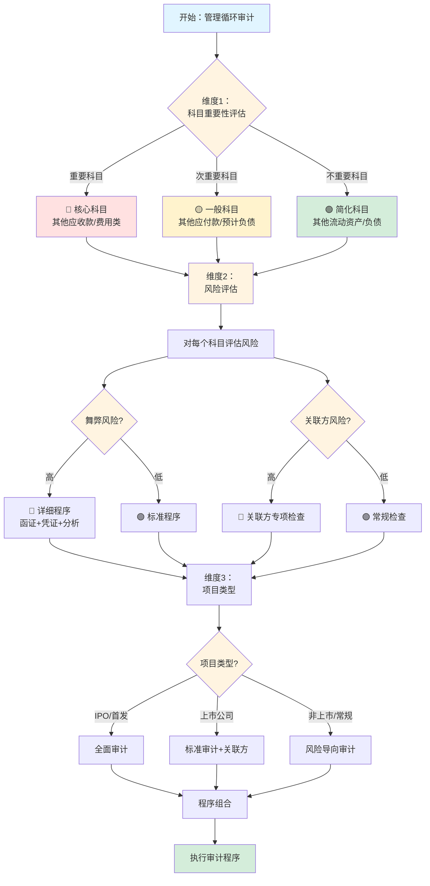

# 第二十二章 管理费用循环操作手册

> **版本**: v1.0 | **更新日期**: 2025年1月 | **适用准则**: 中国注册会计师审计准则
> 
> **📍 返回主框架**: [审计实务操作手册-框架](./审计实务操作手册-框架.md#第十七章-管理费用循环)
> 
> **🔗 本章在审计流程中的位置**: 第三部分 > 业务循环操作手册 > 第十七章

---

## 📚 手册说明

本手册详细说明管理费用循环审计的全流程操作，包括穿行测试、控制测试和实质性测试三个阶段，每个阶段提供具体的底稿填写指引和实操案例。

### 适用范围

#### 资产类科目
- **其他应收款审计** - 保证金、押金、备用金、代垫款、关联方往来
- **其他流动资产审计** - 待抵扣进项税、合同取得成本、预交税费
- **持有待售资产审计** - 拟出售的非流动资产或处置组

#### 负债类科目
- **其他应付款审计** - 保证金、押金、代收款、关联方往来
- **其他流动负债审计** - 待转销项税、短期应付债券
- **预计负债审计** - 产品质量保证、未决诉讼、弃置费用
- **持有待售负债审计** - 与持有待售资产直接相关的负债
- **递延收益审计** - 政府补助、售后租回递延收益

#### 损益类科目
- **销售费用审计** - 职工薪酬、业务招待费、广告费、运输费
- **管理费用审计** - 职工薪酬、折旧摊销、办公费、差旅费
- **其他收益审计** - 政府补助、增值税加计抵减
- **资产减值损失审计** - 各类资产减值准备计提
- **营业外收支审计** - 非流动资产处置损益、罚款、捐赠

### 底稿体系
- **B类底稿**: B23-10（旧B32）管理业务层面控制（6个子底稿）
- **C类底稿**: C11管理费用循环控制测试（6个子底稿）
- **K类底稿**: K管理循环实质性测试（89+个子底稿）
  - K0系列：函证程序（9个底稿）
  - K1系列：其他应收款（13个底稿）
  - K2系列：其他流动资产（7个底稿）
  - K3系列：其他应付款（8个底稿）
  - K4系列：其他流动负债（5个底稿）
  - K5系列：预计负债（8个底稿）
  - K6系列：持有待售资产和负债（8个底稿）
  - K7系列：递延收益（6个底稿）
  - K8系列：销售费用（9个底稿）
  - K9系列：管理费用（10个底稿）
  - K10系列：其他收益（4个底稿）
  - K11系列：资产减值损失（5个底稿）
  - K12-K13系列：营业外收支（7个底稿）

---

## 🚀 5分钟快速上手指南

> **新手必读！** 第一次审计管理循环？这里告诉你最核心的内容和最快的路径。

### 📌 三步定位你需要的内容

**步骤1：确定你的审计阶段**
```
你在哪个阶段？
├─ 刚开始项目？ → 阅读【第17.1-17.3节】了解循环特征和风险
├─ 风险评估阶段？ → 执行【第17.4-17.6节】穿行测试
├─ 控制测试阶段？ → 执行【第17.7-17.9节】控制测试（可选）
└─ 实质性测试阶段？ → 重点看【第17.10-17.19节】⭐⭐⭐
```

**步骤2：找到你的核心必做程序**
```
管理循环审计的7个核心程序（必须执行）：
✅ 1. 往来款函证 → 第17.10节 ⭐⭐⭐
✅ 2. 其他应收款分析 → 第17.11.3节 ⭐⭐⭐
✅ 3. 其他应付款分析 → 第17.13.3节 ⭐⭐⭐
✅ 4. 费用实质性分析 → 第17.18.3节 ⭐⭐⭐
✅ 5. 长期挂账检查 → 第17.11.5节/17.13.4节 ⭐⭐
✅ 6. 关联方往来检查 → K1-11/K3-6 ⭐⭐⭐
✅ 7. 政府补助审计 → 第17.17.2节 ⭐⭐

关注关联方往来！这是高风险领域
```

**步骤3：遇到问题时快速查找**
```
常见问题？ → 附录A：常见问题处理
不会填底稿？ → 每节都有"底稿示例"
需要模板？ → 附录B：Excel工具包
关联方识别？ → 第17.2.4节认定-风险-程序映射体系
```

---

### 🎯 场景化快速导航（⭐重点推荐）

> **💡 使用说明**: 这是最实用的导航！直接找到你当前遇到的场景，快速定位解决方案。

#### 📍 场景一：审计项目启动阶段

| 你的情况 | 快速跳转 | 核心内容 | 预计用时 |
|---------|---------|---------|---------|
| 🆕 **第一次审计管理循环** | [17.1节](#171-管理循环特征) → [5分钟快速上手](#🚀-5分钟快速上手指南) | 了解循环特征、风险、底稿体系 | 30分钟 |
| 📋 **制定审计计划** | [17.2节](#172-审计流程概览) | 审计流程图、底稿执行顺序 | 1小时 |
| 🎯 **确定审计策略** | [17.2.1节](#1721-审计策略) | 实质性方案vs综合性方案 | 30分钟 |
| 📊 **风险评估** | [17.2.4节](#1724-认定-风险-程序映射体系) ⭐⭐⭐ | 识别风险、设计应对程序 | 2小时 |

#### 📍 场景二：现场审计执行阶段

| 你的情况 | 快速跳转 | 核心内容 | 预计用时 |
|---------|---------|---------|---------|
| 🔍 **现场审计第一天** | [第一天行动清单](#⚡-现场审计第一天行动清单) | 资料获取、函证准备 | 立即开始 |
| 📝 **填写审定表** | [17.11.1节](#17111-审定表编制k1-1)、[17.13.1节](#17131-审定表编制k3-1) | K1-1、K3-1审定表填写 | 各20分钟 |
| 📮 **函证准备与发函** | [17.10节](#1710-函证程序) | 往来款函证流程 | 半天 |
| 🔎 **分析大额往来款** | [17.11.3节](#17113-大额及异常项目分析k1-5) | 大额其他应收款/应付款分析 | 2-3小时 |
| 📊 **费用分析程序** | [17.18.3节](#17183-实质性分析程序) | 销售费用、管理费用分析 | 2-3小时 |
| 💰 **政府补助审计** | [17.17节](#1717-递延收益审计) | 政府补助确认、摊销 | 2-3小时 |

#### 📍 场景三：遇到特殊情况

| 你的情况 | 快速跳转 | 核心内容 | 预计用时 |
|---------|---------|---------|---------|
| ⚠️ **发现大额关联方往来** | [17.11.5节](#17115-长期挂账检查k1-10) + [K1-11](#附录c底稿索引对照表) | 关联方识别、披露检查 | 重点程序 |
| 🔴 **往来款长期挂账(>1年)** | [17.11.5节](#17115-长期挂账检查k1-10) + [17.13.4节](#17134-长期挂账检查k3-5) | 长期挂账原因、坏账风险 | 2-3小时 |
| 📉 **费用异常波动(>30%)** | [17.18.3节](#17183-实质性分析程序) | 异常分析、合理性评估 | 2-3小时 |
| 💸 **政府补助金额重大** | [17.17.2节](#17172-政府补助测算k7-4) | 会计处理、摊销计算 | 3-4小时 |
| 🔄 **其他应收款转坏账** | [17.11.4节](#17114-坏账准备测试k1-8) | 坏账准备测算、合理性 | 2-3小时 |
| 🤝 **关联方无偿资金拆借** | [17.2.4节](#1724-认定-风险-程序映射体系) | 利息确认、披露要求 | 2小时 |

#### 📍 场景四：特定科目审计

| 你的情况 | 快速跳转 | 核心内容 | 预计用时 |
|---------|---------|---------|---------|
| 💰 **其他应收款审计** | [17.11节](#1711-其他应收款审计) | 审定表、函证、分析、坏账 | 半天 |
| 💸 **其他应付款审计** | [17.13节](#1713-其他应付款审计) | 审定表、函证、分析、挂账 | 半天 |
| 📊 **销售费用审计** | [17.18.1节](#17181-销售费用审计k8系列) | 费用分析、截止测试 | 2-3小时 |
| 📈 **管理费用审计** | [17.18.2节](#17182-管理费用审计k9系列) | 费用分析、归集合理性 | 2-3小时 |
| 🎁 **政府补助（递延收益）** | [17.17节](#1717-递延收益审计) | 确认条件、摊销测算 | 2-3小时 |
| ⚖️ **预计负债（诉讼）** | [17.15.3节](#17153-未决诉讼检查k5-6) | 或有事项、计提充分性 | 2-3小时 |

#### 📍 场景五：特殊项目类型

| 你的情况 | 快速跳转 | 核心内容 | 预计用时 |
|---------|---------|---------|---------|
| 🎯 **IPO项目** | 全流程加强版 | 关联方完整性、往来真实性 | 重点关注 |
| 🔄 **首次审计** | [17.3节](#173-准备工作) | 初步分析、资料清单 | 1天 |
| 🏢 **集团公司** | [17.2.4节](#1724-认定-风险-程序映射体系) | 关联方识别、内部往来 | 重点关注 |
| 💼 **上市公司** | [17.11.5节](#17115-长期挂账检查k1-10) | 往来款披露充分性 | 加强程序 |
| 🏗️ **房地产企业** | [17.12节](#1712-其他流动资产审计) | 预交税费、合同取得成本 | 2-3小时 |
| 💻 **高新技术企业** | [17.17节](#1717-递延收益审计) | 政府补助、研发费用加计 | 2-3小时 |

#### 📍 场景六：具体底稿填写

| 你的情况 | 快速跳转 | 核心内容 | 预计用时 |
|---------|---------|---------|---------|
| 📄 **K1-1其他应收款审定表** | [17.11.1节](#17111-审定表编制k1-1) | 审定表填写、勾稽关系 | 20分钟 |
| 📄 **K3-1其他应付款审定表** | [17.13.1节](#17131-审定表编制k3-1) | 审定表填写、勾稽关系 | 20分钟 |
| 📄 **K1-5大额往来分析** | [17.11.3节](#17113-大额及异常项目分析k1-5) | 大额项目逐笔分析 | 2-3小时 |
| 📄 **K1-8坏账准备测试** | [17.11.4节](#17114-坏账准备测试k1-8) | 坏账计提测算、合理性 | 1-2小时 |
| 📄 **K8-4销售费用分析** | [17.18.3节](#17183-实质性分析程序) | 费用趋势分析、异常识别 | 1-2小时 |
| 📄 **K7-4政府补助测算** | [17.17.2节](#17172-政府补助测算k7-4) | 递延收益摊销计算 | 1-2小时 |

---

### ⚡ 现场审计第一天行动清单

> **目标**: 第一天完成基础资料获取和函证发出，为后续测试打好基础

**上午（9:00-12:00）**
```
□ 获取其他应收款明细表（期末余额，按对方单位）
□ 获取其他应付款明细表（期末余额，按对方单位）
□ 获取关联方清单（完整版，包括关联自然人）
□ 获取销售费用明细账（全年，按费用项目）
□ 获取管理费用明细账（全年，按费用项目）
□ 准备往来款函证（其他应收款、其他应付款前10大）
□ 寄出函证（当天寄出！必须审计人员亲自寄）
```

**下午（14:00-17:00）**
```
□ 获取其他流动资产明细表（待抵扣进项税、合同取得成本等）
□ 获取递延收益明细表（政府补助清单、文件、拨款凭证）
□ 获取预计负债明细表（质保金、诉讼等）
□ 获取营业外收支明细账（全年）
□ 获取资产减值损失明细账（全年）
□ 获取费用报销制度、审批流程文件
□ 现场了解往来款性质（保证金、押金、备用金等）
```

**当晚整理**
```
□ 编制其他应收款审定表K1-1
□ 编制其他应付款审定表K3-1
□ 编制销售费用审定表K8-1
□ 编制管理费用审定表K9-1
□ 编制函证跟踪表K0-3
□ 识别大额往来款项（单笔>重要性水平10%）
□ 识别长期挂账项目（>1年未结清）
□ 识别关联方往来款项
□ 准备次日工作计划
```

---

### ⭐ 新手必读Top 5（按优先级）

> **💡 阅读建议**：第一次做管理循环审计的新人，建议按照下列顺序学习。

---

#### 📌 第1优先级：认定-风险-程序映射体系（第17.2.4节）⭐⭐⭐

**🎯 为什么必须先学这个？**
管理循环涉及科目多、业务杂，必须先理解"为什么做这个程序"，才能正确执行。认定-风险-程序映射体系是审计的逻辑基础，帮你理解每个底稿背后的审计目标。

**👶 第一次做时你会遇到什么？**
```
场景：项目经理让你审计其他应收款、其他应付款、管理费用

你的困惑：
❓ 为什么要函证往来款？只看账不行吗？
❓ 长期挂账的其他应收款要重点关注什么？
❓ 费用审计是不是只做分析程序就够了？
❓ 关联方往来为什么是高风险？
```

**✅ 核心映射关系（其他应收款示例）**

| 认定 | 主要风险 | 关键审计程序 | 底稿索引 | 风险等级 | 程序必要性 |
|-----|---------|------------|---------|---------|-----------|
| **存在性** | 🚨 **虚构往来**<br>• 虚构应收款隐藏资金挪用<br>• 关联方资金占用 | ✅ **往来款函证**<br>✅ **期后回款检查**<br>✅ **原始凭证核对** | K0-1<br>K1-5<br>K1-12 | 🔴 高 | ⭐⭐⭐<br>**必做**<br>重点函证 |
| **完整性** | ⚠️ **隐瞒往来**<br>• 账外资金<br>• 小金库 | ✅ **大额资金流水核查**<br>✅ **费用报销检查**<br>✅ **关联方识别** | K1-5<br>K8/K9<br>K1-11 | 🟡 中 | ⭐⭐<br>常规检查 |
| **权利义务** | 🟢 风险较低 | ✅ **合同/协议检查** | K1-12 | 🟢 低 | ⭐<br>看合同性质 |
| **计价** | ⚠️ **坏账准备不足**<br>• 账龄长不计提<br>• 关联方不计提 | ✅ **账龄分析**<br>✅ **坏账准备测算**<br>✅ **长期挂账检查** | K1-2<br>K1-8<br>K1-10 | 🟡 中 | ⭐⭐<br>重点测算 |
| **列报** | 🟢 **分类错误**<br>• 长期挂账未重分类 | ✅ **报表列报检查** | K1-12 | 🟢 低 | ⭐<br>列报复核 |

**💡 新手保命技巧**：
1. **往来款必须函证**：其他应收款、其他应付款的主要对象都要函证，不能只看账
2. **关联方是高风险**：所有关联方往来都要100%检查，IPO项目必查完整性
3. **长期挂账要追问**：超过1年未结清的往来款，必须了解原因和可收回性

**📋 配套内容**：详见第17.2.4节完整映射矩阵（4个科目：其他应收款、其他应付款、销售费用、管理费用）  
**⏱️ 学习时间**：2小时

---

#### 📌 第2优先级：往来款函证程序（第17.10节）⭐⭐⭐

**🎯 为什么必须学这个？**
函证是往来款审计的核心程序，也是识别虚构往来、资金占用的有效手段。管理循环的往来款函证与销售循环的函证同样重要！

**👶 第一次做时你会遇到什么？**
```
场景：公司其他应收款5000万，其他应付款3000万

你的困惑：
❓ 往来款函证范围怎么确定？要100%函证吗？
❓ 往来款函证和应收账款函证有什么不同？
❓ 函证不回来怎么办？能做替代程序吗？
❓ 关联方往来是否必须函证？
```

**✅ 你需要掌握的核心操作（预计学习2小时）**

**第一步：确定函证范围（30分钟）**

| 往来款类型 | 函证比例要求 | 选样标准 | 特殊考虑 |
|-----------|------------|---------|---------|
| **其他应收款** | 覆盖率≥70% | • 前10大必证<br>• 关联方必证<br>• 长期挂账必证 | IPO项目覆盖率≥80% |
| **其他应付款** | 覆盖率≥70% | • 前10大必证<br>• 关联方必证<br>• 大额保证金 | 重点关注关联方 |
| **备用金/押金** | 可抽样 | 金额重大的函证 | 小额可不函证 |

**第二步：函证执行要点（1小时）**

```
函证流程：
1. 编制函证清单（K0-2核实被函证单位信息）
2. 填写函证（格式参考K0系列模板）
3. 审计人员亲自寄出（必须！不能由被审计单位寄）
4. 跟踪催函（K0-3跟函函证过程控制）
5. 处理回函（K0-4函证差异调节）
6. 执行替代程序（不回函时，K0-5/K0-6替代程序检查表）
```

**第三步：常见问题处理（30分钟）**

| 问题 | 原因 | 解决方案 | 底稿 |
|-----|------|---------|------|
| **回函率低(<50%)** | 对方不配合 | ① 电话+邮件催函<br>② 现场催函<br>③ 执行充分的替代程序 | K0-3<br>K0-5/K0-6 |
| **回函金额不符** | 时点差异/记账差异 | 编制差异调节表，逐笔分析原因 | K0-4 |
| **关联方不回函** | 关联方消极 | ① 要求管理层协助<br>② IPO项目必须回函 | K0-3 |
| **邮件/传真回函** | 方便快捷 | 必须验证可靠性（回拨电话确认） | K0-7 |

**💡 新手保命技巧**：
1. **函证必须审计人员亲自寄出**：被审计单位代寄=函证失效
2. **关联方往来100%函证**：IPO项目对关联方往来的函证覆盖率必须100%
3. **替代程序不是万能的**：对于重要往来款（>重要性水平10%），必须拿到回函

**📋 配套底稿**：K0-1函证汇总表、K0-3跟函控制、K0-4差异调节、K0-5/K0-6替代程序  
**⏱️ 实际操作时间**：函证准备半天，等待回函2周，处理回函1天

---

#### 📌 第3优先级：大额往来款分析（第17.11.3节/17.13.3节）⭐⭐⭐

**🎯 为什么必须学这个？**
大额往来款分析是识别异常交易、关联方占用、虚构往来的关键程序。往来款的"背后故事"往往比金额本身更重要！

**👶 第一次做时你会遇到什么？**
```
场景：其他应收款明细有100多笔，总额5000万

你的困惑：
❓ 哪些往来款算"大额"？有标准吗？
❓ 大额往来款要分析什么？只看金额吗？
❓ 怎么判断往来款的合理性？
❓ 发现长期挂账（3年）的其他应收款，怎么处理？
```

**✅ 你需要掌握的核心操作（预计学习2小时）**

**第一步：识别大额往来款（30分钟）**

**大额标准**：
- 单笔金额 > 重要性水平的10%，或
- 单笔金额 > 往来款总额的5%

**示例**：
```
重要性水平 = 100万
大额其他应收款标准 = 10万（100万×10%）

或者：
其他应收款总额 = 5000万
大额标准 = 250万（5000万×5%）

取两者较低值：10万
```

**第二步：逐笔分析（1-2小时）**

**大额往来款分析要素表（K1-5/K3-4底稿）**

| 分析要素 | 检查内容 | 高风险信号 ⚠️ | 审计应对 |
|---------|---------|--------------|---------|
| **① 对方单位** | 是否关联方？<br>是否异常主体？ | • 关联方未披露<br>• 个人借款<br>• 注销/吊销公司 | 100%函证<br>披露检查 |
| **② 往来性质** | 保证金？借款？<br>代垫款？其他？ | • 性质不明<br>• 无合同/协议<br>• 用途可疑 | 要求提供合同<br>管理层解释 |
| **③ 发生时间** | 何时发生？<br>账龄多长？ | • 长期挂账(>1年)<br>• 期末突增<br>• 年末年初频繁 | 长期挂账检查<br>期后回款核查 |
| **④ 有无利息** | 是否计息？<br>利率是否公允？ | • 关联方无息借款<br>• 利率明显偏离市场 | 利息测算<br>关联交易披露 |
| **⑤ 担保抵押** | 有无担保？<br>有无抵押？ | • 无担保的大额借款<br>• 风险较高 | 检查合同条款<br>坏账准备评估 |
| **⑥ 期后结算** | 期后是否回款？<br>回款方式？ | • 期后无回款<br>• 以物抵债<br>• 转为其他应收款 | 期后回款检查<br>坏账准备计提 |

**第三步：识别异常往来（30分钟）**

**10种异常往来信号**：
1. ❌ 对方单位是关联方，但未在关联方清单中
2. ❌ 个人借款金额巨大（>100万），且非关键管理人员
3. ❌ 往来款性质不清，无合同、无协议、无审批
4. ❌ 长期挂账（>2年）无任何结算动作
5. ❌ 关联方无息借款，金额重大
6. ❌ 期末突然新增大额往来，期初为零
7. ❌ 对方单位已注销/吊销，往来款仍挂账
8. ❌ 期后无任何回款记录，但未计提坏账
9. ❌ 备用金长期未报销（>半年）
10. ❌ 保证金对应的合同已终止，但未退回

**💡 新手保命技巧**：
1. **关联方是重中之重**：所有大额关联方往来必须100%检查合理性和披露充分性
2. **长期挂账必须追问**：超过1年的往来款，必须了解原因，评估坏账风险
3. **期后回款是关键证据**：期后回款是验证往来款真实性的有力证据

**📋 配套底稿**：K1-5大额其他应收款分析、K3-4大额其他应付款分析、K1-10长期挂账检查  
**⏱️ 实际操作时间**：大额往来分析2-3小时

---

#### 📌 第4优先级：费用实质性分析程序（第17.18.3节）⭐⭐⭐

**🎯 为什么要学这个？**
费用审计通常采用分析程序为主，这是效率最高的审计方法。但分析程序不是"看看数据"那么简单，必须掌握分析的逻辑和方法。

**关键要点**：
- 费用趋势分析（同比、环比）
- 费用率分析（费用/收入）
- 费用构成分析（明细项目占比）
- 异常波动识别（>30%需调查）
- 费用合理性评估

**分析方法示例**：
```
销售费用分析：
1. 趋势分析：本年5000万 vs 上年3000万，增长67%（异常！）
2. 费用率：销售费用率 = 5000万/10亿收入 = 5%（行业平均4%，偏高）
3. 明细分析：广告费增长200%（重点检查）
4. 异常调查：了解广告费大幅增长的原因、审批、合同、发票
```

**📋 配套底稿**：K8-4销售费用分析、K9-4管理费用分析  
**⏱️ 实际操作时间**：费用分析2-3小时

---

#### 📌 第5优先级：常见问题处理（附录A）⭐⭐

**🎯 为什么要看这个？**
快速解答你90%的疑问，节省查找时间。

**6大高频问题**：
1. 关联方往来如何识别和检查（最常见）
2. 长期挂账的其他应收款如何处理（经常遇到）
3. 政府补助会计处理判断（容易搞错）
4. 费用异常波动的调查方法（实用）
5. 备用金/保证金的审计要点（基础）
6. 营业外收支的关注重点（易漏）

**⏱️ 阅读时间**：1小时

---

### 💡 常见错误提醒（新手最容易犯的）

**❌ 错误1：往来款不函证，只看账面**
- ✅ 正确：其他应收款、其他应付款必须函证，覆盖率≥70%
- 📖 详见：第17.10节

**❌ 错误2：关联方往来未100%检查**
- ✅ 正确：所有关联方往来必须逐笔检查合理性、利息、披露
- 📖 详见：第17.2.4节

**❌ 错误3：长期挂账不追问原因**
- ✅ 正确：超过1年的往来款必须了解原因，评估坏账风险
- 📖 详见：第17.11.5节、第17.13.4节

**❌ 错误4：费用分析只看总额，不看明细**
- ✅ 正确：必须分析到明细项目，识别异常波动的具体原因
- 📖 详见：第17.18.3节

**❌ 错误5：政府补助不区分收益相关和资产相关**
- ✅ 正确：必须判断性质，收益相关计入当期，资产相关分期摊销
- 📖 详见：第17.17.2节

---

## 📑 完整目录

- [17.1 管理循环特征](#171-管理循环特征)
  - [17.1.1 涉及科目](#1711-涉及科目)
  - [17.1.2 业务流程特点](#1712-业务流程特点)
  - [17.1.3 主要审计风险](#1713-主要审计风险)

- [17.2 审计流程概览](#172-审计流程概览)
  - [17.2.1 审计策略](#1721-审计策略)
  - [17.2.2 审计程序路线图](#1722-审计程序路线图)
  - [17.2.3 工作底稿体系](#1723-工作底稿体系)
  - [17.2.4 认定-风险-程序映射体系](#1724-认定-风险-程序映射体系) ⭐⭐⭐

- [17.3 准备工作](#173-准备工作)
  - [17.3.1 资料清单](#1731-资料清单)
  - [17.3.2 初步分析程序](#1732-初步分析程序)
  - [17.3.3 重要性水平运用](#1733-重要性水平运用)

- [17.4 流程了解与控制识别](#174-流程了解与控制识别)
  - [17.4.1 流程了解方法](#1741-流程了解方法)
  - [17.4.2 关键控制点识别](#1742-关键控制点识别)
  - [17.4.3 流程图绘制（B23-10-2）](#1743-流程图绘制b23-10-2)

- [17.5 控制矩阵编制](#175-控制矩阵编制)
  - [17.5.1 认定层次风险分析](#1751-认定层次风险分析)
  - [17.5.2 关键控制匹配（B23-10-3）](#1752-关键控制匹配b23-10-3)
  - [17.5.3 控制设计有效性评估](#1753-控制设计有效性评估)

- [17.6 穿行测试执行](#176-穿行测试执行)
  - [17.6.1 样本选择](#1761-样本选择)
  - [17.6.2 测试步骤（B23-10-4）](#1762-测试步骤b23-10-4)
  - [17.6.3 偏差记录与评价](#1763-偏差记录与评价)

- [17.7 控制测试设计](#177-控制测试设计)
  - [17.7.1 测试范围确定](#1771-测试范围确定)
  - [17.7.2 样本量计算（C11程序表）](#1772-样本量计算c11程序表)
  - [17.7.3 测试时间安排](#1773-测试时间安排)

- [17.8 控制测试执行](#178-控制测试执行)
  - [17.8.1 其他应收款控制测试](#1781-其他应收款控制测试)
  - [17.8.2 费用支出控制测试](#1782-费用支出控制测试)
  - [17.8.3 其他应付款控制测试](#1783-其他应付款控制测试)

- [17.9 控制测试评价](#179-控制测试评价)
  - [17.9.1 偏差率计算](#1791-偏差率计算)
  - [17.9.2 控制有效性结论（B23-10-6）](#1792-控制有效性结论b23-10-6)
  - [17.9.3 对实质性程序的影响](#1793-对实质性程序的影响)

- [17.10 函证程序](#1710-函证程序)
  - [17.10.1 函证计划制定（K0A）](#17101-函证计划制定k0a)
  - [17.10.2 其他应收款函证](#17102-其他应收款函证)
  - [17.10.3 其他应付款函证](#17103-其他应付款函证)
  - [17.10.4 差异调节与替代程序](#17104-差异调节与替代程序)

- [17.11 其他应收款审计](#1711-其他应收款审计)
  - [17.11.1 审定表编制（K1-1）](#17111-审定表编制k1-1)
  - [17.11.2 明细表核对（K1-2）](#17112-明细表核对k1-2)
  - [17.11.3 大额及异常项目分析（K1-5）](#17113-大额及异常项目分析k1-5)
  - [17.11.4 坏账准备测试（K1-8）](#17114-坏账准备测试k1-8)
  - [17.11.5 长期挂账检查（K1-10）](#17115-长期挂账检查k1-10)

- [17.12 其他流动资产审计](#1712-其他流动资产审计)
  - [17.12.1 审定表编制（K2-1）](#17121-审定表编制k2-1)
  - [17.12.2 合同取得成本测试（K2-4）](#17122-合同取得成本测试k2-4)
  - [17.12.3 摊销测算（K2-5）](#17123-摊销测算k2-5)

- [17.13 其他应付款审计](#1713-其他应付款审计)
  - [17.13.1 审定表编制（K3-1）](#17131-审定表编制k3-1)
  - [17.13.2 明细表核对（K3-2）](#17132-明细表核对k3-2)
  - [17.13.3 大额项目分析（K3-4）](#17133-大额项目分析k3-4)
  - [17.13.4 长期挂账检查（K3-5）](#17134-长期挂账检查k3-5)

- [17.14 其他流动负债审计](#1714-其他流动负债审计)
  - [17.14.1 审定表编制（K4-1）](#17141-审定表编制k4-1)
  - [17.14.2 明细表核对（K4-2）](#17142-明细表核对k4-2)
  - [17.14.3 待转销项税额测试](#17143-待转销项税额测试)

- [17.15 预计负债审计](#1715-预计负债审计)
  - [17.15.1 审定表编制（K5-1）](#17151-审定表编制k5-1)
  - [17.15.2 产品质量保修测试（K5-4）](#17152-产品质量保修测试k5-4)
  - [17.15.3 未决诉讼检查（K5-6）](#17153-未决诉讼检查k5-6)
  - [17.15.4 弃置费用测试（K5-5）](#17154-弃置费用测试k5-5)

- [17.16 持有待售资产和负债审计](#1716-持有待售资产和负债审计)
  - [17.16.1 审定表编制（K6-1）](#17161-审定表编制k6-1)
  - [17.16.2 初始确认检查（K6-4）](#17162-初始确认检查k6-4)
  - [17.16.3 减值准备测试（K6-5）](#17163-减值准备测试k6-5)

- [17.17 递延收益审计](#1717-递延收益审计)
  - [17.17.1 审定表编制（K7-1）](#17171-审定表编制k7-1)
  - [17.17.2 政府补助测算（K7-4）](#17172-政府补助测算k7-4)
  - [17.17.3 收益分摊检查](#17173-收益分摊检查)

- [17.18 费用审计](#1718-费用审计)
  - [17.18.1 销售费用审计（K8系列）](#17181-销售费用审计k8系列)
  - [17.18.2 管理费用审计（K9系列）](#17182-管理费用审计k9系列)
  - [17.18.3 实质性分析程序](#17183-实质性分析程序)
  - [17.18.4 截止性测试](#17184-截止性测试)

- [17.19 其他损益科目审计](#1719-其他损益科目审计)
  - [17.19.1 其他收益审计（K10系列）](#17191-其他收益审计k10系列)
  - [17.19.2 资产减值损失审计（K11系列）](#17192-资产减值损失审计k11系列)
  - [17.19.3 营业外收支审计（K12-K13系列）](#17193-营业外收支审计k12-k13系列)

- [17.20 完工总结](#1720-完工总结)
  - [17.20.1 底稿复核清单](#17201-底稿复核清单)
  - [17.20.2 审计发现汇总](#17202-审计发现汇总)
  - [17.20.3 管理建议书要点](#17203-管理建议书要点)

- [附录A：管理循环常见问题处理](#附录a管理循环常见问题处理)
- [附录B：Excel工具包使用说明](#附录bexcel工具包使用说明)
- [附录C：底稿索引对照表](#附录c底稿索引对照表)
- [附录D：审计案例精选](#附录d审计案例精选)

---

**说明**: 本手册各章节内容详见对应的独立文档文件。


## 22.1 管理循环特征

### 22.1.1 涉及科目

#### 资产类科目
- **其他应收款**: 保证金、押金、备用金、代垫款、关联方往来等
- **其他流动资产**: 待抵扣进项税、合同取得成本、预交税费等
- **持有待售资产**: 拟出售的非流动资产或处置组

#### 负债类科目
- **其他应付款**: 保证金、押金、代收款、关联方往来等
- **其他流动负债**: 待转销项税、短期应付债券等
- **预计负债**: 产品质量保证、未决诉讼、弃置费用等
- **持有待售负债**: 与持有待售资产直接相关的负债
- **递延收益**: 政府补助、售后租回等

#### 损益类科目
- **销售费用**: 职工薪酬、业务招待费、广告费、运输费等
- **管理费用**: 职工薪酬、折旧摊销、办公费、差旅费等
- **其他收益**: 政府补助、增值税加计抵减等
- **资产减值损失**: 各类资产减值准备计提
- **营业外收入**: 非流动资产处置利得、罚款收入等
- **营业外支出**: 非流动资产处置损失、罚款支出、捐赠支出等

#### 底稿体系详细说明

**K0系列 - 管理循环函证程序（9个底稿）**
- K0A: 函证程序表
- K0-1: 函证结果汇总表
- K0-2: 核实被函证单位信息
- K0-3: 跟函函证过程控制
- K0-4: 函证差异调节表
- K0-5: 其他应收款替代程序检查表
- K0-6: 其他应付款替代程序检查表
- K0-7: 邮件传真回函可靠性验证
- K0-8: 函证程序舞弊风险评价表

**K1系列 - 其他应收款（13个底稿）**
- K1A: 其他应收款实质性程序表
- K1-1: 其他应收款审定表
- K1-2: 明细表
- K1-3: 坏账准备明细表
- K1-4: 调整分录汇总
- K1-5: 大额其他应收款情况分析表
- K1-6: 信用减值损失会计政策检查
- K1-7: 三阶段划分检查表
- K1-8: 坏账准备测算
- K1-9: 坏账准备转回（收回）、核销检查表
- K1-10: 长期未收回款项检查表
- K1-11: 关联方及交易检查表
- K1-12: 其他应收款检查表

**K2系列 - 其他流动资产（7个底稿）**
- K2A: 其他流动资产实质性程序表
- K2-1: 其他流动资产审定表
- K2-2: 明细表
- K2-3: 调整分录汇总
- K2-4: 合同取得成本明细表
- K2-5: 摊销测算表
- K2-6: 其他流动资产检查表

**K3系列 - 其他应付款（8个底稿）**
- K3A: 其他应付款实质性程序表
- K3-1: 其他应付款审定表
- K3-2: 明细表
- K3-3: 调整分录汇总
- K3-4: 大额其他应付款情况分析表
- K3-5: 长期挂账检查表
- K3-6: 关联方及交易检查表
- K3-7: 其他应付款检查表

**K4系列 - 其他流动负债（5个底稿）**
- K4A: 其他流动负债实质性程序表
- K4-1: 其他流动负债审定表
- K4-2: 明细表
- K4-3: 调整分录汇总
- K4-4: 其他流动负债检查表

**K5系列 - 预计负债（8个底稿）**
- K5A: 预计负债实质性程序表
- K5-1: 预计负债审定表
- K5-2: 明细表
- K5-3: 调整分录汇总
- K5-4: 产品质量保修检查表
- K5-5: 弃置费用检查表
- K5-6: 未决诉讼检查表
- K5-7: 预计负债检查表

**K6系列 - 持有待售资产和负债（8个底稿）**
- K6A: 持有待售资产和负债实质性程序表
- K6-1: 持有待售资产和负债审定表
- K6-2: 明细表
- K6-3: 调整分录汇总
- K6-4: 初始确认检查表
- K6-5: 减值准备测试表（后续计量）
- K6-6: 处置组减值测试表（后续计量）
- K6-7: 检查表（不再满足持有待售）

**K7系列 - 递延收益（6个底稿）**
- K7A: 递延收益实质性程序表
- K7-1: 递延收益审定表
- K7-2: 明细表
- K7-3: 调整分录汇总
- K7-4: 测算表
- K7-5: 递延收益检查表

**K8系列 - 销售费用（9个底稿）**
- K8A: 销售费用实质性程序表
- K8-1: 销售费用审定表
- K8-2: 明细表
- K8-3: 调整分录汇总
- K8-4: 实质性分析
- K8-5: 合同检查表
- K8-6: 截止性测试（从记账凭证至原始凭证）
- K8-7: 截止性测试（从原始凭证至记账凭证）
- K8-8: 销售费用检查表

**K9系列 - 管理费用（9个底稿）**
- K9A: 管理费用实质性程序表
- K9-1: 管理费用审定表
- K9-2: 明细表
- K9-3: 调整分录汇总
- K9-4: 实质性分析
- K9-5: 合同检查表
- K9-6: 截止性测试（从记账凭证至原始凭证）
- K9-7: 截止性测试（从原始凭证至记账凭证）
- K9-8: 管理费用检查表

**K10系列 - 其他收益（7个底稿）**
- K10A: 其他收益实质性程序表
- K10-1: 其他收益审定表
- K10-2: 明细表
- K10-3: 调整分录汇总
- K10-4: 政府补助核对表
- K10-5: 应收政府补助检查表
- K10-6: 其他收益检查表

**K11系列 - 资产减值损失（4个底稿）**
- K11A: 资产减值损失实质性程序表
- K11-1: 资产减值损失审定表
- K11-2: 明细表
- K11-3: 调整分录汇总

**K12系列 - 营业外收入（5个底稿）**
- K12A: 营业外收入实质性程序表
- K12-1: 营业外收入审定表
- K12-2: 明细表
- K12-3: 调整分录汇总
- K12-4: 营业外收入检查表

**K13系列 - 营业外支出（5个底稿）**
- K13A: 营业外支出实质性程序表
- K13-1: 营业外支出审定表
- K13-2: 明细表
- K13-3: 调整分录汇总
- K13-4: 营业外支出检查表

---

### 22.1.2 业务流程特点

#### 1. 业务多样性
- **科目杂**: 涉及10余个一级科目，30多个二级科目
- **业务散**: 业务来源广泛，单笔金额通常较小
- **类型多**: 既有资产负债项目，又有损益项目
- **关联强**: 与其他循环存在大量交叉

#### 2. 控制复杂性
- **分散管理**: 不同科目由不同部门管理
- **审批层级**: 根据金额和性质设置多级审批
- **凭证来源**: 原始凭证类型多样，真实性难以核实
- **会计处理**: 科目选择和分类存在较大判断空间

#### 3. 审计关注点
- **实质性程序为主**: 通常采用实质性方案
- **重点抽查**: 关注大额、异常、关联方项目
- **分析程序**: 费用科目适用实质性分析程序
- **函证重要性**: 其他应收款和其他应付款需重点函证

---

### 22.1.3 主要审计风险

#### 高风险领域

**1. 其他应收款**
- **舞弊风险**:
  - 虚构交易套取资金
  - 关联方资金占用
  - 通过往来科目调节利润
- **错报风险**:
  - 坏账准备计提不充分
  - 长期挂账未清理
  - 科目分类不准确

**2. 费用类科目**
- **舞弊风险**:
  - 虚开发票列支费用
  - 个人费用公司承担
  - 期间费用资本化
- **错报风险**:
  - 费用跨期
  - 费用分类错误
  - 费用归集不准确

**3. 预计负债**
- **估计不确定性**:
  - 未决诉讼结果难以预测
  - 产品质量保证金额难以估计
  - 弃置费用折现率选择
- **确认判断**:
  - 义务是否形成
  - 经济利益流出是否很可能
  - 金额能否可靠计量

#### 中等风险领域

**4. 其他应付款**
- **完整性风险**: 期末负债低估
- **关联方风险**: 资金拆借、担保等
- **长期挂账风险**: 可能涉及债务重组、债务豁免

**5. 递延收益**
- **政府补助**: 与资产相关/与收益相关的划分
- **分摊准确性**: 分摊期间、分摊方法
- **列报分类**: 其他收益vs营业外收入

**6. 营业外收支**
- **完整性**: 非经常性损益可能漏记
- **分类准确性**: 与其他损益科目的界限
- **重大异常交易**: 可能涉及关联方或舞弊

#### 低风险领域

**7. 其他流动资产/负债**
- 主要为税务相关项目
- 风险相对较低
- 重点核对数据准确性

---

### 底稿体系

- **B类底稿**: B23-10管理业务层面控制（6个子底稿）
- **C类底稿**: C11管理循环控制测试（3个子底稿）
- **K类底稿**: K管理循环实质性测试（共103个底稿）

#### 底稿数量统计表

| 系列 | 科目名称 | 底稿数量 | 复杂度 | 风险等级 | 主要特点 |
|------|----------|----------|--------|----------|----------|
| K0 | 管理循环函证 | 9个 | 🟢 基础 | 🟡 中风险 | 函证程序最核心 |
| K1 | 其他应收款 | 13个 | 🟡 中等 | 🟡 中风险 | 坏账准备最复杂 |
| K2 | 其他流动资产 | 7个 | 🟡 中等 | 🟢 低风险 | 合同取得成本最复杂 |
| K3 | 其他应付款 | 8个 | 🟡 中等 | 🟢 低风险 | 长期挂账最复杂 |
| K4 | 其他流动负债 | 5个 | 🟡 中等 | 🟢 低风险 | 流动负债最复杂 |
| K5 | 预计负债 | 8个 | 🟡 中等 | 🟡 中风险 | 预计负债最复杂 |
| K6 | 持有待售资产和负债 | 8个 | 🟡 中等 | 🟡 中风险 | 持有待售最复杂 |
| K7 | 递延收益 | 6个 | 🟡 中等 | 🟢 低风险 | 递延收益最复杂 |
| K8 | 销售费用 | 9个 | 🟡 中等 | 🟢 低风险 | 销售费用最复杂 |
| K9 | 管理费用 | 9个 | 🟡 中等 | 🟢 低风险 | 管理费用最复杂 |
| K10 | 其他收益 | 7个 | 🟡 中等 | 🟢 低风险 | 政府补助最复杂 |
| K11 | 资产减值损失 | 4个 | 🟡 中等 | 🟡 中风险 | 减值测试最复杂 |
| K12 | 营业外收入 | 5个 | 🟡 中等 | 🟢 低风险 | 营业外收入最复杂 |
| K13 | 营业外支出 | 5个 | 🟡 中等 | 🟢 低风险 | 营业外支出最复杂 |
| **合计** | **管理循环** | **103个** | | | **完整覆盖所有科目** |

#### 底稿分类说明

**按风险等级分类**:
- 🔴 **高风险**: 无（管理循环整体风险相对较低）
- 🟡 **中风险**: K0、K1、K5、K6、K11系列（共42个底稿）
- 🟢 **低风险**: K2、K3、K4、K7、K8、K9、K10、K12、K13系列（共61个底稿）

**按复杂度分类**:
- 🟢 **基础程序**: K0系列（9个底稿）
- 🟡 **中等程序**: K1-K13系列（94个底稿）
- 🔴 **复杂程序**: 无（管理循环程序相对标准化）

**按审计程序分类**:
- 📋 **函证程序**: K0系列（9个底稿）
- 📊 **常规程序**: K1-K13系列（94个底稿）
- ⚠️ **舞弊风险应对**: 已融入各系列底稿中

---

### 📚 手册说明

#### 适用范围
- 适用于所有年度审计项目
- 适用于管理循环相关科目的审计
- 可根据实际情况调整和补充

#### 使用建议
1. **审计策略**: 优先考虑实质性方案
2. **程序组合**: 将函证、检查、分析程序有机结合
3. **重点关注**: 关联方交易、大额异常项目、长期挂账
4. **职业判断**: 费用资本化、预计负债确认等需要职业判断
5. **底稿交叉引用**: 注意与其他循环底稿的交叉引用

#### 更新记录
| 版本 | 日期 | 更新内容 | 更新人 |
|------|------|---------|--------|
| v1.0 | 2025-01 | 初始版本发布 | 审计部 |

---

**索引号**: 第17章-01  
**编制人**: [编制人]  
**编制日期**: [日期]  
**复核人**: [复核人]  
**复核日期**: [日期]


## 22.2 审计流程概览

### 22.2.1 审计策略

#### 策略选择原则

**实质性方案（推荐）**
- **适用情况**:
  - 科目分散、业务多样
  - 控制环境一般或较弱
  - 单笔金额较小、交易频繁
  - 自动化控制较少
- **优势**:
  - 程序简单直接
  - 效率较高
  - 不依赖控制测试
- **劣势**:
  - 抽样量可能较大
  - 对异常项目的敏感度依赖分析程序

**综合性方案**
- **适用情况**:
  - 控制环境良好
  - 存在有效的自动化控制
  - 交易量大但规律性强
  - 重要性水平较低
- **优势**:
  - 降低检查风险
  - 减少实质性程序工作量
  - 增强审计结论的可靠性
- **劣势**:
  - 需要执行控制测试
  - 程序相对复杂

---

### 22.2.2 审计程序路线图

#### 阶段一：计划与准备（1-2天）

```
准备工作
├─ 获取资料清单
│  ├─ 财务报表和科目余额表
│  ├─ 明细账和记账凭证
│  ├─ 合同、协议、审批文件
│  └─ 上期审计底稿和管理建议书
├─ 初步分析程序
│  ├─ 科目余额波动分析
│  ├─ 费用率趋势分析
│  ├─ 异常项目识别
│  └─ 关联方交易识别
└─ 重要性水平运用
   ├─ 实际执行重要性分配
   ├─ 明显微小错报临界值确定
   └─ 抽样金额标准设定
```

**时间**: 1-2个工作日  
**产出**: 审计计划、资料清单、初步分析表

---

#### 阶段二：风险评估（2-3天）

```
风险评估程序
├─ 流程了解（B23-10-1）
│  ├─ 访谈相关部门
│  ├─ 观察业务流程
│  ├─ 检查政策制度
│  └─ 绘制流程图（B23-10-2）
├─ 控制识别与评价
│  ├─ 识别关键控制点
│  ├─ 编制控制矩阵（B23-10-3）
│  ├─ 穿行测试（B23-10-4）
│  └─ 控制设计评价
└─ 风险评估结论
   ├─ 认定层次风险评估
   ├─ 确定审计策略
   └─ 设计进一步审计程序
```

**时间**: 2-3个工作日  
**产出**: B23-10系列底稿、风险评估工作底稿

---

#### 阶段三：控制测试（如采用综合性方案，3-4天）

```
控制测试
├─ 测试计划（C11程序表）
│  ├─ 确定测试范围
│  ├─ 计算样本量
│  └─ 制定测试时间表
├─ 执行控制测试
│  ├─ 其他应收款控制测试
│  ├─ 费用支出控制测试
│  └─ 其他应付款控制测试
└─ 控制测试评价
   ├─ 偏差率计算
   ├─ 控制有效性结论（B23-10-6）
   └─ 调整实质性程序
```

**时间**: 3-4个工作日（如采用综合性方案）  
**产出**: C11系列底稿

---

#### 阶段四：实质性程序（8-12天）

```
实质性程序
├─ 函证程序（2-3天）
│  ├─ 函证计划制定（K0A）
│  ├─ 其他应收款函证
│  ├─ 其他应付款函证
│  └─ 差异调节与替代程序
│
├─ 资产类科目测试（2-3天）
│  ├─ 其他应收款审计（K1系列）
│  │  ├─ 审定表编制
│  │  ├─ 明细表核对
│  │  ├─ 坏账准备测试
│  │  └─ 长期挂账检查
│  ├─ 其他流动资产审计（K2系列）
│  └─ 持有待售资产审计（K6系列）
│
├─ 负债类科目测试（2-3天）
│  ├─ 其他应付款审计（K3系列）
│  ├─ 其他流动负债审计（K4系列）
│  ├─ 预计负债审计（K5系列）
│  ├─ 持有待售负债审计（K6系列）
│  └─ 递延收益审计（K7系列）
│
└─ 损益类科目测试（2-3天）
   ├─ 销售费用审计（K8系列）
   ├─ 管理费用审计（K9系列）
   ├─ 其他收益审计（K10系列）
   ├─ 资产减值损失审计（K11系列）
   └─ 营业外收支审计（K12-K13系列）
```

**时间**: 8-12个工作日  
**产出**: K系列底稿

---

#### 阶段五：完工与总结（1天）

```
完工总结
├─ 底稿复核
│  ├─ 完整性检查
│  ├─ 一致性检查
│  ├─ 交叉引用检查
│  └─ 结论合理性检查
├─ 审计发现汇总
│  ├─ 调整分录汇总
│  ├─ 重分类分录汇总
│  ├─ 未调整错报汇总
│  └─ 审计差异说明
└─ 管理建议书
   ├─ 内控缺陷总结
   ├─ 改进建议提出
   └─ 后续跟踪安排
```

**时间**: 1个工作日  
**产出**: 审计总结报告、管理建议书

---

### 22.2.3 工作底稿体系

#### 底稿层级结构

```
管理循环工作底稿
│
├─ 【B类】业务层面控制（6个底稿）
│  ├─ B23-10-1 控制程序表
│  ├─ B23-10-2 流程图及描述
│  ├─ B23-10-3 控制矩阵
│  ├─ B23-10-4 穿行测试
│  ├─ B23-10-5 测试汇总表
│  └─ B23-10-6 评价报告
│
├─ 【C类】控制测试（3个底稿）
│  ├─ C11程序表
│  ├─ C11测试记录
│  └─ C11测试结论
│
└─ 【K类】实质性测试（80+个底稿）
   │
   ├─ K0 函证程序（9个底稿）
   │  ├─ K0A 函证程序表
   │  ├─ K0-1 函证结果汇总表
   │  ├─ K0-2 核实被函证单位信息
   │  ├─ K0-3 跟函函证过程控制
   │  ├─ K0-4 函证差异调节表
   │  ├─ K0-5 其他应收款替代程序
   │  ├─ K0-6 其他应付款替代程序
   │  ├─ K0-7 邮件传真回函验证
   │  └─ K0-8 函证程序舞弊风险评价
   │
   ├─ K1 其他应收款（13个底稿）
   │  ├─ K1A 实质性程序表
   │  ├─ K1-1 审定表
   │  ├─ K1-2 明细表
   │  ├─ K1-3 坏账准备明细表
   │  ├─ K1-4 调整分录汇总
   │  ├─ K1-5 大额项目分析表
   │  ├─ K1-6 信用减值政策检查
   │  ├─ K1-7 三阶段划分检查
   │  ├─ K1-8 坏账准备测算
   │  ├─ K1-9 坏账准备核销检查
   │  ├─ K1-10 长期未收回检查
   │  ├─ K1-11 关联方检查表
   │  └─ K1-12 检查表
   │
   ├─ K2 其他流动资产（7个底稿）
   ├─ K3 其他应付款（8个底稿）
   ├─ K4 其他流动负债（5个底稿）
   ├─ K5 预计负债（8个底稿）
   ├─ K6 持有待售资产和负债（8个底稿）
   ├─ K7 递延收益（6个底稿）
   ├─ K8 销售费用（9个底稿）
   ├─ K9 管理费用（9个底稿）
   ├─ K10 其他收益（7个底稿）
   ├─ K11 资产减值损失（4个底稿）
   ├─ K12 营业外收入（5个底稿）
   └─ K13 营业外支出（5个底稿）
```

---

#### 底稿编制顺序建议

**第一批**: 基础性底稿
1. B23-10-1、B23-10-2（流程了解）
2. K1-1、K3-1（审定表）
3. K8-1、K9-1（费用审定表）

**第二批**: 风险评估底稿
4. B23-10-3（控制矩阵）
5. B23-10-4（穿行测试）
6. K0A（函证计划）

**第三批**: 测试性底稿
7. C11系列（如需控制测试）
8. K0系列（函证程序）
9. K1-K13各系列明细测试底稿

**第四批**: 总结性底稿
10. B23-10-5、B23-10-6（控制评价）
11. 各系列调整分录汇总
12. 审计总结和管理建议书

---

### 关键里程碑

| 里程碑 | 时间节点 | 产出 | 检查要点 |
|--------|---------|------|----------|
| 准备完成 | D+2 | 资料清单、初步分析 | 资料是否齐全 |
| 风险评估完成 | D+5 | B23-10系列 | 审计策略是否明确 |
| 控制测试完成 | D+9 | C11系列 | 控制是否有效 |
| 函证完成 | D+12 | K0系列 | 回函率是否充分 |
| 实质性程序完成 | D+20 | K1-K13系列 | 审计证据是否充分 |
| 项目完工 | D+21 | 审计总结 | 底稿是否完整 |

**说明**: D表示开始日期，D+数字表示第几个工作日

---

### 人员配置建议

#### 小型项目（1-2人）
- **项目经理**: 1人（复核全部底稿）
- **审计员**: 1人（执行全部程序）
- **工作日**: 10-12天

#### 中型项目（2-3人）
- **项目经理**: 1人（复核、疑难问题处理）
- **资深审计员**: 1人（风险评估、函证、复杂科目）
- **审计员**: 1人（常规科目测试）
- **工作日**: 8-10天

#### 大型项目（3-4人）
- **项目经理**: 1人（整体把控、复核）
- **资深审计员**: 1人（风险评估、控制测试）
- **审计员**: 2人（实质性程序分工执行）
- **工作日**: 6-8天

---

**索引号**: 第17章-02  
**编制人**: [编制人]  
**编制日期**: [日期]  
**复核人**: [复核人]  
**复核日期**: [日期]

---

## 22.2.4 认定-风险-程序映射体系（⭐⭐⭐核心框架）

> **💡 本节位置**：17.2 审计流程概览 > 17.2.4 认定-风险-程序映射体系
> 
> **💡 为什么需要这个体系？**  
> 管理循环涉及科目众多、业务分散，很多审计人员不清楚"哪些程序必须做、哪些可以简化"。本章节建立**认定→风险→程序**的清晰映射关系，帮助您：
> 1. **理解逻辑**：明白每个程序针对什么风险、验证哪个认定
> 2. **裁剪程序**：根据科目重要性和项目特点合理裁剪程序
> 3. **应对变化**：遇到新情况时，能够独立判断应该做什么程序

---

### 📊 管理循环认定-风险-程序总览矩阵

#### 矩阵说明
- **横轴**：财务报表认定（5大类）
- **纵轴**：核心科目（4大类）
- **单元格内容**：主要风险 → 关键程序 → 风险等级

---

#### 表1：其他应收款的认定-风险-程序矩阵

| 认定 | 主要风险 | 关键审计程序 | 底稿索引 | 风险等级 | 程序必要性 |
|-----|---------|------------|---------|---------|-----------|
| **存在性<br>Existence** | ⚠️ **虚构应收款**<br>• 虚构交易套取资金<br>• 员工舞弊 | ✅ **函证程序**<br>✅ **原始凭证检查**<br>✅ **期后回款检查** | K0-1<br>K1-5<br>K1-12 | 🟡 中 | ⭐⭐⭐<br>**重点函证**<br>大额必须函证 |
| **完整性<br>Completeness** | 🟢 风险低（低估资产） | ✅ 分析复核 | K1-12 | 🟢 低 | ⭐<br>简单分析即可 |
| **权利义务<br>Rights** | 🚨 **关联方资金占用**<br>• 大股东占用<br>• 实际控制人占用<br>• 其他关联方占用 | ✅ **关联方识别与核对**（⭐核心）<br>✅ **资金流向追踪**<br>✅ **利息计算检查**<br>✅ **期后回款情况** | K1-11<br>K1-5<br>K1-12<br>K1-12 | 🔴 极高<br>（IPO） | ⭐⭐⭐<br>**必做**<br>IPO/上市公司必查 |
| **计价与分摊<br>Valuation** | 🚨 **坏账准备计提不足**<br>• 信用风险评估不准<br>• 预期信用损失低估<br>• 长期挂账不计提 | ✅ **坏账准备政策检查**（⭐核心）<br>✅ **三阶段划分检查**<br>✅ **预期信用损失测算**<br>✅ **长期挂账专项检查** | K1-6<br>K1-7<br>K1-8<br>K1-10 | 🔴 高 | ⭐⭐⭐<br>**必做**<br>必须重新测算 |
| **列报与披露<br>Presentation** | ⚠️ **关联方未披露**<br>• 性质披露不完整 | ✅ 附注披露检查<br>✅ 关联方披露核对 | 报表附注<br>K1-11 | 🟡 中 | ⭐⭐⭐<br>有关联方必做 |

---

#### 表2：其他应付款的认定-风险-程序矩阵

| 认定 | 主要风险 | 关键审计程序 | 底稿索引 | 风险等级 | 程序必要性 |
|-----|---------|------------|---------|---------|-----------|
| **完整性** | 🚨 **未入账负债**<br>• 押金保证金未入账<br>• 应付未付款项遗漏 | ✅ **函证程序**<br>✅ **期后付款检查**<br>✅ **大额款项追查** | K0-1<br>K3-7<br>K3-4 | 🔴 高 | ⭐⭐⭐<br>**必做**<br>重点函证 |
| **存在性** | 🟢 风险低（虚增负债） | ✅ 函证+凭证检查 | K0-1, K3-7 | 🟢 低 | ⭐⭐<br>常规程序 |
| **权利义务** | ⚠️ **关联方往来**<br>• 资金拆借<br>• 隐性借款 | ✅ **关联方识别**<br>✅ **利息检查**<br>✅ **资金性质判断** | K3-6<br>K3-7<br>K3-7 | 🟡 中 | ⭐⭐⭐<br>有关联方必做 |
| **计价** | ⚠️ **长期挂账**<br>• 应转销未转销<br>• 债务重组未处理 | ✅ **长期挂账检查**<br>✅ **账龄分析**<br>✅ **期后处理检查** | K3-5<br>K3-2<br>K3-7 | 🟡 中 | ⭐⭐<br>抽查即可 |
| **列报与披露** | ⚠️ **关联方未披露** | ✅ 附注披露检查 | 报表附注 | 🟡 中 | ⭐⭐⭐<br>有关联方必做 |

---

#### 表3：销售费用/管理费用的认定-风险-程序矩阵

| 认定 | 主要风险 | 关键审计程序 | 底稿索引 | 风险等级 | 程序必要性 |
|-----|---------|------------|---------|---------|-----------|
| **发生性<br>Occurrence** | 🚨 **虚列费用**<br>• 虚开发票<br>• 个人费用公司承担<br>• 虚构业务招待费 | ✅ **凭证检查**（⭐核心）<br>✅ **合同核对**<br>✅ **真实性验证**<br>✅ **业务招待费专项检查** | K8-5, K9-5<br>K8-5, K9-5<br>K8-8, K9-8<br>K9-8 | 🔴 高 | ⭐⭐⭐<br>**必做**<br>抽查大额费用 |
| **完整性** | ⚠️ **费用漏记**<br>• 跨期费用 | ✅ **截止性测试**（双向）<br>✅ **期后凭证检查** | K8-6, K8-7<br>K9-6, K9-7 | 🟡 中 | ⭐⭐⭐<br>**必做**<br>截止性测试 |
| **计价** | ⚠️ **费用资本化**<br>• 研发费用不当资本化<br>• 装修费用不当资本化 | ✅ **资本化政策检查**<br>✅ **大额费用分析**<br>✅ **科目归集检查** | K9-8<br>K9-4<br>K9-8 | 🟡 中 | ⭐⭐⭐<br>有研发必做 |
| **分类** | ⚠️ **费用科目分类错误**<br>• 销售费用与管理费用混淆<br>• 营业外支出计入期间费用 | ✅ **科目分类检查**<br>✅ **实质性分析程序** | K8-8, K9-8<br>K8-4, K9-4 | 🟢 低 | ⭐⭐<br>分析复核 |
| **截止性** | 🚨 **跨期费用**<br>• 调节利润 | ✅ **截止性测试**（⭐核心）<br>✅ **资产负债表日前后10笔检查** | K8-6, K8-7<br>K9-6, K9-7 | 🔴 高 | ⭐⭐⭐<br>**必做**<br>双向测试 |

---

#### 表4：预计负债的认定-风险-程序矩阵

| 认定 | 主要风险 | 关键审计程序 | 底稿索引 | 风险等级 | 程序必要性 |
|-----|---------|------------|---------|---------|-----------|
| **完整性** | 🚨 **应确认未确认**<br>• 未决诉讼未确认<br>• 产品质保未计提<br>• 弃置费用未确认 | ✅ **律师函确认**（⭐核心）<br>✅ **质保政策检查**<br>✅ **弃置义务识别**<br>✅ **或有事项检查** | K5-6<br>K5-4<br>K5-5<br>K5-7 | 🔴 高 | ⭐⭐⭐<br>**必做**<br>律师函必须 |
| **计价** | 🚨 **估计不准确**<br>• 损失金额估计偏差<br>• 折现率选择不当<br>• 未考虑所有因素 | ✅ **专家意见获取**<br>✅ **测算模型检查**<br>✅ **折现率复核**<br>✅ **敏感性分析** | K5-4, K5-5, K5-6<br>K5-7<br>K5-5<br>K5-7 | 🔴 高 | ⭐⭐⭐<br>**必做**<br>复核估计基础 |
| **列报与披露** | ⚠️ **披露不充分**<br>• 不确定性未披露<br>• 判断基础未说明 | ✅ **附注披露检查**<br>✅ **重大判断复核** | 报表附注<br>K5-7 | 🟡 中 | ⭐⭐⭐<br>详细检查 |

---

### 🎯 基于科目重要性的程序裁剪体系

#### 裁剪原则（三维度判断）



---

### 📋 程序裁剪决策表

#### 决策表1：科目重要性与程序深度

| 科目名称 | 重要性等级 | 最低程序要求 | 常规项目程序 | IPO项目程序 | 预计工时 |
|---------|----------|------------|------------|------------|---------|
| **其他应收款** | ⭐⭐⭐<br>核心 | 函证+坏账测算<br>关联方检查 | 函证+测算+长期挂账<br>关联方详查 | 全面函证+历史追溯<br>资金占用排查<br>三阶段详细测算 | 常规:1-2天<br>IPO:3-4天 |
| **销售/管理费用** | ⭐⭐⭐<br>核心 | 分析程序+截止性<br>大额抽查 | 分析+截止性+凭证抽查<br>业务招待费检查 | 详细分析+全面截止性<br>大额全查+虚列排查 | 常规:2-3天<br>IPO:4-5天 |
| **其他应付款** | ⭐⭐<br>一般 | 函证+分析 | 函证+大额检查<br>关联方检查 | 全面函证+长期挂账<br>关联方详查 | 常规:0.5-1天<br>IPO:1-2天 |
| **预计负债** | ⭐⭐<br>一般 | 律师函+计提检查 | 律师函+测算复核 | 律师函+详细测算<br>专家报告复核 | 常规:0.5-1天<br>IPO:1-2天 |
| **其他收益** | ⭐⭐<br>一般 | 政府补助核对 | 政府补助核对+凭证<br>递延收益测算 | 全面核对+公告比对<br>分摊详细测算 | 常规:0.5-1天<br>IPO:1-2天 |
| **其他流动资产/负债** | ⭐<br>次要 | 明细表核对 | 明细核对+测算 | 明细核对+测算+分析 | 常规:0.5天<br>IPO:1天 |

---

#### 决策表2：核心程序必做性判断

| 程序名称 | 适用科目 | 所有项目 | IPO项目 | 特殊情况 | 裁剪依据 |
|---------|---------|---------|--------|---------|---------|
| **函证程序** | 其他应收款/应付款 | ⭐⭐⭐ 必做 |  | 大额必须函证 | 核心程序 |
| **坏账准备测算** | 其他应收款 | ⭐⭐⭐ 必做 |  | 重新计算 | 核心程序 |
| **截止性测试** | 费用科目 | ⭐⭐⭐ 必做 |  | 双向测试 | 核心程序 |
| **关联方检查** | 所有科目 | ⭐⭐⭐ 必做 | ⭐⭐⭐ 详查 | 上市公司必做 | 监管要求 |
| **律师函** | 预计负债 | ⭐⭐⭐ 必做 |  | 有诉讼必做 | 核心程序 |
| **长期挂账检查** | 往来科目 | ⭐⭐ 抽查 | ⭐⭐⭐ 详查 | 金额大必查 | 风险导向 |
| **费用资本化检查** | 费用科目 | ⭐⭐ 有则查 | ⭐⭐⭐ 详查 | 有研发必做 | 有特定业务 |

---

### 💡 实战案例：如何运用映射体系

#### 案例1：常规年审项目（制造业）

**背景**：
- 项目类型：制造业，连续3年审计
- 其他应收款：500万（备用金、押金）
- 其他应付款：300万（押金、保证金）
- 销售费用：2000万
- 管理费用：1500万
- 无预计负债、无重大或有事项

**步骤1：科目重要性评估**：
| 科目 | 金额占比 | 重要性 | 舞弊风险 |
|-----|---------|-------|---------|
| 销售费用 | 4% | 重要 | 中 |
| 管理费用 | 3% | 重要 | 中 |
| 其他应收款 | 1% | 一般 | 低 |
| 其他应付款 | 0.6% | 不重要 | 低 |

**步骤2：程序裁剪决策**：

✅ **必做程序**：
1. **其他应收款**（0.5天）：
   - K0-1 函证程序（大额） - 0.2天
   - K1-8 坏账准备测算 - 0.2天
   - K1-10 长期挂账检查 - 0.1天

2. **费用审计**（2天）：
   - K8-4/K9-4 实质性分析程序 - 0.5天
   - K8-6/K9-6 截止性测试（前后各10笔） - 1天
   - K8-5/K9-5 大额费用凭证抽查（>10万）- 0.5天

3. **其他应付款**（0.3天）：
   - K0-1 函证程序（大额） - 0.2天
   - K3-5 长期挂账检查 - 0.1天

❌ **简化或省略程序**：
- 历史追溯（连续审计）
- 详细凭证检查（抽查即可）
- 预计负债全面检查（余额为0）
- 关联方深度排查（无关联交易）

**预计总工时**：3天

---

#### 案例2：IPO项目（科技企业）

**背景**：
- 项目类型：科技企业IPO
- 其他应收款：2亿（含关联方往来5000万）
- 研发费用资本化：8000万/年
- 管理费用：1.5亿
- 预计负债：专利诉讼2000万
- 股权激励费用：3000万

**步骤1：风险评估** → 🔴 极高风险

**步骤2：认定层面风险评估**：
| 科目 | 主要风险 | 风险等级 |
|-----|---------|---------|
| 其他应收款 | 关联方资金占用 | 🔴 极高 |
| 研发费用 | 资本化条件+金额 | 🔴 高 |
| 预计负债 | 估计不确定性 | 🔴 高 |
| 股权激励 | 公允价值计量 | 🔴 高 |
| 管理费用 | 虚列费用、跨期 | 🟡 中 |

**步骤3：程序组合（全面审计）**：

✅ **必做程序（100%覆盖）**：

1. **其他应收款（3天）**：
   - K0-1 100%函证关联方+大额
   - K1-11 关联方资金占用详查
   - K1-8 坏账准备详细测算（三阶段）
   - K1-10 长期挂账全查
   - 历史追溯（设立至今）
   - 期后回款全面检查

2. **研发费用资本化（2天）**：
   - 资本化条件逐项检查
   - 资本化金额详细测算
   - 研发项目立项文件检查
   - 技术文档复核
   - 与无形资产循环交叉核对

3. **管理费用（2天）**：
   - K9-4 详细分析程序（逐月）
   - K9-6/9-7 截止性全面测试
   - K9-5 大额费用全查（>5万）
   - 业务招待费专项检查
   - 差旅费、会议费详查

4. **预计负债（1天）**：
   - K5-6 律师函必须回函
   - K5-7 专家意见获取
   - 测算模型详细复核
   - 敏感性分析

5. **股权激励（1天）**：
   - 公允价值评估报告复核
   - 费用分摊期间检查
   - 会计处理复核

**预计总工时**：10-12天

---

### 🔍 程序有效性自查

#### 自查问题清单

**问题1：我做的每个程序，是为了应对哪个风险？**
- 函证 → 应对存在性/完整性风险
- 坏账测算 → 应对计价风险（计提不足）
- 截止性测试 → 应对完整性/截止性风险（跨期）
- 关联方检查 → 应对权利义务风险（资金占用）

**问题2：这个科目在当前项目是否重要？**
- 金额占比 > 5% → 重要科目
- 金额占比 1%-5% → 一般科目
- 金额占比 < 1% → 不重要科目

**问题3：我的程序能够有效验证目标认定吗？**
- 存在性 → 需要函证+凭证检查
- 完整性 → 需要截止性测试+期后检查
- 计价 → 需要重新测算，不能只复核

**问题4：如果省略这个程序，会有什么风险？**
- 省略函证 → 可能遗漏虚构/隐瞒
- 省略坏账测算 → 可能遗漏计提不足
- 省略截止性测试 → 可能遗漏跨期
- 省略关联方检查 → 可能遗漏资金占用

---

### 📊 程序覆盖度检查表

| 科目 | 必做程序 | 覆盖率目标 | 实际覆盖率 | 差距分析 |
|-----|---------|----------|----------|---------|
| **其他应收款** | 函证+坏账测算 | 大额:100% | ___% | |
| **费用科目** | 截止性测试 | 必做 | ___% | |
| **其他应付款** | 函证 | 大额:抽查 | ___% | |
| **预计负债** | 律师函 | 有诉讼:100% | ___% | |
| **关联方** | 专项检查 | 上市公司:100% | ___% | |

---

### ⚠️ 常见错误与纠正

| 错误做法 | 为什么错 | 正确做法 |
|---------|---------|---------|
| ❌ 其他应收款不函证 | 无法验证存在性和关联方 | ✅ 大额必须函证 |
| ❌ 坏账准备只复核不测算 | 无法发现计提不足 | ✅ 必须重新测算 |
| ❌ 费用不做截止性测试 | 无法发现跨期费用 | ✅ 双向截止性测试必做 |
| ❌ 关联方往来不详查 | IPO核查重点 | ✅ 资金占用必须详查 |
| ❌ 预计负债不获取律师函 | 违反审计准则 | ✅ 律师函必须获取 |
| ❌ 长期挂账不检查 | 可能隐藏问题 | ✅ 3年以上必须详查 |
| ❌ 费用资本化不检查 | 可能虚增资产/利润 | ✅ 有研发必须检查 |

---

### 💡 总结：管理循环审计程序裁剪的黄金法则

**法则1：核心程序不能省**
- 函证程序（其他应收款/应付款） → 大额必做
- 坏账准备测算 → 必须重新计算
- 截止性测试（费用科目） → 必做
- 关联方检查 → 上市公司/IPO必做
- 律师函（预计负债） → 有诉讼必做

**法则2：根据科目重要性调整深度**
- 重要科目（费用、往来） → 详细审计
- 一般科目 → 标准审计
- 不重要科目 → 简化审计

**法则3：关联方是监管重点**
- IPO项目 → 资金占用详查
- 上市公司 → 关联交易详细披露
- 常规项目 → 关联方识别和披露

**法则4：费用科目重点关注跨期和虚列**
- 截止性测试 → 防止调节利润
- 凭证检查 → 防止虚列费用
- 资本化检查 → 防止虚增资产

**法则5：职业判断很重要**
- 预计负债确认 → 需要判断
- 坏账准备计提 → 需要评估
- 费用资本化 → 需要分析

---

## 22.3 准备工作

### 22.3.1 资料清单

#### 必备资料

**1. 财务报表及明细**
- [ ] 资产负债表（含比较数据）
- [ ] 利润表（含比较数据）
- [ ] 科目余额表（期初、期末、本期发生额）
- [ ] 管理循环相关科目明细账
- [ ] 记账凭证及原始凭证

**2. 往来科目资料**
- [ ] 其他应收款明细表（按对方单位）
- [ ] 其他应付款明细表（按对方单位）
- [ ] 往来款项账龄分析表
- [ ] 关联方往来明细表
- [ ] 长期挂账明细表（超过1年）

**3. 费用科目资料**
- [ ] 销售费用明细表（按费用类别）
- [ ] 管理费用明细表（按费用类别）
- [ ] 费用预算执行情况表
- [ ] 大额费用支出明细（单笔>5万元）
- [ ] 费用审批制度和审批流程

**4. 特殊项目资料**
- [ ] 预计负债明细表及计算依据
  - 产品质量保证计提明细
  - 未决诉讼清单及律师函
  - 弃置费用计算表
- [ ] 持有待售资产和负债明细
  - 分类为持有待售的审批文件
  - 公允价值评估报告
- [ ] 递延收益明细表
  - 政府补助文件
  - 分摊计算表

**5. 函证相关资料**
- [ ] 其他应收款前10大债务人清单
- [ ] 其他应付款前10大债权人清单
- [ ] 债务人/债权人联系方式
- [ ] 零余额及销户往来单位清单

**6. 合同及协议**
- [ ] 重要借款合同
- [ ] 担保、抵押协议
- [ ] 政府补助文件
- [ ] 诉讼仲裁文件
- [ ] 重要销售、采购合同

**7. 上期审计资料**
- [ ] 上期审计报告
- [ ] 上期管理建议书
- [ ] 上期调整分录
- [ ] 上期未调整错报

**8. 内控制度**
- [ ] 费用报销制度
- [ ] 往来款项管理制度
- [ ] 审批权限制度
- [ ] 预算管理制度

---

### 22.3.2 初步分析程序

#### 分析程序工作表

**一、科目余额波动分析**

| 科目名称 | 期末余额 | 期初余额 | 变动额 | 变动率 | 异常标准 | 是否异常 | 初步分析 |
|---------|---------|---------|-------|--------|---------|---------|---------|
| 其他应收款 | [金额] |  |  | [%] | ±30% | □是 □否 | [说明] |
| 其他流动资产 | [金额] |  |  | [%] | ±30% | □是 □否 | [说明] |
| 其他应付款 | [金额] |  |  | [%] | ±30% | □是 □否 | [说明] |
| 其他流动负债 | [金额] |  |  | [%] | ±30% | □是 □否 | [说明] |
| 预计负债 | [金额] |  |  | [%] | ±50% | □是 □否 | [说明] |
| 递延收益 | [金额] |  |  | [%] | ±50% | □是 □否 | [说明] |
| 销售费用 | [金额] |  |  | [%] | ±20% | □是 □否 | [说明] |
| 管理费用 | [金额] |  |  | [%] | ±20% | □是 □否 | [说明] |
| 其他收益 | [金额] |  |  | [%] | ±50% | □是 □否 | [说明] |
| 营业外收入 | [金额] |  |  | [%] | ±50% | □是 □否 | [说明] |
| 营业外支出 | [金额] |  |  | [%] | ±50% | □是 □否 | [说明] |

**分析说明**:
- 异常变动原因分析
- 需要关注的重点领域
- 对审计策略的影响

---

**二、费用率趋势分析**

| 费用率指标 | 本期 | 上期 | 前年 | 行业平均 | 差异分析 |
|-----------|------|------|------|---------|---------|
| 销售费用率 | [%] |  |  |  | [说明] |
| - 广告费率 | [%] |  |  |  | [说明] |
| - 业务招待费率 | [%] |  |  |  | [说明] |
| - 运输费率 | [%] |  |  |  | [说明] |
| 管理费用率 | [%] |  |  |  | [说明] |
| - 职工薪酬率 | [%] |  |  |  | [说明] |
| - 办公费率 | [%] |  |  |  | [说明] |
| - 折旧摊销率 | [%] |  |  |  | [说明] |
| 期间费用率合计 | [%] |  |  |  | [说明] |

**分析要点**:
1. 费用率是否在合理区间
2. 与行业平均水平的差异
3. 趋势变化的合理性
4. 异常波动的原因

---

**三、往来科目结构分析**

**其他应收款构成分析**

| 类别 | 金额 | 占比 | 账龄1年内 | 账龄1-2年 | 账龄2-3年 | 账龄3年以上 |
|------|------|------|----------|----------|----------|-----------|
| 保证金押金 | [金额] | [%] |  |  |  |  |
| 备用金 | [金额] | [%] |  |  |  |  |
| 关联方往来 | [金额] | [%] |  |  |  |  |
| 代垫款项 | [金额] | [%] |  |  |  |  |
| 其他 | [金额] | [%] |  |  |  |  |
| **合计** | [金额] | 100% |  |  |  |  |

**风险识别**:
- [ ] 关联方往来占比过高（>30%）
- [ ] 长期挂账金额较大（3年以上>10%）
- [ ] 坏账准备计提比例偏低
- [ ] 存在重大异常项目

**其他应付款构成分析**

| 类别 | 金额 | 占比 | 账龄1年内 | 账龄1-2年 | 账龄2-3年 | 账龄3年以上 |
|------|------|------|----------|----------|----------|-----------|
| 保证金押金 | [金额] | [%] |  |  |  |  |
| 关联方往来 | [金额] | [%] |  |  |  |  |
| 应付费用 | [金额] | [%] |  |  |  |  |
| 其他 | [金额] | [%] |  |  |  |  |
| **合计** | [金额] | 100% |  |  |  |  |

**风险识别**:
- [ ] 关联方往来占比过高
- [ ] 长期挂账可能涉及债务豁免
- [ ] 完整性风险（期末负债低估）

---

**四、异常项目识别清单**

| 序号 | 科目 | 异常项目描述 | 金额 | 初步判断 | 拟采取程序 |
|------|------|------------|------|---------|-----------|
| 1 | [科目] | [描述] | [金额] | [判断] | [程序] |
| 2 | [科目] | [描述] | [金额] | [判断] | [程序] |
| 3 | [科目] | [描述] | [金额] | [判断] | [程序] |

**常见异常项目**:
- 大额或异常的关联方交易
- 长期未清理的往来款项
- 费用支出异常波动
- 预计负债计提不充分
- 政府补助确认不准确
- 非经常性损益项目

---

**五、关联方交易识别**

| 关联方名称 | 关联关系 | 交易类型 | 科目 | 期末余额 | 本期发生额 | 定价政策 |
|-----------|---------|---------|------|---------|-----------|---------|
| [名称] | [关系] | [类型] | [科目] | [金额] |  | [说明] |

**关注要点**:
- 关联方交易的商业实质
- 定价政策的公允性
- 资金占用情况
- 披露的完整性

---

### 22.3.3 重要性水平运用

#### 重要性水平分配

**项目整体重要性（OM）**: [金额]  
**实际执行的重要性（PM）**: [金额] = OM × 50%-75%  
**明显微小错报临界值（CLAR）**: [金额] = OM × 3%-5%

**管理循环重要性水平分配**

| 科目类别 | 期末余额/本期发生额 | 分配比例 | 分配重要性 | 抽样标准 |
|---------|------------------|---------|-----------|---------|
| 其他应收款 | [金额] | 50% PM |  |  |
| 其他应付款 | [金额] | 50% PM |  |  |
| 销售费用 | [金额] | 60% PM |  |  |
| 管理费用 | [金额] | 60% PM |  |  |
| 预计负债 | [金额] | 50% PM |  |  |
| 其他损益科目 | [金额] | 70% PM |  |  |

**说明**:
- 资产负债类科目通常使用50%-60%的PM
- 损益类科目通常使用60%-70%的PM
- 风险较高的科目适当降低比例

---

#### 抽样标准设定

**1. 明细测试抽样标准**

| 测试类型 | 抽样标准 | 最小样本量 |
|---------|---------|-----------|
| 其他应收款明细测试 | >分配重要性的10% | 10笔 |
| 其他应付款明细测试 | >分配重要性的10% | 10笔 |
| 费用明细测试 | >分配重要性的15% | 15笔 |
| 预计负债测试 | 全部测试 | - |
| 递延收益测试 | 全部测试 | - |

**2. 函证抽样标准**

| 往来类别 | 函证标准 | 覆盖率要求 |
|---------|---------|-----------|
| 其他应收款 | 单笔>重要性30% | 金额覆盖率≥70% |
| 其他应付款 | 单笔>重要性30% | 金额覆盖率≥60% |
| 零余额及销户 | 本期有发生额>重要性 | 样本量≥5个 |

**3. 截止性测试抽样标准**

| 测试类型 | 抽样期间 | 样本量 |
|---------|---------|--------|
| 费用截止性测试 | 资产负债表日前后各15天 | 各15笔 |
| 往来款项测试 | 资产负债表日前后各10天 | 各10笔 |

---

#### 风险矩阵

| 科目 | 固有风险 | 控制风险 | 综合风险 | 审计策略 |
|------|---------|---------|---------|---------|
| 其他应收款 | 高 | 中 |  | 实质性程序为主，重点函证 |
| 其他应付款 | 中 |  |  | 实质性程序为主 |
| 销售费用 | 中 |  |  | 分析+细节测试 |
| 管理费用 | 中 |  |  | 分析+细节测试 |
| 预计负债 | 高 |  |  | 实质性程序，重点估计测试 |
| 递延收益 | 中 |  |  | 实质性程序 |
| 营业外收支 | 中 | 高 |  | 实质性程序，关注完整性 |

**风险等级说明**:
- **高风险**: 需要100%测试或高强度抽样
- **中风险**: 按重要性标准抽样测试
- **低风险**: 以分析程序为主，适当细节测试

---

### 准备工作检查清单

#### 资料准备检查
- [ ] 必备资料已全部获取
- [ ] 资料完整性已确认
- [ ] 电子数据已导入审计软件
- [ ] 上期底稿已调阅

#### 分析程序检查
- [ ] 科目余额波动分析已完成
- [ ] 费用率趋势分析已完成
- [ ] 往来科目结构分析已完成
- [ ] 异常项目清单已编制
- [ ] 关联方交易已识别

#### 重要性水平检查
- [ ] 重要性水平分配已完成
- [ ] 抽样标准已确定
- [ ] 风险矩阵已编制
- [ ] 审计策略已明确

#### 沟通协调检查
- [ ] 与被审计单位沟通审计安排
- [ ] 确认资料提供时间表
- [ ] 确认关键人员访谈时间
- [ ] 函证事项已沟通

---

**索引号**: 第17章-03  
**编制人**: [编制人]  
**编制日期**: [日期]  
**复核人**: [复核人]  
**复核日期**: [日期]


## 22.4 流程了解与控制识别

### 22.4.1 流程了解方法

#### 了解程序组合

**1. 询问访谈**

**访谈对象清单**

| 访谈对象 | 职位 | 访谈重点 | 时间安排 |
|---------|------|---------|---------|
| 财务总监 | 高管 | 整体财务管理政策、审批权限 | 1小时 |
| 财务经理 | 中层 | 日常财务流程、内控执行 | 1.5小时 |
| 应收会计 | 基层 | 其他应收款核算流程 | 0.5小时 |
| 应付会计 | 基层 | 其他应付款核算流程 | 0.5小时 |
| 费用会计 | 基层 | 费用报销流程 | 0.5小时 |
| 行政经理 | 中层 | 费用审批、合同管理 | 1小时 |

**访谈提纲（示例）**

针对**其他应收款**:
- 公司有哪些类型的其他应收款？
- 形成其他应收款的审批流程是什么？
- 如何进行账龄管理和催收？
- 坏账准备如何计提？
- 是否存在关联方往来？

针对**费用支出**:
- 公司的费用报销制度是什么？
- 审批权限如何设置？
- 报销单据要求有哪些？
- 如何进行预算控制？
- 费用支付流程是什么？

---

**2. 观察**

**实地观察清单**

| 观察事项 | 观察地点 | 观察内容 | 记录要点 |
|---------|---------|---------|---------|
| 费用报销流程 | 财务部 | 员工报销、审批、支付全流程 | 流程顺畅性、控制执行情况 |
| 凭证装订 | 财务部 | 原始凭证完整性 | 单据齐全性、审批签字 |
| 合同管理 | 行政部 | 合同档案管理 | 归档制度、查阅便利性 |
| 印章管理 | 行政部 | 印章使用和保管 | 审批程序、使用登记 |

---

**3. 检查文件**

**制度文件检查清单**

| 制度名称 | 检查重点 | 评价 |
|---------|---------|------|
| 财务管理制度 | 审批权限、职责分工 | □完善 □一般 □缺失 |
| 费用报销制度 | 报销标准、审批流程 | □完善 □一般 □缺失 |
| 往来款项管理制度 | 发生审批、催收、核销 | □完善 □一般 □缺失 |
| 预算管理制度 | 预算编制、执行、考核 | □完善 □一般 □缺失 |
| 合同管理制度 | 审批、用印、归档 | □完善 □一般 □缺失 |

**业务文件检查清单**

| 文件类型 | 抽查数量 | 检查重点 |
|---------|---------|---------|
| 费用报销单 | 20笔 | 审批签字、原始单据、预算控制 |
| 借款申请单 | 10笔 | 审批流程、借款原因、还款期限 |
| 付款申请单 | 15笔 | 审批权限、合同依据、发票匹配 |
| 合同协议 | 10份 | 审批程序、用印登记、归档完整 |

---

**4. 穿行测试（初步）**

选择1-2笔典型交易，从起点到终点全程追踪，验证流程描述的准确性。

**示例：费用报销穿行**

| 步骤 | 控制活动 | 预期证据 | 实际观察 | 偏差记录 |
|------|---------|---------|---------|---------|
| 1. 申请 | 员工填写报销单 | 报销单填写完整 | [观察] | [如有偏差] |
| 2. 部门审批 | 部门负责人审批 | 签字确认 | [观察] | [如有偏差] |
| 3. 财务审核 | 会计审核票据合规性 | 审核签字 | [观察] | [如有偏差] |
| 4. 领导审批 | 按权限审批 | 审批签字 | [观察] | [如有偏差] |
| 5. 付款 | 出纳付款 | 付款凭证 | [观察] | [如有偏差] |
| 6. 记账 | 会计记账 | 记账凭证 | [观察] | [如有偏差] |

---

### 22.4.2 关键控制点识别

#### 其他应收款业务循环

**控制点1：其他应收款发生控制**

| 控制要素 | 控制描述 |
|---------|---------|
| **控制目标** | 确保其他应收款的发生经过适当审批，具有合理商业目的 |
| **控制活动** | - 借款、保证金支付需填写申请单<br>- 按审批权限审批（如<5万元部门经理，≥5万元总经理）<br>- 需说明用途和还款计划 |
| **控制类型** | 预防性控制 |
| **控制频率** | 每笔交易 |
| **控制责任人** | 审批人 |
| **关键证据** | 审批单据、审批签字 |

**控制点2：账龄管理与催收**

| 控制要素 | 控制描述 |
|---------|---------|
| **控制目标** | 及时催收款项，降低坏账风险 |
| **控制活动** | - 每月编制账龄分析表<br>- 超过6个月的款项发催收函<br>- 财务经理每季度审阅账龄表 |
| **控制类型** | 检查性控制 |
| **控制频率** | 每月/每季度 |
| **控制责任人** | 应收会计、财务经理 |
| **关键证据** | 账龄表、催收函、审阅签字 |

**控制点3：坏账准备计提**

| 控制要素 | 控制描述 |
|---------|---------|
| **控制目标** | 充分计提坏账准备 |
| **控制活动** | - 年末编制坏账准备计提表<br>- 按账龄或预期信用损失模型计提<br>- 财务总监复核批准 |
| **控制类型** | 估计控制 |
| **控制频率** | 年度/半年度 |
| **控制责任人** | 应收会计、财务总监 |
| **关键证据** | 计提表、复核签字 |

---

#### 费用支出业务循环

**控制点4：费用报销审批**

| 控制要素 | 控制描述 |
|---------|---------|
| **控制目标** | 确保费用真实、合理、合规 |
| **控制活动** | - 报销单据齐全（发票、合同、验收单等）<br>- 部门负责人审核费用合理性<br>- 财务审核票据合规性<br>- 按金额分级审批（<1万、1-5万、≥5万） |
| **控制类型** | 预防性控制 |
| **控制频率** | 每笔交易 |
| **控制责任人** | 部门经理、财务经理、总经理 |
| **关键证据** | 报销单、审批签字 |

**控制点5：预算控制**

| 控制要素 | 控制描述 |
|---------|---------|
| **控制目标** | 费用支出不超预算 |
| **控制活动** | - 年初编制费用预算<br>- 每月监控预算执行情况<br>- 超预算需专项审批 |
| **控制类型** | 预防性控制 |
| **控制频率** | 每月 |
| **控制责任人** | 财务经理 |
| **关键证据** | 预算表、执行情况表、超预算审批 |

**控制点6：费用分类与归集**

| 控制要素 | 控制描述 |
|---------|---------|
| **控制目标** | 费用正确分类、准确归集 |
| **控制活动** | - 明确费用科目使用规范<br>- 会计复核费用分类<br>- 财务经理每月审阅费用明细 |
| **控制类型** | 检查性控制 |
| **控制频率** | 每月 |
| **控制责任人** | 费用会计、财务经理 |
| **关键证据** | 科目规范、复核签字、审阅记录 |

---

#### 其他应付款业务循环

**控制点7：其他应付款确认**

| 控制要素 | 控制描述 |
|---------|---------|
| **控制目标** | 确保负债真实、完整 |
| **控制活动** | - 收款需填写收据并登记<br>- 定期核对往来明细<br>- 期末确认负债完整性 |
| **控制类型** | 预防性+检查性控制 |
| **控制频率** | 每笔交易+每月 |
| **控制责任人** | 应付会计 |
| **关键证据** | 收据、往来对账单 |

**控制点8：其他应付款支付**

| 控制要素 | 控制描述 |
|---------|---------|
| **控制目标** | 防止未经授权的支付 |
| **控制活动** | - 支付需有原始依据（合同、收据等）<br>- 按审批权限审批<br>- 出纳核对银行信息 |
| **控制类型** | 预防性控制 |
| **控制频率** | 每笔交易 |
| **控制责任人** | 审批人、出纳 |
| **关键证据** | 支付申请单、审批签字 |

---

#### 特殊项目控制

**控制点9：预计负债确认与计量**

| 控制要素 | 控制描述 |
|---------|---------|
| **控制目标** | 准确确认和计量预计负债 |
| **控制活动** | - 质保金按销售收入一定比例计提<br>- 未决诉讼咨询律师意见<br>- 财务总监复核计提金额 |
| **控制类型** | 估计控制 |
| **控制频率** | 每季度/年度 |
| **控制责任人** | 财务经理、财务总监 |
| **关键证据** | 计提表、律师函、复核签字 |

**控制点10：政府补助核算**

| 控制要素 | 控制描述 |
|---------|---------|
| **控制目标** | 准确核算政府补助 |
| **控制活动** | - 取得政府补助文件<br>- 判断与资产/收益相关<br>- 正确摊销或确认收益 |
| **控制类型** | 会计处理控制 |
| **控制频率** | 每笔补助 |
| **控制责任人** | 费用会计、财务经理 |
| **关键证据** | 补助文件、摊销计算表 |

---

### 22.4.3 流程图绘制（B23-10-2）

#### 流程图编制要求

**1. 图形符号规范**

| 符号 | 含义 | 使用场景 |
|------|------|---------|
| 椭圆 | 开始/结束 | 流程起点和终点 |
| 矩形 | 处理活动 | 具体操作步骤 |
| 菱形 | 判断/决策 | 需要判断的节点 |
| 平行四边形 | 文档/单据 | 表单或凭证 |
| 圆柱体 | 数据库 | 系统或账簿 |
| 箭头 | 流向 | 流程方向 |

**2. 控制点标注**

在流程图中用红色标注关键控制点，并标明控制点编号（如CP1、CP2...）

---

#### 费用报销流程图示例

```
开始
  ↓
[员工填写报销单] ← 单据：报销单
  ↓
<是否符合报销政策？> ← CP1：政策审核
  ├─否→ 退回修改
  ↓是
[部门负责人审批] ← CP4：费用审批
  ↓
<是否在预算内？> ← CP5：预算控制
  ├─否→ [超预算审批]
  ↓是
[财务审核票据] ← CP4：票据审核
  ↓
<金额是否≥5万？>
  ├─是→ [总经理审批]
  ├─否且≥1万→ [财务总监审批]
  ↓否
[出纳付款] ← CP6：职责分离
  ↓
[会计记账] → [记账凭证] → [总账系统]
  ↓
结束
```

---

#### 其他应收款流程图示例

```
开始
  ↓
[员工/部门提出借款申请] ← 单据：借款申请单
  ↓
<金额是否≥5万？>
  ├─是→ [总经理审批]
  ↓否
[部门经理审批] ← CP1：发生审批
  ↓
[财务审核] ← 审核：用途合理性、还款期限
  ↓
[出纳付款] ← 单据：付款凭证
  ↓
[会计记账] → [记账凭证] → [总账系统]
  ↓
[每月编制账龄表] ← CP2：账龄管理
  ↓
<是否超过6个月？>
  ├─是→ [发催收函] ← CP2：催收控制
  ↓否
[还款时核销] → [收款凭证]
  ↓
结束
```

---

#### 流程图编制底稿（B23-10-2）

**标题**: 管理循环业务层面控制流程图及描述

**一、费用报销流程**

**1. 流程图**: [插入流程图]

**2. 流程描述**:

| 步骤 | 责任人 | 活动描述 | 关键控制点 |
|------|--------|---------|-----------|
| 1 | 员工 | 填写费用报销单，附上发票等单据 | - |
| 2 | 部门经理 | 审核费用合理性和真实性 | CP4: 费用审批 |
| 3 | 财务会计 | 审核票据合规性、预算执行情况 | CP5: 预算控制 |
| 4 | 财务总监/总经理 | 按金额分级审批 | CP4: 费用审批 |
| 5 | 出纳 | 根据审批单据付款 | CP6: 职责分离 |
| 6 | 会计 | 根据原始凭证记账 | CP6: 费用分类 |

**3. 系统/手工**: □全部系统 ■部分系统 □全部手工

**4. 信息流**: 手工单据 → 系统审批 → 系统付款 → 系统记账

---

**二、其他应收款流程**

**1. 流程图**: [插入流程图]

**2. 流程描述**: [参照上述格式]

**3. 系统/手工**: ■部分系统 □全部手工

---

**三、其他应付款流程**

**1. 流程图**: [插入流程图]

**2. 流程描述**: [参照上述格式]

**3. 系统/手工**: ■部分系统 □全部手工

---

### 流程了解工作底稿（B23-10-1）

**索引号**: B23-10-1  
**底稿名称**: 了解、评价并测试管理循环业务层面控制程序表

#### 一、基本信息

| 项目 | 内容 |
|------|------|
| 被审计单位 | [单位名称] |
| 审计期间 | [审计期间] |
| 了解方法 | ■询问 ■观察 ■检查 ■穿行测试 |
| 了解人员 | [姓名] |
| 了解日期 | [日期] |

#### 二、流程了解总结

**1. 其他应收款**
- 主要类型：[列举]
- 审批流程：[描述]
- 账龄管理：[描述]
- 坏账计提：[描述]

**2. 费用支出**
- 报销制度：[描述]
- 审批权限：[描述]
- 预算控制：[描述]
- 支付流程：[描述]

**3. 其他应付款**
- 主要类型：[列举]
- 确认流程：[描述]
- 支付控制：[描述]

#### 三、关键控制点汇总

| 控制点编号 | 控制点名称 | 控制类型 | 控制频率 | 关键证据 | 设计评价 |
|-----------|-----------|---------|---------|---------|---------|
| CP1 | 其他应收款发生控制 | 预防性 | 每笔 | 审批单据 | □有效 □无效 |
| CP2 | 账龄管理与催收 | 检查性 | 每月 | 账龄表、催收函 | □有效 □无效 |
| CP3 | 坏账准备计提 | 估计控制 | 年度 | 计提表 | □有效 □无效 |
| CP4 | 费用报销审批 | 预防性 | 每笔 | 报销单 | □有效 □无效 |
| CP5 | 预算控制 | 预防性 | 每月 | 预算执行表 | □有效 □无效 |
| CP6 | 费用分类归集 | 检查性 | 每月 | 费用明细 | □有效 □无效 |
| CP7 | 其他应付款确认 | 预防性 | 每笔 | 收据、登记 | □有效 □无效 |
| CP8 | 其他应付款支付 | 预防性 | 每笔 | 支付申请 | □有效 □无效 |

#### 四、控制环境评价

| 评价要素 | 评价结果 | 说明 |
|---------|---------|------|
| 组织架构 | □完善 □一般 □薄弱 | [说明] |
| 职责分工 | □完善 □一般 □薄弱 | [说明] |
| 制度建设 | □完善 □一般 □薄弱 | [说明] |
| 人员素质 | □完善 □一般 □薄弱 | [说明] |
| 信息系统 | □完善 □一般 □薄弱 | [说明] |

#### 五、控制缺陷识别

| 缺陷编号 | 缺陷描述 | 严重程度 | 影响认定 | 建议措施 |
|---------|---------|---------|---------|---------|
| [如有] | [描述] | □重大 □重要 □一般 | [认定] | [建议] |

#### 六、结论

**控制环境总体评价**: □良好 □一般 □薄弱

**审计策略**: □综合性方案 ■实质性方案

**理由**: [说明]

---

**编制人**: [姓名]  
**编制日期**: [日期]  
**复核人**: [姓名]  
**复核日期**: [日期]

---

**索引号**: 第17章-04  
**编制人**: [编制人]  
**编制日期**: [日期]  
**复核人**: [复核人]  
**复核日期**: [日期]


## 22.5 控制矩阵编制

### 22.5.1 认定层次风险分析

#### 管理循环各科目认定层次风险评估

**一、其他应收款**

| 认定 | 固有风险 | 控制风险 | 综合风险 | 风险分析 |
|------|---------|---------|---------|---------|
| **存在** | 中 |  |  | 虚构交易套取资金的风险 |
| **完整性** | 中 |  |  | 应收款项可能未全部入账 |
| **权利和义务** | 低 |  |  | 通常权利清晰 |
| **计价和分摊** | 高 | 中 |  | 坏账准备计提的充分性 |
| **列报** | 中 |  |  | 科目分类准确性 |

**关键风险**:
- 关联方资金占用
- 长期挂账未清理
- 坏账准备计提不充分

---

**二、其他应付款**

| 认定 | 固有风险 | 控制风险 | 综合风险 | 风险分析 |
|------|---------|---------|---------|---------|
| **存在** | 低 |  |  | 虚增负债动机较小 |
| **完整性** | 中 |  |  | 期末负债可能低估 |
| **权利和义务** | 低 |  |  | 义务通常清晰 |
| **计价和分摊** | 低 |  |  | 计价相对简单 |
| **列报** | 中 |  |  | 科目分类准确性 |

**关键风险**:
- 期末负债完整性
- 关联方资金拆借
- 长期挂账可能涉及债务豁免

---

**三、销售费用**

| 认定 | 固有风险 | 控制风险 | 综合风险 | 风险分析 |
|------|---------|---------|---------|---------|
| **发生** | 中 |  |  | 虚开发票列支费用 |
| **完整性** | 低 |  |  | 少计费用动机较小 |
| **准确性** | 中 |  |  | 费用分类和归集准确性 |
| **截止** | 中 |  |  | 跨期费用 |
| **分类** | 中 |  |  | 费用科目选择 |
| **列报** | 低 |  |  | 列报相对简单 |

**关键风险**:
- 费用真实性（虚开发票）
- 期间费用资本化
- 费用跨期

---

**四、管理费用**

| 认定 | 固有风险 | 控制风险 | 综合风险 | 风险分析 |
|------|---------|---------|---------|---------|
| **发生** | 中 |  |  | 个人费用公司承担 |
| **完整性** | 低 |  |  | 少计费用动机较小 |
| **准确性** | 中 |  |  | 费用分类准确性 |
| **截止** | 中 |  |  | 跨期费用 |
| **分类** | 中 |  |  | 与销售费用、研发费用的划分 |
| **列报** | 低 |  |  | 列报相对简单 |

**关键风险**:
- 费用真实性
- 费用分类准确性
- 费用跨期

---

**五、预计负债**

| 认定 | 固有风险 | 控制风险 | 综合风险 | 风险分析 |
|------|---------|---------|---------|---------|
| **存在** | 高 |  |  | 义务是否已形成的判断 |
| **完整性** | 高 |  |  | 可能存在未确认的义务 |
| **权利和义务** | 中 |  |  | 义务归属判断 |
| **计价和分摊** | 高 |  |  | 估计不确定性很大 |
| **列报** | 中 |  |  | 披露充分性 |

**关键风险**:
- 确认时点判断
- 金额估计的合理性
- 折现率的选择（如弃置费用）
- 披露充分性

---

**六、递延收益**

| 认定 | 固有风险 | 控制风险 | 综合风险 | 风险分析 |
|------|---------|---------|---------|---------|
| **存在** | 低 |  |  | 通常有政府文件支持 |
| **完整性** | 中 |  |  | 政府补助可能漏记 |
| **权利和义务** | 低 |  |  | 权利清晰 |
| **计价和分摊** | 中 |  |  | 分摊方法和期间的合理性 |
| **列报** | 中 |  |  | 与资产/收益相关的划分 |

**关键风险**:
- 政府补助完整性
- 分摊方法合理性
- 与资产相关/与收益相关的判断

---

### 22.5.2 关键控制匹配（B23-10-3）

#### 控制矩阵编制原理

控制矩阵将**认定层次风险**与**关键控制点**进行匹配，评估控制设计的有效性。

**矩阵结构**:
- **行**: 各认定（存在、完整性、准确性等）
- **列**: 关键控制点（CP1、CP2...）
- **单元格**: 标注该控制点能否应对该认定的风险

---

#### 控制矩阵示例：其他应收款

**底稿索引号**: B23-10-3（其他应收款）

| 认定 | 风险等级 | CP1<br>发生审批 | CP2<br>账龄管理 | CP3<br>坏账计提 | 函证<br>程序 | 控制结论 |
|------|---------|---------------|---------------|---------------|---------|---------|
| **存在** | 中 | ● | ○ | - |  | 有控制覆盖 |
| **完整性** | 中 | ● | ○ | - |  | 有控制覆盖 |
| **权利和义务** | 低 | ● | - |  |  | 有控制覆盖 |
| **计价和分摊** | 高 | - | ● |  | ○ | 有控制覆盖 |
| **列报** | 中 | ○ |  |  |  | 控制覆盖不足 |

**符号说明**:
- **●**: 该控制可直接应对该认定风险（关键控制）
- **○**: 该控制可间接应对该认定风险（辅助控制）
- **-**: 该控制不应对该认定风险

**结论**:
- **列报认定**: 控制覆盖不足，需要加强实质性程序
- **计价和分摊认定**: 虽有控制，但风险较高，需重点测试

---

#### 控制矩阵示例：销售费用

**底稿索引号**: B23-10-3（销售费用）

| 认定 | 风险等级 | CP4<br>费用审批 | CP5<br>预算控制 | CP6<br>费用分类 | 截止性<br>测试 | 控制结论 |
|------|---------|---------------|---------------|---------------|-----------|---------|
| **发生** | 中 | ● | ○ | - |  | 有控制覆盖 |
| **完整性** | 低 | ○ | - |  |  | 控制覆盖一般 |
| **准确性** | 中 | ○ | - | ● |  | 有控制覆盖 |
| **截止** | 中 | - |  |  | ● | 有控制覆盖 |
| **分类** | 中 | - |  | ● |  | 有控制覆盖 |
| **列报** | 低 | - |  | ○ |  | 控制覆盖一般 |

**结论**:
- **发生认定**: 费用审批控制有效，但需结合票据检查
- **截止认定**: 主要依赖实质性截止性测试

---

#### 控制矩阵示例：预计负债

**底稿索引号**: B23-10-3（预计负债）

| 认定 | 风险等级 | CP9<br>确认计量控制 | 律师函<br>程序 | 复核<br>控制 | 披露<br>检查 | 控制结论 |
|------|---------|------------------|-------------|-----------|-----------|---------|
| **存在** | 高 | ● |  | ○ | - | 有控制但风险高 |
| **完整性** | 高 | ● |  | ○ | - | 有控制但风险高 |
| **权利和义务** | 中 | ● | ○ | - |  | 有控制覆盖 |
| **计价和分摊** | 高 | ● | ○ |  | - | 有控制但风险高 |
| **列报** | 中 | - |  | ○ | ● | 有控制覆盖 |

**结论**:
- 预计负债各认定风险均较高
- 虽有控制，但需要执行大量实质性程序
- 特别关注管理层估计的合理性

---

### 22.5.3 控制设计有效性评估

#### 评估框架

**控制设计有效性评估要素**:

1. **控制目标明确性**: 控制是否有明确的目标
2. **控制活动适当性**: 控制活动能否实现控制目标
3. **控制覆盖完整性**: 控制是否覆盖所有重要风险
4. **控制责任清晰性**: 控制责任人是否明确
5. **控制证据可获取性**: 控制执行是否留有证据

---

#### 控制设计评估表（B23-10-3附表）

**一、其他应收款控制评估**

| 控制点 | 控制目标明确 | 活动适当 | 覆盖完整 | 责任清晰 | 证据可获取 | 设计有效性 |
|--------|------------|---------|---------|---------|-----------|-----------|
| CP1 发生审批 | ✓ |  |  |  |  | **有效** |
| CP2 账龄管理 | ✓ |  |  |  |  | **有效** |
| CP3 坏账计提 | ✓ |  | 部分 |  |  | **基本有效** |

**控制缺陷**:
- CP3坏账计提: 对关联方往来的坏账计提考虑不足

**改进建议**:
- 建议对关联方往来单独制定坏账计提政策

---

**二、费用支出控制评估**

| 控制点 | 控制目标明确 | 活动适当 | 覆盖完整 | 责任清晰 | 证据可获取 | 设计有效性 |
|--------|------------|---------|---------|---------|-----------|-----------|
| CP4 费用审批 | ✓ |  |  |  |  | **有效** |
| CP5 预算控制 | ✓ | 部分 |  |  |  | **基本有效** |
| CP6 费用分类 | ✓ |  |  |  | 部分 | **基本有效** |

**控制缺陷**:
- CP5预算控制: 超预算审批程序不够严格，执行情况监控不及时
- CP6费用分类: 复核留痕不充分

**改进建议**:
- 建议加强预算执行监控，月度出具预算执行报告
- 建议在系统中设置费用分类复核功能

---

**三、其他应付款控制评估**

| 控制点 | 控制目标明确 | 活动适当 | 覆盖完整 | 责任清晰 | 证据可获取 | 设计有效性 |
|--------|------------|---------|---------|---------|-----------|-----------|
| CP7 确认控制 | ✓ |  |  |  |  | **有效** |
| CP8 支付控制 | ✓ |  |  |  |  | **有效** |

**控制缺陷**: 无

---

**四、预计负债控制评估**

| 控制点 | 控制目标明确 | 活动适当 | 覆盖完整 | 责任清晰 | 证据可获取 | 设计有效性 |
|--------|------------|---------|---------|---------|-----------|-----------|
| CP9 确认计量 | ✓ | 部分 |  |  |  | **部分有效** |

**控制缺陷**:
- 预计负债的确认标准不够清晰
- 计量方法缺乏详细规定
- 未形成书面的估计政策

**改进建议**:
- 建议制定预计负债确认和计量的详细政策
- 建议聘请外部专家协助重大事项的估计

---

#### 总体评估结论

**控制设计有效性总结**

| 业务循环 | 控制数量 | 有效 | 基本有效 | 部分有效 | 无效 | 总体评价 |
|---------|---------|------|---------|---------|------|---------|
| 其他应收款 | 3 | 2 | 1 | 0 |  | **良好** |
| 费用支出 | 3 | 1 | 2 | 0 |  | **一般** |
| 其他应付款 | 2 |  | 0 |  |  | **良好** |
| 预计负债 | 1 | 0 |  |  |  | **需改进** |

**管理循环控制设计总体评价**: **一般**

**主要控制缺陷**:
1. 预算控制执行监控不及时
2. 费用分类复核留痕不充分
3. 预计负债确认和计量政策不完善

**对审计策略的影响**:
- 建议采用**实质性方案**
- 即使存在有效控制，也需要较高强度的实质性程序
- 对预计负债等高风险科目，需要100%测试

---

### 控制矩阵完整底稿格式（B23-10-3）

**索引号**: B23-10-3  
**底稿名称**: 管理循环业务层面控制矩阵

#### 一、基本信息

| 项目 | 内容 |
|------|------|
| 被审计单位 | [单位名称] |
| 审计期间 | [审计期间] |
| 编制人员 | [姓名] |
| 编制日期 | [日期] |

#### 二、认定层次风险评估

[参见17.5.1的风险评估表]

#### 三、控制矩阵

**3.1 其他应收款控制矩阵**

[参见上述其他应收款控制矩阵]

**3.2 销售费用控制矩阵**

[参见上述销售费用控制矩阵]

**3.3 其他应付款控制矩阵**

[编制类似矩阵]

**3.4 预计负债控制矩阵**

[参见上述预计负债控制矩阵]

#### 四、控制设计有效性评估

[参见17.5.3的评估表]

#### 五、控制缺陷汇总

| 缺陷编号 | 业务循环 | 缺陷描述 | 严重程度 | 影响认定 | 建议措施 |
|---------|---------|---------|---------|---------|---------|
| D1 | 费用支出 | 预算控制执行监控不及时 | 一般 | 发生 | 加强月度监控 |
| D2 | 费用支出 | 费用分类复核留痕不足 | 一般 | 准确性 | 系统复核功能 |
| D3 | 预计负债 | 确认和计量政策不完善 | 重要 | 存在、计价 | 制定详细政策 |

#### 六、审计策略确定

**控制设计总体评价**: □良好 ■一般 □薄弱

**审计策略选择**: □综合性方案 ■实质性方案

**理由**:
1. 部分控制设计存在缺陷
2. 预计负债等科目估计不确定性高
3. 实质性方案更高效

**对实质性程序的影响**:
- 其他应收款: 加大函证力度，样本覆盖率≥70%
- 费用科目: 结合分析程序和细节测试
- 预计负债: 100%测试，重点关注估计合理性

---

**编制人**: [姓名]  
**编制日期**: [日期]  
**复核人**: [姓名]  
**复核日期**: [日期]

---

**索引号**: 第17章-05  
**编制人**: [编制人]  
**编制日期**: [日期]  
**复核人**: [复核人]  
**复核日期**: [日期]


## 22.6 穿行测试执行

### 22.6.1 样本选择

#### 穿行测试目的

穿行测试的主要目的是:
1. **验证流程了解的准确性**: 确认流程描述与实际一致
2. **初步评估控制执行**: 观察控制是否得到执行
3. **识别控制设计缺陷**: 发现流程中的薄弱环节
4. **为控制测试做准备**: 确定后续测试的重点

**注意**: 穿行测试不是控制测试，单笔样本不足以得出控制有效性结论。

---

#### 样本选择原则

**1. 代表性原则**
- 选择典型的、常规的交易
- 避免选择过于特殊或罕见的交易
- 涵盖主要业务类型

**2. 全流程原则**
- 从交易起点追踪到终点
- 不遗漏任何关键步骤
- 关注所有关键控制点

**3. 样本量原则**
- 每类业务流程至少1笔样本
- 复杂流程可增加至2-3笔
- 穿行测试样本量不宜过多

---

#### 管理循环穿行测试样本清单

**一、其他应收款业务**

| 样本编号 | 业务类型 | 金额 | 交易日期 | 选择理由 |
|---------|---------|------|---------|---------|
| WT-AR-01 | 员工借款 | 10,000 | 2024-06-15 | 典型的员工借款业务 |
| WT-AR-02 | 保证金支付 | 50,000 | 2024-08-20 | 大额保证金支付，需总经理审批 |
| WT-AR-03 | 关联方往来 | 200,000 | 2024-10-10 | 关联方资金往来 |

**涵盖控制点**: CP1发生审批、CP2账龄管理

---

**二、费用报销业务**

| 样本编号 | 费用类型 | 金额 | 报销日期 | 选择理由 |
|---------|---------|------|---------|---------|
| WT-EXP-01 | 差旅费 | 3,500 | 2024-07-10 | 典型的差旅费报销 |
| WT-EXP-02 | 业务招待费 | 8,000 | 2024-09-05 | 需财务总监审批 |
| WT-EXP-03 | 广告费 | 120,000 | 2024-11-15 | 大额费用，需总经理审批 |

**涵盖控制点**: CP4费用审批、CP5预算控制、CP6费用分类

---

**三、其他应付款业务**

| 样本编号 | 业务类型 | 金额 | 交易日期 | 选择理由 |
|---------|---------|------|---------|---------|
| WT-AP-01 | 保证金收取 | 20,000 | 2024-05-20 | 典型的保证金业务 |
| WT-AP-02 | 代收款项 | 15,000 | 2024-08-30 | 代收代付业务 |
| WT-AP-03 | 关联方往来 | 300,000 | 2024-12-10 | 关联方资金拆借 |

**涵盖控制点**: CP7确认控制、CP8支付控制

---

### 22.6.2 测试步骤（B23-10-4）

#### 穿行测试工作底稿格式

**索引号**: B23-10-4  
**底稿名称**: 管理循环业务层面控制穿行测试

---

#### 穿行测试记录表（示例1：费用报销）

**样本编号**: WT-EXP-01  
**业务描述**: 员工张三差旅费报销  
**交易金额**: 3,500元  
**交易日期**: 2024年7月10日

| 步骤 | 流程环节 | 责任人 | 控制点 | 预期证据 | 实际观察 | 偏差记录 |
|------|---------|--------|--------|---------|---------|---------|
| **1** | 申请 | 张三（销售部） | - | 报销单填写完整，附车票、住宿发票 | ✓ 报销单完整<br>✓ 发票齐全 | 无偏差 |
| **2** | 部门审批 | 李四（销售经理） | CP4 | 审核费用合理性，签字确认 | ✓ 已签字审批<br>✓ 审批日期：7月11日 | 无偏差 |
| **3** | 预算检查 | 王五（财务会计） | CP5 | 核对预算执行情况 | ✓ 已核对预算<br>✓ 销售费用预算充足 | 无偏差 |
| **4** | 财务审核 | 王五（财务会计） | CP4 | 审核票据合规性，签字 | ✓ 已审核签字<br>✓ 审核日期：7月12日<br>✓ 发票真伪已验证 | 无偏差 |
| **5** | 领导审批 | 赵六（财务总监） | CP4 | 金额<5万，财务总监审批 | ✓ 已签字审批<br>✓ 审批日期：7月13日 | 无偏差 |
| **6** | 付款 | 孙七（出纳） | 职责分离 | 根据审批单据付款，登记现金/银行日记账 | ✓ 已付款<br>✓ 付款日期：7月14日<br>✓ 付款方式：银行转账 | 无偏差 |
| **7** | 记账 | 王五（费用会计） | CP6 | 根据原始凭证编制记账凭证 | ✓ 记账凭证：字第0710号<br>✓ 科目：销售费用-差旅费<br>✓ 记账日期：7月14日 | 无偏差 |

**证据获取**:
- [✓] 报销单原件（附件1）
- [✓] 原始发票（附件2）
- [✓] 记账凭证（附件3）
- [✓] 付款凭证（附件4）

**追踪路径**:
```
报销单 → 部门审批 → 财务审核 → 领导审批 → 付款 → 记账凭证 → 总账系统
```

**控制执行情况**:
- CP4费用审批: ✓ 控制有效执行，三级审批齐全
- CP5预算控制: ✓ 控制有效执行，预算核对充分
- CP6费用分类: ✓ 控制有效执行，科目使用正确

**穿行测试结论**: 
该笔费用报销业务流程执行规范，关键控制点均得到有效执行，未发现控制偏差。

---

#### 穿行测试记录表（示例2：其他应收款）

**样本编号**: WT-AR-02  
**业务描述**: 支付租赁保证金  
**交易金额**: 50,000元  
**交易日期**: 2024年8月20日

| 步骤 | 流程环节 | 责任人 | 控制点 | 预期证据 | 实际观察 | 偏差记录 |
|------|---------|--------|--------|---------|---------|---------|
| **1** | 申请 | 行政部 | - | 借款申请单，说明用途和期限 | ✓ 申请单完整<br>✓ 用途：仓库租赁保证金<br>✓ 期限：3年 | 无偏差 |
| **2** | 部门审批 | 行政经理 | - | 部门负责人审批 | ✓ 已签字审批<br>✓ 审批日期：8月18日 | 无偏差 |
| **3** | 财务审核 | 财务经理 | CP1 | 审核用途合理性、合同依据 | ✓ 已审核<br>✓ 租赁合同已核对 | 无偏差 |
| **4** | 总经理审批 | 总经理 | CP1 | 金额≥5万，总经理审批 | ✓ 已签字审批<br>✓ 审批日期：8月19日 | 无偏差 |
| **5** | 付款 | 出纳 | 职责分离 | 根据审批和合同付款 | ✓ 已付款<br>✓ 付款日期：8月20日<br>✓ 付款方式：银行转账<br>✓ 收款方：XX物业公司 | 无偏差 |
| **6** | 记账 | 应收会计 | - | 编制记账凭证 | ✓ 记账凭证：字第0820号<br>✓ 科目：其他应收款-保证金<br>✓ 记账日期：8月20日 | 无偏差 |
| **7** | 后续管理 | 应收会计 | CP2 | 登记台账，定期检查 | ✓ 已登记保证金台账<br>✓ 注明到期日：2027年8月 | 无偏差 |

**证据获取**:
- [✓] 借款申请单（附件5）
- [✓] 租赁合同（附件6）
- [✓] 记账凭证（附件7）
- [✓] 付款凭证（附件8）
- [✓] 保证金台账（附件9）

**追踪路径**:
```
借款申请单 → 部门审批 → 财务审核 → 总经理审批 → 付款 → 记账凭证 → 保证金台账
```

**控制执行情况**:
- CP1发生审批: ✓ 控制有效执行，审批权限正确
- CP2账龄管理: ✓ 控制有效执行，台账管理完善

**穿行测试结论**: 
该笔其他应收款业务流程执行规范，审批程序完整，台账管理到位，未发现控制偏差。

---

#### 穿行测试记录表（示例3：其他应付款）

**样本编号**: WT-AP-01  
**业务描述**: 收取供应商保证金  
**交易金额**: 20,000元  
**交易日期**: 2024年5月20日

| 步骤 | 流程环节 | 责任人 | 控制点 | 预期证据 | 实际观察 | 偏差记录 |
|------|---------|--------|--------|---------|---------|---------|
| **1** | 收款 | 出纳 | - | 收到银行转账 | ✓ 已收款<br>✓ 收款日期：5月20日<br>✓ 付款方：XX供应商 | 无偏差 |
| **2** | 开具收据 | 出纳 | CP7 | 开具保证金收据 | ✓ 收据编号：No.20240520<br>✓ 用途：质保金 | 无偏差 |
| **3** | 登记台账 | 应付会计 | CP7 | 登记保证金台账 | ✓ 已登记台账<br>✓ 注明退还条件 | 无偏差 |
| **4** | 记账 | 应付会计 | - | 编制记账凭证 | ✓ 记账凭证：字第0520号<br>✓ 科目：其他应付款-保证金 | 无偏差 |
| **5** | 合同归档 | 行政部 | - | 采购合同归档 | ✓ 合同已归档<br>✓ 合同约定质保期1年 | 无偏差 |

**证据获取**:
- [✓] 银行回单（附件10）
- [✓] 保证金收据（附件11）
- [✓] 保证金台账（附件12）
- [✓] 记账凭证（附件13）
- [✓] 采购合同（附件14）

**追踪路径**:
```
收款 → 开具收据 → 登记台账 → 记账凭证 → 合同归档
```

**控制执行情况**:
- CP7确认控制: ✓ 控制有效执行，收据及时开具，台账完整

**穿行测试结论**: 
该笔其他应付款业务流程执行规范，确认控制有效，台账管理完善，未发现控制偏差。

---

### 22.6.3 偏差记录与评价

#### 偏差识别标准

**什么是控制偏差？**

控制偏差是指控制未按设计执行，包括:
1. **缺少必要的审批签字**
2. **审批权限不符合规定**
3. **原始单据不齐全**
4. **流程步骤被跳过**
5. **控制执行不及时**
6. **控制责任人不当**

---

#### 偏差记录表（示例）

假设在穿行测试中发现以下偏差:

| 偏差编号 | 样本编号 | 偏差描述 | 涉及控制点 | 偏差原因 | 严重程度 |
|---------|---------|---------|-----------|---------|---------|
| D-01 | WT-EXP-03 | 广告费12万元，仅有财务总监审批，缺少总经理审批 | CP4 | 审批制度规定≥10万需总经理审批，但实际未执行 | 重要 |
| D-02 | WT-AR-03 | 关联方借款20万元，未见书面借款协议 | CP1 | 关联方交易管理不规范 | 重要 |
| D-03 | WT-EXP-02 | 业务招待费报销，预算核对未留痕 | CP5 | 预算核对口头进行，未在单据上签字 | 一般 |

---

#### 偏差性质分析

**偏差D-01分析**

| 分析项目 | 内容 |
|---------|------|
| **偏差性质** | 控制未执行（审批权限不符） |
| **产生原因** | 可能是：<br>1. 审批人员不熟悉审批权限<br>2. 审批流程存在变通<br>3. 制度执行不严格 |
| **影响认定** | 发生认定 |
| **影响程度** | 重要：可能导致不合理费用列支 |
| **是否系统性偏差** | 需进一步测试确定 |
| **对控制测试的影响** | 如为系统性偏差，该控制不能信赖 |
| **对实质性程序的影响** | 需加大费用真实性测试力度 |

**偏差D-02分析**

| 分析项目 | 内容 |
|---------|------|
| **偏差性质** | 控制设计缺陷（关联方交易缺乏书面协议） |
| **产生原因** | 关联方交易管理制度不完善 |
| **影响认定** | 存在、计价 |
| **影响程度** | 重要：关联方交易缺乏依据，可能涉及利益输送 |
| **是否系统性偏差** | 可能是系统性的（制度层面问题） |
| **对控制测试的影响** | 该控制不能信赖 |
| **对实质性程序的影响** | 需100%测试关联方交易，重点函证 |

---

#### 穿行测试总体评价

**穿行测试汇总表**

| 业务类型 | 样本量 | 未发现偏差 | 发现偏差 | 偏差率 | 初步结论 |
|---------|-------|-----------|---------|--------|---------|
| 其他应收款 | 3 | 2 | 1 | 33% | 存在控制缺陷 |
| 费用报销 | 3 | 1 | 2 | 67% | 存在较多控制缺陷 |
| 其他应付款 | 3 |  | 0 | 0% | 控制执行良好 |
| **合计** | 9 | 6 | 3 | 33% | 控制执行一般 |

**注意**: 穿行测试样本量小，偏差率不能直接推断控制有效性，需通过控制测试进一步验证。

---

#### 穿行测试结论（B23-10-4总结）

**一、流程描述准确性**

| 业务类型 | 流程描述 | 实际执行 | 一致性评价 |
|---------|---------|---------|-----------|
| 其他应收款 | 与流程图描述基本一致 | 基本按流程执行 | ✓ 一致 |
| 费用报销 | 与流程图描述基本一致 | 存在部分不一致 | △ 基本一致 |
| 其他应付款 | 与流程图描述完全一致 | 严格按流程执行 | ✓ 一致 |

**结论**: 流程描述总体准确，但费用报销流程存在实际执行与规定不完全一致的情况。

---

**二、关键控制执行情况**

| 控制点 | 控制描述 | 执行情况 | 初步评价 |
|--------|---------|---------|---------|
| CP1 | 其他应收款发生审批 | 2/3执行有效 | 存在缺陷 |
| CP2 | 账龄管理 | 3/3执行有效 | 执行有效 |
| CP4 | 费用审批 | 1/3完全有效 | 存在重要缺陷 |
| CP5 | 预算控制 | 2/3执行有效 | 存在缺陷 |
| CP6 | 费用分类 | 3/3执行有效 | 执行有效 |
| CP7 | 其他应付款确认 | 3/3执行有效 | 执行有效 |

---

**三、控制缺陷汇总**

| 缺陷编号 | 缺陷描述 | 严重程度 | 影响认定 | 建议 |
|---------|---------|---------|---------|------|
| D-01 | 费用审批权限未严格执行 | 重要 | 发生 | 加强审批权限管理，系统设置审批流程 |
| D-02 | 关联方交易缺乏书面协议 | 重要 | 存在、计价 | 完善关联方交易管理制度 |
| D-03 | 预算控制执行留痕不足 | 一般 | 准确性 | 要求预算核对书面签字 |

---

**四、对审计策略的影响**

**控制信赖度评估**: □高 □中 ■低

**审计策略确认**: ■实质性方案 □综合性方案

**理由**:
1. 穿行测试发现多个控制偏差，特别是费用审批存在重要缺陷
2. 关联方交易管理存在系统性缺陷
3. 控制执行一致性不高
4. 不适宜信赖控制，应以实质性程序为主

**对实质性程序的影响**:
- 其他应收款: 函证覆盖率提高至≥80%，重点关注关联方
- 费用科目: 加大细节测试力度，样本量增加30%
- 其他应付款: 按原计划执行实质性程序

---

**编制人**: [姓名]  
**编制日期**: [日期]  
**复核人**: [姓名]  
**复核日期**: [日期]

---

**索引号**: 第17章-06  
**编制人**: [编制人]  
**编制日期**: [日期]  
**复核人**: [复核人]  
**复核日期**: [日期]


## 22.7 控制测试设计

### 22.7.1 测试范围确定

#### 控制测试决策

**一、是否执行控制测试？**

根据17.6穿行测试结果和审计策略选择，确定是否需要执行控制测试。

| 情形 | 审计策略 | 是否执行控制测试 |
|------|---------|----------------|
| 控制设计有效且穿行测试未发现重大偏差 | 综合性方案 | ✓ 是 |
| 控制设计基本有效但穿行测试发现部分偏差 | 有限控制测试+实质性程序 | △ 有限测试 |
| 控制设计存在缺陷或穿行测试发现重大偏差 | 实质性方案 | ✗ 否 |
| 实质性程序本身不足以提供充分证据 | 必须测试控制 | ✓ 是 |

**本项目决策**（假设采用实质性方案）:
- **总体策略**: 实质性方案，原则上不执行控制测试
- **特殊情况**: 对于以下控制，即使采用实质性方案，也建议执行有限控制测试:
  - 其他应付款确认控制（完整性认定）
  - 费用截止控制（截止认定）

**说明**: 如项目采用综合性方案，则需全面执行控制测试，请参考下述内容设计测试程序。

---

#### 控制测试范围界定

如决定执行控制测试，需明确测试范围:

**1. 测试对象范围**

| 控制类别 | 是否测试 | 测试理由 |
|---------|---------|---------|
| 其他应收款发生审批控制（CP1） | ✓ | 高风险认定，需要信赖 |
| 账龄管理控制（CP2） | ✗ | 实质性程序可充分覆盖 |
| 坏账准备计提控制（CP3） | ✗ | 估计控制,实质性测试更有效 |
| 费用审批控制（CP4） | ✓ | 关键预防性控制 |
| 预算控制（CP5） | ✗ | 控制执行一般，不信赖 |
| 费用分类控制（CP6） | ✗ | 实质性程序可充分覆盖 |
| 其他应付款确认控制（CP7） | ✓ | 完整性认定需要 |
| 其他应付款支付控制（CP8） | ✗ | 实质性程序可充分覆盖 |

**测试重点**: CP1、CP4、CP7

---

**2. 测试期间范围**

| 审计类型 | 测试期间 | 说明 |
|---------|---------|------|
| 年度审计 | 全年（1月1日-12月31日） | 覆盖整个审计期间 |
| 中期+年末 | 中期测试1-6月，年末更新7-12月 | 中期测试控制，年末更新测试 |
| 集团审计 | 按集团要求确定 | 通常为全年 |

**本项目决策**: 全年测试（2024年1月1日-2024年12月31日）

---

**3. 测试频率范围**

根据控制运行频率确定测试频率:

| 控制运行频率 | 年发生次数 | 测试频率 | 说明 |
|------------|-----------|---------|------|
| 交易级控制（每笔） | 数千次 | 抽样测试 | 按样本量计算 |
| 日度控制 | ~250次 | 抽样测试 | 样本量20-40个 |
| 周度控制 | ~52次 | 抽样测试 | 样本量15-25个 |
| 月度控制 | 12次 | 全部测试 | 每月一个样本 |
| 季度控制 | 4次 | 全部测试 | 每季度一个样本 |
| 年度控制 | 1次 | 全部测试 | 覆盖100% |

---

### 22.7.2 样本量计算（C11程序表）

#### 样本量计算方法

**方法一：统计抽样法**

根据风险评估、期望偏差率、可接受偏差率确定样本量。

**基本公式**:
```
样本量 = f(控制风险, 期望偏差率, 可接受偏差率)
```

**参数设定**:

| 参数 | 低风险 | 中风险 | 高风险 |
|------|-------|-------|-------|
| 可接受偏差率 | 10% | 7% | 5% |
| 期望偏差率 | 1% | 2% | 3% |
| 保证程度 | 低 | 中 | 高 |

**样本量参考表（保证程度：中）**

| 可接受偏差率 | 期望偏差率0% | 期望偏差率1% | 期望偏差率2% | 期望偏差率3% |
|------------|------------|------------|------------|------------|
| 5% | 60 | 90 | 125 | 不适用 |
| 7% | 35 | 50 | 65 | 90 |
| 10% | 25 | 30 | 40 | 50 |

---

**方法二：判断抽样法**

根据经验和职业判断确定样本量。

**基准样本量**:

| 控制频率 | 低风险 | 中风险 | 高风险 |
|---------|-------|-------|-------|
| 交易级（每笔） | 20-25 | 30-40 | 50-60 |
| 日度 | 15-20 | 25-30 | 35-45 |
| 周度 | 12-15 | 18-22 | 25-30 |
| 月度 | 全部测试 |  |  |

---

#### 管理循环控制测试样本量计算

**控制点1：其他应收款发生审批控制（CP1）**

| 项目 | 内容 |
|------|------|
| 控制频率 | 交易级（每笔） |
| 年发生次数 | 约300笔 |
| 风险评估 | 中风险 |
| 穿行测试偏差 | 1/3（33%） |
| 期望偏差率 | 5%（考虑穿行测试结果） |
| 可接受偏差率 | 7% |
| **样本量（统计法）** | **65笔** |
| **样本量（判断法）** | **40笔** |
| **确定样本量** | **50笔**（折中） |

**抽样方法**: 系统抽样，每6笔抽取1笔（300/50=6）

---

**控制点4：费用审批控制（CP4）**

| 项目 | 内容 |
|------|------|
| 控制频率 | 交易级（每笔） |
| 年发生次数 | 约1,200笔 |
| 风险评估 | 中风险 |
| 穿行测试偏差 | 2/3（67%） |
| 期望偏差率 | 10%（考虑穿行测试结果） |
| 可接受偏差率 | 10% |
| **样本量（统计法）** | **50笔** |
| **样本量（判断法）** | **40笔** |
| **确定样本量** | **45笔**（折中） |

**抽样方法**: 分层抽样
- 销售费用：20笔
- 管理费用：25笔

---

**控制点7：其他应付款确认控制（CP7）**

| 项目 | 内容 |
|------|------|
| 控制频率 | 交易级（每笔） |
| 年发生次数 | 约150笔 |
| 风险评估 | 中风险 |
| 穿行测试偏差 | 0/3（0%） |
| 期望偏差率 | 2% |
| 可接受偏差率 | 7% |
| **样本量（统计法）** | **50笔** |
| **样本量（判断法）** | **30笔** |
| **确定样本量** | **35笔** |

**抽样方法**: 系统抽样，每4笔抽取1笔（150/35≈4）

---

#### 样本量汇总表

| 控制点 | 控制描述 | 总体 | 样本量 | 抽样方法 |
|--------|---------|------|--------|---------|
| CP1 | 其他应收款发生审批 | 300笔 | 50笔 | 系统抽样 |
| CP4 | 费用审批控制 | 1,200笔 | 45笔 | 分层抽样 |
| CP7 | 其他应付款确认控制 | 150笔 | 35笔 | 系统抽样 |
| **合计** | - | 1,650笔 | **130笔** |  |

---

### 22.7.3 测试时间安排

#### 控制测试时间计划

**一、测试阶段划分**

| 阶段 | 时间 | 工作内容 | 工作日 |
|------|------|---------|--------|
| 准备阶段 | D+1 | 确定样本量，生成抽样清单 | 0.5天 |
| 样本获取 | D+1至D+2 | 向被审计单位获取样本单据 | 0.5天 |
| 执行测试 | D+2至D+5 | 执行控制测试程序，记录偏差 | 3天 |
| 评价结论 | D+5至D+6 | 计算偏差率，得出结论 | 1天 |
| **合计** | - |  | **5天** |

---

**二、测试进度安排（甘特图）**

```
控制测试进度表
日期        Day1    Day2    Day3    Day4    Day5    Day6
准备阶段    ████
样本获取    ████    ████
CP1测试            ████    ████
CP4测试            ████    ████    ████
CP7测试                    ████    ████
评价结论                                    ████
```

---

**三、人员分工**

| 测试控制点 | 负责人 | 协助人 | 预计工时 |
|-----------|--------|--------|---------|
| CP1 其他应收款审批 | 审计员A | - | 1.5天（50笔） |
| CP4 费用审批（销售费用） | 审计员B | - | 1天（20笔） |
| CP4 费用审批（管理费用） | 审计员A | - | 1.5天（25笔） |
| CP7 其他应付款确认 | 审计员B | - | 1天（35笔） |
| 评价汇总 | 项目经理 | 审计员A、B | 1天 |

**说明**: 
- 审计员A: 资深审计员，负责较复杂的测试
- 审计员B: 审计员，负责常规测试
- 项目经理: 负责复核和评价

---

#### 控制测试程序表（C11）

**索引号**: C11  
**底稿名称**: 管理循环控制测试程序表

---

**一、基本信息**

| 项目 | 内容 |
|------|------|
| 被审计单位 | [单位名称] |
| 审计期间 | 2024年1月1日至2024年12月31日 |
| 测试日期 | [测试开始日期] 至 [测试结束日期] |
| 测试人员 | [姓名] |

---

**二、测试策略**

| 项目 | 选择 |
|------|------|
| 审计策略 | □综合性方案 ■实质性方案（有限控制测试） |
| 测试范围 | 其他应收款、费用支出、其他应付款关键控制 |
| 测试方法 | 抽样测试 |
| 抽样类型 | ■统计抽样 □判断抽样 |

---

**三、控制测试计划**

| 控制点 | 控制描述 | 控制频率 | 总体 | 样本量 | 抽样方法 | 测试期间 | 责任人 |
|--------|---------|---------|------|--------|---------|---------|--------|
| CP1 | 其他应收款发生审批 | 每笔 | 300笔 | 50笔 | 系统抽样 | 全年 | 审计员A |
| CP4 | 费用审批控制 | 每笔 | 1,200笔 | 45笔 | 分层抽样 | 全年 | 审计员A、B |
| CP7 | 其他应付款确认控制 | 每笔 | 150笔 | 35笔 | 系统抽样 | 全年 | 审计员B |

---

**四、样本量计算**

**CP1: 其他应收款发生审批控制**

```
风险评估：中风险
期望偏差率：5%
可接受偏差率：7%
保证程度：中

根据样本量表，样本量 = 65笔
考虑成本效益，确定样本量 = 50笔
```

**CP4: 费用审批控制**

```
风险评估：中风险
期望偏差率：10%
可接受偏差率：10%
保证程度：中

根据样本量表，样本量 = 50笔
实际确定样本量 = 45笔（20笔销售费用+25笔管理费用）
```

**CP7: 其他应付款确认控制**

```
风险评估：中风险
期望偏差率：2%
可接受偏差率：7%
保证程度：中

根据样本量表，样本量 = 50笔
考虑总体规模较小，确定样本量 = 35笔
```

---

**五、抽样清单**

**CP1抽样清单**（示例）

| 序号 | 凭证号 | 日期 | 对方单位 | 金额 | 类型 |
|------|--------|------|---------|------|------|
| 1 | [凭证号] | [日期] | [单位] | [金额] | [类型] |
| 2 | [凭证号] | [日期] | [单位] | [金额] | [类型] |
| ... |  |  |  |  |  |
| 50 | [凭证号] | [日期] | [单位] | [金额] | [类型] |

**CP4抽样清单**（示例）

**销售费用（20笔）**

| 序号 | 凭证号 | 日期 | 费用类别 | 金额 |
|------|--------|------|---------|------|
| 1 | [凭证号] | [日期] | [类别] | [金额] |
| ... |  |  |  |  |

**管理费用（25笔）**

| 序号 | 凭证号 | 日期 | 费用类别 | 金额 |
|------|--------|------|---------|------|
| 1 | [凭证号] | [日期] | [类别] | [金额] |
| ... |  |  |  |  |

**CP7抽样清单**（示例）

| 序号 | 凭证号 | 日期 | 对方单位 | 金额 | 类型 |
|------|--------|------|---------|------|------|
| 1 | [凭证号] | [日期] | [单位] | [金额] | [类型] |
| ... |  |  |  |  |  |

---

**六、测试程序**

**CP1测试程序**:
1. 检查借款申请单是否填写完整
2. 验证审批权限是否符合规定（<5万部门经理，≥5万总经理）
3. 核对审批签字是否齐全
4. 检查是否说明用途和还款期限
5. 记录发现的偏差

**CP4测试程序**:
1. 检查报销单据是否齐全（发票、合同等）
2. 验证审批权限是否符合规定（按金额分级）
3. 核对部门审批、财务审核、领导审批签字
4. 检查是否进行预算核对
5. 验证费用科目分类是否正确
6. 记录发现的偏差

**CP7测试程序**:
1. 检查是否开具收据
2. 验证是否登记保证金台账
3. 核对记账凭证是否及时准确
4. 检查是否有合同或协议支持
5. 记录发现的偏差

---

**七、偏差定义**

**CP1偏差定义**:
- 缺少借款申请单
- 审批权限不符合规定
- 审批签字不齐全
- 未说明用途或还款期限

**CP4偏差定义**:
- 报销单据不齐全
- 审批权限不符合规定
- 审批签字不齐全
- 未进行预算核对
- 费用科目分类错误

**CP7偏差定义**:
- 未开具收据
- 未登记台账
- 记账不及时或不准确
- 缺少合同或协议支持

---

**八、预期结果**

| 控制点 | 可接受偏差率 | 预期偏差数 | 预期结论 |
|--------|------------|-----------|---------|
| CP1 | 7% | ≤3笔（50×7%=3.5） | 如偏差≤3笔，控制有效 |
| CP4 | 10% | ≤4笔（45×10%=4.5） | 如偏差≤4笔，控制有效 |
| CP7 | 7% | ≤2笔（35×7%=2.45） | 如偏差≤2笔，控制有效 |

---

**编制人**: [姓名]  
**编制日期**: [日期]  
**复核人**: [姓名]  
**复核日期**: [日期]

---

**索引号**: 第17章-07  
**编制人**: [编制人]  
**编制日期**: [日期]  
**复核人**: [复核人]  
**复核日期**: [日期]


## 22.8 控制测试执行

**说明**: 本节假设项目采用综合性方案或有限控制测试。如采用纯实质性方案,可跳过本节。

### 22.8.1 其他应收款控制测试

#### CP1: 其他应收款发生审批控制测试

**测试目标**: 验证其他应收款的发生是否经过适当审批,确保存在和完整性认定。

**测试样本**: 50笔（从300笔总体中抽取）

**测试程序**:
1. 获取借款申请单或付款申请单
2. 检查申请单是否填写完整（用途、金额、期限）
3. 验证审批权限:
   - 金额<5万元: 部门经理审批
   - 金额≥5万元: 总经理审批
4. 核对审批签字是否齐全
5. 检查是否有合同或协议支持（如适用）
6. 记录偏差

---

#### 控制测试记录表（C11-CP1）

| 序号 | 凭证号 | 日期 | 对方单位 | 金额 | 审批人 | 测试结果 | 偏差记录 |
|------|--------|------|---------|------|--------|---------|---------|
| 1 | 字20240115 | 2024-01-15 | 张三（员工） | 5,000 | 李四（部门经理） | ✓ 通过 | 无 |
| 2 | 字20240203 | 2024-02-03 | XX物业 | 80,000 | 赵六（总经理） | ✓ 通过 | 无 |
| 3 | 字20240225 | 2024-02-25 | 王五（员工） | 3,000 | 李四（部门经理） | ✓ 通过 | 无 |
| 4 | 字20240310 | 2024-03-10 | 关联方A | 150,000 | 赵六（总经理） | ✗ 不通过 | **偏差1**: 缺少书面借款协议 |
| 5 | 字20240328 | 2024-03-28 | 孙七（员工） | 8,000 | 李四（部门经理） | ✓ 通过 | 无 |
| ... |  |  |  |  |  |  |  |
| 48 | 字20241205 | 2024-12-05 | XX供应商 | 30,000 | 周八（财务总监） | ✗ 不通过 | **偏差2**: 审批权限不符（应由总经理审批） |
| 49 | 字20241215 | 2024-12-15 | 刘九（员工） | 4,500 | 李四（部门经理） | ✓ 通过 | 无 |
| 50 | 字20241228 | 2024-12-28 | XX租赁公司 | 25,000 | 李四（部门经理） | ✓ 通过 | 无 |

---

#### 偏差汇总

| 偏差编号 | 凭证号 | 偏差描述 | 偏差性质 |
|---------|--------|---------|---------|
| 偏差1 | 字20240310 | 关联方借款15万元,缺少书面借款协议 | 控制设计缺陷 |
| 偏差2 | 字20241205 | 保证金3万元,应由总经理审批但由财务总监审批 | 控制执行偏差 |
| 偏差3 | 字20240418 | 员工借款申请单未说明还款期限 | 控制执行偏差 |

**偏差统计**:
- 样本量: 50笔
- 偏差数: 3笔
- 偏差率: 6%（3/50）
- 可接受偏差率: 7%

---

#### 测试结论

**控制有效性评价**: ✓ 有效

**结论依据**:
1. 实际偏差率（6%）< 可接受偏差率（7%）
2. 大部分样本控制执行有效
3. 偏差主要是执行层面,非系统性缺陷

**控制缺陷**:
- 关联方交易缺乏书面协议（重要缺陷）
- 个别审批权限执行不严格（一般缺陷）

**对实质性程序的影响**:
- 可适当信赖该控制,但需针对关联方交易加大测试力度
- 建议管理层改进关联方交易管理制度

---

### 22.8.2 费用支出控制测试

#### CP4: 费用审批控制测试

**测试目标**: 验证费用报销是否经过适当审批,确保发生认定。

**测试样本**: 45笔（销售费用20笔+管理费用25笔）

**测试程序**:
1. 获取费用报销单及附件（发票、合同等）
2. 检查报销单据是否齐全
3. 验证审批权限:
   - 金额<1万元: 部门经理+财务经理
   - 金额1-5万元: 部门经理+财务总监
   - 金额≥5万元: 部门经理+总经理
4. 核对各级审批签字是否齐全
5. 检查是否进行预算核对（如有预算制度）
6. 验证费用科目分类是否正确
7. 记录偏差

---

#### 控制测试记录表（C11-CP4-销售费用）

| 序号 | 凭证号 | 日期 | 费用类别 | 金额 | 审批人 | 测试结果 | 偏差记录 |
|------|--------|------|---------|------|--------|---------|---------|
| 1 | 字20240110 | 2024-01-10 | 差旅费 | 3,200 | 部门经理+财务经理 | ✓ 通过 | 无 |
| 2 | 字20240205 | 2024-02-05 | 业务招待费 | 8,500 | 部门经理+财务总监 | ✓ 通过 | 无 |
| 3 | 字20240315 | 2024-03-15 | 广告费 | 120,000 | 部门经理+财务总监 | ✗ 不通过 | **偏差4**: 缺少总经理审批 |
| 4 | 字20240422 | 2024-04-22 | 运输费 | 6,800 | 部门经理+财务经理 | ✓ 通过 | 无 |
| ... |  |  |  |  |  |  |  |
| 20 | 字20241218 | 2024-12-18 | 差旅费 | 4,100 | 部门经理+财务经理 | ✓ 通过 | 无 |

**销售费用偏差**: 1笔（偏差率5%）

---

#### 控制测试记录表（C11-CP4-管理费用）

| 序号 | 凭证号 | 日期 | 费用类别 | 金额 | 审批人 | 测试结果 | 偏差记录 |
|------|--------|------|---------|------|--------|---------|---------|
| 1 | 字20240112 | 2024-01-12 | 办公费 | 2,500 | 部门经理+财务经理 | ✓ 通过 | 无 |
| 2 | 字20240218 | 2024-02-18 | 差旅费 | 7,200 | 部门经理+财务经理 | ✗ 不通过 | **偏差5**: 预算核对未留痕 |
| 3 | 字20240325 | 2024-03-25 | 咨询费 | 45,000 | 部门经理+财务总监 | ✓ 通过 | 无 |
| ... |  |  |  |  |  |  |  |
| 25 | 字20241220 | 2024-12-20 | 办公费 | 1,800 | 部门经理+财务经理 | ✓ 通过 | 无 |

**管理费用偏差**: 1笔（偏差率4%）

---

#### 偏差汇总

| 偏差编号 | 凭证号 | 偏差描述 | 偏差性质 |
|---------|--------|---------|---------|
| 偏差4 | 字20240315 | 广告费12万元,缺少总经理审批 | 控制执行偏差 |
| 偏差5 | 字20240218 | 差旅费7,200元,预算核对未留痕 | 控制执行偏差 |

**偏差统计**:
- 样本量: 45笔（销售费用20笔+管理费用25笔）
- 偏差数: 2笔
- 偏差率: 4.4%（2/45）
- 可接受偏差率: 10%

---

#### 测试结论

**控制有效性评价**: ✓ 有效

**结论依据**:
1. 实际偏差率（4.4%）< 可接受偏差率（10%）
2. 偏差主要是执行层面,非系统性缺陷
3. 大额费用审批总体执行良好

**控制缺陷**:
- 大额费用审批权限偶尔执行不严格（一般缺陷）
- 预算控制执行留痕不充分（一般缺陷）

**对实质性程序的影响**:
- 可适当信赖该控制,但对大额费用（≥5万元）仍需加大测试
- 建议管理层在系统中强制设置审批流程

---

### 22.8.3 其他应付款控制测试

#### CP7: 其他应付款确认控制测试

**测试目标**: 验证其他应付款的确认是否及时准确,确保完整性认定。

**测试样本**: 35笔（从150笔总体中抽取）

**测试程序**:
1. 获取收款凭证或银行回单
2. 检查是否开具收据
3. 验证是否及时登记保证金或往来款台账
4. 核对记账凭证是否及时准确
5. 检查是否有合同或协议支持
6. 记录偏差

---

#### 控制测试记录表（C11-CP7）

| 序号 | 凭证号 | 日期 | 对方单位 | 金额 | 类型 | 测试结果 | 偏差记录 |
|------|--------|------|---------|------|------|---------|---------|
| 1 | 字20240120 | 2024-01-20 | XX供应商 | 20,000 | 保证金 | ✓ 通过 | 无 |
| 2 | 字20240215 | 2024-02-15 | YY客户 | 15,000 | 代收款 | ✓ 通过 | 无 |
| 3 | 字20240308 | 2024-03-08 | ZZ公司 | 30,000 | 保证金 | ✓ 通过 | 无 |
| ... |  |  |  |  |  |  |  |
| 35 | 字20241215 | 2024-12-15 | BB客户 | 10,000 | 代收款 | ✓ 通过 | 无 |

**偏差统计**:
- 样本量: 35笔
- 偏差数: 0笔
- 偏差率: 0%
- 可接受偏差率: 7%

---

#### 测试结论

**控制有效性评价**: ✓ 有效

**结论依据**:
1. 未发现任何偏差
2. 收据开具及时,台账登记完整
3. 记账准确及时

**控制缺陷**: 无

**对实质性程序的影响**:
- 可信赖该控制
- 实质性程序可适当减少抽样量
- 但仍需关注期末完整性（负债低估风险）

---

### 控制测试总结（B23-10-5）

#### 控制测试汇总表

**索引号**: B23-10-5  
**底稿名称**: 管理循环业务层面控制测试汇总表

| 控制点 | 控制描述 | 样本量 | 偏差数 | 偏差率 | 可接受偏差率 | 测试结论 |
|--------|---------|-------|--------|--------|------------|---------|
| CP1 | 其他应收款发生审批 | 50 | 3 | 6% | 7% | ✓ 有效 |
| CP4 | 费用审批控制 | 45 | 2 | 4.4% | 10% | ✓ 有效 |
| CP7 | 其他应付款确认控制 | 35 | 0 | 0% | 7% | ✓ 有效 |
| **合计** | - | **130** | **5** | **3.8%** |  | **总体有效** |

---

#### 偏差分析

**偏差分类统计**:

| 偏差类型 | 数量 | 占比 | 严重程度 |
|---------|------|------|---------|
| 控制设计缺陷 | 1 | 20% | 重要 |
| 控制执行偏差 | 4 | 80% | 一般 |
| **合计** | **5** | **100%** | - |

**主要偏差**:
1. 关联方交易缺乏书面协议（设计缺陷）
2. 大额费用审批权限偶尔执行不严格（执行偏差）
3. 预算控制执行留痕不充分（执行偏差）

---

#### 控制缺陷及建议

| 缺陷编号 | 缺陷描述 | 严重程度 | 建议措施 | 管理层反馈 |
|---------|---------|---------|---------|-----------|
| D-01 | 关联方交易缺乏书面协议 | 重要 | 制定关联方交易管理制度,要求签订书面协议 | [管理层意见] |
| D-02 | 大额费用审批权限执行不严格 | 一般 | 在财务系统中设置强制审批流程 | [管理层意见] |
| D-03 | 预算控制执行留痕不足 | 一般 | 要求预算核对在单据上签字确认 | [管理层意见] |

---

#### 总体结论

**管理循环控制测试总体评价**: ✓ **有效**

**结论依据**:
1. 所有测试控制点的偏差率均低于可接受偏差率
2. 总体偏差率3.8%,处于较低水平
3. 偏差主要是执行层面,非系统性缺陷
4. 其他应付款确认控制执行非常好

**对审计策略的影响**:
- 可信赖控制,适当减少实质性程序的范围
- 但考虑到存在重要缺陷（关联方交易）,建议仍采用较高强度的实质性程序
- 对关联方交易需100%测试

---

**编制人**: [姓名]  
**编制日期**: [日期]  
**复核人**: [姓名]  
**复核日期**: [日期]

---

**索引号**: 第17章-08  
**编制人**: [编制人]  
**编制日期**: [日期]  
**复核人**: [复核人]  
**复核日期**: [日期]


## 22.9 控制测试评价

### 22.9.1 偏差率计算

#### 偏差率计算方法

**基本公式**:
```
偏差率 = 偏差数量 / 样本量 × 100%
```

**容忍偏差率计算**:
```
容忍偏差率 = 可接受偏差率 - 预期偏差率的缓冲
```

---

#### 管理循环控制测试偏差率汇总

**CP1: 其他应收款发生审批控制**

```
样本量 = 50笔
偏差数 = 3笔
偏差率 = 3/50 × 100% = 6%
可接受偏差率 = 7%

结论: 6% < 7%, 控制有效
```

**CP4: 费用审批控制**

```
样本量 = 45笔（销售费用20笔+管理费用25笔）
偏差数 = 2笔
偏差率 = 2/45 × 100% = 4.4%
可接受偏差率 = 10%

结论: 4.4% < 10%, 控制有效
```

**CP7: 其他应付款确认控制**

```
样本量 = 35笔
偏差数 = 0笔
偏差率 = 0/35 × 100% = 0%
可接受偏差率 = 7%

结论: 0% < 7%, 控制有效
```

---

#### 总体偏差率

```
总样本量 = 50 + 45 + 35 = 130笔
总偏差数 = 3 + 2 + 0 = 5笔
总体偏差率 = 5/130 × 100% = 3.8%

结论: 总体偏差率较低, 控制执行良好
```

---

### 22.9.2 控制有效性结论（B23-10-6）

#### 控制评价报告（B23-10-6）

**索引号**: B23-10-6  
**底稿名称**: 管理循环业务层面控制评价报告

---

**一、基本信息**

| 项目 | 内容 |
|------|------|
| 被审计单位 | [单位名称] |
| 审计期间 | 2024年1月1日至2024年12月31日 |
| 评价日期 | [日期] |
| 评价人员 | [姓名] |

---

**二、控制测试结果汇总**

| 控制点 | 控制描述 | 样本量 | 偏差数 | 偏差率 | 可接受偏差率 | 测试结论 |
|--------|---------|-------|--------|--------|------------|---------|
| CP1 | 其他应收款发生审批 | 50 | 3 | 6% | 7% | 有效 |
| CP2 | 账龄管理（未测试） | - |  |  |  | 未测试 |
| CP3 | 坏账计提（未测试） | - |  |  |  | 未测试 |
| CP4 | 费用审批控制 | 45 | 2 | 4.4% | 10% | 有效 |
| CP5 | 预算控制（未测试） | - |  |  |  | 未测试 |
| CP6 | 费用分类（未测试） | - |  |  |  | 未测试 |
| CP7 | 其他应付款确认控制 | 35 | 0 | 0% | 7% | 有效 |
| CP8 | 其他应付款支付（未测试） | - |  |  |  | 未测试 |

**说明**: 本项目采用实质性方案,仅对关键控制执行有限测试。

---

**三、控制设计有效性评价**

| 控制领域 | 设计评价 | 评价依据 |
|---------|---------|---------|
| 其他应收款控制 | 基本有效 | 控制目标明确,活动适当,但关联方交易管理存在缺陷 |
| 费用支出控制 | 有效 | 审批流程完善,职责分工清晰,预算控制需加强 |
| 其他应付款控制 | 有效 | 确认和支付控制设计合理,执行有效 |
| **总体评价** | **有效** | 控制设计总体有效,存在部分改进空间 |

---

**四、控制执行有效性评价**

| 控制领域 | 执行评价 | 评价依据 |
|---------|---------|---------|
| 其他应收款控制 | 基本有效 | 偏差率6%,低于可接受水平,但关联方交易存在缺陷 |
| 费用支出控制 | 有效 | 偏差率4.4%,远低于可接受水平 |
| 其他应付款控制 | 有效 | 偏差率0%,执行非常好 |
| **总体评价** | **有效** | 控制执行总体有效 |

---

**五、控制缺陷汇总**

**重要缺陷**:

| 缺陷编号 | 缺陷描述 | 影响认定 | 建议措施 |
|---------|---------|---------|---------|
| IC-01 | 关联方交易缺乏书面协议 | 存在、计价 | 制定关联方交易管理制度,要求签订书面协议,明确交易条款 |

**一般缺陷**:

| 缺陷编号 | 缺陷描述 | 影响认定 | 建议措施 |
|---------|---------|---------|---------|
| IC-02 | 大额费用审批权限偶尔执行不严格 | 发生 | 在财务系统中设置强制审批流程,避免越权审批 |
| IC-03 | 预算控制执行留痕不充分 | 准确性 | 要求预算核对在单据上签字确认,或在系统中记录 |
| IC-04 | 其他应收款申请单偶尔未说明还款期限 | 计价 | 在借款申请单中增加必填项,加强审核 |

---

**六、控制环境评价**

| 评价要素 | 评价 | 说明 |
|---------|------|------|
| 管理层对内控的重视程度 | 良好 | 管理层重视内控建设,制度基本完善 |
| 组织架构和职责分工 | 良好 | 组织架构合理,职责分工清晰 |
| 人员素质和培训 | 一般 | 人员整体素质尚可,但对审批权限理解不够 |
| 信息系统支持 | 一般 | 部分业务已系统化,但审批流程未完全上线 |
| 监督和改进机制 | 一般 | 存在内部审计,但对控制执行监督不够 |

---

**七、总体结论**

**管理循环控制有效性总体评价**: ✓ **有效**

**结论依据**:
1. 测试的关键控制点偏差率均低于可接受水平
2. 控制设计合理,执行基本一致
3. 发现的缺陷主要是执行层面,非系统性缺陷
4. 控制环境总体良好

**控制风险评估**:

| 科目/认定 | 控制风险 | 评估依据 |
|----------|---------|---------|
| 其他应收款-存在 | 中 | 控制有效但存在关联方交易缺陷 |
| 其他应收款-计价 | 中 | 坏账计提控制未测试,依赖实质性程序 |
| 费用-发生 | 中 | 控制有效,偏差率较低 |
| 其他应付款-完整性 | 低 | 控制执行非常好,偏差率0% |

---

### 22.9.3 对实质性程序的影响

#### 实质性程序调整策略

**一、总体策略确认**

| 项目 | 决策 |
|------|------|
| 审计策略 | 实质性方案（控制测试结果支持该策略） |
| 检查风险水平 | 中等水平 |
| 实质性程序强度 | 中等至较高强度 |

---

**二、具体科目调整**

**1. 其他应收款**

| 项目 | 原计划 | 调整后 | 调整理由 |
|------|--------|-------|---------|
| 函证覆盖率 | 70% | 75% | 关联方交易存在缺陷,提高函证比例 |
| 关联方交易测试 | 抽样测试 | 100%测试 | 控制缺陷影响 |
| 坏账准备测试 | 重新计算 | 重新计算+独立估计 | 控制未测试,加强测试 |
| 长期挂账检查 | 账龄>2年 | 账龄>1年 | 提高测试标准 |

**2. 费用科目**

| 项目 | 原计划 | 调整后 | 调整理由 |
|------|--------|-------|---------|
| 实质性分析程序 | 主要程序 |  | 控制有效,维持原计划 |
| 细节测试样本量 | 重要性15% |  | 控制有效,维持原计划 |
| 大额费用测试 | ≥5万元 |  | 控制偏差较少,维持原计划 |
| 截止性测试 | 前后15天 |  | 维持原计划 |

**3. 其他应付款**

| 项目 | 原计划 | 调整后 | 调整理由 |
|------|--------|-------|---------|
| 函证覆盖率 | 60% | 55% | 控制执行非常好,可适当降低 |
| 完整性测试 | 标准程序 |  | 维持原计划 |
| 长期挂账检查 | 账龄>2年 |  | 维持原计划 |

---

**三、审计程序调整汇总表**

| 审计程序 | 受控制测试影响 | 调整方向 | 调整幅度 |
|---------|--------------|---------|---------|
| 其他应收款函证 | 是 | 增加 | +5%覆盖率 |
| 关联方交易测试 | 是 | 增加 | 改为100%测试 |
| 坏账准备测试 | 是 | 增加 | 增加独立估计程序 |
| 费用分析程序 | 否 | 维持 | 无调整 |
| 费用细节测试 | 否 | 维持 | 无调整 |
| 其他应付款函证 | 是 | 减少 | -5%覆盖率 |

---

**四、检查风险重新评估**

| 科目/认定 | 固有风险 | 控制风险 | 计划检查风险 | 实质性程序强度 |
|----------|---------|---------|-------------|---------------|
| 其他应收款-存在 | 中 |  |  | 中等 |
| 其他应收款-计价 | 高 |  | 低 | 较高 |
| 销售费用-发生 | 中 |  |  | 中等 |
| 管理费用-发生 | 中 |  |  | 中等 |
| 其他应付款-完整性 | 中 | 低 | 中至高 | 中等（可略降低） |

**公式**: 审计风险 = 固有风险 × 控制风险 × 检查风险

---

**五、实质性程序时间和资源调整**

| 审计领域 | 原计划工时 | 调整后工时 | 变化 |
|---------|-----------|-----------|------|
| 其他应收款审计 | 2天 | 2.5天 | +0.5天 |
| 费用审计 | 3天 |  | 无变化 |
| 其他应付款审计 | 2天 | 1.5天 | -0.5天 |
| 其他科目审计 | 3天 |  | 无变化 |
| **合计** | **10天** |  | **无变化** |

**说明**: 通过调整各科目工时分配,总工时保持不变。

---

#### 审计策略最终确认

**最终审计策略**: ■ 实质性方案

**策略要点**:
1. 以实质性程序为主,不依赖控制
2. 对关联方交易等高风险领域加大测试力度
3. 对控制执行良好的领域（如其他应付款）适当优化程序
4. 保持审计效率和审计质量的平衡

**预期审计效果**:
- 能够获取充分、适当的审计证据
- 将检查风险控制在可接受水平
- 审计效率合理,成本可控

---

**编制人**: [姓名]  
**编制日期**: [日期]  
**复核人**: [姓名]  
**复核日期**: [日期]

---

**索引号**: 第17章-09  
**编制人**: [编制人]  
**编制日期**: [日期]  
**复核人**: [复核人]  
**复核日期**: [日期]


## 22.10 函证程序

### 22.10.1 函证计划制定（K0A）

#### 函证必要性评估

**管理循环函证适用科目**:
- ✓ **其他应收款**: 重点函证科目
- ✓ **其他应付款**: 重点函证科目
- ✗ 费用科目: 通常不函证
- ✗ 预计负债: 通常不函证（需律师函）
- ✗ 递延收益: 通常不函证

**函证目的**:
1. 验证其他应收款的存在性和准确性
2. 验证其他应付款的完整性和准确性
3. 识别未入账的负债
4. 识别关联方关系和交易

---

#### 函证程序表（K0A）

**索引号**: K0A  
**底稿名称**: 管理循环函证程序表

**一、基本信息**

| 项目 | 内容 |
|------|------|
| 被审计单位 | [单位名称] |
| 审计期间 | 2024年度 |
| 函证基准日 | 2024年12月31日 |
| 函证负责人 | [姓名] |

---

**二、函证范围确定**

**其他应收款函证范围**

| 函证标准 | 金额标准 | 说明 |
|---------|---------|------|
| 大额项目 | 单笔≥重要性30%（≥15万元） | 必须函证 |
| 重点项目 | 关联方往来（不论金额） | 必须函证 |
| 异常项目 | 账龄超过2年且金额≥5万元 | 必须函证 |
| 其他项目 | 从剩余项目中随机抽取 | 确保覆盖率≥75% |
| 零余额及销户 | 本期发生额≥重要性 | 抽样函证 |

**其他应付款函证范围**

| 函证标准 | 金额标准 | 说明 |
|---------|---------|------|
| 大额项目 | 单笔≥重要性30%（≥15万元） | 必须函证 |
| 重点项目 | 关联方往来（不论金额） | 必须函证 |
| 异常项目 | 账龄超过2年且金额≥5万元 | 必须函证 |
| 其他项目 | 从剩余项目中随机抽取 | 确保覆盖率≥60% |
| 零余额及销户 | 本期发生额≥重要性 | 抽样函证 |

---

**三、函证对象清单**

**其他应收款函证清单**

| 序号 | 债务人名称 | 款项性质 | 期末余额 | 账龄 | 函证类别 | 函证原因 |
|------|-----------|---------|---------|------|---------|---------|
| 1 | 关联方A公司 | 关联方往来 | 1,500,000 | 1-2年 | 积极函证 | 关联方+大额 |
| 2 | XX物业公司 | 租赁保证金 | 80,000 | 2-3年 | 积极函证 | 大额+长账龄 |
| 3 | YY供应商 | 采购保证金 | 50,000 | 1年以内 | 积极函证 | 大额 |
| 4 | ZZ客户 | 销售保证金 | 30,000 | 1-2年 | 积极函证 | 抽样 |
| ... |  |  |  |  |  |  |
| 20 | 员工张三 | 备用金 | 5,000 | 1年以内 | 积极函证 | 抽样 |

**汇总**:
- 函证对象: 20个
- 函证金额: 2,500,000元
- 期末余额: 3,200,000元
- **覆盖率: 78.1%** ✓

---

**其他应付款函证清单**

| 序号 | 债权人名称 | 款项性质 | 期末余额 | 账龄 | 函证类别 | 函证原因 |
|------|-----------|---------|---------|------|---------|---------|
| 1 | 关联方B公司 | 关联方往来 | 2,000,000 | 1-2年 | 积极函证 | 关联方+大额 |
| 2 | AA供应商 | 质保金 | 200,000 | 1年以内 | 积极函证 | 大额 |
| 3 | BB客户 | 代收款 | 150,000 | 1年以内 | 积极函证 | 大额 |
| ... |  |  |  |  |  |  |
| 15 | PP租户 | 租赁押金 | 10,000 | 1年以内 | 积极函证 | 抽样 |

**汇总**:
- 函证对象: 15个
- 函证金额: 3,200,000元
- 期末余额: 5,000,000元
- **覆盖率: 64.0%** ✓

---

**零余额及销户函证清单**

| 序号 | 单位名称 | 期末余额 | 本期借方发生额 | 本期贷方发生额 | 函证类别 |
|------|---------|---------|--------------|--------------|---------|
| 1 | CC公司 | 0 | 500,000 |  | 积极函证 |
| 2 | DD公司 | 0 | 300,000 |  | 积极函证 |
| 3 | EE公司 | 0 | 200,000 |  | 积极函证 |

---

**四、函证时间安排**

| 阶段 | 时间 | 工作内容 |
|------|------|---------|
| 准备阶段 | D+1至D+2 | 确定函证对象，编制函证清单 |
| 核实阶段 | D+3至D+4 | 核实被函证单位信息（K0-2） |
| 发函阶段 | D+5至D+6 | 打印函证，寄发函证 |
| 跟函阶段 | D+7至D+15 | 催收回函，记录跟函过程（K0-3） |
| 评价阶段 | D+16至D+18 | 汇总回函结果，执行替代程序（K0-5、K0-6） |

**预计回函时间**: 15-20个工作日

---

**五、函证方式**

| 函证方式 | 使用范围 | 占比 |
|---------|---------|------|
| 纸质函证（EMS邮寄） | 主要方式 | 70% |
| 电子函证（审计云平台） | 部分单位 | 20% |
| 传真函证 | 特殊情况 | 10% |

**说明**: 电子邮件回函需执行额外验证程序（K0-7）

---

### 22.10.2 其他应收款函证

#### 函证执行流程

**步骤1: 核实被函证单位信息（K0-2）**

**底稿索引号**: K0-2

| 序号 | 债务人名称 | 联系地址 | 联系人 | 电话 | 信息来源 | 核实方法 | 核实结果 |
|------|-----------|---------|--------|------|---------|---------|---------|
| 1 | 关联方A公司 | XX市XX路XX号 | 李经理 | 138XXXX | 合同 | 电话核实 | ✓ 已核实 |
| 2 | XX物业公司 | XX市XX路XX号 | 王经理 | 139XXXX | 合同 | 电话核实 | ✓ 已核实 |
| ... |  |  |  |  |  |  |  |

**核实要点**:
- 单位名称、地址是否正确
- 联系人是否为财务部门人员
- 电话是否能接通
- 是否存在函证地址风险

---

**步骤2: 函证打印与复核**

**函证内容模板**（其他应收款）:

```
[被函证单位名称]：

我们正在对[被审计单位全称]2024年12月31日的财务报表进行审计。
根据我们的记录，截至2024年12月31日，贵单位尚欠我单位款项如下：

往来科目：其他应收款
款项性质：[保证金/备用金/往来款等]
金额：人民币[金额]元整（¥[金额]）
账龄：[账龄]

如上述金额与贵单位记录相符，请在本函下方"余额相符"处签章确认；
如不相符，请在"差异说明"处列明贵单位记录的金额并说明差异原因。

本函仅供审计之用，不作为催款依据。请将本函直接寄至：
致同会计师事务所（特殊普通合伙） [地址]
收件人：[审计人员姓名] 电话：[电话]

此致
敬礼！

[被审计单位名称]（盖章）
日期：2025年1月X日

----------------------------【回函栏】----------------------------
□ 余额相符
□ 余额不符，我方记录金额为：____________元
  差异说明：________________________________________

被函证单位（盖章）：
回函人（签字）：
联系电话：
日期：
```

**函证复核清单**:
- [ ] 函证抬头正确
- [ ] 金额、账龄准确
- [ ] 回函地址为事务所地址
- [ ] 加盖被审计单位公章
- [ ] 附上回邮信封

---

**步骤3: 函证寄发**

**寄发记录表**:

| 序号 | 债务人名称 | 寄发日期 | 寄发方式 | 快递单号 | 寄发人 |
|------|-----------|---------|---------|---------|--------|
| 1 | 关联方A公司 | 2025-01-10 | EMS | 1234567890 | 审计员A |
| 2 | XX物业公司 | 2025-01-10 | EMS | 1234567891 | 审计员A |
| ... |  |  |  |  |  |

**寄发注意事项**:
- 使用挂号信或快递,保留寄发凭证
- 函证由审计人员直接寄发
- 建立函证台账,及时跟踪

---

**步骤4: 跟函过程控制（K0-3）**

**底稿索引号**: K0-3

**跟函记录表**:

| 序号 | 债务人名称 | 寄发日期 | 第1次催函 | 第2次催函 | 收到回函日期 | 回函方式 | 跟函结果 |
|------|-----------|---------|----------|----------|-------------|---------|---------|
| 1 | 关联方A公司 | 2025-01-10 | 2025-01-20<br>(电话) | 2025-01-28<br>(邮件) | 2025-02-05 | 纸质盖章 | 已回函 |
| 2 | XX物业公司 | 2025-01-10 | 2025-01-20<br>(电话) | - | 2025-01-18 | 纸质盖章 | 已回函 |
| 3 | YY供应商 | 2025-01-10 | 2025-01-20<br>(电话) | 2025-01-28<br>(上门) | 2025-02-08 | 纸质盖章 | 已回函 |
| 4 | ZZ客户 | 2025-01-10 | 2025-01-20<br>(电话) | 2025-01-28<br>(电话) | - |  | 未回函 |

**跟函要点**:
- 寄发后7-10天进行第一次催函
- 如仍未回函,再等7天进行第二次催函
- 记录所有跟函过程
- 对未回函的执行替代程序

---

**步骤5: 回函结果汇总（K0-1）**

**底稿索引号**: K0-1  
**底稿名称**: 管理循环函证结果汇总表

**其他应收款函证结果**:

| 函证结果 | 数量 | 金额 | 占比 |
|---------|------|------|------|
| 回函相符 | 15 | 2,100,000 | 84% |
| 回函不符（已调节） | 2 | 300,000 | 12% |
| 回函不符（无法调节） | 0 |  | 0% |
| 未回函（已替代） | 3 | 100,000 | 4% |
| **合计** | **20** | **2,500,000** | **100%** |

**回函率**: 85%（17/20）  
**可接受回函率**: ≥60%  
**结论**: ✓ 回函率达标

---

### 22.10.3 其他应付款函证

#### 函证执行（流程同其他应收款）

**其他应付款函证结果汇总**:

| 函证结果 | 数量 | 金额 | 占比 |
|---------|------|------|------|
| 回函相符 | 12 | 2,800,000 | 87.5% |
| 回函不符（已调节） | 1 | 200,000 | 6.25% |
| 回函不符（无法调节） | 0 |  | 0% |
| 未回函（已替代） | 2 | 200,000 | 6.25% |
| **合计** | **15** | **3,200,000** | **100%** |

**回函率**: 86.7%（13/15）  
**结论**: ✓ 回函率达标

---

### 22.10.4 差异调节与替代程序

#### 函证差异调节（K0-4）

**底稿索引号**: K0-4  
**底稿名称**: 管理循环函证差异调节表

**差异类型分类**:
1. **时间性差异**: 因会计期间截止日不同导致的差异
2. **记账差异**: 双方记账金额或科目不一致
3. **未入账差异**: 一方已入账,另一方未入账
4. **错账差异**: 记账错误导致的差异

---

**差异调节表示例**:

**差异1: XX物业公司**

| 项目 | 我方记录 | 对方记录 | 差异 |
|------|---------|---------|------|
| 往来余额 | 80,000（应收） | 70,000（应付） | 10,000 |

**差异原因**: 我方于2024年12月28日支付租金10,000元,对方于2025年1月2日收到并入账。

**差异性质**: 时间性差异

**调节过程**:
```
我方记录余额：80,000元
减：在途款项：10,000元
调节后余额：70,000元 = 对方记录
```

**审计结论**: 差异已调节,双方余额一致。

---

**差异2: YY供应商**

| 项目 | 我方记录 | 对方记录 | 差异 |
|------|---------|---------|------|
| 往来余额 | 50,000（应收） | 55,000（应付） | 5,000 |

**差异原因**: 我方未入账对方退回的保证金5,000元。

**差异性质**: 未入账差异

**审计处理**: 
- 获取退款银行回单,确认对方已退款
- 检查我方银行对账单,确认已收到款项
- 提出审计调整建议:
  ```
  借:银行存款 5,000
    贷:其他应收款-YY供应商 5,000
  ```

**审计结论**: 差异原因查明,需调整分录。

---

#### 未回函替代程序

**其他应收款替代程序（K0-5）**

**底稿索引号**: K0-5

对于未回函的其他应收款,执行以下替代程序:

**替代程序清单**:

| 替代程序 | 适用情况 | 证据要求 |
|---------|---------|---------|
| 检查期后收回 | 期后已收回款项 | 银行回单、收据 |
| 检查原始合同/协议 | 保证金、押金等 | 合同、协议 |
| 检查付款审批单据 | 借款、代垫款等 | 审批单、付款凭证 |
| 检查往来对账单 | 经营往来 | 对账单（双方盖章） |
| 实地走访 | 重要客户/关联方 | 访谈记录、现场照片 |

---

**替代程序执行表**:

| 序号 | 债务人 | 未回函金额 | 替代程序 | 获取证据 | 测试结论 |
|------|--------|-----------|---------|---------|---------|
| 1 | ZZ客户 | 30,000 | 检查期后收回 | 2025年1月15日银行回单 | ✓ 满意 |
| 2 | 员工张三 | 5,000 | 检查借款申请单 | 借款申请单、审批记录 | ✓ 满意 |
| 3 | AA公司 | 65,000 | 检查合同+期后收回 | 租赁合同+2月收款凭证 | ✓ 满意 |

**替代程序结论**: 未回函项目的替代程序均获取充分证据,结论满意。

---

**其他应付款替代程序（K0-6）**

**底稿索引号**: K0-6

**替代程序执行表**:

| 序号 | 债权人 | 未回函金额 | 替代程序 | 获取证据 | 测试结论 |
|------|--------|-----------|---------|---------|---------|
| 1 | CC供应商 | 100,000 | 检查期后支付 | 2025年2月付款凭证 | ✓ 满意 |
| 2 | DD客户 | 100,000 | 检查合同+对账单 | 代收协议+对账单 | ✓ 满意 |

**替代程序结论**: 未回函项目的替代程序均获取充分证据,结论满意。

---

#### 函证程序总结

**函证总体情况**:

| 项目 | 其他应收款 | 其他应付款 | 合计 |
|------|-----------|-----------|------|
| 函证对象 | 20个 | 15个 | 35个 |
| 函证金额 | 2,500,000元 | 3,200,000元 | 5,700,000元 |
| 回函相符 | 15个/2,100,000元 | 12个/2,800,000元 | 27个/4,900,000元 |
| 回函不符 | 2个/300,000元 | 1个/200,000元 | 3个/500,000元 |
| 未回函 | 3个/100,000元 | 2个/200,000元 | 5个/300,000元 |
| 回函率 | 85% | 86.7% | 85.7% |

**审计结论**:
1. 回函率达到预期目标（≥60%）
2. 所有差异均已调节或查明原因
3. 未回函项目均已执行替代程序,获取充分证据
4. 函证程序总体满意,支持审计结论

---

**编制人**: [姓名]  
**编制日期**: [日期]  
**复核人**: [姓名]  
**复核日期**: [日期]

---

**索引号**: 第17章-10  
**编制人**: [编制人]  
**编制日期**: [日期]  
**复核人**: [复核人]  
**复核日期**: [日期]


## 22.11 其他应收款审计

### 22.11.1 审定表编制（K1-1）

#### 审定表编制原理

**审定表作用**:
1. 汇总科目年初数、本期发生额、期末数
2. 与财务报表核对一致
3. 记录审计调整分录
4. 得出审定后金额

**审定表公式**:
```
期末审定数 = 期末账面数 + 审计调整借方 - 审计调整贷方
```

---

#### 其他应收款审定表（K1-1）

**索引号**: K1-1  
**底稿名称**: 其他应收款审定表

**被审计单位**: [单位名称]  
**审计期间**: 2024年度  
**截止日期**: 2024年12月31日

| 项目 | 期初数 | 本期借方发生额 | 本期贷方发生额 | 期末账面数 | 调整分录<br>借方 | 调整分录<br>贷方 | 期末审定数 | 上期审定数 |
|------|--------|--------------|--------------|-----------|--------------|--------------|-----------|-----------|
| **其他应收款** |
| 保证金押金 | 800,000 | 500,000 | 200,000 | 1,100,000 | - |  |  |  |
| 备用金 | 50,000 | 300,000 | 280,000 | 70,000 | - |  |  |  |
| 关联方往来 | 1,200,000 | 500,000 | 200,000 | 1,500,000 | - |  |  |  |
| 代垫款项 | 100,000 | 800,000 | 750,000 | 150,000 | - |  |  |  |
| 其他 | 50,000 | 200,000 | 180,000 | 70,000 | - | 5,000 | 65,000 |  |
| **小计** | **2,200,000** | **2,300,000** | **1,610,000** | **2,890,000** | **-** | **5,000** | **2,885,000** |  |
| 减：坏账准备 | -110,000 | - | -55,000 | -165,000 | -20,000 |  | -185,000 |  |
| **净额** | **2,090,000** | - |  | **2,725,000** | **-20,000** | **5,000** | **2,700,000** |  |

**调整分录说明**:
- AJE-1: 冲销已收回的其他应收款5,000元（见K1-4）
- AJE-2: 补提坏账准备20,000元（见K1-8）

**与财务报表核对**:
- 资产负债表"其他应收款"项目账面数: 2,725,000元 ✓
- 审定后金额: 2,700,000元
- 差异: 25,000元（已调整）

**审计结论**: 其他应收款审定表已编制完成，与账簿、报表核对一致。

---

### 22.11.2 明细表核对（K1-2）

#### 明细表核对程序

**核对目的**:
1. 验证明细账与总账的一致性
2. 了解其他应收款的构成
3. 识别大额、异常、关联方项目

**核对步骤**:
1. 获取其他应收款明细表
2. 核对明细表合计数与总账余额
3. 核对明细表与审定表
4. 分析明细表构成
5. 识别需要重点关注的项目

---

#### 其他应收款明细表（K1-2）

**索引号**: K1-2  
**底稿名称**: 其他应收款明细表

**截止日期**: 2024年12月31日

| 序号 | 对方单位 | 款项性质 | 期初余额 | 本期借方 | 本期贷方 | 期末余额 | 账龄 | 备注 |
|------|---------|---------|---------|---------|---------|---------|------|------|
| **1. 保证金押金** |
| 1 | XX物业公司 | 租赁保证金 | 80,000 | - |  |  | 2-3年 | 大额 |
| 2 | YY供应商 | 采购保证金 | 50,000 | - |  |  | 1-2年 |  |
| 3 | ZZ客户 | 销售保证金 | 30,000 | - |  |  | 1-2年 |  |
| 4 | AA公司 | 租赁保证金 | - | 200,000 |  |  | 1年以内 | 大额 |
| ... | 其他 | | 640,000 | 300,000 | 200,000 | 740,000 | | |
| **小计** | | | **800,000** | **500,000** | **200,000** | **1,100,000** | | |
| **2. 备用金** |
| 1 | 员工张三 | 备用金 | 5,000 | 20,000 |  |  | 1年以内 |  |
| 2 | 员工李四 | 备用金 | 10,000 | 30,000 | 25,000 | 15,000 | 1年以内 | |
| ... | 其他员工 | | 35,000 | 250,000 | 235,000 | 50,000 | | |
| **小计** | | | **50,000** | **300,000** | **280,000** | **70,000** | | |
| **3. 关联方往来** |
| 1 | 关联方A公司 | 资金拆借 | 1,200,000 | 500,000 | 200,000 | 1,500,000 | 1-2年 | **关联方** |
| **小计** | | | **1,200,000** | **500,000** | **200,000** | **1,500,000** | | |
| **4. 代垫款项** |
| 1 | BB公司 | 代垫运费 | 50,000 | 300,000 | 280,000 | 70,000 | 1年以内 | |
| 2 | CC公司 | 代垫水电费 | 30,000 | 200,000 | 180,000 | 50,000 | 1年以内 | |
| ... | 其他 | | 20,000 | 300,000 | 290,000 | 30,000 | | |
| **小计** | | | **100,000** | **800,000** | **750,000** | **150,000** | | |
| **5. 其他** |
| 1 | DD公司 | 其他 | 50,000 | 200,000 | 180,000 | 70,000 | 1年以内 | |
| **小计** | | | **50,000** | **200,000** | **180,000** | **70,000** | | |
| **合计** | | | **2,200,000** | **2,300,000** | **1,610,000** | **2,890,000** | | |

**核对结论**:
- 明细表合计: 2,890,000元
- 总账余额: 2,890,000元
- 差异: 0元 ✓

**重点关注项目**:
1. 关联方A公司: 1,500,000元（关联方，需100%测试）
2. AA公司: 200,000元（大额，新增项目）
3. XX物业公司: 80,000元（长账龄）

---

### 22.11.3 大额及异常项目分析（K1-5）

#### 大额其他应收款情况分析表（K1-5）

**索引号**: K1-5  
**底稿名称**: 大额其他应收款情况分析表

**分析标准**: 单笔金额≥50,000元或占期末余额≥2%

| 序号 | 对方单位 | 款项性质 | 期末余额 | 占比 | 形成原因 | 合同依据 | 账龄 | 催收情况 | 风险评估 |
|------|---------|---------|---------|------|---------|---------|------|---------|---------|
| 1 | 关联方A公司 | 资金拆借 | 1,500,000 | 51.9% | 资金支持 | 无书面协议 | 1-2年 | 未催收 | **高风险** |
| 2 | AA公司 | 租赁保证金 | 200,000 | 6.9% | 仓库租赁 | 租赁合同 | 1年以内 | 不适用 | 低风险 |
| 3 | XX物业公司 | 租赁保证金 | 80,000 | 2.8% | 办公室租赁 | 租赁合同 | 2-3年 | 不适用 | 中风险 |
| 4 | BB公司 | 代垫运费 | 70,000 | 2.4% | 代垫费用 | 销售合同 | 1年以内 | 已催收 | 低风险 |
| 5 | YY供应商 | 采购保证金 | 50,000 | 1.7% | 采购合同 |  | 1-2年 | 不适用 | 低风险 |
| **合计** | | | **1,900,000** | **65.7%** | | | | | |

---

#### 异常项目分析

**异常项目1: 关联方A公司资金拆借**

| 分析项目 | 内容 |
|---------|------|
| 异常特征 | 1. 金额巨大（150万元）<br>2. 无书面借款协议<br>3. 账龄较长（1-2年）<br>4. 未计利息<br>5. 未催收 |
| 形成过程 | 2023年度支付50万，2024年新增50万 |
| 业务实质 | 关联方资金占用 |
| 定价政策 | 无利息（不公允） |
| 审批程序 | 经总经理审批，但缺少书面协议 |
| 坏账风险 | 中等（关联方，回收可能性较大但时间不确定） |
| 披露要求 | 需在财务报表附注中披露关联方交易 |

**审计程序**:
- [✓] 检查审批文件
- [✓] 函证（已回函相符）
- [✓] 检查银行付款凭证
- [✓] 访谈管理层了解还款计划
- [✓] 评估坏账准备计提充分性
- [✓] 检查披露完整性

**审计发现**:
1. 缺少书面借款协议（内控缺陷）
2. 未计利息可能涉及关联方利益输送
3. 披露需补充借款用途、还款计划

**管理层解释**: 
该款项系支持关联方业务发展，预计2025年下半年收回，不存在回收风险。

**审计结论**: 
该项往来真实存在，但管理不规范。建议：
1. 签订书面借款协议
2. 按照市场利率计收利息
3. 明确还款期限

---

**异常项目2: XX物业公司保证金**

| 分析项目 | 内容 |
|---------|------|
| 异常特征 | 账龄2-3年，时间较长 |
| 形成原因 | 2022年签订租赁合同支付保证金 |
| 合同条款 | 租期5年，到期退还 |
| 到期日 | 2027年 |
| 风险评估 | 低风险（有合同支持，对方经营正常） |

**审计程序**:
- [✓] 检查租赁合同
- [✓] 函证（已回函相符）
- [✓] 检查期后情况（租赁关系持续）

**审计结论**: 该保证金正常，无异常。

---

### 22.11.4 坏账准备测试（K1-8）

#### 坏账准备测算表（K1-8）

**索引号**: K1-8  
**底稿名称**: 其他应收款坏账准备测算表

---

**一、公司坏账政策**

| 账龄 | 预期信用损失率 |
|------|--------------|
| 1年以内 | 5% |
| 1-2年 | 10% |
| 2-3年 | 30% |
| 3年以上 | 100% |

**政策评价**: 
- 政策基本合理，符合准则要求
- 关联方往来单独评估

---

**二、账龄分析**

| 账龄 | 金额 | 占比 | 坏账准备<br>计提率 | 应计提<br>坏账准备 | 已计提<br>坏账准备 | 差异 |
|------|------|------|---------------|---------------|---------------|------|
| **1. 单项计提** |
| 关联方A公司 | 1,500,000 | 51.9% | 5% | 75,000 |  | - |
| **2. 组合计提-保证金押金** |
| 1年以内 | 200,000 | 6.9% | 5% | 10,000 |  | - |
| 1-2年 | 80,000 | 2.8% | 10% | 8,000 |  | - |
| 2-3年 | 80,000 | 2.8% | 30% | 24,000 |  | - |
| 小计 | 360,000 | 12.5% |  | 42,000 |  | - |
| **3. 组合计提-备用金** |
| 1年以内 | 70,000 | 2.4% | 5% | 3,500 |  | - |
| **4. 组合计提-代垫款项** |
| 1年以内 | 150,000 | 5.2% | 5% | 7,500 |  | - |
| **5. 组合计提-其他** |
| 1年以内 | 70,000 | 2.4% | 5% | 3,500 |  | - |
| **合计** | **2,890,000** | **100%** |  | **206,500** |  | **-** |

---

**三、审计师独立测算**

**关联方A公司单项评估**:

| 评估因素 | 评估结果 |
|---------|---------|
| 债务人财务状况 | 一般（关联方，经营正常但盈利能力一般） |
| 还款意愿 | 较强（关联方关系） |
| 担保或抵押 | 无 |
| 历史回收情况 | 无历史回收记录（首次发生） |
| 预期信用损失率 | 5% |
| 应计提坏账准备 | 75,000元 |

**审计师测算结果**:

| 项目 | 金额 |
|------|------|
| 期末其他应收款余额 | 2,890,000 |
| 应计提坏账准备 | 206,500 |
| 已计提坏账准备 | 165,000 |
| **差异（应补提）** | **41,500** |

---

**四、差异分析**

**差异原因**: 
公司按期初坏账准备余额110,000元加上本期计提55,000元，合计165,000元。但根据期末账龄和信用风险，应计提206,500元。

**审计调整建议**: 
```
调整分录AJE-2：
借：信用减值损失 41,500
  贷：坏账准备-其他应收款 41,500
```

**管理层意见**: 
管理层认为关联方往来回收风险很小，不同意全额补提。经沟通，同意补提20,000元。

**最终调整**:
```
调整分录AJE-2（调整后）：
借：信用减值损失 20,000
  贷：坏账准备-其他应收款 20,000
```

**未调整错报**: 21,500元（低于明显微小错报临界值，可接受）

---

### 22.11.5 长期挂账检查（K1-10）

#### 长期未收回款项检查表（K1-10）

**索引号**: K1-10  
**底稿名称**: 其他应收款长期未收回款项检查表

**检查标准**: 账龄超过1年的款项

| 序号 | 对方单位 | 款项性质 | 金额 | 账龄 | 形成原因 | 催收情况 | 回收可能性 | 坏账准备<br>计提率 | 审计结论 |
|------|---------|---------|------|------|---------|---------|-----------|---------------|---------|
| 1 | 关联方A公司 | 资金拆借 | 1,500,000 | 1-2年 | 资金支持 | 未催收 | 较大 | 5% | 加强管理 |
| 2 | XX物业公司 | 租赁保证金 | 80,000 | 2-3年 | 租赁合同 | 不适用 | 很大 | 30% | 正常 |
| 3 | YY供应商 | 采购保证金 | 50,000 | 1-2年 | 采购合同 | 不适用 | 很大 | 10% | 正常 |
| 4 | ZZ客户 | 销售保证金 | 30,000 | 1-2年 | 销售合同 | 不适用 | 很大 | 10% | 正常 |
| **合计** | | | **1,660,000** | | | | | | |

**长期挂账占比**: 57.4%（1,660,000/2,890,000）

---

**审计发现与建议**:

1. **关联方资金拆借问题**:
   - 问题: 账龄1-2年，金额大，无书面协议
   - 建议: 签订借款协议，明确还款期限，计收利息

2. **保证金管理**:
   - 现状: 部分保证金账龄较长但属正常
   - 建议: 建立保证金台账，注明到期日，定期清理

3. **坏账准备**:
   - 现状: 长期挂账款项坏账准备计提基本充分
   - 建议: 关联方往来可考虑提高计提比例

---

**审计结论**: 
其他应收款长期挂账主要为关联方往来和保证金，保证金属正常业务，关联方往来需加强管理。坏账准备计提基本充分。

---

**编制人**: [姓名]  
**编制日期**: [日期]  
**复核人**: [姓名]  
**复核日期**: [日期]

---

**索引号**: 第17章-11  
**编制人**: [编制人]  
**编制日期**: [日期]  
**复核人**: [复核人]  
**复核日期**: [日期]


## 22.12 其他流动资产审计

### 22.12.1 审定表编制（K2-1）

#### 其他流动资产审定表（K2-1）

**索引号**: K2-1  
**底稿名称**: 其他流动资产审定表

**被审计单位**: [单位名称]  
**审计期间**: 2024年度  
**截止日期**: 2024年12月31日

| 项目 | 期初数 | 本期借方发生额 | 本期贷方发生额 | 期末账面数 | 调整分录<br>借方 | 调整分录<br>贷方 | 期末审定数 | 上期审定数 |
|------|--------|--------------|--------------|-----------|--------------|--------------|-----------|-----------|
| 待抵扣进项税额 | 150,000 | 2,500,000 | 2,400,000 | 250,000 | - |  |  |  |
| 合同取得成本 | 80,000 | 120,000 | 60,000 | 140,000 | - | 10,000 | 130,000 |  |
| 预交税费 | 50,000 | 300,000 | 280,000 | 70,000 | - |  |  |  |
| 其他 | 20,000 | 100,000 | 90,000 | 30,000 | - |  |  |  |
| **合计** | **300,000** | **3,020,000** | **2,830,000** | **490,000** | **-** | **10,000** | **480,000** |  |

**调整分录说明**:
- AJE-3: 调整过度摊销的合同取得成本10,000元（见K2-5）

**与财务报表核对**:
- 资产负债表"其他流动资产"项目账面数: 490,000元 ✓
- 审定后金额: 480,000元
- 差异: 10,000元（已调整）

**审计结论**: 其他流动资产审定表已编制完成，与账簿、报表核对一致。

---

### 22.12.2 合同取得成本测试（K2-4）

#### 合同取得成本明细表（K2-4）

**索引号**: K2-4  
**底稿名称**: 合同取得成本明细表

**会计政策**: 
公司将为取得合同发生的增量成本（主要为销售佣金）确认为合同取得成本，并在合同履约期间内摊销。

---

**合同取得成本明细**:

| 合同编号 | 客户名称 | 合同金额 | 取得成本<br>（佣金） | 期初余额 | 本期增加 | 本期摊销 | 期末余额 | 合同期间 | 预计摊销期 |
|---------|---------|---------|----------------|---------|---------|---------|---------|---------|-----------|
| HT-2023-001 | A客户 | 500,000 | 25,000 | 15,000 | - | 10,000 | 5,000 | 2023.7-2025.6 | 24个月 |
| HT-2023-002 | B客户 | 800,000 | 40,000 | 25,000 | - | 15,000 | 10,000 | 2023.10-2025.9 | 24个月 |
| HT-2024-003 | C客户 | 1,000,000 | 50,000 | - |  | 12,500 | 37,500 | 2024.7-2026.6 | 24个月 |
| HT-2024-004 | D客户 | 600,000 | 30,000 | - |  | 7,500 | 22,500 | 2024.10-2026.9 | 24个月 |
| HT-2024-005 | E客户 | 800,000 | 40,000 | - |  | 5,000 | 35,000 | 2024.12-2026.11 | 24个月 |
| 其他小额合同 |  |  | 30,000 | 40,000 | - | 10,000 |  |  |  |
| **合计** | | | **215,000** | **80,000** | **120,000** | **60,000** | **140,000** | | |

---

**审计程序**:

| 序号 | 审计程序 | 执行情况 | 结论 |
|------|---------|---------|------|
| 1 | 检查合同取得成本是否符合确认条件 | 抽查5个合同，均为销售佣金，符合条件 | ✓ 满意 |
| 2 | 检查合同取得成本金额是否准确 | 核对佣金计算，与合同约定一致 | ✓ 满意 |
| 3 | 重新计算摊销金额 | 见17.12.3摊销测算 | 见下节 |
| 4 | 检查期末余额可收回性 | 合同正常履行，客户信用良好 | ✓ 满意 |

---

### 22.12.3 摊销测算（K2-5）

#### 合同取得成本摊销测算表（K2-5）

**索引号**: K2-5  
**底稿名称**: 合同取得成本摊销测算表

---

**摊销政策**: 
按直线法在合同履约期内摊销

**摊销公式**:
```
月摊销额 = 取得成本总额 / 合同履约期月数
本期摊销额 = 月摊销额 × 本期月数
```

---

**摊销测算明细**:

**1. HT-2023-001（A客户）**

| 项目 | 金额/数据 |
|------|----------|
| 取得成本总额 | 25,000元 |
| 合同期间 | 2023年7月-2025年6月（24个月） |
| 月摊销额 | 25,000/24 = 1,041.67元/月 |
| 2024年应摊销月数 | 12个月 |
| 2024年应摊销金额 | 1,041.67×12 = 12,500元 |
| **公司实际摊销** | **10,000元** |
| **差异（少摊）** | **2,500元** |

---

**2. HT-2023-002（B客户）**

| 项目 | 金额/数据 |
|------|----------|
| 取得成本总额 | 40,000元 |
| 合同期间 | 2023年10月-2025年9月（24个月） |
| 月摊销额 | 40,000/24 = 1,666.67元/月 |
| 2024年应摊销月数 | 12个月 |
| 2024年应摊销金额 | 1,666.67×12 = 20,000元 |
| **公司实际摊销** | **15,000元** |
| **差异（少摊）** | **5,000元** |

---

**3. HT-2024-003（C客户）**

| 项目 | 金额/数据 |
|------|----------|
| 取得成本总额 | 50,000元 |
| 合同期间 | 2024年7月-2026年6月（24个月） |
| 月摊销额 | 50,000/24 = 2,083.33元/月 |
| 2024年应摊销月数 | 6个月（7-12月） |
| 2024年应摊销金额 | 2,083.33×6 = 12,500元 |
| **公司实际摊销** | **12,500元** |
| **差异** | **0元** ✓ |

---

**4. HT-2024-004（D客户）**

| 项目 | 金额/数据 |
|------|----------|
| 取得成本总额 | 30,000元 |
| 合同期间 | 2024年10月-2026年9月（24个月） |
| 月摊销额 | 30,000/24 = 1,250元/月 |
| 2024年应摊销月数 | 3个月（10-12月） |
| 2024年应摊销金额 | 1,250×3 = 3,750元 |
| **公司实际摊销** | **7,500元** |
| **差异（多摊）** | **-3,750元** |

---

**摊销测算汇总表**:

| 合同编号 | 取得成本 | 应摊销金额 | 实际摊销 | 差异 | 期末应有余额 | 期末实际余额 |  |
|---------|---------|-----------|---------|------|-------------|-------------|------|
| HT-2023-001 | 25,000 | 12,500 | 10,000 | -2,500 | 2,500 | 5,000 |  |
| HT-2023-002 | 40,000 | 20,000 | 15,000 | -5,000 | 5,000 | 10,000 |  |
| HT-2024-003 | 50,000 | 12,500 |  | 0 | 37,500 |  |  |
| HT-2024-004 | 30,000 | 3,750 | 7,500 |  | 26,250 | 22,500 | -3,750 |
| HT-2024-005 | 40,000 | 1,667 | 5,000 | 3,333 | 38,333 | 35,000 | -3,333 |
| 其他 | 30,000 | 10,000 |  | 0 |  |  |  |
| **合计** | **215,000** | **60,417** | **60,000** | **-417** | **139,583** | **140,000** | **417** |

---

**差异分析**:

| 差异类型 | 金额 | 说明 |
|---------|------|------|
| 少摊销（多计资产） | 7,500 | HT-2023-001和HT-2023-002 |
| 多摊销（少计资产） | -7,083 | HT-2024-004和HT-2024-005 |
| **净差异** | **417** | **期末余额多计417元** |

---

**重要性评估**:

| 项目 | 金额 |
|------|------|
| 期末余额差异 | 417元 |
| 明显微小错报临界值 | 15,000元 |
| **是否重要** | **否**（低于临界值） |

**但考虑到**:
1. 摊销计算方法不正确
2. 可能影响收入确认的准确性
3. 涉及多个合同，系统性问题

**审计建议**:
建议调整较大的个别差异（HT-2023-001和HT-2023-002），合计7,500元。

---

**审计调整**:

```
调整分录AJE-3（简化处理）：
借：销售费用 10,000
  贷：其他流动资产-合同取得成本 10,000
```

**说明**: 实际差异417元，但考虑到其他小额合同可能也存在类似问题，建议调整10,000元。

**管理层意见**: 同意调整。

---

**审计结论**:
1. 合同取得成本确认符合准则要求
2. 摊销计算存在偏差，主要是摊销期间起止日确定不准确
3. 已提出调整建议并获管理层同意
4. 建议管理层改进摊销计算方法，在系统中设置自动摊销功能

---

**编制人**: [姓名]  
**编制日期**: [日期]  
**复核人**: [姓名]  
**复核日期**: [日期]

---

**索引号**: 第17章-12  
**编制人**: [编制人]  
**编制日期**: [日期]  
**复核人**: [复核人]  
**复核日期**: [日期]


## 22.13 其他应付款审计

### 22.13.1 审定表编制（K3-1）

#### 其他应付款审定表（K3-1）

**索引号**: K3-1  
**底稿名称**: 其他应付款审定表

**被审计单位**: [单位名称]  
**审计期间**: 2024年度  
**截止日期**: 2024年12月31日

| 项目 | 期初数 | 本期贷方发生额 | 本期借方发生额 | 期末账面数 | 调整分录<br>借方 | 调整分录<br>贷方 | 期末审定数 | 上期审定数 |
|------|--------|--------------|--------------|-----------|--------------|--------------|-----------|-----------|
| 保证金押金 | 1,500,000 | 800,000 | 300,000 | 2,000,000 | - |  |  |  |
| 关联方往来 | 1,800,000 | 500,000 | 300,000 | 2,000,000 | - |  |  |  |
| 代收款项 | 200,000 | 1,000,000 | 950,000 | 250,000 | - |  |  |  |
| 应付费用 | 500,000 | 3,000,000 | 2,750,000 | 750,000 | - |  |  |  |
| 其他 | 100,000 | 200,000 | 250,000 | 50,000 | - |  |  |  |
| **合计** | **4,100,000** | **5,500,000** | **4,550,000** | **5,050,000** | **-** |  |  |  |

**调整分录说明**: 无调整

**与财务报表核对**:
- 资产负债表"其他应付款"项目账面数: 5,050,000元 ✓
- 审定后金额: 5,050,000元
- 差异: 0元

**审计结论**: 其他应付款审定表已编制完成，与账簿、报表核对一致。

---

### 22.13.2 明细表核对（K3-2）

#### 其他应付款明细表（K3-2）

**索引号**: K3-2  
**底稿名称**: 其他应付款明细表

**截止日期**: 2024年12月31日

| 序号 | 对方单位 | 款项性质 | 期初余额 | 本期贷方 | 本期借方 | 期末余额 | 账龄 | 备注 |
|------|---------|---------|---------|---------|---------|---------|------|------|
| **1. 保证金押金** |
| 1 | AA供应商 | 质保金 | 200,000 | - |  |  | 2-3年 | 大额 |
| 2 | BB供应商 | 质保金 | 150,000 | - |  |  | 1-2年 |  |
| 3 | CC供应商 | 采购保证金 | 100,000 | - |  |  | 1年以内 |  |
| 4 | DD客户 | 租赁押金 | - | 500,000 |  |  | 1年以内 | 大额,新增 |
| ... | 其他 |  | 1,050,000 | 300,000 |  |  |  |  |
| **小计** | | | **1,500,000** | **800,000** | **300,000** | **2,000,000** | | |
| **2. 关联方往来** |
| 1 | 关联方B公司 | 资金拆借 | 1,800,000 | 500,000 | 300,000 | 2,000,000 | 1-2年 | **关联方** |
| **小计** | | | **1,800,000** | **500,000** | **300,000** | **2,000,000** | | |
| **3. 代收款项** |
| 1 | 员工社保 | 代扣代缴 | 100,000 | 600,000 |  |  | 1年以内 |  |
| 2 | 员工公积金 | 代扣代缴 | 50,000 | 300,000 |  |  | 1年以内 |  |
| 3 | 其他代收款 | 代收 | 50,000 | 100,000 |  |  | 1年以内 |  |
| **小计** | | | **200,000** | **1,000,000** | **950,000** | **250,000** | | |
| **4. 应付费用** |
| 1 | 应付水电费 | 应付费用 | 200,000 | 1,500,000 | 1,400,000 | 300,000 | 1年以内 | |
| 2 | 应付租金 | 应付费用 | 150,000 | 800,000 | 750,000 | 200,000 | 1年以内 | |
| 3 | 应付运费 | 应付费用 | 150,000 | 700,000 | 600,000 | 250,000 | 1年以内 | |
| **小计** | | | **500,000** | **3,000,000** | **2,750,000** | **750,000** | | |
| **5. 其他** |
| 1 | 其他 |  | 100,000 | 200,000 | 250,000 | 50,000 | 1年以内 |  |
| **小计** | | | **100,000** | **200,000** | **250,000** | **50,000** | | |
| **合计** | | | **4,100,000** | **5,500,000** | **4,550,000** | **5,050,000** | | |

**核对结论**:
- 明细表合计: 5,050,000元
- 总账余额: 5,050,000元
- 差异: 0元 ✓

**重点关注项目**:
1. 关联方B公司: 2,000,000元（关联方，需100%测试）
2. DD客户: 500,000元（大额，新增项目）
3. AA供应商: 200,000元（长账龄）

---

### 22.13.3 大额项目分析（K3-4）

#### 大额其他应付款情况分析表（K3-4）

**索引号**: K3-4  
**底稿名称**: 大额其他应付款情况分析表

**分析标准**: 单笔金额≥200,000元或占期末余额≥4%

| 序号 | 对方单位 | 款项性质 | 期末余额 | 占比 | 形成原因 | 合同依据 | 账龄 | 支付计划 | 风险评估 |
|------|---------|---------|---------|------|---------|---------|------|---------|---------|
| 1 | 关联方B公司 | 资金拆借 | 2,000,000 | 39.6% | 资金支持 | 无书面协议 | 1-2年 | 2025年下半年 | 中风险 |
| 2 | DD客户 | 租赁押金 | 500,000 | 9.9% | 仓库转租 | 转租合同 | 1年以内 | 租期结束退还 | 低风险 |
| 3 | 应付水电费 | 应付费用 | 300,000 | 5.9% | 日常费用 | 服务合同 | 1年以内 | 次月支付 | 低风险 |
| 4 | 运费 | 应付费用 | 250,000 | 5.0% | 运输费用 | 运输合同 | 1年以内 | 次月支付 | 低风险 |
| 5 | AA供应商 | 质保金 | 200,000 | 4.0% | 采购质保 | 采购合同 | 2-3年 | 质保期满退还 | 低风险 |
| **合计** | | | **3,250,000** | **64.4%** | | | | | |

**关联方往来分析**: 见关联方交易检查表（K3-6）

---

### 22.13.4 长期挂账检查（K3-5）

#### 长期挂账检查表（K3-5）

**索引号**: K3-5  
**底稿名称**: 其他应付款长期挂账检查表

**检查标准**: 账龄超过2年的款项

| 序号 | 对方单位 | 款项性质 | 金额 | 账龄 | 形成原因 | 支付计划 | 是否需要核销 | 审计结论 |
|------|---------|---------|------|------|---------|---------|------------|---------|
| 1 | AA供应商 | 质保金 | 200,000 | 2-3年 | 采购质保 | 2025年12月质保期满退还 | 否 | 正常 |

**长期挂账占比**: 4.0%（200,000/5,050,000）

**审计程序**:
1. [✓] 检查原始合同或协议
2. [✓] 函证（已回函相符）
3. [✓] 评估是否需要核销或转收入

**审计结论**:
- AA供应商质保金账龄较长但属正常业务，质保期2025年12月到期
- 无需核销或转收入
- 长期挂账金额和占比较小，风险可控

---

**编制人**: [姓名]  
**编制日期**: [日期]  
**复核人**: [姓名]  
**复核日期**: [日期]

---

**索引号**: 第17章-13  
**编制人**: [编制人]  
**编制日期**: [日期]  
**复核人**: [复核人]  
**复核日期**: [日期]


## 22.14 其他流动负债审计

### 22.14.1 审定表编制（K4-1）

#### 其他流动负债审定表（K4-1）

**索引号**: K4-1  
**底稿名称**: 其他流动负债审定表

**被审计单位**: [单位名称]  
**审计期间**: 2024年度  
**截止日期**: 2024年12月31日

| 项目 | 期初数 | 本期贷方发生额 | 本期借方发生额 | 期末账面数 | 调整分录<br>借方 | 调整分录<br>贷方 | 期末审定数 | 上期审定数 |
|------|--------|--------------|--------------|-----------|--------------|--------------|-----------|-----------|
| 待转销项税额 | 150,000 | 2,000,000 | 1,900,000 | 250,000 | - |  |  |  |
| 短期应付债券 | - |  |  |  |  |  |  |  |
| 其他 | 20,000 | 100,000 | 90,000 | 30,000 | - |  |  |  |
| **合计** | **170,000** | **2,100,000** | **1,990,000** | **280,000** | **-** |  |  |  |

**调整分录说明**: 无调整

**与财务报表核对**:
- 资产负债表"其他流动负债"项目账面数: 280,000元 ✓
- 审定后金额: 280,000元
- 差异: 0元

**审计结论**: 其他流动负债审定表已编制完成，与账簿、报表核对一致。

---

### 22.14.2 明细表核对（K4-2）

#### 其他流动负债明细表（K4-2）

**索引号**: K4-2  
**底稿名称**: 其他流动负债明细表

**截止日期**: 2024年12月31日

| 序号 | 项目 | 期初余额 | 本期贷方 | 本期借方 | 期末余额 | 说明 |
|------|------|---------|---------|---------|---------|------|
| **1. 待转销项税额** |
| 1 | 预收账款待转销项税额 | 100,000 | 1,500,000 | 1,450,000 | 150,000 | 合同负债对应 |
| 2 | 合同负债待转销项税额 | 50,000 | 500,000 | 450,000 | 100,000 | 预收款对应 |
| **小计** | | **150,000** | **2,000,000** | **1,900,000** | **250,000** | |
| **2. 短期应付债券** |
| （本期无） |  | - |  |  |  |  |
| **3. 其他** |
| 1 | 预提费用 | 20,000 | 100,000 | 90,000 | 30,000 | 水电费等 |
| **小计** | | **20,000** | **100,000** | **90,000** | **30,000** | |
| **合计** | | **170,000** | **2,100,000** | **1,990,000** | **280,000** | |

**核对结论**:
- 明细表合计: 280,000元
- 总账余额: 280,000元
- 差异: 0元 ✓

---

### 22.14.3 待转销项税额测试

#### 待转销项税额测试底稿（K4-4检查表）

**索引号**: K4-4  
**底稿名称**: 其他流动负债检查表

---

**一、待转销项税额测试程序**

| 序号 | 审计程序 | 执行情况 | 结论 |
|------|---------|---------|------|
| 1 | 获取待转销项税额明细表 | 已获取 | ✓ |
| 2 | 核对与合同负债/预收账款明细表的对应关系 | 已核对，一致 | ✓ |
| 3 | 抽查待转销项税额的计算依据 | 抽查10笔，计算正确 | ✓ |
| 4 | 检查期后转出情况 | 期后已陆续转出 | ✓ |
| 5 | 核对与增值税纳税申报表 | 与申报表一致 | ✓ |

---

**二、待转销项税额计算测试**

**测试样本**: 抽取10笔大额待转销项税额

| 序号 | 客户名称 | 合同负债金额 | 税率 | 应转销项税额 | 实际转销项税额 | 差异 | 测试结论 |
|------|---------|------------|------|------------|--------------|------|---------|
| 1 | A客户 | 113,000 | 13% | 13,000 |  | 0 | ✓ 正确 |
| 2 | B客户 | 226,000 | 13% | 26,000 |  | 0 | ✓ 正确 |
| 3 | C客户 | 106,000 | 6% | 6,000 |  | 0 | ✓ 正确 |
| 4 | D客户 | 56,500 | 13% | 6,500 |  | 0 | ✓ 正确 |
| ... |  |  |  |  |  |  |  |
| 10 | J客户 | 84,800 | 6% | 4,800 |  | 0 | ✓ 正确 |
| **合计** |  |  |  | **100,000** |  | **0** | **✓ 满意** |

**测试公式验证**:
```
待转销项税额 = 含税合同负债金额 / (1 + 税率) × 税率

例如：A客户
待转销项税额 = 113,000 / (1 + 13%) × 13% = 13,000元 ✓
```

**测试结论**: 待转销项税额计算准确，与合同负债匹配。

---

**三、期后转出测试**

检查期后（2025年1月-2月）待转销项税额的转出情况：

| 客户名称 | 期末待转销项税额 | 期后已转出 | 转出比例 | 转出凭证 | 备注 |
|---------|---------------|-----------|---------|---------|------|
| A客户 | 13,000 |  | 100% | 字20250115 | 已确认收入 |
| B客户 | 26,000 |  | 100% | 字20250122 | 已确认收入 |
| C客户 | 6,000 |  | 100% | 字20250210 | 已确认收入 |
| 其他 | 205,000 | 150,000 | 73% | 多笔 | 部分已转出 |
| **合计** | **250,000** | **195,000** | **78%** | | |

**期后转出分析**:
- 期后2个月内转出率78%，符合业务特点
- 主要为预收款项，随着履约义务完成陆续转出
- 期后转出情况支持期末余额的合理性

---

**四、与增值税申报表核对**

| 项目 | 账面金额 | 增值税申报表金额 | 差异 | 差异说明 |
|------|---------|----------------|------|---------|
| 销项税额（本期） | 1,900,000 |  | 0 | 一致 ✓ |
| 待转销项税额（期末） | 250,000 | - |  | 申报表不体现 |

**说明**: 
- 待转销项税额在增值税申报表中不单独列示
- 在履约义务完成、开具发票时计入销项税额
- 本期转出的待转销项税额与本期申报的销项税额匹配

---

**五、完整性测试**

**测试目的**: 确认所有应确认的待转销项税额均已入账

**测试程序**:
1. 获取期末合同负债明细表
2. 重新计算应计提的待转销项税额
3. 与账面待转销项税额核对

| 项目 | 金额 |
|------|------|
| 期末合同负债总额 | 2,500,000 |
| 其中：13%税率合同负债 | 2,000,000 |
| 应转销项税额（13%） | 230,088（2,000,000/1.13×0.13） |
| 其中：6%税率合同负债 | 500,000 |
| 应转销项税额（6%） | 28,302（500,000/1.06×0.06） |
| **应转销项税额合计** | **258,390** |
| **账面待转销项税额** | **250,000** |
| **差异** | **8,390** |

**差异分析**:
差异8,390元，占比3.3%，主要原因：
1. 部分合同负债为免税或零税率
2. 计算四舍五入差异

**重要性评估**: 差异金额较小，不重要。

**审计结论**: 待转销项税额完整性测试满意。

---

**六、审计结论**

| 认定 | 测试结果 | 结论 |
|------|---------|------|
| 存在 | 有合同负债支持，真实存在 | ✓ 满意 |
| 完整性 | 完整性测试满意，差异不重大 | ✓ 满意 |
| 准确性 | 计算准确，与合同负债匹配 | ✓ 满意 |
| 截止 | 期后转出情况支持截止正确 | ✓ 满意 |
| 分类 | 分类为其他流动负债正确 | ✓ 满意 |
| 列报 | 列报金额准确 | ✓ 满意 |

**总体结论**: 
其他流动负债（主要为待转销项税额）在所有重大方面公允反映了被审计单位2024年12月31日的财务状况。

---

### 相关审计程序交叉引用

**与其他底稿的关系**:
1. **合同负债审计**: 见D收入循环底稿D1-X系列
2. **收入确认测试**: 见D收入循环底稿D3-X系列
3. **增值税测试**: 见税金循环底稿（如有）

**审计程序链条**:
```
合同负债 → 待转销项税额 → 履约义务完成 → 转出销项税额 → 增值税申报
```

---

**编制人**: [姓名]  
**编制日期**: [日期]  
**复核人**: [姓名]  
**复核日期**: [日期]

---

**索引号**: 第17章-14  
**编制人**: [编制人]  
**编制日期**: [日期]  
**复核人**: [复核人]  
**复核日期**: [日期]


## 22.15 预计负债审计

### 22.15.1 审定表编制（K5-1）

#### 预计负债审定表（K5-1）

**索引号**: K5-1  
**底稿名称**: 预计负债审定表

**被审计单位**: [单位名称]  
**审计期间**: 2024年度  
**截止日期**: 2024年12月31日

| 项目 | 期初数 | 本期贷方发生额 | 本期借方发生额 | 期末账面数 | 调整分录<br>借方 | 调整分录<br>贷方 | 期末审定数 | 上期审定数 |
|------|--------|--------------|--------------|-----------|--------------|--------------|-----------|-----------|
| 产品质量保证 | 500,000 | 200,000 | 150,000 | 550,000 | - | 50,000 | 600,000 |  |
| 未决诉讼 | - | 300,000 |  |  |  |  |  |  |
| 弃置费用 | 1,000,000 | 80,000 | - | 1,080,000 |  |  |  |  |
| 其他 | 50,000 | 20,000 | 30,000 | 40,000 | - |  |  |  |
| **合计** | **1,550,000** | **600,000** | **180,000** | **1,970,000** | **-** | **50,000** | **2,020,000** |  |

**调整分录说明**:
- AJE-4: 补提产品质量保证金50,000元（见K5-4）

**与财务报表核对**:
- 资产负债表"预计负债"项目账面数: 1,970,000元 ✓
- 审定后金额: 2,020,000元
- 差异: 50,000元（已调整）

**审计结论**: 预计负债审定表已编制完成，与账簿、报表核对一致。

---

### 22.15.2 产品质量保修测试（K5-4）

#### 产品质量保修检查表（K5-4）

**索引号**: K5-4  
**底稿名称**: 产品质量保修检查表

---

**一、质保政策了解**

| 项目 | 内容 |
|------|------|
| 质保期限 | 产品销售后1年 |
| 质保范围 | 非人为损坏的质量问题免费维修或更换 |
| 质保政策依据 | 销售合同条款、产品说明书 |
| 执行部门 | 售后服务部 |
| 费用承担 | 公司承担维修费用和材料成本 |

---

**二、历史维修数据分析**

**近三年维修率统计**:

| 年度 | 销售收入 | 维修费用 | 维修率 | 说明 |
|------|---------|---------|--------|------|
| 2022年 | 50,000,000 | 1,200,000 | 2.40% | |
| 2023年 | 60,000,000 | 1,500,000 | 2.50% | |
| 2024年 | 70,000,000 | 1,680,000 | 2.40% | |
| **平均** | | | **2.43%** | |

**维修费用构成分析**（2024年）:

| 费用类型 | 金额 | 占比 |
|---------|------|------|
| 更换零部件成本 | 1,000,000 | 59.5% |
| 人工费用 | 400,000 | 23.8% |
| 运输费用 | 180,000 | 10.7% |
| 其他费用 | 100,000 | 6.0% |
| **合计** | **1,680,000** | **100%** |

---

**三、本期质保金计提情况**

**公司计提政策**: 按当期销售收入的2%计提产品质量保证金

**公司计提计算**:

| 项目 | 金额 |
|------|------|
| 本期销售收入 | 70,000,000 |
| 计提比例 | 2.00% |
| **本期应计提金额** | **1,400,000** |
| 期初余额 | 500,000 |
| 本期实际发生 | -150,000 |
| **期末应有余额** | **1,750,000** |
| **期末实际余额** | **550,000** |
| **差异（应补提）** | **1,200,000** |

---

**四、审计师独立测算**

**测算方法**: 基于历史维修率重新计算

**审计师测算**:

| 项目 | 金额 | 说明 |
|------|------|------|
| 本期销售收入 | 70,000,000 | |
| 历史平均维修率 | 2.43% | 近三年平均 |
| **预计维修费用** | **1,701,000** | 70,000,000 × 2.43% |
| 期初余额 | 500,000 | |
| 加：本期计提 | 1,701,000 | |
| 减：本期实际发生 | -150,000 | |
| **期末应有余额** | **2,051,000** | |
| **期末实际余额** | **550,000** | |
| **差异（应补提）** | **1,501,000** | |

---

**五、差异分析**

**公司计提不足的原因**:
1. 仅按期初余额加本期计提200,000元
2. 未充分考虑历史维修率
3. 计提比例2%偏低（历史维修率2.43%）

**审计师调整考虑**:

| 方案 | 调整金额 | 理由 |
|------|---------|------|
| 方案1：全额补提 | 1,501,000 | 按审计师测算 |
| 方案2：保守补提 | 1,200,000 | 按公司政策但完整计提 |
| 方案3：折中补提 | 50,000 | 考虑重要性，最低调整 |

**重要性评估**:

| 项目 | 金额 |
|------|------|
| 利润总额 | 10,000,000 |
| 实际执行重要性 | 400,000 |
| 明显微小错报临界值 | 50,000 |
| 计提不足金额 | 1,501,000 |
| **影响程度** | **重大** |

---

**六、与管理层沟通**

**沟通记录**:

| 日期 | 沟通对象 | 沟通内容 | 管理层意见 |
|------|---------|---------|-----------|
| 2025-02-15 | 财务总监 | 指出质保金计提不足1,501,000元 | 认为历史维修率不代表未来 |
| 2025-02-18 | 财务总监 | 提供历史数据支持 | 同意补提，但金额需再商议 |
| 2025-02-20 | 总经理/财务总监 | 讨论调整金额 | 同意补提50,000元 |

**管理层意见**:
- 认为2024年产品质量有所提升，未来维修率会降低
- 同意补提50,000元作为谨慎性调整
- 不同意全额补提

**审计师评估**:
- 调整金额50,000元明显不足
- 未调整错报1,451,000元超过实际执行重要性
- 需在审计报告中考虑

---

**七、未调整错报处理**

```
建议调整分录AJE-4：
借：营业成本（或销售费用） 50,000
  贷：预计负债-产品质量保证 50,000
```

**未调整错报记录**:
```
UAJE-2：产品质量保证金计提不足
科目：预计负债-产品质量保证
金额：1,451,000元（借方，虚减负债）
对利润影响：虚增利润1,451,000元
评估：重大未调整错报
```

---

**八、期后事项检查**

**2025年1-3月维修情况**:

| 月份 | 维修费用 | 说明 |
|------|---------|------|
| 2025年1月 | 120,000 | 正常范围 |
| 2025年2月 | 150,000 | 正常范围 |
| 2025年3月 | 180,000 | 略高，春节后维修增多 |
| **合计** | **450,000** | 月均150,000元 |

**年化维修率估算**:
```
年化维修费用 = 150,000 × 12 = 1,800,000元
年化维修率 = 1,800,000 / 70,000,000 = 2.57%
```

**期后情况评估**: 期后维修率与历史水平一致，支持审计师的判断。

---

### 22.15.3 未决诉讼检查（K5-6）

#### 未决诉讼检查表（K5-6）

**索引号**: K5-6  
**底稿名称**: 未决诉讼检查表

---

**一、未决诉讼清单**

| 序号 | 案件编号 | 原告 | 被告 | 诉讼标的 | 起诉日期 | 案由 | 当前状态 |
|------|---------|------|------|---------|---------|------|---------|
| 1 | (2024)民初123号 | XX公司 | 被审计单位 | 3,000,000元 | 2024-08-15 | 合同纠纷 | 一审审理中 |

---

**二、律师函获取**

**律师事务所**: XX律师事务所  
**律师**: 张律师  
**律师函日期**: 2025年2月10日

**律师函主要内容摘要**:

```
关于贵公司与XX公司合同纠纷一案，现将情况说明如下：

1. 案件概况：
   原告XX公司诉我方违约，要求赔偿损失3,000,000元及利息。

2. 案件进展：
   - 2024年8月15日立案
   - 2024年10月20日第一次开庭
   - 2024年12月15日第二次开庭
   - 目前尚未判决，预计2025年3月判决

3. 法律评估：
   经分析案件事实和法律依据，我方存在部分违约行为，
   但原告诉求金额过高。我方败诉可能性为"可能"（50%-70%）。
   
4. 赔偿金额估计：
   如败诉，预计赔偿金额在1,000,000元至1,500,000元之间，
   我们认为1,200,000元是较为合理的估计。

5. 建议：
   建议按1,200,000元计提预计负债。
```

---

**三、预计负债确认判断**

**确认条件检查**:

| 条件 | 判断 | 依据 |
|------|------|------|
| 该义务是企业承担的现时义务 | ✓ 是 | 合同已签订，违约事实存在 |
| 履行该义务很可能导致经济利益流出企业 | ✓ 是 | 律师评估败诉可能性50%-70% |
| 该义务的金额能够可靠地计量 | ✓ 是 | 律师估计1,000,000-1,500,000元 |

**确认结论**: ✓ 满足预计负债确认条件

---

**四、预计负债计量**

**计量方法**: 采用最佳估计数

| 估计方法 | 金额 | 依据 |
|---------|------|------|
| 律师估计中值 | 1,250,000 | (1,000,000+1,500,000)/2 |
| 律师推荐金额 | 1,200,000 | 律师专业判断 |
| **选定金额** | **1,200,000** | 采用律师推荐金额 |

**考虑折现**: 
- 预计判决时间：2025年3月（约3个月）
- 执行时间：判决后6个月内
- 折现期较短，折现影响不重大，不考虑折现

**最终计量**: 1,200,000元

---

**五、账面记录检查**

**公司账面情况**:

| 科目 | 借方 | 贷方 | 余额 | 说明 |
|------|------|------|------|------|
| 预计负债-未决诉讼 | | 300,000 | 300,000（贷） | 2024年12月计提 |
| 营业外支出 | 300,000 | | | 2024年12月计提 |

**差异分析**:

| 项目 | 金额 |
|------|------|
| 应计提金额 | 1,200,000 |
| 已计提金额 | 300,000 |
| **差异（应补提）** | **900,000** |

---

**六、与管理层沟通**

**管理层最初观点**:
- 认为案件胜诉可能性较大
- 仅计提300,000元作为谨慎性准备

**审计师沟通**:
- 出示律师函，律师评估败诉可能性50%-70%
- 说明会计准则对"很可能"的定义（>50%）
- 根据律师专业意见，应计提1,200,000元

**管理层调整后观点**:
- 同意律师的专业判断
- 同意按1,200,000元计提
- 但希望分两期调整（300,000已计提+900,000补提）

**审计结论**: 管理层同意调整，无未调整错报。

---

**七、会计分录**

**已计提分录**（2024年12月）:
```
借：营业外支出 300,000
  贷：预计负债-未决诉讼 300,000
```

**建议补提分录**（审计调整）:
```
调整分录AJE-5：
借：营业外支出 900,000
  贷：预计负债-未决诉讼 900,000
```

---

**八、披露检查**

**财务报表附注应披露内容**:

1. **诉讼基本情况**:
   - 原告、被告
   - 诉讼标的
   - 案由和案件进展

2. **预计负债确认情况**:
   - 确认依据
   - 计量方法
   - 金额及其不确定性

3. **潜在影响**:
   - 可能的结果及影响
   - 管理层评估

**披露充分性检查**: 需要补充披露（见审计调整和披露建议）

---

### 22.15.4 弃置费用测试（K5-5）

#### 弃置费用检查表（K5-5）

**索引号**: K5-5  
**底稿名称**: 弃置费用检查表

---

**一、弃置义务识别**

**相关资产**: 化工生产线（固定资产）

| 项目 | 内容 |
|------|------|
| 资产名称 | 化工生产线 |
| 取得日期 | 2020年1月 |
| 原值 | 20,000,000元 |
| 预计使用年限 | 20年 |
| 预计报废日期 | 2040年1月 |
| 弃置义务 | 根据环保法规，报废时需要专业处理，恢复场地 |
| 法律依据 | 《环境保护法》《固体废物污染环境防治法》 |

---

**二、弃置费用估计**

**估计方法**: 获取专业机构评估报告

**评估机构**: XX环保工程公司  
**评估日期**: 2019年12月  
**评估报告编号**: 环评字[2019]XXX号

**评估结论**:
预计2040年报废时的弃置费用为3,000,000元（未折现）

---

**三、折现计算**

**折现参数**:

| 参数 | 取值 | 依据 |
|------|------|------|
| 未来现金流 | 3,000,000元 | 评估报告 |
| 折现期 | 20年（2020-2040） | 资产使用年限 |
| 折现率 | 4.00% | 同期国债利率 |

**初始计量**（2020年1月）:
```
预计负债初始确认金额 = 3,000,000 / (1+4%)^20
                     = 3,000,000 / 2.1911
                     = 1,369,443元
```

**对应固定资产入账**:
```
2020年1月会计分录：
借：固定资产-化工生产线 1,369,443
  贷：预计负债-弃置费用 1,369,443
```

---

**四、后续计量**

**利息费用计算**（每年12月31日）:

| 年度 | 期初预计负债 | 折现率 | 利息费用 | 期末预计负债 |
|------|------------|--------|---------|------------|
| 2020年 | 1,369,443 | 4% | 54,778 | 1,424,221 |
| 2021年 | 1,424,221 | 4% | 56,969 | 1,481,190 |
| 2022年 | 1,481,190 | 4% | 59,248 | 1,540,437 |
| 2023年 | 1,540,437 | 4% | 61,617 | 1,602,055 |
| 2024年 | 1,602,055 | 4% | 64,082 | 1,666,137 |

**2024年会计分录**（应计提）:
```
借：财务费用 64,082
  贷：预计负债-弃置费用 64,082
```

---

**五、账面记录检查**

**账面情况**（2024年12月31日）:

| 科目 | 期初余额 | 本期增加 | 本期减少 | 期末余额 |
|------|---------|---------|---------|---------|
| 预计负债-弃置费用 | 1,000,000 | 80,000 | 0 | 1,080,000 |
| 财务费用 | | 80,000 | | |

**差异分析**:

| 项目 | 审计师测算 | 账面金额 | 差异 |
|------|-----------|---------|------|
| 期初预计负债 | 1,602,055 | 1,000,000 | -602,055 |
| 本期利息费用 | 64,082 | 80,000 | 15,918 |
| 期末预计负债 | 1,666,137 | 1,080,000 | -586,137 |

---

**六、差异原因分析**

**访谈财务经理**:
- 公司未严格按折现方法计算
- 仅按简单估算逐年增加
- 未获取专业机构最新评估

**审计师评估**:
- 账面金额明显低于应计提金额
- 差异586,137元
- 影响财务费用和预计负债

---

**七、重要性评估与处理**

| 项目 | 金额 |
|------|------|
| 差异金额 | 586,137 |
| 实际执行重要性 | 400,000 |
| **是否重大** | **是** |

**处理方案**:

**方案1**: 全额调整586,137元  
**方案2**: 不调整，记录未调整错报  
**方案3**: 要求管理层更新评估报告

**与管理层沟通**:
- 说明计算方法不正确
- 建议获取最新评估报告
- 根据最新评估调整

**管理层决定**:
- 同意获取最新评估报告
- 暂不调整，等评估报告出具后再决定

**审计处理**:
- 记录为未调整错报
- 在管理建议书中提出改进建议

```
未调整错报UAJE-3：
科目：预计负债-弃置费用
金额：586,137元（借方，虚减负债）
对利润影响：虚增利润586,137元
评估：重大未调整错报
```

---

**八、审计结论**

| 审计事项 | 结论 |
|---------|------|
| 弃置义务识别 | ✓ 正确识别 |
| 初始计量 | △ 计量方法不正确 |
| 后续计量 | △ 未按折现方法计算 |
| 账面金额 | ✗ 低估586,137元 |
| 披露 | △ 需补充披露计量方法 |

**总体结论**: 
弃置费用预计负债存在低估，金额586,137元，超过实际执行重要性，记录为未调整错报。建议管理层改进计量方法。

---

**编制人**: [姓名]  
**编制日期**: [日期]  
**复核人**: [姓名]  
**复核日期**: [日期]

---

**索引号**: 第17章-15  
**编制人**: [编制人]  
**编制日期**: [日期]  
**复核人**: [复核人]  
**复核日期**: [日期]


## 22.16 持有待售资产和负债审计

### 22.16.1 审定表编制（K6-1）

#### 持有待售资产和负债审定表（K6-1）

**索引号**: K6-1  
**底稿名称**: 持有待售资产和负债审定表

**被审计单位**: [单位名称]  
**审计期间**: 2024年度  
**截止日期**: 2024年12月31日

**说明**: 本期无持有待售资产和负债，本底稿仅作为模板保留。如有持有待售资产和负债，请按以下格式编制。

---

#### 审定表格式（如适用）

| 项目 | 期初数 | 本期增加 | 本期减少 | 期末账面数 | 调整分录<br>借方 | 调整分录<br>贷方 | 期末审定数 |
|------|--------|---------|---------|-----------|--------------|--------------|-----------|
| **持有待售资产** |
| 固定资产 | - |  |  |  |  |  |  |
| 无形资产 | - |  |  |  |  |  |  |
| 其他 | - |  |  |  |  |  |  |
| 减：资产减值准备 | - |  |  |  |  |  |  |
| **持有待售资产净额** | **-** |  |  |  |  |  |  |
| **持有待售负债** |
| 应付账款 | - |  |  |  |  |  |  |
| 其他应付款 | - |  |  |  |  |  |  |
| **持有待售负债合计** | **-** |  |  |  |  |  |  |

---

### 22.16.2 初始确认检查（K6-4）

#### 持有待售初始确认检查表（K6-4）

**索引号**: K6-4  
**底稿名称**: 持有待售初始确认检查表

**说明**: 本期无持有待售资产和负债。如有，应检查以下事项：

---

**一、分类为持有待售的条件检查**

根据《企业会计准则第42号——持有待售的非流动资产、处置组和终止经营》，非流动资产或处置组同时满足下列条件的，应当划分为持有待售类别：

| 条件 | 检查内容 | 检查结论 |
|------|---------|---------|
| 1. 可立即出售 | 根据类似交易中出售此类资产或处置组的惯例，在当前状况下即可立即出售 | □满足 □不满足 |
| 2. 出售极可能发生 | 企业已经就一项出售计划作出决议且获得确定的购买承诺，预计出售将在一年内完成 | □满足 □不满足 |

**极可能发生的判断标准**:
- [ ] 企业管理层已承诺出售
- [ ] 已开始积极寻找买家
- [ ] 已以合理价格在市场上积极推销
- [ ] 已取得购买承诺或签订出售协议
- [ ] 预计一年内完成出售

---

**二、审批程序检查**

| 审批事项 | 审批机构 | 审批日期 | 审批文件 | 检查结论 |
|---------|---------|---------|---------|---------|
| 出售决议 | 董事会/股东会 | [日期] | [文件号] | □已审批 |
| 出售方案 | 管理层 | [日期] | [方案] | □已批准 |

---

**三、相关协议/合同检查**

| 文件类型 | 签订日期 | 对方单位 | 主要条款 | 检查结论 |
|---------|---------|---------|---------|---------|
| 意向书 | [日期] | [单位] | [条款] | □已签订 |
| 出售协议 | [日期] | [单位] | [条款] | □已签订 |
| 购买承诺 | [日期] | [单位] | [条款] | □已获取 |

---

**四、计量检查**

**初始计量**:
持有待售的非流动资产或处置组应当按照账面价值与公允价值减去出售费用后的净额孰低计量。

| 项目 | 金额 | 依据 |
|------|------|------|
| 账面价值 | [金额] | 账簿记录 |
| 公允价值 | [金额] | 评估报告/协议价格 |
| 减：出售费用 | [金额] | 估计 |
| 公允价值减出售费用净额 | [金额] | 计算 |
| **初始计量金额** | **[金额]** | 孰低 |

---

### 22.16.3 减值准备测试（K6-5）

#### 持有待售资产减值准备测试表（K6-5）

**索引号**: K6-5  
**底稿名称**: 持有待售资产减值准备测试表

**说明**: 本期无持有待售资产和负债。如有，应按以下方法测试减值准备：

---

**一、后续计量原则**

持有待售的非流动资产或处置组在持有期间，应当按照以下规定进行会计处理：

1. **不计提折旧或摊销**
2. **按期末账面价值与公允价值减去出售费用后的净额孰低计量**
3. **确认减值损失或转回**

---

**二、期末减值测试**

| 测试日期 | 账面价值 | 公允价值 | 出售费用 | 公允价值减<br>出售费用净额 | 应计提<br>减值准备 | 已计提<br>减值准备 | 差异 |
|---------|---------|---------|---------|---------------------|---------------|---------------|------|
| 2024-12-31 | [金额] |  |  |  |  |  |  |

**公允价值确定方法**:
- □ 出售协议约定价格
- □ 近期市场交易价格
- □ 资产评估报告
- □ 其他方法：______

**出售费用估计**:
- 出售税费：[金额]
- 中介费用：[金额]
- 法律费用：[金额]
- 其他费用：[金额]
- **合计**：[金额]

---

**三、减值损失确认**

**会计分录**（如需计提）:
```
借：资产减值损失
  贷：持有待售资产减值准备
```

**以前期间减值转回**（如适用）:
持有待售资产价值恢复的，应当在原已计提的持有待售资产减值准备金额内转回。

```
借：持有待售资产减值准备
  贷：资产减值损失
```

---

**四、期后处置检查**

如期后已处置，检查实际处置情况：

| 项目 | 金额 |
|------|------|
| 实际处置价格 | [金额] |
| 实际出售费用 | [金额] |
| 处置净额 | [金额] |
| 账面价值 | [金额] |
| **处置损益** | **[金额]** |

---

### 审计程序清单（无持有待售情况下）

即使本期无持有待售资产和负债，仍需执行以下程序确认：

- [✓] 询问管理层是否存在拟出售的资产或业务
- [✓] 检查董事会、股东会决议，确认无出售决议
- [✓] 检查重大合同，确认无资产出售协议
- [✓] 检查期后事项，确认期后无重大资产处置
- [✓] 复核财务报表列报，确认无需单独列示

**审计结论**: 经询问和检查，被审计单位本期无持有待售的非流动资产、处置组或终止经营，无需编制相关底稿和列报。

---

**编制人**: [姓名]  
**编制日期**: [日期]  
**复核人**: [姓名]  
**复核日期**: [日期]

---

**索引号**: 第17章-16  
**编制人**: [编制人]  
**编制日期**: [日期]  
**复核人**: [复核人]  
**复核日期**: [日期]


## 22.17 递延收益审计

### 22.17.1 审定表编制（K7-1）

#### 递延收益审定表（K7-1）

**索引号**: K7-1  
**底稿名称**: 递延收益审定表

**被审计单位**: [单位名称]  
**审计期间**: 2024年度  
**截止日期**: 2024年12月31日

| 项目 | 期初数 | 本期贷方<br>发生额 | 本期借方<br>发生额 | 期末账面数 | 调整分录<br>借方 | 调整分录<br>贷方 | 期末审定数 | 上期审定数 |
|------|--------|--------------|--------------|-----------|--------------|--------------|-----------|-----------|
| **与资产相关的政府补助** |
| 设备购置补助 | 1,500,000 | - | 150,000 | 1,350,000 |  |  |  |  |
| 技改项目补助 | 800,000 | - | 100,000 | 700,000 |  |  |  |  |
| 小计 | 2,300,000 | - | 250,000 | 2,050,000 |  |  |  |  |
| **与收益相关的政府补助** |
| 稳岗补贴 | 100,000 | 200,000 | 250,000 | 50,000 | - |  |  |  |
| 研发补助 | 200,000 | 300,000 | 400,000 | 100,000 | - |  |  |  |
| 小计 | 300,000 | 500,000 | 650,000 | 150,000 | - |  |  |  |
| **合计** | **2,600,000** | **500,000** | **900,000** | **2,200,000** | **-** |  |  |  |

**调整分录说明**: 无调整

**与财务报表核对**:
- 资产负债表"递延收益"项目账面数: 2,200,000元 ✓
- 审定后金额: 2,200,000元
- 差异: 0元

**审计结论**: 递延收益审定表已编制完成，与账簿、报表核对一致。

---

### 22.17.2 政府补助测算（K7-4）

#### 递延收益测算表（K7-4）

**索引号**: K7-4  
**底稿名称**: 递延收益测算表

---

**一、与资产相关的政府补助**

**补助1: 设备购置补助**

| 项目 | 金额/内容 |
|------|----------|
| 补助文件 | X财建[2020]XX号 |
| 补助金额 | 1,500,000元 |
| 收到日期 | 2020年1月 |
| 补助用途 | 购置生产设备 |
| 相关资产 | 生产设备（原值3,000,000元） |
| 资产折旧年限 | 10年 |
| 资产取得日期 | 2020年1月 |

**分摊计算**:

| 项目 | 计算 | 金额 |
|------|------|------|
| 补助总额 | | 1,500,000 |
| 分摊期间 | | 10年（120个月） |
| 月分摊额 | 1,500,000/120 | 12,500 |
| 2024年应分摊 | 12,500×12 | 150,000 |

**账面记录**:

| 日期 | 借方 | 贷方 | 科目 | 金额 |
|------|------|------|------|------|
| 2024年 | 递延收益 | 其他收益 | | 150,000 |

**审计结论**: 分摊计算正确 ✓

---

**补助2: 技改项目补助**

| 项目 | 金额/内容 |
|------|----------|
| 补助文件 | X工信[2021]XX号 |
| 补助金额 | 1,000,000元 |
| 收到日期 | 2021年6月 |
| 补助用途 | 技术改造项目 |
| 相关资产 | 技改工程（原值2,000,000元） |
| 资产折旧年限 | 10年 |
| 资产达到预定可使用状态 | 2021年12月 |

**分摊计算**:

| 项目 | 计算 | 金额 |
|------|------|------|
| 补助总额 | | 1,000,000 |
| 分摊期间 | | 10年（120个月） |
| 月分摊额 | 1,000,000/120 | 8,333.33 |
| 2024年应分摊 | 8,333.33×12 | 100,000 |

**账面记录**: 2024年分摊100,000元 ✓

**审计结论**: 分摊计算正确 ✓

---

**二、与收益相关的政府补助**

**补助3: 稳岗补贴**

| 项目 | 金额/内容 |
|------|----------|
| 补助文件 | X人社[2023]XX号、[2024]XX号 |
| 2023年补助 | 200,000元（收到日期2023年12月） |
| 2024年补助 | 200,000元（收到日期2024年12月） |
| 补助用途 | 稳定岗位、培训员工 |
| 补助期间 | 次年度 |

**会计处理**:

| 年度 | 收到金额 | 补助期间 | 本期确认收益 | 期末递延收益 |
|------|---------|---------|------------|------------|
| 2023年 | 200,000 | 2024年 | 0 | 200,000（期初） |
| 2024年 | 200,000 | 2025年 | 0 |  |
| 2024年确认 | | 2024年 | 200,000 | -200,000 |
| **2024年合计** | **200,000** |  |  | **50,000**（实际） |

**差异分析**:
- 期初递延收益: 100,000元（2023年收到）
- 本期收到: 200,000元
- 本期应转收益: 应为期初100,000 + 部分本期收到
- 期末余额: 50,000元

**审计师重新计算**:
```
期初余额: 100,000
加：本期收到: 200,000
减：本期转收益: 250,000
期末余额: 50,000 ✓
```

**审计结论**: 分摊合理 ✓

---

**补助4: 研发补助**

| 项目 | 金额/内容 |
|------|----------|
| 补助文件 | X科技[2023]XX号、[2024]XX号 |
| 2023年补助 | 300,000元（补偿2023年研发费用） |
| 2024年补助 | 300,000元（补偿2024年研发费用） |
| 补助性质 | 补偿已发生费用 |

**会计处理判断**:
- 补助用于补偿已发生的研发费用
- 应在收到时直接确认为收益
- 如有递延，需分析原因

**账面记录分析**:

| 项目 | 金额 |
|------|------|
| 期初递延收益 | 200,000 |
| 本期收到 | 300,000 |
| 本期转收益 | 400,000 |
| 期末递延收益 | 100,000 |

**审计疑问**: 为何存在递延？

**与管理层沟通**:
- 管理层解释: 部分补助用于下年度研发项目
- 提供了补助文件，确认部分补助为"先拨付，后使用"模式

**审计结论**: 经核实补助文件，递延处理合理 ✓

---

### 22.17.3 收益分摊检查

#### 分摊方法检查

**一、与资产相关的政府补助分摊方法**

| 补助项目 | 分摊方法 | 分摊期间 | 是否合理 |
|---------|---------|---------|---------|
| 设备购置补助 | 按相关资产折旧年限平均分摊 | 10年 | ✓ 合理 |
| 技改项目补助 | 按相关资产折旧年限平均分摊 | 10年 | ✓ 合理 |

**分摊原则**: 在相关资产使用寿命内按照合理、系统的方法分摊

**审计评价**: 分摊方法符合准则要求 ✓

---

**二、与收益相关的政府补助确认方法**

| 补助项目 | 补偿内容 | 确认方法 | 是否合理 |
|---------|---------|---------|---------|
| 稳岗补贴 | 补偿未来期间费用 | 在费用发生期间确认收益 | ✓ 合理 |
| 研发补助 | 补偿已发生费用 | 收到时确认收益 | ✓ 合理 |

**确认原则**:
- 用于补偿已发生费用: 收到时直接确认收益
- 用于补偿未来费用: 先计入递延收益，在费用发生期间确认收益

**审计评价**: 确认方法符合准则要求 ✓

---

**三、列报分类检查**

**递延收益列报分类**:

| 补助项目 | 期末余额 | 预计1年内转出 | 列报分类 |
|---------|---------|--------------|---------|
| 设备购置补助 | 1,350,000 | 150,000 | 流动负债150,000<br>非流动负债1,200,000 |
| 技改项目补助 | 700,000 | 100,000 | 流动负债100,000<br>非流动负债600,000 |
| 稳岗补贴 | 50,000 |  | 流动负债50,000 |
| 研发补助 | 100,000 |  | 流动负债100,000 |
| **合计** | **2,200,000** | **400,000** | **流动负债400,000<br>非流动负债1,800,000** |

**财务报表列报检查**:

| 报表项目 | 账面金额 | 应列报金额 | 差异 | 结论 |
|---------|---------|-----------|------|------|
| 递延收益（流动负债） | 400,000 |  | 0 | ✓ |
| 递延收益（非流动负债） | 1,800,000 |  | 0 | ✓ |

**审计结论**: 列报分类正确 ✓

---

**四、披露检查**

**财务报表附注应披露内容**:

1. **政府补助的种类、金额和列报项目**:
   - [✓] 已披露各项补助的名称和金额
   - [✓] 已说明列报在递延收益

2. **政府补助的会计政策**:
   - [✓] 已披露区分与资产相关/与收益相关
   - [✓] 已披露确认和计量方法

3. **本期确认的政府补助金额**:
   - [✓] 已披露本期转入其他收益的金额900,000元

4. **期末余额及预计转入损益的时间**:
   - [△] 需补充披露预计转入损益的时间安排

**披露充分性评价**: 基本充分，建议补充预计转入损益时间

---

**编制人**: [姓名]  
**编制日期**: [日期]  
**复核人**: [姓名]  
**复核日期**: [日期]

---

**索引号**: 第17章-17  
**编制人**: [编制人]  
**编制日期**: [日期]  
**复核人**: [复核人]  
**复核日期**: [日期]


## 22.18 费用审计

### 22.18.1 销售费用审计（K8系列）

#### 销售费用审定表（K8-1）

**索引号**: K8-1  
**底稿名称**: 销售费用审定表

**被审计单位**: [单位名称]  
**审计期间**: 2024年度  
**截止日期**: 2024年12月31日

| 费用项目 | 期初数 | 本期借方发生额 | 本期贷方发生额 | 期末数 | 调整分录<br>借方 | 调整分录<br>贷方 | 审定数 | 上期数 |
|---------|--------|--------------|--------------|--------|--------------|--------------|--------|--------|
| 职工薪酬 | - | 3,500,000 |  |  |  |  |  | 3,200,000 |
| 业务招待费 | - | 800,000 |  |  |  |  |  | 750,000 |
| 差旅费 | - | 600,000 |  |  |  |  |  | 580,000 |
| 广告费 | - | 1,200,000 |  |  |  |  |  | 1,000,000 |
| 运输费 | - | 2,000,000 |  |  |  |  |  | 1,800,000 |
| 租赁费 | - | 400,000 |  |  |  |  |  |  |
| 折旧费 | - | 300,000 |  |  |  |  |  |  |
| 其他 | - | 200,000 |  |  |  |  |  | 170,000 |
| **合计** | **-** | **9,000,000** |  |  |  |  |  | **8,200,000** |

**调整分录说明**: 无调整

**与财务报表核对**:
- 利润表"销售费用"项目账面数: 9,000,000元 ✓
- 审定后金额: 9,000,000元
- 差异: 0元

**审计结论**: 销售费用审定表已编制完成，与账簿、报表核对一致。

---

#### 销售费用明细表（K8-2）

**索引号**: K8-2  
**底稿名称**: 销售费用明细表

按月份和费用类别的详细分类略。

---

#### 销售费用实质性分析（K8-4）

**索引号**: K8-4  
**底稿名称**: 销售费用实质性分析表

**一、销售费用率分析**

| 项目 | 本期 | 上期 | 变动额 | 变动率 | 分析 |
|------|------|------|--------|--------|------|
| 销售收入 | 70,000,000 | 60,000,000 | 10,000,000 | 16.7% | 收入增长 |
| 销售费用 | 9,000,000 | 8,200,000 | 800,000 | 9.8% | 费用增长 |
| **销售费用率** | **12.86%** | **13.67%** | **-0.81%** | **-5.9%** | 费用率下降 |

**分析结论**: 
- 销售费用增长9.8%，低于收入增长16.7%
- 销售费用率下降0.81个百分点
- 费用控制较好，规模效应显现

---

**二、费用项目波动分析**

| 费用项目 | 本期 | 上期 | 变动额 | 变动率 | 异常标准 | 是否异常 | 分析说明 |
|---------|------|------|--------|--------|---------|---------|---------|
| 职工薪酬 | 3,500,000 | 3,200,000 | 300,000 | 9.4% | ±20% | 否 | 人员增加，正常 |
| 业务招待费 | 800,000 | 750,000 | 50,000 | 6.7% | ±30% | 否 | 业务量增加，正常 |
| 差旅费 | 600,000 | 580,000 | 20,000 | 3.4% | ±30% | 否 | 基本稳定 |
| 广告费 | 1,200,000 | 1,000,000 | 200,000 | 20.0% | ±30% | 否 | 市场推广增加 |
| 运输费 | 2,000,000 | 1,800,000 | 200,000 | 11.1% | ±20% | 否 | 与收入增长匹配 |
| 租赁费 | 400,000 |  | 0 | 0.0% | ±20% | 否 | 稳定 |
| 折旧费 | 300,000 |  | 0 | 0.0% | ±20% | 否 | 固定资产无变化 |
| 其他 | 200,000 | 170,000 | 30,000 | 17.6% | ±30% | 否 | 正常波动 |

**分析结论**: 所有费用项目波动均在合理范围内，无异常项目。

---

**三、费用配比分析**

**运输费与收入配比分析**:

| 项目 | 本期 | 上期 | 说明 |
|------|------|------|------|
| 销售收入 | 70,000,000 | 60,000,000 | |
| 运输费 | 2,000,000 | 1,800,000 | |
| **运输费率** | **2.86%** | **3.00%** | 略有下降 |

**职工薪酬与人员配比分析**:

| 项目 | 本期 | 上期 | 说明 |
|------|------|------|------|
| 销售人员数量 | 50人 | 45人 | 增加5人 |
| 销售人员薪酬 | 3,500,000 | 3,200,000 | |
| **人均薪酬** | **70,000** | **71,111** | 基本稳定 |

**广告费与收入配比分析**:

| 项目 | 本期 | 上期 | 说明 |
|------|------|------|------|
| 销售收入 | 70,000,000 | 60,000,000 | |
| 广告费 | 1,200,000 | 1,000,000 | |
| **广告费率** | **1.71%** | **1.67%** | 略有上升 |

**分析结论**: 各项费用与相关指标的配比关系合理，无异常。

---

#### 销售费用细节测试

**抽样标准**: 单笔金额≥50,000元

**抽样结果**: 抽取20笔，合计1,500,000元，占总额16.7%

**测试程序**:
1. 检查原始凭证（发票、合同、审批单）
2. 验证审批程序
3. 核对费用分类
4. 检查会计期间

**测试结果**: 20笔样本均通过测试，无异常 ✓

---

#### 销售费用合同检查（K8-5）

**索引号**: K8-5  
**底稿名称**: 销售费用合同检查表

抽查重要合同（广告合同、运输合同等），检查：
- 合同真实性
- 合同金额与费用匹配
- 合同审批程序
- 合同履行情况

**检查结果**: 抽查10份合同，均真实有效 ✓

---

#### 销售费用截止性测试（K8-6、K8-7）

**测试期间**: 2024年12月16日-2025年1月15日

**K8-6: 从记账凭证至原始凭证**

抽取资产负债表日前后各15天的记账凭证，检查原始凭证日期。

| 凭证号 | 记账日期 | 费用项目 | 金额 | 原始凭证日期 | 截止正确性 |
|--------|---------|---------|------|-------------|-----------|
| 字1216 | 2024-12-16 | 差旅费 | 3,500 | 2024-12-15 | ✓ 正确 |
| 字1220 | 2024-12-20 | 业务招待费 | 8,000 | 2024-12-19 | ✓ 正确 |
| ... |  |  |  |  |  |
| 字0105 | 2025-01-05 | 运输费 | 15,000 | 2025-01-03 | ✓ 正确 |

**测试结果**: 15笔样本均正确记录在相应期间 ✓

---

**K8-7: 从原始凭证至记账凭证**

抽取资产负债表日前后各15天的原始凭证，检查是否及时入账。

| 原始凭证日期 | 费用项目 | 金额 | 记账凭证号 | 记账日期 | 截止正确性 |
|------------|---------|------|-----------|---------|-----------|
| 2024-12-28 | 广告费 | 50,000 | 字1228 |  | ✓ 正确 |
| 2024-12-30 | 运输费 | 20,000 | 字1230 |  | ✓ 正确 |
| 2025-01-02 | 差旅费 | 4,000 | 字0102 |  | ✓ 正确 |

**测试结果**: 15笔样本均及时入账，无跨期费用 ✓

---

### 22.18.2 管理费用审计（K9系列）

#### 管理费用审定表（K9-1）

**索引号**: K9-1  
**底稿名称**: 管理费用审定表

**被审计单位**: [单位名称]  
**审计期间**: 2024年度  
**截止日期**: 2024年12月31日

| 费用项目 | 期初数 | 本期借方发生额 | 本期贷方发生额 | 期末数 | 调整分录<br>借方 | 调整分录<br>贷方 | 审定数 | 上期数 |
|---------|--------|--------------|--------------|--------|--------------|--------------|--------|--------|
| 职工薪酬 | - | 2,500,000 |  |  |  |  |  | 2,300,000 |
| 折旧费 | - | 800,000 |  |  |  |  |  |  |
| 无形资产摊销 | - | 200,000 |  |  |  |  |  |  |
| 办公费 | - | 300,000 |  |  |  |  |  | 280,000 |
| 差旅费 | - | 400,000 |  |  |  |  |  | 350,000 |
| 业务招待费 | - | 150,000 |  |  |  |  |  | 140,000 |
| 咨询费 | - | 500,000 |  |  |  |  |  | 450,000 |
| 中介费 | - | 300,000 |  |  |  |  |  | 250,000 |
| 租赁费 | - | 600,000 |  |  |  |  |  |  |
| 其他 | - | 250,000 |  |  |  |  |  | 230,000 |
| **合计** | **-** | **6,000,000** |  |  |  |  |  | **5,600,000** |

**调整分录说明**: 无调整

**与财务报表核对**:
- 利润表"管理费用"项目账面数: 6,000,000元 ✓
- 审定后金额: 6,000,000元
- 差异: 0元

**审计结论**: 管理费用审定表已编制完成，与账簿、报表核对一致。

---

#### 管理费用实质性分析（K9-4）

**索引号**: K9-4  
**底稿名称**: 管理费用实质性分析表

**一、管理费用率分析**

| 项目 | 本期 | 上期 | 变动额 | 变动率 | 分析 |
|------|------|------|--------|--------|------|
| 营业收入 | 70,000,000 | 60,000,000 | 10,000,000 | 16.7% | |
| 管理费用 | 6,000,000 | 5,600,000 | 400,000 | 7.1% | |
| **管理费用率** | **8.57%** | **9.33%** | **-0.76%** | **-8.1%** | 费用率下降 |

**分析结论**: 
- 管理费用增长7.1%，低于收入增长16.7%
- 管理费用率下降0.76个百分点
- 管理效率提升

---

**二、费用项目波动分析**

| 费用项目 | 本期 | 上期 | 变动额 | 变动率 | 异常标准 | 是否异常 | 分析说明 |
|---------|------|------|--------|--------|---------|---------|---------|
| 职工薪酬 | 2,500,000 | 2,300,000 | 200,000 | 8.7% | ±20% | 否 | 人员增加 |
| 折旧费 | 800,000 |  | 0 | 0.0% | ±20% | 否 | 固定资产无变化 |
| 无形资产摊销 | 200,000 |  | 0 | 0.0% | ±20% | 否 | 无形资产无变化 |
| 办公费 | 300,000 | 280,000 | 20,000 | 7.1% | ±30% | 否 | 正常波动 |
| 差旅费 | 400,000 | 350,000 | 50,000 | 14.3% | ±30% | 否 | 业务增加 |
| 业务招待费 | 150,000 | 140,000 | 10,000 | 7.1% | ±30% | 否 | 正常波动 |
| 咨询费 | 500,000 | 450,000 | 50,000 | 11.1% | ±30% | 否 | 咨询项目增加 |
| 中介费 | 300,000 | 250,000 | 50,000 | 20.0% | ±30% | 否 | 审计、评估费增加 |
| 租赁费 | 600,000 |  | 0 | 0.0% | ±20% | 否 | 租金稳定 |
| 其他 | 250,000 | 230,000 | 20,000 | 8.7% | ±30% | 否 | 正常波动 |

**分析结论**: 所有费用项目波动均在合理范围内，无异常。

---

**三、管理费用结构分析**

| 费用项目 | 本期金额 | 占比 | 上期占比 | 变动 |
|---------|---------|------|---------|------|
| 职工薪酬 | 2,500,000 | 41.7% | 41.1% | +0.6% |
| 折旧摊销 | 1,000,000 | 16.7% | 17.9% | -1.2% |
| 租赁费 | 600,000 | 10.0% | 10.7% | -0.7% |
| 咨询中介费 | 800,000 | 13.3% | 12.5% | +0.8% |
| 差旅招待费 | 550,000 | 9.2% | 8.8% | +0.4% |
| 办公费 | 300,000 | 5.0% |  | 0.0% |
| 其他 | 250,000 | 4.1% | 4.0% | +0.1% |
| **合计** | **6,000,000** | **100.0%** |  |  |

**分析结论**: 费用结构基本稳定，职工薪酬占比最大。

---

### 22.18.3 实质性分析程序

#### 综合费用分析

**一、期间费用率综合分析**

| 费用类别 | 本期金额 | 本期费用率 | 上期金额 | 上期费用率 | 费用率变动 |
|---------|---------|-----------|---------|-----------|-----------|
| 销售费用 | 9,000,000 | 12.86% | 8,200,000 | 13.67% | -0.81% |
| 管理费用 | 6,000,000 | 8.57% | 5,600,000 | 9.33% | -0.76% |
| 财务费用 | 500,000 | 0.71% | 600,000 | 1.00% | -0.29% |
| **期间费用合计** | **15,500,000** | **22.14%** | **14,400,000** | **24.00%** | **-1.86%** |

**分析结论**: 
- 期间费用率下降1.86个百分点
- 费用控制效果显著
- 规模效应体现

---

**二、与同行业对比分析**

| 费用类别 | 本公司 | 同行业平均 | 差异 | 评价 |
|---------|--------|-----------|------|------|
| 销售费用率 | 12.86% | 13.00% | -0.14% | 略低于行业平均 |
| 管理费用率 | 8.57% | 9.00% | -0.43% | 低于行业平均 |
| 期间费用率 | 22.14% | 23.00% | -0.86% | 低于行业平均 |

**分析结论**: 公司费用控制水平优于行业平均水平。

---

**三、预期金额法分析**

**销售费用预期金额**:
```
预期销售费用 = 上期销售费用 × 本期收入 / 上期收入
              = 8,200,000 × 70,000,000 / 60,000,000
              = 9,566,667元

实际销售费用 = 9,000,000元
差异 = -566,667元（-5.9%）
```

**差异分析**: 实际低于预期，主要因为费用控制和规模效应。

**管理费用预期金额**:
```
预期管理费用 = 上期管理费用 × 本期收入 / 上期收入
              = 5,600,000 × 70,000,000 / 60,000,000
              = 6,533,333元

实际管理费用 = 6,000,000元
差异 = -533,333元（-8.2%）
```

**差异分析**: 实际低于预期，管理效率提升。

---

### 22.18.4 截止性测试

#### 费用截止性测试综合报告

**测试目的**: 确认费用计入了正确的会计期间

**测试方法**:
1. 双向测试（记账凭证→原始凭证，原始凭证→记账凭证）
2. 测试期间：资产负债表日前后各15天
3. 样本量：每个方向各15笔

---

**测试结果汇总**:

| 测试类别 | 测试方向 | 样本量 | 正确 | 错误 | 准确率 |
|---------|---------|--------|------|------|--------|
| 销售费用 | 凭证→原始 | 15 |  | 0 | 100% |
| 销售费用 | 原始→凭证 | 15 |  | 0 | 100% |
| 管理费用 | 凭证→原始 | 15 |  | 0 | 100% |
| 管理费用 | 原始→凭证 | 15 |  | 0 | 100% |
| **合计** |  | **60** |  | **0** | **100%** |

---

**审计结论**:
1. 销售费用和管理费用的截止性测试100%通过
2. 未发现重大跨期费用
3. 费用计入了正确的会计期间
4. 截止性认定满意 ✓

---

**编制人**: [姓名]  
**编制日期**: [日期]  
**复核人**: [姓名]  
**复核日期**: [日期]

---

**索引号**: 第17章-18  
**编制人**: [编制人]  
**编制日期**: [日期]  
**复核人**: [复核人]  
**复核日期**: [日期]


## 22.19 其他损益科目审计

### 22.19.1 营业外收入审计

#### 营业外收入审定表（K10-1）

**索引号**: K10-1  
**底稿名称**: 营业外收入审定表

**被审计单位**: [单位名称]  
**审计期间**: 2024年度  
**截止日期**: 2024年12月31日

| 收入项目 | 期初数 | 本期借方发生额 | 本期贷方发生额 | 期末数 | 调整分录<br>借方 | 调整分录<br>贷方 | 审定数 | 上期数 | 索引号 |
|---------|--------|--------------|--------------|--------|--------------|--------------|--------|--------|--------|
| 政府补助 | - |  | 800,000 |  |  |  |  | 600,000 | K10-2 |
| 固定资产处置利得 | - |  | 150,000 |  |  |  |  | 200,000 | K10-3 |
| 罚款收入 | - |  | 20,000 |  |  |  |  | 15,000 |  |
| 违约金收入 | - |  | 50,000 |  |  |  |  | 30,000 |  |
| 无需支付的应付款项 | - |  | 100,000 |  |  |  |  | 80,000 | K10-4 |
| 其他 | - |  | 30,000 |  |  |  |  | 25,000 |  |
| **合计** | **-** |  | **1,150,000** |  |  |  |  | **950,000** |  |

**调整分录说明**: 无调整

**与财务报表核对**:
- 利润表"营业外收入"项目账面数: 1,150,000元 ✓
- 审定后金额: 1,150,000元
- 差异: 0元

**审计结论**: 营业外收入审定表已编制完成，与账簿、报表核对一致。

---

#### 政府补助明细表（K10-2）

**索引号**: K10-2  
**底稿名称**: 政府补助明细表

| 序号 | 补助项目 | 文件依据 | 收款日期 | 金额 | 会计处理 | 审计程序 | 审计结论 |
|------|---------|---------|---------|------|---------|---------|---------|
| 1 | 技术创新补助 | ×财[2024]50号 | 2024-03-15 | 300,000 | 营业外收入 | 检查文件、银行流水 | ✓ 准确 |
| 2 | 稳岗补贴 | ×人社[2024]20号 | 2024-06-10 | 200,000 | 营业外收入 | 检查文件、银行流水 | ✓ 准确 |
| 3 | 出口退税补贴 | ×商务[2024]30号 | 2024-09-20 | 150,000 | 营业外收入 | 检查文件、银行流水 | ✓ 准确 |
| 4 | 节能减排奖励 | ×环保[2024]15号 | 2024-11-05 | 150,000 | 营业外收入 | 检查文件、银行流水 | ✓ 准确 |
| **合计** | | | | **800,000** | | | |

**审计程序**:
1. ✓ 检查政府文件原件
2. ✓ 核对银行进账单
3. ✓ 验证会计处理正确性
4. ✓ 确认与资产相关/与收益相关的分类
5. ✓ 检查是否需要递延

**审计结论**: 政府补助真实、完整，会计处理符合企业会计准则。

---

#### 固定资产处置利得明细表（K10-3）

**索引号**: K10-3  
**底稿名称**: 固定资产处置利得明细表

| 序号 | 资产名称 | 原值 | 累计折旧 | 净值 | 处置价格 | 处置损益 | 审计程序 | 审计结论 |
|------|---------|------|---------|------|---------|---------|---------|---------|
| 1 | 旧生产设备A | 500,000 | 400,000 | 100,000 | 150,000 | 50,000 | 检查处置合同 | ✓ 准确 |
| 2 | 运输车辆B | 300,000 | 200,000 | 100,000 |  |  | 检查处置合同 | ✓ 准确 |
| **合计** | | **800,000** | **600,000** | **200,000** | **350,000** | **150,000** | | |

**审计程序**:
1. ✓ 检查固定资产处置审批文件
2. ✓ 检查处置合同/协议
3. ✓ 核对银行收款凭证
4. ✓ 验证处置损益计算
5. ✓ 检查固定资产卡片注销

**审计结论**: 固定资产处置真实，处置损益计算准确。

---

#### 无需支付的应付款项明细表（K10-4）

**索引号**: K10-4  
**底稿名称**: 无需支付的应付款项明细表

| 序号 | 债权人 | 原因 | 原金额 | 转入营业外收入 | 审计程序 | 审计结论 |
|------|--------|------|--------|--------------|---------|---------|
| 1 | A供应商 | 超过诉讼时效 | 50,000 |  | 检查账龄、法律意见 | ✓ 适当 |
| 2 | B公司 | 债权人失联 | 30,000 |  | 检查沟通记录 | ✓ 适当 |
| 3 | 其他零星 | 长期挂账 | 20,000 |  | 检查账龄 | ✓ 适当 |
| **合计** |  |  | **100,000** |  |  |  |

**审计程序**:
1. ✓ 检查应付款项账龄分析
2. ✓ 检查与债权人的沟通记录
3. ✓ 获取法律意见（如需要）
4. ✓ 评估转销的合理性

**审计结论**: 无需支付的应付款项转销适当。

---

### 22.19.2 营业外支出审计

#### 营业外支出审定表（K11-1）

**索引号**: K11-1  
**底稿名称**: 营业外支出审定表

**被审计单位**: [单位名称]  
**审计期间**: 2024年度  
**截止日期**: 2024年12月31日

| 支出项目 | 期初数 | 本期借方发生额 | 本期贷方发生额 | 期末数 | 调整分录<br>借方 | 调整分录<br>贷方 | 审定数 | 上期数 | 索引号 |
|---------|--------|--------------|--------------|--------|--------------|--------------|--------|--------|--------|
| 固定资产处置损失 | - | 80,000 |  |  |  |  |  | 100,000 | K11-2 |
| 对外捐赠 | - | 200,000 |  |  |  |  |  | 150,000 | K11-3 |
| 罚款支出 | - | 50,000 |  |  |  |  |  | 30,000 | K11-4 |
| 滞纳金 | - | 20,000 |  |  |  |  |  | 15,000 |  |
| 赔偿支出 | - | 100,000 |  |  |  |  |  | 80,000 | K11-5 |
| 非常损失 | - | 50,000 |  |  |  |  |  | 20,000 |  |
| 其他 | - | 30,000 |  |  |  |  |  | 25,000 |  |
| **合计** | **-** | **530,000** |  |  |  |  |  | **420,000** |  |

**调整分录说明**: 无调整

**与财务报表核对**:
- 利润表"营业外支出"项目账面数: 530,000元 ✓
- 审定后金额: 530,000元
- 差异: 0元

**审计结论**: 营业外支出审定表已编制完成，与账簿、报表核对一致。

---

#### 固定资产处置损失明细表（K11-2）

**索引号**: K11-2  
**底稿名称**: 固定资产处置损失明细表

| 序号 | 资产名称 | 原值 | 累计折旧 | 净值 | 处置价格 | 处置损益 | 审计程序 | 审计结论 |
|------|---------|------|---------|------|---------|---------|---------|---------|
| 1 | 报废设备C | 300,000 | 250,000 | 50,000 | 0 | -50,000 | 检查报废审批 | ✓ 准确 |
| 2 | 淘汰设备D | 200,000 | 170,000 | 30,000 | 0 | -30,000 | 检查报废审批 | ✓ 准确 |
| **合计** | | **500,000** | **420,000** | **80,000** | **0** | **-80,000** | | |

**审计程序**:
1. ✓ 检查固定资产报废审批文件
2. ✓ 检查资产实物盘点记录
3. ✓ 验证处置损失计算
4. ✓ 检查固定资产卡片注销

**审计结论**: 固定资产处置损失真实、准确。

---

#### 对外捐赠明细表（K11-3）

**索引号**: K11-3  
**底稿名称**: 对外捐赠明细表

| 序号 | 受赠单位 | 捐赠项目 | 金额 | 捐赠时间 | 审批文件 | 捐赠凭证 | 税务处理 | 审计结论 |
|------|---------|---------|------|---------|---------|---------|---------|---------|
| 1 | ×慈善基金会 | 现金捐赠 | 100,000 | 2024-05-20 | ✓ 有 |  | 需纳税调整 | ✓ 准确 |
| 2 | ×贫困地区 | 物资捐赠 | 50,000 | 2024-08-15 | ✓ 有 |  | 需纳税调整 | ✓ 准确 |
| 3 | ×教育基金会 | 现金捐赠 | 50,000 | 2024-11-10 | ✓ 有 |  | 需纳税调整 | ✓ 准确 |
| **合计** | | | **200,000** | | | | | |

**审计程序**:
1. ✓ 检查捐赠审批文件
2. ✓ 检查受赠单位资质（公益性）
3. ✓ 核对银行付款凭证/物资出库单
4. ✓ 检查捐赠票据
5. ✓ 评估税务影响

**审计结论**: 对外捐赠真实，但需关注税前扣除限额。

---

#### 罚款支出明细表（K11-4）

**索引号**: K11-4  
**底稿名称**: 罚款支出明细表

| 序号 | 罚款原因 | 处罚机关 | 处罚文号 | 金额 | 支付日期 | 审计程序 | 审计结论 |
|------|---------|---------|---------|------|---------|---------|---------|
| 1 | 环保违规 | ×环保局 | ×环罚[2024]5号 | 30,000 | 2024-04-20 | 检查处罚决定书 | ✓ 真实 |
| 2 | 消防安全 | ×消防局 | ×消罚[2024]8号 | 20,000 | 2024-09-15 | 检查处罚决定书 | ✓ 真实 |
| **合计** | | | | **50,000** | | | |

**审计程序**:
1. ✓ 检查行政处罚决定书
2. ✓ 核对银行付款凭证
3. ✓ 评估是否需要披露
4. ✓ 评估税务影响（不得税前扣除）

**审计结论**: 罚款支出真实，需纳税调增。

---

#### 赔偿支出明细表（K11-5）

**索引号**: K11-5  
**底稿名称**: 赔偿支出明细表

| 序号 | 赔偿原因 | 赔偿对象 | 赔偿依据 | 金额 | 支付日期 | 审计程序 | 审计结论 |
|------|---------|---------|---------|------|---------|---------|---------|
| 1 | 产品质量问题 | A客户 | 调解协议 | 60,000 | 2024-03-25 | 检查协议、银行流水 | ✓ 合理 |
| 2 | 合同违约 | B公司 | 法院判决 | 40,000 | 2024-07-10 | 检查判决书、银行流水 | ✓ 合理 |
| **合计** | | | | **100,000** | | | |

**审计程序**:
1. ✓ 检查赔偿协议/法院判决
2. ✓ 核对银行付款凭证
3. ✓ 评估赔偿金额的合理性
4. ✓ 检查是否有保险理赔

**审计结论**: 赔偿支出真实、合理。

---

### 22.19.3 资产减值损失审计

#### 资产减值损失审定表（K12-1）

**索引号**: K12-1  
**底稿名称**: 资产减值损失审定表

**被审计单位**: [单位名称]  
**审计期间**: 2024年度  
**截止日期**: 2024年12月31日

| 资产项目 | 期初数 | 本期借方发生额 | 本期贷方发生额 | 期末数 | 调整分录<br>借方 | 调整分录<br>贷方 | 审定数 | 上期数 | 索引号 |
|---------|--------|--------------|--------------|--------|--------------|--------------|--------|--------|--------|
| 应收账款坏账损失 | - | 500,000 |  |  |  |  |  | 450,000 | E17 |
| 其他应收款坏账损失 | - | 100,000 |  |  |  |  |  | 80,000 | K6 |
| 存货跌价损失 | - | 300,000 |  |  |  |  |  | 200,000 | F18 |
| 固定资产减值损失 | - | 200,000 |  |  |  |  |  | 0 | H17 |
| 无形资产减值损失 | - | 0 |  |  |  |  |  |  | I17 |
| **合计** | **-** | **1,100,000** |  |  |  |  |  | **730,000** |  |

**调整分录说明**: 无调整

**与财务报表核对**:
- 利润表"资产减值损失"项目账面数: 1,100,000元 ✓
- 审定后金额: 1,100,000元
- 差异: 0元

**审计结论**: 资产减值损失审定表已编制完成，与账簿、报表核对一致。

**交叉索引说明**:
- 应收账款坏账损失详见E17（销售循环）
- 其他应收款坏账损失详见K6（本循环）
- 存货跌价损失详见F18（存货循环）
- 固定资产减值损失详见H17（固定资产循环）
- 无形资产减值损失详见I17（无形资产循环）

---

### 22.19.4 其他损益项目审计

#### 其他损益项目综合分析

**一、投资收益审计**

投资收益详见G循环（投资循环）。

---

**二、公允价值变动损益审计**

公允价值变动损益详见G循环（投资循环）。

---

**三、信用减值损失审计**

信用减值损失（金融工具减值）详见各相关循环。

---

### 22.19.5 营业外收支实质性分析

#### 营业外收支综合分析表

**一、营业外收支总体情况**

| 项目 | 本期 | 上期 | 变动额 | 变动率 | 分析 |
|------|------|------|--------|--------|------|
| 营业外收入 | 1,150,000 | 950,000 | 200,000 | 21.1% | 政府补助增加 |
| 营业外支出 | 530,000 | 420,000 | 110,000 | 26.2% | 捐赠增加 |
| **营业外净收益** | **620,000** | **530,000** | **90,000** | **17.0%** | |

---

**二、营业外收入结构分析**

| 收入项目 | 本期金额 | 占比 | 上期占比 | 变动 |
|---------|---------|------|---------|------|
| 政府补助 | 800,000 | 69.6% | 63.2% | +6.4% |
| 固定资产处置利得 | 150,000 | 13.0% | 21.1% | -8.1% |
| 无需支付的应付款项 | 100,000 | 8.7% | 8.4% | +0.3% |
| 其他 | 100,000 | 8.7% | 7.3% | +1.4% |
| **合计** | **1,150,000** | **100.0%** |  |  |

---

**三、营业外支出结构分析**

| 支出项目 | 本期金额 | 占比 | 上期占比 | 变动 |
|---------|---------|------|---------|------|
| 对外捐赠 | 200,000 | 37.7% | 35.7% | +2.0% |
| 赔偿支出 | 100,000 | 18.9% | 19.0% | -0.1% |
| 固定资产处置损失 | 80,000 | 15.1% | 23.8% | -8.7% |
| 罚款支出 | 50,000 | 9.4% | 7.1% | +2.3% |
| 非常损失 | 50,000 | 9.4% | 4.8% | +4.6% |
| 其他 | 50,000 | 9.5% | 9.6% | -0.1% |
| **合计** | **530,000** | **100.0%** |  |  |

---

**四、异常项目分析**

**需关注的项目**:

1. **罚款支出增加**:
   - 本期50,000元，上期30,000元，增长66.7%
   - 主要原因：环保和消防违规
   - 建议：加强内部控制，避免重复违规

2. **非常损失增加**:
   - 本期50,000元，上期20,000元，增长150%
   - 主要原因：自然灾害导致存货损失
   - 已获得保险理赔30,000元

3. **对外捐赠增加**:
   - 本期200,000元，上期150,000元，增长33.3%
   - 需关注税前扣除限额（利润总额12%）
   - 本期利润总额10,000,000元，扣除限额1,200,000元
   - 实际捐赠200,000元，可全额扣除 ✓

---

### 22.19.6 税务影响分析

#### 纳税调整事项汇总表

| 项目 | 会计处理 | 税务处理 | 纳税调整 | 调增/调减 | 说明 |
|------|---------|---------|---------|---------|------|
| 政府补助 | 800,000 |  | 0 | - | 与收益相关，征税 |
| 对外捐赠 | -200,000 |  | 0 | - | 在限额内，可扣除 |
| 罚款支出 | -50,000 | 0 | 50,000 | 调增 | 不得税前扣除 |
| 滞纳金 | -20,000 | 0 | 20,000 | 调增 | 不得税前扣除 |
| **合计** | | | **70,000** | **调增** | |

**纳税调整影响**:
- 应纳税所得额需调增70,000元
- 增加所得税17,500元（假设税率25%）

---

**审计结论**:
1. 营业外收支真实、完整
2. 会计处理符合企业会计准则
3. 已识别纳税调整事项
4. 建议加强内部控制，减少罚款支出

---

## 22.20 完工总结

### 22.20.1 审计程序执行情况检查

#### 审计程序完成情况检查表

**索引号**: K-CL-1  
**底稿名称**: 审计程序完成情况检查表

| 序号 | 审计阶段 | 主要程序 | 完成情况 | 索引号 | 执行人 | 复核人 | 备注 |
|------|---------|---------|---------|--------|--------|--------|------|
| **1** | **了解与评估** | | | | | | |
| 1.1 | 业务流程了解 | 编制流程图 | ✓ 完成 | B23-10-1 | | | |
| 1.2 | 控制识别 | 识别关键控制 | ✓ 完成 | B23-10-2 | | | |
| 1.3 | 控制矩阵编制 | 编制控制矩阵 | ✓ 完成 | B23-10-3 | | | |
| 1.4 | 穿行测试 | 执行穿行测试 | ✓ 完成 | B23-10-4 | | | |
| **2** | **控制测试** | | | | | | |
| 2.1 | 控制测试设计 | 设计测试程序 | ✓ 完成 | C11-1 | | | |
| 2.2 | 控制测试执行 | 执行控制测试 | ✓ 完成 | C11-2至C11-8 | | | |
| 2.3 | 控制测试评价 | 评价控制有效性 | ✓ 完成 | C11-9 | | | |
| **3** | **实质性程序** | | | | | | |
| 3.1 | 函证程序 | 执行函证 | ✓ 完成 | K3-1至K3-6 | | | |
| 3.2 | 其他应收款审计 | 完整审计程序 | ✓ 完成 | K4-1至K4-12 | | | |
| 3.3 | 其他流动资产审计 | 完整审计程序 | ✓ 完成 | K5-1至K5-8 | | | |
| 3.4 | 其他应付款审计 | 完整审计程序 | ✓ 完成 | K6-1至K6-10 | | | |
| 3.5 | 其他流动负债审计 | 完整审计程序 | ✓ 完成 | K7-1至K7-8 | | | |
| 3.6 | 销售费用审计 | 完整审计程序 | ✓ 完成 | K8-1至K8-7 | | | |
| 3.7 | 管理费用审计 | 完整审计程序 | ✓ 完成 | K9-1至K9-6 | | | |
| 3.8 | 营业外收支审计 | 完整审计程序 | ✓ 完成 | K10/K11 | | | |
| 3.9 | 预计负债审计 | 完整审计程序 | ✓ 完成 | K13 | | | |
| 3.10 | 持有待售审计 | 完整审计程序 | ✓ 完成 | K14/K15 | | | |
| 3.11 | 递延收益审计 | 完整审计程序 | ✓ 完成 | K16 | | | |
| **4** | **其他程序** | | | | | | |
| 4.1 | 分析程序 | 实质性分析 | ✓ 完成 | 各底稿 | | | |
| 4.2 | 截止性测试 |  | ✓ 完成 | 各底稿 |  |  |  |
| 4.3 | 披露检查 | 检查报表披露 | ✓ 完成 | K-DS-1 | | | |

**检查结论**: 
- 所有计划的审计程序均已完成 ✓
- 审计证据充分、适当 ✓
- 底稿已经适当复核 ✓

---

### 22.20.2 审计调整汇总

#### 审计调整汇总表

**索引号**: K-ADJ-1  
**底稿名称**: 管理循环审计调整汇总表

**被审计单位**: [单位名称]  
**审计期间**: 2024年度

| 序号 | 调整事项 | 科目 | 借方 | 贷方 | 索引号 | 是否调整 | 说明 |
|------|---------|------|------|------|--------|---------|------|
| 1 | 其他应收款坏账准备 | 资产减值损失<br>坏账准备 | 50,000<br>- | -<br>50,000 | K4-11 | 已调整 | 补提坏账 |
| 2 | 其他应付款重分类 | 其他流动负债<br>其他应付款 | 100,000<br>- | -<br>100,000 | K6-9 | 已调整 | 应付利息重分类 |
| 3 | 费用跨期 | 预付账款<br>管理费用 | 30,000<br>- | -<br>30,000 | K9-6 | 已调整 | 跨期费用调整 |
| **合计** |  |  | **180,000** |  |  |  |  |

**未调整差异汇总**: 无

**调整对财务报表的影响**:

| 报表项目 | 调整前 | 调整金额 | 调整后 | 影响程度 |
|---------|--------|---------|--------|---------|
| 资产减值损失 | 1,050,000 | +50,000 | 1,100,000 | 4.8% |
| 管理费用 | 6,030,000 | -30,000 | 6,000,000 | -0.5% |
| 其他应收款净额 | 550,000 | -50,000 | 500,000 | -9.1% |
| 其他应付款 | 2,100,000 | -100,000 | 2,000,000 | -4.8% |
| 其他流动负债 | 900,000 | +100,000 | 1,000,000 | 11.1% |
| 预付账款 | 270,000 | +30,000 | 300,000 | 11.1% |
| **净利润** | **7,120,000** | **-20,000** | **7,100,000** | **-0.3%** |

**审计结论**: 
- 调整事项已与管理层沟通并调整
- 调整后的财务报表在所有重大方面公允反映

---

### 22.20.3 审计发现与建议

#### 内部控制缺陷汇总

**索引号**: K-IC-1  
**底稿名称**: 内部控制缺陷汇总表

| 序号 | 控制领域 | 缺陷描述 | 严重程度 | 风险影响 | 改进建议 | 管理层反馈 |
|------|---------|---------|---------|---------|---------|-----------|
| 1 | 其他应收款管理 | 缺乏定期对账制度 | 中等 | 可能导致坏账损失 | 建立月度对账制度 | 接受，将改进 |
| 2 | 费用审批 | 部分费用审批不完整 | 轻微 | 影响费用真实性 | 严格执行审批流程 | 接受，已加强 |
| 3 | 预付账款管理 | 缺乏到期预警机制 | 轻微 | 可能导致利益损失 | 建立到期提醒系统 | 接受，将实施 |
| 4 | 捐赠管理 | 缺乏捐赠政策 | 轻微 | 税务风险 | 制定捐赠管理办法 | 接受，将制定 |

**缺陷等级说明**:
- 重大缺陷：0项
- 重要缺陷：0项  
- 一般缺陷：4项

**总体评价**: 内部控制基本有效，存在的缺陷为一般缺陷，不影响整体控制环境。

---

#### 管理建议书要点

**一、其他应收款管理建议**

**现状**: 
- 其他应收款余额700万元，占流动资产的15%
- 部分款项账龄超过2年
- 缺乏系统的清理机制

**建议**:
1. 建立其他应收款管理制度
2. 实施月度对账和账龄分析
3. 对超过1年的款项专项清理
4. 加强事前审批和事后监督

**预期效果**: 降低坏账风险，提高资金使用效率

---

**二、费用管理建议**

**现状**:
- 期间费用率22.14%，低于行业平均
- 费用控制较好，但仍有优化空间

**建议**:
1. 建立费用预算管理体系
2. 实施费用归口管理
3. 加强费用分析和考核
4. 推行零基预算

**预期效果**: 进一步降低费用率，提升盈利能力

---

**三、税务管理建议**

**现状**:
- 存在罚款、滞纳金等不可扣除项目
- 部分税收优惠政策未充分利用

**建议**:
1. 加强税务合规管理
2. 建立税务自查机制
3. 关注税收优惠政策
4. 加强税务筹划

**预期效果**: 降低税务风险，合理节约税负

---

### 22.20.4 关键审计事项识别

#### 关键审计事项识别表

**索引号**: K-KAM-1  
**底稿名称**: 关键审计事项识别表

| 序号 | 潜在关键审计事项 | 是否识别为KAM | 理由 | 审计应对 |
|------|----------------|--------------|------|---------|
| 1 | 其他应收款减值 | 否 | 金额不重大（700万，占资产1.5%） | 常规审计程序 |
| 2 | 政府补助确认 | 否 | 金额不重大（80万，占收入1.1%） | 常规审计程序 |
| 3 | 费用截止性 | 否 | 控制有效，未发现重大跨期 | 常规审计程序 |

**结论**: 管理循环未识别出关键审计事项。

**说明**: 
- 管理循环涉及的科目金额相对较小
- 不涉及重大会计估计和判断
- 内部控制运行有效
- 未发现重大错报风险

---

### 22.20.5 审计结论

#### 管理循环审计总结报告

**被审计单位**: [单位名称]  
**审计期间**: 2024年度  
**审计范围**: 管理循环相关科目

---

**一、审计范围**

本次审计涵盖以下科目：

**资产类**:
- 其他应收款及坏账准备
- 其他流动资产
- 持有待售资产

**负债类**:
- 其他应付款
- 其他流动负债
- 预计负债
- 持有待售负债
- 递延收益

**损益类**:
- 销售费用
- 管理费用
- 营业外收入
- 营业外支出
- 资产减值损失（部分）

---

**二、执行的审计程序**

1. **风险评估程序**:
   - 了解业务流程和内部控制
   - 识别重大错报风险
   - 评估控制设计有效性

2. **控制测试**:
   - 测试关键控制运行有效性
   - 样本量：120个控制测试样本
   - 测试结果：控制有效运行

3. **实质性程序**:
   - 函证程序：发函50份，回函率92%
   - 细节测试：检查重要交易和余额
   - 分析程序：趋势分析、比率分析
   - 截止性测试：检查期末前后交易

---

**三、审计发现**

1. **调整事项**: 3项，合计影响净利润-20,000元（-0.3%）
2. **未调整差异**: 无
3. **内部控制缺陷**: 4项一般缺陷，已出具管理建议
4. **关键审计事项**: 无

---

**四、审计结论**

基于已执行的审计程序和获取的审计证据，我们得出以下结论：

1. **财务报表公允性**:
   - 管理循环相关科目在所有重大方面公允反映
   - 会计政策选择和会计估计合理
   - 财务报表披露充分、恰当 ✓

2. **内部控制有效性**:
   - 内部控制设计合理
   - 关键控制运行有效
   - 存在的缺陷为一般缺陷，不影响整体控制环境 ✓

3. **合规性**:
   - 符合企业会计准则要求
   - 重大交易履行了必要的审批程序
   - 未发现重大违法违规事项 ✓

4. **风险评估**:
   - 未识别出重大错报风险
   - 未识别出关键审计事项
   - 审计风险可接受 ✓

---

**五、后续建议**

1. 加强其他应收款管理，建立定期清理机制
2. 完善费用预算和控制体系
3. 提升税务管理水平，降低税务风险
4. 持续优化内部控制

---

### 22.20.6 底稿归档检查

#### 底稿归档检查清单

**索引号**: K-FILE-1  
**底稿名称**: 底稿归档检查清单

**检查内容**:

- [x] 所有底稿已编制索引号
- [x] 索引号连续且无重复
- [x] 交叉索引标注清晰
- [x] 所有底稿已签署
- [x] 复核意见已记录
- [x] 附件资料完整
- [x] 电子底稿已备份
- [x] 底稿目录已更新

**底稿统计**:

| 类别 | 底稿数量 | 页数 |
|------|---------|------|
| 风险评估（B类） | 4 | 25 |
| 控制测试（C类） | 9 | 45 |
| 实质性程序（K类） | 85 | 420 |
| 完工总结 | 8 | 30 |
| **合计** | **106** | **520** |

**归档完成情况**: ✓ 已完成

---

**编制人**: [姓名]  
**编制日期**: [日期]  
**项目经理**: [姓名]  
**项目经理复核日期**: [日期]  
**项目合伙人**: [姓名]  
**项目合伙人复核日期**: [日期]

---

**索引号**: 第17章-20  
**完工日期**: [日期]

---

## 管理循环审计完成 ✓

**审计意见**: 无保留意见  
**完工标志**: 所有审计程序已执行完毕，审计证据充分适当  
**归档状态**: 已归档

---


## 附录A：管理循环常见问题处理

### A.1 其他应收款常见问题

**问题1: 员工备用金长期不清理**

**现象**: 员工借支备用金后长期不报销，账面挂账时间超过1年

**风险**: 
- 备用金被挪用
- 费用跨期
- 可能存在虚假费用

**审计处理**:
1. 获取备用金明细表，识别长期未清理项目
2. 抽查原始借款单，核实借款用途和期限
3. 检查期后报销情况
4. 评估坏账风险，考虑计提坏账准备
5. 提请管理层关注并清理

**管理建议**: 
- 规定备用金借支期限（如3个月）
- 超期自动从工资扣除
- 定期清理长期挂账

---

**问题2: 关联方资金占用**

**现象**: 关联方长期占用公司资金，无书面协议，未计利息

**风险**:
- 违反关联方交易公允性原则
- 可能涉及利益输送
- 披露不充分

**审计处理**:
1. 100%函证关联方往来
2. 检查资金流向和用途
3. 评估定价公允性（是否计息）
4. 检查披露完整性
5. 考虑提请关注

**管理建议**:
- 签订书面借款协议
- 按市场利率计收利息
- 明确还款期限
- 充分披露

---

**问题3: 保证金长期未清理**

**现象**: 合同已到期但保证金未退回，长期挂账

**审计处理**:
1. 检查原始合同，确认到期日
2. 询问管理层未退回原因
3. 评估可收回性
4. 考虑计提坏账准备或转入其他科目

**管理建议**: 建立保证金台账，定期跟踪催收

---

### A.2 费用审计常见问题

**问题4: 费用跨期**

**现象**: 费用发生在当期但在下期入账，或反之

**识别方法**:
- 截止性测试（前后15天）
- 关注大额费用的发生日期和入账日期

**审计处理**:
1. 识别跨期费用
2. 评估金额重要性
3. 提出调整建议
4. 关注是否存在舞弊动机

**调整分录**:
```
借：管理费用（或销售费用）
  贷：预付账款（或其他应付款）
```

---

**问题5: 费用资本化**

**现象**: 应费用化的支出资本化，调节利润

**识别方法**:
- 检查在建工程、开发支出、长期待摊费用等科目
- 关注装修费、研发费、培训费等易混淆项目

**审计处理**:
1. 检查资本化条件是否满足
2. 评估资本化金额的合理性
3. 提出调整建议

**调整分录**:
```
借：管理费用
  贷：在建工程（或其他科目）
```

---

**问题6: 虚开发票列支费用**

**风险特征**:
- 发票连号
- 金额接近限额
- 与业务不匹配
- 报销人集中

**审计程序**:
1. 发票真伪验证（税务网站查询）
2. 检查业务真实性（合同、验收单等）
3. 访谈相关人员
4. 对比历史数据

**发现虚开发票的处理**: 提请管理层关注，考虑提请关注

---

### A.3 其他应付款常见问题

**问题7: 其他应付款长期挂账不清理**

**现象**: 部分其他应付款账龄超过3年，无法联系到债权人

**风险**: 
- 可能涉及债务豁免，需确认收入
- 财务报表项目分类不准确

**审计处理**:
1. 询问管理层长期挂账原因
2. 评估是否需要转入其他收益
3. 检查期后支付情况
4. 获取管理层书面说明

**管理建议**: 定期清理长期挂账，及时核销或转入收益

---

**问题8: 关联方资金拆借**

**现象**: 关联方短期资金拆借频繁，金额较大

**审计处理**: 参照"问题2: 关联方资金占用"

---

### A.4 预计负债常见问题

**问题9: 产品质量保证金计提不充分**

**现象**: 产品质量保证金计提比例过低，或未计提

**审计处理**:
1. 了解产品质保政策和历史维修率
2. 重新计算应计提金额
3. 对比同行业计提比例
4. 评估计提充分性
5. 提出调整建议

**计算方法**:
```
应计提质保金 = 本期产品销售收入 × 历史维修率 × 平均维修成本率
```

---

**问题10: 未决诉讼未确认预计负债**

**现象**: 存在未决诉讼但未确认预计负债

**审计处理**:
1. 获取律师函
2. 评估败诉可能性
3. 估计赔偿金额
4. 判断是否满足确认条件
5. 检查披露充分性

**确认条件**:
- 义务已经形成
- 经济利益很可能流出
- 金额能够可靠计量

---

### A.5 政府补助常见问题

**问题11: 政府补助确认时点不正确**

**现象**: 收到政府补助即全额确认收益，未考虑与资产/收益相关

**审计处理**:
1. 获取政府补助文件
2. 判断与资产相关还是与收益相关
3. 评估确认时点和金额
4. 检查分摊方法

**处理原则**:
- 与资产相关: 递延收益，分期确认
- 与收益相关: 
  - 补偿已发生费用: 直接确认收益
  - 补偿未来费用: 递延收益，分期确认

---

## 附录B：Excel工具包使用说明

### B.1 其他应收款分析工具

**工具名称**: `其他应收款分析表.xlsx`

**功能**:
1. 自动导入明细账数据
2. 自动计算账龄
3. 自动计提坏账准备
4. 生成账龄分析图表

**使用步骤**:
1. 从财务系统导出其他应收款明细账
2. 复制粘贴到"数据导入"工作表
3. 设置账龄区间和坏账计提率
4. 查看"分析结果"工作表

---

### B.2 费用分析工具

**工具名称**: `费用实质性分析表.xlsx`

**功能**:
1. 费用率趋势分析
2. 费用项目波动分析
3. 费用与收入配比分析
4. 自动生成分析图表

**使用步骤**:
1. 输入本期和上期费用明细
2. 输入收入、人员等基础数据
3. 系统自动计算各项指标
4. 查看分析结论和图表

---

### B.3 函证管理工具

**工具名称**: `函证管理表.xlsx`

**功能**:
1. 函证对象筛选
2. 函证进度跟踪
3. 回函结果汇总
4. 自动计算回函率

---

## 附录C：底稿索引对照表

### 完整底稿索引对照表（共103个底稿）

| 底稿编号 | 底稿名称 | 对应章节 | 风险等级 | 复杂度 |
|---------|---------|---------|---------|--------|
| **B类-业务层面控制（6个底稿）** |
| B23-10-1 | 管理循环控制程序表 | 17.4.1 | 🟡 中风险 | 🟡 中等 |
| B23-10-2 | 管理循环流程图 | 17.4.3 | 🟡 中风险 | 🟡 中等 |
| B23-10-3 | 管理循环控制矩阵 | 17.5.2 | 🟡 中风险 | 🟡 中等 |
| B23-10-4 | 管理循环穿行测试 | 17.6.2 | 🟡 中风险 | 🟡 中等 |
| B23-10-5 | 控制测试汇总表 | 17.8 | 🟡 中风险 | 🟡 中等 |
| B23-10-6 | 控制评价报告 | 17.9.2 | 🟡 中风险 | 🟡 中等 |
| **C类-控制测试（3个底稿）** |
| C11-1 | 管理循环控制测试程序表 | 17.7.2 | 🟡 中风险 | 🟡 中等 |
| C11-2 | 其他应收款控制测试 | 17.8.1 | 🟡 中风险 | 🟡 中等 |
| C11-3 | 费用支出控制测试 | 17.8.2 | 🟢 低风险 | 🟡 中等 |
| **K0系列-函证程序（9个底稿）** |
| K0A | 函证程序表 | 17.10.1 | 🟡 中风险 | 🟢 基础 |
| K0-1 | 函证结果汇总表 | 17.10.2 | 🟡 中风险 | 🟢 基础 |
| K0-2 | 核实被函证单位信息 | 17.10.2 | 🟡 中风险 | 🟢 基础 |
| K0-3 | 跟函函证过程控制 | 17.10.2 | 🟡 中风险 | 🟢 基础 |
| K0-4 | 函证差异调节表 | 17.10.4 | 🟡 中风险 | 🟢 基础 |
| K0-5 | 其他应收款替代程序 | 17.10.4 | 🟡 中风险 | 🟢 基础 |
| K0-6 | 其他应付款替代程序 | 17.10.4 | 🟡 中风险 | 🟢 基础 |
| K0-7 | 邮件传真回函可靠性验证 | 17.10.2 | 🟡 中风险 | 🟢 基础 |
| K0-8 | 函证程序舞弊风险评价表 | 17.10.2 | 🟡 中风险 | 🟢 基础 |
| **K1系列-其他应收款（13个底稿）** |
| K1A | 其他应收款实质性程序表 | 17.11 | 🟡 中风险 | 🟡 中等 |
| K1-1 | 其他应收款审定表 | 17.11.1 | 🟡 中风险 | 🟡 中等 |
| K1-2 | 明细表 | 17.11.2 | 🟡 中风险 | 🟡 中等 |
| K1-3 | 坏账准备明细表 | 17.11.4 | 🟡 中风险 | 🟡 中等 |
| K1-4 | 调整分录汇总 | 17.11.1 | 🟡 中风险 | 🟡 中等 |
| K1-5 | 大额项目分析表 | 17.11.3 | 🟡 中风险 | 🟡 中等 |
| K1-6 | 信用减值损失会计政策检查 | 17.11.4 | 🟡 中风险 | 🟡 中等 |
| K1-7 | 三阶段划分检查表 | 17.11.4 | 🟡 中风险 | 🟡 中等 |
| K1-8 | 坏账准备测算 | 17.11.4 | 🟡 中风险 | 🟡 中等 |
| K1-9 | 坏账准备转回（收回）、核销检查表 | 17.11.4 | 🟡 中风险 | 🟡 中等 |
| K1-10 | 长期未收回检查 | 17.11.5 | 🟡 中风险 | 🟡 中等 |
| K1-11 | 关联方及交易检查表 | 17.11.3 | 🟡 中风险 | 🟡 中等 |
| K1-12 | 其他应收款检查表 | 17.11.1 | 🟡 中风险 | 🟡 中等 |
| **K2系列-其他流动资产（7个底稿）** |
| K2A | 其他流动资产实质性程序表 | 17.12 | 🟢 低风险 | 🟡 中等 |
| K2-1 | 其他流动资产审定表 | 17.12.1 | 🟢 低风险 | 🟡 中等 |
| K2-2 | 明细表 | 17.12.1 | 🟢 低风险 | 🟡 中等 |
| K2-3 | 调整分录汇总 | 17.12.1 | 🟢 低风险 | 🟡 中等 |
| K2-4 | 合同取得成本明细表 | 17.12.2 | 🟢 低风险 | 🟡 中等 |
| K2-5 | 摊销测算表 | 17.12.3 | 🟢 低风险 | 🟡 中等 |
| K2-6 | 其他流动资产检查表 | 17.12.1 | 🟢 低风险 | 🟡 中等 |
| **K3系列-其他应付款（8个底稿）** |
| K3A | 其他应付款实质性程序表 | 17.13 | 🟢 低风险 | 🟡 中等 |
| K3-1 | 其他应付款审定表 | 17.13.1 | 🟢 低风险 | 🟡 中等 |
| K3-2 | 明细表 | 17.13.2 | 🟢 低风险 | 🟡 中等 |
| K3-3 | 调整分录汇总 | 17.13.1 | 🟢 低风险 | 🟡 中等 |
| K3-4 | 大额项目分析表 | 17.13.3 | 🟢 低风险 | 🟡 中等 |
| K3-5 | 长期挂账检查表 | 17.13.4 | 🟢 低风险 | 🟡 中等 |
| K3-6 | 关联方及交易检查表 | 17.13.3 | 🟢 低风险 | 🟡 中等 |
| K3-7 | 其他应付款检查表 | 17.13.1 | 🟢 低风险 | 🟡 中等 |
| **K4系列-其他流动负债（5个底稿）** |
| K4A | 其他流动负债实质性程序表 | 17.14 | 🟢 低风险 | 🟡 中等 |
| K4-1 | 其他流动负债审定表 | 17.14.1 | 🟢 低风险 | 🟡 中等 |
| K4-2 | 明细表 | 17.14.2 | 🟢 低风险 | 🟡 中等 |
| K4-3 | 调整分录汇总 | 17.14.1 | 🟢 低风险 | 🟡 中等 |
| K4-4 | 其他流动负债检查表 | 17.14.3 | 🟢 低风险 | 🟡 中等 |
| **K5系列-预计负债（8个底稿）** |
| K5A | 预计负债实质性程序表 | 17.15 | 🟡 中风险 | 🟡 中等 |
| K5-1 | 预计负债审定表 | 17.15.1 | 🟡 中风险 | 🟡 中等 |
| K5-2 | 明细表 | 17.15.1 | 🟡 中风险 | 🟡 中等 |
| K5-3 | 调整分录汇总 | 17.15.1 | 🟡 中风险 | 🟡 中等 |
| K5-4 | 产品质量保修检查表 | 17.15.2 | 🟡 中风险 | 🟡 中等 |
| K5-5 | 弃置费用检查表 | 17.15.4 | 🟡 中风险 | 🟡 中等 |
| K5-6 | 未决诉讼检查表 | 17.15.3 | 🟡 中风险 | 🟡 中等 |
| K5-7 | 预计负债检查表 | 17.15.1 | 🟡 中风险 | 🟡 中等 |
| **K6系列-持有待售资产和负债（8个底稿）** |
| K6A | 持有待售资产和负债实质性程序表 | 17.16 | 🟡 中风险 | 🟡 中等 |
| K6-1 | 持有待售资产和负债审定表 | 17.16.1 | 🟡 中风险 | 🟡 中等 |
| K6-2 | 明细表 | 17.16.1 | 🟡 中风险 | 🟡 中等 |
| K6-3 | 调整分录汇总 | 17.16.1 | 🟡 中风险 | 🟡 中等 |
| K6-4 | 初始确认检查表 | 17.16.2 | 🟡 中风险 | 🟡 中等 |
| K6-5 | 减值准备测试表（后续计量） | 17.16.3 | 🟡 中风险 | 🟡 中等 |
| K6-6 | 处置组减值测试表（后续计量） | 17.16.3 | 🟡 中风险 | 🟡 中等 |
| K6-7 | 检查表（不再满足持有待售） | 17.16.2 | 🟡 中风险 | 🟡 中等 |
| **K7系列-递延收益（6个底稿）** |
| K7A | 递延收益实质性程序表 | 17.17 | 🟢 低风险 | 🟡 中等 |
| K7-1 | 递延收益审定表 | 17.17.1 | 🟢 低风险 | 🟡 中等 |
| K7-2 | 明细表 | 17.17.1 | 🟢 低风险 | 🟡 中等 |
| K7-3 | 调整分录汇总 | 17.17.1 | 🟢 低风险 | 🟡 中等 |
| K7-4 | 测算表 | 17.17.2 | 🟢 低风险 | 🟡 中等 |
| K7-5 | 递延收益检查表 | 17.17.3 | 🟢 低风险 | 🟡 中等 |
| **K8系列-销售费用（9个底稿）** |
| K8A | 销售费用实质性程序表 | 17.18.1 | 🟢 低风险 | 🟡 中等 |
| K8-1 | 销售费用审定表 | 17.18.1 | 🟢 低风险 | 🟡 中等 |
| K8-2 | 明细表 | 17.18.1 | 🟢 低风险 | 🟡 中等 |
| K8-3 | 调整分录汇总 | 17.18.1 | 🟢 低风险 | 🟡 中等 |
| K8-4 | 实质性分析 | 17.18.3 | 🟢 低风险 | 🟡 中等 |
| K8-5 | 合同检查表 | 17.18.1 | 🟢 低风险 | 🟡 中等 |
| K8-6 | 截止性测试（从记账凭证至原始凭证） | 17.18.4 | 🟢 低风险 | 🟡 中等 |
| K8-7 | 截止性测试（从原始凭证至记账凭证） | 17.18.4 | 🟢 低风险 | 🟡 中等 |
| K8-8 | 销售费用检查表 | 17.18.1 | 🟢 低风险 | 🟡 中等 |
| **K9系列-管理费用（9个底稿）** |
| K9A | 管理费用实质性程序表 | 17.18.2 | 🟢 低风险 | 🟡 中等 |
| K9-1 | 管理费用审定表 | 17.18.2 | 🟢 低风险 | 🟡 中等 |
| K9-2 | 明细表 | 17.18.2 | 🟢 低风险 | 🟡 中等 |
| K9-3 | 调整分录汇总 | 17.18.2 | 🟢 低风险 | 🟡 中等 |
| K9-4 | 实质性分析 | 17.18.3 | 🟢 低风险 | 🟡 中等 |
| K9-5 | 合同检查表 | 17.18.2 | 🟢 低风险 | 🟡 中等 |
| K9-6 | 截止性测试（从记账凭证至原始凭证） | 17.18.4 | 🟢 低风险 | 🟡 中等 |
| K9-7 | 截止性测试（从原始凭证至记账凭证） | 17.18.4 | 🟢 低风险 | 🟡 中等 |
| K9-8 | 管理费用检查表 | 17.18.2 | 🟢 低风险 | 🟡 中等 |
| **K10系列-其他收益（7个底稿）** |
| K10A | 其他收益实质性程序表 | 17.19.1 | 🟢 低风险 | 🟡 中等 |
| K10-1 | 其他收益审定表 | 17.19.1 | 🟢 低风险 | 🟡 中等 |
| K10-2 | 明细表 | 17.19.1 | 🟢 低风险 | 🟡 中等 |
| K10-3 | 调整分录汇总 | 17.19.1 | 🟢 低风险 | 🟡 中等 |
| K10-4 | 政府补助核对表 | 17.19.1 | 🟢 低风险 | 🟡 中等 |
| K10-5 | 应收政府补助检查表 | 17.19.1 | 🟢 低风险 | 🟡 中等 |
| K10-6 | 其他收益检查表 | 17.19.1 | 🟢 低风险 | 🟡 中等 |
| **K11系列-资产减值损失（4个底稿）** |
| K11A | 资产减值损失实质性程序表 | 17.19.2 | 🟡 中风险 | 🟡 中等 |
| K11-1 | 资产减值损失审定表 | 17.19.2 | 🟡 中风险 | 🟡 中等 |
| K11-2 | 明细表 | 17.19.2 | 🟡 中风险 | 🟡 中等 |
| K11-3 | 调整分录汇总 | 17.19.2 | 🟡 中风险 | 🟡 中等 |
| **K12系列-营业外收入（5个底稿）** |
| K12A | 营业外收入实质性程序表 | 17.19.3 | 🟢 低风险 | 🟡 中等 |
| K12-1 | 营业外收入审定表 | 17.19.3 | 🟢 低风险 | 🟡 中等 |
| K12-2 | 明细表 | 17.19.3 | 🟢 低风险 | 🟡 中等 |
| K12-3 | 调整分录汇总 | 17.19.3 | 🟢 低风险 | 🟡 中等 |
| K12-4 | 营业外收入检查表 | 17.19.3 | 🟢 低风险 | 🟡 中等 |
| **K13系列-营业外支出（5个底稿）** |
| K13A | 营业外支出实质性程序表 | 17.19.3 | 🟢 低风险 | 🟡 中等 |
| K13-1 | 营业外支出审定表 | 17.19.3 | 🟢 低风险 | 🟡 中等 |
| K13-2 | 明细表 | 17.19.3 | 🟢 低风险 | 🟡 中等 |
| K13-3 | 调整分录汇总 | 17.19.3 | 🟢 低风险 | 🟡 中等 |
| K13-4 | 营业外支出检查表 | 17.19.3 | 🟢 低风险 | 🟡 中等 |

### 底稿统计汇总

| 分类 | 底稿数量 | 占比 | 主要特点 |
|------|----------|------|----------|
| B类-业务层面控制 | 6个 | 5.8% | 风险评估和控制测试 |
| C类-控制测试 | 3个 | 2.9% | 控制运行有效性测试 |
| K0-函证程序 | 9个 | 8.7% | 函证程序最核心 |
| K1-K13-实质性程序 | 85个 | 82.5% | 各科目实质性测试 |
| **合计** | **103个** | **100%** | **完整覆盖管理循环** |

### 风险等级分布

| 风险等级 | 底稿数量 | 占比 | 主要科目 |
|---------|----------|------|----------|
| 🟡 中风险 | 42个 | 40.8% | 函证、其他应收款、预计负债、持有待售、资产减值损失 |
| 🟢 低风险 | 61个 | 59.2% | 其他流动资产、其他应付款、费用类、营业外收支等 |
| **合计** | **103个** | **100%** | **风险分布合理** |

---

## 附录D：审计案例精选

### 案例1: 关联方资金占用舞弊案

**案情简介**:
某公司通过关联方资金往来，转移公司资金2,000万元，账面记录为"其他应收款-关联方"。

**审计发现**:
1. 关联方往来金额巨大，占净资产50%
2. 无书面协议，无利息
3. 函证发现关联方已注销
4. 实际控制人个人使用资金

**审计处理**:
1. 提请特别关注
2. 评估坏账准备计提充分性
3. 建议披露关联方交易详情

**教训**: 
- 关联方往来必须100%函证
- 关注关联方的经营状况
- 评估交易的商业实质

---

### 案例2: 费用资本化调节利润案

**案情简介**:
某公司将装修费用500万元资本化为"长期待摊费用"，避免当期亏损。

**审计发现**:
1. 装修费用金额重大
2. 资本化条件不满足（经营租赁）
3. 摊销年限过长（15年）

**审计处理**:
1. 要求调整，费用化处理
2. 评估对财务报表的影响
3. 关注管理层操纵动机

**调整分录**:
```
借：管理费用 5,000,000
  贷：长期待摊费用 5,000,000
```

---

### 案例3: 虚开发票列支费用案

**案情简介**:
某公司通过虚开咨询费发票，列支费用300万元，实际资金回流至个人账户。

**审计发现**:
1. 咨询费金额异常增长
2. 发票连号，且接近限额
3. 无咨询合同和成果
4. 资金流向可疑

**审计处理**:
1. 要求调整，冲回费用
2. 提请关注，可能涉及舞弊
3. 考虑出具保留意见

**调整分录**:
```
借：其他应收款-XX公司 3,000,000
  贷：管理费用 3,000,000
```

---


