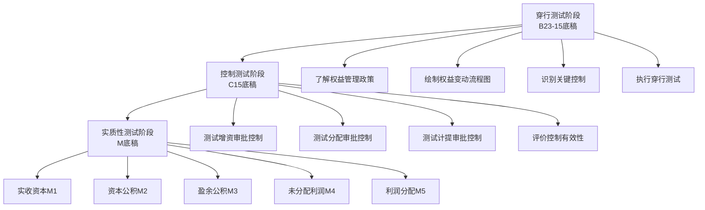
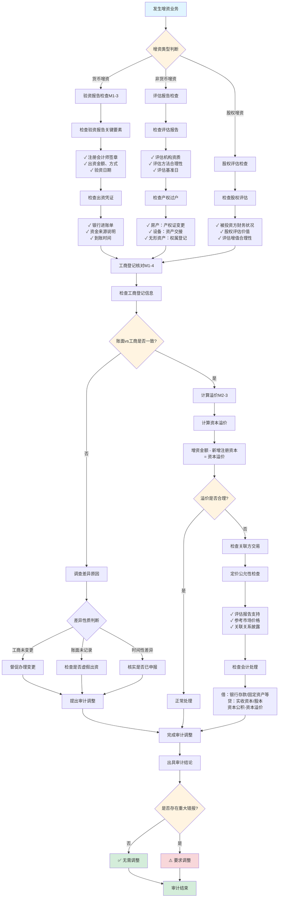
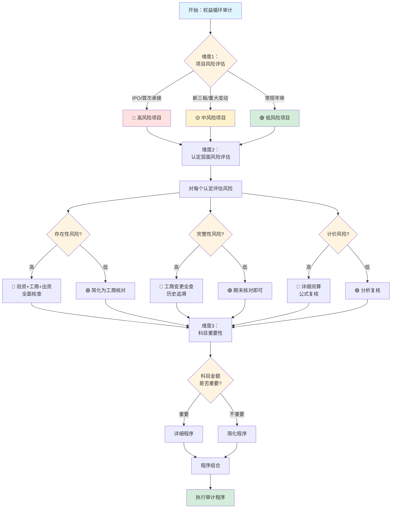
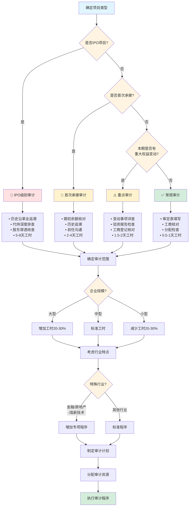

# 第二十六章 权益循环操作手册

> **版本**: v1.0 | **更新日期**: 2025年10月 | **适用准则**: 中国注册会计师审计准则
> 
> **📍 返回主框架**: [审计实务操作手册-框架](./审计实务操作手册-框架.md#第二十二章-权益循环)
> 
> **🔗 本章在审计流程中的位置**: 第三部分 > 业务循环操作手册 > 第二十二章

---

## 🚀 5分钟快速上手指南

> **新手必读！** 第一次审计权益循环？这里告诉你最核心的内容和最快的路径。

### 📌 三步定位你需要的内容

**步骤1：确定你的审计阶段**
```
你在哪个阶段？
├─ 刚开始项目？ → 阅读【第22.1-22.3节】了解循环特征和风险
├─ 风险评估阶段？ → 执行【第22.4-22.6节】穿行测试
├─ 控制测试阶段？ → 执行【第22.7-22.9节】控制测试（可选）
└─ 实质性测试阶段？ → 重点看【第22.10-22.15节】⭐⭐⭐
```

**步骤2：找到你的核心必做程序**
```
权益循环审计的6个核心程序（必须执行）：
✅ 1. 验资报告检查 → 第22.10.2节 ⭐⭐⭐
✅ 2. 工商登记核对 → 第22.10.3节 ⭐⭐⭐（账面必须与工商一致）
✅ 3. 出资真实性检查 → 第22.10.4节 ⭐⭐⭐（防止虚假出资）
✅ 4. 盈余公积计提测算 → 第22.12.2节 ⭐⭐（10%比例）
✅ 5. 利润分配检查 → 第22.14节 ⭐⭐（个税代扣20%）
✅ 6. 股权变动检查 → 第22.10.5节 ⭐⭐

⚠️ 权益交易频率低但风险高！必须100%核查每笔交易
```

**步骤3：遇到问题时快速查找**
```
常见问题？ → 第22.17节常见问题解答（FAQ）
不会填底稿？ → 每节都有"底稿示例"
工商登记怎么核对？ → 第22.10.3节详细说明
盈余公积怎么算？ → 第22.12.2节公式+案例
```

---

### 🎯 场景化快速导航（⭐重点推荐）

> **💡 使用说明**: 这是最实用的导航！直接找到你当前遇到的场景，快速定位解决方案。

#### 📍 场景一：审计项目启动阶段

| 你的情况 | 快速跳转 | 核心内容 | 预计用时 |
|---------|---------|---------|---------|
| 🆕 **第一次审计权益循环** | [22.1节](#221-权益循环特征) → [5分钟快速上手](#🚀-5分钟快速上手指南) | 了解循环特征、低频高风险 | 30分钟 |
| 📋 **制定审计计划** | [22.2节](#222-审计流程概览) | 审计流程图、底稿执行顺序 | 1小时 |
| 🎯 **确定审计策略** | [22.1.3节](#2213-审计策略选择) | 实质性方案为主 | 30分钟 |
| 📊 **风险评估** | [22.3节](#223-风险识别与应对) | 虚假出资、超额分配风险 | 1小时 |

#### 📍 场景二：现场审计执行阶段

| 你的情况 | 快速跳转 | 核心内容 | 预计用时 |
|---------|---------|---------|---------|
| 🔍 **现场审计第一天** | [第一天行动清单](#⚡-现场审计第一天行动清单) | 工商登记、验资报告、章程 | 立即开始 |
| 📝 **填写审定表M1-1** | [22.10节](#2210-实收资本审计) | 实收资本审定表填写 | 20分钟 |
| 📄 **检查验资报告** | [22.10.2节](#22102-验资报告检查) | 验资报告真实性、出资到位 | 1-2小时 |
| 🏢 **核对工商登记** | [22.10.3节](#22103-工商登记核对) ⭐⭐⭐ | 企业信用信息公示系统查询 | 1小时 |
| 💰 **盈余公积测算** | [22.12.2节](#22122-盈余公积计提测算) | 10%比例、50%上限 | 1小时 |
| 💸 **利润分配检查** | [22.14节](#2214-利润分配审计) | 可分配利润、股东会决议 | 2小时 |

#### 📍 场景三：遇到特殊情况

| 你的情况 | 快速跳转 | 核心内容 | 预计用时 |
|---------|---------|---------|---------|
| ⚠️ **怀疑虚假出资** | [22.17.1节](#22171-如何识别虚假出资) | 虚假出资识别的5个信号 | 重点程序 |
| 🔴 **账面与工商登记不符** | [22.10.3节](#22103-工商登记核对) | 差异原因分析、调整 | 2-3小时 |
| 📉 **盈余公积计提错误** | [22.12.2节](#22122-盈余公积计提测算) | 重新测算、提请调整 | 1-2小时 |
| 💸 **超额分配利润** | [22.14.2节](#22142-可分配利润测算) | 可分配利润计算、合规性 | 2小时 |
| 🔄 **发现抽逃出资** | [22.10.4节](#22104-出资真实性检查) | 抽逃出资识别、影响评估 | 3-4小时 |
| 🤝 **股权代持** | [22.17.6节](#22176-如何处理股权代持) | 代持还原、披露要求 | 2-3小时 |

#### 📍 场景四：特定权益类型

| 你的情况 | 快速跳转 | 核心内容 | 预计用时 |
|---------|---------|---------|---------|
| 💰 **实收资本审计** | [22.10节](#2210-实收资本审计) | 验资、工商、出资检查 | 2-3小时 |
| 📊 **资本公积审计** | [22.11节](#2211-资本公积审计) | 资本溢价、资产评估增值 | 1-2小时 |
| 💵 **盈余公积审计** | [22.12节](#2212-盈余公积审计) | 法定、任意盈余公积 | 1-2小时 |
| 💸 **未分配利润审计** | [22.13节](#2213-未分配利润审计) | 年初、本年、年末勾稽 | 1小时 |
| 🎁 **利润分配审计** | [22.14节](#2214-利润分配审计) | 股东会决议、个税代扣 | 2小时 |
| 📈 **股权激励审计** | [22.15.1节](#22151-股权激励审计) | 股票期权、限制性股票 | 3-4小时 |

#### 📍 场景五：特殊项目类型

| 你的情况 | 快速跳转 | 核心内容 | 预计用时 |
|---------|---------|---------|---------|
| 🎯 **IPO项目** | 全流程加强版 | 历史沿革、股权清晰、虚假出资 | 重点关注 |
| 🏢 **上市公司** | [22.15.1节](#22151-股权激励审计) | 股权激励、库存股、每股收益 | 3-4小时 |
| 🏭 **国有企业** | [22.11节](#2211-资本公积审计) | 国有资本、资产评估增值 | 2-3小时 |
| 💻 **有限责任公司** | [22.10节](#2210-实收资本审计) | 实收资本、认缴制 | 2小时 |
| 📈 **股份有限公司** | [22.10节](#2210-实收资本审计) | 股本、每股面值 | 2小时 |
| 🔬 **外商投资企业** | [22.10节](#2210-实收资本审计) | 外汇登记、外资出资 | 3-4小时 |

#### 📍 场景六：具体底稿填写

| 你的情况 | 快速跳转 | 核心内容 | 预计用时 |
|---------|---------|---------|---------|
| 📄 **M1-1实收资本审定表** | [22.10节](#2210-实收资本审计) | 审定表填写、勾稽关系 | 20分钟 |
| 📄 **M2-1资本公积审定表** | [22.11节](#2211-资本公积审计) | 资本溢价、其他资本公积 | 20分钟 |
| 📄 **M3-1盈余公积审定表** | [22.12节](#2212-盈余公积审计) | 盈余公积计提测算 | 30分钟 |
| 📄 **M4-1未分配利润审定表** | [22.13节](#2213-未分配利润审计) | 未分配利润勾稽 | 20分钟 |
| 📄 **M5-1利润分配检查表** | [22.14节](#2214-利润分配审计) | 分配决议、个税代扣 | 1小时 |
| 📄 **M6股权激励底稿** | [22.15.1节](#22151-股权激励审计) | 股权激励费用计算 | 2小时 |

---

### ⚡ 现场审计第一天行动清单

> **目标**: 第一天完成基础资料获取和工商登记核对，这些是权益审计的基础！

**上午（9:00-12:00）**
```
□ 获取所有权益科目明细表（实收资本、资本公积、盈余公积、未分配利润）
□ 获取公司章程（最新版，含所有修正案）
□ 获取股东名册（最新股东清单、持股比例）
□ 获取验资报告（历次增资的验资报告，包括设立验资）
□ 获取股权变动资料（股权转让协议、增资协议、减资决议）
□ 【重点】现场查询工商登记信息（企业信用信息公示系统）⭐⭐⭐
```

**下午（14:00-17:00）**
```
□ 获取历年利润分配决议（股东会/董事会决议）
□ 获取盈余公积计提明细（历年计提记录）
□ 获取股东出资凭证（银行进账单、资产过户凭证）
□ 获取股权激励方案（如有：股票期权、限制性股票方案）
□ 获取减资/回购资料（如有：减资公告、库存股处理）
□ 获取关联方股东清单（关联方关系、持股情况）
□ 核对工商登记与账面实收资本（必须完全一致）⭐⭐⭐
```

**当晚整理**
```
□ 编制权益审定表（M1-1至M4-1）
□ 核对工商登记与账面（重点！任何不符都要调查）⭐⭐⭐
□ 编制股权变动明细表（历次增资、减资、股权转让）
□ 识别高风险事项：
  ├─ 账面与工商登记不符
  ├─ 盈余公积计提比例错误
  ├─ 利润分配超过可分配利润
  ├─ 自然人股东分红未代扣个税
  └─ 非货币出资未评估或未过户
□ 识别需要重点检查的验资报告（设立验资、历次增资验资）
□ 准备次日工作计划（验资报告检查、出资真实性检查）
```

---

### ⭐ 新手必读Top 5（按优先级）

> **💡 阅读建议**：第一次做权益审计的新人，建议按照下列顺序学习。

---

#### 📌 第1优先级：工商登记核对（第22.10.3节）⭐⭐⭐

**🎯 为什么必须先学这个？**
工商登记核对是权益审计的第一道防线。账面实收资本必须与工商登记完全一致，任何不符都是重大问题！

**👶 第一次做时你会遇到什么？**
```
场景：公司账面实收资本1000万元

你的困惑：
❓ 如何查询工商登记信息？
❓ 账面与工商登记不符怎么办？
❓ 工商登记信息包含哪些内容？
❓ 需要打印工商登记资料吗？
```

**✅ 你需要掌握的核心操作（预计学习1小时）**

**第一步：查询工商登记信息（30分钟）**

**查询渠道**：
1. **国家企业信用信息公示系统**（最权威！）
   - 网址：http://www.gsxt.gov.cn/
   - 输入企业名称或统一社会信用代码
   - 可查询：注册资本、股东信息、变更记录

2. **企业信用报告**（辅助）
   - 天眼查、企查查、启信宝等
   - 包含工商登记、股权结构、变更历史

**查询内容核对清单**：

| 核对项 | 工商登记信息 | 账面信息 | 发现不符怎么办 |
|-------|------------|---------|---------------|
| **注册资本** | 工商注册资本 | 实收资本账面余额 | ⚠️ 必须一致！不符→提请调整 |
| **股东名称** | 股东名册 | 股东明细 | 不符→了解原因 |
| **持股比例** | 持股比例 | 股权比例 | 不符→提请调整 |
| **出资方式** | 货币/非货币 | 出资记录 | 核对是否一致 |
| **实缴资本** | 实缴金额 | 实收资本 | 认缴制企业可能不一致 |
| **变更记录** | 历次变更 | 股权变动 | 核对完整性 |

**第二步：核对账面与工商登记（20分钟）**

**核对公式**：
```
账面实收资本 = 工商登记注册资本（实缴部分）

⚠️ 特别提示：
• 有限责任公司：认缴制，实缴≤认缴
• 股份有限公司：股本 = 注册资本
• 外商投资企业：注意外汇登记
```

**常见不符情况及处理**：

| 不符类型 | 原因分析 | 审计程序 |
|---------|---------|---------|
| **账面>工商** | • 增资已到账未工商变更<br>• 账面错误 | ⚠️ 高风险！<br>• 检查增资协议<br>• 确认工商变更进度<br>• 如实未出资→提请调整 |
| **账面<工商** | • 工商变更未入账<br>• 虚假出资 | ⚠️ 高风险！<br>• 检查出资凭证<br>• 可能虚假出资→详查 |
| **股东不符** | • 股权转让未变更<br>• 代持股权 | • 检查股权转让协议<br>• 了解代持情况 |

**第三步：打印留存工商登记资料（10分钟）**

**必须留存的资料**：
1. **企业信用信息公示报告**（截图或打印PDF）
2. **股东信息截图**（股东名称、持股比例）
3. **变更记录截图**（历次增资、减资、股权转让）
4. **查询日期标注**（审计基准日前后）

**💡 新手保命技巧**：
1. **账面必须与工商一致**：这是铁律，任何不符都要追查
2. **查询要及时**：审计基准日后尽快查询，避免期后变更
3. **截图要留存**：工商登记信息要截图留底稿
4. **认缴制要注意**：有限公司可能认缴>实缴，账面=实缴

**📋 配套底稿**：M1-4工商登记核对表  
**⏱️ 实际操作时间**：查询核对1小时

---

#### 📌 第2优先级：验资报告检查（第22.10.2节）⭐⭐⭐

**🎯 为什么必须学这个？**
验资报告是验证出资真实性的关键证据。假验资、虚假出资是权益审计的高风险领域，必须严格检查！

**👶 第一次做时你会遇到什么？**
```
场景：公司有3次增资，需要检查3份验资报告

你的困惑：
❓ 验资报告要看哪些内容？
❓ 如何判断验资报告的真实性？
❓ 没有验资报告怎么办（认缴制）？
❓ 非货币出资如何验证？
```

**✅ 你需要掌握的核心操作（预计学习2小时）**

**验资报告检查清单**：

| 检查项 | 具体内容 | 核对方法 | 发现问题怎么办 |
|-------|---------|---------|---------------|
| **① 验资机构** | 会计师事务所资质 | 查询注协网站 | 无资质→验资无效 |
| **② 验资日期** | 出资日期vs验资日期 | 核对时间逻辑 | 逻辑不合理→质疑 |
| **③ 验资金额** | 验资金额vs注册资本 | 与工商登记核对 | 不符→提请调整 |
| **④ 货币出资** | 银行询证函、进账单 | 核对银行流水 | 无进账单→可能虚假 |
| **⑤ 非货币出资** | 评估报告、产权过户 | 检查评估报告、过户凭证 | 无评估或未过户→不合规 |
| **⑥ 出资人信息** | 股东名称、出资额 | 与章程、工商核对 | 不符→了解原因 |
| **⑦ 验资结论** | 是否全部到位 | 确认出资完整性 | 未到位→提请披露 |

**重点关注事项**：

**1. 货币出资检查**：
```
验证步骤：
1. 查看银行询证函（验资户余额）
2. 核对银行进账单（出资人、金额、日期）
3. 追踪资金来源（防止过桥资金、抽逃出资）
4. 核对验资后资金转入基本户

⚠️ 虚假出资信号：
• 验资后立即转出（可能是过桥资金）
• 出资人与股东不一致（可能代持）
• 无银行进账单（可能假验资）
```

**2. 非货币出资检查**：
```
验证步骤：
1. 检查评估报告（必须有资质的评估机构出具）
2. 核对评估价值是否合理（与市场价比较）
3. 检查产权过户凭证（房产证、专利证、股权证）
4. 核对账面入账价值（=评估价值或公允价值）

⚠️ 不合规信号：
• 无评估报告（违反法律规定）
• 评估价值明显虚高（可能虚假出资）
• 未办理产权过户（出资未完成）
```

**3. 认缴制下的特殊处理**：
```
2014年后有限公司实行认缴制：
• 设立时可以不实缴，不需要验资
• 但实际出资时仍需要验证

审计程序：
✅ 检查章程约定的认缴出资额和期限
✅ 检查实际出资凭证（银行进账单）
✅ 账面实收资本=实际出资额
✅ 未出资部分在报表附注披露
```

**💡 新手保命技巧**：
1. **验资报告真实性要核实**：假验资时有发生，要核查验资机构资质
2. **非货币出资必须评估**：没评估报告=不合规
3. **产权过户必须完成**：非货币出资未过户=出资未完成
4. **认缴制要关注披露**：未出资部分要在附注披露

**📋 配套底稿**：M1-3验资报告检查表  
**⏱️ 实际操作时间**：验资报告检查1-2小时（每份验资报告）

---

#### 📌 第3优先级：盈余公积计提测算（第22.12.2节）⭐⭐⭐

**🎯 为什么要学这个？**
盈余公积计提是权益审计中最常见的测算工作。10%比例、50%上限是法律规定，计算错误会导致报表不合规。

**关键测算**：

**1. 法定盈余公积计提公式**：
```
法定盈余公积本年计提额 = 当年净利润 × 10%

⚠️ 特殊规定：
• 累计法定盈余公积≥注册资本×50% → 可以不再提取
• 亏损年度不提取盈余公积
• 先弥补以前年度亏损，再计提盈余公积

示例：
注册资本：1,000万元
当年净利润：500万元
累计法定盈余公积：400万元

本年应提取 = 500 × 10% = 50万元
但累计已达400万，距离50%上限(500万)还有100万
所以本年提取50万，累计450万
```

**2. 任意盈余公积**：
```
任意盈余公积 = 根据公司章程或股东会决议自主确定

• 比例自定（如5%、15%等）
• 可以不提取
• 审计重点：核对章程或股东会决议
```

**3. 可分配利润计算**：
```
可分配利润 = 年初未分配利润
           + 本年净利润
           - 本年提取盈余公积
           - 以前年度亏损（如有）

示例：
年初未分配利润：200万
本年净利润：500万
本年提取法定盈余公积：50万
可分配利润 = 200 + 500 - 50 = 650万
```

**常见错误识别**：
- ❌ 计提比例错误（不是10%）
- ❌ 超过50%上限仍然计提
- ❌ 亏损年度仍然计提
- ❌ 未弥补以前年度亏损就计提

**📋 配套底稿**：M3-2盈余公积计提测算表  
**⏱️ 实际操作时间**：测算1小时

---

#### 📌 第4优先级：利润分配审计（第22.14节）⭐⭐⭐

**🎯 为什么要学这个？**
利润分配是权益循环最常见的业务。超额分配、未代扣个税是常见问题，必须严格检查！

**核心检查**：

**1. 可分配利润充足性**：
```
实际分配金额 ≤ 可分配利润

⚠️ 超额分配的后果：
• 违反公司法
• 损害债权人利益
• 可能要求退回分红
```

**2. 股东会决议检查**：
```
必须检查的内容：
✅ 股东会决议日期
✅ 分配方案（每股分红金额）
✅ 股东签字确认
✅ 决议是否有效（是否经必要程序）
```

**3. 个人所得税代扣**：
```
自然人股东分红：必须代扣20%个人所得税

计算公式：
应代扣个税 = 自然人股东分红金额 × 20%

示例：
股东A（自然人）分红100万
应代扣个税 = 100 × 20% = 20万
实际支付给股东A = 100 - 20 = 80万

⚠️ 法人股东分红：不代扣个税（符合条件可免企业所得税）
```

**4. 会计处理检查**：
```
利润分配会计分录：
借：利润分配-应付股利  XXX
  贷：应付股利（应付利润）  XXX

支付时：
借：应付股利  XXX
  贷：银行存款  XXX
      应交税费-个人所得税  XXX（自然人股东）
```

**异常信号识别**：
- ⚠️ 分配金额>可分配利润（超额分配）
- ⚠️ 无股东会决议就分红
- ⚠️ 自然人股东未代扣个税
- ⚠️ 当年亏损仍然分红

**📋 配套底稿**：M5-1利润分配检查表、M5-3个税代扣检查表  
**⏱️ 实际操作时间**：利润分配检查2小时

---

#### 📌 第5优先级：常见问题解答（第22.17节）⭐⭐

**🎯 为什么要看这个？**
快速解答你90%的疑问，节省查找时间。

**7大高频问题**：
1. 如何识别虚假出资和抽逃出资
2. 工商登记与账面不符如何处理
3. 盈余公积计提比例和上限
4. 利润分配时个税如何代扣
5. 非货币出资如何审计
6. 股权代持如何处理
7. 股权激励如何审计

**⏱️ 阅读时间**：30分钟

---

### 💡 常见错误提醒（新手最容易犯的）

**❌ 错误1：只看账面余额，不核对工商登记**
- ✅ 正确：账面实收资本必须与工商登记完全一致
- 📖 详见：第22.10.3节

**❌ 错误2：盈余公积提取比例搞错**
- ✅ 正确：法定盈余公积=当年净利润×10%，累计达注册资本50%可停止提取
- 📖 详见：第22.12.2节

**❌ 错误3：利润分配未检查可分配利润是否充足**
- ✅ 正确：必须测算可分配利润，实际分配≤可分配利润
- 📖 详见：第22.14.2节

**❌ 错误4：自然人股东分红未检查个税代扣**
- ✅ 正确：自然人股东分红必须代扣20%个人所得税
- 📖 详见：第22.14.3节

**❌ 错误5：未检查非货币出资的评估报告和产权过户**
- ✅ 正确：非货币出资必须评估，必须办理产权过户
- 📖 详见：第22.10.4节

---

## 📚 手册说明

本手册详细说明权益循环审计的全流程操作，包括穿行测试、控制测试和实质性测试三个阶段，每个阶段提供具体的底稿填写指引和实操案例。

### 适用范围
- **权益循环函证审计**（M0系列）
- **应付股利（利润）审计**（M1系列）
- **库存股审计**（M3系列）
- **专项储备审计**（M7系列）
- **一般风险准备审计**（M8系列）
- **实收资本（股本）审计**（M2系列）
- **资本公积审计**（M4系列）
- **盈余公积审计**（M5系列）
- **未分配利润审计**（M6系列）
- **利润分配审计**（M9系列）
- **股权激励审计**（M10系列）
- **其他综合收益审计**（M11系列）

### 底稿体系
- **B类底稿**: B23-15权益业务层面控制（6个子底稿）
- **C类底稿**: C15权益循环控制测试（3个子底稿）
- **M类底稿**: M权益实质性测试（9个系列，共70+个子底稿）
  - **M0系列**: 权益循环函证（8个底稿）
  - **M1系列**: 应付股利（利润）（9个底稿）
  - **M2系列**: 实收资本（股本）（8个底稿）
  - **M3系列**: 库存股（8个底稿）
  - **M4系列**: 资本公积（7个底稿）
  - **M5系列**: 盈余公积（8个底稿）
  - **M6系列**: 未分配利润（7个底稿）
  - **M7系列**: 专项储备（8个底稿）
  - **M8系列**: 一般风险准备（7个底稿）

---

## 📋 目录

### 第一部分：循环总览
1. [权益循环特征](#221-权益循环特征)
2. [审计流程概览](#222-审计流程概览)
3. [风险识别与应对](#223-风险识别与应对)

### 第二部分：穿行测试阶段（B23-15）
4. [穿行测试准备](#224-穿行测试准备)
5. [流程了解与控制识别](#225-流程了解与控制识别)
6. [穿行测试执行](#226-穿行测试执行)

### 第三部分：控制测试阶段（C15）
7. [控制测试计划](#227-控制测试计划)
8. [控制测试执行](#228-控制测试执行)
9. [控制偏差评价](#229-控制偏差评价)

### 第四部分：实质性测试阶段（M系列 - 9个科目）
10. [权益循环函证审计（M0系列）](#2210-权益循环函证审计m0系列)
11. [应付股利（利润）审计（M1系列）](#2211-应付股利利润审计m1系列)
12. [库存股审计（M3系列）](#2212-库存股审计m3系列)
13. [专项储备审计（M7系列）](#2213-专项储备审计m7系列)
14. [一般风险准备审计（M8系列）](#2214-一般风险准备审计m8系列)
15. [实收资本审计（M2系列）](#2215-实收资本审计)
16. [资本公积审计（M4系列）](#2216-资本公积审计)
17. [盈余公积审计（M5系列）](#2217-盈余公积审计)
18. [未分配利润审计（M6系列）](#2218-未分配利润审计)
19. [利润分配审计](#2219-利润分配审计)
20. [特殊事项测试](#2220-特殊事项测试)

### 第五部分：实操案例
16. [完整案例演示](#2216-完整案例演示)
17. [常见问题解答](#2217-常见问题解答)

---

## 🎯 场景化快速索引（⭐重点推荐）

> **💡 使用说明**: 这是最实用的导航！直接找到你当前遇到的场景，快速定位解决方案。

### 📍 场景一：发生增资事项

| 你的情况 | 快速跳转 | 核心内容 | 预计用时 |
|---------|---------|---------|---------|
| 💰 **货币增资** | [22.10.2节](#22102-验资报告检查m1-3) | 验资报告、银行回单、出资凭证、工商核对 | 2小时 |
| 🏢 **非货币增资** | [22.10.4节](#22104-出资检查m1-5) | 评估报告、产权过户、价值复核、虚增风险 | 4小时 |
| 🤝 **关联方增资** | [22.11.3节](#22113-溢价计算检查m2-3) | 定价公允性、利益输送风险、折价/溢价合理性 | 3小时 |
| ⚠️ **怀疑虚假出资** | [22.17.1节](#22171-如何识别虚假出资和抽逃出资) | 资金流向追踪、关联交易检查、抽逃识别 | 4-6小时 |

### 📍 场景二：利润分配事项

| 你的情况 | 快速跳转 | 核心内容 | 预计用时 |
|---------|---------|---------|---------|
| 💸 **现金分红** | [22.14节](#2214-利润分配审计) | 可分配利润测算、股东会决议、个税代扣、实际支付 | 2-3小时 |
| ⚠️ **超额分配风险** | [22.14.2节](#22142-分配计算测算m5-2) | 可分配利润测算、合规性检查、弥补亏损 | 1.5小时 |
| 📝 **不按比例分配** | [22.17.5节](#22175-利润分配必须按持股比例吗) | 章程约定检查、股东会全体同意、有限公司特殊规定 | 1小时 |
| 💰 **个税代扣检查** | [22.14.3节](#22143-分配执行检查m5-3) + [22.17.7节](#22177-如何审计股东分红的个人所得税) | 税款计算、代扣凭证、完税证明、申报时间 | 1小时 |

### 📍 场景三：特殊事项

| 你的情况 | 快速跳转 | 核心内容 | 预计用时 |
|---------|---------|---------|---------|
| 🎯 **股权激励计划** | [22.15.1节](#22151-股权激励审计m6) + [附录F](#附录f股权激励会计处理专题) | 公允价值确定、等待期分摊、行权处理、离职调整 | 4-6小时 |
| 📉 **公司减资** | [22.15.3节](#22153-减资审计) + [附录G-I](#附录g减资与回购操作案例) | 债权人通知、减资程序、会计处理、工商变更 | 3-4小时 |
| 🔄 **股权转让** | [22.10.5节](#22105-股权变动检查m1-6) + [22.15.4节](#22154-股权转让审计) | 优先认购权、价格公允性、个税处理、代持识别 | 2-3小时 |
| 📦 **股份回购** | [附录G-II](#附录g减资与回购操作案例) | 回购合规性、库存股处理、用途检查、注销程序 | 3小时 |
| 🔍 **代持股权调查** | [22.17.6节](#22176-代持股权如何识别) | 资金来源追踪、股东访谈、协议检查、实际控制人识别 | 4-6小时 |

### 📍 场景四：项目类型专项

| 你的情况 | 快速跳转 | 核心内容 | 预计用时 |
|---------|---------|---------|---------|
| 🎯 **首次IPO项目** | [22.1节](#221-权益循环特征) + [22.3节](#223-风险识别与应对) | 股东穿透、历次增资全查、代持排查、股权清晰性 | 5-6天 |
| 📋 **上市公司年审** | [22.10-22.14节](#2210-权益循环函证审计m0系列) | 验资、工商、分配、正常审计程序 | 1-2天 |
| 🏢 **新三板挂牌** | [22.10节](#2210-权益循环函证审计m0系列) | 出资到位、股权清晰、合规性 | 2-3天 |
| 🆕 **首次承接客户** | [22.10.2节](#22102-验资报告检查m1-3) + [22.13节](#2213-未分配利润审计) | 期初余额核对、历史沿革追溯 | 2-3天 |

### 📍 场景五：异常情况应对

| 你的情况 | 快速跳转 | 核心内容 | 预计用时 |
|---------|---------|---------|---------|
| 🔴 **账面与工商不一致** | [22.10.3节](#22103-工商登记核对m1-4) | 差异调查、原因分析、调整建议 | 2小时 |
| ⚠️ **盈余公积提取错误** | [22.12.2节](#22122-盈余公积计提测算m3-2) + [附录H案例2](#附录h常见错误案例库) | 重新计算、累计额检查、调整分录 | 1小时 |
| 💸 **发现超额分配** | [22.14.2节](#22142-分配计算测算m5-2) | 可分配利润测算、违规认定、审计调整 | 2小时 |
| 🚨 **增资未入账** | [附录H案例1](#附录h常见错误案例库) | 银行流水检查、工商登记、补记分录 | 1.5小时 |
| 📉 **转增资本未保留25%** | [附录H案例7](#附录h常见错误案例库) | 《公司法》规定、计算检查、调整建议 | 1小时 |

### 📍 场景六：具体底稿填写

| 你的情况 | 快速跳转 | 核心内容 | 预计用时 |
|---------|---------|---------|---------|
| 📄 **M1-1实收资本审定表** | [22.10.1节](#22101-实收资本审定表m1-1) | 审定表填写、勾稽关系、变动检查 | 30分钟 |
| 📄 **M2-1资本公积审定表** | [22.11.1节](#22111-资本公积审定表m2-1) | 溢价明细、计算复核、来源检查 | 30分钟 |
| 📄 **M3-2盈余公积计提测算** | [22.12.2节](#22122-盈余公积计提测算m3-2) | 计提比例、累计额、历年核对 | 1小时 |
| 📄 **M5-1至M5-4利润分配底稿** | [22.14节](#2214-利润分配审计) | 方案检查、测算、执行、决议 | 2-3小时 |
| 📄 **M6股权激励底稿** | [22.15.1节](#22151-股权激励审计m6) + [附录F](#附录f股权激励会计处理专题) | 公允价值、费用分摊、行权处理 | 4小时 |

### 📍 场景七：质量复核与问题解决

| 你的情况 | 快速跳转 | 核心内容 | 预计用时 |
|---------|---------|---------|---------|
| ✅ **质量复核检查** | 各节末尾"质量复核自查表" | 逐项检查完成情况、审计证据充分性 | 按清单 |
| ❓ **遇到技术难题** | [22.17节](#2217-常见问题解答) | 7个高频问题快速解答 | 5-10分钟 |
| 🔄 **需要交叉引用** | [附录A](#附录a底稿索引速查表) | 底稿索引速查表 | 参考 |
| 🛠️ **需要计算公式** | [附录E](#附录e常用计算公式) | 资本公积、盈余公积、可分配利润计算 | 参考 |
| 📚 **学习完整案例** | [22.16节](#2216-完整案例演示) | 从头到尾案例演示（增资+分配） | 2小时 |
| ⚖️ **查询法律依据** | [附录D](#附录d关键法律依据) | 《公司法》条款汇总 | 参考 |

---

### 🔥 特别提示Top 5

| 提示 | 说明 | 详见 |
|-----|------|------|
| 1️⃣ **权益交易频率低** | 每笔都要100%核查，不能抽样 | 22.7.2节 |
| 2️⃣ **必须核对工商登记** | 账面实收资本必须与工商登记完全一致 | 22.10.3节 |
| 3️⃣ **自然人股东分红** | 必须代扣20%个人所得税 | 22.14.3节 |
| 4️⃣ **非货币出资** | 必须评估+产权过户 | 22.10.4节 |
| 5️⃣ **IPO项目穿透** | 必须穿透至自然人或国资，排查代持 | 22.3节 |

---


---

## 26.1 权益循环特征

### 26.1.1 涉及科目

| 科目类别 | 具体科目 | 审计重点 |
|---------|---------|---------|
| **实收资本/股本** | 股本 | 股权变动真实性、验资程序 |
| | 实收资本 | 出资到位、产权清晰 |
| **资本公积** | 资本溢价/股本溢价 | 溢价计算准确性 |
| | 其他资本公积 | 形成原因、会计处理 |
| **其他综合收益** | 可供出售金融资产公允价值变动 | 计量准确性 |
| | 外币报表折算差额 | 折算方法正确性 |
| **盈余公积** | 法定盈余公积 | 计提比例、计提基数 |
| | 任意盈余公积 | 董事会决议、计提合规性 |
| **未分配利润** | 未分配利润 | 利润结转、分配合规性 |

### 26.1.2 主要风险

| 风险类型 | 具体表现 | 风险等级 |
|---------|---------|---------|
| **虚假出资** | 虚增注册资本、抽逃出资 | 高 |
| **利润分配不当** | 超额分配、违规分配 | 中-高 |
| **计提不足** | 盈余公积计提不足 | 中 |
| **股权变动** | 股权转让未入账、代持股权 | 中 |
| **其他综合收益** | 公允价值计量不准确 | 中 |
| **关联方交易** | 关联方增资、减资未披露 | 中 |

### 26.1.3 审计策略选择

**推荐策略：实质性方案为主（路径2）**
- 控制测试：对利润分配审批控制执行有限测试
- 实质性测试：正常范围（验资报告检查、工商登记核对、利润分配计算）
- 理由：权益科目交易频率低，实质性测试更高效

### 26.1.4 审计资源配置

| 审计阶段 | 预计时间 | 人员配置 | 关键工作 |
|---------|---------|---------|---------|
| 穿行测试 | 0.5天 | 项目经理 | 流程了解、控制识别 |
| 控制测试 | 0.5天 | 审计助理 | 分配审批控制测试 |
| 实质性测试 | 1-2天 | 项目经理+助理 | 验资报告、工商核对、分配计算 |

---


---

## 26.2 审计流程概览

### 26.2.1 审计流程图



### 26.2.2 底稿调用路径

```
风险评估阶段
    ↓
【B23-15】穿行测试
├─ B23-15：程序表
├─ B23-15-1：整体控制汇总
├─ B23-15-2：流程图及描述
├─ B23-15-3：控制矩阵
├─ B23-15-4：穿行测试记录
├─ B23-15-5：测试汇总表
└─ B23-15-6：评价报告
    ↓
控制测试阶段（如控制有效）
    ↓
【C15】控制测试
├─ C15：控制测试汇总表
├─ C15-1：控制测试过程记录
└─ C15-2：控制偏差评价
    ↓
实质性测试阶段
    ↓
【M1】实收资本/股本
├─ M1A：实质性程序表
├─ M1-1：实收资本审定表
├─ M1-2：股本明细表
├─ M1-3：验资报告检查
├─ M1-4：工商登记核对
├─ M1-5：出资检查
└─ M1-6：股权变动检查
    ↓
【M2】资本公积
├─ M2A：实质性程序表
├─ M2-1：资本公积审定表
├─ M2-2：资本公积明细表
├─ M2-3：溢价计算检查
└─ M2-4：其他资本公积检查
    ↓
【M3】盈余公积
├─ M3-1：盈余公积审定表
├─ M3-2：盈余公积计提测算
└─ M3-3：盈余公积使用检查
    ↓
【M4】未分配利润
├─ M4-1：未分配利润审定表
├─ M4-2：利润结转检查
└─ M4-3：年初未分配利润核对
    ↓
【M5】利润分配
├─ M5-1：利润分配方案检查
├─ M5-2：分配计算测算
├─ M5-3：分配执行检查
└─ M5-4：股东会决议检查
```

### 26.2.3 时间安排

| 阶段 | 时间节点 | 关键产出 |
|-----|---------|---------|
| **中期审计** | 10-11月 | B23-15穿行测试、C15控制测试 |
| **期末审计** | 次年1-3月 | 验资报告检查、工商核对 |
| **报告阶段** | 次年3-4月 | 利润分配检查、股东会决议核对 |

---

## 26.2.4 核心流程图（⭐可视化操作指南）

> **💡 本节位置**：22.2 审计流程概览 > 22.2.4 核心流程图

> **💡 使用说明**: 复杂权益事项的可视化操作流程，按图执行不遗漏。

---

### 流程图1：增资业务审计全流程



---

### 流程图2：利润分配审计全流程

```mermaid
graph TD
    A[利润分配事项] --> B[获取股东会决议M5-4]
    
    B --> C{决议是否有效?}
    C -->|否| C1[❌ 决议无效<br>不能确认分配]
    C -->|是| D[检查决议关键要素]
    
    D --> E[✓ 股东会召开日期<br>✓ 出席股东签字<br>✓ 分配方案明确<br>✓ 表决比例合规]
    
    E --> F[可分配利润测算M5-2]
    
    F --> G[计算可分配利润]
    G --> H[期初未分配利润<br>+ 本期净利润<br>- 本期提取盈余公积<br>- 弥补以前年度亏损<br>= 可分配利润]
    
    H --> I{是否需弥补亏损?}
    I -->|是| I1[期初未分配利润<0]
    I -->|否| J
    
    I1 --> I2[检查是否先弥补亏损]
    I2 --> I3{是否已弥补?}
    I3 -->|否| I4[❌ 不能分配<br>必须先弥补亏损]
    I3 -->|是| J
    
    J[检查盈余公积计提M3-2]
    J --> K[法定盈余公积<br>= 本期净利润 × 10%]
    
    K --> L{累计盈余公积<br>是否≥注册资本50%?}
    L -->|是| L1[可以不再计提]
    L -->|否| L2[必须计提10%]
    
    L1 --> M
    L2 --> M[重新计算可分配利润]
    
    M --> N[可分配利润<br>= 期初未分配利润<br>+ 本期净利润<br>- 计提盈余公积<br>- 弥补亏损]
    
    N --> O{实际分配<br>≤ 可分配利润?}
    
    O -->|否| O1[❌ 超额分配]
    O -->|是| P[检查分配比例]
    
    O1 --> O2[计算超额金额]
    O2 --> O3[实际分配 - 可分配利润<br>= 超额分配金额]
    O3 --> O4[⚠️ 要求调整<br>或出具保留意见]
    
    P --> Q{是否按持股比例?}
    Q -->|否| Q1[检查章程约定]
    Q -->|是| R
    
    Q1 --> Q2{章程是否允许?}
    Q2 -->|否| Q3[❌ 违反章程<br>要求调整]
    Q2 -->|是| Q4[检查股东会决议<br>是否全体一致同意]
    
    Q4 --> Q5{是否全体同意?}
    Q5 -->|否| Q6[❌ 决议无效]
    Q5 -->|是| R
    
    R[检查个税代扣M5-3]
    R --> S{股东类型判断}
    
    S -->|自然人股东| S1[必须代扣20%个税]
    S -->|法人股东| S2[不需代扣个税]
    
    S1 --> T1[检查个税代扣]
    T1 --> T2[应扣个税<br>= 分配金额 × 20%]
    T2 --> T3{是否已代扣?}
    
    T3 -->|否| T4[❌ 未履行代扣义务<br>要求补扣]
    T3 -->|是| U
    
    S2 --> U[检查实际支付]
    T4 --> U
    
    U --> V[核对银行流水]
    V --> W{支付金额是否正确?}
    
    W -->|否| W1[❌ 支付金额错误]
    W -->|是| X[检查会计处理]
    
    X --> Y[借：利润分配-应付股利<br>  贷：应付股利]
    Y --> Y1[借：应付股利<br>  贷：银行存款<br>      应交税费-个税<br>      （自然人股东）]
    
    Y1 --> Z[核对财务报表列报]
    Z --> AA{是否存在错报?}
    
    AA -->|否| AB1[✅ 无需调整]
    AA -->|是| AB2[⚠️ 要求调整]
    
    C1 --> END
    I4 --> END
    O4 --> END
    Q3 --> END
    Q6 --> END
    W1 --> END
    AB1 --> END[审计结束]
    AB2 --> END
    
    style A fill:#e1f5ff
    style C fill:#fff4e1
    style I fill:#fff4e1
    style I3 fill:#fff4e1
    style L fill:#fff4e1
    style O fill:#fff4e1
    style Q fill:#fff4e1
    style Q2 fill:#fff4e1
    style Q5 fill:#fff4e1
    style S fill:#fff4e1
    style T3 fill:#fff4e1
    style W fill:#fff4e1
    style AA fill:#fff4e1
    style AB1 fill:#d4edda
    style AB2 fill:#f8d7da
    style C1 fill:#f8d7da
    style I4 fill:#f8d7da
    style O1 fill:#f8d7da
    style Q3 fill:#f8d7da
    style Q6 fill:#f8d7da
    style T4 fill:#f8d7da
    style W1 fill:#f8d7da
    style END fill:#d4edda
```



---

### 流程图3：虚假出资识别与应对流程

```mermaid
graph TD
    A[开始虚假出资排查] --> B[风险识别阶段]
    
    B --> C[识别高风险特征]
    C --> D1[⚠️ 新设立公司<br/>首次增资]
    C --> D2[⚠️ IPO申报期<br/>突击增资]
    C --> D3[⚠️ 关联方之间<br/>增资]
    C --> D4[⚠️ 实收资本远超<br/>经营规模]
    
    D1 --> E[检查验资报告]
    D2 --> E
    D3 --> E
    D4 --> E
    
    E --> F{验资报告是否规范?}
    F -->|否| F1[🚨 高风险信号]
    F -->|是| G
    
    F1 --> F2[验资报告缺陷：<br>✗ 无注册会计师签字<br>✗ 验资日期异常<br>✗ 验资机构不规范]
    
    G[追踪资金来源]
    G --> H[获取银行回单]
    H --> I[追踪出资前资金来源]
    
    I --> J{资金来源合法?}
    J -->|可疑| J1[🚨 可疑资金来源]
    J -->|正常| K
    
    J1 --> J2[可疑情形：<br>✗ 短期大额借款<br>✗ 关联方资金<br>✗ 无合理来源]
    
    K[追踪资金去向]
    K --> L[检查出资后资金流向]
    L --> M[分析出资后1-6个月<br>大额资金往来]
    
    M --> N{是否存在资金回流?}
    N -->|是| N1[🚨 疑似抽逃出资]
    N -->|否| O
    
    N1 --> N2[资金回流特征：<br>✗ 大额对外支付<br>✗ 支付给股东/关联方<br>✗ 无真实交易背景]
    
    O[检查关联交易]
    O --> P[获取关联方清单]
    P --> Q[检查增资前后<br>与关联方交易]
    
    Q --> R{关联交易是否异常?}
    R -->|是| R1[🚨 可能通过关联交易抽逃]
    R -->|否| S
    
    R1 --> R2[异常关联交易：<br>✗ 大额借款给股东<br>✗ 关联采购无合理性<br>✗ 对价明显不公允]
    
    S[检查工商登记]
    S --> T[获取工商登记信息]
    T --> U[核对账面与工商]
    
    U --> V{是否一致?}
    V -->|否| V1[🚨 账实不符]
    V -->|是| W
    
    V1 --> V2[不一致情形：<br>✗ 工商实缴<账面<br>✗ 工商未登记出资<br>✗ 出资时间倒签]
    
    W[非货币出资检查]
    W --> X{是否有非货币出资?}
    X -->|是| Y
    X -->|否| Z
    
    Y[检查评估与过户]
    Y --> Y1[✓ 评估报告检查<br>✓ 产权过户检查<br>✓ 实物资产检查]
    
    Y1 --> Y2{评估与过户是否合规?}
    Y2 -->|否| Y3[🚨 虚假非货币出资]
    Y2 -->|是| Z
    
    Y3 --> Y4[虚假情形：<br>✗ 无评估报告<br>✗ 资产未过户<br>✗ 评估价值虚高]
    
    Z[综合判断]
    F2 --> Z
    J2 --> Z
    N2 --> Z
    R2 --> Z
    V2 --> Z
    Y4 --> Z
    
    Z --> AA{汇总风险信号}
    
    AA --> AB{风险等级评估}
    AB -->|低风险| AC1[0-1个风险信号]
    AB -->|中风险| AC2[2-3个风险信号]
    AB -->|高风险| AC3[4个及以上信号]
    
    AC1 --> AD1[✅ 执行正常程序]
    AD1 --> AD2[• 验资报告检查<br>• 工商登记核对<br>• 完成审定表]
    
    AC2 --> AE1[⚠️ 扩大审计程序]
    AE1 --> AE2[• 函证银行<br>• 延长追踪期间<br>• 访谈股东<br>• 检查大额交易]
    
    AC3 --> AF1[🚨 重点核查程序]
    AF1 --> AF2[必做程序：<br>✓ 银行流水全检<br>✓ 关联方穿透<br>✓ 股东访谈<br>✓ 实地核查资产<br>✓ 函证确认]
    
    AD2 --> AG[出具审计结论]
    AE2 --> AG
    AF2 --> AG
    
    AG --> AH{最终结论}
    
    AH -->|未发现问题| AI1[✅ 出资真实]
    AH -->|发现轻微问题| AI2[⚠️ 提请调整]
    AH -->|发现重大问题| AI3[🚨 虚假出资确认]
    
    AI1 --> AJ1[无保留意见]
    
    AI2 --> AJ2[要求调整建议：<br>• 补充验资程序<br>• 完善工商登记<br>• 补正会计处理]
    
    AI3 --> AJ3[审计应对：<br>• 要求股东补足出资<br>• 调整财务报表<br>• 考虑出具非标意见<br>• 必要时解除委托]
    
    AJ3 --> AK{客户是否配合?}
    AK -->|是| AK1[监督整改]
    AK -->|否| AK2[❌ 出具保留意见<br>或无法表示意见]
    
    AK1 --> AL[验证整改完成]
    AL --> AM{整改是否充分?}
    AM -->|是| AN1[✅ 正常意见]
    AM -->|否| AN2[⚠️ 保留意见]
    
    AJ1 --> END[审计结束]
    AJ2 --> END
    AK2 --> END
    AN1 --> END
    AN2 --> END
    
    style A fill:#e1f5ff
    style F fill:#fff4e1
    style J fill:#fff4e1
    style N fill:#fff4e1
    style R fill:#fff4e1
    style V fill:#fff4e1
    style X fill:#fff4e1
    style Y2 fill:#fff4e1
    style AB fill:#fff4e1
    style AH fill:#fff4e1
    style AK fill:#fff4e1
    style AM fill:#fff4e1
    
    style F1 fill:#fff3cd
    style J1 fill:#fff3cd
    style N1 fill:#fff3cd
    style R1 fill:#fff3cd
    style V1 fill:#fff3cd
    style Y3 fill:#fff3cd
    
    style AI1 fill:#d4edda
    style AN1 fill:#d4edda
    style AJ1 fill:#d4edda
    
    style AI2 fill:#fff3cd
    style AJ2 fill:#fff3cd
    style AN2 fill:#fff3cd
    
    style AI3 fill:#f8d7da
    style AJ3 fill:#f8d7da
    style AK2 fill:#f8d7da
    
    style END fill:#d4edda
```



---

### 📋 流程图使用指南

**流程图1：增资业务审计全流程**
- **适用场景**: 发生任何增资事项时
- **核心要点**: 
  - 区分货币/非货币/股权增资，程序不同
  - 工商登记核对是必做程序
  - 关联方增资重点关注定价公允性
- **预计用时**: 2-4小时（根据复杂程度）

**流程图2：利润分配审计全流程**
- **适用场景**: 本期有利润分配或发现超额分配风险时
- **核心要点**:
  - 可分配利润测算是基础，必须准确
  - 自然人股东分红必须代扣20%个税
  - 不按比例分配需全体股东一致同意
- **预计用时**: 2-3小时

**流程图3：虚假出资识别与应对流程**
- **适用场景**: IPO项目、首次承接客户、发现异常出资时
- **核心要点**:
  - 4个及以上风险信号→重点核查程序
  - 资金来源+资金去向双向追踪
  - 关联方穿透是关键
- **预计用时**: 4-8小时（高风险情况）

---

## 26.2.5 认定-风险-程序映射体系（⭐⭐⭐核心框架）

> **💡 本节位置**：22.2 审计流程概览 > 22.2.5 认定-风险-程序映射体系

> **💡 为什么需要这个体系？**  
> 很多审计人员机械地执行程序，不理解"为什么做这个程序"。本章节建立**认定→风险→程序**的清晰映射关系，帮助您：
> 1. **理解逻辑**：明白每个程序针对什么风险、验证哪个认定
> 2. **裁剪程序**：根据风险高低合理裁剪程序，提高效率
> 3. **应对变化**：遇到新情况时，能够独立判断应该做什么程序

---

### 📊 权益循环认定-风险-程序总览矩阵

#### 矩阵说明
- **横轴**：财务报表认定（5大类）
- **纵轴**：权益科目（4大类）
- **单元格内容**：主要风险 → 关键程序 → 风险等级

---

#### 表1：实收资本/股本的认定-风险-程序矩阵

| 认定 | 主要风险 | 关键审计程序 | 底稿索引 | 风险等级 | 程序必要性 |
|-----|---------|------------|---------|---------|-----------|
| **存在性<br>Existence** | 🚨 **虚假出资**<br>• 验资报告造假<br>• 资金未实际到位<br>• 非货币出资未过户 | ✅ **验资报告检查**（检查真实性）<br>✅ **银行回单核对**（验证资金到位）<br>✅ **工商登记核对**（账实一致性）<br>✅ **产权过户检查**（非货币出资） | M1-3<br>M1-5<br>M1-4<br>附录 | 🔴 高 | ⭐⭐⭐<br>**必做**<br>IPO必须100%核查 |
| **完整性<br>Completeness** | ⚠️ **股权变动未入账**<br>• 增资未记录<br>• 工商变更未同步 | ✅ **工商登记全面核对**<br>✅ **股东会决议检查**<br>✅ **银行流水检查**（大额资金流入） | M1-4<br>M1-6<br>辅助程序 | 🟡 中 | ⭐⭐⭐<br>**必做**<br>IPO需历次变更全查 |
| **权利义务<br>Rights** | ⚠️ **代持股权**<br>• 实际出资人与登记不符<br>• 股权纠纷 | ✅ **股东访谈**<br>✅ **资金来源追踪**<br>✅ **代持协议排查**<br>✅ **诉讼仲裁查询** | M1-6<br>访谈记录<br>尽调报告 | 🔴 高<br>（IPO） | ⭐⭐⭐<br>IPO必做<br>常规项目询问 |
| **计价与分摊<br>Valuation** | ⚠️ **溢价计算错误**<br>• 资本溢价分配错误<br>• 股本与溢价混淆 | ✅ **溢价计算复核**<br>✅ **会计分录检查**<br>✅ **股份公司：面值检查** | M2-3<br>M1-1 | 🟢 低 | ⭐⭐<br>常规检查即可 |
| **列报与披露<br>Presentation** | ⚠️ **披露不充分**<br>• 股本结构未披露<br>• 股权变动未披露 | ✅ **报表列报检查**<br>✅ **附注披露检查**<br>✅ **工商信息对比** | M1-1<br>报表复核 | 🟢 低 | ⭐<br>列报复核 |

---

#### 表2：资本公积的认定-风险-程序矩阵

| 认定 | 主要风险 | 关键审计程序 | 底稿索引 | 风险等级 | 程序必要性 |
|-----|---------|------------|---------|---------|-----------|
| **存在性** | ⚠️ **溢价虚增**<br>• 关联方增资定价不公允<br>• 虚构交易形成溢价 | ✅ **增资定价公允性评估**<br>✅ **评估报告检查**<br>✅ **关联方交易检查** | M2-3<br>评估报告<br>关联交易表 | 🟡 中<br>（关联方🔴高） | ⭐⭐<br>关联方必须详查 |
| **完整性** | ⚠️ **溢价未全额入账**<br>• 增资溢价未记录 | ✅ **增资全流程检查**<br>✅ **溢价计算测算** | M2-3<br>M1-3 | 🟢 低 | ⭐⭐<br>常规检查 |
| **计价与分摊** | 🚨 **溢价计算错误**<br>• 增资价格-面值=溢价<br>• 计算公式错误 | ✅ **溢价计算复核**<br>✅ **会计处理检查** | M2-3<br>M2-1 | 🟡 中 | ⭐⭐⭐<br>**必做** |
| **分类** | ⚠️ **资本公积分类错误**<br>• 股本溢价与其他资本公积混淆 | ✅ **明细表分类检查**<br>✅ **准则对照** | M2-2<br>M2-4 | 🟢 低 | ⭐⭐<br>复核即可 |
| **列报与披露** | ⚠️ **其他资本公积来源未披露** | ✅ **附注披露检查**<br>✅ **变动情况说明** | 报表附注 | 🟢 低 | ⭐<br>列报复核 |

---

#### 表3：盈余公积的认定-风险-程序矩阵

| 认定 | 主要风险 | 关键审计程序 | 底稿索引 | 风险等级 | 程序必要性 |
|-----|---------|------------|---------|---------|-----------|
| **存在性** | 🟢 风险极低 | ✅ **审定表核对** | M3-1 | 🟢 极低 | ⭐<br>简单核对 |
| **完整性** | 🚨 **计提不足**<br>• 未按10%计提<br>• 达到50%后应提未提 | ✅ **计提比例测算**<br>✅ **计提基数检查**<br>✅ **累计额检查** | M3-2<br>⭐⭐⭐ | 🔴 高 | ⭐⭐⭐<br>**必做**<br>必须测算 |
| **计价与分摊** | 🚨 **计提金额错误**<br>• 计提基数错误（调整后净利润）<br>• 比例错误 | ✅ **计提测算表**<br>✅ **公式检查：<br>净利润×10%** | M3-2<br>⭐⭐⭐ | 🔴 高 | ⭐⭐⭐<br>**必做** |
| **使用合规性** | ⚠️ **转增资本超限**<br>• 未保留25%<br>• 违规使用 | ✅ **使用检查**<br>✅ **《公司法》对照**<br>✅ **股东会决议** | M3-3<br>如有使用 | 🟡 中 | ⭐⭐<br>有使用时必做 |
| **列报与披露** | 🟢 风险低 | ✅ **列报检查** | 报表复核 | 🟢 低 | ⭐<br>列报复核 |

---

#### 表4：利润分配的认定-风险-程序矩阵

| 认定 | 主要风险 | 关键审计程序 | 底稿索引 | 风险等级 | 程序必要性 |
|-----|---------|------------|---------|---------|-----------|
| **存在性** | ⚠️ **分配未实际执行** | ✅ **银行付款凭证**<br>✅ **股东确认** | M5-3 | 🟢 低 | ⭐⭐<br>核对即可 |
| **完整性** | ⚠️ **应付股利漏记** | ✅ **股东会决议检查**<br>✅ **应付股利明细表** | M5-1<br>M5-4 | 🟢 低 | ⭐⭐<br>常规检查 |
| **计价-合规性** | 🚨 **超额分配**<br>• 可分配利润不足<br>• 未弥补亏损<br>• 未提取盈余公积 | ✅ **可分配利润测算**（⭐⭐⭐核心）<br>✅ **亏损弥补检查**<br>✅ **盈余公积计提检查** | M5-2<br>⭐⭐⭐<br>M3-2 | 🔴 高 | ⭐⭐⭐<br>**必做**<br>必须测算 |
| **计价-税务** | 🚨 **个税未代扣**<br>• 自然人股东<br>• 税款未缴纳 | ✅ **个税计算检查**<br>✅ **代扣凭证检查**<br>✅ **完税证明** | M5-3<br>⭐⭐⭐ | 🔴 高 | ⭐⭐⭐<br>**必做**<br>自然人股东 |
| **权利义务** | ⚠️ **不按比例分配**<br>• 章程未约定<br>• 未全体同意 | ✅ **章程检查**<br>✅ **股东会决议检查**<br>✅ **全体同意确认** | M5-4<br>公司章程 | 🟡 中 | ⭐⭐<br>不按比例时必做 |
| **列报与披露** | 🟢 风险低 | ✅ **报表列报检查** | 报表复核 | 🟢 低 | ⭐<br>列报复核 |

---

### 🎯 基于风险的程序裁剪体系

#### 裁剪原则（三维度判断）



---

### 📋 程序裁剪决策表

#### 决策表1：实收资本审计程序裁剪

| 程序名称 | 程序目标认定 | 低风险项目 | 中风险项目 | 高风险项目（IPO） | 裁剪依据 |
|---------|------------|----------|----------|----------------|---------|
| **验资报告检查** | 存在性 | 本期增资 | 本期+上期 | 历次全部 | 风险越高追溯越深 |
| **工商登记核对** | 存在性+完整性 | 期末核对 | 期末+变更记录 | 完整工商档案 | 必做程序，深度可调 |
| **出资检查** | 存在性 | 银行回单 | 回单+资金来源 | 资金流水全查 | IPO必须追踪 |
| **代持排查** | 权利义务 | 询问 | 询问+声明 | 深度调查+证据 | IPO核心程序 |
| **股权变动检查** | 完整性 | 本期变动 | 本期+工商核对 | 历次变动全查 | 根据变动频率 |
| **溢价计算** | 计价 | 简单复核 | 计算测算 | 详细测算+评估 | 关联方必须详查 |

**裁剪示例**：
```
低风险项目（常规年审）：
✅ 审定表填写（M1-1）
✅ 工商登记核对期末数（M1-4）
✅ 本期增资验资报告检查（M1-3，如有）
❌ 历史追溯（不需要）
❌ 代持深度排查（询问即可）
预计工时：0.5-1天

高风险项目（IPO）：
✅ 审定表填写（M1-1）
✅ 完整工商档案（M1-4）
✅ 历次验资报告全查（M1-3）
✅ 历次出资全查（M1-5）
✅ 代持深度排查（M1-6）
✅ 股东穿透至自然人
✅ 资金流水追踪
预计工时：5-8天
```

---

#### 决策表2：利润分配审计程序裁剪

| 程序名称 | 程序目标认定 | 无分配 | 少量分配 | 重大分配 | 裁剪依据 |
|---------|------------|-------|---------|---------|---------|
| **可分配利润测算** | 计价-合规 | ❌ 不适用 | ⭐⭐ 简单测算 | ⭐⭐⭐ 详细测算 | 必做程序 |
| **盈余公积计提检查** | 完整性 | ⭐⭐⭐ 必须测算 |  |  | 无论是否分配都要做 |
| **个税代扣检查** | 计价-税务 | ❌ 不适用 | ⭐⭐⭐ 自然人必查 |  | 自然人股东必做 |
| **股东会决议** | 权利义务 | ❌ 不适用 | ⭐⭐ 检查决议 | ⭐⭐⭐ 详细检查 | 有分配必做 |
| **实际支付检查** | 存在性 | ❌ 不适用 | ⭐⭐ 银行凭证 | ⭐⭐⭐ 银行+确认 | 有分配必做 |

---

### 💡 实战案例：如何运用映射体系

#### 案例1：常规年审项目的程序裁剪

**背景**：
- 项目类型：制造业，常规年审
- 注册资本：5000万，无变动
- 本期利润分配：1000万

**步骤1：项目风险评估** → 🟢 低风险

**步骤2：认定层面风险评估**：
| 认定 | 风险评估 | 理由 |
|-----|---------|------|
| 存在性 | 🟢 低 | 股权稳定，无变动 |
| 完整性 | 🟢 低 | 无增资减资 |
| 权利义务 | 🟢 低 | 股东明确 |
| 计价-盈余公积 | 🔴 高 | 必须测算（无论何种项目） |
| 计价-分配 | 🟡 中 | 有分配，需测算 |

**步骤3：程序裁剪决策**：

✅ **必做程序**：
1. M1-1 实收资本审定表（0.5小时）
2. M1-4 工商登记核对-期末数（0.5小时）
3. M3-2 盈余公积计提测算（1小时）⭐⭐⭐
4. M5-2 可分配利润测算（1小时）⭐⭐⭐
5. M5-3 个税代扣检查（0.5小时）
6. M5-4 股东会决议检查（0.5小时）

❌ **简化或省略程序**：
- 验资报告检查（无增资）
- 历史追溯（常规项目）
- 代持排查（询问即可）
- 股权变动检查（无变动）

**预计总工时**：4小时（半天）

---

#### 案例2：IPO项目的程序设计

**背景**：
- 项目类型：高新技术企业，IPO申报
- 历史：2020年设立，经历3轮融资
- 可能存在代持

**步骤1：项目风险评估** → 🔴 高风险

**步骤2：认定层面风险评估**：
| 认定 | 风险评估 | 理由 |
|-----|---------|------|
| 存在性 | 🔴 高 | 需证明出资真实 |
| 完整性 | 🔴 高 | 历次增资必须完整 |
| 权利义务 | 🔴 高 | 代持风险 |
| 计价 | 🔴 高 | 多轮融资，估值波动 |

**步骤3：程序组合（全面审计）**：

✅ **必做程序（100%覆盖）**：
1. 设立验资报告（2020年）
2. 三轮融资验资报告（2021/2022/2024）
3. 完整工商档案（从设立至今）
4. 历次出资凭证检查
5. 资金流水追踪（每轮融资前后6个月）
6. 股东穿透图（至自然人）
7. 代持排查报告（访谈+声明+协议排查）
8. 历次增资定价公允性评估
9. 关联方资金往来检查
10. 诉讼仲裁查询
11. 股权质押查询

**预计总工时**：5-8天（40-64小时）

---

### 🔍 程序有效性自查

#### 自查问题清单

**问题1：我做的每个程序，是为了应对哪个风险？**
- 如果答不出来 → 可能是机械执行，需重新思考

**问题2：这个风险在当前项目是高/中/低？**
- 高风险 → 详细程序
- 低风险 → 可以简化

**问题3：我的程序能够有效验证目标认定吗？**
- 存在性 → 需要外部证据（验资、工商、银行）
- 完整性 → 需要双向检查（账到工商、工商到账）
- 计价 → 需要计算测算

**问题4：如果省略这个程序，会有什么风险？**
- 高风险程序 → 不能省略
- 低风险程序 → 可考虑简化

---

### 📊 程序覆盖度检查表

| 认定 | 必做程序 | 覆盖率目标 | 实际覆盖率 | 差距分析 |
|-----|---------|----------|----------|---------|
| **存在性** | 验资报告+工商核对 | IPO: 100%<br>常规: 期末 | ___% | |
| **完整性** | 工商登记全核对 | IPO: 100%<br>常规: 期末 | ___% | |
| **权利义务** | 代持排查 | IPO: 深度<br>常规: 询问 | 已完成/未完成 | |
| **计价** | 盈余公积测算 | 100%（必做） | ___% | |
| **计价** | 可分配利润测算 | 有分配: 100% | ___% | |

---

### ⚠️ 常见错误与纠正

| 错误做法 | 为什么错 | 正确做法 |
|---------|---------|---------|
| ❌ 所有项目都用同一套程序 | 没有风险导向，浪费资源 | ✅ 根据风险裁剪程序 |
| ❌ 盈余公积不测算，直接复核 | 计提错误风险高，必须测算 | ✅ 100%项目都要测算 |
| ❌ IPO项目只查本期 | 不符合IPO要求 | ✅ 历史沿革全追溯 |
| ❌ 自然人分红不查个税 | 企业有代扣义务，必须检查 | ✅ 自然人分红必查个税 |
| ❌ 不理解为什么做，只知道要填底稿 | 机械执行，遇到变化不会应对 | ✅ 理解认定-风险-程序逻辑 |

---

### 💡 总结：审计程序裁剪的黄金法则

**法则1：核心程序不能省**
- 盈余公积计提测算 → 100%项目必做
- 可分配利润测算 → 有分配必做
- 工商登记核对 → 100%项目必做
- 自然人分红个税 → 必做

**法则2：根据项目风险调整深度**
- IPO/首次承接 → 深度审计
- 常规年审 → 标准程序
- 无变动科目 → 简化程序

**法则3：始终追问"为什么"**
- 这个程序应对什么风险？
- 这个风险在本项目是否存在？
- 风险等级是高/中/低？
- 程序深度是否匹配风险？

**法则4：保持职业怀疑**
- 即使是低风险项目，发现异常也要追查
- 保持警觉，不机械执行

---


---

## 26.3 风险识别与应对

### 26.3.1 风险矩阵

| 认定 | 风险描述 | 风险等级 | 应对程序 | 底稿索引 |
|-----|---------|---------|---------|---------|
| **存在性** | 虚假出资、抽逃出资 | 高 | 验资报告检查、工商登记核对、出资凭证检查 | M1-3, M1-4, M1-5 |
| **完整性** | 股权变动未入账 | 中 | 工商登记核对、股东会决议检查 | M1-4, M1-6 |
| **计价** | 资本溢价计算错误 | 中 | 重新计算资本溢价 | M2-3 |
| **权利义务** | 代持股权未披露 | 中-高 | 股东访谈、协议检查 | M1-6 |
| **列报** | 其他综合收益分类错误 | 中 | 检查会计处理、准则对照 | M2-4 |
| **分配合规性** | 超额分配利润 | 中-高 | 可分配利润测算、决议检查 | M5-2, M5-4 |

### 26.3.2 舞弊风险识别

**高风险情形**：
1. **虚假出资**：实缴资本未到位，虚增注册资本
2. **抽逃出资**：出资后通过关联交易抽回资金
3. **代持股权**：实际出资人与名义股东不一致
4. **超额分配**：未弥补亏损或未提取盈余公积即分配利润
5. **利益输送**：通过不公允的增资减资进行利益输送

**应对措施**：
- ✅ 检查验资报告和实际出资凭证
- ✅ 追踪出资后的资金流向
- ✅ 核对工商登记与账面记录
- ✅ 检查股东会决议真实性
- ✅ 测算可分配利润是否充足

### 26.3.3 特殊事项关注

| 特殊事项 | 关注要点 | 审计程序 |
|---------|---------|---------|
| **股权激励** | 股份支付会计处理 | 专项测试M6 |
| **股权转让** | 转让价格公允性 | M1-6股权变动检查 |
| **增资扩股** | 增资程序、溢价合理性 | M1-3验资报告、M2-3溢价检查 |
| **减资** | 债权人通知、资产评估 | 专项测试 |
| **分立合并** | 权益调整会计处理 | 专项测试 |
| **回购股份** | 回购程序、库存股处理 | 专项测试 |

---

### 26.3.4 项目类型决策矩阵（⭐实战指引）

> **💡 使用说明**: 根据项目类型选择合适的审计策略和程序深度，提高审计效率。

#### 📊 项目类型分类及审计策略矩阵

| 项目类型 | 审计重点 | 程序深度 | 预计工时 | 关键底稿 | 特别关注事项 |
|---------|---------|---------|---------|---------|------------|
| **🎯 IPO项目** | 股权清晰性<br>历史沿革<br>代持排查 | ⭐⭐⭐⭐⭐<br>（最高） | 5-8天 | • 历次验资报告全查<br>• 工商档案全套<br>• 股东穿透到自然人<br>• 代持排查报告 | • 必须穿透至最终自然人/国资<br>• 历次增资全部核查<br>• 代持必须彻底排查<br>• 价格公允性重点关注 |
| **📋 主板上市公司年审** | 重大变动<br>利润分配 | ⭐⭐⭐<br>（正常） | 1-2天 | • M1-1审定表<br>• M1-4工商核对<br>• M5利润分配底稿 | • 关注本期重大变动<br>• 分红个税检查<br>• 与公告一致性 |
| **🏢 新三板挂牌** | 出资真实性<br>股权清晰 | ⭐⭐⭐⭐<br>（较高） | 2-3天 | • 验资报告<br>• 工商登记<br>• 股权结构图<br>• 出资检查 | • 出资必须真实到位<br>• 股权结构清晰<br>• 代持需要披露 |
| **🔄 首次承接客户** | 期初余额<br>历史沿革 | ⭐⭐⭐⭐<br>（较高） | 2-4天 | • 历次验资报告<br>• 工商变更记录<br>• 前任审计报告<br>• 期初余额核对 | • 期初余额必须核实<br>• 历史沿革追溯<br>• 前后任沟通 |
| **📊 常规年审** | 本期变动<br>分配合规 | ⭐⭐<br>（常规） | 1-1.5天 | • 审定表<br>• 工商核对<br>• 利润分配底稿 | • 关注本期变动<br>• 分配合规性<br>• 工商一致性 |
| **🆕 设立第一年审计** | 设立合规性<br>出资到位 | ⭐⭐⭐<br>（正常） | 1.5-2天 | • 设立验资报告<br>• 公司章程<br>• 工商登记<br>• 出资凭证 | • 设立程序合规<br>• 出资真实到位<br>• 章程条款检查 |
| **🔍 专项审计（并购尽调）** | 股权瑕疵<br>或有事项 | ⭐⭐⭐⭐⭐<br>（最高） | 3-5天 | • 全套权益底稿<br>• 股权瑕疵排查<br>• 诉讼仲裁检查<br>• 股权质押查询 | • 全面排查股权瑕疵<br>• 代持、纠纷、质押<br>• 或有事项披露 |

---

#### 🎯 IPO项目专项要求

| 审计程序 | 常规项目 | IPO项目 | 差异说明 |
|---------|---------|---------|---------|
| **验资报告检查** | 本期增资 | 历次增资全部检查 | IPO需追溯至设立时 |
| **工商登记核对** | 期末核对 | 历次变更全核对 | 需获取完整工商档案 |
| **股东穿透** | 不要求 | 穿透至自然人/国资 | 必须清晰股权结构 |
| **代持排查** | 一般询问 | 深度调查+书面声明 | 必须出具无代持声明 |
| **出资检查** | 本期出资 | 历次出资全查 | 资金流水追踪 |
| **股权转让** | 本期转让 | 历次转让全查 | 价格公允性重点关注 |
| **关联方增资** | 常规检查 | 评估+独立意见 | 定价公允性必须有评估支持 |
| **工作底稿** | 简化底稿 | 详细底稿+附件 | 底稿必须完整、证据充分 |

**IPO项目检查清单** ✅：
- [ ] 设立时验资报告
- [ ] 历次增资验资报告
- [ ] 完整工商档案（含历次变更）
- [ ] 股东穿透图（至自然人/国资）
- [ ] 代持排查报告
- [ ] 历次股权转让协议
- [ ] 历次股权转让完税证明
- [ ] 评估报告（非货币出资/关联方增资）
- [ ] 股东无代持声明
- [ ] 股东资金来源说明

---

#### 🏢 企业规模差异化审计策略

| 企业规模 | 权益特点 | 审计策略 | 时间分配 |
|---------|---------|---------|---------|
| **大型企业<br>（资产>5亿）** | • 股权结构复杂<br>• 可能多次融资<br>• 可能股权激励 | • 详细核查历次增资<br>• 股权激励专项审计<br>• 关联方交易重点关注 | 3-4天 |
| **中型企业<br>（5000万-5亿）** | • 股权相对稳定<br>• 可能有增资<br>• 分红较规律 | • 本期变动重点核查<br>• 工商登记核对<br>• 利润分配测算 | 1.5-2天 |
| **小型企业<br>（<5000万）** | • 股权简单<br>• 变动少<br>• 可能不分红 | • 审定表+工商核对<br>• 如有变动才详查<br>• 简化程序 | 0.5-1天 |
| **初创企业<br>（成立<3年）** | • 设立不久<br>• 可能多轮融资<br>• 股权变动频繁 | • 设立及历次增资全查<br>• 估值合理性关注<br>• 代持风险排查 | 2-3天 |

---

#### 🏭 行业特殊考虑

| 行业类型 | 权益特点 | 审计关注 | 特殊程序 |
|---------|---------|---------|---------|
| **金融业** | • 注册资本要求高<br>• 监管严格<br>• 资本充足率 | • 实收资本真实性<br>• 资本公积分类<br>• 一般风险准备 | 监管报表核对 |
| **房地产** | • 项目公司多<br>• 增资减资频繁<br>• 股权转让多 | • 项目公司股权变动<br>• 关联方资金往来<br>• 股权转让定价 | 资金流向追踪 |
| **高新技术** | • 股权激励常见<br>• 多轮融资<br>• 估值波动大 | • 股权激励会计处理<br>• 公允价值确定<br>• 增资价格合理性 | 评估报告复核 |
| **制造业** | • 股权稳定<br>• 分红规律<br>• 变动少 | • 常规审计程序<br>• 工商核对<br>• 利润分配检查 | 标准程序 |
| **互联网** | • VIE架构<br>• 期权激励<br>• 对赌协议 | • VIE结构理解<br>• 期权费用分摊<br>• 对赌协议影响 | 专项测试 |

---

#### ⚠️ 风险分级与应对

| 风险等级 | 风险特征 | 审计策略 | 程序深度 |
|---------|---------|---------|---------|
| **🔴 高风险** | • IPO项目<br>• 首次承接<br>• 股权复杂<br>• 发现疑点 | • 全面深入审计<br>• 扩大样本范围<br>• 追加审计程序<br>• 重点核查证据 | 100%核查<br>详细底稿 |
| **🟡 中风险** | • 新三板<br>• 本期重大变动<br>• 关联方增资<br>• 非货币出资 | • 重点领域深入<br>• 其他领域常规<br>• 关键证据充分 | 重点详查<br>其他常规 |
| **🟢 低风险** | • 常规年审<br>• 股权稳定<br>• 无重大变动<br>• 历史清晰 | • 标准审计程序<br>• 重点关注变动<br>• 工商核对为主 | 标准程序<br>简化底稿 |

---

#### 📋 项目类型决策流程图



---

#### 💡 实战建议

**1. 项目接受阶段**：
- 立即判断项目类型
- 根据决策矩阵评估工时
- 合理配置人员

**2. 审计执行阶段**：
- 根据项目类型选择程序深度
- 高风险项目不可简化程序
- 保持职业怀疑态度

**3. 质量控制阶段**：
- IPO项目必须合伙人全面复核
- 首次承接客户重点复核期初
- 常规项目重点复核变动事项

**4. 时间管理**：
- 预留20%缓冲时间
- 复杂情况及时上报
- 避免压缩关键程序

---


---

## 26.4 穿行测试准备

### 26.4.1 准备工作清单

**22.4.1.1 资料收集**

在开始穿行测试前，收集以下资料：

**必备资料**：
- [ ] 公司章程
- [ ] 验资报告（历次增资）
- [ ] 工商登记资料（营业执照、股东名册）
- [ ] 股东会决议（增资、减资、利润分配）
- [ ] 董事会决议（利润分配方案）
- [ ] 出资凭证（银行回单、资产评估报告）
- [ ] 股权转让协议

**辅助资料**：
- [ ] 权益变动明细账
- [ ] 利润分配明细账
- [ ] 股东投资协议
- [ ] 股权激励方案（如适用）
- [ ] 上期审计报告

**22.4.1.2 访谈对象**

| 访谈对象 | 访谈重点 | 预计时间 |
|---------|---------|---------|
| 财务总监 | 权益变动、利润分配政策 | 20分钟 |
| 会计主管 | 权益核算、账务处理 | 15分钟 |
| 董事会秘书 | 股东会决议、工商变更 | 15分钟 |

**22.4.1.3 现场观察计划**

- [ ] 观察工商登记资料保管情况
- [ ] 观察验资报告等重要文件保管
- [ ] 观察股东会决议审批流程

### 26.4.2 底稿准备

**22.4.2.1 B23-15底稿清单**

| 底稿编号 | 底稿名称 | 用途 |
|---------|---------|-----|
| B23-15 | 程序表 | 记录穿行测试整体程序 |
| B23-15-1 | 整体控制汇总表 | 汇总权益循环整体控制环境 |
| B23-15-2 | 流程图及描述 | 绘制增资、分配流程图 |
| B23-15-3 | 控制矩阵 | 识别关键控制点及控制活动 |
| B23-15-4 | 穿行测试记录 | 记录穿行测试详细过程 |
| B23-15-5 | 测试汇总表 | 汇总所有控制点测试结果 |
| B23-15-6 | 评价报告 | 评价控制设计有效性 |

**调用路径**：
```
项目文件夹 > B类-业务层面控制 > B23-15权益业务层面控制底稿模板库.md
```

---


---

## 26.5 流程了解与控制识别

### 26.5.1 权益循环标准流程

#### 26.5.1.1 增资流程


**关键控制点**：
1. ✅ **C1：增资审批控制** - 股东会决议批准增资
2. ✅ **C2：出资验证控制** - 验资机构出具验资报告
3. ✅ **C3：工商变更控制** - 及时办理工商变更登记
4. ✅ **C4：账务处理控制** - 根据验资报告准确入账

#### 26.5.1.2 利润分配流程


**关键控制点**：
1. ✅ **C5：分配方案审批控制** - 股东会决议批准分配方案
2. ✅ **C6：可分配利润测算控制** - 确保可分配利润充足
3. ✅ **C7：盈余公积计提控制** - 按规定比例计提
4. ✅ **C8：股利支付控制** - 按决议金额和时间支付

#### 26.5.1.3 盈余公积计提流程


**关键控制点**：
1. ✅ **C9：计提基数确认控制** - 正确确定应提取基数
2. ✅ **C10：计提比例控制** - 法定盈余公积10%
3. ✅ **C11：计提审批控制** - 财务总监审批

#### 26.5.1.4 股权转让流程


**关键控制点**：
1. ✅ **C12：优先认购权确认控制** - 通知其他股东
2. ✅ **C13：转让价格审批控制** - 关联方转让需审批
3. ✅ **C14：工商变更控制** - 及时办理变更登记

### 26.5.2 控制矩阵示例

**索引号：B23-15-3**

| 控制编号 | 控制活动描述 | 控制类型 | 控制频率 | 执行人 | 拟依赖 |
|---------|-------------|---------|---------|-------|-------|
| C1 | 增资需股东会决议批准 | 授权 | 每笔 | 股东会 | 是 |
| C2 | 增资需验资机构验资 | 验证 | 每笔 | 验资机构 | 是 |
| C3 | 增资后及时工商变更 | 执行 | 每笔 | 行政部 | 否 |
| C4 | 根据验资报告入账 | 执行 | 每笔 | 会计 | 是 |
| C5 | 利润分配需股东会决议 | 授权 | 每年 | 股东会 | 是 |
| C6 | 分配前测算可分配利润 | 测算 | 每年 | 财务部 | 是 |
| C7 | 法定盈余公积按10%计提 | 计算 | 每年 | 会计 | 是 |
| C8 | 按决议金额支付股利 | 执行 | 每年 | 出纳 | 是 |
| C9 | 盈余公积计提基数复核 | 复核 | 每年 | 财务总监 | 是 |
| C10 | 计提比例符合章程规定 | 检查 | 每年 | 会计主管 | 否 |
| C11 | 盈余公积计提需审批 | 审批 | 每年 | 财务总监 | 否 |
| C12 | 股权转让通知其他股东 | 通知 | 每笔 | 董秘 | 否 |
| C13 | 关联方转让价格需审批 | 审批 | 每笔 | 董事会 | 是 |
| C14 | 股权转让后工商变更 | 执行 | 每笔 | 行政部 | 否 |

---


---

## 26.6 穿行测试执行

### 26.6.1 穿行测试样本选择

**样本选择原则**：
- 选择金额重大的权益变动交易
- 覆盖不同类型交易（增资、分配、计提）
- 包含年度发生的主要权益变动

**样本示例**：
```
选择样本：2024年度利润分配
- 覆盖：分配方案编制→审批→计提→分配→支付全流程
- 测试所有关键控制点C5-C11
```

### 26.6.2 穿行测试记录表

**索引号：B23-15-4**        编制人：______        复核人：______        日期：______

#### 测试交易：2024年度利润分配2000万元

| 流程节点 | 控制活动 | 测试步骤 | 证据 | 结果 |
|---------|---------|---------|-----|------|
| 1. 编制方案 | - | 检查分配方案编制依据 | 利润分配方案 | ✅完整 |
| 2. 董事会审议 | - | 检查董事会决议 | 董事会决议 | ✅有效 |
| 3. 股东会决议 | C5：分配审批控制 | 检查股东会决议是否批准 | 股东会决议 | ✅有效 |
| 4. 测算可分配利润 | C6：可分配利润测算 | 检查测算过程 | 可分配利润测算表 | ✅准确 |
| 5. 计提盈余公积 | C7：盈余公积计提 | 检查计提比例10% | 计提凭证 | ✅正确 |
| 6. 分配利润 | C8：股利支付 | 检查分配金额与决议一致 | 分配凭证 | ✅一致 |
| 7. 支付股利 | - | 检查实际支付情况 | 银行回单 | ✅已支付 |
| 8. 账务处理 | - | 检查会计分录 | 记账凭证 | ✅正确 |

**测试结论**：
- ✅ 所有关键控制点设计合理
- ✅ 控制执行有效
- ✅ 可考虑依赖控制C5、C6、C7、C8

### 26.6.3 控制设计有效性评价

**索引号：B23-15-6**

#### 评价表

| 评价维度 | 评价结果 | 说明 |
|---------|---------|------|
| **控制覆盖** | 良好 | 覆盖增资、分配、计提全流程 |
| **职责分离** | 良好 | 方案编制、审批、执行、核算职责分离 |
| **授权控制** | 有效 | 股东会决议批准重大权益变动 |
| **测算控制** | 有效 | 可分配利润测算机制有效 |
| **信息系统** | 一般 | 依赖手工处理，信息化程度低 |

**初步结论**：
> 权益循环业务层面控制设计有效，关键控制点C5、C6、C7、C8可考虑依赖。
> 建议对这些控制执行控制测试，以支持实质性程序可适当减少。

---


---

## 26.7 控制测试计划

### 26.7.1 控制测试清单

基于穿行测试结果，拟对以下控制执行测试：

**索引号：C15**

| 控制编号 | 控制描述 | 控制类型 | 测试目标 | 拟测试样本量 | 底稿索引 |
|---------|---------|---------|---------|-------------|---------|
| C1 | 增资需股东会决议 | 授权 | 验证所有增资均经决议 | 全部（1笔） | C15-1 |
| C5 | 利润分配需股东会决议 | 授权 | 验证分配方案经股东会批准 | 全部（1笔） | C15-1 |
| C6 | 分配前测算可分配利润 | 测算 | 验证测算准确性 | 全部（1笔） | C15-1 |
| C7 | 法定盈余公积按10%计提 | 计算 | 验证计提准确性 | 全部（1笔） | C15-1 |
| C13 | 关联方转让价格需审批 | 审批 | 验证关联方转让经审批 | 全部（0笔） | 不适用 |

### 26.7.2 样本量确定

| 控制频率 | 测试策略 | 样本量 | 依据 |
|---------|---------|-------|------|
| 每年一次 | 全部测试 | 全部 | 频率低，全部测试 |
| 偶发事项 | 全部测试 | 全部或不适用 | 如发生则全部测试 |

**说明**：
- 权益交易频率低，通常每年仅1-2笔
- 采用全部测试策略，不抽样
- 如本年未发生某类交易，该控制标注"不适用"

---


---

## 26.8 控制测试执行

### 26.8.1 测试C5：利润分配审批控制

**索引号：C15-1（节选）**

**控制描述**：利润分配方案需股东会决议批准

**测试程序**：
1. 获取2024年度利润分配方案
2. 检查是否有股东会决议批准
3. 验证决议日期在分配执行前
4. 确认决议内容与实际分配一致

**测试样本**：

| 序号 | 分配时间 | 分配金额 | 股东会决议 | 决议日期 | 决议内容 | 结果 |
|-----|---------|---------|-----------|---------|---------|------|
| 1 | 2024/4/30 | 2000万 | ✅2023年度股东会决议 | 2024/4/15 | 分配2000万 | ✅有效 |

**测试结果**：
- 样本量：1笔（总体1笔，全部测试）
- 偏差数量：0
- 偏差率：0%
- **结论**：✅ 控制有效运行

### 26.8.2 测试C6：可分配利润测算控制

**索引号：C15-1（节选）**

**控制描述**：利润分配前需测算可分配利润是否充足

**测试程序**：
1. 获取可分配利润测算表
2. 重新计算可分配利润
3. 验证测算准确性
4. 确认分配金额不超过可分配利润

**测试样本**：

| 项目 | 公司测算 | 审计重算 | 差异 | 结果 |
|-----|---------|---------|-----|------|
| 年初未分配利润 | 15000万 |  | 0 | ✅一致 |
| 本年净利润 | 5000万 |  | 0 | ✅一致 |
| 减：提取盈余公积 | 500万 |  | 0 | ✅一致 |
| 可供分配利润 | 19500万 |  | 0 | ✅一致 |
| 实际分配金额 | 2000万 |  | 0 | ✅未超额 |

**测试结果**：
- 样本量：1笔
- 偏差数量：0
- 偏差率：0%
- **结论**：✅ 控制有效运行，测算准确

### 26.8.3 测试C7：盈余公积计提控制

**索引号：C15-1（节选）**

**控制描述**：法定盈余公积按净利润的10%计提

**测试程序**：
1. 获取盈余公积计提凭证
2. 检查计提基数（净利润）
3. 重新计算应提取金额（10%）
4. 核对实际计提金额

**测试样本**：

| 年度 | 净利润 | 计提比例 | 应提取金额 | 实际提取 | 差异 | 结果 |
|-----|-------|---------|-----------|---------|-----|------|
| 2024 | 5000万 | 10% | 500万 |  | 0 | ✅准确 |

**补充检查**：
```
累计盈余公积：4500万
注册资本：8000万
占比：56.25% > 50%

结论：已达注册资本50%，可不再计提（但公司仍继续计提）✅
```

**测试结果**：
- 样本量：1笔
- 偏差数量：0
- 偏差率：0%
- **结论**：✅ 控制有效运行，计提准确

### 26.8.4 测试C1：增资审批控制

**索引号：C15-1（节选）**

**控制描述**：增资需股东会决议批准

**测试程序**：
1. 获取2024年度增资事项清单
2. 检查是否有股东会决议
3. 验证验资报告
4. 确认工商变更登记

**测试样本**：

| 序号 | 增资时间 | 增资金额 | 股东会决议 | 验资报告 | 工商变更 | 结果 |
|-----|---------|---------|-----------|---------|---------|------|
| 1 | 2024/6/30 | 3000万 | ✅股东会决议 | ✅X验字[2024]015号 | ✅已变更 | ✅有效 |

**测试结果**：
- 样本量：1笔（总体1笔，全部测试）
- 偏差数量：0
- 偏差率：0%
- **结论**：✅ 控制有效运行

---


---

## 26.9 控制偏差评价

### 26.9.1 控制测试汇总

**索引号：C15**

| 控制编号 | 控制描述 | 样本量 | 偏差数 | 偏差率 | 控制有效性 |
|---------|---------|-------|-------|-------|----------|
| C1 | 增资审批控制 | 1 | 0 | 0% | ✅有效 |
| C5 | 利润分配审批 | 1 | 0 | 0% | ✅有效 |
| C6 | 可分配利润测算 | 1 | 0 | 0% | ✅有效 |
| C7 | 盈余公积计提 | 1 | 0 | 0% | ✅有效 |
| C13 | 关联方转让审批 | 0 | - |  | 不适用 |

### 26.9.2 控制测试总体结论

**索引号：C15-2**

#### 评价结果

**整体评价：控制有效** ✅

**详细结论**：
1. **增资控制**：增资事项均经股东会决议批准，验资程序完整，工商登记及时
2. **分配控制**：利润分配方案经股东会批准，可分配利润测算准确
3. **计提控制**：盈余公积按规定比例计提，计算准确
4. **授权控制**：重大权益变动均经适当授权批准

#### 对实质性程序的影响

基于控制测试结果，实质性程序策略：
- ✅ 可适度依赖控制
- ✅ 实质性测试采用正常范围
- ✅ 重点关注验资报告真实性和工商登记一致性
- ✅ 细节测试可适当减少

**特别提示**：
> 权益交易频率低，即使控制有效，仍建议对所有权益变动执行100%实质性测试。

---


---

## 26.10 权益循环函证审计（M0系列）

### 26.10.1 函证程序表（M0A）

**索引号：M0A**        编制人：______        复核人：______        日期：______

#### 一、本账户涉及的科目
应付股利等

#### 二、审计目标与认定的对应关系

| 审计目标 | 财务报表的认定 |
|----------|----------------|
| A. 确定记录的应付股利在资产负债表日确实存在且已恰当记录 | 存在 |
| B. 确定所有应当记录的应付股利均已记录，相关披露完整 | 完整性 |
| C. 确定记录的应付股利确为被审计单位拥有或控制 | 权利和义务 |
| D. 确定应付股利以恰当的金额包括在财务报表中，与之相关的计价调整已恰当记录，相关披露充分、适当 | 计价和分摊 |
| E. 确定应付股利已按照企业会计准则的规定在财务报表中作出恰当列报 | 列报与披露 |

#### 三、审计目标与审计程序的对应关系

| 序号 | 审计程序 | 程序分类 | 财务报表的认定 | 底稿索引号 |
|------|----------|----------|----------------|------------|
| | | | 存在 | 完整性 | 权利和义务 | 计价和分摊 | 列报与披露 | |
| 1 | 获取或编制应付股利明细表，复核加计正确，并与总账数和明细账合计数核对是否相符 | 函证★ | √ |  |  |  |  | M0-1 |
| 2 | 核实被函证单位信息 | 函证★ | √ |  |  |  |  | M0-2 |
| 3 | 跟函函证过程控制 | 函证★ | √ |  |  |  |  | M0-3 |
| 4 | 函证差异调节 | 函证★ | √ |  |  |  |  | M0-4 |
| 5 | 应付股利替代程序检查 | 函证★ | √ |  |  |  |  | M0-5 |
| 6 | 邮件传真回函可靠性验证 | 函证★ | √ |  |  |  |  | M0-6 |
| 7 | 函证程序舞弊风险评价 | 函证★ | √ |  |  |  |  | M0-7 |

### 26.10.2 函证结果汇总表（M0-1）

**索引号：M0-1**        编制人：______        复核人：______

#### 一、审计目标
汇总权益循环函证结果。

#### 二、函证结果汇总表

| 序号 | 函证项目 | 函证金额 | 回函金额 | 差异金额 | 差异原因 | 处理结果 | 备注 |
|------|----------|----------|----------|----------|----------|----------|------|
| 1 | 应付股利-股东甲 | 1000万 |  | 0 | - | 无差异 | 已确认 |
| 2 | 应付股利-股东乙 | 500万 |  | 0 | - | 无差异 | 已确认 |
| 3 | 应付股利-股东丙 | 300万 |  | 0 | - | 无差异 | 已确认 |
| **合计** | **应付股利** | **1800万** |  | **0** | **-** | **无差异** | **已确认** |

#### 三、审计结论
> 权益循环函证程序执行完毕，所有函证项目均得到确认，无重大差异，函证结果支持应付股利期末余额的准确性。

---

## 26.11 应付股利（利润）审计（M1系列）

### 26.11.1 应付股利实质性程序表（M1A）

**索引号：M1A**        编制人：______        复核人：______        日期：______

#### 一、本账户涉及的科目
应付股利等

#### 二、审计目标与认定的对应关系

| 审计目标 | 财务报表的认定 |
|----------|----------------|
| A. 确定记录的应付股利在资产负债表日确实存在且已恰当记录 | 存在 |
| B. 确定所有应当记录的应付股利均已记录，相关披露完整 | 完整性 |
| C. 确定记录的应付股利确为被审计单位拥有或控制 | 权利和义务 |
| D. 确定应付股利以恰当的金额包括在财务报表中，与之相关的计价调整已恰当记录，相关披露充分、适当 | 计价和分摊 |
| E. 确定应付股利已按照企业会计准则的规定在财务报表中作出恰当列报 | 列报与披露 |

#### 三、审计目标与审计程序的对应关系

| 序号 | 审计程序 | 程序分类 | 财务报表的认定 | 底稿索引号 |
|------|----------|----------|----------------|------------|
| | | | 存在 | 完整性 | 权利和义务 | 计价和分摊 | 列报与披露 | |
| 1 | 获取或编制应付股利明细表，复核加计正确，并与总账数和明细账合计数核对是否相符 | 常规★ | √ |  |  |  |  | M1-1 |
| 2 | 检查应付股利的余额明细 | 常规★ | √ |  |  |  |  | M1-2 |
| 3 | 检查外币汇率测算 | 常规★ | √ |  |  |  |  | M1-4 |
| 4 | 检查应付股利（利润）测算 | 常规★ | √ |  |  |  |  | M1-5 |
| 5 | 检查应付股利的会计处理 | 常规★ | √ |  |  |  |  | M1-6 |

### 26.11.2 应付股利审定表（M1-1）

**索引号：M1-1**        编制人：______        复核人：______

#### 一、审计目标
确定应付股利在资产负债表日确实存在且已恰当记录，所有应当记录的应付股利均已记录。

#### 二、审定表

| 项目 | 期末未审数 | 账项调整 | 重分类调整 | 期末审定数 | 上期审定数 | 索引号 |
|------|------------|----------|------------|------------|------------|--------|
|  |  | 借方 | 贷方 |  |  |  |  |  |  |
| 应付股利 | 1800万 | 0 |  |  |  |  |  | M1-2 |

#### 三、审计结论
> 应付股利期末余额1800万元，经检查确认无误，无审计调整，审定数1800万元。

### 26.11.3 应付股利明细表（M1-2）

**索引号：M1-2**        编制人：______        复核人：______

#### 一、明细表

| 序号 | 应付股利项目 | 股利性质 | 股利金额 | 股利期间 | 备注 |
|------|-------------|----------|----------|----------|------|
| 1 | 普通股股利-股东甲 | 现金股利 | 1000万 | 2024年度 | 已宣告未支付 |
| 2 | 普通股股利-股东乙 | 现金股利 | 500万 | 2024年度 | 已宣告未支付 |
| 3 | 普通股股利-股东丙 | 现金股利 | 300万 | 2024年度 | 已宣告未支付 |
| **合计** | **应付股利** | **现金股利** | **1800万** | **2024年度** | **已宣告未支付** |

#### 二、审计说明
> 应付股利明细表与总账核对一致，所有应付股利均为2024年度宣告的现金股利，尚未支付。

---

## 26.12 库存股审计（M3系列）

### 26.12.1 库存股实质性程序表（M3A）

**索引号：M3A**        编制人：______        复核人：______        日期：______

#### 一、本账户涉及的科目
库存股等

#### 二、审计目标与认定的对应关系

| 审计目标 | 财务报表的认定 |
|----------|----------------|
| A. 确定记录的库存股在资产负债表日确实存在且已恰当记录 | 存在 |
| B. 确定所有应当记录的库存股均已记录，相关披露完整 | 完整性 |
| C. 确定记录的库存股确为被审计单位拥有或控制 | 权利和义务 |
| D. 确定库存股以恰当的金额包括在财务报表中，与之相关的计价调整已恰当记录，相关披露充分、适当 | 计价和分摊 |
| E. 确定库存股已按照企业会计准则的规定在财务报表中作出恰当列报 | 列报与披露 |

#### 三、审计目标与审计程序的对应关系

| 序号 | 审计程序 | 程序分类 | 财务报表的认定 | 底稿索引号 |
|------|----------|----------|----------------|------------|
| | | | 存在 | 完整性 | 权利和义务 | 计价和分摊 | 列报与披露 | |
| 1 | 获取或编制库存股明细表，复核加计正确，并与总账数和明细账合计数核对是否相符 | 常规★ | √ |  |  |  |  | M3-1 |
| 2 | 检查库存股的余额明细 | 常规★ | √ |  |  |  |  | M3-2 |
| 3 | 检查外币投资汇率测算 | 常规★ | √ |  |  |  |  | M3-4 |
| 4 | 检查库存股的会计处理 | 常规★ | √ |  |  |  |  | M3-5 |

### 26.12.2 库存股审定表（M3-1）

**索引号：M3-1**        编制人：______        复核人：______

#### 一、审计目标
确定库存股在资产负债表日确实存在且已恰当记录，所有应当记录的库存股均已记录。

#### 二、审定表

| 项目 | 期末未审数 | 账项调整 | 重分类调整 | 期末审定数 | 上期审定数 | 索引号 |
|------|------------|----------|------------|------------|------------|--------|
|  |  | 借方 | 贷方 |  |  |  |  |  |  |
| 库存股 | 500万 | 0 |  |  |  |  |  | M3-2 |

#### 三、审计结论
> 库存股期末余额500万元，经检查确认无误，无审计调整，审定数500万元。

### 26.12.3 库存股明细表（M3-2）

**索引号：M3-2**        编制人：______        复核人：______

#### 一、明细表

| 序号 | 库存股项目 | 股票性质 | 股票数量 | 股票价格 | 备注 |
|------|-----------|----------|----------|----------|------|
| 1 | 回购股票-2024年6月 | 普通股 | 100万股 | 5元/股 | 已回购未注销 |
| **合计** | **库存股** | **普通股** | **100万股** | **5元/股** | **已回购未注销** |

#### 二、审计说明
> 库存股为公司2024年6月回购的100万股普通股，回购价格5元/股，尚未注销，期末余额500万元。

---

## 26.13 专项储备审计（M7系列）

### 26.13.1 专项储备实质性程序表（M7A）

**索引号：M7A**        编制人：______        复核人：______        日期：______

#### 一、本账户涉及的科目
专项储备等

#### 二、审计目标与认定的对应关系

| 审计目标 | 财务报表的认定 |
|----------|----------------|
| A. 确定记录的专项储备在资产负债表日确实存在且已恰当记录 | 存在 |
| B. 确定所有应当记录的专项储备均已记录，相关披露完整 | 完整性 |
| C. 确定记录的专项储备确为被审计单位拥有或控制 | 权利和义务 |
| D. 确定专项储备以恰当的金额包括在财务报表中，与之相关的计价调整已恰当记录，相关披露充分、适当 | 计价和分摊 |
| E. 确定专项储备已按照企业会计准则的规定在财务报表中作出恰当列报 | 列报与披露 |

#### 三、审计目标与审计程序的对应关系

| 序号 | 审计程序 | 程序分类 | 财务报表的认定 | 底稿索引号 |
|------|----------|----------|----------------|------------|
| | | | 存在 | 完整性 | 权利和义务 | 计价和分摊 | 列报与披露 | |
| 1 | 获取或编制专项储备明细表，复核加计正确，并与总账数和明细账合计数核对是否相符 | 常规★ | √ |  |  |  |  | M7-1 |
| 2 | 检查专项储备的余额明细 | 常规★ | √ |  |  |  |  | M7-2 |
| 3 | 检查专项储备的计提 | 常规★ | √ |  |  |  |  | M7-4 |
| 4 | 检查专项储备的支出 | 常规★ | √ |  |  |  |  | M7-5 |

### 26.13.2 专项储备审定表（M7-1）

**索引号：M7-1**        编制人：______        复核人：______

#### 一、审计目标
确定专项储备在资产负债表日确实存在且已恰当记录，所有应当记录的专项储备均已记录。

#### 二、审定表

| 项目 | 期末未审数 | 账项调整 | 重分类调整 | 期末审定数 | 上期审定数 | 索引号 |
|------|------------|----------|------------|------------|------------|--------|
|  |  | 借方 | 贷方 |  |  |  |  |  |  |
| 专项储备 | 200万 | 0 |  |  |  |  | 150万 | M7-2 |

#### 三、审计结论
> 专项储备期末余额200万元，经检查确认无误，无审计调整，审定数200万元。

### 26.13.3 专项储备明细表（M7-2）

**索引号：M7-2**        编制人：______        复核人：______

#### 一、明细表

| 序号 | 专项储备项目 | 储备性质 | 储备金额 | 计提期间 | 备注 |
|------|-------------|----------|----------|----------|------|
| 1 | 安全生产费 | 安全生产专项储备 | 150万 | 2024年度 | 按收入1%计提 |
| 2 | 环境保护费 | 环境保护专项储备 | 50万 | 2024年度 | 按收入0.5%计提 |
| **合计** | **专项储备** |  | **200万** | **2024年度** | **按规定计提** |

#### 二、审计说明
> 专项储备包括安全生产费150万元和环境保护费50万元，均按相关规定计提，期末余额200万元。

---

## 26.14 一般风险准备审计（M8系列）

### 26.14.1 一般风险准备实质性程序表（M8A）

**索引号：M8A**        编制人：______        复核人：______        日期：______

#### 一、本账户涉及的科目
一般风险准备等

#### 二、审计目标与认定的对应关系

| 审计目标 | 财务报表的认定 |
|----------|----------------|
| A. 确定记录的一般风险准备在资产负债表日确实存在且已恰当记录 | 存在 |
| B. 确定所有应当记录的一般风险准备均已记录，相关披露完整 | 完整性 |
| C. 确定记录的一般风险准备确为被审计单位拥有或控制 | 权利和义务 |
| D. 确定一般风险准备以恰当的金额包括在财务报表中，与之相关的计价调整已恰当记录，相关披露充分、适当 | 计价和分摊 |
| E. 确定一般风险准备已按照企业会计准则的规定在财务报表中作出恰当列报 | 列报与披露 |

#### 三、审计目标与审计程序的对应关系

| 序号 | 审计程序 | 程序分类 | 财务报表的认定 | 底稿索引号 |
|------|----------|----------|----------------|------------|
| | | | 存在 | 完整性 | 权利和义务 | 计价和分摊 | 列报与披露 | |
| 1 | 获取或编制一般风险准备明细表，复核加计正确，并与总账数和明细账合计数核对是否相符 | 常规★ | √ |  |  |  |  | M8-1 |
| 2 | 检查一般风险准备的余额明细 | 常规★ | √ |  |  |  |  | M8-2 |
| 3 | 检查一般风险准备的计提 | 常规★ | √ |  |  |  |  | M8-4 |

### 26.14.2 一般风险准备审定表（M8-1）

**索引号：M8-1**        编制人：______        复核人：______

#### 一、审计目标
确定一般风险准备在资产负债表日确实存在且已恰当记录，所有应当记录的一般风险准备均已记录。

#### 二、审定表

| 项目 | 期末未审数 | 账项调整 | 重分类调整 | 期末审定数 | 上期审定数 | 索引号 |
|------|------------|----------|------------|------------|------------|--------|
|  |  | 借方 | 贷方 |  |  |  |  |  |  |
| 一般风险准备 | 300万 | 0 |  |  |  |  | 250万 | M8-2 |

#### 三、审计结论
> 一般风险准备期末余额300万元，经检查确认无误，无审计调整，审定数300万元。

### 26.14.3 一般风险准备明细表（M8-2）

**索引号：M8-2**        编制人：______        复核人：______

#### 一、明细表

| 序号 | 一般风险准备项目 | 准备性质 | 准备金额 | 计提期间 | 备注 |
|------|-----------------|----------|----------|----------|------|
| 1 | 一般风险准备 | 风险准备 | 300万 | 2024年度 | 按净利润10%计提 |
| **合计** | **一般风险准备** | **风险准备** | **300万** | **2024年度** | **按规定计提** |

#### 二、审计说明
> 一般风险准备按2024年度净利润的10%计提，期末余额300万元。

---

## 26.15 实收资本审计

### 26.10.1 实收资本审定表（M1-1）

**索引号：M1-1**        编制人：______        复核人：______        日期：______

| 股东名称 | 期初金额 | 本期增加 | 本期减少 | 期末金额 | 持股比例 | 审定数 |
|---------|---------|---------|---------|---------|---------|-------|
| 张三 | 3000万 | 1800万 | 0 | 4800万 | 60% |  |
| 李四 | 2000万 | 1200万 | 0 | 3200万 | 40% |  |
| **合计** | **5000万** | **3000万** | **0** | **8000万** | **100%** |  |

**审计结论**：
> 实收资本期末余额8000万元，与验资报告、工商登记一致，无审计调整，审定数8000万元。

### 26.10.2 验资报告检查（M1-3）

**索引号：M1-3**        编制人：______        复核人：______

**检查目标**：验证实收资本到位情况真实性

**历次验资情况**：

| 验资日期 | 验资机构 | 增资金额 | 验资报告号 | 出资方式 | 检查程序 | 结果 |
|---------|---------|---------|-----------|---------|---------|------|
| 2020/1/10 | XX会计师事务所 | 5000万 | X验字[2020]001号 | 货币 | 检查报告、银行回单 | ✅真实 |
| 2024/6/30 | XX会计师事务所 | 3000万 | X验字[2024]015号 | 货币 | 检查报告、银行回单 | ✅真实 |

**验资报告检查要点**：

| 检查项目 | 检查内容 | 检查结果 |
|---------|---------|---------|
| 验资机构资质 | 具有证券期货资格 | ✅合格 |
| 验资报告格式 | 符合验资准则要求 | ✅符合 |
| 出资凭证 | 银行进账单、资产评估报告 | ✅完整 |
| 验资金额 | 与实际到位金额一致 | ✅一致 |
| 验资基准日 | 验资基准日至工商变更不超过6个月 | ✅及时 |

**出资凭证检查**：

| 股东 | 出资金额 | 出资日期 | 银行回单 | 资金来源 | 结论 |
|-----|---------|---------|---------|---------|------|
| 张三 | 1800万 | 2024/6/25 | ✅工商银行回单 | 自有资金 | ✅真实 |
| 李四 | 1200万 | 2024/6/25 | ✅建设银行回单 | 自有资金 | ✅真实 |

**测试结论**：
> ✅ 验资报告真实有效，出资凭证完整，实收资本真实到位

### 26.10.3 工商登记核对（M1-4）

**索引号：M1-4**        编制人：______        复核人：______

**核对目标**：验证账面记录与工商登记一致

**获取资料**：
- [ ] 营业执照（最新）
- [ ] 公司章程
- [ ] 工商登记查询单（国家企业信用信息公示系统）

**核对表**：

| 项目 | 工商登记 | 账面记录 | 差异 | 说明 |
|-----|---------|---------|-----|------|
| 公司名称 | XX有限公司 |  | 0 | ✅一致 |
| 注册资本 | 8000万元 |  | 0 | ✅一致 |
| 实收资本 | 8000万元 |  | 0 | ✅一致 |
| 股东1姓名 | 张三 |  | 0 | ✅一致 |
| 股东1出资 | 4800万(60%) |  | 0 | ✅一致 |
| 股东2姓名 | 李四 |  | 0 | ✅一致 |
| 股东2出资 | 3200万(40%) |  | 0 | ✅一致 |
| 成立日期 | 2020/1/15 |  | 0 | ✅一致 |
| 经营期限 | 长期 |  | 0 | ✅一致 |

**工商变更记录核对**：

| 变更日期 | 变更事项 | 变更前 | 变更后 | 工商备案 | 账面处理 |
|---------|---------|-------|-------|---------|---------|
| 2024/7/5 | 注册资本增加 | 5000万 | 8000万 | ✅已备案 | ✅已入账 |

**测试结论**：
> ✅ 工商登记与账面记录完全一致，无差异

### 26.10.4 出资检查（M1-5）

**索引号：M1-5**        编制人：______        复核人：______

**检查目标**：验证出资真实性，识别虚假出资、抽逃出资

**出资到位检查**：

**2024年增资3000万检查**：

| 检查程序 | 检查内容 | 检查结果 |
|---------|---------|---------|
| 1. 银行回单 | 检查资金是否实际到位 | ✅2024/6/25到账3000万 |
| 2. 资金来源 | 追查股东资金来源 | ✅股东自有资金 |
| 3. 资金用途 | 检查资金到位后用途 | ✅用于生产经营 |
| 4. 抽逃检查 | 检查是否存在抽逃迹象 | ✅未发现抽逃 |

**抽逃出资风险检查**：

| 风险类型 | 检查程序 | 检查结果 |
|---------|---------|---------|
| **通过关联交易抽逃** | 检查出资后1个月内大额关联交易 | ✅未发现异常交易 |
| **虚构债权债务抽逃** | 检查对股东的应收应付 | ✅未发现异常往来 |
| **利润分配抽逃** | 检查分配是否超额 | ✅分配合规 |
| **财务资助抽逃** | 检查对股东的借款 | ✅未发现借款 |

**测试结论**：
> ✅ 出资真实到位，未发现虚假出资或抽逃出资迹象

### 26.10.5 股权变动检查（M1-6）

**索引号：M1-6**        编制人：______        复核人：______

**检查目标**：
- 识别所有股权变动事项
- 验证股权转让价格公允性
- 确认代持股权情况

**2024年股权变动情况**：

| 变动类型 | 发生情况 | 检查程序 | 结果 |
|---------|---------|---------|------|
| 增资扩股 | 发生1笔 | 已检查（见M1-3） | ✅已审计 |
| 股权转让 | 未发生 | - | 不适用 |
| 股权回购 | 未发生 | - | 不适用 |
| 股权代持 | 询问管理层 | 询问笔录 | ✅不存在 |

**代持股权调查**：

**调查程序**：
1. 询问管理层是否存在代持
2. 检查股东投资协议
3. 检查股东出资资金来源
4. 检查股东实际控制权

**调查结论**：
> ✅ 未发现代持股权情况，股东为实际出资人

---

### 📋 实收资本审计质量复核自查表

> **💡 使用说明**: 完成22.15节审计后，用此清单进行自查，确保程序完整、证据充分。

#### ✅ 必做程序检查（6项）

| 序号 | 审计程序 | 是否完成 | 底稿索引 | 复核要点 | 自查结果 |
|-----|---------|---------|---------|---------|---------|
| 1 | 填写实收资本审定表 | □是 □否 | M1-1 | • 期初期末数准确<br>• 持股比例正确<br>• 审定数=期末数 | □通过 □需补充 |
| 2 | 检查验资报告 | □是 □否 | M1-3 | • 验资机构资质<br>• 报告格式规范<br>• 出资凭证完整 | □通过 □需补充 |
| 3 | 核对工商登记 | □是 □否 | M1-4 | • 与账面100%一致<br>• 股东信息准确<br>• 持股比例吻合 | □通过 □需补充 |
| 4 | 检查出资真实性 | □是 □否 | M1-5 | • 银行回单真实<br>• 资金来源合法<br>• 未发现抽逃 | □通过 □需补充 |
| 5 | 检查股权变动 | □是 □否 | M1-6 | • 变动完整记录<br>• 无代持情况<br>• 转让价格公允 | □通过 □需补充 |
| 6 | 填写M0函证汇总表 | □是 □否 | M0-1 | • 函证结果汇总<br>• 差异已解决 | □通过 □需补充 |

#### ⚠️ 高风险事项检查（IPO/首次承接客户必做）

| 序号 | 检查事项 | 是否适用 | 是否完成 | 检查结果 |
|-----|---------|---------|---------|---------|
| 1 | **虚假出资排查**<br>• 资金来源追踪<br>• 资金去向分析<br>• 关联交易检查 | □适用 □不适用 | □是 □否 | □未发现<br>□已发现并处理<br>□已发现待处理 |
| 2 | **抽逃出资排查**<br>• 出资后6个月资金流水<br>• 对股东往来检查<br>• 不公允关联交易 | □适用 □不适用 | □是 □否 | □未发现<br>□已发现并处理<br>□已发现待处理 |
| 3 | **代持股权调查**<br>• 股东访谈<br>• 资金来源核实<br>• 代持协议检查 | □适用 □不适用 | □是 □否 | □不存在<br>□存在已披露<br>□存在未披露 |
| 4 | **非货币出资检查**<br>• 评估报告复核<br>• 产权过户验证<br>• 资产实物检查 | □适用 □不适用 | □是 □否 | □合规<br>□不合规已调整<br>□不合规待调整 |

#### 📎 审计证据充分性检查

| 证据类型 | 必备程度 | 是否获取 | 备注 |
|---------|---------|---------|------|
| **验资报告（原件）** | ⭐⭐⭐ | □是 □否 □不适用 | 历次增资都需要 |
| **银行进账单** | ⭐⭐⭐ | □是 □否 □不适用 | 货币出资必备 |
| **工商登记查询单** | ⭐⭐⭐ | □是 □否 | 从国家企业信用信息公示系统打印 |
| **营业执照（最新）** | ⭐⭐⭐ | □是 □否 | 需加盖公司公章 |
| **公司章程** | ⭐⭐ | □是 □否 | 需加盖公司公章 |
| **股东会增资决议** | ⭐⭐⭐ | □是 □否 □不适用 | 本期有增资需要 |
| **评估报告（非货币出资）** | ⭐⭐⭐ | □是 □否 □不适用 | 非货币出资必备 |
| **产权过户证明** | ⭐⭐⭐ | □是 □否 □不适用 | 非货币出资必备 |
| **股东访谈笔录** | ⭐⭐ | □是 □否 | IPO项目必备 |
| **银行流水（出资前后）** | ⭐⭐ | □是 □否 | 高风险情况必备 |

#### 🔍 常见问题自查

| 序号 | 问题描述 | 是否存在 | 如何处理 |
|-----|---------|---------|---------|
| 1 | 账面与工商登记不一致 | □是 □否 | □已调整 □已要求调整 □已披露 |
| 2 | 验资报告缺失或不规范 | □是 □否 | □补充验资 □替代程序 □说明原因 |
| 3 | 非货币出资未评估或未过户 | □是 □否 | □已补办 □已调整 □出具非标意见 |
| 4 | 疑似虚假出资或抽逃出资 | □是 □否 | □已调整 □出具非标意见 □解除委托 |
| 5 | 存在代持股权未披露 | □是 □否 | □已披露 □已还原 □评估影响 |
| 6 | 关联方增资定价不公允 | □是 □否 | □已调整 □已披露 □评估影响 |

#### 📊 底稿完整性检查

| 底稿编号 | 底稿名称 | 是否编制 | 是否复核 | 备注 |
|---------|---------|---------|---------|------|
| M1-1 | 实收资本审定表 | □是 □否 |  |  |
| M1-3 | 验资报告检查 | □是 □否 |  |  |
| M1-4 | 工商登记核对 | □是 □否 |  |  |
| M1-5 | 出资检查 | □是 □否 |  | 有增资时编制 |
| M1-6 | 股权变动检查 | □是 □否 |  | 有变动时编制 |
| M0-1 | 函证结果汇总表 | □是 □否 |  |  |

#### ✍️ 审计结论确认

| 项目 | 结论选项 | 说明 |
|-----|---------|------|
| **实收资本是否真实** | □是 □否 | 如否，说明理由：__________ |
| **是否与工商登记一致** | □是 □否 | 如否，差异金额：__________ |
| **是否存在虚假/抽逃出资** | □是 □否 | 如是，金额：__________万元 |
| **是否存在代持股权** | □是 □否 | 如是，是否披露：□是 □否 |
| **审计调整金额** | __________ 万元 | 调整原因：__________ |
| **是否需要非标意见** | □是 □否 | 如是，类型：□保留 □否定 □无法表示 |

#### 🚨 风险提示与质量控制

**项目合伙人必须复核的关键事项：**
- □ 工商登记核对结果（必须100%一致）
- □ 虚假出资/抽逃出资风险排查结果
- □ 代持股权调查结果（IPO项目）
- □ 非货币出资的评估与过户（如适用）
- □ 任何拟出具非标意见的情形

**复核意见**：
```
编制人：__________     日期：__________
项目经理复核：__________     日期：__________
项目合伙人复核：__________     日期：__________

复核结论：□通过 □需补充 □需修改

补充/修改意见：
_______________________________________________________________
_______________________________________________________________
```

---


---

## 26.11 资本公积审计

### 26.11.1 资本公积审定表（M2-1）

**索引号：M2-1**        编制人：______        复核人：______

| 明细科目 | 期初余额 | 本期增加 | 本期减少 | 期末余额 | 审计调整 | 审定数 |
|---------|---------|---------|---------|---------|---------|-------|
| 资本溢价 | 2000万 | 1800万 | 0 | 3800万 |  |  |
| 其他资本公积 | 0 |  |  |  |  |  |
| **合计** | **2000万** | **1800万** | **0** | **3800万** |  |  |

**审计结论**：
> 资本公积期末余额3800万元，主要为资本溢价，计算准确，审定数3800万元。

### 26.11.2 资本公积明细表（M2-2）

**索引号：M2-2**        编制人：______        复核人：______

#### 资本溢价明细

| 形成时间 | 形成原因 | 金额 | 会计分录 | 检查结果 |
|---------|---------|-----|---------|---------|
| 2020/1 | 首次出资溢价 | 2000万 | 借：银行存款7000<br>贷：实收资本5000<br>    资本公积2000 | ✅正确 |
| 2024/6 | 增资溢价 | 1800万 | 借：银行存款4800<br>贷：实收资本3000<br>    资本公积1800 | ✅正确 |
| **合计** | | **3800万** | | |

### 26.11.3 溢价计算检查（M2-3）

**索引号：M2-3**        编制人：______        复核人：______

**检查目标**：验证资本溢价计算准确性

#### 2024年增资溢价计算检查

**增资基本信息**：
- 增资前注册资本：5000万元
- 增资前净资产：20000万元（审计后）
- 增资前每股净资产：20000/5000 = 4元/股
- 新增注册资本：3000万元
- 新股东实际出资：4800万元
- 新股东持股比例：3000/8000 = 37.5%

**溢价计算**：

| 项目 | 计算公式 | 金额 |
|-----|---------|-----|
| 新股东实际出资 | | 4800万 |
| 计入实收资本 | 新增注册资本 | 3000万 |
| 计入资本公积 | 实际出资 - 新增资本 | 1800万 |

**公允性检查**：

| 检查项目 | 检查内容 | 结果 |
|---------|---------|------|
| 增资价格 | 4800/3000 = 1.6元/股 | |
| 每股净资产 | 20000/5000 = 4元/股 | |
| 折价率 | 1.6/4 = 40% | 折价60% |
| 折价原因 | 原股东急需资金，折价引入战略投资者 | ✅合理 |
| 审批程序 | 股东会决议批准折价增资 | ✅已批准 |

**会计处理检查**：
```
实际分录：
借：银行存款                      4800万
    贷：实收资本                    3000万
        资本公积-资本溢价          1800万

审计复核：✅ 会计处理正确
```

**测试结论**：
> ✅ 资本溢价计算准确，增资价格虽折价但经股东会批准，会计处理正确

### 26.11.4 其他资本公积检查（M2-4）

**索引号：M2-4**        编制人：______        复核人：______

**检查目标**：
- 识别其他资本公积形成原因
- 验证会计处理正确性
- 确认后续转出合规性

**2024年其他资本公积变动情况**：

| 明细项目 | 期初 | 本期增加 | 本期减少 | 期末 | 形成原因 |
|---------|-----|---------|---------|-----|---------|
| 股份支付 | 0 |  |  |  | 不适用 |
| 其他综合收益转入 | 0 |  |  |  | 不适用 |
| **合计** | **0** |  |  |  |  |

**结论**：
> ✅ 本年无其他资本公积变动

---


---

## 26.12 盈余公积审计

### 26.12.1 盈余公积审定表（M3-1）

**索引号：M3-1**        编制人：______        复核人：______

| 明细科目 | 期初余额 | 本期计提 | 本期使用 | 期末余额 | 审计调整 | 审定数 |
|---------|---------|---------|---------|---------|---------|-------|
| 法定盈余公积 | 4000万 | 500万 | 0 | 4500万 |  |  |
| 任意盈余公积 | 0 |  |  |  |  |  |
| **合计** | **4000万** | **500万** | **0** | **4500万** |  |  |

**审计结论**：
> 盈余公积期末余额4500万元，法定盈余公积计提准确，审定数4500万元。

### 26.12.2 盈余公积计提测算（M3-2）

**索引号：M3-2**        编制人：______        复核人：______

**测算目标**：验证盈余公积计提的准确性和合规性

#### 法定盈余公积计提测算

**法定要求**：
- 计提比例：净利润的10%
- 计提基数：当年净利润
- 计提上限：累计达到注册资本的50%可不再提取

**2024年计提测算**：

| 项目 | 金额 | 说明 |
|-----|-----|------|
| 2024年净利润 | 5000万 | 审定数 |
| 计提比例 | 10% | 章程规定 |
| 应计提金额 | 500万 | 5000×10% |
| 实际计提金额 | 500万 | 账面记录 |
| **差异** | **0** | ✅准确 |

**累计余额检查**：

| 项目 | 金额 | 占注册资本比例 |
|-----|-----|--------------|
| 期末法定盈余公积 | 4500万 | 4500/8000=56.25% |
| 注册资本 | 8000万 | |
| 是否达到50%上限 | 是 | > 50% |

**结论**：
> ✅ 法定盈余公积已达注册资本50%以上（56.25%），可不再计提，但公司仍按10%计提，符合规定

#### 历年计提情况核对

| 年度 | 净利润 | 应提取 | 实际提取 | 累计余额 | 检查结果 |
|-----|-------|-------|---------|---------|---------|
| 2020 | 3000万 | 300万 |  |  | ✅准确 |
| 2021 | 3500万 | 350万 |  | 650万 | ✅准确 |
| 2022 | 4000万 | 400万 |  | 1050万 | ✅准确 |
| 2023 | 4500万 | 450万 |  | 1500万 | ✅准确 |
| 2024 | 5000万 | 500万 |  | 2000万 | ✅准确 |

**注**：表中累计余额仅为近5年，实际期末4500万含更早年度

**会计分录检查**：
```
2024年计提分录：
借：利润分配-提取法定盈余公积    500万
    贷：盈余公积-法定盈余公积      500万

审计复核：✅ 会计处理正确
```

**测试结论**：
> ✅ 盈余公积计提准确，历年计提记录完整，会计处理正确

### 26.12.3 盈余公积使用检查（M3-3）

**索引号：M3-3**        编制人：______        复核人：______

**检查目标**：
- 识别盈余公积使用情况
- 验证使用程序合规性
- 确认使用后处理正确

**盈余公积使用情形**：

| 使用方式 | 2024年情况 | 检查程序 | 结果 |
|---------|-----------|---------|------|
| **转增资本** | 未发生 | 检查工商变更记录 | 不适用 |
| **弥补亏损** | 未发生 | 检查利润表 | 不适用（有盈利） |
| **分配股利** | 未发生 | 检查分配方案 | 不适用 |

**如发生盈余公积转增资本，应检查**：

| 检查项目 | 检查要点 | 检查依据 |
|---------|---------|---------|
| 股东会决议 | 是否经股东会批准 |  |
| 转增比例 | 保留注册资本25%以上 | 公司法规定 |
| 工商变更 | 是否办理工商变更 | 营业执照 |
| 税务处理 | 自然人股东是否纳税 | 完税凭证 |

**测试结论**：
> ✅ 2024年盈余公积未使用，余额真实

---


---

## 26.13 未分配利润审计

### 26.13.1 未分配利润审定表（M4-1）

**索引号：M4-1**        编制人：______        复核人：______

| 项目 | 金额 | 审计调整 | 审定数 | 说明 |
|-----|-----|---------|-------|------|
| 年初未分配利润 | 15000万 | 0 |  | 上年结转 |
| 加：本年净利润 | 5000万 | 0 |  | 利润表审定数 |
| 减：提取法定盈余公积 | 500万 | 0 |  | 按10%计提 |
| 减：应付股利 | 2000万 | 0 |  | 股东会决议 |
| **年末未分配利润** | **17500万** | **0** |  |  |

**审计结论**：
> 未分配利润期末余额17500万元，结转准确，无审计调整，审定数17500万元。

### 26.13.2 利润结转检查（M4-2）

**索引号：M4-2**        编制人：______        复核人：______

**检查目标**：验证利润结转会计处理正确性

#### 本年利润结转检查

**年末结转分录检查**：

**步骤1：结转本年净利润**
```
会计分录：
借：本年利润                      5000万
    贷：利润分配-未分配利润        5000万

审计检查：
- 结转金额 = 利润表净利润 ✅
- 分录日期：2024/12/31 ✅
- 借贷平衡 ✅
```

**步骤2：提取盈余公积**
```
会计分录：
借：利润分配-提取法定盈余公积    500万
    贷：盈余公积-法定盈余公积      500万

审计检查：
- 计提金额 = 5000万×10% ✅
- 分录日期：2024/12/31 ✅
- 借贷平衡 ✅
```

**步骤3：宣告分配股利**
```
会计分录：
借：利润分配-应付股利          2000万
    贷：应付股利                  2000万

审计检查：
- 分配金额与股东会决议一致 ✅
- 分录日期：2024/4/30 ✅
- 借贷平衡 ✅
```

**步骤4：年末结转利润分配明细**
```
会计分录：
借：利润分配-未分配利润        2500万
    贷：利润分配-提取法定盈余公积  500万
        利润分配-应付股利          2000万

审计检查：
- 结转金额 = 500+2000 ✅
- 分录日期：2024/12/31 ✅
- 借贷平衡 ✅
```

**利润分配明细账余额核对**：

| 明细科目 | 借方 | 贷方 | 余额 | 检查结果 |
|---------|-----|------|------|---------|
| 未分配利润 | 2500万 | 5000万 | 2500万（贷） | ✅正确 |
| 提取法定盈余公积 | 500万 |  | 0 | ✅已结平 |
| 应付股利 | 2000万 |  | 0 | ✅已结平 |

**测试结论**：
> ✅ 利润结转会计处理正确，所有明细科目已正确结转

### 26.13.3 年初未分配利润核对（M4-3）

**索引号：M4-3**        编制人：______        复核人：______

**核对目标**：验证年初未分配利润与上年审计数一致

**核对表**：

| 项目 | 2023年审计报告 | 2024年账面 | 差异 | 说明 |
|-----|---------------|-----------|-----|------|
| 2023年末未分配利润 | 15000万 | - |  | 上年审定数 |
| 2024年初未分配利润 | - | 15000万 | 0 | ✅一致 |

**调整事项检查**：

| 调整类型 | 是否发生 | 检查程序 | 结果 |
|---------|---------|---------|------|
| **会计政策变更** | 未发生 | 检查董事会决议 | 不适用 |
| **会计估计变更** | 未发生 | 检查会计政策 | 不适用 |
| **前期差错更正** | 未发生 | 检查调整分录 | 不适用 |

**如发生调整，应检查**：
```
调整分录格式：
借：利润分配-未分配利润（或相反）
    贷：相关科目（或相反）

检查要点：
1. 调整是否经董事会/股东会批准
2. 调整是否在财务报表附注披露
3. 调整金额计算是否准确
4. 追溯调整还是未来适用法
```

**测试结论**：
> ✅ 年初未分配利润与上年末一致，无调整事项

---


---

## 26.14 利润分配审计

### 26.14.1 利润分配方案检查（M5-1）

**索引号：M5-1**        编制人：______        复核人：______

**检查目标**：
- 验证利润分配方案合规性
- 确认审批程序完整性
- 核对分配金额准确性

**2024年度利润分配方案**：

| 分配项目 | 金额 | 分配比例 | 审批机关 | 决议日期 |
|---------|-----|---------|---------|---------|
| 应付股利 | 2000万 | | 股东会 | 2024/4/15 |
| - 股东张三(60%) | 1200万 | 60% | | |
| - 股东李四(40%) | 800万 | 40% | | |
| **合计** | **2000万** | **100%** | | |

**分配方案文件检查**：

| 文件类型 | 文件名称 | 检查要点 | 检查结果 |
|---------|---------|---------|---------|
| 董事会决议 | 2024年第3次董事会决议 | 审议通过分配方案 | ✅已通过 |
| 股东会决议 | 2023年度股东会决议 | 批准分配方案 | ✅已批准 |
| 利润分配方案 | 2023年度利润分配方案 | 方案内容完整 | ✅完整 |

**审批程序检查**：

| 程序节点 | 要求 | 实际情况 | 结果 |
|---------|-----|---------|------|
| 1. 董事会提议 | 董事会提出方案 | ✅2024/4/1提出 | ✅符合 |
| 2. 股东会审议 | 股东会决议批准 | ✅2024/4/15批准 | ✅符合 |
| 3. 公告披露 | 上市公司需公告 | 不适用（非上市） | 不适用 |
| 4. 实施时间 | 决议后6个月内 | ✅2024/5/10支付 | ✅及时 |

**测试结论**：
> ✅ 利润分配方案合规，审批程序完整，分配金额准确

### 26.14.2 分配计算测算（M5-2）

**索引号：M5-2**        编制人：______        复核人：______

**测算目标**：验证可分配利润充足性和分配金额准确性

#### 可分配利润测算

**测算公式**：
```
可供分配利润 = 年初未分配利润 + 本年净利润 - 提取盈余公积
```

**测算表**：

| 项目 | 金额 | 来源 |
|-----|-----|------|
| 年初未分配利润 | 15000万 | 上年审计报告 |
| 加：本年净利润 | 5000万 | 本年利润表 |
| 小计 | 20000万 | |
| 减：提取法定盈余公积 | 500万 | 5000×10% |
| 减：提取任意盈余公积 | 0 | 未提取 |
| **可供分配利润** | **19500万** | |
| 实际分配金额 | 2000万 | 股东会决议 |
| 占可分配利润比例 | 10.26% | 2000/19500 |
| 剩余未分配利润 | 17500万 | 结转下年 |

**合规性检查**：

| 检查项目 | 要求 | 实际情况 | 结果 |
|---------|-----|---------|------|
| 弥补亏损 | 先弥补以前年度亏损 | 无亏损 | ✅符合 |
| 提取盈余公积 | 先提取盈余公积 | ✅已提取 | ✅符合 |
| 分配限额 | 不超过可分配利润 | 2000<19500 | ✅符合 |
| 现金分红 | 符合公司章程规定 | 章程无限制 | ✅符合 |

**测试结论**：
> ✅ 可分配利润19500万元充足，实际分配2000万元符合规定

#### 分配金额计算检查

**按持股比例分配**：

| 股东 | 持股比例 | 应分配金额 | 实际分配 | 差异 | 结果 |
|-----|---------|-----------|---------|-----|------|
| 张三 | 60% | 1200万 |  | 0 | ✅准确 |
| 李四 | 40% | 800万 |  | 0 | ✅准确 |
| **合计** | 100% | **2000万** |  | **0** |  |

**测试结论**：
> ✅ 分配金额按持股比例准确计算

### 26.14.3 分配执行检查（M5-3）

**索引号：M5-3**        编制人：______        复核人：______

**检查目标**：验证利润分配实际支付情况

**应付股利支付检查**：

| 股东 | 应付金额 | 支付日期 | 支付方式 | 银行回单 | 税款代扣 | 结果 |
|-----|---------|---------|---------|---------|---------|------|
| 张三 | 1200万 | 2024/5/10 | 银行转账 | ✅工行回单 | 240万(20%) | ✅已付 |
| 李四 | 800万 | 2024/5/10 | 银行转账 | ✅建行回单 | 160万(20%) | ✅已付 |
| **合计** | **2000万** | | | | **400万** | |

**个人所得税代扣代缴检查**：

| 股东 | 股利金额 | 税率 | 应扣税款 | 实扣税款 | 完税凭证 | 结果 |
|-----|---------|-----|---------|---------|---------|------|
| 张三（自然人） | 1200万 | 20% | 240万 |  | ✅已申报 | ✅正确 |
| 李四（自然人） | 800万 | 20% | 160万 |  | ✅已申报 | ✅正确 |
| **合计** | **2000万** |  | **400万** |  |  |  |

**会计处理检查**：

**宣告分配时**：
```
2024/4/30：
借：利润分配-应付股利          2000万
    贷：应付股利                  2000万

审计检查：✅ 金额准确，时点正确
```

**实际支付时**：
```
2024/5/10：
借：应付股利                    2000万
    贷：银行存款                  1600万
        应交税费-个人所得税        400万

审计检查：✅ 金额准确，税款代扣正确
```

**税款缴纳检查**：
```
2024/5/15：
借：应交税费-个人所得税        400万
    贷：银行存款                  400万

审计检查：✅ 已及时缴纳
```

**测试结论**：
> ✅ 利润分配已实际支付，个人所得税已代扣代缴，会计处理正确

### 26.14.4 股东会决议检查（M5-4）

**索引号：M5-4**        编制人：______        复核人：______

**检查目标**：验证股东会决议真实性和有效性

**股东会决议检查清单**：

| 检查项目 | 检查内容 | 检查结果 |
|---------|---------|---------|
| **召集程序** | 提前15天通知全体股东 | ✅2024/3/31通知 |
| **出席情况** | 代表2/3以上表决权股东出席 | ✅全体股东出席 |
| **表决结果** | 经出席会议股东所持表决权过半数通过 | ✅100%同意 |
| **决议内容** | 明确分配金额、支付时间 | ✅内容明确 |
| **签字盖章** | 全体股东签字 | ✅已签字 |
| **决议日期** | 会议日期明确 | ✅2024/4/15 |

**决议内容核对**：

| 决议内容 | 决议记载 | 实际执行 | 一致性 |
|---------|---------|---------|-------|
| 分配总额 | 2000万元 |  | ✅一致 |
| 张三分配额 | 1200万元 |  | ✅一致 |
| 李四分配额 | 800万元 |  | ✅一致 |
| 支付时间 | 2024年5月前 | 2024/5/10 | ✅符合 |

**决议有效性判断**：

| 判断要素 | 要求 | 实际 | 结论 |
|---------|-----|------|------|
| 召集程序 | 符合公司法和章程 | ✅符合 | 有效 |
| 表决程序 | 符合公司法和章程 | ✅符合 | 有效 |
| 决议内容 | 不违反法律法规 | ✅合法 | 有效 |
| 签字盖章 | 全体股东签字 | ✅完整 | 有效 |

**测试结论**：
> ✅ 股东会决议真实有效，程序合规，内容与实际执行一致

---

### 📋 利润分配审计质量复核自查表

> **💡 使用说明**: 完成22.14节审计后，用此清单进行自查，确保分配合规、税款正确。

#### ✅ 必做程序检查（4项）

| 序号 | 审计程序 | 是否完成 | 底稿索引 | 复核要点 | 自查结果 |
|-----|---------|---------|---------|---------|---------|
| 1 | 利润分配方案检查 | □是 □否 | M5-1 | • 分配方案明确<br>• 股东会决议批准<br>• 分配比例合理 | □通过 □需补充 |
| 2 | 可分配利润测算 | □是 □否 | M5-2 | • 计算公式正确<br>• 弥补亏损检查<br>• 盈余公积计提 | □通过 □需补充 |
| 3 | 分配执行检查 | □是 □否 | M5-3 | • 实际支付核对<br>• 个税代扣检查<br>• 会计处理正确 | □通过 □需补充 |
| 4 | 股东会决议检查 | □是 □否 | M5-4 | • 决议程序合规<br>• 决议内容明确<br>• 股东签字完整 | □通过 □需补充 |

#### ⚠️ 高风险事项检查

| 序号 | 检查事项 | 是否适用 | 是否完成 | 检查结果 |
|-----|---------|---------|---------|---------|
| 1 | **超额分配检查**<br>• 可分配利润测算<br>• 是否先弥补亏损<br>• 盈余公积是否计提 | □适用 □不适用 | □是 □否 | □未发现<br>□已发现并调整<br>□已发现待调整 |
| 2 | **个税代扣检查**<br>• 自然人股东识别<br>• 税率20%检查<br>• 完税凭证获取 | □适用 □不适用 | □是 □否 | □已代扣<br>□未代扣已要求<br>□未代扣未处理 |
| 3 | **不按比例分配**<br>• 章程约定检查<br>• 股东全体同意<br>• 合规性判断 | □适用 □不适用 | □是 □否 | □合规<br>□不合规已调整<br>□不合规待调整 |
| 4 | **亏损期间分配**<br>• 本期是否亏损<br>• 累计亏损是否弥补<br>• 违规分配识别 | □适用 □不适用 | □是 □否 | □合规<br>□不合规已调整<br>□不合规待调整 |

#### 📎 关键计算复核

| 计算项目 | 计算公式 | 是否复核 | 复核结果 |
|---------|---------|---------|---------|
| **可分配利润** | 期初未分配利润 + 本期净利润<br>- 弥补亏损 - 计提盈余公积 | □是 □否 | □正确 □需调整 |
| **盈余公积计提** | 本期净利润 × 10%<br>（累计≥注册资本50%可不提） | □是 □否 | □正确 □需调整 |
| **应扣个税** | 自然人分配额 × 20% | □是 □否 | □正确 □需调整 |
| **实际支付金额** | 分配总额 - 代扣个税 | □是 □否 | □正确 □需调整 |

#### 📊 审计证据充分性检查

| 证据类型 | 必备程度 | 是否获取 | 备注 |
|---------|---------|---------|------|
| **股东会决议（原件）** | ⭐⭐⭐ | □是 □否 | 全体股东签字 |
| **利润分配方案** | ⭐⭐⭐ | □是 □否 | 附在决议中 |
| **银行付款凭证** | ⭐⭐⭐ | □是 □否 | 实际支付证明 |
| **个税代扣凭证** | ⭐⭐⭐ | □是 □否 | 自然人股东必备 |
| **完税证明** | ⭐⭐ | □是 □否 | 税款已缴纳证明 |
| **盈余公积计提测算表** | ⭐⭐⭐ | □是 □否 | M3-2底稿 |

#### 🔍 常见问题自查

| 序号 | 问题描述 | 是否存在 | 如何处理 |
|-----|---------|---------|---------|
| 1 | 实际分配超过可分配利润 | □是 □否 | □已调整 □要求调整 □保留意见 |
| 2 | 自然人股东分红未代扣个税 | □是 □否 | □已补扣 □要求补扣 □披露风险 |
| 3 | 不按持股比例分配但无章程依据 | □是 □否 | □已调整 □要求调整 □保留意见 |
| 4 | 存在未弥补亏损仍分配利润 | □是 □否 | □已调整 □要求调整 □保留意见 |
| 5 | 盈余公积未达50%但未计提10% | □是 □否 | □已调整 □要求调整 □披露 |
| 6 | 股东会决议程序不合规 | □是 □否 | □重新决议 □追认决议 □披露风险 |

#### 📊 底稿完整性检查

| 底稿编号 | 底稿名称 | 是否编制 | 是否复核 | 备注 |
|---------|---------|---------|---------|------|
| M5-1 | 利润分配方案检查 | □是 □否 |  |  |
| M5-2 | 分配计算测算 | □是 □否 |  | 包含可分配利润计算 |
| M5-3 | 分配执行检查 | □是 □否 |  | 包含个税检查 |
| M5-4 | 股东会决议检查 | □是 □否 |  |  |
| M3-2 | 盈余公积计提测算 | □是 □否 |  | 交叉引用 |
| M4-1 | 未分配利润审定表 | □是 □否 |  | 交叉引用 |

#### ✍️ 审计结论确认

| 项目 | 结论选项 | 说明 |
|-----|---------|------|
| **利润分配是否合规** | □是 □否 | 如否，说明理由：__________ |
| **可分配利润是否充足** | □是 □否 | 如否，超额金额：__________万元 |
| **个税是否代扣** | □是 □否 □不适用 | 自然人股东分红 |
| **会计处理是否正确** | □是 □否 | 如否，调整金额：__________万元 |
| **审计调整金额** | __________ 万元 | 调整原因：__________ |
| **是否需要非标意见** | □是 □否 | 如是，类型：□保留 □否定 |

#### 🚨 风险提示与质量控制

**项目合伙人必须复核的关键事项：**
- □ 可分配利润测算准确性
- □ 超额分配风险（如适用）
- □ 自然人股东个税代扣情况
- □ 不按比例分配的合规性（如适用）
- □ 任何拟出具非标意见的情形

**复核意见**：
```
编制人：__________     日期：__________
项目经理复核：__________     日期：__________
项目合伙人复核：__________     日期：__________

复核结论：□通过 □需补充 □需修改

补充/修改意见：
_______________________________________________________________
_______________________________________________________________
```

---


---

## 26.15 特殊事项测试

### 26.15.1 股权激励审计（M6）

**索引号：M6-1**        编制人：______        复核人：______

**测试目标**：
- 识别股权激励计划
- 验证股份支付会计处理
- 确认费用确认准确性

**本案例情况**：
> 公司2024年未实施股权激励，本节不适用

**如实施股权激励，应检查**：

#### 股权激励计划检查

| 检查项目 | 检查内容 | 检查依据 |
|---------|---------|---------|
| **激励方案** | 董事会/股东会批准的激励方案 | 股东会决议 |
| **激励对象** | 激励对象范围、人数 | 激励方案 |
| **授予数量** | 股票期权、限制性股票数量 | 授予协议 |
| **行权价格** | 行权价格确定依据 | 评估报告 |
| **等待期** | 等待期、行权期、禁售期 | 激励方案 |
| **业绩条件** | 行权条件、业绩考核指标 | 激励方案 |

#### 股份支付会计处理检查

**权益结算的股份支付**：
```
授予日：
不做会计处理（仅备查登记）

等待期内每个资产负债表日：
借：管理费用/研发支出等          XX
    贷：资本公积-其他资本公积      XX

行权日：
借：银行存款                      XX（行权价款）
    资本公积-其他资本公积        XX（等待期累计）
    贷：股本                        XX（面值）
        资本公积-股本溢价          XX（差额）
```

**检查要点**：

| 检查项 | 检查方法 | 重点关注 |
|-------|---------|---------|
| 公允价值 | 检查评估报告 | 评估方法、参数选择 |
| 等待期 | 检查激励方案 | 等待期确定是否合理 |
| 费用确认 | 重新计算 | 分摊方法、金额准确性 |
| 失效处理 | 检查离职人员 | 已确认费用是否调整 |

### 26.15.2 其他综合收益测试（M7）

**索引号：M7-1**        编制人：______        复核人：______

**测试目标**：验证其他综合收益会计处理正确性

**2024年其他综合收益情况**：

| 明细项目 | 期初余额 | 本期变动 | 期末余额 | 会计处理 | 结果 |
|---------|---------|---------|---------|---------|------|
| 其他权益工具投资公允价值变动 | 0 |  |  | 不适用 | - |
| 外币财务报表折算差额 | 0 |  |  | 不适用 | - |
| **合计** | **0** |  |  |  |  |

**结论**：
> ✅ 2024年无其他综合收益变动

**如有其他综合收益，应检查**：

| 类型 | 检查要点 | 会计处理 |
|-----|---------|---------|
| **金融资产公允价值变动** | 公允价值计量准确性 | 借：其他综合收益<br>贷：其他权益工具投资 |
| **外币折算差额** | 折算汇率、折算方法 | 借：外币报表折算差额<br>贷：相关科目 |
| **重分类调整** | 转出损益时点、金额 | 借：其他综合收益<br>贷：投资收益 |

### 26.15.3 减资审计

**测试目标**：如发生减资，验证减资程序合规性

**本案例情况**：
> 公司2024年未发生减资，本节不适用

**如发生减资，应检查**：

#### 减资程序检查

| 程序节点 | 法定要求 | 检查要点 |
|---------|---------|---------|
| **1. 股东会决议** | 经代表2/3以上表决权股东同意 | 检查决议、表决比例 |
| **2. 编制资产负债表** | 编制资产负债表及财产清单 | 检查报表真实性 |
| **3. 通知债权人** | 减资决议后10日内通知债权人 | 检查通知记录 |
| **4. 公告** | 30日内在报纸上公告 | 检查公告证明 |
| **5. 债权人异议处理** | 30日内债权人有权要求清偿或提供担保 | 检查处理记录 |
| **6. 工商变更** | 办理工商变更登记 | 检查营业执照 |

#### 减资会计处理检查

**等比例减资（所有股东按比例减少）**：
```
借：实收资本/股本              XX
    贷：银行存款                XX
```

**不等比例减资（部分股东退出）**：
```
借：实收资本/股本              XX（退出股东）
    资本公积                  XX（溢价部分）
    贷：银行存款                XX
```

**检查要点**：
- 减资对价公允性
- 债权人保护程序
- 税务处理合规性

### 26.15.4 股权转让审计

**测试目标**：验证股权转让价格公允性和会计处理

**本案例情况**：
> 公司2024年未发生股权转让，本节不适用

**如发生股权转让，应检查**：

#### 股权转让检查清单

| 检查项目 | 检查内容 | 检查依据 |
|---------|---------|---------|
| **优先认购权** | 是否履行其他股东优先认购程序 | 股东同意函 |
| **转让价格** | 转让价格公允性 | 评估报告 |
| **关联方转让** | 关联方转让是否经适当审批 | 董事会决议 |
| **转让协议** | 转让协议合法有效 | 转让协议 |
| **价款支付** | 转让款实际支付 | 银行回单 |
| **工商变更** | 工商变更登记及时 | 营业执照 |

#### 账务处理检查

**公司账面**：
```
股权转让不涉及公司账务处理，仅更新股东名册
```

**转让方（股东）**：
```
转让所得 = 转让价格 - 投资成本
个人所得税 = 转让所得 × 20%
```

**受让方（新股东）**：
```
借：长期股权投资              XX
    贷：银行存款                XX
```

**公司协助义务**：
- 配合办理工商变更
- 更新股东名册
- 如为自然人股东，协助代扣代缴个人所得税

---

### 📋 特殊事项测试质量复核自查表

> **💡 使用说明**: 完成22.15节审计后，用此清单进行自查，确保特殊事项处理合规。

#### ✅ 适用性检查（根据实际情况勾选）

| 序号 | 特殊事项类型 | 是否适用 | 如适用，底稿索引 | 是否完成审计 |
|-----|-------------|---------|----------------|------------|
| 1 | 股权激励计划 | □适用 □不适用 | M6-1 | □是 □否 |
| 2 | 其他综合收益 | □适用 □不适用 | M6-2 | □是 □否 |
| 3 | 公司减资 | □适用 □不适用 | 见减资底稿 | □是 □否 |
| 4 | 股份回购 | □适用 □不适用 | 见回购底稿 | □是 □否 |
| 5 | 股权转让 | □适用 □不适用 | 见转让底稿 | □是 □否 |

---

#### 📍 股权激励审计检查（如适用）

| 序号 | 检查事项 | 是否完成 | 复核要点 | 自查结果 |
|-----|---------|---------|---------|---------|
| 1 | 激励计划文件检查 | □是 □否 | • 董事会/股东会决议<br>• 激励方案明确<br>• 授予对象合规 | □通过 □需补充 |
| 2 | 公允价值确定 | □是 □否 | • 评估方法合理<br>• 参数选择恰当<br>• 有外部评估支持 | □通过 □需补充 |
| 3 | 费用分摊检查 | □是 □否 | • 等待期确定正确<br>• 费用分摊计算准确<br>• 分摊期间合理 | □通过 □需补充 |
| 4 | 行权条件检查 | □是 □否 | • 条件是否达成<br>• 行权数量准确<br>• 会计处理正确 | □通过 □需补充 |
| 5 | 离职调整检查 | □是 □否 | • 识别离职人员<br>• 调整费用计算<br>• 已行权处理 | □通过 □需补充 |

---

#### 📍 其他综合收益审计检查（如适用）

| 序号 | 检查事项 | 是否完成 | 复核要点 | 自查结果 |
|-----|---------|---------|---------|---------|
| 1 | 分类检查 | □是 □否 | • 分类正确<br>• 符合准则要求<br>• 后续转出合规 | □通过 □需补充 |
| 2 | 公允价值计量 | □是 □否 | • 计量方法恰当<br>• 公允价值可靠<br>• 估值合理 | □通过 □需补充 |
| 3 | 税务处理 | □是 □否 | • 递延所得税计算<br>• 税会差异处理 | □通过 □需补充 |

---

#### 📍 减资审计检查（如适用）

| 序号 | 检查事项 | 是否完成 | 复核要点 | 自查结果 |
|-----|---------|---------|---------|---------|
| 1 | 减资决议检查 | □是 □否 | • 股东会特别决议<br>• 2/3以上表决权通过<br>• 减资方案明确 | □通过 □需补充 |
| 2 | 债权人通知程序 | □是 □否 | • 通知全体债权人<br>• 公告程序完成<br>• 30天异议期 | □通过 □需补充 |
| 3 | 减资款支付检查 | □是 □否 | • 支付凭证真实<br>• 支付对象正确<br>• 金额准确 | □通过 □需补充 |
| 4 | 工商变更登记 | □是 □否 | • 已办理变更<br>• 与账面一致 | □通过 □需补充 |
| 5 | 会计处理检查 | □是 □否 | • 减少实收资本<br>• 溢价处理正确<br>• 分录完整 | □通过 □需补充 |

---

#### 📍 股权转让审计检查（如适用）

| 序号 | 检查事项 | 是否完成 | 复核要点 | 自查结果 |
|-----|---------|---------|---------|---------|
| 1 | 转让协议检查 | □是 □否 | • 协议真实有效<br>• 转让价格明确<br>• 支付方式清楚 | □通过 □需补充 |
| 2 | 优先认购权 | □是 □否 | • 其他股东已放弃<br>• 程序合规<br>• 有书面证明 | □通过 □需补充 |
| 3 | 转让价格公允性 | □是 □否 | • 定价方法合理<br>• 参考评估报告<br>• 关联方定价公允 | □通过 □需补充 |
| 4 | 个税处理 | □是 □否 | • 自然人转让已缴税<br>• 税款计算正确<br>• 有完税证明 | □通过 □需补充 |
| 5 | 工商变更登记 | □是 □否 | • 已办理变更<br>• 新股东信息准确 | □通过 □需补充 |

---

#### 📎 审计证据充分性检查

| 证据类型 | 适用情况 | 是否获取 | 备注 |
|---------|---------|---------|------|
| **股权激励方案（原件）** | 股权激励 | □是 □否 □不适用 | 董事会/股东会批准 |
| **公允价值评估报告** | 股权激励 | □是 □否 □不适用 | 外部评估机构出具 |
| **行权文件** | 股权激励 | □是 □否 □不适用 | 员工行权申请、支付凭证 |
| **减资决议（特别决议）** | 减资 | □是 □否 □不适用 | 2/3以上表决权通过 |
| **债权人通知公告** | 减资 | □是 □否 □不适用 | 通知+公告证明 |
| **减资款支付凭证** | 减资 | □是 □否 □不适用 | 银行付款凭证 |
| **股权转让协议** | 转让 | □是 □否 □不适用 | 转让双方签字 |
| **优先认购权放弃声明** | 转让 | □是 □否 □不适用 | 其他股东签字 |
| **个税完税证明** | 自然人转让 | □是 □否 □不适用 | 税务机关出具 |
| **资产评估报告** | 非货币出资/转让 | □是 □否 □不适用 | 评估机构出具 |

---

#### 🔍 常见问题自查

| 序号 | 问题描述 | 是否存在 | 如何处理 |
|-----|---------|---------|---------|
| 1 | 股权激励费用分摊计算错误 | □是 □否 | □已调整 □要求调整 |
| 2 | 减资未履行债权人通知程序 | □是 □否 | □已补办 □保留意见 □披露风险 |
| 3 | 股权转让未取得优先认购权放弃声明 | □是 □否 | □已补充 □评估影响 |
| 4 | 自然人股东转让股权未缴个税 | □是 □否 | □已补缴 □披露风险 |
| 5 | 关联方股权转让定价不公允 | □是 □否 | □已调整 □已披露 |
| 6 | 其他综合收益分类错误 | □是 □否 | □已调整 □要求调整 |

---

#### ✍️ 审计结论确认

| 项目 | 结论选项 | 说明 |
|-----|---------|------|
| **特殊事项会计处理是否正确** | □是 □否 | 如否，说明：__________ |
| **相关证据是否充分** | □是 □否 | 如否，缺少：__________ |
| **合规性是否满足** | □是 □否 | 如否，违规事项：__________ |
| **审计调整金额** | __________ 万元 | 调整原因：__________ |
| **是否需要非标意见** | □是 □否 | 如是，类型：□保留 □否定 |

---

#### 🚨 风险提示与质量控制

**项目合伙人必须复核的关键事项：**
- □ 股权激励公允价值确定依据（如适用）
- □ 减资债权人通知程序完整性（如适用）
- □ 股权转让价格公允性（如适用，尤其关联方）
- □ 自然人股东股权转让个税处理（如适用）
- □ 任何拟出具非标意见的情形

**特别提醒**：
- 股权激励涉及会计估计，需要特别关注公允价值确定的合理性
- 减资必须履行债权人保护程序，否则可能导致减资无效
- 关联方股权转让需重点关注定价公允性，避免利益输送
- 自然人股东股权转让个税未缴纳，公司可能承担连带责任

**复核意见**：
```
编制人：__________     日期：__________
项目经理复核：__________     日期：__________
项目合伙人复核：__________     日期：__________

复核结论：□通过 □需补充 □需修改

补充/修改意见：
_______________________________________________________________
_______________________________________________________________
```

---


---

## 26.16 完整案例演示

### 26.16.1 案例背景

**公司名称**：XX制造有限公司  
**审计期间**：2024年度  
**行业**：机械制造  

**权益情况**：
- 2024年初：注册资本5000万元（张三60%、李四40%）
- 2024年6月：增资3000万元（新投资者按40%折价入股）
- 2024年度：实现净利润5000万元
- 2024年4月：分配2023年度利润2000万元

**审计重点**：
- 验证增资真实性
- 确认增资溢价计算
- 检查利润分配合规性
- 评估盈余公积计提准确性

### 26.16.2 审计执行时间表

| 阶段 | 时间 | 工作内容 | 底稿索引 | 执行人 |
|-----|------|---------|---------|-------|
| **穿行测试** | 2024/11/10 | 了解权益流程，识别控制 | B23-15-1至6 | 项目经理 |
| **控制测试** | 2024/11/15 | 测试分配审批、计提控制 | C15-1至2 | 审计助理 |
| **验资报告检查** | 2025/1/20 | 检查增资验资报告 | M1-3 | 项目经理 |
| **工商核对** | 2025/1/22 | 核对工商登记 | M1-4 | 审计助理 |
| **溢价计算** | 2025/1/25 | 重新计算资本溢价 | M2-3 | 审计助理 |
| **盈余公积测算** | 2025/1/28 | 测算盈余公积计提 | M3-2 | 审计助理 |
| **利润分配检查** | 2025/2/1 | 检查分配方案和执行 | M5-1至M5-4 | 项目经理 |
| **总结** | 2025/2/5 | 编制审定表、出具结论 | M1-1至M4-1 | 项目经理 |

### 26.16.3 审计发现与调整

#### 发现1：增资价格折价合理性

**发现情况**：
- 新投资者以1.6元/股价格增资（每股净资产4元）
- 折价60%引入战略投资者

**审计分析**：
```
增资前每股净资产：20000万/5000万 = 4元/股
增资价格：4800万/3000万 = 1.6元/股
折价率：(4-1.6)/4 = 60%

折价原因：
1. 原股东急需资金补充流动资金
2. 新投资者为战略投资者，带来技术和市场资源
3. 已经股东会决议批准
```

**审计结论**：
> ✅ 增资价格虽折价但经全体股东同意，具有商业合理性，无需调整

#### 发现2：利润分配个税代扣

**发现情况**：
- 公司正确代扣代缴个人所得税400万元（20%税率）
- 已及时申报缴纳

**审计核查**：

| 股东 | 应付股利 | 税率 | 应扣税款 | 实扣税款 | 完税证明 |
|-----|---------|-----|---------|---------|---------|
| 张三 | 1200万 | 20% | 240万 |  | ✅已取得 |
| 李四 | 800万 | 20% | 160万 |  | ✅已取得 |

**审计结论**：
> ✅ 个人所得税代扣代缴正确，无需调整

#### 发现3：盈余公积计提超过50%仍继续计提

**发现情况**：
- 期末法定盈余公积4500万元，占注册资本8000万的56.25%
- 已超过公司法规定的50%，但公司仍按10%计提

**法律依据**：
```
《公司法》第一百六十六条：
法定公积金累计额为公司注册资本的50%以上的，可以不再提取。
```

**审计分析**：
- 法律规定"可以不再提取"而非"不得提取"
- 公司选择继续计提，更加稳健
- 符合法律规定

**审计结论**：
> ✅ 公司自愿继续计提法定盈余公积，符合规定，无需调整

### 26.16.4 审计结论

#### 审计意见

**权益循环审计结论**：

1. **实收资本**：✅
   - 增资3000万元已验资，出资真实到位
   - 工商登记与账面记录一致
   - 未发现虚假出资或抽逃出资

2. **资本公积**：✅
   - 资本溢价1800万元计算准确
   - 增资价格虽折价但经股东会批准，合理

3. **盈余公积**：✅
   - 法定盈余公积按10%计提，计算准确
   - 超过50%仍继续计提，符合规定

4. **未分配利润**：✅
   - 利润结转准确
   - 年初数与上年末一致

5. **利润分配**：✅
   - 可分配利润充足
   - 分配方案经股东会批准
   - 个人所得税已代扣代缴

**审计调整汇总**：

| 序号 | 调整事项 | 调整金额 | 影响科目 | 影响利润 |
|-----|---------|---------|---------|---------|
| - | 无调整事项 |  |  |  |

**总体结论**：
> 经审计，权益循环账务处理正确，增资、分配程序合规，无需调整，审计结果可接受。

**提请关注事项**：
1. 增资价格折价60%，虽经股东会批准，但建议未来增资参考评估价值定价
2. 盈余公积已超过注册资本50%，可考虑不再计提或转增资本
3. 建议建立规范的利润分配政策，平衡股东回报与公司发展

---


---

## 26.17 常见问题解答

### 26.17.1 如何识别虚假出资和抽逃出资？

**回答**：

**虚假出资的识别**：

| 表现形式 | 识别方法 | 审计程序 |
|---------|---------|---------|
| **虚假验资** | 验资后立即抽回资金 | 检查验资后1个月内大额支出 |
| **非货币出资不实** | 资产评估价值虚高 | 复核评估报告，检查资产实际价值 |
| **代持出资** | 名义股东与实际出资人不一致 | 追查出资资金来源 |
| **虚构出资** | 伪造银行回单 | 向银行函证确认 |

**抽逃出资的识别**：

| 抽逃方式 | 识别方法 | 审计程序 |
|---------|---------|---------|
| **关联交易抽逃** | 不公允的关联交易 | 检查出资后关联交易 |
| **虚构债权债务** | 虚增应收应付 | 检查对股东往来 |
| **利润分配抽逃** | 超额分配利润 | 测算可分配利润 |
| **抽逃后补足** | 抽逃后再投入 | 追踪资金流水 |

**审计案例**：
> 某公司股东出资1000万后，1个月内向该股东支付"咨询费"800万，
> 且无相应咨询服务合同和成果，构成抽逃出资。

### 26.17.2 折价或溢价增资如何审计？

**回答**：

**增资价格确定方法**：

| 定价方法 | 适用情况 | 审计关注 |
|---------|---------|---------|
| **账面净资产法** | 小公司、非上市公司 | 检查净资产真实性 |
| **评估价值法** | 重大增资、有评估要求 | 复核评估报告 |
| **市盈率法** | 盈利稳定企业 | 检查盈利真实性 |
| **协商定价** | 股东自愿协商 | 检查股东会决议 |

**折价增资审计**：

**案例**：净资产10000万，增资1000万按600万价格
```
折价原因检查：
1. ✅ 公司急需资金
2. ✅ 新股东带来资源
3. ✅ 全体股东同意
4. ✅ 股东会决议批准

审计结论：折价合理
```

**溢价增资审计**：

**案例**：净资产10000万，增资1000万按1500万价格
```
溢价原因检查：
1. ✅ 公司发展前景好
2. ✅ 有优质资产或技术
3. ✅ 全体股东同意
4. ✅ 股东会决议批准

审计结论：溢价合理
```

**审计程序**：
1. 获取资产评估报告（如有）
2. 检查股东会决议
3. 分析定价合理性
4. 复核资本公积计算

### 26.17.3 盈余公积使用有哪些限制？

**回答**：

**盈余公积使用方式**：

| 使用方式 | 法律规定 | 会计处理 |
|---------|---------|---------|
| **弥补亏损** | 优先使用 | 借：盈余公积<br>贷：利润分配-盈余公积补亏 |
| **转增资本** | 保留25%以上 | 借：盈余公积<br>贷：实收资本 |
| **分配股利** | 经股东会批准 | 借：盈余公积<br>贷：应付股利 |

**转增资本限制**：

```
《公司法》规定：
法定公积金转为资本时，所留存的该项公积金不得少于转增前
公司注册资本的25%。

计算公式：
可转增金额 = 盈余公积 - 注册资本 × 25%

案例：
注册资本：10000万
盈余公积：8000万
可转增：8000 - 10000×25% = 5500万
转增后保留：2500万（≥2500万）✅
```

**审计检查要点**：
- [ ] 检查股东会决议
- [ ] 核算保留比例是否≥25%
- [ ] 验证工商变更登记
- [ ] 确认税务处理（自然人股东需缴个税）

### 26.17.4 如何审计股权激励？

**回答**：

**股权激励审计流程**：

**步骤1：了解激励计划**

| 了解内容 | 检查文件 | 关注要点 |
|---------|---------|---------|
| 激励方式 | 激励方案 | 股票期权/限制性股票/股票增值权 |
| 激励对象 | 激励名单 | 是否限于董事、高管、核心员工 |
| 授予数量 | 授予协议 | 是否超过公司股本总额10% |
| 行权条件 | 激励方案 | 业绩条件、服务期限 |

**步骤2：检查会计处理**

**权益结算的股份支付**：
```
等待期内确认费用：
每年费用 = 股份公允价值 × 预计可行权数量 / 等待期

检查：
1. 公允价值确定方法（评估报告）
2. 预计可行权数量（每期调整）
3. 等待期确定（通常2-3年）
4. 费用分摊方法（直线法/加速法）
```

**步骤3：验证税务处理**

| 时点 | 纳税义务 | 税率 | 检查要点 |
|-----|---------|-----|---------|
| 授予日 | 不纳税 | - |  |
| 行权日 | 个人所得税 | 3%-45% | 按"工资薪金"计税 |
| 转让日 | 个人所得税 | 20% | 按"财产转让"计税 |

**审计案例**：
```
某公司授予员工100万股期权，行权价1元，等待期2年
授予日公允价值3元，行权日市价5元

会计处理：
年费用 = (3-1) × 100万 / 2 = 100万

税务处理：
行权时个税 = (5-1) × 100万 × 适用税率
```

### 26.17.5 利润分配必须按持股比例吗？

**回答**：

**分配原则**：

| 公司类型 | 分配原则 | 法律依据 |
|---------|---------|---------|
| **有限责任公司** | 可不按持股比例 | 《公司法》第34条 |
| **股份有限公司** | 必须按持股比例 | 《公司法》第166条 |

**有限责任公司不按比例分配**：

**法律规定**：
```
《公司法》第三十四条：
股东按照实缴的出资比例分取红利；公司新增资本时，股东有权优先
按照实缴的出资比例认缴出资。但是，全体股东约定不按照出资比例
分取红利或者不按照出资比例优先认缴出资的除外。
```

**审计程序**：
1. 检查公司章程约定
2. 检查股东会决议（全体股东同意）
3. 验证分配方案合规性
4. 确认会计处理正确

**审计案例**：
```
某有限公司股东：甲60%、乙40%
公司章程约定：利润分配甲40%、乙60%（考虑乙贡献更大）

审计检查：
1. ✅ 章程明确约定
2. ✅ 全体股东签字同意
3. ✅ 分配方案符合约定
4. ✅ 会计处理正确

结论：合规
```

### 26.17.6 代持股权如何识别？

**回答**：

**代持股权识别方法**：

| 识别方法 | 具体程序 | 检查重点 |
|---------|---------|---------|
| **资金来源追踪** | 追查出资资金来源 | 资金是否来自名义股东 |
| **股东访谈** | 访谈所有股东 | 询问是否存在代持 |
| **协议检查** | 检查投资协议 | 是否有代持协议 |
| **利益分配** | 检查股利支付 | 股利是否转付他人 |
| **决策权检查** | 检查股东会表决 | 谁实际行使表决权 |

**代持协议识别**：

**典型代持协议内容**：
- 实际出资人提供资金
- 名义股东代为持股
- 利益归实际出资人
- 约定显名化条件

**审计风险**：
1. 权益归属不清
2. 关联方披露不完整
3. 潜在股权纠纷
4. 影响审计独立性判断

**审计应对**：
```
如发现代持：
1. 要求披露实际控制人
2. 评估对关联方的影响
3. 考虑是否影响独立性
4. 建议规范股权结构
```

### 26.17.7 如何审计股东分红的个人所得税？

**回答**：

**自然人股东分红纳税**：

| 股东类型 | 税率 | 代扣义务 | 申报时间 |
|---------|-----|---------|---------|
| 个人股东 | 20% | 公司代扣代缴 | 支付时 |
| 法人股东 | 免税 | 不扣税 | - |
| 非居民个人 | 20% | 公司代扣代缴 | 支付时 |

**审计程序**：

**步骤1：识别股东类型**
```
自然人股东：需代扣20%个税
法人股东：符合条件免税
```

**步骤2：计算应扣税款**
```
应扣税款 = 应付股利 × 20%

案例：
股东甲（个人）应付股利1000万
应扣税款 = 1000 × 20% = 200万
实付金额 = 1000 - 200 = 800万
```

**步骤3：检查代扣代缴**

| 检查项目 | 检查内容 | 检查依据 |
|---------|---------|---------|
| 税款计算 | 重新计算应扣税款 | 应付股利×20% |
| 实际扣缴 | 检查扣缴凭证 | 会计凭证 |
| 税款缴纳 | 检查完税凭证 | 税务申报表 |
| 申报时间 | 次月15日前申报 | 税务申报记录 |

**会计处理检查**：
```
宣告时：
借：利润分配-应付股利          1000万
    贷：应付股利                  1000万

支付时：
借：应付股利                    1000万
    贷：银行存款                   800万
        应交税费-个人所得税       200万

缴税时：
借：应交税费-个人所得税        200万
    贷：银行存款                  200万

审计检查：✅ 会计处理正确
```

**特殊情况**：

| 情况 | 处理 |
|-----|------|
| **股东为香港居民** | 按税收协定，可能按10%或免税 |
| **股东为上市公司** | 符合条件免税 |
| **转增股本** | 自然人股东需按20%缴税 |
| **盈余公积转增** | 自然人股东需按20%缴税 |

---


---

## 附录A：底稿索引速查表

| 底稿编号 | 底稿名称 | 对应章节 |
|---------|---------|---------|
| **B23-15系列** | **穿行测试** | |
| B23-15 | 程序表 | 22.4-22.6 |
| B23-15-1 | 整体控制汇总表 | 22.4.2 |
| B23-15-2 | 流程图及描述 | 22.5.1 |
| B23-15-3 | 控制矩阵 | 22.5.2 |
| B23-15-4 | 穿行测试记录 | 22.6.2 |
| B23-15-5 | 测试汇总表 | 22.6 |
| B23-15-6 | 评价报告 | 22.6.3 |
| **C15系列** | **控制测试** | |
| C15 | 控制测试汇总表 | 22.7.1 |
| C15-1 | 控制测试过程记录 | 22.8 |
| C15-2 | 控制偏差评价 | 22.9 |
| **M0系列** | **权益循环函证** | |
| M0A | 函证程序表 | 22.10.1 |
| M0-1 | 函证结果汇总表 | 22.10.2 |
| M0-2 | 核实被函证单位信息 | 22.10.1 |
| M0-3 | 跟函函证过程控制 | 22.10.1 |
| M0-4 | 函证差异调节表 | 22.10.1 |
| M0-5 | 应付股利替代程序检查表 | 22.10.1 |
| M0-6 | 邮件传真回函可靠性验证 | 22.10.1 |
| M0-7 | 函证程序舞弊风险评价表 | 22.10.1 |
| **M1系列** | **应付股利（利润）** | |
| M1A | 应付股利实质性程序表 | 22.11.1 |
| M1-1 | 审定表 | 22.11.2 |
| M1-2 | 明细表 | 22.11.3 |
| M1-3 | 调整分录汇总 | 22.11.1 |
| M1-4 | 外币汇率测算表 | 22.11.1 |
| M1-5 | 应付股利（利润）测算表 | 22.11.1 |
| M1-6 | 应付股利（利润）检查表 | 22.11.1 |
| **M2系列** | **实收资本（股本）** | |
| M2A | 实收资本实质性程序表 | 22.15.1 |
| M2-1 | 审定表 | 22.15.1 |
| M2-2 | 明细表 | 22.15.1 |
| M2-3 | 验资报告检查 | 22.15.2 |
| M2-4 | 工商登记核对 | 22.15.3 |
| M2-5 | 出资检查 | 22.15.4 |
| M2-6 | 股权变动检查 | 22.15.5 |
| **M3系列** | **库存股** | |
| M3A | 库存股实质性程序表 | 22.12.1 |
| M3-1 | 审定表 | 22.12.2 |
| M3-2 | 明细表 | 22.12.3 |
| M3-3 | 调整分录汇总 | 22.12.1 |
| M3-4 | 外币投资汇率测算表 | 22.12.1 |
| M3-5 | 库存股检查表 | 22.12.1 |
| **M4系列** | **资本公积** | |
| M4A | 资本公积实质性程序表 | 22.16.1 |
| M4-1 | 审定表 | 22.16.1 |
| M4-2 | 明细表 | 22.16.2 |
| M4-3 | 调整分录汇总 | 22.16.1 |
| M4-4 | 资本公积检查表 | 22.16.3 |
| **M5系列** | **盈余公积** | |
| M5A | 盈余公积实质性程序表 | 22.17.1 |
| M5-1 | 审定表 | 22.17.1 |
| M5-2 | 明细表 | 22.17.2 |
| M5-3 | 调整分录汇总 | 22.17.1 |
| M5-4 | 盈余公积计提检查表 | 22.17.3 |
| M5-5 | 盈余公积检查表 | 22.17.4 |
| **M6系列** | **未分配利润** | |
| M6A | 未分配利润实质性程序表 | 22.18.1 |
| M6-1 | 审定表 | 22.18.1 |
| M6-2 | 明细表 | 22.18.2 |
| M6-3 | 调整分录汇总 | 22.18.1 |
| M6-4 | 未分配利润检查表 | 22.18.3 |
| **M7系列** | **专项储备** | |
| M7A | 专项储备实质性程序表 | 22.13.1 |
| M7-1 | 审定表 | 22.13.2 |
| M7-2 | 明细表 | 22.13.3 |
| M7-3 | 调整分录汇总 | 22.13.1 |
| M7-4 | 专项储备计提测试表 | 22.13.1 |
| M7-5 | 专项储备支出检查表 | 22.13.1 |
| **M8系列** | **一般风险准备** | |
| M8A | 一般风险准备实质性程序表 | 22.14.1 |
| M8-1 | 审定表 | 22.14.2 |
| M8-2 | 明细表 | 22.14.3 |
| M8-3 | 调整分录汇总 | 22.14.1 |
| M8-4 | 一般风险准备测试表 | 22.14.1 |
| **M9系列** | **利润分配** | |
| M9-1 | 利润分配方案检查 | 22.19.1 |
| M9-2 | 分配计算测算 | 22.19.2 |
| M9-3 | 分配执行检查 | 22.19.3 |
| M9-4 | 股东会决议检查 | 22.19.4 |
| **M10-M11系列** | **特殊事项** | |
| M10 | 股权激励测试 | 22.20.1 |
| M11 | 其他综合收益测试 | 22.20.2 |

---

## 附录B：关键风险应对矩阵

| 风险 | 认定 | 应对程序 | 底稿索引 |
|-----|------|---------|---------|
| 虚假出资 | 存在性 | 验资报告检查+出资凭证核对+资金流向追踪 | M1-3, M1-5 |
| 抽逃出资 | 存在性 | 出资后资金流水分析+关联交易检查 | M1-5 |
| 代持股权 | 权利义务 | 股东访谈+资金来源追踪+协议检查 | M1-6 |
| 溢价不公允 | 计价 | 评估报告复核+定价合理性分析 | M2-3 |
| 盈余公积计提不足 | 计价 | 重新计算+历年核对 | M3-2 |
| 超额分配利润 | 分配合规性 | 可分配利润测算+股东会决议检查 | M5-2, M5-4 |
| 个税未代扣 | 合规性 | 税款计算+代扣凭证检查 | M5-3 |

---

## 附录C：审计程序检查清单

### 必备程序 ✅

- [ ] B23-15穿行测试（识别关键控制）
- [ ] C15控制测试（如拟依赖控制）
- [ ] M1-3验资报告检查（验证出资真实性）
- [ ] M1-4工商登记核对（验证账实一致）
- [ ] M1-5出资检查（识别虚假出资、抽逃出资）
- [ ] M2-3溢价计算检查（验证溢价准确性）
- [ ] M3-2盈余公积计提测算（验证计提准确性）
- [ ] M4-3年初未分配利润核对（验证期初数准确性）
- [ ] M5-2分配计算测算（验证可分配利润充足）
- [ ] M5-4股东会决议检查（验证分配合规性）

### 选择性程序（视情况）

- [ ] M1-6股权变动检查（如发生股权转让）
- [ ] M2-4其他资本公积检查（如有其他资本公积）
- [ ] M3-3盈余公积使用检查（如使用盈余公积）
- [ ] M6股权激励测试（如实施股权激励）
- [ ] M7其他综合收益测试（如有其他综合收益）
- [ ] 减资专项测试（如发生减资）

---

## 附录D：关键法律依据

### 1. 出资相关

**《公司法》第二十七条**：
> 股东可以用货币出资，也可以用实物、知识产权、土地使用权等可以用货币估价并可以依法转让的非货币财产作价出资。

**《公司法》第二十八条**：
> 股东应当按期足额缴纳公司章程中规定的各自所认缴的出资额。股东以货币出资的，应当将货币出资足额存入有限责任公司在银行开设的账户。

### 2. 盈余公积相关

**《公司法》第一百六十六条**：
> 公司分配当年税后利润时，应当提取利润的百分之十列入公司法定公积金。公司法定公积金累计额为公司注册资本的百分之五十以上的，可以不再提取。

> 法定公积金转为资本时，所留存的该项公积金不得少于转增前公司注册资本的百分之二十五。

### 3. 利润分配相关

**《公司法》第三十四条**（有限责任公司）：
> 股东按照实缴的出资比例分取红利；公司新增资本时，股东有权优先按照实缴的出资比例认缴出资。但是，全体股东约定不按照出资比例分取红利或者不按照出资比例优先认缴出资的除外。

**《公司法》第一百六十六条**（股份有限公司）：
> 股份有限公司按照股东持有的股份比例分配，但股份有限公司章程规定不按持股比例分配的除外。

### 4. 减资相关

**《公司法》第一百七十七条**：
> 公司需要减少注册资本时，必须编制资产负债表及财产清单。
> 公司应当自作出减少注册资本决议之日起十日内通知债权人，并于三十日内在报纸上公告。债权人自接到通知书之日起三十日内，未接到通知书的自公告之日起四十五日内，有权要求公司清偿债务或者提供相应的担保。

---

## 附录E：常用计算公式

### 1. 资本公积计算

```
资本溢价 = 实际出资额 - 计入实收资本金额

案例：
新股东出资1500万，获得新增注册资本1000万
资本溢价 = 1500 - 1000 = 500万
```

### 2. 盈余公积计算

```
法定盈余公积 = 当年净利润 × 10%
（累计达到注册资本50%可不再提取）

任意盈余公积 = 按公司章程规定比例提取
```

### 3. 可分配利润计算

```
可供分配利润 = 年初未分配利润 + 本年净利润 - 提取盈余公积

案例：
年初未分配利润：10000万
本年净利润：5000万
提取法定盈余公积：500万（5000×10%）
可供分配利润 = 10000 + 5000 - 500 = 14500万
```

### 4. 股权转让所得计算

```
转让所得 = 转让价格 - 投资成本
个人所得税 = 转让所得 × 20%

案例：
投资成本1000万，转让价格2000万
转让所得 = 2000 - 1000 = 1000万
个人所得税 = 1000 × 20% = 200万
实际所得 = 1000 - 200 = 800万
```

---

## 附录F：股权激励会计处理专题

### 一、股权激励类型对比

| 激励类型 | 定义 | 会计处理 | 现金流影响 |
|---------|------|---------|-----------|
| **限制性股票** | 授予股票，满足条件后解锁 | 按公允价值分期确认费用 | 有现金流入 |
| **股票期权** | 授予以固定价格购买股票的权利 | 按内在价值分期确认费用 | 行权时有现金流入 |
| **股票增值权** | 给予价差收益权 | 按公允价值确认负债 | 兑现时现金流出 |
| **虚拟股票** | 不授予真实股权，仅享受分红 | 按分红义务确认负债 | 分红时现金流出 |

### 二、限制性股票完整案例

#### 案例背景

**公司名称**：某上市科技公司  
**激励对象**：高管及核心技术人员50人  
**激励方案**：
- 授予日期：2024年1月1日
- 授予数量：500万股限制性股票
- 授予价格：5元/股（市价15元/股）
- 等待期：3年（分3年解锁：40%、30%、30%）
- 解锁条件：业绩考核达标 + 在职

#### 会计处理步骤

**第一步：确定股份支付总费用**

```
公允价值（授予日市价） = 15元/股
授予价格 = 5元/股
每股补偿费用 = 15 - 5 = 10元

总费用 = 500万股 × 10元 = 5,000万元
```

**第二步：按等待期分摊**

| 年度 | 累计应确认 | 已确认 | 本期确认 | 会计分录 |
|------|----------|-------|---------|---------|
| 2024 | 2,000万(40%) | 0 | 2,000万 | 借:管理费用 2,000万<br>贷:资本公积-其他资本公积 2,000万 |
| 2025 | 3,500万(70%) | 2,000万 | 1,500万 | 借:管理费用 1,500万<br>贷:资本公积-其他资本公积 1,500万 |
| 2026 | 5,000万(100%) | 3,500万 | 1,500万 | 借:管理费用 1,500万<br>贷:资本公积-其他资本公积 1,500万 |

**第三步：解锁时处理**

2024年解锁200万股（500万×40%）：
```
收到认购款：
借:银行存款           1,000万（200万股×5元）
    资本公积-其他资本公积  2,000万（已确认费用）
    贷:股本              200万
        资本公积-股本溢价  2,800万
```

#### 审计要点

```markdown
底稿：M8系列 股份支付审计

1. 【获取激励计划文件】
   ✓ 董事会决议
   ✓ 股东大会决议  
   ✓ 激励计划文本
   ✓ 授予协议

2. 【验证关键参数】
   □ 授予日公允价值确定方法（市价/估值）
   □ 授予价格合规性（不低于市价50%）
   □ 等待期是否合理
   □ 解锁条件是否明确

3. 【复核费用计算】
   总费用 = (公允价值 - 授予价格) × 授予数量
   本期费用 = 总费用 × 本期应确认比例 - 以前期间已确认

4. 【检查离职调整】
   获取离职人员名单
   调整预计解锁数量
   冲回已确认但不再解锁部分的费用

5. 【验证实际解锁】
   检查解锁条件是否满足：
   - 业绩指标达标情况
   - 在职条件满足情况
   验证股权变更登记
```

#### 常见错误及纠正

**错误1：一次性确认全部费用**

❌ 错误做法：
```
2024年1月：
借:管理费用           5,000万
    贷:资本公积-其他资本公积  5,000万
```

✅ 正确做法：
应按等待期分3年确认，2024年只确认2,000万元

**错误2：未考虑离职人员**

情况：2024年有5人离职，预计不能解锁50万股

❌ 错误做法：
仍按500万股计算费用

✅ 正确做法：
```
调整后总费用 = (500-50)万股 × 10元 = 4,500万元
2024年应确认 = 4,500 × 40% = 1,800万元

需冲回：2,000 - 1,800 = 200万元
借:资本公积-其他资本公积  200万
    贷:管理费用              200万
```

### 三、股票期权案例

#### 案例背景

**授予日期**：2024年1月1日  
**授予数量**：100万份期权  
**行权价格**：10元/股  
**授予日市价**：12元/股  
**等待期**：2年  
**有效期**：5年

#### 会计处理

**步骤1：使用期权定价模型确定公允价值**

假设使用Black-Scholes模型，计算得出每份期权公允价值=5元

```
总费用 = 100万份 × 5元 = 500万元
分摊期间 = 2年
每年确认 = 500 ÷ 2 = 250万元
```

**步骤2：等待期内确认费用**

```
2024年、2025年每年：
借:管理费用           250万
    贷:资本公积-其他资本公积  250万
```

**步骤3：2026年行权**

假设市价涨至25元，全部行权：

```
收到行权款：
借:银行存款           1,000万（100万股×10元）
    资本公积-其他资本公积  500万（已确认费用）
    贷:股本              100万
        资本公积-股本溢价  1,400万
```

#### 审计特别关注

```markdown
股票期权审计重点：

1. 【公允价值确定】
   - 使用的定价模型（Black-Scholes/二叉树）
   - 关键参数：无风险利率、波动率、股息率、期限
   - 估值报告的合理性
   - 是否使用专家工作

2. 【行权条件监控】
   - 市场条件（股价）
   - 非市场条件（业绩、在职）
   - 条件未达成时是否冲回费用

3. 【行权时处理】
   - 行权价格是否正确
   - 股本变动是否工商变更
   - 所得税处理是否合规
```

---

## 附录G：减资与回购操作案例

### 一、减资操作案例

#### 案例背景

**公司情况**：某制造企业  
**注册资本**：5,000万元  
**股东结构**：股东A持股60%（3,000万），股东B持股40%（2,000万）  
**减资原因**：经营规模缩小，注册资本过大  
**减资方案**：减少注册资本1,000万元，按持股比例减少

#### 操作流程

**第一步：董事会、股东会决议** （2024年3月1日）

决议内容：
- 减少注册资本1,000万元
- 股东A减资600万（3,000×20%）
- 股东B减资400万（2,000×20%）
- 按净资产比例返还出资

**第二步：编制资产负债表**

| 项目 | 金额（万元） |
|------|------------|
| 资产总额 | 8,000 |
| 负债总额 | 2,000 |
| 净资产 | 6,000 |
| 其中：实收资本 | 5,000 |
| 资本公积 | 500 |
| 盈余公积 | 300 |
| 未分配利润 | 200 |

减资比例 = 1,000 ÷ 5,000 = 20%

**第三步：通知债权人并公告** （2024年3月1日起）

- 10日内通知债权人
- 30日内在报纸上公告
- 债权人45日内可要求清偿或担保

**第四步：实施减资** （2024年5月1日）

```
会计处理：

股东A减资：
借:实收资本-股东A         600万
    资本公积              100万（500×20%）
    盈余公积               60万（300×20%）
    未分配利润             40万（200×20%）
    贷:银行存款            800万

股东B减资：
借:实收资本-股东B         400万
    资本公积              100万
    盈余公积               60万  
    未分配利润             40万
    贷:银行存款            600万

减资后：
注册资本：4,000万（股东A 2,400万、股东B 1,600万）
资本公积：300万
盈余公积：180万
未分配利润：120万
```

**第五步：工商变更登记**

提交材料：
- 公司变更登记申请书
- 股东会决议
- 资产负债表及财产清单
- 债务清偿或担保证明
- 公司章程修正案
- 减资公告证明

#### 审计程序

```markdown
底稿：M3-2 减资审计程序表

1. 【合规性检查】
   □ 股东会决议符合法定程序（2/3以上表决权）
   □ 编制资产负债表及财产清单
   □ 通知债权人并公告（时间、内容）
   □ 债务清偿或担保安排
   □ 工商变更登记完成

2. 【金额计算验证】
   □ 减资比例计算正确
   □ 返还金额按净资产比例
   □ 各权益科目减少准确
   □ 银行付款凭证真实

3. 【特殊情况关注】
   □ 是否存在未到期债务
   □ 债权人是否提出异议
   □ 减资后是否低于法定最低资本
   □ 是否涉及关联方利益输送

4. 【披露检查】
   财务报表附注披露：
   - 减资决议日期和内容
   - 减资金额和比例
   - 对财务状况的影响
```

### 二、股份回购案例

#### 案例背景

**公司情况**：某上市公司  
**总股本**：10亿股  
**市价**：8元/股  
**回购目的**：实施股权激励  
**回购方案**：回购5,000万股，总价4亿元（平均价8元/股）

#### 操作流程

**第一步：董事会决议**（2024年1月）

回购方案：
- 回购数量：不超过5,000万股
- 回购价格：不超过10元/股
- 回购期限：12个月
- 回购方式：集中竞价
- 回购用途：股权激励

**第二步：实施回购**（2024年2月-5月）

| 月份 | 回购股数（万股） | 平均价格（元） | 金额（万元） |
|------|----------------|--------------|-------------|
| 2月 | 1,500 | 8.0 | 12,000 |
| 3月 | 1,800 | 7.8 | 14,040 |
| 4月 | 1,200 | 8.2 | 9,840 |
| 5月 | 500 | 8.4 | 4,200 |
| **合计** | **5,000** | **8.016** | **40,080** |

```
会计处理（每次回购）：

借:库存股              40,080万
    贷:银行存款          40,080万

注意：
- 库存股作为所有者权益减项列示
- 不确认任何收益或损失
- 不影响流通股数和每股收益计算
```

**第三步：用于股权激励**（2024年7月）

假设授予价格5元/股，授予3,000万股：

```
借:银行存款           15,000万（3,000万股×5元）
    资本公积-其他资本公积  9,024万（差额）
    贷:库存股            24,024万（3,000万股平均成本）

剩余库存股：
2,000万股，成本16,056万元
```

**第四步：注销剩余库存股**（2025年1月）

```
借:股本               2,000万
    资本公积-股本溢价  14,056万
    贷:库存股           16,056万
```

#### 审计程序

```markdown
底稿：M7系列 库存股审计

1. 【合规性检查】
   □ 股东大会决议（需2/3以上表决权）
   □ 回购价格不超过决议上限
   □ 回购数量不超过总股本10%
   □ 回购资金来源合法（不得举债）
   □ 回购期限符合规定

2. 【回购实施检查】
   □ 获取回购明细账
   □ 验证每笔交易：日期、股数、价格
   □ 核对券商结算单
   □ 检查银行付款凭证
   □ 计算加权平均成本

3. 【后续处理检查】
   用于激励：
   - 授予价格合理性
   - 库存股转出金额准确性
   - 差额处理正确性
   
   注销处理：
   - 注销比例符合规定
   - 工商变更登记
   - 减少股本和资本公积

4. 【披露检查】
   - 回购目的、数量、价格区间
   - 累计回购金额和股数
   - 库存股余额和用途
   - 对每股收益的影响
```

---

## 附录H：常见错误案例库

### 错误案例1：增资未及时入账

**案例事实**

- 2024年6月签订增资协议
- 新股东出资1,500万，获得15%股权
- 2024年7月实际出资
- 但2024年12月31日仍未入账

**错误处理**

```
账面：
实收资本：5,000万（未变）
```

❌ 问题：出资已到账但未记账，导致实收资本少计

**审计发现过程**

```markdown
1. 获取银行对账单
   发现7月收到1,500万大额入账 ✓

2. 询问性质
   财务回复："新股东增资款" ✓

3. 检查会计记录
   未找到相关分录 ❌

4. 检查工商登记
   已完成变更登记（注册资本增至6,000万）✓

5. 审计结论
   应补记增资：
   借:银行存款   1,500万
       贷:实收资本  1,000万
           资本公积  500万
```

**正确处理**

应在出资到账时（或工商变更日，取两者较早）确认：
```
借:银行存款         1,500万
    贷:实收资本       1,000万
        资本公积-资本溢价  500万
```

---

### 错误案例2：盈余公积提取比例错误

**案例事实**

- 公司2024年净利润5,000万元
- 注册资本10,000万元
- 期初法定盈余公积余额3,000万元

**错误处理**

```
计提法定盈余公积：
借:利润分配-提取法定盈余公积  500万（5,000×10%）
    贷:盈余公积-法定盈余公积      500万
```

❌ 问题：未考虑累计额已超过注册资本50%，不应继续提取

**正确处理**

```
检查累计额：
期初余额 3,000万 ÷ 注册资本 10,000万 = 30%

30% < 50%，应继续提取

但提取后累计额：
(3,000 + 500) ÷ 10,000 = 35% < 50%

因此可继续提取500万 ✓

如果期初余额已达5,000万（50%），则无需提取
```

**审计要点**

```markdown
法定盈余公积检查：

1. 计算累计额占注册资本比例
2. 如 < 50%，应提取当年净利润10%
3. 如 ≥ 50%，可不再提取
4. 检查会计处理是否正确
```

---

### 错误案例3：利润分配顺序错误

**案例事实**

某公司2024年利润分配方案：
- 本年净利润：10,000万元
- 提取法定盈余公积：1,000万元
- 分配现金股利：8,000万元

**错误处理**

```
12月31日：
借:利润分配-提取法定盈余公积  1,000万
    利润分配-应付现金股利      8,000万
    贷:盈余公积-法定盈余公积      1,000万
        应付股利                  8,000万
```

❌ 问题：未考虑年初未分配利润，且分配金额可能超过可供分配金额

**正确处理**

```
第一步：确定可供分配利润
年初未分配利润：5,000万
加：本年净利润：10,000万
可供分配利润：15,000万

第二步：提取法定盈余公积
法定盈余公积 = 10,000 × 10% = 1,000万

第三步：计算可供股东分配金额
15,000 - 1,000 = 14,000万

第四步：检查分配方案
拟分配现金股利8,000万 < 14,000万 ✓
方案可行

第五步：会计处理
借:利润分配-提取法定盈余公积  1,000万
    利润分配-应付现金股利      8,000万
    贷:盈余公积-法定盈余公积      1,000万
        应付股利                  8,000万

借:利润分配-未分配利润        9,000万
    贷:利润分配-提取法定盈余公积  1,000万
        利润分配-应付现金股利      8,000万
```

---

### 错误案例4：非货币性出资未评估

**案例事实**

- 股东以房产出资1,000万元
- 未经评估，按股东申报价值入账
- 实际市场价值可能不足1,000万元

**错误处理**

```
借:固定资产           1,000万
    贷:实收资本         1,000万
```

❌ 问题：
1. 未经评估机构评估
2. 未办理产权过户手续
3. 可能高估资产和资本

**正确处理**

```markdown
非货币出资合规要求：

1. 【评估要求】
   - 必须由评估机构评估
   - 评估报告作为出资依据
   - 评估值不得高估

2. 【办理手续】
   - 房产：办理产权过户
   - 知识产权：办理权利转让
   - 股权：办理股权变更

3. 【会计处理】
   按评估值入账：
   借:固定资产（评估值）  800万
       贷:实收资本          800万

4. 【审计关注】
   □ 评估报告合规性
   □ 产权转移手续
   □ 评估值公允性
   □ 是否存在高估出资
```

---

## 附录I：质量复核要点

### 一、底稿完整性检查

```markdown
☑ 权益循环必备底稿

【M0系列-函证】
□ M0A 函证程序表
□ M0-1 至 M0-7 函证相关底稿

【M1系列-实收资本】
□ M1A 实质性程序表
□ M1-1 审定表
□ M1-2 明细表
□ M1-3 验资报告检查

【M2系列-资本公积】
□ M2A 实质性程序表
□ M2-1 审定表
□ M2-2 明细表

【M3系列-盈余公积】
□ M3A 实质性程序表
□ M3-1 审定表
□ M3-2 提取检查表

【M4系列-未分配利润】
□ M4A 实质性程序表
□ M4-1 审定表
□ M4-2 利润分配检查表

【M7系列-库存股】（如有）
□ M7-1 至 M7-4 库存股底稿

【M8系列-股份支付】（如有）
□ M8-1 至 M8-4 股份支付底稿
```

### 二、关键审计程序复核

**1. 实收资本验证**

复核要点：
- [ ] 验资报告或增资文件齐全
- [ ] 工商登记信息核对
- [ ] 出资到账银行凭证
- [ ] 非货币出资评估报告
- [ ] 股东名册与账面一致

**2. 资本公积核对**

复核要点：
- [ ] 资本溢价计算准确
- [ ] 其他资本公积来源明确
- [ ] 转增资本合规性
- [ ] 与税务处理一致性

**3. 盈余公积提取**

复核要点：
- [ ] 提取比例符合规定（10%）
- [ ] 累计额是否达50%上限
- [ ] 转增资本是否留存25%
- [ ] 会计处理正确性

**4. 利润分配方案**

复核要点：
- [ ] 股东会决议齐备
- [ ] 可供分配利润充足
- [ ] 分配比例合理
- [ ] 代扣代缴个税处理

### 三、高风险事项关注

| 风险类型 | 复核重点 | 常见问题 |
|---------|---------|---------|
| 出资不实 | 验资报告、银行凭证 | 虚假出资、抽逃出资 |
| 非货币出资 | 评估报告、产权过户 | 高估作价、未办过户 |
| 股权激励 | 公允价值、费用分摊 | 一次性确认、不合规激励 |
| 减资回购 | 合规程序、债权人保护 | 程序不合规、利益输送 |
| 关联交易 | 增资减资公允性 | 不公允价格、利益输送 |

### 四、披露检查清单

```markdown
财务报表附注披露检查：

□ 股本变动情况（期初、本期增减、期末）
□ 资本公积明细（股本溢价、其他）
□ 盈余公积明细（法定、任意）
□ 未分配利润变动
□ 股利分配政策
□ 库存股情况（如有）
□ 股份支付情况（如有）
□ 限制性权益说明
□ 本期利润分配方案
□ 以前年度损益调整
```

---

**版权所有 © 2025 致同会计师事务所**

**📍 返回**: [审计实务操作手册-框架](./审计实务操作手册-框架.md#第二十二章-权益循环)
