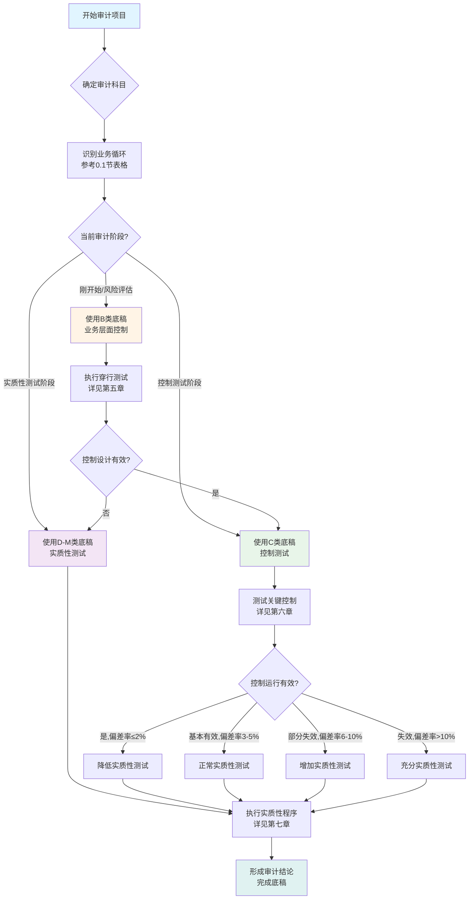
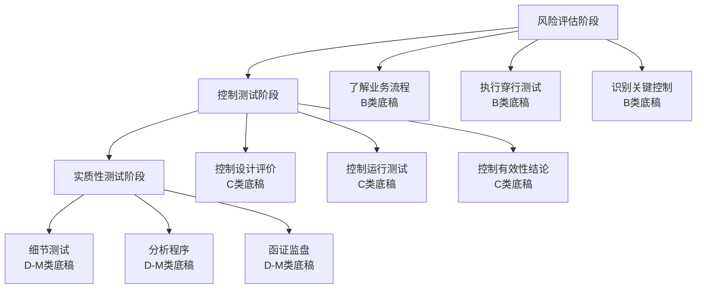

# 致同审计底稿实务操作手册

> **版本**: v1.0 | **更新日期**: 2025年10月 | **适用准则**: 中国注册会计师审计准则

---

## 📚 手册说明

本手册基于致同会计师事务所2025年最新审计底稿模板体系，系统整合了**穿行测试、控制测试和实质性测试**三大审计程序，为审计人员提供清晰的操作指引和底稿调用路径。

### 手册特点
- ✅ **流程化设计**：按审计阶段逐步推进
- ✅ **模板导航**：快速定位所需底稿
- ✅ **三测联动**：穿行测试→控制测试→实质性测试无缝衔接
- ✅ **实操导向**：提供具体操作步骤和案例
- ✅ **风险导向**：体现风险导向审计逻辑
- ✅ **标准化**：统一的章节结构和编号体系

---

## 📋 目录结构

### 第零部分：快速上手指南 ⭐
0. [5分钟快速上手](#第零章-5分钟快速上手指南)
1. [总导航体系](#第一章-总导航体系) ✅新增
2. [关键词索引](#第二章-关键词索引) ✅新增
3. [底稿索引总览](#第三章-底稿索引总览) ✅新增

### 第一部分：审计底稿体系总览
4. [底稿编码体系说明](#第四章-底稿编码体系说明)
5. [模板库清单一览](#第五章-模板库清单一览)
6. [业务循环分类索引](#第六章-业务循环分类索引)
7. [底稿关系图](#第七章-底稿关系图) ✅新增

### 第二部分：审计流程操作指引
8. [审计流程全景图](#第八章-审计流程全景图)
9. [风险评估阶段](#第九章-风险评估阶段)
10. [控制测试阶段](#第十章-控制测试阶段)
11. [实质性测试阶段](#第十一章-实质性测试阶段)
12. [质量控制体系](#第十二章-质量控制体系) ✅新增

### 第三部分：业务循环操作手册（分章节）
13. [销售与收款循环](#第十三章-销售与收款循环)
14. [货币资金循环](#第十四章-货币资金循环)
15. [存货与成本循环](#第十五章-存货与成本循环)
16. [投资循环](#第十六章-投资循环)
17. [固定资产循环](#第十七章-固定资产循环)
18. [在建工程循环](#第十八章-在建工程循环)
19. [无形资产循环](#第十九章-无形资产循环)
20. [研发循环](#第二十章-研发循环)
21. [职工薪酬循环](#第二十一章-职工薪酬循环)
22. [管理费用循环](#第二十二章-管理费用循环)
23. [税金循环](#第二十三章-税金循环)
24. [债务循环](#第二十四章-债务循环)
25. [租赁循环](#第二十五章-租赁循环)
26. [权益循环](#第二十六章-权益循环) ✅新增
27. [关联方循环](#第二十七章-关联方循环)

### 第四部分：附录与工具
28. [常见问题处理](#第二十八章-常见问题处理)
29. [底稿交叉引用](#第二十九章-底稿交叉引用)
30. [底稿模板速查表](#附录一-底稿模板速查表)
31. [审计程序检查清单](#附录二-审计程序检查清单)
32. [关键术语索引](#附录三-关键术语索引)
33. [Excel工具包](#附录四-Excel工具包) ✅新增
34. [案例库](#附录五-案例库) ✅新增

---

## 第零章 5分钟快速上手指南

> **目标**：让新手快速掌握底稿调用方法，5分钟内找到需要的底稿并开始工作

---

### 0.1 三步定位所需底稿

#### 步骤1：识别业务循环

根据审计科目，快速定位业务循环：

| 审计科目 | 业务循环 | 底稿代码 |
|---------|---------|---------|
| 营业收入、应收账款、合同资产/负债 | 销售与收款 | B23 → C2 → D |
| 库存现金、银行存款、其他货币资金 | 货币资金 | B24 → C3 → E |
| 存货、营业成本、应付账款 | 存货与成本 | B25 → C4 → F |
| 长期股权投资、其他权益工具投资 | 投资 | B26 → C5 → G |
| 固定资产、累计折旧、固定资产清理 | 固定资产 | B27 → C6 → H |
| 在建工程、工程物资 | 在建工程 | B28 → C7 → H |
| 无形资产、累计摊销、开发支出 | 无形资产 | B29 → C8 → I |
| 研发费用、开发支出 | 研发 | B30 → C9 → K |
| 应付职工薪酬、工资、社保 | 职工薪酬 | B31 → C10 → J |
| 管理费用 |  | B32 → C11 → K |
| 应交税费、税金及附加 | 税金 | B33 → C12 → K |
| 短期借款、长期借款、应付债券 | 债务 | B34 → C13 → L |
| 使用权资产、租赁负债 | 租赁 | B35 → C14 → 相关循环 |
| 关联方交易和余额 | 关联方 | B36 → C15 → 穿透各循环 |

#### 步骤2：确定审计阶段

根据项目进度，选择对应底稿类型：

```
┌─────────────────────────────────────────────┐
│  审计阶段判断                                  │
├─────────────────────────────────────────────┤
│  刚开始审计？                                 │
│  → 使用B类底稿（业务层面控制）                  │
│  → 执行穿行测试，了解内部控制                   │
│                                             │
│  穿行测试完成，控制设计有效？                   │
│  → 使用C类底稿（控制测试）                     │
│  → 测试关键控制运行有效性                      │
│                                             │
│  控制测试完成或不依赖控制？                     │
│  → 使用D-M类底稿（实质性测试）                 │
│  → 执行细节测试、函证、分析程序                 │
└─────────────────────────────────────────────┘
```

#### 步骤3：调用对应底稿

**快速调用路径**：

1. **查看完整清单**：跳转到 [第二章 模板库清单](#第二章-模板库清单一览)
2. **查看操作手册**：跳转到对应的循环操作手册（第8-21章）
3. **查看底稿文件**：在项目文件夹中找到对应的`.md`文件

**示例**：审计货币资金
```
1. 识别循环：货币资金 → B24/C3/E
2. 当前阶段：刚开始 → 使用B24（B23-2）
3. 查看手册：第九章 货币资金循环操作手册
4. 调用底稿：B类-业务层面控制/B23-2货币资金业务层面控制底稿模板库.md
```

---

## 第一章 总导航体系

### 1.1 按项目类型导航

#### IPO项目导航
- **重点关注循环**：销售循环、货币资金、关联方循环
- **特殊要求**：历史沿革、股权清晰、关联方完整性
- **加强程序**：所有循环的完整性测试、关联方100%检查

#### 上市公司年审导航
- **重点关注循环**：收入确认、资产减值、关联交易
- **特殊要求**：信息披露充分性、内控有效性
- **加强程序**：收入截止测试、资产减值测试

#### 非上市公司导航
- **重点关注循环**：根据业务特点确定
- **特殊要求**：合规性、真实性
- **常规程序**：按标准程序执行

### 1.2 按风险等级导航

#### 高风险程序（必须执行）
- **函证程序**：银行存款、应收账款、往来款项
- **实地检查**：存货监盘、固定资产盘点
- **分析程序**：收入趋势分析、毛利率分析

#### 中风险程序（常规执行）
- **重新计算**：折旧摊销、利息费用
- **截止测试**：收入、费用截止测试
- **检查程序**：合同检查、凭证检查

#### 低风险程序（可简化）
- **列报检查**：报表列报正确性
- **披露检查**：附注披露完整性

### 1.3 按审计阶段导航

#### 风险评估阶段
- **穿行测试**：了解内部控制设计
- **风险识别**：识别重大错报风险
- **程序选择**：确定审计策略

#### 控制测试阶段
- **控制测试**：测试内部控制运行有效性
- **控制评价**：评价控制风险
- **程序调整**：根据控制测试结果调整程序

#### 实质性测试阶段
- **细节测试**：执行实质性程序
- **分析程序**：执行分析性程序
- **结论形成**：形成审计结论

---

## 第二章 关键词索引

### A
- **A股IPO** → 第13章销售循环、第27章关联方循环
- **按揭贷款** → 第24章债务循环
- **安全库存** → 第15章存货循环

### B
- **保证金** → 第22章管理费用循环
- **备用金** → 第22章管理费用循环
- **保险** → 第17章固定资产循环
- **报表附注** → 各循环披露要求

### C
- **存货** → 第15章存货循环
- **长期股权投资** → 第16章投资循环
- **长期借款** → 第24章债务循环
- **成本核算** → 第15章存货循环

### D
- **短期借款** → 第24章债务循环
- **递延收益** → 第22章管理费用循环
- **抵押** → 第24章债务循环

### E
- **应收账款** → 第13章销售循环
- **银行存款** → 第14章货币资金循环
- **应交税费** → 第23章税金循环

### F
- **费用** → 第22章管理费用循环
- **固定资产** → 第17章固定资产循环
- **负债** → 第24章债务循环

### G
- **关联方** → 第27章关联方循环
- **工资** → 第21章职工薪酬循环
- **股权** → 第26章权益循环

### H
- **函证** → 各循环函证程序
- **合同** → 各循环合同检查
- **回函** → 各循环回函处理

### I
- **收入** → 第13章销售循环
- **利息** → 第24章债务循环
- **存货** → 第15章存货循环

### J
- **减值** → 各循环减值测试
- **截止** → 各循环截止测试
- **检查** → 各循环检查程序

### K
- **控制** → 各循环控制测试
- **客户** → 第13章销售循环
- **库存** → 第15章存货循环

### L
- **利润** → 第26章权益循环
- **利息** → 第24章债务循环
- **利润分配** → 第26章权益循环

### M
- **货币资金** → 第14章货币资金循环
- **毛利率** → 第13章销售循环
- **管理费用** → 第22章管理费用循环

### N
- **内控** → 各循环内部控制
- **年报** → 各循环年报审计
- **纳税** → 第23章税金循环

### O
- **其他应收款** → 第22章管理费用循环
- **其他应付款** → 第22章管理费用循环
- **所有者权益** → 第26章权益循环

### P
- **盘点** → 各循环盘点程序
- **凭证** → 各循环凭证检查
- **披露** → 各循环披露要求

### Q
- **权益** → 第26章权益循环
- **企业** → 第27章关联方循环
- **确认** → 各循环确认程序

### R
- **研发** → 第20章研发循环
- **人工** → 第21章职工薪酬循环
- **收入** → 第13章销售循环

### S
- **审计** → 各循环审计程序
- **实质性** → 各循环实质性测试
- **销售** → 第13章销售循环

### T
- **投资** → 第16章投资循环
- **摊销** → 第19章无形资产循环
- **调整** → 各循环调整分录

### U
- **无形资产** → 第19章无形资产循环
- **在建工程** → 第18章在建工程循环

### V
- **验证** → 各循环验证程序
- **价值** → 各循环价值测试

### W
- **往来** → 第22章管理费用循环
- **未分配利润** → 第26章权益循环
- **无形资产** → 第19章无形资产循环

### X
- **销售** → 第13章销售循环
- **现金** → 第14章货币资金循环
- **薪酬** → 第21章职工薪酬循环

### Y
- **应付账款** → 第15章存货循环
- **应付职工薪酬** → 第21章职工薪酬循环
- **应交税费** → 第23章税金循环

### Z
- **折旧** → 第17章固定资产循环
- **债务** → 第24章债务循环
- **资产** → 各循环资产审计

---

## 第三章 底稿索引总览

### B类底稿（业务层面控制测试）

| 底稿编号 | 底稿名称 | 适用循环 | 风险等级 | 执行阶段 |
|---------|---------|---------|---------|---------|
| B23-1 | 销售业务层面控制 | 销售循环 | 高 | 穿行测试 |
| B23-2 | 货币资金业务层面控制 | 货币资金 | 高 | 穿行测试 |
| B23-3 | 存货业务层面控制 | 存货循环 | 高 | 穿行测试 |
| B23-4 | 投资业务层面控制 | 投资循环 | 中 | 穿行测试 |
| B23-5 | 固定资产业务层面控制 | 固定资产 | 中 | 穿行测试 |
| B23-6 | 在建工程业务层面控制 | 在建工程 | 中 | 穿行测试 |
| B23-7 | 无形资产业务层面控制 | 无形资产 | 中 | 穿行测试 |
| B23-8 | 研发业务层面控制 | 研发循环 | 中 | 穿行测试 |
| B23-9 | 职工薪酬业务层面控制 | 职工薪酬 | 中 | 穿行测试 |
| B23-10 | 管理业务层面控制 | 管理循环 | 中 | 穿行测试 |
| B23-11 | 税金业务层面控制 | 税金循环 | 中 | 穿行测试 |
| B23-12 | 债务业务层面控制 | 债务循环 | 高 | 穿行测试 |
| B23-13 | 租赁业务层面控制 | 租赁循环 | 中 | 穿行测试 |
| B23-14 | 关联方业务层面控制 | 关联方循环 | 高 | 穿行测试 |
| B23-15 | 权益业务层面控制 | 权益循环 | 中 | 穿行测试 |

### C类底稿（控制测试）

| 底稿编号 | 底稿名称 | 适用循环 | 风险等级 | 执行阶段 |
|---------|---------|---------|---------|---------|
| C2 | 销售循环控制测试 | 销售循环 | 高 | 控制测试 |
| C3 | 货币资金循环控制测试 | 货币资金 | 高 | 控制测试 |
| C4 | 存货循环控制测试 | 存货循环 | 高 | 控制测试 |
| C5 | 投资循环控制测试 | 投资循环 | 中 | 控制测试 |
| C6 | 固定资产循环控制测试 | 固定资产 | 中 | 控制测试 |
| C7 | 在建工程循环控制测试 | 在建工程 | 中 | 控制测试 |
| C8 | 无形资产循环控制测试 | 无形资产 | 中 | 控制测试 |
| C9 | 研发循环控制测试 | 研发循环 | 中 | 控制测试 |
| C10 | 职工薪酬循环控制测试 | 职工薪酬 | 中 | 控制测试 |
| C11 | 管理循环控制测试 | 管理循环 | 中 | 控制测试 |
| C12 | 税金循环控制测试 | 税金循环 | 中 | 控制测试 |
| C13 | 债务循环控制测试 | 债务循环 | 高 | 控制测试 |
| C14 | 租赁循环控制测试 | 租赁循环 | 中 | 控制测试 |
| C15 | 关联方循环控制测试 | 关联方循环 | 高 | 控制测试 |
| C16 | 权益循环控制测试 | 权益循环 | 中 | 控制测试 |

### D-M类底稿（实质性测试）

| 底稿编号 | 底稿名称 | 适用循环 | 风险等级 | 执行阶段 |
|---------|---------|---------|---------|---------|
| D | 销售循环实质性测试 | 销售循环 | 高 | 实质性测试 |
| E | 货币资金循环实质性测试 | 货币资金 | 高 | 实质性测试 |
| F | 存货循环实质性测试 | 存货循环 | 高 | 实质性测试 |
| G | 投资循环实质性测试 | 投资循环 | 中 | 实质性测试 |
| H | 固定资产循环实质性测试 | 固定资产 | 中 | 实质性测试 |
| I | 无形资产循环实质性测试 | 无形资产 | 中 | 实质性测试 |
| J | 职工薪酬循环实质性测试 | 职工薪酬 | 中 | 实质性测试 |
| K | 管理循环实质性测试 | 管理循环 | 中 | 实质性测试 |
| L | 债务循环实质性测试 | 债务循环 | 高 | 实质性测试 |
| M | 权益循环实质性测试 | 权益循环 | 中 | 实质性测试 |
| Q | 关联方循环实质性测试 | 关联方循环 | 高 | 实质性测试 |

---

### 0.2 新手常见问题 Top 5

#### Q1：第一次执行审计项目，从哪里开始？

**回答**：按以下顺序开始

1. **第一步：了解被审计单位**
   - 阅读项目立项资料、上期审计报告
   - 了解行业特点、业务模式
   
2. **第二步：识别重要业务循环**
   - 看资产负债表，识别重要科目
   - 确定要审计的业务循环（通常5-8个）
   
3. **第三步：执行穿行测试**
   - 针对每个业务循环，使用B类底稿
   - 详细步骤参见 [第五章 风险评估阶段](#第五章-风险评估阶段)

**新手建议**：先从简单的循环入手，如货币资金、固定资产，积累经验后再做复杂的收入、存货循环。

---

#### Q2：底稿编号B23-2-3-4是什么意思？

**回答**：底稿编号分四级

```
B    23   -  2   -  3   -  4
│    │       │      │      │
│    │       │      │      └─ 四级：子底稿序号
│    │       │      │          (例如：穿行测试记录表)
│    │       │      │
│    │       │      └─────── 三级：二级子底稿序号
│    │       │                (例如：流程图及描述)
│    │       │
│    │       └────────────── 二级：循环序号
│    │                        (2=货币资金，1=销售，3=存货...)
│    │
│    └────────────────────── 一级：底稿系列号
│                             (23=业务层面控制系列)
│
└─────────────────────────── 类别代码
                              (B=业务层面控制, C=控制测试, D-M=实质性测试)
```

**快速记忆口诀**：
- **B** = Business (业务控制)
- **C** = Control (控制测试)  
- **D-M** = Detail (细节测试，按循环字母排序)

---

#### Q3：如何判断是否需要执行控制测试？

**回答**：根据以下决策树判断

```
开始
  ↓
被审计单位有内部控制吗？
  ↓ 是            ↓ 否
  ↓              直接实质性测试
  ↓              (不用C类底稿)
穿行测试发现控制设计有效吗？
  ↓ 是            ↓ 否
  ↓              直接实质性测试
  ↓
你打算依赖控制以降低实质性测试吗？
  ↓ 是            ↓ 否
  ↓              只做有限控制测试
执行控制测试    或直接实质性测试
(使用C类底稿)
```

**简单判断标准**：
- ✅ **需要做控制测试**：大型企业、内控完善、控制可测试、打算依赖控制
- ❌ **不需要控制测试**：小型企业、内控薄弱、控制不可测试、初次审计风险高

---

#### Q4：函证未回函怎么办？

**回答**：执行替代程序

| 函证类型 | 替代程序 | 底稿记录位置 |
|---------|---------|------------|
| 银行存款函证 | ①检查银行对账单和流水<br/>②核对期后收付款<br/>③必要时现场查看网银余额 | E0函证底稿+E1-19流水检查 |
| 应收账款函证 | ①检查期后回款记录<br/>②检查销售合同和发货单<br/>③检查对账记录 | D系列函证+期后回款测试 |
| 应付账款函证 | ①检查期后付款记录<br/>②检查采购合同和入库单<br/>③检查对账单 | F系列函证+期后付款测试 |

**重要提示**：
- 替代程序的证据力度低于函证，需增加测试样本量
- 在底稿中详细记录未回函原因和替代程序执行情况
- 如未回函比例过高（>30%），考虑对审计意见的影响

---

#### Q5：发现错报如何处理？

**回答**：按以下流程处理

**第一步：识别错报类型**
- **事实错报**：明确的计算或记录错误（如金额算错）
- **判断错报**：会计估计或会计政策选择的差异
- **推断错报**：基于样本推断总体的错报

**第二步：评估错报金额和重要性**
```
错报金额 < 明显微小错报阈值（通常为实际执行重要性的5-10%）
  → 可以不要求调整，记录未调整差异

错报金额 ≥ 明显微小阈值 且 < 实际执行重要性
  → 建议调整，如管理层不调整则累积错报

错报金额 ≥ 实际执行重要性
  → 强烈建议调整，可能影响审计意见
```

**第三步：与管理层沟通**
1. 说明发现的错报及其原因
2. 建议管理层进行调整
3. 记录管理层的态度和理由

**第四步：底稿记录**
- 在工作底稿中记录错报发现过程
- 在错报汇总表中汇总所有错报
- 在管理层声明书中要求管理层确认未调整错报

**参考章节**：[第七章 实质性测试阶段 - 4.3节 形成审计结论](#第七章-实质性测试阶段)

---

### 0.3 底稿调用决策树

#### 总体决策流程



#### 快速决策表

| 情况 | 审计策略 | 底稿调用路径 | 适用场景 |
|-----|---------|------------|---------|
| **情况1**<br/>内控完善<br/>控制可依赖 | 高控制依赖策略 | B类(简化) → C类(充分) → D-M类(降低) | 大型上市公司<br/>内控评价良好 |
| **情况2**<br/>内控良好<br/>控制复杂 | 综合策略 | B类(详细) → C类(部分) → D-M类(正常) | 中型企业<br/>部分控制依赖 |
| **情况3**<br/>内控一般<br/>不太依赖 | 低控制依赖策略 | B类(了解) → C类(有限) → D-M类(充分) | 民营企业<br/>主要实质性测试 |
| **情况4**<br/>内控薄弱<br/>或首次审计 | 纯实质性策略 | B类(简要) → 不做C类 → D-M类(全面) | 小微企业<br/>初次审计 |

---

### 0.4 常用符号说明

本手册使用以下符号标记重要信息：

| 符号 | 含义 | 说明 |
|-----|------|------|
| ⭐ | 重点内容 | 特别重要，必须掌握 |
| ✅ | 已完成 | 该部分内容已完整 |
| 📝 | 待完善 | 该部分内容尚未完成 |
| 🔴 | 高风险 | 高风险事项，需特别关注 |
| 🟡 | 中风险 | 中等风险事项 |
| 🟢 | 低风险 | 常规程序，按标准执行 |
| ⚠️ | 特别注意 | 容易出错或遗漏的地方 |
| 💡 | 提示 | 实用技巧和经验分享 |
| 📊 | 案例 | 实际案例说明 |

---

**✅ 快速上手指南完成！现在您可以开始使用本手册了。**

如有疑问，请查阅对应章节或联系项目经理/质量控制部门。

---

## 第一章 底稿编码体系说明

### 1.1 底稿编码规则

#### B类 - 业务层面控制（15个底稿）
- **B23系列**：销售循环业务层面控制
- **B24系列**：货币资金业务层面控制
- **B25系列**：存货业务层面控制
- **B26系列**：投资业务层面控制
- **B27系列**：固定资产业务层面控制
- **B28系列**：在建工程业务层面控制
- **B29系列**：无形资产业务层面控制
- **B30系列**：研发业务层面控制
- **B31系列**：职工薪酬业务层面控制
- **B32系列**：管理业务层面控制
- **B33系列**：税金业务层面控制
- **B34系列**：债务业务层面控制
- **B35系列**：租赁业务层面控制
- **B36系列**：关联方业务层面控制

#### C类 - 控制测试底稿（16个底稿）
- **C2**：销售循环控制测试
- **C3**：货币资金循环控制测试
- **C4**：存货循环控制测试
- **C5**：投资循环控制测试
- **C6**：固定资产循环控制测试
- **C7**：在建工程循环控制测试
- **C8**：无形资产循环控制测试
- **C9**：研发循环控制测试
- **C10**：职工薪酬循环控制测试
- **C11**：管理循环控制测试
- **C12**：税金循环控制测试
- **C13**：债务循环控制测试
- **C14**：租赁循环控制测试
- **C15**：关联方循环控制测试

#### D-M类 - 实质性测试底稿（10个底稿）
- **D系列**：收入循环实质性测试
- **E系列**：货币资金实质性测试
- **F系列**：存货循环实质性测试
- **G系列**：投资循环实质性测试
- **H系列**：固定资产循环实质性测试
- **I系列**：无形资产循环实质性测试
- **J系列**：职工薪酬循环实质性测试
- **K系列**：管理循环实质性测试
- **L系列**：债务循环实质性测试
- **M系列**：权益循环实质性测试

### 1.2 底稿调用逻辑

```
业务循环识别
    ↓
【B类】业务层面控制了解与评价（穿行测试）
    ↓
【C类】控制测试执行
    ↓
【D-M类】实质性测试执行
    ↓
复核与结论
```

---

## 第二章 模板库清单一览

### 2.1 完整模板清单

> **使用说明**：
> - **难度等级**：★☆☆入门 | ★★☆中级 | ★★★高级
> - **前置底稿**：必须先完成的底稿

---

#### B类 - 业务层面控制（15个）

| 序号 | 底稿编号 | 底稿名称 | 审计重点 | 难度 | 前置底稿 |
|------|----------|----------|----------|------|----------|
| 1 | B23 | 销售循环业务层面控制 | 收入确认控制、信用审批、应收账款管理 | ★★★ | 项目立项 |
| 2 | B24 | 货币资金业务层面控制 | 资金支付审批、银行对账、现金盘点 | ★★☆ | 项目立项 |
| 3 | B25 | 存货业务层面控制 | 采购审批、入库验收、存货盘点 | ★★★ | 项目立项 |
| 4 | B26 | 投资业务层面控制 | 投资决策审批、持续监控、收益确认 | ★★☆ | 项目立项 |
| 5 | B27 | 固定资产业务层面控制 | 资产购置审批、资产盘点、折旧计提 | ★★☆ | 项目立项 |
| 6 | B28 | 在建工程业务层面控制 | 工程立项审批、进度监控、完工转资 | ★★☆ | 项目立项 |
| 7 | B29 | 无形资产业务层面控制 | 无形资产取得、摊销计提、减值评估 | ★★☆ | 项目立项 |
| 8 | B30 | 研发业务层面控制 | 研发立项审批、支出归集、资本化判断 | ★★★ | 项目立项 |
| 9 | B31 | 职工薪酬业务层面控制 | 考勤管理、薪酬计算、社保缴纳 | ★★☆ | 项目立项 |
| 10 | B32 | 管理业务层面控制 | 费用审批、报销管理、预算控制 | ★☆☆ | 项目立项 |
| 11 | B33 | 税金业务层面控制 | 税费计算、申报缴纳、税务筹划 | ★★☆ | 项目立项 |
| 12 | B34 | 债务业务层面控制 | 借款审批、利息计提、合规性 | ★★☆ | 项目立项 |
| 13 | B35 | 租赁业务层面控制 | 租赁识别、初始计量、后续计量 | ★★★ | 项目立项 |
| 14 | B36 | 关联方业务层面控制 | 关联方识别、交易审批、定价公允性 | ★★★ | 项目立项 |
| 15 | B类索引 | 业务层面控制总索引 | 快速导航和底稿关联 | ★☆☆ | 无 |

---

#### C类 - 控制测试（16个）

| 序号 | 底稿编号 | 底稿名称 | 审计重点 | 难度 | 前置底稿 |
|------|----------|----------|----------|------|----------|
| 16 | C2 | 销售循环控制测试 | 销售审批、发货控制、收款管理 | ★★★ | B23 |
| 17 | C3 | 货币资金循环控制测试 | 支付控制、对账控制、现金管理 | ★★☆ | B24 |
| 18 | C4 | 存货循环控制测试 | 采购控制、入库控制、盘点控制 | ★★★ | B25 |
| 19 | C5 | 投资循环控制测试 | 投资审批、估值复核、收益核算 | ★★☆ | B26 |
| 20 | C6 | 固定资产循环控制测试 | 购置控制、盘点控制、折旧控制 | ★★☆ | B27 |
| 21 | C7 | 在建工程循环控制测试 | 立项控制、支出控制、转资控制 | ★★☆ | B28 |
| 22 | C8 | 无形资产循环控制测试 | 取得控制、摊销控制、减值控制 | ★★☆ | B29 |
| 23 | C9 | 研发循环控制测试 | 立项控制、归集控制、资本化控制 | ★★★ | B30 |
| 24 | C10 | 职工薪酬循环控制测试 | 考勤控制、计薪控制、发放控制 | ★★☆ | B31 |
| 25 | C11 | 管理循环控制测试 | 审批控制、报销控制、预算控制 | ★☆☆ | B32 |
| 26 | C12 | 税金循环控制测试 | 计算控制、申报控制、缴纳控制 | ★★☆ | B33 |
| 27 | C13 | 债务循环控制测试 | 借款控制、计息控制、还款控制 | ★★☆ | B34 |
| 28 | C14 | 租赁循环控制测试 | 识别控制、计量控制、记录控制 | ★★★ | B35 |
| 29 | C15 | 关联方循环控制测试 | 识别控制、审批控制、披露控制 | ★★★ | B36 |
| 30 | C类指南 | 交叉引用关系指南 | 底稿间逻辑关系和引用规则 | ★☆☆ | 无 |
| 31 | C类示例 | 控制测试程序示例库 | 各类控制测试方法和案例 | ★★☆ | 无 |

---

#### D-M类 - 实质性测试（10个）

| 序号 | 底稿编号 | 底稿名称 | 审计重点 | 难度 | 前置底稿 |
|------|----------|----------|----------|------|----------|
| 32 | D | 收入循环实质性测试 | 收入截止、收入细节、应收账款函证 | ★★★ | B23,C2 |
| 33 | E | 货币资金实质性测试 | 银行函证、现金盘点、流水核查 | ★★☆ | B24,C3 |
| 34 | F | 存货循环实质性测试 | 存货监盘、计价测试、跌价测试 | ★★★ | B25,C4 |
| 35 | G | 投资循环实质性测试 | 持股确认、估值测试、收益测试 | ★★★ | B26,C5 |
| 36 | H | 固定资产循环实质性测试 | 资产监盘、折旧测试、减值测试 | ★★☆ | B27,C6 |
| 37 | I | 无形资产循环实质性测试 | 权利确认、摊销测试、减值测试 | ★★☆ | B29,C8 |
| 38 | J | 职工薪酬循环实质性测试 | 薪酬明细核对、社保测试、个税测试 | ★★☆ | B31,C10 |
| 39 | K | 管理循环实质性测试 | 费用细节测试、分析程序、截止测试 | ★★☆ | B32,C11 |
| 40 | L | 债务循环实质性测试 | 借款函证、利息测算、合规性检查 | ★★☆ | B34,C13 |
| 41 | M | 权益循环实质性测试 | 实收资本验证、利润分配、权益变动 | ★★☆ | 无 |

---

### 2.2 底稿使用统计

| 类别 | 底稿数量 | 适用阶段 |
|------|---------|---------|
| B类（业务控制） | 15个 | 风险评估阶段 |
| C类（控制测试） | 16个 | 控制测试阶段 |
| D-M类（实质性测试） | 10个 | 实质性测试阶段 |
| **总计** | **41个** | **全流程** |

---

### 2.3 按风险等级分类

#### 🔴 高风险循环（重点关注）
| 循环 | B类 | C类 | D-M类 | 风险点 |
|------|-----|-----|-------|--------|
| 销售与收款 | B23 | C2 | D | 收入舞弊风险、应收账款坏账 |
| 存货与成本 | B25 | C4 | F | 存货跌价、成本结转 |
| 关联方 | B36 | C15 | 穿透 | 关联交易公允性、完整性 |
| 研发支出 | B30 | C9 | K | 资本化条件、归集完整性 |
| 租赁（新准则） | B35 | C14 | 参考 | 租赁识别、后续计量 |

#### 🟡 中等风险循环
| 循环 | B类 | C类 | D-M类 | 风险点 |
|------|-----|-----|-------|--------|
| 货币资金 | B24 | C3 | E | 资金安全、账户完整性 |
| 固定资产 | B27 | C6 | H | 折旧政策、资产减值 |
| 投资 | B26 | C5 | G | 估值准确性、收益确认 |
| 职工薪酬 | B31 | C10 | J | 计提准确性、社保合规 |
| 债务 | B34 | C13 | L | 借款完整性、利息准确性 |

#### 🟢 一般风险循环
| 循环 | B类 | C类 | D-M类 | 风险点 |
|------|-----|-----|-------|--------|
| 在建工程 | B28 | C7 | H | 转资时点、利息资本化 |
| 无形资产 | B29 | C8 | I | 摊销政策、权利完整性 |
| 管理费用 | B32 | C11 | K | 费用归集、预算执行 |
| 税金 | B33 | C12 | K | 计算准确性、申报及时性 |

---

### 2.4 按行业分类的底稿使用指南

#### 制造业（重点循环）
优先使用：B23/C2/D(收入) → B25/C4/F(存货) → B24/C3/E(货币) → B27/C6/H(固定资产) → B31/C10/J(薪酬)

#### 贸易企业（重点循环）
优先使用：B23/C2/D(收入) → B25/C4/F(存货) → B24/C3/E(货币) → B32/C11/K(管理)

#### 服务业（重点循环）
优先使用：B23/C2/D(收入) → B31/C10/J(薪酬) → B24/C3/E(货币) → B32/C11/K(管理)

#### 房地产（重点循环）
优先使用：B23/C2/D(收入) → B28/C7/H(在建) → B34/C13/L(债务) → B24/C3/E(货币)

#### 金融企业（重点循环）
优先使用：B26/C5/G(投资) → B24/C3/E(货币) → B34/C13/L(债务) → B23/C2/D(收入)

#### 高科技企业（重点循环）
优先使用：B30/C9/K(研发) → B23/C2/D(收入) → B29/C8/I(无形) → B31/C10/J(薪酬)

---

### 2.5 底稿文件路径快速索引

> **提示**：可使用Ctrl+F搜索底稿编号快速定位文件

| 类别 | 文件夹路径 | 文件数量 |
|------|-----------|---------|
| B类底稿 | `B类-业务层面控制/` | 15个 |
| C类底稿 | `C控制测试底稿模板/` | 16个 |
| D系列 | `D销售循环/` | 1个 |
| E系列 | `E货币资金循环/` | 1个 |
| F系列 | `F存货循环/` | 1个 |
| G系列 | `G投资循环/` | 1个 |
| H系列 | `H固定资产循环/` | 1个 |
| I系列 | `I无形资产循环/` | 1个 |
| J系列 | `J职工薪酬循环/` | 1个 |
| K系列 | `K管理循环/` | 1个 |
| L系列 | `L债务循环/` | 1个 |
| M系列 | `M权益循环/` | 1个 |

---

## 第三章 业务循环分类索引

### 3.1 按业务循环分类

#### 💰 销售与收款循环
- **B23** - 销售循环业务层面控制 → **C2** - 销售循环控制测试 → **D** - 收入循环实质性测试

#### 💵 货币资金循环
- **B24** - 货币资金业务层面控制 → **C3** - 货币资金控制测试 → **E** - 货币资金实质性测试

#### 📦 存货与成本循环
- **B25** - 存货业务层面控制 → **C4** - 存货控制测试 → **F** - 存货实质性测试
- 复核提示词：存货、应付票据、应付账款、营业成本、预付账款

#### 📈 投资循环
- **B26** - 投资业务层面控制 → **C5** - 投资控制测试 → **G** - 投资实质性测试

#### 🏭 固定资产循环
- **B27** - 固定资产业务层面控制 → **C6** - 固定资产控制测试 → **H** - 固定资产实质性测试

#### 🏗️ 在建工程循环
- **B28** - 在建工程业务层面控制 → **C7** - 在建工程控制测试 → （参考H类固定资产）

#### 💡 无形资产循环
- **B29** - 无形资产业务层面控制 → **C8** - 无形资产控制测试 → **I** - 无形资产实质性测试

#### 🔬 研发循环
- **B30** - 研发业务层面控制 → **C9** - 研发控制测试 → （参考K类管理循环）

#### 👥 职工薪酬循环
- **B31** - 职工薪酬业务层面控制 → **C10** - 职工薪酬控制测试 → **J** - 职工薪酬实质性测试

#### 📊 管理费用循环
- **B32** - 管理业务层面控制 → **C11** - 管理控制测试 → **K** - 管理循环实质性测试

#### 💼 税金循环
- **B33** - 税金业务层面控制 → **C12** - 税金控制测试 → （参考K类管理循环）

#### 💳 债务循环
- **B34** - 债务业务层面控制 → **C13** - 债务控制测试 → **L** - 债务实质性测试

#### 🏢 租赁循环
- **B35** - 租赁业务层面控制 → **C14** - 租赁控制测试 → （参考相关循环）

#### 🔗 关联方循环
- **B36** - 关联方业务层面控制 → **C15** - 关联方控制测试 → （穿透各循环）

---

## 第四章 审计流程全景图

### 4.1 三阶段审计流程



### 4.2 底稿调用路径（优化版）

#### 路径1：高控制依赖策略 🟢

**适用情况**：内控完善、控制可测试、控制可依赖

```
风险评估阶段
    ↓
【B类】穿行测试（简化执行，2-3个样本）
    ↓ 控制设计有效
    ↓
控制测试阶段
    ↓
【C类】控制测试（充分执行，样本量足够）
    ↓ 偏差率 ≤ 2%
    ↓
实质性测试阶段
    ↓
【D-M类】实质性测试（降低范围，减少20%-30%）
```

**典型场景**：
- 大型上市公司，内控健全
- 制造业企业，ERP系统完善
- 连续审计多年，控制持续有效

---

#### 路径2：低控制依赖策略 🟡

**适用情况**：内控一般、不依赖控制、首次审计

```
风险评估阶段
    ↓
【B类】穿行测试（了解性质，1-2个样本）
    ↓ 控制设计一般/薄弱
    ↓
控制测试阶段
    ↓
【C类】控制测试（有限执行，仅关键控制）
    ↓ 偏差率较高或不测试
    ↓
实质性测试阶段
    ↓
【D-M类】实质性测试（充分执行，全面测试）
```

**典型场景**：
- 民营企业，内控相对薄弱
- 首次审计，控制了解不充分
- 小微企业，控制不够正式

---

#### 路径3：综合策略 🔵

**适用情况**：内控良好但复杂、部分依赖控制

```
风险评估阶段
    ↓
【B类】穿行测试（详细执行，3-5个样本）
    ↓ 控制设计有效但复杂
    ↓
控制测试阶段
    ↓
【C类】控制测试（部分执行，重点控制）
    ↓ 偏差率 3%-5%
    ↓
实质性测试阶段
    ↓
【D-M类】实质性测试（正常范围，不增不减）
```

**典型场景**：
- 中型企业，内控较完善
- 复杂交易较多，风险中等
- 部分循环可依赖控制

---

#### 路径4：纯实质性策略 🔴

**适用情况**：内控缺失、控制不可测试、高风险项目

```
风险评估阶段
    ↓
【B类】穿行测试（简要了解，记录控制缺陷）
    ↓ 控制不存在/重大缺陷
    ↓
控制测试阶段
    ↓
【不执行C类】跳过控制测试
    ↓
实质性测试阶段
    ↓
【D-M类】实质性测试（全面充分，样本量增加50%以上）
```

**典型场景**：
- 小微企业，无正式内控
- 管理层诚信存疑
- 发现重大舞弊迹象

---

#### 路径选择决策表

| 评估因素 | 路径1<br/>高依赖 | 路径2<br/>低依赖 | 路径3<br/>综合 | 路径4<br/>纯实质 |
|---------|----------------|----------------|--------------|----------------|
| **企业规模** | 大型 | 中小型 | 中型 | 微型 |
| **内控完善度** | 完善 | 一般 | 较好 | 薄弱/缺失 |
| **控制复杂度** | 适中 | - | 复杂 |  |
| **审计历史** | 连续审计 | 首次或间断 |  | 首次审计 |
| **风险评估** | 低-中 | 中 | 中-高 | 高 |
| **管理层诚信** | 高 | 较高 |  | 存疑 |

---

#### 实战示例

**示例1：某制造业上市公司（采用路径1）**
- 企业规模：资产50亿，员工2000人
- 内控情况：完善的ERP系统，内控评价报告良好
- 审计策略：B类简化 → C类充分测试 → D-M类降低范围
- 实际效果：控制有效，实质性测试减少25%

**示例2：某贸易企业（采用路径2）**
- 企业规模：资产5亿，员工200人
- 内控情况：基本控制有，但不够正式
- 审计策略：B类了解 → C类有限测试 → D-M类充分执行
- 实际效果：发现部分控制偏差，加大实质性测试

**示例3：某高科技企业（采用路径3）**
- 企业规模：资产20亿，员工800人
- 内控情况：良好但研发业务复杂
- 审计策略：B类详细 → C类重点测试 → D-M类正常范围
- 实际效果：部分依赖控制，整体风险可控

---

### 4.3 审计策略决策矩阵 ⭐

> **目标**：帮助审计团队快速选择适当的审计策略

#### 4.3.1 决策矩阵（双因素分析）

```
                    控制复杂度
                    简单     适中     复杂
            ┌────────┬────────┬────────┐
     完善    │ 路径1  │ 路径1  │ 路径3  │
内           │ 高依赖 │ 高依赖 │ 综合   │
控   良好    ├────────┼────────┼────────┤
环           │ 路径1  │ 路径3  │ 路径3  │
境   一般    │ 高依赖 │ 综合   │ 综合   │
            ├────────┼────────┼────────┤
     薄弱    │ 路径2  │ 路径2  │ 路径4  │
            │ 低依赖 │ 低依赖 │ 纯实质 │
            └────────┴────────┴────────┘
```

#### 4.3.2 控制环境评估清单

在选择审计策略前，先评估被审计单位的控制环境：

| 评估项目 | 评分标准（1-5分） | 得分 |
|---------|-----------------|------|
| **管理层态度** | 1=消极，5=积极重视 | ___ |
| **组织架构** | 1=混乱，5=清晰完善 | ___ |
| **职责分工** | 1=不明确，5=明确且执行 | ___ |
| **信息系统** | 1=手工，5=完整ERP | ___ |
| **人员素质** | 1=素质低，5=专业胜任 | ___ |
| **内部审计** | 1=无，5=健全有效 | ___ |
| **历史表现** | 1=问题多，5=持续良好 | ___ |
| **财务报告** | 1=频繁调整，5=准确及时 | ___ |
| **总分** | **满分40分** | **___** |

**评分指引**：
- **32-40分**：控制环境完善 → 考虑路径1（高依赖）
- **24-31分**：控制环境良好 → 考虑路径3（综合）
- **16-23分**：控制环境一般 → 考虑路径2（低依赖）
- **8-15分**：控制环境薄弱 → 考虑路径4（纯实质）

#### 4.3.3 控制复杂度评估

| 评估维度 | 简单 | 适中 | 复杂 |
|---------|------|------|------|
| **业务流程** | 单一产品/服务 | 多产品线 | 多业态、跨境 |
| **交易类型** | 常规交易为主 | 部分复杂交易 | 大量衍生工具、结构化交易 |
| **信息系统** | 单一系统 | 多系统集成 | 多系统、定制化接口 |
| **组织层级** | 2-3级 | 4-5级 | 6级以上、多子公司 |
| **地域分布** | 单一地点 | 多地点（国内） | 跨国经营 |

#### 4.3.4 行业特殊考虑

不同行业在选择审计策略时的特殊考虑：

**制造业**
- 重点关注：存货、固定资产、成本归集
- 策略倾向：生产流程标准化的企业，适合路径1（高依赖）
- 风险提示：多品种小批量生产，成本核算复杂，建议路径3

**贸易企业**
- 重点关注：收入确认、存货周转、应收账款
- 策略倾向：连锁经营、POS系统完善，适合路径1
- 风险提示：大宗贸易、跨境贸易，建议路径2或3

**金融企业**
- 重点关注：金融资产估值、风险计量、利息收入
- 策略倾向：大型银行、内控严格，适合路径1
- 风险提示：非标业务多、创新产品多，建议路径3

**房地产**
- 重点关注：收入确认时点、成本归集、预售监管
- 策略倾向：大型开发商，适合路径3
- 风险提示：小型开发商、项目公司多，建议路径2

**高科技企业**
- 重点关注：研发资本化、收入确认（多要素安排）、股权激励
- 策略倾向：上市公司、内控完善，适合路径3
- 风险提示：创业期企业、研发占比高，建议路径2

**服务业**
- 重点关注：收入确认、人工成本、合同管理
- 策略倾向：连锁服务企业，适合路径1或3
- 风险提示：小型服务企业，建议路径2或4

#### 4.3.5 策略动态调整

审计策略不是一成不变的，在审计过程中应根据发现动态调整：

| 发现情况 | 调整方向 | 调整措施 |
|---------|---------|---------|
| 控制测试发现重大偏差 | 路径1→路径3或2 | 增加实质性测试范围 |
| 穿行测试发现设计缺陷 | 路径1/3→路径2 | 减少或取消控制测试 |
| 发现舞弊迹象 | 任何路径→路径4 | 全面实质性测试+追加程序 |
| 内控改进明显 | 路径2→路径3 | 适当增加控制测试 |
| 管理层不配合 | 路径1/3→路径2 | 减少依赖，增加实质性测试 |

#### 4.3.6 策略选择工作底稿

建议在项目初期编制**审计策略备忘录**，记录以下内容：

```
【审计策略决策备忘录】

一、被审计单位基本情况
- 企业规模：_________
- 所属行业：_________
- 审计历史：_________

二、控制环境评估
- 评估得分：___/40分
- 评估结论：完善/良好/一般/薄弱
- 主要依据：_________

三、控制复杂度评估
- 复杂度：简单/适中/复杂
- 主要考虑：_________

四、审计策略选择
- 选择路径：路径1/2/3/4
- 选择依据：_________

五、特殊考虑事项
- 行业特点：_________
- 风险因素：_________
- 其他考虑：_________

六、项目负责人批准
- 签字：_________ 日期：_________
```

---

## 第五章 风险评估阶段

### 5.1 阶段目标
- 了解被审计单位业务流程和内部控制
- 识别重大错报风险
- 确定审计策略（控制测试 vs 实质性测试）

### 5.2 使用底稿：B类业务层面控制

#### 5.2.1 B类底稿体系说明

B类底稿是业务层面控制评价的核心工具，每个业务循环的B类底稿通常包含以下子底稿：

| 子底稿编号 | 底稿名称 | 主要用途 |
|-----------|----------|----------|
| B23-X | 总体程序表 | 指导整个业务层面控制评价过程 |
| B23-X-1 | 整体控制汇总 | 了解控制环境、风险评估等五要素 |
| B23-X-2 | 流程图及描述 | 描述业务流程，识别控制点 |
| B23-X-3 | 控制矩阵 | 评价控制点的设计和运行有效性 |
| B23-X-4 | 穿行测试 | 验证控制设计有效性 |
| B23-X-5 | 控制测试 | 测试控制运行有效性 |
| B23-X-6 | 控制缺陷汇总 | 汇总和评价控制缺陷 |
| B23-X-7 | 控制测试汇总 | 汇总控制测试结果 |
| B23-X-8 | 控制评价报告 | 形成最终控制评价结论 |

#### 5.2.2 操作步骤详解

**步骤1：选择适用的业务循环**

根据被审计单位实际业务特点，选择相应的B类底稿：

| 行业类型 | 重点循环 | 适用底稿 |
|---------|---------|---------|
| 制造业 | 销售、存货、固定资产、研发、薪酬 | B23、B24、B25、B27、B30、B31 |
| 贸易企业 | 销售、货币资金、存货 | B23、B24、B25 |
| 服务业 | 销售、薪酬、管理费用 | B23、B31、B32 |
| 金融企业 | 货币资金、投资 | B24、B26 |
| 房地产 | 销售、在建工程、借款 | B23、B28、B34 |

**步骤2：执行穿行测试**

**2.1 了解业务流程（使用B23-X-2）**
- 与业务部门人员访谈，了解业务流程
- 绘制业务流程图，标注关键环节
- 识别各环节涉及的部门、岗位和职责
- 记录使用的信息系统和单据

操作要点：
```
访谈对象 → 业务部门负责人、关键岗位人员
访谈内容 → 业务发起、审批、执行、记录全流程
输出成果 → 流程图 + 流程描述文字
```

**2.2 识别控制点（使用B23-X-3控制矩阵）**

控制矩阵填写要点：

| 列项 | 填写说明 |
|-----|---------|
| 业务环节 | 对应流程图中的关键环节 |
| 控制目标 | 该环节要达到的控制目的 |
| 认定 | 涉及的财务报表认定（存在、完整性、准确性等） |
| 风险 | 该环节可能存在的风险 |
| 控制活动 | 被审计单位设置的控制措施 |
| 控制类型 | 预防性/检查性控制 |
| 控制属性 | 人工/自动化/依赖IT |
| 频率 | 每笔/每天/每周/每月等 |
| 设计评价 | 控制设计是否合理有效 |
| 是否关键控制 | 判断是否为关键控制点 |

**2.3 执行穿行测试（使用B23-X-4）**

穿行测试的核心：**追踪1-2笔交易从开始到结束的全过程**

操作流程：
1. 选择样本：选择1-2笔具有代表性的交易
2. 追踪过程：从交易发起开始，逐步追踪到记账
3. 验证控制：在每个控制点，验证控制是否得到执行
4. 获取证据：保留相关单据、审批记录的复印件
5. 记录结果：在底稿中详细记录穿行过程和发现

穿行测试记录表格式：
```
| 序号 | 业务环节 | 控制点描述 | 预期证据 | 实际证据 | 控制执行情况 | 备注 |
```

**步骤3：评价控制设计有效性**

基于穿行测试结果，评价控制设计：

| 评价要素 | 评价标准 | 判断依据 |
|---------|---------|---------|
| 完整性 | 关键风险点是否都有控制 | 控制矩阵的完整性 |
| 合理性 | 控制措施是否能应对风险 | 穿行测试验证结果 |
| 职责分离 | 不相容职务是否分离 | 流程图和穿行测试 |
| 可执行性 | 控制是否能够有效执行 | 穿行测试发现 |

**步骤4：形成初步结论并决定审计策略**

根据控制设计评价结果，确定下一步审计策略：

| 控制设计评价结果 | 审计策略 | 后续程序 |
|----------------|---------|---------|
| 设计有效，值得信赖 | 控制测试为主 | 执行C类控制测试，降低实质性测试范围 |
| 设计有效，但复杂度高 | 综合策略 | 部分控制测试 + 实质性测试 |
| 设计缺陷明显 | 实质性测试为主 | 不执行或少量控制测试，直接实质性测试 |
| 控制不存在 | 纯实质性测试 | 不执行控制测试，全面实质性测试 |

#### 5.2.3 底稿填写示例

**示例：货币资金循环穿行测试记录（简化版）**

参见：[货币资金循环操作手册](./操作手册/货币资金循环操作手册.md#穿行测试示例)

---

#### 5.2.4 完整穿行测试案例 ⭐

> **案例背景**：某制造企业货币资金循环穿行测试

**一、项目基本信息**

| 项目要素 | 具体信息 |
|---------|---------|
| 被审计单位 | XX机械制造有限公司 |
| 所属行业 | 制造业 |
| 企业规模 | 年销售收入5亿，员工500人 |
| 审计期间 | 2024年度 |
| 测试日期 | 2025年1月15日 |
| 执行人员 | 审计师：张三、李四 |
| 测试循环 | 货币资金循环 |
| 使用底稿 | B24（B23-2）货币资金业务层面控制 |

**二、业务流程了解**

**2.1 访谈记录**

访谈对象：财务部经理王某、出纳员刘某
访谈时间：2025年1月15日上午

主要了解内容：
1. 资金支付审批流程
2. 银行对账流程
3. 现金管理流程
4. 信息系统使用情况

**2.2 业务流程图**

```
资金支付流程：
业务部门申请 → 部门经理审批 → 财务部复核 → 
总经理审批（>10万） → 出纳付款 → 会计记账 → 
银行对账 → 余额调节表
```

**2.3 识别的关键控制点**

| 序号 | 控制点 | 控制目标 | 控制类型 | 频率 |
|-----|--------|---------|---------|------|
| ① | 支付申请单审批 | 确保支付真实、合理 | 预防性 | 每笔 |
| ② | 财务部复核 | 核对单据、验证合规性 | 预防性 | 每笔 |
| ③ | 大额支付双重审批 | 防止重大资金损失 | 预防性 | 每笔>10万 |
| ④ | 网银权限分离 | 制单、复核、审批分离 | 预防性 | 持续 |
| ⑤ | 每月银行对账 | 发现账实不符 | 检查性 | 每月 |

**三、穿行测试执行**

**3.1 选择的测试样本**

选择2024年12月5日的一笔材料采购付款：
- 金额：85,000元
- 收款方：XX钢材有限公司
- 付款方式：银行转账

**3.2 穿行测试记录表**

| 环节 | 控制点 | 预期控制证据 | 实际观察情况 | 控制执行情况 | 备注 |
|-----|--------|------------|------------|------------|------|
| 1.业务发起 | 采购部门填写支付申请单 | 支付申请单有采购合同、入库单 | ✓ 获取了支付申请单（编号：ZF2024-1205-001），附有采购合同、入库单 | 有效执行 | 单据齐全 |
| 2.部门审批 | 采购部经理审批 | 申请单上有部门经理签名和日期 | ✓ 申请单有采购部经理签字（张XX，12月5日） | 有效执行 | 签字清晰 |
| 3.财务复核 | 财务部复核单据 | 复核人签字，核对合同金额、发票 | ✓ 财务人员王XX签字复核（12月5日），核对了合同金额85,000元 | 有效执行 | 金额一致 |
| 4.总经理审批 | 金额<10万，不需要总经理审批 | 无需审批 | ✓ 确认该笔金额85,000元，符合授权审批标准 | 控制设计合理 | 符合政策 |
| 5.网银制单 | 出纳在网银系统制单 | 网银系统截图显示制单人、金额、收款方 | ✓ 查看网银系统，制单人：刘XX（出纳），金额、收款方信息正确 | 有效执行 | 系统记录完整 |
| 6.网银复核 | 财务经理在网银系统复核 | 网银系统显示复核人、复核时间 | ✓ 复核人：王XX（财务经理），复核时间12月5日15:20 | 有效执行 | 职责分离 |
| 7.会计记账 | 根据付款单据记账 | 记账凭证、对应银行流水 | ✓ 获取记账凭证（凭证号：记-1205-028），借：应付账款 85,000，贷：银行存款 85,000 | 有效执行 | 分录正确 |
| 8.银行对账 | 12月末银行对账 | 银行对账单、余额调节表 | ✓ 获取12月银行对账单和余额调节表，该笔支付已体现 | 有效执行 | 已对账 |

**3.3 获取的审计证据**

以下证据已复印/拍照并附于底稿：
- ☑ 支付申请单（编号ZF2024-1205-001）
- ☑ 采购合同（合同编号：CG-2024-098）
- ☑ 入库单（入库单号：RK-2024-1203-056）
- ☑ 网银支付截图（制单、复核、审批记录）
- ☑ 记账凭证（记-1205-028）
- ☑ 银行对账单（2024年12月）

**四、测试发现与评价**

**4.1 控制有效性评价**

| 控制点 | 设计评价 | 执行评价 | 综合结论 |
|--------|---------|---------|---------|
| ① 支付申请单审批 | 有效 |  | ✓ 控制有效 |
| ② 财务部复核 | 有效 |  | ✓ 控制有效 |
| ③ 大额支付双重审批 | 有效 | 未触发（金额<10万） | ✓ 设计合理 |
| ④ 网银权限分离 | 有效 |  | ✓ 控制有效 |
| ⑤ 每月银行对账 | 有效 |  | ✓ 控制有效 |

**4.2 发现的问题**

✓ **本次穿行测试未发现控制缺陷**

所有关键控制点均得到有效设计和执行：
- 职责分离明确（申请、审批、复核、制单、记账分离）
- 审批流程完整（部门审批→财务复核→网银复核）
- 证据留存完整（纸质单据+电子记录）
- 对账控制及时（每月对账）

**4.3 需要关注的事项**

虽然未发现控制缺陷，但建议关注：
1. **授权审批标准**：当前10万元审批标准是否合理，建议关注大额支付比例
2. **系统依赖**：网银系统的权限设置和日志记录应作为IT控制关注点

**五、审计结论与后续程序**

**5.1 穿行测试结论**

基于上述穿行测试结果，我们得出以下结论：

> **货币资金循环的关键控制设计有效，并在测试的样本中得到有效执行。**

具体结论：
- ✅ 业务流程了解充分
- ✅ 关键控制点识别完整
- ✅ 控制设计合理有效
- ✅ 控制执行证据充分
- ✅ 职责分离得到遵守

**5.2 审计策略建议**

基于穿行测试结果，建议采用**路径1（高控制依赖策略）**或**路径3（综合策略）**：

| 建议策略 | 后续程序 | 理由 |
|---------|---------|------|
| **推荐：路径3** | 部分控制测试+正常实质性测试 | 控制有效但样本有限，建议扩大控制测试以确认全年有效性 |
| 备选：路径1 | 充分控制测试+降低实质性测试 | 如果后续控制测试证实全年控制有效，可降低实质性测试范围 |

**5.3 后续审计程序**

1. **控制测试（C3底稿）**：
   - 测试支付审批控制（建议样本量：25-30笔）
   - 测试银行对账控制（建议样本量：全部12个月）
   - 测试网银权限分离控制（观察+询问）

2. **实质性测试（E底稿）**：
   - 银行存款函证（全部银行账户）
   - 现金盘点（资产负债表日）
   - 银行流水检查（大额异常交易）

3. **IT控制关注**：
   - 测试网银系统权限设置
   - 检查系统日志完整性
   - 评估系统变更管理

**5.4 底稿索引**

| 底稿类型 | 底稿编号 | 底稿名称 | 状态 |
|---------|---------|---------|------|
| 当前底稿 | B24-4 | 货币资金穿行测试记录 | ✅ 已完成 |
| 后续底稿 | C3 | 货币资金控制测试 | ⏳ 计划执行 |
| 后续底稿 | E | 货币资金实质性测试 | ⏳ 计划执行 |

**六、复核与签字**

| 角色 | 姓名 | 签字 | 日期 |
|-----|------|------|------|
| 执行人 | 张三 | _______ | 2025-01-15 |
| 复核人 | 李四 | _______ | 2025-01-16 |
| 项目经理 | 王五 | _______ | 2025-01-17 |

---

**💡 案例要点总结**

这个完整的穿行测试案例展示了：

1. **准备充分**：明确背景信息、访谈计划
2. **流程清晰**：绘制业务流程图、识别控制点
3. **执行规范**：选择合适样本、逐步追踪、记录详细
4. **证据充分**：获取并保留各环节证据
5. **评价专业**：分析控制有效性、提出审计策略
6. **衔接顺畅**：明确后续程序、底稿索引

**📋 实务操作建议**

1. **样本选择**：选择金额适中、具有代表性的交易，避免极端案例
2. **证据获取**：每个控制点都要获取证据，拍照/复印保存
3. **记录详细**：记录具体的人名、日期、金额、单据编号
4. **职业怀疑**：即使控制看起来有效，也要保持警惕，观察是否有例外
5. **沟通顺畅**：与被审计单位保持良好沟通，及时获取资料

---

## 第六章 控制测试阶段

### 6.1 阶段目标
- 测试关键控制运行有效性
- 确定可依赖的控制
- 调整实质性测试范围

### 6.2 使用底稿：C类控制测试

#### 6.2.1 C类底稿体系说明

C类底稿用于测试关键控制的运行有效性，通常包含：

| 底稿编号 | 底稿名称 | 主要用途 |
|---------|---------|---------|
| C2-C15 | 控制测试主表 | 汇总控制测试计划和结果 |
| C2-1 | 控制测试执行记录 | 记录具体测试过程 |
| C2-2 | 控制偏差评价表 | 评价发现的控制偏差 |

#### 6.2.2 操作步骤详解

**步骤1：选择测试控制**

基于B类底稿（B23-X-3控制矩阵）识别的关键控制，确定需要测试的控制：

选择标准：
- 标记为"关键控制"的控制点
- 应对重大错报风险的控制
- 打算依赖的控制（以降低实质性测试范围）

选择流程：
1. 查看B类底稿的控制矩阵
2. 筛选"是否关键控制"列标记为"是"的控制
3. 评估每个控制的可测试性
4. 在C类底稿中列示拟测试的控制清单

**步骤2：确定样本量**

根据**控制频率**和**风险等级**确定样本量：

| 控制频率 | 低风险 | 中风险 | 高风险 |
|---------|--------|--------|--------|
| 每笔交易 | 25个 | 30-35个 | 40个 |
| 每天 | 25个 | 30-35个 | 40个 |
| 每周 | 15个 | 20-25个 | 25个 |
| 每半月 | 10个 | 15个 | 20个 |
| 每月 | 5个 | 8-10个 | 15个 |
| 每季度 | 2-3个 | 4个 | 全部 |
| 每年 | 1个 | 全部 |  |

**样本量调整因素：**
- 控制复杂度高：增加10%-20%
- 前期测试发现问题：增加20%-30%
- 控制自动化程度高：可适当减少
- 初次审计：增加20%-30%

**步骤3：执行测试程序**

根据控制类型选择适当的测试方法：

| 控制类型 | 推荐测试方法 | 测试重点 | 证据要求 |
|---------|-------------|---------|---------|
| 审批控制 | 检查 | 审批权限、审批证据 | 审批单据复印件/截图 |
| 复核控制 | 检查+询问 | 复核内容、复核记录 | 复核记录、访谈记录 |
| 对账控制 | 检查 | 对账频率、差异处理 | 对账单、差异调整记录 |
| 盘点控制 | 观察+检查 | 盘点程序、盘点记录 | 盘点表、差异处理记录 |
| 系统控制 | 重新执行 | 系统逻辑、权限设置 | 系统截图、测试结果 |
| 职责分离 | 询问+观察 | 岗位设置、实际执行 | 岗位说明、访谈记录 |

**测试方法详解：**

**A. 检查（Inspection）**
- 适用场景：有书面证据的控制
- 操作要点：
  1. 获取控制执行的单据/记录
  2. 核对控制是否按要求执行
  3. 关注审批签名、日期、金额等关键要素
  4. 保留证据复印件或截图

**B. 询问（Inquiry）**
- 适用场景：了解控制执行情况
- 操作要点：
  1. 向控制执行人员询问
  2. 关注控制的一致性和例外情况
  3. 记录询问内容和回复
  4. 必要时进行交叉验证

**C. 观察（Observation）**
- 适用场景：现场执行的控制
- 操作要点：
  1. 现场观察控制执行过程
  2. 关注控制是否按流程执行
  3. 拍照或录像留存证据
  4. 记录观察时间、地点、人员

**D. 重新执行（Reperformance）**
- 适用场景：验证控制有效性
- 操作要点：
  1. 独立重新执行控制程序
  2. 将结果与被审计单位结果对比
  3. 记录差异及原因
  4. 评估控制可靠性

**步骤4：评价控制偏差**

**4.1 识别偏差类型**

| 偏差类型 | 定义 | 示例 |
|---------|------|------|
| 控制未执行 | 控制程序完全未执行 | 审批单据无签名 |
| 控制执行不当 | 控制执行但不符合要求 | 超权限审批、审批不及时 |
| 控制证据缺失 | 控制可能执行但无证据 | 口头审批无书面记录 |
| 系统性偏差 | 偏差反复出现 | 同一人多次超权限审批 |

**4.2 偏差评价六步法**

```
步骤1：记录偏差 → 详细描述偏差情况
    ↓
步骤2：分析原因 → 分析偏差产生的原因
    ↓
步骤3：评估性质 → 判断是偶然还是系统性
    ↓
步骤4：量化影响 → 计算偏差率（偏差数/样本量）
    ↓
步骤5：形成结论 → 判断控制是否有效
    ↓
步骤6：调整策略 → 调整实质性测试范围
```

**4.3 偏差率判断标准**

| 偏差率 | 控制有效性评价 | 对审计策略的影响 |
|-------|---------------|-----------------|
| 0-2% | 控制有效 | 可依赖控制，降低实质性测试范围 |
| 3-5% | 控制基本有效 | 部分依赖，实质性测试正常范围 |
| 6-10% | 控制部分失效 | 不依赖控制，增加实质性测试 |
| >10% | 控制失效 | 控制不可依赖，充分实质性测试 |

**步骤5：汇总测试结论**

在C类底稿中汇总：
- 测试的控制数量
- 样本总数
- 发现的偏差数量和类型
- 控制有效性总体评价
- 对实质性测试的影响

#### 6.2.3 控制测试记录示例

**示例：货币资金银行对账控制测试记录（简化版）**

参见：[货币资金循环操作手册](./操作手册/货币资金循环操作手册.md#控制测试示例)

---

### 6.3 控制测试工具表 ⭐

> **目标**：提供实用工具表，帮助审计人员高效执行控制测试

#### 6.3.1 样本量速查表（A4打印版）

**📋 控制测试样本量快速参考表**

| 控制频率 | 总体规模 | 低风险<br/>（预期偏差率0-1%） | 中风险<br/>（预期偏差率1-3%） | 高风险<br/>（预期偏差率3-5%） |
|---------|---------|--------------------------|--------------------------|--------------------------|
| **每笔交易** | 任意 | 25个 | 30-35个 | 40个 |
| **每天** | >250天 | 25个 | 30-35个 | 40个 |
| **每周** | 52周 | 15个 | 20-25个 | 25个 |
| **每半月** | 24次 | 10个 | 15个 | 20个 |
| **每月** | 12个月 | 5个 | 8-10个 | 全部 |
| **每季度** | 4个季度 | 2-3个 | 全部 |  |
| **每年** | 1次 | 1个 |  |  |

**样本量调整系数表**

| 调整因素 | 低风险 | 中风险 | 高风险 |
|---------|-------|-------|-------|
| **基础样本量** | 100% |  |  |
| **初次审计** | +20% | +30% | +40% |
| **复杂控制** | +10% | +20% | +30% |
| **前期发现问题** | +20% | +30% | +40% |
| **自动化控制** | -10% |  | 0% |
| **IT系统完善** | -10% |  | 0% |

**使用示例**

```
案例：测试销售审批控制
- 控制频率：每笔交易
- 风险评估：中风险
- 调整因素：初次审计
- 计算：基础样本30个 × (1+30%) = 39个
- 最终样本量：40个（四舍五入）
```

**注意事项**

⚠️ 以下情况需特殊考虑：
1. **总体规模很小**：如每月控制但仅有6个月数据，应全部测试
2. **关键控制**：即使样本量计算较少，建议不低于5个
3. **统计抽样**：如采用统计抽样方法，样本量需按统计公式计算
4. **分层抽样**：如总体分布不均匀，需分层后确定各层样本量

---

#### 6.3.2 偏差分析模板

**📊 控制测试偏差分析工作底稿**

**项目信息**
- 被审计单位：_______________
- 审计期间：_______________
- 测试循环：_______________
- 测试控制：_______________
- 测试人员：_______________ 日期：_______________

**偏差记录表**

| 序号 | 样本编号/<br/>交易日期 | 预期控制 | 偏差描述 | 偏差类型 | 偏差原因 | 影响评估 |
|-----|-------------------|---------|---------|---------|---------|---------|
| 1 | | | | □未执行<br/>□执行不当<br/>□证据缺失 | | |
| 2 | | | | □未执行<br/>□执行不当<br/>□证据缺失 | | |
| 3 | | | | □未执行<br/>□执行不当<br/>□证据缺失 | | |
| 4 | | | | □未执行<br/>□执行不当<br/>□证据缺失 | | |
| 5 | | | | □未执行<br/>□执行不当<br/>□证据缺失 | | |

**偏差统计汇总**

| 统计项目 | 数量 | 百分比 | 说明 |
|---------|-----|--------|------|
| 测试样本总数 | _____ | 100% | |
| 无偏差样本数 | _____ | _____% | |
| 有偏差样本数 | _____ | _____% | 偏差率 |
| - 控制未执行 | _____ | _____% | |
| - 控制执行不当 | _____ | _____% | |
| - 控制证据缺失 | _____ | _____% | |

**偏差性质分析**

| 分析维度 | 评估结果 | 说明 |
|---------|---------|------|
| **偏差分布** | □集中在某个时期<br/>□分散在全年<br/>□无明显规律 | |
| **偏差人员** | □同一执行人<br/>□多个执行人<br/>□不适用 | |
| **偏差原因** | □政策不清楚<br/>□流程不完善<br/>□人员疏忽<br/>□其他：_______ | |
| **偏差严重性** | □严重（可能导致重大错报）<br/>□一般（影响有限）<br/>□轻微（可忽略） | |
| **系统性评估** | □系统性偏差（需关注）<br/>□偶然性偏差（可接受） | |

**控制有效性结论**

根据偏差率和性质分析，本控制的有效性评价为：

□ **有效**（偏差率≤2%，可依赖控制，降低实质性测试）
□ **基本有效**（偏差率3-5%，部分依赖，正常实质性测试）
□ **部分失效**（偏差率6-10%，不依赖控制，增加实质性测试）
□ **失效**（偏差率>10%，控制不可依赖，充分实质性测试）

**对审计策略的影响**

□ 维持原审计策略
□ 调整审计策略：
  - 控制测试：□增加样本量 □扩大测试范围 □停止控制测试
  - 实质性测试：□增加范围___% □正常执行 □降低范围___%
  - 其他调整：_______________________

**需要与管理层沟通的事项**

□ 无需沟通
□ 需要沟通以下事项：
1. _______________________________
2. _______________________________
3. _______________________________

**复核意见**

- 复核人：_______________ 
- 复核日期：_______________
- 复核意见：_______________

---

#### 6.3.3 控制测试记录模板

**📝 控制测试执行记录表（通用版）**

**一、控制基本信息**

| 项目 | 内容 |
|-----|------|
| 被审计单位 | |
| 测试循环 | □销售 □货币资金 □存货 □投资 □固定资产 □其他：_____ |
| 控制编号 | |
| 控制描述 | |
| 控制类型 | □预防性 □检查性 |
| 控制属性 | □人工 □自动化 □依赖IT |
| 控制频率 | □每笔 □每天 □每周 □每月 □其他：_____ |
| 控制目标 | □真实性 □完整性 □准确性 □截止 □分类 □其他 |
| 相关认定 | □存在 □完整性 □准确性 □截止 □分类和列报 |

**二、测试计划**

| 项目 | 内容 |
|-----|------|
| 测试方法 | □检查 □询问 □观察 □重新执行 □组合方法 |
| 样本量 | 计划：_____ 实际：_____ |
| 抽样方法 | □随机抽样 □系统抽样 □分层抽样 □判断抽样 |
| 测试期间 | 从______至______ |
| 测试人员 | |
| 测试日期 | |

**三、测试执行记录**

| 序号 | 样本描述/<br/>日期/凭证号 | 控制执行<br/>预期证据 | 实际测试结果 | 测试结论 | 备注 |
|-----|---------------------|-----------------|------------|---------|------|
| 1 | | | □符合预期<br/>□存在偏差 | | |
| 2 | | | □符合预期<br/>□存在偏差 | | |
| 3 | | | □符合预期<br/>□存在偏差 | | |
| 4 | | | □符合预期<br/>□存在偏差 | | |
| 5 | | | □符合预期<br/>□存在偏差 | | |
| ... | | | | | |

**四、测试结果汇总**

| 统计项目 | 数量/比例 |
|---------|----------|
| 测试样本总数 | _____ |
| 无偏差样本数 | _____ (____%) |
| 有偏差样本数 | _____ (____%) |
| 偏差率 | _____% |

**五、测试结论**

**5.1 控制有效性评价**

□ 控制设计有效，运行有效（偏差率≤2%）
□ 控制设计有效，基本运行有效（偏差率3-5%）
□ 控制设计有效，运行部分失效（偏差率6-10%）
□ 控制设计有效，运行失效（偏差率>10%）
□ 控制设计缺陷

**5.2 主要发现**

| 发现类型 | 具体描述 | 影响评估 |
|---------|---------|---------|
| □控制缺陷 | | □重大 □一般 □轻微 |
| □改进建议 | | |
| □其他事项 | | |

**5.3 对实质性测试的影响**

□ 可依赖控制，建议降低实质性测试范围约____%
□ 部分依赖控制，实质性测试正常范围
□ 不依赖控制，建议增加实质性测试范围约____%
□ 控制完全不可依赖，实质性测试充分执行

**六、质量复核**

| 角色 | 姓名 | 意见 | 签字 | 日期 |
|-----|------|-----|------|------|
| 执行人 | | | | |
| 复核人 | | | | |
| 项目经理 | | | | |

---

**📎 工具表使用指南**

**使用流程**

1. **计划阶段**：使用6.3.1样本量速查表确定样本量
2. **执行阶段**：使用6.3.3控制测试记录模板记录测试过程
3. **评价阶段**：使用6.3.2偏差分析模板分析偏差并形成结论

**打印建议**

- **样本量速查表**：打印成A4卡片，放在审计包中随时查阅
- **偏差分析模板**：每个控制使用一份，附在控制测试底稿后
- **测试记录模板**：根据需要扩展样本行数，可打印A3版便于填写

**Excel版本**

建议将以上模板制作成Excel格式，便于：
- 自动计算偏差率
- 样本量调整计算
- 数据统计分析
- 多项目复用

**数字化应用**

有条件的项目组可考虑：
- 使用审计软件的控制测试模块
- 扫描或拍照控制证据，电子化归档
- 使用平板电脑现场记录测试结果

---

## 第七章 实质性测试阶段

### 7.1 阶段目标
- 发现认定层次重大错报
- 获取充分适当审计证据
- 形成审计结论

### 7.2 使用底稿：D-M类实质性测试

#### 7.2.1 D-M类底稿体系说明

D-M类底稿是实质性测试的核心工具，每个业务循环包含：

| 底稿类型 | 底稿名称 | 主要用途 |
|---------|---------|---------|
| 程序表 | 实质性程序表（如E1A） | 总体指导，列示所有审计程序 |
| 审定表 | 科目审定表（如E1-1） | 汇总科目余额，分析变动 |
| 明细表 | 科目明细表（如E1-2、E1-3） | 明细账核对，识别异常 |
| 函证类 | 函证程序表（如E0系列） | 函证计划、执行、结果 |
| 分析类 | 分析程序表（如E1-14） | 趋势分析、比率分析 |
| 检查类 | 检查测试表（如E1-18至E1-23） | 单据检查、截止测试 |
| 舞弊应对 | 舞弊风险应对程序（如E1-26至E1-32） | 专项舞弊风险应对测试 |

#### 7.2.2 操作步骤详解

**步骤1：确定测试范围**

根据控制测试结果调整实质性测试范围：

| 控制测试结论 | 实质性测试范围调整 | 具体措施 |
|------------|------------------|---------|
| 控制有效（偏差率≤2%） | 降低20%-30% | 减少样本量，降低详细程度 |
| 控制基本有效（偏差率3-5%） | 保持正常范围 | 按计划执行 |
| 控制部分失效（偏差率6-10%） | 增加20%-30% | 增加样本量，提高详细程度 |
| 控制失效（偏差率>10%） | 增加50%以上 | 大幅增加测试范围，加强检查 |
| 未执行控制测试 | 充分实质性测试 | 不依赖控制，全面测试 |

**范围调整的具体体现：**
- **样本量调整**：增加或减少抽样样本数量
- **测试深度调整**：增加或减少单据检查的详细程度
- **测试类型调整**：增加或减少特定测试程序（如函证、监盘）
- **测试时点调整**：增加期中测试或加强期末测试

**步骤2：选择测试程序**

实质性测试程序主要包括以下类型：

**A. 细节测试**

细节测试是实质性测试的核心，包括：

| 测试类型 | 适用场景 | 测试步骤 | 底稿索引 |
|---------|---------|---------|---------|
| 余额核对 | 所有科目 | ①获取明细账 ②与总账核对 ③编制审定表 | E1-1至E1-3 |
| 交易测试 | 收入、成本、费用 | ①抽取交易样本 ②检查支持性单据 ③验证会计处理 | E1-21至E1-23 |
| 截止测试 | 收入、存货、采购 | ①获取截止期前后交易 ②检查单据日期 ③验证入账期间 | E1-21、E1-22 |
| 计价测试 | 存货、投资、固定资产 | ①获取计价依据 ②重新计算 ③与账面对比 | 各循环专项底稿 |
| 分类测试 | 所有科目 | ①检查科目分类 ②核对列报项目 ③确认披露完整性 | 审定表+披露检查表 |

**B. 分析程序**

分析程序用于识别异常波动和趋势：

| 分析类型 | 分析方法 | 适用科目 | 底稿索引 |
|---------|---------|---------|---------|
| 趋势分析 | 同比、环比分析 | 所有重要科目 | E1-14 |
| 比率分析 | 财务比率计算对比 | 资产负债率、周转率等 | E1-14 |
| 合理性测试 | 估算并与账面对比 | 利息收入、折旧费用等 | E1-15、E1-20 |
| 配比分析 | 关联科目配比关系 | 存款规模与利息收入 | E1-30 |

**C. 函证程序**

函证是重要的外部证据获取手段：

| 函证对象 | 函证内容 | 函证方式 | 底稿索引 |
|---------|---------|---------|---------|
| 银行 | 存款、借款、票据、理财 | 积极式 | E0系列 |
| 客户 | 应收账款余额 | 积极式/消极式 | D系列函证 |
| 供应商 | 应付账款余额 | 积极式 | F系列函证 |
| 律师 | 诉讼、担保事项 | 积极式 | 专项函证 |

**D. 监盘程序**

监盘用于验证实物资产的存在：

| 监盘对象 | 监盘重点 | 监盘程序 | 底稿索引 |
|---------|---------|---------|---------|
| 现金 | 现金实存、白条替代 | 突击盘点、现场清点 | E1-7、E1-8 |
| 存货 | 数量、状况、所有权 | 抽盘、观察、询问 | F系列盘点底稿 |
| 固定资产 | 存在、状况、使用情况 | 抽查、观察、拍照 | H系列盘点底稿 |
| 银行存单 | 存单真实性、权利限制 | 盘点、核对、函证 | E1-9 |

**步骤3：执行测试程序**

**3.1 标准执行流程**

```
准备阶段
    ↓
① 明确测试目标（针对哪些认定）
② 确定测试范围（样本量、测试期间）
③ 准备测试工具（底稿模板、检查清单）
    ↓
执行阶段
    ↓
④ 获取审计证据（账表、单据、外部确认）
⑤ 执行测试程序（核对、计算、检查、分析）
⑥ 记录测试过程（底稿填写、证据附件）
    ↓
评价阶段
    ↓
⑦ 识别差异或异常
⑧ 调查差异原因
⑨ 评估错报影响
⑩ 形成测试结论
```

**3.2 各类底稿填写要点**

**审定表填写（以E1-1为例）：**
1. 填写基本信息（被审计单位、日期、索引号）
2. 列示科目明细（一级、二级科目）
3. 填写期初、本期、期末余额
4. 标注审计调整（借方/贷方调整）
5. 计算审定数（账面数±调整）
6. 填写索引号（与明细表、调整分录交叉引用）
7. 复核签字

**函证底稿填写（以E0系列为例）：**
1. 列示函证对象清单
2. 记录发函信息（日期、方式、快递单号）
3. 核对回函信息（回函日期、方式、地址一致性）
4. 比对函证差异（账面数vs回函数）
5. 调查差异原因
6. 执行替代程序（针对未回函）
7. 形成函证结论

**分析程序底稿填写（以E1-14为例）：**
1. 列示分析科目
2. 填写比较期数据（本期、上期、预算）
3. 计算变动额和变动率
4. 设定重要性阈值（如10%）
5. 标注异常波动项目
6. 分析异常原因
7. 形成分析结论

**步骤4：形成审计结论**

**4.1 汇总审计发现**

在程序表（如E1A）中汇总：
- 已执行的审计程序
- 获取的审计证据
- 识别的错报
- 未调整差异
- 披露事项

**4.2 评估认定层次风险**

针对每个重要认定，评估剩余风险：

| 认定 | 测试结果 | 剩余风险评估 | 是否需要追加程序 |
|-----|---------|-------------|----------------|
| 存在 | 函证相符、监盘无差异 | 低 | 否 |
| 完整性 | 截止测试发现提前确认收入 | 中 | 是 |
| 准确性 | 计价测试发现高估存货 | 高 | 是 |
| ... |  |  |  |

**4.3 形成审计结论**

审计结论应包括：
- 科目余额的公允性评价
- 重大错报的识别和调整情况
- 披露的充分性评价
- 需要关注的事项
- 对审计意见的影响

**4.4 编制汇总底稿**

在循环汇总底稿中记录：
- 已调整错报汇总
- 未调整错报汇总
- 重分类调整汇总
- 披露建议清单
- 管理层沟通事项

#### 7.2.3 实质性测试记录示例

**示例：货币资金函证程序执行记录（简化版）**

参见：[货币资金循环操作手册](./操作手册/货币资金循环操作手册.md#实质性测试示例)

#### 7.2.4 常见问题处理

**Q1：控制测试有效，是否可以不做实质性测试？**
不可以。审计准则要求，无论控制测试结果如何，都必须对重要账户余额和交易类别执行实质性程序。控制有效只能降低实质性测试的范围，不能完全替代。

**Q2：函证未回函如何处理？**
执行替代程序：
- 检查期后收款（应收账款）
- 检查银行对账单和流水（银行存款）
- 检查支持性单据（应付账款）
- 必要时现场走访

**Q3：发现错报如何处理？**
步骤：
1. 分析错报性质（事实性/判断性/推断性）
2. 评估错报金额重要性
3. 与管理层沟通
4. 建议调整（金额重大）或记录未调整差异
5. 汇总至错报汇总表

**Q4：如何确定实质性测试的充分性？**
考虑：
- 获取的证据是否针对所有重要认定
- 证据的质量和数量是否充分
- 是否识别了所有重大错报风险
- 是否执行了必要的追加程序
- 剩余审计风险是否降至可接受水平

---

### 7.3 实质性测试质量检查清单 ⭐

> **目标**：确保实质性测试程序完整、证据充分，提升审计质量

#### 7.3.1 总体质量检查（适用所有循环）

**☑ 基础检查清单**

- [ ] **1. 测试计划** 
  - [ ] 已制定实质性测试计划
  - [ ] 测试范围与风险评估一致
  - [ ] 样本量计算合理且有文档支持
  - [ ] 测试时点和测试期间明确

- [ ] **2. 认定覆盖**
  - [ ] 已识别所有重要认定
  - [ ] 每个认定都有对应的测试程序
  - [ ] 重大错报风险有针对性应对措施

- [ ] **3. 审计证据**
  - [ ] 证据充分且适当
  - [ ] 证据来源可靠（外部>内部）
  - [ ] 证据附件完整（复印件、截图等）
  - [ ] 证据与结论相符

- [ ] **4. 底稿记录**
  - [ ] 测试过程记录完整
  - [ ] 测试结果清晰明确
  - [ ] 异常事项有解释说明
  - [ ] 索引号完整且正确

- [ ] **5. 差异处理**
  - [ ] 已识别所有差异
  - [ ] 差异原因已调查
  - [ ] 错报已汇总
  - [ ] 调整分录已编制（如需要）

- [ ] **6. 复核签字**
  - [ ] 执行人已签字并注明日期
  - [ ] 复核人已签字并注明日期
  - [ ] 复核意见已记录

---

#### 7.3.2 货币资金循环检查清单 💰

**循环编号**: E  |  **底稿**: E货币资金底稿模板库.md  |  **难度**: ★★☆

**基本程序检查**

- [ ] **1. 银行存款函证**
  - [ ] 函证范围涵盖所有银行账户（包括零余额和已销户）
  - [ ] 函证内容包括存款、借款、票据、理财、担保等
  - [ ] 函证由审计师直接控制（寄出和回函）
  - [ ] 回函地址核对正确（与银行官网/营业执照一致）
  - [ ] 函证差异已调查并调整
  - [ ] 未回函已执行替代程序

- [ ] **2. 现金盘点**
  - [ ] 资产负债表日或突击盘点
  - [ ] 现金保管人在场确认
  - [ ] 盘点表有保管人和盘点人签字
  - [ ] 盘点差异已调查
  - [ ] 白条替代、借条等已识别并评估

- [ ] **3. 银行流水核查**
  - [ ] 已获取全年或重点期间完整流水
  - [ ] 大额异常交易已核查（标准：>100万或>重要性）
  - [ ] 关联方交易已识别
  - [ ] 资金拆借、往来已关注

- [ ] **4. 银行对账单检查**
  - [ ] 已获取所有账户全年对账单
  - [ ] 余额调节表已复核
  - [ ] 未达账项已核实
  - [ ] 长期未达账项已关注

- [ ] **5. 其他货币资金**
  - [ ] 其他货币资金类型已识别（保证金、定期存款等）
  - [ ] 权利限制已识别并披露（诉讼冻结、质押、保证金等）
  - [ ] 期后解冻/到期已核实

**认定覆盖检查**

| 认定 | 主要程序 | 是否执行 | 结论 |
|-----|---------|---------|------|
| 存在 | 函证+盘点 | □是 □否 | □充分 □不充分 |
| 完整性 | 函证+流水核查 | □是 □否 | □充分 □不充分 |
| 准确性 | 函证+对账单核对 | □是 □否 | □充分 □不充分 |
| 权利和义务 | 函证+受限资金检查 | □是 □否 | □充分 □不充分 |
| 分类 | 科目分类检查 | □是 □否 | □充分 □不充分 |
| 列报 | 披露检查 | □是 □否 | □充分 □不充分 |

---

#### 7.3.3 收入循环检查清单 📊

**循环编号**: D  |  **底稿**: D收入循环底稿模板库.md  |  **难度**: ★★★

**基本程序检查**

- [ ] **1. 收入截止测试**
  - [ ] 已获取资产负债表日前后各1周发货单/出库单
  - [ ] 已核对收入确认时点与发货时点
  - [ ] 资产负债表日后退货已关注
  - [ ] 虚增收入、提前确认已识别

- [ ] **2. 收入细节测试**
  - [ ] 样本量充分（建议30-50笔）
  - [ ] 已检查销售合同、发货单、验收单、发票
  - [ ] 收入确认五步法符合CAS 14
  - [ ] 异常定价、关联交易已关注

- [ ] **3. 应收账款函证**
  - [ ] 函证比例充分（金额占比>70%）
  - [ ] 函证方式合理（积极式/消极式）
  - [ ] 函证差异已调查
  - [ ] 未回函已执行替代程序（期后回款、合同等）

- [ ] **4. 坏账准备测试**
  - [ ] 账龄分析表已获取并复核
  - [ ] 坏账准备计提政策合理
  - [ ] 单项计提充分性（大额、关联方、逾期）
  - [ ] 期后回款情况已检查

- [ ] **5. 收入分析程序**
  - [ ] 收入变动分析（同比、环比）
  - [ ] 毛利率分析及异常波动解释
  - [ ] 应收账款周转率分析
  - [ ] 收入与相关科目配比分析

- [ ] **6. 舞弊风险应对**
  - [ ] 虚构客户、虚构交易已关注
  - [ ] 重大异常交易已核查
  - [ ] 资产负债表日前后大额交易已关注
  - [ ] 管理层凌驾于控制之上的风险已评估

**认定覆盖检查**

| 认定 | 主要程序 | 是否执行 | 结论 |
|-----|---------|---------|------|
| 发生 | 细节测试+函证 | □是 □否 | □充分 □不充分 |
| 完整性 | 截止测试+分析程序 | □是 □否 | □充分 □不充分 |
| 准确性 | 细节测试+重新计算 | □是 □否 | □充分 □不充分 |
| 截止 | 截止测试 | □是 □否 | □充分 □不充分 |
| 分类 | 科目分类检查 | □是 □否 | □充分 □不充分 |
| 列报 | 披露检查 | □是 □否 | □充分 □不充分 |

---

#### 7.3.4 存货循环检查清单 📦

**循环编号**: F  |  **底稿**: F存货循环底稿模板库.md  |  **难度**: ★★★

**基本程序检查**

- [ ] **1. 存货监盘**
  - [ ] 已制定存货盘点计划
  - [ ] 现场监盘已执行（比例充分，建议>70%金额）
  - [ ] 盘点差异已调查并调整
  - [ ] 盘点表已获取并签字确认
  - [ ] 呆滞、毁损、第三方存货已识别

- [ ] **2. 存货计价测试**
  - [ ] 原材料：采购价格+运费合理性
  - [ ] 在产品/产成品：成本归集核算合理性
  - [ ] 计价方法一致性（加权平均、先进先出等）
  - [ ] 期末成本与市价孰低测试

- [ ] **3. 存货跌价准备测试**
  - [ ] 可变现净值测算方法合理
  - [ ] 市场价格、销售费用获取充分
  - [ ] 跌价准备计提充分
  - [ ] 呆滞存货跌价准备充分

- [ ] **4. 存货截止测试**
  - [ ] 资产负债表日前后收发货已核查
  - [ ] 在途存货已识别
  - [ ] 发出商品、委托代销已核实
  - [ ] 委托加工物资、受托加工物资已核实

- [ ] **5. 成本结转测试**
  - [ ] 成本结转方法合理
  - [ ] 收入与成本配比
  - [ ] 毛利率合理性分析

**认定覆盖检查**

| 认定 | 主要程序 | 是否执行 | 结论 |
|-----|---------|---------|------|
| 存在 | 监盘 | □是 □否 | □充分 □不充分 |
| 完整性 | 监盘+截止测试 | □是 □否 | □充分 □不充分 |
| 准确性/计价 | 计价测试+跌价测试 | □是 □否 | □充分 □不充分 |
| 权利和义务 | 监盘+所有权检查 | □是 □否 | □充分 □不充分 |
| 分类 | 科目分类检查 | □是 □否 | □充分 □不充分 |
| 列报 | 披露检查 | □是 □否 | □充分 □不充分 |

---

## 第二十二章 常见问题处理

> **章节目标**：提供审计实务中常见问题的快速解决方案和典型错误案例分析

---

### 22.1 常见问题FAQ

#### 22.1.1 底稿调用类问题

**Q1：找不到对应的底稿文件怎么办？**

**A**：检查步骤
1. 确认业务循环：根据科目确定应该使用哪个循环（参考第0章）
2. 确认审计阶段：确定应该使用B类/C类/D-M类
3. 检查文件路径：
   - B类底稿：`B类-业务层面控制/B23-X-XXX.md`
   - C类底稿：`C控制测试底稿模板/CX-XXX.md`
   - D-M类底稿：`X循环/X循环底稿模板库.md`
4. 使用搜索：在知识库中搜索关键词（如"货币资金"、"控制矩阵"）

**Q2：同一个科目对应多个底稿，应该用哪个？**

**A**：
- **例子**：固定资产对应B23-5、C6、H多个底稿
- **解决方案**：
  - **穿行测试阶段**：使用B23-5
  - **控制测试阶段**：使用C6
  - **实质性测试阶段**：使用H
  - **同时使用**：三类底稿交叉引用，互相补充

**Q3：底稿索引号前后不一致怎么办？**

**A**：
- **原因**：2025年模板修订后编号有调整
- **解决方案**：
  - 以最新的编号为准（参考各底稿文件的标题）
  - 如有疑问，查看"底稿交叉引用关系指南.md"
  - 优先使用循环名称而非编号检索

---

#### 22.1.2 控制测试类问题

**Q4：穿行测试和控制测试有什么区别？**

**A**：

| 对比维度 | 穿行测试 | 控制测试 |
|---------|---------|---------|
| **目的** | 了解控制设计 | 测试控制运行有效性 |
| **阶段** | 风险评估阶段 | 控制测试阶段 |
| **样本量** | 1-2笔交易 | 20-25笔（根据频率） |
| **底稿** | B类底稿（B23-X-4） | C类底稿（CX） |
| **结论** | 控制设计有效/无效 | 控制运行有效/无效 |

**Q5：控制测试样本量怎么确定？**

**A**：基本规则

| 控制频率 | 基准样本量 | 调整因素 |
|---------|-----------|---------|
| **每笔/每日** | 20-25笔 | 复杂度高+5，风险高+5 |
| **每周** | 15-20次 | IT自动化-5 |
| **每月** | 12个月全测 | 无调整 |
| **每季度/每年** | 全部测试 | 无调整 |

**Q6：发现控制偏差怎么处理？**

**A**：处理流程

```
发现偏差
  ↓
记录偏差（性质、频率、影响）
  ↓
评估偏差率
  ↓
├─ 偏差率≤2%：控制有效，可依赖
├─ 偏差率3-5%：基本有效，谨慎依赖
├─ 偏差率6-10%：部分失效，扩大实质性测试
└─ 偏差率>10%：控制失效，不依赖控制
  ↓
与管理层沟通
  ↓
调整审计策略（实质性测试范围）
```

---

#### 22.1.3 实质性测试类问题

**Q7：什么情况下必须执行函证？**

**A**：必须函证的情况
1. **银行存款、借款**：除非特殊情况，必须函证
2. **应收账款**：金额重大必须函证，建议函证比例≥70%
3. **诉讼和担保事项**：必须向律师函证
4. **其他情况**：根据风险评估确定

**不能函证的替代程序**：
- 检查期后回款
- 检查合同、发票、物流单据
- 执行分析程序
- 扩大细节测试范围

**Q8：函证没有回函怎么办？**

**A**：处理步骤
1. **催函**：第一次发函后15天未回，再次催函
2. **二次催函**：再等10天仍未回，第三次催函或电话催促
3. **执行替代程序**（关键）：
   - **应收账款**：检查期后回款（建议100%回款）
   - **银行存款**：获取银行对账单、流水
   - **应付账款**：检查期后付款
4. **记录底稿**：说明未回函原因和替代程序
5. **评估影响**：如无法获取充分证据，考虑保留意见

**Q9：监盘时发现账实不符怎么处理？**

**A**：处理流程

| 差异类型 | 处理措施 | 审计调整 |
|---------|---------|---------|
| **盘盈** | ①查明原因（入账错误？遗漏？）<br>②要求管理层调整账面<br>③评估内控缺陷 | 建议调整（通常金额不大） |
| **盘亏** | ①查明原因（盗窃？毁损？记录错误？）<br>②检查审批程序<br>③评估损失处理 | 重大差异必须调整 |
| **状态异常** | ①识别呆滞、毁损存货<br>②评估减值准备充分性<br>③拍照留证 | 建议计提减值 |

**Q10：如何判断错报是否需要调整？**

**A**：判断标准

```
发现错报金额
  ↓
与重要性水平比较
  ↓
├─ >实际执行重要性（PM）：必须要求管理层调整
├─ 在明显微小错报（TE）～PM之间：建议调整
└─ <明显微小错报（TE）：可不调整，但汇总监控
  ↓
考虑定性因素
  ↓
├─ 涉及舞弊：无论金额大小，都应调整
├─ 影响关键指标（如扭亏为盈）：建议调整
├─ 违反法律法规：必须调整
└─ 影响上市/融资：必须调整
  ↓
形成审计调整建议
  ↓
与管理层沟通
  ↓
记录已调整/未调整错报
  ↓
汇总评估对审计意见的影响
```

---

#### 22.1.4 特殊事项类问题

**Q11：关联方交易如何审计？**

**A**：审计步骤
1. **识别关联方**
   - 获取关联方清单
   - 核对工商信息
   - 询问管理层
   - 检查股东、董事、高管名单

2. **识别关联方交易**
   - 与关联方清单比对
   - 检查大额异常交易
   - 关注期末大额往来

3. **评估交易公允性**
   - 比较市场价格
   - 检查定价政策
   - 评估商业实质
   - 关注资金占用

4. **检查披露完整性**
   - 核对财务报表附注
   - 确认披露内容充分
   - 验证交易金额准确

**Q12：持续经营假设存在重大不确定性怎么办？**

**A**：处理步骤
1. **识别持续经营风险**
   - 连续亏损
   - 资不抵债
   - 严重的债务违约
   - 主要供应商或客户流失
   - 重大诉讼

2. **评估管理层应对措施**
   - 融资计划
   - 资产处置计划
   - 业务调整计划
   - 成本削减措施

3. **获取管理层书面声明**

4. **确定对审计报告的影响**
   - **持续经营能力无重大不确定性**：标准无保留意见
   - **存在重大不确定性，但披露充分**：标准无保留意见+强调事项段
   - **存在重大不确定性，披露不充分**：保留意见或否定意见
   - **持续经营假设明显不适用**：否定意见

**Q13：管理层不提供审计所需资料怎么办？**

**A**：处理措施

| 情况 | 应对措施 | 审计报告影响 |
|------|---------|-------------|
| **合理理由暂时无法提供** | 延长审计时间，等待资料 | 无影响 |
| **资料确实不存在** | 评估能否执行替代程序 | 视替代程序是否充分 |
| **管理层拒绝提供** | ①书面要求<br>②与治理层沟通<br>③评估审计范围受限 | 可能无法表示意见或保留意见 |
| **涉及重要科目** | 考虑终止审计业务 | 出具无法表示意见 |

**Q14：发现舞弊或违法行为怎么办？**

**A**：处理流程

```
发现舞弊迹象
  ↓
收集进一步证据确认
  ↓
评估舞弊性质和金额
  ↓
与项目经理、合伙人讨论
  ↓
与管理层/治理层沟通
  ↓
├─ 管理层舞弊：必须向治理层沟通
└─ 员工舞弊：向管理层沟通
  ↓
评估对财务报表的影响
  ↓
├─ 金额重大：要求调整，否则非无保留意见
└─ 金额不重大但性质严重：考虑其他事项段
  ↓
考虑是否向监管机构报告
（职业道德规范要求）
  ↓
完整记录审计底稿
```

---

### 22.2 典型错误案例库

#### 22.2.1 收入循环错误案例

**案例1：收入确认时点错误**

**错误情况**：
- 企业按发货时点确认收入
- 合同约定需客户验收后才转移控制权
- 期末大量已发货未验收的商品确认了收入

**会计影响**：
- 虚增收入3000万元
- 虚增应收账款3000万元
- 虚减存货成本2200万元
- 虚增利润800万元

**正确处理**：
- 应在客户验收时确认收入
- 已发货未验收应计入"发出商品"
- 成本暂不结转

**审计发现方法**：
1. 检查销售合同，识别控制权转移时点
2. 执行收入截止测试，关注期末大额发货
3. 检查期后退货情况
4. 询问业务人员收入确认政策

**案例2：虚构销售收入**

**错误情况**：
- 向关联方虚构销售500万元
- 没有实际货物交付
- 期后全额退货
- 目的：粉饰业绩

**舞弊特征**：
- 关联方交易
- 缺少物流单据
- 期后大额退货
- 毛利率异常（接近0%）

**审计发现方法**：
1. 识别关联方清单，关注异常交易
2. 检查物流单据、签收单
3. 执行期后退货检查
4. 分析毛利率，识别异常交易
5. 实地走访客户

---

#### 22.2.2 存货循环错误案例

**案例3：存货计价错误**

**错误情况**：
- 存货采用先进先出法
- 系统设置错误，按后进先出计算
- 原材料价格上涨期间，导致成本虚减

**会计影响**：
- 虚减营业成本500万元
- 虚增存货500万元
- 虚增利润500万元

**正确处理**：
- 修改系统设置，按先进先出法计算
- 追溯调整存货成本

**审计发现方法**：
1. 检查存货计价政策
2. 重新计算存货成本（抽样测试）
3. 分析毛利率变动
4. 测试系统计价逻辑

**案例4：存货跌价准备计提不足**

**错误情况**：
- 存货中包含大量呆滞品（3年以上未动）
- 市场价格已跌破成本30%
- 企业未计提跌价准备

**会计影响**：
- 虚增存货1000万元
- 虚增利润1000万元
- 资产质量虚高

**正确处理**：
- 计提存货跌价准备1000万元
- 借：资产减值损失 1000万
- 贷：存货跌价准备 1000万

**审计发现方法**：
1. 监盘时识别呆滞、毁损存货
2. 获取存货库龄表，关注长库龄存货
3. 检查市场价格，进行跌价测试
4. 检查期后销售情况

---

#### 22.2.3 固定资产循环错误案例

**案例5：在建工程长期未转固**

**错误情况**：
- 生产线2年前已达到预定可使用状态
- 企业一直挂在建工程，未转固定资产
- 未计提折旧，虚增利润

**会计影响**：
- 应转固金额5000万元
- 少计折旧500万元/年（按10年，5%残值）
- 2年累计虚增利润1000万元

**正确处理**：
- 及时将在建工程转入固定资产
- 从达到预定可使用状态的次月起计提折旧
- 补提2年折旧1000万元

**审计发现方法**：
1. 检查在建工程明细账，关注金额大、时间长的项目
2. 询问工程部门项目进度
3. 实地观察在建工程状态
4. 检查工程验收报告、竣工决算
5. 关注是否已投入使用但未转固

**案例6：固定资产折旧年限不合理**

**错误情况**：
- 服务器设备折旧年限设为10年（行业一般3-5年）
- 少计折旧，虚增利润

**会计影响**：
- 原值1000万元，残值率5%
- 按10年折旧：年折旧95万元
- 按5年折旧：年折旧190万元
- 每年少计折旧95万元

**正确处理**：
- 调整折旧年限为5年
- 按会计估计变更处理（未来适用法）
- 从变更当年起按新年限计提

**审计发现方法**：
1. 检查折旧政策，对比行业惯例
2. 询问资产管理部门实际使用寿命
3. 检查同类资产报废、更新情况
4. 对比同行业可比公司政策

---

#### 22.2.4 负债循环错误案例

**案例7：借款费用资本化错误**

**错误情况**：
- 企业将所有利息费用均资本化至在建工程
- 包括流动资金借款利息
- 虚增资产，虚增利润

**错误金额**：
- 不应资本化的利息300万元
- 虚增在建工程300万元
- 虚增利润300万元

**正确处理**：
- 只有符合资本化条件的借款费用才能资本化
- 专门借款的利息费用，在符合条件期间资本化
- 一般借款按资本化率计算可资本化金额
- 不符合条件的计入财务费用

**审计发现方法**：
1. 获取借款费用资本化计算表
2. 检查借款合同，识别专门借款和一般借款
3. 验证资本化期间（开始、暂停、停止）
4. 重新计算资本化率和资本化金额
5. 检查是否存在不当资本化

**案例8：可转债未拆分债务和权益成分**

**错误情况**：
- 企业发行可转换公司债券1亿元
- 全额计入应付债券（负债）
- 未确认权益成分

**会计影响**：
- 虚增负债约1500万元
- 虚减权益约1500万元
- 资产负债率虚高
- 后续期间利息费用计算错误

**正确处理**：
- 发行时按公允价值拆分：
  - 负债成分：8500万元（按类似纯债券市场利率折现）
  - 权益成分：1500万元（倒挤）
- 负债成分按实际利率法摊销
- 权益成分不重新计量

**审计发现方法**：
1. 检查可转债发行文件和合同条款
2. 评估是否包含转股权（权益成分）
3. 检查会计处理是否正确拆分
4. 重新计算公允价值拆分（必要时聘请专家）
5. 验证实际利率计算和后续计量

---

#### 22.2.5 权益循环错误案例

**案例9：盈余公积计提不足**

**错误情况**：
- 企业净利润1000万元
- 应计提法定盈余公积100万元（10%）
- 实际只计提了50万元

**会计影响**：
- 少计盈余公积50万元
- 虚增未分配利润50万元
- 可供分配利润虚高

**正确处理**：
- 补提盈余公积50万元
- 借：利润分配——提取法定盈余公积 50万
- 贷：盈余公积——法定盈余公积 50万

**审计发现方法**：
1. 获取利润分配方案和股东会决议
2. 重新计算应提取的盈余公积
3. 核对公司章程规定的计提比例
4. 检查盈余公积科目发生额

**案例10：股份支付未确认费用**

**错误情况**：
- 企业授予高管股票期权100万股
- 行权价格低于市场价格
- 企业未确认股份支付费用

**会计影响**：
- 少计管理费用500万元（假设）
- 少计资本公积500万元
- 虚增利润500万元

**正确处理**：
- 在等待期内分期确认费用：
  - 借：管理费用
  - 贷：资本公积——其他资本公积
- 按授予日公允价值计量

**审计发现方法**：
1. 检查股权激励方案和董事会决议
2. 评估是否构成股份支付
3. 评估公允价值（可能需要评估专家）
4. 检查会计处理是否正确
5. 重新计算应确认的费用

---

### 22.3 错误案例学习方法

#### 22.3.1 案例学习三步法

**第一步：识别错误类型**
- 会计政策选择错误
- 会计估计不合理
- 会计处理错误
- 舞弊（故意错报）

**第二步：分析错误原因**
- 不熟悉会计准则
- 系统设置错误
- 内部控制缺陷
- 管理层舞弊动机

**第三步：总结审计发现方法**
- 什么审计程序能发现这个错误？
- 应该重点关注哪些风险信号？
- 如何设计有针对性的审计程序？

#### 22.3.2 案例应用建议

**日常积累**：
- 建立个人错误案例库
- 记录项目中发现的典型错误
- 定期回顾和更新

**项目应用**：
- 风险评估时参考类似案例
- 设计审计程序时借鉴发现方法
- 与项目组分享典型案例

**持续学习**：
- 关注准则更新和新业务
- 参加案例培训和研讨
- 向资深审计师请教疑难案例

---

### 22.4 审计答疑渠道

**遇到问题时的求助渠道**：

1. **项目组内部**：
   - 先问项目经理
   - 请教资深审计师
   - 项目组讨论会

2. **部门技术支持**：
   - 技术部门咨询
   - 专业技术论坛
   - 内部知识库

3. **外部资源**：
   - 准则培训课程
   - 专业书籍和资料
   - 行业交流活动

---

## 第二十三章 底稿交叉引用

> **章节目标**：明确各类底稿之间的引用关系，确保审计底稿的完整性和连贯性

*（详细内容参见"底稿间交叉引用关系指南.md"）*

---

## 附录一 底稿模板速查表

*（参见第二章模板库清单）*

---

## 附录二 审计程序检查清单

*（参见7.3节各循环检查清单）*

---

## 附录三 关键术语索引

- **穿行测试**：追踪一笔或几笔交易在财务报告信息系统中的处理过程
- **控制测试**：测试控制运行有效性的程序
- **实质性测试**：发现认定层次重大错报的程序
- **业务层面控制**：针对特定业务流程的控制
- **关键控制**：对防止或发现重大错报起关键作用的控制
- **重要性水平**：财务报表使用者据以作出经济决策的错报金额
- **实际执行的重要性**：为降低错报汇总数超过财务报表整体重要性的可能性而设定的金额
- **明显微小错报临界值**：明显微不足道，无需汇总的错报临界值
- **认定**：管理层对财务报表各组成要素的确认（存在、完整性、准确性、截止、分类、列报）
- **审计风险**：财务报表存在重大错报但审计师发表不恰当意见的风险
- **固有风险**：假定不存在相关内部控制时，某一认定易于发生错报的可能性
- **控制风险**：某一认定发生的错报不能被内部控制防止、发现或纠正的风险
- **检查风险**：审计师实施审计程序后仍未发现错报的风险

---

## 附录四 底稿编号完整索引

> **使用说明**：本索引按底稿编号排序，提供底稿名称、所属循环、相关章节的完整信息

### B类底稿索引（业务层面控制）

| 底稿编号 | 底稿名称 | 业务循环 | 框架章节 | 操作手册 | 前置底稿 | 后续底稿 |
|---------|---------|---------|---------|---------|---------|---------|
| **B23** | 销售循环业务层面控制 | 销售与收款 | §5.2, §8 | [D销售循环操作手册](./D销售循环操作手册.md) | 项目立项 | C2→D |
| **B23-1** | 整体控制汇总 | 销售与收款 | §5.2.2 | D销售循环-第8章 | B23 | B23-2 |
| **B23-2** | 流程图及描述 | 销售与收款 | §5.2.2 | D销售循环-第8.2节 | B23-1 | B23-3 |
| **B23-3** | 控制矩阵 | 销售与收款 | §5.2.2 | D销售循环-第8.3节 | B23-2 | B23-4 |
| **B23-4** | 穿行测试 | 销售与收款 | §5.2.2, §5.2.4 | D销售循环-第8.4节 | B23-3 | C2或D |
| **B24** | 货币资金业务层面控制 | 货币资金 | §5.2, §9 | [E货币资金循环操作手册](./E货币资金循环操作手册.md) | 项目立项 | C3→E |
| **B24-1** | 整体控制汇总 | 货币资金 | §5.2.2 | E货币资金-第9章 | B24 | B24-2 |
| **B24-2** | 流程图及描述 | 货币资金 | §5.2.2 | E货币资金-第9.2节 | B24-1 | B24-3 |
| **B24-3** | 控制矩阵 | 货币资金 | §5.2.2 | E货币资金-第9.3节 | B24-2 | B24-4 |
| **B24-4** | 穿行测试 | 货币资金 | §5.2.2, §5.2.4 | E货币资金-第9.4节 | B24-3 | C3或E |
| **B25** | 存货业务层面控制 | 存货与成本 | §5.2, §10 | [F存货循环操作手册](./F存货循环操作手册.md) | 项目立项 | C4→F |
| **B26** | 投资业务层面控制 | 投资 | §5.2, §11 | [G投资循环操作手册](./G投资循环操作手册.md) | 项目立项 | C5→G |
| **B27** | 固定资产业务层面控制 | 固定资产 | §5.2, §12 | [H固定资产循环操作手册](./H固定资产循环操作手册.md) | 项目立项 | C6→H |
| **B28** | 在建工程业务层面控制 | 在建工程 | §5.2, §13 | H固定资产-第13章 | 项目立项 | C7→H |
| **B29** | 无形资产业务层面控制 | 无形资产 | §5.2, §14 | [I无形资产循环操作手册](./I无形资产循环操作手册.md) | 项目立项 | C8→I |
| **B30** | 研发业务层面控制 | 研发 | §5.2, §15 | K管理循环-第15章 | 项目立项 | C9→K |
| **B31** | 职工薪酬业务层面控制 | 职工薪酬 | §5.2, §16 | [J职工薪酬循环操作手册](./J职工薪酬循环操作手册.md) | 项目立项 | C10→J |
| **B32** | 管理业务层面控制 | 管理费用 | §5.2, §17 | [K管理费用循环操作手册](./K管理费用循环操作手册.md) | 项目立项 | C11→K |
| **B33** | 税金业务层面控制 | 税金 | §5.2, §18 | K管理循环-第18章 | 项目立项 | C12→K |
| **B34** | 债务业务层面控制 | 债务 | §5.2, §19 | [L债务循环操作手册](./L债务循环操作手册.md) | 项目立项 | C13→L |
| **B35** | 租赁业务层面控制 | 租赁 | §5.2, §20 | 各循环相关章节 | 项目立项 | C14 |
| **B36** | 关联方业务层面控制 | 关联方 | §5.2, §21 | 穿透各循环 | 项目立项 | C15 |

### C类底稿索引（控制测试）

| 底稿编号 | 底稿名称 | 业务循环 | 框架章节 | 操作手册 | 前置底稿 | 后续底稿 |
|---------|---------|---------|---------|---------|---------|---------|
| **C2** | 销售循环控制测试 | 销售与收款 | §6.2, §8 | D销售循环-第8.7节 | B23 | D |
| **C3** | 货币资金循环控制测试 | 货币资金 | §6.2, §9 | E货币资金-第9.7节 | B24 | E |
| **C4** | 存货循环控制测试 | 存货与成本 | §6.2, §10 | F存货循环-第10.7节 | B25 | F |
| **C5** | 投资循环控制测试 | 投资 | §6.2, §11 | G投资循环-第11.7节 | B26 | G |
| **C6** | 固定资产循环控制测试 | 固定资产 | §6.2, §12 | H固定资产-第12.7节 | B27 | H |
| **C7** | 在建工程循环控制测试 | 在建工程 | §6.2, §13 | H固定资产-第13.7节 | B28 | H |
| **C8** | 无形资产循环控制测试 | 无形资产 | §6.2, §14 | I无形资产-第14.7节 | B29 | I |
| **C9** | 研发循环控制测试 | 研发 | §6.2, §15 | K管理循环-第15.7节 | B30 | K |
| **C10** | 职工薪酬循环控制测试 | 职工薪酬 | §6.2, §16 | J职工薪酬-第16.7节 | B31 | J |
| **C11** | 管理循环控制测试 | 管理费用 | §6.2, §17 | K管理费用-第17.7节 | B32 | K |
| **C12** | 税金循环控制测试 | 税金 | §6.2, §18 | K管理循环-第18.7节 | B33 | K |
| **C13** | 债务循环控制测试 | 债务 | §6.2, §19 | L债务循环-第19.7节 | B34 | L |
| **C14** | 租赁循环控制测试 | 租赁 | §6.2, §20 | 各循环相关章节 | B35 | 相关循环 |
| **C15** | 关联方循环控制测试 | 关联方 | §6.2, §21 | 穿透各循环 | B36 | 各循环 |

### D-M类底稿索引（实质性测试）

| 底稿编号 | 底稿名称 | 业务循环 | 框架章节 | 操作手册 | 前置底稿 | 核心程序 |
|---------|---------|---------|---------|---------|---------|---------|
| **D** | 收入循环实质性测试 | 销售与收款 | §7.2, §8 | D销售循环操作手册 | B23, C2 | 函证、截止、细节测试 |
| **D0** | 应收账款函证 | 销售与收款 | §7.2.2, §7.3.3 | D销售循环-第8.10节 | D | 外部确认 |
| **D1-1** | 营业收入审定表 | 销售与收款 | §7.2.2 | D销售循环-第8.11节 | D | 余额核对 |
| **D1-2** | 应收账款审定表 | 销售与收款 | §7.2.2 | D销售循环-第8.12节 | D, D0 | 余额核对+函证 |
| **E** | 货币资金实质性测试 | 货币资金 | §7.2, §9 | E货币资金操作手册 | B24, C3 | 函证、盘点、流水核查 |
| **E0** | 银行存款函证 | 货币资金 | §7.2.2, §7.3.2 | E货币资金-第9.10节 | E | 外部确认 |
| **E1-1** | 银行存款审定表 | 货币资金 | §7.2.2 | E货币资金-第9.11节 | E, E0 | 余额核对+函证 |
| **E1-7/8** | 现金盘点表 | 货币资金 | §7.2.2, §7.3.2 | E货币资金-第9.11节 | E | 现场监盘 |
| **F** | 存货循环实质性测试 | 存货与成本 | §7.2, §10 | F存货循环操作手册 | B25, C4 | 监盘、计价、跌价测试 |
| **F0** | 存货监盘 | 存货与成本 | §7.2.2, §7.3.4 | F存货循环-第10.10节 | F | 现场监盘 |
| **F1-1** | 存货审定表 | 存货与成本 | §7.2.2 | F存货循环-第10.11节 | F, F0 | 余额核对+监盘 |
| **G** | 投资循环实质性测试 | 投资 | §7.2, §11 | G投资循环操作手册 | B26, C5 | 持股确认、估值、收益测试 |
| **H** | 固定资产循环实质性测试 | 固定资产 | §7.2, §12 | H固定资产操作手册 | B27, C6 | 监盘、折旧、减值测试 |
| **I** | 无形资产循环实质性测试 | 无形资产 | §7.2, §14 | I无形资产操作手册 | B29, C8 | 权利确认、摊销、减值测试 |
| **J** | 职工薪酬循环实质性测试 | 职工薪酬 | §7.2, §16 | J职工薪酬操作手册 | B31, C10 | 明细核对、社保测试、个税测试 |
| **K** | 管理循环实质性测试 | 管理费用 | §7.2, §17 | K管理费用操作手册 | B32, C11 | 细节测试、分析程序 |
| **L** | 债务循环实质性测试 | 债务 | §7.2, §19 | L债务循环操作手册 | B34, C13 | 函证、利息测算、合规检查 |
| **M** | 权益循环实质性测试 | 权益 | §7.2, §22 | [M权益循环操作手册](./M权益循环操作手册.md) | 无 | 实收资本验证、利润分配 |

---

## 附录五 业务循环交叉索引

> **使用说明**：本索引按业务循环组织，展示每个循环的完整审计路径和底稿调用关系

### 5.1 销售与收款循环（D系列）

**循环特征**：
- 🔴 高风险循环（收入舞弊风险）
- 难度等级：★★★
- 适用行业：制造业、贸易企业、服务业

**底稿调用路径**：
```
B23（业务层面控制）→ C2（控制测试）→ D（实质性测试）
      ↓                    ↓                  ↓
   B23-1至B23-4         C2-1至C2-2        D0/D1-1/D1-2等
   穿行测试            控制测试记录        函证/审定表/细节测试
```

**关联章节索引**：
| 内容类型 | 章节位置 | 关键内容 |
|---------|---------|---------|
| 快速上手 | §0.1, §8 | 底稿定位、循环特征 |
| 风险评估 | §5.2.4 | 穿行测试案例 |
| 控制测试 | §6.2 | 样本量、偏差评价 |
| 实质性测试 | §7.2, §7.3.3 | 收入截止、函证、细节测试 |
| 质量检查 | §7.3.3 | 收入循环检查清单 |
| 常见问题 | §22.1 | FAQ、错误案例 |
| 错误案例 | §22.2.1 | 收入确认错误、虚构销售 |

**操作手册定位**：
- **主手册**：[D销售循环操作手册](./D销售循环操作手册.md)
- **快速上手**：D销售-第8.0节（5分钟快速上手指南）
- **核心程序**：
  - 收入截止测试：D销售-第8.11.3节
  - 应收账款函证：D销售-第8.10节
  - 收入细节测试：D销售-第8.11.2节
  - 坏账准备测试：D销售-第8.12.2节

**关联科目**：
- 营业收入、应收账款、合同资产、合同负债、预收账款、应收票据

**常见风险点**：
1. 收入确认时点错误 → §22.2.1案例1
2. 虚构销售收入 → §22.2.1案例2
3. 应收账款坏账准备不足 → D销售-第8.12.2节

---

### 5.2 货币资金循环（E系列）

**循环特征**：
- 🟡 中等风险循环（资金安全风险）
- 难度等级：★★☆
- 适用行业：所有行业

**底稿调用路径**：
```
B24（业务层面控制）→ C3（控制测试）→ E（实质性测试）
      ↓                    ↓                  ↓
   B24-1至B24-4         C3-1至C3-2        E0/E1-1/E1-7/E1-8等
   穿行测试            控制测试记录        函证/审定表/盘点
```

**关联章节索引**：
| 内容类型 | 章节位置 | 关键内容 |
|---------|---------|---------|
| 快速上手 | §0.1, §9 | 底稿定位、循环特征 |
| 风险评估 | §5.2.4 | 完整穿行测试案例⭐ |
| 控制测试 | §6.2 | 银行对账控制测试 |
| 实质性测试 | §7.2, §7.3.2 | 函证、盘点、流水核查 |
| 质量检查 | §7.3.2 | 货币资金循环检查清单 |
| 常见问题 | §22.1.3 | 函证未回函处理 |

**操作手册定位**：
- **主手册**：[E货币资金循环操作手册](./E货币资金循环操作手册.md)
- **快速上手**：E货币-第9.0节（5分钟快速上手指南）
- **核心程序**：
  - 银行存款函证：E货币-第9.10节 ⭐⭐⭐
  - 现金盘点：E货币-第9.11.2节 ⭐⭐⭐
  - 银行流水核查：E货币-第9.11.5节 ⭐⭐
  - 银行对账单检查：E货币-第9.11.4节 ⭐⭐

**关联科目**：
- 库存现金、银行存款、其他货币资金、交易性金融资产（部分）

**常见风险点**：
1. 函证未回函 → §22.1.3 Q8
2. 账户完整性（隐匿银行账户） → E货币-第9.11.6节
3. 受限资金未披露 → E货币-第9.11.7节

---

### 5.3 存货循环（F系列）

**循环特征**：
- 🔴 高风险循环（跌价、舞弊风险）
- 难度等级：★★★
- 适用行业：制造业、贸易企业

**底稿调用路径**：
```
B25（业务层面控制）→ C4（控制测试）→ F（实质性测试）
      ↓                    ↓                  ↓
   B25-1至B25-4         C4-1至C4-2        F0/F1-1/F1-2等
   穿行测试            控制测试记录        监盘/审定表/跌价测试
```

**关联章节索引**：
| 内容类型 | 章节位置 | 关键内容 |
|---------|---------|---------|
| 快速上手 | §0.1, §10 | 底稿定位、循环特征 |
| 风险评估 | §5.2 | 穿行测试 |
| 控制测试 | §6.2 | 盘点控制、入库控制 |
| 实质性测试 | §7.2, §7.3.4 | 监盘、计价、跌价测试 |
| 质量检查 | §7.3.4 | 存货循环检查清单 |
| 常见问题 | §22.1.3 | 监盘发现账实不符 |
| 错误案例 | §22.2.2 | 计价错误、跌价准备不足 |

**操作手册定位**：
- **主手册**：[F存货循环操作手册](./F存货循环操作手册.md)
- **快速上手**：F存货-第10.0节（5分钟快速上手指南）
- **核心程序**：
  - 存货监盘：F存货-第10.10节 ⭐⭐⭐
  - 存货计价测试：F存货-第10.11.2节 ⭐⭐⭐
  - 存货跌价准备：F存货-第10.11.3节 ⭐⭐⭐
  - 存货截止测试：F存货-第10.11.4节 ⭐⭐

**关联科目**：
- 存货（原材料、在产品、产成品、发出商品）、营业成本、应付账款

**常见风险点**：
1. 监盘账实不符 → §22.1.3 Q9
2. 存货计价错误 → §22.2.2案例3
3. 跌价准备不足 → §22.2.2案例4

---

### 5.4 投资循环（G系列）

**循环特征**：
- 🟡 中等风险循环（估值风险）
- 难度等级：★★☆
- 适用行业：金融企业、持股公司

**底稿调用路径**：
```
B26（业务层面控制）→ C5（控制测试）→ G（实质性测试）
```

**操作手册定位**：
- **主手册**：[G投资循环操作手册](./G投资循环操作手册.md)
- **核心程序**：持股确认、估值测试、收益测试

**关联科目**：
- 交易性金融资产、债权投资、其他债权投资、长期股权投资、其他权益工具投资、投资收益、公允价值变动损益

---

### 5.5 固定资产循环（H系列）

**循环特征**：
- 🟡 中等风险循环（折旧、减值风险）
- 难度等级：★★☆
- 适用行业：制造业、房地产

**底稿调用路径**：
```
B27（业务层面控制）→ C6（控制测试）→ H（实质性测试）
```

**关联章节索引**：
| 内容类型 | 章节位置 | 关键内容 |
|---------|---------|---------|
| 错误案例 | §22.2.3 | 在建工程长期未转固、折旧年限不合理 |

**操作手册定位**：
- **主手册**：[H固定资产循环操作手册](./H固定资产循环操作手册.md)
- **核心程序**：资产监盘、折旧测试、减值测试

**关联科目**：
- 固定资产、累计折旧、固定资产清理、在建工程、工程物资

**常见风险点**：
1. 在建工程长期未转固 → §22.2.3案例5
2. 折旧年限不合理 → §22.2.3案例6

---

### 5.6 无形资产循环（I系列）

**循环特征**：
- 🟢 一般风险循环（权利、摊销风险）
- 难度等级：★★☆
- 适用行业：高科技企业、知识产权密集型企业

**底稿调用路径**：
```
B29（业务层面控制）→ C8（控制测试）→ I（实质性测试）
```

**操作手册定位**：
- **主手册**：[I无形资产循环操作手册](./I无形资产循环操作手册.md)
- **快速上手**：I无形-第14.0节（5分钟快速上手指南）✅
- **核心程序**：权利确认、摊销测试、减值测试

**关联科目**：
- 无形资产、累计摊销、开发支出

---

### 5.7 职工薪酬循环（J系列）

**循环特征**：
- 🟡 中等风险循环（计提准确性、合规性风险）
- 难度等级：★★☆
- 适用行业：所有行业（劳动密集型企业重点）

**底稿调用路径**：
```
B31（业务层面控制）→ C10（控制测试）→ J（实质性测试）
```

**操作手册定位**：
- **主手册**：[J职工薪酬循环操作手册](./J职工薪酬循环操作手册.md)
- **快速上手**：J薪酬-第16.0节（5分钟快速上手指南）✅
- **核心程序**：薪酬明细核对、社保测试、个税测试、人员真实性验证（防止"虚假员工"）

**关联科目**：
- 应付职工薪酬、管理费用-工资、销售费用-工资、生产成本-人工

**常见风险点**：
1. 虚假员工（"吃空饷"） → J薪酬-第16.10.2节 ⭐⭐⭐
2. 社保个税计算错误 → J薪酬-第16.10.3节
3. 关联方薪酬 → J薪酬-第16.10.5节

---

### 5.8 管理费用循环（K系列）

**循环特征**：
- 🟢 一般风险循环（归集、分类风险）
- 难度等级：★☆☆
- 适用行业：所有行业

**底稿调用路径**：
```
B32（业务层面控制）→ C11（控制测试）→ K（实质性测试）
```

**操作手册定位**：
- **主手册**：[K管理费用循环操作手册](./K管理费用循环操作手册.md)
- **快速上手**：K管理-第17.0节（5分钟快速上手指南）✅
- **核心程序**：细节测试、分析程序、截止测试

**关联科目**：
- 管理费用、研发费用、税金及附加、应交税费

---

### 5.9 债务循环（L系列）

**循环特征**：
- 🟡 中等风险循环（完整性、利息准确性风险）
- 难度等级：★★☆
- 适用行业：所有有借款的企业

**底稿调用路径**：
```
B34（业务层面控制）→ C13（控制测试）→ L（实质性测试）
```

**关联章节索引**：
| 内容类型 | 章节位置 | 关键内容 |
|---------|---------|---------|
| 错误案例 | §22.2.4 | 借款费用资本化错误、可转债拆分错误 |

**操作手册定位**：
- **主手册**：[L债务循环操作手册](./L债务循环操作手册.md)
- **快速上手**：L债务-第19.0节（5分钟快速上手指南）✅
- **核心程序**：借款函证⭐⭐⭐、征信报告核对⭐⭐⭐、利息测算、合规性检查

**关联科目**：
- 短期借款、长期借款、应付债券、财务费用-利息支出

**常见风险点**：
1. 隐匿借款（通过征信报告发现） → L债务-第19.10.2节 ⭐⭐⭐
2. 借款费用资本化错误 → §22.2.4案例7
3. 可转债未拆分 → §22.2.4案例8

---

### 5.10 权益循环（M系列）

**循环特征**：
- 🟡 中等风险循环（低频高风险）
- 难度等级：★★☆
- 适用行业：所有行业（IPO项目重点）

**底稿调用路径**：
```
无B类前置 → 无C类 → M（实质性测试）
```

**关联章节索引**：
| 内容类型 | 章节位置 | 关键内容 |
|---------|---------|---------|
| 错误案例 | §22.2.5 | 盈余公积计提不足、股份支付未确认 |

**操作手册定位**：
- **主手册**：[M权益循环操作手册](./M权益循环操作手册.md)
- **快速上手**：M权益-第22.0节（5分钟快速上手指南）✅
- **核心程序**：
  - 工商登记核对：M权益-第22.10.3节 ⭐⭐⭐（账面必须与工商一致）
  - 验资报告检查：M权益-第22.10.2节 ⭐⭐⭐（防止虚假出资）
  - 盈余公积测算：M权益-第22.12.2节 ⭐⭐（10%比例、50%上限）
  - 利润分配检查：M权益-第22.14节 ⭐⭐（个税代扣20%）

**关联科目**：
- 实收资本/股本、资本公积、盈余公积、未分配利润、库存股

**常见风险点**：
1. 虚假出资、抽逃出资 → M权益-第22.17.1节 ⭐⭐⭐
2. 账面与工商登记不符 → M权益-第22.10.3节 ⭐⭐⭐
3. 盈余公积计提错误 → §22.2.5案例9
4. 股份支付未确认 → §22.2.5案例10

---

## 附录六 关键词主题索引

> **使用说明**：按字母顺序排列，提供关键词到相关章节的快速链接

### A

- **按风险等级分类** → §2.3（高/中/低风险循环）
- **按行业分类** → §2.4（制造业、贸易、服务、房地产、金融、高科技）
- **案例学习方法** → §22.3（错误案例三步法）

### B

- **B类底稿体系** → §1.1, §5.2.1（业务层面控制15个底稿）
- **偏差** → §6.2.2步骤4（偏差类型、偏差评价六步法）
- **偏差率判断标准** → §6.2.2（0-2%有效、3-5%基本有效、6-10%部分失效、>10%失效）
- **偏差分析模板** → §6.3.2（工具表）
- **编码规则** → §1.1（B23-2-3-4四级编号含义）
- **报表认定** → §7.2.2（存在、完整性、准确性、截止、分类、列报）
- **保留意见** → §22.1.4 Q12, Q13（持续经营、审计范围受限）

### C

- **C类底稿体系** → §1.1, §6.2.1（控制测试16个底稿）
- **穿行测试** → §5.2.2步骤2（1-2笔交易，验证控制设计）
- **穿行测试完整案例** → §5.2.4（货币资金循环）⭐
- **穿行测试 vs 控制测试** → §22.1.2 Q4（区别对比表）
- **差异处理** → §7.3.1基础检查清单第5项
- **错报** → §0.2 Q5, §22.1.3 Q10（事实性/判断性/推断性，处理流程）
- **错报判断标准** → §22.1.3 Q10（与PM、TE比较）
- **持续经营** → §22.1.4 Q12（风险识别、应对措施、报告影响）

### D

- **D-M类底稿体系** → §1.2, §7.2.1（实质性测试10个底稿）
- **底稿编号含义** → §0.2 Q2（四级编号详解+口诀）
- **底稿调用决策树** → §0.3（总体决策流程+快速决策表）
- **底稿调用逻辑** → §1.2（B→C→D-M三阶段）
- **底稿文件路径** → §2.5（各类底稿文件夹）
- **底稿使用统计** → §2.2（B类15个、C类16个、D-M类10个）
- **底稿交叉引用** → §23, 附录五（各循环交叉索引）
- **定位所需底稿** → §0.1（三步定位法）

### F

- **FAQ常见问题** → §0.2, §22.1（15个高频问题）
- **发现错报如何处理** → §0.2 Q5（五步处理流程）
- **函证** → §7.2.2步骤2C（银行、客户、供应商、律师）
- **函证未回函** → §0.2 Q4, §22.1.3 Q8（催函+替代程序）
- **函证必须执行情况** → §22.1.3 Q7（银行、应收账款、诉讼担保）
- **风险评估阶段** → §5（目标、底稿、操作步骤）
- **风险等级分类** → §2.3（高🔴/中🟡/低🟢风险循环）

### G

- **关联方交易** → §22.1.4 Q11（识别、评估、披露四步法）
- **工商登记核对** → M权益-第22.10.3节 ⭐⭐⭐
- **工具表** → §6.3, §7.3（样本量速查表、偏差分析模板、检查清单）

### H

- **行业分类指南** → §2.4, §4.3.4（6大行业特殊考虑）
- **函证程序** → §7.2.2步骤2C（详细说明）

### J

- **监盘** → §7.2.2步骤2D（现金、存货、固定资产）
- **监盘账实不符** → §22.1.3 Q9, §22.2.2案例（盘盈、盘亏、状态异常）
- **检查风险** → 附录三术语索引
- **检查清单** → §7.3.1至§7.3.4（货币、收入、存货循环）
- **借款费用资本化** → §22.2.4案例7（专门借款、一般借款）

### K

- **控制测试阶段** → §6（目标、底稿、操作步骤）
- **控制测试记录模板** → §6.3.3（通用版）
- **控制测试样本量** → §6.2.2步骤2, §6.3.1（样本量速查表）⭐
- **控制测试样本量确定** → §22.1.2 Q5（基本规则+调整因素）
- **控制偏差处理** → §22.1.2 Q6（处理流程图）
- **控制环境评估** → §4.3.2（8项评估清单，40分满分）
- **控制复杂度评估** → §4.3.3（简单/适中/复杂）
- **控制有效性结论** → §6.2.2步骤5（偏差率与审计策略）

### L

- **路径选择** → §4.2（路径1-4：高依赖、低依赖、综合、纯实质）
- **路径选择决策表** → §4.2（6个评估因素）
- **路径实战示例** → §4.2（3个行业案例）

### M

- **明显微小错报临界值** → 附录三术语索引（TE）

### P

- **盘点** → 参见"监盘"

### Q

- **确定测试范围** → §7.2.2步骤1（根据控制测试结果调整）

### R

- **认定** → 附录三术语索引（存在、完整性、准确性、截止、分类、列报）
- **认定覆盖检查** → §7.3.2, §7.3.3, §7.3.4（各循环认定覆盖表）

### S

- **舞弊** → §22.1.4 Q14（发现舞弊处理流程）
- **舞弊风险应对** → §7.2.1（舞弊应对程序）
- **实质性测试阶段** → §7（目标、底稿、操作步骤）
- **实质性测试范围调整** → §7.2.2步骤1（根据控制测试结论）
- **实质性测试充分性** → §22.1.3 Q4（5个考虑因素）
- **实质性测试质量检查** → §7.3（总体+各循环检查清单）
- **审计策略** → §0.1步骤2, §4.2, §4.3（四种路径选择）
- **审计策略决策矩阵** → §4.3.1（双因素分析）
- **审计策略备忘录** → §4.3.6（工作底稿模板）
- **审计策略动态调整** → §4.3.5（5种调整情况）
- **审计流程全景图** → §4.1（三阶段流程图）
- **审计风险** → 附录三术语索引（审计/固有/控制/检查风险）
- **审计程序** → §7.2.2步骤2（细节测试、分析程序、函证、监盘）
- **审计结论** → §7.2.2步骤4（汇总发现、评估风险、形成结论）
- **审定表填写** → §7.2.2步骤3.2（8个要点）
- **审计范围受限** → §22.1.4 Q13（管理层不提供资料）
- **收入确认错误** → §22.2.1案例1（截止错误）
- **收入虚构** → §22.2.1案例2（关联方虚构销售）
- **首次审计** → §0.2 Q1（三步开始）
- **是否需要控制测试** → §0.2 Q3（决策树）
- **手册使用方法** → §0（5分钟快速上手）
- **手册说明** → 文档开头§📚

### T

- **特殊事项** → §22.1.4（关联方、持续经营、不提供资料、舞弊）

### W

- **未回函处理** → 参见"函证未回函"
- **未调整错报** → §0.2 Q5, §22.1.3 Q10

### X

- **新手常见问题Top 5** → §0.2（必读！）
- **新手建议** → §0.2 Q1（先从简单循环入手）
- **虚假出资** → M权益-第22.17.1节（识别的5个信号）

### Y

- **样本量** → 参见"控制测试样本量"
- **业务循环分类** → §3.1（14个业务循环）
- **业务循环识别** → §0.1步骤1（科目→循环对应表）
- **盈余公积计提** → M权益-第22.12.2节, §22.2.5案例9
- **银行函证** → §7.3.2（货币资金循环必须执行）

### Z

- **在建工程转固** → §22.2.3案例5（长期未转固）
- **折旧年限** → §22.2.3案例6（不合理）
- **质量检查清单** → §7.3（实质性测试质量保证）
- **重要性水平** → 附录三术语索引（PM、TE）
- **专业术语** → 附录三（13个核心术语定义）
- **准则** → 文档开头（中国注册会计师审计准则）
- **资料不提供** → §22.1.4 Q13（处理措施表）

---

## 附录七 操作手册快速定位索引

> **使用说明**：本索引提供各业务循环操作手册的直接链接和核心章节快速定位

### 7.1 已完成的操作手册（10个）✅

| 序号 | 循环名称 | 操作手册文件 | 快速上手章节 | 核心程序章节 | 状态 |
|-----|---------|------------|------------|------------|------|
| 1 | 销售与收款 | [D销售循环操作手册](./D销售循环操作手册.md) | 第8.0节 | 第8.10-8.12节 | ✅ 完整 |
| 2 | 货币资金 | [E货币资金循环操作手册](./E货币资金循环操作手册.md) | 第9.0节 | 第9.10-9.11节 | ✅ 完整 |
| 3 | 存货与成本 | [F存货循环操作手册](./F存货循环操作手册.md) | 第10.0节 | 第10.10-10.11节 | ✅ 完整 |
| 4 | 投资 | [G投资循环操作手册](./G投资循环操作手册.md) | 第11.0节 | 第11.10-11.11节 | ✅ 完整 |
| 5 | 固定资产 | [H固定资产循环操作手册](./H固定资产循环操作手册.md) | 第12.0节 | 第12.10-12.11节 | ✅ 完整 |
| 6 | 无形资产 | [I无形资产循环操作手册](./I无形资产循环操作手册.md) | 第14.0节⭐ | 第14.10-14.11节 | ✅ 完整 |
| 7 | 职工薪酬 | [J职工薪酬循环操作手册](./J职工薪酬循环操作手册.md) | 第16.0节⭐ | 第16.10-16.11节 | ✅ 完整 |
| 8 | 管理费用 | [K管理费用循环操作手册](./K管理费用循环操作手册.md) | 第17.0节⭐ | 第17.10-17.11节 | ✅ 完整 |
| 9 | 债务 | [L债务循环操作手册](./L债务循环操作手册.md) | 第19.0节⭐ | 第19.10-19.11节 | ✅ 完整 |
| 10 | 权益 | [M权益循环操作手册](./M权益循环操作手册.md) | 第22.0节⭐ | 第22.10-22.14节 | ✅ 完整 |

**⭐ 说明**：标注⭐的操作手册包含完整的"5分钟快速上手指南"、"场景化导航"、"第一天行动清单"、"新手必读Top 5"

---

### 7.2 各手册核心章节快速索引

#### 📘 D销售循环操作手册

**文件位置**：`操作手册/D销售循环操作手册.md`（21,497行）

| 章节编号 | 章节名称 | 核心内容 | 页码参考 |
|---------|---------|---------|---------|
| 8.0 | 🚀 5分钟快速上手指南 | 三步定位、核心必做程序、场景导航 | 第1-500行 |
| 8.1 | 销售循环特征 | 循环概述、风险识别 | - |
| 8.4 | 穿行测试 | B23-4底稿填写指引 | - |
| 8.7 | 控制测试 | C2底稿执行指引 | - |
| 8.10 | 应收账款函证 | D0系列函证程序⭐⭐⭐ | - |
| 8.11 | 收入审计 | 收入截止、细节测试⭐⭐⭐ | - |
| 8.12 | 应收账款审计 | 坏账准备测试⭐⭐ | - |
| 8.17 | 常见问题解答 | FAQ（高频问题快速解答） | - |

**关键特色**：
- ✅ 最全面的收入舞弊风险应对程序库
- ✅ 完整的五步法收入确认指引
- ✅ 详细的截止测试操作步骤

---

#### 📗 E货币资金循环操作手册

**文件位置**：`操作手册/E货币资金循环操作手册.md`（8,258行）

| 章节编号 | 章节名称 | 核心内容 | 页码参考 |
|---------|---------|---------|---------|
| 9.0 | 🚀 5分钟快速上手指南 | 三步定位、核心必做程序、场景导航 | 第1-500行 |
| 9.4 | 穿行测试 | B24-4底稿填写指引 | - |
| 9.7 | 控制测试 | C3底稿执行指引 | - |
| 9.10 | 银行存款函证 | E0系列函证程序⭐⭐⭐ | - |
| 9.11.2 | 现金盘点 | E1-7/E1-8盘点程序⭐⭐⭐ | - |
| 9.11.4 | 银行对账单检查 | 余额调节表复核⭐⭐ | - |
| 9.11.5 | 银行流水核查 | 大额异常交易检查⭐⭐ | - |
| 9.17 | 常见问题解答 | FAQ | - |

**关键特色**：
- ✅ 完整的穿行测试案例（§5.2.4框架手册引用）
- ✅ 银行函证100%执行要求
- ✅ 资金安全与完整性检查清单

---

#### 📕 F存货循环操作手册

**文件位置**：`操作手册/F存货循环操作手册.md`（8,453行）

| 章节编号 | 章节名称 | 核心内容 | 页码参考 |
|---------|---------|---------|---------|
| 10.0 | 🚀 5分钟快速上手指南 | 三步定位、核心必做程序、场景导航 | 第1-500行 |
| 10.10 | 存货监盘 | F0系列监盘程序⭐⭐⭐ | - |
| 10.11.2 | 存货计价测试 | 成本核算方法测试⭐⭐⭐ | - |
| 10.11.3 | 存货跌价准备 | 可变现净值测算⭐⭐⭐ | - |
| 10.11.4 | 存货截止测试 | 收发货截止检查⭐⭐ | - |

**关键特色**：
- ✅ 详细的监盘程序和技巧
- ✅ 呆滞存货识别方法
- ✅ 存货跌价准备充分性评估

---

#### 📙 I无形资产循环操作手册

**文件位置**：`操作手册/I无形资产循环操作手册.md`（7,211行）

| 章节编号 | 章节名称 | 核心内容 | 页码参考 |
|---------|---------|---------|---------|
| 14.0 | 🚀 5分钟快速上手指南 ⭐新增 | 三步定位、6个核心程序、6大场景 | 第1-500行 |
| 14.0.1 | ⚡ 现场审计第一天行动清单 | 上午、下午、当晚整理任务 | - |
| 14.0.2 | ⭐ 新手必读Top 5 | 详细教学（预计学习8小时） | - |
| 14.10.2 | 权利完整性检查 | 权属证明核查⭐⭐⭐ | - |
| 14.10.3 | 摊销测试 | 摊销政策与计算测试⭐⭐ | - |
| 14.10.4 | 研发支出审计 | 资本化条件判断⭐⭐⭐ | - |
| 14.10.5 | 减值测试 | 减值迹象识别与测试⭐⭐ | - |

**关键特色**：
- ✅ 2025年10月最新补充完整快速上手章节
- ✅ 研发支出资本化专题指引
- ✅ 权利瑕疵识别方法

---

#### 📒 J职工薪酬循环操作手册

**文件位置**：`操作手册/J职工薪酬循环操作手册.md`（3,593行）

| 章节编号 | 章节名称 | 核心内容 | 页码参考 |
|---------|---------|---------|---------|
| 16.0 | 🚀 5分钟快速上手指南 ⭐新增 | 三步定位、6个核心程序、6大场景 | 第1-500行 |
| 16.0.1 | ⚡ 现场审计第一天行动清单 | 薪酬明细表、花名册获取优先 | - |
| 16.0.2 | ⭐ 新手必读Top 5 | 重点：人员真实性验证 | - |
| 16.10.1 | 薪酬明细核对 | 薪酬表与账面核对⭐⭐⭐ | - |
| 16.10.2 | 人员真实性验证 | 防止"虚假员工"⭐⭐⭐ | - |
| 16.10.3 | 社保个税测试 | 计算准确性与合规性⭐⭐⭐ | - |
| 16.10.5 | 关联方薪酬 | 关联方支付薪酬识别⭐⭐ | - |

**关键特色**：
- ✅ 2025年10月最新补充完整快速上手章节
- ✅ 强调人员真实性验证（防止"吃空饷"）
- ✅ 社保个税计算详细公式

---

#### 📓 K管理费用循环操作手册

**文件位置**：`操作手册/K管理费用循环操作手册.md`（7,921行）

| 章节编号 | 章节名称 | 核心内容 | 页码参考 |
|---------|---------|---------|---------|
| 17.0 | 🚀 5分钟快速上手指南 ⭐新增 | 三步定位、6个核心程序、6大场景 | 第1-500行 |
| 17.0.1 | ⚡ 现场审计第一天行动清单 | 费用明细表、发票凭证获取 | - |
| 17.0.2 | ⭐ 新手必读Top 5 | 重点：费用分类与截止 | - |
| 17.10.1 | 账表核对 | 科目余额核对⭐⭐⭐ | - |
| 17.10.2 | 跨期费用检查 | 费用归属期间检查⭐⭐ | - |
| 17.10.3 | 费用分析程序 | 同比环比分析⭐⭐ | - |
| 17.10.4 | 费用明细抽查 | 凭证单据检查⭐⭐ | - |

**关键特色**：
- ✅ 2025年10月最新补充完整快速上手章节
- ✅ 费用归集与分类详细指引
- ✅ 关联方交易识别方法

---

#### 📔 L债务循环操作手册

**文件位置**：`操作手册/L债务循环操作手册.md`（4,530行）

| 章节编号 | 章节名称 | 核心内容 | 页码参考 |
|---------|---------|---------|---------|
| 19.0 | 🚀 5分钟快速上手指南 ⭐新增 | 三步定位、7个核心程序、6大场景 | 第1-500行 |
| 19.0.1 | ⚡ 现场审计第一天行动清单 | 优先：函证+征信报告 | - |
| 19.0.2 | ⭐ 新手必读Top 5 | 重点：债务完整性（防隐匿借款） | - |
| 19.10.1 | 债务函证 | L0系列函证程序⭐⭐⭐ | - |
| 19.10.2 | 征信报告核对 | 防止隐匿借款⭐⭐⭐ | - |
| 19.10.3 | 借款合同检查 | 合同条款核查⭐⭐⭐ | - |
| 19.10.4 | 利息测算 | 利息计算准确性测试⭐⭐ | - |
| 19.10.5 | 借款费用资本化 | 资本化条件与计算⭐⭐ | - |

**关键特色**：
- ✅ 2025年10月最新补充完整快速上手章节
- ✅ 强调债务完整性（100%函证+征信报告核对）
- ✅ 借款费用资本化详细指引

---

#### 📖 M权益循环操作手册

**文件位置**：`操作手册/M权益循环操作手册.md`（4,989行）

| 章节编号 | 章节名称 | 核心内容 | 页码参考 |
|---------|---------|---------|---------|
| 22.0 | 🚀 5分钟快速上手指南 ⭐新增 | 三步定位、6个核心程序、6大场景 | 第1-500行 |
| 22.0.1 | ⚡ 现场审计第一天行动清单 | 优先：工商登记核对 | - |
| 22.0.2 | ⭐ 新手必读Top 5 | 重点：工商登记、验资、盈余公积 | - |
| 22.10.2 | 验资报告检查 | 验资真实性核查⭐⭐⭐ | - |
| 22.10.3 | 工商登记核对 | 账面必须与工商一致⭐⭐⭐ | - |
| 22.10.4 | 出资真实性检查 | 防止虚假出资⭐⭐⭐ | - |
| 22.12.2 | 盈余公积计提测算 | 10%比例、50%上限⭐⭐ | - |
| 22.14 | 利润分配审计 | 个税代扣20%⭐⭐ | - |
| 22.17.1 | 虚假出资识别 | 5个信号识别方法⭐⭐⭐ | - |

**关键特色**：
- ✅ 2025年10月最新补充完整快速上手章节
- ✅ 强调低频高风险（必须100%核查每笔交易）
- ✅ IPO项目重点关注事项

---

### 7.3 操作手册使用路径推荐

#### 新手第一次使用（推荐路径）：

```
1. 阅读本框架手册第0章"5分钟快速上手指南"
   ↓
2. 根据审计科目，识别业务循环（参考§0.1步骤1）
   ↓
3. 打开对应操作手册的"5分钟快速上手指南"章节
   ↓
4. 阅读"新手必读Top 5"（预计2-3小时）
   ↓
5. 使用"第一天行动清单"开始现场工作
   ↓
6. 遇到问题查阅"常见问题解答（FAQ）"
   ↓
7. 详细底稿填写参考各章节指引
```

#### 有经验审计师使用（快速路径）：

```
1. 直接打开操作手册
   ↓
2. 使用"场景化快速导航"定位具体场景
   ↓
3. 跳转到对应章节执行程序
   ↓
4. 参考底稿示例填写
```

---

## 附录八 符号与标记说明

> **使用说明**：本手册使用统一符号系统，帮助快速识别重要信息

### 8.1 重要性标记

| 符号 | 含义 | 使用场景 |
|-----|------|---------|
| ⭐ | 重点内容 | 特别重要，必须掌握的核心内容 |
| ⭐⭐ | 很重要 | 重要程序，建议重点关注 |
| ⭐⭐⭐ | 最重要 | 必做程序，不可省略 |
| ✅ | 已完成 | 该部分内容已完整、已执行 |
| 📝 | 待完善 | 该部分内容尚未完成或需要补充 |

### 8.2 风险标记

| 符号 | 含义 | 说明 |
|-----|------|------|
| 🔴 | 高风险 | 高风险事项，需特别关注和加强程序 |
| 🟡 | 中风险 | 中等风险事项，按正常程序执行 |
| 🟢 | 低风险 | 常规程序，按标准执行即可 |
| ⚠️ | 特别注意 | 容易出错或遗漏的地方，需要警惕 |

### 8.3 信息类型标记

| 符号 | 含义 | 说明 |
|-----|------|------|
| 💡 | 提示技巧 | 实用技巧和经验分享 |
| 📊 | 案例示例 | 实际案例说明或示例 |
| 📋 | 清单表格 | 检查清单、工作表格 |
| 🔧 | 工具资源 | 工具表、模板、资源 |
| 📚 | 参考资料 | 相关参考文献或延伸阅读 |

### 8.4 操作指示标记

| 符号 | 含义 | 说明 |
|-----|------|------|
| □ | 未完成项 | 待执行的任务或检查项 |
| ☑ | 已完成项 | 已完成的任务或检查项 |
| ► | 操作步骤 | 具体操作步骤指示 |
| ↓ | 流程方向 | 流程图中的流向指示 |
| → | 跳转链接 | 指向其他章节或资源 |

### 8.5 循环/底稿标记

| 符号 | 含义 | 示例 |
|-----|------|------|
| §X.X | 章节编号 | §5.2.4 = 第5章第2节第4小节 |
| BXX | B类底稿 | B24 = 货币资金业务层面控制 |
| CX | C类底稿 | C3 = 货币资金控制测试 |
| X系列 | D-M类底稿 | E系列 = 货币资金实质性测试 |

---

## 📝 使用说明

### 如何使用本手册

1. **快速查找**：使用目录快速定位章节
2. **循环查找**：使用第三章业务循环索引或附录五交叉索引
3. **底稿查找**：使用第二章模板清单或附录四底稿编号索引
4. **流程查找**：使用第四章流程图
5. **关键词查找**：使用附录六关键词主题索引
6. **操作手册查找**：使用附录七操作手册快速定位索引

### 索引使用技巧

1. **按需求类型选择索引**：
   - 知道底稿编号 → 使用附录四
   - 知道业务循环 → 使用附录五
   - 知道关键词 → 使用附录六
   - 要找操作手册 → 使用附录七

2. **交叉验证**：
   - 可以通过多个索引交叉查找
   - 确保找到最准确的内容

3. **快捷键**：
   - Ctrl+F：在文档内搜索
   - Ctrl+Home：返回文档开头
   - Ctrl+End：跳转文档结尾

### 手册更新计划

- [x] 第一阶段：完成框架（已完成）
- [x] 第二阶段：补充详细索引系统（已完成 2025年10月）
- [ ] 第三阶段：补充更多案例和示例
- [ ] 第四阶段：完善工具表格和Excel模板
- [ ] 第五阶段：定期更新准则变化和新业务

---

**版权所有 © 2025 致同会计师事务所**
